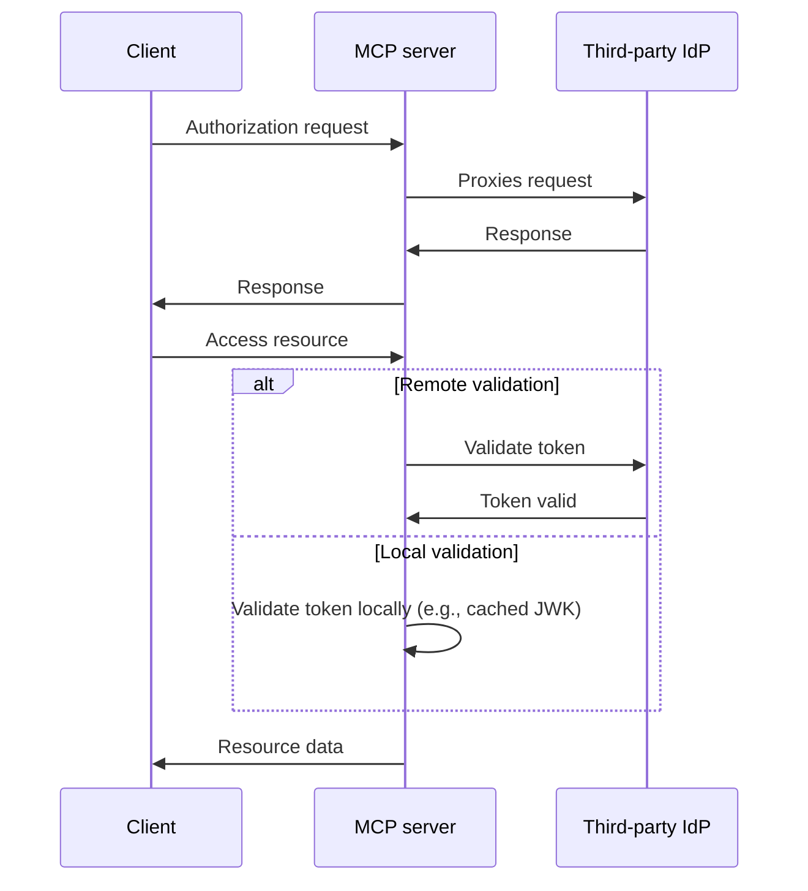
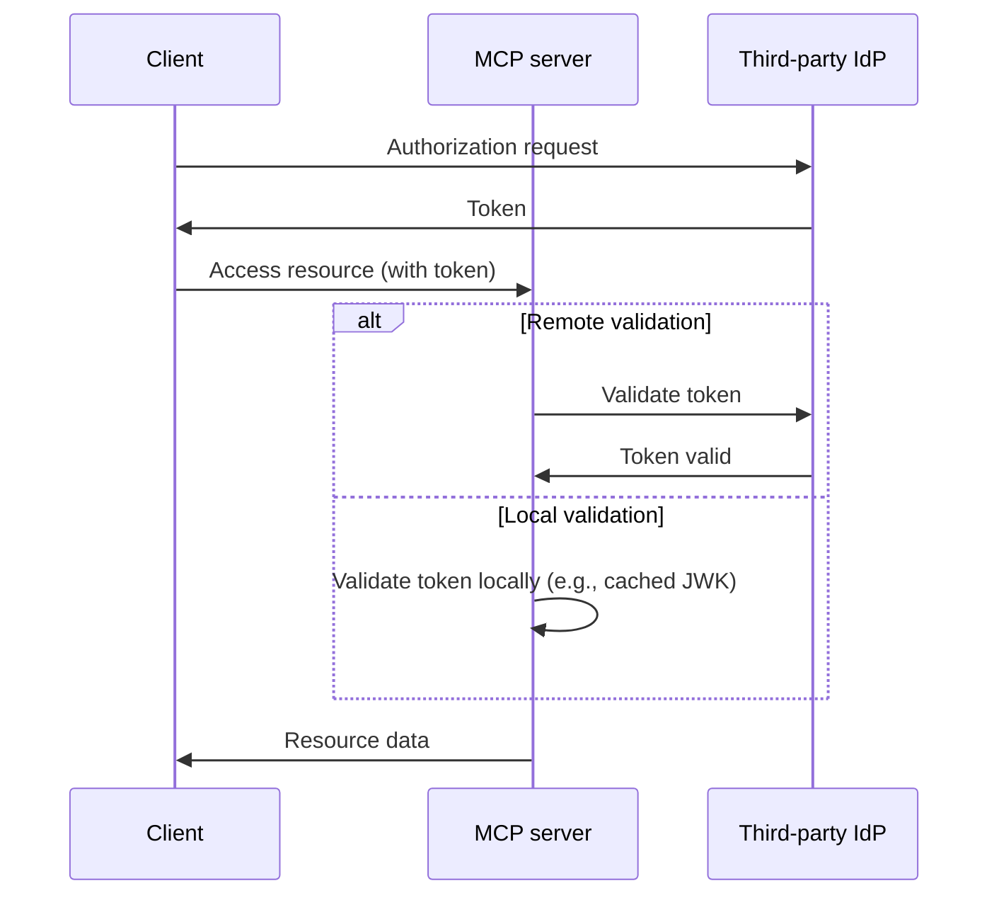

# Choosing between MCP Auth and other solutions

The MCP ecosystem is evolving. As the Model Context Protocol (MCP) specification moves from the “authorization server” approach to the new “resource server + third-party IdP” model, it’s important to understand how different integration solutions fit, both now and in the future.

This page outlines the main differences between mcp-auth and other popular solutions, to help you choose the best approach for your project.

## Background: Proxy approach vs. IdP integration

Most existing MCP auth solutions use a “proxy approach.” In this model, the MCP server proxies authorization requests to a third-party Identity Provider (IdP), effectively acting as a middleman between the client and the IdP.

**Proxy approach ([03-26 spec](https://modelcontextprotocol.io/specification/2025-03-26/basic/authorization))**

While this works with the current (2025-03-26) MCP spec, it’s essentially a workaround. It assumes the MCP server will also act as an authorization server, which is not the direction of the latest draft spec.

**MCP Auth / future spec (resource server + third-party IdP)**

The upcoming MCP spec [shifts responsibility for authorization to a dedicated third-party IdP](https://github.com/modelcontextprotocol/modelcontextprotocol/issues/205). In this model, the MCP server only serves as a resource server, and all authorization endpoints come directly from the third-party IdP.

## Why choose MCP Auth?

- Spec alignment: MCP Auth directly follows the direction of the latest draft, making it the only solution compatible with both the 03-26 spec and the upcoming spec.
- No more workarounds: Instead of acting as an authorization server proxy, MCP Auth lets the third-party IdP handle all authorization, as intended in the new spec.
- Provider-agnostic: MCP Auth works with any standards-compliant OAuth 2.0 / OIDC provider.
- Smooth transition: MCP Auth returns all third-party endpoints as-is via OAuth 2.0 Authorization Server Metadata. This keeps integration simple now, and ready for future changes.
- Developer experience: Offers tutorials, utilities, and upcoming features like [OAuth 2.0 Protected Resource Metadata](https://auth.wiki/protected-resource-metadata) to make life easier for MCP server developers.

| Feature                            | Proxy solutions      | MCP Auth |
| ---------------------------------- | -------------------- | -------- |
| Works with 03-26 spec              | ✅                   | ✅       |
| Works with future spec             | ❌                   | ✅       |
| Supports third-party IdPs directly | ❌ (workaround only) | ✅       |
| Provider-agnostic                  | Limited[^1]          | Yes      |
| Transition-ready                   | ❌                   | ✅       |

If you need to support third-party IdPs now and want to be ready for the upcoming spec, MCP Auth is the recommended solution. Proxy-based approaches may soon be deprecated or require significant rework.

[^1]: Some proxy solutions may hardcode specific parameters or endpoints, limiting flexibility.
