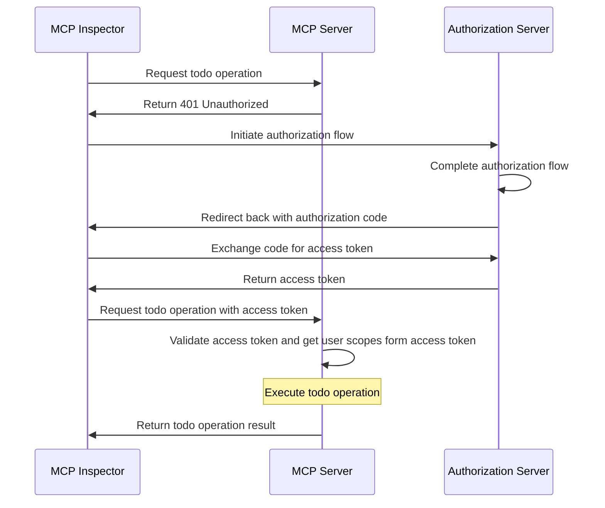
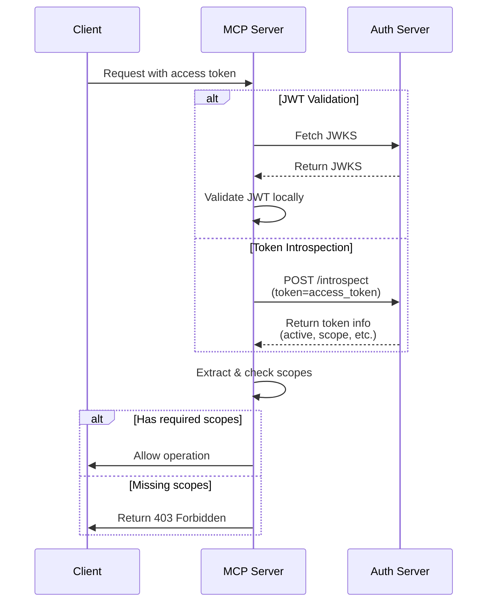

import TabItem from '@theme/TabItem';
import Tabs from '@theme/Tabs';

import SetupOauthOrOidc from './_setup-oauth-or-oidc.mdx';
import SetupOidc from './_setup-oidc.mdx';

# Tutorial: Build a todo manager

In this tutorial, we will build a todo manager MCP server with user authentication and authorization.

After completing this tutorial, you will have:

- ✅ A basic understanding of how to set up role-based access control (RBAC) in your MCP server.
- ✅ A MCP server that can manage personal todo lists.

:::note
Before you start, we strongly recommend you to go through the [Who am I tutorial](./whoami) first if you are not familiar with MCP server and OAuth 2.
:::

## Overview \{#overview}

The tutorial will involve the following components:

- **MCP server**: A simple MCP server that uses MCP official SDKs to handle requests, with an integrated Todo service for managing user's todo items.
- **MCP inspector**: A visual testing tool for MCP servers. It also acts as an OAuth / OIDC client to initiate the authorization flow and retrieve access tokens.
- **Authorization server**: An OAuth 2.1 or OpenID Connect provider that manages user identities and issues access tokens.

Here's a high-level diagram of the interaction between these components:



## Understand your authorization server \{#understand-your-authorization-server}

### Access tokens with scopes \{#access-tokens-with-scopes}

To implement [role-based access control (RBAC)](https://auth.wiki/rbac) in your MCP server, your authorization server needs to support issuing access tokens with scopes. Scopes represent the permissions that a user has been granted.

<Tabs groupId="provider">
<TabItem value="logto" label="Logto">

[Logto](https://logto.io) provides RBAC support through its API resources (conforming [RFC 8707: Resource Indicators for OAuth 2.0](https://datatracker.ietf.org/doc/html/rfc8707)) and roles features. Here's how to set it up:

1. Sign in to [Logto Console](https://cloud.logto.io) (or your self-hosted Logto Console)

2. Create API resource and scopes:

   - Go to "API Resources"
   - Create a new API resource named "Todo Manager"
   - Add the following scopes:
     - `create:todos`: "Create new todo items"
     - `read:todos`: "Read all todo items"
     - `delete:todos`: "Delete any todo item"

3. Create roles (recommended for easier management):

   - Go to "Roles"
   - Create an "Admin" role and assign all scopes (`create:todos`, `read:todos`, `delete:todos`)
   - Create a "User" role and assign only the `create:todos` scope

4. Assign permissions:
   - Go to "Users"
   - Select a user
   - You can either:
     - Assign roles in the "Roles" tab (recommended)
     - Or directly assign scopes in the "Permissions" tab

The scopes will be included in the JWT access token's `scope` claim as a space-separated string.

</TabItem>
<TabItem value="oauth-oidc" label="OAuth 2.0 / OIDC">

OAuth 2.0 / OIDC providers typically support scope-based access control. When implementing RBAC:

1. Define your required scopes in your authorization server
2. Configure your client to request these scopes during the authorization flow
3. Ensure your authorization server includes the granted scopes in the access token
4. The scopes are usually included in the JWT access token's `scope` claim

Check your provider's documentation for specific details on:

- How to define and manage scopes
- How scopes are included in the access token
- Any additional RBAC features like role management

</TabItem>
</Tabs>

### Validating tokens and checking permissions \{#validating-tokens-and-checking-permissions}

When your MCP server receives a request, it needs to:

1. Validate the access token's signature and expiration
2. Extract the scopes from the validated token
3. Check if the token has the required scopes for the requested operation

For example, if a user wants to create a new todo item, their access token must include the `create:todos` scope. Here's how the flow works:



### Dynamic Client Registration \{#dynamic-client-registration}

Dynamic Client Registration is not required for this tutorial, but it can be useful if you want to automate the MCP client registration process with your authorization server. Check [Is Dynamic Client Registration required?](../../provider-list.mdx#is-dcr-required) for more details.

## Understand RBAC in todo manager \{#understand-rbac-in-todo-manager}

For demonstration purposes, we'll implement a simple role-based access control (RBAC) system in our todo manager MCP server. This will show you the basic principles of RBAC while keeping the implementation straightforward.

:::note
While this tutorial demonstrates RBAC-based scope management, it's important to note that not all authentication providers implement scope management through roles. Some providers may have their own unique implementations and mechanisms for managing access control and permissions.
:::

### Tools and scopes \{#tools-and-scopes}

Our todo manager MCP server provides three main tools:

- `create-todo`: Create a new todo item
- `get-todos`: List all todos
- `delete-todo`: Delete a todo by ID

To control access to these tools, we define the following scopes:

- `create:todos`: Allows creating new todo items
- `delete:todos`: Allows deleting existing todo items
- `read:todos`: Allows querying and retrieving the list of all todo items

### Roles and permissions \{#roles-and-permissions}

We'll define two roles with different levels of access:

| Role  | create:todos | read:todos | delete:todos |
| ----- | ------------ | ---------- | ------------ |
| Admin | ✅           | ✅         | ✅           |
| User  | ✅           |            |              |

- **User**: A regular user who can create todo items and view or delete only their own todos
- **Admin**: An administrator who can create, view, and delete all todo items, regardless of ownership

### Resource ownership \{#resource-ownership}

While the permission table above shows the explicit scopes assigned to each role, there's an important principle of resource ownership to consider:

- **Users** don't have the `read:todos` or `delete:todos` scopes, but they can still:
  - Read their own todo items
  - Delete their own todo items
- **Admins** have full permissions (`read:todos` and `delete:todos`), allowing them to:
  - View all todo items in the system
  - Delete any todo item, regardless of ownership

This demonstrates a common pattern in RBAC systems where resource ownership grants implicit permissions to users for their own resources, while administrative roles receive explicit permissions for all resources.

:::tip Learn More
To dive deeper into RBAC concepts and best practices, check out [Mastering RBAC: A Comprehensive Real-World Example](https://blog.logto.io/mastering-rbac).
:::

## Configure authorization in your provider \{#configure-authorization-in-your-provider}

To implement the access control system we described earlier, you'll need to configure your authorization server to support the required scopes. Here's how to do it with different providers:

<Tabs groupId="provider">
<TabItem value="logto" label="Logto">

[Logto](https://logto.io) provides RBAC support through its API resources and roles features. Here's how to set it up:

1. Sign in to [Logto Console](https://cloud.logto.io) (or your self-hosted Logto Console)

2. Create API resource and scopes:

   - Go to "API Resources"
   - Create a new API resource named "Todo Manager" and using `https://todo.mcp-server.app` (demo purpose) as the indicator.
   - Create the following scopes:
     - `create:todos`: "Create new todo items"
     - `read:todos`: "Read all todo items"
     - `delete:todos`: "Delete any todo item"

3. Create roles (recommended for easier management):

   - Go to "Roles"
   - Create an "Admin" role and assign all scopes (`create:todos`, `read:todos`, `delete:todos`)
   - Create a "User" role and assign only the `create:todos` scope
   - In the "User" role's details page, switch to the "General" tab, and set the "User" role as the "Default role".

4. Manage user roles and permissions:
   - For new users:
     - They will automatically get the "User" role since we set it as the default role
   - For existing users:
     - Go to "User management"
     - Select a user
     - Assign roles for the user in the "Roles" tab

:::tip Programmatic Role Management
You can also use Logto's [Management API](https://docs.logto.io/integrate-logto/interact-with-management-api) to programmatically manage user roles. This is particularly useful for automated user management or when building admin panels.
:::

When requesting an access token, Logto will include scopes in the token's `scope` claim based on the user's role permissions.

</TabItem>
<TabItem value="keycloak" label="Keycloak">

In [Keycloak](https://www.keycloak.org), you can set up the required permissions using client scopes:

1. Create client scopes:

   - In your realm, go to "Client scopes"
   - Create three new client scopes:
     - `create:todos`
     - `read:todos`
     - `delete:todos`

2. Configure the client:

   - Go to your client settings
   - In the "Client scopes" tab, add all the scopes you created
   - Make sure the token mapper is configured to include scopes

3. Optional: Use roles for easier management
   - If you prefer role-based management:
     - Create realm roles for different access levels
     - Map scopes to roles
     - Assign roles to users
   - Otherwise, you can directly assign scopes to users or through client-level permissions

Keycloak will include the granted scopes in the access token's `scope` claim.

</TabItem>
<TabItem value="asgardeo" label="Asgardeo">

[Asgardeo](https://wso2.com/asgardeo)  supports Role-Based Access Control (RBAC) and fine-grained authorization using API resources and scopes. Here's how to configure it:

1. Sign in to the [Asgardeo Console](https://console.asgardeo.io)

2. Define your API resource and scopes:
    - Go to **API Resources**
    - Click **"New API Resource"**
    - Set the **Identifier** to `https://todo.mcp-server.app` (or your desired URL)
    - Let the Display Name be `Todo Manager`
    - Add the following scopes:
        - `create:todos` : "Create new todo items"
        - `read:todos` : "Read all todo items"
        - `delete:todos` : "Delete any todo item"
    - Create the resource

3. Create roles:
    - Use the **User Management > Roles** to create roles and assign scopes directly.
    - Click **New Role**
    - Provide the role name (e.g., `Admin` or `User`) in **Basic Details** section
    - Let the role audience be `Application` and select the `MCP Inspector Application` as the **Assigned Application**
    - In **Permission Selection** section, choose the API resource you created earlier (e.g., `Todo Manager`)
    - Select the scopes you want to assign to this role (e.g., `create:todos`, `read:todos`, `delete:todos`)
    - Click **Finish** to create the role

    If you have already created the application
    - Navigate to **Application > MCP Inspector Application > Roles tab**
    - Select **Application Role** as the audience type, then click **New Role**
    - Create an `Admin` role and attach all three scopes
    - Create a `User` role and attach only the `create:todos` scope

4. Assign roles to users:
    - Go to **User Management > Roles**
    - Select the role you created (e.g., `Admin` or `User`) and move to **Users** tab
    - Select **Assign User** and choose the users you want to assign this role to and save.

5. Update the Auth configuration
    - Go to **MCP Inspector Application > OAuth Configurations**
    - Enter the value {"scope": "openid profile create:todos read:todos delete:todos"} in the Auth Params field.

The scopes will be included in the JWT access token's `scope` claim as a space-separated string.
After configuring your authorization server, users will receive access tokens containing their granted scopes. The MCP server will use these scopes to determine:

Whether a user can create new todos (create:todos)
Whether a user can view all todos (read:todos) or only their own
Whether a user can delete any todo (delete:todos) or only their own

For more details on configuring Asgardeo, refer to the following resources:
- [API Resources Guide](https://wso2.com/asgardeo/docs/guides/authorization/api-authorization)
- [Role Management](https://wso2.com/asgardeo/docs/guides/users/manage-roles)
</TabItem>
<TabItem value="oauth-or-oidc" label="OAuth 2 / OIDC">

For OAuth 2.0 or OpenID Connect providers, you'll need to configure the scopes that represent different permissions. The exact steps will depend on your provider, but generally:

1. Define scopes:

   - Configure your authorization server to support:
     - `create:todos`
     - `read:todos`
     - `delete:todos`

2. Configure client:

   - Register or update your client to request these scopes
   - Ensure the scopes are included in the access token

3. Assign permissions:
   - Use your provider's interface to grant appropriate scopes to users
   - Some providers may support role-based management, while others might use direct scope assignments
   - Check your provider's documentation for the recommended approach

:::tip
Most providers will include the granted scopes in the access token's `scope` claim. The format is typically a space-separated string of scope values.
:::

</TabItem>
</Tabs>

After configuring your authorization server, users will receive access tokens containing their granted scopes. The MCP server will use these scopes to determine:

- Whether a user can create new todos (`create:todos`)
- Whether a user can view all todos (`read:todos`) or only their own
- Whether a user can delete any todo (`delete:todos`) or only their own

## Set up the MCP server \{#set-up-the-mcp-server}

We will use the [MCP official SDKs](https://github.com/modelcontextprotocol) to create our todo manager MCP server.

### Create a new project \{#create-a-new-project}

<Tabs groupId="sdk">
<TabItem value="python" label="Python">

```bash
mkdir mcp-server
cd mcp-server
uv init # Or use `pipenv` or `poetry` to create a new virtual environment
```

</TabItem>
<TabItem value="node" label="Node.js">

Set up a new Node.js project:

```bash
mkdir mcp-server
cd mcp-server
npm init -y # Or use `pnpm init`
npm pkg set type="module"
npm pkg set main="todo-manager.ts"
npm pkg set scripts.start="node --experimental-strip-types todo-manager.ts"
```

:::note
We're using TypeScript in our examples as Node.js v22.6.0+ supports running TypeScript natively using the `--experimental-strip-types` flag. If you're using JavaScript, the code will be similar - just ensure you're using Node.js v22.6.0 or later. See Node.js docs for details.
:::

</TabItem>
</Tabs>

### Install the MCP SDK and dependencies \{#install-the-mcp-sdk-and-dependencies}

<Tabs groupId="sdk">
<TabItem value="python" label="Python">

```bash
pip install "mcp[cli]" starlette uvicorn
```

Or any other package manager you prefer, such as `uv` or `poetry`.

</TabItem>
<TabItem value="node" label="Node.js">

```bash
npm install @modelcontextprotocol/sdk express zod
```

Or any other package manager you prefer, such as `pnpm` or `yarn`.

</TabItem>
</Tabs>

### Create the MCP server \{#create-the-mcp-server}

First, let's create a basic MCP server with the tool definitions:

<Tabs groupId="sdk">
<TabItem value="python" label="Python">

Create a file named `todo-manager.py` and add the following code:

```python
from typing import Any
from mcp.server.fastmcp import FastMCP
from starlette.applications import Starlette
from starlette.routing import Mount

mcp = FastMCP("Todo Manager")

@mcp.tool()
def create_todo(content: str) -> dict[str, Any]:
    """Create a new todo."""
    return {"error": "Not implemented"}

@mcp.tool()
def get_todos() -> dict[str, Any]:
    """List all todos."""
    return {"error": "Not implemented"}

@mcp.tool()
def delete_todo(id: str) -> dict[str, Any]:
    """Delete a todo by id."""
    return {"error": "Not implemented"}

app = Starlette(
    routes=[Mount('/', app=mcp.sse_app())]
)
```

Run the server with:

```bash
uvicorn todo_manager:app --host 0.0.0.0 --port 3001
```

</TabItem>
<TabItem value="node" label="Node.js">

:::note
Since the current MCP inspector implementation does not handle authorization flows, we will use the SSE approach to set up the MCP server. We'll update the code here once the MCP inspector supports authorization flows.
:::

You can also use `pnpm` or `yarn` if you prefer.

Create a file named `todo-manager.ts` and add the following code:

```ts
// todo-manager.ts

import { z } from 'zod';
import { McpServer } from '@modelcontextprotocol/sdk/server/mcp.js';
import { SSEServerTransport } from '@modelcontextprotocol/sdk/server/sse.js';
import express from 'express';

// Create an MCP server
const server = new McpServer({
  name: 'Todo Manager',
  version: '0.0.0',
});

server.tool('create-todo', 'Create a new todo', { content: z.string() }, async ({ content }) => {
  return {
    content: [{ type: 'text', text: JSON.stringify({ error: 'Not implemented' }) }],
  };
});

server.tool('get-todos', 'List all todos', async () => {
  return {
    content: [{ type: 'text', text: JSON.stringify({ error: 'Not implemented' }) }],
  };
});

server.tool('delete-todo', 'Delete a todo by id', { id: z.string() }, async ({ id }) => {
  return {
    content: [{ type: 'text', text: JSON.stringify({ error: 'Not implemented' }) }],
  };
});

// Below is the boilerplate code from MCP SDK documentation
const PORT = 3001;
const app = express();

const transports = {};

app.get('/sse', async (_req, res) => {
  const transport = new SSEServerTransport('/messages', res);
  transports[transport.sessionId] = transport;

  res.on('close', () => {
    delete transports[transport.sessionId];
  });

  await server.connect(transport);
});

app.post('/messages', async (req, res) => {
  const sessionId = String(req.query.sessionId);
  const transport = transports[sessionId];
  if (transport) {
    await transport.handlePostMessage(req, res, req.body);
  } else {
    res.status(400).send('No transport found for sessionId');
  }
});

app.listen(PORT);
```

Run the server with:

```bash
npm start
```

</TabItem>
</Tabs>

## Inspect the MCP server \{#inspect-the-mcp-server}

### Clone and run MCP inspector \{#clone-and-run-mcp-inspector}

Now that we have the MCP server running, we can use the MCP inspector to see if the `whoami` tool is available.

Due to the limit of the current implementation, we've forked the [MCP inspector](https://github.com/mcp-auth/inspector) to make it more flexible and scalable for authentication and authorization. We've also submitted a pull request to the original repository to include our changes.

To run the MCP inspector, you can use the following command (Node.js is required):

```bash
git clone https://github.com/mcp-auth/inspector.git
cd inspector
npm install
npm run dev
```

Then, open your browser and navigate to `http://localhost:6274/` (or other URL shown in the terminal) to access the MCP inspector.

### Connect MCP inspector to the MCP server \{#connect-mcp-inspector-to-the-mcp-server}

Before we proceed, check the following configuration in MCP inspector:

- **Transport Type**: Set to `SSE`.
- **URL**: Set to the URL of your MCP server. In our case, it should be `http://localhost:3001/sse`.

Now you can click the "Connect" button to see if the MCP inspector can connect to the MCP server. If everything is okay, you should see the "Connected" status in the MCP inspector.

### Checkpoint: Run todo manager tools \{#checkpoint-run-todo-manager-tools}

1. In the top menu of the MCP inspector, click on the "Tools" tab.
2. Click on the "List Tools" button.
3. You should see the `create-todo`, `get-todos`, and `delete-todo` tools listed on the page. Click on it to open the tool details.
4. You should see the "Run Tool" button in the right side. Click on it and enter required parameters to run the tool.
5. You should see the tool result with the JSON response `{"error": "Not implemented"}`.


## Integrate with your authorization server \{#integrate-with-your-authorization-server}

To complete this section, there are several considerations to take into account:

<details>
<summary>**The issuer URL of your authorization server**</summary>

This is usually the base URL of your authorization server, such as `https://auth.example.com`. Some providers may have a path like `https://example.logto.app/oidc`, so make sure to check your provider's documentation.

</details>

<details>
<summary>**How to retrieve the authorization server metadata**</summary>

- If your authorization server conforms to the [OAuth 2.0 Authorization Server Metadata](https://datatracker.ietf.org/doc/html/rfc8414) or [OpenID Connect Discovery](https://openid.net/specs/openid-connect-discovery-1_0.html), you can use the MCP Auth built-in utilities to fetch the metadata automatically.
- If your authorization server does not conform to these standards, you will need to manually specify the metadata URL or endpoints in the MCP server configuration. Check your provider's documentation for the specific endpoints.

</details>

<details>
<summary>**How to register the MCP inspector as a client in your authorization server**</summary>

- If your authorization server supports [Dynamic Client Registration](https://datatracker.ietf.org/doc/html/rfc7591), you can skip this step as the MCP inspector will automatically register itself as a client.
- If your authorization server does not support Dynamic Client Registration, you will need to manually register the MCP inspector as a client in your authorization server.

</details>

<details>
<summary>**Understand token request parameters**</summary>

When requesting access tokens from different authorization servers, you'll encounter various approaches for specifying the target resource and permissions. Here are the main patterns:

- **Resource indicator based**:

  - Uses the `resource` parameter to specify the target API (see [RFC 8707: Resource Indicators for OAuth 2.0](https://datatracker.ietf.org/doc/html/rfc8707))
  - Common in modern OAuth 2.0 implementations
  - Example request:
    ```json
    {
      "resource": "https://todo.mcp-server.app",
      "scope": "create:todos read:todos"
    }
    ```
  - The server issues tokens specifically bound to the requested resource

- **Audience based**:

  - Uses the `audience` parameter to specify the intended token recipient
  - Similar to resource indicators but with different semantics
  - Example request:
    ```json
    {
      "audience": "todo-api",
      "scope": "create:todos read:todos"
    }
    ```

- **Pure scope based**:
  - Relies solely on scopes without resource/audience parameters
  - Traditional OAuth 2.0 approach
  - Example request:
    ```json
    {
      "scope": "todo-api:create todo-api:read openid profile"
    }
    ```
  - Often uses prefixed scopes to namespace permissions
  - Common in simpler OAuth 2.0 implementations

:::tip Best Practices

- Check your provider's documentation for supported parameters
- Some providers support multiple approaches simultaneously
- Resource indicators provide better security through audience restriction
- Consider using resource indicators when available for better access control
  :::

</details>

While each provider may have its own specific requirements, the following steps will guide you through the process of integrating the MCP inspector and MCP server with provider-specific configurations.

### Register MCP inspector as a client \{#register-mcp-inspector-as-a-client}

<Tabs groupId="provider">
<TabItem value="logto" label="Logto">

Integrating the todo manager with [Logto](https://logto.io) is straightforward as it's an OpenID Connect provider that supports resource indicators and scopes, allowing you to secure your todo API with `https://todo.mcp-server.app` as the resource indicator.

Since Logto does not support Dynamic Client Registration yet, you will need to manually register the MCP inspector as a client in your Logto tenant:

1. Open your MCP inspector, click on the "OAuth Configuration" button. Copy the **Redirect URL (auto-populated)** value, which should be something like `http://localhost:6274/oauth/callback`.
2. Sign in to [Logto Console](https://cloud.logto.io) (or your self-hosted Logto Console).
3. Navigate to the "Applications" tab, click on "Create application". In the bottom of the page, click on "Create app without framework".
4. Fill in the application details, then click on "Create application":
   - **Select an application type**: Choose "Single-page application".
   - **Application name**: Enter a name for your application, e.g., "MCP Inspector".
5. In the "Settings / Redirect URIs" section, paste the **Redirect URL (auto-populated)** value you copied from the MCP inspector. Then click on "Save changes" in the bottom bar.
6. In the top card, you will see the "App ID" value. Copy it.
7. Go back to the MCP inspector and paste the "App ID" value in the "OAuth Configuration" section under "Client ID".
8. Enter the value `{"scope": "create:todos read:todos delete:todos", "resource": "https://todo.mcp-server.app"}` in the "Auth Params" field. This will ensure that the access token returned by Logto contains the necessary scopes to access the todo manager.

</TabItem>
<TabItem value="oauth-oidc" label="OAuth 2.0 / OIDC">

:::note
This is a generic OAuth 2.0 / OpenID Connect provider integration guide. Both OAuth 2.0 and OIDC follow similar steps as OIDC is built on top of OAuth 2.0. Check your provider's documentation for specific details.
:::

If your provider supports Dynamic Client Registration, you can directly go to step 8 below to configure the MCP inspector; otherwise, you will need to manually register the MCP inspector as a client:

1. Open your MCP inspector, click on the "OAuth Configuration" button. Copy the **Redirect URL (auto-populated)** value, which should be something like `http://localhost:6274/oauth/callback`.

2. Sign in to your provider's console.

3. Navigate to the "Applications" or "Clients" section, then create a new application or client.

4. If your provider requires a client type, select "Single-page application" or "Public client".

5. After creating the application, you will need to configure the redirect URI. Paste the **Redirect URL (auto-populated)** value you copied from the MCP inspector.

6. Find the "Client ID" or "Application ID" of the newly created application and copy it.

7. Go back to the MCP inspector and paste the "Client ID" value in the "OAuth Configuration" section under "Client ID".

8. Enter the following value in the "Auth Params" field to request the necessary scopes for todo operations:

```json
{ "scope": "create:todos read:todos delete:todos" }
```

</TabItem>
</Tabs>

### Set up MCP auth \{#set-up-mcp-auth}

In your MCP server project, you need to install the MCP Auth SDK and configure it to use your authorization server metadata.

<Tabs groupId="sdk">
<TabItem value="python" label="Python">

First, install the `mcpauth` package:

```bash
pip install mcpauth
```

Or any other package manager you prefer, such as `uv` or `poetry`.

</TabItem>
<TabItem value="node" label="Node.js">

First, install the `mcp-auth` package:

```bash
npm install mcp-auth
```

</TabItem>
</Tabs>

MCP Auth requires the authorization server metadata to be able to initialize. Depending on your provider:

<Tabs groupId="provider">

<TabItem value="logto" label="Logto">

The issuer URL can be found in your application details page in Logto Console, in the "Endpoints & Credentials / Issuer endpoint" section. It should look like `https://my-project.logto.app/oidc`.

<SetupOidc />

</TabItem>

<TabItem value="oauth-oidc" label="OAuth 2.0 / OIDC">

For OAuth 2.0 providers, you'll need to:

1. Check your provider's documentation for the authorization server URL (often called issuer URL or base URL)
2. Some providers may expose this at `https://{your-domain}/.well-known/oauth-authorization-server`
3. Look in your provider's admin console under OAuth/API settings

<SetupOauthOrOidc />

</TabItem>

</Tabs>

<Tabs groupId="sdk">

<TabItem value="python" label="Python">

Update the `todo-manager.py` to include the MCP Auth configuration:

```python
from mcpauth import MCPAuth
from mcpauth.config import AuthServerType
from mcpauth.utils import fetch_server_config

auth_issuer = '<issuer-endpoint>'  # Replace with your issuer endpoint
auth_server_config = fetch_server_config(auth_issuer, type=AuthServerType.OIDC)
mcp_auth = MCPAuth(server=auth_server_config)
```

</TabItem>
<TabItem value="node" label="Node.js">

Update the `todo-manager.ts` to include the MCP Auth configuration:

```ts
// todo-manager.ts

import { MCPAuth, fetchServerConfig } from 'mcp-auth';

const authIssuer = '<issuer-endpoint>'; // Replace with your issuer endpoint
const mcpAuth = new MCPAuth({
  server: await fetchServerConfig(authIssuer, { type: 'oidc' }),
});
```

</TabItem>
</Tabs>

### Update MCP server \{#update-mcp-server}

We are almost done! It's time to update the MCP server to apply the MCP Auth route and middleware function, then implement the permission-based access control for the todo manager tools based on the user's scopes.

<Tabs groupId="sdk">
<TabItem value="python" label="Python">

```python
@mcp.tool()
def create_todo(content: str) -> dict[str, Any]:
    """Create a new todo."""
    return (
        mcp_auth.auth_info.scopes
        if mcp_auth.auth_info # This will be populated by the Bearer auth middleware
        else {"error": "Not authenticated"}
    )

# ...

bearer_auth = Middleware(mcp_auth.bearer_auth_middleware("jwt"))
app = Starlette(
    routes=[
        # Add the metadata route (`/.well-known/oauth-authorization-server`)
        mcp_auth.metadata_route(),
        # Protect the MCP server with the Bearer auth middleware
        Mount('/', app=mcp.sse_app(), middleware=[bearer_auth]),
    ],
)
```

</TabItem>
<TabItem value="node" label="Node.js">

```js
server.tool(
  'create-todo',
  'Create a new todo',
  { content: z.string() },
  async ({ content, authInfo }) => {
    return {
      content: [
        { type: 'text', text: JSON.stringify(authInfo?.scopes ?? { error: 'Not authenticated' }) },
      ],
    };
  }
);

// ...

app.use(mcpAuth.delegatedRouter());
app.use(mcpAuth.bearerAuth('jwt'));
```

</TabItem>
</Tabs>

Next, let's implement the specific tools.

First, let's create a simple todo service to provide basic CRUD operations for managing todo items in memory.

<Tabs groupId="sdk">
<TabItem value="python" label="Python">
```python
# service.py

"""
A simple Todo service for demonstration purposes.
Uses an in-memory list to store todos.
"""

from datetime import datetime
from typing import List, Optional, Dict, Any
import random
import string

class Todo:
"""Represents a todo item."""

    def __init__(self, id: str, content: str, owner_id: str, created_at: str):
        self.id = id
        self.content = content
        self.owner_id = owner_id
        self.created_at = created_at

    def to_dict(self) -> Dict[str, Any]:
        """Convert todo to dictionary for JSON serialization."""
        return {
            "id": self.id,
            "content": self.content,
            "ownerId": self.owner_id,
            "createdAt": self.created_at
        }

class TodoService:
"""A simple Todo service for demonstration purposes."""

    def __init__(self):
        self._todos: List[Todo] = []

    def get_all_todos(self, owner_id: Optional[str] = None) -> List[Dict[str, Any]]:
        """
        Get all todos, optionally filtered by owner_id.

        Args:
            owner_id: If provided, only return todos owned by this user

        Returns:
            List of todo dictionaries
        """
        if owner_id:
            filtered_todos = [todo for todo in self._todos if todo.owner_id == owner_id]
            return [todo.to_dict() for todo in filtered_todos]
        return [todo.to_dict() for todo in self._todos]

    def get_todo_by_id(self, todo_id: str) -> Optional[Todo]:
        """
        Get a todo by its ID.

        Args:
            todo_id: The ID of the todo to retrieve

        Returns:
            Todo object if found, None otherwise
        """
        for todo in self._todos:
            if todo.id == todo_id:
                return todo
        return None

    def create_todo(self, content: str, owner_id: str) -> Dict[str, Any]:
        """
        Create a new todo.

        Args:
            content: The content of the todo
            owner_id: The ID of the user who owns this todo

        Returns:
            Dictionary representation of the created todo
        """
        todo = Todo(
            id=self._generate_id(),
            content=content,
            owner_id=owner_id,
            created_at=datetime.now().isoformat()
        )
        self._todos.append(todo)
        return todo.to_dict()

    def delete_todo(self, todo_id: str) -> Optional[Dict[str, Any]]:
        """
        Delete a todo by its ID.

        Args:
            todo_id: The ID of the todo to delete

        Returns:
            Dictionary representation of the deleted todo if found, None otherwise
        """
        for i, todo in enumerate(self._todos):
            if todo.id == todo_id:
                deleted_todo = self._todos.pop(i)
                return deleted_todo.to_dict()
        return None

    def _generate_id(self) -> str:
        """Generate a random ID for a todo."""
        return ''.join(random.choices(string.ascii_lowercase + string.digits, k=8))

````


</TabItem>
<TabItem value="node" label="Node.js">

```ts
// todo-service.ts

type Todo = {
  id: string;
  content: string;
  ownerId: string;
  createdAt: string;
};

/**
 * A simple Todo service for demonstration purposes.
 * Use an in-memory array to store todos
 */
export class TodoService {
  private readonly todos: Todo[] = [];

  getAllTodos(ownerId?: string): Todo[] {
    if (ownerId) {
      return this.todos.filter((todo) => todo.ownerId === ownerId);
    }
    return this.todos;
  }

  getTodoById(id: string): Todo | undefined {
    return this.todos.find((todo) => todo.id === id);
  }

  createTodo({ content, ownerId }: { content: string; ownerId: string }): Todo {
    const todo: Todo = {
      id: this.genId(),
      content,
      ownerId,
      createdAt: new Date().toISOString(),
    };

    // eslint-disable-next-line @silverhand/fp/no-mutating-methods
    this.todos.push(todo);
    return todo;
  }

  deleteTodo(id: string): Todo | undefined {
    const index = this.todos.findIndex((todo) => todo.id === id);

    if (index === -1) {
      return undefined;
    }

    // eslint-disable-next-line @silverhand/fp/no-mutating-methods
    const [deleted] = this.todos.splice(index, 1);
    return deleted;
  }

  private genId(): string {
    return Math.random().toString(36).slice(2, 10);
  }
}
````

</TabItem>
</Tabs>

then in the tools layer, we'll determine whether operations are allowed based on the user's scopes:

<Tabs groupId="sdk">
<TabItem value="python" label="Python">

```python
# todo-manager.py

from typing import Any, Optional
from mcpauth.errors import MCPAuthBearerAuthError

def assert_user_id(auth_info: Optional[dict]) -> str:
    """Extract and validate user ID from auth info."""
    subject = auth_info.get('subject') if auth_info else None
    if not subject:
        raise ValueError('Invalid auth info')
    return subject

def has_required_scopes(user_scopes: list[str], required_scopes: list[str]) -> bool:
    """Check if user has all required scopes."""
    return all(scope in user_scopes for scope in required_scopes)

# Create an instance of TodoService
todo_service = TodoService()

@mcp.tool()
def create_todo(content: str) -> dict[str, Any]:
    """Create a new todo.

    Only users with 'create:todos' scope can create todos.
    """
    # Get authentication info
    auth_info = mcp_auth.auth_info

    # Validate user ID
    try:
        user_id = assert_user_id(auth_info)
    except ValueError as e:
        return {"error": str(e)}

    # Check if user has the required permissions
    if not has_required_scopes(auth_info.scopes if auth_info else [], ['create:todos']):
        raise MCPAuthBearerAuthError('missing_required_scopes')

    # Create new todo
    created_todo = todo_service.create_todo(content=content, owner_id=user_id)

    # Return the created todo
    return created_todo.__dict__

# ...
```

You can check our [sample code](https://github.com/mcp-auth/python/tree/master/samples/server) for all other detailed implementations.

</TabItem>
<TabItem value="node" label="Node.js">

```ts
// todo-manager.ts

// ... other imports
import assert from 'node:assert';
import { type AuthInfo } from '@modelcontextprotocol/sdk/server/auth/types.js';
import { TodoService } from './todo-service.js';

const todoService = new TodoService();

const assertUserId = (authInfo?: AuthInfo) => {
  const { subject } = authInfo ?? {};
  assert(subject, 'Invalid auth info');
  return subject;
};

/**
 * Check if user has all the required scopes for an operation
 */
const hasRequiredScopes = (userScopes: string[], requiredScopes: string[]): boolean => {
  return requiredScopes.every((scope) => userScopes.includes(scope));
};

server.tool(
  'create-todo',
  'Create a new todo',
  { content: z.string() },
  ({ content }: { content: string }, { authInfo }) => {
    const userId = assertUserId(authInfo);

    /**
     * Only users with 'create:todos' scope can create todos
     */
    if (!hasRequiredScopes(authInfo?.scopes ?? [], ['create:todos'])) {
      throw new MCPAuthBearerAuthError('missing_required_scopes');
    }

    const createdTodo = todoService.createTodo({ content, ownerId: userId });

    return {
      content: [{ type: 'text', text: JSON.stringify(createdTodo) }],
    };
  }
);

// ...
```

You can check our [sample code](https://github.com/mcp-auth/js/tree/master/packages/sample-servers/src/todo-manager) for all other detailed implementations.

</TabItem>
</Tabs>

## Checkpoint: Run the `todo-manager` tools \{#checkpoint-run-the-todo-manager-tools}

Restart your MCP server and open the MCP inspector in your browser. When you click the "Connect" button, you should be redirected to your authorization server's sign-in page.

Once you sign in and back to the MCP inspector, repeat the actions we did in the previous checkpoint to run todo manager tools. This time, you can use these tools with your authenticated user identity. The behavior of the tools will depend on the roles and permissions assigned to your user:

- If you're logged in as a **User** (with only `create:todos` scope):

  - You can create new todos using the `create-todo` tool
  - You can only view and delete your own todos
  - You won't be able to see or delete other users' todos

- If you're logged in as an **Admin** (with all scopes: `create:todos`, `read:todos`, `delete:todos`):
  - You can create new todos
  - You can view all todos in the system using the `get-todos` tool
  - You can delete any todo using the `delete-todo` tool, regardless of who created it

You can test these different permission levels by:

1. Signing out of the current session (click the "Disconnect" button in MCP inspector)
2. Signing in with a different user account that has different roles/permissions
3. Trying the same tools again to observe how the behavior changes based on the user's permissions

This demonstrates how role-based access control (RBAC) works in practice, where different users have different levels of access to the system's functionality.


<Tabs groupId="sdk">
<TabItem value="python" label="Python">

:::info
Check out the [MCP Auth Python SDK repository](https://github.com/mcp-auth/python/blob/master/samples/server/todo-manager/server.py) for the complete code of the MCP server (OIDC version).
:::

</TabItem>
<TabItem value="node" label="Node.js">

:::info
Check out the [MCP Auth Node.js SDK repository](https://github.com/mcp-auth/js/blob/master/packages/sample-servers/src) for the complete code of the MCP server (OIDC version).
:::

</TabItem>
</Tabs>

## Closing notes \{#closing-notes}

🎊 Congratulations! You have successfully completed the tutorial. Let's recap what we've done:

- Setting up a basic MCP server with todo management tools (`create-todo`, `get-todos`, `delete-todo`)
- Implementing role-based access control (RBAC) with different permission levels for users and admins
- Integrating the MCP server with an authorization server using MCP Auth
- Configuring the MCP Inspector to authenticate users and use access tokens with scopes to call tools

Be sure to check out other tutorials and documentation to make the most of MCP Auth.
