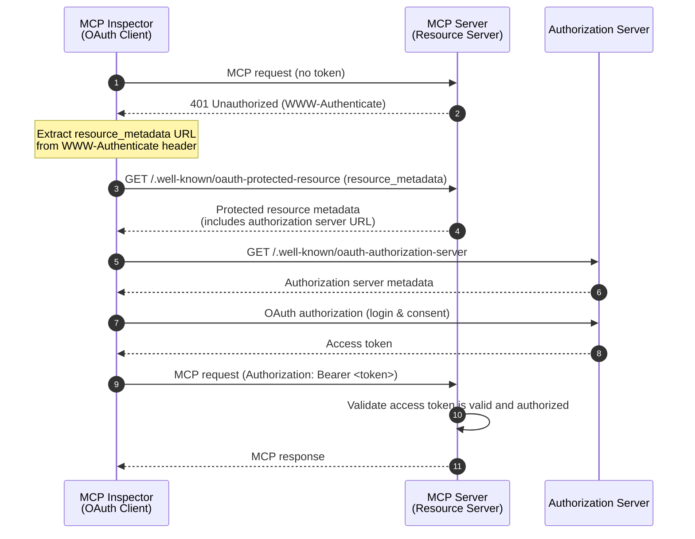
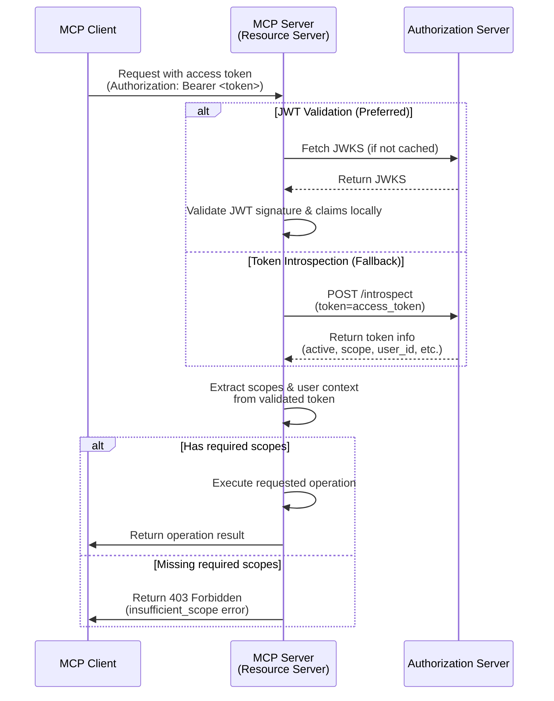

import TabItem from '@theme/TabItem';
import Tabs from '@theme/Tabs';


# Tutorial: Build a todo manager

In this tutorial, we will build a todo manager MCP server with user authentication and authorization. Following the latest MCP specification, our MCP server will act as an OAuth 2.0 **Resource Server** that validates access tokens and enforces scope-based permissions.

After completing this tutorial, you will have:

- ✅ A basic understanding of how to set up role-based access control (RBAC) in your MCP server.
- ✅ A MCP server that acts as a Resource Server, consuming access tokens issued by an Authorization Server.
- ✅ A working implementation of scope-based permission enforcement for todo operations.

## Overview \{#overview}

The tutorial will involve the following components:

- **MCP Client (MCP Inspector)**: A visual testing tool for MCP servers that acts as an OAuth 2.0/OIDC client. It initiates the authorization flow with the authorization server and obtains access tokens to authenticate requests to the MCP server.
- **Authorization Server**: An OAuth 2.1 or OpenID Connect provider that manages user identities, authenticates users, and issues access tokens with appropriate scopes to authorized clients.
- **MCP Server (Resource Server)**: According to the latest MCP specification, the MCP server acts as a Resource Server in the OAuth 2.0 framework. It validates access tokens issued by the authorization server and enforces scope-based permissions for todo operations.

This architecture follows the standard OAuth 2.0 flow where:
- The **MCP Inspector** requests protected resources on behalf of the user
- The **Authorization Server** authenticates the user and issues access tokens
- The **MCP Server** validates tokens and serves protected resources based on granted permissions

Here's a high-level diagram of the interaction between these components:



## Understand your authorization server \{#understand-your-authorization-server}

### Access tokens with scopes \{#access-tokens-with-scopes}

To implement [role-based access control (RBAC)](https://auth.wiki/rbac) in your MCP server, your authorization server needs to support issuing access tokens with scopes. Scopes represent the permissions that a user has been granted.

<Tabs groupId="provider">
<TabItem value="logto" label="Logto">

[Logto](https://logto.io) provides RBAC support through its API resources (conforming [RFC 8707: Resource Indicators for OAuth 2.0](https://datatracker.ietf.org/doc/html/rfc8707)) and roles features. Here's how to set it up:

1. Sign in to [Logto Console](https://cloud.logto.io) (or your self-hosted Logto Console)

2. Create API resource and scopes:

   - Go to "API Resources"
   - Create a new API resource named "Todo Manager"
   - Add the following scopes:
     - `create:todos`: "Create new todo items"
     - `read:todos`: "Read all todo items"
     - `delete:todos`: "Delete any todo item"

3. Create roles (recommended for easier management):

   - Go to "Roles"
   - Create an "Admin" role and assign all scopes (`create:todos`, `read:todos`, `delete:todos`)
   - Create a "User" role and assign only the `create:todos` scope

4. Assign permissions:
   - Go to "Users"
   - Select a user
   - You can either:
     - Assign roles in the "Roles" tab (recommended)
     - Or directly assign scopes in the "Permissions" tab

The scopes will be included in the JWT access token's `scope` claim as a space-separated string.

</TabItem>
<TabItem value="oauth-oidc" label="OAuth 2.0 / OIDC">

OAuth 2.0 / OIDC providers typically support scope-based access control. When implementing RBAC:

1. Define your required scopes in your authorization server
2. Configure your client to request these scopes during the authorization flow
3. Ensure your authorization server includes the granted scopes in the access token
4. The scopes are usually included in the JWT access token's `scope` claim

Check your provider's documentation for specific details on:

- How to define and manage scopes
- How scopes are included in the access token
- Any additional RBAC features like role management

</TabItem>
</Tabs>

### Validating tokens and checking permissions \{#validating-tokens-and-checking-permissions}

According to the latest MCP specification, the MCP server acts as a **Resource Server** in the OAuth 2.0 framework. As a Resource Server, the MCP server has the following responsibilities:

1. **Token Validation**: Verify the authenticity and integrity of access tokens received from MCP clients
2. **Scope Enforcement**: Extract and validate the scopes from the access token to determine what operations the client is authorized to perform
3. **Resource Protection**: Only serve protected resources (execute tools) when the client presents valid tokens with sufficient permissions

When your MCP server receives a request, it performs the following validation process:

1. Extract the access token from the `Authorization` header (Bearer token format)
2. Validate the access token's signature and expiration
3. Extract the scopes and user information from the validated token
4. Check if the token has the required scopes for the requested operation

For example, if a user wants to create a new todo item, their access token must include the `create:todos` scope. Here's how the Resource Server validation flow works:



### Dynamic Client Registration \{#dynamic-client-registration}

Dynamic Client Registration is not required for this tutorial, but it can be useful if you want to automate the MCP client registration process with your authorization server. Check [Is Dynamic Client Registration required?](/provider-list#is-dcr-required) for more details.

## Understand RBAC in todo manager \{#understand-rbac-in-todo-manager}

For demonstration purposes, we'll implement a simple role-based access control (RBAC) system in our todo manager MCP server. This will show you the basic principles of RBAC while keeping the implementation straightforward.

:::note
While this tutorial demonstrates RBAC-based scope management, it's important to note that not all authentication providers implement scope management through roles. Some providers may have their own unique implementations and mechanisms for managing access control and permissions.
:::

### Tools and scopes \{#tools-and-scopes}

Our todo manager MCP server provides three main tools:

- `create-todo`: Create a new todo item
- `get-todos`: List all todos
- `delete-todo`: Delete a todo by ID

To control access to these tools, we define the following scopes:

- `create:todos`: Allows creating new todo items
- `delete:todos`: Allows deleting existing todo items
- `read:todos`: Allows querying and retrieving the list of all todo items

### Roles and permissions \{#roles-and-permissions}

We'll define two roles with different levels of access:

| Role  | create:todos | read:todos | delete:todos |
| ----- | ------------ | ---------- | ------------ |
| Admin | ✅           | ✅         | ✅           |
| User  | ✅           |            |              |

- **User**: A regular user who can create todo items and view or delete only their own todos
- **Admin**: An administrator who can create, view, and delete all todo items, regardless of ownership

### Resource ownership \{#resource-ownership}

While the permission table above shows the explicit scopes assigned to each role, there's an important principle of resource ownership to consider:

- **Users** don't have the `read:todos` or `delete:todos` scopes, but they can still:
  - Read their own todo items
  - Delete their own todo items
- **Admins** have full permissions (`read:todos` and `delete:todos`), allowing them to:
  - View all todo items in the system
  - Delete any todo item, regardless of ownership

This demonstrates a common pattern in RBAC systems where resource ownership grants implicit permissions to users for their own resources, while administrative roles receive explicit permissions for all resources.

:::tip Learn More
To dive deeper into RBAC concepts and best practices, check out [Mastering RBAC: A Comprehensive Real-World Example](https://blog.logto.io/mastering-rbac).
:::

## Configure authorization in your provider \{#configure-authorization-in-your-provider}

To implement the access control system we described earlier, you'll need to configure your authorization server to support the required scopes. Here's how to do it with different providers:

<Tabs groupId="provider">
<TabItem value="logto" label="Logto">

[Logto](https://logto.io) provides RBAC support through its API resources and roles features. Here's how to set it up:

1. Sign in to [Logto Console](https://cloud.logto.io) (or your self-hosted Logto Console)

2. Create API resource and scopes:

   - Go to "API Resources"
   - Create a new API resource named "Todo Manager" and using `http://localhost:3001` as the resource indicator.
     - **Important**: The resource indicator must match your MCP server's URL. For this tutorial, we use `http://localhost:3001` since our MCP server runs on port 3001. In production, use your actual MCP server URL (e.g., `https://your-mcp-server.example.com`).
   - Create the following scopes:
     - `create:todos`: "Create new todo items"
     - `read:todos`: "Read all todo items"
     - `delete:todos`: "Delete any todo item"

3. Create roles (recommended for easier management):

   - Go to "Roles"
   - Create an "Admin" role and assign all scopes (`create:todos`, `read:todos`, `delete:todos`)
   - Create a "User" role and assign only the `create:todos` scope
   - In the "User" role's details page, switch to the "General" tab, and set the "User" role as the "Default role".

4. Manage user roles and permissions:
   - For new users:
     - They will automatically get the "User" role since we set it as the default role
   - For existing users:
     - Go to "User management"
     - Select a user
     - Assign roles for the user in the "Roles" tab

:::tip Programmatic Role Management
You can also use Logto's [Management API](https://docs.logto.io/integrate-logto/interact-with-management-api) to programmatically manage user roles. This is particularly useful for automated user management or when building admin panels.
:::

When requesting an access token, Logto will include scopes in the token's `scope` claim based on the user's role permissions.

</TabItem>
<TabItem value="oauth-or-oidc" label="OAuth 2 / OIDC">

For OAuth 2.0 or OpenID Connect providers, you'll need to configure the scopes that represent different permissions. The exact steps will depend on your provider, but generally:

1. Define scopes:

   - Configure your authorization server to support:
     - `create:todos`
     - `read:todos`
     - `delete:todos`

2. Configure client:

   - Register or update your client to request these scopes
   - Ensure the scopes are included in the access token

3. Assign permissions:
   - Use your provider's interface to grant appropriate scopes to users
   - Some providers may support role-based management, while others might use direct scope assignments
   - Check your provider's documentation for the recommended approach

:::tip
Most providers will include the granted scopes in the access token's `scope` claim. The format is typically a space-separated string of scope values.
:::

</TabItem>
</Tabs>

After configuring your authorization server, users will receive access tokens containing their granted scopes. The MCP server will use these scopes to determine:

- Whether a user can create new todos (`create:todos`)
- Whether a user can view all todos (`read:todos`) or only their own
- Whether a user can delete any todo (`delete:todos`) or only their own

## Set up the MCP server \{#set-up-the-mcp-server}

We will use the [MCP official SDKs](https://github.com/modelcontextprotocol) to create our todo manager MCP server.

### Create a new project \{#create-a-new-project}

<Tabs groupId="sdk">
<TabItem value="python" label="Python">

Set up a new Python project:

```bash
mkdir mcp-todo-server
cd mcp-todo-server

# Initialize a new Python project
uv init

# Create a new virtual environment using uv
uv venv

# Activate the virtual environment (optional when using 'uv run')
source .venv/bin/activate
```

</TabItem>
<TabItem value="node" label="Node.js">

Set up a new Node.js project:

```bash
mkdir mcp-server
cd mcp-server
npm init -y # Or use `pnpm init`
npm pkg set type="module"
npm pkg set main="todo-manager.ts"
npm pkg set scripts.start="node --experimental-strip-types todo-manager.ts"
```

:::note
We're using TypeScript in our examples as Node.js v22.6.0+ supports running TypeScript natively using the `--experimental-strip-types` flag. If you're using JavaScript, the code will be similar - just ensure you're using Node.js v22.6.0 or later. See Node.js docs for details.
:::

</TabItem>
</Tabs>

### Install the MCP SDK and dependencies \{#install-the-mcp-sdk-and-dependencies}

<Tabs groupId="sdk">
<TabItem value="python" label="Python">

Install the required dependencies:

```bash
uv add "mcp[cli]" uvicorn starlette
```

</TabItem>
<TabItem value="node" label="Node.js">

```bash
npm install @modelcontextprotocol/sdk express zod dotenv
```

Or any other package manager you prefer, such as `pnpm` or `yarn`.

</TabItem>
</Tabs>

### Create the MCP server \{#create-the-mcp-server}

First, let's create a basic MCP server with the tool definitions:

<Tabs groupId="sdk">
<TabItem value="python" label="Python">

Create a file named `server.py` and add the following code:

```python
# server.py

import contextlib
from typing import Any
from mcp.server.fastmcp import FastMCP
from starlette.applications import Starlette
from starlette.routing import Mount

# Initialize the FastMCP server
mcp = FastMCP(name="Todo Manager", stateless_http=True, streamable_http_path='/')

@mcp.tool()
def create_todo(content: str) -> dict[str, Any]:
    """Create a new todo. Requires 'create:todos' scope."""
    return {"error": "Not implemented"}

@mcp.tool()
def get_todos() -> dict[str, Any]:
    """List todos. Users with 'read:todos' scope can see all todos."""
    return {"error": "Not implemented"}

@mcp.tool()
def delete_todo(id: str) -> dict[str, Any]:
    """Delete a todo by id. Users can delete their own todos."""
    return {"error": "Not implemented"}

@contextlib.asynccontextmanager
async def lifespan(app: Starlette):
    async with contextlib.AsyncExitStack() as stack:
        await stack.enter_async_context(mcp.session_manager.run())
        yield

# Create the app
app = Starlette(
    routes=[
        Mount("/", app=mcp.streamable_http_app()),
    ],
    lifespan=lifespan,
)
```

Run the server with:

```bash
# Start the Todo Manager server using uvicorn
uvicorn server:app --host 127.0.0.1 --port 3001

# Or using uv:
# uv run uvicorn server:app --host 127.0.0.1 --port 3001
```

</TabItem>
<TabItem value="node" label="Node.js">

Create a file named `todo-manager.ts` and add the following code:

```ts
// todo-manager.ts

import { z } from 'zod';
import { McpServer } from '@modelcontextprotocol/sdk/server/mcp.js';
import { StreamableHTTPServerTransport } from '@modelcontextprotocol/sdk/server/streamableHttp.js';
import express, { type Request, type Response } from 'express';

// Create an MCP server
const server = new McpServer({
  name: 'Todo Manager',
  version: '0.0.0',
});

server.tool('create-todo', 'Create a new todo', { content: z.string() }, async ({ content }) => {
  return {
    content: [{ type: 'text', text: JSON.stringify({ error: 'Not implemented' }) }],
  };
});

server.tool('get-todos', 'List all todos', async () => {
  return {
    content: [{ type: 'text', text: JSON.stringify({ error: 'Not implemented' }) }],
  };
});

server.tool('delete-todo', 'Delete a todo by id', { id: z.string() }, async ({ id }) => {
  return {
    content: [{ type: 'text', text: JSON.stringify({ error: 'Not implemented' }) }],
  };
});

// Below is the boilerplate code from MCP SDK documentation
const PORT = 3001;
const app = express();

app.post('/', async (request: Request, response: Response) => {
  // In stateless mode, create a new instance of transport and server for each request
  // to ensure complete isolation. A single instance would cause request ID collisions
  // when multiple clients connect concurrently.

  try {
    const transport: StreamableHTTPServerTransport = new StreamableHTTPServerTransport({
      sessionIdGenerator: undefined,
    });
    response.on('close', async () => {
      console.log('Request closed');
      await transport.close();
      await server.close();
    });
    await server.connect(transport);
    await transport.handleRequest(request, response, request.body);
  } catch (error) {
    console.error('Error handling MCP request:', error);
    if (!response.headersSent) {
      response.status(500).json({
        jsonrpc: '2.0',
        error: {
          code: -32_603,
          message: 'Internal server error',
        },
        id: null,
      });
    }
  }
});

// SSE notifications not supported in stateless mode
app.get('/', async (request: Request, response: Response) => {
  console.log('Received GET MCP request');
  response.writeHead(405).end(
    JSON.stringify({
      jsonrpc: '2.0',
      error: {
        code: -32_000,
        message: 'Method not allowed.',
      },
      id: null,
    })
  );
});

// Session termination not needed in stateless mode
app.delete('/', async (request: Request, response: Response) => {
  console.log('Received DELETE MCP request');
  response.writeHead(405).end(
    JSON.stringify({
      jsonrpc: '2.0',
      error: {
        code: -32_000,
        message: 'Method not allowed.',
      },
      id: null,
    })
  );
});

app.listen(PORT);
```

Run the server with:

```bash
npm start
```

</TabItem>
</Tabs>

## Inspect the MCP server \{#inspect-the-mcp-server}

### Clone and run MCP inspector \{#clone-and-run-mcp-inspector}

Now that we have the MCP server running, we can use the MCP inspector to see if tools are available.

The official MCP inspector v0.16.2 has some bugs that affect authentication functionality. To address these issues, we've created a [patched version of the MCP inspector](https://github.com/mcp-auth/inspector/tree/patch/0.16.2-fixes) that includes necessary fixes for OAuth/OIDC authentication flows. We've also submitted pull requests to the official repository to contribute these fixes upstream.

To run the MCP inspector, you can use the following command (Node.js is required):

```bash
git clone https://github.com/mcp-auth/inspector.git -b patch/0.16.2-fixes
cd inspector
npm install
npm run dev
```

The MCP inspector will automatically open in your default browser, or you can manually access it by clicking the link from the terminal output (make sure to click the link that includes the `MCP_PROXY_AUTH_TOKEN` parameter, such as `http://localhost:6274/?MCP_PROXY_AUTH_TOKEN=458ae4a4...acab1907`).

### Connect MCP inspector to the MCP server \{#connect-mcp-inspector-to-the-mcp-server}

Before we proceed, check the following configuration in MCP inspector:

- **Transport Type**: Set to `Streamable HTTP`.
- **URL**: Set to the URL of your MCP server. In our case, it should be `http://localhost:3001`.

Now you can click the "Connect" button to see if the MCP inspector can connect to the MCP server. If everything is okay, you should see the "Connected" status in the MCP inspector.

### Checkpoint: Run todo manager tools \{#checkpoint-run-todo-manager-tools}

1. In the top menu of the MCP inspector, click on the "Tools" tab.
2. Click on the "List Tools" button.
3. You should see the `create-todo`, `get-todos`, and `delete-todo` tools listed on the page. Click on it to open the tool details.
4. You should see the "Run Tool" button in the right side. Click on it and enter required parameters to run the tool.
5. You should see the tool result with the JSON response `{"error": "Not implemented"}`.


## Integrate with your authorization server \{#integrate-with-your-authorization-server}

To complete this section, there are several considerations to take into account:

<details>
<summary>**The issuer URL of your authorization server**</summary>

This is usually the base URL of your authorization server, such as `https://auth.example.com`. Some providers may have a path like `https://example.logto.app/oidc`, so make sure to check your provider's documentation.

</details>

<details>
<summary>**How to retrieve the authorization server metadata**</summary>

- If your authorization server conforms to the [OAuth 2.0 Authorization Server Metadata](https://datatracker.ietf.org/doc/html/rfc8414) or [OpenID Connect Discovery](https://openid.net/specs/openid-connect-discovery-1_0.html), you can use the MCP Auth built-in utilities to fetch the metadata automatically.
- If your authorization server does not conform to these standards, you will need to manually specify the metadata URL or endpoints in the MCP server configuration. Check your provider's documentation for the specific endpoints.

</details>

<details>
<summary>**How to register the MCP inspector as a client in your authorization server**</summary>

- If your authorization server supports [Dynamic Client Registration](https://datatracker.ietf.org/doc/html/rfc7591), you can skip this step as the MCP inspector will automatically register itself as a client.
- If your authorization server does not support Dynamic Client Registration, you will need to manually register the MCP inspector as a client in your authorization server.

</details>

<details>
<summary>**Understand token request parameters**</summary>

When requesting access tokens from different authorization servers, you'll encounter various approaches for specifying the target resource and permissions. Here are the main patterns:

- **Resource indicator based**:

  - Uses the `resource` parameter to specify the target API (see [RFC 8707: Resource Indicators for OAuth 2.0](https://datatracker.ietf.org/doc/html/rfc8707))
  - Common in modern OAuth 2.0 implementations
  - Example request:
    ```json
    {
      "resource": "http://localhost:3001",
      "scope": "create:todos read:todos"
    }
    ```
  - The server issues tokens specifically bound to the requested resource

- **Audience based**:

  - Uses the `audience` parameter to specify the intended token recipient
  - Similar to resource indicators but with different semantics
  - Example request:
    ```json
    {
      "audience": "todo-api",
      "scope": "create:todos read:todos"
    }
    ```

- **Pure scope based**:
  - Relies solely on scopes without resource/audience parameters
  - Traditional OAuth 2.0 approach
  - Example request:
    ```json
    {
      "scope": "todo-api:create todo-api:read openid profile"
    }
    ```
  - Often uses prefixed scopes to namespace permissions
  - Common in simpler OAuth 2.0 implementations

:::tip Best Practices

- Check your provider's documentation for supported parameters
- Some providers support multiple approaches simultaneously
- Resource indicators provide better security through audience restriction
- Consider using resource indicators when available for better access control
  :::

</details>

While each provider may have its own specific requirements, the following steps will guide you through the process of integrating the MCP inspector and MCP server with provider-specific configurations.

### Register MCP inspector as a client \{#register-mcp-inspector-as-a-client}

<Tabs groupId="provider">
<TabItem value="logto" label="Logto">

Integrating the todo manager with [Logto](https://logto.io) is straightforward as it's an OpenID Connect provider that supports resource indicators and scopes, allowing you to secure your todo API with `http://localhost:3001` as the resource indicator.

Since Logto does not support Dynamic Client Registration yet, you will need to manually register the MCP inspector as a client in your Logto tenant:

1. Open your MCP inspector, go to the Authentication configuration and click on the "OAuth2.0 Flow" configuration. Copy the **Redirect URI** value, which should be something like `http://localhost:6274/oauth/callback`.
2. Sign in to [Logto Console](https://cloud.logto.io) (or your self-hosted Logto Console).
3. Navigate to the "Applications" tab, click on "Create application". In the bottom of the page, click on "Create app without framework".
4. Fill in the application details, then click on "Create application":
   - **Select an application type**: Choose "Single-page application".
   - **Application name**: Enter a name for your application, e.g., "MCP Inspector".
5. In the "Settings / Redirect URIs" section, paste the **Redirect URI** value you copied from the MCP inspector. Then click on "Save changes" in the bottom bar.
6. In the top card, you will see the "App ID" value. Copy it.
7. Go back to the MCP inspector and paste the "App ID" value in the Authentication configuration under "OAuth2.0 Flow" in the "Client ID" field.
8. In the "Scope" field, enter: `create:todos read:todos delete:todos`. This will ensure that the access token returned by Logto contains the necessary scopes to access the todo manager.

</TabItem>
<TabItem value="oauth-oidc" label="OAuth 2.0 / OIDC">

:::note
This is a generic OAuth 2.0 / OpenID Connect provider integration guide. Both OAuth 2.0 and OIDC follow similar steps as OIDC is built on top of OAuth 2.0. Check your provider's documentation for specific details.
:::

If your provider supports Dynamic Client Registration, you can directly go to step 8 below to configure the MCP inspector; otherwise, you will need to manually register the MCP inspector as a client:

1. Open your MCP inspector, go to the Authentication configuration and click on the "OAuth2.0 Flow" configuration. Copy the **Redirect URI** value, which should be something like `http://localhost:6274/oauth/callback`.

2. Sign in to your provider's console.

3. Navigate to the "Applications" or "Clients" section, then create a new application or client.

4. If your provider requires a client type, select "Single-page application" or "Public client".

5. After creating the application, you will need to configure the redirect URI. Paste the **Redirect URI** value you copied from the MCP inspector.

6. Find the "Client ID" or "Application ID" of the newly created application and copy it.

7. Go back to the MCP inspector and paste the "Client ID" value in the Authentication configuration under "OAuth2.0 Flow" in the "Client ID" field.

8. In the "Scope" field, enter the following scopes to request the necessary permissions for todo operations:

```text
create:todos read:todos delete:todos
```

</TabItem>
</Tabs>

### Set up MCP Auth \{#set-up-mcp-auth}

First, install the MCP Auth SDK in your MCP server project.

<Tabs groupId="sdk">
<TabItem value="python" label="Python">

```bash
uv add mcpauth==0.2.0b1
```

</TabItem>
<TabItem value="node" label="Node.js">

```bash
npm install mcp-auth
```

</TabItem>
</Tabs>

Now we need to initialize MCP Auth in your MCP server. This involves two main steps:

1. **Fetching authorization server metadata**: Used for subsequent MCP Auth verification of access tokens issued by the Authorization Server, and to include the auth server's issuer identifier in resource metadata
2. **Configure protected resource metadata**: Define your MCP server's resource identifier and supported scopes

#### Step 1: Fetch authorization server metadata \{#step-1-fetch-authorization-server-metadata\}

According to the OAuth / OIDC spec, we can retrieve the authorization server metadata based on the authorization server's issuer URL.

<Tabs groupId="provider">

<TabItem value="logto" label="Logto">

In Logto, you can find the issuer URL on your application details page within Logto Console, under the "Endpoints & Credentials / Issuer endpoint" section. It should look like `https://my-project.logto.app/oidc`.

</TabItem>

<TabItem value="oauth-oidc" label="OAuth 2.0 / OIDC">

For OAuth 2.0 providers, you'll need to:

1. Check your provider's documentation for the authorization server URL (often called issuer URL or base URL)
2. Some providers may expose this at `https://{your-domain}/.well-known/oauth-authorization-server`
3. Look in your provider's admin console under OAuth/API settings

</TabItem>

</Tabs>

Now, fetch the authorization server metadata using the MCP Auth utility function to retrieve server configuration:

<Tabs groupId="sdk">

<TabItem value="python" label="Python">
```python
from mcpauth import MCPAuth
from mcpauth.config import AuthServerType
from mcpauth.utils import fetch_server_config

issuer_url = "<issuer-url>"  # Replace with your authorization server's issuer URL

# Fetch authorization server configuration
auth_server_config = fetch_server_config(issuer_url, AuthServerType.OIDC) # or AuthServerType.OAUTH
```

</TabItem>
<TabItem value="node" label="Node.js">
```js
import { MCPAuth, fetchServerConfig } from 'mcp-auth';

const issuerUrl = '<issuer-url>'; // Replace with your authorization server's issuer URL

// Fetch authorization server configuration (OIDC Discovery)
const authServerConfig = await fetchServerConfig(issuerUrl, { type: 'oidc' }); // or { type: 'oauth' }
```

</TabItem>
</Tabs>

If you need alternative ways to fetch authorization server metadata or want to customize the configuration, please refer to [other ways to configure authorization server metadata](/docs/configure-server/mcp-auth#other-ways).

#### Step 2: Configure protected resource metadata

Next, we will configure the Protected Resource Metadata when building the MCP Auth instance. Subsequently, the MCP server will expose the resource metadata configured in MCP Auth.

<Tabs groupId="sdk">

<TabItem value="python" label="Python">
```python
# server.py

# other imports...
from mcpauth.types import ResourceServerConfig, ResourceServerMetadata

# Define the resource identifier for this MCP server
resource_id = "http://localhost:3001"

mcp_auth = MCPAuth(
    protected_resources=ResourceServerConfig(
        metadata=ResourceServerMetadata(
            resource=resource_id,
            # Authorization server metadata fetched in the previous step
            authorization_servers=[auth_server_config],
            # Scopes this MCP server understands
            scopes_supported=[
                "create:todos",
                "read:todos",
                "delete:todos"
            ]
        )
    )
)
```
</TabItem>

<TabItem value="node" label="Node.js">
```js
// todo-manager.ts

// Define the resource identifier for this MCP server
const resourceId = 'http://localhost:3001';

// Configure MCP Auth with protected resource metadata
const mcpAuth = new MCPAuth({
  protectedResources: {
    metadata: {
      resource: resourceId,
      // Authorization server metadata fetched in the previous step
      authorizationServers: [authServerConfig],
      // Scopes this MCP server understands
      scopesSupported: [
        "create:todos",
        "read:todos",
        "delete:todos"
      ]
    }
  }
});
```
</TabItem>

</Tabs>

### Update MCP server \{#update-mcp-server}

We are almost done! It's time to update the MCP server to apply the MCP Auth route and middleware function, then implement the permission-based access control for the todo manager tools based on the user's scopes.

Now, apply protected resource metadata routes so that MCP clients can retrieve expected resource metadata from the MCP server.

<Tabs groupId="sdk">
<TabItem value="python" label="Python">
```python
# server.py

# ..other codes

app = Starlette(
    routes=[
        # Set up Protected Resource Metadata routes
        # This exposes metadata about this resource server for OAuth clients
        *mcp_auth.resource_metadata_router().routes,
        Mount("/", app=mcp.streamable_http_app()),
    ],
    lifespan=lifespan,
)
```
</TabItem>
<TabItem value="node" label="Node.js">

```ts
// todo-manager.ts

// Set up Protected Resource Metadata routes
// This exposes metadata about this resource server for OAuth clients
app.use(mcpAuth.protectedResourceMetadataRouter());

```
</TabItem>
</Tabs>

Next, we will apply the MCP Auth middleware to the MCP server. This middleware will handle authentication and authorization for incoming requests, ensuring that only authorized users can access the todo manager tools.

<Tabs groupId="sdk">
<TabItem value="python" label="Python">
```python
# server.py

# other imports...
from starlette.middleware import Middleware

# other codes...

# Create the middleware
bearer_auth = Middleware(mcp_auth.bearer_auth_middleware('jwt', resource=resource_id, audience=resource_id))

app = Starlette(
    routes=[
        *mcp_auth.resource_metadata_router().routes,
        # Apply the MCP Auth middleware
        Mount("/", app=mcp.streamable_http_app(), middleware=[bearer_auth]),
    ],
    lifespan=lifespan,
)
```
</TabItem>
<TabItem value="node" label="Node.js">

```ts
// todo-manager.ts

app.use(mcpAuth.protectedResourceMetadataRouter());

// Apply the MCP Auth middleware
app.use(
  mcpAuth.bearerAuth('jwt', {
    resource: resourceId,
    audience: resourceId,
  })
);
```
</TabItem>
</Tabs>

At this point, we can update the todo manager tools to leverage the MCP Auth middleware for authentication and authorization.

Let's update the implementation of the tools.

<Tabs groupId="sdk">
<TabItem value="python" label="Python">
```python
# server.py

# other imports...

from mcpauth.exceptions import MCPAuthBearerAuthException, BearerAuthExceptionCode
from mcpauth.types import AuthInfo, ResourceServerConfig, ResourceServerMetadata

# Will mention in the next section
from service import TodoService

def assert_user_id(auth_info: Optional[AuthInfo]) -> str:
    """Assert that auth_info contains a valid user ID and return it."""
    if not auth_info or not auth_info.subject:
        raise Exception("Invalid auth info")
    return auth_info.subject

def has_required_scopes(user_scopes: List[str], required_scopes: List[str]) -> bool:
    """Check if user has all required scopes."""
    return all(scope in user_scopes for scope in required_scopes)

# Create the TodoService instance
todo_service = TodoService()

@mcp.tool()
def create_todo(content: str) -> dict[str, Any]:
    """Create a new todo. Requires 'create:todos' scope."""
    auth_info = mcp_auth.auth_info
    user_id = assert_user_id(auth_info)
    
    # Only users with 'create:todos' scope can create todos
    user_scopes = auth_info.scopes if auth_info else []
    if not has_required_scopes(user_scopes, ["create:todos"]):
        raise MCPAuthBearerAuthException(BearerAuthExceptionCode.MISSING_REQUIRED_SCOPES)
    
    created_todo = todo_service.create_todo(content=content, owner_id=user_id)
    return created_todo

@mcp.tool()
def get_todos() -> dict[str, Any]:
    """
    List todos. Users with 'read:todos' scope can see all todos,
    otherwise they can only see their own todos.
    """
    auth_info = mcp_auth.auth_info
    user_id = assert_user_id(auth_info)
    
    # If user has 'read:todos' scope, they can access all todos
    # If user doesn't have 'read:todos' scope, they can only access their own todos
    user_scopes = auth_info.scopes if auth_info else []
    todo_owner_id = None if has_required_scopes(user_scopes, ["read:todos"]) else user_id
    
    todos = todo_service.get_all_todos(todo_owner_id)
    return {"todos": todos}

@mcp.tool()
def delete_todo(id: str) -> dict[str, Any]:
    """
    Delete a todo by id. Users can delete their own todos.
    Users with 'delete:todos' scope can delete any todo.
    """
    auth_info = mcp_auth.auth_info
    user_id = assert_user_id(auth_info)
    
    todo = todo_service.get_todo_by_id(id)
    
    if not todo:
        return {"error": "Failed to delete todo"}
    
    # Users can only delete their own todos
    # Users with 'delete:todos' scope can delete any todo
    user_scopes = auth_info.scopes if auth_info else []
    if todo.owner_id != user_id and not has_required_scopes(user_scopes, ["delete:todos"]):
        return {"error": "Failed to delete todo"}
    
    deleted_todo = todo_service.delete_todo(id)
    
    if deleted_todo:
        return {
            "message": f"Todo {id} deleted",
            "details": deleted_todo
        }
    else:
        return {"error": "Failed to delete todo"}
```
</TabItem>

<TabItem value="node" label="Node.js">
```js
// todo-manager.ts

// other imports...
import assert from 'node:assert';
import { fetchServerConfig, MCPAuth, MCPAuthBearerAuthError } from 'mcp-auth';
import { type AuthInfo } from '@modelcontextprotocol/sdk/server/auth/types.js';

// Will mention in the next section
import { TodoService } from './todo-service.js';

const assertUserId = (authInfo?: AuthInfo) => {
  const { subject } = authInfo ?? {};
  assert(subject, 'Invalid auth info');
  return subject;
};

const hasRequiredScopes = (userScopes: string[], requiredScopes: string[]): boolean => {
  return requiredScopes.every((scope) => userScopes.includes(scope));
};

const todoService = new TodoService();

server.tool(
  'create-todo',
  'Create a new todo',
  { content: z.string() },
  ({ content }: { content: string }, { authInfo }) => {
    const userId = assertUserId(authInfo);

    /**
     * Only users with 'create:todos' scope can create todos
     */
    if (!hasRequiredScopes(authInfo?.scopes ?? [], ['create:todos'])) {
      throw new MCPAuthBearerAuthError('missing_required_scopes');
    }

    const createdTodo = todoService.createTodo({ content, ownerId: userId });

    return {
      content: [{ type: 'text', text: JSON.stringify(createdTodo) }],
    };
  }
);

server.tool('get-todos', 'List all todos', ({ authInfo }) => {
  const userId = assertUserId(authInfo);

  /**
   * If user has 'read:todos' scope, they can access all todos (todoOwnerId = undefined)
   * If user doesn't have 'read:todos' scope, they can only access their own todos (todoOwnerId = userId)
   */
  const todoOwnerId = hasRequiredScopes(authInfo?.scopes ?? [], ['read:todos'])
    ? undefined
    : userId;

  const todos = todoService.getAllTodos(todoOwnerId);

  return {
    content: [{ type: 'text', text: JSON.stringify(todos) }],
  };
});

server.tool(
  'delete-todo',
  'Delete a todo by id',
  { id: z.string() },
  ({ id }: { id: string }, { authInfo }) => {
    const userId = assertUserId(authInfo);

    const todo = todoService.getTodoById(id);

    if (!todo) {
      return {
        content: [{ type: 'text', text: JSON.stringify({ error: 'Failed to delete todo' }) }],
      };
    }

    /**
     * Users can only delete their own todos
     * Users with 'delete:todos' scope can delete any todo
     */
    if (todo.ownerId !== userId && !hasRequiredScopes(authInfo?.scopes ?? [], ['delete:todos'])) {
      return {
        content: [
          {
            type: 'text',
            text: JSON.stringify({ error: 'Failed to delete todo' }),
          },
        ],
      };
    }

    const deletedTodo = todoService.deleteTodo(id);

    return {
      content: [
        {
          type: 'text',
          text: JSON.stringify({
            message: `Todo ${id} deleted`,
            details: deletedTodo,
          }),
        },
      ],
    };
  }
);
```
</TabItem>
</Tabs>

Now, create the "Todo service" used in the above code to implement the related functionality:

<Tabs groupId="sdk">
<TabItem value="python" label="Python">

Create the `service.py` file for the Todo service:

```python
"""
A simple Todo service for demonstration purposes.
Uses an in-memory list to store todos.
"""

from datetime import datetime
from typing import List, Optional, Dict, Any
import random
import string

class Todo:
    """Represents a todo item."""
    
    def __init__(self, id: str, content: str, owner_id: str, created_at: str):
        self.id = id
        self.content = content
        self.owner_id = owner_id
        self.created_at = created_at
    
    def to_dict(self) -> Dict[str, Any]:
        """Convert todo to dictionary for JSON serialization."""
        return {
            "id": self.id,
            "content": self.content,
            "ownerId": self.owner_id,
            "createdAt": self.created_at
        }


class TodoService:
    """A simple Todo service for demonstration purposes."""
    
    def __init__(self):
        self._todos: List[Todo] = []
    
    def get_all_todos(self, owner_id: Optional[str] = None) -> List[Dict[str, Any]]:
        """
        Get all todos, optionally filtered by owner_id.
        
        Args:
            owner_id: If provided, only return todos owned by this user
            
        Returns:
            List of todo dictionaries
        """
        if owner_id:
            filtered_todos = [todo for todo in self._todos if todo.owner_id == owner_id]
            return [todo.to_dict() for todo in filtered_todos]
        return [todo.to_dict() for todo in self._todos]
    
    def get_todo_by_id(self, todo_id: str) -> Optional[Todo]:
        """
        Get a todo by its ID.
        
        Args:
            todo_id: The ID of the todo to retrieve
            
        Returns:
            Todo object if found, None otherwise
        """
        for todo in self._todos:
            if todo.id == todo_id:
                return todo
        return None
    
    def create_todo(self, content: str, owner_id: str) -> Dict[str, Any]:
        """
        Create a new todo.
        
        Args:
            content: The content of the todo
            owner_id: The ID of the user who owns this todo
            
        Returns:
            Dictionary representation of the created todo
        """
        todo = Todo(
            id=self._generate_id(),
            content=content,
            owner_id=owner_id,
            created_at=datetime.now().isoformat()
        )
        self._todos.append(todo)
        return todo.to_dict()
    
    def delete_todo(self, todo_id: str) -> Optional[Dict[str, Any]]:
        """
        Delete a todo by its ID.
        
        Args:
            todo_id: The ID of the todo to delete
            
        Returns:
            Dictionary representation of the deleted todo if found, None otherwise
        """
        for i, todo in enumerate(self._todos):
            if todo.id == todo_id:
                deleted_todo = self._todos.pop(i)
                return deleted_todo.to_dict()
        return None
    
    def _generate_id(self) -> str:
        """Generate a random ID for a todo."""
        return ''.join(random.choices(string.ascii_lowercase + string.digits, k=8))
```

</TabItem>
<TabItem value="node" label="Node.js">

Create the `todo-service.ts` file for the Todo service:

```ts
// todo-service.ts

type Todo = {
  id: string;
  content: string;
  ownerId: string;
  createdAt: string;
};

/**
 * A simple Todo service for demonstration purposes.
 * Use an in-memory array to store todos
 */
export class TodoService {
  private readonly todos: Todo[] = [];

  getAllTodos(ownerId?: string): Todo[] {
    if (ownerId) {
      return this.todos.filter((todo) => todo.ownerId === ownerId);
    }
    return this.todos;
  }

  getTodoById(id: string): Todo | undefined {
    return this.todos.find((todo) => todo.id === id);
  }

  createTodo({ content, ownerId }: { content: string; ownerId: string }): Todo {
    const todo: Todo = {
      id: this.genId(),
      content,
      ownerId,
      createdAt: new Date().toISOString(),
    };

    // eslint-disable-next-line @silverhand/fp/no-mutating-methods
    this.todos.push(todo);
    return todo;
  }

  deleteTodo(id: string): Todo | undefined {
    const index = this.todos.findIndex((todo) => todo.id === id);

    if (index === -1) {
      return undefined;
    }

    // eslint-disable-next-line @silverhand/fp/no-mutating-methods
    const [deleted] = this.todos.splice(index, 1);
    return deleted;
  }

  private genId(): string {
    return Math.random().toString(36).slice(2, 10);
  }
}
```

</TabItem>
</Tabs>

🎉 Congratulations! We've successfully implemented a complete MCP server with authentication and authorization!

You can also check our sample code for reference:

<Tabs groupId="sdk">
<TabItem value="python" label="Python">

:::info
Check out the [MCP Auth Python SDK repository](https://github.com/mcp-auth/python/tree/master/samples/current/todo-manager) for the complete code of the MCP server (OIDC version).
:::

</TabItem>
<TabItem value="node" label="Node.js">

:::info
Check out the [MCP Auth Node.js SDK repository](https://github.com/mcp-auth/js/blob/master/packages/sample-servers/src) for the complete code of the MCP server (OIDC version).
:::

</TabItem>
</Tabs>

## Checkpoint: Run the `todo-manager` tools \{#checkpoint-run-the-todo-manager-tools}

Restart your MCP server and open the MCP inspector in your browser. When you click the "Connect" button, you should be redirected to your authorization server's sign-in page.

Once you sign in and back to the MCP inspector, repeat the actions we did in the previous checkpoint to run todo manager tools. This time, you can use these tools with your authenticated user identity. The behavior of the tools will depend on the roles and permissions assigned to your user:

- If you're logged in as a **User** (with only `create:todos` scope):

  - You can create new todos using the `create-todo` tool
  - You can only view and delete your own todos
  - You won't be able to see or delete other users' todos

- If you're logged in as an **Admin** (with all scopes: `create:todos`, `read:todos`, `delete:todos`):
  - You can create new todos
  - You can view all todos in the system using the `get-todos` tool
  - You can delete any todo using the `delete-todo` tool, regardless of who created it

You can test these different permission levels by:

1. Signing out of the current session (click the "Disconnect" button in MCP inspector)
2. Signing in with a different user account that has different roles/permissions
3. Trying the same tools again to observe how the behavior changes based on the user's permissions

This demonstrates how role-based access control (RBAC) works in practice, where different users have different levels of access to the system's functionality.


<Tabs groupId="sdk">
<TabItem value="python" label="Python">

:::info
Check out the [MCP Auth Python SDK repository](https://github.com/mcp-auth/python) for the complete code of the MCP server (OIDC version).
:::

</TabItem>
<TabItem value="node" label="Node.js">

:::info
Check out the [MCP Auth Node.js SDK repository](https://github.com/mcp-auth/js/blob/master/packages/sample-servers/src) for the complete code of the MCP server (OIDC version).
:::

</TabItem>
</Tabs>

## Closing notes \{#closing-notes}

🎊 Congratulations! You have successfully completed the tutorial. Let's recap what we've done:

- Setting up a basic MCP server with todo management tools (`create-todo`, `get-todos`, `delete-todo`)
- Implementing role-based access control (RBAC) with different permission levels for users and admins
- Integrating the MCP server with an authorization server using MCP Auth
- Configuring the MCP Inspector to authenticate users and use access tokens with scopes to call tools

Be sure to check out other tutorials and documentation to make the most of MCP Auth.
