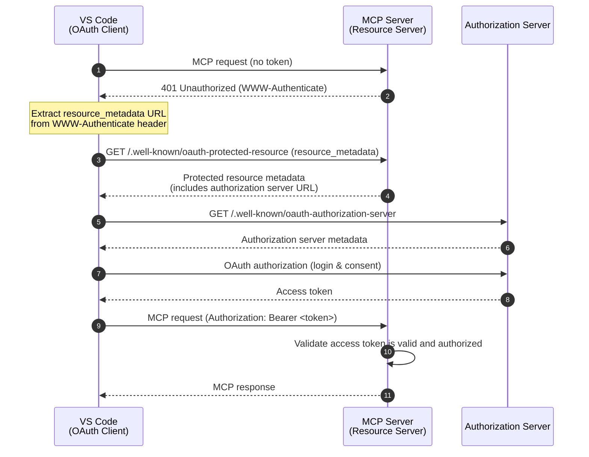
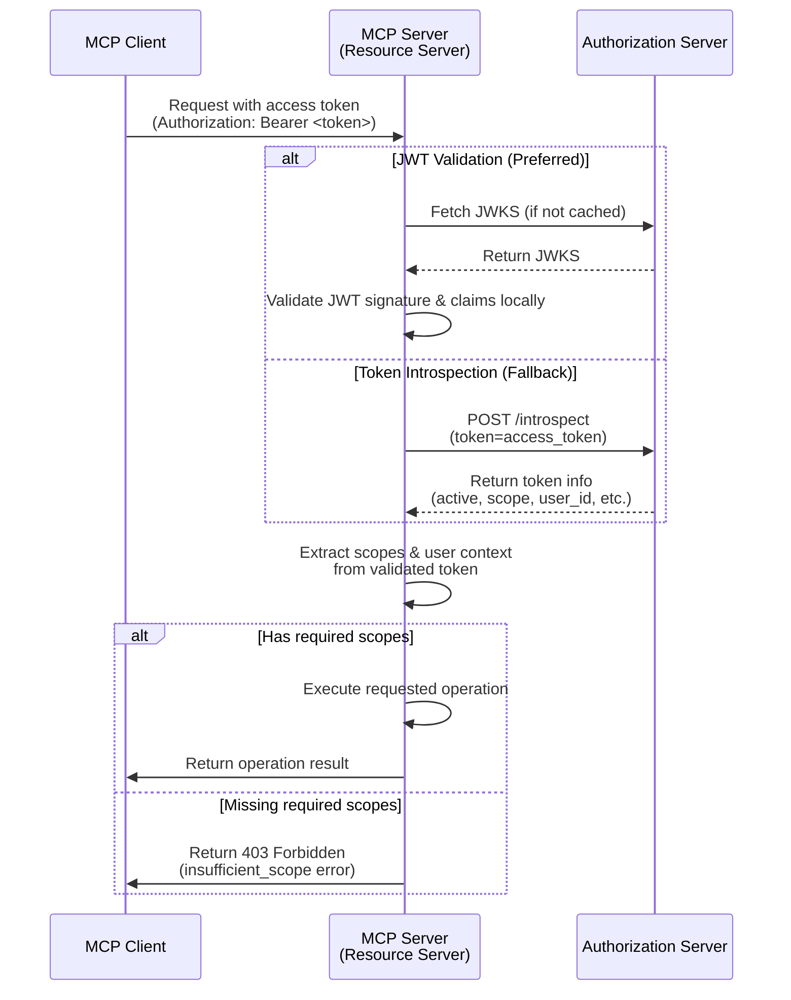

import { NpmLikeInstallation } from '@site/src/components/NpmLikeInstallation';

# Tutorial: Build a todo manager

:::tip Using a different authorization server?
This tutorial uses [Logto](https://logto.io) as the example authorization server. If you're using a different provider, check out our [Provider Guides](/docs/provider-guides) for configuration steps.
:::

In this tutorial, we will build a todo manager MCP server with user authentication and authorization. Following the latest MCP specification, our MCP server will act as an OAuth 2.0 **Resource Server** that validates access tokens and enforces scope-based permissions.

After completing this tutorial, you will have:

- ✅ A basic understanding of how to set up role-based access control (RBAC) in your MCP server.
- ✅ A MCP server that acts as a Resource Server, consuming access tokens issued by an Authorization Server.
- ✅ A working implementation of scope-based permission enforcement for todo operations.

## Overview \{#overview}

The tutorial will involve the following components:

- **MCP Client (VS Code)**: A code editor with built-in MCP support that acts as an OAuth 2.0/OIDC client. It initiates the authorization flow with the authorization server and obtains access tokens to authenticate requests to the MCP server.
- **Authorization Server**: An OAuth 2.1 or OpenID Connect provider that manages user identities, authenticates users, and issues access tokens with appropriate scopes to authorized clients.
- **MCP Server (Resource Server)**: According to the latest MCP specification, the MCP server acts as a Resource Server in the OAuth 2.0 framework. It validates access tokens issued by the authorization server and enforces scope-based permissions for todo operations.

This architecture follows the standard OAuth 2.0 flow where:

- The **VS Code** requests protected resources on behalf of the user
- The **Authorization Server** authenticates the user and issues access tokens
- The **MCP Server** validates tokens and serves protected resources based on granted permissions

Here's a high-level diagram of the interaction between these components:


```mermaid
sequenceDiagram
  autonumber
  participant Client as VS Code<br/>(OAuth Client)
  participant RS as MCP Server<br/>(Resource Server)
  participant AS as Authorization Server

  Client->>RS: MCP request (no token)
  RS-->>Client: 401 Unauthorized (WWW-Authenticate)
  Note over Client: Extract resource_metadata URL<br/>from WWW-Authenticate header

  Client->>RS: GET /.well-known/oauth-protected-resource (resource_metadata)
  RS-->>Client: Protected resource metadata<br/>(includes authorization server URL)

  Client->>AS: GET /.well-known/oauth-authorization-server
  AS-->>Client: Authorization server metadata
  Client->>AS: OAuth authorization (login & consent)
  AS-->>Client: Access token

  Client->>RS: MCP request (Authorization: Bearer <token>)
  RS->>RS: Validate access token is valid and authorized
  RS-->>Client: MCP response
```

## Understand your authorization server \{#understand-your-authorization-server}

### Access tokens with scopes \{#access-tokens-with-scopes}

To implement [role-based access control (RBAC)](https://auth.wiki/rbac) in your MCP server, your authorization server needs to support issuing access tokens with scopes. Scopes represent the permissions that a user has been granted.

[Logto](https://logto.io) provides RBAC support through its API resources (conforming [RFC 8707: Resource Indicators for OAuth 2.0](https://datatracker.ietf.org/doc/html/rfc8707)) and roles features: you define scopes on an API resource, group them into roles, and assign roles to users. The granted scopes end up in the JWT access token's `scope` claim as a space-separated string.

We'll walk through the actual Logto configuration in [Configure authorization in your provider](#configure-authorization-in-your-provider) below.

> 📖 See [Logto Provider Guide](/docs/provider-guides/logto) for detailed setup instructions.

### Validating tokens and checking permissions \{#validating-tokens-and-checking-permissions}

According to the latest MCP specification, the MCP server acts as a **Resource Server** in the OAuth 2.0 framework. As a Resource Server, the MCP server has the following responsibilities:

1. **Token Validation**: Verify the authenticity and integrity of access tokens received from MCP clients
2. **Scope Enforcement**: Extract and validate the scopes from the access token to determine what operations the client is authorized to perform
3. **Resource Protection**: Only serve protected resources (execute tools) when the client presents valid tokens with sufficient permissions

When your MCP server receives a request, it performs the following validation process:

1. Extract the access token from the `Authorization` header (Bearer token format)
2. Validate the access token's signature and expiration
3. Extract the scopes and user information from the validated token
4. Check if the token has the required scopes for the requested operation

For example, if a user wants to create a new todo item, their access token must include the `create:todos` scope. Here's how the Resource Server validation flow works:


```mermaid
sequenceDiagram
    participant Client as MCP Client
    participant Server as MCP Server<br/>(Resource Server)
    participant Auth as Authorization Server

    Client->>Server: Request with access token<br/>(Authorization: Bearer <token>)

    alt JWT Validation (Preferred)
        Server->>Auth: Fetch JWKS (if not cached)
        Auth-->>Server: Return JWKS
        Server->>Server: Validate JWT signature & claims locally
    else Token Introspection (Fallback)
        Server->>Auth: POST /introspect<br/>(token=access_token)
        Auth-->>Server: Return token info<br/>(active, scope, user_id, etc.)
    end

    Server->>Server: Extract scopes & user context<br/>from validated token

    alt Has required scopes
        Server->>Server: Execute requested operation
        Server->>Client: Return operation result
    else Missing required scopes
        Server->>Client: Return 403 Forbidden<br/>(insufficient_scope error)
    end
```

### Dynamic Client Registration \{#dynamic-client-registration}

Dynamic Client Registration is not required for this tutorial, but it can be useful if you want to automate the MCP client registration process with your authorization server. Check [Is Dynamic Client Registration required?](/provider-list#is-dcr-required) for more details.

## Understand RBAC in todo manager \{#understand-rbac-in-todo-manager}

For demonstration purposes, we'll implement a simple role-based access control (RBAC) system in our todo manager MCP server. This will show you the basic principles of RBAC while keeping the implementation straightforward.

:::note
While this tutorial demonstrates RBAC-based scope management, it's important to note that not all authentication providers implement scope management through roles. Some providers may have their own unique implementations and mechanisms for managing access control and permissions.
:::

### Tools and scopes \{#tools-and-scopes}

Our todo manager MCP server provides three main tools:

- `create-todo`: Create a new todo item
- `get-todos`: List all todos
- `delete-todo`: Delete a todo by ID

To control access to these tools, we define the following scopes:

- `create:todos`: Allows creating new todo items
- `delete:todos`: Allows deleting existing todo items
- `read:todos`: Allows querying and retrieving the list of all todo items

### Roles and permissions \{#roles-and-permissions}

We'll define two roles with different levels of access:

| Role  | create:todos | read:todos | delete:todos |
| ----- | ------------ | ---------- | ------------ |
| Admin | ✅           | ✅         | ✅           |
| User  | ✅           |            |              |

- **User**: A regular user who can create todo items and view or delete only their own todos
- **Admin**: An administrator who can create, view, and delete all todo items, regardless of ownership

### Resource ownership \{#resource-ownership}

While the permission table above shows the explicit scopes assigned to each role, there's an important principle of resource ownership to consider:

- **Users** don't have the `read:todos` or `delete:todos` scopes, but they can still:
  - Read their own todo items
  - Delete their own todo items
- **Admins** have full permissions (`read:todos` and `delete:todos`), allowing them to:
  - View all todo items in the system
  - Delete any todo item, regardless of ownership

This demonstrates a common pattern in RBAC systems where resource ownership grants implicit permissions to users for their own resources, while administrative roles receive explicit permissions for all resources.

:::tip Learn More
To dive deeper into RBAC concepts and best practices, check out [Mastering RBAC: A Comprehensive Real-World Example](https://blog.logto.io/mastering-rbac).
:::

## Configure authorization in your provider \{#configure-authorization-in-your-provider}

To implement the access control system we described earlier, you'll need to configure your authorization server to support the required scopes.

1. Sign in to [Logto Console](https://cloud.logto.io) (or your self-hosted Logto Console)

2. Create API resource and scopes:

   - Go to "API Resources"
   - Create a new API resource named "Todo Manager" and using `http://localhost:3001/` as the resource indicator.
     - **Important**: The resource indicator must match your MCP server's URL. For this tutorial, we use `http://localhost:3001/` since our MCP server runs on port 3001. In production, use your actual MCP server URL (e.g., `https://your-mcp-server.example.com/`).
   - Create the following scopes:
     - `create:todos`: "Create new todo items"
     - `read:todos`: "Read all todo items"
     - `delete:todos`: "Delete any todo item"

3. Create roles (recommended for easier management):

   - Go to "Roles"
   - Create an "Admin" role and assign all scopes (`create:todos`, `read:todos`, `delete:todos`)
   - Create a "User" role and assign only the `create:todos` scope
   - In the "User" role's details page, switch to the "General" tab, and set the "User" role as the "Default role".

4. Manage user roles and permissions:
   - For new users:
     - They will automatically get the "User" role since we set it as the default role
   - For existing users:
     - Go to "User management"
     - Select a user
     - Assign roles for the user in the "Roles" tab

:::tip Programmatic Role Management
You can also use Logto's [Management API](https://docs.logto.io/integrate-logto/interact-with-management-api) to programmatically manage user roles. This is particularly useful for automated user management or when building admin panels.
:::

When requesting an access token, Logto will include scopes in the token's `scope` claim based on the user's role permissions.

:::note[Trailing slash in resource indicator]
Always include a trailing slash (`/`) in the resource indicator. Due to a current bug in the MCP official SDK, clients using the SDK will automatically append a trailing slash to resource identifiers when initiating auth requests. If your resource indicator doesn't include the trailing slash, resource validation will fail for those clients. (VS Code is not affected by this bug.)
:::

After configuring your authorization server, users will receive access tokens containing their granted scopes. The MCP server will use these scopes to determine:

- Whether a user can create new todos (`create:todos`)
- Whether a user can view all todos (`read:todos`) or only their own
- Whether a user can delete any todo (`delete:todos`) or only their own

## Set up the MCP server \{#set-up-the-mcp-server}

We will use the [MCP official SDK](https://github.com/modelcontextprotocol) v2 to create our todo manager MCP server.

### Create a new project \{#create-a-new-project}

Set up a new Node.js project:

```bash
mkdir mcp-server
cd mcp-server
npm init -y # Or use `pnpm init`
npm pkg set type="module"
npm pkg set main="todo-manager.ts"
npm pkg set scripts.start="node --experimental-strip-types todo-manager.ts"
```

:::note
We're using TypeScript in our examples as Node.js v22.6.0+ supports running TypeScript natively using the `--experimental-strip-types` flag. If you're using JavaScript, the code will be similar - just ensure you're using Node.js v20 or later (required by the MCP SDK v2 and MCP Auth, which are ESM only). See Node.js docs for details.
:::

### Install the MCP SDK and dependencies \{#install-the-mcp-sdk-and-dependencies}

```bash
npm install @modelcontextprotocol/server @modelcontextprotocol/express @modelcontextprotocol/node express zod
```

Or any other package manager you prefer, such as `pnpm` or `yarn`.

- `@modelcontextprotocol/server` is the core MCP SDK, which speaks web-standard `Request` / `Response`.
- `@modelcontextprotocol/express` and `@modelcontextprotocol/node` adapt it to Express on Node.js.
- `zod` defines the input schemas for the tools.

### Create the MCP server \{#create-the-mcp-server}

Create a file named `todo-manager.ts` and add the following code:

```ts
// todo-manager.ts

import { createMcpExpressApp } from '@modelcontextprotocol/express';
import { toNodeHandler } from '@modelcontextprotocol/node';
import { createMcpHandler, McpServer } from '@modelcontextprotocol/server';
import { z } from 'zod';

// Factory function to create an MCP server instance
// Each request gets its own server instance, keeping requests isolated
const createMcpServer = () => {
  const mcpServer = new McpServer({
    name: 'Todo Manager',
    version: '0.0.0',
  });

  mcpServer.registerTool(
    'create-todo',
    {
      description: 'Create a new todo',
      inputSchema: z.object({ content: z.string() }),
    },
    async ({ content }) => {
      return {
        content: [{ type: 'text', text: JSON.stringify({ error: 'Not implemented' }) }],
      };
    }
  );

  mcpServer.registerTool(
    'get-todos',
    {
      description: 'List all todos',
    },
    async () => {
      return {
        content: [{ type: 'text', text: JSON.stringify({ error: 'Not implemented' }) }],
      };
    }
  );

  mcpServer.registerTool(
    'delete-todo',
    {
      description: 'Delete a todo by id',
      inputSchema: z.object({ id: z.string() }),
    },
    async ({ id }) => {
      return {
        content: [{ type: 'text', text: JSON.stringify({ error: 'Not implemented' }) }],
      };
    }
  );

  return mcpServer;
};

const PORT = 3001;

// The MCP handler speaks web-standard Request / Response; `toNodeHandler` adapts it to Express
const mcpNodeHandler = toNodeHandler(createMcpHandler(createMcpServer));

const app = createMcpExpressApp();

app.all(
  '/',
  // `createMcpExpressApp` applies `express.json()`, which drains the request stream, so the
  // parsed body is passed along explicitly
  async (request, response) => mcpNodeHandler(request, response, request.body)
);

app.listen(PORT);
```

Run the server with:

```bash
npm start
```

## Integrate with your authorization server \{#integrate-with-your-authorization-server}

The basics — issuer URL, metadata discovery, and client registration — work the same as in the [whoami tutorial](/docs/tutorials/whoami#integrate-with-your-authorization-server). What's new in this tutorial is scopes:

<details>
<summary>**Understand token request parameters**</summary>

When requesting access tokens from different authorization servers, you'll encounter various approaches for specifying the target resource and permissions. Here are the main patterns:

- **Resource indicator based**:

  - Uses the `resource` parameter to specify the target API (see [RFC 8707: Resource Indicators for OAuth 2.0](https://datatracker.ietf.org/doc/html/rfc8707))
  - Common in modern OAuth 2.0 implementations
  - Example request:
    ```json
    {
      "resource": "http://localhost:3001/",
      "scope": "create:todos read:todos"
    }
    ```
  - The server issues tokens specifically bound to the requested resource

- **Audience based**:

  - Uses the `audience` parameter to specify the intended token recipient
  - Similar to resource indicators but with different semantics
  - Example request:
    ```json
    {
      "audience": "todo-api",
      "scope": "create:todos read:todos"
    }
    ```

- **Pure scope based**:
  - Relies solely on scopes without resource/audience parameters
  - Traditional OAuth 2.0 approach
  - Example request:
    ```json
    {
      "scope": "todo-api:create todo-api:read openid profile"
    }
    ```
  - Often uses prefixed scopes to namespace permissions
  - Common in simpler OAuth 2.0 implementations

:::tip Best Practices

- Check your provider's documentation for supported parameters
- Some providers support multiple approaches simultaneously
- Resource indicators provide better security through audience restriction
- Consider using resource indicators when available for better access control
  :::

:::note
MCP Auth validates the access token's audience (`aud`) against your MCP server's resource identifier, as required by the MCP specification. Make sure your authorization server issues JWT access tokens bound to the resource — with Logto, the API resource we created earlier takes care of this.
:::

</details>

While each provider may have its own specific requirements, the following steps will guide you through the process of integrating VS Code and the MCP server.

### Register MCP client as a third-party app \{#register-mcp-client-as-a-third-party-app}

:::info Why third-party app?
Since VS Code is not controlled by you (the MCP server operator), it should be registered as a third-party application. Users will see a consent screen when authorizing.

If you're building your own MCP client, check the [Logto Provider Guide](/docs/provider-guides/logto#register-mcp-client) for first-party app registration.
:::

Since Logto does not support Dynamic Client Registration yet, you will need to manually register your MCP client (VS Code) as a third-party app in your Logto tenant:

1. Sign in to [Logto Console](https://cloud.logto.io) (or your self-hosted Logto Console).
2. Navigate to **Applications > Third-party apps** and click on "Create application".
3. Select **Native App** as the application type.
4. Fill in the application details:
   - **Application name**: Enter a name for your application, e.g., "MCP Client".
   - **Description**: Enter a description, e.g., "MCP client for VS Code".
5. Set the following **Redirect URIs** for VS Code:
   ```
   http://127.0.0.1
   https://vscode.dev/redirect
   ```
6. Click "Save changes".
7. Go to the app's **Permissions** tab, under **User** section, add the `create:todos`, `read:todos`, and `delete:todos` permissions from the **Todo Manager** API resource you created earlier.
8. In the top card, you will see the "App ID" value. Copy it for later use.

### Set up MCP Auth \{#set-up-mcp-auth}

First, install the MCP Auth SDK in your MCP server project.

<NpmLikeInstallation packageName="mcp-auth" />

Now, declare your MCP server as a protected resource: its resource identifier, the authorization server it trusts, and the scopes it understands.

Get your authorization server's issuer URL first. In Logto, you can find the issuer URL on your application details page within Logto Console, under the "Endpoints & Credentials / Issuer endpoint" section. It should look like `https://my-project.logto.app/oidc`.

```ts
// todo-manager.ts

import { MCPAuth } from 'mcp-auth';

const issuerUrl = '<issuer-url>'; // Replace with your authorization server's issuer URL

const mcpAuth = new MCPAuth({
  protectedResourceMetadata: {
    // The resource identifier for this MCP server; must match the resource indicator
    // registered in your provider
    resource: 'http://localhost:3001/',
    // The authorization server trusted by this MCP server
    authorizationServer: { issuer: issuerUrl, type: 'oidc' },
    // Scopes this MCP server understands
    scopesSupported: ['create:todos', 'read:todos', 'delete:todos'],
  },
});
```

With this discovery config, the authorization server metadata is fetched on-demand when first needed and cached afterwards — this also works on edge runtimes (like Cloudflare Workers) where top-level async fetch is not allowed. If you prefer to fetch and validate the metadata at startup, use `fetchServerConfig`:

```ts
import { fetchServerConfig } from 'mcp-auth';

const authServerConfig = await fetchServerConfig(issuerUrl, { type: 'oidc' });
```

> 📖 See [Configure MCP Auth](/docs/configure-server/mcp-auth) for all configuration options.

### Update MCP server \{#update-mcp-server}

We are almost done! It's time to update the MCP server to serve the OAuth discovery documents and apply the MCP SDK's Bearer auth middleware, then implement the permission-based access control for the todo manager tools based on the user's scopes.

First, serve the OAuth discovery documents and protect the MCP endpoint:

```ts
// todo-manager.ts

import { mcpAuthMetadataRouter, requireBearerAuth } from '@modelcontextprotocol/express';

// Serve the OAuth discovery documents so MCP clients can find your authorization server
app.use(mcpAuthMetadataRouter(await mcpAuth.getAuthMetadataOptions()));

// Replace the previous MCP route: require a valid Bearer token before handling MCP requests.
// Signature, issuer, audience, and expiration are all enforced by the middleware, and the
// verified auth info flows to the handler via `req.auth`.
app.all('/', requireBearerAuth(mcpAuth.getBearerAuthOptions()), async (request, response) =>
  mcpNodeHandler(request, response, request.body)
);
```

We don't pass endpoint-level `requiredScopes` here since each tool has different scope requirements — instead, we'll enforce scopes per tool with `getAuthInfo`.

At this point, we can update the todo manager tools to leverage the verified auth info for authorization.

Let's update the implementation of the tools.

```ts
// todo-manager.ts

// other imports...
import { type CallToolResult } from '@modelcontextprotocol/server';
import { getAuthInfo } from 'mcp-auth';

// Will mention in the next section
import { TodoService } from './todo-service.js';

const errorResult = (message: string): CallToolResult => ({
  content: [{ type: 'text', text: JSON.stringify({ error: message }) }],
  isError: true,
});

// TodoService is a singleton since we need to share state across requests
const todoService = new TodoService();

// Factory function to create an MCP server instance
// Each request gets its own server instance, keeping requests isolated
const createMcpServer = () => {
  const mcpServer = new McpServer({
    name: 'Todo Manager',
    version: '0.0.0',
  });

  mcpServer.registerTool(
    'create-todo',
    {
      description: 'Create a new todo',
      inputSchema: z.object({ content: z.string() }),
    },
    ({ content }, context) => {
      /**
       * Only users with 'create:todos' scope can create todos; `getAuthInfo` throws otherwise
       * and the MCP SDK surfaces the error to the model as a tool error result.
       */
      const { subject: userId } = getAuthInfo(context, { requiredScopes: ['create:todos'] });

      const createdTodo = todoService.createTodo({ content, ownerId: userId });

      return {
        content: [{ type: 'text', text: JSON.stringify(createdTodo) }],
      };
    }
  );

  mcpServer.registerTool(
    'get-todos',
    {
      description: 'List all todos',
    },
    (context) => {
      const { subject: userId, scopes } = getAuthInfo(context);

      /**
       * If user has 'read:todos' scope, they can access all todos (todoOwnerId = undefined)
       * If user doesn't have 'read:todos' scope, they can only access their own todos (todoOwnerId = userId)
       */
      const todoOwnerId = scopes.includes('read:todos') ? undefined : userId;

      const todos = todoService.getAllTodos(todoOwnerId);

      return {
        content: [{ type: 'text', text: JSON.stringify(todos) }],
      };
    }
  );

  mcpServer.registerTool(
    'delete-todo',
    {
      description: 'Delete a todo by id',
      inputSchema: z.object({ id: z.string() }),
    },
    ({ id }, context) => {
      const { subject: userId, scopes } = getAuthInfo(context);

      const todo = todoService.getTodoById(id);

      if (!todo) {
        return errorResult('Failed to delete todo');
      }

      /**
       * Users can delete their own todos; the 'delete:todos' scope allows deleting any todo
       */
      const canDelete = todo.ownerId === userId || scopes.includes('delete:todos');

      if (!canDelete) {
        return errorResult('Failed to delete todo');
      }

      const deletedTodo = todoService.deleteTodo(id);

      return {
        content: [
          {
            type: 'text',
            text: JSON.stringify({
              message: `Todo ${id} deleted`,
              details: deletedTodo,
            }),
          },
        ],
      };
    }
  );

  return mcpServer;
};
```

Now, create the "Todo service" used in the above code to implement the related functionality:

Create the `todo-service.ts` file for the Todo service:

```ts
// todo-service.ts

type Todo = {
  id: string;
  content: string;
  ownerId: string;
  createdAt: string;
};

/**
 * A simple Todo service for demonstration purposes.
 * Use an in-memory array to store todos
 */
export class TodoService {
  private readonly todos: Todo[] = [];

  getAllTodos(ownerId?: string): Todo[] {
    if (ownerId) {
      return this.todos.filter((todo) => todo.ownerId === ownerId);
    }
    return this.todos;
  }

  getTodoById(id: string): Todo | undefined {
    return this.todos.find((todo) => todo.id === id);
  }

  createTodo({ content, ownerId }: { content: string; ownerId: string }): Todo {
    const todo: Todo = {
      id: this.genId(),
      content,
      ownerId,
      createdAt: new Date().toISOString(),
    };

    this.todos.push(todo);
    return todo;
  }

  deleteTodo(id: string): Todo | undefined {
    const index = this.todos.findIndex((todo) => todo.id === id);

    if (index === -1) {
      return undefined;
    }

    const [deleted] = this.todos.splice(index, 1);
    return deleted;
  }

  private genId(): string {
    return Math.random().toString(36).slice(2, 10);
  }
}
```

Congratulations! We've successfully implemented a complete MCP server with authentication and authorization!

:::info
Check out the [sample servers](https://github.com/mcp-auth/js/tree/master/packages/sample-servers) in the MCP Auth Node.js SDK repository for complete runnable projects, including a `todo-manager` sample built as a Cloudflare Worker with Hono on the same MCP Auth API.
:::

## Checkpoint: Run the `todo-manager` tools \{#checkpoint-run-the-todo-manager-tools}

Restart your MCP server and connect VS Code to it. Here's how to connect with authentication:

1. In VS Code, press `Command + Shift + P` (macOS) or `Ctrl + Shift + P` (Windows/Linux) to open the Command Palette.
2. Type `MCP: Add Server...` and select it.
3. Choose `HTTP` as the server type.
4. Enter the MCP server URL: `http://localhost:3001`
5. After an OAuth request is initiated, VS Code will prompt you to enter the **App ID**. Enter the App ID you copied from your authorization server.
6. Since we don't have an **App Secret** (it's a public client), just press Enter to skip.
7. Complete the sign-in flow in your browser.

Once you sign in and return to VS Code, repeat the actions we did in the previous checkpoint to run todo manager tools. This time, you can use these tools with your authenticated user identity. The behavior of the tools will depend on the roles and permissions assigned to your user:

- If you're logged in as a **User** (with only `create:todos` scope):

  - You can create new todos using the `create-todo` tool
  - You can only view and delete your own todos
  - You won't be able to see or delete other users' todos

- If you're logged in as an **Admin** (with all scopes: `create:todos`, `read:todos`, `delete:todos`):
  - You can create new todos
  - You can view all todos in the system using the `get-todos` tool
  - You can delete any todo using the `delete-todo` tool, regardless of who created it

You can test these different permission levels by:

1. Disconnecting from the MCP server (remove the server configuration in VS Code)
2. Signing in with a different user account that has different roles/permissions
3. Trying the same tools again to observe how the behavior changes based on the user's permissions

This demonstrates how role-based access control (RBAC) works in practice, where different users have different levels of access to the system's functionality.

:::info
Check out the [sample servers](https://github.com/mcp-auth/js/tree/master/packages/sample-servers) in the MCP Auth Node.js SDK repository for complete runnable projects.
:::

## Closing notes \{#closing-notes}

Congratulations! You have successfully completed the tutorial. Let's recap what we've done:

- Setting up a basic MCP server with todo management tools (`create-todo`, `get-todos`, `delete-todo`)
- Implementing role-based access control (RBAC) with different permission levels for users and admins
- Integrating the MCP server with an authorization server using MCP Auth
- Configuring VS Code to authenticate users and use access tokens with scopes to call tools

Be sure to check out other tutorials and documentation to make the most of MCP Auth.
