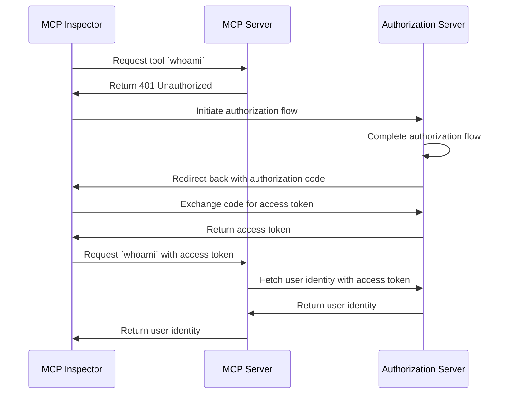

import TabItem from '@theme/TabItem';
import Tabs from '@theme/Tabs';

# Tutorial: Who am I?

This tutorial will guide you through the process of setting up MCP Auth to authenticate users and retrieve their identity information from the authorization server.

After completing this tutorial, you will have:

- A basic understanding of how to use MCP Auth to authenticate users.
- A MCP server that offers a tool to retrieve user identity information.

## Overview

The tutorial will involve the following components:

- **MCP server**: A simple MCP server that uses MCP official SDKs to handle requests.
- **MCP inspector**: A visual testing tool for MCP servers.
- **Authorization server**: An OAuth 2.1 or OpenID Connect provider that manages user identities and issues access tokens.

Here's a high-level diagram of the interaction between these components:



## Understand your authorization server

### Retrieving user identity information

To complete this tutorial, your authorization server should offer an API to retrieve user identity information:

<Tabs groupId="provider">
<TabItem value="logto" label="Logto">

[Logto](https://logto.io) is an OpenID Connect provider that supports the standard [userinfo endpoint](https://openid.net/specs/openid-connect-core-1_0.html#UserInfo) to retrieve user identity information.

To fetch an access token that can be used to access the userinfo endpoint, at least two scopes are required: `openid` and `profile`. You can continue reading as we'll cover the scope configuration later.

</TabItem>
<TabItem value="oidc" label="OIDC">

Most OpenID Connect providers support the [userinfo endpoint](https://openid.net/specs/openid-connect-core-1_0.html#UserInfo) to retrieve user identity information.

Check your provider's documentation to see if it supports this endpoint. If your provider supports [OpenID Connect Discovery](https://openid.net/specs/openid-connect-discovery-1_0.html), you can also check if the `userinfo_endpoint` is included in the discovery document (response from the `.well-known/openid-configuration` endpoint).

To fetch an access token that can be used to access the userinfo endpoint, at least two scopes are required: `openid` and `profile`. Check your provider's documentation to see the mapping of scopes to user identity claims.

</TabItem>
<TabItem value="oauth" label="OAuth 2">

While OAuth 2.0 does not define a standard way to retrieve user identity information, many providers implement their own endpoints to do so. Check your provider's documentation to see how to retrieve user identity information using an access token and what parameters are required to fetch such access token when invoking the authorization flow.

</TabItem>
</Tabs>

### Dynamic Client Registration

Dynamic Client Registration is not required for this tutorial, but it can be useful if you want to automate the MCP client registration process with your authorization server. Check [Is Dynamic Client Registration required?](../providers-list.mdx#is-dcr-required) for more details.

## Set up the MCP server

We will use the [MCP official SDKs](https://github.com/modelcontextprotocol) to create a MCP server with a `whoami` tool that retrieves user identity information from the authorization server.

### Install the MCP SDK

<Tabs groupId="sdk">
<TabItem value="python" label="Python">

```bash
pip install "mcp[cli]"
```

Or any other package manager you prefer, such as `uv` or `poetry`.

</TabItem>
<TabItem value="node" label="Node.js">

```bash
npm install @modelcontextprotocol/sdk
```

Or any other package manager you prefer, such as `pnpm` or `yarn`.

</TabItem>
</Tabs>

### Create the MCP server

Now, let's create an MCP server that implements a `whoami` tool:

<Tabs groupId="sdk">
<TabItem value="python" label="Python">

```python server.py
from mcp.server.fastmcp import FastMCP
from starlette.applications import Starlette
from starlette.routing import Mount

mcp = FastMCP("WhoAmI")

@mcp.tool()
def whoami():
    """
    A tool that returns the user identity information.
    """
    return {"error": "Unauthorized"}

app = Starlette(
    routes=[
        Mount('/mcp', app=mcp.sse_app()),
    ]
)
```

</TabItem>
<TabItem value="node" label="Node.js">

</TabItem>
</Tabs>
