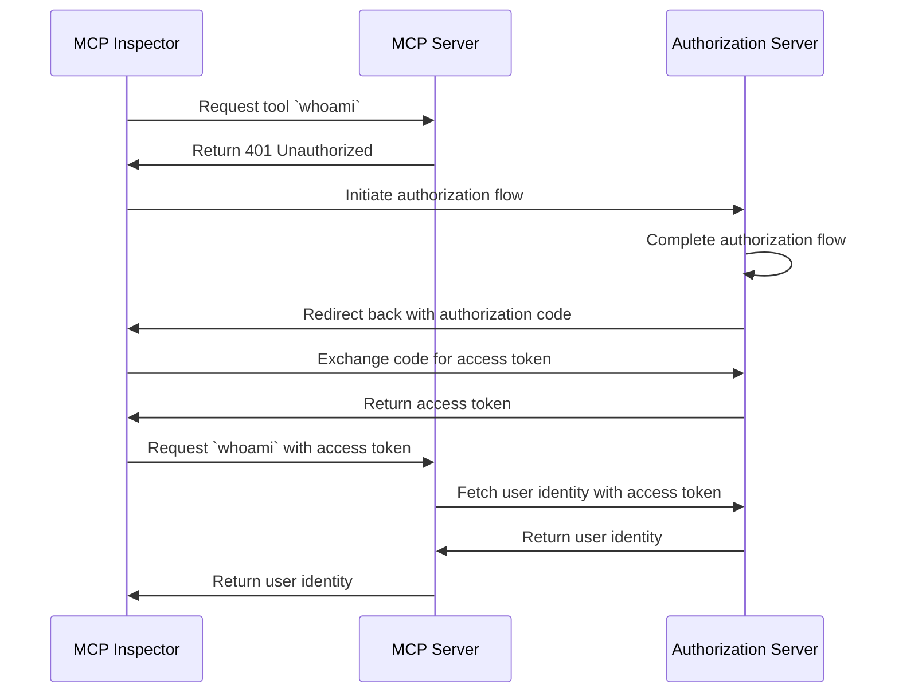
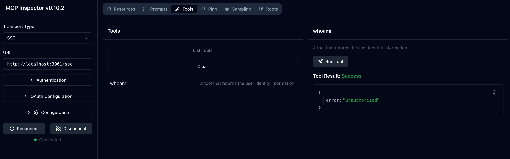
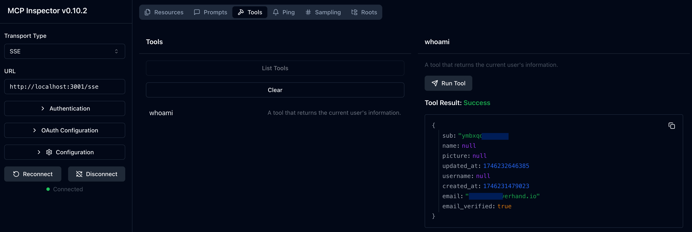

import TabItem from '@theme/TabItem';
import Tabs from '@theme/Tabs';

import WhoamiSetupOauth from './_whoami-setup-oauth.mdx';
import WhoamiSetupOidc from './_whoami-setup-oidc.mdx';

# Tutorial: Who am I?

This tutorial will guide you through the process of setting up MCP Auth to authenticate users and retrieve their identity information from the authorization server.

After completing this tutorial, you will have:

- ✅ A basic understanding of how to use MCP Auth to authenticate users.
- ✅ A MCP server that offers a tool to retrieve user identity information.

## Overview

The tutorial will involve the following components:

- **MCP server**: A simple MCP server that uses MCP official SDKs to handle requests.
- **MCP inspector**: A visual testing tool for MCP servers. It also acts as an OAuth / OIDC client to initiate the authorization flow and retrieve access tokens.
- **Authorization server**: An OAuth 2.1 or OpenID Connect provider that manages user identities and issues access tokens.

Here's a high-level diagram of the interaction between these components:



## Understand your authorization server

### Retrieving user identity information

To complete this tutorial, your authorization server should offer an API to retrieve user identity information:

<Tabs groupId="provider">
<TabItem value="logto" label="Logto">

[Logto](https://logto.io) is an OpenID Connect provider that supports the standard [userinfo endpoint](https://openid.net/specs/openid-connect-core-1_0.html#UserInfo) to retrieve user identity information.

To fetch an access token that can be used to access the userinfo endpoint, at least two scopes are required: `openid` and `profile`. You can continue reading as we'll cover the scope configuration later.

</TabItem>
<TabItem value="oidc" label="OIDC">

Most OpenID Connect providers support the [userinfo endpoint](https://openid.net/specs/openid-connect-core-1_0.html#UserInfo) to retrieve user identity information.

Check your provider's documentation to see if it supports this endpoint. If your provider supports [OpenID Connect Discovery](https://openid.net/specs/openid-connect-discovery-1_0.html), you can also check if the `userinfo_endpoint` is included in the discovery document (response from the `.well-known/openid-configuration` endpoint).

To fetch an access token that can be used to access the userinfo endpoint, at least two scopes are required: `openid` and `profile`. Check your provider's documentation to see the mapping of scopes to user identity claims.

</TabItem>
<TabItem value="oauth" label="OAuth 2">

While OAuth 2.0 does not define a standard way to retrieve user identity information, many providers implement their own endpoints to do so. Check your provider's documentation to see how to retrieve user identity information using an access token and what parameters are required to fetch such access token when invoking the authorization flow.

</TabItem>
</Tabs>

### Dynamic Client Registration

Dynamic Client Registration is not required for this tutorial, but it can be useful if you want to automate the MCP client registration process with your authorization server. Check [Is Dynamic Client Registration required?](../provider-list.mdx#is-dcr-required) for more details.

## Set up the MCP server

We will use the [MCP official SDKs](https://github.com/modelcontextprotocol) to create a MCP server with a `whoami` tool that retrieves user identity information from the authorization server.

### Create a new project

<Tabs groupId="sdk">
<TabItem value="python" label="Python">

```bash
mkdir mcp-server
cd mcp-server
uv init # Or use `pipenv` or `poetry` to create a new virtual environment
```

</TabItem>
<TabItem value="node" label="Node.js">

Set up a new Node.js project:

```bash
mkdir mcp-server
cd mcp-server
npm init -y # Or use `pnpm init`
npm pkg set type="module"
npm pkg set main="whoami.js"
npm pkg set scripts.start="node whoami.js"
```

</TabItem>
</Tabs>

### Install the MCP SDK and dependencies

<Tabs groupId="sdk">
<TabItem value="python" label="Python">

```bash
pip install "mcp[cli]" starlette uvicorn
```

Or any other package manager you prefer, such as `uv` or `poetry`.

</TabItem>
<TabItem value="node" label="Node.js">

```bash
npm install @modelcontextprotocol/sdk express
```

Or any other package manager you prefer, such as `pnpm` or `yarn`.

</TabItem>
</Tabs>

### Create the MCP server

First, let's create an MCP server that implements a `whoami` tool.

<Tabs groupId="sdk">
<TabItem value="python" label="Python">

Create a file named `whoami.py` and add the following code:

```python
from mcp.server.fastmcp import FastMCP
from starlette.applications import Starlette
from starlette.routing import Mount

mcp = FastMCP("WhoAmI")

@mcp.tool()
def whoami() -> dict[str, Any]:
    """A tool that returns the current user's information."""
    return {"error": "Not authenticated"}

app = Starlette(
    routes=[Mount('/', app=mcp.sse_app())]
)
```

Run the server with:

```bash
uvicorn whoami:app --host 0.0.0.0 --port 3001
```

</TabItem>
<TabItem value="node" label="Node.js">

:::note
Since the current MCP inspector implementation does not handle authorization flows, we will use the SSE approach to set up the MCP server. We'll update the code here once the MCP inspector supports authorization flows.
:::

You can also use `pnpm` or `yarn` if you prefer.

Create a file named `whoami.js` and add the following code:

```js
import { McpServer } from '@modelcontextprotocol/sdk/server/mcp.js';
import { SSEServerTransport } from '@modelcontextprotocol/sdk/server/sse.js';
import express from 'express';

// Create an MCP server
const server = new McpServer({
  name: 'WhoAmI',
  version: '0.0.0',
});

// Add a tool to the server that returns the current user's information
server.tool('whoami', async () => {
  return {
    content: [{ type: 'text', text: JSON.stringify({ error: 'Not authenticated' }) }],
  };
});

// Below is the boilerplate code from MCP SDK documentation
const PORT = 3001;
const app = express();

const transports = {};

app.get('/sse', async (_req, res) => {
  const transport = new SSEServerTransport('/messages', res);
  transports[transport.sessionId] = transport;

  res.on('close', () => {
    delete transports[transport.sessionId];
  });

  await server.connect(transport);
});

app.post('/messages', async (req, res) => {
  const sessionId = String(req.query.sessionId);
  const transport = transports[sessionId];
  if (transport) {
    await transport.handlePostMessage(req, res, req.body);
  } else {
    res.status(400).send('No transport found for sessionId');
  }
});

app.listen(PORT);
```

Run the server with:

```bash
npm start
```

</TabItem>
</Tabs>

## Inspect the MCP server

### Clone and run MCP inspector

Now that we have the MCP server running, we can use the MCP inspector to see if the `whoami` tool is available.

Due to the limit of the current implementation, we've forked the [MCP inspector](https://github.com/mcp-auth/inspector) to make it more flexible and scalable for authentication and authorization. We've also submitted a pull request to the original repository to include our changes.

To run the MCP inspector, you can use the following command (Node.js is required):

```bash
git clone https://github.com/mcp-auth/inspector.git
cd inspector
npm install
npm run dev
```

Then, open your browser and navigate to `http://localhost:6274/` (or other URL shown in the terminal) to access the MCP inspector.

### Connect MCP inspector to the MCP server

Before we proceed, check the following configuration in MCP inspector:

- **Transport Type**: Set to `SSE`.
- **URL**: Set to the URL of your MCP server. In our case, it should be `http://localhost:3001/sse`.

Now you can click the "Connect" button to see if the MCP inspector can connect to the MCP server. If everything is okay, you should see the "Connected" status in the MCP inspector.

### Checkpoint: Run the `whoami` tool

1. In the top menu of the MCP inspector, click on the "Tools" tab.
2. Click on the "List Tools" button.
3. You should see the `whoami` tool listed on the page. Click on it to open the tool details.
4. You should see the "Run Tool" button in the right side. Click on it to run the tool.
5. You should see the tool result with the JSON response `{"error": "Not authenticated"}`.



## Integrate with your authorization server

To complete this section, there are several considerations to take into account:

<details>
<summary>**The issuer URL of your authorization server**</summary>

This is usually the base URL of your authorization server, such as `https://auth.example.com`. Some providers may have a path like `https://example.logto.app/oidc`, so make sure to check your provider's documentation.

</details>

<details>
<summary>**How to retrieve the authorization server metadata**</summary>

- If your authorization server conforms to the [OAuth 2.0 Authorization Server Metadata](https://datatracker.ietf.org/doc/html/rfc8414) or [OpenID Connect Discovery](https://openid.net/specs/openid-connect-discovery-1_0.html), you can use the MCP Auth built-in utilities to fetch the metadata automatically.
- If your authorization server does not conform to these standards, you will need to manually specify the metadata URL or endpoints in the MCP server configuration. Check your provider's documentation for the specific endpoints.

</details>

<details>
<summary>**How to register the MCP inspector as a client in your authorization server**</summary>

- If your authorization server supports [Dynamic Client Registration](https://datatracker.ietf.org/doc/html/rfc7591), you can skip this step as the MCP inspector will automatically register itself as a client.
- If your authorization server does not support Dynamic Client Registration, you will need to manually register the MCP inspector as a client in your authorization server.

</details>

<details>
<summary>**How to retrieve user identity information and how to configure the authorization request parameters**</summary>

- For OpenID Connect providers: usually you need to request at least the `openid` and `profile` scopes when initiating the authorization flow. This will ensure that the access token returned by the authorization server contains the necessary scopes to access the [userinfo endpoint](https://openid.net/specs/openid-connect-core-1_0.html#UserInfo) to retrieve user identity information.

  Note: Some of the providers may not support the userinfo endpoint.

- For OAuth 2.0 / OAuth 2.1 providers: check your provider's documentation to see how to retrieve user identity information using an access token and what parameters are required to fetch such access token when invoking the authorization flow.

</details>

While each provider may have its own specific requirements, the following steps will guide you through the process of integrating the MCP inspector and MCP server with provider-specific configurations.

### Register MCP inspector as a client

<Tabs groupId="provider">
<TabItem value="logto" label="Logto">

Integrating with [Logto](https://logto.io) is straightforward as it's an OpenID Connect provider that supports the standard [userinfo endpoint](https://openid.net/specs/openid-connect-core-1_0.html#UserInfo) to retrieve user identity information.

Since Logto does not support Dynamic Client Registration yet, you will need to manually register the MCP inspector as a client in your Logto tenant:

1. Open your MCP inspector, click on the "OAuth Configuration" button. Copy the **Redirect URL (auto-populated)** value, which should be something like `http://localhost:6274/oauth/callback`.
2. Sign in to [Logto Console](https://cloud.logto.io) (or your self-hosted Logto Console).
3. Navigate to the "Applications" tab, click on "Create application". In the bottom of the page, click on "Create app without framework".
4. Fill in the application details, then click on "Create application":
   - **Select an application type**: Choose "Single-page application".
   - **Application name**: Enter a name for your application, e.g., "MCP Inspector".
5. In the "Settings / Redirect URIs" section, paste the **Redirect URL (auto-populated)** value you copied from the MCP inspector. Then click on "Save changes" in the bottom bar.
6. In the top card, you will see the "App ID" value. Copy it.
7. Go back to the MCP inspector and paste the "App ID" value in the "OAuth Configuration" section under "Client ID".
8. Enter the value `{"scope": "openid profile email"}` in the "Auth Params" field. This will ensure that the access token returned by Logto contains the necessary scopes to access the userinfo endpoint.

</TabItem>
<TabItem value="oidc" label="OIDC">

:::note
This is a generic OpenID Connect provider integration guide. Check your provider's documentation for specific details.
:::

If your OpenID Connect provider supports Dynamic Client Registration, you can directly go to step 8 below to configure the MCP inspector; otherwise, you will need to manually register the MCP inspector as a client in your OpenID Connect provider:

1. Open your MCP inspector, click on the "OAuth Configuration" button. Copy the **Redirect URL (auto-populated)** value, which should be something like `http://localhost:6274/oauth/callback`.
2. Sign in to your OpenID Connect provider's console.
3. Navigate to the "Applications" or "Clients" section, then create a new application or client.
4. If your provider requires a client type, select "Single-page application" or "Public client".
5. After creating the application, you will need to configure the redirect URI. Paste the **Redirect URL (auto-populated)** value you copied from the MCP inspector.
6. Find the "Client ID" or "Application ID" of the newly created application and copy it.
7. Go back to the MCP inspector and paste the "Client ID" value in the "OAuth Configuration" section under "Client ID".
8. For standard OpenID Connect providers, you can enter the following value in the "Auth Params" field to request the necessary scopes to access the userinfo endpoint:

```json
{ "scope": "openid profile email" }
```

</TabItem>
<TabItem value="oauth" label="OAuth 2">

:::note
This is a generic OAuth 2.0 / OAuth 2.1 provider integration guide. Check your provider's documentation for specific details.
:::

If your OAuth 2.0 / OAuth 2.1 provider supports Dynamic Client Registration, you can directly go to step 8 below to configure the MCP inspector; otherwise, you will need to manually register the MCP inspector as a client in your OAuth 2.0 / OAuth 2.1 provider:

1. Open your MCP inspector, click on the "OAuth Configuration" button. Copy the **Redirect URL (auto-populated)** value, which should be something like `http://localhost:6274/oauth/callback`.
2. Sign in to your OAuth 2.0 / OAuth 2.1 provider's console.
3. Navigate to the "Applications" or "Clients" section, then create a new application or client.
4. If your provider requires a client type, select "Single-page application" or "Public client".
5. After creating the application, you will need to configure the redirect URI. Paste the **Redirect URL (auto-populated)** value you copied from the MCP inspector.
6. Find the "Client ID" or "Application ID" of the newly created application and copy it.
7. Go back to the MCP inspector and paste the "Client ID" value in the "OAuth Configuration" section under "Client ID".
8. Read your provider's documentation to see how to retrieve access tokens for user identity information. You may need to specify the scopes or parameters required to fetch the access token. For example, if your provider requires the `profile` scope to access user identity information, you can enter the following value in the "Auth Params" field:

```json
{ "scope": "profile" }
```

</TabItem>
</Tabs>

### Set up MCP auth

In your MCP server project, you need to install the MCP Auth SDK and configure it to use your authorization server metadata.

<Tabs groupId="sdk">
<TabItem value="python" label="Python">

First, install the `mcpauth` package:

```bash
pip install mcpauth
```

Or any other package manager you prefer, such as `uv` or `poetry`.

</TabItem>
<TabItem value="node" label="Node.js">

First, install the `mcp-auth` package:

```bash
npm install mcp-auth
```

</TabItem>
</Tabs>

MCP Auth requires the authorization server metadata to be able to initialize. Depending on your provider:

<Tabs groupId="provider">

<TabItem value="logto" label="Logto">

The issuer URL can be found in your application details page in Logto Console, in the "Endpoints & Credentials / Issuer endpoint" section. It should look like `https://my-project.logto.app/oidc`.

<WhoamiSetupOidc />

</TabItem>
<TabItem value="oidc" label="OIDC">

The following code also assumes that the authorization server supports the [userinfo endpoint](https://openid.net/specs/openid-connect-core-1_0.html#UserInfo) to retrieve user identity information. If your provider does not support this endpoint, you will need to check your provider's documentation for the specific endpoint and replace the userinfo endpoint variable with the correct URL.

<WhoamiSetupOidc showAlternative />

</TabItem>
<TabItem value="oauth" label="OAuth 2">

As we mentioned earlier, OAuth 2.0 does not define a standard way to retrieve user identity information. The following code assumes that your provider has a specific endpoint to retrieve user identity information using an access token. You will need to check your provider's documentation for the specific endpoint and replace the userinfo endpoint variable with the correct URL.

<WhoamiSetupOauth />

</TabItem>
</Tabs>

### Update MCP server

We are almost done! It's time to update the MCP server to apply the MCP Auth route and middleware function, then make the `whoami` tool return the actual user identity information.

<Tabs groupId="sdk">
<TabItem value="python" label="Python">

```python
@mcp.tool()
def whoami() -> dict[str, Any]:
    """A tool that returns the current user's information."""
    return (
        mcp_auth.auth_info.claims
        if mcp_auth.auth_info # This will be populated by the Bearer auth middleware
        else {"error": "Not authenticated"}
    )

# ...

bearer_auth = Middleware(mcp_auth.bearer_auth_middleware(verify_access_token))
app = Starlette(
    routes=[
        # Add the metadata route (`/.well-known/oauth-authorization-server`)
        mcp_auth.metadata_route(),
        # Protect the MCP server with the Bearer auth middleware
        Mount('/', app=mcp.sse_app(), middleware=[bearer_auth]),
    ],
)
```

</TabItem>
<TabItem value="node" label="Node.js">

```js
server.tool('whoami', ({ authInfo }) => {
  return {
    content: [
      { type: 'text', text: JSON.stringify(authInfo?.claims ?? { error: 'Not authenticated' }) },
    ],
  };
});

// ...

app.use(mcpAuth.delegatedRouter());
app.use(mcpAuth.bearerAuth(verifyToken));
```

</TabItem>
</Tabs>

## Checkpoint: Run the `whoami` tool with authentication

Restart your MCP server and open the MCP inspector in your browser. When you click the "Connect" button, you should be redirected to your authorization server's sign-in page.

Once you sign in and back to the MCP inspector, repeat the actions we did in the previous checkpoint to run the `whoami` tool. This time, you should see the user identity information returned by the authorization server.



<Tabs groupId="sdk">
<TabItem value="python" label="Python">

:::info
Check out the [MCP Auth Python SDK repository](https://github.com/mcp-auth/python/blob/master/samples/server/whoami.py) for the complete code of the MCP server (OIDC version).
:::

</TabItem>
<TabItem value="node" label="Node.js">

:::info
Check out the [MCP Auth Node.js SDK repository](https://github.com/mcp-auth/js/blob/master/packages/sample-servers/src) for the complete code of the MCP server (OIDC version). This directory contains both TypeScript and JavaScript versions of the code.
:::

</TabItem>
</Tabs>

## Closing notes

🎊 Congratulations! You have successfully completed the tutorial. Let's recap what we've done:

- Setting up a basic MCP server with the `whoami` tool
- Integrating the MCP server with an authorization server using MCP Auth
- Configuring the MCP Inspector to authenticate users and retrieve their identity information

You may also want to explore some advanced topics, including:

- Using [JWT (JSON Web Token)](https://auth.wiki/jwt) for authentication and authorization
- Leveraging [resource indicators (RFC 8707)](https://auth-wiki.logto.io/resource-indicator) to specify the resources being accessed
- Implementing custom access control mechanisms, such as [role-based access control (RBAC)](https://auth.wiki/rbac) or [attribute-based access control (ABAC)](https://auth.wiki/abac)

Be sure to check out other tutorials and documentation to make the most of MCP Auth.
