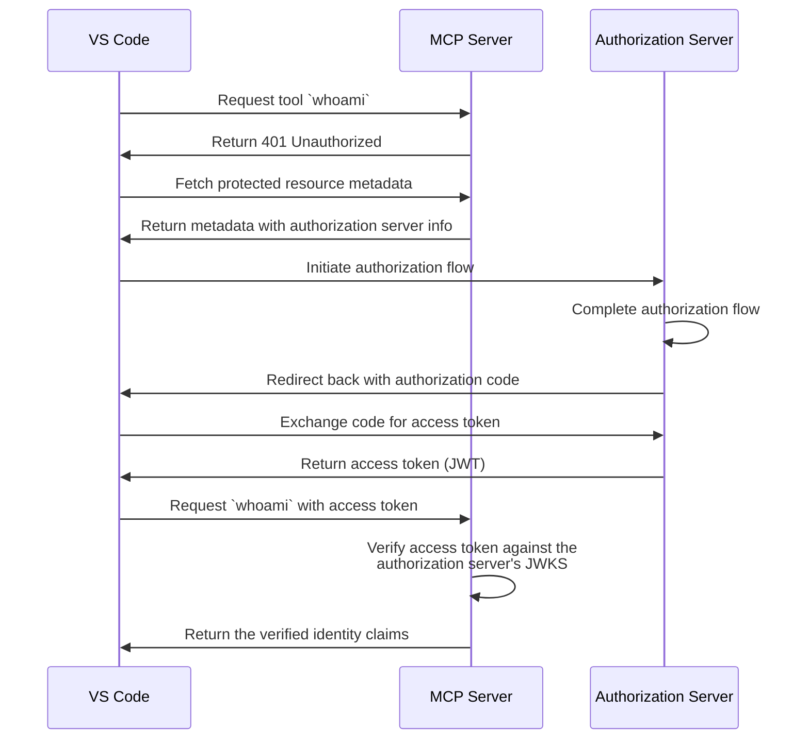

# Tutorial: Who am I?

:::tip Using a different authorization server?
This tutorial uses [Logto](https://logto.io) as the example authorization server. If you're using a different provider, check out our [Provider Guides](/docs/provider-guides) for configuration steps.
:::

This tutorial will guide you through the process of setting up MCP Auth to authenticate users and return their verified identity from the access token.

After completing this tutorial, you will have:

- ✅ A basic understanding of how to use MCP Auth to authenticate users.
- ✅ A MCP server that offers a tool to retrieve the current user's identity.

## Overview \{#overview}

The tutorial will involve the following components:

- **MCP server**: A simple MCP server that uses the MCP official SDK to handle requests, protected by MCP Auth.
- **VS Code**: A code editor with built-in MCP support. It also acts as an OAuth / OIDC client to initiate the authorization flow and retrieve access tokens.
- **Authorization server**: An OAuth 2.1 or OpenID Connect provider that manages user identities and issues access tokens.

Here's a high-level diagram of the interaction between these components:



## Understand your authorization server \{#understand-your-authorization-server}

### JWT access tokens bound to your MCP server \{#jwt-access-tokens-bound-to-your-mcp-server}

MCP Auth verifies JWT access tokens locally against your authorization server's JWKS, with no extra network call per request. The verified token claims (such as `sub`, the user's ID) are what the `whoami` tool will return.

The [latest MCP specification](https://modelcontextprotocol.io/specification/latest/basic/authorization) requires access tokens to be bound to the resource they are issued for ([RFC 8707](https://datatracker.ietf.org/doc/html/rfc8707)), and MCP Auth enforces it: the token's `aud` claim must match your MCP server's resource identifier. This means your authorization server should issue JWT access tokens with the correct audience when the MCP client requests them.

[Logto](https://logto.io) supports this through its API resources feature: create an API resource whose indicator matches your MCP server's URL, and Logto will issue audience-bound JWT access tokens for it. We'll cover the configuration later in this tutorial.

> 📖 See [Generic OAuth 2.0 / OIDC Provider Guide](/docs/provider-guides/generic#token-request-parameters) for how other providers handle resource and audience parameters.

### Dynamic Client Registration \{#dynamic-client-registration}

Dynamic Client Registration is not required for this tutorial, but it can be useful if you want to automate the MCP client registration process with your authorization server. Check [Is Dynamic Client Registration required?](/provider-list#is-dcr-required) for more details.

## Set up the MCP server \{#set-up-the-mcp-server}

We will use the [MCP official SDK](https://github.com/modelcontextprotocol) v2 to create a MCP server with a `whoami` tool that returns the current user's identity.

### Create a new project \{#create-a-new-project}

Set up a new Node.js project:

```bash
mkdir mcp-server
cd mcp-server
npm init -y # Or use `pnpm init`
npm pkg set type="module"
npm pkg set main="whoami.js"
npm pkg set scripts.start="node whoami.js"
```

:::note
The MCP SDK v2 and MCP Auth are ESM only and require Node.js >= 20.
:::

### Install the MCP SDK and dependencies \{#install-the-mcp-sdk-and-dependencies}

```bash
npm install @modelcontextprotocol/server @modelcontextprotocol/express @modelcontextprotocol/node express
```

Or any other package manager you prefer, such as `pnpm` or `yarn`.

- `@modelcontextprotocol/server` is the core MCP SDK, which speaks web-standard `Request` / `Response`.
- `@modelcontextprotocol/express` and `@modelcontextprotocol/node` adapt it to Express on Node.js.

### Create the MCP server \{#create-the-mcp-server}

First, let's create an MCP server that implements a `whoami` tool.

Create a file named `whoami.js` and add the following code:

```js
import { createMcpExpressApp } from '@modelcontextprotocol/express';
import { toNodeHandler } from '@modelcontextprotocol/node';
import { createMcpHandler, McpServer } from '@modelcontextprotocol/server';

// Factory function to create an MCP server instance
// Each request gets its own server instance, keeping requests isolated
const createMcpServer = () => {
  const mcpServer = new McpServer({
    name: 'WhoAmI',
    version: '0.0.0',
  });

  // Add a tool to the server that returns the current user's information
  mcpServer.registerTool(
    'whoami',
    {
      description: 'Get the current user information',
    },
    () => {
      return {
        content: [{ type: 'text', text: JSON.stringify({ error: 'Not authenticated' }) }],
      };
    }
  );

  return mcpServer;
};

const PORT = 3001;

// The MCP handler speaks web-standard Request / Response; `toNodeHandler` adapts it to Express
const mcpNodeHandler = toNodeHandler(createMcpHandler(createMcpServer));

const app = createMcpExpressApp();

app.all(
  '/',
  // `createMcpExpressApp` applies `express.json()`, which drains the request stream, so the
  // parsed body is passed along explicitly
  async (request, response) => mcpNodeHandler(request, response, request.body)
);

app.listen(PORT);
```

Run the server with:

```bash
npm start
```

## Integrate with your authorization server \{#integrate-with-your-authorization-server}

To complete this section, there are several considerations to take into account:

<details>
<summary>**The issuer URL of your authorization server**</summary>

This is usually the base URL of your authorization server, such as `https://auth.example.com`. Some providers may have a path like `https://example.logto.app/oidc`, so make sure to check your provider's documentation.

</details>

<details>
<summary>**How to retrieve the authorization server metadata**</summary>

- If your authorization server conforms to the [OAuth 2.0 Authorization Server Metadata](https://datatracker.ietf.org/doc/html/rfc8414) or [OpenID Connect Discovery](https://openid.net/specs/openid-connect-discovery-1_0.html), MCP Auth fetches the metadata automatically from the issuer URL.
- If your authorization server does not conform to these standards, you will need to manually specify the metadata URL or endpoints in the MCP server configuration. Check your provider's documentation for the specific endpoints.

</details>

<details>
<summary>**How to register VS Code as a client in your authorization server**</summary>

- If your authorization server supports [Dynamic Client Registration](https://datatracker.ietf.org/doc/html/rfc7591), you can skip this step as VS Code will automatically register itself as a client.
- If your authorization server does not support Dynamic Client Registration, you will need to manually register VS Code as a client in your authorization server.

</details>

<details>
<summary>**How to make your authorization server issue JWT access tokens for your MCP server**</summary>

MCP Auth validates the access token's audience (`aud`) against your MCP server's resource identifier, so the authorization server must issue JWT access tokens bound to that resource. Most providers do this when the client includes a resource or audience parameter in the authorization request. VS Code sends the resource parameter automatically based on your MCP server's protected resource metadata.

For Logto: create an API resource whose indicator matches your MCP server's URL. We'll walk through this below.

> 📖 See [Generic OAuth 2.0 / OIDC Provider Guide](/docs/provider-guides/generic#token-request-parameters) for details on other providers.

</details>

While each provider may have its own specific requirements, the following steps will guide you through the process of integrating VS Code and MCP server with Logto.

### Register VS Code as a client \{#register-vs-code-as-a-client}

Since Logto does not support Dynamic Client Registration yet, you will need to manually register VS Code as a client in your Logto tenant:

1. Sign in to [Logto Console](https://cloud.logto.io) (or your self-hosted Logto Console).
2. Navigate to the "Applications" tab, click on "Create application". In the bottom of the page, click on "Create app without framework".
3. Fill in the application details, then click on "Create application":
   - **Select an application type**: Choose "Native app".
   - **Application name**: Enter a name for your application, e.g., "VS Code".
4. In the "Settings / Redirect URIs" section, add the following redirect URIs for VS Code, then click on "Save changes" in the bottom bar:
   ```
   http://127.0.0.1
   https://vscode.dev/redirect
   ```
5. In the top card, you will see the "App ID" value. Copy it for later use.

> 📖 See [Logto Provider Guide](/docs/provider-guides/logto#register-mcp-client) for more details on registering MCP clients.

### Create an API resource for the MCP server \{#create-an-api-resource-for-the-mcp-server}

To make Logto issue JWT access tokens bound to your MCP server, create an API resource whose indicator matches the MCP server's URL:

1. In Logto Console, go to "API Resources" and click on "Create API resource".
2. Fill in the details, then click on "Create API resource":
   - **API name**: Enter a name, e.g., "Who am I".
   - **API identifier**: Enter `http://localhost:3001/`. It must match the resource identifier we'll configure in the MCP server.

:::note[Trailing slash in resource indicator]
Always include a trailing slash (`/`) in the resource indicator. Due to a current bug in the MCP official SDK, clients using the SDK will automatically append a trailing slash to resource identifiers when initiating auth requests. If your resource indicator doesn't include the trailing slash, resource validation will fail for those clients. (VS Code is not affected by this bug.)
:::

### Set up MCP auth \{#set-up-mcp-auth}

In your MCP server project, install the MCP Auth SDK:

```bash
npm install mcp-auth
```

Now, declare your MCP server as a protected resource: its resource identifier and the authorization server it trusts. The issuer URL can be found in your application details page in Logto Console, in the "Endpoints & Credentials / Issuer endpoint" section. It should look like `https://my-project.logto.app/oidc`.

Update the `whoami.js` to include the MCP Auth configuration:

```js
import { MCPAuth } from 'mcp-auth';

const authIssuer = '<issuer-endpoint>'; // Replace with your issuer endpoint

const mcpAuth = new MCPAuth({
  protectedResourceMetadata: {
    // The resource identifier; must match the API resource indicator registered in your provider
    resource: 'http://localhost:3001/',
    // The authorization server trusted by this MCP server
    authorizationServer: { issuer: authIssuer, type: 'oidc' },
  },
});
```

The authorization server metadata is fetched lazily when first needed and cached afterwards. The `MCPAuth` instance verifies JWT access tokens against the server's JWKS; signature, issuer, audience, and expiration are all enforced.

:::note
If your provider does not support OpenID Connect Discovery, you can manually specify the metadata URL or endpoints. Check [Other ways to configure MCP Auth](/docs/configure-server/mcp-auth#other-ways) for more details.
:::

### Update MCP server \{#update-mcp-server}

We are almost done! It's time to update the MCP server to serve the OAuth discovery documents, protect the MCP endpoint with the SDK's Bearer auth middleware, and make the `whoami` tool return the actual user identity.

```js
import { mcpAuthMetadataRouter, requireBearerAuth } from '@modelcontextprotocol/express';
import { getAuthInfo } from 'mcp-auth';

// In the factory function, update the `whoami` tool to return the verified identity claims
mcpServer.registerTool(
  'whoami',
  {
    description: 'Get the current user information',
  },
  (context) => {
    const { claims } = getAuthInfo(context);
    return {
      content: [{ type: 'text', text: JSON.stringify(claims) }],
    };
  }
);

// ...

// Serve the OAuth discovery documents (`/.well-known/...`) so VS Code can find your
// authorization server
app.use(mcpAuthMetadataRouter(await mcpAuth.getAuthMetadataOptions()));

// Replace the previous MCP route: require a valid Bearer token before handling MCP requests.
// The verified auth info flows to the handler via `req.auth`.
app.all('/', requireBearerAuth(mcpAuth.getBearerAuthOptions()), async (request, response) =>
  mcpNodeHandler(request, response, request.body)
);
```

## Checkpoint: Run the `whoami` tool with authentication \{#checkpoint-run-the-whoami-tool-with-authentication}

Restart your MCP server and connect VS Code to it. Here's how to connect with authentication:

1. In VS Code, press `Command + Shift + P` (macOS) or `Ctrl + Shift + P` (Windows/Linux) to open the Command Palette.
2. Type `MCP: Add Server...` and select it.
3. Choose `HTTP` as the server type.
4. Enter the MCP server URL: `http://localhost:3001/`
5. After an OAuth request is initiated, VS Code will prompt you to enter the **App ID** (Client ID). Enter the App ID you copied from your authorization server.
6. Since we don't have an **App Secret** (it's a public client), just press Enter to skip.
7. Complete the sign-in flow in your browser.

Once you sign in, you can use the `whoami` tool in VS Code. This time, you should see the verified identity claims from the access token, including `sub` (the user's ID), `iss` (the issuer), and `aud` (your MCP server's resource identifier).

:::info
Check out the [sample servers](https://github.com/mcp-auth/js/tree/master/packages/sample-servers) in the MCP Auth Node.js SDK repository for complete runnable projects: the `whoami` sample as a Cloudflare Worker, plus an Express variant (`whoami-express`) matching this tutorial.
:::

## Closing notes \{#closing-notes}

🎊 Congratulations! You have successfully completed the tutorial. Let's recap what we've done:

- Setting up a basic MCP server with the `whoami` tool
- Integrating the MCP server with an authorization server using MCP Auth
- Configuring VS Code to authenticate users and retrieve their identity from the verified access token

You may also want to explore some advanced topics, including:

- Enforcing [scope-based permissions](/docs/tutorials/todo-manager) for your tools
- Leveraging [resource indicators (RFC 8707)](https://auth-wiki.logto.io/resource-indicator) to specify the resources being accessed
- Implementing custom access control mechanisms, such as [role-based access control (RBAC)](https://auth.wiki/rbac) or [attribute-based access control (ABAC)](https://auth.wiki/abac)

Be sure to check out other tutorials and documentation to make the most of MCP Auth.
