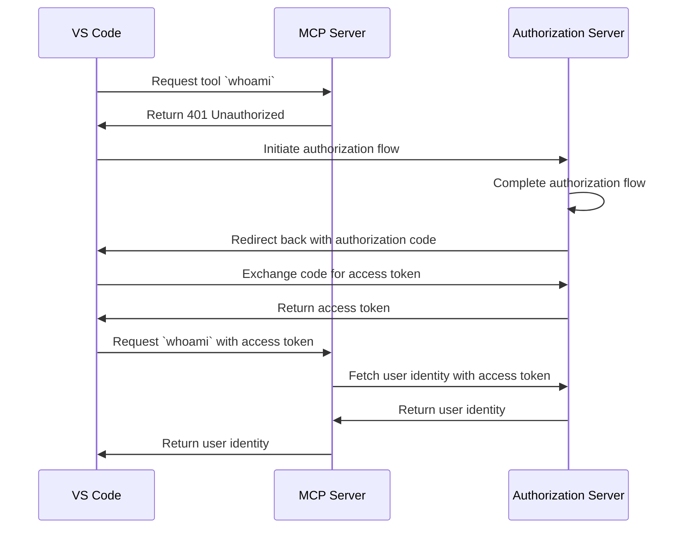

import TabItem from '@theme/TabItem';
import Tabs from '@theme/Tabs';

import SetupOauth from './_setup-oauth.mdx';
import SetupOidc from './_setup-oidc.mdx';

# Tutorial: Who am I?

:::tip Python SDK available
MCP Auth is also available for Python! Check out the [Python SDK repository](https://github.com/mcp-auth/python) for installation and usage.
:::

This tutorial will guide you through the process of setting up MCP Auth to authenticate users and retrieve their identity information from the authorization server.

After completing this tutorial, you will have:

- ✅ A basic understanding of how to use MCP Auth to authenticate users.
- ✅ A MCP server that offers a tool to retrieve user identity information.

## Overview \{#overview}

The tutorial will involve the following components:

- **MCP server**: A simple MCP server that uses MCP official SDKs to handle requests.
- **VS Code**: A code editor with built-in MCP support. It also acts as an OAuth / OIDC client to initiate the authorization flow and retrieve access tokens.
- **Authorization server**: An OAuth 2.1 or OpenID Connect provider that manages user identities and issues access tokens.

Here's a high-level diagram of the interaction between these components:



## Understand your authorization server \{#understand-your-authorization-server}

### Retrieving user identity information \{#retrieving-user-identity-information}

To complete this tutorial, your authorization server should offer an API to retrieve user identity information:

<Tabs groupId="provider">
<TabItem value="logto" label="Logto">

[Logto](https://logto.io) is an OpenID Connect provider that supports the standard [userinfo endpoint](https://openid.net/specs/openid-connect-core-1_0.html#UserInfo) to retrieve user identity information.

To fetch an access token that can be used to access the userinfo endpoint, at least two scopes are required: `openid` and `profile`. You can continue reading as we'll cover the scope configuration later.

</TabItem>
<TabItem value="keycloak" label="Keycloak">

[Keycloak](https://www.keycloak.org) is an open-source identity and access management solution that supports multiple protocols, including OpenID Connect (OIDC). As an OIDC provider, it implements the standard [userinfo endpoint](https://openid.net/specs/openid-connect-core-1_0.html#UserInfo) to retrieve user identity information.

To fetch an access token that can be used to access the userinfo endpoint, at least two scopes are required: `openid` and `profile`. You can continue reading as we'll cover the scope configuration later.

</TabItem>

<TabItem value="asgardeo" label="Asgardeo">

[Asgardeo](https://wso2.com/asgardeo) is a cloud-native identity as a service (IDaaS) platform that supports OAuth 2.0 and OpenID Connect (OIDC), providing robust identity and access management for modern applications.

User information is encoded inside the ID token returned along with the access token. But as an OIDC provider, Asgardeo exposes a [UserInfo endpoint](https://wso2.com/asgardeo/docs/guides/authentication/oidc/request-user-info/) that allows applications to retrieve claims about the authenticated user in the payload.

You can also discover this endpoint dynamically via the [OIDC discovery endpoint](https://wso2.com/asgardeo/docs/guides/authentication/oidc/discover-oidc-configs) or by navigating to the application's 'Info' tab in the Asgardeo Console.

To fetch an access token that can be used to access the userinfo endpoint, at least two scopes are required: `openid` and `profile`.
</TabItem>
<TabItem value="oidc" label="OIDC">

Most OpenID Connect providers support the [userinfo endpoint](https://openid.net/specs/openid-connect-core-1_0.html#UserInfo) to retrieve user identity information.

Check your provider's documentation to see if it supports this endpoint. If your provider supports [OpenID Connect Discovery](https://openid.net/specs/openid-connect-discovery-1_0.html), you can also check if the `userinfo_endpoint` is included in the discovery document (response from the `.well-known/openid-configuration` endpoint).

To fetch an access token that can be used to access the userinfo endpoint, at least two scopes are required: `openid` and `profile`. Check your provider's documentation to see the mapping of scopes to user identity claims.

</TabItem>
<TabItem value="oauth" label="OAuth 2">

While OAuth 2.0 does not define a standard way to retrieve user identity information, many providers implement their own endpoints to do so. Check your provider's documentation to see how to retrieve user identity information using an access token and what parameters are required to fetch such access token when invoking the authorization flow.

</TabItem>
</Tabs>

### Dynamic Client Registration \{#dynamic-client-registration}

Dynamic Client Registration is not required for this tutorial, but it can be useful if you want to automate the MCP client registration process with your authorization server. Check [Is Dynamic Client Registration required?](/provider-list#is-dcr-required) for more details.

## Set up the MCP server \{#set-up-the-mcp-server}

We will use the [MCP official SDKs](https://github.com/modelcontextprotocol) to create a MCP server with a `whoami` tool that retrieves user identity information from the authorization server.

### Create a new project \{#create-a-new-project}

Set up a new Node.js project:

```bash
mkdir mcp-server
cd mcp-server
npm init -y # Or use `pnpm init`
npm pkg set type="module"
npm pkg set main="whoami.js"
npm pkg set scripts.start="node whoami.js"
```

### Install the MCP SDK and dependencies \{#install-the-mcp-sdk-and-dependencies}

```bash
npm install @modelcontextprotocol/sdk express
```

Or any other package manager you prefer, such as `pnpm` or `yarn`.

### Create the MCP server \{#create-the-mcp-server}

First, let's create an MCP server that implements a `whoami` tool.

You can also use `pnpm` or `yarn` if you prefer.

Create a file named `whoami.js` and add the following code:

```js
import { McpServer } from '@modelcontextprotocol/sdk/server/mcp.js';
import { StreamableHTTPServerTransport } from '@modelcontextprotocol/sdk/server/streamableHttp.js';
import express from 'express';

// Factory function to create an MCP server instance
// In stateless mode, each request needs its own server instance
const createMcpServer = () => {
  const mcpServer = new McpServer({
    name: 'WhoAmI',
    version: '0.0.0',
  });

  // Add a tool to the server that returns the current user's information
  mcpServer.registerTool(
    'whoami',
    {
      description: 'Get the current user information',
      inputSchema: {},
    },
    () => {
      return {
        content: [{ type: 'text', text: JSON.stringify({ error: 'Not authenticated' }) }],
      };
    }
  );

  return mcpServer;
};

const PORT = 3001;
const app = express();

app.post('/', async (request, response) => {
  // In stateless mode, create a new instance of transport and server for each request
  // to ensure complete isolation. A single instance would cause request ID collisions
  // when multiple clients connect concurrently.
  const mcpServer = createMcpServer();
  const transport = new StreamableHTTPServerTransport({ sessionIdGenerator: undefined });
  await mcpServer.connect(transport);
  await transport.handleRequest(request, response, request.body);
  response.on('close', () => {
    transport.close();
    mcpServer.close();
  });
});

app.listen(PORT);
```

Run the server with:

```bash
npm start
```

## Integrate with your authorization server \{#integrate-with-your-authorization-server}

To complete this section, there are several considerations to take into account:

<details>
<summary>**The issuer URL of your authorization server**</summary>

This is usually the base URL of your authorization server, such as `https://auth.example.com`. Some providers may have a path like `https://example.logto.app/oidc`, so make sure to check your provider's documentation.

</details>

<details>
<summary>**How to retrieve the authorization server metadata**</summary>

- If your authorization server conforms to the [OAuth 2.0 Authorization Server Metadata](https://datatracker.ietf.org/doc/html/rfc8414) or [OpenID Connect Discovery](https://openid.net/specs/openid-connect-discovery-1_0.html), you can use the MCP Auth built-in utilities to fetch the metadata automatically.
- If your authorization server does not conform to these standards, you will need to manually specify the metadata URL or endpoints in the MCP server configuration. Check your provider's documentation for the specific endpoints.

</details>

<details>
<summary>**How to register VS Code as a client in your authorization server**</summary>

- If your authorization server supports [Dynamic Client Registration](https://datatracker.ietf.org/doc/html/rfc7591), you can skip this step as VS Code will automatically register itself as a client.
- If your authorization server does not support Dynamic Client Registration, you will need to manually register VS Code as a client in your authorization server.

</details>

<details>
<summary>**How to retrieve user identity information and how to configure the authorization request parameters**</summary>

- For OpenID Connect providers: usually you need to request at least the `openid` and `profile` scopes when initiating the authorization flow. This will ensure that the access token returned by the authorization server contains the necessary scopes to access the [userinfo endpoint](https://openid.net/specs/openid-connect-core-1_0.html#UserInfo) to retrieve user identity information.

  Note: Some of the providers may not support the userinfo endpoint.

- For OAuth 2.0 / OAuth 2.1 providers: check your provider's documentation to see how to retrieve user identity information using an access token and what parameters are required to fetch such access token when invoking the authorization flow.

</details>

While each provider may have its own specific requirements, the following steps will guide you through the process of integrating VS Code and MCP server with provider-specific configurations.

### Register VS Code as a client \{#register-vs-code-as-a-client}

<Tabs groupId="provider">
<TabItem value="logto" label="Logto">

Integrating with [Logto](https://logto.io) is straightforward as it's an OpenID Connect provider that supports the standard [userinfo endpoint](https://openid.net/specs/openid-connect-core-1_0.html#UserInfo) to retrieve user identity information.

Since Logto does not support Dynamic Client Registration yet, you will need to manually register VS Code as a client in your Logto tenant:

1. Sign in to [Logto Console](https://cloud.logto.io) (or your self-hosted Logto Console).
2. Navigate to the "Applications" tab, click on "Create application". In the bottom of the page, click on "Create app without framework".
3. Fill in the application details, then click on "Create application":
   - **Select an application type**: Choose "Native app".
   - **Application name**: Enter a name for your application, e.g., "VS Code".
4. In the "Settings / Redirect URIs" section, add the following redirect URIs for VS Code, then click on "Save changes" in the bottom bar:
   ```
   http://127.0.0.1
   https://vscode.dev/redirect
   ```
5. In the top card, you will see the "App ID" value. Copy it for later use.

</TabItem>
<TabItem value="keycloak" label="Keycloak">

[Keycloak](https://www.keycloak.org) is an open-source identity and access management solution that supports OpenID Connect protocol.

While Keycloak supports dynamic client registration, its client registration endpoint does not support CORS, preventing most MCP clients from registering directly. Therefore, we'll need to manually register our client.

:::note
Although Keycloak can be installed in [various ways](https://www.keycloak.org/guides#getting-started) (bare metal, kubernetes, etc.), for this tutorial, we'll use Docker for a quick and straightforward setup.
:::

Let's set up a Keycloak instance and configure it for our needs:

1. First, run a Keycloak instance using Docker following the [official documentation](https://www.keycloak.org/getting-started/getting-started-docker):

```bash
docker run -p 8080:8080 -e KC_BOOTSTRAP_ADMIN_USERNAME=admin -e KC_BOOTSTRAP_ADMIN_PASSWORD=admin quay.io/keycloak/keycloak:26.2.4 start-dev
```

2. Access the Keycloak Admin Console (http://localhost:8080/admin) and log in with these credentials:

   - Username: `admin`
   - Password: `admin`

3. Create a new Realm:

   - Click "Create Realm" in the top-left corner
   - Enter `mcp-realm` in the "Realm name" field
   - Click "Create"

4. Create a test user:

   - Click "Users" in the left menu
   - Click "Create new user"
   - Fill in the user details:
     - Username: `testuser`
     - First name and Last name can be any values
   - Click "Create"
   - In the "Credentials" tab, set a password and uncheck "Temporary"

5. Register VS Code as a client:

   - In the Keycloak Admin Console, click "Clients" in the left menu
   - Click "Create client"
   - Fill in the client details:
     - Client type: Select "OpenID Connect"
     - Client ID: Enter `vscode`
     - Click "Next"
   - On the "Capability config" page:
     - Ensure "Standard flow" is enabled
     - Click "Next"
   - On the "Login settings" page:
     - Add `http://127.0.0.1/*` to "Valid redirect URIs"
     - Add `https://vscode.dev/redirect` to "Valid redirect URIs"
     - Click "Save"
   - Copy the "Client ID" (which is `vscode`) for later use.

 </TabItem>
<TabItem value="asgardeo" label="Asgardeo">

While Asgardeo supports dynamic client registration via a standard API, the endpoint is protected and requires an access token with the necessary permissions. In this tutorial, we'll register the client manually through the Asgardeo Console.

:::note
If you don't have an Asgardeo account, you can [sign up for free](https://asgardeo.io).
:::

Follow these steps to configure Asgardeo for VS Code:

1. Log in to the [Asgardeo Console](https://console.asgardeo.io) and select your organization.

2. Create a new application:
    - Go to **Applications** → **New Application**
    - Choose **Standard-Based Application** → **OAuth 2.0/OpenID Connect**
    - Enter an application name like `VS Code`
    - In the **Authorized Redirect URLs** field, add:
      - `http://127.0.0.1`
      - `https://vscode.dev/redirect`
    - Click **Create**

3. Configure the protocol settings:
    - Under the **Protocol** tab:
    - Copy the **Client ID** that was auto generated for later use.
    - Ensure switching to `JWT` for the `Token Type` in **Access Token** section
    - Click **Update**

 </TabItem>
<TabItem value="oidc" label="OIDC">

:::note
This is a generic OpenID Connect provider integration guide. Check your provider's documentation for specific details.
:::

If your OpenID Connect provider supports Dynamic Client Registration, VS Code will automatically register itself; otherwise, you will need to manually register VS Code as a client in your OpenID Connect provider:

1. Sign in to your OpenID Connect provider's console.
2. Navigate to the "Applications" or "Clients" section, then create a new application or client.
3. If your provider requires a client type, select "Native app" or "Public client".
4. Configure the redirect URIs with the following values:
   - `http://127.0.0.1`
   - `https://vscode.dev/redirect`
5. Find the "Client ID" or "Application ID" of the newly created application and copy it for later use.

</TabItem>
<TabItem value="oauth" label="OAuth 2">

:::note
This is a generic OAuth 2.0 / OAuth 2.1 provider integration guide. Check your provider's documentation for specific details.
:::

If your OAuth 2.0 / OAuth 2.1 provider supports Dynamic Client Registration, VS Code will automatically register itself; otherwise, you will need to manually register VS Code as a client in your OAuth 2.0 / OAuth 2.1 provider:

1. Sign in to your OAuth 2.0 / OAuth 2.1 provider's console.
2. Navigate to the "Applications" or "Clients" section, then create a new application or client.
3. If your provider requires a client type, select "Native app" or "Public client".
4. Configure the redirect URIs with the following values:
   - `http://127.0.0.1`
   - `https://vscode.dev/redirect`
5. Find the "Client ID" or "Application ID" of the newly created application and copy it for later use.

</TabItem>
</Tabs>

### Set up MCP auth \{#set-up-mcp-auth}

In your MCP server project, you need to install the MCP Auth SDK and configure it to use your authorization server metadata.

First, install the `mcp-auth` package:

```bash
npm install mcp-auth
```

MCP Auth requires the authorization server metadata to be able to initialize. Depending on your provider:

<Tabs groupId="provider">

<TabItem value="logto" label="Logto">

The issuer URL can be found in your application details page in Logto Console, in the "Endpoints & Credentials / Issuer endpoint" section. It should look like `https://my-project.logto.app/oidc`.

<SetupOidc />

</TabItem>

<TabItem value="keycloak" label="Keycloak">

The issuer URL can be found in your Keycloak Admin Console. In your 'mcp-realm', navigate to "Realm settings / Endpoints" section and click on "OpenID Endpoint Configuration" link. The `issuer` field in the JSON document will contain your issuer URL, which should look like `http://localhost:8080/realms/mcp-realm`.

<SetupOidc />

</TabItem>

<TabItem value="asgardeo" label="Asgardeo">

    You can find the issuer URL in the Asgardeo Console. Navigate to the created application, and open the **Info** tab. The **Issuer** field will be displayed there and should look like:
    `https://api.asgardeo.io/t/<your-organization-name>/oauth2/token`

    <SetupOidc />

</TabItem>

<TabItem value="oidc" label="OIDC">

The following code also assumes that the authorization server supports the [userinfo endpoint](https://openid.net/specs/openid-connect-core-1_0.html#UserInfo) to retrieve user identity information. If your provider does not support this endpoint, you will need to check your provider's documentation for the specific endpoint and replace the userinfo endpoint variable with the correct URL.

<SetupOidc showAlternative />

</TabItem>
<TabItem value="oauth" label="OAuth 2">

As we mentioned earlier, OAuth 2.0 does not define a standard way to retrieve user identity information. The following code assumes that your provider has a specific endpoint to retrieve user identity information using an access token. You will need to check your provider's documentation for the specific endpoint and replace the userinfo endpoint variable with the correct URL.

<SetupOauth />

</TabItem>
</Tabs>

### Update MCP server \{#update-mcp-server}

We are almost done! It's time to update the MCP server to apply the MCP Auth route and middleware function, then make the `whoami` tool return the actual user identity information.

```js
// In the factory function, update the `whoami` tool to return the actual user identity
mcpServer.registerTool(
  'whoami',
  {
    description: 'Get the current user information',
    inputSchema: {},
  },
  (_params, { authInfo }) => {
    return {
      content: [
        {
          type: 'text',
          text: JSON.stringify(authInfo?.claims ?? { error: 'Not authenticated' }),
        },
      ],
    };
  }
);

// ...

// Apply MCP Auth middleware before the MCP endpoint
app.use(mcpAuth.delegatedRouter());
app.use(mcpAuth.bearerAuth(verifyToken));
```

## Checkpoint: Run the `whoami` tool with authentication \{#checkpoint-run-the-whoami-tool-with-authentication}

Restart your MCP server and connect VS Code to it. Here's how to connect with authentication:

1. In VS Code, press `Command + Shift + P` (macOS) or `Ctrl + Shift + P` (Windows/Linux) to open the Command Palette.
2. Type `MCP: Add Server...` and select it.
3. Choose `HTTP` as the server type.
4. Enter the MCP server URL: `http://localhost:3001/`
5. After an OAuth request is initiated, VS Code will prompt you to enter the **App ID** (Client ID). Enter the App ID you copied from your authorization server.
6. Since we don't have an **App Secret** (it's a public client), just press Enter to skip.
7. Complete the sign-in flow in your browser.

Once you sign in, you can use the `whoami` tool in VS Code. This time, you should see the user identity information returned by the authorization server.

:::info
Check out the [MCP Auth Node.js SDK repository](https://github.com/mcp-auth/js/blob/master/packages/sample-servers/src) for the complete code of the MCP server (OIDC version). This directory contains both TypeScript and JavaScript versions of the code.
:::

## Closing notes \{#closing-notes}

🎊 Congratulations! You have successfully completed the tutorial. Let's recap what we've done:

- Setting up a basic MCP server with the `whoami` tool
- Integrating the MCP server with an authorization server using MCP Auth
- Configuring VS Code to authenticate users and retrieve their identity information

You may also want to explore some advanced topics, including:

- Using [JWT (JSON Web Token)](https://auth.wiki/jwt) for authentication and authorization
- Leveraging [resource indicators (RFC 8707)](https://auth-wiki.logto.io/resource-indicator) to specify the resources being accessed
- Implementing custom access control mechanisms, such as [role-based access control (RBAC)](https://auth.wiki/rbac) or [attribute-based access control (ABAC)](https://auth.wiki/abac)

Be sure to check out other tutorials and documentation to make the most of MCP Auth.
