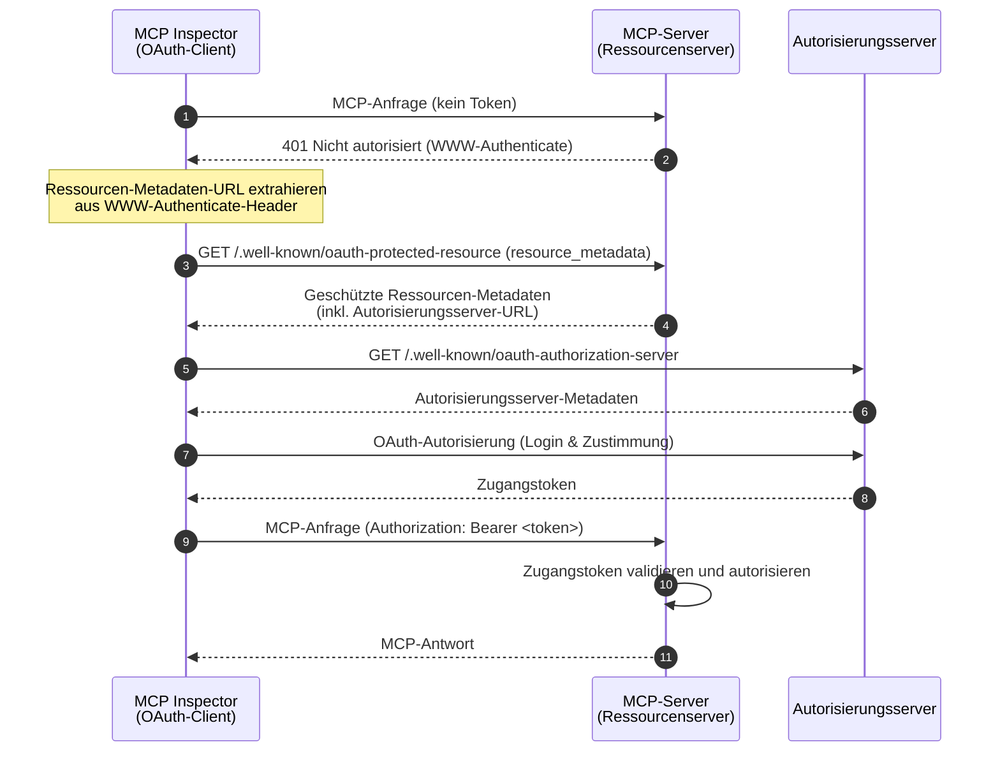
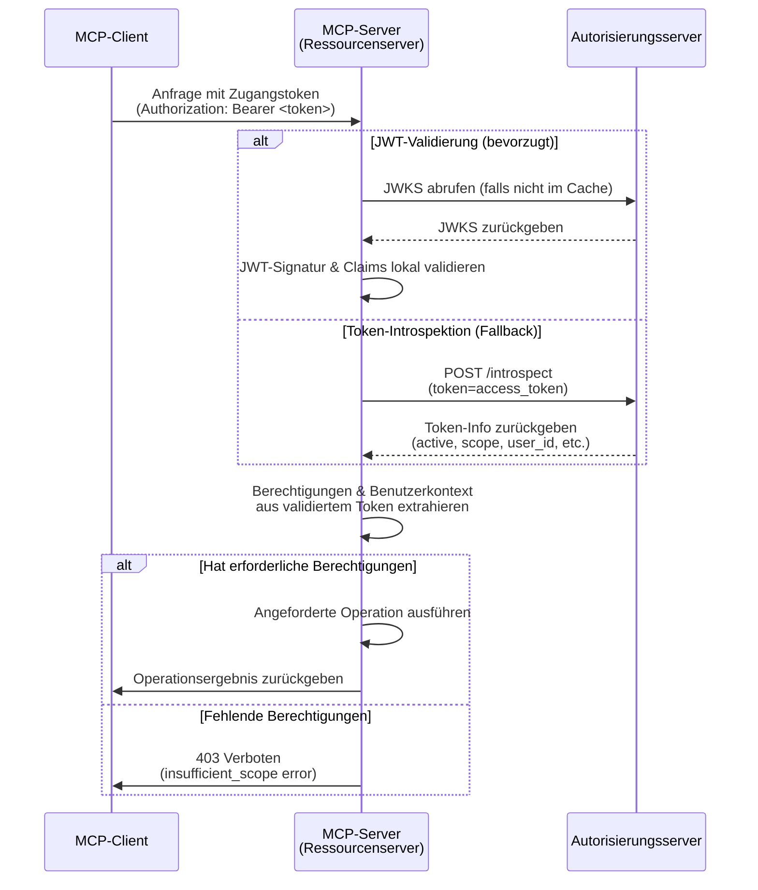

import TabItem from '@theme/TabItem';
import Tabs from '@theme/Tabs';

# Tutorial: Baue einen Todo-Manager

:::tip Python SDK verfügbar
MCP Auth ist auch für Python verfügbar! Schau dir das [Python SDK Repository](https://github.com/mcp-auth/python) für Installation und Nutzung an.
:::

In diesem Tutorial bauen wir einen Todo-Manager-MCP-Server mit Benutzer-Authentifizierung (Authentifizierung) und Autorisierung (Autorisierung). Nach der neuesten MCP-Spezifikation agiert unser MCP-Server als OAuth 2.0 **Ressourcenserver (Resource Server)**, der Zugangstokens validiert und berechtigungsbasierte Berechtigungen durchsetzt.

Nach Abschluss dieses Tutorials hast du:

- ✅ Ein grundlegendes Verständnis, wie du rollenbasierte Zugangskontrolle (RBAC) in deinem MCP-Server einrichtest.
- ✅ Einen MCP-Server, der als Ressourcenserver fungiert und Zugangstokens akzeptiert, die von einem Autorisierungsserver ausgestellt wurden.
- ✅ Eine funktionierende Implementierung der durch Berechtigungen gesteuerten Zugriffskontrolle für Todo-Operationen.

## Überblick \{#overview}

Das Tutorial umfasst folgende Komponenten:

- **MCP-Client (MCP Inspector)**: Ein visuelles Test-Tool für MCP-Server, das als OAuth 2.0/OIDC-Client agiert. Es startet den Autorisierungs-Flow mit dem Autorisierungsserver und erhält Zugangstokens, um Anfragen an den MCP-Server zu authentifizieren.
- **Autorisierungsserver**: Ein OAuth 2.1- oder OpenID Connect-Anbieter, der Benutzeridentitäten verwaltet, Benutzer authentifiziert und Zugangstokens mit passenden Berechtigungen an autorisierte Clients ausstellt.
- **MCP-Server (Ressourcenserver)**: Nach der neuesten MCP-Spezifikation agiert der MCP-Server als Ressourcenserver im OAuth 2.0-Framework. Er validiert Zugangstokens, die vom Autorisierungsserver ausgestellt wurden, und setzt berechtigungsbasierte Berechtigungen für Todo-Operationen durch.

Diese Architektur folgt dem Standard-OAuth 2.0-Flow, bei dem:
- Der **MCP Inspector** geschützte Ressourcen im Namen des Benutzers anfordert
- Der **Autorisierungsserver** den Benutzer authentifiziert und Zugangstokens ausstellt
- Der **MCP-Server** Tokens validiert und geschützte Ressourcen basierend auf gewährten Berechtigungen bereitstellt

Hier ist ein Überblicksdiagramm der Interaktion zwischen diesen Komponenten:


```mermaid
sequenceDiagram
  autonumber
  participant Client as MCP Inspector<br/>(OAuth-Client)
  participant RS as MCP-Server<br/>(Ressourcenserver)
  participant AS as Autorisierungsserver

  Client->>RS: MCP-Anfrage (kein Token)
  RS-->>Client: 401 Nicht autorisiert (WWW-Authenticate)
  Note over Client: Ressourcen-Metadaten-URL extrahieren<br/>aus WWW-Authenticate-Header

  Client->>RS: GET /.well-known/oauth-protected-resource (resource_metadata)
  RS-->>Client: Geschützte Ressourcen-Metadaten<br/>(inkl. Autorisierungsserver-URL)

  Client->>AS: GET /.well-known/oauth-authorization-server
  AS-->>Client: Autorisierungsserver-Metadaten
  Client->>AS: OAuth-Autorisierung (Login & Zustimmung)
  AS-->>Client: Zugangstoken

  Client->>RS: MCP-Anfrage (Authorization: Bearer <token>)
  RS->>RS: Zugangstoken validieren und autorisieren
  RS-->>Client: MCP-Antwort
```

## Verstehe deinen Autorisierungsserver \{#understand-your-authorization-server}

### Zugangstokens mit Berechtigungen (Scopes) \{#access-tokens-with-scopes}

Um [rollenbasierte Zugangskontrolle (RBAC)](https://auth.wiki/rbac) in deinem MCP-Server zu implementieren, muss dein Autorisierungsserver das Ausstellen von Zugangstokens mit Berechtigungen unterstützen. Berechtigungen (Scopes) repräsentieren die Berechtigungen, die einem Benutzer gewährt wurden.

<Tabs groupId="provider">
<TabItem value="logto" label="Logto">

[Logto](https://logto.io) bietet RBAC-Unterstützung durch seine API-Ressourcen (konform zu [RFC 8707: Resource Indicators for OAuth 2.0](https://datatracker.ietf.org/doc/html/rfc8707)) und Rollenfunktionen. So richtest du es ein:

1. Melde dich bei der [Logto Console](https://cloud.logto.io) (oder deiner selbst gehosteten Logto Console) an.

2. Erstelle eine API-Ressource und Berechtigungen:

   - Gehe zu "API-Ressourcen"
   - Erstelle eine neue API-Ressource mit dem Namen "Todo Manager"
   - Füge folgende Berechtigungen hinzu:
     - `create:todos`: "Neue Todo-Elemente erstellen"
     - `read:todos`: "Alle Todo-Elemente lesen"
     - `delete:todos`: "Beliebiges Todo-Element löschen"

3. Erstelle Rollen (empfohlen für einfachere Verwaltung):

   - Gehe zu "Rollen"
   - Erstelle eine "Admin"-Rolle und weise alle Berechtigungen zu (`create:todos`, `read:todos`, `delete:todos`)
   - Erstelle eine "User"-Rolle und weise nur die Berechtigung `create:todos` zu

4. Berechtigungen zuweisen:
   - Gehe zu "Benutzer"
   - Wähle einen Benutzer aus
   - Du kannst entweder:
     - Rollen im Tab "Rollen" zuweisen (empfohlen)
     - Oder direkt Berechtigungen im Tab "Berechtigungen" zuweisen

Die Berechtigungen werden im `scope`-Anspruch des JWT-Zugangstokens als durch Leerzeichen getrennte Zeichenkette enthalten sein.

</TabItem>
<TabItem value="oauth-oidc" label="OAuth 2.0 / OIDC">

OAuth 2.0 / OIDC-Anbieter unterstützen in der Regel berechtigungsbasierte Zugangskontrolle. Bei der Implementierung von RBAC:

1. Definiere die benötigten Berechtigungen in deinem Autorisierungsserver
2. Konfiguriere deinen Client so, dass diese Berechtigungen während des Autorisierungs-Flow angefordert werden
3. Stelle sicher, dass dein Autorisierungsserver die gewährten Berechtigungen im Zugangstoken einfügt
4. Die Berechtigungen sind üblicherweise im `scope`-Anspruch des JWT-Zugangstokens enthalten

Sieh in der Dokumentation deines Anbieters nach, wie:

- Berechtigungen definiert und verwaltet werden
- Berechtigungen im Zugangstoken enthalten sind
- Zusätzliche RBAC-Funktionen wie Rollenverwaltung verfügbar sind

</TabItem>
</Tabs>

### Tokens validieren und Berechtigungen prüfen \{#validating-tokens-and-checking-permissions}

Nach der neuesten MCP-Spezifikation agiert der MCP-Server als **Ressourcenserver (Resource Server)** im OAuth 2.0-Framework. Als Ressourcenserver hat der MCP-Server folgende Aufgaben:

1. **Token-Validierung**: Überprüfe die Echtheit und Integrität der von MCP-Clients empfangenen Zugangstokens
2. **Berechtigungsdurchsetzung**: Extrahiere und prüfe die Berechtigungen aus dem Zugangstoken, um festzustellen, welche Operationen der Client ausführen darf
3. **Ressourcenschutz**: Geschützte Ressourcen (Tools ausführen) nur bereitstellen, wenn der Client gültige Tokens mit ausreichenden Berechtigungen vorlegt

Wenn dein MCP-Server eine Anfrage erhält, läuft folgender Validierungsprozess ab:

1. Extrahiere das Zugangstoken aus dem `Authorization`-Header (Bearer-Token-Format)
2. Validierung der Signatur und Ablaufzeit des Zugangstokens
3. Extrahiere die Berechtigungen und Benutzerinformationen aus dem validierten Token
4. Prüfe, ob das Token die erforderlichen Berechtigungen für die angeforderte Operation enthält

Beispiel: Wenn ein Benutzer ein neues Todo-Element erstellen möchte, muss sein Zugangstoken die Berechtigung `create:todos` enthalten. So funktioniert der Validierungs-Flow des Ressourcenservers:


```mermaid
sequenceDiagram
    participant Client as MCP-Client
    participant Server as MCP-Server<br/>(Ressourcenserver)
    participant Auth as Autorisierungsserver

    Client->>Server: Anfrage mit Zugangstoken<br/>(Authorization: Bearer <token>)

    alt JWT-Validierung (bevorzugt)
        Server->>Auth: JWKS abrufen (falls nicht im Cache)
        Auth-->>Server: JWKS zurückgeben
        Server->>Server: JWT-Signatur & Claims lokal validieren
    else Token-Introspektion (Fallback)
        Server->>Auth: POST /introspect<br/>(token=access_token)
        Auth-->>Server: Token-Info zurückgeben<br/>(active, scope, user_id, etc.)
    end

    Server->>Server: Berechtigungen & Benutzerkontext<br/>aus validiertem Token extrahieren

    alt Hat erforderliche Berechtigungen
        Server->>Server: Angeforderte Operation ausführen
        Server->>Client: Operationsergebnis zurückgeben
    else Fehlende Berechtigungen
        Server->>Client: 403 Verboten<br/>(insufficient_scope error)
    end
```

### Dynamische Client-Registrierung \{#dynamic-client-registration}

Dynamische Client-Registrierung ist für dieses Tutorial nicht erforderlich, kann aber nützlich sein, wenn du den MCP-Client-Registrierungsprozess mit deinem Autorisierungsserver automatisieren möchtest. Siehe [Ist Dynamic Client Registration erforderlich?](/provider-list#is-dcr-required) für weitere Details.

## Verstehe RBAC im Todo-Manager \{#understand-rbac-in-todo-manager}

Zu Demonstrationszwecken implementieren wir ein einfaches rollenbasiertes Zugangskontrollsystem (RBAC) in unserem Todo-Manager-MCP-Server. Dies zeigt dir die Grundprinzipien von RBAC bei überschaubarer Implementierung.

:::note
Obwohl dieses Tutorial RBAC-basierte Berechtigungsverwaltung demonstriert, ist es wichtig zu beachten, dass nicht alle Authentifizierungsanbieter die Berechtigungsverwaltung über Rollen implementieren. Manche Anbieter haben eigene Mechanismen zur Verwaltung von Zugangskontrolle und Berechtigungen.
:::

### Tools und Berechtigungen \{#tools-and-scopes}

Unser Todo-Manager-MCP-Server stellt drei Haupttools bereit:

- `create-todo`: Ein neues Todo-Element erstellen
- `get-todos`: Alle Todos auflisten
- `delete-todo`: Ein Todo anhand der ID löschen

Um den Zugriff auf diese Tools zu steuern, definieren wir folgende Berechtigungen:

- `create:todos`: Erlaubt das Erstellen neuer Todo-Elemente
- `delete:todos`: Erlaubt das Löschen bestehender Todo-Elemente
- `read:todos`: Erlaubt das Abfragen und Abrufen aller Todo-Elemente

### Rollen und Berechtigungen \{#roles-and-permissions}

Wir definieren zwei Rollen mit unterschiedlichen Zugriffsrechten:

| Rolle  | create:todos | read:todos | delete:todos |
| ------ | ------------ | ---------- | ------------ |
| Admin  | ✅           | ✅         | ✅           |
| User   | ✅           |            |              |

- **User**: Ein normaler Benutzer, der Todo-Elemente erstellen und nur seine eigenen Todos ansehen oder löschen kann
- **Admin**: Ein Administrator, der alle Todo-Elemente erstellen, ansehen und löschen kann, unabhängig vom Eigentümer

### Ressourcenbesitz \{#resource-ownership}

Obwohl die obige Berechtigungstabelle die expliziten Berechtigungen jeder Rolle zeigt, gibt es ein wichtiges Prinzip des Ressourcenbesitzes zu beachten:

- **Benutzer** haben nicht die Berechtigungen `read:todos` oder `delete:todos`, können aber trotzdem:
  - Ihre eigenen Todo-Elemente lesen
  - Ihre eigenen Todo-Elemente löschen
- **Admins** haben volle Berechtigungen (`read:todos` und `delete:todos`), wodurch sie:
  - Alle Todo-Elemente im System sehen können
  - Jedes Todo-Element löschen können, unabhängig vom Eigentümer

Dies zeigt ein häufiges Muster in RBAC-Systemen, bei dem der Besitz einer Ressource implizite Berechtigungen für eigene Ressourcen gewährt, während administrative Rollen explizite Berechtigungen für alle Ressourcen erhalten.

:::tip Mehr erfahren
Um tiefer in RBAC-Konzepte und Best Practices einzutauchen, sieh dir [Mastering RBAC: A Comprehensive Real-World Example](https://blog.logto.io/mastering-rbac) an.
:::

## Autorisierung in deinem Anbieter konfigurieren \{#configure-authorization-in-your-provider}

Um das oben beschriebene Zugangskontrollsystem zu implementieren, musst du deinen Autorisierungsserver so konfigurieren, dass er die erforderlichen Berechtigungen unterstützt. So geht es bei verschiedenen Anbietern:

<Tabs groupId="provider">
<TabItem value="logto" label="Logto">

[Logto](https://logto.io) bietet RBAC-Unterstützung durch seine API-Ressourcen und Rollenfunktionen. So richtest du es ein:

1. Melde dich bei der [Logto Console](https://cloud.logto.io) (oder deiner selbst gehosteten Logto Console) an.

2. Erstelle eine API-Ressource und Berechtigungen:

   - Gehe zu "API-Ressourcen"
   - Erstelle eine neue API-Ressource mit dem Namen "Todo Manager" und verwende `http://localhost:3001` als Ressourcenindikator.
     - **Wichtig**: Der Ressourcenindikator muss mit der URL deines MCP-Servers übereinstimmen. Für dieses Tutorial verwenden wir `http://localhost:3001`, da unser MCP-Server auf Port 3001 läuft. In Produktion verwende deine tatsächliche MCP-Server-URL (z. B. `https://your-mcp-server.example.com`).
   - Erstelle folgende Berechtigungen:
     - `create:todos`: "Neue Todo-Elemente erstellen"
     - `read:todos`: "Alle Todo-Elemente lesen"
     - `delete:todos`: "Beliebiges Todo-Element löschen"

3. Erstelle Rollen (empfohlen für einfachere Verwaltung):

   - Gehe zu "Rollen"
   - Erstelle eine "Admin"-Rolle und weise alle Berechtigungen zu (`create:todos`, `read:todos`, `delete:todos`)
   - Erstelle eine "User"-Rolle und weise nur die Berechtigung `create:todos` zu
   - Wechsle auf der Detailseite der "User"-Rolle zum Tab "Allgemein" und setze die "User"-Rolle als "Standardrolle".

4. Benutzerrollen und Berechtigungen verwalten:
   - Für neue Benutzer:
     - Sie erhalten automatisch die "User"-Rolle, da wir sie als Standardrolle gesetzt haben
   - Für bestehende Benutzer:
     - Gehe zu "Benutzerverwaltung"
     - Wähle einen Benutzer aus
     - Weisen dem Benutzer Rollen im Tab "Rollen" zu

:::tip Programmatische Rollenverwaltung
Du kannst auch die [Management API](https://docs.logto.io/integrate-logto/interact-with-management-api) von Logto verwenden, um Benutzerrollen programmatisch zu verwalten. Das ist besonders nützlich für automatisierte Benutzerverwaltung oder beim Aufbau von Admin-Panels.
:::

Beim Anfordern eines Zugangstokens wird Logto die Berechtigungen im `scope`-Anspruch des Tokens basierend auf den Rollenzuweisungen des Benutzers einfügen.

</TabItem>
<TabItem value="oauth-or-oidc" label="OAuth 2 / OIDC">

Für OAuth 2.0- oder OpenID Connect-Anbieter musst du die Berechtigungen konfigurieren, die verschiedene Zugriffsrechte repräsentieren. Die genauen Schritte hängen von deinem Anbieter ab, aber im Allgemeinen:

1. Berechtigungen definieren:

   - Konfiguriere deinen Autorisierungsserver so, dass er unterstützt:
     - `create:todos`
     - `read:todos`
     - `delete:todos`

2. Client konfigurieren:

   - Registriere oder aktualisiere deinen Client, um diese Berechtigungen anzufordern
   - Stelle sicher, dass die Berechtigungen im Zugangstoken enthalten sind

3. Berechtigungen zuweisen:
   - Verwende die Oberfläche deines Anbieters, um Benutzern passende Berechtigungen zuzuweisen
   - Manche Anbieter unterstützen rollenbasierte Verwaltung, andere nutzen direkte Berechtigungszuweisungen
   - Sieh in der Dokumentation deines Anbieters nach, was empfohlen wird

:::tip
Die meisten Anbieter fügen die gewährten Berechtigungen im `scope`-Anspruch des Zugangstokens ein. Das Format ist typischerweise eine durch Leerzeichen getrennte Zeichenkette von Berechtigungswerten.
:::

</TabItem>
</Tabs>

Nach der Konfiguration deines Autorisierungsservers erhalten Benutzer Zugangstokens mit ihren gewährten Berechtigungen. Der MCP-Server verwendet diese Berechtigungen, um zu bestimmen:

- Ob ein Benutzer neue Todos erstellen darf (`create:todos`)
- Ob ein Benutzer alle Todos (`read:todos`) oder nur seine eigenen sehen darf
- Ob ein Benutzer beliebige Todos (`delete:todos`) oder nur seine eigenen löschen darf

## MCP-Server einrichten \{#set-up-the-mcp-server}

Wir verwenden die [offiziellen MCP SDKs](https://github.com/modelcontextprotocol), um unseren Todo-Manager-MCP-Server zu erstellen.

### Neues Projekt erstellen \{#create-a-new-project}

Richte ein neues Node.js-Projekt ein:

```bash
mkdir mcp-server
cd mcp-server
npm init -y # Oder verwende `pnpm init`
npm pkg set type="module"
npm pkg set main="todo-manager.ts"
npm pkg set scripts.start="node --experimental-strip-types todo-manager.ts"
```

:::note
Wir verwenden TypeScript in unseren Beispielen, da Node.js v22.6.0+ TypeScript nativ mit dem Flag `--experimental-strip-types` ausführen kann. Wenn du JavaScript verwendest, ist der Code ähnlich – stelle nur sicher, dass du Node.js v22.6.0 oder neuer nutzt. Siehe Node.js-Dokumentation für Details.
:::

### MCP SDK und Abhängigkeiten installieren \{#install-the-mcp-sdk-and-dependencies}

```bash
npm install @modelcontextprotocol/sdk express zod
```

Oder ein anderes Paketmanagement-Tool deiner Wahl, wie `pnpm` oder `yarn`.

### MCP-Server erstellen \{#create-the-mcp-server}

Erstelle eine Datei namens `todo-manager.ts` und füge folgenden Code hinzu:

[Der Code bleibt unverändert, siehe oben.]

Starte den Server mit:

```bash
npm start
```

## MCP-Server inspizieren \{#inspect-the-mcp-server}

### MCP Inspector klonen und starten \{#clone-and-run-mcp-inspector}

Jetzt, da der MCP-Server läuft, können wir den MCP Inspector verwenden, um zu prüfen, ob Tools verfügbar sind.

Der offizielle MCP Inspector v0.16.2 hat einige Bugs, die die Authentifizierungsfunktionalität beeinträchtigen. Um diese Probleme zu beheben, haben wir eine [gepatchte Version des MCP Inspectors](https://github.com/mcp-auth/inspector/tree/patch/0.16.2-fixes) erstellt, die notwendige Fixes für OAuth/OIDC-Authentifizierungsflüsse enthält. Wir haben auch Pull Requests an das offizielle Repository eingereicht, um diese Fixes beizusteuern.

Um den MCP Inspector zu starten, verwende folgenden Befehl (Node.js wird benötigt):

```bash
git clone https://github.com/mcp-auth/inspector.git -b patch/0.16.2-fixes
cd inspector
npm install
npm run dev
```

Der MCP Inspector öffnet sich automatisch im Standardbrowser, oder du kannst ihn manuell über den Link aus der Terminalausgabe aufrufen (achte darauf, den Link mit dem Parameter `MCP_PROXY_AUTH_TOKEN` zu verwenden, z. B. `http://localhost:6274/?MCP_PROXY_AUTH_TOKEN=458ae4a4...acab1907`).

### MCP Inspector mit dem MCP-Server verbinden \{#connect-mcp-inspector-to-the-mcp-server}

Vor dem Fortfahren prüfe folgende Konfiguration im MCP Inspector:

- **Transporttyp**: Setze auf `Streamable HTTP`.
- **URL**: Setze auf die URL deines MCP-Servers. In unserem Fall: `http://localhost:3001`.

Jetzt kannst du auf den "Connect"-Button klicken, um zu sehen, ob der MCP Inspector eine Verbindung zum MCP-Server herstellen kann. Wenn alles in Ordnung ist, solltest du den Status "Connected" im MCP Inspector sehen.

### Checkpoint: Todo-Manager-Tools ausführen \{#checkpoint-run-todo-manager-tools}

1. Klicke im oberen Menü des MCP Inspectors auf den Tab "Tools".
2. Klicke auf den Button "List Tools".
3. Du solltest die Tools `create-todo`, `get-todos` und `delete-todo` auf der Seite sehen. Klicke darauf, um die Tool-Details zu öffnen.
4. Du solltest rechts den Button "Run Tool" sehen. Klicke darauf und gib die erforderlichen Parameter ein, um das Tool auszuführen.
5. Du solltest das Tool-Ergebnis mit der JSON-Antwort `{"error": "Not implemented"}` sehen.


## Integration mit deinem Autorisierungsserver \{#integrate-with-your-authorization-server}

Für diesen Abschnitt gibt es einige Überlegungen:

<details>
<summary>**Die Issuer-URL deines Autorisierungsservers**</summary>

Dies ist normalerweise die Basis-URL deines Autorisierungsservers, z. B. `https://auth.example.com`. Manche Anbieter haben einen Pfad wie `https://example.logto.app/oidc`, prüfe daher die Dokumentation deines Anbieters.

</details>

<details>
<summary>**Wie du die Metadaten des Autorisierungsservers abrufst**</summary>

- Wenn dein Autorisierungsserver dem [OAuth 2.0 Authorization Server Metadata](https://datatracker.ietf.org/doc/html/rfc8414) oder [OpenID Connect Discovery](https://openid.net/specs/openid-connect-discovery-1_0.html) entspricht, kannst du die eingebauten Utilities von MCP Auth verwenden, um die Metadaten automatisch abzurufen.
- Wenn dein Autorisierungsserver diese Standards nicht unterstützt, musst du die Metadaten-URL oder Endpunkte manuell in der MCP-Server-Konfiguration angeben. Prüfe die Dokumentation deines Anbieters für die spezifischen Endpunkte.

</details>

<details>
<summary>**Wie du den MCP Inspector als Client in deinem Autorisierungsserver registrierst**</summary>

- Wenn dein Autorisierungsserver [Dynamic Client Registration](https://datatracker.ietf.org/doc/html/rfc7591) unterstützt, kannst du diesen Schritt überspringen, da sich der MCP Inspector automatisch als Client registriert.
- Wenn dein Autorisierungsserver Dynamic Client Registration nicht unterstützt, musst du den MCP Inspector manuell als Client in deinem Autorisierungsserver registrieren.

</details>

<details>
<summary>**Verstehe die Token-Anfrageparameter**</summary>

Beim Anfordern von Zugangstokens von verschiedenen Autorisierungsservern gibt es verschiedene Ansätze, um die Zielressource und Berechtigungen anzugeben. Hier die Hauptmuster:

- **Ressourcenindikator-basiert**:

  - Verwendet den Parameter `resource`, um die Ziel-API anzugeben (siehe [RFC 8707: Resource Indicators for OAuth 2.0](https://datatracker.ietf.org/doc/html/rfc8707))
  - Häufig in modernen OAuth 2.0-Implementierungen
  - Beispielanfrage:
    ```json
    {
      "resource": "http://localhost:3001",
      "scope": "create:todos read:todos"
    }
    ```
  - Der Server stellt Tokens aus, die speziell an die angeforderte Ressource gebunden sind

- **Audience-basiert**:

  - Verwendet den Parameter `audience`, um den beabsichtigten Token-Empfänger anzugeben
  - Ähnlich wie Ressourcenindikatoren, aber mit anderen Semantiken
  - Beispielanfrage:
    ```json
    {
      "audience": "todo-api",
      "scope": "create:todos read:todos"
    }
    ```

- **Rein berechtigungsbasiert**:
  - Verwendet ausschließlich Berechtigungen ohne resource/audience-Parameter
  - Traditioneller OAuth 2.0-Ansatz
  - Beispielanfrage:
    ```json
    {
      "scope": "todo-api:create todo-api:read openid profile"
    }
    ```
  - Oft werden Präfixe verwendet, um Berechtigungen zu gruppieren
  - Häufig in einfacheren OAuth 2.0-Implementierungen

:::tip Best Practices

- Prüfe die Dokumentation deines Anbieters auf unterstützte Parameter
- Manche Anbieter unterstützen mehrere Ansätze gleichzeitig
- Ressourcenindikatoren bieten bessere Sicherheit durch Audience-Beschränkung
- Verwende Ressourcenindikatoren, wenn verfügbar, für bessere Zugangskontrolle
  :::

</details>

Jeder Anbieter hat eigene Anforderungen, aber die folgenden Schritte führen dich durch die Integration des MCP Inspectors und MCP Servers mit anbieter-spezifischen Konfigurationen.

### MCP Inspector als Client registrieren \{#register-mcp-inspector-as-a-client}

<Tabs groupId="provider">
<TabItem value="logto" label="Logto">

Die Integration des Todo-Managers mit [Logto](https://logto.io) ist einfach, da es ein OpenID Connect-Anbieter ist, der Ressourcenindikatoren und Berechtigungen unterstützt. So kannst du deine Todo-API mit `http://localhost:3001` als Ressourcenindikator absichern.

Da Logto noch keine Dynamic Client Registration unterstützt, musst du den MCP Inspector manuell als Client in deinem Logto-Tenant registrieren:

1. Öffne deinen MCP Inspector, gehe zur Authentifizierungskonfiguration und klicke auf die "OAuth2.0 Flow"-Konfiguration. Kopiere den **Redirect URI**-Wert, z. B. `http://localhost:6274/oauth/callback`.
2. Melde dich bei der [Logto Console](https://cloud.logto.io) (oder deiner selbst gehosteten Logto Console) an.
3. Navigiere zum Tab "Anwendungen", klicke auf "Anwendung erstellen". Klicke unten auf der Seite auf "App ohne Framework erstellen".
4. Fülle die Anwendungsdetails aus und klicke auf "Anwendung erstellen":
   - **Anwendungstyp auswählen**: Wähle "Single-page application".
   - **Anwendungsname**: Gib einen Namen ein, z. B. "MCP Inspector".
5. Im Abschnitt "Einstellungen / Redirect URIs" füge den kopierten **Redirect URI**-Wert ein. Klicke dann unten auf "Änderungen speichern".
6. Im oberen Bereich siehst du den Wert "App ID". Kopiere ihn.
7. Gehe zurück zum MCP Inspector und füge den "App ID"-Wert in der Authentifizierungskonfiguration unter "OAuth2.0 Flow" im Feld "Client ID" ein.
8. Gib im Feld "Scope" ein: `create:todos read:todos delete:todos`. Dadurch enthält das von Logto zurückgegebene Zugangstoken die notwendigen Berechtigungen für den Zugriff auf den Todo-Manager.

</TabItem>
<TabItem value="oauth-oidc" label="OAuth 2.0 / OIDC">

:::note
Dies ist eine generische Anleitung zur Integration eines OAuth 2.0 / OpenID Connect-Anbieters. Beide folgen ähnlichen Schritten, da OIDC auf OAuth 2.0 aufbaut. Prüfe die Dokumentation deines Anbieters für Details.
:::

Wenn dein Anbieter Dynamic Client Registration unterstützt, kannst du direkt zu Schritt 8 unten gehen; andernfalls musst du den MCP Inspector manuell als Client registrieren:

1. Öffne deinen MCP Inspector, gehe zur Authentifizierungskonfiguration und klicke auf die "OAuth2.0 Flow"-Konfiguration. Kopiere den **Redirect URI**-Wert, z. B. `http://localhost:6274/oauth/callback`.

2. Melde dich in der Konsole deines Anbieters an.

3. Navigiere zum Abschnitt "Anwendungen" oder "Clients" und erstelle eine neue Anwendung oder einen neuen Client.

4. Falls erforderlich, wähle als Client-Typ "Single-page application" oder "Public client".

5. Nach dem Erstellen der Anwendung musst du den Redirect URI konfigurieren. Füge den kopierten **Redirect URI**-Wert ein.

6. Finde die "Client ID" oder "Application ID" der neu erstellten Anwendung und kopiere sie.

7. Gehe zurück zum MCP Inspector und füge den "Client ID"-Wert in der Authentifizierungskonfiguration unter "OAuth2.0 Flow" im Feld "Client ID" ein.

8. Gib im Feld "Scope" folgende Berechtigungen ein, um die notwendigen Rechte für Todo-Operationen anzufordern:

```text
create:todos read:todos delete:todos
```

</TabItem>
</Tabs>

### MCP Auth einrichten \{#set-up-mcp-auth}

Installiere zuerst das MCP Auth SDK in deinem MCP-Server-Projekt.

import { NpmLikeInstallation } from '@site/src/components/NpmLikeInstallation';

<NpmLikeInstallation packageName="mcp-auth@0.2.0-beta.1" />

Jetzt müssen wir MCP Auth in deinem MCP-Server initialisieren. Im geschützten Ressourcenmodus musst du deine Ressourcenmetadaten einschließlich der Autorisierungsserver konfigurieren.

Es gibt zwei Möglichkeiten, Autorisierungsserver zu konfigurieren:

- **Vorab abgerufen (empfohlen)**: Verwende `fetchServerConfig()`, um die Metadaten vor der Initialisierung von MCPAuth abzurufen. So wird die Konfiguration beim Start validiert.
- **On-Demand-Discovery**: Gib nur `issuer` und `type` an – die Metadaten werden bei Bedarf abgerufen. Das ist nützlich für Edge-Runtimes (wie Cloudflare Workers), bei denen asynchrone Top-Level-Fetches nicht erlaubt sind.

#### Geschützte Ressourcenmetadaten konfigurieren \{#configure-protected-resource-metadata}

Zuerst benötigst du die Issuer-URL deines Autorisierungsservers:

<Tabs groupId="provider">

<TabItem value="logto" label="Logto">

In Logto findest du die Issuer-URL auf der Anwendungsdetailseite in der Logto Console unter "Endpoints & Credentials / Issuer endpoint". Sie sieht aus wie `https://my-project.logto.app/oidc`.

</TabItem>

<TabItem value="oauth-oidc" label="OAuth 2.0 / OIDC">

Für OAuth 2.0-Anbieter musst du:

1. Die Dokumentation deines Anbieters nach der Autorisierungsserver-URL (oft Issuer-URL oder Basis-URL genannt) durchsuchen
2. Manche Anbieter stellen dies unter `https://{deine-domain}/.well-known/oauth-authorization-server` bereit
3. Im Admin-Panel deines Anbieters unter OAuth/API-Einstellungen nachsehen

</TabItem>

</Tabs>

Jetzt konfiguriere die Protected Resource Metadata beim Erstellen der MCP Auth-Instanz:

[Der Code bleibt unverändert, siehe oben.]

### MCP-Server aktualisieren \{#update-mcp-server}

Wir sind fast fertig! Jetzt aktualisieren wir den MCP-Server, um die MCP Auth-Route und Middleware-Funktion anzuwenden und die berechtigungsbasierte Zugangskontrolle für die Todo-Manager-Tools basierend auf den Benutzerberechtigungen zu implementieren.

Jetzt Protected Resource Metadata-Routen anwenden, damit MCP-Clients die erwarteten Ressourcenmetadaten vom MCP-Server abrufen können.

[Der Code bleibt unverändert, siehe oben.]

Als Nächstes wenden wir die MCP Auth-Middleware auf den MCP-Server an. Diese Middleware übernimmt Authentifizierung und Autorisierung für eingehende Anfragen und stellt sicher, dass nur autorisierte Benutzer Zugriff auf die Todo-Manager-Tools haben.

[Der Code bleibt unverändert, siehe oben.]

Jetzt können wir die Implementierung der Tools aktualisieren.

[Der Code bleibt unverändert, siehe oben.]

Erstelle nun den "Todo-Service", der im obigen Code verwendet wird, um die zugehörige Funktionalität zu implementieren:

[Der Code bleibt unverändert, siehe oben.]

Herzlichen Glückwunsch! Wir haben erfolgreich einen vollständigen MCP-Server mit Authentifizierung (Authentifizierung) und Autorisierung (Autorisierung) implementiert!

:::info
Sieh dir das [MCP Auth Node.js SDK Repository](https://github.com/mcp-auth/js/blob/master/packages/sample-servers/src) für den vollständigen Code des MCP-Servers (OIDC-Version) an.
:::

## Checkpoint: Die `todo-manager`-Tools ausführen \{#checkpoint-run-the-todo-manager-tools}

Starte deinen MCP-Server neu und öffne den MCP Inspector im Browser. Wenn du auf den "Connect"-Button klickst, solltest du zur Anmeldeseite deines Autorisierungsservers weitergeleitet werden.

Nach der Anmeldung und Rückkehr zum MCP Inspector wiederhole die Aktionen aus dem vorherigen Checkpoint, um die Todo-Manager-Tools auszuführen. Dieses Mal kannst du die Tools mit deiner authentifizierten Benutzeridentität verwenden. Das Verhalten der Tools hängt von den Rollen und Berechtigungen ab, die deinem Benutzer zugewiesen sind:

- Wenn du als **User** (nur mit `create:todos`-Berechtigung) angemeldet bist:

  - Du kannst neue Todos mit dem Tool `create-todo` erstellen
  - Du kannst nur deine eigenen Todos ansehen und löschen
  - Du kannst keine Todos anderer Benutzer sehen oder löschen

- Wenn du als **Admin** (mit allen Berechtigungen: `create:todos`, `read:todos`, `delete:todos`) angemeldet bist:
  - Du kannst neue Todos erstellen
  - Du kannst alle Todos im System mit dem Tool `get-todos` ansehen
  - Du kannst beliebige Todos mit dem Tool `delete-todo` löschen, unabhängig davon, wer sie erstellt hat

Du kannst diese unterschiedlichen Berechtigungsstufen testen, indem du:

1. Die aktuelle Sitzung abmeldest (klicke auf "Disconnect" im MCP Inspector)
2. Dich mit einem anderen Benutzerkonto anmeldest, das andere Rollen/Berechtigungen hat
3. Die gleichen Tools erneut ausprobierst, um zu sehen, wie sich das Verhalten je nach Benutzerberechtigungen ändert

Dies zeigt, wie rollenbasierte Zugangskontrolle (RBAC) in der Praxis funktioniert, wobei verschiedene Benutzer unterschiedliche Zugriffsrechte auf die Funktionen des Systems haben.


:::info
Sieh dir das [MCP Auth Node.js SDK Repository](https://github.com/mcp-auth/js/blob/master/packages/sample-servers/src) für den vollständigen Code des MCP-Servers (OIDC-Version) an.
:::

## Abschließende Hinweise \{#closing-notes}

Herzlichen Glückwunsch! Du hast das Tutorial erfolgreich abgeschlossen. Fassen wir zusammen, was wir gemacht haben:

- Einen grundlegenden MCP-Server mit Todo-Management-Tools (`create-todo`, `get-todos`, `delete-todo`) eingerichtet
- Rollenbasierte Zugangskontrolle (RBAC) mit unterschiedlichen Berechtigungsstufen für Benutzer und Admins implementiert
- Den MCP-Server mit einem Autorisierungsserver über MCP Auth integriert
- Den MCP Inspector so konfiguriert, dass Benutzer authentifiziert werden und Zugangstokens mit Berechtigungen zum Aufrufen der Tools verwendet werden

Sieh dir weitere Tutorials und die Dokumentation an, um das Beste aus MCP Auth herauszuholen.
