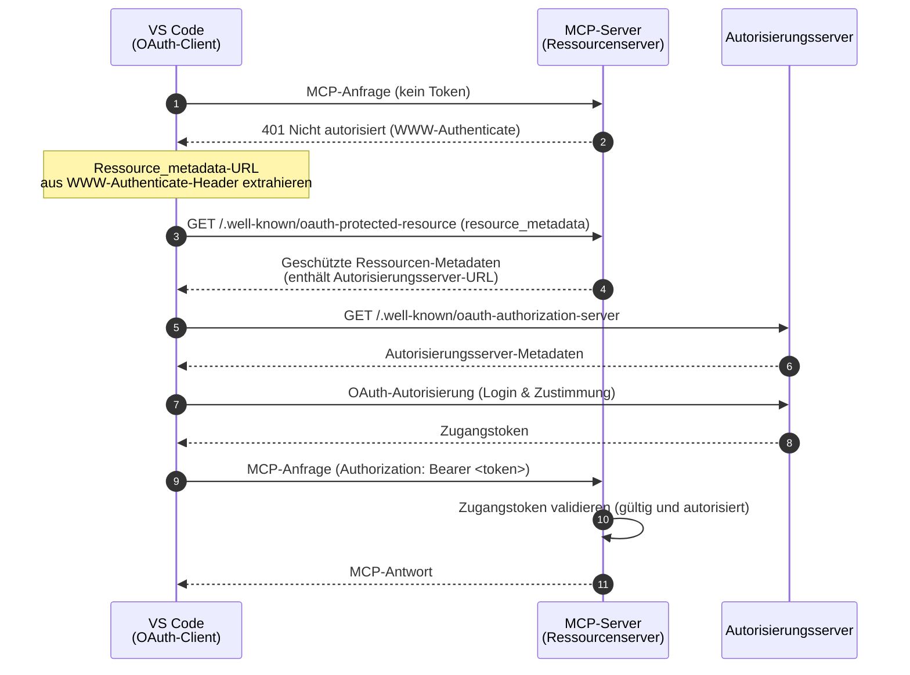
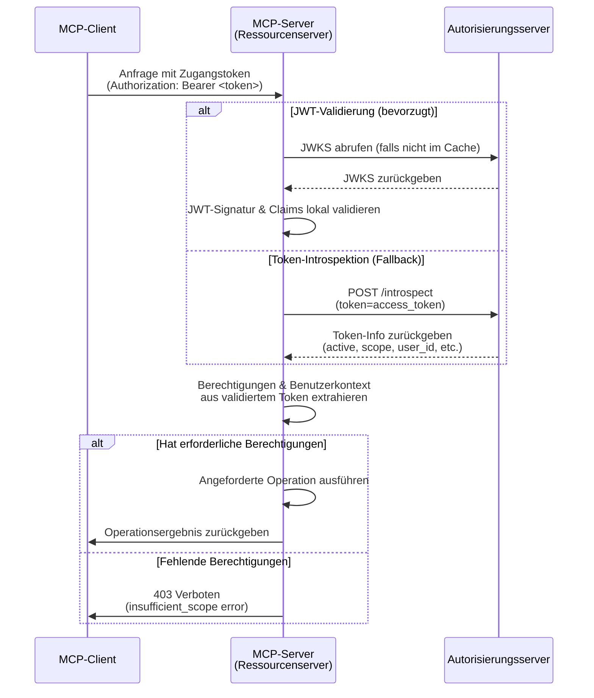

import { NpmLikeInstallation } from '@site/src/components/NpmLikeInstallation';
import TabItem from '@theme/TabItem';
import Tabs from '@theme/Tabs';

# Tutorial: Baue einen Todo-Manager

:::tip Python SDK verfügbar
MCP Auth ist auch für Python verfügbar! Schau dir das [Python SDK Repository](https://github.com/mcp-auth/python) für Installation und Nutzung an.
:::

In diesem Tutorial bauen wir einen Todo-Manager-MCP-Server mit Benutzer-Authentifizierung (Authentifizierung) und Autorisierung (Autorisierung). Nach der neuesten MCP-Spezifikation agiert unser MCP-Server als OAuth 2.0 **Ressourcenserver** (Resource Server), der Zugangstokens validiert und berechtigungsbasierte Berechtigungen durchsetzt.

Nach Abschluss dieses Tutorials hast du:

- ✅ Ein grundlegendes Verständnis, wie du rollenbasierte Zugangskontrolle (RBAC) in deinem MCP-Server einrichtest.
- ✅ Einen MCP-Server, der als Ressourcenserver fungiert und Zugangstokens akzeptiert, die von einem Autorisierungsserver ausgestellt wurden.
- ✅ Eine funktionierende Implementierung der durch Berechtigungen gesteuerten Zugriffskontrolle für Todo-Operationen.

## Überblick \{#overview}

Das Tutorial umfasst folgende Komponenten:

- **MCP-Client (VS Code)**: Ein Code-Editor mit eingebauter MCP-Unterstützung, der als OAuth 2.0/OIDC-Client agiert. Er initiiert den Autorisierungsfluss mit dem Autorisierungsserver und erhält Zugangstokens, um Anfragen an den MCP-Server zu authentifizieren.
- **Autorisierungsserver**: Ein OAuth 2.1 oder OpenID Connect Anbieter, der Benutzeridentitäten verwaltet, Benutzer authentifiziert und Zugangstokens mit entsprechenden Berechtigungen an autorisierte Clients ausstellt.
- **MCP-Server (Ressourcenserver)**: Nach der neuesten MCP-Spezifikation agiert der MCP-Server als Ressourcenserver im OAuth 2.0-Framework. Er validiert Zugangstokens, die vom Autorisierungsserver ausgestellt wurden, und erzwingt berechtigungsbasierte Berechtigungen für Todo-Operationen.

Diese Architektur folgt dem Standard-OAuth 2.0-Fluss, bei dem:

- **VS Code** geschützte Ressourcen im Namen des Benutzers anfordert
- Der **Autorisierungsserver** den Benutzer authentifiziert und Zugangstokens ausstellt
- Der **MCP-Server** Tokens validiert und geschützte Ressourcen basierend auf gewährten Berechtigungen bereitstellt

Hier ist ein Überblicksdiagramm der Interaktion zwischen diesen Komponenten:


```mermaid
sequenceDiagram
  autonumber
  participant Client as VS Code<br/>(OAuth-Client)
  participant RS as MCP-Server<br/>(Ressourcenserver)
  participant AS as Autorisierungsserver

  Client->>RS: MCP-Anfrage (kein Token)
  RS-->>Client: 401 Nicht autorisiert (WWW-Authenticate)
  Note over Client: Ressource_metadata-URL<br/>aus WWW-Authenticate-Header extrahieren

  Client->>RS: GET /.well-known/oauth-protected-resource (resource_metadata)
  RS-->>Client: Geschützte Ressourcen-Metadaten<br/>(enthält Autorisierungsserver-URL)

  Client->>AS: GET /.well-known/oauth-authorization-server
  AS-->>Client: Autorisierungsserver-Metadaten
  Client->>AS: OAuth-Autorisierung (Login & Zustimmung)
  AS-->>Client: Zugangstoken

  Client->>RS: MCP-Anfrage (Authorization: Bearer <token>)
  RS->>RS: Zugangstoken validieren (gültig und autorisiert)
  RS-->>Client: MCP-Antwort
```

## Verstehe deinen Autorisierungsserver \{#understand-your-authorization-server}

### Zugangstokens mit Berechtigungen (Scopes) \{#access-tokens-with-scopes}

Um [rollenbasierte Zugangskontrolle (RBAC)](https://auth.wiki/rbac) in deinem MCP-Server zu implementieren, muss dein Autorisierungsserver die Ausgabe von Zugangstokens mit Berechtigungen unterstützen. Berechtigungen (Scopes) repräsentieren die Rechte, die einem Benutzer gewährt wurden.

<Tabs groupId="provider">
<TabItem value="logto" label="Logto">

[Logto](https://logto.io) bietet RBAC-Unterstützung durch seine API-Ressourcen (gemäß [RFC 8707: Resource Indicators for OAuth 2.0](https://datatracker.ietf.org/doc/html/rfc8707)) und Rollenfunktionen. So richtest du es ein:

1. Melde dich bei der [Logto Console](https://cloud.logto.io) (oder deiner selbst gehosteten Logto Console) an.

2. Erstelle API-Ressource und Berechtigungen:

   - Gehe zu "API-Ressourcen"
   - Erstelle eine neue API-Ressource namens "Todo Manager"
   - Füge folgende Berechtigungen hinzu:
     - `create:todos`: "Neue Todo-Einträge erstellen"
     - `read:todos`: "Alle Todo-Einträge lesen"
     - `delete:todos`: "Beliebigen Todo-Eintrag löschen"

3. Erstelle Rollen (empfohlen für einfachere Verwaltung):

   - Gehe zu "Rollen"
   - Erstelle eine "Admin"-Rolle und weise alle Berechtigungen zu (`create:todos`, `read:todos`, `delete:todos`)
   - Erstelle eine "User"-Rolle und weise nur die Berechtigung `create:todos` zu

4. Berechtigungen zuweisen:
   - Gehe zu "Benutzer"
   - Wähle einen Benutzer aus
   - Du kannst entweder:
     - Rollen im Tab "Rollen" zuweisen (empfohlen)
     - Oder Berechtigungen direkt im Tab "Berechtigungen" zuweisen

Die Berechtigungen werden im `scope`-Anspruch des JWT-Zugangstokens als durch Leerzeichen getrennte Zeichenkette enthalten sein.

</TabItem>
<TabItem value="oauth-oidc" label="OAuth 2.0 / OIDC">

OAuth 2.0 / OIDC-Anbieter unterstützen in der Regel berechtigungsbasierte Zugangskontrolle. Bei der Implementierung von RBAC:

1. Definiere die benötigten Berechtigungen in deinem Autorisierungsserver
2. Konfiguriere deinen Client so, dass diese Berechtigungen während des Autorisierungsflusses angefordert werden
3. Stelle sicher, dass dein Autorisierungsserver die gewährten Berechtigungen im Zugangstoken einfügt
4. Die Berechtigungen sind normalerweise im `scope`-Anspruch des JWT-Zugangstokens enthalten

Sieh in der Dokumentation deines Anbieters nach, wie:

- Berechtigungen definiert und verwaltet werden
- Berechtigungen im Zugangstoken enthalten sind
- Zusätzliche RBAC-Funktionen wie Rollenverwaltung unterstützt werden

</TabItem>
</Tabs>

### Tokens validieren und Berechtigungen prüfen \{#validating-tokens-and-checking-permissions}

Nach der neuesten MCP-Spezifikation agiert der MCP-Server als **Ressourcenserver** (Resource Server) im OAuth 2.0-Framework. Als Ressourcenserver hat der MCP-Server folgende Aufgaben:

1. **Token-Validierung**: Überprüfe die Echtheit und Integrität der von MCP-Clients empfangenen Zugangstokens
2. **Berechtigungsdurchsetzung**: Extrahiere und prüfe die Berechtigungen aus dem Zugangstoken, um festzustellen, welche Operationen der Client ausführen darf
3. **Ressourcenschutz**: Geschützte Ressourcen (Tools ausführen) nur bereitstellen, wenn der Client gültige Tokens mit ausreichenden Berechtigungen vorlegt

Wenn dein MCP-Server eine Anfrage erhält, führt er folgenden Validierungsprozess durch:

1. Extrahiere das Zugangstoken aus dem `Authorization`-Header (Bearer-Token-Format)
2. Validierung der Signatur und Ablaufzeit des Zugangstokens
3. Extrahiere die Berechtigungen und Benutzerinformationen aus dem validierten Token
4. Prüfe, ob das Token die erforderlichen Berechtigungen für die angeforderte Operation enthält

Beispiel: Wenn ein Benutzer einen neuen Todo-Eintrag erstellen möchte, muss sein Zugangstoken die Berechtigung `create:todos` enthalten. So funktioniert der Validierungsablauf des Ressourcenservers:


```mermaid
sequenceDiagram
    participant Client as MCP-Client
    participant Server as MCP-Server<br/>(Ressourcenserver)
    participant Auth as Autorisierungsserver

    Client->>Server: Anfrage mit Zugangstoken<br/>(Authorization: Bearer <token>)

    alt JWT-Validierung (bevorzugt)
        Server->>Auth: JWKS abrufen (falls nicht im Cache)
        Auth-->>Server: JWKS zurückgeben
        Server->>Server: JWT-Signatur & Claims lokal validieren
    else Token-Introspektion (Fallback)
        Server->>Auth: POST /introspect<br/>(token=access_token)
        Auth-->>Server: Token-Info zurückgeben<br/>(active, scope, user_id, etc.)
    end

    Server->>Server: Berechtigungen & Benutzerkontext<br/>aus validiertem Token extrahieren

    alt Hat erforderliche Berechtigungen
        Server->>Server: Angeforderte Operation ausführen
        Server->>Client: Operationsergebnis zurückgeben
    else Fehlende Berechtigungen
        Server->>Client: 403 Verboten<br/>(insufficient_scope error)
    end
```

### Dynamische Client-Registrierung \{#dynamic-client-registration}

Dynamische Client-Registrierung ist für dieses Tutorial nicht erforderlich, kann aber nützlich sein, wenn du den MCP-Client-Registrierungsprozess mit deinem Autorisierungsserver automatisieren möchtest. Siehe [Ist Dynamic Client Registration erforderlich?](/provider-list#is-dcr-required) für weitere Details.

## Verstehe RBAC im Todo-Manager \{#understand-rbac-in-todo-manager}

Zu Demonstrationszwecken implementieren wir ein einfaches rollenbasiertes Zugangskontrollsystem (RBAC) in unserem Todo-Manager-MCP-Server. Dies zeigt dir die Grundprinzipien von RBAC bei einer übersichtlichen Implementierung.

:::note
Obwohl dieses Tutorial RBAC-basierte Berechtigungsverwaltung demonstriert, ist es wichtig zu beachten, dass nicht alle Authentifizierungsanbieter die Berechtigungsverwaltung über Rollen implementieren. Manche Anbieter haben eigene Mechanismen zur Verwaltung von Zugangskontrolle und Berechtigungen.
:::

### Tools und Berechtigungen \{#tools-and-scopes}

Unser Todo-Manager-MCP-Server stellt drei Haupttools bereit:

- `create-todo`: Einen neuen Todo-Eintrag erstellen
- `get-todos`: Alle Todos auflisten
- `delete-todo`: Ein Todo per ID löschen

Um den Zugriff auf diese Tools zu steuern, definieren wir folgende Berechtigungen:

- `create:todos`: Erlaubt das Erstellen neuer Todo-Einträge
- `delete:todos`: Erlaubt das Löschen bestehender Todo-Einträge
- `read:todos`: Erlaubt das Abfragen und Abrufen aller Todo-Einträge

### Rollen und Berechtigungen \{#roles-and-permissions}

Wir definieren zwei Rollen mit unterschiedlichen Zugriffsrechten:

| Rolle  | create:todos | read:todos | delete:todos |
| ------ | ------------ | ---------- | ------------ |
| Admin  | ✅           | ✅         | ✅           |
| User   | ✅           |            |              |

- **User**: Ein normaler Benutzer, der Todo-Einträge erstellen und nur seine eigenen Todos ansehen oder löschen kann
- **Admin**: Ein Administrator, der alle Todo-Einträge erstellen, ansehen und löschen kann, unabhängig vom Eigentümer

### Ressourcenbesitz \{#resource-ownership}

Obwohl die obige Berechtigungstabelle die expliziten Berechtigungen jeder Rolle zeigt, gibt es ein wichtiges Prinzip des Ressourcenbesitzes:

- **Benutzer** haben nicht die Berechtigungen `read:todos` oder `delete:todos`, können aber dennoch:
  - Ihre eigenen Todo-Einträge lesen
  - Ihre eigenen Todo-Einträge löschen
- **Admins** haben volle Berechtigungen (`read:todos` und `delete:todos`) und können:
  - Alle Todo-Einträge im System ansehen
  - Jeden Todo-Eintrag löschen, unabhängig vom Eigentümer

Dies zeigt ein häufiges Muster in RBAC-Systemen, bei dem der Besitz einer Ressource implizite Berechtigungen für eigene Ressourcen gewährt, während administrative Rollen explizite Berechtigungen für alle Ressourcen erhalten.

:::tip Mehr erfahren
Um tiefer in RBAC-Konzepte und Best Practices einzutauchen, sieh dir [Mastering RBAC: A Comprehensive Real-World Example](https://blog.logto.io/mastering-rbac) an.
:::

## Autorisierung im Anbieter konfigurieren \{#configure-authorization-in-your-provider}

Um das zuvor beschriebene Zugangskontrollsystem zu implementieren, musst du deinen Autorisierungsserver so konfigurieren, dass er die erforderlichen Berechtigungen unterstützt. So geht es mit verschiedenen Anbietern:

<Tabs groupId="provider">
<TabItem value="logto" label="Logto">

[Logto](https://logto.io) bietet RBAC-Unterstützung durch seine API-Ressourcen und Rollenfunktionen. So richtest du es ein:

1. Melde dich bei der [Logto Console](https://cloud.logto.io) (oder deiner selbst gehosteten Logto Console) an.

2. Erstelle API-Ressource und Berechtigungen:

   - Gehe zu "API-Ressourcen"
   - Erstelle eine neue API-Ressource namens "Todo Manager" und verwende `http://localhost:3001/` als Ressourcenindikator.
     - **Wichtig**: Der Ressourcenindikator muss mit der URL deines MCP-Servers übereinstimmen. Für dieses Tutorial verwenden wir `http://localhost:3001/`, da unser MCP-Server auf Port 3001 läuft. In der Produktion verwende deine tatsächliche MCP-Server-URL (z. B. `https://your-mcp-server.example.com/`).
   - Erstelle folgende Berechtigungen:
     - `create:todos`: "Neue Todo-Einträge erstellen"
     - `read:todos`: "Alle Todo-Einträge lesen"
     - `delete:todos`: "Beliebigen Todo-Eintrag löschen"

3. Erstelle Rollen (empfohlen für einfachere Verwaltung):

   - Gehe zu "Rollen"
   - Erstelle eine "Admin"-Rolle und weise alle Berechtigungen zu (`create:todos`, `read:todos`, `delete:todos`)
   - Erstelle eine "User"-Rolle und weise nur die Berechtigung `create:todos` zu
   - Wechsle auf der Detailseite der "User"-Rolle zum Tab "Allgemein" und setze die "User"-Rolle als "Standardrolle".

4. Benutzerrollen und Berechtigungen verwalten:
   - Für neue Benutzer:
     - Sie erhalten automatisch die "User"-Rolle, da wir sie als Standardrolle gesetzt haben
   - Für bestehende Benutzer:
     - Gehe zu "Benutzerverwaltung"
     - Wähle einen Benutzer aus
     - Weise dem Benutzer Rollen im Tab "Rollen" zu

:::tip Programmatische Rollenverwaltung
Du kannst auch die [Management API](https://docs.logto.io/integrate-logto/interact-with-management-api) von Logto verwenden, um Benutzerrollen programmatisch zu verwalten. Das ist besonders nützlich für automatisierte Benutzerverwaltung oder beim Bau von Admin-Panels.
:::

Beim Anfordern eines Zugangstokens wird Logto die Berechtigungen im `scope`-Anspruch des Tokens basierend auf den Rollenberechtigungen des Benutzers einfügen.

</TabItem>
<TabItem value="oauth-or-oidc" label="OAuth 2 / OIDC">

Für OAuth 2.0 oder OpenID Connect Anbieter musst du die Berechtigungen konfigurieren, die verschiedene Rechte repräsentieren. Die genauen Schritte hängen vom Anbieter ab, aber im Allgemeinen:

1. Berechtigungen definieren:

   - Konfiguriere deinen Autorisierungsserver so, dass er unterstützt:
     - `create:todos`
     - `read:todos`
     - `delete:todos`

2. Client konfigurieren:

   - Registriere oder aktualisiere deinen Client, damit diese Berechtigungen angefordert werden
   - Stelle sicher, dass die Berechtigungen im Zugangstoken enthalten sind

3. Berechtigungen zuweisen:
   - Verwende die Oberfläche deines Anbieters, um Benutzern die entsprechenden Berechtigungen zu gewähren
   - Manche Anbieter unterstützen rollenbasierte Verwaltung, andere verwenden direkte Berechtigungszuweisungen
   - Sieh in der Dokumentation deines Anbieters nach, welcher Ansatz empfohlen wird

:::tip
Die meisten Anbieter fügen die gewährten Berechtigungen im `scope`-Anspruch des Zugangstokens ein. Das Format ist typischerweise eine durch Leerzeichen getrennte Zeichenkette von Berechtigungswerten.
:::

</TabItem>
</Tabs>

:::note[Abschließender Schrägstrich im Ressourcenindikator]
Füge immer einen abschließenden Schrägstrich (`/`) im Ressourcenindikator ein. Aufgrund eines aktuellen Bugs im offiziellen MCP-SDK fügen Clients, die das SDK verwenden, beim Starten von Auth-Anfragen automatisch einen Schrägstrich an Ressourcenkennungen an. Wenn dein Ressourcenindikator keinen Schrägstrich enthält, schlägt die Ressourcenvalidierung für diese Clients fehl. (VS Code ist von diesem Bug nicht betroffen.)
:::

Nach der Konfiguration deines Autorisierungsservers erhalten Benutzer Zugangstokens mit ihren gewährten Berechtigungen. Der MCP-Server verwendet diese Berechtigungen, um zu bestimmen:

- Ob ein Benutzer neue Todos erstellen darf (`create:todos`)
- Ob ein Benutzer alle Todos (`read:todos`) oder nur seine eigenen sehen darf
- Ob ein Benutzer beliebige Todos (`delete:todos`) oder nur seine eigenen löschen darf

## MCP-Server einrichten \{#set-up-the-mcp-server}

Wir verwenden die [offiziellen MCP-SDKs](https://github.com/modelcontextprotocol), um unseren Todo-Manager-MCP-Server zu erstellen.

### Neues Projekt erstellen \{#create-a-new-project}

Richte ein neues Node.js-Projekt ein:

```bash
mkdir mcp-server
cd mcp-server
npm init -y # Oder verwende `pnpm init`
npm pkg set type="module"
npm pkg set main="todo-manager.ts"
npm pkg set scripts.start="node --experimental-strip-types todo-manager.ts"
```

:::note
Wir verwenden TypeScript in unseren Beispielen, da Node.js v22.6.0+ TypeScript nativ mit dem Flag `--experimental-strip-types` ausführen kann. Wenn du JavaScript verwendest, ist der Code ähnlich – stelle nur sicher, dass du Node.js v22.6.0 oder neuer verwendest. Siehe Node.js-Dokumentation für Details.
:::

### MCP-SDK und Abhängigkeiten installieren \{#install-the-mcp-sdk-and-dependencies}

```bash
npm install @modelcontextprotocol/sdk express zod
```

Oder ein anderes Paketmanagement-Tool deiner Wahl, wie `pnpm` oder `yarn`.

### MCP-Server erstellen \{#create-the-mcp-server}

Erstelle eine Datei namens `todo-manager.ts` und füge folgenden Code hinzu:

```ts
// todo-manager.ts

import { z } from 'zod';
import { McpServer } from '@modelcontextprotocol/sdk/server/mcp.js';
import { StreamableHTTPServerTransport } from '@modelcontextprotocol/sdk/server/streamableHttp.js';
import express, { type Request, type Response } from 'express';

// Factory-Funktion zum Erstellen einer MCP-Server-Instanz
// Im zustandslosen Modus benötigt jede Anfrage ihre eigene Serverinstanz
const createMcpServer = () => {
  const mcpServer = new McpServer({
    name: 'Todo Manager',
    version: '0.0.0',
  });

  mcpServer.registerTool(
    'create-todo',
    {
      description: 'Neues Todo erstellen',
      inputSchema: { content: z.string() },
    },
    async ({ content }) => {
      return {
        content: [{ type: 'text', text: JSON.stringify({ error: 'Nicht implementiert' }) }],
      };
    }
  );

  mcpServer.registerTool(
    'get-todos',
    {
      description: 'Alle Todos auflisten',
      inputSchema: {},
    },
    async () => {
      return {
        content: [{ type: 'text', text: JSON.stringify({ error: 'Nicht implementiert' }) }],
      };
    }
  );

  mcpServer.registerTool(
    'delete-todo',
    {
      description: 'Todo per ID löschen',
      inputSchema: { id: z.string() },
    },
    async ({ id }) => {
      return {
        content: [{ type: 'text', text: JSON.stringify({ error: 'Nicht implementiert' }) }],
      };
    }
  );

  return mcpServer;
};

// Nachfolgend der Boilerplate-Code aus der MCP-SDK-Dokumentation
const PORT = 3001;
const app = express();

app.post('/', async (request: Request, response: Response) => {
  // Im zustandslosen Modus für jede Anfrage eine neue Transport- und Serverinstanz erstellen,
  // um vollständige Isolation zu gewährleisten. Eine einzelne Instanz würde zu Request-ID-Kollisionen führen,
  // wenn mehrere Clients gleichzeitig verbunden sind.
  const mcpServer = createMcpServer();

  try {
    const transport = new StreamableHTTPServerTransport({
      sessionIdGenerator: undefined,
    });
    await mcpServer.connect(transport);
    await transport.handleRequest(request, response, request.body);
    response.on('close', () => {
      console.log('Anfrage geschlossen');
      void transport.close();
      void mcpServer.close();
    });
  } catch (error) {
    console.error('Fehler bei der Verarbeitung der MCP-Anfrage:', error);
    if (!response.headersSent) {
      response.status(500).json({
        jsonrpc: '2.0',
        error: {
          code: -32_603,
          message: 'Interner Serverfehler',
        },
        id: null,
      });
    }
  }
});

app.listen(PORT);
```

Starte den Server mit:

```bash
npm start
```

## Integration mit deinem Autorisierungsserver \{#integrate-with-your-authorization-server}

Für diesen Abschnitt gibt es einige Überlegungen:

<details>
<summary>**Die Issuer-URL deines Autorisierungsservers**</summary>

Dies ist normalerweise die Basis-URL deines Autorisierungsservers, z. B. `https://auth.example.com`. Manche Anbieter haben einen Pfad wie `https://example.logto.app/oidc`, prüfe daher die Dokumentation deines Anbieters.

</details>

<details>
<summary>**Wie du die Metadaten des Autorisierungsservers abrufst**</summary>

- Wenn dein Autorisierungsserver dem [OAuth 2.0 Authorization Server Metadata](https://datatracker.ietf.org/doc/html/rfc8414) oder [OpenID Connect Discovery](https://openid.net/specs/openid-connect-discovery-1_0.html) entspricht, kannst du die eingebauten Utilities von MCP Auth verwenden, um die Metadaten automatisch abzurufen.
- Wenn dein Autorisierungsserver diese Standards nicht unterstützt, musst du die Metadaten-URL oder Endpunkte manuell in der MCP-Server-Konfiguration angeben. Prüfe die Dokumentation deines Anbieters für die spezifischen Endpunkte.

</details>

<details>
<summary>**Wie du den MCP-Client in deinem Autorisierungsserver registrierst**</summary>

- Wenn dein Autorisierungsserver [Dynamic Client Registration](https://datatracker.ietf.org/doc/html/rfc7591) unterstützt, kannst du diesen Schritt überspringen, da sich der MCP-Client automatisch registriert.
- Wenn dein Autorisierungsserver keine Dynamic Client Registration unterstützt, musst du den MCP-Client manuell registrieren.

</details>

<details>
<summary>**Verstehe die Token-Anfrageparameter**</summary>

Beim Anfordern von Zugangstokens von verschiedenen Autorisierungsservern gibt es verschiedene Ansätze, um die Zielressource und Berechtigungen anzugeben. Hier die wichtigsten Muster:

- **Ressourcenindikator-basiert**:

  - Verwendet den Parameter `resource`, um die Ziel-API anzugeben (siehe [RFC 8707: Resource Indicators for OAuth 2.0](https://datatracker.ietf.org/doc/html/rfc8707))
  - Häufig in modernen OAuth 2.0-Implementierungen
  - Beispielanfrage:
    ```json
    {
      "resource": "http://localhost:3001/",
      "scope": "create:todos read:todos"
    }
    ```
  - Der Server stellt Tokens aus, die speziell an die angeforderte Ressource gebunden sind

- **Audience-basiert**:

  - Verwendet den Parameter `audience`, um den beabsichtigten Token-Empfänger anzugeben
  - Ähnlich wie Ressourcenindikatoren, aber mit anderen Semantiken
  - Beispielanfrage:
    ```json
    {
      "audience": "todo-api",
      "scope": "create:todos read:todos"
    }
    ```

- **Nur Scope-basiert**:
  - Verwendet ausschließlich Berechtigungen ohne resource/audience-Parameter
  - Traditioneller OAuth 2.0-Ansatz
  - Beispielanfrage:
    ```json
    {
      "scope": "todo-api:create todo-api:read openid profile"
    }
    ```
  - Oft werden Präfixe verwendet, um Berechtigungen zu gruppieren
  - Häufig in einfacheren OAuth 2.0-Implementierungen

:::tip Best Practices

- Prüfe die Dokumentation deines Anbieters auf unterstützte Parameter
- Manche Anbieter unterstützen mehrere Ansätze gleichzeitig
- Ressourcenindikatoren bieten bessere Sicherheit durch Audience-Restriktion
- Verwende Ressourcenindikatoren, wenn verfügbar, für bessere Zugangskontrolle
  :::

</details>

Während jeder Anbieter eigene Anforderungen haben kann, führen dich die folgenden Schritte durch die Integration von VS Code und dem MCP-Server mit anbieter-spezifischen Konfigurationen.

### MCP-Client als Drittanbieter-App registrieren \{#register-mcp-client-as-a-third-party-app}

<Tabs groupId="provider">
<TabItem value="logto" label="Logto">

Die Integration des Todo-Managers mit [Logto](https://logto.io) ist einfach, da es sich um einen OpenID Connect-Anbieter handelt, der Ressourcenindikatoren und Berechtigungen unterstützt. So kannst du deine Todo-API mit `http://localhost:3001/` als Ressourcenindikator absichern.

Da Logto noch keine Dynamic Client Registration unterstützt, musst du deinen MCP-Client (VS Code) manuell als Drittanbieter-App in deinem Logto-Tenant registrieren:

1. Melde dich bei der [Logto Console](https://cloud.logto.io) (oder deiner selbst gehosteten Logto Console) an.
2. Navigiere zu **Anwendungen > Drittanbieter-Apps** und klicke auf "Anwendung erstellen".
3. Wähle **Native App** als Anwendungstyp.
4. Fülle die Anwendungsdetails aus:
   - **Anwendungsname**: Gib einen Namen für deine Anwendung ein, z. B. "MCP Client".
   - **Beschreibung**: Gib eine Beschreibung ein, z. B. "MCP-Client für VS Code".
5. Setze folgende **Redirect-URIs** für VS Code:
   ```
   http://127.0.0.1
   https://vscode.dev/redirect
   ```
6. Klicke auf "Änderungen speichern".
7. Gehe zum Tab **Berechtigungen** der App, füge unter **Benutzer** die Berechtigungen `create:todos`, `read:todos` und `delete:todos` aus der zuvor erstellten **Todo Manager**-API-Ressource hinzu.
8. Im oberen Bereich siehst du den Wert "App ID". Kopiere ihn für später.

</TabItem>
<TabItem value="oauth-oidc" label="OAuth 2.0 / OIDC">

:::note
Dies ist eine generische Anleitung zur Integration eines OAuth 2.0 / OpenID Connect-Anbieters. Beide folgen ähnlichen Schritten, da OIDC auf OAuth 2.0 aufbaut. Prüfe die Dokumentation deines Anbieters für Details.
:::

Wenn dein Anbieter Dynamic Client Registration unterstützt, kannst du die manuelle Registrierung überspringen; andernfalls musst du den MCP-Client manuell registrieren:

1. Melde dich in der Konsole deines Anbieters an.

2. Navigiere zum Bereich "Anwendungen" oder "Clients" und erstelle eine neue Anwendung oder einen neuen Client.

3. Falls dein Anbieter einen Client-Typ verlangt, wähle "Native App" oder "Public client".

4. Nach dem Erstellen der Anwendung konfiguriere die Redirect-URIs. Für VS Code füge Folgendes hinzu:

   ```
   http://127.0.0.1
   https://vscode.dev/redirect
   ```

5. Konfiguriere die erforderlichen Berechtigungen für die Anwendung:

   ```text
   create:todos read:todos delete:todos
   ```

6. Finde die "Client ID" oder "Application ID" der neu erstellten Anwendung und kopiere sie für später.

</TabItem>
</Tabs>

### MCP Auth einrichten \{#set-up-mcp-auth}

Installiere zuerst das MCP Auth SDK in deinem MCP-Server-Projekt.

<NpmLikeInstallation packageName="mcp-auth" />

Nun müssen wir MCP Auth in deinem MCP-Server initialisieren. Im geschützten Ressourcenmodus musst du deine Ressourcenmetadaten einschließlich der Autorisierungsserver konfigurieren.

Es gibt zwei Möglichkeiten, Autorisierungsserver zu konfigurieren:

- **Vorab abgerufen (empfohlen)**: Verwende `fetchServerConfig()`, um die Metadaten vor der Initialisierung von MCPAuth abzurufen. So wird die Konfiguration beim Start validiert.
- **On-Demand-Discovery**: Gib nur `issuer` und `type` an – Metadaten werden bei Bedarf abgerufen. Das ist nützlich für Edge-Runtimes (wie Cloudflare Workers), bei denen asynchrone Top-Level-Fetches nicht erlaubt sind.

#### Geschützte Ressourcenmetadaten konfigurieren \{#configure-protected-resource-metadata}

Zuerst benötigst du die Issuer-URL deines Autorisierungsservers:

<Tabs groupId="provider">

<TabItem value="logto" label="Logto">

In Logto findest du die Issuer-URL auf der Anwendungsdetailseite in der Logto Console unter "Endpoints & Credentials / Issuer endpoint". Sie sieht etwa so aus: `https://my-project.logto.app/oidc`.

</TabItem>

<TabItem value="oauth-oidc" label="OAuth 2.0 / OIDC">

Für OAuth 2.0-Anbieter musst du:

1. In der Dokumentation deines Anbieters nach der Autorisierungsserver-URL (oft Issuer-URL oder Basis-URL genannt) suchen
2. Manche Anbieter stellen dies unter `https://{your-domain}/.well-known/oauth-authorization-server` bereit
3. Im Admin-Panel deines Anbieters unter OAuth/API-Einstellungen nachsehen

</TabItem>

</Tabs>

Jetzt konfiguriere die Protected Resource Metadata beim Erstellen der MCP Auth-Instanz:

```js
// todo-manager.ts

import { MCPAuth, fetchServerConfig } from 'mcp-auth';

const issuerUrl = '<issuer-url>'; // Ersetze durch die Issuer-URL deines Autorisierungsservers

// Definiere den Ressourcenbezeichner für diesen MCP-Server
const resourceId = 'http://localhost:3001/';

// Autorisierungsserver-Konfiguration vorab abrufen (empfohlen)
const authServerConfig = await fetchServerConfig(issuerUrl, { type: 'oidc' });

// MCP Auth mit geschützten Ressourcenmetadaten konfigurieren
const mcpAuth = new MCPAuth({
  protectedResources: {
    metadata: {
      resource: resourceId,
      authorizationServers: [authServerConfig],
      // Berechtigungen, die dieser MCP-Server versteht
      scopesSupported: ['create:todos', 'read:todos', 'delete:todos'],
    },
  },
});
```

### MCP-Server aktualisieren \{#update-mcp-server}

Wir sind fast fertig! Jetzt aktualisieren wir den MCP-Server, um die MCP Auth-Route und Middleware-Funktion anzuwenden und die berechtigungsbasierte Zugangskontrolle für die Todo-Manager-Tools basierend auf den Benutzerberechtigungen zu implementieren.

Jetzt Protected Resource Metadata-Routen anwenden, damit MCP-Clients die erwarteten Ressourcenmetadaten vom MCP-Server abrufen können.

```ts
// todo-manager.ts

// Protected Resource Metadata-Routen einrichten
// Stellt Metadaten über diesen Ressourcenserver für OAuth-Clients bereit
app.use(mcpAuth.protectedResourceMetadataRouter());
```

Als nächstes wenden wir die MCP Auth-Middleware auf den MCP-Server an. Diese Middleware übernimmt Authentifizierung und Autorisierung für eingehende Anfragen und stellt sicher, dass nur autorisierte Benutzer Zugriff auf die Todo-Manager-Tools haben.

```ts
// todo-manager.ts

app.use(mcpAuth.protectedResourceMetadataRouter());

// MCP Auth-Middleware anwenden
app.use(
  mcpAuth.bearerAuth('jwt', {
    resource: resourceId,
    audience: resourceId,
  })
);
```

Jetzt können wir die Todo-Manager-Tools aktualisieren, um die MCP Auth-Middleware für Authentifizierung und Autorisierung zu nutzen.

Aktualisieren wir die Implementierung der Tools.

```js
// todo-manager.ts

// weitere Importe...
import assert from 'node:assert';
import { fetchServerConfig, MCPAuth, MCPAuthBearerAuthError } from 'mcp-auth';
import { type AuthInfo } from '@modelcontextprotocol/sdk/server/auth/types.js';

// Wird im nächsten Abschnitt erwähnt
import { TodoService } from './todo-service.js';

const assertUserId = (authInfo?: AuthInfo) => {
  const { subject } = authInfo ?? {};
  assert(subject, 'Ungültige Auth-Info');
  return subject;
};

const hasRequiredScopes = (userScopes: string[], requiredScopes: string[]): boolean => {
  return requiredScopes.every((scope) => userScopes.includes(scope));
};

// TodoService ist ein Singleton, da wir den Zustand zwischen Anfragen teilen müssen
const todoService = new TodoService();

// Factory-Funktion zum Erstellen einer MCP-Server-Instanz
// Im zustandslosen Modus benötigt jede Anfrage ihre eigene Serverinstanz
const createMcpServer = () => {
  const mcpServer = new McpServer({
    name: 'Todo Manager',
    version: '0.0.0',
  });

  mcpServer.registerTool(
    'create-todo',
    {
      description: 'Neues Todo erstellen',
      inputSchema: { content: z.string() },
    },
    ({ content }, { authInfo }) => {
      const userId = assertUserId(authInfo);

      /**
       * Nur Benutzer mit 'create:todos'-Berechtigung dürfen Todos erstellen
       */
      if (!hasRequiredScopes(authInfo?.scopes ?? [], ['create:todos'])) {
        throw new MCPAuthBearerAuthError('missing_required_scopes');
      }

      const createdTodo = todoService.createTodo({ content, ownerId: userId });

      return {
        content: [{ type: 'text', text: JSON.stringify(createdTodo) }],
      };
    }
  );

  mcpServer.registerTool(
    'get-todos',
    {
      description: 'Alle Todos auflisten',
      inputSchema: {},
    },
    (_params, { authInfo }) => {
      const userId = assertUserId(authInfo);

      /**
       * Wenn der Benutzer die 'read:todos'-Berechtigung hat, kann er alle Todos sehen (todoOwnerId = undefined)
       * Wenn nicht, kann er nur seine eigenen Todos sehen (todoOwnerId = userId)
       */
      const todoOwnerId = hasRequiredScopes(authInfo?.scopes ?? [], ['read:todos'])
        ? undefined
        : userId;

      const todos = todoService.getAllTodos(todoOwnerId);

      return {
        content: [{ type: 'text', text: JSON.stringify(todos) }],
      };
    }
  );

  mcpServer.registerTool(
    'delete-todo',
    {
      description: 'Todo per ID löschen',
      inputSchema: { id: z.string() },
    },
    ({ id }, { authInfo }) => {
      const userId = assertUserId(authInfo);

      const todo = todoService.getTodoById(id);

      if (!todo) {
        return {
          content: [{ type: 'text', text: JSON.stringify({ error: 'Löschen des Todos fehlgeschlagen' }) }],
        };
      }

      /**
       * Benutzer dürfen nur ihre eigenen Todos löschen
       * Benutzer mit 'delete:todos'-Berechtigung dürfen beliebige Todos löschen
       */
      if (todo.ownerId !== userId && !hasRequiredScopes(authInfo?.scopes ?? [], ['delete:todos'])) {
        return {
          content: [
            {
              type: 'text',
              text: JSON.stringify({ error: 'Löschen des Todos fehlgeschlagen' }),
            },
          ],
        };
      }

      const deletedTodo = todoService.deleteTodo(id);

      return {
        content: [
          {
            type: 'text',
            text: JSON.stringify({
              message: `Todo ${id} gelöscht`,
              details: deletedTodo,
            }),
          },
        ],
      };
    }
  );

  return mcpServer;
};
```

Jetzt erstelle den "Todo-Service", der im obigen Code verwendet wird, um die zugehörige Funktionalität zu implementieren:

Erstelle die Datei `todo-service.ts` für den Todo-Service:

```ts
// todo-service.ts

type Todo = {
  id: string;
  content: string;
  ownerId: string;
  createdAt: string;
};

/**
 * Ein einfacher Todo-Service zu Demonstrationszwecken.
 * Verwendet ein In-Memory-Array zur Speicherung der Todos
 */
export class TodoService {
  private readonly todos: Todo[] = [];

  getAllTodos(ownerId?: string): Todo[] {
    if (ownerId) {
      return this.todos.filter((todo) => todo.ownerId === ownerId);
    }
    return this.todos;
  }

  getTodoById(id: string): Todo | undefined {
    return this.todos.find((todo) => todo.id === id);
  }

  createTodo({ content, ownerId }: { content: string; ownerId: string }): Todo {
    const todo: Todo = {
      id: this.genId(),
      content,
      ownerId,
      createdAt: new Date().toISOString(),
    };

    // eslint-disable-next-line @silverhand/fp/no-mutating-methods
    this.todos.push(todo);
    return todo;
  }

  deleteTodo(id: string): Todo | undefined {
    const index = this.todos.findIndex((todo) => todo.id === id);

    if (index === -1) {
      return undefined;
    }

    // eslint-disable-next-line @silverhand/fp/no-mutating-methods
    const [deleted] = this.todos.splice(index, 1);
    return deleted;
  }

  private genId(): string {
    return Math.random().toString(36).slice(2, 10);
  }
}
```

Herzlichen Glückwunsch! Wir haben erfolgreich einen vollständigen MCP-Server mit Authentifizierung (Authentifizierung) und Autorisierung (Autorisierung) implementiert!

:::info
Sieh dir das [MCP Auth Node.js SDK Repository](https://github.com/mcp-auth/js/blob/master/packages/sample-servers/src) für den vollständigen Code des MCP-Servers (OIDC-Version) an.
:::

## Checkpoint: Die `todo-manager`-Tools ausführen \{#checkpoint-run-the-todo-manager-tools}

Starte deinen MCP-Server neu und verbinde VS Code damit. So verbindest du dich mit Authentifizierung:

1. Drücke in VS Code `Command + Shift + P` (macOS) oder `Ctrl + Shift + P` (Windows/Linux), um die Befehlspalette zu öffnen.
2. Tippe `MCP: Add Server...` und wähle es aus.
3. Wähle `HTTP` als Servertyp.
4. Gib die MCP-Server-URL ein: `http://localhost:3001`
5. Nachdem eine OAuth-Anfrage gestartet wurde, fordert VS Code dich auf, die **App ID** einzugeben. Gib die App ID ein, die du von deinem Autorisierungsserver kopiert hast.
6. Da wir kein **App Secret** haben (es ist ein Public Client), drücke einfach Enter, um zu überspringen.
7. Schließe den Anmeldevorgang im Browser ab.

Sobald du dich angemeldet hast und zu VS Code zurückkehrst, wiederhole die Aktionen aus dem vorherigen Checkpoint, um die Todo-Manager-Tools auszuführen. Diesmal kannst du diese Tools mit deiner authentifizierten Benutzeridentität verwenden. Das Verhalten der Tools hängt von den Rollen und Berechtigungen ab, die deinem Benutzer zugewiesen sind:

- Wenn du als **User** (nur mit `create:todos`-Berechtigung) angemeldet bist:

  - Du kannst neue Todos mit dem Tool `create-todo` erstellen
  - Du kannst nur deine eigenen Todos ansehen und löschen
  - Du kannst keine Todos anderer Benutzer sehen oder löschen

- Wenn du als **Admin** (mit allen Berechtigungen: `create:todos`, `read:todos`, `delete:todos`) angemeldet bist:
  - Du kannst neue Todos erstellen
  - Du kannst alle Todos im System mit dem Tool `get-todos` ansehen
  - Du kannst beliebige Todos mit dem Tool `delete-todo` löschen, unabhängig davon, wer sie erstellt hat

Du kannst diese unterschiedlichen Berechtigungsstufen testen, indem du:

1. Die Verbindung zum MCP-Server trennst (Serverkonfiguration in VS Code entfernen)
2. Dich mit einem anderen Benutzerkonto anmeldest, das andere Rollen/Berechtigungen hat
3. Die gleichen Tools erneut ausprobierst, um zu sehen, wie sich das Verhalten je nach Benutzerberechtigungen ändert

Dies zeigt, wie rollenbasierte Zugangskontrolle (RBAC) in der Praxis funktioniert, wobei verschiedene Benutzer unterschiedliche Zugriffsrechte auf die Funktionen des Systems haben.

:::info
Sieh dir das [MCP Auth Node.js SDK Repository](https://github.com/mcp-auth/js/blob/master/packages/sample-servers/src) für den vollständigen Code des MCP-Servers (OIDC-Version) an.
:::

## Abschließende Hinweise \{#closing-notes}

Herzlichen Glückwunsch! Du hast das Tutorial erfolgreich abgeschlossen. Lass uns zusammenfassen, was wir gemacht haben:

- Einen grundlegenden MCP-Server mit Todo-Management-Tools (`create-todo`, `get-todos`, `delete-todo`) eingerichtet
- Rollenbasierte Zugangskontrolle (RBAC) mit unterschiedlichen Berechtigungsstufen für Benutzer und Admins implementiert
- Den MCP-Server mit einem Autorisierungsserver über MCP Auth integriert
- VS Code so konfiguriert, dass Benutzer authentifiziert werden und Zugangstokens mit Berechtigungen zum Aufrufen der Tools verwenden

Sieh dir weitere Tutorials und die Dokumentation an, um das Beste aus MCP Auth herauszuholen.
