import TabItem from '@theme/TabItem';
import Tabs from '@theme/Tabs';


# Tutorial: Baue einen Todo-Manager

In diesem Tutorial bauen wir einen Todo-Manager-MCP-Server mit Benutzer-Authentifizierung und -Autorisierung. Nach der neuesten MCP-Spezifikation agiert unser MCP-Server als OAuth 2.0 **Ressourcenserver (Resource Server)**, der Zugangstokens validiert und berechtigungsbasierte Berechtigungen durchsetzt.

Nach Abschluss dieses Tutorials hast du:

- ✅ Ein grundlegendes Verständnis, wie du rollenbasierte Zugangskontrolle (RBAC) in deinem MCP-Server einrichtest.
- ✅ Einen MCP-Server, der als Ressourcenserver agiert und Zugangstokens verwendet, die von einem Autorisierungsserver ausgegeben werden.
- ✅ Eine funktionierende Implementierung der durch Berechtigungen gesteuerten Zugriffskontrolle für Todo-Operationen.

## Überblick \{#overview}

Das Tutorial umfasst folgende Komponenten:

- **MCP-Client (MCP Inspector)**: Ein visuelles Test-Tool für MCP-Server, das als OAuth 2.0/OIDC-Client agiert. Es startet den Autorisierungs-Flow mit dem Autorisierungsserver und erhält Zugangstokens, um Anfragen an den MCP-Server zu authentifizieren.
- **Autorisierungsserver**: Ein OAuth 2.1- oder OpenID Connect-Anbieter, der Benutzeridentitäten verwaltet, Benutzer authentifiziert und Zugangstokens mit passenden Berechtigungen an autorisierte Clients ausgibt.
- **MCP-Server (Ressourcenserver)**: Nach der neuesten MCP-Spezifikation agiert der MCP-Server als Ressourcenserver im OAuth 2.0-Framework. Er validiert Zugangstokens, die vom Autorisierungsserver ausgegeben wurden, und erzwingt berechtigungsbasierte Berechtigungen für Todo-Operationen.

Diese Architektur folgt dem Standard-OAuth 2.0-Flow, bei dem:
- Der **MCP Inspector** geschützte Ressourcen im Namen des Benutzers anfordert
- Der **Autorisierungsserver** den Benutzer authentifiziert und Zugangstokens ausgibt
- Der **MCP-Server** Tokens validiert und geschützte Ressourcen basierend auf gewährten Berechtigungen bereitstellt

Hier ist ein Überblicksdiagramm der Interaktion zwischen diesen Komponenten:

```mermaid
sequenceDiagram
  autonumber
  participant Client as MCP Inspector<br/>(OAuth-Client)
  participant RS as MCP-Server<br/>(Ressourcenserver)
  participant AS as Autorisierungsserver

  Client->>RS: MCP-Anfrage (kein Token)
  RS-->>Client: 401 Nicht autorisiert (WWW-Authenticate)
  Note over Client: Ressourcen-Metadaten-URL<br/>aus dem WWW-Authenticate-Header extrahieren

  Client->>RS: GET /.well-known/oauth-protected-resource (resource_metadata)
  RS-->>Client: Geschützte Ressourcen-Metadaten<br/>(enthält Autorisierungsserver-URL)

  Client->>AS: GET /.well-known/oauth-authorization-server
  AS-->>Client: Autorisierungsserver-Metadaten
  Client->>AS: OAuth-Autorisierung (Login & Zustimmung)
  AS-->>Client: Zugangstoken

  Client->>RS: MCP-Anfrage (Authorization: Bearer <token>)
  RS->>RS: Zugangstoken validieren (gültig und autorisiert)
  RS-->>Client: MCP-Antwort
```



## Verstehe deinen Autorisierungsserver \{#understand-your-authorization-server}

### Zugangstokens mit Berechtigungen (Scopes) \{#access-tokens-with-scopes}

Um [rollenbasierte Zugangskontrolle (RBAC)](https://auth.wiki/rbac) in deinem MCP-Server zu implementieren, muss dein Autorisierungsserver das Ausstellen von Zugangstokens mit Berechtigungen unterstützen. Berechtigungen (Scopes) repräsentieren die Rechte, die einem Benutzer gewährt wurden.

<Tabs groupId="provider">
<TabItem value="logto" label="Logto">

[Logto](https://logto.io) bietet RBAC-Unterstützung durch seine API-Ressourcen (gemäß [RFC 8707: Resource Indicators for OAuth 2.0](https://datatracker.ietf.org/doc/html/rfc8707)) und Rollenfunktionen. So richtest du es ein:

1. Melde dich bei der [Logto Console](https://cloud.logto.io) (oder deiner selbst gehosteten Logto Console) an.

2. Erstelle API-Ressource und Berechtigungen:

   - Gehe zu "API-Ressourcen"
   - Erstelle eine neue API-Ressource namens "Todo Manager"
   - Füge folgende Berechtigungen hinzu:
     - `create:todos`: "Neue Todo-Einträge erstellen"
     - `read:todos`: "Alle Todo-Einträge lesen"
     - `delete:todos`: "Beliebigen Todo-Eintrag löschen"

3. Erstelle Rollen (empfohlen für einfachere Verwaltung):

   - Gehe zu "Rollen"
   - Erstelle eine "Admin"-Rolle und weise alle Berechtigungen zu (`create:todos`, `read:todos`, `delete:todos`)
   - Erstelle eine "User"-Rolle und weise nur die Berechtigung `create:todos` zu

4. Berechtigungen zuweisen:
   - Gehe zu "Benutzer"
   - Wähle einen Benutzer aus
   - Du kannst entweder:
     - Rollen im Tab "Rollen" zuweisen (empfohlen)
     - Oder direkt Berechtigungen im Tab "Berechtigungen" zuweisen

Die Berechtigungen werden im `scope`-Anspruch des JWT-Zugangstokens als durch Leerzeichen getrennte Zeichenkette enthalten sein.

</TabItem>
<TabItem value="oauth-oidc" label="OAuth 2.0 / OIDC">

OAuth 2.0 / OIDC-Anbieter unterstützen in der Regel berechtigungsbasierte Zugangskontrolle. Bei der Implementierung von RBAC:

1. Definiere die benötigten Berechtigungen in deinem Autorisierungsserver
2. Konfiguriere deinen Client so, dass diese Berechtigungen während des Autorisierungs-Flows angefordert werden
3. Stelle sicher, dass dein Autorisierungsserver die gewährten Berechtigungen im Zugangstoken einträgt
4. Die Berechtigungen sind üblicherweise im `scope`-Anspruch des JWT-Zugangstokens enthalten

Siehe die Dokumentation deines Anbieters für Details zu:

- Wie du Berechtigungen definierst und verwaltest
- Wie Berechtigungen im Zugangstoken enthalten sind
- Zusätzliche RBAC-Funktionen wie Rollenverwaltung

</TabItem>
</Tabs>

### Tokens validieren und Berechtigungen prüfen \{#validating-tokens-and-checking-permissions}

Nach der neuesten MCP-Spezifikation agiert der MCP-Server als **Ressourcenserver (Resource Server)** im OAuth 2.0-Framework. Als Ressourcenserver hat der MCP-Server folgende Aufgaben:

1. **Token-Validierung**: Überprüfe die Echtheit und Integrität der von MCP-Clients erhaltenen Zugangstokens
2. **Berechtigungsdurchsetzung**: Extrahiere und prüfe die Berechtigungen aus dem Zugangstoken, um festzustellen, welche Operationen der Client ausführen darf
3. **Ressourcenschutz**: Gebe geschützte Ressourcen (Tools ausführen) nur frei, wenn der Client gültige Tokens mit ausreichenden Berechtigungen vorlegt

Wenn dein MCP-Server eine Anfrage erhält, läuft der Validierungsprozess wie folgt ab:

1. Extrahiere das Zugangstoken aus dem `Authorization`-Header (Bearer-Token-Format)
2. Überprüfe die Signatur und das Ablaufdatum des Zugangstokens
3. Extrahiere die Berechtigungen und Benutzerinformationen aus dem validierten Token
4. Prüfe, ob das Token die erforderlichen Berechtigungen für die angeforderte Operation enthält

Beispiel: Wenn ein Benutzer einen neuen Todo-Eintrag erstellen möchte, muss sein Zugangstoken die Berechtigung `create:todos` enthalten. So funktioniert der Validierungs-Flow des Ressourcenservers:

```mermaid
sequenceDiagram
    participant Client as MCP-Client
    participant Server as MCP-Server<br/>(Ressourcenserver)
    participant Auth as Autorisierungsserver

    Client->>Server: Anfrage mit Zugangstoken<br/>(Authorization: Bearer <token>)

    alt JWT-Validierung (bevorzugt)
        Server->>Auth: JWKS abrufen (falls nicht im Cache)
        Auth-->>Server: JWKS zurückgeben
        Server->>Server: JWT-Signatur & Claims lokal validieren
    else Token-Introspektion (Fallback)
        Server->>Auth: POST /introspect<br/>(token=access_token)
        Auth-->>Server: Token-Info zurückgeben<br/>(active, scope, user_id, etc.)
    end

    Server->>Server: Berechtigungen & Benutzerkontext<br/>aus validiertem Token extrahieren

    alt Hat erforderliche Berechtigungen
        Server->>Server: Angeforderte Operation ausführen
        Server->>Client: Operationsergebnis zurückgeben
    else Fehlende Berechtigungen
        Server->>Client: 403 Verboten<br/>(insufficient_scope error)
    end
```



### Dynamische Client-Registrierung \{#dynamic-client-registration}

Die dynamische Client-Registrierung ist für dieses Tutorial nicht erforderlich, kann aber nützlich sein, wenn du den MCP-Client-Registrierungsprozess mit deinem Autorisierungsserver automatisieren möchtest. Siehe [Ist Dynamic Client Registration erforderlich?](/provider-list#is-dcr-required) für weitere Details.

## Verstehe RBAC im Todo-Manager \{#understand-rbac-in-todo-manager}

Zu Demonstrationszwecken implementieren wir ein einfaches rollenbasiertes Zugangskontrollsystem (RBAC) in unserem Todo-Manager-MCP-Server. Das zeigt dir die Grundprinzipien von RBAC bei überschaubarer Implementierung.

:::note
Auch wenn dieses Tutorial RBAC-basierte Berechtigungsverwaltung demonstriert, ist es wichtig zu wissen, dass nicht alle Authentifizierungsanbieter die Berechtigungsverwaltung über Rollen implementieren. Manche Anbieter haben eigene Mechanismen zur Verwaltung von Zugangskontrolle und Berechtigungen.
:::

### Tools und Berechtigungen \{#tools-and-scopes}

Unser Todo-Manager-MCP-Server stellt drei Haupttools bereit:

- `create-todo`: Einen neuen Todo-Eintrag erstellen
- `get-todos`: Alle Todos auflisten
- `delete-todo`: Ein Todo anhand der ID löschen

Zur Zugriffskontrolle auf diese Tools definieren wir folgende Berechtigungen:

- `create:todos`: Erlaubt das Erstellen neuer Todo-Einträge
- `delete:todos`: Erlaubt das Löschen bestehender Todo-Einträge
- `read:todos`: Erlaubt das Abfragen und Abrufen aller Todo-Einträge

### Rollen und Berechtigungen \{#roles-and-permissions}

Wir definieren zwei Rollen mit unterschiedlichen Zugriffsrechten:

| Rolle  | create:todos | read:todos | delete:todos |
| ------ | ------------ | ---------- | ------------ |
| Admin  | ✅           | ✅         | ✅           |
| User   | ✅           |            |              |

- **User**: Ein normaler Benutzer, der Todo-Einträge erstellen und nur seine eigenen Todos ansehen oder löschen kann
- **Admin**: Ein Administrator, der alle Todo-Einträge erstellen, ansehen und löschen kann, unabhängig vom Eigentümer

### Ressourcenbesitz \{#resource-ownership}

Obwohl die obige Berechtigungstabelle die explizit zugewiesenen Berechtigungen pro Rolle zeigt, gibt es ein wichtiges Prinzip des Ressourcenbesitzes:

- **Benutzer** haben nicht die Berechtigungen `read:todos` oder `delete:todos`, können aber trotzdem:
  - Ihre eigenen Todo-Einträge lesen
  - Ihre eigenen Todo-Einträge löschen
- **Admins** haben volle Berechtigungen (`read:todos` und `delete:todos`) und können:
  - Alle Todo-Einträge im System sehen
  - Jeden Todo-Eintrag löschen, unabhängig vom Eigentümer

Das demonstriert ein häufiges Muster in RBAC-Systemen, bei dem der Besitz einer Ressource implizite Rechte für eigene Ressourcen gewährt, während administrative Rollen explizite Rechte für alle Ressourcen erhalten.

:::tip Mehr erfahren
Um tiefer in RBAC-Konzepte und Best Practices einzutauchen, siehe [Mastering RBAC: A Comprehensive Real-World Example](https://blog.logto.io/mastering-rbac).
:::

## Autorisierung im Anbieter konfigurieren \{#configure-authorization-in-your-provider}

Um das oben beschriebene Zugangskontrollsystem zu implementieren, musst du deinen Autorisierungsserver so konfigurieren, dass er die benötigten Berechtigungen unterstützt. So geht es mit verschiedenen Anbietern:

<Tabs groupId="provider">
<TabItem value="logto" label="Logto">

[Logto](https://logto.io) bietet RBAC-Unterstützung durch seine API-Ressourcen und Rollenfunktionen. So richtest du es ein:

1. Melde dich bei der [Logto Console](https://cloud.logto.io) (oder deiner selbst gehosteten Logto Console) an.

2. Erstelle API-Ressource und Berechtigungen:

   - Gehe zu "API-Ressourcen"
   - Erstelle eine neue API-Ressource namens "Todo Manager" und verwende `http://localhost:3001` als Ressourcenindikator.
     - **Wichtig**: Der Ressourcenindikator muss mit der URL deines MCP-Servers übereinstimmen. Für dieses Tutorial verwenden wir `http://localhost:3001`, da unser MCP-Server auf Port 3001 läuft. In Produktion verwende deine tatsächliche MCP-Server-URL (z. B. `https://your-mcp-server.example.com`).
   - Erstelle folgende Berechtigungen:
     - `create:todos`: "Neue Todo-Einträge erstellen"
     - `read:todos`: "Alle Todo-Einträge lesen"
     - `delete:todos`: "Beliebigen Todo-Eintrag löschen"

3. Erstelle Rollen (empfohlen für einfachere Verwaltung):

   - Gehe zu "Rollen"
   - Erstelle eine "Admin"-Rolle und weise alle Berechtigungen zu (`create:todos`, `read:todos`, `delete:todos`)
   - Erstelle eine "User"-Rolle und weise nur die Berechtigung `create:todos` zu
   - Wechsle auf der Detailseite der "User"-Rolle zum Tab "Allgemein" und setze die "User"-Rolle als "Standardrolle".

4. Benutzerrollen und Berechtigungen verwalten:
   - Für neue Benutzer:
     - Sie erhalten automatisch die "User"-Rolle, da wir sie als Standardrolle gesetzt haben
   - Für bestehende Benutzer:
     - Gehe zu "Benutzerverwaltung"
     - Wähle einen Benutzer aus
     - Weise dem Benutzer Rollen im Tab "Rollen" zu

:::tip Programmatische Rollenverwaltung
Du kannst auch die [Management API](https://docs.logto.io/integrate-logto/interact-with-management-api) von Logto verwenden, um Benutzerrollen programmatisch zu verwalten. Das ist besonders nützlich für automatisierte Benutzerverwaltung oder beim Bau von Admin-Panels.
:::

Beim Anfordern eines Zugangstokens wird Logto die Berechtigungen im `scope`-Anspruch des Tokens basierend auf den Rollenzuweisungen des Benutzers eintragen.

</TabItem>
<TabItem value="oauth-or-oidc" label="OAuth 2 / OIDC">

Für OAuth 2.0- oder OpenID Connect-Anbieter musst du die Berechtigungen konfigurieren, die verschiedene Rechte repräsentieren. Die genauen Schritte hängen vom Anbieter ab, aber im Allgemeinen:

1. Berechtigungen definieren:

   - Konfiguriere deinen Autorisierungsserver so, dass er unterstützt:
     - `create:todos`
     - `read:todos`
     - `delete:todos`

2. Client konfigurieren:

   - Registriere oder aktualisiere deinen Client, damit diese Berechtigungen angefordert werden
   - Stelle sicher, dass die Berechtigungen im Zugangstoken enthalten sind

3. Berechtigungen zuweisen:
   - Verwende die Oberfläche deines Anbieters, um Benutzern passende Berechtigungen zuzuweisen
   - Manche Anbieter unterstützen rollenbasierte Verwaltung, andere direkte Berechtigungszuweisung
   - Siehe die Dokumentation deines Anbieters für den empfohlenen Ansatz

:::tip
Die meisten Anbieter werden die gewährten Berechtigungen im `scope`-Anspruch des Zugangstokens eintragen. Das Format ist typischerweise eine durch Leerzeichen getrennte Zeichenkette von Berechtigungswerten.
:::

</TabItem>
</Tabs>

Nach der Konfiguration deines Autorisierungsservers erhalten Benutzer Zugangstokens mit ihren gewährten Berechtigungen. Der MCP-Server verwendet diese Berechtigungen, um zu bestimmen:

- Ob ein Benutzer neue Todos erstellen darf (`create:todos`)
- Ob ein Benutzer alle Todos (`read:todos`) oder nur seine eigenen sehen darf
- Ob ein Benutzer beliebige Todos (`delete:todos`) oder nur seine eigenen löschen darf

## MCP-Server einrichten \{#set-up-the-mcp-server}

Wir verwenden die [offiziellen MCP-SDKs](https://github.com/modelcontextprotocol), um unseren Todo-Manager-MCP-Server zu erstellen.

### Neues Projekt erstellen \{#create-a-new-project}

<Tabs groupId="sdk">
<TabItem value="python" label="Python">

Neues Python-Projekt einrichten:

```bash
mkdir mcp-todo-server
cd mcp-todo-server

# Neues Python-Projekt initialisieren
uv init

# Neue virtuelle Umgebung mit uv erstellen
uv venv

# Virtuelle Umgebung aktivieren (optional bei 'uv run')
source .venv/bin/activate
```

:::note
Dieses Projekt verwendet `uv` für das Paketmanagement, aber du kannst auch andere Paketmanager wie `pip`, `poetry` oder `conda` verwenden.
:::

</TabItem>
<TabItem value="node" label="Node.js">

Neues Node.js-Projekt einrichten:

```bash
mkdir mcp-server
cd mcp-server
npm init -y # Oder `pnpm init` verwenden
npm pkg set type="module"
npm pkg set main="todo-manager.ts"
npm pkg set scripts.start="node --experimental-strip-types todo-manager.ts"
```

:::note
Wir verwenden TypeScript in unseren Beispielen, da Node.js v22.6.0+ TypeScript nativ mit dem Flag `--experimental-strip-types` unterstützt. Wenn du JavaScript verwendest, ist der Code ähnlich – stelle nur sicher, dass du Node.js v22.6.0 oder neuer verwendest. Siehe Node.js-Dokumentation für Details.
:::

</TabItem>
</Tabs>

### MCP-SDK und Abhängigkeiten installieren \{#install-the-mcp-sdk-and-dependencies}

<Tabs groupId="sdk">
<TabItem value="python" label="Python">

Installiere die benötigten Abhängigkeiten:

```bash
uv add "mcp[cli]" uvicorn starlette
```

</TabItem>
<TabItem value="node" label="Node.js">

```bash
npm install @modelcontextprotocol/sdk express zod
```

Oder einen anderen Paketmanager deiner Wahl, wie `pnpm` oder `yarn`.

</TabItem>
</Tabs>

### MCP-Server erstellen \{#create-the-mcp-server}

Erstelle zunächst einen Basis-MCP-Server mit den Tool-Definitionen:

<Tabs groupId="sdk">
<TabItem value="python" label="Python">

Erstelle eine Datei namens `server.py` und füge folgenden Code hinzu:

```python
# server.py

import contextlib
from typing import Any
from mcp.server.fastmcp import FastMCP
from starlette.applications import Starlette
from starlette.routing import Mount

# Initialisiere den FastMCP-Server
mcp = FastMCP(name="Todo Manager", stateless_http=True, streamable_http_path='/')

@mcp.tool()
def create_todo(content: str) -> dict[str, Any]:
    """Neues Todo erstellen. Erfordert 'create:todos'-Berechtigung."""
    return {"error": "Not implemented"}

@mcp.tool()
def get_todos() -> dict[str, Any]:
    """Todos auflisten. Benutzer mit 'read:todos'-Berechtigung sehen alle Todos."""
    return {"error": "Not implemented"}

@mcp.tool()
def delete_todo(id: str) -> dict[str, Any]:
    """Todo anhand der ID löschen. Benutzer können ihre eigenen Todos löschen."""
    return {"error": "Not implemented"}

@contextlib.asynccontextmanager
async def lifespan(app: Starlette):
    async with contextlib.AsyncExitStack() as stack:
        await stack.enter_async_context(mcp.session_manager.run())
        yield

# App erstellen
app = Starlette(
    routes=[
        Mount("/", app=mcp.streamable_http_app()),
    ],
    lifespan=lifespan,
)
```

Starte den Server mit:

```bash
# Todo Manager Server mit uvicorn starten
uvicorn server:app --host 127.0.0.1 --port 3001

# Oder mit uv:
# uv run uvicorn server:app --host 127.0.0.1 --port 3001
```

</TabItem>
<TabItem value="node" label="Node.js">

Erstelle eine Datei namens `todo-manager.ts` und füge folgenden Code hinzu:

```ts
// todo-manager.ts

import { z } from 'zod';
import { McpServer } from '@modelcontextprotocol/sdk/server/mcp.js';
import { StreamableHTTPServerTransport } from '@modelcontextprotocol/sdk/server/streamableHttp.js';
import express, { type Request, type Response } from 'express';

// MCP-Server erstellen
const server = new McpServer({
  name: 'Todo Manager',
  version: '0.0.0',
});

server.tool('create-todo', 'Neues Todo erstellen', { content: z.string() }, async ({ content }) => {
  return {
    content: [{ type: 'text', text: JSON.stringify({ error: 'Not implemented' }) }],
  };
});

server.tool('get-todos', 'Alle Todos auflisten', async () => {
  return {
    content: [{ type: 'text', text: JSON.stringify({ error: 'Not implemented' }) }],
  };
});

server.tool('delete-todo', 'Todo anhand der ID löschen', { id: z.string() }, async ({ id }) => {
  return {
    content: [{ type: 'text', text: JSON.stringify({ error: 'Not implemented' }) }],
  };
});

// Boilerplate-Code aus der MCP-SDK-Dokumentation
const PORT = 3001;
const app = express();

app.post('/', async (request: Request, response: Response) => {
  // Im stateless-Modus für jede Anfrage eine neue Instanz von Transport und Server erstellen,
  // um vollständige Isolation zu gewährleisten. Eine einzelne Instanz würde zu Request-ID-Kollisionen führen,
  // wenn mehrere Clients gleichzeitig verbinden.

  try {
    const transport: StreamableHTTPServerTransport = new StreamableHTTPServerTransport({
      sessionIdGenerator: undefined,
    });
    response.on('close', async () => {
      console.log('Request closed');
      await transport.close();
      await server.close();
    });
    await server.connect(transport);
    await transport.handleRequest(request, response, request.body);
  } catch (error) {
    console.error('Fehler bei der MCP-Anfrage:', error);
    if (!response.headersSent) {
      response.status(500).json({
        jsonrpc: '2.0',
        error: {
          code: -32_603,
          message: 'Internal server error',
        },
        id: null,
      });
    }
  }
});

// SSE-Benachrichtigungen werden im stateless-Modus nicht unterstützt
app.get('/', async (request: Request, response: Response) => {
  console.log('GET-MCP-Anfrage erhalten');
  response.writeHead(405).end(
    JSON.stringify({
      jsonrpc: '2.0',
      error: {
        code: -32_000,
        message: 'Method not allowed.',
      },
      id: null,
    })
  );
});

// Sitzungsbeendigung im stateless-Modus nicht erforderlich
app.delete('/', async (request: Request, response: Response) => {
  console.log('DELETE-MCP-Anfrage erhalten');
  response.writeHead(405).end(
    JSON.stringify({
      jsonrpc: '2.0',
      error: {
        code: -32_000,
        message: 'Method not allowed.',
      },
      id: null,
    })
  );
});

app.listen(PORT);
```

Starte den Server mit:

```bash
npm start
```

</TabItem>
</Tabs>

### MCP-Server inspizieren \{#inspect-the-mcp-server}

#### MCP Inspector klonen und starten \{#clone-and-run-mcp-inspector}

Nachdem der MCP-Server läuft, können wir den MCP Inspector verwenden, um zu prüfen, ob Tools verfügbar sind.

Die offizielle MCP Inspector v0.16.2 hat einige Bugs, die die Authentifizierungsfunktionalität beeinträchtigen. Um diese Probleme zu beheben, haben wir eine [gepatchte Version des MCP Inspectors](https://github.com/mcp-auth/inspector/tree/patch/0.16.2-fixes) erstellt, die notwendige Fixes für OAuth/OIDC-Authentifizierungsflows enthält. Wir haben auch Pull Requests an das offizielle Repository eingereicht, um diese Fixes beizutragen.

Um den MCP Inspector zu starten, verwende folgenden Befehl (Node.js erforderlich):

```bash
git clone https://github.com/mcp-auth/inspector.git -b patch/0.16.2-fixes
cd inspector
npm install
npm run dev
```

Der MCP Inspector öffnet sich automatisch im Standardbrowser, oder du kannst ihn manuell über den Link aus der Terminalausgabe aufrufen (achte darauf, den Link mit dem Parameter `MCP_PROXY_AUTH_TOKEN` zu verwenden, z. B. `http://localhost:6274/?MCP_PROXY_AUTH_TOKEN=458ae4a4...acab1907`).

#### MCP Inspector mit dem MCP-Server verbinden \{#connect-mcp-inspector-to-the-mcp-server}

Vor dem Fortfahren prüfe folgende Konfiguration im MCP Inspector:

- **Transport-Typ**: Setze auf `Streamable HTTP`.
- **URL**: Setze auf die URL deines MCP-Servers. In unserem Fall: `http://localhost:3001`.

Jetzt kannst du auf den "Connect"-Button klicken, um zu sehen, ob der MCP Inspector eine Verbindung zum MCP-Server herstellen kann. Wenn alles funktioniert, siehst du den Status "Connected" im MCP Inspector.

#### Checkpoint: Todo-Manager-Tools ausführen \{#checkpoint-run-todo-manager-tools}

1. Klicke im oberen Menü des MCP Inspectors auf den Tab "Tools".
2. Klicke auf den Button "List Tools".
3. Du solltest die Tools `create-todo`, `get-todos` und `delete-todo` aufgelistet sehen. Klicke darauf, um die Tool-Details zu öffnen.
4. Rechts solltest du den Button "Run Tool" sehen. Klicke darauf und gib die erforderlichen Parameter ein, um das Tool auszuführen.
5. Du solltest das Tool-Ergebnis mit der JSON-Antwort `{"error": "Not implemented"}` sehen.


## Integration mit deinem Autorisierungsserver \{#integrate-with-your-authorization-server}

Für diesen Abschnitt gibt es einige Überlegungen:

<details>
<summary>**Die Issuer-URL deines Autorisierungsservers**</summary>

Dies ist normalerweise die Basis-URL deines Autorisierungsservers, z. B. `https://auth.example.com`. Manche Anbieter haben einen Pfad wie `https://example.logto.app/oidc`, prüfe daher die Dokumentation deines Anbieters.

</details>

<details>
<summary>**Wie du die Metadaten des Autorisierungsservers abrufst**</summary>

- Wenn dein Autorisierungsserver dem [OAuth 2.0 Authorization Server Metadata](https://datatracker.ietf.org/doc/html/rfc8414) oder [OpenID Connect Discovery](https://openid.net/specs/openid-connect-discovery-1_0.html) entspricht, kannst du die eingebauten Utilities von MCP Auth verwenden, um die Metadaten automatisch abzurufen.
- Wenn dein Autorisierungsserver diese Standards nicht unterstützt, musst du die Metadaten-URL oder Endpunkte manuell in der MCP-Server-Konfiguration angeben. Siehe die Dokumentation deines Anbieters für die spezifischen Endpunkte.

</details>

<details>
<summary>**Wie du den MCP Inspector als Client im Autorisierungsserver registrierst**</summary>

- Wenn dein Autorisierungsserver [Dynamic Client Registration](https://datatracker.ietf.org/doc/html/rfc7591) unterstützt, kannst du diesen Schritt überspringen, da der MCP Inspector sich automatisch als Client registriert.
- Wenn dein Autorisierungsserver Dynamic Client Registration nicht unterstützt, musst du den MCP Inspector manuell als Client im Autorisierungsserver registrieren.

</details>

<details>
<summary>**Verstehe Token-Request-Parameter**</summary>

Beim Anfordern von Zugangstokens von verschiedenen Autorisierungsservern gibt es verschiedene Ansätze, um die Zielressource und Berechtigungen anzugeben. Hier die Hauptmuster:

- **Ressourcenindikator-basiert**:

  - Verwendet den Parameter `resource`, um die Ziel-API anzugeben (siehe [RFC 8707: Resource Indicators for OAuth 2.0](https://datatracker.ietf.org/doc/html/rfc8707))
  - Häufig in modernen OAuth 2.0-Implementierungen
  - Beispielanfrage:
    ```json
    {
      "resource": "http://localhost:3001",
      "scope": "create:todos read:todos"
    }
    ```
  - Der Server gibt Tokens aus, die speziell an die angeforderte Ressource gebunden sind

- **Audience-basiert**:

  - Verwendet den Parameter `audience`, um den beabsichtigten Token-Empfänger anzugeben
  - Ähnlich wie Ressourcenindikatoren, aber mit anderen Semantiken
  - Beispielanfrage:
    ```json
    {
      "audience": "todo-api",
      "scope": "create:todos read:todos"
    }
    ```

- **Nur Scope-basiert**:
  - Verwendet ausschließlich Berechtigungen ohne resource/audience-Parameter
  - Traditioneller OAuth 2.0-Ansatz
  - Beispielanfrage:
    ```json
    {
      "scope": "todo-api:create todo-api:read openid profile"
    }
    ```
  - Oft werden Präfixe verwendet, um Berechtigungen zu namespacen
  - Häufig in einfacheren OAuth 2.0-Implementierungen

:::tip Best Practices

- Prüfe die Dokumentation deines Anbieters auf unterstützte Parameter
- Manche Anbieter unterstützen mehrere Ansätze gleichzeitig
- Ressourcenindikatoren bieten bessere Sicherheit durch Audience-Restriktion
- Verwende Ressourcenindikatoren, wenn verfügbar, für bessere Zugangskontrolle
  :::

</details>

Auch wenn jeder Anbieter eigene Anforderungen hat, führen dich die folgenden Schritte durch die Integration des MCP Inspectors und MCP Servers mit anbieter-spezifischen Konfigurationen.

### MCP Inspector als Client registrieren \{#register-mcp-inspector-as-a-client}

<Tabs groupId="provider">
<TabItem value="logto" label="Logto">

Die Integration des Todo-Managers mit [Logto](https://logto.io) ist einfach, da es ein OpenID Connect-Anbieter ist, der Ressourcenindikatoren und Berechtigungen unterstützt. So kannst du deine Todo-API mit `http://localhost:3001` als Ressourcenindikator absichern.

Da Logto noch keine Dynamic Client Registration unterstützt, musst du den MCP Inspector manuell als Client in deinem Logto-Tenant registrieren:

1. Öffne deinen MCP Inspector, gehe zur Authentifizierungskonfiguration und klicke auf die "OAuth2.0 Flow"-Konfiguration. Kopiere den **Redirect URI**-Wert, z. B. `http://localhost:6274/oauth/callback`.
2. Melde dich bei der [Logto Console](https://cloud.logto.io) (oder deiner selbst gehosteten Logto Console) an.
3. Navigiere zum Tab "Anwendungen", klicke auf "Anwendung erstellen". Unten auf der Seite klicke auf "App ohne Framework erstellen".
4. Fülle die Anwendungsdetails aus und klicke auf "Anwendung erstellen":
   - **Anwendungstyp auswählen**: "Single-page application" wählen.
   - **Anwendungsname**: Z. B. "MCP Inspector".
5. Im Bereich "Einstellungen / Redirect URIs" füge den kopierten **Redirect URI** ein. Klicke dann unten auf "Änderungen speichern".
6. Im oberen Bereich siehst du den Wert "App ID". Kopiere ihn.
7. Gehe zurück zum MCP Inspector und füge die "App ID" in der Authentifizierungskonfiguration unter "OAuth2.0 Flow" im Feld "Client ID" ein.
8. Im Feld "Scope" gib ein: `create:todos read:todos delete:todos`. So enthält das Zugangstoken von Logto die nötigen Berechtigungen für den Todo-Manager.

</TabItem>
<TabItem value="oauth-oidc" label="OAuth 2.0 / OIDC">

:::note
Dies ist eine generische Anleitung für OAuth 2.0 / OpenID Connect-Anbieter. Beide folgen ähnlichen Schritten, da OIDC auf OAuth 2.0 aufbaut. Siehe die Dokumentation deines Anbieters für Details.
:::

Wenn dein Anbieter Dynamic Client Registration unterstützt, kannst du direkt zu Schritt 8 unten gehen; andernfalls musst du den MCP Inspector manuell als Client registrieren:

1. Öffne deinen MCP Inspector, gehe zur Authentifizierungskonfiguration und klicke auf die "OAuth2.0 Flow"-Konfiguration. Kopiere den **Redirect URI**-Wert, z. B. `http://localhost:6274/oauth/callback`.

2. Melde dich in der Konsole deines Anbieters an.

3. Navigiere zum Bereich "Anwendungen" oder "Clients" und erstelle eine neue Anwendung oder einen neuen Client.

4. Falls erforderlich, wähle als Client-Typ "Single-page application" oder "Public client".

5. Nach dem Erstellen der Anwendung musst du den Redirect URI konfigurieren. Füge den kopierten **Redirect URI** ein.

6. Finde die "Client ID" oder "Application ID" der neuen Anwendung und kopiere sie.

7. Gehe zurück zum MCP Inspector und füge die "Client ID" in der Authentifizierungskonfiguration unter "OAuth2.0 Flow" im Feld "Client ID" ein.

8. Im Feld "Scope" gib folgende Berechtigungen ein, um die nötigen Rechte für Todo-Operationen anzufordern:

```text
create:todos read:todos delete:todos
```

</TabItem>
</Tabs>

### MCP Auth einrichten \{#set-up-mcp-auth}

Installiere zunächst das MCP Auth SDK in deinem MCP-Server-Projekt.

<Tabs groupId="sdk">
<TabItem value="python" label="Python">

```bash
uv add mcpauth==0.2.0b1
```

</TabItem>
<TabItem value="node" label="Node.js">

```bash
npm install mcp-auth@0.2.0-beta.1
```

</TabItem>
</Tabs>

Jetzt müssen wir MCP Auth im MCP-Server initialisieren. Das umfasst zwei Hauptschritte:

1. **Metadaten des Autorisierungsservers abrufen**: Wird für die spätere MCP Auth-Überprüfung der vom Autorisierungsserver ausgegebenen Zugangstokens verwendet und um die Issuer-ID des Auth-Servers in den Ressourcenmetadaten einzutragen
2. **Geschützte Ressourcenmetadaten konfigurieren**: Definiere die Ressourcenkennung deines MCP-Servers und unterstützte Berechtigungen

#### Schritt 1: Metadaten des Autorisierungsservers abrufen \{#step-1-fetch-authorization-server-metadata\}

Laut OAuth / OIDC-Spezifikation können wir die Metadaten des Autorisierungsservers anhand der Issuer-URL abrufen.

<Tabs groupId="provider">

<TabItem value="logto" label="Logto">

In Logto findest du die Issuer-URL auf der Anwendungsdetailseite in der Logto Console unter "Endpoints & Credentials / Issuer endpoint". Sie sieht aus wie `https://my-project.logto.app/oidc`.

</TabItem>

<TabItem value="oauth-oidc" label="OAuth 2.0 / OIDC">

Für OAuth 2.0-Anbieter musst du:

1. Die Dokumentation deines Anbieters nach der Autorisierungsserver-URL (oft Issuer-URL oder Basis-URL genannt) durchsuchen
2. Manche Anbieter stellen dies unter `https://{your-domain}/.well-known/oauth-authorization-server` bereit
3. Im Admin-Panel deines Anbieters unter OAuth/API-Einstellungen nachsehen

</TabItem>

</Tabs>

Jetzt rufe die Metadaten des Autorisierungsservers mit der MCP Auth Utility-Funktion ab:

<Tabs groupId="sdk">

<TabItem value="python" label="Python">
```python
from mcpauth import MCPAuth
from mcpauth.config import AuthServerType
from mcpauth.utils import fetch_server_config

issuer_url = "<issuer-url>"  # Ersetze durch die Issuer-URL deines Autorisierungsservers

# Autorisierungsserver-Konfiguration abrufen
auth_server_config = fetch_server_config(issuer_url, AuthServerType.OIDC) # oder AuthServerType.OAUTH
```

</TabItem>
<TabItem value="node" label="Node.js">
```js
import { MCPAuth, fetchServerConfig } from 'mcp-auth';

const issuerUrl = '<issuer-url>'; // Ersetze durch die Issuer-URL deines Autorisierungsservers

// Autorisierungsserver-Konfiguration abrufen (OIDC Discovery)
const authServerConfig = await fetchServerConfig(issuerUrl, { type: 'oidc' }); // oder { type: 'oauth' }
```

</TabItem>
</Tabs>

Wenn du alternative Wege benötigst, um die Metadaten des Autorisierungsservers abzurufen oder die Konfiguration anpassen möchtest, siehe [Andere Wege zur Konfiguration der Autorisierungsserver-Metadaten](/docs/configure-server/mcp-auth#other-ways).

#### Schritt 2: Geschützte Ressourcenmetadaten konfigurieren \{#step-2-configure-protected-resource-metadata}

Als nächstes konfigurieren wir die Protected Resource Metadata beim Erstellen der MCP Auth-Instanz. Anschließend stellt der MCP-Server die in MCP Auth konfigurierten Ressourcenmetadaten bereit.

<Tabs groupId="sdk">

<TabItem value="python" label="Python">
```python
# server.py

# weitere Importe...
from mcpauth.types import ResourceServerConfig, ResourceServerMetadata

# Ressourcenkennung für diesen MCP-Server definieren
resource_id = "http://localhost:3001"

mcp_auth = MCPAuth(
    protected_resources=ResourceServerConfig(
        metadata=ResourceServerMetadata(
            resource=resource_id,
            # Autorisierungsserver-Metadaten aus dem vorherigen Schritt
            authorization_servers=[auth_server_config],
            # Unterstützte Berechtigungen dieses MCP-Servers
            scopes_supported=[
                "create:todos",
                "read:todos",
                "delete:todos"
            ]
        )
    )
)
```
</TabItem>

<TabItem value="node" label="Node.js">
```js
// todo-manager.ts

// Ressourcenkennung für diesen MCP-Server definieren
const resourceId = 'http://localhost:3001';

// MCP Auth mit Ressourcenmetadaten konfigurieren
const mcpAuth = new MCPAuth({
  protectedResources: {
    metadata: {
      resource: resourceId,
      // Autorisierungsserver-Metadaten aus dem vorherigen Schritt
      authorizationServers: [authServerConfig],
      // Unterstützte Berechtigungen dieses MCP-Servers
      scopesSupported: [
        "create:todos",
        "read:todos",
        "delete:todos"
      ]
    }
  }
});
```
</TabItem>

</Tabs>

### MCP-Server aktualisieren \{#update-mcp-server}

Fast geschafft! Jetzt aktualisieren wir den MCP-Server, um die MCP Auth-Route und Middleware-Funktion anzuwenden und die berechtigungsbasierte Zugriffskontrolle für die Todo-Manager-Tools basierend auf den Benutzerberechtigungen zu implementieren.

Jetzt Protected Resource Metadata-Routen anwenden, damit MCP-Clients die erwarteten Ressourcenmetadaten vom MCP-Server abrufen können.

<Tabs groupId="sdk">
<TabItem value="python" label="Python">
```python
# server.py

# ..weitere Codes

app = Starlette(
    routes=[
        # Protected Resource Metadata-Routen einrichten
        # Stellt Metadaten über diesen Ressourcenserver für OAuth-Clients bereit
        *mcp_auth.resource_metadata_router().routes,
        Mount("/", app=mcp.streamable_http_app()),
    ],
    lifespan=lifespan,
)
```
</TabItem>
<TabItem value="node" label="Node.js">

```ts
// todo-manager.ts

// Protected Resource Metadata-Routen einrichten
// Stellt Metadaten über diesen Ressourcenserver für OAuth-Clients bereit
app.use(mcpAuth.protectedResourceMetadataRouter());

```
</TabItem>
</Tabs>

Als nächstes wenden wir die MCP Auth-Middleware auf den MCP-Server an. Diese Middleware übernimmt Authentifizierung und Autorisierung für eingehende Anfragen und stellt sicher, dass nur autorisierte Benutzer Zugriff auf die Todo-Manager-Tools haben.

<Tabs groupId="sdk">
<TabItem value="python" label="Python">
```python
# server.py

# weitere Importe...
from starlette.middleware import Middleware

# weitere Codes...

# Middleware erstellen
bearer_auth = Middleware(mcp_auth.bearer_auth_middleware('jwt', resource=resource_id, audience=resource_id))

app = Starlette(
    routes=[
        *mcp_auth.resource_metadata_router().routes,
        # MCP Auth-Middleware anwenden
        Mount("/", app=mcp.streamable_http_app(), middleware=[bearer_auth]),
    ],
    lifespan=lifespan,
)
```
</TabItem>
<TabItem value="node" label="Node.js">

```ts
// todo-manager.ts

app.use(mcpAuth.protectedResourceMetadataRouter());

// MCP Auth-Middleware anwenden
app.use(
  mcpAuth.bearerAuth('jwt', {
    resource: resourceId,
    audience: resourceId,
  })
);
```
</TabItem>
</Tabs>

Jetzt können wir die Todo-Manager-Tools so aktualisieren, dass sie die MCP Auth-Middleware für Authentifizierung und Autorisierung nutzen.

Aktualisiere die Implementierung der Tools wie folgt.

<Tabs groupId="sdk">
<TabItem value="python" label="Python">
```python
# server.py

# weitere Importe...

from typing import Any, List, Optional
from mcpauth.exceptions import MCPAuthBearerAuthException, BearerAuthExceptionCode
from mcpauth.types import AuthInfo, ResourceServerConfig, ResourceServerMetadata

# Wird im nächsten Abschnitt erwähnt
from service import TodoService

def assert_user_id(auth_info: Optional[AuthInfo]) -> str:
    """Stellt sicher, dass auth_info eine gültige Benutzer-ID enthält und gibt sie zurück."""
    if not auth_info or not auth_info.subject:
        raise Exception("Invalid auth info")
    return auth_info.subject

def has_required_scopes(user_scopes: List[str], required_scopes: List[str]) -> bool:
    """Prüft, ob der Benutzer alle erforderlichen Berechtigungen hat."""
    return all(scope in user_scopes for scope in required_scopes)

# TodoService-Instanz erstellen
todo_service = TodoService()

@mcp.tool()
def create_todo(content: str) -> dict[str, Any]:
    """Neues Todo erstellen. Erfordert 'create:todos'-Berechtigung."""
    auth_info = mcp_auth.auth_info
    user_id = assert_user_id(auth_info)
    
    # Nur Benutzer mit 'create:todos'-Berechtigung dürfen Todos erstellen
    user_scopes = auth_info.scopes if auth_info else []
    if not has_required_scopes(user_scopes, ["create:todos"]):
        raise MCPAuthBearerAuthException(BearerAuthExceptionCode.MISSING_REQUIRED_SCOPES)
    
    created_todo = todo_service.create_todo(content=content, owner_id=user_id)
    return created_todo

@mcp.tool()
def get_todos() -> dict[str, Any]:
    """
    Todos auflisten. Benutzer mit 'read:todos'-Berechtigung sehen alle Todos,
    sonst nur ihre eigenen Todos.
    """
    auth_info = mcp_auth.auth_info
    user_id = assert_user_id(auth_info)
    
    # Mit 'read:todos'-Berechtigung Zugriff auf alle Todos,
    # sonst nur eigene Todos
    user_scopes = auth_info.scopes if auth_info else []
    todo_owner_id = None if has_required_scopes(user_scopes, ["read:todos"]) else user_id
    
    todos = todo_service.get_all_todos(todo_owner_id)
    return {"todos": todos}

@mcp.tool()
def delete_todo(id: str) -> dict[str, Any]:
    """
    Todo anhand der ID löschen. Benutzer können ihre eigenen Todos löschen.
    Benutzer mit 'delete:todos'-Berechtigung können beliebige Todos löschen.
    """
    auth_info = mcp_auth.auth_info
    user_id = assert_user_id(auth_info)
    
    todo = todo_service.get_todo_by_id(id)
    
    if not todo:
        return {"error": "Failed to delete todo"}
    
    # Benutzer können nur ihre eigenen Todos löschen
    # Benutzer mit 'delete:todos'-Berechtigung können beliebige Todos löschen
    user_scopes = auth_info.scopes if auth_info else []
    if todo.owner_id != user_id and not has_required_scopes(user_scopes, ["delete:todos"]):
        return {"error": "Failed to delete todo"}
    
    deleted_todo = todo_service.delete_todo(id)
    
    if deleted_todo:
        return {
            "message": f"Todo {id} deleted",
            "details": deleted_todo
        }
    else:
        return {"error": "Failed to delete todo"}
```
</TabItem>

<TabItem value="node" label="Node.js">
```js
// todo-manager.ts

// weitere Importe...
import assert from 'node:assert';
import { fetchServerConfig, MCPAuth, MCPAuthBearerAuthError } from 'mcp-auth';
import { type AuthInfo } from '@modelcontextprotocol/sdk/server/auth/types.js';

// Wird im nächsten Abschnitt erwähnt
import { TodoService } from './todo-service.js';

const assertUserId = (authInfo?: AuthInfo) => {
  const { subject } = authInfo ?? {};
  assert(subject, 'Invalid auth info');
  return subject;
};

const hasRequiredScopes = (userScopes: string[], requiredScopes: string[]): boolean => {
  return requiredScopes.every((scope) => userScopes.includes(scope));
};

const todoService = new TodoService();

server.tool(
  'create-todo',
  'Neues Todo erstellen',
  { content: z.string() },
  ({ content }: { content: string }, { authInfo }) => {
    const userId = assertUserId(authInfo);

    /**
     * Nur Benutzer mit 'create:todos'-Berechtigung dürfen Todos erstellen
     */
    if (!hasRequiredScopes(authInfo?.scopes ?? [], ['create:todos'])) {
      throw new MCPAuthBearerAuthError('missing_required_scopes');
    }

    const createdTodo = todoService.createTodo({ content, ownerId: userId });

    return {
      content: [{ type: 'text', text: JSON.stringify(createdTodo) }],
    };
  }
);

server.tool('get-todos', 'Alle Todos auflisten', ({ authInfo }) => {
  const userId = assertUserId(authInfo);

  /**
   * Mit 'read:todos'-Berechtigung Zugriff auf alle Todos (todoOwnerId = undefined)
   * Ohne 'read:todos'-Berechtigung nur eigene Todos (todoOwnerId = userId)
   */
  const todoOwnerId = hasRequiredScopes(authInfo?.scopes ?? [], ['read:todos'])
    ? undefined
    : userId;

  const todos = todoService.getAllTodos(todoOwnerId);

  return {
    content: [{ type: 'text', text: JSON.stringify(todos) }],
  };
});

server.tool(
  'delete-todo',
  'Todo anhand der ID löschen',
  { id: z.string() },
  ({ id }: { id: string }, { authInfo }) => {
    const userId = assertUserId(authInfo);

    const todo = todoService.getTodoById(id);

    if (!todo) {
      return {
        content: [{ type: 'text', text: JSON.stringify({ error: 'Failed to delete todo' }) }],
      };
    }

    /**
     * Benutzer können nur ihre eigenen Todos löschen
     * Benutzer mit 'delete:todos'-Berechtigung können beliebige Todos löschen
     */
    if (todo.ownerId !== userId && !hasRequiredScopes(authInfo?.scopes ?? [], ['delete:todos'])) {
      return {
        content: [
          {
            type: 'text',
            text: JSON.stringify({ error: 'Failed to delete todo' }),
          },
        ],
      };
    }

    const deletedTodo = todoService.deleteTodo(id);

    return {
      content: [
        {
          type: 'text',
          text: JSON.stringify({
            message: `Todo ${id} deleted`,
            details: deletedTodo,
          }),
        },
      ],
    };
  }
);
```
</TabItem>
</Tabs>

Jetzt erstelle den "Todo-Service", der in obigem Code verwendet wird, um die zugehörige Funktionalität zu implementieren:

<Tabs groupId="sdk">
<TabItem value="python" label="Python">

Erstelle die Datei `service.py` für den Todo-Service:

```python
"""
Ein einfacher Todo-Service zu Demonstrationszwecken.
Verwendet eine In-Memory-Liste zur Speicherung der Todos.
"""

from datetime import datetime
from typing import List, Optional, Dict, Any
import random
import string

class Todo:
    """Repräsentiert einen Todo-Eintrag."""
    
    def __init__(self, id: str, content: str, owner_id: str, created_at: str):
        self.id = id
        self.content = content
        self.owner_id = owner_id
        self.created_at = created_at
    
    def to_dict(self) -> Dict[str, Any]:
        """Todo in ein Dictionary für JSON-Serialisierung umwandeln."""
        return {
            "id": self.id,
            "content": self.content,
            "ownerId": self.owner_id,
            "createdAt": self.created_at
        }


class TodoService:
    """Ein einfacher Todo-Service zu Demonstrationszwecken."""
    
    def __init__(self):
        self._todos: List[Todo] = []
    
    def get_all_todos(self, owner_id: Optional[str] = None) -> List[Dict[str, Any]]:
        """
        Gibt alle Todos zurück, optional gefiltert nach owner_id.
        
        Args:
            owner_id: Falls angegeben, nur Todos dieses Benutzers zurückgeben
            
        Returns:
            Liste von Todo-Dictionaries
        """
        if owner_id:
            filtered_todos = [todo for todo in self._todos if todo.owner_id == owner_id]
            return [todo.to_dict() for todo in filtered_todos]
        return [todo.to_dict() for todo in self._todos]
    
    def get_todo_by_id(self, todo_id: str) -> Optional[Todo]:
        """
        Gibt ein Todo anhand seiner ID zurück.
        
        Args:
            todo_id: Die ID des Todos
            
        Returns:
            Todo-Objekt falls gefunden, sonst None
        """
        for todo in self._todos:
            if todo.id == todo_id:
                return todo
        return None
    
    def create_todo(self, content: str, owner_id: str) -> Dict[str, Any]:
        """
        Erstellt ein neues Todo.
        
        Args:
            content: Inhalt des Todos
            owner_id: ID des Benutzers, dem das Todo gehört
            
        Returns:
            Dictionary-Darstellung des erstellten Todos
        """
        todo = Todo(
            id=self._generate_id(),
            content=content,
            owner_id=owner_id,
            created_at=datetime.now().isoformat()
        )
        self._todos.append(todo)
        return todo.to_dict()
    
    def delete_todo(self, todo_id: str) -> Optional[Dict[str, Any]]:
        """
        Löscht ein Todo anhand seiner ID.
        
        Args:
            todo_id: Die ID des zu löschenden Todos
            
        Returns:
            Dictionary-Darstellung des gelöschten Todos falls gefunden, sonst None
        """
        for i, todo in enumerate(self._todos):
            if todo.id == todo_id:
                deleted_todo = self._todos.pop(i)
                return deleted_todo.to_dict()
        return None
    
    def _generate_id(self) -> str:
        """Generiert eine zufällige ID für ein Todo."""
        return ''.join(random.choices(string.ascii_lowercase + string.digits, k=8))
```

</TabItem>
<TabItem value="node" label="Node.js">

Erstelle die Datei `todo-service.ts` für den Todo-Service:

```ts
// todo-service.ts

type Todo = {
  id: string;
  content: string;
  ownerId: string;
  createdAt: string;
};

/**
 * Ein einfacher Todo-Service zu Demonstrationszwecken.
 * Verwendet ein In-Memory-Array zur Speicherung der Todos
 */
export class TodoService {
  private readonly todos: Todo[] = [];

  getAllTodos(ownerId?: string): Todo[] {
    if (ownerId) {
      return this.todos.filter((todo) => todo.ownerId === ownerId);
    }
    return this.todos;
  }

  getTodoById(id: string): Todo | undefined {
    return this.todos.find((todo) => todo.id === id);
  }

  createTodo({ content, ownerId }: { content: string; ownerId: string }): Todo {
    const todo: Todo = {
      id: this.genId(),
      content,
      ownerId,
      createdAt: new Date().toISOString(),
    };

    // eslint-disable-next-line @silverhand/fp/no-mutating-methods
    this.todos.push(todo);
    return todo;
  }

  deleteTodo(id: string): Todo | undefined {
    const index = this.todos.findIndex((todo) => todo.id === id);

    if (index === -1) {
      return undefined;
    }

    // eslint-disable-next-line @silverhand/fp/no-mutating-methods
    const [deleted] = this.todos.splice(index, 1);
    return deleted;
  }

  private genId(): string {
    return Math.random().toString(36).slice(2, 10);
  }
}
```

</TabItem>
</Tabs>

🎉 Glückwunsch! Wir haben erfolgreich einen vollständigen MCP-Server mit Authentifizierung und Autorisierung implementiert!

Du kannst auch unseren Beispielcode als Referenz ansehen:

<Tabs groupId="sdk">
<TabItem value="python" label="Python">

:::info
Siehe das [MCP Auth Python SDK Repository](https://github.com/mcp-auth/python/tree/master/samples/current/todo-manager) für den vollständigen Code des MCP-Servers (OIDC-Version).
:::

</TabItem>
<TabItem value="node" label="Node.js">

:::info
Siehe das [MCP Auth Node.js SDK Repository](https://github.com/mcp-auth/js/blob/master/packages/sample-servers/src) für den vollständigen Code des MCP-Servers (OIDC-Version).
:::

</TabItem>
</Tabs>

## Checkpoint: Die `todo-manager`-Tools ausführen \{#checkpoint-run-the-todo-manager-tools}

Starte deinen MCP-Server neu und öffne den MCP Inspector im Browser. Wenn du auf den "Connect"-Button klickst, solltest du zur Anmeldeseite deines Autorisierungsservers weitergeleitet werden.

Nach der Anmeldung und Rückkehr zum MCP Inspector wiederhole die Aktionen aus dem vorherigen Checkpoint, um die Todo-Manager-Tools auszuführen. Dieses Mal kannst du die Tools mit deiner authentifizierten Benutzeridentität nutzen. Das Verhalten der Tools hängt von den Rollen und Berechtigungen ab, die deinem Benutzer zugewiesen sind:

- Wenn du als **User** (nur mit `create:todos`-Berechtigung) angemeldet bist:

  - Du kannst neue Todos mit dem Tool `create-todo` erstellen
  - Du kannst nur deine eigenen Todos ansehen und löschen
  - Du kannst keine Todos anderer Benutzer sehen oder löschen

- Wenn du als **Admin** (mit allen Berechtigungen: `create:todos`, `read:todos`, `delete:todos`) angemeldet bist:
  - Du kannst neue Todos erstellen
  - Du kannst alle Todos im System mit dem Tool `get-todos` ansehen
  - Du kannst beliebige Todos mit dem Tool `delete-todo` löschen, unabhängig davon, wer sie erstellt hat

Du kannst diese unterschiedlichen Berechtigungsstufen testen, indem du:

1. Die aktuelle Sitzung abmeldest (klicke auf "Disconnect" im MCP Inspector)
2. Dich mit einem anderen Benutzerkonto anmeldest, das andere Rollen/Berechtigungen hat
3. Die gleichen Tools erneut ausprobierst, um zu sehen, wie sich das Verhalten je nach Benutzerberechtigungen ändert

Das demonstriert, wie rollenbasierte Zugangskontrolle (RBAC) in der Praxis funktioniert, wobei verschiedene Benutzer unterschiedliche Zugriffsebenen auf die Systemfunktionen haben.


<Tabs groupId="sdk">
<TabItem value="python" label="Python">

:::info
Siehe das [MCP Auth Python SDK Repository](https://github.com/mcp-auth/python) für den vollständigen Code des MCP-Servers (OIDC-Version).
:::

</TabItem>
<TabItem value="node" label="Node.js">

:::info
Siehe das [MCP Auth Node.js SDK Repository](https://github.com/mcp-auth/js/blob/master/packages/sample-servers/src) für den vollständigen Code des MCP-Servers (OIDC-Version).
:::

</TabItem>
</Tabs>

## Abschließende Hinweise \{#closing-notes}

🎊 Glückwunsch! Du hast das Tutorial erfolgreich abgeschlossen. Lass uns zusammenfassen, was wir gemacht haben:

- Einen Basis-MCP-Server mit Todo-Management-Tools (`create-todo`, `get-todos`, `delete-todo`) eingerichtet
- Rollenbasierte Zugangskontrolle (RBAC) mit unterschiedlichen Berechtigungsstufen für Benutzer und Admins implementiert
- Den MCP-Server mit einem Autorisierungsserver über MCP Auth integriert
- Den MCP Inspector so konfiguriert, dass Benutzer authentifiziert werden und Zugangstokens mit Berechtigungen zum Aufruf der Tools verwendet werden

Sieh dir auch andere Tutorials und die Dokumentation an, um das Beste aus MCP Auth herauszuholen.
