import TabItem from '@theme/TabItem';
import Tabs from '@theme/Tabs';

import SetupOauthOrOidc from './_setup-oauth-or-oidc.mdx';
import SetupOidc from './_setup-oidc.mdx';

# Tutorial: Baue einen Todo-Manager

In diesem Tutorial bauen wir einen Todo-Manager-MCP-Server mit Benutzer-Authentifizierung (Authentifizierung) und Autorisierung (Autorisierung).

Nach Abschluss dieses Tutorials hast du:

- ✅ Ein grundlegendes Verständnis davon, wie du rollenbasierte Zugangskontrolle (RBAC) in deinem MCP-Server einrichtest.
- ✅ Einen MCP-Server, der persönliche Todo-Listen verwalten kann.

:::note
Bevor du startest, empfehlen wir dir dringend, zuerst das [Who am I Tutorial](./whoami) durchzugehen, falls du mit dem MCP-Server und OAuth 2 nicht vertraut bist.
:::

## Überblick \{#overview}

Das Tutorial umfasst folgende Komponenten:

- **MCP-Server**: Ein einfacher MCP-Server, der die offiziellen MCP-SDKs verwendet, um Anfragen zu bearbeiten, mit einem integrierten Todo-Service zur Verwaltung der Todo-Einträge der Benutzer.
- **MCP Inspector**: Ein visuelles Test-Tool für MCP-Server. Es agiert auch als OAuth / OIDC-Client, um den Autorisierungsfluss zu starten und Zugangstokens abzurufen.
- **Autorisierungsserver**: Ein OAuth 2.1- oder OpenID Connect-Anbieter, der Benutzeridentitäten verwaltet und Zugangstokens ausstellt.

Hier ist ein Überblicksdiagramm über die Interaktion dieser Komponenten:

```mermaid
sequenceDiagram
    participant Client as MCP Inspector
    participant Server as MCP Server
    participant Auth as Autorisierungsserver

    Client->>Server: Todo-Operation anfordern
    Server->>Client: 401 Nicht autorisiert zurückgeben
    Client->>Auth: Autorisierungsfluss starten
    Auth->>Auth: Autorisierungsfluss abschließen
    Auth->>Client: Mit Autorisierungscode zurückleiten
    Client->>Auth: Code gegen Zugangstoken austauschen
    Auth->>Client: Zugangstoken zurückgeben
    Client->>Server: Todo-Operation mit Zugangstoken anfordern
    Server->>Server: Zugangstoken validieren und Benutzer-Berechtigungen aus Zugangstoken holen
    Note over Server: Todo-Operation ausführen
    Server->>Client: Ergebnis der Todo-Operation zurückgeben
```



## Verstehe deinen Autorisierungsserver \{#understand-your-authorization-server}

### Zugangstokens mit Berechtigungen (Scopes) \{#access-tokens-with-scopes}

Um [rollenbasierte Zugangskontrolle (RBAC)](https://auth.wiki/rbac) in deinem MCP-Server zu implementieren, muss dein Autorisierungsserver das Ausstellen von Zugangstokens mit Berechtigungen (Scopes) unterstützen. Berechtigungen repräsentieren die Rechte, die einem Benutzer gewährt wurden.

<Tabs groupId="provider">
<TabItem value="logto" label="Logto">

[Logto](https://logto.io) bietet RBAC-Unterstützung über seine API-Ressourcen (gemäß [RFC 8707: Resource Indicators for OAuth 2.0](https://datatracker.ietf.org/doc/html/rfc8707)) und Rollenfunktionen. So richtest du es ein:

1. Melde dich bei der [Logto Console](https://cloud.logto.io) (oder deiner selbst gehosteten Logto Console) an.

2. Erstelle API-Ressource und Berechtigungen:

   - Gehe zu "API-Ressourcen"
   - Erstelle eine neue API-Ressource mit dem Namen "Todo Manager"
   - Füge folgende Berechtigungen hinzu:
     - `create:todos`: "Neue Todo-Einträge erstellen"
     - `read:todos`: "Alle Todo-Einträge lesen"
     - `delete:todos`: "Beliebigen Todo-Eintrag löschen"

3. Erstelle Rollen (empfohlen für einfachere Verwaltung):

   - Gehe zu "Rollen"
   - Erstelle eine "Admin"-Rolle und weise alle Berechtigungen zu (`create:todos`, `read:todos`, `delete:todos`)
   - Erstelle eine "User"-Rolle und weise nur die Berechtigung `create:todos` zu

4. Berechtigungen zuweisen:
   - Gehe zu "Benutzer"
   - Wähle einen Benutzer aus
   - Du kannst entweder:
     - Rollen im Tab "Rollen" zuweisen (empfohlen)
     - Oder direkt Berechtigungen im Tab "Berechtigungen" zuweisen

Die Berechtigungen werden im `scope`-Anspruch des JWT-Zugangstokens als durch Leerzeichen getrennte Zeichenkette enthalten sein.

</TabItem>
<TabItem value="asgardeo" label="Asgardeo">
    [Asgardeo](https://wso2.com/asgardeo) unterstützt rollenbasierte Zugangskontrolle (RBAC) und feingranulare Autorisierung mit API-Ressourcen und Berechtigungen. So konfigurierst du es:

    1. Melde dich bei der [Asgardeo Console](https://console.asgardeo.io) an

    2. Definiere deine API-Ressource und Berechtigungen:
        - Gehe zu **API Resources**
        - Klicke auf **"New API Resource"**
        - Setze den **Identifier** auf `https://todo.mcp-server.app` (oder deine gewünschte URL)
        - Der **Display Name** ist `Todo Manager`
        - Füge folgende Berechtigungen hinzu:
            - `create:todos` : "Neue Todo-Einträge erstellen"
            - `read:todos` : "Alle Todo-Einträge lesen"
            - `delete:todos` : "Beliebigen Todo-Eintrag löschen"
        - Erstelle die Ressource

    3. Erstelle Rollen:
        - Nutze **User Management > Roles**, um Rollen zu erstellen und Berechtigungen direkt zuzuweisen.
        - Klicke auf **New Role**
        - Gib den Rollennamen an (z. B. `Admin` oder `User`) im Bereich **Basic Details**
        - Setze die Zielgruppe der Rolle auf `Application` und wähle die **MCP Inspector Application** als **Assigned Application**
        - Im Bereich **Permission Selection** wähle die zuvor erstellte API-Ressource (z. B. `Todo Manager`)
        - Wähle die Berechtigungen aus, die du dieser Rolle zuweisen möchtest (z. B. `create:todos`, `read:todos`, `delete:todos`)
        - Klicke auf **Finish**, um die Rolle zu erstellen

    Falls du die Anwendung bereits erstellt hast:
        - Navigiere zu **Application > MCP Inspector Application > Roles tab**
        - Wähle **Application Role** als Zielgruppentyp, dann klicke auf **New Role**
        - Erstelle eine `Admin`-Rolle und füge alle drei Berechtigungen hinzu
        - Erstelle eine `User`-Rolle und füge nur die Berechtigung `create:todos` hinzu

    4. Weisen Sie Rollen Benutzern zu:
        - Gehe zu **User Management > Roles**
        - Wähle die erstellte Rolle (z. B. `Admin` oder `User`) und gehe zum Tab **Users**
        - Wähle **Assign User** und wähle die Benutzer aus, denen du diese Rolle zuweisen möchtest, und speichere.

    Die Berechtigungen werden im `scope`-Anspruch des JWT-Zugangstokens als durch Leerzeichen getrennte Zeichenkette enthalten sein.

</TabItem>
<TabItem value="oauth-oidc" label="OAuth 2.0 / OIDC">

OAuth 2.0 / OIDC-Anbieter unterstützen in der Regel berechtigungsbasierte Zugangskontrolle. Bei der Implementierung von RBAC:

1. Definiere die benötigten Berechtigungen in deinem Autorisierungsserver
2. Konfiguriere deinen Client so, dass diese Berechtigungen während des Autorisierungsflusses angefordert werden
3. Stelle sicher, dass dein Autorisierungsserver die gewährten Berechtigungen im Zugangstoken einschließt
4. Die Berechtigungen werden normalerweise im `scope`-Anspruch des JWT-Zugangstokens enthalten

Sieh in der Dokumentation deines Anbieters nach, wie:

- Berechtigungen definiert und verwaltet werden
- Berechtigungen im Zugangstoken enthalten sind
- Zusätzliche RBAC-Funktionen wie Rollenverwaltung funktionieren

</TabItem>
</Tabs>

### Tokens validieren und Berechtigungen prüfen \{#validating-tokens-and-checking-permissions}

Wenn dein MCP-Server eine Anfrage erhält, muss er:

1. Die Signatur und das Ablaufdatum des Zugangstokens validieren
2. Die Berechtigungen aus dem validierten Token extrahieren
3. Prüfen, ob das Token die erforderlichen Berechtigungen für die angeforderte Operation enthält

Wenn ein Benutzer z. B. einen neuen Todo-Eintrag erstellen möchte, muss sein Zugangstoken die Berechtigung `create:todos` enthalten. So funktioniert der Ablauf:

```mermaid
sequenceDiagram
    participant Client
    participant MCP Server
    participant Auth Server

    Client->>MCP Server: Anfrage mit Zugangstoken

    alt JWT-Validierung
        MCP Server->>Auth Server: JWKS abrufen
        Auth Server-->>MCP Server: JWKS zurückgeben
        MCP Server->>MCP Server: JWT lokal validieren
    else Token-Introspektion
        MCP Server->>Auth Server: POST /introspect<br/>(token=access_token)
        Auth Server-->>MCP Server: Token-Info zurückgeben<br/>(active, scope, etc.)
    end

    MCP Server->>MCP Server: Berechtigungen extrahieren & prüfen

    alt Hat erforderliche Berechtigungen
        MCP Server->>Client: Operation erlauben
    else Fehlende Berechtigungen
        MCP Server->>Client: 403 Verboten zurückgeben
    end
```



### Dynamische Client-Registrierung \{#dynamic-client-registration}

Die dynamische Client-Registrierung ist für dieses Tutorial nicht erforderlich, kann aber nützlich sein, wenn du den MCP-Client-Registrierungsprozess mit deinem Autorisierungsserver automatisieren möchtest. Siehe [Ist Dynamic Client Registration erforderlich?](../../provider-list.mdx#is-dcr-required) für weitere Details.

## Verstehe RBAC im Todo-Manager \{#understand-rbac-in-todo-manager}

Zu Demonstrationszwecken implementieren wir ein einfaches rollenbasiertes Zugangskontrollsystem (RBAC) in unserem Todo-Manager-MCP-Server. Das zeigt dir die Grundprinzipien von RBAC bei überschaubarer Implementierung.

:::note
Auch wenn dieses Tutorial RBAC-basierte Berechtigungsverwaltung demonstriert, ist es wichtig zu wissen, dass nicht alle Authentifizierungsanbieter die Berechtigungsverwaltung über Rollen implementieren. Manche Anbieter haben eigene Mechanismen zur Verwaltung von Zugangskontrolle und Berechtigungen.
:::

### Tools und Berechtigungen \{#tools-and-scopes}

Unser Todo-Manager-MCP-Server stellt drei Haupttools bereit:

- `create-todo`: Einen neuen Todo-Eintrag erstellen
- `get-todos`: Alle Todos auflisten
- `delete-todo`: Ein Todo anhand der ID löschen

Um den Zugriff auf diese Tools zu steuern, definieren wir folgende Berechtigungen:

- `create:todos`: Erlaubt das Erstellen neuer Todo-Einträge
- `delete:todos`: Erlaubt das Löschen bestehender Todo-Einträge
- `read:todos`: Erlaubt das Abfragen und Abrufen aller Todo-Einträge

### Rollen und Berechtigungen \{#roles-and-permissions}

Wir definieren zwei Rollen mit unterschiedlichen Zugriffsrechten:

| Rolle  | create:todos | read:todos | delete:todos |
| ------ | ------------ | ---------- | ------------ |
| Admin  | ✅           | ✅         | ✅           |
| User   | ✅           |            |              |

- **User**: Ein normaler Benutzer, der Todo-Einträge erstellen und nur seine eigenen Todos ansehen oder löschen kann
- **Admin**: Ein Administrator, der alle Todo-Einträge erstellen, ansehen und löschen kann, unabhängig vom Eigentümer

### Ressourcenbesitz \{#resource-ownership}

Obwohl die obige Berechtigungstabelle die explizit zugewiesenen Berechtigungen pro Rolle zeigt, gibt es ein wichtiges Prinzip des Ressourcenbesitzes:

- **User** haben nicht die Berechtigungen `read:todos` oder `delete:todos`, können aber trotzdem:
  - Ihre eigenen Todo-Einträge lesen
  - Ihre eigenen Todo-Einträge löschen
- **Admins** haben volle Berechtigungen (`read:todos` und `delete:todos`) und können daher:
  - Alle Todo-Einträge im System ansehen
  - Jeden Todo-Eintrag löschen, unabhängig vom Eigentümer

Das zeigt ein häufiges Muster in RBAC-Systemen, bei dem der Besitz einer Ressource implizite Berechtigungen für eigene Ressourcen gewährt, während administrative Rollen explizite Berechtigungen für alle Ressourcen erhalten.

:::tip Mehr erfahren
Um tiefer in RBAC-Konzepte und Best Practices einzutauchen, siehe [Mastering RBAC: A Comprehensive Real-World Example](https://blog.logto.io/mastering-rbac).
:::

## Autorisierung beim Anbieter konfigurieren \{#configure-authorization-in-your-provider}

Um das oben beschriebene Zugangskontrollsystem zu implementieren, musst du deinen Autorisierungsserver so konfigurieren, dass er die erforderlichen Berechtigungen unterstützt. So geht es bei verschiedenen Anbietern:

<Tabs groupId="provider">
<TabItem value="logto" label="Logto">

[Logto](https://logto.io) bietet RBAC-Unterstützung über seine API-Ressourcen und Rollenfunktionen. So richtest du es ein:

1. Melde dich bei der [Logto Console](https://cloud.logto.io) (oder deiner selbst gehosteten Logto Console) an.

2. Erstelle API-Ressource und Berechtigungen:

   - Gehe zu "API-Ressourcen"
   - Erstelle eine neue API-Ressource mit dem Namen "Todo Manager" und verwende `https://todo.mcp-server.app` (zu Demo-Zwecken) als Indikator.
   - Erstelle folgende Berechtigungen:
     - `create:todos`: "Neue Todo-Einträge erstellen"
     - `read:todos`: "Alle Todo-Einträge lesen"
     - `delete:todos`: "Beliebigen Todo-Eintrag löschen"

3. Erstelle Rollen (empfohlen für einfachere Verwaltung):

   - Gehe zu "Rollen"
   - Erstelle eine "Admin"-Rolle und weise alle Berechtigungen zu (`create:todos`, `read:todos`, `delete:todos`)
   - Erstelle eine "User"-Rolle und weise nur die Berechtigung `create:todos` zu
   - Im Detailbereich der "User"-Rolle wechsle zum Tab "Allgemein" und setze die "User"-Rolle als "Standardrolle".

4. Benutzerrollen und Berechtigungen verwalten:
   - Für neue Benutzer:
     - Sie erhalten automatisch die "User"-Rolle, da wir sie als Standardrolle gesetzt haben
   - Für bestehende Benutzer:
     - Gehe zu "Benutzerverwaltung"
     - Wähle einen Benutzer aus
     - Weise dem Benutzer Rollen im Tab "Rollen" zu

:::tip Programmatische Rollenverwaltung
Du kannst auch die [Management API](https://docs.logto.io/integrate-logto/interact-with-management-api) von Logto verwenden, um Benutzerrollen programmatisch zu verwalten. Das ist besonders nützlich für automatisierte Benutzerverwaltung oder beim Bau von Admin-Panels.
:::

Beim Anfordern eines Zugangstokens wird Logto die Berechtigungen im `scope`-Anspruch des Tokens basierend auf den Rollenberechtigungen des Benutzers einfügen.

</TabItem>
<TabItem value="keycloak" label="Keycloak">

In [Keycloak](https://www.keycloak.org) kannst du die erforderlichen Berechtigungen mit Client-Scopes einrichten:

1. Erstelle Client-Scopes:

   - Gehe in deinem Realm zu "Client scopes"
   - Erstelle drei neue Client-Scopes:
     - `create:todos`
     - `read:todos`
     - `delete:todos`

2. Konfiguriere den Client:

   - Gehe zu deinen Client-Einstellungen
   - Im Tab "Client scopes" füge alle erstellten Scopes hinzu
   - Stelle sicher, dass der Token-Mapper so konfiguriert ist, dass die Scopes enthalten sind

3. Optional: Rollen für einfachere Verwaltung nutzen
   - Wenn du rollenbasierte Verwaltung bevorzugst:
     - Erstelle Realm-Rollen für verschiedene Zugriffsebenen
     - Mappe Scopes auf Rollen
     - Weise Rollen Benutzern zu
   - Alternativ kannst du Scopes direkt Benutzern oder über clientseitige Berechtigungen zuweisen

Keycloak wird die gewährten Scopes im `scope`-Anspruch des Zugangstokens enthalten.

</TabItem>
<TabItem value="asgardeo" label="Asgardeo">

[Asgardeo](https://wso2.com/asgardeo) unterstützt rollenbasierte Zugangskontrolle (RBAC) und feingranulare Autorisierung mit API-Ressourcen und Berechtigungen. So konfigurierst du es:

1. Melde dich bei der [Asgardeo Console](https://console.asgardeo.io) an

2. Definiere deine API-Ressource und Berechtigungen:
    - Gehe zu **API Resources**
    - Klicke auf **"New API Resource"**
    - Setze den **Identifier** auf `https://todo.mcp-server.app` (oder deine gewünschte URL)
    - Der **Display Name** ist `Todo Manager`
    - Füge folgende Berechtigungen hinzu:
        - `create:todos` : "Neue Todo-Einträge erstellen"
        - `read:todos` : "Alle Todo-Einträge lesen"
        - `delete:todos` : "Beliebigen Todo-Eintrag löschen"
    - Erstelle die Ressource

3. Erstelle Rollen:
    - Nutze **User Management > Roles**, um Rollen zu erstellen und Berechtigungen direkt zuzuweisen.
    - Klicke auf **New Role**
    - Gib den Rollennamen an (z. B. `Admin` oder `User`) im Bereich **Basic Details**
    - Setze die Zielgruppe der Rolle auf `Application` und wähle die **MCP Inspector Application** als **Assigned Application**
    - Im Bereich **Permission Selection** wähle die zuvor erstellte API-Ressource (z. B. `Todo Manager`)
    - Wähle die Berechtigungen aus, die du dieser Rolle zuweisen möchtest (z. B. `create:todos`, `read:todos`, `delete:todos`)
    - Klicke auf **Finish**, um die Rolle zu erstellen

    Falls du die Anwendung bereits erstellt hast:
    - Navigiere zu **Application > MCP Inspector Application > Roles tab**
    - Wähle **Application Role** als Zielgruppentyp, dann klicke auf **New Role**
    - Erstelle eine `Admin`-Rolle und füge alle drei Berechtigungen hinzu
    - Erstelle eine `User`-Rolle und füge nur die Berechtigung `create:todos` hinzu

4. Weisen Sie Rollen Benutzern zu:
    - Gehe zu **User Management > Roles**
    - Wähle die erstellte Rolle (z. B. `Admin` oder `User`) und gehe zum Tab **Users**
    - Wähle **Assign User** und wähle die Benutzer aus, denen du diese Rolle zuweisen möchtest, und speichere.

Die Berechtigungen werden im `scope`-Anspruch des JWT-Zugangstokens als durch Leerzeichen getrennte Zeichenkette enthalten sein.
Nach der Konfiguration deines Autorisierungsservers erhalten Benutzer Zugangstokens mit ihren gewährten Berechtigungen. Der MCP-Server verwendet diese Berechtigungen, um zu bestimmen:

Ob ein Benutzer neue Todos erstellen darf (`create:todos`)
Ob ein Benutzer alle Todos (`read:todos`) oder nur seine eigenen sehen darf
Ob ein Benutzer beliebige Todos (`delete:todos`) oder nur seine eigenen löschen darf

Weitere Details zur Konfiguration von Asgardeo findest du hier:
- [API Resources Guide](https://wso2.com/asgardeo/docs/guides/authorization/api-authorization)
- [Role Management](https://wso2.com/asgardeo/docs/guides/users/manage-roles)
</TabItem>
<TabItem value="oauth-or-oidc" label="OAuth 2 / OIDC">

Für OAuth 2.0- oder OpenID Connect-Anbieter musst du die Berechtigungen konfigurieren, die verschiedene Rechte repräsentieren. Die genauen Schritte hängen von deinem Anbieter ab, aber im Allgemeinen:

1. Berechtigungen definieren:

   - Konfiguriere deinen Autorisierungsserver so, dass er unterstützt:
     - `create:todos`
     - `read:todos`
     - `delete:todos`

2. Client konfigurieren:

   - Registriere oder aktualisiere deinen Client, um diese Berechtigungen anzufordern
   - Stelle sicher, dass die Berechtigungen im Zugangstoken enthalten sind

3. Berechtigungen zuweisen:
   - Verwende die Oberfläche deines Anbieters, um Benutzern die passenden Berechtigungen zu gewähren
   - Manche Anbieter unterstützen rollenbasierte Verwaltung, andere direkte Berechtigungszuweisungen
   - Sieh in der Dokumentation deines Anbieters nach, was empfohlen wird

:::tip
Die meisten Anbieter werden die gewährten Berechtigungen im `scope`-Anspruch des Zugangstokens enthalten. Das Format ist typischerweise eine durch Leerzeichen getrennte Zeichenkette der Scope-Werte.
:::

</TabItem>
</Tabs>

Nach der Konfiguration deines Autorisierungsservers erhalten Benutzer Zugangstokens mit ihren gewährten Berechtigungen. Der MCP-Server verwendet diese Berechtigungen, um zu bestimmen:

- Ob ein Benutzer neue Todos erstellen darf (`create:todos`)
- Ob ein Benutzer alle Todos (`read:todos`) oder nur seine eigenen sehen darf
- Ob ein Benutzer beliebige Todos (`delete:todos`) oder nur seine eigenen löschen darf

## MCP-Server einrichten \{#set-up-the-mcp-server}

Wir verwenden die [offiziellen MCP-SDKs](https://github.com/modelcontextprotocol), um unseren Todo-Manager-MCP-Server zu erstellen.

### Neues Projekt erstellen \{#create-a-new-project}

<Tabs groupId="sdk">
<TabItem value="python" label="Python">

```bash
mkdir mcp-server
cd mcp-server
uv init # Oder verwende `pipenv` oder `poetry`, um eine neue virtuelle Umgebung zu erstellen
```

</TabItem>
<TabItem value="node" label="Node.js">

Lege ein neues Node.js-Projekt an:

```bash
mkdir mcp-server
cd mcp-server
npm init -y # Oder verwende `pnpm init`
npm pkg set type="module"
npm pkg set main="todo-manager.ts"
npm pkg set scripts.start="node --experimental-strip-types todo-manager.ts"
```

:::note
Wir verwenden TypeScript in unseren Beispielen, da Node.js v22.6.0+ TypeScript nativ mit dem Flag `--experimental-strip-types` unterstützt. Wenn du JavaScript verwendest, ist der Code ähnlich – stelle nur sicher, dass du Node.js v22.6.0 oder neuer nutzt. Siehe Node.js-Dokumentation für Details.
:::

</TabItem>
</Tabs>

### MCP SDK und Abhängigkeiten installieren \{#install-the-mcp-sdk-and-dependencies}

<Tabs groupId="sdk">
<TabItem value="python" label="Python">

```bash
pip install "mcp[cli]" starlette uvicorn
```

Oder einen anderen Paketmanager deiner Wahl, wie `uv` oder `poetry`.

</TabItem>
<TabItem value="node" label="Node.js">

```bash
npm install @modelcontextprotocol/sdk express zod
```

Oder einen anderen Paketmanager deiner Wahl, wie `pnpm` oder `yarn`.

</TabItem>
</Tabs>

### MCP-Server erstellen \{#create-the-mcp-server}

Erstelle zunächst einen grundlegenden MCP-Server mit den Tool-Definitionen:

<Tabs groupId="sdk">
<TabItem value="python" label="Python">

Erstelle eine Datei namens `todo-manager.py` und füge folgenden Code hinzu:

```python
from typing import Any
from mcp.server.fastmcp import FastMCP
from starlette.applications import Starlette
from starlette.routing import Mount

mcp = FastMCP("Todo Manager")

@mcp.tool()
def create_todo(content: str) -> dict[str, Any]:
    """Neues Todo erstellen."""
    return {"error": "Not implemented"}

@mcp.tool()
def get_todos() -> dict[str, Any]:
    """Alle Todos auflisten."""
    return {"error": "Not implemented"}

@mcp.tool()
def delete_todo(id: str) -> dict[str, Any]:
    """Todo anhand der ID löschen."""
    return {"error": "Not implemented"}

app = Starlette(
    routes=[Mount('/', app=mcp.sse_app())]
)
```

Starte den Server mit:

```bash
uvicorn todo_manager:app --host 0.0.0.0 --port 3001
```

</TabItem>
<TabItem value="node" label="Node.js">

:::note
Da die aktuelle MCP Inspector-Implementierung keine Autorisierungsflüsse unterstützt, verwenden wir den SSE-Ansatz, um den MCP-Server einzurichten. Wir aktualisieren den Code hier, sobald der MCP Inspector Autorisierungsflüsse unterstützt.
:::

Du kannst auch `pnpm` oder `yarn` verwenden, wenn du möchtest.

Erstelle eine Datei namens `todo-manager.ts` und füge folgenden Code hinzu:

```ts
// todo-manager.ts

import { z } from 'zod';
import { McpServer } from '@modelcontextprotocol/sdk/server/mcp.js';
import { SSEServerTransport } from '@modelcontextprotocol/sdk/server/sse.js';
import express from 'express';

// MCP-Server erstellen
const server = new McpServer({
  name: 'Todo Manager',
  version: '0.0.0',
});

server.tool('create-todo', 'Neues Todo erstellen', { content: z.string() }, async ({ content }) => {
  return {
    content: [{ type: 'text', text: JSON.stringify({ error: 'Not implemented' }) }],
  };
});

server.tool('get-todos', 'Alle Todos auflisten', async () => {
  return {
    content: [{ type: 'text', text: JSON.stringify({ error: 'Not implemented' }) }],
  };
});

server.tool('delete-todo', 'Todo anhand der ID löschen', { id: z.string() }, async ({ id }) => {
  return {
    content: [{ type: 'text', text: JSON.stringify({ error: 'Not implemented' }) }],
  };
});

// Boilerplate-Code aus der MCP SDK-Dokumentation
const PORT = 3001;
const app = express();

const transports = {};

app.get('/sse', async (_req, res) => {
  const transport = new SSEServerTransport('/messages', res);
  transports[transport.sessionId] = transport;

  res.on('close', () => {
    delete transports[transport.sessionId];
  });

  await server.connect(transport);
});

app.post('/messages', async (req, res) => {
  const sessionId = String(req.query.sessionId);
  const transport = transports[sessionId];
  if (transport) {
    await transport.handlePostMessage(req, res, req.body);
  } else {
    res.status(400).send('No transport found for sessionId');
  }
});

app.listen(PORT);
```

Starte den Server mit:

```bash
npm start
```

</TabItem>
</Tabs>

## MCP-Server inspizieren \{#inspect-the-mcp-server}

### MCP Inspector klonen und starten \{#clone-and-run-mcp-inspector}

Jetzt, da der MCP-Server läuft, können wir den MCP Inspector verwenden, um zu prüfen, ob das `whoami`-Tool verfügbar ist.

Aufgrund der aktuellen Implementierung haben wir den [MCP Inspector](https://github.com/mcp-auth/inspector) geforkt, um ihn flexibler und skalierbarer für Authentifizierung und Autorisierung zu machen. Wir haben auch einen Pull Request an das Original-Repository gesendet, um unsere Änderungen einzubringen.

Um den MCP Inspector zu starten, verwende folgenden Befehl (Node.js erforderlich):

```bash
git clone https://github.com/mcp-auth/inspector.git
cd inspector
npm install
npm run dev
```

Öffne dann deinen Browser und gehe zu `http://localhost:6274/` (oder die im Terminal angezeigte URL), um den MCP Inspector zu nutzen.

### MCP Inspector mit MCP-Server verbinden \{#connect-mcp-inspector-to-the-mcp-server}

Bevor wir fortfahren, prüfe folgende Konfiguration im MCP Inspector:

- **Transport-Typ**: Setze auf `SSE`.
- **URL**: Setze auf die URL deines MCP-Servers. In unserem Fall sollte es `http://localhost:3001/sse` sein.

Jetzt kannst du auf den "Connect"-Button klicken, um zu sehen, ob der MCP Inspector eine Verbindung zum MCP-Server herstellen kann. Wenn alles in Ordnung ist, solltest du den Status "Connected" im MCP Inspector sehen.

### Checkpoint: Todo-Manager-Tools ausführen \{#checkpoint-run-todo-manager-tools}

1. Klicke im oberen Menü des MCP Inspectors auf den Tab "Tools".
2. Klicke auf den Button "List Tools".
3. Du solltest die Tools `create-todo`, `get-todos` und `delete-todo` auf der Seite sehen. Klicke darauf, um die Tool-Details zu öffnen.
4. Du solltest rechts den Button "Run Tool" sehen. Klicke darauf und gib die erforderlichen Parameter ein, um das Tool auszuführen.
5. Du solltest das Tool-Ergebnis mit der JSON-Antwort `{"error": "Not implemented"}` sehen.


## Mit deinem Autorisierungsserver integrieren \{#integrate-with-your-authorization-server}

Für diesen Abschnitt gibt es einige Überlegungen:

<details>
<summary>**Die Issuer-URL deines Autorisierungsservers**</summary>

Dies ist normalerweise die Basis-URL deines Autorisierungsservers, z. B. `https://auth.example.com`. Manche Anbieter haben einen Pfad wie `https://example.logto.app/oidc`, prüfe daher die Dokumentation deines Anbieters.

</details>

<details>
<summary>**Wie du die Metadaten des Autorisierungsservers abrufst**</summary>

- Wenn dein Autorisierungsserver dem [OAuth 2.0 Authorization Server Metadata](https://datatracker.ietf.org/doc/html/rfc8414) oder [OpenID Connect Discovery](https://openid.net/specs/openid-connect-discovery-1_0.html) entspricht, kannst du die eingebauten Utilities von MCP Auth verwenden, um die Metadaten automatisch abzurufen.
- Wenn dein Autorisierungsserver diese Standards nicht erfüllt, musst du die Metadaten-URL oder Endpunkte manuell in der MCP-Server-Konfiguration angeben. Prüfe die Dokumentation deines Anbieters für die spezifischen Endpunkte.

</details>

<details>
<summary>**Wie du den MCP Inspector als Client in deinem Autorisierungsserver registrierst**</summary>

- Wenn dein Autorisierungsserver [Dynamic Client Registration](https://datatracker.ietf.org/doc/html/rfc7591) unterstützt, kannst du diesen Schritt überspringen, da der MCP Inspector sich automatisch als Client registriert.
- Wenn dein Autorisierungsserver keine Dynamic Client Registration unterstützt, musst du den MCP Inspector manuell als Client in deinem Autorisierungsserver registrieren.

</details>

<details>
<summary>**Token-Request-Parameter verstehen**</summary>

Beim Anfordern von Zugangstokens von verschiedenen Autorisierungsservern gibt es verschiedene Ansätze, um die Zielressource und Berechtigungen anzugeben. Hier die Hauptmuster:

- **Ressourcenindikator-basiert**:

  - Verwendet den Parameter `resource`, um die Ziel-API anzugeben (siehe [RFC 8707: Resource Indicators for OAuth 2.0](https://datatracker.ietf.org/doc/html/rfc8707))
  - Häufig in modernen OAuth 2.0-Implementierungen
  - Beispielanfrage:
    ```json
    {
      "resource": "https://todo.mcp-server.app",
      "scope": "create:todos read:todos"
    }
    ```
  - Der Server stellt Tokens aus, die speziell an die angeforderte Ressource gebunden sind

- **Audience-basiert**:

  - Verwendet den Parameter `audience`, um den beabsichtigten Token-Empfänger anzugeben
  - Ähnlich wie Ressourcenindikatoren, aber mit anderer Semantik
  - Beispielanfrage:
    ```json
    {
      "audience": "todo-api",
      "scope": "create:todos read:todos"
    }
    ```

- **Rein berechtigungsbasiert**:
  - Verwendet ausschließlich Berechtigungen ohne resource/audience-Parameter
  - Traditioneller OAuth 2.0-Ansatz
  - Beispielanfrage:
    ```json
    {
      "scope": "todo-api:create todo-api:read openid profile"
    }
    ```
  - Oft werden Präfixe verwendet, um Berechtigungen zu gruppieren
  - Häufig in einfacheren OAuth 2.0-Implementierungen

:::tip Best Practices

- Prüfe die Dokumentation deines Anbieters auf unterstützte Parameter
- Manche Anbieter unterstützen mehrere Ansätze gleichzeitig
- Ressourcenindikatoren bieten bessere Sicherheit durch Audience-Beschränkung
- Nutze Ressourcenindikatoren, wenn verfügbar, für bessere Zugangskontrolle
  :::

</details>

Auch wenn jeder Anbieter eigene Anforderungen hat, führen dich die folgenden Schritte durch die Integration des MCP Inspectors und MCP Servers mit anbieter-spezifischen Konfigurationen.

### MCP Inspector als Client registrieren \{#register-mcp-inspector-as-a-client}

<Tabs groupId="provider">
<TabItem value="logto" label="Logto">

Die Integration des Todo-Managers mit [Logto](https://logto.io) ist einfach, da es ein OpenID Connect-Anbieter ist, der Ressourcenindikatoren und Berechtigungen unterstützt. So kannst du deine Todo-API mit `https://todo.mcp-server.app` als Ressourcenindikator absichern.

Da Logto noch keine Dynamic Client Registration unterstützt, musst du den MCP Inspector manuell als Client in deinem Logto-Tenant registrieren:

1. Öffne deinen MCP Inspector, klicke auf den Button "OAuth Configuration". Kopiere den **Redirect URL (auto-populated)**-Wert, z. B. `http://localhost:6274/oauth/callback`.
2. Melde dich bei der [Logto Console](https://cloud.logto.io) (oder deiner selbst gehosteten Logto Console) an.
3. Navigiere zum Tab "Applications", klicke auf "Create application". Unten auf der Seite klicke auf "Create app without framework".
4. Fülle die Anwendungsdetails aus und klicke auf "Create application":
   - **Wähle einen Anwendungstyp**: "Single-page application"
   - **Anwendungsname**: z. B. "MCP Inspector"
5. Im Bereich "Settings / Redirect URIs" füge den kopierten **Redirect URL (auto-populated)**-Wert ein. Klicke dann unten auf "Save changes".
6. Im oberen Bereich siehst du den Wert "App ID". Kopiere ihn.
7. Gehe zurück zum MCP Inspector und füge den "App ID"-Wert im Bereich "OAuth Configuration" unter "Client ID" ein.
8. Gib `{"scope": "create:todos read:todos delete:todos", "resource": "https://todo.mcp-server.app"}` im Feld "Auth Params" ein. So wird sichergestellt, dass das von Logto zurückgegebene Zugangstoken die notwendigen Berechtigungen für den Zugriff auf den Todo-Manager enthält.

</TabItem>
<TabItem value="asgardeo" label="Asgardeo">

    Während Asgardeo die dynamische Client-Registrierung über eine Standard-API unterstützt, ist der Endpunkt geschützt und erfordert ein Zugangstoken mit den notwendigen Berechtigungen. In diesem Tutorial registrieren wir den Client manuell über die Asgardeo Console.

    :::note
    Wenn du noch kein Asgardeo-Konto hast, kannst du dich [kostenlos registrieren](https://asgardeo.io).
    :::

    So konfigurierst du Asgardeo für den MCP Inspector:

    1. Melde dich bei der [Asgardeo Console](https://console.asgardeo.io) an und wähle deine Organisation aus.

    2. Erstelle eine neue Anwendung:
    - Gehe zu **Applications** → **New Application**
    - Wähle **Single-Page Application**
    - Gib einen Anwendungsnamen wie `MCP Inspector` ein
    - Im Feld **Authorized Redirect URLs** füge die aus dem MCP Inspector kopierte **Redirect URL** ein (z. B.: `http://localhost:6274/oauth/callback`)
    - Klicke auf **Create**

    3. Protokolleinstellungen konfigurieren:
    - Im Tab **Protocol**:
    - Kopiere die automatisch generierte **Client ID**
    - Stelle sicher, dass du auf `JWT` für den `Token Type` im Bereich **Access Token** umstellst
    - Klicke auf **Update**

    4. Im MCP Inspector:
    - Öffne den Bereich **OAuth Configuration**
    - Füge die kopierte **Client ID** ein
    - Gib Folgendes im Feld **Auth Params** ein, um die notwendigen Berechtigungen anzufordern:

    ```json
    { "scope": "openid profile email" }
    ```
</TabItem>
<TabItem value="oauth-oidc" label="OAuth 2.0 / OIDC">

:::note
Dies ist eine generische Anleitung zur Integration eines OAuth 2.0 / OpenID Connect-Anbieters. Beide folgen ähnlichen Schritten, da OIDC auf OAuth 2.0 aufbaut. Prüfe die Dokumentation deines Anbieters für Details.
:::

Wenn dein Anbieter Dynamic Client Registration unterstützt, kannst du direkt zu Schritt 8 unten gehen, um den MCP Inspector zu konfigurieren; andernfalls musst du den MCP Inspector manuell als Client registrieren:

1. Öffne deinen MCP Inspector, klicke auf den Button "OAuth Configuration". Kopiere den **Redirect URL (auto-populated)**-Wert, z. B. `http://localhost:6274/oauth/callback`.

2. Melde dich in der Konsole deines Anbieters an.

3. Navigiere zum Bereich "Applications" oder "Clients" und erstelle eine neue Anwendung oder einen neuen Client.

4. Falls dein Anbieter einen Client-Typ verlangt, wähle "Single-page application" oder "Public client".

5. Nach dem Erstellen der Anwendung musst du die Redirect URI konfigurieren. Füge den kopierten **Redirect URL (auto-populated)**-Wert ein.

6. Finde die "Client ID" oder "Application ID" der neu erstellten Anwendung und kopiere sie.

7. Gehe zurück zum MCP Inspector und füge die "Client ID" im Bereich "OAuth Configuration" unter "Client ID" ein.

8. Gib folgenden Wert im Feld "Auth Params" ein, um die notwendigen Berechtigungen für Todo-Operationen anzufordern:

```json
{ "scope": "create:todos read:todos delete:todos" }
```

</TabItem>
</Tabs>

### MCP Auth einrichten \{#set-up-mcp-auth}

In deinem MCP-Server-Projekt musst du das MCP Auth SDK installieren und so konfigurieren, dass es die Metadaten deines Autorisierungsservers verwendet.

<Tabs groupId="sdk">
<TabItem value="python" label="Python">

Installiere zuerst das `mcpauth`-Paket:

```bash
pip install mcpauth
```

Oder einen anderen Paketmanager deiner Wahl, wie `uv` oder `poetry`.

</TabItem>
<TabItem value="node" label="Node.js">

Installiere zuerst das `mcp-auth`-Paket:

```bash
npm install mcp-auth
```

</TabItem>
</Tabs>

MCP Auth benötigt die Metadaten des Autorisierungsservers zur Initialisierung. Je nach Anbieter:

<Tabs groupId="provider">

<TabItem value="logto" label="Logto">

Die Issuer-URL findest du auf der Anwendungsdetailseite in der Logto Console im Bereich "Endpoints & Credentials / Issuer endpoint". Sie sieht etwa so aus: `https://my-project.logto.app/oidc`.

<SetupOidc />

</TabItem>

<TabItem value="asgardeo" label="Asgardeo">

    Die Issuer-URL findest du in der Asgardeo Console. Navigiere zur erstellten Anwendung und öffne den Tab **Info**. Das Feld **Issuer** wird dort angezeigt und sieht etwa so aus:
    `https://api.asgardeo.io/t/<your-organization-name>/oauth2/token`

    <SetupOidc />

</TabItem>

<TabItem value="oauth-oidc" label="OAuth 2.0 / OIDC">

Für OAuth 2.0-Anbieter musst du:

1. In der Dokumentation deines Anbieters nach der URL des Autorisierungsservers suchen (oft als Issuer-URL oder Basis-URL bezeichnet)
2. Manche Anbieter stellen dies unter `https://{your-domain}/.well-known/oauth-authorization-server` bereit
3. Im Admin-Bereich deines Anbieters unter OAuth/API-Einstellungen nachsehen

<SetupOauthOrOidc />

</TabItem>

</Tabs>

<Tabs groupId="sdk">

<TabItem value="python" label="Python">

Aktualisiere die `todo-manager.py`, um die MCP Auth-Konfiguration einzubinden:

```python
from mcpauth import MCPAuth
from mcpauth.config import AuthServerType
from mcpauth.utils import fetch_server_config

auth_issuer = '<issuer-endpoint>'  # Ersetze durch deinen Issuer-Endpunkt
auth_server_config = fetch_server_config(auth_issuer, type=AuthServerType.OIDC)
mcp_auth = MCPAuth(server=auth_server_config)
```

</TabItem>
<TabItem value="node" label="Node.js">

Aktualisiere die `todo-manager.ts`, um die MCP Auth-Konfiguration einzubinden:

```ts
// todo-manager.ts

import { MCPAuth, fetchServerConfig } from 'mcp-auth';

const authIssuer = '<issuer-endpoint>'; // Ersetze durch deinen Issuer-Endpunkt
const mcpAuth = new MCPAuth({
  server: await fetchServerConfig(authIssuer, { type: 'oidc' }),
});
```

</TabItem>
</Tabs>

### MCP-Server aktualisieren \{#update-mcp-server}

Fast geschafft! Jetzt aktualisieren wir den MCP-Server, um die MCP Auth-Route und Middleware-Funktion anzuwenden und die berechtigungsbasierte Zugangskontrolle für die Todo-Manager-Tools basierend auf den Benutzerberechtigungen zu implementieren.

<Tabs groupId="sdk">
<TabItem value="python" label="Python">

```python
@mcp.tool()
def create_todo(content: str) -> dict[str, Any]:
    """Neues Todo erstellen."""
    return (
        mcp_auth.auth_info.scopes
        if mcp_auth.auth_info # Wird durch die Bearer-Auth-Middleware befüllt
        else {"error": "Nicht authentifiziert"}
    )

# ...

bearer_auth = Middleware(mcp_auth.bearer_auth_middleware("jwt"))
app = Starlette(
    routes=[
        # Metadaten-Route hinzufügen (`/.well-known/oauth-authorization-server`)
        mcp_auth.metadata_route(),
        # MCP-Server mit Bearer-Auth-Middleware schützen
        Mount('/', app=mcp.sse_app(), middleware=[bearer_auth]),
    ],
)
```

</TabItem>
<TabItem value="node" label="Node.js">

```js
server.tool(
  'create-todo',
  'Neues Todo erstellen',
  { content: z.string() },
  async ({ content, authInfo }) => {
    return {
      content: [
        { type: 'text', text: JSON.stringify(authInfo?.scopes ?? { error: 'Nicht authentifiziert' }) },
      ],
    };
  }
);

// ...

app.use(mcpAuth.delegatedRouter());
app.use(mcpAuth.bearerAuth('jwt'));
```

</TabItem>
</Tabs>

Als Nächstes implementieren wir die spezifischen Tools.

Zuerst erstellen wir einen einfachen Todo-Service, der grundlegende CRUD-Operationen für die Verwaltung von Todo-Einträgen im Speicher bereitstellt.

<Tabs groupId="sdk">
<TabItem value="python" label="Python">
```python
# service.py

"""
Ein einfacher Todo-Service zu Demonstrationszwecken.
Verwendet eine In-Memory-Liste zur Speicherung der Todos.
"""

from datetime import datetime
from typing import List, Optional, Dict, Any
import random
import string

class Todo:
"""Repräsentiert einen Todo-Eintrag."""

    def __init__(self, id: str, content: str, owner_id: str, created_at: str):
        self.id = id
        self.content = content
        self.owner_id = owner_id
        self.created_at = created_at

    def to_dict(self) -> Dict[str, Any]:
        """Todo in ein Dictionary für die JSON-Serialisierung umwandeln."""
        return {
            "id": self.id,
            "content": self.content,
            "ownerId": self.owner_id,
            "createdAt": self.created_at
        }

class TodoService:
"""Ein einfacher Todo-Service zu Demonstrationszwecken."""

    def __init__(self):
        self._todos: List[Todo] = []

    def get_all_todos(self, owner_id: Optional[str] = None) -> List[Dict[str, Any]]:
        """
        Alle Todos abrufen, optional gefiltert nach owner_id.

        Args:
            owner_id: Falls angegeben, nur Todos dieses Benutzers zurückgeben

        Returns:
            Liste von Todo-Dictionaries
        """
        if owner_id:
            filtered_todos = [todo for todo in self._todos if todo.owner_id == owner_id]
            return [todo.to_dict() for todo in filtered_todos]
        return [todo.to_dict() for todo in self._todos]

    def get_todo_by_id(self, todo_id: str) -> Optional[Todo]:
        """
        Ein Todo anhand seiner ID abrufen.

        Args:
            todo_id: Die ID des abzurufenden Todos

        Returns:
            Todo-Objekt, falls gefunden, sonst None
        """
        for todo in self._todos:
            if todo.id == todo_id:
                return todo
        return None

    def create_todo(self, content: str, owner_id: str) -> Dict[str, Any]:
        """
        Ein neues Todo erstellen.

        Args:
            content: Der Inhalt des Todos
            owner_id: Die ID des Benutzers, dem dieses Todo gehört

        Returns:
            Dictionary-Darstellung des erstellten Todos
        """
        todo = Todo(
            id=self._generate_id(),
            content=content,
            owner_id=owner_id,
            created_at=datetime.now().isoformat()
        )
        self._todos.append(todo)
        return todo.to_dict()

    def delete_todo(self, todo_id: str) -> Optional[Dict[str, Any]]:
        """
        Ein Todo anhand seiner ID löschen.

        Args:
            todo_id: Die ID des zu löschenden Todos

        Returns:
            Dictionary-Darstellung des gelöschten Todos, falls gefunden, sonst None
        """
        for i, todo in enumerate(self._todos):
            if todo.id == todo_id:
                deleted_todo = self._todos.pop(i)
                return deleted_todo.to_dict()
        return None

    def _generate_id(self) -> str:
        """Eine zufällige ID für ein Todo generieren."""
        return ''.join(random.choices(string.ascii_lowercase + string.digits, k=8))

````


</TabItem>
<TabItem value="node" label="Node.js">

```ts
// todo-service.ts

type Todo = {
  id: string;
  content: string;
  ownerId: string;
  createdAt: string;
};

/**
 * Ein einfacher Todo-Service zu Demonstrationszwecken.
 * Verwendet ein In-Memory-Array zur Speicherung der Todos
 */
export class TodoService {
  private readonly todos: Todo[] = [];

  getAllTodos(ownerId?: string): Todo[] {
    if (ownerId) {
      return this.todos.filter((todo) => todo.ownerId === ownerId);
    }
    return this.todos;
  }

  getTodoById(id: string): Todo | undefined {
    return this.todos.find((todo) => todo.id === id);
  }

  createTodo({ content, ownerId }: { content: string; ownerId: string }): Todo {
    const todo: Todo = {
      id: this.genId(),
      content,
      ownerId,
      createdAt: new Date().toISOString(),
    };

    // eslint-disable-next-line @silverhand/fp/no-mutating-methods
    this.todos.push(todo);
    return todo;
  }

  deleteTodo(id: string): Todo | undefined {
    const index = this.todos.findIndex((todo) => todo.id === id);

    if (index === -1) {
      return undefined;
    }

    // eslint-disable-next-line @silverhand/fp/no-mutating-methods
    const [deleted] = this.todos.splice(index, 1);
    return deleted;
  }

  private genId(): string {
    return Math.random().toString(36).slice(2, 10);
  }
}
````

</TabItem>
</Tabs>

Dann bestimmen wir in der Tool-Schicht, ob Operationen basierend auf den Benutzerberechtigungen erlaubt sind:

<Tabs groupId="sdk">
<TabItem value="python" label="Python">

```python
# todo-manager.py

from typing import Any, Optional
from mcpauth.errors import MCPAuthBearerAuthError

def assert_user_id(auth_info: Optional[dict]) -> str:
    """Benutzer-ID aus den Auth-Informationen extrahieren und validieren."""
    subject = auth_info.get('subject') if auth_info else None
    if not subject:
        raise ValueError('Ungültige Auth-Informationen')
    return subject

def has_required_scopes(user_scopes: list[str], required_scopes: list[str]) -> bool:
    """Prüfen, ob der Benutzer alle erforderlichen Berechtigungen hat."""
    return all(scope in user_scopes for scope in required_scopes)

# Instanz von TodoService erstellen
todo_service = TodoService()

@mcp.tool()
def create_todo(content: str) -> dict[str, Any]:
    """Neues Todo erstellen.

    Nur Benutzer mit der Berechtigung 'create:todos' können Todos erstellen.
    """
    # Authentifizierungsinformationen abrufen
    auth_info = mcp_auth.auth_info

    # Benutzer-ID validieren
    try:
        user_id = assert_user_id(auth_info)
    except ValueError as e:
        return {"error": str(e)}

    # Prüfen, ob der Benutzer die erforderlichen Berechtigungen hat
    if not has_required_scopes(auth_info.scopes if auth_info else [], ['create:todos']):
        raise MCPAuthBearerAuthError('missing_required_scopes')

    # Neues Todo erstellen
    created_todo = todo_service.create_todo(content=content, owner_id=user_id)

    # Das erstellte Todo zurückgeben
    return created_todo.__dict__

# ...
```

Du findest unseren [Beispielcode](https://github.com/mcp-auth/python/tree/master/samples/server) für alle weiteren Implementierungsdetails.

</TabItem>
<TabItem value="node" label="Node.js">

```ts
// todo-manager.ts

// ... weitere Importe
import assert from 'node:assert';
import { type AuthInfo } from '@modelcontextprotocol/sdk/server/auth/types.js';
import { TodoService } from './todo-service.js';

const todoService = new TodoService();

const assertUserId = (authInfo?: AuthInfo) => {
  const { subject } = authInfo ?? {};
  assert(subject, 'Ungültige Auth-Informationen');
  return subject;
};

/**
 * Prüfen, ob der Benutzer alle erforderlichen Berechtigungen für eine Operation hat
 */
const hasRequiredScopes = (userScopes: string[], requiredScopes: string[]): boolean => {
  return requiredScopes.every((scope) => userScopes.includes(scope));
};

server.tool(
  'create-todo',
  'Neues Todo erstellen',
  { content: z.string() },
  ({ content }: { content: string }, { authInfo }) => {
    const userId = assertUserId(authInfo);

    /**
     * Nur Benutzer mit der Berechtigung 'create:todos' können Todos erstellen
     */
    if (!hasRequiredScopes(authInfo?.scopes ?? [], ['create:todos'])) {
      throw new MCPAuthBearerAuthError('missing_required_scopes');
    }

    const createdTodo = todoService.createTodo({ content, ownerId: userId });

    return {
      content: [{ type: 'text', text: JSON.stringify(createdTodo) }],
    };
  }
);

// ...
```

Du findest unseren [Beispielcode](https://github.com/mcp-auth/js/tree/master/packages/sample-servers/src/todo-manager) für alle weiteren Implementierungsdetails.

</TabItem>
</Tabs>

## Checkpoint: Die `todo-manager`-Tools ausführen \{#checkpoint-run-the-todo-manager-tools}

Starte deinen MCP-Server neu und öffne den MCP Inspector im Browser. Wenn du auf den "Connect"-Button klickst, solltest du zur Anmeldeseite deines Autorisierungsservers weitergeleitet werden.

Nachdem du dich angemeldet hast und zurück im MCP Inspector bist, wiederhole die Aktionen aus dem vorherigen Checkpoint, um die Todo-Manager-Tools auszuführen. Diesmal kannst du die Tools mit deiner authentifizierten Benutzeridentität nutzen. Das Verhalten der Tools hängt von den Rollen und Berechtigungen ab, die deinem Benutzer zugewiesen sind:

- Wenn du als **User** angemeldet bist (nur mit `create:todos`-Berechtigung):

  - Du kannst neue Todos mit dem Tool `create-todo` erstellen
  - Du kannst nur deine eigenen Todos ansehen und löschen
  - Du kannst keine Todos anderer Benutzer sehen oder löschen

- Wenn du als **Admin** angemeldet bist (mit allen Berechtigungen: `create:todos`, `read:todos`, `delete:todos`):
  - Du kannst neue Todos erstellen
  - Du kannst alle Todos im System mit dem Tool `get-todos` ansehen
  - Du kannst beliebige Todos mit dem Tool `delete-todo` löschen, unabhängig davon, wer sie erstellt hat

Du kannst diese unterschiedlichen Berechtigungsstufen testen, indem du:

1. Die aktuelle Sitzung abmeldest (klicke auf "Disconnect" im MCP Inspector)
2. Dich mit einem anderen Benutzerkonto anmeldest, das andere Rollen/Berechtigungen hat
3. Die gleichen Tools erneut ausprobierst, um zu sehen, wie sich das Verhalten je nach Benutzerberechtigungen ändert

Das zeigt, wie rollenbasierte Zugangskontrolle (RBAC) in der Praxis funktioniert, wobei verschiedene Benutzer unterschiedliche Zugriffsebenen auf die Funktionen des Systems haben.


<Tabs groupId="sdk">
<TabItem value="python" label="Python">

:::info
Sieh dir das [MCP Auth Python SDK Repository](https://github.com/mcp-auth/python/blob/master/samples/server/todo-manager/server.py) für den vollständigen Code des MCP-Servers (OIDC-Version) an.
:::

</TabItem>
<TabItem value="node" label="Node.js">

:::info
Sieh dir das [MCP Auth Node.js SDK Repository](https://github.com/mcp-auth/js/blob/master/packages/sample-servers/src) für den vollständigen Code des MCP-Servers (OIDC-Version) an.
:::

</TabItem>
</Tabs>

## Abschließende Hinweise \{#closing-notes}

🎊 Glückwunsch! Du hast das Tutorial erfolgreich abgeschlossen. Lass uns zusammenfassen, was wir gemacht haben:

- Einen grundlegenden MCP-Server mit Todo-Management-Tools (`create-todo`, `get-todos`, `delete-todo`) eingerichtet
- Rollenbasierte Zugangskontrolle (RBAC) mit unterschiedlichen Berechtigungsstufen für Benutzer und Admins implementiert
- Den MCP-Server mit einem Autorisierungsserver über MCP Auth integriert
- Den MCP Inspector so konfiguriert, dass Benutzer authentifiziert werden und Zugangstokens mit Berechtigungen zum Aufrufen der Tools verwendet werden

Sieh dir auch andere Tutorials und die Dokumentation an, um das Beste aus MCP Auth herauszuholen.
