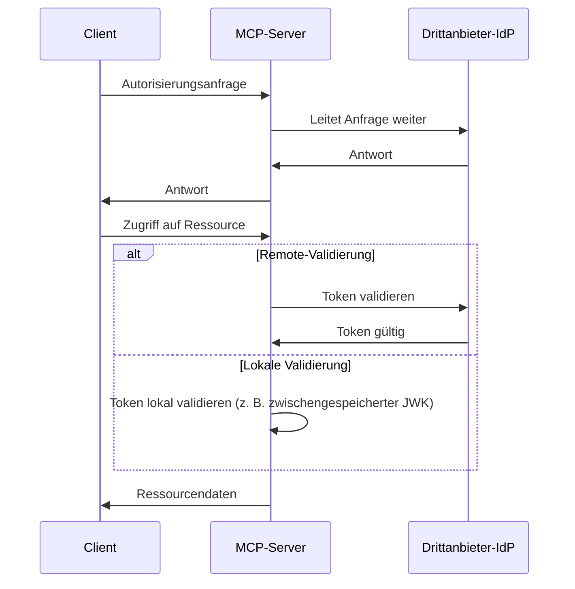
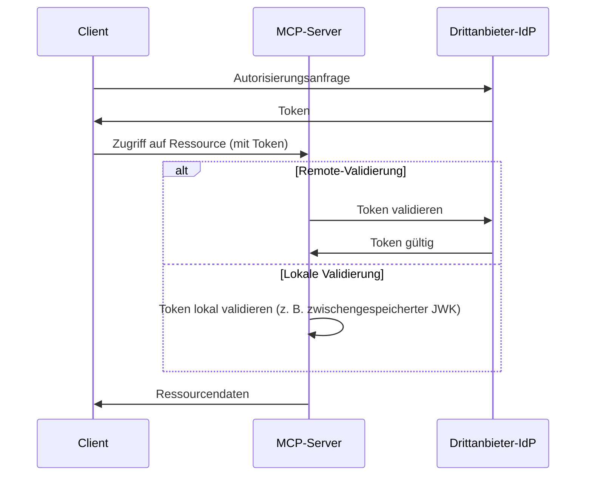

# Entscheidung zwischen MCP Auth und anderen Lösungen

Das MCP-Ökosystem entwickelt sich weiter. Während sich die Model Context Protocol (MCP) Spezifikation vom „Autorisierungsserver“-Ansatz hin zum neuen Modell „Ressourcenserver + Drittanbieter-IdP“ bewegt, ist es wichtig zu verstehen, wie verschiedene Integrationslösungen jetzt und in Zukunft passen.

Diese Seite zeigt die wichtigsten Unterschiede zwischen mcp-auth und anderen beliebten Lösungen auf, um dir bei der Wahl des besten Ansatzes für dein Projekt zu helfen.

## Hintergrund: Proxy-Ansatz vs. IdP-Integration \{#background-proxy-approach-vs-idp-integration}

Die meisten bestehenden MCP Auth-Lösungen verwenden einen „Proxy-Ansatz“. In diesem Modell leitet der MCP-Server Autorisierungsanfragen an einen Drittanbieter-Identitätsanbieter (IdP) weiter und fungiert damit effektiv als Vermittler zwischen dem Client und dem IdP.

**Proxy-Ansatz ([03-26 Spezifikation](https://modelcontextprotocol.io/specification/2025-03-26/basic/authorization))**

Obwohl dies mit der aktuellen (2025-03-26) MCP-Spezifikation funktioniert, ist es im Grunde ein Workaround. Es wird davon ausgegangen, dass der MCP-Server auch als Autorisierungsserver fungiert, was jedoch nicht der Richtung der neuesten Entwurfsspezifikation entspricht.

**MCP Auth / zukünftige Spezifikation (Ressourcenserver + Drittanbieter-IdP)**

Die kommende MCP-Spezifikation [verlagert die Verantwortung für die Autorisierung auf einen dedizierten Drittanbieter-IdP](https://github.com/modelcontextprotocol/modelcontextprotocol/issues/205). In diesem Modell dient der MCP-Server nur noch als Ressourcenserver, und alle Autorisierungsendpunkte kommen direkt vom Drittanbieter-IdP.

## Warum MCP Auth wählen? \{#why-choose-mcp-auth}

- Spezifikationskonformität: MCP Auth folgt direkt der Richtung des neuesten Entwurfs und ist damit die einzige Lösung, die sowohl mit der 03-26-Spezifikation als auch mit der kommenden Spezifikation kompatibel ist.
- Keine Workarounds mehr: Anstatt als Proxy für den Autorisierungsserver zu agieren, überlässt MCP Auth dem Drittanbieter-IdP die gesamte Autorisierung, wie in der neuen Spezifikation vorgesehen.
- Anbieterunabhängig: MCP Auth funktioniert mit jedem standardkonformen OAuth 2.0 / OIDC-Anbieter.
- Reibungsloser Übergang: MCP Auth gibt alle Drittanbieter-Endpunkte unverändert über OAuth 2.0 Authorization Server Metadata zurück. Das hält die Integration jetzt einfach und macht sie bereit für zukünftige Änderungen.
- Entwicklererfahrung: Bietet Tutorials, Hilfsprogramme und kommende Funktionen wie [OAuth 2.0 Protected Resource Metadata](https://auth.wiki/protected-resource-metadata), um das Leben für MCP-Server-Entwickler zu erleichtern.

| Funktion                           | Proxy-Lösungen       | MCP Auth |
| ---------------------------------- | -------------------- | -------- |
| Funktioniert mit 03-26-Spezifikation | ✅                   | ✅       |
| Funktioniert mit zukünftiger Spezifikation | ❌                   | ✅       |
| Unterstützt Drittanbieter-IdPs direkt | ❌ (nur Workaround)  | ✅       |
| Anbieterunabhängig                 | Eingeschränkt[^1]    | Ja       |
| Übergangsbereit                    | ❌                   | ✅       |

Wenn du jetzt Drittanbieter-IdPs unterstützen musst und für die kommende Spezifikation bereit sein willst, ist MCP Auth die empfohlene Lösung. Proxy-basierte Ansätze könnten bald veraltet sein oder eine umfassende Überarbeitung erfordern.

[^1]: Einige Proxy-Lösungen können bestimmte Parameter oder Endpunkte fest einprogrammieren, was die Flexibilität einschränkt.
