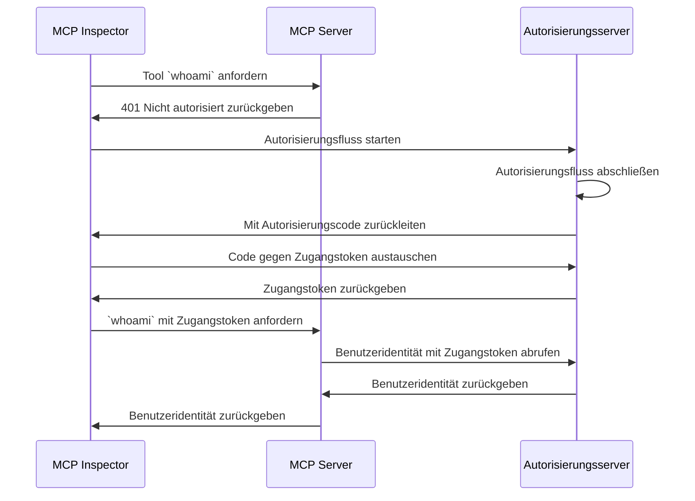

import TabItem from '@theme/TabItem';
import Tabs from '@theme/Tabs';

import SetupOauth from './_setup-oauth.mdx';
import SetupOidc from './_setup-oidc.mdx';

# Tutorial: Wer bin ich? (Tutorial: Who am I?)

Dieses Tutorial führt dich durch den Prozess der Einrichtung von MCP Auth, um Benutzer zu authentifizieren und deren Identitätsinformationen vom Autorisierungsserver abzurufen.

Nach Abschluss dieses Tutorials hast du:

- ✅ Ein grundlegendes Verständnis davon, wie du MCP Auth zur Authentifizierung von Benutzern verwendest.
- ✅ Einen MCP-Server, der ein Tool zum Abrufen von Benutzeridentitätsinformationen bereitstellt.

## Überblick \{#overview}

Das Tutorial umfasst die folgenden Komponenten:

- **MCP-Server**: Ein einfacher MCP-Server, der die offiziellen MCP SDKs verwendet, um Anfragen zu verarbeiten.
- **MCP Inspector**: Ein visuelles Testwerkzeug für MCP-Server. Es fungiert auch als OAuth / OIDC-Client, um den Autorisierungsfluss zu starten und Zugangstokens abzurufen.
- **Autorisierungsserver**: Ein OAuth 2.1- oder OpenID Connect-Anbieter, der Benutzeridentitäten verwaltet und Zugangstokens ausstellt.

Hier ist ein Überblicksdiagramm der Interaktion zwischen diesen Komponenten:



## Deinen Autorisierungsserver verstehen \{#understand-your-authorization-server}

### Benutzeridentitätsinformationen abrufen \{#retrieving-user-identity-information}

Um dieses Tutorial abzuschließen, sollte dein Autorisierungsserver eine API zum Abrufen von Benutzeridentitätsinformationen bereitstellen:

<Tabs groupId="provider">
<TabItem value="logto" label="Logto">

[Logto](https://logto.io) ist ein OpenID Connect-Anbieter, der den Standard-[userinfo-Endpunkt](https://openid.net/specs/openid-connect-core-1_0.html#UserInfo) unterstützt, um Benutzeridentitätsinformationen abzurufen.

Um ein Zugangstoken zu erhalten, das für den Zugriff auf den userinfo-Endpunkt verwendet werden kann, sind mindestens zwei Berechtigungen (`scopes`) erforderlich: `openid` und `profile`. Du kannst weiterlesen, da wir die Berechtigungskonfiguration später behandeln.

</TabItem>
<TabItem value="keycloak" label="Keycloak">

[Keycloak](https://www.keycloak.org) ist eine Open-Source-Lösung für Identitäts- und Zugriffsmanagement, die mehrere Protokolle unterstützt, darunter OpenID Connect (OIDC). Als OIDC-Anbieter implementiert es den Standard-[userinfo-Endpunkt](https://openid.net/specs/openid-connect-core-1_0.html#UserInfo) zum Abrufen von Benutzeridentitätsinformationen.

Um ein Zugangstoken zu erhalten, das für den Zugriff auf den userinfo-Endpunkt verwendet werden kann, sind mindestens zwei Berechtigungen (`scopes`) erforderlich: `openid` und `profile`. Du kannst weiterlesen, da wir die Berechtigungskonfiguration später behandeln.

</TabItem>
<TabItem value="oidc" label="OIDC">

Die meisten OpenID Connect-Anbieter unterstützen den [userinfo-Endpunkt](https://openid.net/specs/openid-connect-core-1_0.html#UserInfo) zum Abrufen von Benutzeridentitätsinformationen.

Überprüfe die Dokumentation deines Anbieters, um zu sehen, ob dieser Endpunkt unterstützt wird. Wenn dein Anbieter [OpenID Connect Discovery](https://openid.net/specs/openid-connect-discovery-1_0.html) unterstützt, kannst du auch prüfen, ob der `userinfo_endpoint` im Discovery-Dokument (Antwort vom `.well-known/openid-configuration`-Endpunkt) enthalten ist.

Um ein Zugangstoken zu erhalten, das für den Zugriff auf den userinfo-Endpunkt verwendet werden kann, sind mindestens zwei Berechtigungen (`scopes`) erforderlich: `openid` und `profile`. Überprüfe die Dokumentation deines Anbieters, um die Zuordnung der Berechtigungen zu Benutzeridentitätsansprüchen zu sehen.

</TabItem>
<TabItem value="oauth" label="OAuth 2">

Während OAuth 2.0 keine standardisierte Methode zum Abrufen von Benutzeridentitätsinformationen definiert, implementieren viele Anbieter eigene Endpunkte dafür. Überprüfe die Dokumentation deines Anbieters, um zu erfahren, wie du mit einem Zugangstoken Benutzeridentitätsinformationen abrufen kannst und welche Parameter erforderlich sind, um ein solches Zugangstoken beim Starten des Autorisierungsflusses zu erhalten.

</TabItem>
</Tabs>

### Dynamische Client-Registrierung \{#dynamic-client-registration}

Die dynamische Client-Registrierung ist für dieses Tutorial nicht erforderlich, kann aber nützlich sein, wenn du den MCP-Client-Registrierungsprozess mit deinem Autorisierungsserver automatisieren möchtest. Siehe [Ist Dynamic Client Registration erforderlich?](../../provider-list#is-dcr-required) für weitere Details.

## MCP-Server einrichten \{#set-up-the-mcp-server}

Wir verwenden die [offiziellen MCP SDKs](https://github.com/modelcontextprotocol), um einen MCP-Server mit einem `whoami`-Tool zu erstellen, das Benutzeridentitätsinformationen vom Autorisierungsserver abruft.

### Ein neues Projekt erstellen \{#create-a-new-project}

<Tabs groupId="sdk">
<TabItem value="python" label="Python">

```bash
mkdir mcp-server
cd mcp-server
uv init # Oder verwende `pipenv` oder `poetry`, um eine neue virtuelle Umgebung zu erstellen
```

</TabItem>
<TabItem value="node" label="Node.js">

Richte ein neues Node.js-Projekt ein:

```bash
mkdir mcp-server
cd mcp-server
npm init -y # Oder verwende `pnpm init`
npm pkg set type="module"
npm pkg set main="whoami.js"
npm pkg set scripts.start="node whoami.js"
```

</TabItem>
</Tabs>

### MCP SDK und Abhängigkeiten installieren \{#install-the-mcp-sdk-and-dependencies}

<Tabs groupId="sdk">
<TabItem value="python" label="Python">

```bash
pip install "mcp[cli]" starlette uvicorn
```

Oder ein anderes Paketverwaltungstool deiner Wahl, wie `uv` oder `poetry`.

</TabItem>
<TabItem value="node" label="Node.js">

```bash
npm install @modelcontextprotocol/sdk express
```

Oder ein anderes Paketverwaltungstool deiner Wahl, wie `pnpm` oder `yarn`.

</TabItem>
</Tabs>

### MCP-Server erstellen \{#create-the-mcp-server}

Erstellen wir zunächst einen MCP-Server, der ein `whoami`-Tool implementiert.

<Tabs groupId="sdk">
<TabItem value="python" label="Python">

Erstelle eine Datei namens `whoami.py` und füge folgenden Code hinzu:

```python
from mcp.server.fastmcp import FastMCP
from starlette.applications import Starlette
from starlette.routing import Mount
from typing import Any

mcp = FastMCP("WhoAmI")

@mcp.tool()
def whoami() -> dict[str, Any]:
    """Ein Tool, das die Informationen des aktuellen Benutzers zurückgibt."""
    return {"error": "Nicht authentifiziert"}

app = Starlette(
    routes=[Mount('/', app=mcp.sse_app())]
)
```

Starte den Server mit:

```bash
uvicorn whoami:app --host 0.0.0.0 --port 3001
```

</TabItem>
<TabItem value="node" label="Node.js">

:::note
Da die aktuelle MCP Inspector-Implementierung keine Autorisierungsflüsse verarbeitet, verwenden wir den SSE-Ansatz, um den MCP-Server einzurichten. Wir aktualisieren den Code hier, sobald der MCP Inspector Autorisierungsflüsse unterstützt.
:::

Du kannst auch `pnpm` oder `yarn` verwenden, wenn du möchtest.

Erstelle eine Datei namens `whoami.js` und füge folgenden Code hinzu:

```js
import { McpServer } from '@modelcontextprotocol/sdk/server/mcp.js';
import { SSEServerTransport } from '@modelcontextprotocol/sdk/server/sse.js';
import express from 'express';

// Erstelle einen MCP-Server
const server = new McpServer({
  name: 'WhoAmI',
  version: '0.0.0',
});

// Füge dem Server ein Tool hinzu, das die Informationen des aktuellen Benutzers zurückgibt
server.tool('whoami', async () => {
  return {
    content: [{ type: 'text', text: JSON.stringify({ error: 'Nicht authentifiziert' }) }],
  };
});

// Nachfolgend der Boilerplate-Code aus der MCP SDK-Dokumentation
const PORT = 3001;
const app = express();

const transports = {};

app.get('/sse', async (_req, res) => {
  const transport = new SSEServerTransport('/messages', res);
  transports[transport.sessionId] = transport;

  res.on('close', () => {
    delete transports[transport.sessionId];
  });

  await server.connect(transport);
});

app.post('/messages', async (req, res) => {
  const sessionId = String(req.query.sessionId);
  const transport = transports[sessionId];
  if (transport) {
    await transport.handlePostMessage(req, res, req.body);
  } else {
    res.status(400).send('Kein Transport für sessionId gefunden');
  }
});

app.listen(PORT);
```

Starte den Server mit:

```bash
npm start
```

</TabItem>
</Tabs>

## MCP-Server inspizieren \{#inspect-the-mcp-server}

### MCP Inspector klonen und ausführen \{#clone-and-run-mcp-inspector}

Jetzt, da der MCP-Server läuft, können wir den MCP Inspector verwenden, um zu sehen, ob das `whoami`-Tool verfügbar ist.

Aufgrund der aktuellen Implementierung haben wir den [MCP Inspector](https://github.com/mcp-auth/inspector) geforkt, um ihn flexibler und skalierbarer für Authentifizierung und Autorisierung zu machen. Wir haben auch einen Pull Request an das Original-Repository eingereicht, um unsere Änderungen einzubringen.

Um den MCP Inspector auszuführen, kannst du folgenden Befehl verwenden (Node.js wird benötigt):

```bash
git clone https://github.com/mcp-auth/inspector.git
cd inspector
npm install
npm run dev
```

Öffne dann deinen Browser und navigiere zu `http://localhost:6274/` (oder einer anderen im Terminal angezeigten URL), um auf den MCP Inspector zuzugreifen.

### MCP Inspector mit dem MCP-Server verbinden \{#connect-mcp-inspector-to-the-mcp-server}

Bevor wir fortfahren, überprüfe folgende Konfiguration im MCP Inspector:

- **Transporttyp**: Auf `SSE` setzen.
- **URL**: Auf die URL deines MCP-Servers setzen. In unserem Fall sollte das `http://localhost:3001/sse` sein.

Jetzt kannst du auf die Schaltfläche "Connect" klicken, um zu sehen, ob der MCP Inspector eine Verbindung zum MCP-Server herstellen kann. Wenn alles in Ordnung ist, solltest du den Status "Connected" im MCP Inspector sehen.

### Checkpoint: Das `whoami`-Tool ausführen \{#checkpoint-run-the-whoami-tool}

1. Klicke im oberen Menü des MCP Inspectors auf den Tab "Tools".
2. Klicke auf die Schaltfläche "List Tools".
3. Du solltest das `whoami`-Tool auf der Seite sehen. Klicke darauf, um die Tool-Details zu öffnen.
4. Du solltest auf der rechten Seite die Schaltfläche "Run Tool" sehen. Klicke darauf, um das Tool auszuführen.
5. Du solltest das Tool-Ergebnis mit der JSON-Antwort `{"error": "Nicht authentifiziert"}` sehen.


## Integration mit deinem Autorisierungsserver \{#integrate-with-your-authorization-server}

Um diesen Abschnitt abzuschließen, sind mehrere Überlegungen zu beachten:

<details>
<summary>**Die Issuer-URL deines Autorisierungsservers**</summary>

Dies ist normalerweise die Basis-URL deines Autorisierungsservers, z. B. `https://auth.example.com`. Einige Anbieter haben einen Pfad wie `https://example.logto.app/oidc`, daher solltest du die Dokumentation deines Anbieters prüfen.

</details>

<details>
<summary>**Wie du die Metadaten des Autorisierungsservers abrufst**</summary>

- Wenn dein Autorisierungsserver dem [OAuth 2.0 Authorization Server Metadata](https://datatracker.ietf.org/doc/html/rfc8414) oder [OpenID Connect Discovery](https://openid.net/specs/openid-connect-discovery-1_0.html) entspricht, kannst du die integrierten MCP Auth-Utilities verwenden, um die Metadaten automatisch abzurufen.
- Wenn dein Autorisierungsserver diese Standards nicht unterstützt, musst du die Metadaten-URL oder Endpunkte manuell in der MCP-Server-Konfiguration angeben. Prüfe die Dokumentation deines Anbieters für die spezifischen Endpunkte.

</details>

<details>
<summary>**Wie du den MCP Inspector als Client in deinem Autorisierungsserver registrierst**</summary>

- Wenn dein Autorisierungsserver [Dynamic Client Registration](https://datatracker.ietf.org/doc/html/rfc7591) unterstützt, kannst du diesen Schritt überspringen, da sich der MCP Inspector automatisch als Client registriert.
- Wenn dein Autorisierungsserver keine Dynamic Client Registration unterstützt, musst du den MCP Inspector manuell als Client in deinem Autorisierungsserver registrieren.

</details>

<details>
<summary>**Wie du Benutzeridentitätsinformationen abrufst und wie du die Parameter der Autorisierungsanfrage konfigurierst**</summary>

- Für OpenID Connect-Anbieter: In der Regel musst du beim Starten des Autorisierungsflusses mindestens die Berechtigungen `openid` und `profile` anfordern. Dadurch wird sichergestellt, dass das vom Autorisierungsserver zurückgegebene Zugangstoken die erforderlichen Berechtigungen für den Zugriff auf den [userinfo-Endpunkt](https://openid.net/specs/openid-connect-core-1_0.html#UserInfo) enthält, um Benutzeridentitätsinformationen abzurufen.

  Hinweis: Einige Anbieter unterstützen den userinfo-Endpunkt möglicherweise nicht.

- Für OAuth 2.0 / OAuth 2.1-Anbieter: Prüfe die Dokumentation deines Anbieters, um zu erfahren, wie du mit einem Zugangstoken Benutzeridentitätsinformationen abrufen kannst und welche Parameter erforderlich sind, um ein solches Zugangstoken beim Starten des Autorisierungsflusses zu erhalten.

</details>

Während jeder Anbieter eigene spezifische Anforderungen haben kann, führen dich die folgenden Schritte durch den Prozess der Integration des MCP Inspectors und MCP Servers mit anbieter-spezifischen Konfigurationen.

### MCP Inspector als Client registrieren \{#register-mcp-inspector-as-a-client}

<Tabs groupId="provider">
<TabItem value="logto" label="Logto">

Die Integration mit [Logto](https://logto.io) ist unkompliziert, da es sich um einen OpenID Connect-Anbieter handelt, der den Standard-[userinfo-Endpunkt](https://openid.net/specs/openid-connect-core-1_0.html#UserInfo) unterstützt, um Benutzeridentitätsinformationen abzurufen.

Da Logto derzeit keine Dynamic Client Registration unterstützt, musst du den MCP Inspector manuell als Client in deinem Logto-Tenant registrieren:

1. Öffne deinen MCP Inspector, klicke auf die Schaltfläche "OAuth Configuration". Kopiere den **Redirect URL (auto-populated)**-Wert, der etwa so aussehen sollte: `http://localhost:6274/oauth/callback`.
2. Melde dich bei der [Logto Console](https://cloud.logto.io) (oder deiner selbst gehosteten Logto Console) an.
3. Navigiere zum Tab "Applications", klicke auf "Create application". Klicke unten auf der Seite auf "Create app without framework".
4. Fülle die Anwendungsdetails aus und klicke dann auf "Create application":
   - **Wähle einen Anwendungstyp**: Wähle "Single-page application".
   - **Anwendungsname**: Gib einen Namen für deine Anwendung ein, z. B. "MCP Inspector".
5. Im Bereich "Settings / Redirect URIs" füge den zuvor kopierten **Redirect URL (auto-populated)**-Wert ein. Klicke dann unten auf "Save changes".
6. Im oberen Bereich siehst du den Wert "App ID". Kopiere ihn.
7. Gehe zurück zum MCP Inspector und füge den "App ID"-Wert im Bereich "OAuth Configuration" unter "Client ID" ein.
8. Gib den Wert `{"scope": "openid profile email"}` im Feld "Auth Params" ein. Dadurch wird sichergestellt, dass das von Logto zurückgegebene Zugangstoken die erforderlichen Berechtigungen für den Zugriff auf den userinfo-Endpunkt enthält.

</TabItem>
<TabItem value="keycloak" label="Keycloak">

[Keycloak](https://www.keycloak.org) ist eine Open-Source-Lösung für Identitäts- und Zugriffsmanagement, die das OpenID Connect-Protokoll unterstützt.

Obwohl Keycloak die dynamische Client-Registrierung unterstützt, unterstützt sein Client-Registrierungsendpunkt kein CORS, was die direkte Registrierung der meisten MCP-Clients verhindert. Daher müssen wir unseren Client manuell registrieren.

:::note
Obwohl Keycloak auf [verschiedene Arten](https://www.keycloak.org/guides#getting-started) (Bare Metal, Kubernetes usw.) installiert werden kann, verwenden wir für dieses Tutorial Docker für eine schnelle und einfache Einrichtung.
:::

Richte eine Keycloak-Instanz ein und konfiguriere sie wie folgt:

1. Starte eine Keycloak-Instanz mit Docker gemäß der [offiziellen Dokumentation](https://www.keycloak.org/getting-started/getting-started-docker):

```bash
docker run -p 8080:8080 -e KC_BOOTSTRAP_ADMIN_USERNAME=admin -e KC_BOOTSTRAP_ADMIN_PASSWORD=admin quay.io/keycloak/keycloak:26.2.4 start-dev
```

2. Greife auf die Keycloak Admin Console (http://localhost:8080/admin) zu und melde dich mit diesen Zugangsdaten an:

   - Benutzername: `admin`
   - Passwort: `admin`

3. Erstelle ein neues Realm:

   - Klicke oben links auf "Create Realm"
   - Gib `mcp-realm` im Feld "Realm name" ein
   - Klicke auf "Create"

4. Erstelle einen Testbenutzer:

   - Klicke im linken Menü auf "Users"
   - Klicke auf "Create new user"
   - Fülle die Benutzerdetails aus:
     - Benutzername: `testuser`
     - Vorname und Nachname können beliebige Werte sein
   - Klicke auf "Create"
   - Setze im Tab "Credentials" ein Passwort und deaktiviere "Temporary"

5. Registriere den MCP Inspector als Client:

   - Öffne deinen MCP Inspector, klicke auf die Schaltfläche "OAuth Configuration". Kopiere den **Redirect URL (auto-populated)**-Wert, der etwa so aussehen sollte: `http://localhost:6274/oauth/callback`.
   - Klicke in der Keycloak Admin Console im linken Menü auf "Clients"
   - Klicke auf "Create client"
   - Fülle die Client-Details aus:
     - Client-Typ: Wähle "OpenID Connect"
     - Client ID: Gib `mcp-inspector` ein
     - Klicke auf "Next"
   - Auf der Seite "Capability config":
     - Stelle sicher, dass "Standard flow" aktiviert ist
     - Klicke auf "Next"
   - Auf der Seite "Login settings":
     - Füge die zuvor kopierte MCP Inspector Callback-URL in "Valid redirect URIs" ein
     - Gib `http://localhost:6274` in "Web origins" ein
     - Klicke auf "Save"
   - Kopiere die "Client ID" (das ist `mcp-inspector`)

6. Zurück im MCP Inspector:
   - Füge die kopierte Client ID in das Feld "Client ID" im Bereich "OAuth Configuration" ein
   - Gib folgenden Wert im Feld "Auth Params" ein, um die erforderlichen Berechtigungen anzufordern:

```json
{ "scope": "openid profile email" }
```

</TabItem>
<TabItem value="oidc" label="OIDC">

:::note
Dies ist eine allgemeine Anleitung zur Integration eines OpenID Connect-Anbieters. Prüfe die Dokumentation deines Anbieters für spezifische Details.
:::

Wenn dein OpenID Connect-Anbieter die dynamische Client-Registrierung unterstützt, kannst du direkt zu Schritt 8 unten gehen, um den MCP Inspector zu konfigurieren; andernfalls musst du den MCP Inspector manuell als Client in deinem OpenID Connect-Anbieter registrieren:

1. Öffne deinen MCP Inspector, klicke auf die Schaltfläche "OAuth Configuration". Kopiere den **Redirect URL (auto-populated)**-Wert, der etwa so aussehen sollte: `http://localhost:6274/oauth/callback`.
2. Melde dich bei der Konsole deines OpenID Connect-Anbieters an.
3. Navigiere zum Bereich "Applications" oder "Clients" und erstelle eine neue Anwendung oder einen neuen Client.
4. Wenn dein Anbieter einen Client-Typ verlangt, wähle "Single-page application" oder "Public client".
5. Nach dem Erstellen der Anwendung musst du die Redirect URI konfigurieren. Füge den zuvor kopierten **Redirect URL (auto-populated)**-Wert ein.
6. Finde die "Client ID" oder "Application ID" der neu erstellten Anwendung und kopiere sie.
7. Gehe zurück zum MCP Inspector und füge die "Client ID" im Bereich "OAuth Configuration" unter "Client ID" ein.
8. Für Standard-OpenID Connect-Anbieter kannst du folgenden Wert im Feld "Auth Params" eingeben, um die erforderlichen Berechtigungen für den Zugriff auf den userinfo-Endpunkt anzufordern:

```json
{ "scope": "openid profile email" }
```

</TabItem>
<TabItem value="oauth" label="OAuth 2">

:::note
Dies ist eine allgemeine Anleitung zur Integration eines OAuth 2.0 / OAuth 2.1-Anbieters. Prüfe die Dokumentation deines Anbieters für spezifische Details.
:::

Wenn dein OAuth 2.0 / OAuth 2.1-Anbieter die dynamische Client-Registrierung unterstützt, kannst du direkt zu Schritt 8 unten gehen, um den MCP Inspector zu konfigurieren; andernfalls musst du den MCP Inspector manuell als Client in deinem OAuth 2.0 / OAuth 2.1-Anbieter registrieren:

1. Öffne deinen MCP Inspector, klicke auf die Schaltfläche "OAuth Configuration". Kopiere den **Redirect URL (auto-populated)**-Wert, der etwa so aussehen sollte: `http://localhost:6274/oauth/callback`.
2. Melde dich bei der Konsole deines OAuth 2.0 / OAuth 2.1-Anbieters an.
3. Navigiere zum Bereich "Applications" oder "Clients" und erstelle eine neue Anwendung oder einen neuen Client.
4. Wenn dein Anbieter einen Client-Typ verlangt, wähle "Single-page application" oder "Public client".
5. Nach dem Erstellen der Anwendung musst du die Redirect URI konfigurieren. Füge den zuvor kopierten **Redirect URL (auto-populated)**-Wert ein.
6. Finde die "Client ID" oder "Application ID" der neu erstellten Anwendung und kopiere sie.
7. Gehe zurück zum MCP Inspector und füge die "Client ID" im Bereich "OAuth Configuration" unter "Client ID" ein.
8. Lies die Dokumentation deines Anbieters, um zu erfahren, wie du Zugangstokens für Benutzeridentitätsinformationen abrufst. Möglicherweise musst du die erforderlichen Berechtigungen oder Parameter angeben, um das Zugangstoken zu erhalten. Wenn dein Anbieter z. B. die Berechtigung `profile` für den Zugriff auf Benutzeridentitätsinformationen verlangt, kannst du folgenden Wert im Feld "Auth Params" eingeben:

```json
{ "scope": "profile" }
```

</TabItem>
</Tabs>

### MCP Auth einrichten \{#set-up-mcp-auth}

In deinem MCP-Server-Projekt musst du das MCP Auth SDK installieren und es so konfigurieren, dass es die Metadaten deines Autorisierungsservers verwendet.

<Tabs groupId="sdk">
<TabItem value="python" label="Python">

Installiere zunächst das `mcpauth`-Paket:

```bash
pip install mcpauth
```

Oder ein anderes Paketverwaltungstool deiner Wahl, wie `uv` oder `poetry`.

</TabItem>
<TabItem value="node" label="Node.js">

Installiere zunächst das `mcp-auth`-Paket:

```bash
npm install mcp-auth
```

</TabItem>
</Tabs>

MCP Auth benötigt die Metadaten des Autorisierungsservers, um initialisiert werden zu können. Je nach Anbieter:

<Tabs groupId="provider">

<TabItem value="logto" label="Logto">

Die Issuer-URL findest du auf der Anwendungsdetailseite in der Logto Console im Abschnitt "Endpoints & Credentials / Issuer endpoint". Sie sollte etwa so aussehen: `https://my-project.logto.app/oidc`.

<SetupOidc />

</TabItem>

<TabItem value="keycloak" label="Keycloak">

Die Issuer-URL findest du in deiner Keycloak Admin Console. Navigiere in deinem 'mcp-realm' zum Abschnitt "Realm settings / Endpoints" und klicke auf den Link "OpenID Endpoint Configuration". Das Feld `issuer` im JSON-Dokument enthält deine Issuer-URL, die etwa so aussehen sollte: `http://localhost:8080/realms/mcp-realm`.

<SetupOidc />

</TabItem>

<TabItem value="oidc" label="OIDC">

Der folgende Code geht ebenfalls davon aus, dass der Autorisierungsserver den [userinfo-Endpunkt](https://openid.net/specs/openid-connect-core-1_0.html#UserInfo) zum Abrufen von Benutzeridentitätsinformationen unterstützt. Wenn dein Anbieter diesen Endpunkt nicht unterstützt, musst du die Dokumentation deines Anbieters für den spezifischen Endpunkt prüfen und die userinfo-Endpunkt-Variable durch die korrekte URL ersetzen.

<SetupOidc showAlternative />

</TabItem>
<TabItem value="oauth" label="OAuth 2">

Wie bereits erwähnt, definiert OAuth 2.0 keine standardisierte Methode zum Abrufen von Benutzeridentitätsinformationen. Der folgende Code geht davon aus, dass dein Anbieter einen spezifischen Endpunkt zum Abrufen von Benutzeridentitätsinformationen mit einem Zugangstoken bereitstellt. Du musst die Dokumentation deines Anbieters für den spezifischen Endpunkt prüfen und die userinfo-Endpunkt-Variable durch die korrekte URL ersetzen.

<SetupOauth />

</TabItem>
</Tabs>

### MCP-Server aktualisieren \{#update-mcp-server}

Wir sind fast fertig! Jetzt ist es an der Zeit, den MCP-Server zu aktualisieren, um die MCP Auth-Route und Middleware-Funktion anzuwenden und das `whoami`-Tool so zu gestalten, dass es die tatsächlichen Benutzeridentitätsinformationen zurückgibt.

<Tabs groupId="sdk">
<TabItem value="python" label="Python">

```python
@mcp.tool()
def whoami() -> dict[str, Any]:
    """Ein Tool, das die Informationen des aktuellen Benutzers zurückgibt."""
    return (
        mcp_auth.auth_info.claims
        if mcp_auth.auth_info # Dies wird durch die Bearer-Auth-Middleware befüllt
        else {"error": "Nicht authentifiziert"}
    )

# ...

bearer_auth = Middleware(mcp_auth.bearer_auth_middleware(verify_access_token))
app = Starlette(
    routes=[
        # Füge die Metadaten-Route hinzu (`/.well-known/oauth-authorization-server`)
        mcp_auth.metadata_route(),
        # Schütze den MCP-Server mit der Bearer-Auth-Middleware
        Mount('/', app=mcp.sse_app(), middleware=[bearer_auth]),
    ],
)
```

</TabItem>
<TabItem value="node" label="Node.js">

```js
server.tool('whoami', ({ authInfo }) => {
  return {
    content: [
      { type: 'text', text: JSON.stringify(authInfo?.claims ?? { error: 'Nicht authentifiziert' }) },
    ],
  };
});

// ...

app.use(mcpAuth.delegatedRouter());
app.use(mcpAuth.bearerAuth(verifyToken));
```

</TabItem>
</Tabs>

## Checkpoint: Das `whoami`-Tool mit Authentifizierung ausführen \{#checkpoint-run-the-whoami-tool-with-authentication}

Starte deinen MCP-Server neu und öffne den MCP Inspector in deinem Browser. Wenn du auf die Schaltfläche "Connect" klickst, solltest du zur Anmeldeseite deines Autorisierungsservers weitergeleitet werden.

Sobald du dich angemeldet hast und zum MCP Inspector zurückkehrst, wiederhole die Schritte aus dem vorherigen Checkpoint, um das `whoami`-Tool auszuführen. Dieses Mal solltest du die vom Autorisierungsserver zurückgegebenen Benutzeridentitätsinformationen sehen.


<Tabs groupId="sdk">
<TabItem value="python" label="Python">

:::info
Sieh dir das [MCP Auth Python SDK Repository](https://github.com/mcp-auth/python/blob/master/samples/server/whoami.py) für den vollständigen Code des MCP-Servers (OIDC-Version) an.
:::

</TabItem>
<TabItem value="node" label="Node.js">

:::info
Sieh dir das [MCP Auth Node.js SDK Repository](https://github.com/mcp-auth/js/blob/master/packages/sample-servers/src) für den vollständigen Code des MCP-Servers (OIDC-Version) an. Dieses Verzeichnis enthält sowohl TypeScript- als auch JavaScript-Versionen des Codes.
:::

</TabItem>
</Tabs>

## Abschließende Hinweise \{#closing-notes}

🎊 Glückwunsch! Du hast das Tutorial erfolgreich abgeschlossen. Lass uns zusammenfassen, was wir gemacht haben:

- Einen grundlegenden MCP-Server mit dem `whoami`-Tool eingerichtet
- Den MCP-Server mit einem Autorisierungsserver unter Verwendung von MCP Auth integriert
- Den MCP Inspector so konfiguriert, dass Benutzer authentifiziert und deren Identitätsinformationen abgerufen werden

Du möchtest vielleicht auch einige fortgeschrittene Themen erkunden, darunter:

- Die Verwendung von [JWT (JSON Web Token)](https://auth.wiki/jwt) für Authentifizierung und Autorisierung
- Die Nutzung von [Ressourcenindikatoren (RFC 8707)](https://auth-wiki.logto.io/resource-indicator), um die zuzugreifenden Ressourcen anzugeben
- Die Implementierung eigener Zugangskontrollmechanismen, wie [rollenbasierte Zugangskontrolle (RBAC)](https://auth.wiki/rbac) oder [attributbasierte Zugangskontrolle (ABAC)](https://auth.wiki/abac)

Sieh dir unbedingt weitere Tutorials und die Dokumentation an, um das Beste aus MCP Auth herauszuholen.
