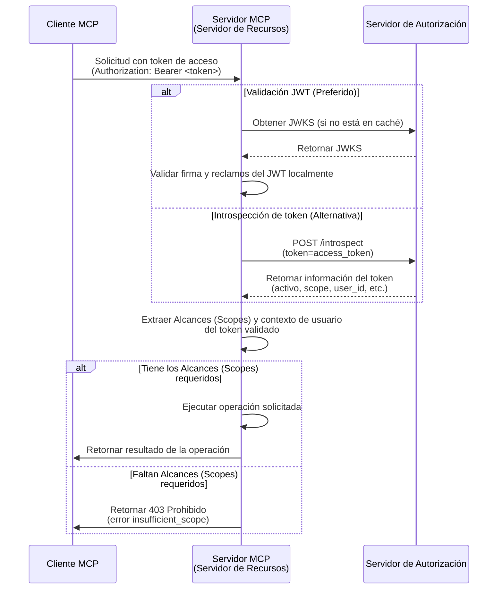

import TabItem from '@theme/TabItem';
import Tabs from '@theme/Tabs';

# Tutorial: Construye un gestor de tareas

:::tip SDK de Python disponible
¡MCP Auth también está disponible para Python! Consulta el [repositorio del SDK de Python](https://github.com/mcp-auth/python) para instalación y uso.
:::

En este tutorial, construiremos un servidor MCP gestor de tareas con Autenticación (Authentication) y Autorización (Authorization) de usuarios. Siguiendo la última especificación de MCP, nuestro servidor MCP actuará como un **Servidor de Recursos (Resource Server)** OAuth 2.0 que valida tokens de acceso y aplica permisos basados en Alcances (Scopes).

Al completar este tutorial, tendrás:

- ✅ Una comprensión básica de cómo configurar el control de acceso basado en roles (RBAC) en tu servidor MCP.
- ✅ Un servidor MCP que actúa como Servidor de Recursos, consumiendo tokens de acceso emitidos por un Servidor de Autorización.
- ✅ Una implementación funcional de la aplicación de permisos basados en Alcances (Scopes) para operaciones de tareas.

## Visión general \{#overview}

El tutorial involucrará los siguientes componentes:

- **Cliente MCP (MCP Inspector)**: Una herramienta visual de pruebas para servidores MCP que actúa como cliente OAuth 2.0/OIDC. Inicia el flujo de autorización con el servidor de autorización y obtiene tokens de acceso para autenticar solicitudes al servidor MCP.
- **Servidor de Autorización**: Un proveedor OAuth 2.1 u OpenID Connect que gestiona identidades de usuario, autentica usuarios y emite tokens de acceso con los Alcances (Scopes) apropiados a los clientes autorizados.
- **Servidor MCP (Servidor de Recursos)**: Según la última especificación de MCP, el servidor MCP actúa como un Servidor de Recursos en el marco OAuth 2.0. Valida tokens de acceso emitidos por el servidor de autorización y aplica permisos basados en Alcances (Scopes) para operaciones de tareas.

Esta arquitectura sigue el flujo estándar de OAuth 2.0 donde:
- El **MCP Inspector** solicita recursos protegidos en nombre del usuario
- El **Servidor de Autorización** autentica al usuario y emite tokens de acceso
- El **Servidor MCP** valida los tokens y sirve recursos protegidos según los permisos otorgados

Aquí tienes un diagrama de alto nivel de la interacción entre estos componentes:


```mermaid
sequenceDiagram
  autonumber
  participant Client as MCP Inspector<br/>(Cliente OAuth)
  participant RS as Servidor MCP<br/>(Servidor de Recursos)
  participant AS as Servidor de Autorización

  Client->>RS: Solicitud MCP (sin token)
  RS-->>Client: 401 No autorizado (WWW-Authenticate)
  Note over Client: Extraer URL de resource_metadata<br/>del encabezado WWW-Authenticate

  Client->>RS: GET /.well-known/oauth-protected-resource (resource_metadata)
  RS-->>Client: Metadatos del recurso protegido<br/>(incluye URL del servidor de autorización)

  Client->>AS: GET /.well-known/oauth-authorization-server
  AS-->>Client: Metadatos del servidor de autorización
  Client->>AS: Autorización OAuth (inicio de sesión y consentimiento)
  AS-->>Client: Token de acceso

  Client->>RS: Solicitud MCP (Authorization: Bearer <token>)
  RS->>RS: Validar que el token de acceso es válido y autorizado
  RS-->>Client: Respuesta MCP
```

## Comprende tu servidor de autorización \{#understand-your-authorization-server}

### Tokens de acceso con Alcances (Scopes) \{#access-tokens-with-scopes}

Para implementar el [control de acceso basado en roles (RBAC)](https://auth.wiki/rbac) en tu servidor MCP, tu servidor de autorización debe admitir la emisión de tokens de acceso con Alcances (Scopes). Los Alcances (Scopes) representan los permisos que se han otorgado a un usuario.

<Tabs groupId="provider">
<TabItem value="logto" label="Logto">

[Logto](https://logto.io) proporciona soporte para RBAC a través de sus recursos de API (conforme a [RFC 8707: Indicadores de recurso para OAuth 2.0](https://datatracker.ietf.org/doc/html/rfc8707)) y funciones de roles. Así es como se configura:

1. Inicia sesión en [Logto Console](https://cloud.logto.io) (o tu Logto Console autoalojado)

2. Crea recurso de API y Alcances (Scopes):

   - Ve a "Recursos de API"
   - Crea un nuevo recurso de API llamado "Gestor de tareas"
   - Añade los siguientes Alcances (Scopes):
     - `create:todos`: "Crear nuevas tareas"
     - `read:todos`: "Leer todas las tareas"
     - `delete:todos`: "Eliminar cualquier tarea"

3. Crea roles (recomendado para una gestión más sencilla):

   - Ve a "Roles"
   - Crea un rol "Admin" y asigna todos los Alcances (Scopes) (`create:todos`, `read:todos`, `delete:todos`)
   - Crea un rol "User" y asigna solo el Alcance (Scope) `create:todos`

4. Asigna permisos:
   - Ve a "Usuarios"
   - Selecciona un usuario
   - Puedes:
     - Asignar roles en la pestaña "Roles" (recomendado)
     - O asignar Alcances (Scopes) directamente en la pestaña "Permisos"

Los Alcances (Scopes) se incluirán en el reclamo `scope` del token de acceso JWT como una cadena separada por espacios.

</TabItem>
<TabItem value="oauth-oidc" label="OAuth 2.0 / OIDC">

Los proveedores OAuth 2.0 / OIDC suelen admitir el control de acceso basado en Alcances (Scopes). Al implementar RBAC:

1. Define los Alcances (Scopes) requeridos en tu servidor de autorización
2. Configura tu cliente para solicitar estos Alcances (Scopes) durante el flujo de autorización
3. Asegúrate de que tu servidor de autorización incluya los Alcances (Scopes) otorgados en el token de acceso
4. Los Alcances (Scopes) suelen incluirse en el reclamo `scope` del token de acceso JWT

Consulta la documentación de tu proveedor para detalles específicos sobre:

- Cómo definir y gestionar Alcances (Scopes)
- Cómo se incluyen los Alcances (Scopes) en el token de acceso
- Cualquier característica adicional de RBAC como la gestión de roles

</TabItem>
</Tabs>

### Validación de tokens y comprobación de permisos \{#validating-tokens-and-checking-permissions}

Según la última especificación de MCP, el servidor MCP actúa como un **Servidor de Recursos (Resource Server)** en el marco OAuth 2.0. Como Servidor de Recursos, el servidor MCP tiene las siguientes responsabilidades:

1. **Validación de tokens**: Verificar la autenticidad e integridad de los tokens de acceso recibidos de los clientes MCP
2. **Aplicación de Alcances (Scopes)**: Extraer y validar los Alcances (Scopes) del token de acceso para determinar qué operaciones está autorizado a realizar el cliente
3. **Protección de recursos**: Solo servir recursos protegidos (ejecutar herramientas) cuando el cliente presente tokens válidos con permisos suficientes

Cuando tu servidor MCP recibe una solicitud, realiza el siguiente proceso de validación:

1. Extrae el token de acceso del encabezado `Authorization` (formato Bearer token)
2. Valida la firma y expiración del token de acceso
3. Extrae los Alcances (Scopes) e información del usuario del token validado
4. Comprueba si el token tiene los Alcances (Scopes) requeridos para la operación solicitada

Por ejemplo, si un usuario quiere crear una nueva tarea, su token de acceso debe incluir el Alcance (Scope) `create:todos`. Así es como funciona el flujo de validación del Servidor de Recursos:


```mermaid
sequenceDiagram
    participant Client as Cliente MCP
    participant Server as Servidor MCP<br/>(Servidor de Recursos)
    participant Auth as Servidor de Autorización

    Client->>Server: Solicitud con token de acceso<br/>(Authorization: Bearer <token>)

    alt Validación JWT (Preferido)
        Server->>Auth: Obtener JWKS (si no está en caché)
        Auth-->>Server: Retornar JWKS
        Server->>Server: Validar firma y reclamos del JWT localmente
    else Introspección de token (Alternativa)
        Server->>Auth: POST /introspect<br/>(token=access_token)
        Auth-->>Server: Retornar información del token<br/>(activo, scope, user_id, etc.)
    end

    Server->>Server: Extraer Alcances (Scopes) y contexto de usuario<br/>del token validado

    alt Tiene los Alcances (Scopes) requeridos
        Server->>Server: Ejecutar operación solicitada
        Server->>Client: Retornar resultado de la operación
    else Faltan Alcances (Scopes) requeridos
        Server->>Client: Retornar 403 Prohibido<br/>(error insufficient_scope)
    end
```

### Registro dinámico de clientes \{#dynamic-client-registration}

El registro dinámico de clientes no es necesario para este tutorial, pero puede ser útil si deseas automatizar el proceso de registro del cliente MCP con tu servidor de autorización. Consulta [¿Se requiere Dynamic Client Registration?](/provider-list#is-dcr-required) para más detalles.

## Comprende RBAC en el gestor de tareas \{#understand-rbac-in-todo-manager}

Para fines demostrativos, implementaremos un sistema simple de control de acceso basado en roles (RBAC) en nuestro servidor MCP gestor de tareas. Esto te mostrará los principios básicos de RBAC manteniendo la implementación sencilla.

:::note
Aunque este tutorial demuestra la gestión de Alcances (Scopes) basada en RBAC, es importante señalar que no todos los proveedores de autenticación implementan la gestión de Alcances (Scopes) a través de roles. Algunos proveedores pueden tener implementaciones y mecanismos únicos para gestionar el control de acceso y los permisos.
:::

### Herramientas y Alcances (Scopes) \{#tools-and-scopes}

Nuestro servidor MCP gestor de tareas proporciona tres herramientas principales:

- `create-todo`: Crear una nueva tarea
- `get-todos`: Listar todas las tareas
- `delete-todo`: Eliminar una tarea por ID

Para controlar el acceso a estas herramientas, definimos los siguientes Alcances (Scopes):

- `create:todos`: Permite crear nuevas tareas
- `delete:todos`: Permite eliminar tareas existentes
- `read:todos`: Permite consultar y recuperar la lista de todas las tareas

### Roles y permisos \{#roles-and-permissions}

Definiremos dos roles con diferentes niveles de acceso:

| Rol   | create:todos | read:todos | delete:todos |
| ----- | ------------ | ---------- | ------------ |
| Admin | ✅           | ✅         | ✅           |
| User  | ✅           |            |              |

- **User**: Un usuario regular que puede crear tareas y ver o eliminar solo sus propias tareas
- **Admin**: Un administrador que puede crear, ver y eliminar todas las tareas, sin importar la propiedad

### Propiedad de recursos \{#resource-ownership}

Aunque la tabla de permisos anterior muestra los Alcances (Scopes) explícitos asignados a cada rol, hay un principio importante de propiedad de recursos a considerar:

- **Usuarios** no tienen los Alcances (Scopes) `read:todos` o `delete:todos`, pero aún pueden:
  - Leer sus propias tareas
  - Eliminar sus propias tareas
- **Admins** tienen todos los permisos (`read:todos` y `delete:todos`), lo que les permite:
  - Ver todas las tareas del sistema
  - Eliminar cualquier tarea, sin importar la propiedad

Esto demuestra un patrón común en los sistemas RBAC donde la propiedad de recursos otorga permisos implícitos a los usuarios para sus propios recursos, mientras que los roles administrativos reciben permisos explícitos para todos los recursos.

:::tip Aprende más
Para profundizar en los conceptos y mejores prácticas de RBAC, consulta [Dominando RBAC: Un ejemplo completo del mundo real](https://blog.logto.io/mastering-rbac).
:::

## Configura la autorización en tu proveedor \{#configure-authorization-in-your-provider}

Para implementar el sistema de control de acceso que describimos antes, deberás configurar tu servidor de autorización para admitir los Alcances (Scopes) requeridos. Así es como hacerlo con diferentes proveedores:

<Tabs groupId="provider">
<TabItem value="logto" label="Logto">

[Logto](https://logto.io) proporciona soporte para RBAC a través de sus recursos de API y funciones de roles. Así es como se configura:

1. Inicia sesión en [Logto Console](https://cloud.logto.io) (o tu Logto Console autoalojado)

2. Crea recurso de API y Alcances (Scopes):

   - Ve a "Recursos de API"
   - Crea un nuevo recurso de API llamado "Gestor de tareas" y usa `http://localhost:3001` como el indicador de recurso.
     - **Importante**: El indicador de recurso debe coincidir con la URL de tu servidor MCP. Para este tutorial, usamos `http://localhost:3001` ya que nuestro servidor MCP se ejecuta en el puerto 3001. En producción, usa la URL real de tu servidor MCP (por ejemplo, `https://tu-servidor-mcp.ejemplo.com`).
   - Crea los siguientes Alcances (Scopes):
     - `create:todos`: "Crear nuevas tareas"
     - `read:todos`: "Leer todas las tareas"
     - `delete:todos`: "Eliminar cualquier tarea"

3. Crea roles (recomendado para una gestión más sencilla):

   - Ve a "Roles"
   - Crea un rol "Admin" y asigna todos los Alcances (Scopes) (`create:todos`, `read:todos`, `delete:todos`)
   - Crea un rol "User" y asigna solo el Alcance (Scope) `create:todos`
   - En la página de detalles del rol "User", cambia a la pestaña "General" y establece el rol "User" como el "Rol predeterminado".

4. Gestiona roles y permisos de usuario:
   - Para nuevos usuarios:
     - Obtendrán automáticamente el rol "User" ya que lo establecimos como rol predeterminado
   - Para usuarios existentes:
     - Ve a "Gestión de usuarios"
     - Selecciona un usuario
     - Asigna roles al usuario en la pestaña "Roles"

:::tip Gestión programática de roles
También puedes usar la [Management API](https://docs.logto.io/integrate-logto/interact-with-management-api) de Logto para gestionar roles de usuario de forma programática. Esto es especialmente útil para la gestión automatizada de usuarios o al construir paneles de administración.
:::

Al solicitar un token de acceso, Logto incluirá los Alcances (Scopes) en el reclamo `scope` del token según los permisos de rol del usuario.

</TabItem>
<TabItem value="oauth-or-oidc" label="OAuth 2 / OIDC">

Para proveedores OAuth 2.0 u OpenID Connect, deberás configurar los Alcances (Scopes) que representan diferentes permisos. Los pasos exactos dependerán de tu proveedor, pero generalmente:

1. Define Alcances (Scopes):

   - Configura tu servidor de autorización para admitir:
     - `create:todos`
     - `read:todos`
     - `delete:todos`

2. Configura el cliente:

   - Registra o actualiza tu cliente para solicitar estos Alcances (Scopes)
   - Asegúrate de que los Alcances (Scopes) estén incluidos en el token de acceso

3. Asigna permisos:
   - Usa la interfaz de tu proveedor para otorgar los Alcances (Scopes) apropiados a los usuarios
   - Algunos proveedores pueden admitir la gestión basada en roles, mientras que otros pueden usar asignaciones directas de Alcances (Scopes)
   - Consulta la documentación de tu proveedor para el enfoque recomendado

:::tip
La mayoría de los proveedores incluirán los Alcances (Scopes) otorgados en el reclamo `scope` del token de acceso. El formato suele ser una cadena de valores de Alcances (Scopes) separados por espacios.
:::

</TabItem>
</Tabs>

Después de configurar tu servidor de autorización, los usuarios recibirán tokens de acceso que contienen los Alcances (Scopes) otorgados. El servidor MCP usará estos Alcances (Scopes) para determinar:

- Si un usuario puede crear nuevas tareas (`create:todos`)
- Si un usuario puede ver todas las tareas (`read:todos`) o solo las suyas
- Si un usuario puede eliminar cualquier tarea (`delete:todos`) o solo las suyas

## Configura el servidor MCP \{#set-up-the-mcp-server}

Usaremos los [SDKs oficiales de MCP](https://github.com/modelcontextprotocol) para crear nuestro servidor MCP gestor de tareas.

### Crea un nuevo proyecto \{#create-a-new-project}

Configura un nuevo proyecto Node.js:

```bash
mkdir mcp-server
cd mcp-server
npm init -y # O usa `pnpm init`
npm pkg set type="module"
npm pkg set main="todo-manager.ts"
npm pkg set scripts.start="node --experimental-strip-types todo-manager.ts"
```

:::note
Usamos TypeScript en nuestros ejemplos ya que Node.js v22.6.0+ admite la ejecución de TypeScript de forma nativa usando la opción `--experimental-strip-types`. Si usas JavaScript, el código será similar; solo asegúrate de usar Node.js v22.6.0 o posterior. Consulta la documentación de Node.js para más detalles.
:::

### Instala el SDK de MCP y dependencias \{#install-the-mcp-sdk-and-dependencies}

```bash
npm install @modelcontextprotocol/sdk express zod
```

O cualquier otro gestor de paquetes que prefieras, como `pnpm` o `yarn`.

### Crea el servidor MCP \{#create-the-mcp-server}

Crea un archivo llamado `todo-manager.ts` y añade el siguiente código:

[El bloque de código se mantiene igual que el original.]

Ejecuta el servidor con:

```bash
npm start
```

## Inspecciona el servidor MCP \{#inspect-the-mcp-server}

### Clona y ejecuta MCP inspector \{#clone-and-run-mcp-inspector}

Ahora que tenemos el servidor MCP en funcionamiento, podemos usar el MCP inspector para ver si las herramientas están disponibles.

La versión oficial del MCP inspector v0.16.2 tiene algunos errores que afectan la funcionalidad de autenticación. Para solucionar estos problemas, hemos creado una [versión parcheada del MCP inspector](https://github.com/mcp-auth/inspector/tree/patch/0.16.2-fixes) que incluye las correcciones necesarias para los flujos de autenticación OAuth/OIDC. También hemos enviado pull requests al repositorio oficial para contribuir con estas correcciones.

Para ejecutar el MCP inspector, puedes usar el siguiente comando (se requiere Node.js):

```bash
git clone https://github.com/mcp-auth/inspector.git -b patch/0.16.2-fixes
cd inspector
npm install
npm run dev
```

El MCP inspector se abrirá automáticamente en tu navegador predeterminado, o puedes acceder manualmente haciendo clic en el enlace de la salida de la terminal (asegúrate de hacer clic en el enlace que incluye el parámetro `MCP_PROXY_AUTH_TOKEN`, como `http://localhost:6274/?MCP_PROXY_AUTH_TOKEN=458ae4a4...acab1907`).

### Conecta MCP inspector al servidor MCP \{#connect-mcp-inspector-to-the-mcp-server}

Antes de continuar, revisa la siguiente configuración en MCP inspector:

- **Tipo de transporte**: Establece en `Streamable HTTP`.
- **URL**: Establece la URL de tu servidor MCP. En nuestro caso, debe ser `http://localhost:3001`.

Ahora puedes hacer clic en el botón "Connect" para ver si el MCP inspector puede conectarse al servidor MCP. Si todo está bien, deberías ver el estado "Connected" en el MCP inspector.

### Punto de control: Ejecuta las herramientas del gestor de tareas \{#checkpoint-run-todo-manager-tools}

1. En el menú superior del MCP inspector, haz clic en la pestaña "Tools".
2. Haz clic en el botón "List Tools".
3. Deberías ver las herramientas `create-todo`, `get-todos` y `delete-todo` listadas en la página. Haz clic en ellas para ver los detalles.
4. Deberías ver el botón "Run Tool" en el lado derecho. Haz clic en él e ingresa los parámetros requeridos para ejecutar la herramienta.
5. Deberías ver el resultado de la herramienta con la respuesta JSON `{"error": "Not implemented"}`.


## Integra con tu servidor de autorización \{#integrate-with-your-authorization-server}

Para completar esta sección, hay varias consideraciones a tener en cuenta:

<details>
<summary>**La URL del emisor de tu servidor de autorización**</summary>

Normalmente es la URL base de tu servidor de autorización, como `https://auth.example.com`. Algunos proveedores pueden tener una ruta como `https://example.logto.app/oidc`, así que asegúrate de consultar la documentación de tu proveedor.

</details>

<details>
<summary>**Cómo obtener los metadatos del servidor de autorización**</summary>

- Si tu servidor de autorización cumple con [OAuth 2.0 Authorization Server Metadata](https://datatracker.ietf.org/doc/html/rfc8414) o [OpenID Connect Discovery](https://openid.net/specs/openid-connect-discovery-1_0.html), puedes usar las utilidades integradas de MCP Auth para obtener los metadatos automáticamente.
- Si tu servidor de autorización no cumple con estos estándares, deberás especificar manualmente la URL de metadatos o los endpoints en la configuración del servidor MCP. Consulta la documentación de tu proveedor para los endpoints específicos.

</details>

<details>
<summary>**Cómo registrar el MCP inspector como cliente en tu servidor de autorización**</summary>

- Si tu servidor de autorización admite [Dynamic Client Registration](https://datatracker.ietf.org/doc/html/rfc7591), puedes omitir este paso ya que el MCP inspector se registrará automáticamente como cliente.
- Si tu servidor de autorización no admite Dynamic Client Registration, deberás registrar manualmente el MCP inspector como cliente en tu servidor de autorización.

</details>

<details>
<summary>**Comprende los parámetros de solicitud de token**</summary>

Al solicitar tokens de acceso de diferentes servidores de autorización, encontrarás varios enfoques para especificar el recurso objetivo y los permisos. Aquí están los principales patrones:

- **Basado en indicador de recurso**:

  - Usa el parámetro `resource` para especificar la API objetivo (ver [RFC 8707: Resource Indicators for OAuth 2.0](https://datatracker.ietf.org/doc/html/rfc8707))
  - Común en implementaciones modernas de OAuth 2.0
  - Ejemplo de solicitud:
    ```json
    {
      "resource": "http://localhost:3001",
      "scope": "create:todos read:todos"
    }
    ```
  - El servidor emite tokens vinculados específicamente al recurso solicitado

- **Basado en audiencia**:

  - Usa el parámetro `audience` para especificar el destinatario previsto del token
  - Similar a los indicadores de recurso pero con diferentes semánticas
  - Ejemplo de solicitud:
    ```json
    {
      "audience": "todo-api",
      "scope": "create:todos read:todos"
    }
    ```

- **Basado solo en Alcances (Scopes)**:
  - Se basa únicamente en Alcances (Scopes) sin parámetros de recurso/audiencia
  - Enfoque tradicional de OAuth 2.0
  - Ejemplo de solicitud:
    ```json
    {
      "scope": "todo-api:create todo-api:read openid profile"
    }
    ```
  - A menudo usa Alcances (Scopes) con prefijo para namespacing de permisos
  - Común en implementaciones más simples de OAuth 2.0

:::tip Mejores prácticas

- Consulta la documentación de tu proveedor para los parámetros admitidos
- Algunos proveedores admiten varios enfoques simultáneamente
- Los indicadores de recurso proporcionan mejor seguridad mediante restricción de audiencia
- Considera usar indicadores de recurso cuando estén disponibles para un mejor control de acceso
  :::

</details>

Aunque cada proveedor puede tener requisitos específicos, los siguientes pasos te guiarán en el proceso de integración del MCP inspector y el servidor MCP con configuraciones específicas del proveedor.

### Registra MCP inspector como cliente \{#register-mcp-inspector-as-a-client}

<Tabs groupId="provider">
<TabItem value="logto" label="Logto">

Integrar el gestor de tareas con [Logto](https://logto.io) es sencillo ya que es un proveedor OpenID Connect que admite indicadores de recurso y Alcances (Scopes), permitiéndote proteger tu API de tareas con `http://localhost:3001` como indicador de recurso.

Como Logto aún no admite Dynamic Client Registration, deberás registrar manualmente el MCP inspector como cliente en tu tenant de Logto:

1. Abre tu MCP inspector, ve a la configuración de Autenticación (Authentication) y haz clic en la configuración "OAuth2.0 Flow". Copia el valor de **Redirect URI**, que debería ser algo como `http://localhost:6274/oauth/callback`.
2. Inicia sesión en [Logto Console](https://cloud.logto.io) (o tu Logto Console autoalojado).
3. Navega a la pestaña "Aplicaciones", haz clic en "Crear aplicación". Al final de la página, haz clic en "Crear app sin framework".
4. Rellena los detalles de la aplicación y haz clic en "Crear aplicación":
   - **Selecciona un tipo de aplicación**: Elige "Aplicación de una sola página".
   - **Nombre de la aplicación**: Ingresa un nombre para tu aplicación, por ejemplo, "MCP Inspector".
5. En la sección "Configuración / Redirect URIs", pega el valor de **Redirect URI** que copiaste del MCP inspector. Luego haz clic en "Guardar cambios" en la barra inferior.
6. En la tarjeta superior, verás el valor "App ID". Cópialo.
7. Vuelve al MCP inspector y pega el valor "App ID" en la configuración de Autenticación (Authentication) bajo "OAuth2.0 Flow" en el campo "Client ID".
8. En el campo "Scope", ingresa: `create:todos read:todos delete:todos`. Esto asegurará que el token de acceso devuelto por Logto contenga los Alcances (Scopes) necesarios para acceder al gestor de tareas.

</TabItem>
<TabItem value="oauth-oidc" label="OAuth 2.0 / OIDC">

:::note
Esta es una guía genérica de integración para proveedores OAuth 2.0 / OpenID Connect. Ambos siguen pasos similares ya que OIDC se basa en OAuth 2.0. Consulta la documentación de tu proveedor para detalles específicos.
:::

Si tu proveedor admite Dynamic Client Registration, puedes ir directamente al paso 8 para configurar el MCP inspector; de lo contrario, deberás registrar manualmente el MCP inspector como cliente:

1. Abre tu MCP inspector, ve a la configuración de Autenticación (Authentication) y haz clic en la configuración "OAuth2.0 Flow". Copia el valor de **Redirect URI**, que debería ser algo como `http://localhost:6274/oauth/callback`.

2. Inicia sesión en la consola de tu proveedor.

3. Navega a la sección "Aplicaciones" o "Clientes", luego crea una nueva aplicación o cliente.

4. Si tu proveedor requiere un tipo de cliente, selecciona "Aplicación de una sola página" o "Cliente público".

5. Después de crear la aplicación, deberás configurar el redirect URI. Pega el valor de **Redirect URI** que copiaste del MCP inspector.

6. Busca el "Client ID" o "Application ID" de la nueva aplicación y cópialo.

7. Vuelve al MCP inspector y pega el valor "Client ID" en la configuración de Autenticación (Authentication) bajo "OAuth2.0 Flow" en el campo "Client ID".

8. En el campo "Scope", ingresa los siguientes Alcances (Scopes) para solicitar los permisos necesarios para las operaciones de tareas:

```text
create:todos read:todos delete:todos
```

</TabItem>
</Tabs>

### Configura MCP Auth \{#set-up-mcp-auth}

Primero, instala el SDK de MCP Auth en tu proyecto de servidor MCP.

import { NpmLikeInstallation } from '@site/src/components/NpmLikeInstallation';

<NpmLikeInstallation packageName="mcp-auth@0.2.0-beta.1" />

Ahora necesitamos inicializar MCP Auth en tu servidor MCP. Con el modo de recurso protegido, necesitas configurar tus metadatos de recurso incluyendo los servidores de autorización.

Hay dos formas de configurar los servidores de autorización:

- **Pre-obtenido (Recomendado)**: Usa `fetchServerConfig()` para obtener los metadatos antes de inicializar MCPAuth. Esto asegura que la configuración se valide al inicio.
- **Descubrimiento bajo demanda**: Solo proporciona `issuer` y `type` - los metadatos se obtendrán bajo demanda cuando se necesiten por primera vez. Esto es útil para entornos edge (como Cloudflare Workers) donde no se permite fetch asíncrono a nivel superior.

#### Configura los metadatos del recurso protegido \{#configure-protected-resource-metadata}

Primero, obtén la URL del emisor de tu servidor de autorización:

<Tabs groupId="provider">

<TabItem value="logto" label="Logto">

En Logto, puedes encontrar la URL del emisor en la página de detalles de tu aplicación dentro de Logto Console, en la sección "Endpoints & Credentials / Issuer endpoint". Debería verse como `https://my-project.logto.app/oidc`.

</TabItem>

<TabItem value="oauth-oidc" label="OAuth 2.0 / OIDC">

Para proveedores OAuth 2.0, deberás:

1. Consultar la documentación de tu proveedor para la URL del servidor de autorización (a menudo llamada issuer URL o base URL)
2. Algunos proveedores pueden exponer esto en `https://{tu-dominio}/.well-known/oauth-authorization-server`
3. Busca en la consola de administración de tu proveedor bajo la configuración OAuth/API

</TabItem>

</Tabs>

Ahora, configura los metadatos del recurso protegido al construir la instancia de MCP Auth:

[El bloque de código se mantiene igual que el original.]

### Actualiza el servidor MCP \{#update-mcp-server}

¡Ya casi terminamos! Es momento de actualizar el servidor MCP para aplicar la ruta y función middleware de MCP Auth, luego implementar el control de acceso basado en permisos para las herramientas del gestor de tareas según los Alcances (Scopes) del usuario.

Ahora, aplica las rutas de metadatos de recurso protegido para que los clientes MCP puedan recuperar los metadatos esperados del recurso desde el servidor MCP.

[El bloque de código se mantiene igual que el original.]

A continuación, aplicaremos el middleware de MCP Auth al servidor MCP. Este middleware gestionará la Autenticación (Authentication) y Autorización (Authorization) para las solicitudes entrantes, asegurando que solo los usuarios autorizados puedan acceder a las herramientas del gestor de tareas.

[El bloque de código se mantiene igual que el original.]

En este punto, podemos actualizar las herramientas del gestor de tareas para aprovechar el middleware de MCP Auth para Autenticación (Authentication) y Autorización (Authorization).

Actualicemos la implementación de las herramientas.

[El bloque de código se mantiene igual que el original.]

Ahora, crea el "Servicio de tareas" usado en el código anterior para implementar la funcionalidad relacionada:

Crea el archivo `todo-service.ts` para el servicio de tareas:

[El bloque de código se mantiene igual que el original.]

¡Felicidades! ¡Hemos implementado con éxito un servidor MCP completo con Autenticación (Authentication) y Autorización (Authorization)!

:::info
Consulta el [repositorio del SDK de MCP Auth para Node.js](https://github.com/mcp-auth/js/blob/master/packages/sample-servers/src) para ver el código completo del servidor MCP (versión OIDC).
:::

## Punto de control: Ejecuta las herramientas `todo-manager` \{#checkpoint-run-the-todo-manager-tools}

Reinicia tu servidor MCP y abre el MCP inspector en tu navegador. Cuando hagas clic en el botón "Connect", deberías ser redirigido a la página de inicio de sesión de tu servidor de autorización.

Una vez que inicies sesión y regreses al MCP inspector, repite las acciones que hicimos en el punto de control anterior para ejecutar las herramientas del gestor de tareas. Esta vez, puedes usar estas herramientas con tu identidad de usuario autenticada. El comportamiento de las herramientas dependerá de los roles y permisos asignados a tu usuario:

- Si has iniciado sesión como **User** (con solo el Alcance (Scope) `create:todos`):

  - Puedes crear nuevas tareas usando la herramienta `create-todo`
  - Solo puedes ver y eliminar tus propias tareas
  - No podrás ver ni eliminar tareas de otros usuarios

- Si has iniciado sesión como **Admin** (con todos los Alcances (Scopes): `create:todos`, `read:todos`, `delete:todos`):
  - Puedes crear nuevas tareas
  - Puedes ver todas las tareas del sistema usando la herramienta `get-todos`
  - Puedes eliminar cualquier tarea usando la herramienta `delete-todo`, sin importar quién la creó

Puedes probar estos diferentes niveles de permisos:

1. Cerrando la sesión actual (haz clic en el botón "Disconnect" en MCP inspector)
2. Iniciando sesión con otra cuenta de usuario que tenga diferentes roles/permisos
3. Probando las mismas herramientas nuevamente para observar cómo cambia el comportamiento según los permisos del usuario

Esto demuestra cómo funciona el control de acceso basado en roles (RBAC) en la práctica, donde diferentes usuarios tienen diferentes niveles de acceso a la funcionalidad del sistema.


:::info
Consulta el [repositorio del SDK de MCP Auth para Node.js](https://github.com/mcp-auth/js/blob/master/packages/sample-servers/src) para ver el código completo del servidor MCP (versión OIDC).
:::

## Notas finales \{#closing-notes}

¡Felicidades! Has completado con éxito el tutorial. Recapitulemos lo que hemos hecho:

- Configuración de un servidor MCP básico con herramientas de gestión de tareas (`create-todo`, `get-todos`, `delete-todo`)
- Implementación de control de acceso basado en roles (RBAC) con diferentes niveles de permisos para usuarios y administradores
- Integración del servidor MCP con un servidor de autorización usando MCP Auth
- Configuración del MCP Inspector para autenticar usuarios y usar tokens de acceso con Alcances (Scopes) para llamar a herramientas

Asegúrate de consultar otros tutoriales y documentación para aprovechar al máximo MCP Auth.