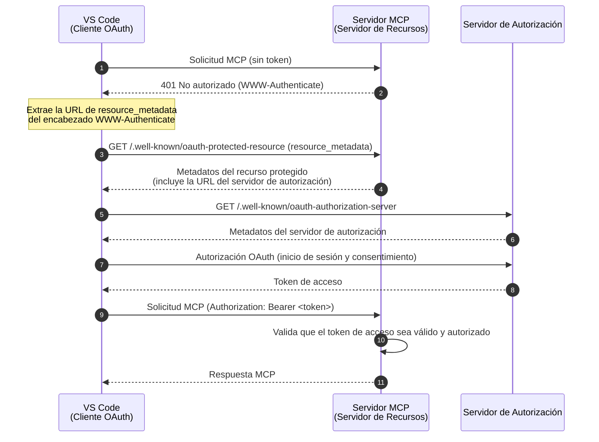
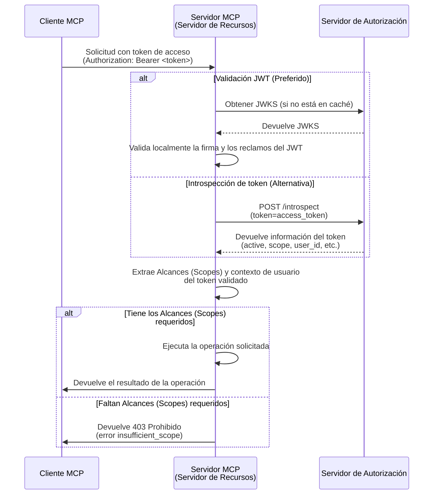

import { NpmLikeInstallation } from '@site/src/components/NpmLikeInstallation';
import TabItem from '@theme/TabItem';
import Tabs from '@theme/Tabs';

# Tutorial: Construye un gestor de tareas

:::tip SDK de Python disponible
¡MCP Auth también está disponible para Python! Consulta el [repositorio del SDK de Python](https://github.com/mcp-auth/python) para instalación y uso.
:::

En este tutorial, construiremos un servidor MCP gestor de tareas con Autenticación (Authentication) y Autorización (Authorization) de usuarios. Siguiendo la última especificación de MCP, nuestro servidor MCP actuará como un **Servidor de Recursos (Resource Server)** OAuth 2.0 que valida tokens de acceso y aplica permisos basados en Alcances (Scopes).

Al completar este tutorial, tendrás:

- ✅ Una comprensión básica de cómo configurar el control de acceso basado en roles (RBAC) en tu servidor MCP.
- ✅ Un servidor MCP que actúa como Servidor de Recursos, consumiendo tokens de acceso emitidos por un Servidor de Autorización (Authorization Server).
- ✅ Una implementación funcional de la aplicación de permisos basados en Alcances (Scopes) para operaciones de tareas.

## Visión general \{#overview}

El tutorial involucrará los siguientes componentes:

- **Cliente MCP (VS Code)**: Un editor de código con soporte MCP integrado que actúa como cliente OAuth 2.0/OIDC. Inicia el flujo de autorización con el servidor de autorización y obtiene tokens de acceso para autenticar solicitudes al servidor MCP.
- **Servidor de Autorización (Authorization Server)**: Un proveedor OAuth 2.1 o OpenID Connect que gestiona identidades de usuario, autentica usuarios y emite tokens de acceso con los Alcances (Scopes) apropiados a los clientes autorizados.
- **Servidor MCP (Servidor de Recursos)**: Según la última especificación MCP, el servidor MCP actúa como Servidor de Recursos en el marco OAuth 2.0. Valida tokens de acceso emitidos por el servidor de autorización y aplica permisos basados en Alcances (Scopes) para operaciones de tareas.

Esta arquitectura sigue el flujo estándar de OAuth 2.0 donde:

- **VS Code** solicita recursos protegidos en nombre del usuario
- El **Servidor de Autorización (Authorization Server)** autentica al usuario y emite tokens de acceso
- El **Servidor MCP** valida los tokens y sirve recursos protegidos según los permisos concedidos

Aquí tienes un diagrama de alto nivel de la interacción entre estos componentes:


```mermaid
sequenceDiagram
  autonumber
  participant Client as VS Code<br/>(Cliente OAuth)
  participant RS as Servidor MCP<br/>(Servidor de Recursos)
  participant AS as Servidor de Autorización

  Client->>RS: Solicitud MCP (sin token)
  RS-->>Client: 401 No autorizado (WWW-Authenticate)
  Note over Client: Extrae la URL de resource_metadata<br/>del encabezado WWW-Authenticate

  Client->>RS: GET /.well-known/oauth-protected-resource (resource_metadata)
  RS-->>Client: Metadatos del recurso protegido<br/>(incluye la URL del servidor de autorización)

  Client->>AS: GET /.well-known/oauth-authorization-server
  AS-->>Client: Metadatos del servidor de autorización
  Client->>AS: Autorización OAuth (inicio de sesión y consentimiento)
  AS-->>Client: Token de acceso

  Client->>RS: Solicitud MCP (Authorization: Bearer <token>)
  RS->>RS: Valida que el token de acceso sea válido y autorizado
  RS-->>Client: Respuesta MCP
```

## Comprende tu servidor de autorización \{#understand-your-authorization-server}

### Tokens de acceso con Alcances (Scopes) \{#access-tokens-with-scopes}

Para implementar el [control de acceso basado en roles (RBAC)](https://auth.wiki/rbac) en tu servidor MCP, tu servidor de autorización debe admitir la emisión de tokens de acceso con Alcances (Scopes). Los Alcances (Scopes) representan los Permisos (Permissions) que se han concedido a un usuario.

<Tabs groupId="provider">
<TabItem value="logto" label="Logto">

[Logto](https://logto.io) proporciona soporte RBAC a través de sus Recursos de API (API resources) (conforme a [RFC 8707: Indicadores de recurso para OAuth 2.0](https://datatracker.ietf.org/doc/html/rfc8707)) y funciones de Roles (Roles). Así es como se configura:

1. Inicia sesión en [Logto Console](https://cloud.logto.io) (o en tu instancia Logto autogestionada)

2. Crea un recurso de API y Alcances (Scopes):

   - Ve a "Recursos de API (API Resources)"
   - Crea un nuevo recurso de API llamado "Gestor de tareas"
   - Añade los siguientes Alcances (Scopes):
     - `create:todos`: "Crear nuevas tareas"
     - `read:todos`: "Leer todas las tareas"
     - `delete:todos`: "Eliminar cualquier tarea"

3. Crea Roles (Roles) (recomendado para una gestión más sencilla):

   - Ve a "Roles"
   - Crea un rol "Admin" y asigna todos los Alcances (Scopes) (`create:todos`, `read:todos`, `delete:todos`)
   - Crea un rol "User" y asigna solo el Alcance (Scope) `create:todos`

4. Asigna Permisos (Permissions):
   - Ve a "Usuarios (Users)"
   - Selecciona un usuario
   - Puedes:
     - Asignar Roles (Roles) en la pestaña "Roles" (recomendado)
     - O asignar Alcances (Scopes) directamente en la pestaña "Permisos (Permissions)"

Los Alcances (Scopes) se incluirán en el Reclamo (Claim) `scope` del token de acceso JWT como una cadena separada por espacios.

</TabItem>
<TabItem value="oauth-oidc" label="OAuth 2.0 / OIDC">

Los proveedores OAuth 2.0 / OIDC suelen admitir el control de acceso basado en Alcances (Scopes). Al implementar RBAC:

1. Define los Alcances (Scopes) requeridos en tu servidor de autorización
2. Configura tu cliente para solicitar estos Alcances (Scopes) durante el flujo de autorización
3. Asegúrate de que tu servidor de autorización incluya los Alcances (Scopes) concedidos en el token de acceso
4. Los Alcances (Scopes) suelen incluirse en el Reclamo (Claim) `scope` del token de acceso JWT

Consulta la documentación de tu proveedor para detalles específicos sobre:

- Cómo definir y gestionar Alcances (Scopes)
- Cómo se incluyen los Alcances (Scopes) en el token de acceso
- Cualquier característica adicional de RBAC como la gestión de Roles (Roles)

</TabItem>
</Tabs>

### Validación de tokens y comprobación de permisos \{#validating-tokens-and-checking-permissions}

Según la última especificación MCP, el servidor MCP actúa como **Servidor de Recursos (Resource Server)** en el marco OAuth 2.0. Como Servidor de Recursos, el servidor MCP tiene las siguientes responsabilidades:

1. **Validación de tokens**: Verificar la autenticidad e integridad de los tokens de acceso recibidos de los clientes MCP
2. **Aplicación de Alcances (Scope Enforcement)**: Extraer y validar los Alcances (Scopes) del token de acceso para determinar qué operaciones está autorizado a realizar el cliente
3. **Protección de recursos**: Solo servir recursos protegidos (ejecutar herramientas) cuando el cliente presente tokens válidos con permisos suficientes

Cuando tu servidor MCP recibe una solicitud, realiza el siguiente proceso de validación:

1. Extrae el token de acceso del encabezado `Authorization` (formato Bearer token)
2. Valida la firma y expiración del token de acceso
3. Extrae los Alcances (Scopes) e información del usuario del token validado
4. Comprueba si el token tiene los Alcances (Scopes) requeridos para la operación solicitada

Por ejemplo, si un usuario quiere crear una nueva tarea, su token de acceso debe incluir el Alcance (Scope) `create:todos`. Así es como funciona el flujo de validación en el Servidor de Recursos:


```mermaid
sequenceDiagram
    participant Client as Cliente MCP
    participant Server as Servidor MCP<br/>(Servidor de Recursos)
    participant Auth as Servidor de Autorización

    Client->>Server: Solicitud con token de acceso<br/>(Authorization: Bearer <token>)

    alt Validación JWT (Preferido)
        Server->>Auth: Obtener JWKS (si no está en caché)
        Auth-->>Server: Devuelve JWKS
        Server->>Server: Valida localmente la firma y los reclamos del JWT
    else Introspección de token (Alternativa)
        Server->>Auth: POST /introspect<br/>(token=access_token)
        Auth-->>Server: Devuelve información del token<br/>(active, scope, user_id, etc.)
    end

    Server->>Server: Extrae Alcances (Scopes) y contexto de usuario<br/>del token validado

    alt Tiene los Alcances (Scopes) requeridos
        Server->>Server: Ejecuta la operación solicitada
        Server->>Client: Devuelve el resultado de la operación
    else Faltan Alcances (Scopes) requeridos
        Server->>Client: Devuelve 403 Prohibido<br/>(error insufficient_scope)
    end
```

### Registro dinámico de clientes \{#dynamic-client-registration}

El registro dinámico de clientes no es necesario para este tutorial, pero puede ser útil si deseas automatizar el proceso de registro del cliente MCP con tu servidor de autorización. Consulta [¿Se requiere Dynamic Client Registration?](/provider-list#is-dcr-required) para más detalles.

## Comprende RBAC en el gestor de tareas \{#understand-rbac-in-todo-manager}

Para fines demostrativos, implementaremos un sistema simple de control de acceso basado en roles (RBAC) en nuestro servidor MCP gestor de tareas. Esto te mostrará los principios básicos de RBAC manteniendo la implementación sencilla.

:::note
Aunque este tutorial demuestra la gestión de Alcances (Scopes) basada en RBAC, es importante señalar que no todos los proveedores de autenticación implementan la gestión de Alcances (Scopes) a través de Roles (Roles). Algunos proveedores pueden tener implementaciones y mecanismos propios para gestionar el control de acceso y los Permisos (Permissions).
:::

### Herramientas y Alcances (Scopes) \{#tools-and-scopes}

Nuestro servidor MCP gestor de tareas proporciona tres herramientas principales:

- `create-todo`: Crear una nueva tarea
- `get-todos`: Listar todas las tareas
- `delete-todo`: Eliminar una tarea por ID

Para controlar el acceso a estas herramientas, definimos los siguientes Alcances (Scopes):

- `create:todos`: Permite crear nuevas tareas
- `delete:todos`: Permite eliminar tareas existentes
- `read:todos`: Permite consultar y recuperar la lista de todas las tareas

### Roles y Permisos (Permissions) \{#roles-and-permissions}

Definiremos dos Roles (Roles) con diferentes niveles de acceso:

| Rol   | create:todos | read:todos | delete:todos |
| ----- | ------------ | ---------- | ------------ |
| Admin | ✅           | ✅         | ✅           |
| User  | ✅           |            |              |

- **User**: Un usuario regular que puede crear tareas y ver o eliminar solo sus propias tareas
- **Admin**: Un administrador que puede crear, ver y eliminar todas las tareas, sin importar la propiedad

### Propiedad de recursos \{#resource-ownership}

Aunque la tabla de permisos anterior muestra los Alcances (Scopes) explícitos asignados a cada Rol (Role), hay un principio importante de propiedad de recursos a considerar:

- **Usuarios (Users)** no tienen los Alcances (Scopes) `read:todos` o `delete:todos`, pero aún pueden:
  - Leer sus propias tareas
  - Eliminar sus propias tareas
- **Admins** tienen todos los permisos (`read:todos` y `delete:todos`), lo que les permite:
  - Ver todas las tareas del sistema
  - Eliminar cualquier tarea, sin importar la propiedad

Esto demuestra un patrón común en los sistemas RBAC donde la propiedad de recursos otorga permisos implícitos a los usuarios para sus propios recursos, mientras que los roles administrativos reciben permisos explícitos para todos los recursos.

:::tip Aprende más
Para profundizar en los conceptos y mejores prácticas de RBAC, consulta [Dominando RBAC: Un ejemplo completo del mundo real](https://blog.logto.io/mastering-rbac).
:::

## Configura la autorización en tu proveedor \{#configure-authorization-in-your-provider}

Para implementar el sistema de control de acceso que describimos antes, deberás configurar tu servidor de autorización para admitir los Alcances (Scopes) requeridos. Así es como hacerlo con diferentes proveedores:

<Tabs groupId="provider">
<TabItem value="logto" label="Logto">

[Logto](https://logto.io) proporciona soporte RBAC a través de sus Recursos de API (API resources) y funciones de Roles (Roles). Así es como se configura:

1. Inicia sesión en [Logto Console](https://cloud.logto.io) (o en tu instancia Logto autogestionada)

2. Crea un recurso de API y Alcances (Scopes):

   - Ve a "Recursos de API (API Resources)"
   - Crea un nuevo recurso de API llamado "Gestor de tareas" y usa `http://localhost:3001/` como el indicador de recurso.
     - **Importante**: El indicador de recurso debe coincidir con la URL de tu servidor MCP. Para este tutorial, usamos `http://localhost:3001/` ya que nuestro servidor MCP se ejecuta en el puerto 3001. En producción, usa la URL real de tu servidor MCP (por ejemplo, `https://tu-servidor-mcp.ejemplo.com/`).
   - Crea los siguientes Alcances (Scopes):
     - `create:todos`: "Crear nuevas tareas"
     - `read:todos`: "Leer todas las tareas"
     - `delete:todos`: "Eliminar cualquier tarea"

3. Crea Roles (Roles) (recomendado para una gestión más sencilla):

   - Ve a "Roles"
   - Crea un rol "Admin" y asigna todos los Alcances (Scopes) (`create:todos`, `read:todos`, `delete:todos`)
   - Crea un rol "User" y asigna solo el Alcance (Scope) `create:todos`
   - En la página de detalles del rol "User", cambia a la pestaña "General" y establece el rol "User" como el "Rol predeterminado".

4. Gestiona roles y permisos de usuario:
   - Para nuevos usuarios:
     - Obtendrán automáticamente el rol "User" ya que lo establecimos como el rol predeterminado
   - Para usuarios existentes:
     - Ve a "Gestión de usuarios"
     - Selecciona un usuario
     - Asigna roles al usuario en la pestaña "Roles"

:::tip Gestión programática de roles
También puedes usar la [Management API](https://docs.logto.io/integrate-logto/interact-with-management-api) de Logto para gestionar roles de usuario de forma programática. Esto es especialmente útil para la gestión automatizada de usuarios o al construir paneles de administración.
:::

Al solicitar un token de acceso, Logto incluirá los Alcances (Scopes) en el Reclamo (Claim) `scope` del token según los permisos de rol del usuario.

</TabItem>
<TabItem value="oauth-or-oidc" label="OAuth 2 / OIDC">

Para proveedores OAuth 2.0 o OpenID Connect, deberás configurar los Alcances (Scopes) que representan diferentes Permisos (Permissions). Los pasos exactos dependerán de tu proveedor, pero generalmente:

1. Define Alcances (Scopes):

   - Configura tu servidor de autorización para admitir:
     - `create:todos`
     - `read:todos`
     - `delete:todos`

2. Configura el cliente:

   - Registra o actualiza tu cliente para solicitar estos Alcances (Scopes)
   - Asegúrate de que los Alcances (Scopes) estén incluidos en el token de acceso

3. Asigna Permisos (Permissions):
   - Usa la interfaz de tu proveedor para conceder los Alcances (Scopes) apropiados a los usuarios
   - Algunos proveedores pueden admitir la gestión basada en Roles (Roles), mientras que otros pueden usar asignaciones directas de Alcances (Scopes)
   - Consulta la documentación de tu proveedor para el enfoque recomendado

:::tip
La mayoría de los proveedores incluirán los Alcances (Scopes) concedidos en el Reclamo (Claim) `scope` del token de acceso. El formato suele ser una cadena de valores de Alcance (Scope) separados por espacios.
:::

</TabItem>
</Tabs>

:::note[Barra final en el indicador de recurso]
Incluye siempre una barra final (`/`) en el indicador de recurso. Debido a un error actual en el SDK oficial de MCP, los clientes que usan el SDK añadirán automáticamente una barra final a los identificadores de recurso al iniciar solicitudes de autenticación. Si tu indicador de recurso no incluye la barra final, la validación del recurso fallará para esos clientes. (VS Code no se ve afectado por este error.)
:::

Después de configurar tu servidor de autorización, los usuarios recibirán tokens de acceso que contienen sus Alcances (Scopes) concedidos. El servidor MCP usará estos Alcances (Scopes) para determinar:

- Si un usuario puede crear nuevas tareas (`create:todos`)
- Si un usuario puede ver todas las tareas (`read:todos`) o solo las suyas
- Si un usuario puede eliminar cualquier tarea (`delete:todos`) o solo las suyas

## Configura el servidor MCP \{#set-up-the-mcp-server}

Usaremos los [SDKs oficiales de MCP](https://github.com/modelcontextprotocol) para crear nuestro servidor MCP gestor de tareas.

### Crea un nuevo proyecto \{#create-a-new-project}

Configura un nuevo proyecto Node.js:

```bash
mkdir mcp-server
cd mcp-server
npm init -y # O usa `pnpm init`
npm pkg set type="module"
npm pkg set main="todo-manager.ts"
npm pkg set scripts.start="node --experimental-strip-types todo-manager.ts"
```

:::note
Usamos TypeScript en nuestros ejemplos ya que Node.js v22.6.0+ admite la ejecución nativa de TypeScript usando la bandera `--experimental-strip-types`. Si usas JavaScript, el código será similar; solo asegúrate de usar Node.js v22.6.0 o posterior. Consulta la documentación de Node.js para más detalles.
:::

### Instala el SDK de MCP y dependencias \{#install-the-mcp-sdk-and-dependencies}

```bash
npm install @modelcontextprotocol/sdk express zod
```

O cualquier otro gestor de paquetes que prefieras, como `pnpm` o `yarn`.

### Crea el servidor MCP \{#create-the-mcp-server}

Crea un archivo llamado `todo-manager.ts` y añade el siguiente código:

```ts
// todo-manager.ts

import { z } from 'zod';
import { McpServer } from '@modelcontextprotocol/sdk/server/mcp.js';
import { StreamableHTTPServerTransport } from '@modelcontextprotocol/sdk/server/streamableHttp.js';
import express, { type Request, type Response } from 'express';

// Crea un servidor MCP
const server = new McpServer({
  name: 'Todo Manager',
  version: '0.0.0',
});

server.registerTool(
  'create-todo',
  {
    description: 'Crear una nueva tarea',
    inputSchema: { content: z.string() },
  },
  async ({ content }) => {
    return {
      content: [{ type: 'text', text: JSON.stringify({ error: 'No implementado' }) }],
    };
  }
);

server.registerTool(
  'get-todos',
  {
    description: 'Listar todas las tareas',
    inputSchema: {},
  },
  async () => {
    return {
      content: [{ type: 'text', text: JSON.stringify({ error: 'No implementado' }) }],
    };
  }
);

server.registerTool(
  'delete-todo',
  {
    description: 'Eliminar una tarea por id',
    inputSchema: { id: z.string() },
  },
  async ({ id }) => {
    return {
      content: [{ type: 'text', text: JSON.stringify({ error: 'No implementado' }) }],
    };
  }
);

// A continuación el código base de la documentación del SDK de MCP
const PORT = 3001;
const app = express();

app.post('/', async (request: Request, response: Response) => {
  // En modo sin estado, crea una nueva instancia de transporte y servidor para cada solicitud
  // para asegurar el aislamiento completo. Una sola instancia causaría colisiones de ID de solicitud
  // cuando varios clientes se conectan simultáneamente.

  try {
    const transport: StreamableHTTPServerTransport = new StreamableHTTPServerTransport({
      sessionIdGenerator: undefined,
    });
    response.on('close', async () => {
      console.log('Solicitud cerrada');
      await transport.close();
      await server.close();
    });
    await server.connect(transport);
    await transport.handleRequest(request, response, request.body);
  } catch (error) {
    console.error('Error al manejar la solicitud MCP:', error);
    if (!response.headersSent) {
      response.status(500).json({
        jsonrpc: '2.0',
        error: {
          code: -32_603,
          message: 'Error interno del servidor',
        },
        id: null,
      });
    }
  }
});

// Notificaciones SSE no soportadas en modo sin estado
app.get('/', async (request: Request, response: Response) => {
  console.log('Solicitud GET MCP recibida');
  response.writeHead(405).end(
    JSON.stringify({
      jsonrpc: '2.0',
      error: {
        code: -32_000,
        message: 'Método no permitido.',
      },
      id: null,
    })
  );
});

// Terminación de sesión no necesaria en modo sin estado
app.delete('/', async (request: Request, response: Response) => {
  console.log('Solicitud DELETE MCP recibida');
  response.writeHead(405).end(
    JSON.stringify({
      jsonrpc: '2.0',
      error: {
        code: -32_000,
        message: 'Método no permitido.',
      },
      id: null,
    })
  );
});

app.listen(PORT);
```

Ejecuta el servidor con:

```bash
npm start
```

## Integra con tu servidor de autorización \{#integrate-with-your-authorization-server}

Para completar esta sección, hay varias consideraciones a tener en cuenta:

<details>
<summary>**La URL del emisor (Issuer) de tu servidor de autorización**</summary>

Normalmente es la URL base de tu servidor de autorización, como `https://auth.example.com`. Algunos proveedores pueden tener una ruta como `https://example.logto.app/oidc`, así que asegúrate de consultar la documentación de tu proveedor.

</details>

<details>
<summary>**Cómo obtener los metadatos del servidor de autorización**</summary>

- Si tu servidor de autorización cumple con [OAuth 2.0 Authorization Server Metadata](https://datatracker.ietf.org/doc/html/rfc8414) o [OpenID Connect Discovery](https://openid.net/specs/openid-connect-discovery-1_0.html), puedes usar las utilidades integradas de MCP Auth para obtener los metadatos automáticamente.
- Si tu servidor de autorización no cumple con estos estándares, deberás especificar manualmente la URL de metadatos o los endpoints en la configuración del servidor MCP. Consulta la documentación de tu proveedor para los endpoints específicos.

</details>

<details>
<summary>**Cómo registrar el cliente MCP en tu servidor de autorización**</summary>

- Si tu servidor de autorización admite [Dynamic Client Registration](https://datatracker.ietf.org/doc/html/rfc7591), puedes omitir este paso ya que el cliente MCP se registrará automáticamente.
- Si tu servidor de autorización no admite Dynamic Client Registration, deberás registrar manualmente el cliente MCP en tu servidor de autorización.

</details>

<details>
<summary>**Comprende los parámetros de solicitud de token**</summary>

Al solicitar tokens de acceso de diferentes servidores de autorización, encontrarás varios enfoques para especificar el recurso objetivo y los permisos. Aquí los principales patrones:

- **Basado en indicador de recurso**:

  - Usa el parámetro `resource` para especificar la API objetivo (ver [RFC 8707: Indicadores de recurso para OAuth 2.0](https://datatracker.ietf.org/doc/html/rfc8707))
  - Común en implementaciones modernas de OAuth 2.0
  - Ejemplo de solicitud:
    ```json
    {
      "resource": "http://localhost:3001/",
      "scope": "create:todos read:todos"
    }
    ```
  - El servidor emite tokens vinculados específicamente al recurso solicitado

- **Basado en audiencia**:

  - Usa el parámetro `audience` para especificar el destinatario previsto del token
  - Similar a los indicadores de recurso pero con diferentes semánticas
  - Ejemplo de solicitud:
    ```json
    {
      "audience": "todo-api",
      "scope": "create:todos read:todos"
    }
    ```

- **Basado solo en Alcances (Scopes)**:
  - Se basa únicamente en Alcances (Scopes) sin parámetros de recurso/audiencia
  - Enfoque tradicional de OAuth 2.0
  - Ejemplo de solicitud:
    ```json
    {
      "scope": "todo-api:create todo-api:read openid profile"
    }
    ```
  - A menudo usa Alcances (Scopes) con prefijo para namespacing de permisos
  - Común en implementaciones más simples de OAuth 2.0

:::tip Mejores prácticas

- Consulta la documentación de tu proveedor para los parámetros soportados
- Algunos proveedores admiten varios enfoques simultáneamente
- Los indicadores de recurso proporcionan mejor seguridad mediante restricción de audiencia
- Considera usar indicadores de recurso cuando estén disponibles para un mejor control de acceso
  :::

</details>

Aunque cada proveedor puede tener requisitos específicos, los siguientes pasos te guiarán en el proceso de integración de VS Code y el servidor MCP con configuraciones específicas del proveedor.

### Registra el cliente MCP como una app de terceros \{#register-mcp-client-as-a-third-party-app}

<Tabs groupId="provider">
<TabItem value="logto" label="Logto">

Integrar el gestor de tareas con [Logto](https://logto.io) es sencillo ya que es un proveedor OpenID Connect que admite indicadores de recurso y Alcances (Scopes), permitiéndote asegurar tu API de tareas con `http://localhost:3001/` como indicador de recurso.

Como Logto aún no admite Dynamic Client Registration, deberás registrar manualmente tu cliente MCP (VS Code) como una app de terceros en tu tenant de Logto:

1. Inicia sesión en [Logto Console](https://cloud.logto.io) (o en tu instancia Logto autogestionada).
2. Navega a **Aplicaciones > Apps de terceros** y haz clic en "Crear aplicación".
3. Selecciona **App nativa** como tipo de aplicación.
4. Rellena los detalles de la aplicación:
   - **Nombre de la aplicación**: Ingresa un nombre, por ejemplo, "MCP Client".
   - **Descripción**: Ingresa una descripción, por ejemplo, "Cliente MCP para VS Code".
5. Establece las siguientes **URIs de redirección** para VS Code:
   ```
   http://127.0.0.1
   https://vscode.dev/redirect
   ```
6. Haz clic en "Guardar cambios".
7. Ve a la pestaña **Permisos (Permissions)** de la app, en la sección **Usuario (User)**, añade los permisos `create:todos`, `read:todos` y `delete:todos` del recurso de API **Todo Manager** que creaste antes.
8. En la tarjeta superior, verás el valor "App ID". Cópialo para usarlo más adelante.

</TabItem>
<TabItem value="oauth-oidc" label="OAuth 2.0 / OIDC">

:::note
Esta es una guía genérica de integración con proveedores OAuth 2.0 / OpenID Connect. Ambos siguen pasos similares ya que OIDC se basa en OAuth 2.0. Consulta la documentación de tu proveedor para detalles específicos.
:::

Si tu proveedor admite Dynamic Client Registration, puedes omitir el registro manual; de lo contrario, deberás registrar manualmente el cliente MCP:

1. Inicia sesión en la consola de tu proveedor.

2. Navega a la sección "Aplicaciones" o "Clientes", luego crea una nueva aplicación o cliente.

3. Si tu proveedor requiere un tipo de cliente, selecciona "App nativa" o "Cliente público".

4. Después de crear la aplicación, configura las URIs de redirección. Para VS Code, añade lo siguiente:

   ```
   http://127.0.0.1
   https://vscode.dev/redirect
   ```

5. Configura los Alcances (Scopes)/Permisos (Permissions) requeridos para la aplicación:

   ```text
   create:todos read:todos delete:todos
   ```

6. Busca el "Client ID" o "Application ID" de la aplicación recién creada y cópialo para usarlo más adelante.

</TabItem>
</Tabs>

### Configura MCP Auth \{#set-up-mcp-auth}

Primero, instala el SDK de MCP Auth en tu proyecto de servidor MCP.

<NpmLikeInstallation packageName="mcp-auth" />

Ahora necesitamos inicializar MCP Auth en tu servidor MCP. Con el modo de recurso protegido, debes configurar tus metadatos de recurso incluyendo los servidores de autorización.

Hay dos formas de configurar los servidores de autorización:

- **Pre-obtenido (Recomendado)**: Usa `fetchServerConfig()` para obtener los metadatos antes de inicializar MCPAuth. Esto asegura que la configuración se valide al iniciar.
- **Descubrimiento bajo demanda**: Solo proporciona `issuer` y `type` - los metadatos se obtendrán bajo demanda la primera vez que se necesiten. Esto es útil para entornos edge (como Cloudflare Workers) donde no se permite fetch asíncrono a nivel superior.

#### Configura los metadatos del recurso protegido \{#configure-protected-resource-metadata}

Primero, obtén la URL del emisor (Issuer) de tu servidor de autorización:

<Tabs groupId="provider">

<TabItem value="logto" label="Logto">

En Logto, puedes encontrar la URL del emisor en la página de detalles de tu aplicación dentro de Logto Console, en la sección "Endpoints & Credentials / Issuer endpoint". Debería verse como `https://my-project.logto.app/oidc`.

</TabItem>

<TabItem value="oauth-oidc" label="OAuth 2.0 / OIDC">

Para proveedores OAuth 2.0, deberás:

1. Consultar la documentación de tu proveedor para la URL del servidor de autorización (a menudo llamada issuer URL o base URL)
2. Algunos proveedores la exponen en `https://{tu-dominio}/.well-known/oauth-authorization-server`
3. Busca en la consola de administración de tu proveedor bajo la configuración OAuth/API

</TabItem>

</Tabs>

Ahora, configura los metadatos del recurso protegido al construir la instancia de MCP Auth:

```js
// todo-manager.ts

import { MCPAuth, fetchServerConfig } from 'mcp-auth';

const issuerUrl = '<issuer-url>'; // Reemplaza con la URL del emisor de tu servidor de autorización

// Define el identificador de recurso para este servidor MCP
const resourceId = 'http://localhost:3001/';

// Pre-obtén la configuración del servidor de autorización (recomendado)
const authServerConfig = await fetchServerConfig(issuerUrl, { type: 'oidc' });

// Configura MCP Auth con los metadatos del recurso protegido
const mcpAuth = new MCPAuth({
  protectedResources: {
    metadata: {
      resource: resourceId,
      authorizationServers: [authServerConfig],
      // Alcances (Scopes) que este servidor MCP entiende
      scopesSupported: ['create:todos', 'read:todos', 'delete:todos'],
    },
  },
});
```

### Actualiza el servidor MCP \{#update-mcp-server}

¡Ya casi terminamos! Es momento de actualizar el servidor MCP para aplicar la ruta y función middleware de MCP Auth, luego implementar el control de acceso basado en permisos para las herramientas del gestor de tareas según los Alcances (Scopes) del usuario.

Ahora, aplica las rutas de metadatos de recurso protegido para que los clientes MCP puedan obtener los metadatos esperados del recurso desde el servidor MCP.

```ts
// todo-manager.ts

// Configura las rutas de metadatos de recurso protegido
// Esto expone metadatos sobre este servidor de recursos para clientes OAuth
app.use(mcpAuth.protectedResourceMetadataRouter());
```

A continuación, aplicaremos el middleware de MCP Auth al servidor MCP. Este middleware manejará la Autenticación (Authentication) y Autorización (Authorization) para las solicitudes entrantes, asegurando que solo los usuarios autorizados puedan acceder a las herramientas del gestor de tareas.

```ts
// todo-manager.ts

app.use(mcpAuth.protectedResourceMetadataRouter());

// Aplica el middleware de MCP Auth
app.use(
  mcpAuth.bearerAuth('jwt', {
    resource: resourceId,
    audience: resourceId,
  })
);
```

En este punto, podemos actualizar las herramientas del gestor de tareas para aprovechar el middleware de MCP Auth para Autenticación (Authentication) y Autorización (Authorization).

Actualicemos la implementación de las herramientas.

```js
// todo-manager.ts

// otros imports...
import assert from 'node:assert';
import { fetchServerConfig, MCPAuth, MCPAuthBearerAuthError } from 'mcp-auth';
import { type AuthInfo } from '@modelcontextprotocol/sdk/server/auth/types.js';

// Se mencionará en la siguiente sección
import { TodoService } from './todo-service.js';

const assertUserId = (authInfo?: AuthInfo) => {
  const { subject } = authInfo ?? {};
  assert(subject, 'Información de autenticación inválida');
  return subject;
};

const hasRequiredScopes = (userScopes: string[], requiredScopes: string[]): boolean => {
  return requiredScopes.every((scope) => userScopes.includes(scope));
};

const todoService = new TodoService();

server.registerTool(
  'create-todo',
  {
    description: 'Crear una nueva tarea',
    inputSchema: { content: z.string() },
  },
  ({ content }, { authInfo }) => {
    const userId = assertUserId(authInfo);

    /**
     * Solo los usuarios con el Alcance (Scope) 'create:todos' pueden crear tareas
     */
    if (!hasRequiredScopes(authInfo?.scopes ?? [], ['create:todos'])) {
      throw new MCPAuthBearerAuthError('missing_required_scopes');
    }

    const createdTodo = todoService.createTodo({ content, ownerId: userId });

    return {
      content: [{ type: 'text', text: JSON.stringify(createdTodo) }],
    };
  }
);

server.registerTool(
  'get-todos',
  {
    description: 'Listar todas las tareas',
    inputSchema: {},
  },
  (_params, { authInfo }) => {
    const userId = assertUserId(authInfo);

    /**
     * Si el usuario tiene el Alcance (Scope) 'read:todos', puede acceder a todas las tareas (todoOwnerId = undefined)
     * Si el usuario no tiene el Alcance (Scope) 'read:todos', solo puede acceder a sus propias tareas (todoOwnerId = userId)
     */
    const todoOwnerId = hasRequiredScopes(authInfo?.scopes ?? [], ['read:todos'])
      ? undefined
      : userId;

    const todos = todoService.getAllTodos(todoOwnerId);

    return {
      content: [{ type: 'text', text: JSON.stringify(todos) }],
    };
  }
);

server.registerTool(
  'delete-todo',
  {
    description: 'Eliminar una tarea por id',
    inputSchema: { id: z.string() },
  },
  ({ id }, { authInfo }) => {
    const userId = assertUserId(authInfo);

    const todo = todoService.getTodoById(id);

    if (!todo) {
      return {
        content: [{ type: 'text', text: JSON.stringify({ error: 'No se pudo eliminar la tarea' }) }],
      };
    }

    /**
     * Los usuarios solo pueden eliminar sus propias tareas
     * Los usuarios con el Alcance (Scope) 'delete:todos' pueden eliminar cualquier tarea
     */
    if (todo.ownerId !== userId && !hasRequiredScopes(authInfo?.scopes ?? [], ['delete:todos'])) {
      return {
        content: [
          {
            type: 'text',
            text: JSON.stringify({ error: 'No se pudo eliminar la tarea' }),
          },
        ],
      };
    }

    const deletedTodo = todoService.deleteTodo(id);

    return {
      content: [
        {
          type: 'text',
          text: JSON.stringify({
            message: `Tarea ${id} eliminada`,
            details: deletedTodo,
          }),
        },
      ],
    };
  }
);
```

Ahora, crea el "Servicio de tareas" usado en el código anterior para implementar la funcionalidad relacionada:

Crea el archivo `todo-service.ts` para el servicio de tareas:

```ts
// todo-service.ts

type Todo = {
  id: string;
  content: string;
  ownerId: string;
  createdAt: string;
};

/**
 * Un servicio de tareas simple para fines demostrativos.
 * Usa un array en memoria para almacenar tareas
 */
export class TodoService {
  private readonly todos: Todo[] = [];

  getAllTodos(ownerId?: string): Todo[] {
    if (ownerId) {
      return this.todos.filter((todo) => todo.ownerId === ownerId);
    }
    return this.todos;
  }

  getTodoById(id: string): Todo | undefined {
    return this.todos.find((todo) => todo.id === id);
  }

  createTodo({ content, ownerId }: { content: string; ownerId: string }): Todo {
    const todo: Todo = {
      id: this.genId(),
      content,
      ownerId,
      createdAt: new Date().toISOString(),
    };

    // eslint-disable-next-line @silverhand/fp/no-mutating-methods
    this.todos.push(todo);
    return todo;
  }

  deleteTodo(id: string): Todo | undefined {
    const index = this.todos.findIndex((todo) => todo.id === id);

    if (index === -1) {
      return undefined;
    }

    // eslint-disable-next-line @silverhand/fp/no-mutating-methods
    const [deleted] = this.todos.splice(index, 1);
    return deleted;
  }

  private genId(): string {
    return Math.random().toString(36).slice(2, 10);
  }
}
```

¡Felicidades! ¡Hemos implementado con éxito un servidor MCP completo con Autenticación (Authentication) y Autorización (Authorization)!

:::info
Consulta el [repositorio del SDK de MCP Auth para Node.js](https://github.com/mcp-auth/js/blob/master/packages/sample-servers/src) para ver el código completo del servidor MCP (versión OIDC).
:::

## Punto de control: Ejecuta las herramientas `todo-manager` \{#checkpoint-run-the-todo-manager-tools}

Reinicia tu servidor MCP y conecta VS Code a él. Así es como puedes conectarte con autenticación:

1. En VS Code, presiona `Command + Shift + P` (macOS) o `Ctrl + Shift + P` (Windows/Linux) para abrir la paleta de comandos.
2. Escribe `MCP: Add Server...` y selecciónalo.
3. Elige `HTTP` como tipo de servidor.
4. Ingresa la URL del servidor MCP: `http://localhost:3001`
5. Después de que se inicie una solicitud OAuth, VS Code te pedirá que ingreses el **App ID**. Ingresa el App ID que copiaste de tu servidor de autorización.
6. Como no tenemos un **App Secret** (es un cliente público), simplemente presiona Enter para omitir.
7. Completa el flujo de inicio de sesión en tu navegador.

Una vez que inicies sesión y regreses a VS Code, repite las acciones que hicimos en el punto de control anterior para ejecutar las herramientas del gestor de tareas. Esta vez, puedes usar estas herramientas con tu identidad de usuario autenticada. El comportamiento de las herramientas dependerá de los Roles (Roles) y Permisos (Permissions) asignados a tu usuario:

- Si has iniciado sesión como **User** (con solo el Alcance (Scope) `create:todos`):

  - Puedes crear nuevas tareas usando la herramienta `create-todo`
  - Solo puedes ver y eliminar tus propias tareas
  - No podrás ver ni eliminar tareas de otros usuarios

- Si has iniciado sesión como **Admin** (con todos los Alcances (Scopes): `create:todos`, `read:todos`, `delete:todos`):
  - Puedes crear nuevas tareas
  - Puedes ver todas las tareas del sistema usando la herramienta `get-todos`
  - Puedes eliminar cualquier tarea usando la herramienta `delete-todo`, sin importar quién la creó

Puedes probar estos diferentes niveles de permisos:

1. Desconectándote del servidor MCP (elimina la configuración del servidor en VS Code)
2. Iniciando sesión con una cuenta de usuario diferente que tenga diferentes Roles (Roles)/Permisos (Permissions)
3. Probando las mismas herramientas nuevamente para observar cómo cambia el comportamiento según los permisos del usuario

Esto demuestra cómo funciona el control de acceso basado en roles (RBAC) en la práctica, donde diferentes usuarios tienen diferentes niveles de acceso a la funcionalidad del sistema.

:::info
Consulta el [repositorio del SDK de MCP Auth para Node.js](https://github.com/mcp-auth/js/blob/master/packages/sample-servers/src) para ver el código completo del servidor MCP (versión OIDC).
:::

## Notas finales \{#closing-notes}

¡Felicidades! Has completado con éxito el tutorial. Recapitulemos lo que hemos hecho:

- Configuración de un servidor MCP básico con herramientas de gestión de tareas (`create-todo`, `get-todos`, `delete-todo`)
- Implementación de control de acceso basado en roles (RBAC) con diferentes niveles de permisos para usuarios y administradores
- Integración del servidor MCP con un servidor de autorización usando MCP Auth
- Configuración de VS Code para autenticar usuarios y usar tokens de acceso con Alcances (Scopes) para llamar a herramientas

Asegúrate de consultar otros tutoriales y documentación para aprovechar al máximo MCP Auth.