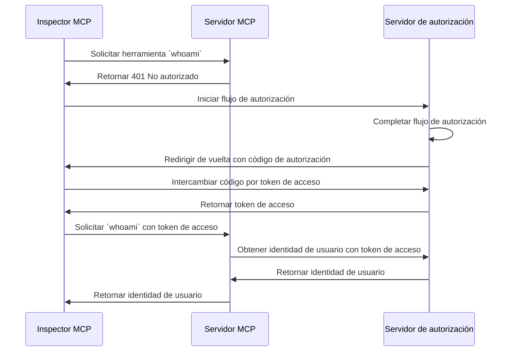

import TabItem from '@theme/TabItem';
import Tabs from '@theme/Tabs';

import SetupOauth from './_setup-oauth.mdx';
import SetupOidc from './_setup-oidc.mdx';

# Tutorial: ¿Quién soy yo? (Who am I?)

Este tutorial te guiará a través del proceso de configuración de MCP Auth para autenticar usuarios y recuperar su información de identidad desde el servidor de autorización.

Después de completar este tutorial, tendrás:

- ✅ Una comprensión básica de cómo usar MCP Auth para autenticar usuarios.
- ✅ Un servidor MCP que ofrece una herramienta para recuperar información de identidad del usuario.

## Descripción general \{#overview}

El tutorial involucrará los siguientes componentes:

- **Servidor MCP**: Un servidor MCP sencillo que utiliza los SDKs oficiales de MCP para manejar solicitudes.
- **Inspector MCP**: Una herramienta visual de pruebas para servidores MCP. También actúa como un cliente OAuth / OIDC para iniciar el flujo de autorización y recuperar tokens de acceso.
- **Servidor de autorización (Authorization server)**: Un proveedor OAuth 2.1 u OpenID Connect que gestiona identidades de usuario y emite tokens de acceso.

Aquí tienes un diagrama de alto nivel de la interacción entre estos componentes:



## Comprende tu servidor de autorización \{#understand-your-authorization-server}

### Recuperar información de identidad del usuario \{#retrieving-user-identity-information}

Para completar este tutorial, tu servidor de autorización debe ofrecer una API para recuperar información de identidad del usuario:

<Tabs groupId="provider">
<TabItem value="logto" label="Logto">

[Logto](https://logto.io) es un proveedor OpenID Connect que admite el [endpoint userinfo](https://openid.net/specs/openid-connect-core-1_0.html#UserInfo) estándar para recuperar información de identidad del usuario.

Para obtener un token de acceso que pueda usarse para acceder al endpoint userinfo, se requieren al menos dos alcances (scopes): `openid` y `profile`. Puedes seguir leyendo, ya que cubriremos la configuración de alcances más adelante.

</TabItem>
<TabItem value="keycloak" label="Keycloak">

[Keycloak](https://www.keycloak.org) es una solución de gestión de identidad y acceso de código abierto que admite múltiples protocolos, incluido OpenID Connect (OIDC). Como proveedor OIDC, implementa el [endpoint userinfo](https://openid.net/specs/openid-connect-core-1_0.html#UserInfo) estándar para recuperar información de identidad del usuario.

Para obtener un token de acceso que pueda usarse para acceder al endpoint userinfo, se requieren al menos dos alcances: `openid` y `profile`. Puedes seguir leyendo, ya que cubriremos la configuración de alcances más adelante.

</TabItem>

<TabItem value="asgardeo" label="Asgardeo">

[Asgardeo](https://wso2.com/asgardeo) es una plataforma de identidad como servicio (IDaaS) nativa en la nube que admite OAuth 2.0 y OpenID Connect (OIDC), proporcionando una gestión robusta de identidad y acceso para aplicaciones modernas.

La información del usuario se codifica dentro del token de ID devuelto junto con el token de acceso. Pero como proveedor OIDC, Asgardeo expone un [endpoint UserInfo](https://wso2.com/asgardeo/docs/guides/authentication/oidc/request-user-info/) que permite a las aplicaciones recuperar reclamos sobre el usuario autenticado en el payload.

También puedes descubrir este endpoint dinámicamente a través del [endpoint de descubrimiento OIDC](https://wso2.com/asgardeo/docs/guides/authentication/oidc/discover-oidc-configs) o navegando a la pestaña 'Info' de la aplicación en la Consola de Asgardeo.

Para obtener un token de acceso que pueda usarse para acceder al endpoint userinfo, se requieren al menos dos alcances: `openid` y `profile`.
</TabItem>
<TabItem value="oidc" label="OIDC">

La mayoría de los proveedores OpenID Connect admiten el [endpoint userinfo](https://openid.net/specs/openid-connect-core-1_0.html#UserInfo) para recuperar información de identidad del usuario.

Consulta la documentación de tu proveedor para ver si admite este endpoint. Si tu proveedor admite [OpenID Connect Discovery](https://openid.net/specs/openid-connect-discovery-1_0.html), también puedes comprobar si el `userinfo_endpoint` está incluido en el documento de descubrimiento (respuesta del endpoint `.well-known/openid-configuration`).

Para obtener un token de acceso que pueda usarse para acceder al endpoint userinfo, se requieren al menos dos alcances: `openid` y `profile`. Consulta la documentación de tu proveedor para ver el mapeo de alcances a reclamos de identidad de usuario.

</TabItem>
<TabItem value="oauth" label="OAuth 2">

Aunque OAuth 2.0 no define una forma estándar de recuperar información de identidad del usuario, muchos proveedores implementan sus propios endpoints para hacerlo. Consulta la documentación de tu proveedor para ver cómo recuperar información de identidad del usuario usando un token de acceso y qué parámetros se requieren para obtener dicho token de acceso al invocar el flujo de autorización.

</TabItem>
</Tabs>

### Registro dinámico de clientes (Dynamic Client Registration) \{#dynamic-client-registration}

El registro dinámico de clientes no es necesario para este tutorial, pero puede ser útil si deseas automatizar el proceso de registro del cliente MCP con tu servidor de autorización. Consulta [¿Se requiere Dynamic Client Registration?](../../provider-list.mdx#is-dcr-required) para más detalles.

## Configura el servidor MCP \{#set-up-the-mcp-server}

Usaremos los [SDKs oficiales de MCP](https://github.com/modelcontextprotocol) para crear un servidor MCP con una herramienta `whoami` que recupera información de identidad del usuario desde el servidor de autorización.

### Crea un nuevo proyecto \{#create-a-new-project}

<Tabs groupId="sdk">
<TabItem value="python" label="Python">

```bash
mkdir mcp-server
cd mcp-server
uv init # O usa `pipenv` o `poetry` para crear un nuevo entorno virtual
```

</TabItem>
<TabItem value="node" label="Node.js">

Configura un nuevo proyecto Node.js:

```bash
mkdir mcp-server
cd mcp-server
npm init -y # O usa `pnpm init`
npm pkg set type="module"
npm pkg set main="whoami.js"
npm pkg set scripts.start="node whoami.js"
```

</TabItem>
</Tabs>

### Instala el SDK de MCP y dependencias \{#install-the-mcp-sdk-and-dependencies}

<Tabs groupId="sdk">
<TabItem value="python" label="Python">

```bash
pip install "mcp[cli]" starlette uvicorn
```

O cualquier otro gestor de paquetes que prefieras, como `uv` o `poetry`.

</TabItem>
<TabItem value="node" label="Node.js">

```bash
npm install @modelcontextprotocol/sdk express
```

O cualquier otro gestor de paquetes que prefieras, como `pnpm` o `yarn`.

</TabItem>
</Tabs>

### Crea el servidor MCP \{#create-the-mcp-server}

Primero, vamos a crear un servidor MCP que implemente una herramienta `whoami`.

<Tabs groupId="sdk">
<TabItem value="python" label="Python">

Crea un archivo llamado `whoami.py` y añade el siguiente código:

```python
from mcp.server.fastmcp import FastMCP
from starlette.applications import Starlette
from starlette.routing import Mount
from typing import Any

mcp = FastMCP("WhoAmI")

@mcp.tool()
def whoami() -> dict[str, Any]:
    """Una herramienta que retorna la información del usuario actual."""
    return {"error": "Not authenticated"}

app = Starlette(
    routes=[Mount('/', app=mcp.sse_app())]
)
```

Ejecuta el servidor con:

```bash
uvicorn whoami:app --host 0.0.0.0 --port 3001
```

</TabItem>
<TabItem value="node" label="Node.js">

:::note
Dado que la implementación actual del inspector MCP no maneja flujos de autorización, usaremos el enfoque SSE para configurar el servidor MCP. Actualizaremos el código aquí una vez que el inspector MCP admita flujos de autorización.
:::

También puedes usar `pnpm` o `yarn` si lo prefieres.

Crea un archivo llamado `whoami.js` y añade el siguiente código:

```js
import { McpServer } from '@modelcontextprotocol/sdk/server/mcp.js';
import { SSEServerTransport } from '@modelcontextprotocol/sdk/server/sse.js';
import express from 'express';

// Crear un servidor MCP
const server = new McpServer({
  name: 'WhoAmI',
  version: '0.0.0',
});

// Añadir una herramienta al servidor que retorna la información del usuario actual
server.tool('whoami', async () => {
  return {
    content: [{ type: 'text', text: JSON.stringify({ error: 'Not authenticated' }) }],
  };
});

// A continuación el código boilerplate de la documentación del SDK de MCP
const PORT = 3001;
const app = express();

const transports = {};

app.get('/sse', async (_req, res) => {
  const transport = new SSEServerTransport('/messages', res);
  transports[transport.sessionId] = transport;

  res.on('close', () => {
    delete transports[transport.sessionId];
  });

  await server.connect(transport);
});

app.post('/messages', async (req, res) => {
  const sessionId = String(req.query.sessionId);
  const transport = transports[sessionId];
  if (transport) {
    await transport.handlePostMessage(req, res, req.body);
  } else {
    res.status(400).send('No transport found for sessionId');
  }
});

app.listen(PORT);
```

Ejecuta el servidor con:

```bash
npm start
```

</TabItem>
</Tabs>

## Inspecciona el servidor MCP \{#inspect-the-mcp-server}

### Clona y ejecuta el inspector MCP \{#clone-and-run-mcp-inspector}

Ahora que tenemos el servidor MCP en funcionamiento, podemos usar el inspector MCP para ver si la herramienta `whoami` está disponible.

Debido a la limitación de la implementación actual, hemos bifurcado el [inspector MCP](https://github.com/mcp-auth/inspector) para hacerlo más flexible y escalable para autenticación y autorización. También hemos enviado un pull request al repositorio original para incluir nuestros cambios.

Para ejecutar el inspector MCP, puedes usar el siguiente comando (se requiere Node.js):

```bash
git clone https://github.com/mcp-auth/inspector.git
cd inspector
npm install
npm run dev
```

Luego, abre tu navegador y navega a `http://localhost:6274/` (u otra URL mostrada en la terminal) para acceder al inspector MCP.

### Conecta el inspector MCP al servidor MCP \{#connect-mcp-inspector-to-the-mcp-server}

Antes de continuar, verifica la siguiente configuración en el inspector MCP:

- **Tipo de transporte (Transport Type)**: Establece en `SSE`.
- **URL**: Establece la URL de tu servidor MCP. En nuestro caso, debe ser `http://localhost:3001/sse`.

Ahora puedes hacer clic en el botón "Connect" para ver si el inspector MCP puede conectarse al servidor MCP. Si todo está bien, deberías ver el estado "Connected" en el inspector MCP.

### Punto de control: Ejecuta la herramienta `whoami` \{#checkpoint-run-the-whoami-tool}

1. En el menú superior del inspector MCP, haz clic en la pestaña "Tools".
2. Haz clic en el botón "List Tools".
3. Deberías ver la herramienta `whoami` listada en la página. Haz clic en ella para abrir los detalles de la herramienta.
4. Deberías ver el botón "Run Tool" en el lado derecho. Haz clic en él para ejecutar la herramienta.
5. Deberías ver el resultado de la herramienta con la respuesta JSON `{"error": "Not authenticated"}`.


## Integra con tu servidor de autorización \{#integrate-with-your-authorization-server}

Para completar esta sección, hay varias consideraciones a tener en cuenta:

<details>
<summary>**La URL del emisor (issuer) de tu servidor de autorización**</summary>

Normalmente es la URL base de tu servidor de autorización, como `https://auth.example.com`. Algunos proveedores pueden tener una ruta como `https://example.logto.app/oidc`, así que asegúrate de consultar la documentación de tu proveedor.

</details>

<details>
<summary>**Cómo recuperar los metadatos del servidor de autorización**</summary>

- Si tu servidor de autorización cumple con [OAuth 2.0 Authorization Server Metadata](https://datatracker.ietf.org/doc/html/rfc8414) o [OpenID Connect Discovery](https://openid.net/specs/openid-connect-discovery-1_0.html), puedes usar las utilidades integradas de MCP Auth para obtener los metadatos automáticamente.
- Si tu servidor de autorización no cumple con estos estándares, deberás especificar manualmente la URL de metadatos o los endpoints en la configuración del servidor MCP. Consulta la documentación de tu proveedor para los endpoints específicos.

</details>

<details>
<summary>**Cómo registrar el inspector MCP como cliente en tu servidor de autorización**</summary>

- Si tu servidor de autorización admite [Dynamic Client Registration](https://datatracker.ietf.org/doc/html/rfc7591), puedes omitir este paso ya que el inspector MCP se registrará automáticamente como cliente.
- Si tu servidor de autorización no admite Dynamic Client Registration, deberás registrar manualmente el inspector MCP como cliente en tu servidor de autorización.

</details>

<details>
<summary>**Cómo recuperar información de identidad del usuario y cómo configurar los parámetros de la solicitud de autorización**</summary>

- Para proveedores OpenID Connect: normalmente necesitas solicitar al menos los alcances `openid` y `profile` al iniciar el flujo de autorización. Esto asegurará que el token de acceso devuelto por el servidor de autorización contenga los alcances necesarios para acceder al [endpoint userinfo](https://openid.net/specs/openid-connect-core-1_0.html#UserInfo) y recuperar información de identidad del usuario.

  Nota: Algunos proveedores pueden no admitir el endpoint userinfo.

- Para proveedores OAuth 2.0 / OAuth 2.1: consulta la documentación de tu proveedor para ver cómo recuperar información de identidad del usuario usando un token de acceso y qué parámetros se requieren para obtener dicho token de acceso al invocar el flujo de autorización.

</details>

Aunque cada proveedor puede tener sus propios requisitos específicos, los siguientes pasos te guiarán en el proceso de integración del inspector MCP y el servidor MCP con configuraciones específicas del proveedor.

### Registra el inspector MCP como cliente \{#register-mcp-inspector-as-a-client}

<Tabs groupId="provider">
<TabItem value="logto" label="Logto">

Integrar con [Logto](https://logto.io) es sencillo ya que es un proveedor OpenID Connect que admite el [endpoint userinfo](https://openid.net/specs/openid-connect-core-1_0.html#UserInfo) estándar para recuperar información de identidad del usuario.

Como Logto aún no admite Dynamic Client Registration, deberás registrar manualmente el inspector MCP como cliente en tu tenant de Logto:

1. Abre tu inspector MCP, haz clic en el botón "OAuth Configuration". Copia el valor de **Redirect URL (auto-populated)**, que debería ser algo como `http://localhost:6274/oauth/callback`.
2. Inicia sesión en [Logto Console](https://cloud.logto.io) (o tu instancia autogestionada de Logto Console).
3. Navega a la pestaña "Applications", haz clic en "Create application". En la parte inferior de la página, haz clic en "Create app without framework".
4. Rellena los detalles de la aplicación y haz clic en "Create application":
   - **Selecciona un tipo de aplicación**: Elige "Single-page application".
   - **Nombre de la aplicación**: Ingresa un nombre para tu aplicación, por ejemplo, "MCP Inspector".
5. En la sección "Settings / Redirect URIs", pega el valor de **Redirect URL (auto-populated)** que copiaste del inspector MCP. Luego haz clic en "Save changes" en la barra inferior.
6. En la tarjeta superior, verás el valor "App ID". Cópialo.
7. Vuelve al inspector MCP y pega el valor "App ID" en la sección "OAuth Configuration" bajo "Client ID".
8. Ingresa el valor `{"scope": "openid profile email"}` en el campo "Auth Params". Esto asegurará que el token de acceso devuelto por Logto contenga los alcances necesarios para acceder al endpoint userinfo.

</TabItem>
<TabItem value="keycloak" label="Keycloak">

[Keycloak](https://www.keycloak.org) es una solución de gestión de identidad y acceso de código abierto que admite el protocolo OpenID Connect.

Aunque Keycloak admite el registro dinámico de clientes, su endpoint de registro de clientes no admite CORS, lo que impide que la mayoría de los clientes MCP se registren directamente. Por lo tanto, necesitaremos registrar nuestro cliente manualmente.

:::note
Aunque Keycloak puede instalarse de [varias formas](https://www.keycloak.org/guides#getting-started) (bare metal, kubernetes, etc.), para este tutorial, usaremos Docker para una configuración rápida y sencilla.
:::

Configura una instancia de Keycloak y ajústala a nuestras necesidades:

1. Primero, ejecuta una instancia de Keycloak usando Docker siguiendo la [documentación oficial](https://www.keycloak.org/getting-started/getting-started-docker):

```bash
docker run -p 8080:8080 -e KC_BOOTSTRAP_ADMIN_USERNAME=admin -e KC_BOOTSTRAP_ADMIN_PASSWORD=admin quay.io/keycloak/keycloak:26.2.4 start-dev
```

2. Accede a la consola de administración de Keycloak (http://localhost:8080/admin) e inicia sesión con estas credenciales:

   - Usuario: `admin`
   - Contraseña: `admin`

3. Crea un nuevo Realm:

   - Haz clic en "Create Realm" en la esquina superior izquierda
   - Ingresa `mcp-realm` en el campo "Realm name"
   - Haz clic en "Create"

4. Crea un usuario de prueba:

   - Haz clic en "Users" en el menú izquierdo
   - Haz clic en "Create new user"
   - Rellena los detalles del usuario:
     - Usuario: `testuser`
     - Nombre y apellido pueden ser cualquier valor
   - Haz clic en "Create"
   - En la pestaña "Credentials", establece una contraseña y desmarca "Temporary"

5. Registra el inspector MCP como cliente:

   - Abre tu inspector MCP, haz clic en el botón "OAuth Configuration". Copia el valor de **Redirect URL (auto-populated)**, que debería ser algo como `http://localhost:6274/oauth/callback`.
   - En la consola de administración de Keycloak, haz clic en "Clients" en el menú izquierdo
   - Haz clic en "Create client"
   - Rellena los detalles del cliente:
     - Tipo de cliente: Selecciona "OpenID Connect"
     - Client ID: Ingresa `mcp-inspector`
     - Haz clic en "Next"
   - En la página "Capability config":
     - Asegúrate de que "Standard flow" esté habilitado
     - Haz clic en "Next"
   - En la página "Login settings":
     - Pega la URL de callback del inspector MCP previamente copiada en "Valid redirect URIs"
     - Ingresa `http://localhost:6274` en "Web origins"
     - Haz clic en "Save"
   - Copia el "Client ID" (que es `mcp-inspector`)

6. De vuelta en el inspector MCP:
   - Pega el Client ID copiado en el campo "Client ID" en la sección "OAuth Configuration"
   - Ingresa el siguiente valor en el campo "Auth Params" para solicitar los alcances necesarios:

```json
{ "scope": "openid profile email" }
```

 </TabItem>
<TabItem value="asgardeo" label="Asgardeo">

Aunque Asgardeo admite el registro dinámico de clientes a través de una API estándar, el endpoint está protegido y requiere un token de acceso con los permisos necesarios. En este tutorial, registraremos el cliente manualmente a través de la Consola de Asgardeo.

:::note
Si no tienes una cuenta de Asgardeo, puedes [registrarte gratis](https://asgardeo.io).
:::

Sigue estos pasos para configurar Asgardeo para el inspector MCP:

1. Inicia sesión en la [Consola de Asgardeo](https://console.asgardeo.io) y selecciona tu organización.

2. Crea una nueva aplicación:
    - Ve a **Applications** → **New Application**
    - Elige **Single-Page Application**
    - Ingresa un nombre de aplicación como `MCP Inspector`
    - En el campo **Authorized Redirect URLs**, pega la **Redirect URL** copiada de la aplicación cliente MCP Inspector (por ejemplo: `http://localhost:6274/oauth/callback`)
    - Haz clic en **Create**

3. Configura los ajustes del protocolo:
    - Bajo la pestaña **Protocol**:
    - Copia el **Client ID** que se generó automáticamente.
    - Asegúrate de cambiar a `JWT` en la sección **Access Token** para el `Token Type`
    - Haz clic en **Update**

4. En la aplicación cliente MCP Inspector:
    - Abre la sección **OAuth Configuration**
    - Pega el **Client ID** copiado
    - Ingresa lo siguiente en el campo **Auth Params** para solicitar los alcances necesarios:

```json
{ "scope": "openid profile email" }
```
 </TabItem>
<TabItem value="oidc" label="OIDC">

:::note
Esta es una guía genérica de integración con proveedores OpenID Connect. Consulta la documentación de tu proveedor para detalles específicos.
:::

Si tu proveedor OpenID Connect admite Dynamic Client Registration, puedes ir directamente al paso 8 a continuación para configurar el inspector MCP; de lo contrario, deberás registrar manualmente el inspector MCP como cliente en tu proveedor OpenID Connect:

1. Abre tu inspector MCP, haz clic en el botón "OAuth Configuration". Copia el valor de **Redirect URL (auto-populated)**, que debería ser algo como `http://localhost:6274/oauth/callback`.
2. Inicia sesión en la consola de tu proveedor OpenID Connect.
3. Navega a la sección "Applications" o "Clients", luego crea una nueva aplicación o cliente.
4. Si tu proveedor requiere un tipo de cliente, selecciona "Single-page application" o "Public client".
5. Después de crear la aplicación, deberás configurar la URI de redirección. Pega el valor de **Redirect URL (auto-populated)** que copiaste del inspector MCP.
6. Busca el "Client ID" o "Application ID" de la aplicación recién creada y cópialo.
7. Vuelve al inspector MCP y pega el valor "Client ID" en la sección "OAuth Configuration" bajo "Client ID".
8. Para proveedores OpenID Connect estándar, puedes ingresar el siguiente valor en el campo "Auth Params" para solicitar los alcances necesarios para acceder al endpoint userinfo:

```json
{ "scope": "openid profile email" }
```

</TabItem>
<TabItem value="oauth" label="OAuth 2">

:::note
Esta es una guía genérica de integración con proveedores OAuth 2.0 / OAuth 2.1. Consulta la documentación de tu proveedor para detalles específicos.
:::

Si tu proveedor OAuth 2.0 / OAuth 2.1 admite Dynamic Client Registration, puedes ir directamente al paso 8 a continuación para configurar el inspector MCP; de lo contrario, deberás registrar manualmente el inspector MCP como cliente en tu proveedor OAuth 2.0 / OAuth 2.1:

1. Abre tu inspector MCP, haz clic en el botón "OAuth Configuration". Copia el valor de **Redirect URL (auto-populated)**, que debería ser algo como `http://localhost:6274/oauth/callback`.
2. Inicia sesión en la consola de tu proveedor OAuth 2.0 / OAuth 2.1.
3. Navega a la sección "Applications" o "Clients", luego crea una nueva aplicación o cliente.
4. Si tu proveedor requiere un tipo de cliente, selecciona "Single-page application" o "Public client".
5. Después de crear la aplicación, deberás configurar la URI de redirección. Pega el valor de **Redirect URL (auto-populated)** que copiaste del inspector MCP.
6. Busca el "Client ID" o "Application ID" de la aplicación recién creada y cópialo.
7. Vuelve al inspector MCP y pega el valor "Client ID" en la sección "OAuth Configuration" bajo "Client ID".
8. Lee la documentación de tu proveedor para ver cómo recuperar tokens de acceso para información de identidad del usuario. Puede que necesites especificar los alcances o parámetros requeridos para obtener el token de acceso. Por ejemplo, si tu proveedor requiere el alcance `profile` para acceder a la información de identidad del usuario, puedes ingresar el siguiente valor en el campo "Auth Params":

```json
{ "scope": "profile" }
```

</TabItem>
</Tabs>

### Configura MCP auth \{#set-up-mcp-auth}

En tu proyecto de servidor MCP, necesitas instalar el SDK de MCP Auth y configurarlo para usar los metadatos de tu servidor de autorización.

<Tabs groupId="sdk">
<TabItem value="python" label="Python">

Primero, instala el paquete `mcpauth`:

```bash
pip install mcpauth
```

O cualquier otro gestor de paquetes que prefieras, como `uv` o `poetry`.

</TabItem>
<TabItem value="node" label="Node.js">

Primero, instala el paquete `mcp-auth`:

```bash
npm install mcp-auth
```

</TabItem>
</Tabs>

MCP Auth requiere los metadatos del servidor de autorización para poder inicializarse. Dependiendo de tu proveedor:

<Tabs groupId="provider">

<TabItem value="logto" label="Logto">

La URL del emisor (issuer) se puede encontrar en la página de detalles de tu aplicación en Logto Console, en la sección "Endpoints & Credentials / Issuer endpoint". Debería verse como `https://my-project.logto.app/oidc`.

<SetupOidc />

</TabItem>

<TabItem value="keycloak" label="Keycloak">

La URL del emisor (issuer) se puede encontrar en tu consola de administración de Keycloak. En tu 'mcp-realm', navega a la sección "Realm settings / Endpoints" y haz clic en el enlace "OpenID Endpoint Configuration". El campo `issuer` en el documento JSON contendrá tu URL de emisor, que debería verse como `http://localhost:8080/realms/mcp-realm`.

<SetupOidc />

</TabItem>

<TabItem value="asgardeo" label="Asgardeo">

    Puedes encontrar la URL del emisor en la Consola de Asgardeo. Navega a la aplicación creada y abre la pestaña **Info**. El campo **Issuer** se mostrará allí y debería verse así:
    `https://api.asgardeo.io/t/<your-organization-name>/oauth2/token`
    
    <SetupOidc />

</TabItem>

<TabItem value="oidc" label="OIDC">

El siguiente código también asume que el servidor de autorización admite el [endpoint userinfo](https://openid.net/specs/openid-connect-core-1_0.html#UserInfo) para recuperar información de identidad del usuario. Si tu proveedor no admite este endpoint, deberás consultar la documentación de tu proveedor para el endpoint específico y reemplazar la variable del endpoint userinfo con la URL correcta.

<SetupOidc showAlternative />

</TabItem>
<TabItem value="oauth" label="OAuth 2">

Como mencionamos antes, OAuth 2.0 no define una forma estándar de recuperar información de identidad del usuario. El siguiente código asume que tu proveedor tiene un endpoint específico para recuperar información de identidad del usuario usando un token de acceso. Deberás consultar la documentación de tu proveedor para el endpoint específico y reemplazar la variable del endpoint userinfo con la URL correcta.

<SetupOauth />

</TabItem>
</Tabs>

### Actualiza el servidor MCP \{#update-mcp-server}

¡Ya casi terminamos! Es momento de actualizar el servidor MCP para aplicar la ruta y función middleware de MCP Auth, y luego hacer que la herramienta `whoami` retorne la información real de identidad del usuario.

<Tabs groupId="sdk">
<TabItem value="python" label="Python">

```python
@mcp.tool()
def whoami() -> dict[str, Any]:
    """Una herramienta que retorna la información del usuario actual."""
    return (
        mcp_auth.auth_info.claims
        if mcp_auth.auth_info # Esto será completado por el middleware Bearer auth
        else {"error": "Not authenticated"}
    )

# ...

bearer_auth = Middleware(mcp_auth.bearer_auth_middleware(verify_access_token))
app = Starlette(
    routes=[
        # Añade la ruta de metadatos (`/.well-known/oauth-authorization-server`)
        mcp_auth.metadata_route(),
        # Protege el servidor MCP con el middleware Bearer auth
        Mount('/', app=mcp.sse_app(), middleware=[bearer_auth]),
    ],
)
```

</TabItem>
<TabItem value="node" label="Node.js">

```js
server.tool('whoami', ({ authInfo }) => {
  return {
    content: [
      { type: 'text', text: JSON.stringify(authInfo?.claims ?? { error: 'Not authenticated' }) },
    ],
  };
});

// ...

app.use(mcpAuth.delegatedRouter());
app.use(mcpAuth.bearerAuth(verifyToken));
```

</TabItem>
</Tabs>

## Punto de control: Ejecuta la herramienta `whoami` con autenticación \{#checkpoint-run-the-whoami-tool-with-authentication}

Reinicia tu servidor MCP y abre el inspector MCP en tu navegador. Cuando hagas clic en el botón "Connect", deberías ser redirigido a la página de inicio de sesión de tu servidor de autorización.

Una vez que inicies sesión y regreses al inspector MCP, repite las acciones que hicimos en el punto de control anterior para ejecutar la herramienta `whoami`. Esta vez, deberías ver la información de identidad del usuario retornada por el servidor de autorización.


<Tabs groupId="sdk">
<TabItem value="python" label="Python">

:::info
Consulta el [repositorio del SDK de MCP Auth para Python](https://github.com/mcp-auth/python/blob/master/samples/server/whoami.py) para ver el código completo del servidor MCP (versión OIDC).
:::

</TabItem>
<TabItem value="node" label="Node.js">

:::info
Consulta el [repositorio del SDK de MCP Auth para Node.js](https://github.com/mcp-auth/js/blob/master/packages/sample-servers/src) para ver el código completo del servidor MCP (versión OIDC). Este directorio contiene versiones en TypeScript y JavaScript del código.
:::

</TabItem>
</Tabs>

## Notas finales \{#closing-notes}

🎊 ¡Felicidades! Has completado con éxito el tutorial. Recapitulemos lo que hemos hecho:

- Configuración de un servidor MCP básico con la herramienta `whoami`
- Integración del servidor MCP con un servidor de autorización usando MCP Auth
- Configuración del Inspector MCP para autenticar usuarios y recuperar su información de identidad

También puedes explorar algunos temas avanzados, incluyendo:

- Uso de [JWT (JSON Web Token)](https://auth.wiki/jwt) para autenticación y autorización
- Aprovechar [indicadores de recurso (RFC 8707)](https://auth-wiki.logto.io/resource-indicator) para especificar los recursos a los que se accede
- Implementar mecanismos de control de acceso personalizados, como [control de acceso basado en roles (RBAC)](https://auth.wiki/rbac) o [control de acceso basado en atributos (ABAC)](https://auth.wiki/abac)

Asegúrate de consultar otros tutoriales y documentación para sacar el máximo provecho de MCP Auth.