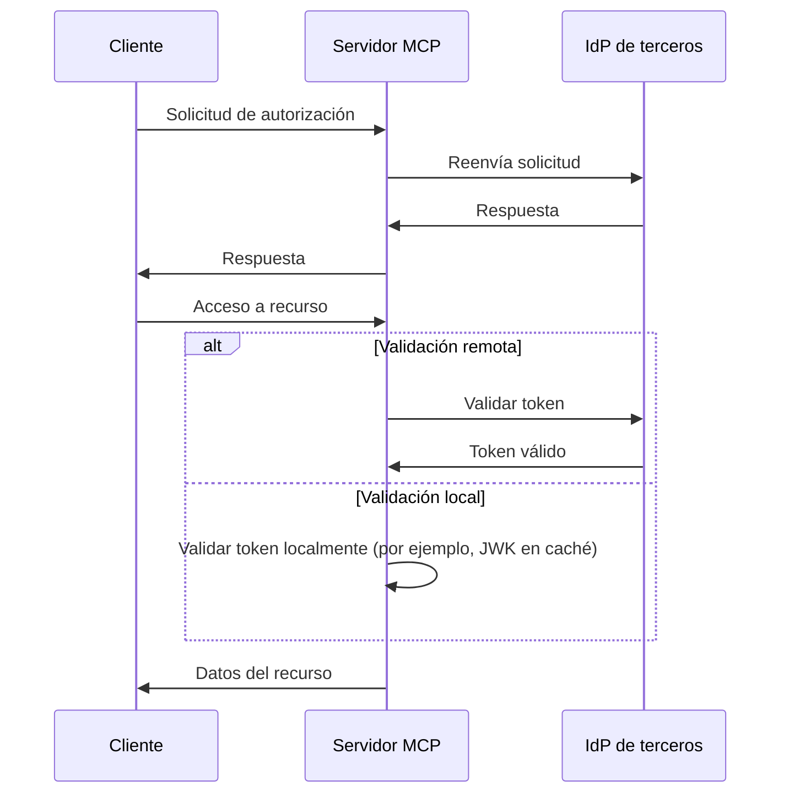
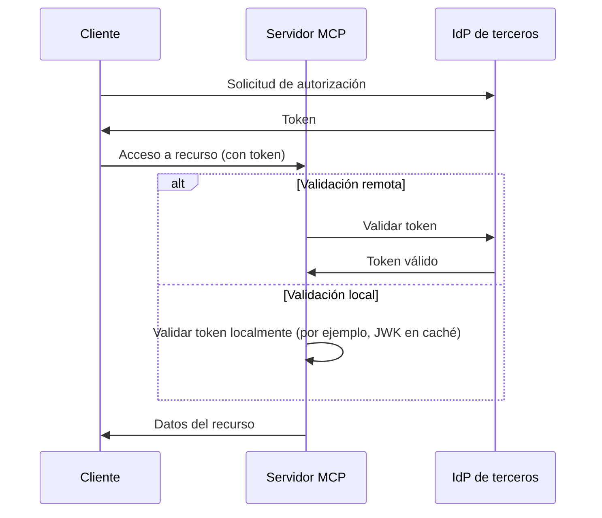

# Elegir entre MCP Auth y otras soluciones

El ecosistema MCP está evolucionando. A medida que la especificación del Model Context Protocol (MCP) avanza desde el enfoque de “servidor de autorización” hacia el nuevo modelo de “servidor de recursos + IdP de terceros”, es importante comprender cómo encajan las diferentes soluciones de integración, tanto ahora como en el futuro.

Esta página describe las principales diferencias entre mcp-auth y otras soluciones populares, para ayudarte a elegir el mejor enfoque para tu proyecto.

## Antecedentes: Enfoque proxy vs. integración con IdP \{#background-proxy-approach-vs-idp-integration}

La mayoría de las soluciones de autenticación MCP existentes utilizan un “enfoque proxy”. En este modelo, el servidor MCP actúa como intermediario y reenvía las solicitudes de autorización a un Proveedor de Identidad (IdP) de terceros, funcionando efectivamente como un intermediario entre el cliente y el IdP.

**Enfoque proxy ([03-26 spec](https://modelcontextprotocol.io/specification/2025-03-26/basic/authorization))**

Aunque esto funciona con la especificación MCP actual (2025-03-26), en esencia es una solución temporal. Supone que el servidor MCP también actuará como servidor de autorización, lo cual no es la dirección del último borrador de la especificación.

**MCP Auth / especificación futura (servidor de recursos + IdP de terceros)**

La próxima especificación de MCP [traslada la responsabilidad de la autorización a un IdP de terceros dedicado](https://github.com/modelcontextprotocol/modelcontextprotocol/issues/205). En este modelo, el servidor MCP solo actúa como servidor de recursos, y todos los endpoints de autorización provienen directamente del IdP de terceros.

## ¿Por qué elegir MCP Auth? \{#why-choose-mcp-auth}

- Alineación con la especificación: MCP Auth sigue directamente la dirección del último borrador, siendo la única solución compatible tanto con la especificación 03-26 como con la próxima.
- Sin más soluciones temporales: En lugar de actuar como proxy de servidor de autorización, MCP Auth permite que el IdP de terceros gestione toda la autorización, como está previsto en la nueva especificación.
- Agnóstico al proveedor: MCP Auth funciona con cualquier proveedor compatible con los estándares OAuth 2.0 / OIDC.
- Transición fluida: MCP Auth devuelve todos los endpoints de terceros tal cual mediante OAuth 2.0 Authorization Server Metadata. Esto mantiene la integración simple ahora y lista para futuros cambios.
- Experiencia para desarrolladores: Ofrece tutoriales, utilidades y próximas funciones como [OAuth 2.0 Protected Resource Metadata](https://auth.wiki/protected-resource-metadata) para facilitar la vida a los desarrolladores de servidores MCP.

| Característica                         | Soluciones proxy      | MCP Auth |
| -------------------------------------- | --------------------- | -------- |
| Funciona con la especificación 03-26   | ✅                    | ✅       |
| Funciona con la especificación futura  | ❌                    | ✅       |
| Soporta IdPs de terceros directamente  | ❌ (solo solución temporal) | ✅       |
| Agnóstico al proveedor                 | Limitado[^1]          | Sí       |
| Listo para la transición               | ❌                    | ✅       |

Si necesitas soportar IdPs de terceros ahora y quieres estar preparado para la próxima especificación, MCP Auth es la solución recomendada. Los enfoques basados en proxy pueden quedar obsoletos pronto o requerir una reestructuración significativa.

[^1]: Algunas soluciones proxy pueden codificar parámetros o endpoints específicos, limitando la flexibilidad.