import TabItem from '@theme/TabItem';
import Tabs from '@theme/Tabs';

import SetupOauthOrOidc from './_setup-oauth-or-oidc.mdx';
import SetupOidc from './_setup-oidc.mdx';

# Tutorial: Crea un gestor de tareas

En este tutorial, construiremos un servidor MCP gestor de tareas con autenticación y autorización de usuarios.

Después de completar este tutorial, tendrás:

- ✅ Una comprensión básica de cómo configurar el control de acceso basado en roles (RBAC) en tu servidor MCP.
- ✅ Un servidor MCP que puede gestionar listas de tareas personales.

:::note
Antes de comenzar, te recomendamos encarecidamente que revises primero el [tutorial ¿Quién soy?](./whoami) si no estás familiarizado con el servidor MCP y OAuth 2.
:::

## Descripción general \{#overview}

El tutorial involucrará los siguientes componentes:

- **Servidor MCP**: Un servidor MCP sencillo que utiliza los SDK oficiales de MCP para manejar solicitudes, con un servicio integrado de tareas para gestionar los elementos de tareas del usuario.
- **Inspector MCP**: Una herramienta visual de pruebas para servidores MCP. También actúa como un cliente OAuth / OIDC para iniciar el flujo de autorización y obtener tokens de acceso.
- **Servidor de autorización**: Un proveedor OAuth 2.1 u OpenID Connect que gestiona identidades de usuario y emite tokens de acceso.

Aquí tienes un diagrama de alto nivel de la interacción entre estos componentes:

```mermaid
sequenceDiagram
    participant Cliente as Inspector MCP
    participant Servidor as Servidor MCP
    participant Auth as Servidor de autorización

    Cliente->>Servidor: Solicitar operación de tareas
    Servidor->>Cliente: Retornar 401 No autorizado
    Cliente->>Auth: Iniciar flujo de autorización
    Auth->>Auth: Completar flujo de autorización
    Auth->>Cliente: Redirigir de vuelta con código de autorización
    Cliente->>Auth: Intercambiar código por token de acceso
    Auth->>Cliente: Retornar token de acceso
    Cliente->>Servidor: Solicitar operación de tareas con token de acceso
    Servidor->>Servidor: Validar token de acceso y obtener alcances del token de acceso
    Note over Servidor: Ejecutar operación de tareas
    Servidor->>Cliente: Retornar resultado de la operación de tareas
```



## Comprende tu servidor de autorización \{#understand-your-authorization-server}

### Tokens de acceso con alcances \{#access-tokens-with-scopes}

Para implementar el [control de acceso basado en roles (RBAC)](https://auth.wiki/rbac) en tu servidor MCP, tu servidor de autorización debe admitir la emisión de tokens de acceso con alcances. Los alcances representan los permisos que se le han otorgado a un usuario.

<Tabs groupId="provider">
<TabItem value="logto" label="Logto">

[Logto](https://logto.io) proporciona soporte para RBAC a través de sus recursos de API (conforme a [RFC 8707: Indicadores de recurso para OAuth 2.0](https://datatracker.ietf.org/doc/html/rfc8707)) y funciones de roles. Así es como se configura:

1. Inicia sesión en [Logto Console](https://cloud.logto.io) (o en tu Logto Console autoalojado)

2. Crea recurso de API y alcances:

   - Ve a "Recursos de API"
   - Crea un nuevo recurso de API llamado "Gestor de tareas"
   - Añade los siguientes alcances:
     - `create:todos`: "Crear nuevas tareas"
     - `read:todos`: "Leer todas las tareas"
     - `delete:todos`: "Eliminar cualquier tarea"

3. Crea roles (recomendado para una gestión más sencilla):

   - Ve a "Roles"
   - Crea un rol "Admin" y asigna todos los alcances (`create:todos`, `read:todos`, `delete:todos`)
   - Crea un rol "User" y asigna solo el alcance `create:todos`

4. Asigna permisos:
   - Ve a "Usuarios"
   - Selecciona un usuario
   - Puedes:
     - Asignar roles en la pestaña "Roles" (recomendado)
     - O asignar alcances directamente en la pestaña "Permisos"

Los alcances se incluirán en el reclamo `scope` del token de acceso JWT como una cadena separada por espacios.

</TabItem>
<TabItem value="oauth-oidc" label="OAuth 2.0 / OIDC">

Los proveedores OAuth 2.0 / OIDC suelen admitir el control de acceso basado en alcances. Al implementar RBAC:

1. Define los alcances requeridos en tu servidor de autorización
2. Configura tu cliente para solicitar estos alcances durante el flujo de autorización
3. Asegúrate de que tu servidor de autorización incluya los alcances otorgados en el token de acceso
4. Los alcances suelen incluirse en el reclamo `scope` del token de acceso JWT

Consulta la documentación de tu proveedor para detalles específicos sobre:

- Cómo definir y gestionar alcances
- Cómo se incluyen los alcances en el token de acceso
- Cualquier característica adicional de RBAC como la gestión de roles

</TabItem>
</Tabs>

### Validación de tokens y comprobación de permisos \{#validating-tokens-and-checking-permissions}

Cuando tu servidor MCP recibe una solicitud, debe:

1. Validar la firma y expiración del token de acceso
2. Extraer los alcances del token validado
3. Comprobar si el token tiene los alcances requeridos para la operación solicitada

Por ejemplo, si un usuario quiere crear una nueva tarea, su token de acceso debe incluir el alcance `create:todos`. Así funciona el flujo:

```mermaid
sequenceDiagram
    participant Cliente
    participant Servidor MCP
    participant Servidor Auth

    Cliente->>Servidor MCP: Solicitud con token de acceso

    alt Validación JWT
        Servidor MCP->>Servidor Auth: Obtener JWKS
        Servidor Auth-->>Servidor MCP: Retornar JWKS
        Servidor MCP->>Servidor MCP: Validar JWT localmente
    else Introspección de token
        Servidor MCP->>Servidor Auth: POST /introspect<br/>(token=access_token)
        Servidor Auth-->>Servidor MCP: Retornar información del token<br/>(activo, alcance, etc.)
    end

    Servidor MCP->>Servidor MCP: Extraer y comprobar alcances

    alt Tiene los alcances requeridos
        Servidor MCP->>Cliente: Permitir operación
    else Faltan alcances
        Servidor MCP->>Cliente: Retornar 403 Prohibido
    end
```



### Registro dinámico de clientes \{#dynamic-client-registration}

El registro dinámico de clientes no es necesario para este tutorial, pero puede ser útil si deseas automatizar el proceso de registro del cliente MCP con tu servidor de autorización. Consulta [¿Es necesario el registro dinámico de clientes?](../../provider-list#is-dcr-required) para más detalles.

## Comprende RBAC en el gestor de tareas \{#understand-rbac-in-todo-manager}

Con fines demostrativos, implementaremos un sistema sencillo de control de acceso basado en roles (RBAC) en nuestro servidor MCP gestor de tareas. Esto te mostrará los principios básicos de RBAC manteniendo la implementación simple.

:::note
Aunque este tutorial demuestra la gestión de alcances basada en RBAC, es importante señalar que no todos los proveedores de autenticación implementan la gestión de alcances a través de roles. Algunos proveedores pueden tener sus propias implementaciones y mecanismos únicos para gestionar el control de acceso y los permisos.
:::

### Herramientas y alcances \{#tools-and-scopes}

Nuestro servidor MCP gestor de tareas proporciona tres herramientas principales:

- `create-todo`: Crear una nueva tarea
- `get-todos`: Listar todas las tareas
- `delete-todo`: Eliminar una tarea por ID

Para controlar el acceso a estas herramientas, definimos los siguientes alcances:

- `create:todos`: Permite crear nuevas tareas
- `delete:todos`: Permite eliminar tareas existentes
- `read:todos`: Permite consultar y recuperar la lista de todas las tareas

### Roles y permisos \{#roles-and-permissions}

Definiremos dos roles con diferentes niveles de acceso:

| Rol   | create:todos | read:todos | delete:todos |
| ----- | ------------ | ---------- | ------------ |
| Admin | ✅           | ✅         | ✅           |
| User  | ✅           |            |              |

- **User**: Un usuario regular que puede crear tareas y ver o eliminar solo sus propias tareas
- **Admin**: Un administrador que puede crear, ver y eliminar todas las tareas, sin importar la propiedad

### Propiedad de recursos \{#resource-ownership}

Aunque la tabla de permisos anterior muestra los alcances explícitos asignados a cada rol, hay un principio importante de propiedad de recursos a considerar:

- **Los usuarios** no tienen los alcances `read:todos` o `delete:todos`, pero aún pueden:
  - Leer sus propias tareas
  - Eliminar sus propias tareas
- **Los administradores** tienen todos los permisos (`read:todos` y `delete:todos`), lo que les permite:
  - Ver todas las tareas del sistema
  - Eliminar cualquier tarea, sin importar la propiedad

Esto demuestra un patrón común en los sistemas RBAC donde la propiedad de recursos otorga permisos implícitos a los usuarios para sus propios recursos, mientras que los roles administrativos reciben permisos explícitos para todos los recursos.

:::tip Aprende más
Para profundizar en los conceptos y mejores prácticas de RBAC, consulta [Dominando RBAC: Un ejemplo completo del mundo real](https://blog.logto.io/mastering-rbac).
:::

## Configura la autorización en tu proveedor \{#configure-authorization-in-your-provider}

Para implementar el sistema de control de acceso que describimos antes, deberás configurar tu servidor de autorización para admitir los alcances requeridos. Así es como hacerlo con diferentes proveedores:

<Tabs groupId="provider">
<TabItem value="logto" label="Logto">

[Logto](https://logto.io) proporciona soporte para RBAC a través de sus recursos de API y funciones de roles. Así es como se configura:

1. Inicia sesión en [Logto Console](https://cloud.logto.io) (o en tu Logto Console autoalojado)

2. Crea recurso de API y alcances:

   - Ve a "Recursos de API"
   - Crea un nuevo recurso de API llamado "Gestor de tareas" y usa `https://todo.mcp-server.app` (para demostración) como el indicador.
   - Crea los siguientes alcances:
     - `create:todos`: "Crear nuevas tareas"
     - `read:todos`: "Leer todas las tareas"
     - `delete:todos`: "Eliminar cualquier tarea"

3. Crea roles (recomendado para una gestión más sencilla):

   - Ve a "Roles"
   - Crea un rol "Admin" y asigna todos los alcances (`create:todos`, `read:todos`, `delete:todos`)
   - Crea un rol "User" y asigna solo el alcance `create:todos`
   - En la página de detalles del rol "User", cambia a la pestaña "General" y establece el rol "User" como el "Rol predeterminado".

4. Gestiona roles y permisos de usuario:
   - Para nuevos usuarios:
     - Obtendrán automáticamente el rol "User" ya que lo establecimos como rol predeterminado
   - Para usuarios existentes:
     - Ve a "Gestión de usuarios"
     - Selecciona un usuario
     - Asigna roles al usuario en la pestaña "Roles"

:::tip Gestión programática de roles
También puedes usar la [Management API](https://docs.logto.io/integrate-logto/interact-with-management-api) de Logto para gestionar roles de usuario de forma programática. Esto es especialmente útil para la gestión automatizada de usuarios o al construir paneles de administración.
:::

Al solicitar un token de acceso, Logto incluirá los alcances en el reclamo `scope` del token según los permisos de rol del usuario.

</TabItem>
<TabItem value="keycloak" label="Keycloak">

En [Keycloak](https://www.keycloak.org), puedes configurar los permisos requeridos usando client scopes:

1. Crea client scopes:

   - En tu realm, ve a "Client scopes"
   - Crea tres nuevos client scopes:
     - `create:todos`
     - `read:todos`
     - `delete:todos`

2. Configura el cliente:

   - Ve a la configuración de tu cliente
   - En la pestaña "Client scopes", añade todos los scopes que creaste
   - Asegúrate de que el token mapper esté configurado para incluir los scopes

3. Opcional: Usa roles para una gestión más sencilla
   - Si prefieres la gestión basada en roles:
     - Crea roles de realm para diferentes niveles de acceso
     - Mapea scopes a roles
     - Asigna roles a los usuarios
   - De lo contrario, puedes asignar scopes directamente a los usuarios o a través de permisos a nivel de cliente

Keycloak incluirá los scopes otorgados en el reclamo `scope` del token de acceso.

</TabItem>
<TabItem value="oauth-or-oidc" label="OAuth 2 / OIDC">

Para proveedores OAuth 2.0 u OpenID Connect, deberás configurar los scopes que representan diferentes permisos. Los pasos exactos dependerán de tu proveedor, pero generalmente:

1. Define scopes:

   - Configura tu servidor de autorización para admitir:
     - `create:todos`
     - `read:todos`
     - `delete:todos`

2. Configura el cliente:

   - Registra o actualiza tu cliente para solicitar estos scopes
   - Asegúrate de que los scopes estén incluidos en el token de acceso

3. Asigna permisos:
   - Usa la interfaz de tu proveedor para otorgar los scopes apropiados a los usuarios
   - Algunos proveedores pueden admitir la gestión basada en roles, mientras que otros pueden usar asignaciones directas de scopes
   - Consulta la documentación de tu proveedor para el enfoque recomendado

:::tip
La mayoría de los proveedores incluirán los scopes otorgados en el reclamo `scope` del token de acceso. El formato suele ser una cadena de valores de scope separados por espacios.
:::

</TabItem>
</Tabs>

Después de configurar tu servidor de autorización, los usuarios recibirán tokens de acceso que contienen los scopes otorgados. El servidor MCP usará estos scopes para determinar:

- Si un usuario puede crear nuevas tareas (`create:todos`)
- Si un usuario puede ver todas las tareas (`read:todos`) o solo las suyas
- Si un usuario puede eliminar cualquier tarea (`delete:todos`) o solo las suyas

## Configura el servidor MCP \{#set-up-the-mcp-server}

Usaremos los [SDK oficiales de MCP](https://github.com/modelcontextprotocol) para crear nuestro servidor MCP gestor de tareas.

### Crea un nuevo proyecto \{#create-a-new-project}

<Tabs groupId="sdk">
<TabItem value="python" label="Python">

```bash
mkdir mcp-server
cd mcp-server
uv init # O usa `pipenv` o `poetry` para crear un nuevo entorno virtual
```

</TabItem>
<TabItem value="node" label="Node.js">

Configura un nuevo proyecto Node.js:

```bash
mkdir mcp-server
cd mcp-server
npm init -y # O usa `pnpm init`
npm pkg set type="module"
npm pkg set main="todo-manager.ts"
npm pkg set scripts.start="node --experimental-strip-types todo-manager.ts"
```

:::note
Usamos TypeScript en nuestros ejemplos ya que Node.js v22.6.0+ admite la ejecución de TypeScript de forma nativa usando la bandera `--experimental-strip-types`. Si usas JavaScript, el código será similar; solo asegúrate de usar Node.js v22.6.0 o posterior. Consulta la documentación de Node.js para más detalles.
:::

</TabItem>
</Tabs>

### Instala el SDK de MCP y dependencias \{#install-the-mcp-sdk-and-dependencies}

<Tabs groupId="sdk">
<TabItem value="python" label="Python">

```bash
pip install "mcp[cli]" starlette uvicorn
```

O cualquier otro gestor de paquetes que prefieras, como `uv` o `poetry`.

</TabItem>
<TabItem value="node" label="Node.js">

```bash
npm install @modelcontextprotocol/sdk express zod
```

O cualquier otro gestor de paquetes que prefieras, como `pnpm` o `yarn`.

</TabItem>
</Tabs>

### Crea el servidor MCP \{#create-the-mcp-server}

Primero, vamos a crear un servidor MCP básico con las definiciones de herramientas:

<Tabs groupId="sdk">
<TabItem value="python" label="Python">

Crea un archivo llamado `todo-manager.py` y añade el siguiente código:

```python
from typing import Any
from mcp.server.fastmcp import FastMCP
from starlette.applications import Starlette
from starlette.routing import Mount

mcp = FastMCP("Gestor de tareas")

@mcp.tool()
def create_todo(content: str) -> dict[str, Any]:
    """Crear una nueva tarea."""
    return {"error": "No implementado"}

@mcp.tool()
def get_todos() -> dict[str, Any]:
    """Listar todas las tareas."""
    return {"error": "No implementado"}

@mcp.tool()
def delete_todo(id: str) -> dict[str, Any]:
    """Eliminar una tarea por id."""
    return {"error": "No implementado"}

app = Starlette(
    routes=[Mount('/', app=mcp.sse_app())]
)
```

Ejecuta el servidor con:

```bash
uvicorn todo_manager:app --host 0.0.0.0 --port 3001
```

</TabItem>
<TabItem value="node" label="Node.js">

:::note
Dado que la implementación actual del inspector MCP no maneja flujos de autorización, usaremos el enfoque SSE para configurar el servidor MCP. Actualizaremos el código aquí una vez que el inspector MCP admita flujos de autorización.
:::

También puedes usar `pnpm` o `yarn` si lo prefieres.

Crea un archivo llamado `todo-manager.ts` y añade el siguiente código:

```ts
// todo-manager.ts

import { z } from 'zod';
import { McpServer } from '@modelcontextprotocol/sdk/server/mcp.js';
import { SSEServerTransport } from '@modelcontextprotocol/sdk/server/sse.js';
import express from 'express';

// Crear un servidor MCP
const server = new McpServer({
  name: 'Gestor de tareas',
  version: '0.0.0',
});

server.tool('create-todo', 'Crear una nueva tarea', { content: z.string() }, async ({ content }) => {
  return {
    content: [{ type: 'text', text: JSON.stringify({ error: 'No implementado' }) }],
  };
});

server.tool('get-todos', 'Listar todas las tareas', async () => {
  return {
    content: [{ type: 'text', text: JSON.stringify({ error: 'No implementado' }) }],
  };
});

server.tool('delete-todo', 'Eliminar una tarea por id', { id: z.string() }, async ({ id }) => {
  return {
    content: [{ type: 'text', text: JSON.stringify({ error: 'No implementado' }) }],
  };
});

// Código boilerplate de la documentación del SDK de MCP
const PORT = 3001;
const app = express();

const transports = {};

app.get('/sse', async (_req, res) => {
  const transport = new SSEServerTransport('/messages', res);
  transports[transport.sessionId] = transport;

  res.on('close', () => {
    delete transports[transport.sessionId];
  });

  await server.connect(transport);
});

app.post('/messages', async (req, res) => {
  const sessionId = String(req.query.sessionId);
  const transport = transports[sessionId];
  if (transport) {
    await transport.handlePostMessage(req, res, req.body);
  } else {
    res.status(400).send('No transport found for sessionId');
  }
});

app.listen(PORT);
```

Ejecuta el servidor con:

```bash
npm start
```

</TabItem>
</Tabs>

## Inspecciona el servidor MCP \{#inspect-the-mcp-server}

### Clona y ejecuta el inspector MCP \{#clone-and-run-mcp-inspector}

Ahora que tenemos el servidor MCP en funcionamiento, podemos usar el inspector MCP para ver si la herramienta `whoami` está disponible.

Debido a la limitación de la implementación actual, hemos bifurcado el [inspector MCP](https://github.com/mcp-auth/inspector) para hacerlo más flexible y escalable para autenticación y autorización. También hemos enviado un pull request al repositorio original para incluir nuestros cambios.

Para ejecutar el inspector MCP, puedes usar el siguiente comando (se requiere Node.js):

```bash
git clone https://github.com/mcp-auth/inspector.git
cd inspector
npm install
npm run dev
```

Luego, abre tu navegador y navega a `http://localhost:6274/` (u otra URL mostrada en la terminal) para acceder al inspector MCP.

### Conecta el inspector MCP al servidor MCP \{#connect-mcp-inspector-to-the-mcp-server}

Antes de continuar, verifica la siguiente configuración en el inspector MCP:

- **Tipo de transporte**: Establece en `SSE`.
- **URL**: Establece la URL de tu servidor MCP. En nuestro caso, debe ser `http://localhost:3001/sse`.

Ahora puedes hacer clic en el botón "Connect" para ver si el inspector MCP puede conectarse al servidor MCP. Si todo está bien, deberías ver el estado "Connected" en el inspector MCP.

### Punto de control: Ejecuta las herramientas del gestor de tareas \{#checkpoint-run-todo-manager-tools}

1. En el menú superior del inspector MCP, haz clic en la pestaña "Tools".
2. Haz clic en el botón "List Tools".
3. Deberías ver las herramientas `create-todo`, `get-todos` y `delete-todo` listadas en la página. Haz clic en una para ver los detalles de la herramienta.
4. Deberías ver el botón "Run Tool" en el lado derecho. Haz clic en él e ingresa los parámetros requeridos para ejecutar la herramienta.
5. Deberías ver el resultado de la herramienta con la respuesta JSON `{"error": "No implementado"}`.


## Integra con tu servidor de autorización \{#integrate-with-your-authorization-server}

Para completar esta sección, hay varias consideraciones a tener en cuenta:

<details>
<summary>**La URL del emisor de tu servidor de autorización**</summary>

Normalmente es la URL base de tu servidor de autorización, como `https://auth.example.com`. Algunos proveedores pueden tener una ruta como `https://example.logto.app/oidc`, así que asegúrate de consultar la documentación de tu proveedor.

</details>

<details>
<summary>**Cómo obtener los metadatos del servidor de autorización**</summary>

- Si tu servidor de autorización cumple con [OAuth 2.0 Authorization Server Metadata](https://datatracker.ietf.org/doc/html/rfc8414) o [OpenID Connect Discovery](https://openid.net/specs/openid-connect-discovery-1_0.html), puedes usar las utilidades integradas de MCP Auth para obtener los metadatos automáticamente.
- Si tu servidor de autorización no cumple con estos estándares, deberás especificar manualmente la URL de metadatos o los endpoints en la configuración del servidor MCP. Consulta la documentación de tu proveedor para los endpoints específicos.

</details>

<details>
<summary>**Cómo registrar el inspector MCP como cliente en tu servidor de autorización**</summary>

- Si tu servidor de autorización admite [Dynamic Client Registration](https://datatracker.ietf.org/doc/html/rfc7591), puedes omitir este paso ya que el inspector MCP se registrará automáticamente como cliente.
- Si tu servidor de autorización no admite Dynamic Client Registration, deberás registrar manualmente el inspector MCP como cliente en tu servidor de autorización.

</details>

<details>
<summary>**Comprende los parámetros de solicitud de token**</summary>

Al solicitar tokens de acceso de diferentes servidores de autorización, encontrarás varios enfoques para especificar el recurso objetivo y los permisos. Aquí los principales patrones:

- **Basado en indicador de recurso**:

  - Usa el parámetro `resource` para especificar la API objetivo (ver [RFC 8707: Indicadores de recurso para OAuth 2.0](https://datatracker.ietf.org/doc/html/rfc8707))
  - Común en implementaciones modernas de OAuth 2.0
  - Ejemplo de solicitud:
    ```json
    {
      "resource": "https://todo.mcp-server.app",
      "scope": "create:todos read:todos"
    }
    ```
  - El servidor emite tokens vinculados específicamente al recurso solicitado

- **Basado en audiencia**:

  - Usa el parámetro `audience` para especificar el destinatario previsto del token
  - Similar a los indicadores de recurso pero con semántica diferente
  - Ejemplo de solicitud:
    ```json
    {
      "audience": "todo-api",
      "scope": "create:todos read:todos"
    }
    ```

- **Basado solo en scopes**:
  - Se basa únicamente en scopes sin parámetros de recurso/audiencia
  - Enfoque tradicional de OAuth 2.0
  - Ejemplo de solicitud:
    ```json
    {
      "scope": "todo-api:create todo-api:read openid profile"
    }
    ```
  - A menudo usa scopes con prefijo para namespacing de permisos
  - Común en implementaciones más simples de OAuth 2.0

:::tip Mejores prácticas

- Consulta la documentación de tu proveedor para los parámetros admitidos
- Algunos proveedores admiten varios enfoques simultáneamente
- Los indicadores de recurso proporcionan mejor seguridad mediante restricción de audiencia
- Considera usar indicadores de recurso cuando estén disponibles para un mejor control de acceso
  :::

</details>

Aunque cada proveedor puede tener sus propios requisitos específicos, los siguientes pasos te guiarán en el proceso de integración del inspector MCP y el servidor MCP con configuraciones específicas del proveedor.

### Registra el inspector MCP como cliente \{#register-mcp-inspector-as-a-client}

<Tabs groupId="provider">
<TabItem value="logto" label="Logto">

Integrar el gestor de tareas con [Logto](https://logto.io) es sencillo ya que es un proveedor OpenID Connect que admite indicadores de recurso y scopes, lo que te permite asegurar tu API de tareas con `https://todo.mcp-server.app` como indicador de recurso.

Dado que Logto aún no admite Dynamic Client Registration, deberás registrar manualmente el inspector MCP como cliente en tu tenant de Logto:

1. Abre tu inspector MCP, haz clic en el botón "OAuth Configuration". Copia el valor de **Redirect URL (auto-populated)**, que debería ser algo como `http://localhost:6274/oauth/callback`.
2. Inicia sesión en [Logto Console](https://cloud.logto.io) (o en tu Logto Console autoalojado).
3. Navega a la pestaña "Applications", haz clic en "Create application". En la parte inferior de la página, haz clic en "Create app without framework".
4. Completa los detalles de la aplicación y haz clic en "Create application":
   - **Selecciona un tipo de aplicación**: Elige "Single-page application".
   - **Nombre de la aplicación**: Ingresa un nombre para tu aplicación, por ejemplo, "MCP Inspector".
5. En la sección "Settings / Redirect URIs", pega el valor de **Redirect URL (auto-populated)** que copiaste del inspector MCP. Luego haz clic en "Save changes" en la barra inferior.
6. En la tarjeta superior, verás el valor "App ID". Cópialo.
7. Vuelve al inspector MCP y pega el valor "App ID" en la sección "OAuth Configuration" bajo "Client ID".
8. Ingresa el valor `{"scope": "create:todos read:todos delete:todos", "resource": "https://todo.mcp-server.app"}` en el campo "Auth Params". Esto asegurará que el token de acceso devuelto por Logto contenga los scopes necesarios para acceder al gestor de tareas.

</TabItem>
<TabItem value="oauth-oidc" label="OAuth 2.0 / OIDC">

:::note
Esta es una guía genérica de integración de proveedor OAuth 2.0 / OpenID Connect. Ambos siguen pasos similares ya que OIDC se basa en OAuth 2.0. Consulta la documentación de tu proveedor para detalles específicos.
:::

Si tu proveedor admite Dynamic Client Registration, puedes ir directamente al paso 8 para configurar el inspector MCP; de lo contrario, deberás registrar manualmente el inspector MCP como cliente:

1. Abre tu inspector MCP, haz clic en el botón "OAuth Configuration". Copia el valor de **Redirect URL (auto-populated)**, que debería ser algo como `http://localhost:6274/oauth/callback`.

2. Inicia sesión en la consola de tu proveedor.

3. Navega a la sección "Applications" o "Clients", luego crea una nueva aplicación o cliente.

4. Si tu proveedor requiere un tipo de cliente, selecciona "Single-page application" o "Public client".

5. Después de crear la aplicación, deberás configurar la URI de redirección. Pega el valor de **Redirect URL (auto-populated)** que copiaste del inspector MCP.

6. Busca el "Client ID" o "Application ID" de la nueva aplicación y cópialo.

7. Vuelve al inspector MCP y pega el valor "Client ID" en la sección "OAuth Configuration" bajo "Client ID".

8. Ingresa el siguiente valor en el campo "Auth Params" para solicitar los scopes necesarios para las operaciones de tareas:

```json
{ "scope": "create:todos read:todos delete:todos" }
```

</TabItem>
</Tabs>

### Configura MCP auth \{#set-up-mcp-auth}

En tu proyecto del servidor MCP, necesitas instalar el SDK de MCP Auth y configurarlo para usar los metadatos de tu servidor de autorización.

<Tabs groupId="sdk">
<TabItem value="python" label="Python">

Primero, instala el paquete `mcpauth`:

```bash
pip install mcpauth
```

O cualquier otro gestor de paquetes que prefieras, como `uv` o `poetry`.

</TabItem>
<TabItem value="node" label="Node.js">

Primero, instala el paquete `mcp-auth`:

```bash
npm install mcp-auth
```

</TabItem>
</Tabs>

MCP Auth requiere los metadatos del servidor de autorización para poder inicializarse. Dependiendo de tu proveedor:

<Tabs groupId="provider">

<TabItem value="logto" label="Logto">

La URL del emisor se puede encontrar en la página de detalles de tu aplicación en Logto Console, en la sección "Endpoints & Credentials / Issuer endpoint". Debería verse como `https://my-project.logto.app/oidc`.

<SetupOidc />

</TabItem>

<TabItem value="oauth-oidc" label="OAuth 2.0 / OIDC">

Para proveedores OAuth 2.0, deberás:

1. Consultar la documentación de tu proveedor para la URL del servidor de autorización (a menudo llamada issuer URL o base URL)
2. Algunos proveedores pueden exponer esto en `https://{your-domain}/.well-known/oauth-authorization-server`
3. Busca en la consola de administración de tu proveedor bajo la configuración OAuth/API

<SetupOauthOrOidc />

</TabItem>

</Tabs>

<Tabs groupId="sdk">

<TabItem value="python" label="Python">

Actualiza el `todo-manager.py` para incluir la configuración de MCP Auth:

```python
from mcpauth import MCPAuth
from mcpauth.config import AuthServerType
from mcpauth.utils import fetch_server_config

auth_issuer = '<issuer-endpoint>'  # Reemplaza con tu endpoint de emisor
auth_server_config = fetch_server_config(auth_issuer, type=AuthServerType.OIDC)
mcp_auth = MCPAuth(server=auth_server_config)
```

</TabItem>
<TabItem value="node" label="Node.js">

Actualiza el `todo-manager.ts` para incluir la configuración de MCP Auth:

```ts
// todo-manager.ts

import { MCPAuth, fetchServerConfig } from 'mcp-auth';

const authIssuer = '<issuer-endpoint>'; // Reemplaza con tu endpoint de emisor
const mcpAuth = new MCPAuth({
  server: await fetchServerConfig(authIssuer, { type: 'oidc' }),
});
```

</TabItem>
</Tabs>

### Actualiza el servidor MCP \{#update-mcp-server}

¡Ya casi terminamos! Es momento de actualizar el servidor MCP para aplicar la ruta y función middleware de MCP Auth, luego implementar el control de acceso basado en permisos para las herramientas del gestor de tareas según los scopes del usuario.

<Tabs groupId="sdk">
<TabItem value="python" label="Python">

```python
@mcp.tool()
def create_todo(content: str) -> dict[str, Any]:
    """Crear una nueva tarea."""
    return (
        mcp_auth.auth_info.scopes
        if mcp_auth.auth_info # Esto será rellenado por el middleware Bearer auth
        else {"error": "No autenticado"}
    )

# ...

bearer_auth = Middleware(mcp_auth.bearer_auth_middleware("jwt"))
app = Starlette(
    routes=[
        # Añade la ruta de metadatos (`/.well-known/oauth-authorization-server`)
        mcp_auth.metadata_route(),
        # Protege el servidor MCP con el middleware Bearer auth
        Mount('/', app=mcp.sse_app(), middleware=[bearer_auth]),
    ],
)
```

</TabItem>
<TabItem value="node" label="Node.js">

```js
server.tool(
  'create-todo',
  'Crear una nueva tarea',
  { content: z.string() },
  async ({ content, authInfo }) => {
    return {
      content: [
        { type: 'text', text: JSON.stringify(authInfo?.scopes ?? { error: 'No autenticado' }) },
      ],
    };
  }
);

// ...

app.use(mcpAuth.delegatedRouter());
app.use(mcpAuth.bearerAuth('jwt'));
```

</TabItem>
</Tabs>

A continuación, implementemos las herramientas específicas.

Primero, vamos a crear un servicio de tareas sencillo para proporcionar operaciones CRUD básicas para gestionar tareas en memoria.

<Tabs groupId="sdk">
<TabItem value="python" label="Python">
```python
# service.py

"""
Un servicio de tareas sencillo para fines demostrativos.
Utiliza una lista en memoria para almacenar tareas.
"""

from datetime import datetime
from typing import List, Optional, Dict, Any
import random
import string

class Todo:
"""Representa una tarea."""

    def __init__(self, id: str, content: str, owner_id: str, created_at: str):
        self.id = id
        self.content = content
        self.owner_id = owner_id
        self.created_at = created_at

    def to_dict(self) -> Dict[str, Any]:
        """Convierte la tarea a diccionario para serialización JSON."""
        return {
            "id": self.id,
            "content": self.content,
            "ownerId": self.owner_id,
            "createdAt": self.created_at
        }

class TodoService:
"""Un servicio de tareas sencillo para fines demostrativos."""

    def __init__(self):
        self._todos: List[Todo] = []

    def get_all_todos(self, owner_id: Optional[str] = None) -> List[Dict[str, Any]]:
        """
        Obtiene todas las tareas, opcionalmente filtradas por owner_id.

        Args:
            owner_id: Si se proporciona, solo retorna tareas de este usuario

        Returns:
            Lista de diccionarios de tareas
        """
        if owner_id:
            filtered_todos = [todo for todo in self._todos if todo.owner_id == owner_id]
            return [todo.to_dict() for todo in filtered_todos]
        return [todo.to_dict() for todo in self._todos]

    def get_todo_by_id(self, todo_id: str) -> Optional[Todo]:
        """
        Obtiene una tarea por su ID.

        Args:
            todo_id: El ID de la tarea a recuperar

        Returns:
            Objeto Todo si se encuentra, None en caso contrario
        """
        for todo in self._todos:
            if todo.id == todo_id:
                return todo
        return None

    def create_todo(self, content: str, owner_id: str) -> Dict[str, Any]:
        """
        Crea una nueva tarea.

        Args:
            content: El contenido de la tarea
            owner_id: El ID del usuario propietario de la tarea

        Returns:
            Diccionario de la tarea creada
        """
        todo = Todo(
            id=self._generate_id(),
            content=content,
            owner_id=owner_id,
            created_at=datetime.now().isoformat()
        )
        self._todos.append(todo)
        return todo.to_dict()

    def delete_todo(self, todo_id: str) -> Optional[Dict[str, Any]]:
        """
        Elimina una tarea por su ID.

        Args:
            todo_id: El ID de la tarea a eliminar

        Returns:
            Diccionario de la tarea eliminada si se encuentra, None en caso contrario
        """
        for i, todo in enumerate(self._todos):
            if todo.id == todo_id:
                deleted_todo = self._todos.pop(i)
                return deleted_todo.to_dict()
        return None

    def _generate_id(self) -> str:
        """Genera un ID aleatorio para una tarea."""
        return ''.join(random.choices(string.ascii_lowercase + string.digits, k=8))

````


</TabItem>
<TabItem value="node" label="Node.js">

```ts
// todo-service.ts

type Todo = {
  id: string;
  content: string;
  ownerId: string;
  createdAt: string;
};

/**
 * Un servicio de tareas sencillo para fines demostrativos.
 * Usa un array en memoria para almacenar tareas
 */
export class TodoService {
  private readonly todos: Todo[] = [];

  getAllTodos(ownerId?: string): Todo[] {
    if (ownerId) {
      return this.todos.filter((todo) => todo.ownerId === ownerId);
    }
    return this.todos;
  }

  getTodoById(id: string): Todo | undefined {
    return this.todos.find((todo) => todo.id === id);
  }

  createTodo({ content, ownerId }: { content: string; ownerId: string }): Todo {
    const todo: Todo = {
      id: this.genId(),
      content,
      ownerId,
      createdAt: new Date().toISOString(),
    };

    // eslint-disable-next-line @silverhand/fp/no-mutating-methods
    this.todos.push(todo);
    return todo;
  }

  deleteTodo(id: string): Todo | undefined {
    const index = this.todos.findIndex((todo) => todo.id === id);

    if (index === -1) {
      return undefined;
    }

    // eslint-disable-next-line @silverhand/fp/no-mutating-methods
    const [deleted] = this.todos.splice(index, 1);
    return deleted;
  }

  private genId(): string {
    return Math.random().toString(36).slice(2, 10);
  }
}
````

</TabItem>
</Tabs>

luego en la capa de herramientas, determinaremos si las operaciones están permitidas según los scopes del usuario:

<Tabs groupId="sdk">
<TabItem value="python" label="Python">

```python
# todo-manager.py

from typing import Any, Optional
from mcpauth.errors import MCPAuthBearerAuthError

def assert_user_id(auth_info: Optional[dict]) -> str:
    """Extrae y valida el ID de usuario del auth info."""
    subject = auth_info.get('subject') if auth_info else None
    if not subject:
        raise ValueError('Información de autenticación inválida')
    return subject

def has_required_scopes(user_scopes: list[str], required_scopes: list[str]) -> bool:
    """Comprueba si el usuario tiene todos los scopes requeridos."""
    return all(scope in user_scopes for scope in required_scopes)

# Crea una instancia de TodoService
todo_service = TodoService()

@mcp.tool()
def create_todo(content: str) -> dict[str, Any]:
    """Crear una nueva tarea.

    Solo los usuarios con el scope 'create:todos' pueden crear tareas.
    """
    # Obtiene la información de autenticación
    auth_info = mcp_auth.auth_info

    # Valida el ID de usuario
    try:
        user_id = assert_user_id(auth_info)
    except ValueError as e:
        return {"error": str(e)}

    # Comprueba si el usuario tiene los permisos requeridos
    if not has_required_scopes(auth_info.scopes if auth_info else [], ['create:todos']):
        raise MCPAuthBearerAuthError('missing_required_scopes')

    # Crea nueva tarea
    created_todo = todo_service.create_todo(content=content, owner_id=user_id)

    # Retorna la tarea creada
    return created_todo.__dict__

# ...
```

Puedes consultar nuestro [código de ejemplo](https://github.com/mcp-auth/python/tree/master/samples/server) para todas las implementaciones detalladas.

</TabItem>
<TabItem value="node" label="Node.js">

```ts
// todo-manager.ts

// ... otros imports
import assert from 'node:assert';
import { type AuthInfo } from '@modelcontextprotocol/sdk/server/auth/types.js';
import { TodoService } from './todo-service.js';

const todoService = new TodoService();

const assertUserId = (authInfo?: AuthInfo) => {
  const { subject } = authInfo ?? {};
  assert(subject, 'Información de autenticación inválida');
  return subject;
};

/**
 * Comprueba si el usuario tiene todos los scopes requeridos para una operación
 */
const hasRequiredScopes = (userScopes: string[], requiredScopes: string[]): boolean => {
  return requiredScopes.every((scope) => userScopes.includes(scope));
};

server.tool(
  'create-todo',
  'Crear una nueva tarea',
  { content: z.string() },
  ({ content }: { content: string }, { authInfo }) => {
    const userId = assertUserId(authInfo);

    /**
     * Solo los usuarios con el scope 'create:todos' pueden crear tareas
     */
    if (!hasRequiredScopes(authInfo?.scopes ?? [], ['create:todos'])) {
      throw new MCPAuthBearerAuthError('missing_required_scopes');
    }

    const createdTodo = todoService.createTodo({ content, ownerId: userId });

    return {
      content: [{ type: 'text', text: JSON.stringify(createdTodo) }],
    };
  }
);

// ...
```

Puedes consultar nuestro [código de ejemplo](https://github.com/mcp-auth/js/tree/master/packages/sample-servers/src/todo-manager) para todas las implementaciones detalladas.

</TabItem>
</Tabs>

## Punto de control: Ejecuta las herramientas `todo-manager` \{#checkpoint-run-the-todo-manager-tools}

Reinicia tu servidor MCP y abre el inspector MCP en tu navegador. Cuando hagas clic en el botón "Connect", deberías ser redirigido a la página de inicio de sesión de tu servidor de autorización.

Una vez que inicies sesión y regreses al inspector MCP, repite las acciones que hicimos en el punto de control anterior para ejecutar las herramientas del gestor de tareas. Esta vez, puedes usar estas herramientas con tu identidad de usuario autenticada. El comportamiento de las herramientas dependerá de los roles y permisos asignados a tu usuario:

- Si has iniciado sesión como **User** (con solo el scope `create:todos`):

  - Puedes crear nuevas tareas usando la herramienta `create-todo`
  - Solo puedes ver y eliminar tus propias tareas
  - No podrás ver ni eliminar tareas de otros usuarios

- Si has iniciado sesión como **Admin** (con todos los scopes: `create:todos`, `read:todos`, `delete:todos`):
  - Puedes crear nuevas tareas
  - Puedes ver todas las tareas del sistema usando la herramienta `get-todos`
  - Puedes eliminar cualquier tarea usando la herramienta `delete-todo`, sin importar quién la creó

Puedes probar estos diferentes niveles de permisos:

1. Cerrando la sesión actual (haz clic en el botón "Disconnect" en el inspector MCP)
2. Iniciando sesión con una cuenta de usuario diferente que tenga otros roles/permisos
3. Probando las mismas herramientas de nuevo para observar cómo cambia el comportamiento según los permisos del usuario

Esto demuestra cómo funciona el control de acceso basado en roles (RBAC) en la práctica, donde diferentes usuarios tienen diferentes niveles de acceso a la funcionalidad del sistema.


<Tabs groupId="sdk">
<TabItem value="python" label="Python">

:::info
Consulta el [repositorio del SDK de MCP Auth Python](https://github.com/mcp-auth/python/blob/master/samples/server/todo-manager/server.py) para el código completo del servidor MCP (versión OIDC).
:::

</TabItem>
<TabItem value="node" label="Node.js">

:::info
Consulta el [repositorio del SDK de MCP Auth Node.js](https://github.com/mcp-auth/js/blob/master/packages/sample-servers/src) para el código completo del servidor MCP (versión OIDC).
:::

</TabItem>
</Tabs>

## Notas finales \{#closing-notes}

🎊 ¡Felicidades! Has completado con éxito el tutorial. Recapitulemos lo que hemos hecho:

- Configuración de un servidor MCP básico con herramientas de gestión de tareas (`create-todo`, `get-todos`, `delete-todo`)
- Implementación de control de acceso basado en roles (RBAC) con diferentes niveles de permisos para usuarios y administradores
- Integración del servidor MCP con un servidor de autorización usando MCP Auth
- Configuración del Inspector MCP para autenticar usuarios y usar tokens de acceso con scopes para llamar a herramientas

Asegúrate de consultar otros tutoriales y documentación para sacar el máximo provecho de MCP Auth.