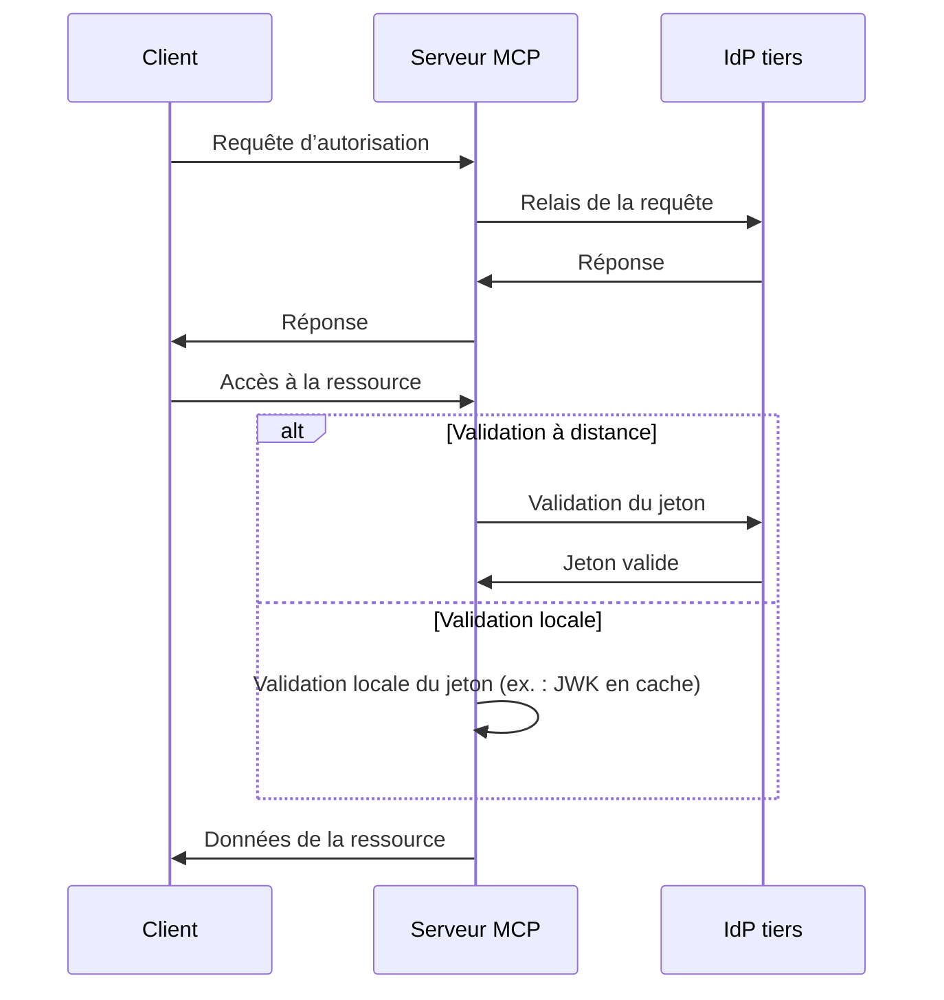
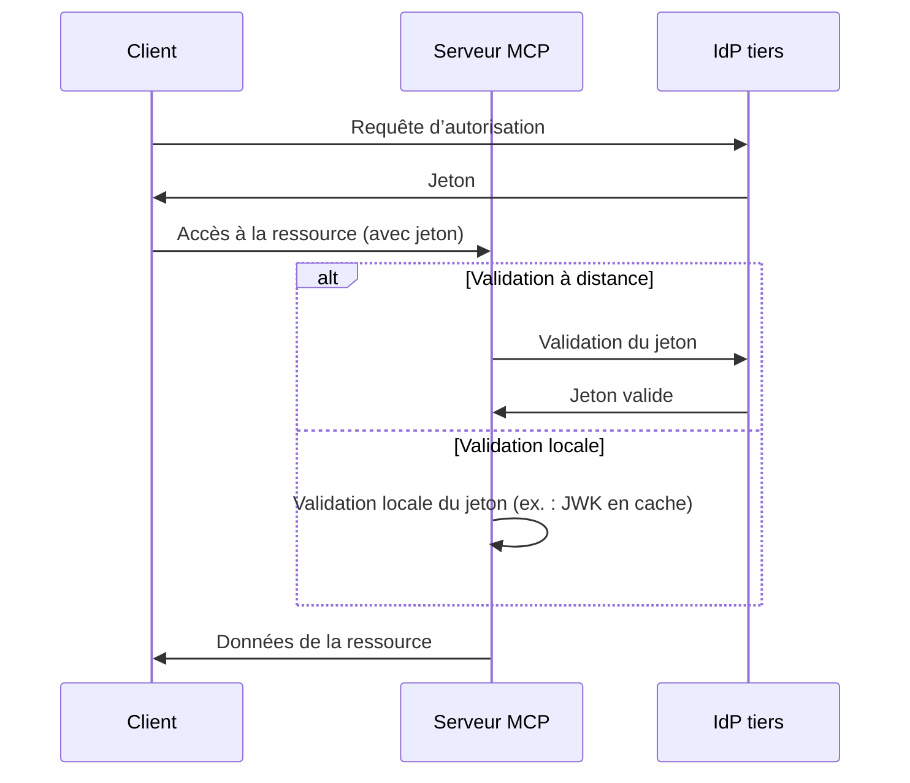

# Choisir entre MCP Auth et d'autres solutions

L'écosystème MCP évolue. À mesure que la spécification Model Context Protocol (MCP) passe de l’approche « serveur d’autorisation » au nouveau modèle « serveur de ressources + IdP tiers », il est important de comprendre comment les différentes solutions d’intégration s’inscrivent, aujourd’hui et à l’avenir.

Cette page présente les principales différences entre mcp-auth et d’autres solutions populaires, afin de vous aider à choisir la meilleure approche pour votre projet.

## Contexte : Approche proxy vs. intégration IdP \{#background-proxy-approach-vs-idp-integration}

La plupart des solutions d’auth MCP existantes utilisent une « approche proxy ». Dans ce modèle, le serveur MCP relaie les requêtes d’autorisation à un fournisseur d’identité (IdP) tiers, agissant ainsi comme un intermédiaire entre le client et l’IdP.

**Approche proxy ([spécification 03-26](https://modelcontextprotocol.io/specification/2025-03-26/basic/authorization))**

Bien que cela fonctionne avec la spécification MCP actuelle (2025-03-26), il s’agit essentiellement d’un contournement. Cela suppose que le serveur MCP agira également comme serveur d’autorisation, ce qui n’est pas la direction de la dernière version du projet de spécification.

**MCP Auth / future spec (serveur de ressources + IdP tiers)**

La prochaine spécification MCP [transfère la responsabilité de l’autorisation à un IdP tiers dédié](https://github.com/modelcontextprotocol/modelcontextprotocol/issues/205). Dans ce modèle, le serveur MCP agit uniquement comme serveur de ressources, et tous les points de terminaison d’autorisation proviennent directement de l’IdP tiers.

## Pourquoi choisir MCP Auth ? \{#why-choose-mcp-auth}

- Alignement sur la spécification : MCP Auth suit directement la direction du dernier projet de spécification, ce qui en fait la seule solution compatible à la fois avec la spécification 03-26 et la future spécification.
- Plus de contournements : Au lieu d’agir comme un proxy de serveur d’autorisation, MCP Auth laisse l’IdP tiers gérer toute l’autorisation, comme prévu dans la nouvelle spécification.
- Indépendant du fournisseur : MCP Auth fonctionne avec tout fournisseur OAuth 2.0 / OIDC conforme aux standards.
- Transition en douceur : MCP Auth retourne tous les points de terminaison tiers tels quels via les métadonnées du serveur d’autorisation OAuth 2.0. Cela simplifie l’intégration aujourd’hui et la prépare aux évolutions futures.
- Expérience développeur : Propose des tutoriels, des utilitaires et des fonctionnalités à venir comme [OAuth 2.0 Protected Resource Metadata](https://auth.wiki/protected-resource-metadata) pour faciliter la vie des développeurs de serveurs MCP.

| Fonctionnalité                      | Solutions proxy      | MCP Auth |
| ----------------------------------- | -------------------- | -------- |
| Fonctionne avec la spécification 03-26 | ✅                   | ✅       |
| Fonctionne avec la future spécification | ❌                   | ✅       |
| Prend en charge les IdP tiers directement | ❌ (contournement uniquement) | ✅       |
| Indépendant du fournisseur          | Limité[^1]           | Oui      |
| Prêt pour la transition             | ❌                   | ✅       |

Si vous devez prendre en charge des IdP tiers dès maintenant et souhaitez être prêt pour la future spécification, MCP Auth est la solution recommandée. Les approches basées sur un proxy pourraient bientôt être dépréciées ou nécessiter une refonte importante.

[^1]: Certaines solutions proxy peuvent coder en dur des paramètres ou points de terminaison spécifiques, limitant ainsi la flexibilité.
