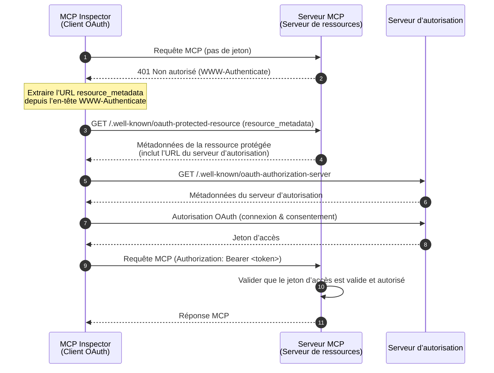
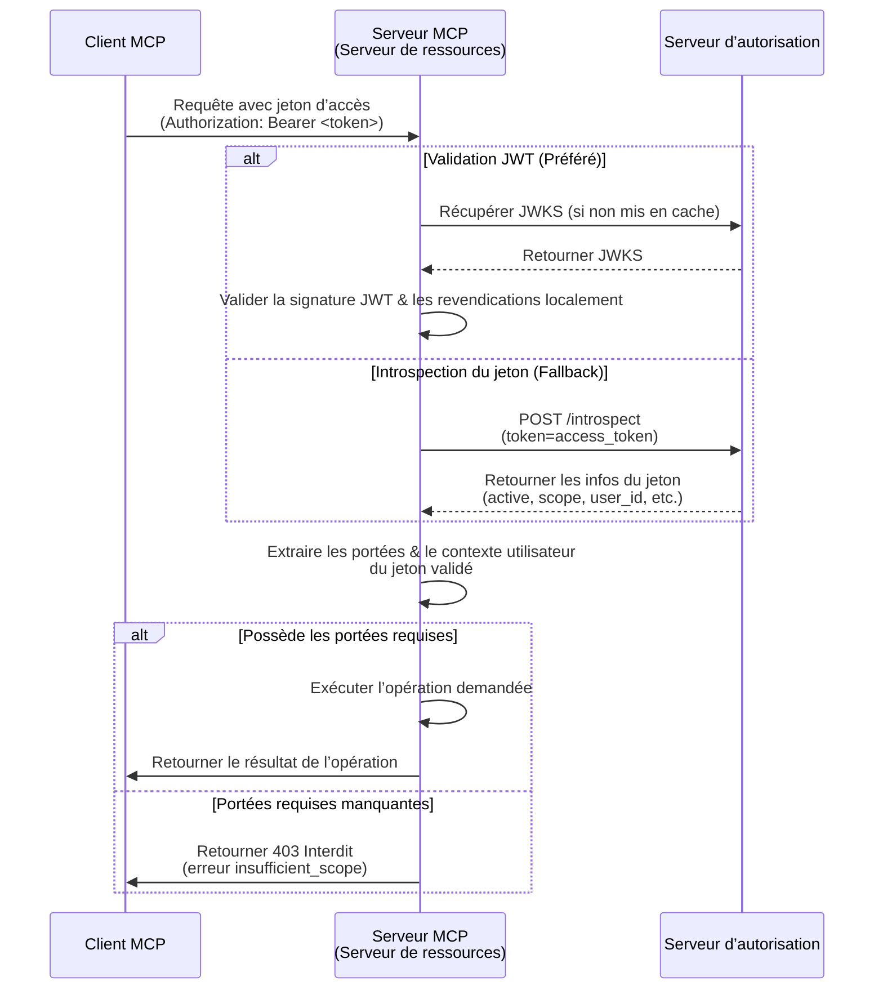

import TabItem from '@theme/TabItem';
import Tabs from '@theme/Tabs';


# Tutoriel : Créer un gestionnaire de tâches

Dans ce tutoriel, nous allons construire un serveur MCP de gestionnaire de tâches avec authentification et autorisation des utilisateurs. En suivant la dernière spécification MCP, notre serveur MCP agira comme un **Serveur de ressources** OAuth 2.0 qui valide les jetons d’accès et applique les permissions basées sur les portées (scopes).

Après avoir terminé ce tutoriel, vous aurez :

- ✅ Une compréhension de base de la configuration du contrôle d’accès basé sur les rôles (RBAC) dans votre serveur MCP.
- ✅ Un serveur MCP qui agit comme un Serveur de ressources, consommant des jetons d’accès émis par un Serveur d’autorisation.
- ✅ Une implémentation fonctionnelle de l’application des permissions basées sur les portées pour les opérations sur les tâches.

## Vue d’ensemble \{#overview}

Le tutoriel impliquera les composants suivants :

- **Client MCP (MCP Inspector)** : Un outil visuel de test pour les serveurs MCP qui agit comme un client OAuth 2.0/OIDC. Il initie le flux d’autorisation avec le serveur d’autorisation et obtient des jetons d’accès pour authentifier les requêtes vers le serveur MCP.
- **Serveur d’autorisation** : Un fournisseur OAuth 2.1 ou OpenID Connect qui gère les identités des utilisateurs, authentifie les utilisateurs et émet des jetons d’accès avec les portées appropriées aux clients autorisés.
- **Serveur MCP (Serveur de ressources)** : Selon la dernière spécification MCP, le serveur MCP agit comme un Serveur de ressources dans le cadre OAuth 2.0. Il valide les jetons d’accès émis par le serveur d’autorisation et applique les permissions basées sur les portées pour les opérations sur les tâches.

Cette architecture suit le flux standard OAuth 2.0 où :
- Le **MCP Inspector** demande des ressources protégées au nom de l’utilisateur
- Le **Serveur d’autorisation** authentifie l’utilisateur et émet des jetons d’accès
- Le **Serveur MCP** valide les jetons et sert les ressources protégées selon les permissions accordées

Voici un schéma de haut niveau de l’interaction entre ces composants :



## Comprendre votre serveur d’autorisation \{#understand-your-authorization-server}

### Jetons d’accès avec portées \{#access-tokens-with-scopes}

Pour mettre en œuvre le [contrôle d’accès basé sur les rôles (RBAC)](https://auth.wiki/rbac) dans votre serveur MCP, votre serveur d’autorisation doit prendre en charge l’émission de jetons d’accès avec des portées. Les portées représentent les permissions accordées à un utilisateur.

<Tabs groupId="provider">
<TabItem value="logto" label="Logto">

[Logto](https://logto.io) propose la prise en charge du RBAC via ses ressources API (conformes à [RFC 8707 : Indicateurs de ressource pour OAuth 2.0](https://datatracker.ietf.org/doc/html/rfc8707)) et ses fonctionnalités de rôles. Voici comment le configurer :

1. Connectez-vous à [Logto Console](https://cloud.logto.io) (ou à votre propre instance Logto Console)

2. Créez une ressource API et des portées :

   - Allez dans "Ressources API"
   - Créez une nouvelle ressource API nommée "Gestionnaire de tâches"
   - Ajoutez les portées suivantes :
     - `create:todos` : "Créer de nouvelles tâches"
     - `read:todos` : "Lire toutes les tâches"
     - `delete:todos` : "Supprimer n’importe quelle tâche"

3. Créez des rôles (recommandé pour une gestion plus facile) :

   - Allez dans "Rôles"
   - Créez un rôle "Admin" et assignez toutes les portées (`create:todos`, `read:todos`, `delete:todos`)
   - Créez un rôle "User" et assignez uniquement la portée `create:todos`

4. Attribuez les permissions :
   - Allez dans "Utilisateurs"
   - Sélectionnez un utilisateur
   - Vous pouvez soit :
     - Attribuer des rôles dans l’onglet "Rôles" (recommandé)
     - Ou attribuer directement des portées dans l’onglet "Permissions"

Les portées seront incluses dans la revendication `scope` du jeton d’accès JWT sous forme de chaîne séparée par des espaces.

</TabItem>
<TabItem value="oauth-oidc" label="OAuth 2.0 / OIDC">

Les fournisseurs OAuth 2.0 / OIDC prennent généralement en charge le contrôle d’accès basé sur les portées. Lors de la mise en œuvre du RBAC :

1. Définissez les portées requises dans votre serveur d’autorisation
2. Configurez votre client pour demander ces portées lors du flux d’autorisation
3. Assurez-vous que votre serveur d’autorisation inclut les portées accordées dans le jeton d’accès
4. Les portées sont généralement incluses dans la revendication `scope` du jeton d’accès JWT

Consultez la documentation de votre fournisseur pour plus de détails sur :

- Comment définir et gérer les portées
- Comment les portées sont incluses dans le jeton d’accès
- Toutes fonctionnalités RBAC supplémentaires comme la gestion des rôles

</TabItem>
</Tabs>

### Validation des jetons et vérification des permissions \{#validating-tokens-and-checking-permissions}

Selon la dernière spécification MCP, le serveur MCP agit comme un **Serveur de ressources** dans le cadre OAuth 2.0. En tant que Serveur de ressources, le serveur MCP a les responsabilités suivantes :

1. **Validation du jeton** : Vérifier l’authenticité et l’intégrité des jetons d’accès reçus des clients MCP
2. **Application des portées** : Extraire et valider les portées du jeton d’accès pour déterminer quelles opérations le client est autorisé à effectuer
3. **Protection des ressources** : Ne servir les ressources protégées (exécuter les outils) que lorsque le client présente des jetons valides avec des permissions suffisantes

Lorsque votre serveur MCP reçoit une requête, il effectue le processus de validation suivant :

1. Extraire le jeton d’accès de l’en-tête `Authorization` (format Bearer token)
2. Valider la signature et l’expiration du jeton d’accès
3. Extraire les portées et les informations utilisateur du jeton validé
4. Vérifier si le jeton possède les portées requises pour l’opération demandée

Par exemple, si un utilisateur souhaite créer une nouvelle tâche, son jeton d’accès doit inclure la portée `create:todos`. Voici comment fonctionne le flux de validation côté Serveur de ressources :



### Enregistrement dynamique de client \{#dynamic-client-registration}

L’enregistrement dynamique de client n’est pas requis pour ce tutoriel, mais il peut être utile si vous souhaitez automatiser le processus d’enregistrement du client MCP auprès de votre serveur d’autorisation. Consultez [L’enregistrement dynamique de client est-il requis ?](/provider-list#is-dcr-required) pour plus de détails.

## Comprendre le RBAC dans le gestionnaire de tâches \{#understand-rbac-in-todo-manager}

À des fins de démonstration, nous allons implémenter un système simple de contrôle d’accès basé sur les rôles (RBAC) dans notre serveur MCP gestionnaire de tâches. Cela vous montrera les principes de base du RBAC tout en gardant l’implémentation simple.

:::note
Bien que ce tutoriel démontre la gestion des portées basée sur le RBAC, il est important de noter que tous les fournisseurs d’authentification n’implémentent pas la gestion des portées via les rôles. Certains fournisseurs peuvent avoir leurs propres mécanismes uniques pour gérer le contrôle d’accès et les permissions.
:::

### Outils et portées \{#tools-and-scopes}

Notre serveur MCP gestionnaire de tâches fournit trois outils principaux :

- `create-todo` : Créer une nouvelle tâche
- `get-todos` : Lister toutes les tâches
- `delete-todo` : Supprimer une tâche par ID

Pour contrôler l’accès à ces outils, nous définissons les portées suivantes :

- `create:todos` : Autorise la création de nouvelles tâches
- `delete:todos` : Autorise la suppression de tâches existantes
- `read:todos` : Autorise la consultation et la récupération de la liste de toutes les tâches

### Rôles et permissions \{#roles-and-permissions}

Nous définirons deux rôles avec différents niveaux d’accès :

| Rôle  | create:todos | read:todos | delete:todos |
| ----- | ------------ | ---------- | ------------ |
| Admin | ✅           | ✅         | ✅           |
| User  | ✅           |            |              |

- **User** : Un utilisateur standard qui peut créer des tâches et voir ou supprimer uniquement ses propres tâches
- **Admin** : Un administrateur qui peut créer, voir et supprimer toutes les tâches, quel que soit le propriétaire

### Propriété des ressources \{#resource-ownership}

Bien que le tableau des permissions ci-dessus montre les portées explicites attribuées à chaque rôle, il y a un principe important de propriété des ressources à considérer :

- **Les utilisateurs** n’ont pas les portées `read:todos` ou `delete:todos`, mais ils peuvent quand même :
  - Lire leurs propres tâches
  - Supprimer leurs propres tâches
- **Les admins** ont toutes les permissions (`read:todos` et `delete:todos`), ce qui leur permet de :
  - Voir toutes les tâches du système
  - Supprimer n’importe quelle tâche, quel que soit le propriétaire

Cela illustre un schéma courant dans les systèmes RBAC où la propriété d’une ressource accorde des permissions implicites aux utilisateurs pour leurs propres ressources, tandis que les rôles administratifs reçoivent des permissions explicites pour toutes les ressources.

:::tip En savoir plus
Pour approfondir les concepts et bonnes pratiques du RBAC, consultez [Maîtriser le RBAC : Un exemple complet et réel](https://blog.logto.io/mastering-rbac).
:::

## Configurer l’autorisation dans votre fournisseur \{#configure-authorization-in-your-provider}

Pour mettre en œuvre le système de contrôle d’accès décrit précédemment, vous devrez configurer votre serveur d’autorisation pour prendre en charge les portées requises. Voici comment faire avec différents fournisseurs :

<Tabs groupId="provider">
<TabItem value="logto" label="Logto">

[Logto](https://logto.io) propose la prise en charge du RBAC via ses ressources API et ses fonctionnalités de rôles. Voici comment le configurer :

1. Connectez-vous à [Logto Console](https://cloud.logto.io) (ou à votre propre instance Logto Console)

2. Créez une ressource API et des portées :

   - Allez dans "Ressources API"
   - Créez une nouvelle ressource API nommée "Gestionnaire de tâches" et utilisez `http://localhost:3001` comme indicateur de ressource.
     - **Important** : L’indicateur de ressource doit correspondre à l’URL de votre serveur MCP. Pour ce tutoriel, nous utilisons `http://localhost:3001` puisque notre serveur MCP fonctionne sur le port 3001. En production, utilisez l’URL réelle de votre serveur MCP (par exemple, `https://votre-mcp-server.example.com`).
   - Créez les portées suivantes :
     - `create:todos` : "Créer de nouvelles tâches"
     - `read:todos` : "Lire toutes les tâches"
     - `delete:todos` : "Supprimer n’importe quelle tâche"

3. Créez des rôles (recommandé pour une gestion plus facile) :

   - Allez dans "Rôles"
   - Créez un rôle "Admin" et assignez toutes les portées (`create:todos`, `read:todos`, `delete:todos`)
   - Créez un rôle "User" et assignez uniquement la portée `create:todos`
   - Dans la page de détails du rôle "User", passez à l’onglet "Général" et définissez le rôle "User" comme "Rôle par défaut".

4. Gérez les rôles et permissions des utilisateurs :
   - Pour les nouveaux utilisateurs :
     - Ils recevront automatiquement le rôle "User" puisque nous l’avons défini comme rôle par défaut
   - Pour les utilisateurs existants :
     - Allez dans "Gestion des utilisateurs"
     - Sélectionnez un utilisateur
     - Attribuez des rôles à l’utilisateur dans l’onglet "Rôles"

:::tip Gestion programmatique des rôles
Vous pouvez également utiliser la [Management API](https://docs.logto.io/integrate-logto/interact-with-management-api) de Logto pour gérer les rôles des utilisateurs de manière programmatique. Ceci est particulièrement utile pour la gestion automatisée des utilisateurs ou lors de la création de panneaux d’administration.
:::

Lors de la demande d’un jeton d’accès, Logto inclura les portées dans la revendication `scope` du jeton en fonction des permissions de rôle de l’utilisateur.

</TabItem>
<TabItem value="oauth-or-oidc" label="OAuth 2 / OIDC">

Pour les fournisseurs OAuth 2.0 ou OpenID Connect, vous devrez configurer les portées qui représentent différentes permissions. Les étapes exactes dépendront de votre fournisseur, mais généralement :

1. Définissez les portées :

   - Configurez votre serveur d’autorisation pour prendre en charge :
     - `create:todos`
     - `read:todos`
     - `delete:todos`

2. Configurez le client :

   - Enregistrez ou mettez à jour votre client pour demander ces portées
   - Assurez-vous que les portées sont incluses dans le jeton d’accès

3. Attribuez les permissions :
   - Utilisez l’interface de votre fournisseur pour accorder les portées appropriées aux utilisateurs
   - Certains fournisseurs peuvent prendre en charge la gestion basée sur les rôles, tandis que d’autres utilisent des attributions directes de portées
   - Consultez la documentation de votre fournisseur pour l’approche recommandée

:::tip
La plupart des fournisseurs incluront les portées accordées dans la revendication `scope` du jeton d’accès. Le format est généralement une chaîne de valeurs de portées séparées par des espaces.
:::

</TabItem>
</Tabs>

Après avoir configuré votre serveur d’autorisation, les utilisateurs recevront des jetons d’accès contenant leurs portées accordées. Le serveur MCP utilisera ces portées pour déterminer :

- Si un utilisateur peut créer de nouvelles tâches (`create:todos`)
- Si un utilisateur peut voir toutes les tâches (`read:todos`) ou seulement les siennes
- Si un utilisateur peut supprimer n’importe quelle tâche (`delete:todos`) ou seulement les siennes

## Mettre en place le serveur MCP \{#set-up-the-mcp-server}

Nous allons utiliser les [SDKs officiels MCP](https://github.com/modelcontextprotocol) pour créer notre serveur MCP gestionnaire de tâches.

### Créer un nouveau projet \{#create-a-new-project}

<Tabs groupId="sdk">
<TabItem value="python" label="Python">

Créez un nouveau projet Python :

```bash
mkdir mcp-todo-server
cd mcp-todo-server

# Initialiser un nouveau projet Python
uv init

# Créer un nouvel environnement virtuel avec uv
uv venv

# Activer l’environnement virtuel (optionnel avec 'uv run')
source .venv/bin/activate
```

:::note
Ce projet utilise `uv` pour la gestion des paquets, mais vous pouvez utiliser d’autres gestionnaires comme `pip`, `poetry` ou `conda` si vous préférez.
:::

</TabItem>
<TabItem value="node" label="Node.js">

Créez un nouveau projet Node.js :

```bash
mkdir mcp-server
cd mcp-server
npm init -y # Ou utilisez `pnpm init`
npm pkg set type="module"
npm pkg set main="todo-manager.ts"
npm pkg set scripts.start="node --experimental-strip-types todo-manager.ts"
```

:::note
Nous utilisons TypeScript dans nos exemples car Node.js v22.6.0+ prend en charge l’exécution native de TypeScript avec l’option `--experimental-strip-types`. Si vous utilisez JavaScript, le code sera similaire - assurez-vous simplement d’utiliser Node.js v22.6.0 ou ultérieur. Voir la documentation Node.js pour plus de détails.
:::

</TabItem>
</Tabs>

### Installer le SDK MCP et les dépendances \{#install-the-mcp-sdk-and-dependencies}

<Tabs groupId="sdk">
<TabItem value="python" label="Python">

Installez les dépendances requises :

```bash
uv add "mcp[cli]" uvicorn starlette
```

</TabItem>
<TabItem value="node" label="Node.js">

```bash
npm install @modelcontextprotocol/sdk express zod
```

Ou tout autre gestionnaire de paquets que vous préférez, comme `pnpm` ou `yarn`.

</TabItem>
</Tabs>

### Créer le serveur MCP \{#create-the-mcp-server}

Commençons par créer un serveur MCP de base avec la définition des outils :

<Tabs groupId="sdk">
<TabItem value="python" label="Python">

Créez un fichier nommé `server.py` et ajoutez le code suivant :

```python
# server.py

import contextlib
from typing import Any
from mcp.server.fastmcp import FastMCP
from starlette.applications import Starlette
from starlette.routing import Mount

# Initialiser le serveur FastMCP
mcp = FastMCP(name="Gestionnaire de tâches", stateless_http=True, streamable_http_path='/')

@mcp.tool()
def create_todo(content: str) -> dict[str, Any]:
    """Créer une nouvelle tâche. Nécessite la portée 'create:todos'."""
    return {"error": "Not implemented"}

@mcp.tool()
def get_todos() -> dict[str, Any]:
    """Lister les tâches. Les utilisateurs avec la portée 'read:todos' peuvent voir toutes les tâches."""
    return {"error": "Not implemented"}

@mcp.tool()
def delete_todo(id: str) -> dict[str, Any]:
    """Supprimer une tâche par id. Les utilisateurs peuvent supprimer leurs propres tâches."""
    return {"error": "Not implemented"}

@contextlib.asynccontextmanager
async def lifespan(app: Starlette):
    async with contextlib.AsyncExitStack() as stack:
        await stack.enter_async_context(mcp.session_manager.run())
        yield

# Créer l’application
app = Starlette(
    routes=[
        Mount("/", app=mcp.streamable_http_app()),
    ],
    lifespan=lifespan,
)
```

Lancez le serveur avec :

```bash
# Démarrer le serveur Gestionnaire de tâches avec uvicorn
uvicorn server:app --host 127.0.0.1 --port 3001

# Ou avec uv :
# uv run uvicorn server:app --host 127.0.0.1 --port 3001
```

</TabItem>
<TabItem value="node" label="Node.js">

Créez un fichier nommé `todo-manager.ts` et ajoutez le code suivant :

```ts
// todo-manager.ts

import { z } from 'zod';
import { McpServer } from '@modelcontextprotocol/sdk/server/mcp.js';
import { StreamableHTTPServerTransport } from '@modelcontextprotocol/sdk/server/streamableHttp.js';
import express, { type Request, type Response } from 'express';

// Créer un serveur MCP
const server = new McpServer({
  name: 'Gestionnaire de tâches',
  version: '0.0.0',
});

server.tool('create-todo', 'Créer une nouvelle tâche', { content: z.string() }, async ({ content }) => {
  return {
    content: [{ type: 'text', text: JSON.stringify({ error: 'Not implemented' }) }],
  };
});

server.tool('get-todos', 'Lister toutes les tâches', async () => {
  return {
    content: [{ type: 'text', text: JSON.stringify({ error: 'Not implemented' }) }],
  };
});

server.tool('delete-todo', 'Supprimer une tâche par id', { id: z.string() }, async ({ id }) => {
  return {
    content: [{ type: 'text', text: JSON.stringify({ error: 'Not implemented' }) }],
  };
});

// Ci-dessous le code standard issu de la documentation du SDK MCP
const PORT = 3001;
const app = express();

app.post('/', async (request: Request, response: Response) => {
  // En mode stateless, créez une nouvelle instance de transport et de serveur pour chaque requête
  // afin d’assurer une isolation complète. Une seule instance provoquerait des collisions d’ID de requête
  // lorsque plusieurs clients se connectent simultanément.

  try {
    const transport: StreamableHTTPServerTransport = new StreamableHTTPServerTransport({
      sessionIdGenerator: undefined,
    });
    response.on('close', async () => {
      console.log('Request closed');
      await transport.close();
      await server.close();
    });
    await server.connect(transport);
    await transport.handleRequest(request, response, request.body);
  } catch (error) {
    console.error('Error handling MCP request:', error);
    if (!response.headersSent) {
      response.status(500).json({
        jsonrpc: '2.0',
        error: {
          code: -32_603,
          message: 'Internal server error',
        },
        id: null,
      });
    }
  }
});

// Les notifications SSE ne sont pas prises en charge en mode stateless
app.get('/', async (request: Request, response: Response) => {
  console.log('Received GET MCP request');
  response.writeHead(405).end(
    JSON.stringify({
      jsonrpc: '2.0',
      error: {
        code: -32_000,
        message: 'Method not allowed.',
      },
      id: null,
    })
  );
});

// La terminaison de session n’est pas nécessaire en mode stateless
app.delete('/', async (request: Request, response: Response) => {
  console.log('Received DELETE MCP request');
  response.writeHead(405).end(
    JSON.stringify({
      jsonrpc: '2.0',
      error: {
        code: -32_000,
        message: 'Method not allowed.',
      },
      id: null,
    })
  );
});

app.listen(PORT);
```

Lancez le serveur avec :

```bash
npm start
```

</TabItem>
</Tabs>

## Inspecter le serveur MCP \{#inspect-the-mcp-server}

### Cloner et lancer MCP inspector \{#clone-and-run-mcp-inspector}

Maintenant que nous avons le serveur MCP en fonctionnement, nous pouvons utiliser le MCP inspector pour vérifier si les outils sont disponibles.

La version officielle MCP inspector v0.16.2 présente certains bugs qui affectent la fonctionnalité d’authentification. Pour résoudre ces problèmes, nous avons créé une [version corrigée du MCP inspector](https://github.com/mcp-auth/inspector/tree/patch/0.16.2-fixes) qui inclut les correctifs nécessaires pour les flux d’authentification OAuth/OIDC. Nous avons également soumis des pull requests au dépôt officiel pour contribuer ces correctifs en amont.

Pour lancer le MCP inspector, utilisez la commande suivante (Node.js requis) :

```bash
git clone https://github.com/mcp-auth/inspector.git -b patch/0.16.2-fixes
cd inspector
npm install
npm run dev
```

Le MCP inspector s’ouvrira automatiquement dans votre navigateur par défaut, ou vous pouvez y accéder manuellement en cliquant sur le lien affiché dans le terminal (assurez-vous de cliquer sur le lien qui inclut le paramètre `MCP_PROXY_AUTH_TOKEN`, tel que `http://localhost:6274/?MCP_PROXY_AUTH_TOKEN=458ae4a4...acab1907`).

### Connecter MCP inspector au serveur MCP \{#connect-mcp-inspector-to-the-mcp-server}

Avant de continuer, vérifiez la configuration suivante dans MCP inspector :

- **Type de transport** : Définir sur `Streamable HTTP`.
- **URL** : Définir sur l’URL de votre serveur MCP. Dans notre cas, il s’agit de `http://localhost:3001`.

Vous pouvez maintenant cliquer sur le bouton "Connect" pour voir si le MCP inspector peut se connecter au serveur MCP. Si tout est correct, vous devriez voir le statut "Connected" dans le MCP inspector.

### Point de contrôle : Exécuter les outils du gestionnaire de tâches \{#checkpoint-run-todo-manager-tools}

1. Dans le menu supérieur du MCP inspector, cliquez sur l’onglet "Tools".
2. Cliquez sur le bouton "List Tools".
3. Vous devriez voir les outils `create-todo`, `get-todos` et `delete-todo` listés sur la page. Cliquez dessus pour ouvrir les détails de l’outil.
4. Vous devriez voir le bouton "Run Tool" sur la droite. Cliquez dessus et saisissez les paramètres requis pour exécuter l’outil.
5. Vous devriez voir le résultat de l’outil avec la réponse JSON `{"error": "Not implemented"}`.


## Intégrer avec votre serveur d’autorisation \{#integrate-with-your-authorization-server}

Pour compléter cette section, plusieurs points sont à prendre en compte :

<details>
<summary>**L’URL de l’émetteur de votre serveur d’autorisation**</summary>

Il s’agit généralement de l’URL de base de votre serveur d’autorisation, comme `https://auth.example.com`. Certains fournisseurs peuvent avoir un chemin comme `https://example.logto.app/oidc`, alors vérifiez la documentation de votre fournisseur.

</details>

<details>
<summary>**Comment récupérer les métadonnées du serveur d’autorisation**</summary>

- Si votre serveur d’autorisation est conforme à [OAuth 2.0 Authorization Server Metadata](https://datatracker.ietf.org/doc/html/rfc8414) ou [OpenID Connect Discovery](https://openid.net/specs/openid-connect-discovery-1_0.html), vous pouvez utiliser les utilitaires intégrés de MCP Auth pour récupérer automatiquement les métadonnées.
- Si votre serveur d’autorisation n’est pas conforme à ces standards, vous devrez spécifier manuellement l’URL des métadonnées ou les points de terminaison dans la configuration du serveur MCP. Consultez la documentation de votre fournisseur pour les points de terminaison spécifiques.

</details>

<details>
<summary>**Comment enregistrer le MCP inspector comme client dans votre serveur d’autorisation**</summary>

- Si votre serveur d’autorisation prend en charge [l’enregistrement dynamique de client](https://datatracker.ietf.org/doc/html/rfc7591), vous pouvez passer cette étape car le MCP inspector s’enregistrera automatiquement comme client.
- Si votre serveur d’autorisation ne prend pas en charge l’enregistrement dynamique de client, vous devrez enregistrer manuellement le MCP inspector comme client dans votre serveur d’autorisation.

</details>

<details>
<summary>**Comprendre les paramètres de la requête de jeton**</summary>

Lorsque vous demandez des jetons d’accès à différents serveurs d’autorisation, vous rencontrerez diverses approches pour spécifier la ressource cible et les permissions. Voici les principaux schémas :

- **Basé sur l’indicateur de ressource** :

  - Utilise le paramètre `resource` pour spécifier l’API cible (voir [RFC 8707 : Indicateurs de ressource pour OAuth 2.0](https://datatracker.ietf.org/doc/html/rfc8707))
  - Courant dans les implémentations OAuth 2.0 modernes
  - Exemple de requête :
    ```json
    {
      "resource": "http://localhost:3001",
      "scope": "create:todos read:todos"
    }
    ```
  - Le serveur émet des jetons liés spécifiquement à la ressource demandée

- **Basé sur l’audience** :

  - Utilise le paramètre `audience` pour spécifier le destinataire prévu du jeton
  - Semblable aux indicateurs de ressource mais avec des sémantiques différentes
  - Exemple de requête :
    ```json
    {
      "audience": "todo-api",
      "scope": "create:todos read:todos"
    }
    ```

- **Basé uniquement sur les portées** :
  - S’appuie uniquement sur les portées sans paramètres de ressource/audience
  - Approche OAuth 2.0 traditionnelle
  - Exemple de requête :
    ```json
    {
      "scope": "todo-api:create todo-api:read openid profile"
    }
    ```
  - Utilise souvent des portées préfixées pour nommer les permissions
  - Courant dans les implémentations OAuth 2.0 plus simples

:::tip Bonnes pratiques

- Consultez la documentation de votre fournisseur pour les paramètres pris en charge
- Certains fournisseurs prennent en charge plusieurs approches simultanément
- Les indicateurs de ressource offrent une meilleure sécurité via la restriction d’audience
- Envisagez d’utiliser les indicateurs de ressource lorsque c’est possible pour un meilleur contrôle d’accès
  :::

</details>

Bien que chaque fournisseur puisse avoir ses propres exigences spécifiques, les étapes suivantes vous guideront dans l’intégration du MCP inspector et du serveur MCP avec des configurations spécifiques au fournisseur.

### Enregistrer MCP inspector comme client \{#register-mcp-inspector-as-a-client}

<Tabs groupId="provider">
<TabItem value="logto" label="Logto">

L’intégration du gestionnaire de tâches avec [Logto](https://logto.io) est simple car il s’agit d’un fournisseur OpenID Connect qui prend en charge les indicateurs de ressource et les portées, ce qui vous permet de sécuriser votre API de tâches avec `http://localhost:3001` comme indicateur de ressource.

Comme Logto ne prend pas encore en charge l’enregistrement dynamique de client, vous devrez enregistrer manuellement le MCP inspector comme client dans votre tenant Logto :

1. Ouvrez votre MCP inspector, allez dans la configuration Authentification et cliquez sur la configuration "OAuth2.0 Flow". Copiez la valeur **Redirect URI**, qui devrait ressembler à `http://localhost:6274/oauth/callback`.
2. Connectez-vous à [Logto Console](https://cloud.logto.io) (ou à votre propre instance Logto Console).
3. Naviguez vers l’onglet "Applications", cliquez sur "Créer une application". En bas de la page, cliquez sur "Créer une application sans framework".
4. Remplissez les détails de l’application, puis cliquez sur "Créer une application" :
   - **Sélectionnez un type d’application** : Choisissez "Application monopage".
   - **Nom de l’application** : Saisissez un nom pour votre application, par exemple "MCP Inspector".
5. Dans la section "Paramètres / URI de redirection", collez la valeur **Redirect URI** copiée depuis le MCP inspector. Cliquez ensuite sur "Enregistrer les modifications" dans la barre inférieure.
6. Dans la carte supérieure, vous verrez la valeur "App ID". Copiez-la.
7. Retournez dans le MCP inspector et collez la valeur "App ID" dans la configuration Authentification sous "OAuth2.0 Flow" dans le champ "Client ID".
8. Dans le champ "Scope", saisissez : `create:todos read:todos delete:todos`. Cela garantira que le jeton d’accès retourné par Logto contient les portées nécessaires pour accéder au gestionnaire de tâches.

</TabItem>
<TabItem value="oauth-oidc" label="OAuth 2.0 / OIDC">

:::note
Ceci est un guide générique d’intégration pour les fournisseurs OAuth 2.0 / OpenID Connect. Les deux suivent des étapes similaires car OIDC est construit sur OAuth 2.0. Consultez la documentation de votre fournisseur pour les détails spécifiques.
:::

Si votre fournisseur prend en charge l’enregistrement dynamique de client, vous pouvez passer directement à l’étape 8 ci-dessous pour configurer le MCP inspector ; sinon, vous devrez enregistrer manuellement le MCP inspector comme client :

1. Ouvrez votre MCP inspector, allez dans la configuration Authentification et cliquez sur la configuration "OAuth2.0 Flow". Copiez la valeur **Redirect URI**, qui devrait ressembler à `http://localhost:6274/oauth/callback`.

2. Connectez-vous à la console de votre fournisseur.

3. Naviguez vers la section "Applications" ou "Clients", puis créez une nouvelle application ou client.

4. Si votre fournisseur demande un type de client, sélectionnez "Application monopage" ou "Client public".

5. Après avoir créé l’application, vous devrez configurer l’URI de redirection. Collez la valeur **Redirect URI** copiée depuis le MCP inspector.

6. Trouvez le "Client ID" ou "Application ID" de la nouvelle application et copiez-le.

7. Retournez dans le MCP inspector et collez la valeur "Client ID" dans la configuration Authentification sous "OAuth2.0 Flow" dans le champ "Client ID".

8. Dans le champ "Scope", saisissez les portées suivantes pour demander les permissions nécessaires aux opérations sur les tâches :

```text
create:todos read:todos delete:todos
```

</TabItem>
</Tabs>

### Configurer MCP Auth \{#set-up-mcp-auth}

Commencez par installer le SDK MCP Auth dans votre projet serveur MCP.

<Tabs groupId="sdk">
<TabItem value="python" label="Python">

```bash
uv add mcpauth==0.2.0b1
```

</TabItem>
<TabItem value="node" label="Node.js">

```bash
npm install mcp-auth@0.2.0-beta.1
```

</TabItem>
</Tabs>

Nous devons maintenant initialiser MCP Auth dans votre serveur MCP. Cela implique deux étapes principales :

1. **Récupération des métadonnées du serveur d’autorisation** : Utilisé pour la vérification ultérieure par MCP Auth des jetons d’accès émis par le Serveur d’autorisation, et pour inclure l’identifiant de l’émetteur du serveur d’auth dans les métadonnées de ressource
2. **Configurer les métadonnées de la ressource protégée** : Définir l’identifiant de ressource de votre serveur MCP et les portées prises en charge

#### Étape 1 : Récupérer les métadonnées du serveur d’autorisation \{#step-1-fetch-authorization-server-metadata\}

Selon la spécification OAuth / OIDC, nous pouvons récupérer les métadonnées du serveur d’autorisation à partir de l’URL de l’émetteur du serveur d’autorisation.

<Tabs groupId="provider">

<TabItem value="logto" label="Logto">

Dans Logto, vous pouvez trouver l’URL de l’émetteur sur la page de détails de votre application dans Logto Console, sous la section "Endpoints & Credentials / Issuer endpoint". Elle devrait ressembler à `https://my-project.logto.app/oidc`.

</TabItem>

<TabItem value="oauth-oidc" label="OAuth 2.0 / OIDC">

Pour les fournisseurs OAuth 2.0, vous devrez :

1. Vérifier la documentation de votre fournisseur pour l’URL du serveur d’autorisation (souvent appelée URL de l’émetteur ou URL de base)
2. Certains fournisseurs l’exposent à `https://{votre-domaine}/.well-known/oauth-authorization-server`
3. Chercher dans la console d’administration de votre fournisseur sous les paramètres OAuth/API

</TabItem>

</Tabs>

Maintenant, récupérez les métadonnées du serveur d’autorisation à l’aide de la fonction utilitaire MCP Auth pour obtenir la configuration du serveur :

<Tabs groupId="sdk">

<TabItem value="python" label="Python">
```python
from mcpauth import MCPAuth
from mcpauth.config import AuthServerType
from mcpauth.utils import fetch_server_config

issuer_url = "<issuer-url>"  # Remplacez par l’URL de l’émetteur de votre serveur d’autorisation

# Récupérer la configuration du serveur d’autorisation
auth_server_config = fetch_server_config(issuer_url, AuthServerType.OIDC) # ou AuthServerType.OAUTH
```

</TabItem>
<TabItem value="node" label="Node.js">
```js
import { MCPAuth, fetchServerConfig } from 'mcp-auth';

const issuerUrl = '<issuer-url>'; // Remplacez par l’URL de l’émetteur de votre serveur d’autorisation

// Récupérer la configuration du serveur d’autorisation (OIDC Discovery)
const authServerConfig = await fetchServerConfig(issuerUrl, { type: 'oidc' }); // ou { type: 'oauth' }
```

</TabItem>
</Tabs>

Si vous souhaitez d’autres moyens de récupérer les métadonnées du serveur d’autorisation ou personnaliser la configuration, veuillez consulter [d’autres façons de configurer les métadonnées du serveur d’autorisation](/docs/configure-server/mcp-auth#other-ways).

#### Étape 2 : Configurer les métadonnées de la ressource protégée \{#step-2-configure-protected-resource-metadata}

Ensuite, nous allons configurer les métadonnées de la ressource protégée lors de la création de l’instance MCP Auth. Par la suite, le serveur MCP exposera les métadonnées de ressource configurées dans MCP Auth.

<Tabs groupId="sdk">

<TabItem value="python" label="Python">
```python
# server.py

# autres imports...
from mcpauth.types import ResourceServerConfig, ResourceServerMetadata

# Définir l’identifiant de ressource pour ce serveur MCP
resource_id = "http://localhost:3001"

mcp_auth = MCPAuth(
    protected_resources=ResourceServerConfig(
        metadata=ResourceServerMetadata(
            resource=resource_id,
            # Métadonnées du serveur d’autorisation récupérées à l’étape précédente
            authorization_servers=[auth_server_config],
            # Portées prises en charge par ce serveur MCP
            scopes_supported=[
                "create:todos",
                "read:todos",
                "delete:todos"
            ]
        )
    )
)
```
</TabItem>

<TabItem value="node" label="Node.js">
```js
// todo-manager.ts

// Définir l’identifiant de ressource pour ce serveur MCP
const resourceId = 'http://localhost:3001';

// Configurer MCP Auth avec les métadonnées de la ressource protégée
const mcpAuth = new MCPAuth({
  protectedResources: {
    metadata: {
      resource: resourceId,
      // Métadonnées du serveur d’autorisation récupérées à l’étape précédente
      authorizationServers: [authServerConfig],
      // Portées prises en charge par ce serveur MCP
      scopesSupported: [
        "create:todos",
        "read:todos",
        "delete:todos"
      ]
    }
  }
});
```
</TabItem>

</Tabs>

### Mettre à jour le serveur MCP \{#update-mcp-server}

Nous y sommes presque ! Il est temps de mettre à jour le serveur MCP pour appliquer la route et la fonction middleware MCP Auth, puis d’implémenter le contrôle d’accès basé sur les permissions pour les outils du gestionnaire de tâches selon les portées de l’utilisateur.

Appliquez maintenant les routes de métadonnées de ressource protégée afin que les clients MCP puissent récupérer les métadonnées attendues depuis le serveur MCP.

<Tabs groupId="sdk">
<TabItem value="python" label="Python">
```python
# server.py

# ..autres codes

app = Starlette(
    routes=[
        # Mettre en place les routes de métadonnées de ressource protégée
        # Cela expose les métadonnées de ce serveur de ressources pour les clients OAuth
        *mcp_auth.resource_metadata_router().routes,
        Mount("/", app=mcp.streamable_http_app()),
    ],
    lifespan=lifespan,
)
```
</TabItem>
<TabItem value="node" label="Node.js">

```ts
// todo-manager.ts

// Mettre en place les routes de métadonnées de ressource protégée
// Cela expose les métadonnées de ce serveur de ressources pour les clients OAuth
app.use(mcpAuth.protectedResourceMetadataRouter());

```
</TabItem>
</Tabs>

Ensuite, nous allons appliquer le middleware MCP Auth au serveur MCP. Ce middleware gérera l’authentification et l’autorisation des requêtes entrantes, garantissant que seuls les utilisateurs autorisés peuvent accéder aux outils du gestionnaire de tâches.

<Tabs groupId="sdk">
<TabItem value="python" label="Python">
```python
# server.py

# autres imports...
from starlette.middleware import Middleware

# autres codes...

# Créer le middleware
bearer_auth = Middleware(mcp_auth.bearer_auth_middleware('jwt', resource=resource_id, audience=resource_id))

app = Starlette(
    routes=[
        *mcp_auth.resource_metadata_router().routes,
        # Appliquer le middleware MCP Auth
        Mount("/", app=mcp.streamable_http_app(), middleware=[bearer_auth]),
    ],
    lifespan=lifespan,
)
```
</TabItem>
<TabItem value="node" label="Node.js">

```ts
// todo-manager.ts

app.use(mcpAuth.protectedResourceMetadataRouter());

// Appliquer le middleware MCP Auth
app.use(
  mcpAuth.bearerAuth('jwt', {
    resource: resourceId,
    audience: resourceId,
  })
);
```
</TabItem>
</Tabs>

À ce stade, nous pouvons mettre à jour les outils du gestionnaire de tâches pour exploiter le middleware MCP Auth pour l’authentification et l’autorisation.

Mettons à jour l’implémentation des outils.

<Tabs groupId="sdk">
<TabItem value="python" label="Python">
```python
# server.py

# autres imports...

from typing import Any, List, Optional
from mcpauth.exceptions import MCPAuthBearerAuthException, BearerAuthExceptionCode
from mcpauth.types import AuthInfo, ResourceServerConfig, ResourceServerMetadata

# Nous en parlerons dans la section suivante
from service import TodoService

def assert_user_id(auth_info: Optional[AuthInfo]) -> str:
    """Vérifie que auth_info contient un ID utilisateur valide et le retourne."""
    if not auth_info or not auth_info.subject:
        raise Exception("Invalid auth info")
    return auth_info.subject

def has_required_scopes(user_scopes: List[str], required_scopes: List[str]) -> bool:
    """Vérifie si l’utilisateur possède toutes les portées requises."""
    return all(scope in user_scopes for scope in required_scopes)

# Créer l’instance TodoService
todo_service = TodoService()

@mcp.tool()
def create_todo(content: str) -> dict[str, Any]:
    """Créer une nouvelle tâche. Nécessite la portée 'create:todos'."""
    auth_info = mcp_auth.auth_info
    user_id = assert_user_id(auth_info)
    
    # Seuls les utilisateurs avec la portée 'create:todos' peuvent créer des tâches
    user_scopes = auth_info.scopes if auth_info else []
    if not has_required_scopes(user_scopes, ["create:todos"]):
        raise MCPAuthBearerAuthException(BearerAuthExceptionCode.MISSING_REQUIRED_SCOPES)
    
    created_todo = todo_service.create_todo(content=content, owner_id=user_id)
    return created_todo

@mcp.tool()
def get_todos() -> dict[str, Any]:
    """
    Lister les tâches. Les utilisateurs avec la portée 'read:todos' peuvent voir toutes les tâches,
    sinon ils ne voient que leurs propres tâches.
    """
    auth_info = mcp_auth.auth_info
    user_id = assert_user_id(auth_info)
    
    # Si l’utilisateur a la portée 'read:todos', il peut accéder à toutes les tâches
    # Sinon, il ne peut accéder qu’à ses propres tâches
    user_scopes = auth_info.scopes if auth_info else []
    todo_owner_id = None if has_required_scopes(user_scopes, ["read:todos"]) else user_id
    
    todos = todo_service.get_all_todos(todo_owner_id)
    return {"todos": todos}

@mcp.tool()
def delete_todo(id: str) -> dict[str, Any]:
    """
    Supprimer une tâche par id. Les utilisateurs peuvent supprimer leurs propres tâches.
    Les utilisateurs avec la portée 'delete:todos' peuvent supprimer n’importe quelle tâche.
    """
    auth_info = mcp_auth.auth_info
    user_id = assert_user_id(auth_info)
    
    todo = todo_service.get_todo_by_id(id)
    
    if not todo:
        return {"error": "Failed to delete todo"}
    
    # Les utilisateurs ne peuvent supprimer que leurs propres tâches
    # Les utilisateurs avec la portée 'delete:todos' peuvent supprimer n’importe quelle tâche
    user_scopes = auth_info.scopes if auth_info else []
    if todo.owner_id != user_id and not has_required_scopes(user_scopes, ["delete:todos"]):
        return {"error": "Failed to delete todo"}
    
    deleted_todo = todo_service.delete_todo(id)
    
    if deleted_todo:
        return {
            "message": f"Todo {id} deleted",
            "details": deleted_todo
        }
    else:
        return {"error": "Failed to delete todo"}
```
</TabItem>

<TabItem value="node" label="Node.js">
```js
// todo-manager.ts

// autres imports...
import assert from 'node:assert';
import { fetchServerConfig, MCPAuth, MCPAuthBearerAuthError } from 'mcp-auth';
import { type AuthInfo } from '@modelcontextprotocol/sdk/server/auth/types.js';

// Nous en parlerons dans la section suivante
import { TodoService } from './todo-service.js';

const assertUserId = (authInfo?: AuthInfo) => {
  const { subject } = authInfo ?? {};
  assert(subject, 'Invalid auth info');
  return subject;
};

const hasRequiredScopes = (userScopes: string[], requiredScopes: string[]): boolean => {
  return requiredScopes.every((scope) => userScopes.includes(scope));
};

const todoService = new TodoService();

server.tool(
  'create-todo',
  'Créer une nouvelle tâche',
  { content: z.string() },
  ({ content }: { content: string }, { authInfo }) => {
    const userId = assertUserId(authInfo);

    /**
     * Seuls les utilisateurs avec la portée 'create:todos' peuvent créer des tâches
     */
    if (!hasRequiredScopes(authInfo?.scopes ?? [], ['create:todos'])) {
      throw new MCPAuthBearerAuthError('missing_required_scopes');
    }

    const createdTodo = todoService.createTodo({ content, ownerId: userId });

    return {
      content: [{ type: 'text', text: JSON.stringify(createdTodo) }],
    };
  }
);

server.tool('get-todos', 'Lister toutes les tâches', ({ authInfo }) => {
  const userId = assertUserId(authInfo);

  /**
   * Si l’utilisateur a la portée 'read:todos', il peut accéder à toutes les tâches (todoOwnerId = undefined)
   * Sinon, il ne peut accéder qu’à ses propres tâches (todoOwnerId = userId)
   */
  const todoOwnerId = hasRequiredScopes(authInfo?.scopes ?? [], ['read:todos'])
    ? undefined
    : userId;

  const todos = todoService.getAllTodos(todoOwnerId);

  return {
    content: [{ type: 'text', text: JSON.stringify(todos) }],
  };
});

server.tool(
  'delete-todo',
  'Supprimer une tâche par id',
  { id: z.string() },
  ({ id }: { id: string }, { authInfo }) => {
    const userId = assertUserId(authInfo);

    const todo = todoService.getTodoById(id);

    if (!todo) {
      return {
        content: [{ type: 'text', text: JSON.stringify({ error: 'Failed to delete todo' }) }],
      };
    }

    /**
     * Les utilisateurs ne peuvent supprimer que leurs propres tâches
     * Les utilisateurs avec la portée 'delete:todos' peuvent supprimer n’importe quelle tâche
     */
    if (todo.ownerId !== userId && !hasRequiredScopes(authInfo?.scopes ?? [], ['delete:todos'])) {
      return {
        content: [
          {
            type: 'text',
            text: JSON.stringify({ error: 'Failed to delete todo' }),
          },
        ],
      };
    }

    const deletedTodo = todoService.deleteTodo(id);

    return {
      content: [
        {
          type: 'text',
          text: JSON.stringify({
            message: `Todo ${id} deleted`,
            details: deletedTodo,
          }),
        },
      ],
    };
  }
);
```
</TabItem>
</Tabs>

Créez maintenant le "service Todo" utilisé dans le code ci-dessus pour implémenter la fonctionnalité associée :

<Tabs groupId="sdk">
<TabItem value="python" label="Python">

Créez le fichier `service.py` pour le service Todo :

```python
"""
Un service Todo simple à des fins de démonstration.
Utilise une liste en mémoire pour stocker les tâches.
"""

from datetime import datetime
from typing import List, Optional, Dict, Any
import random
import string

class Todo:
    """Représente une tâche."""
    
    def __init__(self, id: str, content: str, owner_id: str, created_at: str):
        self.id = id
        self.content = content
        self.owner_id = owner_id
        self.created_at = created_at
    
    def to_dict(self) -> Dict[str, Any]:
        """Convertit la tâche en dictionnaire pour la sérialisation JSON."""
        return {
            "id": self.id,
            "content": self.content,
            "ownerId": self.owner_id,
            "createdAt": self.created_at
        }


class TodoService:
    """Un service Todo simple à des fins de démonstration."""
    
    def __init__(self):
        self._todos: List[Todo] = []
    
    def get_all_todos(self, owner_id: Optional[str] = None) -> List[Dict[str, Any]]:
        """
        Récupère toutes les tâches, éventuellement filtrées par owner_id.
        
        Args:
            owner_id: Si fourni, ne retourne que les tâches appartenant à cet utilisateur
            
        Returns:
            Liste de dictionnaires de tâches
        """
        if owner_id:
            filtered_todos = [todo for todo in self._todos if todo.owner_id == owner_id]
            return [todo.to_dict() for todo in filtered_todos]
        return [todo.to_dict() for todo in self._todos]
    
    def get_todo_by_id(self, todo_id: str) -> Optional[Todo]:
        """
        Récupère une tâche par son ID.
        
        Args:
            todo_id: L’ID de la tâche à récupérer
            
        Returns:
            Objet Todo si trouvé, None sinon
        """
        for todo in self._todos:
            if todo.id == todo_id:
                return todo
        return None
    
    def create_todo(self, content: str, owner_id: str) -> Dict[str, Any]:
        """
        Crée une nouvelle tâche.
        
        Args:
            content: Le contenu de la tâche
            owner_id: L’ID de l’utilisateur propriétaire de cette tâche
            
        Returns:
            Dictionnaire représentant la tâche créée
        """
        todo = Todo(
            id=self._generate_id(),
            content=content,
            owner_id=owner_id,
            created_at=datetime.now().isoformat()
        )
        self._todos.append(todo)
        return todo.to_dict()
    
    def delete_todo(self, todo_id: str) -> Optional[Dict[str, Any]]:
        """
        Supprime une tâche par son ID.
        
        Args:
            todo_id: L’ID de la tâche à supprimer
            
        Returns:
            Dictionnaire représentant la tâche supprimée si trouvée, None sinon
        """
        for i, todo in enumerate(self._todos):
            if todo.id == todo_id:
                deleted_todo = self._todos.pop(i)
                return deleted_todo.to_dict()
        return None
    
    def _generate_id(self) -> str:
        """Génère un ID aléatoire pour une tâche."""
        return ''.join(random.choices(string.ascii_lowercase + string.digits, k=8))
```

</TabItem>
<TabItem value="node" label="Node.js">

Créez le fichier `todo-service.ts` pour le service Todo :

```ts
// todo-service.ts

type Todo = {
  id: string;
  content: string;
  ownerId: string;
  createdAt: string;
};

/**
 * Un service Todo simple à des fins de démonstration.
 * Utilise un tableau en mémoire pour stocker les tâches
 */
export class TodoService {
  private readonly todos: Todo[] = [];

  getAllTodos(ownerId?: string): Todo[] {
    if (ownerId) {
      return this.todos.filter((todo) => todo.ownerId === ownerId);
    }
    return this.todos;
  }

  getTodoById(id: string): Todo | undefined {
    return this.todos.find((todo) => todo.id === id);
  }

  createTodo({ content, ownerId }: { content: string; ownerId: string }): Todo {
    const todo: Todo = {
      id: this.genId(),
      content,
      ownerId,
      createdAt: new Date().toISOString(),
    };

    // eslint-disable-next-line @silverhand/fp/no-mutating-methods
    this.todos.push(todo);
    return todo;
  }

  deleteTodo(id: string): Todo | undefined {
    const index = this.todos.findIndex((todo) => todo.id === id);

    if (index === -1) {
      return undefined;
    }

    // eslint-disable-next-line @silverhand/fp/no-mutating-methods
    const [deleted] = this.todos.splice(index, 1);
    return deleted;
  }

  private genId(): string {
    return Math.random().toString(36).slice(2, 10);
  }
}
```

</TabItem>
</Tabs>

🎉 Félicitations ! Nous avons implémenté avec succès un serveur MCP complet avec authentification et autorisation !

Vous pouvez également consulter notre code d’exemple pour référence :

<Tabs groupId="sdk">
<TabItem value="python" label="Python">

:::info
Consultez le [dépôt du SDK MCP Auth Python](https://github.com/mcp-auth/python/tree/master/samples/current/todo-manager) pour le code complet du serveur MCP (version OIDC).
:::

</TabItem>
<TabItem value="node" label="Node.js">

:::info
Consultez le [dépôt du SDK MCP Auth Node.js](https://github.com/mcp-auth/js/blob/master/packages/sample-servers/src) pour le code complet du serveur MCP (version OIDC).
:::

</TabItem>
</Tabs>

## Point de contrôle : Exécuter les outils `todo-manager` \{#checkpoint-run-the-todo-manager-tools}

Redémarrez votre serveur MCP et ouvrez le MCP inspector dans votre navigateur. Lorsque vous cliquez sur le bouton "Connect", vous devriez être redirigé vers la page de connexion de votre serveur d’autorisation.

Une fois connecté et de retour dans le MCP inspector, répétez les actions du point de contrôle précédent pour exécuter les outils du gestionnaire de tâches. Cette fois, vous pouvez utiliser ces outils avec votre identité utilisateur authentifiée. Le comportement des outils dépendra des rôles et permissions attribués à votre utilisateur :

- Si vous êtes connecté en tant que **User** (avec uniquement la portée `create:todos`) :

  - Vous pouvez créer de nouvelles tâches avec l’outil `create-todo`
  - Vous ne pouvez voir et supprimer que vos propres tâches
  - Vous ne pourrez pas voir ou supprimer les tâches des autres utilisateurs

- Si vous êtes connecté en tant qu’**Admin** (avec toutes les portées : `create:todos`, `read:todos`, `delete:todos`) :
  - Vous pouvez créer de nouvelles tâches
  - Vous pouvez voir toutes les tâches du système avec l’outil `get-todos`
  - Vous pouvez supprimer n’importe quelle tâche avec l’outil `delete-todo`, quel que soit le créateur

Vous pouvez tester ces différents niveaux de permission en :

1. Vous déconnectant de la session en cours (cliquez sur le bouton "Disconnect" dans MCP inspector)
2. Vous connectant avec un autre compte utilisateur ayant des rôles/permissions différents
3. Essayant à nouveau les mêmes outils pour observer comment le comportement change selon les permissions de l’utilisateur

Cela démontre comment le contrôle d’accès basé sur les rôles (RBAC) fonctionne en pratique, où différents utilisateurs ont différents niveaux d’accès aux fonctionnalités du système.


<Tabs groupId="sdk">
<TabItem value="python" label="Python">

:::info
Consultez le [dépôt du SDK MCP Auth Python](https://github.com/mcp-auth/python) pour le code complet du serveur MCP (version OIDC).
:::

</TabItem>
<TabItem value="node" label="Node.js">

:::info
Consultez le [dépôt du SDK MCP Auth Node.js](https://github.com/mcp-auth/js/blob/master/packages/sample-servers/src) pour le code complet du serveur MCP (version OIDC).
:::

</TabItem>
</Tabs>

## Notes de clôture \{#closing-notes}

🎊 Félicitations ! Vous avez terminé avec succès le tutoriel. Récapitulons ce que nous avons fait :

- Mise en place d’un serveur MCP de base avec des outils de gestion de tâches (`create-todo`, `get-todos`, `delete-todo`)
- Implémentation du contrôle d’accès basé sur les rôles (RBAC) avec différents niveaux de permissions pour les utilisateurs et les admins
- Intégration du serveur MCP avec un serveur d’autorisation à l’aide de MCP Auth
- Configuration du MCP Inspector pour authentifier les utilisateurs et utiliser des jetons d’accès avec des portées pour appeler les outils

N’hésitez pas à consulter d’autres tutoriels et la documentation pour tirer le meilleur parti de MCP Auth.
