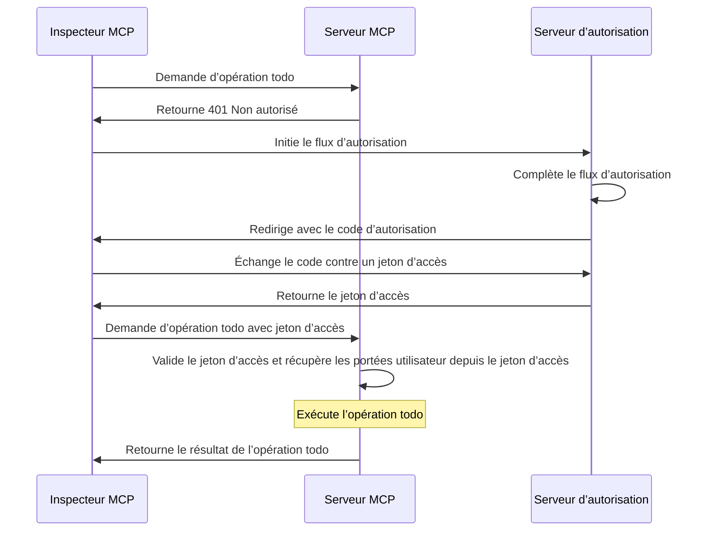
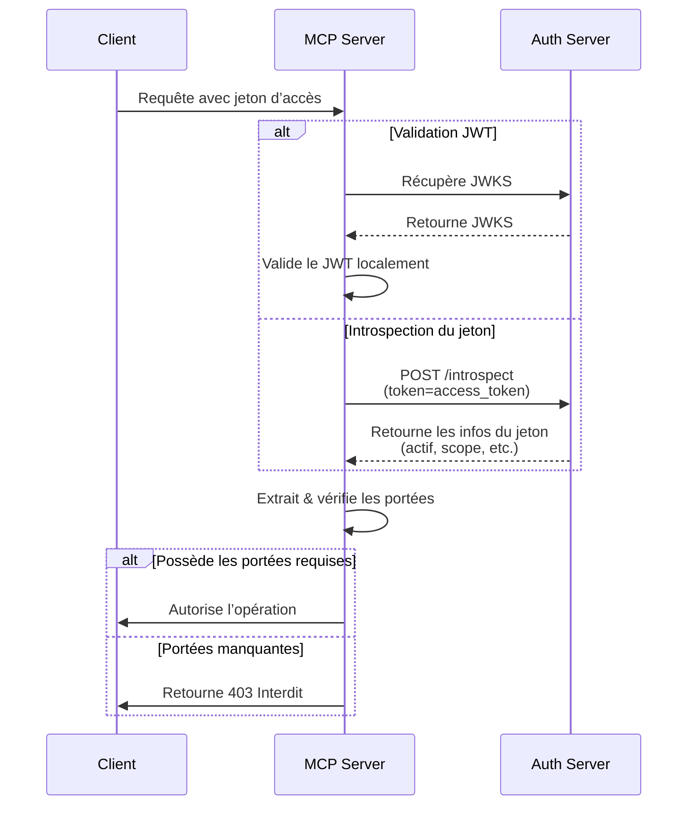

import TabItem from '@theme/TabItem';
import Tabs from '@theme/Tabs';

import SetupOauthOrOidc from './_setup-oauth-or-oidc.mdx';
import SetupOidc from './_setup-oidc.mdx';

# Tutoriel : Créer un gestionnaire de tâches

Dans ce tutoriel, nous allons construire un serveur MCP gestionnaire de tâches avec authentification et autorisation des utilisateurs.

Après avoir terminé ce tutoriel, vous aurez :

- ✅ Une compréhension de base de la mise en place du contrôle d’accès basé sur les rôles (RBAC) dans votre serveur MCP.
- ✅ Un serveur MCP capable de gérer des listes de tâches personnelles.

:::note
Avant de commencer, nous vous recommandons fortement de suivre d'abord le [tutoriel Who am I](./whoami) si vous n'êtes pas familier avec le serveur MCP et OAuth 2.
:::

## Vue d’ensemble \{#overview}

Le tutoriel impliquera les composants suivants :

- **Serveur MCP** : Un serveur MCP simple qui utilise les SDK officiels MCP pour gérer les requêtes, avec un service Todo intégré pour la gestion des tâches utilisateur.
- **Inspecteur MCP** : Un outil de test visuel pour les serveurs MCP. Il agit également comme un client OAuth / OIDC pour initier le flux d’autorisation et récupérer les jetons d’accès.
- **Serveur d’autorisation** : Un fournisseur OAuth 2.1 ou OpenID Connect qui gère les identités des utilisateurs et délivre les jetons d’accès.

Voici un schéma de haut niveau de l’interaction entre ces composants :

## Comprendre votre serveur d’autorisation \{#understand-your-authorization-server}

### Jetons d’accès avec portées \{#access-tokens-with-scopes}

Pour mettre en œuvre le contrôle d’accès basé sur les rôles (RBAC) dans votre serveur MCP, votre serveur d’autorisation doit prendre en charge l’émission de jetons d’accès avec des portées. Les portées représentent les permissions accordées à un utilisateur.

<Tabs groupId="provider">
<TabItem value="logto" label="Logto">

[Logto](https://logto.io) propose la prise en charge du RBAC via ses ressources API (conformes à la [RFC 8707 : Indicateurs de ressource pour OAuth 2.0](https://datatracker.ietf.org/doc/html/rfc8707)) et ses fonctionnalités de rôles. Voici comment le configurer :

1. Connectez-vous à [Logto Console](https://cloud.logto.io) (ou à votre Logto Console auto-hébergée)

2. Créez une ressource API et des portées :

   - Allez dans "Ressources API"
   - Créez une nouvelle ressource API nommée "Gestionnaire de tâches"
   - Ajoutez les portées suivantes :
     - `create:todos` : "Créer de nouvelles tâches"
     - `read:todos` : "Lire toutes les tâches"
     - `delete:todos` : "Supprimer n’importe quelle tâche"

3. Créez des rôles (recommandé pour une gestion plus facile) :

   - Allez dans "Rôles"
   - Créez un rôle "Admin" et assignez-lui toutes les portées (`create:todos`, `read:todos`, `delete:todos`)
   - Créez un rôle "Utilisateur" et assignez-lui uniquement la portée `create:todos`

4. Attribuez les permissions :
   - Allez dans "Utilisateurs"
   - Sélectionnez un utilisateur
   - Vous pouvez soit :
     - Attribuer des rôles dans l’onglet "Rôles" (recommandé)
     - Ou attribuer directement des portées dans l’onglet "Permissions"

Les portées seront incluses dans la revendication `scope` du jeton d’accès JWT sous forme de chaîne séparée par des espaces.

</TabItem>
<TabItem value="asgardeo" label="Asgardeo">
    [Asgardeo](https://wso2.com/asgardeo) prend en charge le contrôle d’accès basé sur les rôles (RBAC) et l’autorisation fine via les ressources API et les portées. Voici comment le configurer :

    1. Connectez-vous à la [Console Asgardeo](https://console.asgardeo.io)

    2. Définissez votre ressource API et vos portées :
        - Allez dans **Ressources API**
        - Cliquez sur **"Nouvelle ressource API"**
        - Définissez l’**Identifiant** sur `https://todo.mcp-server.app` (ou l’URL souhaitée)
        - Laissez le **Nom d’affichage** à `Gestionnaire de tâches`
        - Ajoutez les portées suivantes :
            - `create:todos` : "Créer de nouvelles tâches"
            - `read:todos` : "Lire toutes les tâches"
            - `delete:todos` : "Supprimer n’importe quelle tâche"
        - Créez la ressource

    3. Créez des rôles :
        - Utilisez **Gestion des utilisateurs > Rôles** pour créer des rôles et attribuer directement les portées.
        - Cliquez sur **Nouveau rôle**
        - Indiquez le nom du rôle (par exemple, `Admin` ou `Utilisateur`) dans la section **Détails de base**
        - Laissez l’audience du rôle à `Application` et sélectionnez l’**Application MCP Inspector** comme **Application assignée**
        - Dans la section **Sélection des permissions**, choisissez la ressource API créée précédemment (par exemple, `Gestionnaire de tâches`)
        - Sélectionnez les portées à attribuer à ce rôle (par exemple, `create:todos`, `read:todos`, `delete:todos`)
        - Cliquez sur **Terminer** pour créer le rôle

    Si vous avez déjà créé l’application
        - Naviguez vers **Application > MCP Inspector Application > Onglet Rôles**
        - Sélectionnez **Rôle d’application** comme type d’audience, puis cliquez sur **Nouveau rôle**
        - Créez un rôle `Admin` et attachez-lui les trois portées
        - Créez un rôle `Utilisateur` et attachez-lui uniquement la portée `create:todos`

    4. Attribuez les rôles aux utilisateurs :
        - Allez dans **Gestion des utilisateurs > Rôles**
        - Sélectionnez le rôle créé (par exemple, `Admin` ou `Utilisateur`) et passez à l’onglet **Utilisateurs**
        - Sélectionnez **Attribuer un utilisateur** et choisissez les utilisateurs à qui attribuer ce rôle, puis enregistrez.

    Les portées seront incluses dans la revendication `scope` du jeton d’accès JWT sous forme de chaîne séparée par des espaces.

</TabItem>
<TabItem value="oauth-oidc" label="OAuth 2.0 / OIDC">

Les fournisseurs OAuth 2.0 / OIDC prennent généralement en charge le contrôle d’accès basé sur les portées. Lors de la mise en œuvre du RBAC :

1. Définissez les portées requises dans votre serveur d’autorisation
2. Configurez votre client pour demander ces portées lors du flux d’autorisation
3. Assurez-vous que votre serveur d’autorisation inclut les portées accordées dans le jeton d’accès
4. Les portées sont généralement incluses dans la revendication `scope` du jeton d’accès JWT

Consultez la documentation de votre fournisseur pour plus de détails sur :

- Comment définir et gérer les portées
- Comment les portées sont incluses dans le jeton d’accès
- Toute fonctionnalité RBAC supplémentaire comme la gestion des rôles

</TabItem>
</Tabs>

### Validation des jetons et vérification des permissions \{#validating-tokens-and-checking-permissions}

Lorsque votre serveur MCP reçoit une requête, il doit :

1. Valider la signature et l’expiration du jeton d’accès
2. Extraire les portées du jeton validé
3. Vérifier si le jeton possède les portées requises pour l’opération demandée

Par exemple, si un utilisateur souhaite créer une nouvelle tâche, son jeton d’accès doit inclure la portée `create:todos`. Voici comment fonctionne le flux :

### Enregistrement dynamique de client \{#dynamic-client-registration}

L’enregistrement dynamique de client n’est pas requis pour ce tutoriel, mais il peut être utile si vous souhaitez automatiser le processus d’enregistrement du client MCP auprès de votre serveur d’autorisation. Consultez [L’enregistrement dynamique de client est-il requis ?](../../provider-list.mdx#is-dcr-required) pour plus de détails.

## Comprendre le RBAC dans le gestionnaire de tâches \{#understand-rbac-in-todo-manager}

À des fins de démonstration, nous allons implémenter un système simple de contrôle d’accès basé sur les rôles (RBAC) dans notre serveur MCP gestionnaire de tâches. Cela vous montrera les principes de base du RBAC tout en gardant l’implémentation simple.

:::note
Bien que ce tutoriel démontre la gestion des portées basée sur le RBAC, il est important de noter que tous les fournisseurs d’authentification n’implémentent pas la gestion des portées via les rôles. Certains fournisseurs peuvent avoir leurs propres mécanismes uniques pour gérer le contrôle d’accès et les permissions.
:::

### Outils et portées \{#tools-and-scopes}

Notre serveur MCP gestionnaire de tâches fournit trois outils principaux :

- `create-todo` : Créer une nouvelle tâche
- `get-todos` : Lister toutes les tâches
- `delete-todo` : Supprimer une tâche par ID

Pour contrôler l’accès à ces outils, nous définissons les portées suivantes :

- `create:todos` : Autorise la création de nouvelles tâches
- `delete:todos` : Autorise la suppression de tâches existantes
- `read:todos` : Autorise la consultation et la récupération de la liste de toutes les tâches

### Rôles et permissions \{#roles-and-permissions}

Nous définirons deux rôles avec différents niveaux d’accès :

| Rôle   | create:todos | read:todos | delete:todos |
| ------ | ------------ | ---------- | ------------ |
| Admin  | ✅           | ✅         | ✅           |
| User   | ✅           |            |              |

- **Utilisateur** : Un utilisateur régulier qui peut créer des tâches et voir ou supprimer uniquement ses propres tâches
- **Admin** : Un administrateur qui peut créer, voir et supprimer toutes les tâches, quel que soit le propriétaire

### Propriété des ressources \{#resource-ownership}

Bien que le tableau des permissions ci-dessus montre les portées explicites attribuées à chaque rôle, il y a un principe important de propriété des ressources à considérer :

- **Les utilisateurs** n’ont pas les portées `read:todos` ou `delete:todos`, mais ils peuvent quand même :
  - Lire leurs propres tâches
  - Supprimer leurs propres tâches
- **Les admins** disposent de toutes les permissions (`read:todos` et `delete:todos`), ce qui leur permet de :
  - Voir toutes les tâches du système
  - Supprimer n’importe quelle tâche, quel que soit le propriétaire

Cela illustre un schéma courant dans les systèmes RBAC où la propriété d’une ressource accorde des permissions implicites aux utilisateurs pour leurs propres ressources, tandis que les rôles administratifs reçoivent des permissions explicites pour toutes les ressources.

:::tip En savoir plus
Pour approfondir les concepts et bonnes pratiques du RBAC, consultez [Maîtriser le RBAC : Un exemple complet et concret](https://blog.logto.io/mastering-rbac).
:::

## Configurer l’autorisation dans votre fournisseur \{#configure-authorization-in-your-provider}

Pour mettre en œuvre le système de contrôle d’accès décrit précédemment, vous devrez configurer votre serveur d’autorisation pour prendre en charge les portées requises. Voici comment procéder avec différents fournisseurs :

<Tabs groupId="provider">
<TabItem value="logto" label="Logto">

[Logto](https://logto.io) propose la prise en charge du RBAC via ses ressources API et ses fonctionnalités de rôles. Voici comment le configurer :

1. Connectez-vous à [Logto Console](https://cloud.logto.io) (ou à votre Logto Console auto-hébergée)

2. Créez une ressource API et des portées :

   - Allez dans "Ressources API"
   - Créez une nouvelle ressource API nommée "Gestionnaire de tâches" et utilisez `https://todo.mcp-server.app` (à des fins de démonstration) comme indicateur.
   - Créez les portées suivantes :
     - `create:todos` : "Créer de nouvelles tâches"
     - `read:todos` : "Lire toutes les tâches"
     - `delete:todos` : "Supprimer n’importe quelle tâche"

3. Créez des rôles (recommandé pour une gestion plus facile) :

   - Allez dans "Rôles"
   - Créez un rôle "Admin" et assignez-lui toutes les portées (`create:todos`, `read:todos`, `delete:todos`)
   - Créez un rôle "Utilisateur" et assignez-lui uniquement la portée `create:todos`
   - Dans la page de détails du rôle "Utilisateur", passez à l’onglet "Général" et définissez le rôle "Utilisateur" comme "Rôle par défaut".

4. Gérez les rôles et permissions des utilisateurs :
   - Pour les nouveaux utilisateurs :
     - Ils recevront automatiquement le rôle "Utilisateur" puisque nous l’avons défini comme rôle par défaut
   - Pour les utilisateurs existants :
     - Allez dans "Gestion des utilisateurs"
     - Sélectionnez un utilisateur
     - Attribuez des rôles à l’utilisateur dans l’onglet "Rôles"

:::tip Gestion programmatique des rôles
Vous pouvez également utiliser la [Management API](https://docs.logto.io/integrate-logto/interact-with-management-api) de Logto pour gérer les rôles des utilisateurs de manière programmatique. Ceci est particulièrement utile pour la gestion automatisée des utilisateurs ou lors de la création de panneaux d’administration.
:::

Lors de la demande d’un jeton d’accès, Logto inclura les portées dans la revendication `scope` du jeton en fonction des permissions du rôle de l’utilisateur.

</TabItem>
<TabItem value="keycloak" label="Keycloak">

Dans [Keycloak](https://www.keycloak.org), vous pouvez configurer les permissions requises à l’aide des portées client :

1. Créez des portées client :

   - Dans votre realm, allez dans "Portées client"
   - Créez trois nouvelles portées client :
     - `create:todos`
     - `read:todos`
     - `delete:todos`

2. Configurez le client :

   - Allez dans les paramètres de votre client
   - Dans l’onglet "Portées client", ajoutez toutes les portées que vous avez créées
   - Assurez-vous que le mappage de jeton est configuré pour inclure les portées

3. Optionnel : Utilisez les rôles pour une gestion plus facile
   - Si vous préférez une gestion basée sur les rôles :
     - Créez des rôles de realm pour différents niveaux d’accès
     - Mappez les portées aux rôles
     - Attribuez les rôles aux utilisateurs
   - Sinon, vous pouvez attribuer directement les portées aux utilisateurs ou via les permissions au niveau du client

Keycloak inclura les portées accordées dans la revendication `scope` du jeton d’accès.

</TabItem>
<TabItem value="asgardeo" label="Asgardeo">

[Asgardeo](https://wso2.com/asgardeo) prend en charge le contrôle d’accès basé sur les rôles (RBAC) et l’autorisation fine via les ressources API et les portées. Voici comment le configurer :

1. Connectez-vous à la [Console Asgardeo](https://console.asgardeo.io)

2. Définissez votre ressource API et vos portées :
    - Allez dans **Ressources API**
    - Cliquez sur **"Nouvelle ressource API"**
    - Définissez l’**Identifiant** sur `https://todo.mcp-server.app` (ou l’URL souhaitée)
    - Laissez le **Nom d’affichage** à `Gestionnaire de tâches`
    - Ajoutez les portées suivantes :
        - `create:todos` : "Créer de nouvelles tâches"
        - `read:todos` : "Lire toutes les tâches"
        - `delete:todos` : "Supprimer n’importe quelle tâche"
    - Créez la ressource

3. Créez des rôles :
    - Utilisez **Gestion des utilisateurs > Rôles** pour créer des rôles et attribuer directement les portées.
    - Cliquez sur **Nouveau rôle**
    - Indiquez le nom du rôle (par exemple, `Admin` ou `Utilisateur`) dans la section **Détails de base**
    - Laissez l’audience du rôle à `Application` et sélectionnez l’**Application MCP Inspector** comme **Application assignée**
    - Dans la section **Sélection des permissions**, choisissez la ressource API créée précédemment (par exemple, `Gestionnaire de tâches`)
    - Sélectionnez les portées à attribuer à ce rôle (par exemple, `create:todos`, `read:todos`, `delete:todos`)
    - Cliquez sur **Terminer** pour créer le rôle

    Si vous avez déjà créé l’application
    - Naviguez vers **Application > MCP Inspector Application > Onglet Rôles**
    - Sélectionnez **Rôle d’application** comme type d’audience, puis cliquez sur **Nouveau rôle**
    - Créez un rôle `Admin` et attachez-lui les trois portées
    - Créez un rôle `Utilisateur` et attachez-lui uniquement la portée `create:todos`

4. Attribuez les rôles aux utilisateurs :
    - Allez dans **Gestion des utilisateurs > Rôles**
    - Sélectionnez le rôle créé (par exemple, `Admin` ou `Utilisateur`) et passez à l’onglet **Utilisateurs**
    - Sélectionnez **Attribuer un utilisateur** et choisissez les utilisateurs à qui attribuer ce rôle, puis enregistrez.

Les portées seront incluses dans la revendication `scope` du jeton d’accès JWT sous forme de chaîne séparée par des espaces.
Après avoir configuré votre serveur d’autorisation, les utilisateurs recevront des jetons d’accès contenant leurs portées accordées. Le serveur MCP utilisera ces portées pour déterminer :

Si un utilisateur peut créer de nouvelles tâches (`create:todos`)
Si un utilisateur peut voir toutes les tâches (`read:todos`) ou seulement les siennes
Si un utilisateur peut supprimer n’importe quelle tâche (`delete:todos`) ou seulement les siennes

Pour plus de détails sur la configuration d’Asgardeo, consultez les ressources suivantes :
- [Guide des ressources API](https://wso2.com/asgardeo/docs/guides/authorization/api-authorization)
- [Gestion des rôles](https://wso2.com/asgardeo/docs/guides/users/manage-roles)
</TabItem>
<TabItem value="oauth-or-oidc" label="OAuth 2 / OIDC">

Pour les fournisseurs OAuth 2.0 ou OpenID Connect, vous devrez configurer les portées qui représentent différentes permissions. Les étapes exactes dépendront de votre fournisseur, mais généralement :

1. Définir les portées :

   - Configurez votre serveur d’autorisation pour prendre en charge :
     - `create:todos`
     - `read:todos`
     - `delete:todos`

2. Configurer le client :

   - Enregistrez ou mettez à jour votre client pour demander ces portées
   - Assurez-vous que les portées sont incluses dans le jeton d’accès

3. Attribuer les permissions :
   - Utilisez l’interface de votre fournisseur pour accorder les portées appropriées aux utilisateurs
   - Certains fournisseurs peuvent prendre en charge la gestion basée sur les rôles, tandis que d’autres utilisent des attributions de portées directes
   - Consultez la documentation de votre fournisseur pour l’approche recommandée

:::tip
La plupart des fournisseurs incluront les portées accordées dans la revendication `scope` du jeton d’accès. Le format est généralement une chaîne de valeurs de portées séparées par des espaces.
:::

</TabItem>
</Tabs>

Après avoir configuré votre serveur d’autorisation, les utilisateurs recevront des jetons d’accès contenant leurs portées accordées. Le serveur MCP utilisera ces portées pour déterminer :

- Si un utilisateur peut créer de nouvelles tâches (`create:todos`)
- Si un utilisateur peut voir toutes les tâches (`read:todos`) ou seulement les siennes
- Si un utilisateur peut supprimer n’importe quelle tâche (`delete:todos`) ou seulement les siennes

[La traduction continue dans la prochaine réponse...]