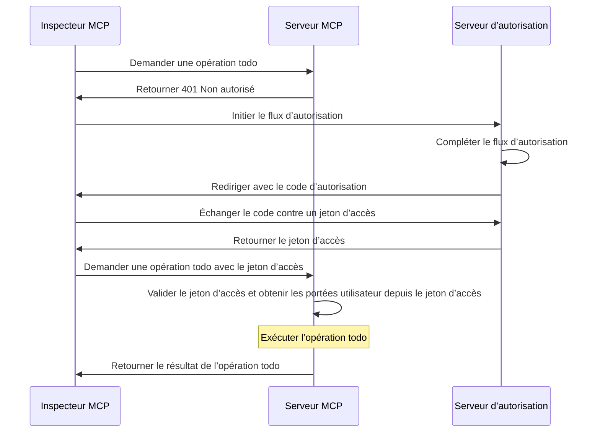
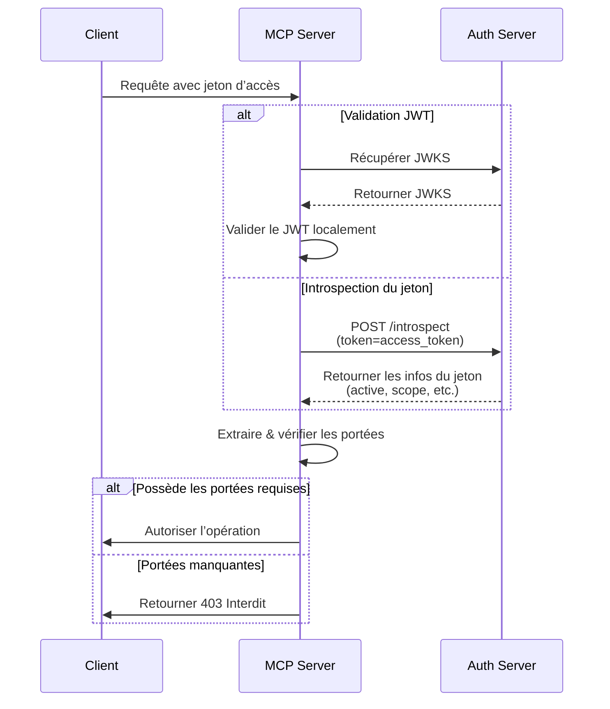

import TabItem from '@theme/TabItem';
import Tabs from '@theme/Tabs';

import SetupOauthOrOidc from './_setup-oauth-or-oidc.mdx';
import SetupOidc from './_setup-oidc.mdx';

# Tutoriel : Créer un gestionnaire de tâches

Dans ce tutoriel, nous allons construire un serveur MCP de gestionnaire de tâches avec authentification et autorisation des utilisateurs.

Après avoir terminé ce tutoriel, vous aurez :

- ✅ Une compréhension de base de la configuration du contrôle d’accès basé sur les rôles (RBAC) dans votre serveur MCP.
- ✅ Un serveur MCP capable de gérer des listes de tâches personnelles.

:::note
Avant de commencer, nous vous recommandons fortement de suivre d'abord le [tutoriel Who am I](./whoami) si vous n'êtes pas familier avec le serveur MCP et OAuth 2.
:::

## Aperçu \{#overview}

Le tutoriel impliquera les composants suivants :

- **Serveur MCP** : Un serveur MCP simple qui utilise les SDK officiels MCP pour gérer les requêtes, avec un service Todo intégré pour gérer les tâches de l'utilisateur.
- **Inspecteur MCP** : Un outil de test visuel pour les serveurs MCP. Il agit également comme un client OAuth / OIDC pour initier le flux d’autorisation et récupérer les jetons d’accès.
- **Serveur d’autorisation** : Un fournisseur OAuth 2.1 ou OpenID Connect qui gère les identités des utilisateurs et délivre les jetons d’accès.

Voici un schéma de haut niveau de l’interaction entre ces composants :



## Comprendre votre serveur d’autorisation \{#understand-your-authorization-server}

### Jetons d’accès avec portées \{#access-tokens-with-scopes}

Pour mettre en œuvre le [contrôle d’accès basé sur les rôles (RBAC)](https://auth.wiki/rbac) dans votre serveur MCP, votre serveur d’autorisation doit prendre en charge l’émission de jetons d’accès avec des portées. Les portées représentent les permissions accordées à un utilisateur.

<Tabs groupId="provider">
<TabItem value="logto" label="Logto">

[Logto](https://logto.io) fournit la prise en charge du RBAC via ses ressources API (conformes à [RFC 8707 : Indicateurs de ressource pour OAuth 2.0](https://datatracker.ietf.org/doc/html/rfc8707)) et ses fonctionnalités de rôles. Voici comment le configurer :

1. Connectez-vous à [Logto Console](https://cloud.logto.io) (ou à votre propre instance Logto Console)

2. Créez une ressource API et des portées :

   - Allez dans "Ressources API"
   - Créez une nouvelle ressource API nommée "Todo Manager"
   - Ajoutez les portées suivantes :
     - `create:todos` : "Créer de nouvelles tâches"
     - `read:todos` : "Lire toutes les tâches"
     - `delete:todos` : "Supprimer n’importe quelle tâche"

3. Créez des rôles (recommandé pour une gestion plus simple) :

   - Allez dans "Rôles"
   - Créez un rôle "Admin" et assignez toutes les portées (`create:todos`, `read:todos`, `delete:todos`)
   - Créez un rôle "User" et assignez uniquement la portée `create:todos`

4. Assignez les permissions :
   - Allez dans "Utilisateurs"
   - Sélectionnez un utilisateur
   - Vous pouvez soit :
     - Assigner des rôles dans l’onglet "Rôles" (recommandé)
     - Ou assigner directement des portées dans l’onglet "Permissions"

Les portées seront incluses dans la revendication `scope` du jeton d’accès JWT sous forme de chaîne séparée par des espaces.

</TabItem>
<TabItem value="oauth-oidc" label="OAuth 2.0 / OIDC">

Les fournisseurs OAuth 2.0 / OIDC prennent généralement en charge le contrôle d’accès basé sur les portées. Lors de la mise en œuvre du RBAC :

1. Définissez les portées requises dans votre serveur d’autorisation
2. Configurez votre client pour demander ces portées lors du flux d’autorisation
3. Assurez-vous que votre serveur d’autorisation inclut les portées accordées dans le jeton d’accès
4. Les portées sont généralement incluses dans la revendication `scope` du jeton d’accès JWT

Consultez la documentation de votre fournisseur pour les détails spécifiques sur :

- Comment définir et gérer les portées
- Comment les portées sont incluses dans le jeton d’accès
- Toute fonctionnalité RBAC supplémentaire comme la gestion des rôles

</TabItem>
</Tabs>

### Validation des jetons et vérification des permissions \{#validating-tokens-and-checking-permissions}

Lorsque votre serveur MCP reçoit une requête, il doit :

1. Valider la signature et l’expiration du jeton d’accès
2. Extraire les portées du jeton validé
3. Vérifier si le jeton possède les portées requises pour l’opération demandée

Par exemple, si un utilisateur souhaite créer une nouvelle tâche, son jeton d’accès doit inclure la portée `create:todos`. Voici comment fonctionne le flux :



### Enregistrement dynamique de client \{#dynamic-client-registration}

L’enregistrement dynamique de client n’est pas requis pour ce tutoriel, mais il peut être utile si vous souhaitez automatiser le processus d’enregistrement du client MCP auprès de votre serveur d’autorisation. Consultez [L’enregistrement dynamique de client est-il requis ?](../../provider-list.mdx#is-dcr-required) pour plus de détails.

## Comprendre le RBAC dans le gestionnaire de tâches \{#understand-rbac-in-todo-manager}

À des fins de démonstration, nous allons mettre en œuvre un système simple de contrôle d’accès basé sur les rôles (RBAC) dans notre serveur MCP gestionnaire de tâches. Cela vous montrera les principes de base du RBAC tout en gardant l’implémentation simple.

:::note
Bien que ce tutoriel démontre la gestion des portées basée sur le RBAC, il est important de noter que tous les fournisseurs d’authentification n’implémentent pas la gestion des portées via les rôles. Certains fournisseurs peuvent avoir leurs propres mécanismes uniques pour gérer le contrôle d’accès et les permissions.
:::

### Outils et portées \{#tools-and-scopes}

Notre serveur MCP gestionnaire de tâches fournit trois outils principaux :

- `create-todo` : Créer une nouvelle tâche
- `get-todos` : Lister toutes les tâches
- `delete-todo` : Supprimer une tâche par ID

Pour contrôler l’accès à ces outils, nous définissons les portées suivantes :

- `create:todos` : Autorise la création de nouvelles tâches
- `delete:todos` : Autorise la suppression de tâches existantes
- `read:todos` : Autorise la consultation et la récupération de la liste de toutes les tâches

### Rôles et permissions \{#roles-and-permissions}

Nous allons définir deux rôles avec différents niveaux d’accès :

| Rôle  | create:todos | read:todos | delete:todos |
| ----- | ------------ | ---------- | ------------ |
| Admin | ✅           | ✅         | ✅           |
| User  | ✅           |            |              |

- **User** : Un utilisateur régulier qui peut créer des tâches et voir ou supprimer uniquement ses propres tâches
- **Admin** : Un administrateur qui peut créer, voir et supprimer toutes les tâches, quel que soit le propriétaire

### Propriété des ressources \{#resource-ownership}

Bien que le tableau des permissions ci-dessus montre les portées explicites attribuées à chaque rôle, il y a un principe important de propriété des ressources à considérer :

- **Les utilisateurs** n’ont pas les portées `read:todos` ou `delete:todos`, mais ils peuvent quand même :
  - Lire leurs propres tâches
  - Supprimer leurs propres tâches
- **Les admins** ont toutes les permissions (`read:todos` et `delete:todos`), ce qui leur permet de :
  - Voir toutes les tâches du système
  - Supprimer n’importe quelle tâche, quel que soit le propriétaire

Cela illustre un schéma courant dans les systèmes RBAC où la propriété d’une ressource accorde des permissions implicites aux utilisateurs pour leurs propres ressources, tandis que les rôles administratifs reçoivent des permissions explicites pour toutes les ressources.

:::tip En savoir plus
Pour approfondir les concepts et bonnes pratiques du RBAC, consultez [Maîtriser le RBAC : Un exemple complet du monde réel](https://blog.logto.io/mastering-rbac).
:::

## Configurer l’autorisation dans votre fournisseur \{#configure-authorization-in-your-provider}

Pour mettre en œuvre le système de contrôle d’accès décrit précédemment, vous devrez configurer votre serveur d’autorisation pour prendre en charge les portées requises. Voici comment faire avec différents fournisseurs :

<Tabs groupId="provider">
<TabItem value="logto" label="Logto">

[Logto](https://logto.io) fournit la prise en charge du RBAC via ses ressources API et ses fonctionnalités de rôles. Voici comment le configurer :

1. Connectez-vous à [Logto Console](https://cloud.logto.io) (ou à votre propre instance Logto Console)

2. Créez une ressource API et des portées :

   - Allez dans "Ressources API"
   - Créez une nouvelle ressource API nommée "Todo Manager" et utilisez `https://todo.mcp-server.app` (à des fins de démonstration) comme indicateur.
   - Créez les portées suivantes :
     - `create:todos` : "Créer de nouvelles tâches"
     - `read:todos` : "Lire toutes les tâches"
     - `delete:todos` : "Supprimer n’importe quelle tâche"

3. Créez des rôles (recommandé pour une gestion plus simple) :

   - Allez dans "Rôles"
   - Créez un rôle "Admin" et assignez toutes les portées (`create:todos`, `read:todos`, `delete:todos`)
   - Créez un rôle "User" et assignez uniquement la portée `create:todos`
   - Dans la page de détails du rôle "User", passez à l’onglet "Général" et définissez le rôle "User" comme "Rôle par défaut".

4. Gérez les rôles et permissions des utilisateurs :
   - Pour les nouveaux utilisateurs :
     - Ils recevront automatiquement le rôle "User" puisque nous l’avons défini comme rôle par défaut
   - Pour les utilisateurs existants :
     - Allez dans "Gestion des utilisateurs"
     - Sélectionnez un utilisateur
     - Assignez des rôles à l’utilisateur dans l’onglet "Rôles"

:::tip Gestion programmatique des rôles
Vous pouvez également utiliser la [Management API](https://docs.logto.io/integrate-logto/interact-with-management-api) de Logto pour gérer les rôles des utilisateurs de manière programmatique. Ceci est particulièrement utile pour la gestion automatisée des utilisateurs ou lors de la création de panneaux d’administration.
:::

Lors de la demande d’un jeton d’accès, Logto inclura les portées dans la revendication `scope` du jeton en fonction des permissions de rôle de l’utilisateur.

</TabItem>
<TabItem value="keycloak" label="Keycloak">

Dans [Keycloak](https://www.keycloak.org), vous pouvez configurer les permissions requises à l’aide des portées client :

1. Créez des portées client :

   - Dans votre realm, allez dans "Client scopes"
   - Créez trois nouvelles portées client :
     - `create:todos`
     - `read:todos`
     - `delete:todos`

2. Configurez le client :

   - Allez dans les paramètres de votre client
   - Dans l’onglet "Client scopes", ajoutez toutes les portées que vous avez créées
   - Assurez-vous que le mappage du jeton est configuré pour inclure les portées

3. Optionnel : Utilisez les rôles pour une gestion plus simple
   - Si vous préférez la gestion basée sur les rôles :
     - Créez des rôles de realm pour différents niveaux d’accès
     - Mappez les portées aux rôles
     - Assignez les rôles aux utilisateurs
   - Sinon, vous pouvez assigner directement les portées aux utilisateurs ou via les permissions au niveau du client

Keycloak inclura les portées accordées dans la revendication `scope` du jeton d’accès.

</TabItem>
<TabItem value="oauth-or-oidc" label="OAuth 2 / OIDC">

Pour les fournisseurs OAuth 2.0 ou OpenID Connect, vous devrez configurer les portées qui représentent différentes permissions. Les étapes exactes dépendront de votre fournisseur, mais généralement :

1. Définissez les portées :

   - Configurez votre serveur d’autorisation pour prendre en charge :
     - `create:todos`
     - `read:todos`
     - `delete:todos`

2. Configurez le client :

   - Enregistrez ou mettez à jour votre client pour demander ces portées
   - Assurez-vous que les portées sont incluses dans le jeton d’accès

3. Assignez les permissions :
   - Utilisez l’interface de votre fournisseur pour accorder les portées appropriées aux utilisateurs
   - Certains fournisseurs peuvent prendre en charge la gestion basée sur les rôles, tandis que d’autres utilisent des attributions directes de portées
   - Consultez la documentation de votre fournisseur pour l’approche recommandée

:::tip
La plupart des fournisseurs incluront les portées accordées dans la revendication `scope` du jeton d’accès. Le format est généralement une chaîne de valeurs de portées séparées par des espaces.
:::

</TabItem>
</Tabs>

Après avoir configuré votre serveur d’autorisation, les utilisateurs recevront des jetons d’accès contenant leurs portées accordées. Le serveur MCP utilisera ces portées pour déterminer :

- Si un utilisateur peut créer de nouvelles tâches (`create:todos`)
- Si un utilisateur peut voir toutes les tâches (`read:todos`) ou seulement les siennes
- Si un utilisateur peut supprimer n’importe quelle tâche (`delete:todos`) ou seulement les siennes

## Mettre en place le serveur MCP \{#set-up-the-mcp-server}

Nous allons utiliser les [SDK officiels MCP](https://github.com/modelcontextprotocol) pour créer notre serveur MCP gestionnaire de tâches.

### Créer un nouveau projet \{#create-a-new-project}

<Tabs groupId="sdk">
<TabItem value="python" label="Python">

```bash
mkdir mcp-server
cd mcp-server
uv init # Ou utilisez `pipenv` ou `poetry` pour créer un nouvel environnement virtuel
```

</TabItem>
<TabItem value="node" label="Node.js">

Créez un nouveau projet Node.js :

```bash
mkdir mcp-server
cd mcp-server
npm init -y # Ou utilisez `pnpm init`
npm pkg set type="module"
npm pkg set main="todo-manager.ts"
npm pkg set scripts.start="node --experimental-strip-types todo-manager.ts"
```

:::note
Nous utilisons TypeScript dans nos exemples car Node.js v22.6.0+ prend en charge l’exécution native de TypeScript avec l’option `--experimental-strip-types`. Si vous utilisez JavaScript, le code sera similaire – assurez-vous simplement d’utiliser Node.js v22.6.0 ou ultérieur. Voir la documentation Node.js pour plus de détails.
:::

</TabItem>
</Tabs>

### Installer le SDK MCP et les dépendances \{#install-the-mcp-sdk-and-dependencies}

<Tabs groupId="sdk">
<TabItem value="python" label="Python">

```bash
pip install "mcp[cli]" starlette uvicorn
```

Ou tout autre gestionnaire de paquets que vous préférez, comme `uv` ou `poetry`.

</TabItem>
<TabItem value="node" label="Node.js">

```bash
npm install @modelcontextprotocol/sdk express zod
```

Ou tout autre gestionnaire de paquets que vous préférez, comme `pnpm` ou `yarn`.

</TabItem>
</Tabs>

### Créer le serveur MCP \{#create-the-mcp-server}

Commençons par créer un serveur MCP de base avec la définition des outils :

<Tabs groupId="sdk">
<TabItem value="python" label="Python">

Créez un fichier nommé `todo-manager.py` et ajoutez le code suivant :

```python
from typing import Any
from mcp.server.fastmcp import FastMCP
from starlette.applications import Starlette
from starlette.routing import Mount

mcp = FastMCP("Todo Manager")

@mcp.tool()
def create_todo(content: str) -> dict[str, Any]:
    """Créer une nouvelle tâche."""
    return {"error": "Non implémenté"}

@mcp.tool()
def get_todos() -> dict[str, Any]:
    """Lister toutes les tâches."""
    return {"error": "Non implémenté"}

@mcp.tool()
def delete_todo(id: str) -> dict[str, Any]:
    """Supprimer une tâche par id."""
    return {"error": "Non implémenté"}

app = Starlette(
    routes=[Mount('/', app=mcp.sse_app())]
)
```

Lancez le serveur avec :

```bash
uvicorn todo_manager:app --host 0.0.0.0 --port 3001
```

</TabItem>
<TabItem value="node" label="Node.js">

:::note
Comme l’implémentation actuelle de l’inspecteur MCP ne gère pas les flux d’autorisation, nous utiliserons l’approche SSE pour mettre en place le serveur MCP. Nous mettrons à jour le code ici dès que l’inspecteur MCP prendra en charge les flux d’autorisation.
:::

Vous pouvez également utiliser `pnpm` ou `yarn` si vous préférez.

Créez un fichier nommé `todo-manager.ts` et ajoutez le code suivant :

```ts
// todo-manager.ts

import { z } from 'zod';
import { McpServer } from '@modelcontextprotocol/sdk/server/mcp.js';
import { SSEServerTransport } from '@modelcontextprotocol/sdk/server/sse.js';
import express from 'express';

// Créer un serveur MCP
const server = new McpServer({
  name: 'Todo Manager',
  version: '0.0.0',
});

server.tool('create-todo', 'Créer une nouvelle tâche', { content: z.string() }, async ({ content }) => {
  return {
    content: [{ type: 'text', text: JSON.stringify({ error: 'Non implémenté' }) }],
  };
});

server.tool('get-todos', 'Lister toutes les tâches', async () => {
  return {
    content: [{ type: 'text', text: JSON.stringify({ error: 'Non implémenté' }) }],
  };
});

server.tool('delete-todo', 'Supprimer une tâche par id', { id: z.string() }, async ({ id }) => {
  return {
    content: [{ type: 'text', text: JSON.stringify({ error: 'Non implémenté' }) }],
  };
});

// Ci-dessous le code standard issu de la documentation du SDK MCP
const PORT = 3001;
const app = express();

const transports = {};

app.get('/sse', async (_req, res) => {
  const transport = new SSEServerTransport('/messages', res);
  transports[transport.sessionId] = transport;

  res.on('close', () => {
    delete transports[transport.sessionId];
  });

  await server.connect(transport);
});

app.post('/messages', async (req, res) => {
  const sessionId = String(req.query.sessionId);
  const transport = transports[sessionId];
  if (transport) {
    await transport.handlePostMessage(req, res, req.body);
  } else {
    res.status(400).send('Aucun transport trouvé pour ce sessionId');
  }
});

app.listen(PORT);
```

Lancez le serveur avec :

```bash
npm start
```

</TabItem>
</Tabs>

## Inspecter le serveur MCP \{#inspect-the-mcp-server}

### Cloner et lancer l’inspecteur MCP \{#clone-and-run-mcp-inspector}

Maintenant que nous avons le serveur MCP en fonctionnement, nous pouvons utiliser l’inspecteur MCP pour vérifier si l’outil `whoami` est disponible.

En raison des limitations de l’implémentation actuelle, nous avons forké l’[inspecteur MCP](https://github.com/mcp-auth/inspector) pour le rendre plus flexible et évolutif pour l’authentification et l’autorisation. Nous avons également soumis une pull request au dépôt original pour inclure nos modifications.

Pour lancer l’inspecteur MCP, vous pouvez utiliser la commande suivante (Node.js requis) :

```bash
git clone https://github.com/mcp-auth/inspector.git
cd inspector
npm install
npm run dev
```

Ensuite, ouvrez votre navigateur et allez sur `http://localhost:6274/` (ou l’URL affichée dans le terminal) pour accéder à l’inspecteur MCP.

### Connecter l’inspecteur MCP au serveur MCP \{#connect-mcp-inspector-to-the-mcp-server}

Avant de continuer, vérifiez la configuration suivante dans l’inspecteur MCP :

- **Type de transport** : Réglez sur `SSE`.
- **URL** : Réglez sur l’URL de votre serveur MCP. Dans notre cas, cela devrait être `http://localhost:3001/sse`.

Vous pouvez maintenant cliquer sur le bouton "Connecter" pour voir si l’inspecteur MCP peut se connecter au serveur MCP. Si tout est correct, vous devriez voir le statut "Connecté" dans l’inspecteur MCP.

### Point de contrôle : Exécuter les outils du gestionnaire de tâches \{#checkpoint-run-todo-manager-tools}

1. Dans le menu supérieur de l’inspecteur MCP, cliquez sur l’onglet "Outils".
2. Cliquez sur le bouton "Lister les outils".
3. Vous devriez voir les outils `create-todo`, `get-todos` et `delete-todo` listés sur la page. Cliquez dessus pour ouvrir les détails de l’outil.
4. Vous devriez voir le bouton "Exécuter l’outil" à droite. Cliquez dessus et saisissez les paramètres requis pour exécuter l’outil.
5. Vous devriez voir le résultat de l’outil avec la réponse JSON `{"error": "Non implémenté"}`.


## Intégrer avec votre serveur d’autorisation \{#integrate-with-your-authorization-server}

Pour compléter cette section, plusieurs points sont à prendre en compte :

<details>
<summary>**L’URL de l’émetteur de votre serveur d’autorisation**</summary>

Il s’agit généralement de l’URL de base de votre serveur d’autorisation, comme `https://auth.example.com`. Certains fournisseurs peuvent avoir un chemin comme `https://example.logto.app/oidc`, alors assurez-vous de vérifier la documentation de votre fournisseur.

</details>

<details>
<summary>**Comment récupérer les métadonnées du serveur d’autorisation**</summary>

- Si votre serveur d’autorisation est conforme à [OAuth 2.0 Authorization Server Metadata](https://datatracker.ietf.org/doc/html/rfc8414) ou [OpenID Connect Discovery](https://openid.net/specs/openid-connect-discovery-1_0.html), vous pouvez utiliser les utilitaires intégrés de MCP Auth pour récupérer automatiquement les métadonnées.
- Si votre serveur d’autorisation n’est pas conforme à ces standards, vous devrez spécifier manuellement l’URL des métadonnées ou les points de terminaison dans la configuration du serveur MCP. Consultez la documentation de votre fournisseur pour les points de terminaison spécifiques.

</details>

<details>
<summary>**Comment enregistrer l’inspecteur MCP comme client dans votre serveur d’autorisation**</summary>

- Si votre serveur d’autorisation prend en charge [l’enregistrement dynamique de client](https://datatracker.ietf.org/doc/html/rfc7591), vous pouvez passer cette étape car l’inspecteur MCP s’enregistrera automatiquement comme client.
- Si votre serveur d’autorisation ne prend pas en charge l’enregistrement dynamique de client, vous devrez enregistrer manuellement l’inspecteur MCP comme client dans votre serveur d’autorisation.

</details>

<details>
<summary>**Comprendre les paramètres de la requête de jeton**</summary>

Lorsque vous demandez des jetons d’accès à différents serveurs d’autorisation, vous rencontrerez diverses approches pour spécifier la ressource cible et les permissions. Voici les principaux schémas :

- **Basé sur l’indicateur de ressource** :

  - Utilise le paramètre `resource` pour spécifier l’API cible (voir [RFC 8707 : Indicateurs de ressource pour OAuth 2.0](https://datatracker.ietf.org/doc/html/rfc8707))
  - Courant dans les implémentations OAuth 2.0 modernes
  - Exemple de requête :
    ```json
    {
      "resource": "https://todo.mcp-server.app",
      "scope": "create:todos read:todos"
    }
    ```
  - Le serveur délivre des jetons liés spécifiquement à la ressource demandée

- **Basé sur l’audience** :

  - Utilise le paramètre `audience` pour spécifier le destinataire du jeton
  - Semblable aux indicateurs de ressource mais avec une sémantique différente
  - Exemple de requête :
    ```json
    {
      "audience": "todo-api",
      "scope": "create:todos read:todos"
    }
    ```

- **Basé uniquement sur les portées** :
  - S’appuie uniquement sur les portées sans paramètres de ressource / audience
  - Approche OAuth 2.0 traditionnelle
  - Exemple de requête :
    ```json
    {
      "scope": "todo-api:create todo-api:read openid profile"
    }
    ```
  - Utilise souvent des portées préfixées pour nommer les permissions
  - Courant dans les implémentations OAuth 2.0 plus simples

:::tip Bonnes pratiques

- Consultez la documentation de votre fournisseur pour les paramètres pris en charge
- Certains fournisseurs prennent en charge plusieurs approches simultanément
- Les indicateurs de ressource offrent une meilleure sécurité via la restriction d’audience
- Privilégiez les indicateurs de ressource lorsque disponibles pour un meilleur contrôle d’accès
  :::

</details>

Bien que chaque fournisseur puisse avoir ses propres exigences spécifiques, les étapes suivantes vous guideront dans l’intégration de l’inspecteur MCP et du serveur MCP avec des configurations spécifiques au fournisseur.

### Enregistrer l’inspecteur MCP comme client \{#register-mcp-inspector-as-a-client}

<Tabs groupId="provider">
<TabItem value="logto" label="Logto">

L’intégration du gestionnaire de tâches avec [Logto](https://logto.io) est simple car il s’agit d’un fournisseur OpenID Connect qui prend en charge les indicateurs de ressource et les portées, vous permettant de sécuriser votre API todo avec `https://todo.mcp-server.app` comme indicateur de ressource.

Comme Logto ne prend pas encore en charge l’enregistrement dynamique de client, vous devrez enregistrer manuellement l’inspecteur MCP comme client dans votre tenant Logto :

1. Ouvrez votre inspecteur MCP, cliquez sur le bouton "Configuration OAuth". Copiez la valeur **Redirect URL (auto-populated)**, qui devrait ressembler à `http://localhost:6274/oauth/callback`.
2. Connectez-vous à [Logto Console](https://cloud.logto.io) (ou à votre propre instance Logto Console).
3. Accédez à l’onglet "Applications", cliquez sur "Créer une application". En bas de la page, cliquez sur "Créer une application sans framework".
4. Remplissez les détails de l’application, puis cliquez sur "Créer l’application" :
   - **Sélectionnez un type d’application** : Choisissez "Application monopage".
   - **Nom de l’application** : Saisissez un nom pour votre application, par exemple "MCP Inspector".
5. Dans la section "Paramètres / URI de redirection", collez la valeur **Redirect URL (auto-populated)** que vous avez copiée depuis l’inspecteur MCP. Cliquez ensuite sur "Enregistrer les modifications" dans la barre du bas.
6. Dans la carte du haut, vous verrez la valeur "App ID". Copiez-la.
7. Retournez dans l’inspecteur MCP et collez la valeur "App ID" dans la section "Configuration OAuth" sous "Client ID".
8. Saisissez la valeur `{"scope": "create:todos read:todos delete:todos", "resource": "https://todo.mcp-server.app"}` dans le champ "Auth Params". Cela garantira que le jeton d’accès retourné par Logto contient les portées nécessaires pour accéder au gestionnaire de tâches.

</TabItem>
<TabItem value="oauth-oidc" label="OAuth 2.0 / OIDC">

:::note
Ceci est un guide générique d’intégration pour les fournisseurs OAuth 2.0 / OpenID Connect. Les deux suivent des étapes similaires car OIDC est construit sur OAuth 2.0. Consultez la documentation de votre fournisseur pour les détails spécifiques.
:::

Si votre fournisseur prend en charge l’enregistrement dynamique de client, vous pouvez passer directement à l’étape 8 ci-dessous pour configurer l’inspecteur MCP ; sinon, vous devrez enregistrer manuellement l’inspecteur MCP comme client :

1. Ouvrez votre inspecteur MCP, cliquez sur le bouton "Configuration OAuth". Copiez la valeur **Redirect URL (auto-populated)**, qui devrait ressembler à `http://localhost:6274/oauth/callback`.

2. Connectez-vous à la console de votre fournisseur.

3. Accédez à la section "Applications" ou "Clients", puis créez une nouvelle application ou client.

4. Si votre fournisseur demande un type de client, sélectionnez "Application monopage" ou "Client public".

5. Après avoir créé l’application, vous devrez configurer l’URI de redirection. Collez la valeur **Redirect URL (auto-populated)** que vous avez copiée depuis l’inspecteur MCP.

6. Trouvez le "Client ID" ou "Application ID" de la nouvelle application et copiez-le.

7. Retournez dans l’inspecteur MCP et collez la valeur "Client ID" dans la section "Configuration OAuth" sous "Client ID".

8. Saisissez la valeur suivante dans le champ "Auth Params" pour demander les portées nécessaires aux opérations todo :

```json
{ "scope": "create:todos read:todos delete:todos" }
```

</TabItem>
</Tabs>

### Configurer MCP Auth \{#set-up-mcp-auth}

Dans votre projet serveur MCP, vous devez installer le SDK MCP Auth et le configurer pour utiliser les métadonnées de votre serveur d’autorisation.

<Tabs groupId="sdk">
<TabItem value="python" label="Python">

D’abord, installez le paquet `mcpauth` :

```bash
pip install mcpauth
```

Ou tout autre gestionnaire de paquets que vous préférez, comme `uv` ou `poetry`.

</TabItem>
<TabItem value="node" label="Node.js">

D’abord, installez le paquet `mcp-auth` :

```bash
npm install mcp-auth
```

</TabItem>
</Tabs>

MCP Auth nécessite les métadonnées du serveur d’autorisation pour pouvoir s’initialiser. Selon votre fournisseur :

<Tabs groupId="provider">

<TabItem value="logto" label="Logto">

L’URL de l’émetteur peut être trouvée dans la page de détails de votre application dans Logto Console, dans la section "Endpoints & Credentials / Issuer endpoint". Elle devrait ressembler à `https://my-project.logto.app/oidc`.

<SetupOidc />

</TabItem>

<TabItem value="oauth-oidc" label="OAuth 2.0 / OIDC">

Pour les fournisseurs OAuth 2.0, vous devrez :

1. Vérifier la documentation de votre fournisseur pour l’URL du serveur d’autorisation (souvent appelée issuer URL ou base URL)
2. Certains fournisseurs exposent cela à `https://{your-domain}/.well-known/oauth-authorization-server`
3. Cherchez dans la console d’administration de votre fournisseur sous les paramètres OAuth/API

<SetupOauthOrOidc />

</TabItem>

</Tabs>

<Tabs groupId="sdk">

<TabItem value="python" label="Python">

Mettez à jour le fichier `todo-manager.py` pour inclure la configuration MCP Auth :

```python
from mcpauth import MCPAuth
from mcpauth.config import AuthServerType
from mcpauth.utils import fetch_server_config

auth_issuer = '<issuer-endpoint>'  # Remplacez par votre endpoint issuer
auth_server_config = fetch_server_config(auth_issuer, type=AuthServerType.OIDC)
mcp_auth = MCPAuth(server=auth_server_config)
```

</TabItem>
<TabItem value="node" label="Node.js">

Mettez à jour le fichier `todo-manager.ts` pour inclure la configuration MCP Auth :

```ts
// todo-manager.ts

import { MCPAuth, fetchServerConfig } from 'mcp-auth';

const authIssuer = '<issuer-endpoint>'; // Remplacez par votre endpoint issuer
const mcpAuth = new MCPAuth({
  server: await fetchServerConfig(authIssuer, { type: 'oidc' }),
});
```

</TabItem>
</Tabs>

### Mettre à jour le serveur MCP \{#update-mcp-server}

Nous y sommes presque ! Il est temps de mettre à jour le serveur MCP pour appliquer la route et le middleware MCP Auth, puis d’implémenter le contrôle d’accès basé sur les permissions pour les outils du gestionnaire de tâches en fonction des portées de l’utilisateur.

<Tabs groupId="sdk">
<TabItem value="python" label="Python">

```python
@mcp.tool()
def create_todo(content: str) -> dict[str, Any]:
    """Créer une nouvelle tâche."""
    return (
        mcp_auth.auth_info.scopes
        if mcp_auth.auth_info # Ceci sera renseigné par le middleware Bearer auth
        else {"error": "Non authentifié"}
    )

# ...

bearer_auth = Middleware(mcp_auth.bearer_auth_middleware("jwt"))
app = Starlette(
    routes=[
        # Ajouter la route metadata (`/.well-known/oauth-authorization-server`)
        mcp_auth.metadata_route(),
        # Protéger le serveur MCP avec le middleware Bearer auth
        Mount('/', app=mcp.sse_app(), middleware=[bearer_auth]),
    ],
)
```

</TabItem>
<TabItem value="node" label="Node.js">

```js
server.tool(
  'create-todo',
  'Créer une nouvelle tâche',
  { content: z.string() },
  async ({ content, authInfo }) => {
    return {
      content: [
        { type: 'text', text: JSON.stringify(authInfo?.scopes ?? { error: 'Non authentifié' }) },
      ],
    };
  }
);

// ...

app.use(mcpAuth.delegatedRouter());
app.use(mcpAuth.bearerAuth('jwt'));
```

</TabItem>
</Tabs>

Ensuite, implémentons les outils spécifiques.

Commençons par créer un service de tâches simple pour fournir des opérations CRUD de base pour la gestion des tâches en mémoire.

<Tabs groupId="sdk">
<TabItem value="python" label="Python">
```python
# service.py

"""
Un service Todo simple à des fins de démonstration.
Utilise une liste en mémoire pour stocker les tâches.
"""

from datetime import datetime
from typing import List, Optional, Dict, Any
import random
import string

class Todo:
"""Représente une tâche."""

    def __init__(self, id: str, content: str, owner_id: str, created_at: str):
        self.id = id
        self.content = content
        self.owner_id = owner_id
        self.created_at = created_at

    def to_dict(self) -> Dict[str, Any]:
        """Convertir la tâche en dictionnaire pour la sérialisation JSON."""
        return {
            "id": self.id,
            "content": self.content,
            "ownerId": self.owner_id,
            "createdAt": self.created_at
        }

class TodoService:
"""Un service Todo simple à des fins de démonstration."""

    def __init__(self):
        self._todos: List[Todo] = []

    def get_all_todos(self, owner_id: Optional[str] = None) -> List[Dict[str, Any]]:
        """
        Obtenir toutes les tâches, éventuellement filtrées par owner_id.

        Args:
            owner_id: Si fourni, ne retourne que les tâches appartenant à cet utilisateur

        Returns:
            Liste de dictionnaires de tâches
        """
        if owner_id:
            filtered_todos = [todo for todo in self._todos if todo.owner_id == owner_id]
            return [todo.to_dict() for todo in filtered_todos]
        return [todo.to_dict() for todo in self._todos]

    def get_todo_by_id(self, todo_id: str) -> Optional[Todo]:
        """
        Obtenir une tâche par son ID.

        Args:
            todo_id: L’ID de la tâche à récupérer

        Returns:
            Objet Todo si trouvé, None sinon
        """
        for todo in self._todos:
            if todo.id == todo_id:
                return todo
        return None

    def create_todo(self, content: str, owner_id: str) -> Dict[str, Any]:
        """
        Créer une nouvelle tâche.

        Args:
            content: Le contenu de la tâche
            owner_id: L’ID de l’utilisateur propriétaire de cette tâche

        Returns:
            Dictionnaire représentant la tâche créée
        """
        todo = Todo(
            id=self._generate_id(),
            content=content,
            owner_id=owner_id,
            created_at=datetime.now().isoformat()
        )
        self._todos.append(todo)
        return todo.to_dict()

    def delete_todo(self, todo_id: str) -> Optional[Dict[str, Any]]:
        """
        Supprimer une tâche par son ID.

        Args:
            todo_id: L’ID de la tâche à supprimer

        Returns:
            Dictionnaire représentant la tâche supprimée si trouvée, None sinon
        """
        for i, todo in enumerate(self._todos):
            if todo.id == todo_id:
                deleted_todo = self._todos.pop(i)
                return deleted_todo.to_dict()
        return None

    def _generate_id(self) -> str:
        """Générer un ID aléatoire pour une tâche."""
        return ''.join(random.choices(string.ascii_lowercase + string.digits, k=8))

````


</TabItem>
<TabItem value="node" label="Node.js">

```ts
// todo-service.ts

type Todo = {
  id: string;
  content: string;
  ownerId: string;
  createdAt: string;
};

/**
 * Un service Todo simple à des fins de démonstration.
 * Utilise un tableau en mémoire pour stocker les tâches
 */
export class TodoService {
  private readonly todos: Todo[] = [];

  getAllTodos(ownerId?: string): Todo[] {
    if (ownerId) {
      return this.todos.filter((todo) => todo.ownerId === ownerId);
    }
    return this.todos;
  }

  getTodoById(id: string): Todo | undefined {
    return this.todos.find((todo) => todo.id === id);
  }

  createTodo({ content, ownerId }: { content: string; ownerId: string }): Todo {
    const todo: Todo = {
      id: this.genId(),
      content,
      ownerId,
      createdAt: new Date().toISOString(),
    };

    // eslint-disable-next-line @silverhand/fp/no-mutating-methods
    this.todos.push(todo);
    return todo;
  }

  deleteTodo(id: string): Todo | undefined {
    const index = this.todos.findIndex((todo) => todo.id === id);

    if (index === -1) {
      return undefined;
    }

    // eslint-disable-next-line @silverhand/fp/no-mutating-methods
    const [deleted] = this.todos.splice(index, 1);
    return deleted;
  }

  private genId(): string {
    return Math.random().toString(36).slice(2, 10);
  }
}
````

</TabItem>
</Tabs>

puis dans la couche outils, nous déterminerons si les opérations sont autorisées en fonction des portées de l’utilisateur :

<Tabs groupId="sdk">
<TabItem value="python" label="Python">

```python
# todo-manager.py

from typing import Any, Optional
from mcpauth.errors import MCPAuthBearerAuthError

def assert_user_id(auth_info: Optional[dict]) -> str:
    """Extraire et valider l’ID utilisateur depuis les infos d’auth."""
    subject = auth_info.get('subject') if auth_info else None
    if not subject:
        raise ValueError('Invalid auth info')
    return subject

def has_required_scopes(user_scopes: list[str], required_scopes: list[str]) -> bool:
    """Vérifier si l’utilisateur possède toutes les portées requises."""
    return all(scope in user_scopes for scope in required_scopes)

# Créer une instance de TodoService
todo_service = TodoService()

@mcp.tool()
def create_todo(content: str) -> dict[str, Any]:
    """Créer une nouvelle tâche.

    Seuls les utilisateurs avec la portée 'create:todos' peuvent créer des tâches.
    """
    # Obtenir les infos d’authentification
    auth_info = mcp_auth.auth_info

    # Valider l’ID utilisateur
    try:
        user_id = assert_user_id(auth_info)
    except ValueError as e:
        return {"error": str(e)}

    # Vérifier si l’utilisateur a les permissions requises
    if not has_required_scopes(auth_info.scopes if auth_info else [], ['create:todos']):
        raise MCPAuthBearerAuthError('missing_required_scopes')

    # Créer la nouvelle tâche
    created_todo = todo_service.create_todo(content=content, owner_id=user_id)

    # Retourner la tâche créée
    return created_todo.__dict__

# ...
```

Vous pouvez consulter notre [code d’exemple](https://github.com/mcp-auth/python/tree/master/samples/server) pour toutes les autres implémentations détaillées.

</TabItem>
<TabItem value="node" label="Node.js">

```ts
// todo-manager.ts

// ... autres imports
import assert from 'node:assert';
import { type AuthInfo } from '@modelcontextprotocol/sdk/server/auth/types.js';
import { TodoService } from './todo-service.js';

const todoService = new TodoService();

const assertUserId = (authInfo?: AuthInfo) => {
  const { subject } = authInfo ?? {};
  assert(subject, 'Invalid auth info');
  return subject;
};

/**
 * Vérifie si l’utilisateur possède toutes les portées requises pour une opération
 */
const hasRequiredScopes = (userScopes: string[], requiredScopes: string[]): boolean => {
  return requiredScopes.every((scope) => userScopes.includes(scope));
};

server.tool(
  'create-todo',
  'Créer une nouvelle tâche',
  { content: z.string() },
  ({ content }: { content: string }, { authInfo }) => {
    const userId = assertUserId(authInfo);

    /**
     * Seuls les utilisateurs avec la portée 'create:todos' peuvent créer des tâches
     */
    if (!hasRequiredScopes(authInfo?.scopes ?? [], ['create:todos'])) {
      throw new MCPAuthBearerAuthError('missing_required_scopes');
    }

    const createdTodo = todoService.createTodo({ content, ownerId: userId });

    return {
      content: [{ type: 'text', text: JSON.stringify(createdTodo) }],
    };
  }
);

// ...
```

Vous pouvez consulter notre [code d’exemple](https://github.com/mcp-auth/js/tree/master/packages/sample-servers/src/todo-manager) pour toutes les autres implémentations détaillées.

</TabItem>
</Tabs>

## Point de contrôle : Exécuter les outils `todo-manager` \{#checkpoint-run-the-todo-manager-tools}

Redémarrez votre serveur MCP et ouvrez l’inspecteur MCP dans votre navigateur. Lorsque vous cliquez sur le bouton "Connecter", vous devriez être redirigé vers la page de connexion de votre serveur d’autorisation.

Une fois connecté et de retour dans l’inspecteur MCP, répétez les actions du point de contrôle précédent pour exécuter les outils du gestionnaire de tâches. Cette fois, vous pouvez utiliser ces outils avec votre identité utilisateur authentifiée. Le comportement des outils dépendra des rôles et permissions attribués à votre utilisateur :

- Si vous êtes connecté en tant que **User** (avec uniquement la portée `create:todos`) :

  - Vous pouvez créer de nouvelles tâches avec l’outil `create-todo`
  - Vous ne pouvez voir et supprimer que vos propres tâches
  - Vous ne pourrez pas voir ou supprimer les tâches des autres utilisateurs

- Si vous êtes connecté en tant qu’**Admin** (avec toutes les portées : `create:todos`, `read:todos`, `delete:todos`) :
  - Vous pouvez créer de nouvelles tâches
  - Vous pouvez voir toutes les tâches du système avec l’outil `get-todos`
  - Vous pouvez supprimer n’importe quelle tâche avec l’outil `delete-todo`, quel que soit le créateur

Vous pouvez tester ces différents niveaux de permission en :

1. Vous déconnectant de la session en cours (cliquez sur le bouton "Déconnecter" dans l’inspecteur MCP)
2. Vous connectant avec un autre compte utilisateur ayant des rôles / permissions différents
3. Essayant à nouveau les mêmes outils pour observer comment le comportement change selon les permissions de l’utilisateur

Cela démontre comment le contrôle d’accès basé sur les rôles (RBAC) fonctionne en pratique, où différents utilisateurs ont différents niveaux d’accès aux fonctionnalités du système.


<Tabs groupId="sdk">
<TabItem value="python" label="Python">

:::info
Consultez le [dépôt du SDK MCP Auth Python](https://github.com/mcp-auth/python/blob/master/samples/server/todo-manager/server.py) pour le code complet du serveur MCP (version OIDC).
:::

</TabItem>
<TabItem value="node" label="Node.js">

:::info
Consultez le [dépôt du SDK MCP Auth Node.js](https://github.com/mcp-auth/js/blob/master/packages/sample-servers/src) pour le code complet du serveur MCP (version OIDC).
:::

</TabItem>
</Tabs>

## Notes de clôture \{#closing-notes}

🎊 Félicitations ! Vous avez terminé avec succès le tutoriel. Récapitulons ce que nous avons fait :

- Mise en place d’un serveur MCP de base avec des outils de gestion de tâches (`create-todo`, `get-todos`, `delete-todo`)
- Implémentation du contrôle d’accès basé sur les rôles (RBAC) avec différents niveaux de permission pour les utilisateurs et les administrateurs
- Intégration du serveur MCP avec un serveur d’autorisation en utilisant MCP Auth
- Configuration de l’inspecteur MCP pour authentifier les utilisateurs et utiliser des jetons d’accès avec des portées pour appeler les outils

N’hésitez pas à consulter d’autres tutoriels et la documentation pour tirer le meilleur parti de MCP Auth.
