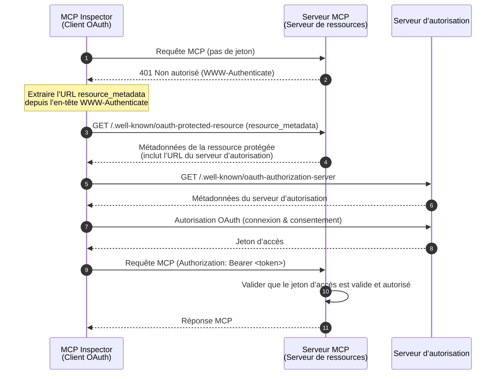
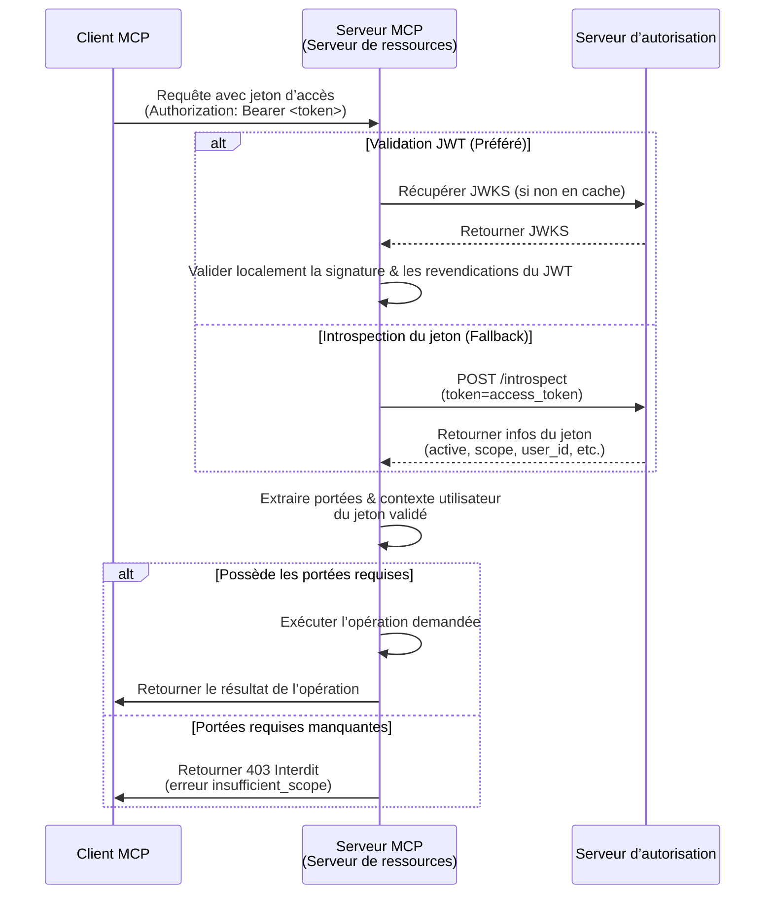

import TabItem from '@theme/TabItem';
import Tabs from '@theme/Tabs';

# Tutoriel : Créer un gestionnaire de tâches

:::tip SDK Python disponible
MCP Auth est également disponible pour Python ! Consultez le [dépôt SDK Python](https://github.com/mcp-auth/python) pour l'installation et l'utilisation.
:::

Dans ce tutoriel, nous allons construire un serveur MCP gestionnaire de tâches avec authentification et autorisation des utilisateurs. En suivant la dernière spécification MCP, notre serveur MCP agira comme un **Serveur de ressources** OAuth 2.0 qui valide les jetons d’accès et applique les permissions basées sur la portée (scope).

Après avoir terminé ce tutoriel, vous aurez :

- ✅ Une compréhension de base de la mise en place du contrôle d’accès basé sur les rôles (RBAC) dans votre serveur MCP.
- ✅ Un serveur MCP qui agit comme Serveur de ressources, consommant des jetons d’accès émis par un Serveur d’autorisation.
- ✅ Une implémentation fonctionnelle de l’application des permissions basées sur la portée pour les opérations de gestion des tâches.

## Vue d’ensemble \{#overview}

Le tutoriel impliquera les composants suivants :

- **Client MCP (MCP Inspector)** : Un outil de test visuel pour les serveurs MCP qui agit comme un client OAuth 2.0 / OIDC. Il initie le flux d’autorisation avec le serveur d’autorisation et obtient des jetons d’accès pour authentifier les requêtes vers le serveur MCP.
- **Serveur d’autorisation** : Un fournisseur OAuth 2.1 ou OpenID Connect qui gère les identités des utilisateurs, authentifie les utilisateurs et émet des jetons d’accès avec les portées appropriées aux clients autorisés.
- **Serveur MCP (Serveur de ressources)** : Selon la dernière spécification MCP, le serveur MCP agit comme un Serveur de ressources dans le cadre OAuth 2.0. Il valide les jetons d’accès émis par le serveur d’autorisation et applique les permissions basées sur la portée pour les opérations sur les tâches.

Cette architecture suit le flux standard OAuth 2.0 où :
- Le **MCP Inspector** demande des ressources protégées au nom de l’utilisateur
- Le **Serveur d’autorisation** authentifie l’utilisateur et émet des jetons d’accès
- Le **Serveur MCP** valide les jetons et sert les ressources protégées selon les permissions accordées

Voici un schéma de haut niveau de l’interaction entre ces composants :


```mermaid
sequenceDiagram
  autonumber
  participant Client as MCP Inspector<br/>(Client OAuth)
  participant RS as Serveur MCP<br/>(Serveur de ressources)
  participant AS as Serveur d’autorisation

  Client->>RS: Requête MCP (pas de jeton)
  RS-->>Client: 401 Non autorisé (WWW-Authenticate)
  Note over Client: Extraire l’URL resource_metadata<br/>depuis l’en-tête WWW-Authenticate

  Client->>RS: GET /.well-known/oauth-protected-resource (resource_metadata)
  RS-->>Client: Métadonnées de la ressource protégée<br/>(inclut l’URL du serveur d’autorisation)

  Client->>AS: GET /.well-known/oauth-authorization-server
  AS-->>Client: Métadonnées du serveur d’autorisation
  Client->>AS: Autorisation OAuth (connexion & consentement)
  AS-->>Client: Jeton d’accès

  Client->>RS: Requête MCP (Authorization: Bearer <token>)
  RS->>RS: Valider que le jeton d’accès est valide et autorisé
  RS-->>Client: Réponse MCP
```

## Comprendre votre serveur d’autorisation \{#understand-your-authorization-server}

### Jetons d’accès avec portées \{#access-tokens-with-scopes}

Pour mettre en œuvre le [contrôle d’accès basé sur les rôles (RBAC)](https://auth.wiki/rbac) dans votre serveur MCP, votre serveur d’autorisation doit prendre en charge l’émission de jetons d’accès avec des portées. Les portées représentent les permissions accordées à un utilisateur.

<Tabs groupId="provider">
<TabItem value="logto" label="Logto">

[Logto](https://logto.io) propose la prise en charge du RBAC via ses ressources API (conformes à [RFC 8707 : Indicateurs de ressource pour OAuth 2.0](https://datatracker.ietf.org/doc/html/rfc8707)) et ses fonctionnalités de rôles. Voici comment le configurer :

1. Connectez-vous à [Logto Console](https://cloud.logto.io) (ou à votre propre instance Logto Console)

2. Créez une ressource API et des portées :

   - Allez dans "Ressources API"
   - Créez une nouvelle ressource API nommée "Gestionnaire de tâches"
   - Ajoutez les portées suivantes :
     - `create:todos` : "Créer de nouvelles tâches"
     - `read:todos` : "Lire toutes les tâches"
     - `delete:todos` : "Supprimer n’importe quelle tâche"

3. Créez des rôles (recommandé pour une gestion plus simple) :

   - Allez dans "Rôles"
   - Créez un rôle "Admin" et assignez toutes les portées (`create:todos`, `read:todos`, `delete:todos`)
   - Créez un rôle "User" et assignez uniquement la portée `create:todos`

4. Attribuez les permissions :
   - Allez dans "Utilisateurs"
   - Sélectionnez un utilisateur
   - Vous pouvez soit :
     - Assigner des rôles dans l’onglet "Rôles" (recommandé)
     - Ou assigner directement des portées dans l’onglet "Permissions"

Les portées seront incluses dans la revendication `scope` du jeton d’accès JWT sous forme de chaîne séparée par des espaces.

</TabItem>
<TabItem value="oauth-oidc" label="OAuth 2.0 / OIDC">

Les fournisseurs OAuth 2.0 / OIDC prennent généralement en charge le contrôle d’accès basé sur la portée. Lors de la mise en œuvre du RBAC :

1. Définissez les portées requises dans votre serveur d’autorisation
2. Configurez votre client pour demander ces portées lors du flux d’autorisation
3. Assurez-vous que votre serveur d’autorisation inclut les portées accordées dans le jeton d’accès
4. Les portées sont généralement incluses dans la revendication `scope` du jeton d’accès JWT

Consultez la documentation de votre fournisseur pour les détails spécifiques sur :

- Comment définir et gérer les portées
- Comment les portées sont incluses dans le jeton d’accès
- D’éventuelles fonctionnalités RBAC supplémentaires comme la gestion des rôles

</TabItem>
</Tabs>

### Validation des jetons et vérification des permissions \{#validating-tokens-and-checking-permissions}

Selon la dernière spécification MCP, le serveur MCP agit comme un **Serveur de ressources** dans le cadre OAuth 2.0. En tant que Serveur de ressources, le serveur MCP a les responsabilités suivantes :

1. **Validation du jeton** : Vérifier l’authenticité et l’intégrité des jetons d’accès reçus des clients MCP
2. **Application des portées** : Extraire et valider les portées du jeton d’accès pour déterminer les opérations autorisées pour le client
3. **Protection des ressources** : Ne servir les ressources protégées (exécuter des outils) que lorsque le client présente des jetons valides avec des permissions suffisantes

Lorsque votre serveur MCP reçoit une requête, il effectue le processus de validation suivant :

1. Extraire le jeton d’accès de l’en-tête `Authorization` (format Bearer token)
2. Valider la signature et l’expiration du jeton d’accès
3. Extraire les portées et les informations utilisateur du jeton validé
4. Vérifier si le jeton possède les portées requises pour l’opération demandée

Par exemple, si un utilisateur souhaite créer une nouvelle tâche, son jeton d’accès doit inclure la portée `create:todos`. Voici comment fonctionne le flux de validation côté Serveur de ressources :


```mermaid
sequenceDiagram
    participant Client as Client MCP
    participant Server as Serveur MCP<br/>(Serveur de ressources)
    participant Auth as Serveur d’autorisation

    Client->>Server: Requête avec jeton d’accès<br/>(Authorization: Bearer <token>)

    alt Validation JWT (Préféré)
        Server->>Auth: Récupérer JWKS (si non en cache)
        Auth-->>Server: Retourner JWKS
        Server->>Server: Valider localement la signature & les revendications du JWT
    else Introspection du jeton (Fallback)
        Server->>Auth: POST /introspect<br/>(token=access_token)
        Auth-->>Server: Retourner infos du jeton<br/>(active, scope, user_id, etc.)
    end

    Server->>Server: Extraire portées & contexte utilisateur<br/>du jeton validé

    alt Possède les portées requises
        Server->>Server: Exécuter l’opération demandée
        Server->>Client: Retourner le résultat de l’opération
    else Portées requises manquantes
        Server->>Client: Retourner 403 Interdit<br/>(erreur insufficient_scope)
    end
```

### Enregistrement dynamique de client \{#dynamic-client-registration}

L’enregistrement dynamique de client n’est pas requis pour ce tutoriel, mais il peut être utile si vous souhaitez automatiser le processus d’enregistrement du client MCP auprès de votre serveur d’autorisation. Consultez [L’enregistrement dynamique de client est-il requis ?](/provider-list#is-dcr-required) pour plus de détails.

## Comprendre le RBAC dans le gestionnaire de tâches \{#understand-rbac-in-todo-manager}

À des fins de démonstration, nous allons implémenter un système simple de contrôle d’accès basé sur les rôles (RBAC) dans notre serveur MCP gestionnaire de tâches. Cela vous montrera les principes de base du RBAC tout en gardant l’implémentation simple.

:::note
Bien que ce tutoriel démontre la gestion des portées basée sur le RBAC, il est important de noter que tous les fournisseurs d’authentification n’implémentent pas la gestion des portées via les rôles. Certains fournisseurs peuvent avoir leurs propres mécanismes uniques pour gérer le contrôle d’accès et les permissions.
:::

### Outils et portées \{#tools-and-scopes}

Notre serveur MCP gestionnaire de tâches propose trois outils principaux :

- `create-todo` : Créer une nouvelle tâche
- `get-todos` : Lister toutes les tâches
- `delete-todo` : Supprimer une tâche par ID

Pour contrôler l’accès à ces outils, nous définissons les portées suivantes :

- `create:todos` : Autorise la création de nouvelles tâches
- `delete:todos` : Autorise la suppression de tâches existantes
- `read:todos` : Autorise la consultation et la récupération de la liste de toutes les tâches

### Rôles et permissions \{#roles-and-permissions}

Nous allons définir deux rôles avec différents niveaux d’accès :

| Rôle  | create:todos | read:todos | delete:todos |
| ----- | ------------ | ---------- | ------------ |
| Admin | ✅           | ✅         | ✅           |
| User  | ✅           |            |              |

- **User** : Un utilisateur classique qui peut créer des tâches et voir ou supprimer uniquement ses propres tâches
- **Admin** : Un administrateur qui peut créer, voir et supprimer toutes les tâches, quelle que soit leur propriété

### Propriété des ressources \{#resource-ownership}

Bien que le tableau des permissions ci-dessus montre les portées explicites attribuées à chaque rôle, il y a un principe important de propriété des ressources à considérer :

- **Les utilisateurs** n’ont pas les portées `read:todos` ou `delete:todos`, mais ils peuvent quand même :
  - Lire leurs propres tâches
  - Supprimer leurs propres tâches
- **Les admins** ont toutes les permissions (`read:todos` et `delete:todos`), ce qui leur permet de :
  - Voir toutes les tâches du système
  - Supprimer n’importe quelle tâche, quelle que soit la propriété

Cela illustre un schéma courant dans les systèmes RBAC où la propriété d’une ressource accorde des permissions implicites à l’utilisateur pour ses propres ressources, tandis que les rôles administratifs reçoivent des permissions explicites pour toutes les ressources.

:::tip En savoir plus
Pour approfondir les concepts et bonnes pratiques RBAC, consultez [Maîtriser le RBAC : Un exemple complet et réel](https://blog.logto.io/mastering-rbac).
:::

## Configurer l’autorisation dans votre fournisseur \{#configure-authorization-in-your-provider}

Pour mettre en œuvre le système de contrôle d’accès décrit précédemment, vous devrez configurer votre serveur d’autorisation pour prendre en charge les portées requises. Voici comment faire selon les fournisseurs :

<Tabs groupId="provider">
<TabItem value="logto" label="Logto">

[Logto](https://logto.io) propose la gestion RBAC via ses ressources API et ses fonctionnalités de rôles. Voici comment le configurer :

1. Connectez-vous à [Logto Console](https://cloud.logto.io) (ou à votre propre instance Logto Console)

2. Créez une ressource API et des portées :

   - Allez dans "Ressources API"
   - Créez une nouvelle ressource API nommée "Gestionnaire de tâches" et utilisez `http://localhost:3001` comme indicateur de ressource.
     - **Important** : L’indicateur de ressource doit correspondre à l’URL de votre serveur MCP. Pour ce tutoriel, nous utilisons `http://localhost:3001` car notre serveur MCP tourne sur le port 3001. En production, utilisez l’URL réelle de votre serveur MCP (par exemple, `https://votre-mcp-server.example.com`).
   - Créez les portées suivantes :
     - `create:todos` : "Créer de nouvelles tâches"
     - `read:todos` : "Lire toutes les tâches"
     - `delete:todos` : "Supprimer n’importe quelle tâche"

3. Créez des rôles (recommandé pour une gestion plus simple) :

   - Allez dans "Rôles"
   - Créez un rôle "Admin" et assignez toutes les portées (`create:todos`, `read:todos`, `delete:todos`)
   - Créez un rôle "User" et assignez uniquement la portée `create:todos`
   - Dans la page de détails du rôle "User", passez à l’onglet "Général" et définissez le rôle "User" comme "Rôle par défaut".

4. Gérez les rôles et permissions des utilisateurs :
   - Pour les nouveaux utilisateurs :
     - Ils recevront automatiquement le rôle "User" puisque nous l’avons défini comme rôle par défaut
   - Pour les utilisateurs existants :
     - Allez dans "Gestion des utilisateurs"
     - Sélectionnez un utilisateur
     - Attribuez des rôles à l’utilisateur dans l’onglet "Rôles"

:::tip Gestion programmatique des rôles
Vous pouvez également utiliser la [Management API](https://docs.logto.io/integrate-logto/interact-with-management-api) de Logto pour gérer les rôles des utilisateurs de manière programmatique. C’est particulièrement utile pour la gestion automatisée des utilisateurs ou lors de la création de panneaux d’administration.
:::

Lors de la demande d’un jeton d’accès, Logto inclura les portées dans la revendication `scope` du jeton selon les permissions du rôle de l’utilisateur.

</TabItem>
<TabItem value="oauth-or-oidc" label="OAuth 2 / OIDC">

Pour les fournisseurs OAuth 2.0 ou OpenID Connect, vous devrez configurer les portées qui représentent les différentes permissions. Les étapes exactes dépendront de votre fournisseur, mais généralement :

1. Définir les portées :

   - Configurez votre serveur d’autorisation pour prendre en charge :
     - `create:todos`
     - `read:todos`
     - `delete:todos`

2. Configurer le client :

   - Enregistrez ou mettez à jour votre client pour demander ces portées
   - Assurez-vous que les portées sont incluses dans le jeton d’accès

3. Attribuer les permissions :
   - Utilisez l’interface de votre fournisseur pour accorder les portées appropriées aux utilisateurs
   - Certains fournisseurs prennent en charge la gestion basée sur les rôles, d’autres utilisent l’attribution directe de portées
   - Consultez la documentation de votre fournisseur pour la méthode recommandée

:::tip
La plupart des fournisseurs incluront les portées accordées dans la revendication `scope` du jeton d’accès. Le format est généralement une chaîne de valeurs de portées séparées par des espaces.
:::

</TabItem>
</Tabs>

Après avoir configuré votre serveur d’autorisation, les utilisateurs recevront des jetons d’accès contenant leurs portées accordées. Le serveur MCP utilisera ces portées pour déterminer :

- Si un utilisateur peut créer de nouvelles tâches (`create:todos`)
- S’il peut voir toutes les tâches (`read:todos`) ou seulement les siennes
- S’il peut supprimer n’importe quelle tâche (`delete:todos`) ou seulement les siennes

## Mettre en place le serveur MCP \{#set-up-the-mcp-server}

Nous allons utiliser les [SDK officiels MCP](https://github.com/modelcontextprotocol) pour créer notre serveur MCP gestionnaire de tâches.

### Créer un nouveau projet \{#create-a-new-project}

Créez un nouveau projet Node.js :

```bash
mkdir mcp-server
cd mcp-server
npm init -y # Ou utilisez `pnpm init`
npm pkg set type="module"
npm pkg set main="todo-manager.ts"
npm pkg set scripts.start="node --experimental-strip-types todo-manager.ts"
```

:::note
Nous utilisons TypeScript dans nos exemples car Node.js v22.6.0+ prend en charge l’exécution native de TypeScript avec l’option `--experimental-strip-types`. Si vous utilisez JavaScript, le code sera similaire – assurez-vous simplement d’utiliser Node.js v22.6.0 ou plus récent. Voir la documentation Node.js pour plus de détails.
:::

### Installer le SDK MCP et les dépendances \{#install-the-mcp-sdk-and-dependencies}

```bash
npm install @modelcontextprotocol/sdk express zod
```

Ou tout autre gestionnaire de paquets que vous préférez, comme `pnpm` ou `yarn`.

### Créer le serveur MCP \{#create-the-mcp-server}

Créez un fichier nommé `todo-manager.ts` et ajoutez le code suivant :

[Le code TypeScript reste inchangé, conformément aux instructions.]

Lancez le serveur avec :

```bash
npm start
```

## Inspecter le serveur MCP \{#inspect-the-mcp-server}

### Cloner et lancer MCP inspector \{#clone-and-run-mcp-inspector}

Maintenant que nous avons le serveur MCP en fonctionnement, nous pouvons utiliser le MCP inspector pour vérifier si les outils sont disponibles.

La version officielle MCP inspector v0.16.2 présente quelques bugs affectant la fonctionnalité d’authentification. Pour y remédier, nous avons créé une [version corrigée du MCP inspector](https://github.com/mcp-auth/inspector/tree/patch/0.16.2-fixes) incluant les correctifs nécessaires pour les flux d’authentification OAuth / OIDC. Nous avons également soumis des pull requests au dépôt officiel pour contribuer ces correctifs en amont.

Pour lancer le MCP inspector, utilisez la commande suivante (Node.js requis) :

```bash
git clone https://github.com/mcp-auth/inspector.git -b patch/0.16.2-fixes
cd inspector
npm install
npm run dev
```

Le MCP inspector s’ouvrira automatiquement dans votre navigateur par défaut, ou vous pouvez y accéder manuellement en cliquant sur le lien affiché dans le terminal (assurez-vous de cliquer sur le lien contenant le paramètre `MCP_PROXY_AUTH_TOKEN`, tel que `http://localhost:6274/?MCP_PROXY_AUTH_TOKEN=458ae4a4...acab1907`).

### Connecter MCP inspector au serveur MCP \{#connect-mcp-inspector-to-the-mcp-server}

Avant de continuer, vérifiez la configuration suivante dans MCP inspector :

- **Type de transport** : Réglez sur `Streamable HTTP`.
- **URL** : Réglez sur l’URL de votre serveur MCP. Dans notre cas, ce sera `http://localhost:3001`.

Vous pouvez maintenant cliquer sur le bouton "Connect" pour voir si le MCP inspector peut se connecter au serveur MCP. Si tout est correct, vous devriez voir le statut "Connected" dans MCP inspector.

### Point de contrôle : Exécuter les outils du gestionnaire de tâches \{#checkpoint-run-todo-manager-tools}

1. Dans le menu supérieur du MCP inspector, cliquez sur l’onglet "Tools".
2. Cliquez sur le bouton "List Tools".
3. Vous devriez voir les outils `create-todo`, `get-todos` et `delete-todo` listés sur la page. Cliquez dessus pour ouvrir les détails de l’outil.
4. Vous devriez voir le bouton "Run Tool" à droite. Cliquez dessus et saisissez les paramètres requis pour exécuter l’outil.
5. Vous devriez voir le résultat de l’outil avec la réponse JSON `{"error": "Not implemented"}`.


## Intégrer avec votre serveur d’autorisation \{#integrate-with-your-authorization-server}

Pour compléter cette section, plusieurs points sont à prendre en compte :

<details>
<summary>**L’URL de l’émetteur (issuer) de votre serveur d’autorisation**</summary>

C’est généralement l’URL de base de votre serveur d’autorisation, comme `https://auth.example.com`. Certains fournisseurs peuvent avoir un chemin comme `https://example.logto.app/oidc`, vérifiez donc la documentation de votre fournisseur.

</details>

<details>
<summary>**Comment récupérer les métadonnées du serveur d’autorisation**</summary>

- Si votre serveur d’autorisation est conforme à [OAuth 2.0 Authorization Server Metadata](https://datatracker.ietf.org/doc/html/rfc8414) ou [OpenID Connect Discovery](https://openid.net/specs/openid-connect-discovery-1_0.html), vous pouvez utiliser les utilitaires intégrés de MCP Auth pour récupérer automatiquement les métadonnées.
- Si votre serveur d’autorisation n’est pas conforme à ces standards, vous devrez spécifier manuellement l’URL des métadonnées ou les points de terminaison dans la configuration du serveur MCP. Consultez la documentation de votre fournisseur pour les points de terminaison spécifiques.

</details>

<details>
<summary>**Comment enregistrer MCP inspector comme client dans votre serveur d’autorisation**</summary>

- Si votre serveur d’autorisation prend en charge [l’enregistrement dynamique de client](https://datatracker.ietf.org/doc/html/rfc7591), vous pouvez ignorer cette étape car MCP inspector s’enregistrera automatiquement comme client.
- Si votre serveur d’autorisation ne prend pas en charge l’enregistrement dynamique, vous devrez enregistrer manuellement MCP inspector comme client dans votre serveur d’autorisation.

</details>

<details>
<summary>**Comprendre les paramètres de la requête de jeton**</summary>

Lors de la demande de jetons d’accès auprès de différents serveurs d’autorisation, vous rencontrerez diverses approches pour spécifier la ressource cible et les permissions. Voici les principaux schémas :

- **Basé sur l’indicateur de ressource** :

  - Utilise le paramètre `resource` pour spécifier l’API cible (voir [RFC 8707 : Indicateurs de ressource pour OAuth 2.0](https://datatracker.ietf.org/doc/html/rfc8707))
  - Courant dans les implémentations OAuth 2.0 modernes
  - Exemple de requête :
    ```json
    {
      "resource": "http://localhost:3001",
      "scope": "create:todos read:todos"
    }
    ```
  - Le serveur émet des jetons liés spécifiquement à la ressource demandée

- **Basé sur l’audience** :

  - Utilise le paramètre `audience` pour spécifier le destinataire prévu du jeton
  - Semblable aux indicateurs de ressource mais avec des sémantiques différentes
  - Exemple de requête :
    ```json
    {
      "audience": "todo-api",
      "scope": "create:todos read:todos"
    }
    ```

- **Basé uniquement sur la portée** :
  - S’appuie uniquement sur les portées sans paramètres de ressource / audience
  - Approche OAuth 2.0 traditionnelle
  - Exemple de requête :
    ```json
    {
      "scope": "todo-api:create todo-api:read openid profile"
    }
    ```
  - Utilise souvent des portées préfixées pour nommer les permissions
  - Courant dans les implémentations OAuth 2.0 plus simples

:::tip Bonnes pratiques

- Consultez la documentation de votre fournisseur pour les paramètres pris en charge
- Certains fournisseurs prennent en charge plusieurs approches simultanément
- Les indicateurs de ressource offrent une meilleure sécurité via la restriction d’audience
- Privilégiez les indicateurs de ressource lorsque disponibles pour un meilleur contrôle d’accès
  :::

</details>

Bien que chaque fournisseur puisse avoir ses propres exigences spécifiques, les étapes suivantes vous guideront pour intégrer MCP inspector et le serveur MCP avec des configurations spécifiques au fournisseur.

### Enregistrer MCP inspector comme client \{#register-mcp-inspector-as-a-client}

<Tabs groupId="provider">
<TabItem value="logto" label="Logto">

L’intégration du gestionnaire de tâches avec [Logto](https://logto.io) est simple car il s’agit d’un fournisseur OpenID Connect qui prend en charge les indicateurs de ressource et les portées, vous permettant de sécuriser votre API de tâches avec `http://localhost:3001` comme indicateur de ressource.

Comme Logto ne prend pas encore en charge l’enregistrement dynamique de client, vous devrez enregistrer manuellement MCP inspector comme client dans votre tenant Logto :

1. Ouvrez votre MCP inspector, allez dans la configuration Authentification et cliquez sur la configuration "OAuth2.0 Flow". Copiez la valeur **Redirect URI**, qui devrait ressembler à `http://localhost:6274/oauth/callback`.
2. Connectez-vous à [Logto Console](https://cloud.logto.io) (ou à votre propre instance Logto Console).
3. Accédez à l’onglet "Applications", cliquez sur "Créer une application". En bas de la page, cliquez sur "Créer une application sans framework".
4. Remplissez les détails de l’application, puis cliquez sur "Créer l’application" :
   - **Sélectionnez un type d’application** : Choisissez "Application monopage".
   - **Nom de l’application** : Saisissez un nom, par exemple "MCP Inspector".
5. Dans la section "Paramètres / URI de redirection", collez la valeur **Redirect URI** copiée depuis MCP inspector. Cliquez ensuite sur "Enregistrer les modifications" dans la barre du bas.
6. Dans la carte du haut, vous verrez la valeur "App ID". Copiez-la.
7. Retournez dans MCP inspector et collez la valeur "App ID" dans la configuration Authentification sous "OAuth2.0 Flow" dans le champ "Client ID".
8. Dans le champ "Scope", saisissez : `create:todos read:todos delete:todos`. Cela garantira que le jeton d’accès retourné par Logto contient les portées nécessaires pour accéder au gestionnaire de tâches.

</TabItem>
<TabItem value="oauth-oidc" label="OAuth 2.0 / OIDC">

:::note
Ceci est un guide générique d’intégration OAuth 2.0 / OpenID Connect. Les deux suivent des étapes similaires car OIDC est construit sur OAuth 2.0. Consultez la documentation de votre fournisseur pour les détails spécifiques.
:::

Si votre fournisseur prend en charge l’enregistrement dynamique de client, vous pouvez passer directement à l’étape 8 ci-dessous pour configurer MCP inspector ; sinon, vous devrez enregistrer manuellement MCP inspector comme client :

1. Ouvrez votre MCP inspector, allez dans la configuration Authentification et cliquez sur la configuration "OAuth2.0 Flow". Copiez la valeur **Redirect URI**, qui devrait ressembler à `http://localhost:6274/oauth/callback`.

2. Connectez-vous à la console de votre fournisseur.

3. Accédez à la section "Applications" ou "Clients", puis créez une nouvelle application ou un nouveau client.

4. Si votre fournisseur demande un type de client, sélectionnez "Application monopage" ou "Client public".

5. Après avoir créé l’application, vous devrez configurer l’URI de redirection. Collez la valeur **Redirect URI** copiée depuis MCP inspector.

6. Trouvez l’"ID client" ou "ID d’application" de la nouvelle application et copiez-le.

7. Retournez dans MCP inspector et collez la valeur "Client ID" dans la configuration Authentification sous "OAuth2.0 Flow" dans le champ "Client ID".

8. Dans le champ "Scope", saisissez les portées suivantes pour demander les permissions nécessaires aux opérations sur les tâches :

```text
create:todos read:todos delete:todos
```

</TabItem>
</Tabs>

### Mettre en place MCP Auth \{#set-up-mcp-auth}

Commencez par installer le SDK MCP Auth dans votre projet serveur MCP.

import { NpmLikeInstallation } from '@site/src/components/NpmLikeInstallation';

<NpmLikeInstallation packageName="mcp-auth@0.2.0-beta.1" />

Nous devons maintenant initialiser MCP Auth dans votre serveur MCP. En mode ressource protégée, vous devez configurer vos métadonnées de ressource, y compris les serveurs d’autorisation.

Il existe deux façons de configurer les serveurs d’autorisation :

- **Pré-récupéré (recommandé)** : Utilisez `fetchServerConfig()` pour récupérer les métadonnées avant d’initialiser MCPAuth. Cela garantit que la configuration est validée au démarrage.
- **Découverte à la demande** : Fournissez uniquement `issuer` et `type` – les métadonnées seront récupérées à la demande lors du premier besoin. Ceci est utile pour les environnements edge (comme Cloudflare Workers) où l’appel asynchrone de haut niveau n’est pas autorisé.

#### Configurer les métadonnées de ressource protégée \{#configure-protected-resource-metadata}

Commencez par obtenir l’URL de l’émetteur (issuer) de votre serveur d’autorisation :

<Tabs groupId="provider">

<TabItem value="logto" label="Logto">

Dans Logto, vous pouvez trouver l’URL de l’émetteur sur la page de détails de votre application dans Logto Console, sous la section "Endpoints & Credentials / Issuer endpoint". Elle devrait ressembler à `https://my-project.logto.app/oidc`.

</TabItem>

<TabItem value="oauth-oidc" label="OAuth 2.0 / OIDC">

Pour les fournisseurs OAuth 2.0, vous devrez :

1. Consulter la documentation de votre fournisseur pour l’URL du serveur d’autorisation (souvent appelée issuer URL ou base URL)
2. Certains fournisseurs exposent cela à `https://{votre-domaine}/.well-known/oauth-authorization-server`
3. Chercher dans la console d’administration de votre fournisseur sous les paramètres OAuth / API

</TabItem>

</Tabs>

Configurez maintenant les métadonnées de ressource protégée lors de la création de l’instance MCP Auth :

[Le code JavaScript reste inchangé, conformément aux instructions.]

### Mettre à jour le serveur MCP \{#update-mcp-server}

Nous y sommes presque ! Il est temps de mettre à jour le serveur MCP pour appliquer la route et la fonction middleware MCP Auth, puis implémenter le contrôle d’accès basé sur les permissions pour les outils du gestionnaire de tâches selon les portées de l’utilisateur.

Appliquez maintenant les routes de métadonnées de ressource protégée afin que les clients MCP puissent récupérer les métadonnées attendues depuis le serveur MCP.

[Le code TypeScript reste inchangé, conformément aux instructions.]

Ensuite, appliquez le middleware MCP Auth au serveur MCP. Ce middleware gérera l’authentification et l’autorisation des requêtes entrantes, garantissant que seuls les utilisateurs autorisés peuvent accéder aux outils du gestionnaire de tâches.

[Le code TypeScript reste inchangé, conformément aux instructions.]

À ce stade, nous pouvons mettre à jour les outils du gestionnaire de tâches pour exploiter le middleware MCP Auth pour l’authentification et l’autorisation.

Mettons à jour l’implémentation des outils.

[Le code TypeScript reste inchangé, conformément aux instructions.]

Créez maintenant le "service Todo" utilisé dans le code ci-dessus pour implémenter la fonctionnalité associée :

Créez le fichier `todo-service.ts` pour le service Todo :

[Le code TypeScript reste inchangé, conformément aux instructions.]

Félicitations ! Nous avons implémenté avec succès un serveur MCP complet avec authentification et autorisation !

:::info
Consultez le [dépôt SDK Node.js MCP Auth](https://github.com/mcp-auth/js/blob/master/packages/sample-servers/src) pour le code complet du serveur MCP (version OIDC).
:::

## Point de contrôle : Exécuter les outils `todo-manager` \{#checkpoint-run-the-todo-manager-tools}

Redémarrez votre serveur MCP et ouvrez MCP inspector dans votre navigateur. Lorsque vous cliquez sur le bouton "Connect", vous devriez être redirigé vers la page de connexion de votre serveur d’autorisation.

Une fois connecté et de retour dans MCP inspector, répétez les actions du point de contrôle précédent pour exécuter les outils du gestionnaire de tâches. Cette fois, vous pouvez utiliser ces outils avec votre identité utilisateur authentifiée. Le comportement des outils dépendra des rôles et permissions attribués à votre utilisateur :

- Si vous êtes connecté en tant que **User** (avec uniquement la portée `create:todos`) :

  - Vous pouvez créer de nouvelles tâches avec l’outil `create-todo`
  - Vous ne pouvez voir et supprimer que vos propres tâches
  - Vous ne pourrez pas voir ou supprimer les tâches des autres utilisateurs

- Si vous êtes connecté en tant qu’**Admin** (avec toutes les portées : `create:todos`, `read:todos`, `delete:todos`) :
  - Vous pouvez créer de nouvelles tâches
  - Vous pouvez voir toutes les tâches du système avec l’outil `get-todos`
  - Vous pouvez supprimer n’importe quelle tâche avec l’outil `delete-todo`, quel que soit son créateur

Vous pouvez tester ces différents niveaux de permission en :

1. Vous déconnectant de la session en cours (cliquez sur le bouton "Disconnect" dans MCP inspector)
2. Vous connectant avec un autre compte utilisateur ayant des rôles / permissions différents
3. Essayant à nouveau les mêmes outils pour observer comment le comportement change selon les permissions de l’utilisateur

Cela démontre comment le contrôle d’accès basé sur les rôles (RBAC) fonctionne en pratique, où différents utilisateurs ont différents niveaux d’accès aux fonctionnalités du système.


:::info
Consultez le [dépôt SDK Node.js MCP Auth](https://github.com/mcp-auth/js/blob/master/packages/sample-servers/src) pour le code complet du serveur MCP (version OIDC).
:::

## Notes de clôture \{#closing-notes}

Félicitations ! Vous avez terminé avec succès le tutoriel. Récapitulons ce que nous avons fait :

- Mise en place d’un serveur MCP de base avec des outils de gestion des tâches (`create-todo`, `get-todos`, `delete-todo`)
- Implémentation du contrôle d’accès basé sur les rôles (RBAC) avec différents niveaux de permissions pour les utilisateurs et les admins
- Intégration du serveur MCP avec un serveur d’autorisation via MCP Auth
- Configuration de MCP Inspector pour authentifier les utilisateurs et utiliser des jetons d’accès avec portées pour appeler les outils

N’hésitez pas à consulter d’autres tutoriels et la documentation pour tirer le meilleur parti de MCP Auth.
