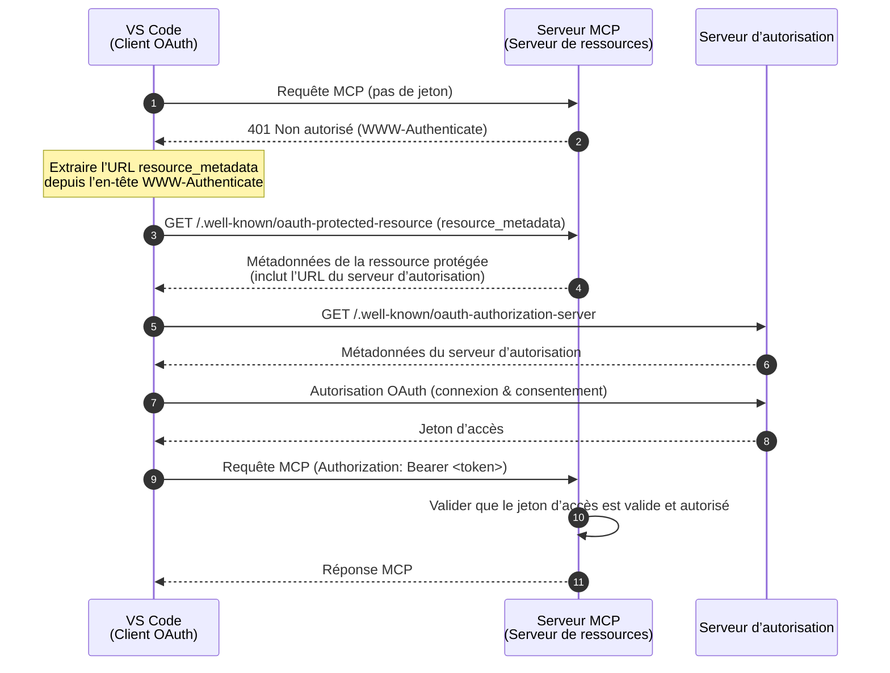
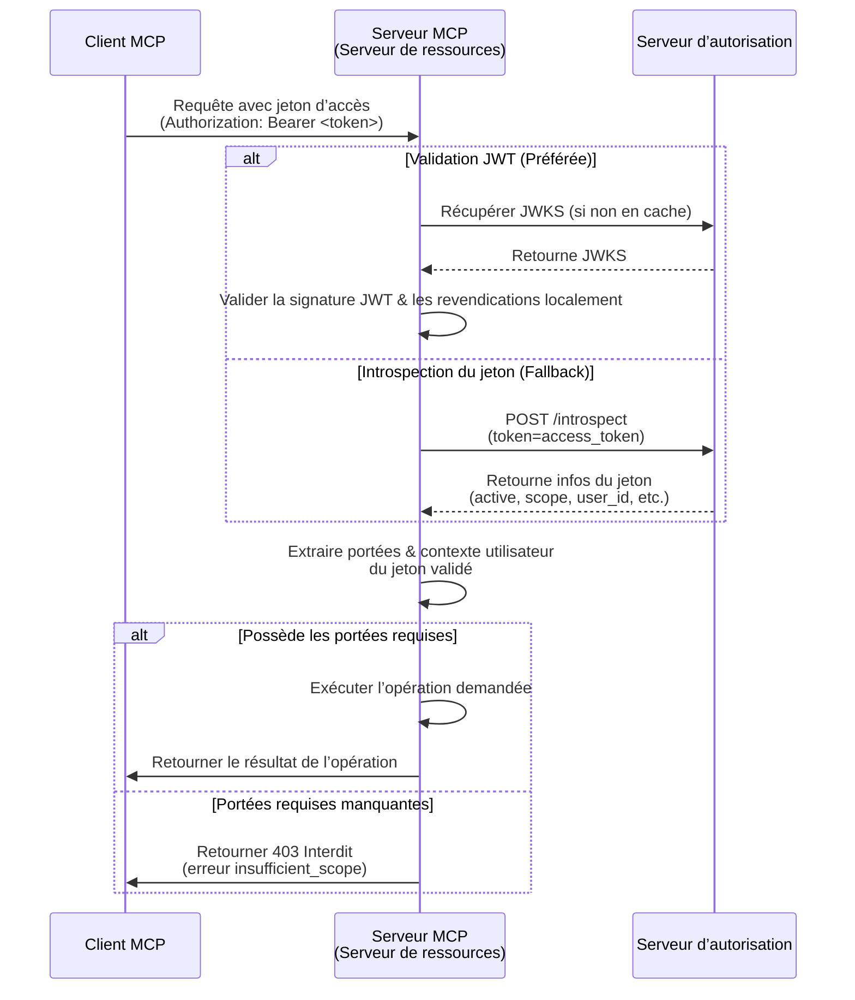

import { NpmLikeInstallation } from '@site/src/components/NpmLikeInstallation';
import TabItem from '@theme/TabItem';
import Tabs from '@theme/Tabs';

# Tutoriel : Créer un gestionnaire de tâches

:::tip SDK Python disponible
MCP Auth est également disponible pour Python ! Consultez le [dépôt SDK Python](https://github.com/mcp-auth/python) pour l'installation et l'utilisation.
:::

Dans ce tutoriel, nous allons construire un serveur MCP gestionnaire de tâches avec authentification et autorisation des utilisateurs. En suivant la dernière spécification MCP, notre serveur MCP agira en tant que **Serveur de ressources** OAuth 2.0 qui valide les jetons d’accès et applique les permissions basées sur la portée (scope).

Après avoir terminé ce tutoriel, vous aurez :

- ✅ Une compréhension de base de la mise en place du contrôle d’accès basé sur les rôles (RBAC) dans votre serveur MCP.
- ✅ Un serveur MCP qui agit comme un Serveur de ressources, consommant des jetons d’accès émis par un Serveur d’autorisation.
- ✅ Une implémentation fonctionnelle de l’application des permissions basées sur la portée pour les opérations sur les tâches.

## Vue d’ensemble \{#overview}

Le tutoriel impliquera les composants suivants :

- **Client MCP (VS Code)** : Un éditeur de code avec prise en charge MCP intégrée qui agit comme un client OAuth 2.0 / OIDC. Il initie le flux d’autorisation avec le serveur d’autorisation et obtient des jetons d’accès pour authentifier les requêtes vers le serveur MCP.
- **Serveur d’autorisation** : Un fournisseur OAuth 2.1 ou OpenID Connect qui gère les identités des utilisateurs, authentifie les utilisateurs et émet des jetons d’accès avec les portées appropriées aux clients autorisés.
- **Serveur MCP (Serveur de ressources)** : Selon la dernière spécification MCP, le serveur MCP agit comme un Serveur de ressources dans le cadre OAuth 2.0. Il valide les jetons d’accès émis par le serveur d’autorisation et applique les permissions basées sur la portée pour les opérations sur les tâches.

Cette architecture suit le flux standard OAuth 2.0 où :

- **VS Code** demande des ressources protégées au nom de l’utilisateur
- Le **Serveur d’autorisation** authentifie l’utilisateur et émet des jetons d’accès
- Le **Serveur MCP** valide les jetons et sert les ressources protégées selon les permissions accordées

Voici un schéma de haut niveau de l’interaction entre ces composants :


```mermaid
sequenceDiagram
  autonumber
  participant Client as VS Code<br/>(Client OAuth)
  participant RS as Serveur MCP<br/>(Serveur de ressources)
  participant AS as Serveur d’autorisation

  Client->>RS: Requête MCP (pas de jeton)
  RS-->>Client: 401 Non autorisé (WWW-Authenticate)
  Note over Client: Extraire l’URL resource_metadata<br/>depuis l’en-tête WWW-Authenticate

  Client->>RS: GET /.well-known/oauth-protected-resource (resource_metadata)
  RS-->>Client: Métadonnées de la ressource protégée<br/>(inclut l’URL du serveur d’autorisation)

  Client->>AS: GET /.well-known/oauth-authorization-server
  AS-->>Client: Métadonnées du serveur d’autorisation
  Client->>AS: Autorisation OAuth (connexion & consentement)
  AS-->>Client: Jeton d’accès

  Client->>RS: Requête MCP (Authorization: Bearer <token>)
  RS->>RS: Valider que le jeton d’accès est valide et autorisé
  RS-->>Client: Réponse MCP
```

## Comprendre votre serveur d’autorisation \{#understand-your-authorization-server}

### Jetons d’accès avec portées \{#access-tokens-with-scopes}

Pour mettre en œuvre le [contrôle d’accès basé sur les rôles (RBAC)](https://auth.wiki/rbac) dans votre serveur MCP, votre serveur d’autorisation doit prendre en charge l’émission de jetons d’accès avec des portées. Les portées représentent les permissions accordées à un utilisateur.

<Tabs groupId="provider">
<TabItem value="logto" label="Logto">

[Logto](https://logto.io) propose la prise en charge du RBAC via ses ressources API (conformes à [RFC 8707 : Indicateurs de ressource pour OAuth 2.0](https://datatracker.ietf.org/doc/html/rfc8707)) et ses fonctionnalités de rôles. Voici comment le configurer :

1. Connectez-vous à [Logto Console](https://cloud.logto.io) (ou à votre propre instance Logto Console)

2. Créez une ressource API et des portées :

   - Allez dans "Ressources API"
   - Créez une nouvelle ressource API nommée "Todo Manager"
   - Ajoutez les portées suivantes :
     - `create:todos` : "Créer de nouveaux éléments de tâches"
     - `read:todos` : "Lire tous les éléments de tâches"
     - `delete:todos` : "Supprimer n’importe quel élément de tâche"

3. Créez des rôles (recommandé pour une gestion plus facile) :

   - Allez dans "Rôles"
   - Créez un rôle "Admin" et assignez toutes les portées (`create:todos`, `read:todos`, `delete:todos`)
   - Créez un rôle "User" et assignez uniquement la portée `create:todos`

4. Attribuez les permissions :
   - Allez dans "Utilisateurs"
   - Sélectionnez un utilisateur
   - Vous pouvez soit :
     - Attribuer des rôles dans l’onglet "Rôles" (recommandé)
     - Ou attribuer directement des portées dans l’onglet "Permissions"

Les portées seront incluses dans la revendication `scope` du jeton d’accès JWT sous forme de chaîne séparée par des espaces.

</TabItem>
<TabItem value="oauth-oidc" label="OAuth 2.0 / OIDC">

Les fournisseurs OAuth 2.0 / OIDC prennent généralement en charge le contrôle d’accès basé sur la portée. Lors de la mise en œuvre du RBAC :

1. Définissez les portées requises dans votre serveur d’autorisation
2. Configurez votre client pour demander ces portées lors du flux d’autorisation
3. Assurez-vous que votre serveur d’autorisation inclut les portées accordées dans le jeton d’accès
4. Les portées sont généralement incluses dans la revendication `scope` du jeton d’accès JWT

Consultez la documentation de votre fournisseur pour plus de détails sur :

- Comment définir et gérer les portées
- Comment les portées sont incluses dans le jeton d’accès
- Toutes fonctionnalités RBAC supplémentaires comme la gestion des rôles

</TabItem>
</Tabs>

### Validation des jetons et vérification des permissions \{#validating-tokens-and-checking-permissions}

Selon la dernière spécification MCP, le serveur MCP agit comme un **Serveur de ressources** dans le cadre OAuth 2.0. En tant que Serveur de ressources, le serveur MCP a les responsabilités suivantes :

1. **Validation du jeton** : Vérifier l’authenticité et l’intégrité des jetons d’accès reçus des clients MCP
2. **Application des portées** : Extraire et valider les portées du jeton d’accès pour déterminer quelles opérations le client est autorisé à effectuer
3. **Protection des ressources** : Ne servir les ressources protégées (exécuter les outils) que lorsque le client présente des jetons valides avec des permissions suffisantes

Lorsque votre serveur MCP reçoit une requête, il effectue le processus de validation suivant :

1. Extraire le jeton d’accès de l’en-tête `Authorization` (format Bearer token)
2. Valider la signature et l’expiration du jeton d’accès
3. Extraire les portées et les informations utilisateur du jeton validé
4. Vérifier si le jeton possède les portées requises pour l’opération demandée

Par exemple, si un utilisateur souhaite créer une nouvelle tâche, son jeton d’accès doit inclure la portée `create:todos`. Voici comment fonctionne le flux de validation côté Serveur de ressources :


```mermaid
sequenceDiagram
    participant Client as Client MCP
    participant Server as Serveur MCP<br/>(Serveur de ressources)
    participant Auth as Serveur d’autorisation

    Client->>Server: Requête avec jeton d’accès<br/>(Authorization: Bearer <token>)

    alt Validation JWT (Préférée)
        Server->>Auth: Récupérer JWKS (si non en cache)
        Auth-->>Server: Retourne JWKS
        Server->>Server: Valider la signature JWT & les revendications localement
    else Introspection du jeton (Fallback)
        Server->>Auth: POST /introspect<br/>(token=access_token)
        Auth-->>Server: Retourne infos du jeton<br/>(active, scope, user_id, etc.)
    end

    Server->>Server: Extraire portées & contexte utilisateur<br/>du jeton validé

    alt Possède les portées requises
        Server->>Server: Exécuter l’opération demandée
        Server->>Client: Retourner le résultat de l’opération
    else Portées requises manquantes
        Server->>Client: Retourner 403 Interdit<br/>(erreur insufficient_scope)
    end
```

### Enregistrement dynamique du client \{#dynamic-client-registration}

L’enregistrement dynamique du client n’est pas requis pour ce tutoriel, mais il peut être utile si vous souhaitez automatiser le processus d’enregistrement du client MCP auprès de votre serveur d’autorisation. Consultez [L’enregistrement dynamique du client est-il requis ?](/provider-list#is-dcr-required) pour plus de détails.

## Comprendre le RBAC dans le gestionnaire de tâches \{#understand-rbac-in-todo-manager}

À des fins de démonstration, nous allons implémenter un système simple de contrôle d’accès basé sur les rôles (RBAC) dans notre serveur MCP gestionnaire de tâches. Cela vous montrera les principes de base du RBAC tout en gardant l’implémentation simple.

:::note
Bien que ce tutoriel démontre la gestion des portées basée sur le RBAC, il est important de noter que tous les fournisseurs d’authentification n’implémentent pas la gestion des portées via les rôles. Certains fournisseurs peuvent avoir leurs propres mécanismes uniques pour gérer le contrôle d’accès et les permissions.
:::

### Outils et portées \{#tools-and-scopes}

Notre serveur MCP gestionnaire de tâches fournit trois outils principaux :

- `create-todo` : Créer une nouvelle tâche
- `get-todos` : Lister toutes les tâches
- `delete-todo` : Supprimer une tâche par ID

Pour contrôler l’accès à ces outils, nous définissons les portées suivantes :

- `create:todos` : Autorise la création de nouvelles tâches
- `delete:todos` : Autorise la suppression de tâches existantes
- `read:todos` : Autorise la consultation et la récupération de la liste de toutes les tâches

### Rôles et permissions \{#roles-and-permissions}

Nous allons définir deux rôles avec différents niveaux d’accès :

| Rôle  | create:todos | read:todos | delete:todos |
| ----- | ------------ | ---------- | ------------ |
| Admin | ✅           | ✅         | ✅           |
| User  | ✅           |            |              |

- **User** : Un utilisateur régulier qui peut créer des tâches et voir ou supprimer uniquement ses propres tâches
- **Admin** : Un administrateur qui peut créer, voir et supprimer toutes les tâches, quel que soit le propriétaire

### Propriété des ressources \{#resource-ownership}

Bien que le tableau des permissions ci-dessus montre les portées explicites attribuées à chaque rôle, il y a un principe important de propriété des ressources à considérer :

- **Les utilisateurs** n’ont pas les portées `read:todos` ou `delete:todos`, mais ils peuvent quand même :
  - Lire leurs propres tâches
  - Supprimer leurs propres tâches
- **Les admins** ont toutes les permissions (`read:todos` et `delete:todos`), ce qui leur permet de :
  - Voir toutes les tâches du système
  - Supprimer n’importe quelle tâche, quel que soit le propriétaire

Cela illustre un schéma courant dans les systèmes RBAC où la propriété d’une ressource accorde des permissions implicites aux utilisateurs pour leurs propres ressources, tandis que les rôles administratifs reçoivent des permissions explicites pour toutes les ressources.

:::tip En savoir plus
Pour approfondir les concepts et bonnes pratiques du RBAC, consultez [Maîtriser le RBAC : Un exemple complet et concret](https://blog.logto.io/mastering-rbac).
:::

## Configurer l’autorisation dans votre fournisseur \{#configure-authorization-in-your-provider}

Pour mettre en œuvre le système de contrôle d’accès décrit précédemment, vous devrez configurer votre serveur d’autorisation pour prendre en charge les portées requises. Voici comment faire avec différents fournisseurs :

<Tabs groupId="provider">
<TabItem value="logto" label="Logto">

[Logto](https://logto.io) propose la prise en charge du RBAC via ses ressources API et ses fonctionnalités de rôles. Voici comment le configurer :

1. Connectez-vous à [Logto Console](https://cloud.logto.io) (ou à votre propre instance Logto Console)

2. Créez une ressource API et des portées :

   - Allez dans "Ressources API"
   - Créez une nouvelle ressource API nommée "Todo Manager" en utilisant `http://localhost:3001/` comme indicateur de ressource.
     - **Important** : L’indicateur de ressource doit correspondre à l’URL de votre serveur MCP. Pour ce tutoriel, nous utilisons `http://localhost:3001/` puisque notre serveur MCP tourne sur le port 3001. En production, utilisez l’URL réelle de votre serveur MCP (par exemple, `https://your-mcp-server.example.com/`).
   - Créez les portées suivantes :
     - `create:todos` : "Créer de nouveaux éléments de tâches"
     - `read:todos` : "Lire tous les éléments de tâches"
     - `delete:todos` : "Supprimer n’importe quel élément de tâche"

3. Créez des rôles (recommandé pour une gestion plus facile) :

   - Allez dans "Rôles"
   - Créez un rôle "Admin" et assignez toutes les portées (`create:todos`, `read:todos`, `delete:todos`)
   - Créez un rôle "User" et assignez uniquement la portée `create:todos`
   - Dans la page de détails du rôle "User", passez à l’onglet "Général" et définissez le rôle "User" comme "Rôle par défaut".

4. Gérer les rôles et permissions des utilisateurs :
   - Pour les nouveaux utilisateurs :
     - Ils recevront automatiquement le rôle "User" puisque nous l’avons défini comme rôle par défaut
   - Pour les utilisateurs existants :
     - Allez dans "Gestion des utilisateurs"
     - Sélectionnez un utilisateur
     - Attribuez des rôles à l’utilisateur dans l’onglet "Rôles"

:::tip Gestion des rôles par API
Vous pouvez également utiliser la [Management API](https://docs.logto.io/integrate-logto/interact-with-management-api) de Logto pour gérer les rôles des utilisateurs de manière programmatique. Ceci est particulièrement utile pour la gestion automatisée des utilisateurs ou lors de la création de panneaux d’administration.
:::

Lors de la demande d’un jeton d’accès, Logto inclura les portées dans la revendication `scope` du jeton en fonction des permissions de rôle de l’utilisateur.

</TabItem>
<TabItem value="oauth-or-oidc" label="OAuth 2 / OIDC">

Pour les fournisseurs OAuth 2.0 ou OpenID Connect, vous devrez configurer les portées qui représentent différentes permissions. Les étapes exactes dépendront de votre fournisseur, mais en général :

1. Définir les portées :

   - Configurez votre serveur d’autorisation pour prendre en charge :
     - `create:todos`
     - `read:todos`
     - `delete:todos`

2. Configurer le client :

   - Enregistrez ou mettez à jour votre client pour demander ces portées
   - Assurez-vous que les portées sont incluses dans le jeton d’accès

3. Attribuer les permissions :
   - Utilisez l’interface de votre fournisseur pour accorder les portées appropriées aux utilisateurs
   - Certains fournisseurs peuvent prendre en charge la gestion basée sur les rôles, tandis que d’autres utilisent des attributions de portées directes
   - Consultez la documentation de votre fournisseur pour la méthode recommandée

:::tip
La plupart des fournisseurs incluront les portées accordées dans la revendication `scope` du jeton d’accès. Le format est généralement une chaîne de valeurs de portées séparées par des espaces.
:::

</TabItem>
</Tabs>

:::note[Barre oblique finale dans l’indicateur de ressource]
Incluez toujours une barre oblique finale (`/`) dans l’indicateur de ressource. En raison d’un bug actuel dans le SDK officiel MCP, les clients utilisant le SDK ajouteront automatiquement une barre oblique finale aux identifiants de ressource lors de l’initiation des requêtes d’authentification. Si votre indicateur de ressource n’inclut pas la barre oblique, la validation de la ressource échouera pour ces clients. (VS Code n’est pas affecté par ce bug.)
:::

Après avoir configuré votre serveur d’autorisation, les utilisateurs recevront des jetons d’accès contenant leurs portées accordées. Le serveur MCP utilisera ces portées pour déterminer :

- Si un utilisateur peut créer de nouvelles tâches (`create:todos`)
- Si un utilisateur peut voir toutes les tâches (`read:todos`) ou seulement les siennes
- Si un utilisateur peut supprimer n’importe quelle tâche (`delete:todos`) ou seulement les siennes

## Mettre en place le serveur MCP \{#set-up-the-mcp-server}

Nous allons utiliser les [SDK officiels MCP](https://github.com/modelcontextprotocol) pour créer notre serveur MCP gestionnaire de tâches.

### Créer un nouveau projet \{#create-a-new-project}

Créez un nouveau projet Node.js :

```bash
mkdir mcp-server
cd mcp-server
npm init -y # Ou utilisez `pnpm init`
npm pkg set type="module"
npm pkg set main="todo-manager.ts"
npm pkg set scripts.start="node --experimental-strip-types todo-manager.ts"
```

:::note
Nous utilisons TypeScript dans nos exemples car Node.js v22.6.0+ prend en charge l’exécution native de TypeScript avec l’option `--experimental-strip-types`. Si vous utilisez JavaScript, le code sera similaire – assurez-vous simplement d’utiliser Node.js v22.6.0 ou ultérieur. Voir la documentation Node.js pour plus de détails.
:::

### Installer le SDK MCP et les dépendances \{#install-the-mcp-sdk-and-dependencies}

```bash
npm install @modelcontextprotocol/sdk express zod
```

Ou tout autre gestionnaire de paquets que vous préférez, comme `pnpm` ou `yarn`.

### Créer le serveur MCP \{#create-the-mcp-server}

Créez un fichier nommé `todo-manager.ts` et ajoutez le code suivant :

```ts
// todo-manager.ts

import { z } from 'zod';
import { McpServer } from '@modelcontextprotocol/sdk/server/mcp.js';
import { StreamableHTTPServerTransport } from '@modelcontextprotocol/sdk/server/streamableHttp.js';
import express, { type Request, type Response } from 'express';

// Créer un serveur MCP
const server = new McpServer({
  name: 'Todo Manager',
  version: '0.0.0',
});

server.registerTool(
  'create-todo',
  {
    description: 'Créer une nouvelle tâche',
    inputSchema: { content: z.string() },
  },
  async ({ content }) => {
    return {
      content: [{ type: 'text', text: JSON.stringify({ error: 'Non implémenté' }) }],
    };
  }
);

server.registerTool(
  'get-todos',
  {
    description: 'Lister toutes les tâches',
    inputSchema: {},
  },
  async () => {
    return {
      content: [{ type: 'text', text: JSON.stringify({ error: 'Non implémenté' }) }],
    };
  }
);

server.registerTool(
  'delete-todo',
  {
    description: 'Supprimer une tâche par id',
    inputSchema: { id: z.string() },
  },
  async ({ id }) => {
    return {
      content: [{ type: 'text', text: JSON.stringify({ error: 'Non implémenté' }) }],
    };
  }
);

// Ci-dessous le code standard issu de la documentation du SDK MCP
const PORT = 3001;
const app = express();

app.post('/', async (request: Request, response: Response) => {
  // En mode stateless, créez une nouvelle instance de transport et de serveur pour chaque requête
  // afin d’assurer une isolation complète. Une seule instance causerait des collisions d’ID de requête
  // lorsque plusieurs clients se connectent simultanément.

  try {
    const transport: StreamableHTTPServerTransport = new StreamableHTTPServerTransport({
      sessionIdGenerator: undefined,
    });
    response.on('close', async () => {
      console.log('Requête fermée');
      await transport.close();
      await server.close();
    });
    await server.connect(transport);
    await transport.handleRequest(request, response, request.body);
  } catch (error) {
    console.error('Erreur lors du traitement de la requête MCP :', error);
    if (!response.headersSent) {
      response.status(500).json({
        jsonrpc: '2.0',
        error: {
          code: -32_603,
          message: 'Erreur interne du serveur',
        },
        id: null,
      });
    }
  }
});

// Les notifications SSE ne sont pas prises en charge en mode stateless
app.get('/', async (request: Request, response: Response) => {
  console.log('Reçu une requête GET MCP');
  response.writeHead(405).end(
    JSON.stringify({
      jsonrpc: '2.0',
      error: {
        code: -32_000,
        message: 'Méthode non autorisée.',
      },
      id: null,
    })
  );
});

// La terminaison de session n’est pas nécessaire en mode stateless
app.delete('/', async (request: Request, response: Response) => {
  console.log('Reçu une requête DELETE MCP');
  response.writeHead(405).end(
    JSON.stringify({
      jsonrpc: '2.0',
      error: {
        code: -32_000,
        message: 'Méthode non autorisée.',
      },
      id: null,
    })
  );
});

app.listen(PORT);
```

Lancez le serveur avec :

```bash
npm start
```

## Intégrer avec votre serveur d’autorisation \{#integrate-with-your-authorization-server}

Pour compléter cette section, plusieurs considérations sont à prendre en compte :

<details>
<summary>**L’URL de l’émetteur de votre serveur d’autorisation**</summary>

Il s’agit généralement de l’URL de base de votre serveur d’autorisation, comme `https://auth.example.com`. Certains fournisseurs peuvent avoir un chemin comme `https://example.logto.app/oidc`, alors vérifiez la documentation de votre fournisseur.

</details>

<details>
<summary>**Comment récupérer les métadonnées du serveur d’autorisation**</summary>

- Si votre serveur d’autorisation est conforme à [OAuth 2.0 Authorization Server Metadata](https://datatracker.ietf.org/doc/html/rfc8414) ou [OpenID Connect Discovery](https://openid.net/specs/openid-connect-discovery-1_0.html), vous pouvez utiliser les utilitaires intégrés de MCP Auth pour récupérer automatiquement les métadonnées.
- Si votre serveur d’autorisation n’est pas conforme à ces standards, vous devrez spécifier manuellement l’URL des métadonnées ou les points de terminaison dans la configuration du serveur MCP. Consultez la documentation de votre fournisseur pour les points de terminaison spécifiques.

</details>

<details>
<summary>**Comment enregistrer le client MCP dans votre serveur d’autorisation**</summary>

- Si votre serveur d’autorisation prend en charge [l’enregistrement dynamique du client](https://datatracker.ietf.org/doc/html/rfc7591), vous pouvez ignorer cette étape car le client MCP s’enregistrera automatiquement.
- Si votre serveur d’autorisation ne prend pas en charge l’enregistrement dynamique du client, vous devrez enregistrer manuellement le client MCP dans votre serveur d’autorisation.

</details>

<details>
<summary>**Comprendre les paramètres de requête de jeton**</summary>

Lorsque vous demandez des jetons d’accès à différents serveurs d’autorisation, vous rencontrerez diverses approches pour spécifier la ressource cible et les permissions. Voici les principaux schémas :

- **Basé sur l’indicateur de ressource** :

  - Utilise le paramètre `resource` pour spécifier l’API cible (voir [RFC 8707 : Indicateurs de ressource pour OAuth 2.0](https://datatracker.ietf.org/doc/html/rfc8707))
  - Courant dans les implémentations OAuth 2.0 modernes
  - Exemple de requête :
    ```json
    {
      "resource": "http://localhost:3001/",
      "scope": "create:todos read:todos"
    }
    ```
  - Le serveur émet des jetons liés spécifiquement à la ressource demandée

- **Basé sur l’audience** :

  - Utilise le paramètre `audience` pour spécifier le destinataire prévu du jeton
  - Semblable aux indicateurs de ressource mais avec une sémantique différente
  - Exemple de requête :
    ```json
    {
      "audience": "todo-api",
      "scope": "create:todos read:todos"
    }
    ```

- **Basé uniquement sur la portée** :
  - S’appuie uniquement sur les portées sans paramètres de ressource / audience
  - Approche OAuth 2.0 traditionnelle
  - Exemple de requête :
    ```json
    {
      "scope": "todo-api:create todo-api:read openid profile"
    }
    ```
  - Utilise souvent des portées préfixées pour nommer les permissions
  - Courant dans les implémentations OAuth 2.0 plus simples

:::tip Bonnes pratiques

- Consultez la documentation de votre fournisseur pour les paramètres pris en charge
- Certains fournisseurs prennent en charge plusieurs approches simultanément
- Les indicateurs de ressource offrent une meilleure sécurité via la restriction d’audience
- Envisagez d’utiliser les indicateurs de ressource lorsque c’est possible pour un meilleur contrôle d’accès
  :::

</details>

Bien que chaque fournisseur puisse avoir ses propres exigences spécifiques, les étapes suivantes vous guideront dans l’intégration de VS Code et du serveur MCP avec des configurations spécifiques au fournisseur.

### Enregistrer le client MCP comme application tierce \{#register-mcp-client-as-a-third-party-app}

<Tabs groupId="provider">
<TabItem value="logto" label="Logto">

L’intégration du gestionnaire de tâches avec [Logto](https://logto.io) est simple puisqu’il s’agit d’un fournisseur OpenID Connect qui prend en charge les indicateurs de ressource et les portées, vous permettant de sécuriser votre API de tâches avec `http://localhost:3001/` comme indicateur de ressource.

Comme Logto ne prend pas encore en charge l’enregistrement dynamique du client, vous devrez enregistrer manuellement votre client MCP (VS Code) comme application tierce dans votre tenant Logto :

1. Connectez-vous à [Logto Console](https://cloud.logto.io) (ou à votre propre instance Logto Console).
2. Naviguez vers **Applications > Applications tierces** et cliquez sur "Créer une application".
3. Sélectionnez **Application native** comme type d’application.
4. Renseignez les détails de l’application :
   - **Nom de l’application** : Entrez un nom, par exemple "MCP Client".
   - **Description** : Entrez une description, par exemple "Client MCP pour VS Code".
5. Définissez les **URI de redirection** suivants pour VS Code :
   ```
   http://127.0.0.1
   https://vscode.dev/redirect
   ```
6. Cliquez sur "Enregistrer les modifications".
7. Allez dans l’onglet **Permissions** de l’application, sous la section **Utilisateur**, ajoutez les permissions `create:todos`, `read:todos` et `delete:todos` de la ressource API **Todo Manager** que vous avez créée précédemment.
8. Dans la carte supérieure, vous verrez la valeur "App ID". Copiez-la pour une utilisation ultérieure.

</TabItem>
<TabItem value="oauth-oidc" label="OAuth 2.0 / OIDC">

:::note
Ceci est un guide générique d’intégration OAuth 2.0 / OpenID Connect. Les deux suivent des étapes similaires car OIDC est construit sur OAuth 2.0. Consultez la documentation de votre fournisseur pour les détails spécifiques.
:::

Si votre fournisseur prend en charge l’enregistrement dynamique du client, vous pouvez ignorer l’enregistrement manuel ; sinon, vous devrez enregistrer manuellement le client MCP :

1. Connectez-vous à la console de votre fournisseur.

2. Naviguez vers la section "Applications" ou "Clients", puis créez une nouvelle application ou client.

3. Si votre fournisseur demande un type de client, sélectionnez "Application native" ou "Client public".

4. Après avoir créé l’application, configurez les URI de redirection. Pour VS Code, ajoutez les suivants :

   ```
   http://127.0.0.1
   https://vscode.dev/redirect
   ```

5. Configurez les portées / permissions requises pour l’application :

   ```text
   create:todos read:todos delete:todos
   ```

6. Trouvez l’"ID client" ou "ID d’application" de la nouvelle application et copiez-le pour une utilisation ultérieure.

</TabItem>
</Tabs>

### Mettre en place MCP Auth \{#set-up-mcp-auth}

Commencez par installer le SDK MCP Auth dans votre projet serveur MCP.

<NpmLikeInstallation packageName="mcp-auth" />

Nous devons maintenant initialiser MCP Auth dans votre serveur MCP. En mode ressource protégée, vous devez configurer vos métadonnées de ressource, y compris les serveurs d’autorisation.

Il existe deux façons de configurer les serveurs d’autorisation :

- **Pré-récupéré (Recommandé)** : Utilisez `fetchServerConfig()` pour récupérer les métadonnées avant d’initialiser MCPAuth. Cela garantit que la configuration est validée au démarrage.
- **Découverte à la demande** : Fournissez uniquement `issuer` et `type` – les métadonnées seront récupérées à la demande lors du premier besoin. Ceci est utile pour les environnements edge (comme Cloudflare Workers) où l’appel asynchrone de haut niveau n’est pas autorisé.

#### Configurer les métadonnées de ressource protégée \{#configure-protected-resource-metadata}

Commencez par obtenir l’URL de l’émetteur de votre serveur d’autorisation :

<Tabs groupId="provider">

<TabItem value="logto" label="Logto">

Dans Logto, vous pouvez trouver l’URL de l’émetteur sur la page de détails de votre application dans Logto Console, sous la section "Endpoints & Credentials / Issuer endpoint". Elle devrait ressembler à `https://my-project.logto.app/oidc`.

</TabItem>

<TabItem value="oauth-oidc" label="OAuth 2.0 / OIDC">

Pour les fournisseurs OAuth 2.0, vous devrez :

1. Consulter la documentation de votre fournisseur pour l’URL du serveur d’autorisation (souvent appelée issuer URL ou base URL)
2. Certains fournisseurs exposent cela à `https://{your-domain}/.well-known/oauth-authorization-server`
3. Cherchez dans la console d’administration de votre fournisseur sous les paramètres OAuth / API

</TabItem>

</Tabs>

Configurez maintenant les métadonnées de ressource protégée lors de la création de l’instance MCP Auth :

```js
// todo-manager.ts

import { MCPAuth, fetchServerConfig } from 'mcp-auth';

const issuerUrl = '<issuer-url>'; // Remplacez par l’URL de l’émetteur de votre serveur d’autorisation

// Définir l’identifiant de ressource pour ce serveur MCP
const resourceId = 'http://localhost:3001/';

// Pré-récupérer la configuration du serveur d’autorisation (recommandé)
const authServerConfig = await fetchServerConfig(issuerUrl, { type: 'oidc' });

// Configurer MCP Auth avec les métadonnées de ressource protégée
const mcpAuth = new MCPAuth({
  protectedResources: {
    metadata: {
      resource: resourceId,
      authorizationServers: [authServerConfig],
      // Portées prises en charge par ce serveur MCP
      scopesSupported: ['create:todos', 'read:todos', 'delete:todos'],
    },
  },
});
```

### Mettre à jour le serveur MCP \{#update-mcp-server}

Nous y sommes presque ! Il est temps de mettre à jour le serveur MCP pour appliquer la route et la fonction middleware MCP Auth, puis implémenter le contrôle d’accès basé sur les permissions pour les outils du gestionnaire de tâches selon les portées de l’utilisateur.

Appliquez maintenant les routes de métadonnées de ressource protégée afin que les clients MCP puissent récupérer les métadonnées attendues depuis le serveur MCP.

```ts
// todo-manager.ts

// Mettre en place les routes de métadonnées de ressource protégée
// Cela expose les métadonnées de ce serveur de ressources pour les clients OAuth
app.use(mcpAuth.protectedResourceMetadataRouter());
```

Ensuite, appliquez le middleware MCP Auth au serveur MCP. Ce middleware gérera l’authentification et l’autorisation des requêtes entrantes, garantissant que seuls les utilisateurs autorisés peuvent accéder aux outils du gestionnaire de tâches.

```ts
// todo-manager.ts

app.use(mcpAuth.protectedResourceMetadataRouter());

// Appliquer le middleware MCP Auth
app.use(
  mcpAuth.bearerAuth('jwt', {
    resource: resourceId,
    audience: resourceId,
  })
);
```

À ce stade, nous pouvons mettre à jour les outils du gestionnaire de tâches pour exploiter le middleware MCP Auth pour l’authentification et l’autorisation.

Mettons à jour l’implémentation des outils.

```js
// todo-manager.ts

// autres imports...
import assert from 'node:assert';
import { fetchServerConfig, MCPAuth, MCPAuthBearerAuthError } from 'mcp-auth';
import { type AuthInfo } from '@modelcontextprotocol/sdk/server/auth/types.js';

// Nous en parlerons dans la section suivante
import { TodoService } from './todo-service.js';

const assertUserId = (authInfo?: AuthInfo) => {
  const { subject } = authInfo ?? {};
  assert(subject, 'Informations d’authentification invalides');
  return subject;
};

const hasRequiredScopes = (userScopes: string[], requiredScopes: string[]): boolean => {
  return requiredScopes.every((scope) => userScopes.includes(scope));
};

const todoService = new TodoService();

server.registerTool(
  'create-todo',
  {
    description: 'Créer une nouvelle tâche',
    inputSchema: { content: z.string() },
  },
  ({ content }, { authInfo }) => {
    const userId = assertUserId(authInfo);

    /**
     * Seuls les utilisateurs avec la portée 'create:todos' peuvent créer des tâches
     */
    if (!hasRequiredScopes(authInfo?.scopes ?? [], ['create:todos'])) {
      throw new MCPAuthBearerAuthError('missing_required_scopes');
    }

    const createdTodo = todoService.createTodo({ content, ownerId: userId });

    return {
      content: [{ type: 'text', text: JSON.stringify(createdTodo) }],
    };
  }
);

server.registerTool(
  'get-todos',
  {
    description: 'Lister toutes les tâches',
    inputSchema: {},
  },
  (_params, { authInfo }) => {
    const userId = assertUserId(authInfo);

    /**
     * Si l’utilisateur a la portée 'read:todos', il peut accéder à toutes les tâches (todoOwnerId = undefined)
     * Sinon, il ne peut accéder qu’à ses propres tâches (todoOwnerId = userId)
     */
    const todoOwnerId = hasRequiredScopes(authInfo?.scopes ?? [], ['read:todos'])
      ? undefined
      : userId;

    const todos = todoService.getAllTodos(todoOwnerId);

    return {
      content: [{ type: 'text', text: JSON.stringify(todos) }],
    };
  }
);

server.registerTool(
  'delete-todo',
  {
    description: 'Supprimer une tâche par id',
    inputSchema: { id: z.string() },
  },
  ({ id }, { authInfo }) => {
    const userId = assertUserId(authInfo);

    const todo = todoService.getTodoById(id);

    if (!todo) {
      return {
        content: [{ type: 'text', text: JSON.stringify({ error: 'Échec de la suppression de la tâche' }) }],
      };
    }

    /**
     * Les utilisateurs ne peuvent supprimer que leurs propres tâches
     * Les utilisateurs avec la portée 'delete:todos' peuvent supprimer n’importe quelle tâche
     */
    if (todo.ownerId !== userId && !hasRequiredScopes(authInfo?.scopes ?? [], ['delete:todos'])) {
      return {
        content: [
          {
            type: 'text',
            text: JSON.stringify({ error: 'Échec de la suppression de la tâche' }),
          },
        ],
      };
    }

    const deletedTodo = todoService.deleteTodo(id);

    return {
      content: [
        {
          type: 'text',
          text: JSON.stringify({
            message: `Tâche ${id} supprimée`,
            details: deletedTodo,
          }),
        },
      ],
    };
  }
);
```

Créez maintenant le "service Todo" utilisé dans le code ci-dessus pour implémenter la fonctionnalité associée :

Créez le fichier `todo-service.ts` pour le service Todo :

```ts
// todo-service.ts

type Todo = {
  id: string;
  content: string;
  ownerId: string;
  createdAt: string;
};

/**
 * Un service Todo simple à des fins de démonstration.
 * Utilise un tableau en mémoire pour stocker les tâches
 */
export class TodoService {
  private readonly todos: Todo[] = [];

  getAllTodos(ownerId?: string): Todo[] {
    if (ownerId) {
      return this.todos.filter((todo) => todo.ownerId === ownerId);
    }
    return this.todos;
  }

  getTodoById(id: string): Todo | undefined {
    return this.todos.find((todo) => todo.id === id);
  }

  createTodo({ content, ownerId }: { content: string; ownerId: string }): Todo {
    const todo: Todo = {
      id: this.genId(),
      content,
      ownerId,
      createdAt: new Date().toISOString(),
    };

    // eslint-disable-next-line @silverhand/fp/no-mutating-methods
    this.todos.push(todo);
    return todo;
  }

  deleteTodo(id: string): Todo | undefined {
    const index = this.todos.findIndex((todo) => todo.id === id);

    if (index === -1) {
      return undefined;
    }

    // eslint-disable-next-line @silverhand/fp/no-mutating-methods
    const [deleted] = this.todos.splice(index, 1);
    return deleted;
  }

  private genId(): string {
    return Math.random().toString(36).slice(2, 10);
  }
}
```

Félicitations ! Nous avons implémenté avec succès un serveur MCP complet avec authentification et autorisation !

:::info
Consultez le [dépôt SDK MCP Auth Node.js](https://github.com/mcp-auth/js/blob/master/packages/sample-servers/src) pour le code complet du serveur MCP (version OIDC).
:::

## Point de contrôle : Exécuter les outils `todo-manager` \{#checkpoint-run-the-todo-manager-tools}

Redémarrez votre serveur MCP et connectez VS Code à celui-ci. Voici comment se connecter avec authentification :

1. Dans VS Code, appuyez sur `Commande + Maj + P` (macOS) ou `Ctrl + Maj + P` (Windows / Linux) pour ouvrir la palette de commandes.
2. Tapez `MCP: Add Server...` et sélectionnez-le.
3. Choisissez `HTTP` comme type de serveur.
4. Entrez l’URL du serveur MCP : `http://localhost:3001`
5. Après l’initiation d’une requête OAuth, VS Code vous demandera de saisir l’**App ID**. Entrez l’App ID que vous avez copié depuis votre serveur d’autorisation.
6. Comme nous n’avons pas de **App Secret** (c’est un client public), appuyez simplement sur Entrée pour passer.
7. Terminez le flux de connexion dans votre navigateur.

Une fois connecté et de retour dans VS Code, répétez les actions du point de contrôle précédent pour exécuter les outils du gestionnaire de tâches. Cette fois, vous pouvez utiliser ces outils avec votre identité utilisateur authentifiée. Le comportement des outils dépendra des rôles et permissions attribués à votre utilisateur :

- Si vous êtes connecté en tant que **User** (avec uniquement la portée `create:todos`) :

  - Vous pouvez créer de nouvelles tâches avec l’outil `create-todo`
  - Vous ne pouvez voir et supprimer que vos propres tâches
  - Vous ne pourrez pas voir ou supprimer les tâches des autres utilisateurs

- Si vous êtes connecté en tant qu’**Admin** (avec toutes les portées : `create:todos`, `read:todos`, `delete:todos`) :
  - Vous pouvez créer de nouvelles tâches
  - Vous pouvez voir toutes les tâches du système avec l’outil `get-todos`
  - Vous pouvez supprimer n’importe quelle tâche avec l’outil `delete-todo`, quel que soit le créateur

Vous pouvez tester ces différents niveaux de permission en :

1. Vous déconnectant du serveur MCP (supprimez la configuration du serveur dans VS Code)
2. Vous connectant avec un autre compte utilisateur ayant des rôles / permissions différents
3. Essayant à nouveau les mêmes outils pour observer comment le comportement change selon les permissions de l’utilisateur

Cela démontre comment le contrôle d’accès basé sur les rôles (RBAC) fonctionne en pratique, où différents utilisateurs ont différents niveaux d’accès aux fonctionnalités du système.

:::info
Consultez le [dépôt SDK MCP Auth Node.js](https://github.com/mcp-auth/js/blob/master/packages/sample-servers/src) pour le code complet du serveur MCP (version OIDC).
:::

## Notes de clôture \{#closing-notes}

Félicitations ! Vous avez terminé avec succès le tutoriel. Récapitulons ce que nous avons fait :

- Mise en place d’un serveur MCP de base avec des outils de gestion de tâches (`create-todo`, `get-todos`, `delete-todo`)
- Implémentation du contrôle d’accès basé sur les rôles (RBAC) avec différents niveaux de permissions pour les utilisateurs et les admins
- Intégration du serveur MCP avec un serveur d’autorisation via MCP Auth
- Configuration de VS Code pour authentifier les utilisateurs et utiliser des jetons d’accès avec des portées pour appeler les outils

N’hésitez pas à consulter d’autres tutoriels et la documentation pour tirer le meilleur parti de MCP Auth.
