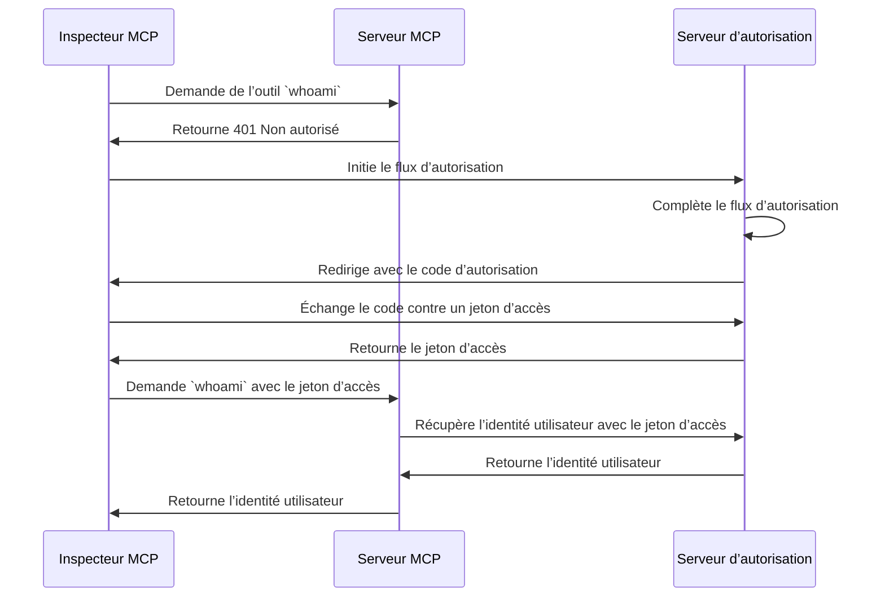

import TabItem from '@theme/TabItem';
import Tabs from '@theme/Tabs';

import SetupOauth from './_setup-oauth.mdx';
import SetupOidc from './_setup-oidc.mdx';

# Tutoriel : Qui suis-je ? (Tutorial: Who am I?)

Ce tutoriel vous guidera à travers le processus de configuration de MCP Auth pour authentifier les utilisateurs et récupérer leurs informations d'identité depuis le serveur d’autorisation (Authorization Server).

Après avoir terminé ce tutoriel, vous aurez :

- ✅ Une compréhension de base de l’utilisation de MCP Auth pour authentifier les utilisateurs.
- ✅ Un serveur MCP qui offre un outil pour récupérer les informations d'identité utilisateur.

## Vue d’ensemble \{#overview}

Le tutoriel impliquera les composants suivants :

- **Serveur MCP** : Un serveur MCP simple qui utilise les SDK officiels MCP pour gérer les requêtes.
- **Inspecteur MCP** : Un outil de test visuel pour les serveurs MCP. Il agit également comme un client OAuth / OIDC pour initier le flux d’autorisation et récupérer les jetons d’accès (Access tokens).
- **Serveur d’autorisation (Authorization server)** : Un fournisseur OAuth 2.1 ou OpenID Connect qui gère les identités utilisateur et émet les jetons d’accès (Access tokens).

Voici un schéma de haut niveau de l’interaction entre ces composants :



## Comprendre votre serveur d’autorisation \{#understand-your-authorization-server}

### Récupérer les informations d'identité utilisateur \{#retrieving-user-identity-information}

Pour compléter ce tutoriel, votre serveur d’autorisation doit offrir une API pour récupérer les informations d'identité utilisateur :

<Tabs groupId="provider">
<TabItem value="logto" label="Logto">

[Logto](https://logto.io) est un fournisseur OpenID Connect qui prend en charge l’[endpoint userinfo](https://openid.net/specs/openid-connect-core-1_0.html#UserInfo) standard pour récupérer les informations d'identité utilisateur.

Pour obtenir un jeton d’accès (Access token) utilisable sur l’endpoint userinfo, au moins deux portées (Scopes) sont requises : `openid` et `profile`. Vous pouvez continuer à lire, car nous aborderons la configuration des portées plus loin.

</TabItem>
<TabItem value="keycloak" label="Keycloak">

[Keycloak](https://www.keycloak.org) est une solution open-source de gestion des identités et des accès qui prend en charge plusieurs protocoles, dont OpenID Connect (OIDC). En tant que fournisseur OIDC, il implémente l’[endpoint userinfo](https://openid.net/specs/openid-connect-core-1_0.html#UserInfo) standard pour récupérer les informations d'identité utilisateur.

Pour obtenir un jeton d’accès (Access token) utilisable sur l’endpoint userinfo, au moins deux portées (Scopes) sont requises : `openid` et `profile`. Vous pouvez continuer à lire, car nous aborderons la configuration des portées plus loin.

</TabItem>
<TabItem value="oidc" label="OIDC">

La plupart des fournisseurs OpenID Connect prennent en charge l’[endpoint userinfo](https://openid.net/specs/openid-connect-core-1_0.html#UserInfo) pour récupérer les informations d'identité utilisateur.

Consultez la documentation de votre fournisseur pour vérifier s’il prend en charge cet endpoint. Si votre fournisseur prend en charge [OpenID Connect Discovery](https://openid.net/specs/openid-connect-discovery-1_0.html), vous pouvez également vérifier si le `userinfo_endpoint` est inclus dans le document de découverte (réponse de l’endpoint `.well-known/openid-configuration`).

Pour obtenir un jeton d’accès (Access token) utilisable sur l’endpoint userinfo, au moins deux portées (Scopes) sont requises : `openid` et `profile`. Consultez la documentation de votre fournisseur pour voir la correspondance des portées avec les revendications d'identité utilisateur.

</TabItem>
<TabItem value="oauth" label="OAuth 2">

Bien que OAuth 2.0 ne définisse pas de méthode standard pour récupérer les informations d'identité utilisateur, de nombreux fournisseurs implémentent leurs propres endpoints à cet effet. Consultez la documentation de votre fournisseur pour savoir comment récupérer les informations d'identité utilisateur à l’aide d’un jeton d’accès (Access token) et quels paramètres sont requis pour obtenir ce jeton lors de l’appel du flux d’autorisation.

</TabItem>
</Tabs>

### Enregistrement dynamique du client \{#dynamic-client-registration}

L’enregistrement dynamique du client n’est pas requis pour ce tutoriel, mais il peut être utile si vous souhaitez automatiser le processus d’enregistrement du client MCP auprès de votre serveur d’autorisation. Consultez [L’enregistrement dynamique du client est-il requis ?](../../provider-list.mdx#is-dcr-required) pour plus de détails.

## Configurer le serveur MCP \{#set-up-the-mcp-server}

Nous allons utiliser les [SDK officiels MCP](https://github.com/modelcontextprotocol) pour créer un serveur MCP avec un outil `whoami` qui récupère les informations d'identité utilisateur depuis le serveur d’autorisation.

### Créer un nouveau projet \{#create-a-new-project}

<Tabs groupId="sdk">
<TabItem value="python" label="Python">

```bash
mkdir mcp-server
cd mcp-server
uv init # Ou utilisez `pipenv` ou `poetry` pour créer un nouvel environnement virtuel
```

</TabItem>
<TabItem value="node" label="Node.js">

Créez un nouveau projet Node.js :

```bash
mkdir mcp-server
cd mcp-server
npm init -y # Ou utilisez `pnpm init`
npm pkg set type="module"
npm pkg set main="whoami.js"
npm pkg set scripts.start="node whoami.js"
```

</TabItem>
</Tabs>

### Installer le SDK MCP et les dépendances \{#install-the-mcp-sdk-and-dependencies}

<Tabs groupId="sdk">
<TabItem value="python" label="Python">

```bash
pip install "mcp[cli]" starlette uvicorn
```

Ou tout autre gestionnaire de paquets que vous préférez, comme `uv` ou `poetry`.

</TabItem>
<TabItem value="node" label="Node.js">

```bash
npm install @modelcontextprotocol/sdk express
```

Ou tout autre gestionnaire de paquets que vous préférez, comme `pnpm` ou `yarn`.

</TabItem>
</Tabs>

### Créer le serveur MCP \{#create-the-mcp-server}

Commençons par créer un serveur MCP qui implémente un outil `whoami`.

<Tabs groupId="sdk">
<TabItem value="python" label="Python">

Créez un fichier nommé `whoami.py` et ajoutez le code suivant :

```python
from mcp.server.fastmcp import FastMCP
from starlette.applications import Starlette
from starlette.routing import Mount
from typing import Any

mcp = FastMCP("WhoAmI")

@mcp.tool()
def whoami() -> dict[str, Any]:
    """Un outil qui retourne les informations de l’utilisateur courant."""
    return {"error": "Not authenticated"}

app = Starlette(
    routes=[Mount('/', app=mcp.sse_app())]
)
```

Lancez le serveur avec :

```bash
uvicorn whoami:app --host 0.0.0.0 --port 3001
```

</TabItem>
<TabItem value="node" label="Node.js">

:::note
Comme l’implémentation actuelle de l’inspecteur MCP ne gère pas les flux d’autorisation, nous utiliserons l’approche SSE pour configurer le serveur MCP. Nous mettrons à jour le code ici dès que l’inspecteur MCP prendra en charge les flux d’autorisation.
:::

Vous pouvez également utiliser `pnpm` ou `yarn` si vous préférez.

Créez un fichier nommé `whoami.js` et ajoutez le code suivant :

```js
import { McpServer } from '@modelcontextprotocol/sdk/server/mcp.js';
import { SSEServerTransport } from '@modelcontextprotocol/sdk/server/sse.js';
import express from 'express';

// Créez un serveur MCP
const server = new McpServer({
  name: 'WhoAmI',
  version: '0.0.0',
});

// Ajoutez un outil au serveur qui retourne les informations de l’utilisateur courant
server.tool('whoami', async () => {
  return {
    content: [{ type: 'text', text: JSON.stringify({ error: 'Not authenticated' }) }],
  };
});

// Ci-dessous, le code standard issu de la documentation du SDK MCP
const PORT = 3001;
const app = express();

const transports = {};

app.get('/sse', async (_req, res) => {
  const transport = new SSEServerTransport('/messages', res);
  transports[transport.sessionId] = transport;

  res.on('close', () => {
    delete transports[transport.sessionId];
  });

  await server.connect(transport);
});

app.post('/messages', async (req, res) => {
  const sessionId = String(req.query.sessionId);
  const transport = transports[sessionId];
  if (transport) {
    await transport.handlePostMessage(req, res, req.body);
  } else {
    res.status(400).send('No transport found for sessionId');
  }
});

app.listen(PORT);
```

Lancez le serveur avec :

```bash
npm start
```

</TabItem>
</Tabs>

## Inspecter le serveur MCP \{#inspect-the-mcp-server}

### Cloner et lancer l’inspecteur MCP \{#clone-and-run-mcp-inspector}

Maintenant que le serveur MCP fonctionne, nous pouvons utiliser l’inspecteur MCP pour vérifier si l’outil `whoami` est disponible.

En raison des limites de l’implémentation actuelle, nous avons forké l’[inspecteur MCP](https://github.com/mcp-auth/inspector) pour le rendre plus flexible et évolutif pour l’authentification (Authentication) et l’autorisation (Authorization). Nous avons également soumis une pull request au dépôt original pour inclure nos modifications.

Pour lancer l’inspecteur MCP, vous pouvez utiliser la commande suivante (Node.js est requis) :

```bash
git clone https://github.com/mcp-auth/inspector.git
cd inspector
npm install
npm run dev
```

Ensuite, ouvrez votre navigateur et accédez à `http://localhost:6274/` (ou à l’URL affichée dans le terminal) pour accéder à l’inspecteur MCP.

### Connecter l’inspecteur MCP au serveur MCP \{#connect-mcp-inspector-to-the-mcp-server}

Avant de continuer, vérifiez la configuration suivante dans l’inspecteur MCP :

- **Type de transport** : Réglez sur `SSE`.
- **URL** : Réglez sur l’URL de votre serveur MCP. Dans notre cas, il s’agit de `http://localhost:3001/sse`.

Vous pouvez maintenant cliquer sur le bouton "Connecter" pour voir si l’inspecteur MCP peut se connecter au serveur MCP. Si tout est correct, vous devriez voir le statut "Connecté" dans l’inspecteur MCP.

### Point de contrôle : Exécuter l’outil `whoami` \{#checkpoint-run-the-whoami-tool}

1. Dans le menu supérieur de l’inspecteur MCP, cliquez sur l’onglet "Outils".
2. Cliquez sur le bouton "Lister les outils".
3. Vous devriez voir l’outil `whoami` listé sur la page. Cliquez dessus pour ouvrir les détails de l’outil.
4. Vous devriez voir le bouton "Exécuter l’outil" à droite. Cliquez dessus pour exécuter l’outil.
5. Vous devriez voir le résultat de l’outil avec la réponse JSON `{"error": "Not authenticated"}`.


## Intégrer avec votre serveur d’autorisation \{#integrate-with-your-authorization-server}

Pour compléter cette section, plusieurs points sont à prendre en compte :

<details>
<summary>**L’URL de l’émetteur (Issuer) de votre serveur d’autorisation**</summary>

Il s’agit généralement de l’URL de base de votre serveur d’autorisation, comme `https://auth.example.com`. Certains fournisseurs peuvent avoir un chemin comme `https://example.logto.app/oidc`, alors assurez-vous de vérifier la documentation de votre fournisseur.

</details>

<details>
<summary>**Comment récupérer les métadonnées du serveur d’autorisation**</summary>

- Si votre serveur d’autorisation est conforme à la [spécification OAuth 2.0 Authorization Server Metadata](https://datatracker.ietf.org/doc/html/rfc8414) ou à [OpenID Connect Discovery](https://openid.net/specs/openid-connect-discovery-1_0.html), vous pouvez utiliser les utilitaires intégrés de MCP Auth pour récupérer automatiquement les métadonnées.
- Si votre serveur d’autorisation n’est pas conforme à ces standards, vous devrez spécifier manuellement l’URL des métadonnées ou les endpoints dans la configuration du serveur MCP. Consultez la documentation de votre fournisseur pour les endpoints spécifiques.

</details>

<details>
<summary>**Comment enregistrer l’inspecteur MCP comme client dans votre serveur d’autorisation**</summary>

- Si votre serveur d’autorisation prend en charge [l’enregistrement dynamique du client](https://datatracker.ietf.org/doc/html/rfc7591), vous pouvez ignorer cette étape car l’inspecteur MCP s’enregistrera automatiquement comme client.
- Si votre serveur d’autorisation ne prend pas en charge l’enregistrement dynamique du client, vous devrez enregistrer manuellement l’inspecteur MCP comme client dans votre serveur d’autorisation.

</details>

<details>
<summary>**Comment récupérer les informations d'identité utilisateur et comment configurer les paramètres de la requête d’autorisation**</summary>

- Pour les fournisseurs OpenID Connect : généralement, vous devez demander au moins les portées (Scopes) `openid` et `profile` lors de l’initiation du flux d’autorisation. Cela garantira que le jeton d’accès (Access token) retourné par le serveur d’autorisation contient les portées nécessaires pour accéder à l’[endpoint userinfo](https://openid.net/specs/openid-connect-core-1_0.html#UserInfo) et récupérer les informations d'identité utilisateur.

  Remarque : certains fournisseurs peuvent ne pas prendre en charge l’endpoint userinfo.

- Pour les fournisseurs OAuth 2.0 / OAuth 2.1 : consultez la documentation de votre fournisseur pour savoir comment récupérer les informations d'identité utilisateur à l’aide d’un jeton d’accès (Access token) et quels paramètres sont requis pour obtenir ce jeton lors de l’appel du flux d’autorisation.

</details>

Bien que chaque fournisseur puisse avoir ses propres exigences spécifiques, les étapes suivantes vous guideront dans le processus d’intégration de l’inspecteur MCP et du serveur MCP avec des configurations spécifiques au fournisseur.

### Enregistrer l’inspecteur MCP comme client \{#register-mcp-inspector-as-a-client}

<Tabs groupId="provider">
<TabItem value="logto" label="Logto">

L’intégration avec [Logto](https://logto.io) est simple puisqu’il s’agit d’un fournisseur OpenID Connect qui prend en charge l’[endpoint userinfo](https://openid.net/specs/openid-connect-core-1_0.html#UserInfo) standard pour récupérer les informations d'identité utilisateur.

Comme Logto ne prend pas encore en charge l’enregistrement dynamique du client, vous devrez enregistrer manuellement l’inspecteur MCP comme client dans votre tenant Logto :

1. Ouvrez votre inspecteur MCP, cliquez sur le bouton "Configuration OAuth". Copiez la valeur **Redirect URL (auto-populated)**, qui devrait ressembler à `http://localhost:6274/oauth/callback`.
2. Connectez-vous à [Logto Console](https://cloud.logto.io) (ou à votre Logto Console auto-hébergée).
3. Accédez à l’onglet "Applications", cliquez sur "Créer une application". En bas de la page, cliquez sur "Créer une application sans framework".
4. Remplissez les détails de l’application, puis cliquez sur "Créer l’application" :
   - **Sélectionnez un type d’application** : Choisissez "Application monopage".
   - **Nom de l’application** : Entrez un nom pour votre application, par exemple "MCP Inspector".
5. Dans la section "Paramètres / URI de redirection", collez la valeur **Redirect URL (auto-populated)** copiée depuis l’inspecteur MCP. Cliquez ensuite sur "Enregistrer les modifications" dans la barre du bas.
6. Dans la carte du haut, vous verrez la valeur "App ID". Copiez-la.
7. Retournez dans l’inspecteur MCP et collez la valeur "App ID" dans la section "Configuration OAuth" sous "Client ID".
8. Entrez la valeur `{"scope": "openid profile email"}` dans le champ "Auth Params". Cela garantira que le jeton d’accès (Access token) retourné par Logto contient les portées nécessaires pour accéder à l’endpoint userinfo.

</TabItem>
<TabItem value="keycloak" label="Keycloak">

[Keycloak](https://www.keycloak.org) est une solution open-source de gestion des identités et des accès qui prend en charge le protocole OpenID Connect.

Bien que Keycloak prenne en charge l’enregistrement dynamique du client, son endpoint d’enregistrement ne prend pas en charge CORS, ce qui empêche la plupart des clients MCP de s’enregistrer directement. Nous devrons donc enregistrer notre client manuellement.

:::note
Bien que Keycloak puisse être installé de [différentes manières](https://www.keycloak.org/guides#getting-started) (bare metal, kubernetes, etc.), pour ce tutoriel, nous utiliserons Docker pour une configuration rapide et simple.
:::

Configurons une instance Keycloak et adaptons-la à nos besoins :

1. Lancez une instance Keycloak avec Docker en suivant la [documentation officielle](https://www.keycloak.org/getting-started/getting-started-docker) :

```bash
docker run -p 8080:8080 -e KC_BOOTSTRAP_ADMIN_USERNAME=admin -e KC_BOOTSTRAP_ADMIN_PASSWORD=admin quay.io/keycloak/keycloak:26.2.4 start-dev
```

2. Accédez à la console d’administration Keycloak (http://localhost:8080/admin) et connectez-vous avec ces identifiants :

   - Nom d’utilisateur : `admin`
   - Mot de passe : `admin`

3. Créez un nouveau Realm :

   - Cliquez sur "Create Realm" en haut à gauche
   - Entrez `mcp-realm` dans le champ "Realm name"
   - Cliquez sur "Create"

4. Créez un utilisateur de test :

   - Cliquez sur "Users" dans le menu de gauche
   - Cliquez sur "Create new user"
   - Remplissez les informations utilisateur :
     - Nom d’utilisateur : `testuser`
     - Prénom et nom peuvent être quelconques
   - Cliquez sur "Create"
   - Dans l’onglet "Credentials", définissez un mot de passe et décochez "Temporary"

5. Enregistrez l’inspecteur MCP comme client :

   - Ouvrez votre inspecteur MCP, cliquez sur le bouton "Configuration OAuth". Copiez la valeur **Redirect URL (auto-populated)**, qui devrait ressembler à `http://localhost:6274/oauth/callback`.
   - Dans la console d’administration Keycloak, cliquez sur "Clients" dans le menu de gauche
   - Cliquez sur "Create client"
   - Remplissez les détails du client :
     - Type de client : Sélectionnez "OpenID Connect"
     - Client ID : Entrez `mcp-inspector`
     - Cliquez sur "Next"
   - Sur la page "Capability config" :
     - Assurez-vous que "Standard flow" est activé
     - Cliquez sur "Next"
   - Sur la page "Login settings" :
     - Collez l’URL de rappel de l’inspecteur MCP précédemment copiée dans "Valid redirect URIs"
     - Entrez `http://localhost:6274` dans "Web origins"
     - Cliquez sur "Save"
   - Copiez le "Client ID" (qui est `mcp-inspector`)

6. De retour dans l’inspecteur MCP :
   - Collez le Client ID copié dans le champ "Client ID" de la section "Configuration OAuth"
   - Entrez la valeur suivante dans le champ "Auth Params" pour demander les portées nécessaires :

```json
{ "scope": "openid profile email" }
```

</TabItem>
<TabItem value="oidc" label="OIDC">

:::note
Ceci est un guide générique d’intégration avec un fournisseur OpenID Connect. Consultez la documentation de votre fournisseur pour les détails spécifiques.
:::

Si votre fournisseur OpenID Connect prend en charge l’enregistrement dynamique du client, vous pouvez passer directement à l’étape 8 ci-dessous pour configurer l’inspecteur MCP ; sinon, vous devrez enregistrer manuellement l’inspecteur MCP comme client dans votre fournisseur OpenID Connect :

1. Ouvrez votre inspecteur MCP, cliquez sur le bouton "Configuration OAuth". Copiez la valeur **Redirect URL (auto-populated)**, qui devrait ressembler à `http://localhost:6274/oauth/callback`.
2. Connectez-vous à la console de votre fournisseur OpenID Connect.
3. Accédez à la section "Applications" ou "Clients", puis créez une nouvelle application ou un nouveau client.
4. Si votre fournisseur demande un type de client, sélectionnez "Application monopage" ou "Client public".
5. Après avoir créé l’application, vous devrez configurer l’URI de redirection. Collez la valeur **Redirect URL (auto-populated)** copiée depuis l’inspecteur MCP.
6. Trouvez le "Client ID" ou "Application ID" de la nouvelle application et copiez-le.
7. Retournez dans l’inspecteur MCP et collez la valeur "Client ID" dans la section "Configuration OAuth" sous "Client ID".
8. Pour les fournisseurs OpenID Connect standards, vous pouvez entrer la valeur suivante dans le champ "Auth Params" pour demander les portées nécessaires à l’accès à l’endpoint userinfo :

```json
{ "scope": "openid profile email" }
```

</TabItem>
<TabItem value="oauth" label="OAuth 2">

:::note
Ceci est un guide générique d’intégration avec un fournisseur OAuth 2.0 / OAuth 2.1. Consultez la documentation de votre fournisseur pour les détails spécifiques.
:::

Si votre fournisseur OAuth 2.0 / OAuth 2.1 prend en charge l’enregistrement dynamique du client, vous pouvez passer directement à l’étape 8 ci-dessous pour configurer l’inspecteur MCP ; sinon, vous devrez enregistrer manuellement l’inspecteur MCP comme client dans votre fournisseur OAuth 2.0 / OAuth 2.1 :

1. Ouvrez votre inspecteur MCP, cliquez sur le bouton "Configuration OAuth". Copiez la valeur **Redirect URL (auto-populated)**, qui devrait ressembler à `http://localhost:6274/oauth/callback`.
2. Connectez-vous à la console de votre fournisseur OAuth 2.0 / OAuth 2.1.
3. Accédez à la section "Applications" ou "Clients", puis créez une nouvelle application ou un nouveau client.
4. Si votre fournisseur demande un type de client, sélectionnez "Application monopage" ou "Client public".
5. Après avoir créé l’application, vous devrez configurer l’URI de redirection. Collez la valeur **Redirect URL (auto-populated)** copiée depuis l’inspecteur MCP.
6. Trouvez le "Client ID" ou "Application ID" de la nouvelle application et copiez-le.
7. Retournez dans l’inspecteur MCP et collez la valeur "Client ID" dans la section "Configuration OAuth" sous "Client ID".
8. Consultez la documentation de votre fournisseur pour savoir comment obtenir des jetons d’accès pour les informations d'identité utilisateur. Vous devrez peut-être spécifier les portées ou paramètres requis pour obtenir le jeton d’accès. Par exemple, si votre fournisseur exige la portée `profile` pour accéder aux informations d'identité utilisateur, vous pouvez entrer la valeur suivante dans le champ "Auth Params" :

```json
{ "scope": "profile" }
```

</TabItem>
</Tabs>

### Configurer MCP Auth \{#set-up-mcp-auth}

Dans votre projet serveur MCP, vous devez installer le SDK MCP Auth et le configurer pour utiliser les métadonnées de votre serveur d’autorisation.

<Tabs groupId="sdk">
<TabItem value="python" label="Python">

D’abord, installez le paquet `mcpauth` :

```bash
pip install mcpauth
```

Ou tout autre gestionnaire de paquets que vous préférez, comme `uv` ou `poetry`.

</TabItem>
<TabItem value="node" label="Node.js">

D’abord, installez le paquet `mcp-auth` :

```bash
npm install mcp-auth
```

</TabItem>
</Tabs>

MCP Auth nécessite les métadonnées du serveur d’autorisation pour pouvoir s’initialiser. Selon votre fournisseur :

<Tabs groupId="provider">

<TabItem value="logto" label="Logto">

L’URL de l’émetteur (Issuer) se trouve sur la page de détails de votre application dans Logto Console, dans la section "Endpoints & Credentials / Issuer endpoint". Elle devrait ressembler à `https://my-project.logto.app/oidc`.

<SetupOidc />

</TabItem>

<TabItem value="keycloak" label="Keycloak">

L’URL de l’émetteur (Issuer) se trouve dans votre console d’administration Keycloak. Dans votre 'mcp-realm', accédez à la section "Realm settings / Endpoints" et cliquez sur le lien "OpenID Endpoint Configuration". Le champ `issuer` dans le document JSON contiendra votre URL d’émetteur, qui devrait ressembler à `http://localhost:8080/realms/mcp-realm`.

<SetupOidc />

</TabItem>

<TabItem value="oidc" label="OIDC">

Le code suivant suppose également que le serveur d’autorisation prend en charge l’[endpoint userinfo](https://openid.net/specs/openid-connect-core-1_0.html#UserInfo) pour récupérer les informations d'identité utilisateur. Si votre fournisseur ne prend pas en charge cet endpoint, vous devrez consulter la documentation de votre fournisseur pour l’endpoint spécifique et remplacer la variable userinfo endpoint par la bonne URL.

<SetupOidc showAlternative />

</TabItem>
<TabItem value="oauth" label="OAuth 2">

Comme mentionné précédemment, OAuth 2.0 ne définit pas de méthode standard pour récupérer les informations d'identité utilisateur. Le code suivant suppose que votre fournisseur dispose d’un endpoint spécifique pour récupérer les informations d'identité utilisateur à l’aide d’un jeton d’accès (Access token). Vous devrez consulter la documentation de votre fournisseur pour l’endpoint spécifique et remplacer la variable userinfo endpoint par la bonne URL.

<SetupOauth />

</TabItem>
</Tabs>

### Mettre à jour le serveur MCP \{#update-mcp-server}

Nous y sommes presque ! Il est temps de mettre à jour le serveur MCP pour appliquer la route MCP Auth et la fonction middleware, puis faire en sorte que l’outil `whoami` retourne les véritables informations d'identité utilisateur.

<Tabs groupId="sdk">
<TabItem value="python" label="Python">

```python
@mcp.tool()
def whoami() -> dict[str, Any]:
    """Un outil qui retourne les informations de l’utilisateur courant."""
    return (
        mcp_auth.auth_info.claims
        if mcp_auth.auth_info # Ceci sera renseigné par le middleware Bearer auth
        else {"error": "Not authenticated"}
    )

# ...

bearer_auth = Middleware(mcp_auth.bearer_auth_middleware(verify_access_token))
app = Starlette(
    routes=[
        # Ajoutez la route des métadonnées (`/.well-known/oauth-authorization-server`)
        mcp_auth.metadata_route(),
        # Protégez le serveur MCP avec le middleware Bearer auth
        Mount('/', app=mcp.sse_app(), middleware=[bearer_auth]),
    ],
)
```

</TabItem>
<TabItem value="node" label="Node.js">

```js
server.tool('whoami', ({ authInfo }) => {
  return {
    content: [
      { type: 'text', text: JSON.stringify(authInfo?.claims ?? { error: 'Not authenticated' }) },
    ],
  };
});

// ...

app.use(mcpAuth.delegatedRouter());
app.use(mcpAuth.bearerAuth(verifyToken));
```

</TabItem>
</Tabs>

## Point de contrôle : Exécuter l’outil `whoami` avec authentification \{#checkpoint-run-the-whoami-tool-with-authentication}

Redémarrez votre serveur MCP et ouvrez l’inspecteur MCP dans votre navigateur. Lorsque vous cliquez sur le bouton "Connecter", vous devriez être redirigé vers la page de connexion de votre serveur d’autorisation.

Une fois connecté et de retour dans l’inspecteur MCP, répétez les actions du point de contrôle précédent pour exécuter l’outil `whoami`. Cette fois, vous devriez voir les informations d'identité utilisateur retournées par le serveur d’autorisation.


<Tabs groupId="sdk">
<TabItem value="python" label="Python">

:::info
Consultez le [dépôt du SDK MCP Auth Python](https://github.com/mcp-auth/python/blob/master/samples/server/whoami.py) pour le code complet du serveur MCP (version OIDC).
:::

</TabItem>
<TabItem value="node" label="Node.js">

:::info
Consultez le [dépôt du SDK MCP Auth Node.js](https://github.com/mcp-auth/js/blob/master/packages/sample-servers/src) pour le code complet du serveur MCP (version OIDC). Ce répertoire contient les versions TypeScript et JavaScript du code.
:::

</TabItem>
</Tabs>

## Notes de clôture \{#closing-notes}

🎊 Félicitations ! Vous avez terminé avec succès le tutoriel. Récapitulons ce que nous avons fait :

- Mise en place d’un serveur MCP basique avec l’outil `whoami`
- Intégration du serveur MCP avec un serveur d’autorisation via MCP Auth
- Configuration de l’inspecteur MCP pour authentifier les utilisateurs et récupérer leurs informations d'identité

Vous pouvez également explorer des sujets avancés, notamment :

- Utiliser [JWT (JSON Web Token)](https://auth.wiki/jwt) pour l’authentification (Authentication) et l’autorisation (Authorization)
- Exploiter les [indicateurs de ressource (RFC 8707)](https://auth-wiki.logto.io/resource-indicator) pour spécifier les ressources accédées
- Implémenter des mécanismes de contrôle d’accès personnalisés, tels que le [contrôle d’accès basé sur les rôles (RBAC)](https://auth.wiki/rbac) ou le [contrôle d’accès basé sur les attributs (ABAC)](https://auth.wiki/abac)

N’hésitez pas à consulter d’autres tutoriels et la documentation pour tirer le meilleur parti de MCP Auth.