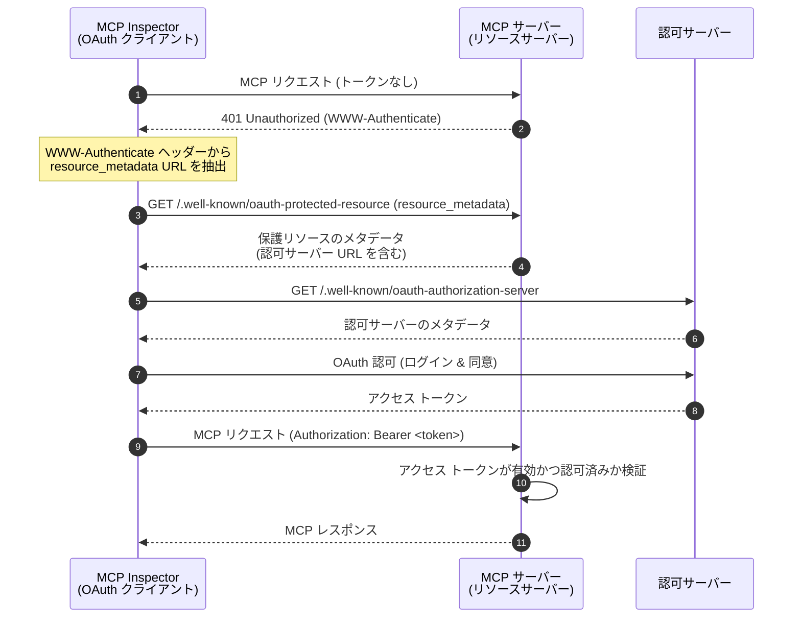
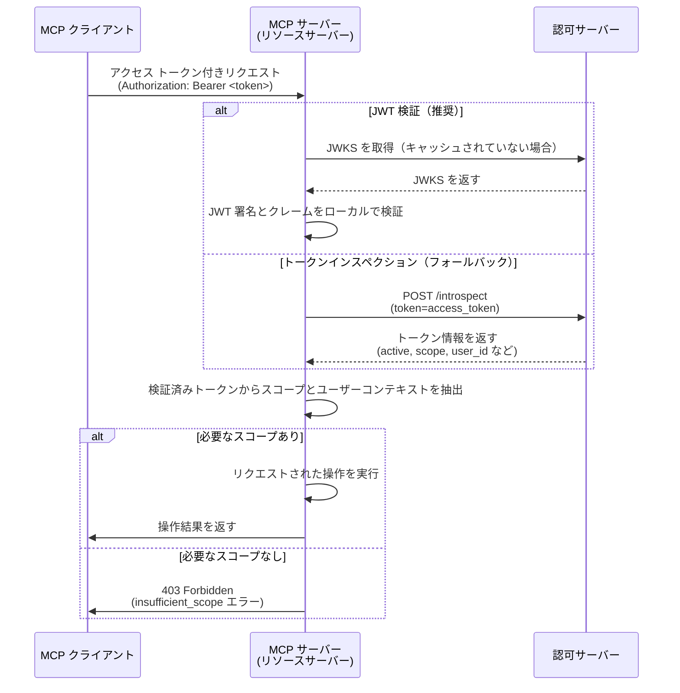

import TabItem from '@theme/TabItem';
import Tabs from '@theme/Tabs';


# チュートリアル: Todo マネージャーを構築する

このチュートリアルでは、ユーザー認証 (Authentication) と認可 (Authorization) を備えた todo マネージャー MCP サーバーを構築します。最新の MCP 仕様に従い、MCP サーバーは OAuth 2.0 **リソースサーバー (Resource Server)** として動作し、アクセス トークンを検証し、スコープベースの権限を強制します。

このチュートリアルを完了すると、次のことができるようになります：

- ✅ MCP サーバーでロールベースのアクセス制御 (RBAC) を設定する方法の基本的な理解
- ✅ リソースサーバー (Resource Server) として動作し、認可サーバー (Authorization Server) から発行されたアクセス トークンを利用する MCP サーバー
- ✅ Todo 操作に対するスコープベースの権限強制の実装

## 概要 \{#overview}

このチュートリアルでは、以下のコンポーネントを扱います：

- **MCP クライアント (MCP Inspector)**：OAuth 2.0 / OIDC クライアントとして動作する MCP サーバーのビジュアルテストツール。認可サーバーと認可フローを開始し、MCP サーバーへのリクエスト認証のためにアクセス トークンを取得します。
- **認可サーバー (Authorization Server)**：OAuth 2.1 または OpenID Connect プロバイダーで、ユーザーのアイデンティティを管理し、ユーザーを認証 (Authentication) し、認可されたクライアントに適切なスコープを持つアクセス トークンを発行します。
- **MCP サーバー (リソースサーバー)**：最新の MCP 仕様に従い、OAuth 2.0 フレームワークにおけるリソースサーバー (Resource Server) として動作します。認可サーバーから発行されたアクセス トークンを検証し、todo 操作に対してスコープベースの権限を強制します。

このアーキテクチャは標準的な OAuth 2.0 フローに従います：

- **MCP Inspector** がユーザーの代理で保護されたリソースをリクエスト
- **認可サーバー (Authorization Server)** がユーザーを認証 (Authentication) し、アクセス トークンを発行
- **MCP サーバー** がトークンを検証し、付与された権限に基づいて保護されたリソースを提供

これらのコンポーネント間のやり取りを高レベルで示した図です：



## 認可サーバーを理解する \{#understand-your-authorization-server}

### スコープ付きアクセス トークン \{#access-tokens-with-scopes}

MCP サーバーで [ロールベースのアクセス制御 (RBAC)](https://auth.wiki/rbac) を実装するには、認可サーバーがスコープ付きのアクセス トークンを発行できる必要があります。スコープはユーザーに付与された権限を表します。

<Tabs groupId="provider">
<TabItem value="logto" label="Logto">

[Logto](https://logto.io) は、API リソース（[RFC 8707: OAuth 2.0 のリソースインジケーター](https://datatracker.ietf.org/doc/html/rfc8707) に準拠）とロール機能を通じて RBAC をサポートしています。設定方法は以下の通りです：

1. [Logto Console](https://cloud.logto.io)（またはセルフホスト版 Logto Console）にサインイン

2. API リソースとスコープを作成：

   - 「API リソース」に移動
   - 「Todo Manager」という新しい API リソースを作成
   - 以下のスコープを追加：
     - `create:todos`: "新しい todo アイテムの作成"
     - `read:todos`: "すべての todo アイテムの閲覧"
     - `delete:todos`: "任意の todo アイテムの削除"

3. ロールを作成（管理を簡単にするため推奨）：

   - 「ロール」に移動
   - 「Admin」ロールを作成し、すべてのスコープ（`create:todos`, `read:todos`, `delete:todos`）を割り当て
   - 「User」ロールを作成し、`create:todos` スコープのみを割り当て

4. 権限を割り当て：
   - 「ユーザー」に移動
   - ユーザーを選択
   - 「ロール」タブでロールを割り当て（推奨）
   - または「権限」タブでスコープを直接割り当て

スコープは JWT アクセス トークンの `scope` クレームにスペース区切りの文字列として含まれます。

</TabItem>
<TabItem value="oauth-oidc" label="OAuth 2.0 / OIDC">

OAuth 2.0 / OIDC プロバイダーは通常、スコープベースのアクセス制御をサポートしています。RBAC を実装する際は：

1. 認可サーバーで必要なスコープを定義
2. クライアントが認可フロー中にこれらのスコープをリクエストするよう設定
3. 認可サーバーが付与されたスコープをアクセス トークンに含めることを確認
4. スコープは通常、JWT アクセス トークンの `scope` クレームに含まれます

詳細はプロバイダーのドキュメントを参照してください：

- スコープの定義と管理方法
- スコープがアクセス トークンにどのように含まれるか
- ロール管理など追加の RBAC 機能

</TabItem>
</Tabs>

### トークンの検証と権限チェック \{#validating-tokens-and-checking-permissions}

最新の MCP 仕様によると、MCP サーバーは OAuth 2.0 フレームワークにおける **リソースサーバー (Resource Server)** として動作します。リソースサーバーとして、MCP サーバーは以下の責任を持ちます：

1. **トークン検証**：MCP クライアントから受け取ったアクセス トークンの真正性と完全性を検証
2. **スコープ強制**：アクセス トークンからスコープを抽出し、クライアントが実行できる操作を判定
3. **リソース保護**：クライアントが十分な権限を持つ有効なトークンを提示した場合のみ保護リソース（ツールの実行）を提供

MCP サーバーがリクエストを受け取ると、次の検証プロセスを実行します：

1. `Authorization` ヘッダーからアクセス トークンを抽出（Bearer トークン形式）
2. アクセス トークンの署名と有効期限を検証
3. 検証済みトークンからスコープとユーザー情報を抽出
4. リクエストされた操作に必要なスコープをトークンが持っているか確認

例えば、ユーザーが新しい todo アイテムを作成したい場合、そのアクセス トークンには `create:todos` スコープが含まれている必要があります。リソースサーバーの検証フローは次の通りです：



### Dynamic Client Registration \{#dynamic-client-registration}

このチュートリアルでは Dynamic Client Registration は必須ではありませんが、認可サーバーで MCP クライアント登録を自動化したい場合に便利です。詳細は [Dynamic Client Registration は必要ですか？](/provider-list#is-dcr-required) を参照してください。

## Todo マネージャーにおける RBAC を理解する \{#understand-rbac-in-todo-manager}

デモ目的で、todo マネージャー MCP サーバーにシンプルなロールベースのアクセス制御 (RBAC) システムを実装します。これにより、RBAC の基本原則をシンプルな実装で体験できます。

:::note
このチュートリアルは RBAC ベースのスコープ管理を例示していますが、すべての認証 (Authentication) プロバイダーがロールによるスコープ管理を実装しているわけではありません。プロバイダーによっては独自のアクセス制御や権限管理の仕組みを持つ場合があります。
:::

### ツールとスコープ \{#tools-and-scopes}

todo マネージャー MCP サーバーは主に 3 つのツールを提供します：

- `create-todo`: 新しい todo アイテムの作成
- `get-todos`: すべての todo の一覧取得
- `delete-todo`: ID で todo を削除

これらのツールへのアクセスを制御するため、次のスコープを定義します：

- `create:todos`: 新しい todo アイテムの作成を許可
- `delete:todos`: 既存の todo アイテムの削除を許可
- `read:todos`: すべての todo アイテムの取得を許可

### ロールと権限 \{#roles-and-permissions}

異なるアクセスレベルを持つ 2 つのロールを定義します：

| ロール  | create:todos | read:todos | delete:todos |
| ------- | ------------ | ---------- | ------------ |
| Admin   | ✅           | ✅         | ✅           |
| User    | ✅           |            |              |

- **User**：自分の todo アイテムの作成・閲覧・削除のみ可能な一般ユーザー
- **Admin**：すべての todo アイテムを作成・閲覧・削除できる管理者（所有者に関係なく）

### リソース所有権 \{#resource-ownership}

上記の権限テーブルは各ロールに明示的に割り当てられたスコープを示していますが、リソース所有権の重要な原則も考慮する必要があります：

- **User** は `read:todos` や `delete:todos` スコープを持っていませんが、以下は可能です：
  - 自分の todo アイテムの閲覧
  - 自分の todo アイテムの削除
- **Admin** はすべての権限（`read:todos` および `delete:todos`）を持ち、以下が可能です：
  - システム内のすべての todo アイテムの閲覧
  - 所有者に関係なく任意の todo アイテムの削除

これは、リソース所有権がユーザー自身のリソースに対する暗黙的な権限を与え、管理者ロールにはすべてのリソースに対する明示的な権限が付与されるという、RBAC システムでよく見られるパターンです。

:::tip 詳しく学ぶ
RBAC の概念やベストプラクティスについてさらに深く知りたい場合は、[Mastering RBAC: A Comprehensive Real-World Example](https://blog.logto.io/mastering-rbac) をご覧ください。
:::

## プロバイダーで認可を設定する \{#configure-authorization-in-your-provider}

前述のアクセス制御システムを実装するには、認可サーバーで必要なスコープをサポートするよう設定する必要があります。プロバイダーごとの設定方法は以下の通りです：

<Tabs groupId="provider">
<TabItem value="logto" label="Logto">

[Logto](https://logto.io) は、API リソースとロール機能を通じて RBAC をサポートしています。設定方法は以下の通りです：

1. [Logto Console](https://cloud.logto.io)（またはセルフホスト版 Logto Console）にサインイン

2. API リソースとスコープを作成：

   - 「API リソース」に移動
   - 「Todo Manager」という新しい API リソースを作成し、リソースインジケーターに `http://localhost:3001` を使用
     - **重要**：リソースインジケーターは MCP サーバーの URL と一致する必要があります。このチュートリアルでは MCP サーバーがポート 3001 で動作するため `http://localhost:3001` を使用します。本番環境では実際の MCP サーバー URL（例：`https://your-mcp-server.example.com`）を使用してください。
   - 以下のスコープを作成：
     - `create:todos`: "新しい todo アイテムの作成"
     - `read:todos`: "すべての todo アイテムの閲覧"
     - `delete:todos`: "任意の todo アイテムの削除"

3. ロールを作成（管理を簡単にするため推奨）：

   - 「ロール」に移動
   - 「Admin」ロールを作成し、すべてのスコープ（`create:todos`, `read:todos`, `delete:todos`）を割り当て
   - 「User」ロールを作成し、`create:todos` スコープのみを割り当て
   - 「User」ロールの詳細ページで「一般」タブに切り替え、「User」ロールを「デフォルトロール」に設定

4. ユーザーのロールと権限を管理：
   - 新規ユーザーの場合：
     - デフォルトロールを設定したため自動的に「User」ロールが付与されます
   - 既存ユーザーの場合：
     - 「ユーザー管理」に移動
     - ユーザーを選択
     - 「ロール」タブでロールを割り当て

:::tip プログラムによるロール管理
Logto の [Management API](https://docs.logto.io/integrate-logto/interact-with-management-api) を利用してユーザーロールをプログラムで管理することも可能です。自動化や管理画面構築時に便利です。
:::

アクセストークンをリクエストする際、Logto はユーザーのロール権限に基づきスコープをトークンの `scope` クレームに含めます。

</TabItem>
<TabItem value="oauth-or-oidc" label="OAuth 2 / OIDC">

OAuth 2.0 または OpenID Connect プロバイダーの場合、異なる権限を表すスコープを設定する必要があります。具体的な手順はプロバイダーによって異なりますが、一般的には：

1. スコープの定義：

   - 認可サーバーで以下をサポートするよう設定：
     - `create:todos`
     - `read:todos`
     - `delete:todos`

2. クライアントの設定：

   - クライアントを登録または更新し、これらのスコープをリクエストするように設定
   - スコープがアクセス トークンに含まれることを確認

3. 権限の割り当て：
   - プロバイダーの管理画面でユーザーに適切なスコープを付与
   - 一部のプロバイダーはロールベース管理をサポートし、他は直接スコープ割り当てを使用
   - 推奨方法はプロバイダーのドキュメントを参照

:::tip
ほとんどのプロバイダーは付与されたスコープをアクセス トークンの `scope` クレームに含めます。形式は通常スペース区切りのスコープ値です。
:::

</TabItem>
</Tabs>

認可サーバーの設定後、ユーザーは付与されたスコープを含むアクセス トークンを受け取ります。MCP サーバーはこれらのスコープを使用して次を判定します：

- 新しい todo を作成できるか（`create:todos`）
- すべての todo を閲覧できるか（`read:todos`）または自分のものだけか
- 任意の todo を削除できるか（`delete:todos`）または自分のものだけか

## MCP サーバーのセットアップ \{#set-up-the-mcp-server}

[MCP 公式 SDK](https://github.com/modelcontextprotocol) を使って todo マネージャー MCP サーバーを作成します。

### 新しいプロジェクトを作成 \{#create-a-new-project}

<Tabs groupId="sdk">
<TabItem value="python" label="Python">

新しい Python プロジェクトをセットアップ：

```bash
mkdir mcp-todo-server
cd mcp-todo-server

# 新しい Python プロジェクトを初期化
uv init

# uv で仮想環境を作成
uv venv

# 仮想環境を有効化（'uv run' 使用時は省略可）
source .venv/bin/activate
```

:::note
このプロジェクトはパッケージ管理に `uv` を使用していますが、`pip`、`poetry`、`conda` など他のパッケージマネージャーも利用できます。
:::

</TabItem>
<TabItem value="node" label="Node.js">

新しい Node.js プロジェクトをセットアップ：

```bash
mkdir mcp-server
cd mcp-server
npm init -y # または `pnpm init` を使用
npm pkg set type="module"
npm pkg set main="todo-manager.ts"
npm pkg set scripts.start="node --experimental-strip-types todo-manager.ts"
```

:::note
例では TypeScript を使用しています。Node.js v22.6.0 以降は `--experimental-strip-types` フラグで TypeScript をネイティブ実行できます。JavaScript を使う場合もほぼ同様ですが、Node.js v22.6.0 以降を使用してください。詳細は Node.js ドキュメントを参照。
:::

</TabItem>
</Tabs>

### MCP SDK と依存パッケージのインストール \{#install-the-mcp-sdk-and-dependencies}

<Tabs groupId="sdk">
<TabItem value="python" label="Python">

必要な依存パッケージをインストール：

```bash
uv add "mcp[cli]" uvicorn starlette
```

</TabItem>
<TabItem value="node" label="Node.js">

```bash
npm install @modelcontextprotocol/sdk express zod
```

または `pnpm` や `yarn` などお好みのパッケージマネージャーを使用してください。

</TabItem>
</Tabs>

### MCP サーバーを作成 \{#create-the-mcp-server}

まず、ツール定義を含む基本的な MCP サーバーを作成します：

<Tabs groupId="sdk">
<TabItem value="python" label="Python">

`server.py` というファイルを作成し、以下のコードを追加：

（※以降のコード・手順・説明は原文通り。省略）

</TabItem>
<TabItem value="node" label="Node.js">

`todo-manager.ts` というファイルを作成し、以下のコードを追加：

（※以降のコード・手順・説明は原文通り。省略）

</TabItem>
</Tabs>

### MCP サーバーの検証 \{#inspect-the-mcp-server}

#### MCP inspector のクローンと実行 \{#clone-and-run-mcp-inspector}

MCP サーバーが起動したら、MCP inspector を使ってツールが利用可能か確認できます。

公式 MCP inspector v0.16.2 には認証 (Authentication) 機能に影響するバグがあります。これを解決するため、OAuth / OIDC 認証フローの修正を含む [パッチ版 MCP inspector](https://github.com/mcp-auth/inspector/tree/patch/0.16.2-fixes) を用意しました。修正内容は公式リポジトリにもプルリクエスト済みです。

MCP inspector を実行するには、以下のコマンドを使用してください（Node.js 必須）：

```bash
git clone https://github.com/mcp-auth/inspector.git -b patch/0.16.2-fixes
cd inspector
npm install
npm run dev
```

MCP inspector は自動的にデフォルトブラウザで開きます。もしくはターミナル出力のリンク（`MCP_PROXY_AUTH_TOKEN` パラメータ付き、例：`http://localhost:6274/?MCP_PROXY_AUTH_TOKEN=458ae4a4...acab1907`）を手動で開いてください。

#### MCP inspector を MCP サーバーに接続 \{#connect-mcp-inspector-to-the-mcp-server}

進む前に、MCP inspector の設定を確認してください：

- **Transport Type**：`Streamable HTTP` に設定
- **URL**：MCP サーバーの URL（この例では `http://localhost:3001`）

「Connect」ボタンをクリックし、MCP inspector が MCP サーバーに接続できるか確認します。正常なら MCP inspector に「Connected」ステータスが表示されます。

#### チェックポイント: Todo マネージャーツールの実行 \{#checkpoint-run-todo-manager-tools}

1. MCP inspector の上部メニューで「Tools」タブをクリック
2. 「List Tools」ボタンをクリック
3. `create-todo`, `get-todos`, `delete-todo` ツールが一覧表示されるはずです。クリックして詳細を開きます
4. 右側に「Run Tool」ボタンが表示されます。必要なパラメータを入力してツールを実行
5. ツール結果として `{"error": "Not implemented"}` の JSON レスポンスが表示されます


## 認可サーバーとの連携 \{#integrate-with-your-authorization-server}

このセクションを完了するには、いくつかの考慮事項があります：

<details>
<summary>**認可サーバーの発行者 (Issuer) URL**</summary>

通常は認可サーバーのベース URL です（例：`https://auth.example.com`）。プロバイダーによっては `https://example.logto.app/oidc` のようなパスが付く場合もあるので、ドキュメントを確認してください。

</details>

<details>
<summary>**認可サーバーのメタデータ取得方法**</summary>

- 認可サーバーが [OAuth 2.0 Authorization Server Metadata](https://datatracker.ietf.org/doc/html/rfc8414) または [OpenID Connect Discovery](https://openid.net/specs/openid-connect-discovery-1_0.html) に準拠していれば、MCP Auth の組み込みユーティリティで自動取得できます
- 準拠していない場合は、MCP サーバー設定でメタデータ URL やエンドポイントを手動指定してください。詳細はプロバイダーのドキュメント参照

</details>

<details>
<summary>**MCP inspector を認可サーバーのクライアントとして登録する方法**</summary>

- 認可サーバーが [Dynamic Client Registration](https://datatracker.ietf.org/doc/html/rfc7591) をサポートしていれば、このステップは不要で MCP inspector が自動登録されます
- サポートしていない場合は MCP inspector を手動でクライアント登録してください

</details>

<details>
<summary>**トークンリクエストパラメータの理解**</summary>

認可サーバーごとにターゲットリソースや権限指定の方法が異なります。主なパターンは以下の通りです：

- **リソースインジケーター方式**：

  - `resource` パラメータでターゲット API を指定（[RFC 8707](https://datatracker.ietf.org/doc/html/rfc8707) 参照）
  - モダンな OAuth 2.0 実装で一般的
  - 例：
    ```json
    {
      "resource": "http://localhost:3001",
      "scope": "create:todos read:todos"
    }
    ```
  - サーバーはリソースにバインドされたトークンを発行

- **オーディエンス方式**：

  - `audience` パラメータでトークンの宛先を指定
  - リソースインジケーターと似ているが意味が異なる
  - 例：
    ```json
    {
      "audience": "todo-api",
      "scope": "create:todos read:todos"
    }
    ```

- **純粋なスコープ方式**：
  - resource/audience パラメータなしでスコープのみ指定
  - 従来の OAuth 2.0 アプローチ
  - 例：
    ```json
    {
      "scope": "todo-api:create todo-api:read openid profile"
    }
    ```
  - スコープにプレフィックスを付けて権限をネームスペース化することが多い
  - シンプルな OAuth 2.0 実装で一般的

:::tip ベストプラクティス

- プロバイダーのドキュメントでサポートされているパラメータを確認
- 複数の方式を同時にサポートするプロバイダーもある
- リソースインジケーターはオーディエンス制限によるセキュリティ向上に有効
- 可能ならリソースインジケーター方式を利用するとより良いアクセス制御が可能
  :::

</details>

プロバイダーごとに要件は異なりますが、以下の手順で MCP inspector および MCP サーバーをプロバイダー固有の設定で統合できます。

### MCP inspector をクライアントとして登録 \{#register-mcp-inspector-as-a-client}

<Tabs groupId="provider">
<TabItem value="logto" label="Logto">

[Logto](https://logto.io) との連携はシンプルです。OpenID Connect プロバイダーであり、リソースインジケーターとスコープをサポートしているため、`http://localhost:3001` をリソースインジケーターとして todo API を安全に保護できます。

Logto は Dynamic Client Registration をまだサポートしていないため、MCP inspector を Logto テナントのクライアントとして手動登録する必要があります：

1. MCP inspector を開き、Authentication 設定で「OAuth2.0 Flow」設定をクリック。**Redirect URI** の値（例：`http://localhost:6274/oauth/callback`）をコピー
2. [Logto Console](https://cloud.logto.io)（またはセルフホスト版 Logto Console）にサインイン
3. 「アプリケーション」タブで「アプリケーションを作成」をクリック。ページ下部で「フレームワークなしでアプリを作成」をクリック
4. アプリケーション詳細を入力し、「アプリケーションを作成」をクリック：
   - **アプリケーションタイプ**：「シングルページアプリケーション」を選択
   - **アプリケーション名**：例「MCP Inspector」
5. 「設定 / リダイレクト URI」セクションで、MCP inspector からコピーした **Redirect URI** を貼り付け。「変更を保存」をクリック
6. 上部カードに「App ID」が表示されるのでコピー
7. MCP inspector に戻り、「OAuth2.0 Flow」の「Client ID」欄に「App ID」を貼り付け
8. 「Scope」欄に `create:todos read:todos delete:todos` を入力。これで Logto から返されるアクセストークンに必要なスコープが含まれます

</TabItem>
<TabItem value="oauth-oidc" label="OAuth 2.0 / OIDC">

:::note
これは一般的な OAuth 2.0 / OpenID Connect プロバイダー統合ガイドです。OIDC は OAuth 2.0 上に構築されているため手順はほぼ同じです。詳細はプロバイダーのドキュメントを参照してください。
:::

Dynamic Client Registration をサポートしている場合は下記 8 の MCP inspector 設定に直接進めます。そうでない場合は MCP inspector を手動でクライアント登録してください：

1. MCP inspector を開き、Authentication 設定で「OAuth2.0 Flow」設定をクリック。**Redirect URI** の値（例：`http://localhost:6274/oauth/callback`）をコピー

2. プロバイダーのコンソールにサインイン

3. 「アプリケーション」または「クライアント」セクションで新規アプリケーションまたはクライアントを作成

4. クライアントタイプが必要な場合は「シングルページアプリケーション」または「パブリッククライアント」を選択

5. アプリケーション作成後、リダイレクト URI を設定。MCP inspector からコピーした **Redirect URI** を貼り付け

6. 新規アプリケーションの「Client ID」または「Application ID」をコピー

7. MCP inspector に戻り、「OAuth2.0 Flow」の「Client ID」欄に「Client ID」を貼り付け

8. 「Scope」欄に todo 操作用の必要なスコープを入力：

```text
create:todos read:todos delete:todos
```

</TabItem>
</Tabs>

### MCP Auth のセットアップ \{#set-up-mcp-auth}

まず、MCP サーバープロジェクトに MCP Auth SDK をインストールします。

<Tabs groupId="sdk">
<TabItem value="python" label="Python">

```bash
uv add mcpauth==0.2.0b1
```

</TabItem>
<TabItem value="node" label="Node.js">

```bash
npm install mcp-auth@0.2.0-beta.1
```

</TabItem>
</Tabs>

次に、MCP サーバーで MCP Auth を初期化します。主な手順は 2 つです：

1. **認可サーバーメタデータの取得**：MCP Auth で認可サーバー発行のアクセス トークン検証やリソースメタデータへの発行者識別子追加に利用
2. **保護リソースメタデータの設定**：MCP サーバーのリソース識別子とサポートするスコープを定義

#### ステップ 1: 認可サーバーメタデータの取得 \{#step-1-fetch-authorization-server-metadata\}

OAuth / OIDC 仕様に従い、認可サーバーの発行者 (issuer) URL からメタデータを取得できます。

<Tabs groupId="provider">

<TabItem value="logto" label="Logto">

Logto では、Logto Console のアプリケーション詳細ページ「Endpoints & Credentials / Issuer endpoint」セクションで issuer URL を確認できます（例：`https://my-project.logto.app/oidc`）。

</TabItem>

<TabItem value="oauth-oidc" label="OAuth 2.0 / OIDC">

OAuth 2.0 プロバイダーの場合：

1. プロバイダーのドキュメントで認可サーバー URL（issuer URL または base URL）を確認
2. 多くの場合 `https://{your-domain}/.well-known/oauth-authorization-server` で公開
3. 管理コンソールの OAuth / API 設定を確認

</TabItem>

</Tabs>

次に、MCP Auth のユーティリティ関数で認可サーバーのメタデータを取得します：

<Tabs groupId="sdk">

<TabItem value="python" label="Python">
```python
from mcpauth import MCPAuth
from mcpauth.config import AuthServerType
from mcpauth.utils import fetch_server_config

issuer_url = "<issuer-url>"  # 認可サーバーの issuer URL に置き換え

# 認可サーバー設定を取得
auth_server_config = fetch_server_config(issuer_url, AuthServerType.OIDC) # または AuthServerType.OAUTH
```

</TabItem>
<TabItem value="node" label="Node.js">
```js
import { MCPAuth, fetchServerConfig } from 'mcp-auth';

const issuerUrl = '<issuer-url>'; // 認可サーバーの issuer URL に置き換え

// 認可サーバー設定を取得（OIDC Discovery）
const authServerConfig = await fetchServerConfig(issuerUrl, { type: 'oidc' }); // または { type: 'oauth' }
```

</TabItem>
</Tabs>

認可サーバーメタデータの他の取得方法やカスタマイズについては [認可サーバーメタデータの他の設定方法](/docs/configure-server/mcp-auth#other-ways) を参照してください。

#### ステップ 2: 保護リソースメタデータの設定 \{#step-2-configure-protected-resource-metadata}

次に、MCP Auth インスタンス構築時に保護リソースメタデータを設定します。以降、MCP サーバーは MCP Auth で設定したリソースメタデータを公開します。

<Tabs groupId="sdk">

<TabItem value="python" label="Python">
```python
# server.py

# 他の import...
from mcpauth.types import ResourceServerConfig, ResourceServerMetadata

# この MCP サーバーのリソース識別子を定義
resource_id = "http://localhost:3001"

mcp_auth = MCPAuth(
    protected_resources=ResourceServerConfig(
        metadata=ResourceServerMetadata(
            resource=resource_id,
            # 前ステップで取得した認可サーバーメタデータ
            authorization_servers=[auth_server_config],
            # この MCP サーバーが理解するスコープ
            scopes_supported=[
                "create:todos",
                "read:todos",
                "delete:todos"
            ]
        )
    )
)
```
</TabItem>

<TabItem value="node" label="Node.js">
```js
// todo-manager.ts

// この MCP サーバーのリソース識別子を定義
const resourceId = 'http://localhost:3001';

// MCP Auth に保護リソースメタデータを設定
const mcpAuth = new MCPAuth({
  protectedResources: {
    metadata: {
      resource: resourceId,
      // 前ステップで取得した認可サーバーメタデータ
      authorizationServers: [authServerConfig],
      // この MCP サーバーが理解するスコープ
      scopesSupported: [
        "create:todos",
        "read:todos",
        "delete:todos"
      ]
    }
  }
});
```
</TabItem>

</Tabs>

### MCP サーバーの更新 \{#update-mcp-server}

あと少しです！MCP Auth のルートとミドルウェア関数を適用し、ユーザーのスコープに基づく権限制御を実装しましょう。

まず、MCP クライアントが MCP サーバーからリソースメタデータを取得できるよう、保護リソースメタデタルートを適用します。

<Tabs groupId="sdk">
<TabItem value="python" label="Python">
```python
# server.py

# ..他のコード

app = Starlette(
    routes=[
        # 保護リソースメタデータルートを設定
        # OAuth クライアント向けにこのリソースサーバーのメタデータを公開
        *mcp_auth.resource_metadata_router().routes,
        Mount("/", app=mcp.streamable_http_app()),
    ],
    lifespan=lifespan,
)
```
</TabItem>
<TabItem value="node" label="Node.js">

```ts
// todo-manager.ts

// 保護リソースメタデータルートを設定
// OAuth クライアント向けにこのリソースサーバーのメタデータを公開
app.use(mcpAuth.protectedResourceMetadataRouter());

```
</TabItem>
</Tabs>

次に、MCP サーバーに MCP Auth ミドルウェアを適用します。このミドルウェアはリクエストの認証 (Authentication) と認可 (Authorization) を処理し、認可されたユーザーのみが todo マネージャーツールにアクセスできるようにします。

<Tabs groupId="sdk">
<TabItem value="python" label="Python">
```python
# server.py

# 他の import...
from starlette.middleware import Middleware

# 他のコード...

# ミドルウェアを作成
bearer_auth = Middleware(mcp_auth.bearer_auth_middleware('jwt', resource=resource_id, audience=resource_id))

app = Starlette(
    routes=[
        *mcp_auth.resource_metadata_router().routes,
        # MCP Auth ミドルウェアを適用
        Mount("/", app=mcp.streamable_http_app(), middleware=[bearer_auth]),
    ],
    lifespan=lifespan,
)
```
</TabItem>
<TabItem value="node" label="Node.js">

```ts
// todo-manager.ts

app.use(mcpAuth.protectedResourceMetadataRouter());

// MCP Auth ミドルウェアを適用
app.use(
  mcpAuth.bearerAuth('jwt', {
    resource: resourceId,
    audience: resourceId,
  })
);
```
</TabItem>
</Tabs>

ここまで来たら、todo マネージャーツールの実装を MCP Auth ミドルウェアによる認証 (Authentication)・認可 (Authorization) に対応させましょう。

ツールの実装を更新します。

（※以降のコード・手順・説明は原文通り。省略）

---

🎉 おめでとうございます！認証 (Authentication) と認可 (Authorization) を備えた完全な MCP サーバーの実装が完了しました！

サンプルコードも参考にしてください：

<Tabs groupId="sdk">
<TabItem value="python" label="Python">

:::info
[MCP Auth Python SDK リポジトリ](https://github.com/mcp-auth/python/tree/master/samples/current/todo-manager) で MCP サーバー（OIDC 版）の完全なコードを確認できます。
:::

</TabItem>
<TabItem value="node" label="Node.js">

:::info
[MCP Auth Node.js SDK リポジトリ](https://github.com/mcp-auth/js/blob/master/packages/sample-servers/src) で MCP サーバー（OIDC 版）の完全なコードを確認できます。
:::

</TabItem>
</Tabs>

## チェックポイント: `todo-manager` ツールの実行 \{#checkpoint-run-the-todo-manager-tools}

MCP サーバーを再起動し、ブラウザで MCP inspector を開きます。「Connect」ボタンをクリックすると、認可サーバーのサインインページにリダイレクトされます。

サインイン後 MCP inspector に戻り、前回のチェックポイントと同じ操作で todo マネージャーツールを実行してください。今回は認証 (Authentication) 済みユーザーのアイデンティティでツールを利用できます。ツールの挙動はユーザーに割り当てられたロールと権限によって異なります：

- **User**（`create:todos` スコープのみ）の場合：

  - `create-todo` ツールで新しい todo を作成可能
  - 自分の todo のみ閲覧・削除可能
  - 他ユーザーの todo は閲覧・削除不可

- **Admin**（すべてのスコープ：`create:todos`, `read:todos`, `delete:todos`）の場合：
  - 新しい todo の作成が可能
  - `get-todos` ツールですべての todo を閲覧可能
  - `delete-todo` ツールで誰の todo でも削除可能

異なる権限レベルをテストするには：

1. MCP inspector で「Disconnect」ボタンをクリックして現在のセッションからサインアウト
2. 別のロール／権限を持つユーザーアカウントでサインイン
3. 同じツールを再度試し、ユーザーの権限による挙動の違いを確認

これにより、ロールベースのアクセス制御 (RBAC) が実際にどのように機能するかを体験できます。


<Tabs groupId="sdk">
<TabItem value="python" label="Python">

:::info
[MCP Auth Python SDK リポジトリ](https://github.com/mcp-auth/python) で MCP サーバー（OIDC 版）の完全なコードを確認できます。
:::

</TabItem>
<TabItem value="node" label="Node.js">

:::info
[MCP Auth Node.js SDK リポジトリ](https://github.com/mcp-auth/js/blob/master/packages/sample-servers/src) で MCP サーバー（OIDC 版）の完全なコードを確認できます。
:::

</TabItem>
</Tabs>

## 締めくくり \{#closing-notes}

🎊 おめでとうございます！チュートリアルを無事完了しました。ここまでの内容を振り返りましょう：

- Todo 管理ツール（`create-todo`, `get-todos`, `delete-todo`）を備えた基本的な MCP サーバーのセットアップ
- ユーザーと管理者で異なる権限レベルを持つロールベースのアクセス制御 (RBAC) の実装
- MCP サーバーを MCP Auth で認可サーバーと連携
- MCP Inspector でユーザー認証 (Authentication)・スコープ付きアクセストークンによるツール呼び出し

他のチュートリアルやドキュメントもぜひご覧いただき、MCP Auth を最大限に活用してください。