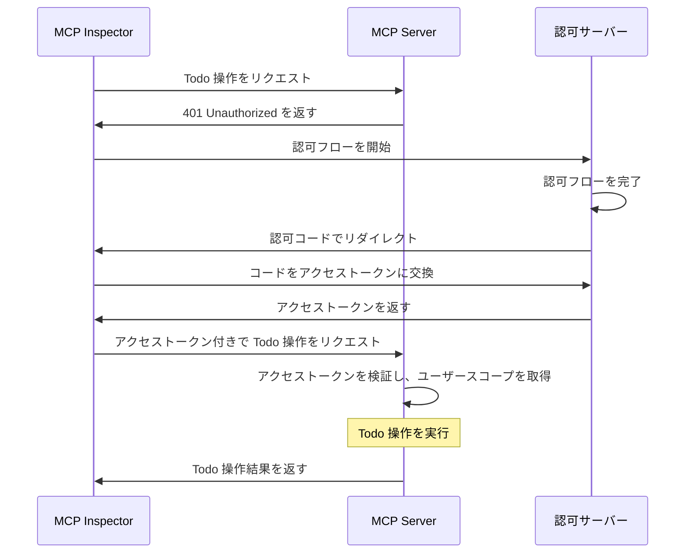
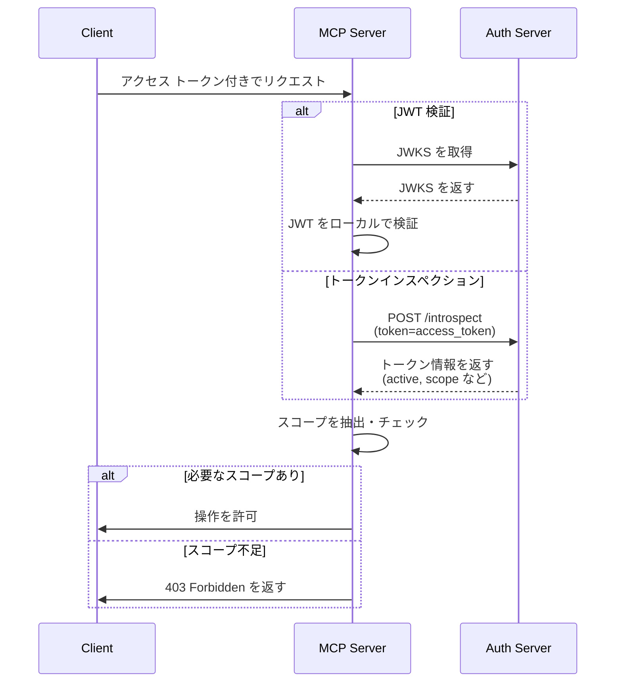

import TabItem from '@theme/TabItem';
import Tabs from '@theme/Tabs';

import SetupOauthOrOidc from './_setup-oauth-or-oidc.mdx';
import SetupOidc from './_setup-oidc.mdx';

# チュートリアル: Todo マネージャーを構築する

このチュートリアルでは、ユーザー認証 (Authentication) と認可 (Authorization) を備えた todo マネージャー MCP サーバーを構築します。

このチュートリアルを完了すると、次のことができるようになります：

- ✅ MCP サーバーでロールベースのアクセス制御 (RBAC) を設定する方法の基本的な理解
- ✅ 個人の todo リストを管理できる MCP サーバー

:::note
始める前に、MCP サーバーや OAuth 2 に不慣れな場合は、[Who am I チュートリアル](./whoami) を先にご覧いただくことを強くおすすめします。
:::

## 概要 \{#overview}

このチュートリアルでは、以下のコンポーネントが登場します：

- **MCP サーバー**：MCP 公式 SDK を使ってリクエストを処理し、ユーザーの todo アイテムを管理する Todo サービスを統合したシンプルな MCP サーバー
- **MCP inspector**：MCP サーバーのためのビジュアルテストツール。OAuth / OIDC クライアントとして認可フローを開始し、アクセス トークンを取得する役割も担います。
- **認可サーバー (Authorization server)**：ユーザーのアイデンティティを管理し、アクセス トークンを発行する OAuth 2.1 または OpenID Connect プロバイダー

これらのコンポーネント間のやり取りを高レベルで示した図です：



## 認可サーバーを理解する \{#understand-your-authorization-server}

### スコープ付きアクセス トークン \{#access-tokens-with-scopes}

[ロールベースのアクセス制御 (RBAC)](https://auth.wiki/rbac) を MCP サーバーで実装するには、認可サーバーがスコープ付きのアクセス トークンを発行できる必要があります。スコープはユーザーに付与された権限を表します。

<Tabs groupId="provider">
<TabItem value="logto" label="Logto">

[Logto](https://logto.io) は、API リソース（[RFC 8707: OAuth 2.0 のリソースインジケーター](https://datatracker.ietf.org/doc/html/rfc8707) に準拠）とロール機能を通じて RBAC をサポートしています。設定方法は以下の通りです：

1. [Logto Console](https://cloud.logto.io)（またはセルフホスト Logto Console）にサインイン

2. API リソースとスコープを作成：

   - 「API リソース」に移動
   - 「Todo Manager」という名前で新しい API リソースを作成
   - 次のスコープを追加：
     - `create:todos`: "新しい todo アイテムを作成"
     - `read:todos`: "すべての todo アイテムを閲覧"
     - `delete:todos`: "任意の todo アイテムを削除"

3. ロールを作成（管理を簡単にするため推奨）：

   - 「ロール」に移動
   - 「Admin」ロールを作成し、すべてのスコープ（`create:todos`, `read:todos`, `delete:todos`）を割り当て
   - 「User」ロールを作成し、`create:todos` スコープのみを割り当て

4. 権限を割り当てる：
   - 「ユーザー」に移動
   - ユーザーを選択
   - 以下のいずれかを実施：
     - 「ロール」タブでロールを割り当て（推奨）
     - または「権限」タブでスコープを直接割り当て

スコープは JWT アクセス トークンの `scope` クレームにスペース区切りの文字列として含まれます。

</TabItem>
<TabItem value="asgardeo" label="Asgardeo">
    [Asgardeo](https://wso2.com/asgardeo) は、API リソースとスコープを使ったロールベースのアクセス制御 (RBAC) ときめ細かな認可をサポートしています。設定方法は以下の通りです：

    1. [Asgardeo Console](https://console.asgardeo.io) にサインイン

    2. API リソースとスコープを定義：
        - **API Resources** に移動
        - **"New API Resource"** をクリック
        - **Identifier** を `https://todo.mcp-server.app`（または任意の URL）に設定
        - **Display Name** を `Todo Manager` に
        - 次のスコープを追加：
            - `create:todos` : "新しい todo アイテムを作成"
            - `read:todos` : "すべての todo アイテムを閲覧"
            - `delete:todos` : "任意の todo アイテムを削除"
        - リソースを作成

    3. ロールを作成：
        - **User Management > Roles** でロールを作成し、スコープを直接割り当て
        - **New Role** をクリック
        - **Basic Details** でロール名（例：`Admin` または `User`）を入力
        - ロールのオーディエンスを `Application` にし、**Assigned Application** で `MCP Inspector Application` を選択
        - **Permission Selection** で先ほど作成した API リソース（例：`Todo Manager`）を選択
        - このロールに割り当てたいスコープを選択（例：`create:todos`, `read:todos`, `delete:todos`）
        - **Finish** をクリックしてロールを作成

    すでにアプリケーションを作成済みの場合
        - **Application > MCP Inspector Application > Roles tab** に移動
        - **Application Role** をオーディエンスタイプに選択し、**New Role** をクリック
        - `Admin` ロールを作成し、3 つのスコープすべてを付与
        - `User` ロールを作成し、`create:todos` スコープのみ付与

    4. ユーザーにロールを割り当て：
        - **User Management > Roles** に移動
        - 作成したロール（例：`Admin` または `User`）を選択し、**Users** タブへ
        - **Assign User** を選択し、割り当てたいユーザーを選択して保存

    スコープは JWT アクセス トークンの `scope` クレームにスペース区切りの文字列として含まれます。

</TabItem>
<TabItem value="oauth-oidc" label="OAuth 2.0 / OIDC">

OAuth 2.0 / OIDC プロバイダーは通常、スコープベースのアクセス制御をサポートしています。RBAC を実装する場合：

1. 認可サーバーで必要なスコープを定義
2. クライアントで認可フロー時にこれらのスコープをリクエスト
3. 認可サーバーが付与したスコープをアクセス トークンに含めることを確認
4. スコープは通常、JWT アクセス トークンの `scope` クレームに含まれます

詳細は各プロバイダーのドキュメントを参照してください：

- スコープの定義・管理方法
- アクセス トークンへのスコープの含め方
- ロール管理など追加の RBAC 機能

</TabItem>
</Tabs>

### トークンの検証と権限チェック \{#validating-tokens-and-checking-permissions}

MCP サーバーがリクエストを受け取った際は、次の処理が必要です：

1. アクセス トークンの署名と有効期限を検証
2. 検証済みトークンからスコープを抽出
3. リクエストされた操作に必要なスコープがトークンに含まれているか確認

例えば、ユーザーが新しい todo アイテムを作成したい場合、そのアクセス トークンには `create:todos` スコープが含まれている必要があります。フローは以下の通りです：



### Dynamic Client Registration \{#dynamic-client-registration}

このチュートリアルでは Dynamic Client Registration は必須ではありませんが、認可サーバーへの MCP クライアント登録を自動化したい場合に便利です。詳細は [Dynamic Client Registration は必要？](../../provider-list.mdx#is-dcr-required) を参照してください。

## Todo マネージャーにおける RBAC を理解する \{#understand-rbac-in-todo-manager}

デモ目的で、todo マネージャー MCP サーバーにシンプルなロールベースのアクセス制御 (RBAC) システムを実装します。これにより、RBAC の基本原則をシンプルな実装で学べます。

:::note
このチュートリアルでは RBAC ベースのスコープ管理を紹介していますが、すべての認証 (Authentication) プロバイダーがロールによるスコープ管理を実装しているわけではありません。プロバイダーによっては独自のアクセス制御や権限管理の仕組みを持つ場合があります。
:::

### ツールとスコープ \{#tools-and-scopes}

Todo マネージャー MCP サーバーは主に 3 つのツールを提供します：

- `create-todo`: 新しい todo アイテムを作成
- `get-todos`: すべての todo を一覧表示
- `delete-todo`: ID で todo を削除

これらのツールへのアクセスを制御するため、次のスコープを定義します：

- `create:todos`: 新しい todo アイテムの作成を許可
- `delete:todos`: 既存の todo アイテムの削除を許可
- `read:todos`: すべての todo アイテムの一覧取得を許可

### ロールと権限 \{#roles-and-permissions}

異なるアクセスレベルを持つ 2 つのロールを定義します：

| ロール  | create:todos | read:todos | delete:todos |
| ------- | ------------ | ---------- | ------------ |
| Admin   | ✅           | ✅         | ✅           |
| User    | ✅           |            |              |

- **User**：自分の todo の作成・閲覧・削除のみ可能な一般ユーザー
- **Admin**：すべての todo の作成・閲覧・削除が可能な管理者

### リソース所有権 \{#resource-ownership}

上記の権限テーブルは各ロールに明示的に割り当てられたスコープを示していますが、リソース所有権の重要な原則も考慮する必要があります：

- **User** は `read:todos` や `delete:todos` スコープを持っていなくても、
  - 自分の todo アイテムの閲覧
  - 自分の todo アイテムの削除
  が可能です
- **Admin** は `read:todos` と `delete:todos` のフル権限を持つため、
  - システム内のすべての todo アイテムの閲覧
  - すべての todo アイテムの削除（所有者問わず）
  が可能です

これは、RBAC システムにおいてリソース所有者には自身のリソースに対する暗黙的な権限が与えられ、管理者ロールにはすべてのリソースに対する明示的な権限が与えられるという一般的なパターンを示しています。

:::tip 詳しく学ぶ
RBAC の概念やベストプラクティスをさらに深く学びたい場合は、[Mastering RBAC: A Comprehensive Real-World Example](https://blog.logto.io/mastering-rbac) をご覧ください。
:::

## プロバイダーで認可を設定する \{#configure-authorization-in-your-provider}

前述のアクセス制御システムを実装するには、認可サーバーで必要なスコープをサポートするよう設定が必要です。各プロバイダーでの設定方法は以下の通りです：

<Tabs groupId="provider">
<TabItem value="logto" label="Logto">

[Logto](https://logto.io) は、API リソースとロール機能を通じて RBAC をサポートしています。設定方法は以下の通りです：

1. [Logto Console](https://cloud.logto.io)（またはセルフホスト Logto Console）にサインイン

2. API リソースとスコープを作成：

   - 「API リソース」に移動
   - 「Todo Manager」という名前で新しい API リソースを作成し、インジケーターに `https://todo.mcp-server.app`（デモ用）を使用
   - 次のスコープを作成：
     - `create:todos`: "新しい todo アイテムを作成"
     - `read:todos`: "すべての todo アイテムを閲覧"
     - `delete:todos`: "任意の todo アイテムを削除"

3. ロールを作成（管理を簡単にするため推奨）：

   - 「ロール」に移動
   - 「Admin」ロールを作成し、すべてのスコープ（`create:todos`, `read:todos`, `delete:todos`）を割り当て
   - 「User」ロールを作成し、`create:todos` スコープのみを割り当て
   - 「User」ロールの詳細ページで「General」タブに切り替え、「User」ロールを「デフォルトロール」に設定

4. ユーザーロールと権限を管理：
   - 新規ユーザーの場合：
     - デフォルトロールに設定したため自動的に「User」ロールが付与されます
   - 既存ユーザーの場合：
     - 「ユーザー管理」に移動
     - ユーザーを選択
     - 「ロール」タブでロールを割り当て

:::tip プログラムによるロール管理
Logto の [Management API](https://docs.logto.io/integrate-logto/interact-with-management-api) を使ってユーザーロールをプログラムで管理することもできます。自動化や管理画面構築時に便利です。
:::

アクセストークンをリクエストする際、Logto はユーザーロールの権限に基づきスコープをトークンの `scope` クレームに含めます。

</TabItem>
<TabItem value="keycloak" label="Keycloak">

[Keycloak](https://www.keycloak.org) では、クライアントスコープを使って必要な権限を設定できます：

1. クライアントスコープを作成：

   - リアルムで「Client scopes」に移動
   - 新しいクライアントスコープを 3 つ作成：
     - `create:todos`
     - `read:todos`
     - `delete:todos`

2. クライアントを設定：

   - クライアント設定に移動
   - 「Client scopes」タブで作成したスコープをすべて追加
   - トークンマッパーがスコープを含めるよう設定されていることを確認

3. オプション：ロールによる管理
   - ロールベース管理を希望する場合：
     - アクセスレベルごとにリアルムロールを作成
     - スコープをロールにマッピング
     - ユーザーにロールを割り当て
   - それ以外は、ユーザーやクライアントレベルの権限でスコープを直接割り当てても OK

Keycloak は付与されたスコープをアクセス トークンの `scope` クレームに含めます。

</TabItem>
<TabItem value="asgardeo" label="Asgardeo">

[Asgardeo](https://wso2.com/asgardeo) は、API リソースとスコープを使ったロールベースのアクセス制御 (RBAC) ときめ細かな認可をサポートしています。設定方法は以下の通りです：

1. [Asgardeo Console](https://console.asgardeo.io) にサインイン

2. API リソースとスコープを定義：
    - **API Resources** に移動
    - **"New API Resource"** をクリック
    - **Identifier** を `https://todo.mcp-server.app`（または任意の URL）に設定
    - **Display Name** を `Todo Manager` に
    - 次のスコープを追加：
        - `create:todos` : "新しい todo アイテムを作成"
        - `read:todos` : "すべての todo アイテムを閲覧"
        - `delete:todos` : "任意の todo アイテムを削除"
    - リソースを作成

3. ロールを作成：
    - **User Management > Roles** でロールを作成し、スコープを直接割り当て
    - **New Role** をクリック
    - **Basic Details** でロール名（例：`Admin` または `User`）を入力
    - ロールのオーディエンスを `Application` にし、**Assigned Application** で `MCP Inspector Application` を選択
    - **Permission Selection** で先ほど作成した API リソース（例：`Todo Manager`）を選択
    - このロールに割り当てたいスコープを選択（例：`create:todos`, `read:todos`, `delete:todos`）
    - **Finish** をクリックしてロールを作成

    すでにアプリケーションを作成済みの場合
    - **Application > MCP Inspector Application > Roles tab** に移動
    - **Application Role** をオーディエンスタイプに選択し、**New Role** をクリック
    - `Admin` ロールを作成し、3 つのスコープすべてを付与
    - `User` ロールを作成し、`create:todos` スコープのみ付与

4. ユーザーにロールを割り当て：
    - **User Management > Roles** に移動
    - 作成したロール（例：`Admin` または `User`）を選択し、**Users** タブへ
    - **Assign User** を選択し、割り当てたいユーザーを選択して保存

スコープは JWT アクセス トークンの `scope` クレームにスペース区切りの文字列として含まれます。
認可サーバーを設定後、ユーザーは付与されたスコープを含むアクセス トークンを受け取ります。MCP サーバーはこれらのスコープを使って次を判断します：

ユーザーが新しい todo を作成できるか（`create:todos`）
ユーザーがすべての todo を閲覧できるか（`read:todos`）または自分のものだけか
ユーザーが任意の todo を削除できるか（`delete:todos`）または自分のものだけか

Asgardeo の詳細な設定方法は以下を参照してください：
- [API Resources Guide](https://wso2.com/asgardeo/docs/guides/authorization/api-authorization)
- [Role Management](https://wso2.com/asgardeo/docs/guides/users/manage-roles)
</TabItem>
<TabItem value="oauth-or-oidc" label="OAuth 2 / OIDC">

OAuth 2.0 または OpenID Connect プロバイダーの場合、異なる権限を表すスコープを設定する必要があります。具体的な手順はプロバイダーによって異なりますが、一般的には：

1. スコープを定義：

   - 認可サーバーで以下をサポートするよう設定：
     - `create:todos`
     - `read:todos`
     - `delete:todos`

2. クライアントを設定：

   - クライアントを登録または更新し、これらのスコープをリクエスト
   - スコープがアクセス トークンに含まれることを確認

3. 権限を割り当て：
   - プロバイダーの管理画面でユーザーに適切なスコープを付与
   - プロバイダーによってはロールベース管理もサポート
   - 推奨方法はプロバイダーのドキュメントを参照

:::tip
ほとんどのプロバイダーは付与されたスコープをアクセス トークンの `scope` クレームに含めます。形式は通常スペース区切りのスコープ値です。
:::

</TabItem>
</Tabs>

認可サーバーを設定後、ユーザーは付与されたスコープを含むアクセス トークンを受け取ります。MCP サーバーはこれらのスコープを使って次を判断します：

- ユーザーが新しい todo を作成できるか（`create:todos`）
- ユーザーがすべての todo を閲覧できるか（`read:todos`）または自分のものだけか
- ユーザーが任意の todo を削除できるか（`delete:todos`）または自分のものだけか

## MCP サーバーをセットアップする \{#set-up-the-mcp-server}

[MCP 公式 SDK](https://github.com/modelcontextprotocol) を使って todo マネージャー MCP サーバーを作成します。

### 新しいプロジェクトを作成 \{#create-a-new-project}

<Tabs groupId="sdk">
<TabItem value="python" label="Python">

```bash
mkdir mcp-server
cd mcp-server
uv init # または `pipenv` や `poetry` で仮想環境を作成
```

</TabItem>
<TabItem value="node" label="Node.js">

新しい Node.js プロジェクトをセットアップ：

```bash
mkdir mcp-server
cd mcp-server
npm init -y # または `pnpm init`
npm pkg set type="module"
npm pkg set main="todo-manager.ts"
npm pkg set scripts.start="node --experimental-strip-types todo-manager.ts"
```

:::note
サンプルでは TypeScript を使用しています。Node.js v22.6.0 以降は `--experimental-strip-types` フラグで TypeScript をネイティブ実行できます。JavaScript を使う場合もほぼ同様ですが、Node.js v22.6.0 以降を利用してください。詳細は Node.js ドキュメントを参照してください。
:::

</TabItem>
</Tabs>

### MCP SDK と依存パッケージをインストール \{#install-the-mcp-sdk-and-dependencies}

<Tabs groupId="sdk">
<TabItem value="python" label="Python">

```bash
pip install "mcp[cli]" starlette uvicorn
```

または `uv` や `poetry` などお好みのパッケージマネージャーを利用してください。

</TabItem>
<TabItem value="node" label="Node.js">

```bash
npm install @modelcontextprotocol/sdk express zod
```

または `pnpm` や `yarn` などお好みのパッケージマネージャーを利用してください。

</TabItem>
</Tabs>

### MCP サーバーを作成 \{#create-the-mcp-server}

まず、ツール定義を含む基本的な MCP サーバーを作成します：

<Tabs groupId="sdk">
<TabItem value="python" label="Python">

`todo-manager.py` というファイルを作成し、以下のコードを追加：

```python
from typing import Any
from mcp.server.fastmcp import FastMCP
from starlette.applications import Starlette
from starlette.routing import Mount

mcp = FastMCP("Todo Manager")

@mcp.tool()
def create_todo(content: str) -> dict[str, Any]:
    """新しい todo を作成"""
    return {"error": "Not implemented"}

@mcp.tool()
def get_todos() -> dict[str, Any]:
    """すべての todo を一覧表示"""
    return {"error": "Not implemented"}

@mcp.tool()
def delete_todo(id: str) -> dict[str, Any]:
    """ID で todo を削除"""
    return {"error": "Not implemented"}

app = Starlette(
    routes=[Mount('/', app=mcp.sse_app())]
)
```

サーバーを起動：

```bash
uvicorn todo_manager:app --host 0.0.0.0 --port 3001
```

</TabItem>
<TabItem value="node" label="Node.js">

:::note
現時点の MCP inspector 実装は認可フローに対応していないため、SSE アプローチで MCP サーバーをセットアップします。MCP inspector が認可フローに対応次第、コードを更新します。
:::

`pnpm` や `yarn` も利用可能です。

`todo-manager.ts` というファイルを作成し、以下のコードを追加：

```ts
// todo-manager.ts

import { z } from 'zod';
import { McpServer } from '@modelcontextprotocol/sdk/server/mcp.js';
import { SSEServerTransport } from '@modelcontextprotocol/sdk/server/sse.js';
import express from 'express';

// MCP サーバーを作成
const server = new McpServer({
  name: 'Todo Manager',
  version: '0.0.0',
});

server.tool('create-todo', '新しい todo を作成', { content: z.string() }, async ({ content }) => {
  return {
    content: [{ type: 'text', text: JSON.stringify({ error: 'Not implemented' }) }],
  };
});

server.tool('get-todos', 'すべての todo を一覧表示', async () => {
  return {
    content: [{ type: 'text', text: JSON.stringify({ error: 'Not implemented' }) }],
  };
});

server.tool('delete-todo', 'ID で todo を削除', { id: z.string() }, async ({ id }) => {
  return {
    content: [{ type: 'text', text: JSON.stringify({ error: 'Not implemented' }) }],
  };
});

// 以下は MCP SDK ドキュメントのボイラープレートコード
const PORT = 3001;
const app = express();

const transports = {};

app.get('/sse', async (_req, res) => {
  const transport = new SSEServerTransport('/messages', res);
  transports[transport.sessionId] = transport;

  res.on('close', () => {
    delete transports[transport.sessionId];
  });

  await server.connect(transport);
});

app.post('/messages', async (req, res) => {
  const sessionId = String(req.query.sessionId);
  const transport = transports[sessionId];
  if (transport) {
    await transport.handlePostMessage(req, res, req.body);
  } else {
    res.status(400).send('No transport found for sessionId');
  }
});

app.listen(PORT);
```

サーバーを起動：

```bash
npm start
```

</TabItem>
</Tabs>

## MCP サーバーを検証する \{#inspect-the-mcp-server}

### MCP inspector をクローンして実行 \{#clone-and-run-mcp-inspector}

MCP サーバーが起動したら、MCP inspector を使って `whoami` ツールが利用可能か確認できます。

現状の実装制限のため、[MCP inspector](https://github.com/mcp-auth/inspector) をフォークし、認証 (Authentication)・認可 (Authorization) に柔軟かつ拡張しやすくしています。オリジナルリポジトリにもプルリクエストを提出済みです。

MCP inspector を実行するには、以下のコマンドを使用します（Node.js 必須）：

```bash
git clone https://github.com/mcp-auth/inspector.git
cd inspector
npm install
npm run dev
```

その後、ブラウザで `http://localhost:6274/`（またはターミナルに表示された URL）にアクセスしてください。

### MCP inspector を MCP サーバーに接続 \{#connect-mcp-inspector-to-the-mcp-server}

進める前に、MCP inspector の設定を確認してください：

- **Transport Type**：`SSE` に設定
- **URL**：MCP サーバーの URL（例：`http://localhost:3001/sse`）

「Connect」ボタンをクリックし、MCP inspector が MCP サーバーに接続できるか確認します。問題なければ MCP inspector に「Connected」ステータスが表示されます。

### チェックポイント: Todo マネージャーツールを実行 \{#checkpoint-run-todo-manager-tools}

1. MCP inspector の上部メニューで「Tools」タブをクリック
2. 「List Tools」ボタンをクリック
3. `create-todo`, `get-todos`, `delete-todo` ツールが一覧に表示されるはずです。クリックして詳細を開きます
4. 右側に「Run Tool」ボタンが表示されます。必要なパラメータを入力してツールを実行
5. ツールの結果として `{"error": "Not implemented"}` という JSON レスポンスが表示されます


## 認可サーバーと連携する \{#integrate-with-your-authorization-server}

このセクションを完了するには、いくつかの考慮事項があります：

<details>
<summary>**認可サーバーの発行者 URL**</summary>

通常は認可サーバーのベース URL です（例：`https://auth.example.com`）。プロバイダーによっては `https://example.logto.app/oidc` のようなパスが付く場合もあるので、ドキュメントを確認してください。

</details>

<details>
<summary>**認可サーバーメタデータの取得方法**</summary>

- 認可サーバーが [OAuth 2.0 Authorization Server Metadata](https://datatracker.ietf.org/doc/html/rfc8414) または [OpenID Connect Discovery](https://openid.net/specs/openid-connect-discovery-1_0.html) に準拠していれば、MCP Auth の組み込みユーティリティで自動取得できます
- 準拠していない場合は、MCP サーバー設定でメタデータ URL やエンドポイントを手動指定してください。詳細はプロバイダーのドキュメントを参照

</details>

<details>
<summary>**MCP inspector を認可サーバーのクライアントとして登録する方法**</summary>

- 認可サーバーが [Dynamic Client Registration](https://datatracker.ietf.org/doc/html/rfc7591) をサポートしていれば、MCP inspector が自動でクライアント登録します
- サポートしていない場合は、MCP inspector を手動でクライアント登録してください

</details>

<details>
<summary>**トークンリクエストパラメータの理解**</summary>

認可サーバーからアクセス トークンをリクエストする際、ターゲットリソースや権限指定の方法がいくつかあります。主なパターンは以下の通りです：

- **リソースインジケーター型**：

  - `resource` パラメータでターゲット API を指定（[RFC 8707: OAuth 2.0 のリソースインジケーター](https://datatracker.ietf.org/doc/html/rfc8707) 参照）
  - モダンな OAuth 2.0 実装で一般的
  - 例：
    ```json
    {
      "resource": "https://todo.mcp-server.app",
      "scope": "create:todos read:todos"
    }
    ```
  - サーバーはリソースに紐づいたトークンを発行

- **オーディエンス型**：

  - `audience` パラメータでトークンの受信者を指定
  - リソースインジケーターと似ているが意味合いが異なる
  - 例：
    ```json
    {
      "audience": "todo-api",
      "scope": "create:todos read:todos"
    }
    ```

- **純粋なスコープ型**：
  - resource/audience パラメータなしでスコープのみを利用
  - 従来の OAuth 2.0 アプローチ
  - 例：
    ```json
    {
      "scope": "todo-api:create todo-api:read openid profile"
    }
    ```
  - スコープにプレフィックスを付けて権限を名前空間化することが多い
  - シンプルな OAuth 2.0 実装で一般的

:::tip ベストプラクティス

- プロバイダーのドキュメントでサポートされているパラメータを確認
- 複数のアプローチを同時にサポートするプロバイダーもあり
- リソースインジケーターはオーディエンス制限によるセキュリティ向上
- 利用可能ならリソースインジケーターを使うとより良いアクセス制御が可能
  :::

</details>

各プロバイダーごとに要件は異なりますが、以下の手順で MCP inspector と MCP サーバーをプロバイダー固有の設定で連携できます。

### MCP inspector をクライアントとして登録 \{#register-mcp-inspector-as-a-client}

<Tabs groupId="provider">
<TabItem value="logto" label="Logto">

[Logto](https://logto.io) との連携は簡単です。OpenID Connect プロバイダーであり、リソースインジケーターとスコープをサポートしているため、`https://todo.mcp-server.app` をリソースインジケーターとして todo API を安全に保護できます。

Logto は現時点で Dynamic Client Registration をサポートしていないため、MCP inspector を手動で Logto テナントのクライアントとして登録する必要があります：

1. MCP inspector を開き、「OAuth Configuration」ボタンをクリック。**Redirect URL (auto-populated)** の値（例：`http://localhost:6274/oauth/callback`）をコピー
2. [Logto Console](https://cloud.logto.io)（またはセルフホスト Logto Console）にサインイン
3. 「Applications」タブで「Create application」をクリック。ページ下部で「Create app without framework」をクリック
4. アプリケーション詳細を入力し、「Create application」をクリック：
   - **アプリケーションタイプ**：「Single-page application」を選択
   - **アプリケーション名**：例「MCP Inspector」
5. 「Settings / Redirect URIs」セクションで、MCP inspector からコピーした **Redirect URL (auto-populated)** を貼り付け、「Save changes」をクリック
6. 上部カードに「App ID」値が表示されるのでコピー
7. MCP inspector に戻り、「OAuth Configuration」セクションの「Client ID」に「App ID」値を貼り付け
8. 「Auth Params」フィールドに `{"scope": "create:todos read:todos delete:todos", "resource": "https://todo.mcp-server.app"}` を入力。これで Logto から返されるアクセス トークンに必要なスコープが含まれるようになります

</TabItem>
<TabItem value="asgardeo" label="Asgardeo">

    Asgardeo は標準 API による Dynamic Client Registration をサポートしていますが、エンドポイントは保護されており、必要な権限を持つアクセストークンが必要です。このチュートリアルでは Asgardeo Console から手動でクライアント登録します。

    :::note
    Asgardeo アカウントをお持ちでない場合は [無料登録](https://asgardeo.io) できます。
    :::

    MCP Inspector 用の Asgardeo 設定手順：

    1. [Asgardeo Console](https://console.asgardeo.io) にログインし、組織を選択

    2. 新しいアプリケーションを作成：
    - **Applications** → **New Application**
    - **Single-Page Application** を選択
    - アプリ名を `MCP Inspector` などに
    - **Authorized Redirect URLs** に MCP Inspector からコピーした **Redirect URL**（例：`http://localhost:6274/oauth/callback`）を貼り付け
    - **Create** をクリック

    3. プロトコル設定：
    - **Protocol** タブで
    - 自動生成された **Client ID** をコピー
    - **Access Token** セクションで `Token Type` を `JWT` に切り替え
    - **Update** をクリック

    4. MCP Inspector 側で：
    - **OAuth Configuration** セクションを開く
    - コピーした **Client ID** を貼り付け
    - **Auth Params** フィールドに以下を入力し必要なスコープをリクエスト：

    ```json
    { "scope": "openid profile email" }
    ```
</TabItem>
<TabItem value="oauth-oidc" label="OAuth 2.0 / OIDC">

:::note
これは汎用的な OAuth 2.0 / OpenID Connect プロバイダー連携ガイドです。OIDC は OAuth 2.0 の上に構築されているため、手順はほぼ同じです。詳細は各プロバイダーのドキュメントを参照してください。
:::

プロバイダーが Dynamic Client Registration をサポートしていれば、下記の 8 番目の手順に直接進んで MCP inspector を設定できます。サポートしていない場合は MCP inspector を手動でクライアント登録してください：

1. MCP inspector を開き、「OAuth Configuration」ボタンをクリック。**Redirect URL (auto-populated)** の値（例：`http://localhost:6274/oauth/callback`）をコピー

2. プロバイダーの管理画面にサインイン

3. 「Applications」または「Clients」セクションで新しいアプリケーションまたはクライアントを作成

4. クライアントタイプが必要な場合は「Single-page application」または「Public client」を選択

5. アプリ作成後、リダイレクト URI を設定。MCP inspector からコピーした **Redirect URL (auto-populated)** を貼り付け

6. 新規アプリの「Client ID」または「Application ID」をコピー

7. MCP inspector に戻り、「OAuth Configuration」セクションの「Client ID」に貼り付け

8. 「Auth Params」フィールドに以下を入力し、todo 操作用の必要なスコープをリクエスト：

```json
{ "scope": "create:todos read:todos delete:todos" }
```

</TabItem>
</Tabs>

### MCP auth をセットアップ \{#set-up-mcp-auth}

MCP サーバープロジェクトで MCP Auth SDK をインストールし、認可サーバーメタデータを使って設定します。

<Tabs groupId="sdk">
<TabItem value="python" label="Python">

まず `mcpauth` パッケージをインストール：

```bash
pip install mcpauth
```

または `uv` や `poetry` などお好みのパッケージマネージャーを利用してください。

</TabItem>
<TabItem value="node" label="Node.js">

まず `mcp-auth` パッケージをインストール：

```bash
npm install mcp-auth
```

</TabItem>
</Tabs>

MCP Auth は認可サーバーメタデータが必要です。プロバイダーごとに：

<Tabs groupId="provider">

<TabItem value="logto" label="Logto">

発行者 URL は Logto Console のアプリ詳細ページ「Endpoints & Credentials / Issuer endpoint」セクションで確認できます（例：`https://my-project.logto.app/oidc`）。

<SetupOidc />

</TabItem>

<TabItem value="asgardeo" label="Asgardeo">

    Asgardeo Console で発行者 URL を確認できます。作成したアプリの **Info** タブを開き、**Issuer** フィールドを参照してください（例：`https://api.asgardeo.io/t/<your-organization-name>/oauth2/token`）。

    <SetupOidc />

</TabItem>

<TabItem value="oauth-oidc" label="OAuth 2.0 / OIDC">

OAuth 2.0 プロバイダーの場合：

1. 認可サーバー URL（issuer URL や base URL と呼ばれる）をドキュメントで確認
2. 多くの場合 `https://{your-domain}/.well-known/oauth-authorization-server` で公開
3. 管理画面の OAuth/API 設定を参照

<SetupOauthOrOidc />

</TabItem>

</Tabs>

<Tabs groupId="sdk">

<TabItem value="python" label="Python">

`todo-manager.py` を更新し、MCP Auth 設定を追加：

```python
from mcpauth import MCPAuth
from mcpauth.config import AuthServerType
from mcpauth.utils import fetch_server_config

auth_issuer = '<issuer-endpoint>'  # 発行者エンドポイントに置き換え
auth_server_config = fetch_server_config(auth_issuer, type=AuthServerType.OIDC)
mcp_auth = MCPAuth(server=auth_server_config)
```

</TabItem>
<TabItem value="node" label="Node.js">

`todo-manager.ts` を更新し、MCP Auth 設定を追加：

```ts
// todo-manager.ts

import { MCPAuth, fetchServerConfig } from 'mcp-auth';

const authIssuer = '<issuer-endpoint>'; // 発行者エンドポイントに置き換え
const mcpAuth = new MCPAuth({
  server: await fetchServerConfig(authIssuer, { type: 'oidc' }),
});
```

</TabItem>
</Tabs>

### MCP サーバーを更新 \{#update-mcp-server}

あと少しです！MCP Auth のルートとミドルウェア関数を適用し、ユーザーのスコープに基づく権限制御を todo マネージャーツールに実装します。

<Tabs groupId="sdk">
<TabItem value="python" label="Python">

```python
@mcp.tool()
def create_todo(content: str) -> dict[str, Any]:
    """新しい todo を作成"""
    return (
        mcp_auth.auth_info.scopes
        if mcp_auth.auth_info # Bearer auth ミドルウェアでセットされます
        else {"error": "Not authenticated"}
    )

# ...

bearer_auth = Middleware(mcp_auth.bearer_auth_middleware("jwt"))
app = Starlette(
    routes=[
        # メタデータルート（`/.well-known/oauth-authorization-server`）を追加
        mcp_auth.metadata_route(),
        # Bearer auth ミドルウェアで MCP サーバーを保護
        Mount('/', app=mcp.sse_app(), middleware=[bearer_auth]),
    ],
)
```

</TabItem>
<TabItem value="node" label="Node.js">

```js
server.tool(
  'create-todo',
  '新しい todo を作成',
  { content: z.string() },
  async ({ content, authInfo }) => {
    return {
      content: [
        { type: 'text', text: JSON.stringify(authInfo?.scopes ?? { error: 'Not authenticated' }) },
      ],
    };
  }
);

// ...

app.use(mcpAuth.delegatedRouter());
app.use(mcpAuth.bearerAuth('jwt'));
```

</TabItem>
</Tabs>

次に、具体的なツールを実装します。

まず、メモリ上で todo アイテムの基本的な CRUD 操作を提供するシンプルな todo サービスを作成します。

<Tabs groupId="sdk">
<TabItem value="python" label="Python">
```python
# service.py

"""
デモ用のシンプルな Todo サービス。
メモリ上のリストで todo を管理します。
"""

from datetime import datetime
from typing import List, Optional, Dict, Any
import random
import string

class Todo:
"""Todo アイテムを表します。"""

    def __init__(self, id: str, content: str, owner_id: str, created_at: str):
        self.id = id
        self.content = content
        self.owner_id = owner_id
        self.created_at = created_at

    def to_dict(self) -> Dict[str, Any]:
        """Todo を辞書に変換（JSON シリアライズ用）"""
        return {
            "id": self.id,
            "content": self.content,
            "ownerId": self.owner_id,
            "createdAt": self.created_at
        }

class TodoService:
"""デモ用のシンプルな Todo サービス。"""

    def __init__(self):
        self._todos: List[Todo] = []

    def get_all_todos(self, owner_id: Optional[str] = None) -> List[Dict[str, Any]]:
        """
        すべての todo を取得。owner_id でフィルタ可能。

        Args:
            owner_id: 指定時はこのユーザーの todo のみ返す

        Returns:
            Todo 辞書のリスト
        """
        if owner_id:
            filtered_todos = [todo for todo in self._todos if todo.owner_id == owner_id]
            return [todo.to_dict() for todo in filtered_todos]
        return [todo.to_dict() for todo in self._todos]

    def get_todo_by_id(self, todo_id: str) -> Optional[Todo]:
        """
        ID で todo を取得

        Args:
            todo_id: 取得したい todo の ID

        Returns:
            見つかれば Todo オブジェクト、なければ None
        """
        for todo in self._todos:
            if todo.id == todo_id:
                return todo
        return None

    def create_todo(self, content: str, owner_id: str) -> Dict[str, Any]:
        """
        新しい todo を作成

        Args:
            content: todo の内容
            owner_id: この todo の所有ユーザー ID

        Returns:
            作成した todo の辞書
        """
        todo = Todo(
            id=self._generate_id(),
            content=content,
            owner_id=owner_id,
            created_at=datetime.now().isoformat()
        )
        self._todos.append(todo)
        return todo.to_dict()

    def delete_todo(self, todo_id: str) -> Optional[Dict[str, Any]]:
        """
        ID で todo を削除

        Args:
            todo_id: 削除したい todo の ID

        Returns:
            削除した todo の辞書（見つかれば）、なければ None
        """
        for i, todo in enumerate(self._todos):
            if todo.id == todo_id:
                deleted_todo = self._todos.pop(i)
                return deleted_todo.to_dict()
        return None

    def _generate_id(self) -> str:
        """Todo 用のランダム ID を生成"""
        return ''.join(random.choices(string.ascii_lowercase + string.digits, k=8))

````


</TabItem>
<TabItem value="node" label="Node.js">

```ts
// todo-service.ts

type Todo = {
  id: string;
  content: string;
  ownerId: string;
  createdAt: string;
};

/**
 * デモ用のシンプルな Todo サービス
 * メモリ上の配列で todo を管理
 */
export class TodoService {
  private readonly todos: Todo[] = [];

  getAllTodos(ownerId?: string): Todo[] {
    if (ownerId) {
      return this.todos.filter((todo) => todo.ownerId === ownerId);
    }
    return this.todos;
  }

  getTodoById(id: string): Todo | undefined {
    return this.todos.find((todo) => todo.id === id);
  }

  createTodo({ content, ownerId }: { content: string; ownerId: string }): Todo {
    const todo: Todo = {
      id: this.genId(),
      content,
      ownerId,
      createdAt: new Date().toISOString(),
    };

    // eslint-disable-next-line @silverhand/fp/no-mutating-methods
    this.todos.push(todo);
    return todo;
  }

  deleteTodo(id: string): Todo | undefined {
    const index = this.todos.findIndex((todo) => todo.id === id);

    if (index === -1) {
      return undefined;
    }

    // eslint-disable-next-line @silverhand/fp/no-mutating-methods
    const [deleted] = this.todos.splice(index, 1);
    return deleted;
  }

  private genId(): string {
    return Math.random().toString(36).slice(2, 10);
  }
}
````

</TabItem>
</Tabs>

次にツール層で、ユーザーのスコープに基づき操作が許可されるか判定します：

<Tabs groupId="sdk">
<TabItem value="python" label="Python">

```python
# todo-manager.py

from typing import Any, Optional
from mcpauth.errors import MCPAuthBearerAuthError

def assert_user_id(auth_info: Optional[dict]) -> str:
    """auth info からユーザー ID を抽出・検証"""
    subject = auth_info.get('subject') if auth_info else None
    if not subject:
        raise ValueError('Invalid auth info')
    return subject

def has_required_scopes(user_scopes: list[str], required_scopes: list[str]) -> bool:
    """ユーザーがすべての必要なスコープを持っているかチェック"""
    return all(scope in user_scopes for scope in required_scopes)

# TodoService のインスタンスを作成
todo_service = TodoService()

@mcp.tool()
def create_todo(content: str) -> dict[str, Any]:
    """新しい todo を作成

    'create:todos' スコープを持つユーザーのみ作成可能
    """
    # 認証情報を取得
    auth_info = mcp_auth.auth_info

    # ユーザー ID を検証
    try:
        user_id = assert_user_id(auth_info)
    except ValueError as e:
        return {"error": str(e)}

    # 必要な権限を持っているかチェック
    if not has_required_scopes(auth_info.scopes if auth_info else [], ['create:todos']):
        raise MCPAuthBearerAuthError('missing_required_scopes')

    # 新しい todo を作成
    created_todo = todo_service.create_todo(content=content, owner_id=user_id)

    # 作成した todo を返す
    return created_todo.__dict__

# ...
```

[サンプルコード](https://github.com/mcp-auth/python/tree/master/samples/server) で他の詳細実装も確認できます。

</TabItem>
<TabItem value="node" label="Node.js">

```ts
// todo-manager.ts

// ... 他のインポート
import assert from 'node:assert';
import { type AuthInfo } from '@modelcontextprotocol/sdk/server/auth/types.js';
import { TodoService } from './todo-service.js';

const todoService = new TodoService();

const assertUserId = (authInfo?: AuthInfo) => {
  const { subject } = authInfo ?? {};
  assert(subject, 'Invalid auth info');
  return subject;
};

/**
 * 操作に必要なすべてのスコープをユーザーが持っているかチェック
 */
const hasRequiredScopes = (userScopes: string[], requiredScopes: string[]): boolean => {
  return requiredScopes.every((scope) => userScopes.includes(scope));
};

server.tool(
  'create-todo',
  '新しい todo を作成',
  { content: z.string() },
  ({ content }: { content: string }, { authInfo }) => {
    const userId = assertUserId(authInfo);

    /**
     * 'create:todos' スコープを持つユーザーのみ作成可能
     */
    if (!hasRequiredScopes(authInfo?.scopes ?? [], ['create:todos'])) {
      throw new MCPAuthBearerAuthError('missing_required_scopes');
    }

    const createdTodo = todoService.createTodo({ content, ownerId: userId });

    return {
      content: [{ type: 'text', text: JSON.stringify(createdTodo) }],
    };
  }
);

// ...
```

[サンプルコード](https://github.com/mcp-auth/js/tree/master/packages/sample-servers/src/todo-manager) で他の詳細実装も確認できます。

</TabItem>
</Tabs>

## チェックポイント: `todo-manager` ツールを実行 \{#checkpoint-run-the-todo-manager-tools}

MCP サーバーを再起動し、ブラウザで MCP inspector を開きます。「Connect」ボタンをクリックすると、認可サーバーのサインインページにリダイレクトされます。

サインイン後 MCP inspector に戻り、前回のチェックポイントと同じ操作を繰り返して todo マネージャーツールを実行します。今回は認証済みユーザーとしてツールを利用できます。ツールの挙動はユーザーに割り当てられたロールと権限によって異なります：

- **User**（`create:todos` スコープのみ）でログインしている場合：

  - `create-todo` ツールで新しい todo を作成可能
  - 自分の todo のみ閲覧・削除可能
  - 他ユーザーの todo は閲覧・削除不可

- **Admin**（すべてのスコープ：`create:todos`, `read:todos`, `delete:todos`）でログインしている場合：
  - 新しい todo を作成可能
  - `get-todos` ツールですべての todo を閲覧可能
  - `delete-todo` ツールで誰の todo でも削除可能

異なる権限レベルをテストするには：

1. MCP inspector で「Disconnect」ボタンをクリックして現在のセッションをサインアウト
2. 別のロール/権限を持つユーザーアカウントでサインイン
3. 同じツールを再度試し、ユーザーの権限による挙動の違いを確認

これにより、ロールベースのアクセス制御 (RBAC) が実際にどのように機能するかを体験できます。


<Tabs groupId="sdk">
<TabItem value="python" label="Python">

:::info
MCP サーバー（OIDC 版）の完全なコードは [MCP Auth Python SDK リポジトリ](https://github.com/mcp-auth/python/blob/master/samples/server/todo-manager/server.py) をご覧ください。
:::

</TabItem>
<TabItem value="node" label="Node.js">

:::info
MCP サーバー（OIDC 版）の完全なコードは [MCP Auth Node.js SDK リポジトリ](https://github.com/mcp-auth/js/blob/master/packages/sample-servers/src) をご覧ください。
:::

</TabItem>
</Tabs>

## 締めくくり \{#closing-notes}

🎊 おめでとうございます！チュートリアルを無事完了しました。ここまでで実施した内容を振り返りましょう：

- Todo 管理ツール（`create-todo`, `get-todos`, `delete-todo`）付きの基本的な MCP サーバーのセットアップ
- ユーザーと管理者で異なる権限レベルを持つロールベースのアクセス制御 (RBAC) の実装
- MCP Auth を使った MCP サーバーと認可サーバーの連携
- MCP Inspector でユーザー認証 (Authentication)・スコープ付きアクセス トークンを使ったツール呼び出し

他のチュートリアルやドキュメントもぜひご覧いただき、MCP Auth を最大限に活用してください。
