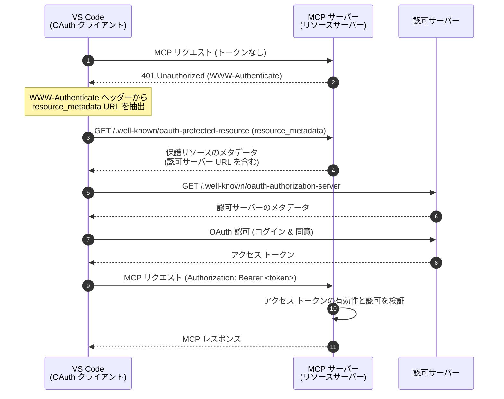
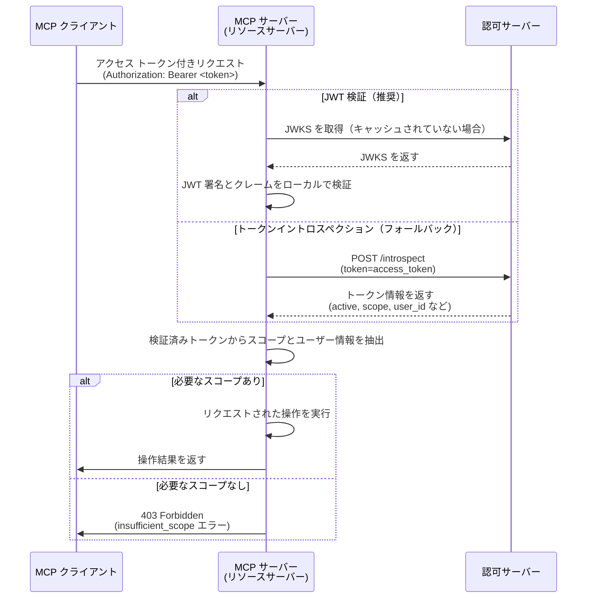

import { NpmLikeInstallation } from '@site/src/components/NpmLikeInstallation';
import TabItem from '@theme/TabItem';
import Tabs from '@theme/Tabs';

# チュートリアル: Todo マネージャーを構築する

:::tip Python SDK available
MCP Auth は Python でも利用可能です！インストール方法や使い方は [Python SDK リポジトリ](https://github.com/mcp-auth/python) をご覧ください。
:::

このチュートリアルでは、ユーザー認証 (Authentication) と認可 (Authorization) を備えた todo マネージャー MCP サーバーを構築します。最新の MCP 仕様に従い、MCP サーバーは OAuth 2.0 **リソースサーバー (Resource Server)** として動作し、アクセス トークンの検証とスコープベースの権限管理を行います。

このチュートリアルを完了すると、次のことができるようになります：

- ✅ MCP サーバーでロールベースのアクセス制御 (RBAC) を設定する基本的な理解
- ✅ 認可サーバーが発行したアクセス トークンを利用するリソースサーバーとしての MCP サーバー
- ✅ Todo 操作に対するスコープベースの権限管理の実装

## 概要 \{#overview}

このチュートリアルでは、以下のコンポーネントを扱います：

- **MCP クライアント (VS Code)**：MCP サポートを内蔵したコードエディタで、OAuth 2.0/OIDC クライアントとして動作します。認可サーバーと認可フローを開始し、MCP サーバーへのリクエスト認証のためにアクセス トークンを取得します。
- **認可サーバー (Authorization Server)**：OAuth 2.1 または OpenID Connect プロバイダーで、ユーザーのアイデンティティ管理、認証 (Authentication)、および認可されたクライアントへの適切なスコープ付きアクセス トークンの発行を行います。
- **MCP サーバー (リソースサーバー)**：最新の MCP 仕様に基づき、OAuth 2.0 フレームワークのリソースサーバー (Resource Server) として動作します。認可サーバーが発行したアクセス トークンの検証と、todo 操作に対するスコープベースの権限管理を行います。

このアーキテクチャは標準的な OAuth 2.0 フローに従います：

- **VS Code** がユーザーに代わって保護されたリソースをリクエスト
- **認可サーバー (Authorization Server)** がユーザーを認証 (Authentication) し、アクセス トークンを発行
- **MCP サーバー** がトークンを検証し、付与された権限に基づいて保護されたリソースを提供

これらのコンポーネント間のやり取りを示すハイレベルな図は以下の通りです：


```mermaid
sequenceDiagram
  autonumber
  participant Client as VS Code<br/>(OAuth クライアント)
  participant RS as MCP サーバー<br/>(リソースサーバー)
  participant AS as 認可サーバー

  Client->>RS: MCP リクエスト (トークンなし)
  RS-->>Client: 401 Unauthorized (WWW-Authenticate)
  Note over Client: WWW-Authenticate ヘッダーから<br/>resource_metadata URL を抽出

  Client->>RS: GET /.well-known/oauth-protected-resource (resource_metadata)
  RS-->>Client: 保護リソースのメタデータ<br/>(認可サーバー URL を含む)

  Client->>AS: GET /.well-known/oauth-authorization-server
  AS-->>Client: 認可サーバーのメタデータ
  Client->>AS: OAuth 認可 (ログイン & 同意)
  AS-->>Client: アクセス トークン

  Client->>RS: MCP リクエスト (Authorization: Bearer <token>)
  RS->>RS: アクセス トークンの有効性と認可を検証
  RS-->>Client: MCP レスポンス
```

## 認可サーバーを理解する \{#understand-your-authorization-server}

### スコープ付きアクセス トークン \{#access-tokens-with-scopes}

MCP サーバーで [ロールベースのアクセス制御 (RBAC)](https://auth.wiki/rbac) を実装するには、認可サーバーがスコープ付きのアクセス トークンを発行できる必要があります。スコープはユーザーに付与された権限を表します。

<Tabs groupId="provider">
<TabItem value="logto" label="Logto">

[Logto](https://logto.io) は、API リソース（[RFC 8707: OAuth 2.0 のリソースインジケーター](https://datatracker.ietf.org/doc/html/rfc8707) に準拠）とロール機能を通じて RBAC をサポートしています。設定方法は以下の通りです：

1. [Logto コンソール](https://cloud.logto.io)（またはセルフホスト Logto コンソール）にサインイン

2. API リソースとスコープを作成：

   - 「API リソース」へ移動
   - 「Todo Manager」という新しい API リソースを作成
   - 以下のスコープを追加
     - `create:todos`: 「新しい todo アイテムの作成」
     - `read:todos`: 「すべての todo アイテムの閲覧」
     - `delete:todos`: 「任意の todo アイテムの削除」

3. ロールを作成（管理を簡単にするため推奨）：

   - 「ロール」へ移動
   - 「Admin」ロールを作成し、すべてのスコープ（`create:todos`, `read:todos`, `delete:todos`）を割り当て
   - 「User」ロールを作成し、`create:todos` スコープのみ割り当て

4. 権限を割り当てる：
   - 「ユーザー」へ移動
   - ユーザーを選択
   - 「ロール」タブでロールを割り当てる（推奨）
   - または「権限」タブで直接スコープを割り当てる

スコープは JWT アクセス トークンの `scope` クレームにスペース区切りの文字列として含まれます。

</TabItem>
<TabItem value="oauth-oidc" label="OAuth 2.0 / OIDC">

OAuth 2.0 / OIDC プロバイダーは通常、スコープベースのアクセス制御をサポートしています。RBAC を実装する際は：

1. 認可サーバーで必要なスコープを定義
2. クライアントが認可フロー中にこれらのスコープをリクエストするよう設定
3. 認可サーバーが付与したスコープをアクセス トークンに含めることを確認
4. スコープは通常、JWT アクセス トークンの `scope` クレームに含まれます

スコープの定義・管理方法や、アクセス トークンへのスコープの含め方、ロール管理などの追加 RBAC 機能については、プロバイダーのドキュメントを参照してください。

</TabItem>
</Tabs>

### トークンの検証と権限チェック \{#validating-tokens-and-checking-permissions}

最新の MCP 仕様によると、MCP サーバーは OAuth 2.0 フレームワークの **リソースサーバー (Resource Server)** として動作します。リソースサーバーとしての MCP サーバーの責務は以下の通りです：

1. **トークン検証**：MCP クライアントから受け取ったアクセス トークンの真正性と完全性を検証
2. **スコープの強制**：アクセス トークンからスコープを抽出し、クライアントが実行できる操作を判定
3. **リソース保護**：有効なトークンと十分な権限がある場合のみ保護リソース（ツールの実行）を提供

MCP サーバーがリクエストを受け取った際の検証プロセスは次の通りです：

1. `Authorization` ヘッダーからアクセス トークンを抽出（Bearer トークン形式）
2. アクセス トークンの署名と有効期限を検証
3. 検証済みトークンからスコープとユーザー情報を抽出
4. リクエストされた操作に必要なスコープがトークンに含まれているか確認

例えば、ユーザーが新しい todo アイテムを作成したい場合、そのアクセス トークンには `create:todos` スコープが含まれている必要があります。リソースサーバーの検証フローは以下の通りです：


```mermaid
sequenceDiagram
    participant Client as MCP クライアント
    participant Server as MCP サーバー<br/>(リソースサーバー)
    participant Auth as 認可サーバー

    Client->>Server: アクセス トークン付きリクエスト<br/>(Authorization: Bearer <token>)

    alt JWT 検証（推奨）
        Server->>Auth: JWKS を取得（キャッシュされていない場合）
        Auth-->>Server: JWKS を返す
        Server->>Server: JWT 署名とクレームをローカルで検証
    else トークンイントロスペクション（フォールバック）
        Server->>Auth: POST /introspect<br/>(token=access_token)
        Auth-->>Server: トークン情報を返す<br/>(active, scope, user_id など)
    end

    Server->>Server: 検証済みトークンからスコープとユーザー情報を抽出

    alt 必要なスコープあり
        Server->>Server: リクエストされた操作を実行
        Server->>Client: 操作結果を返す
    else 必要なスコープなし
        Server->>Client: 403 Forbidden<br/>(insufficient_scope エラー)
    end
```

### Dynamic Client Registration \{#dynamic-client-registration}

このチュートリアルでは Dynamic Client Registration は必須ではありませんが、認可サーバーで MCP クライアント登録を自動化したい場合に便利です。詳細は [Dynamic Client Registration は必要ですか？](/provider-list#is-dcr-required) をご覧ください。

## Todo マネージャーにおける RBAC を理解する \{#understand-rbac-in-todo-manager}

デモ目的として、todo マネージャー MCP サーバーにシンプルなロールベースのアクセス制御 (RBAC) システムを実装します。これにより、RBAC の基本原則をシンプルな実装で体験できます。

:::note
このチュートリアルでは RBAC ベースのスコープ管理を紹介していますが、すべての認証 (Authentication) プロバイダーがロールによるスコープ管理を実装しているわけではありません。プロバイダーによっては独自のアクセス制御や権限管理の仕組みを持つ場合があります。
:::

### ツールとスコープ \{#tools-and-scopes}

Todo マネージャー MCP サーバーは、主に次の 3 つのツールを提供します：

- `create-todo`: 新しい todo アイテムの作成
- `get-todos`: すべての todo の一覧取得
- `delete-todo`: ID 指定で todo を削除

これらのツールへのアクセスを制御するため、以下のスコープを定義します：

- `create:todos`: 新しい todo アイテムの作成を許可
- `delete:todos`: 既存の todo アイテムの削除を許可
- `read:todos`: すべての todo アイテムの一覧取得を許可

### ロールと権限 \{#roles-and-permissions}

異なるアクセスレベルを持つ 2 つのロールを定義します：

| ロール  | create:todos | read:todos | delete:todos |
| ------- | ------------ | ---------- | ------------ |
| Admin   | ✅           | ✅         | ✅           |
| User    | ✅           |            |              |

- **User**：自分の todo の作成・閲覧・削除のみ可能な一般ユーザー
- **Admin**：すべての todo の作成・閲覧・削除が可能な管理者

### リソース所有権 \{#resource-ownership}

上記の権限テーブルは各ロールに明示的に割り当てられたスコープを示していますが、リソース所有権の重要な原則も考慮する必要があります：

- **User** は `read:todos` や `delete:todos` スコープを持っていませんが、次のことが可能です：
  - 自分の todo アイテムの閲覧
  - 自分の todo アイテムの削除
- **Admin** は `read:todos` および `delete:todos` を持つため：
  - システム内のすべての todo アイテムの閲覧
  - 所有者に関係なく任意の todo アイテムの削除

これは、RBAC システムでよく見られるパターンで、リソース所有者には自分のリソースに対する暗黙的な権限が与えられ、管理者ロールにはすべてのリソースに対する明示的な権限が付与されることを示しています。

:::tip 詳しく学ぶ
RBAC の概念やベストプラクティスをさらに深く学びたい場合は、[Mastering RBAC: A Comprehensive Real-World Example](https://blog.logto.io/mastering-rbac) をご覧ください。
:::

## プロバイダーで認可を設定する \{#configure-authorization-in-your-provider}

前述のアクセス制御システムを実装するには、認可サーバーで必要なスコープをサポートするよう設定する必要があります。プロバイダーごとの設定方法は以下の通りです：

<Tabs groupId="provider">
<TabItem value="logto" label="Logto">

[Logto](https://logto.io) は API リソースとロール機能を通じて RBAC をサポートしています。設定方法は以下の通りです：

1. [Logto コンソール](https://cloud.logto.io)（またはセルフホスト Logto コンソール）にサインイン

2. API リソースとスコープを作成：

   - 「API リソース」へ移動
   - 「Todo Manager」という新しい API リソースを作成し、リソースインジケーターに `http://localhost:3001/` を使用
     - **重要**：リソースインジケーターは MCP サーバーの URL と一致する必要があります。このチュートリアルでは MCP サーバーがポート 3001 で動作するため `http://localhost:3001/` を使用します。本番環境では実際の MCP サーバー URL（例：`https://your-mcp-server.example.com/`）を使用してください。
   - 以下のスコープを作成
     - `create:todos`: 「新しい todo アイテムの作成」
     - `read:todos`: 「すべての todo アイテムの閲覧」
     - `delete:todos`: 「任意の todo アイテムの削除」

3. ロールを作成（管理を簡単にするため推奨）：

   - 「ロール」へ移動
   - 「Admin」ロールを作成し、すべてのスコープ（`create:todos`, `read:todos`, `delete:todos`）を割り当て
   - 「User」ロールを作成し、`create:todos` スコープのみ割り当て
   - 「User」ロールの詳細ページで「一般」タブに切り替え、「User」ロールを「デフォルトロール」に設定

4. ユーザーのロールと権限を管理：
   - 新規ユーザーの場合：
     - デフォルトロールを設定したため自動的に「User」ロールが付与されます
   - 既存ユーザーの場合：
     - 「ユーザー管理」へ移動
     - ユーザーを選択
     - 「ロール」タブでロールを割り当て

:::tip プログラムによるロール管理
Logto の [Management API](https://docs.logto.io/integrate-logto/interact-with-management-api) を利用して、ユーザーロールをプログラムで管理することも可能です。自動化や管理画面構築時に便利です。
:::

アクセス トークンをリクエストすると、Logto はユーザーのロール権限に基づきスコープをトークンの `scope` クレームに含めます。

</TabItem>
<TabItem value="oauth-or-oidc" label="OAuth 2 / OIDC">

OAuth 2.0 または OpenID Connect プロバイダーの場合、異なる権限を表すスコープを設定する必要があります。具体的な手順はプロバイダーによって異なりますが、一般的には：

1. スコープの定義：

   - 認可サーバーで以下をサポートするよう設定
     - `create:todos`
     - `read:todos`
     - `delete:todos`

2. クライアントの設定：

   - クライアントを登録または更新し、これらのスコープをリクエストするよう設定
   - スコープがアクセス トークンに含まれることを確認

3. 権限の割り当て：
   - プロバイダーの管理画面でユーザーに適切なスコープを付与
   - 一部プロバイダーはロールベース管理をサポートし、他は直接スコープ割り当てを採用
   - 推奨方法はプロバイダーのドキュメントを参照

:::tip
ほとんどのプロバイダーは付与したスコープをアクセス トークンの `scope` クレームに含めます。形式は通常スペース区切りのスコープ値です。
:::

</TabItem>
</Tabs>

:::note[リソースインジケーターの末尾スラッシュ]
リソースインジケーターには必ず末尾スラッシュ（`/`）を含めてください。現在の MCP 公式 SDK のバグにより、SDK を利用するクライアントは認証リクエスト時にリソース識別子へ自動的にスラッシュを付加します。リソースインジケーターにスラッシュが含まれていない場合、これらのクライアントでリソース検証が失敗します（VS Code はこのバグの影響を受けません）。
:::

認可サーバーの設定後、ユーザーは付与されたスコープを含むアクセス トークンを受け取ります。MCP サーバーはこれらのスコープを利用して次の判定を行います：

- 新しい todo の作成が可能か（`create:todos`）
- すべての todo の閲覧（`read:todos`）または自分の todo のみ閲覧可能か
- 任意の todo の削除（`delete:todos`）または自分の todo のみ削除可能か

## MCP サーバーをセットアップする \{#set-up-the-mcp-server}

[公式 MCP SDK](https://github.com/modelcontextprotocol) を利用して todo マネージャー MCP サーバーを作成します。

### 新しいプロジェクトを作成 \{#create-a-new-project}

新しい Node.js プロジェクトをセットアップします：

```bash
mkdir mcp-server
cd mcp-server
npm init -y # または `pnpm init` を使用
npm pkg set type="module"
npm pkg set main="todo-manager.ts"
npm pkg set scripts.start="node --experimental-strip-types todo-manager.ts"
```

:::note
サンプルでは TypeScript を使用しています。Node.js v22.6.0 以降では `--experimental-strip-types` フラグで TypeScript をネイティブ実行できます。JavaScript を使う場合もほぼ同様ですが、Node.js v22.6.0 以降を利用してください。詳細は Node.js ドキュメントを参照してください。
:::

### MCP SDK と依存パッケージをインストール \{#install-the-mcp-sdk-and-dependencies}

```bash
npm install @modelcontextprotocol/sdk express zod
```

または `pnpm` や `yarn` などお好みのパッケージマネージャーを利用できます。

### MCP サーバーを作成 \{#create-the-mcp-server}

`todo-manager.ts` というファイルを作成し、以下のコードを追加します：

（※ ここはコードなので翻訳不要、省略）

サーバーを起動するには：

```bash
npm start
```

## 認可サーバーと連携する \{#integrate-with-your-authorization-server}

このセクションを完了するには、いくつかのポイントを考慮する必要があります：

<details>
<summary>**認可サーバーの発行者 (Issuer) URL**</summary>

通常は `https://auth.example.com` のような認可サーバーのベース URL です。プロバイダーによっては `https://example.logto.app/oidc` のようなパスが付く場合もあるので、ドキュメントを確認してください。

</details>

<details>
<summary>**認可サーバーのメタデータ取得方法**</summary>

- 認可サーバーが [OAuth 2.0 Authorization Server Metadata](https://datatracker.ietf.org/doc/html/rfc8414) または [OpenID Connect Discovery](https://openid.net/specs/openid-connect-discovery-1_0.html) に準拠していれば、MCP Auth の組み込みユーティリティで自動取得できます。
- 準拠していない場合は、MCP サーバー設定でメタデータ URL やエンドポイントを手動指定する必要があります。詳細はプロバイダーのドキュメントを参照してください。

</details>

<details>
<summary>**MCP クライアントの認可サーバーへの登録方法**</summary>

- 認可サーバーが [Dynamic Client Registration](https://datatracker.ietf.org/doc/html/rfc7591) をサポートしていれば、この手順は不要です。MCP クライアントが自動登録されます。
- サポートしていない場合は、MCP クライアントを手動で認可サーバーに登録する必要があります。

</details>

<details>
<summary>**トークンリクエストパラメータの理解**</summary>

認可サーバーごとに、ターゲットリソースや権限指定の方法が異なります。主なパターンは次の通りです：

- **リソースインジケーター方式**：

  - `resource` パラメータでターゲット API を指定（[RFC 8707: OAuth 2.0 のリソースインジケーター](https://datatracker.ietf.org/doc/html/rfc8707) 参照）
  - モダンな OAuth 2.0 実装で一般的
  - 例：
    ```json
    {
      "resource": "http://localhost:3001/",
      "scope": "create:todos read:todos"
    }
    ```
  - サーバーはリソースごとにバインドされたトークンを発行

- **オーディエンス方式**：

  - `audience` パラメータでトークンの宛先を指定
  - リソースインジケーターと似ているが意味が異なる
  - 例：
    ```json
    {
      "audience": "todo-api",
      "scope": "create:todos read:todos"
    }
    ```

- **純粋なスコープ方式**：
  - resource/audience パラメータなしでスコープのみ利用
  - 従来の OAuth 2.0 アプローチ
  - 例：
    ```json
    {
      "scope": "todo-api:create todo-api:read openid profile"
    }
    ```
  - スコープにプレフィックスを付けて権限をネームスペース化することが多い
  - シンプルな OAuth 2.0 実装で一般的

:::tip ベストプラクティス

- プロバイダーのドキュメントでサポートされているパラメータを確認
- 複数方式を同時サポートするプロバイダーも存在
- リソースインジケーターはオーディエンス制限によるセキュリティ向上に有効
- 利用可能な場合はリソースインジケーター方式を推奨
  :::

</details>

プロバイダーごとに細かな要件は異なりますが、以下の手順で VS Code と MCP サーバーをプロバイダー固有の設定で連携できます。

### MCP クライアントをサードパーティアプリとして登録 \{#register-mcp-client-as-a-third-party-app}

<Tabs groupId="provider">
<TabItem value="logto" label="Logto">

[Logto](https://logto.io) との連携は簡単です。OpenID Connect プロバイダーであり、リソースインジケーターとスコープをサポートしているため、`http://localhost:3001/` をリソースインジケーターとして todo API を保護できます。

Logto は現時点で Dynamic Client Registration をサポートしていないため、MCP クライアント（VS Code）を Logto テナントのサードパーティアプリとして手動登録する必要があります：

1. [Logto コンソール](https://cloud.logto.io)（またはセルフホスト Logto コンソール）にサインイン
2. **アプリケーション > サードパーティアプリ** へ移動し、「アプリケーションを作成」をクリック
3. **ネイティブアプリ** をアプリケーションタイプとして選択
4. アプリケーション情報を入力：
   - **アプリケーション名**：例「MCP Client」
   - **説明**：例「VS Code 用 MCP クライアント」
5. VS Code 用の **リダイレクト URI** を設定：
   ```
   http://127.0.0.1
   https://vscode.dev/redirect
   ```
6. 「変更を保存」をクリック
7. アプリの **権限** タブで、**User** セクションにて、先ほど作成した **Todo Manager** API リソースから `create:todos`, `read:todos`, `delete:todos` 権限を追加
8. 上部カードに「App ID」が表示されるので、後で使用するためコピー

</TabItem>
<TabItem value="oauth-oidc" label="OAuth 2.0 / OIDC">

:::note
これは一般的な OAuth 2.0 / OpenID Connect プロバイダー連携ガイドです。OIDC は OAuth 2.0 上に構築されているため、手順はほぼ同じです。詳細はプロバイダーのドキュメントを参照してください。
:::

Dynamic Client Registration をサポートしていれば手動登録は不要ですが、サポートしていない場合は MCP クライアントを手動登録してください：

1. プロバイダーのコンソールにサインイン

2. 「アプリケーション」または「クライアント」セクションで新規アプリケーションまたはクライアントを作成

3. クライアントタイプが必要な場合は「ネイティブアプリ」または「パブリッククライアント」を選択

4. アプリ作成後、リダイレクト URI を設定。VS Code 用には以下を追加：

   ```
   http://127.0.0.1
   https://vscode.dev/redirect
   ```

5. 必要なスコープ/権限をアプリケーションに設定：

   ```text
   create:todos read:todos delete:todos
   ```

6. 新規アプリケーションの「Client ID」または「Application ID」を控えておく

</TabItem>
</Tabs>

### MCP Auth をセットアップ \{#set-up-mcp-auth}

まず、MCP サーバープロジェクトに MCP Auth SDK をインストールします。

<NpmLikeInstallation packageName="mcp-auth" />

次に、MCP サーバーで MCP Auth を初期化します。保護リソースモードでは、認可サーバーを含むリソースメタデータを設定する必要があります。

認可サーバーの設定方法は 2 通りあります：

- **事前取得（推奨）**：`fetchServerConfig()` でメタデータを事前取得し、MCPAuth 初期化時に設定。起動時に設定が検証されます。
- **オンデマンドディスカバリー**：`issuer` と `type` のみ指定し、初回利用時にメタデータを取得。Cloudflare Workers などトップレベル async fetch が許可されない環境で便利です。

#### 保護リソースメタデータの設定 \{#configure-protected-resource-metadata}

まず、認可サーバーの発行者 (issuer) URL を取得します：

<Tabs groupId="provider">

<TabItem value="logto" label="Logto">

Logto では、Logto コンソールのアプリケーション詳細ページ「エンドポイント & 資格情報 / Issuer endpoint」セクションで issuer URL を確認できます。例：`https://my-project.logto.app/oidc`

</TabItem>

<TabItem value="oauth-oidc" label="OAuth 2.0 / OIDC">

OAuth 2.0 プロバイダーの場合：

1. 認可サーバー URL（issuer URL または base URL と呼ばれる）をドキュメントで確認
2. 多くの場合 `https://{your-domain}/.well-known/oauth-authorization-server` で公開
3. 管理コンソールの OAuth/API 設定を確認

</TabItem>

</Tabs>

次に、MCP Auth インスタンス構築時に Protected Resource Metadata を設定します：

（※ ここはコードなので翻訳不要、省略）

### MCP サーバーを更新 \{#update-mcp-server}

あと少しです！MCP Auth ルートとミドルウェア関数を適用し、ユーザーのスコープに基づく権限管理を実装します。

まず、MCP クライアントが MCP サーバーからリソースメタデータを取得できるよう、保護リソースメタデータルートを適用します。

（※ ここはコードなので翻訳不要、省略）

次に、MCP サーバーに MCP Auth ミドルウェアを適用します。このミドルウェアはリクエストの認証 (Authentication) と認可 (Authorization) を処理し、認可されたユーザーのみが todo マネージャーツールにアクセスできるようにします。

（※ ここはコードなので翻訳不要、省略）

ここまでで、todo マネージャーツールの実装を MCP Auth ミドルウェアを利用した認証 (Authentication)・認可 (Authorization) 対応に更新できます。

（※ ここはコードなので翻訳不要、省略）

次に、上記コードで利用している「Todo サービス」を作成します：

（※ ここはコードなので翻訳不要、省略）

おめでとうございます！これで認証 (Authentication) と認可 (Authorization) を備えた MCP サーバーが完成しました。

:::info
[MCP Auth Node.js SDK リポジトリ](https://github.com/mcp-auth/js/blob/master/packages/sample-servers/src) で MCP サーバー（OIDC 版）の完全なコードを確認できます。
:::

## チェックポイント: `todo-manager` ツールを実行する \{#checkpoint-run-the-todo-manager-tools}

MCP サーバーを再起動し、VS Code から接続します。認証付きで接続する手順は以下の通りです：

1. VS Code で `Command + Shift + P`（macOS）または `Ctrl + Shift + P`（Windows/Linux）を押してコマンドパレットを開く
2. `MCP: Add Server...` と入力し選択
3. サーバータイプに `HTTP` を選択
4. MCP サーバーの URL を入力：`http://localhost:3001`
5. OAuth リクエストが開始されると、VS Code から **App ID** の入力を求められます。認可サーバーからコピーした App ID を入力
6. **App Secret** は不要（パブリッククライアントのため）なので Enter でスキップ
7. ブラウザでサインインフローを完了

サインイン後 VS Code に戻り、前回のチェックポイントと同様に todo マネージャーツールを実行できます。今回は認証済みユーザーとしてツールを利用でき、ユーザーに割り当てられたロールと権限によって動作が変わります：

- **User**（`create:todos` スコープのみ）の場合：

  - `create-todo` ツールで新しい todo を作成可能
  - 自分の todo のみ閲覧・削除可能
  - 他ユーザーの todo は閲覧・削除不可

- **Admin**（すべてのスコープ：`create:todos`, `read:todos`, `delete:todos`）の場合：
  - 新しい todo の作成が可能
  - `get-todos` ツールでシステム内のすべての todo を閲覧可能
  - `delete-todo` ツールで所有者に関係なく任意の todo を削除可能

異なる権限レベルをテストするには：

1. MCP サーバーから切断（VS Code のサーバー設定を削除）
2. 別のロール/権限を持つユーザーアカウントでサインイン
3. 同じツールを再度試し、ユーザーの権限による動作の違いを確認

これにより、ロールベースのアクセス制御 (RBAC) が実際にどのように機能するかを体験できます。

:::info
[MCP Auth Node.js SDK リポジトリ](https://github.com/mcp-auth/js/blob/master/packages/sample-servers/src) で MCP サーバー（OIDC 版）の完全なコードを確認できます。
:::

## 締めくくり \{#closing-notes}

おめでとうございます！チュートリアルを無事完了しました。ここまでで実施した内容を振り返ります：

- Todo 管理ツール（`create-todo`, `get-todos`, `delete-todo`）付きの基本的な MCP サーバーのセットアップ
- ユーザーと管理者向けに異なる権限レベルを持つロールベースのアクセス制御 (RBAC) の実装
- MCP サーバーと認可サーバーの連携（MCP Auth 利用）
- VS Code でユーザー認証 (Authentication)・スコープ付きアクセス トークンによるツール利用の設定

他のチュートリアルやドキュメントもぜひご覧いただき、MCP Auth を最大限活用してください。