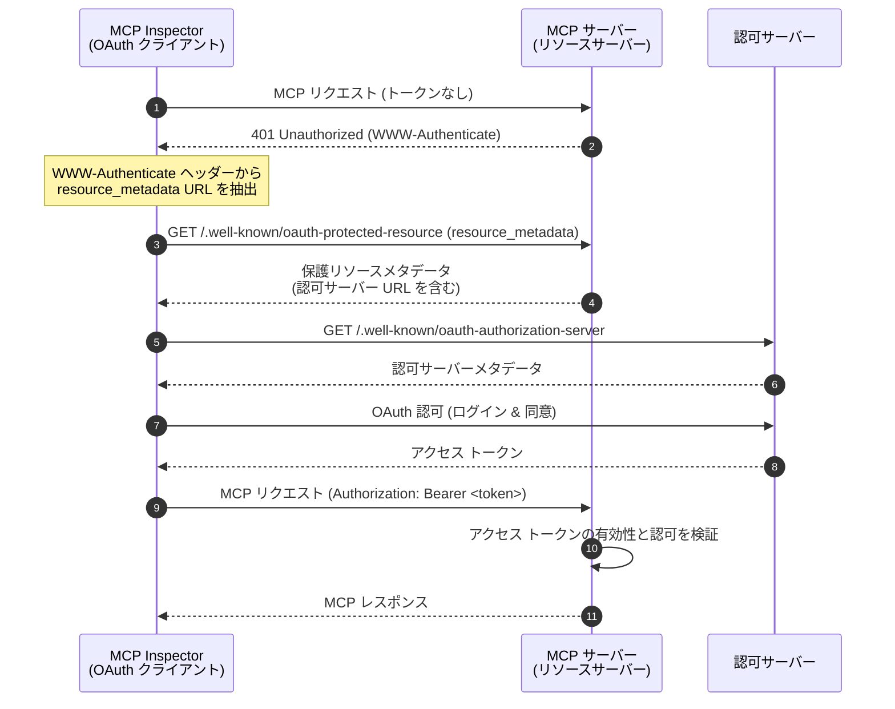
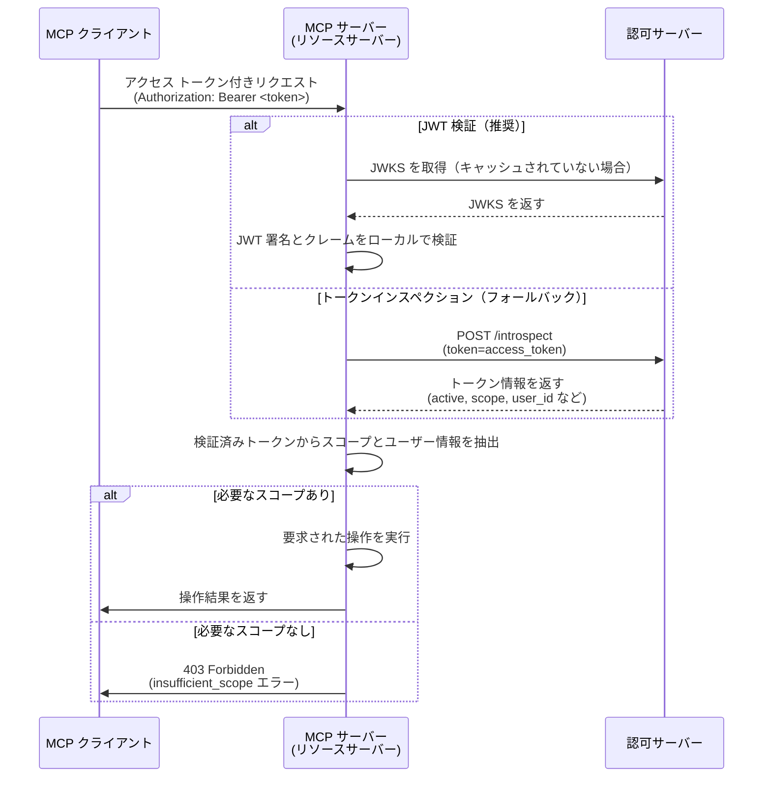

import TabItem from '@theme/TabItem';
import Tabs from '@theme/Tabs';

# チュートリアル: Todo マネージャーを構築する

:::tip Python SDK available
MCP Auth は Python でも利用可能です！インストール方法や使い方は [Python SDK リポジトリ](https://github.com/mcp-auth/python) をご覧ください。
:::

このチュートリアルでは、ユーザー認証 (Authentication) と認可 (Authorization) を備えた todo マネージャー MCP サーバーを構築します。最新の MCP 仕様に従い、MCP サーバーは OAuth 2.0 **リソースサーバー (Resource Server)** として動作し、アクセス トークンを検証し、スコープベースの権限を強制します。

このチュートリアルを完了すると、次のことができるようになります：

- ✅ MCP サーバーでロールベースのアクセス制御 (RBAC) を設定する基本的な理解
- ✅ 認可サーバーが発行したアクセス トークンを受け取り、リソースサーバーとして動作する MCP サーバー
- ✅ Todo 操作に対するスコープベースの権限強制の実装

## 概要 \{#overview}

このチュートリアルでは、以下のコンポーネントが登場します：

- **MCP クライアント (MCP Inspector)**：OAuth 2.0 / OIDC クライアントとして動作する MCP サーバーのビジュアルテストツール。認可サーバーと認可フローを開始し、MCP サーバーへのリクエスト認証にアクセス トークンを取得します。
- **認可サーバー (Authorization Server)**：OAuth 2.1 または OpenID Connect プロバイダー。ユーザーアイデンティティの管理、ユーザー認証 (Authentication)、適切なスコープを持つアクセス トークンの発行を行います。
- **MCP サーバー (リソースサーバー Resource Server)**：最新の MCP 仕様に従い、OAuth 2.0 フレームワークのリソースサーバーとして動作します。認可サーバーが発行したアクセス トークンを検証し、todo 操作に対してスコープベースの権限を強制します。

このアーキテクチャは標準的な OAuth 2.0 フローに従います：

- **MCP Inspector** がユーザーの代理で保護されたリソースをリクエスト
- **認可サーバー (Authorization Server)** がユーザーを認証 (Authentication) し、アクセス トークンを発行
- **MCP サーバー** がトークンを検証し、付与された権限に基づいて保護されたリソースを提供

これらのコンポーネント間のやり取りを示すハイレベルな図は以下の通りです：


```mermaid
sequenceDiagram
  autonumber
  participant Client as MCP Inspector<br/>(OAuth クライアント)
  participant RS as MCP サーバー<br/>(リソースサーバー)
  participant AS as 認可サーバー

  Client->>RS: MCP リクエスト (トークンなし)
  RS-->>Client: 401 Unauthorized (WWW-Authenticate)
  Note over Client: WWW-Authenticate ヘッダーから<br/>resource_metadata URL を抽出

  Client->>RS: GET /.well-known/oauth-protected-resource (resource_metadata)
  RS-->>Client: 保護リソースメタデータ<br/>(認可サーバー URL を含む)

  Client->>AS: GET /.well-known/oauth-authorization-server
  AS-->>Client: 認可サーバーメタデータ
  Client->>AS: OAuth 認可 (ログイン & 同意)
  AS-->>Client: アクセス トークン

  Client->>RS: MCP リクエスト (Authorization: Bearer <token>)
  RS->>RS: アクセス トークンの有効性と認可を検証
  RS-->>Client: MCP レスポンス
```

## 認可サーバーを理解する \{#understand-your-authorization-server}

### スコープ付きアクセス トークン \{#access-tokens-with-scopes}

[ロールベースのアクセス制御 (RBAC)](https://auth.wiki/rbac) を MCP サーバーで実装するには、認可サーバーがスコープ付きのアクセス トークンを発行できる必要があります。スコープはユーザーに付与された権限を表します。

<Tabs groupId="provider">
<TabItem value="logto" label="Logto">

[Logto](https://logto.io) は、API リソース（[RFC 8707: OAuth 2.0 のリソースインジケーター](https://datatracker.ietf.org/doc/html/rfc8707) に準拠）とロール機能を通じて RBAC をサポートしています。設定方法は以下の通りです：

1. [Logto Console](https://cloud.logto.io)（またはセルフホスト版 Logto Console）にサインイン

2. API リソースとスコープを作成：

   - 「API リソース」へ移動
   - 「Todo Manager」という新しい API リソースを作成
   - 以下のスコープを追加：
     - `create:todos`: "新しい todo アイテムの作成"
     - `read:todos`: "すべての todo アイテムの閲覧"
     - `delete:todos`: "任意の todo アイテムの削除"

3. ロールを作成（管理を簡単にするため推奨）：

   - 「ロール」へ移動
   - 「Admin」ロールを作成し、すべてのスコープ（`create:todos`, `read:todos`, `delete:todos`）を割り当て
   - 「User」ロールを作成し、`create:todos` スコープのみ割り当て

4. 権限を割り当てる：
   - 「ユーザー」へ移動
   - ユーザーを選択
   - 以下のいずれかを実施：
     - 「ロール」タブでロールを割り当て（推奨）
     - または「権限」タブで直接スコープを割り当て

スコープは JWT アクセス トークンの `scope` クレームにスペース区切りの文字列として含まれます。

</TabItem>
<TabItem value="oauth-oidc" label="OAuth 2.0 / OIDC">

OAuth 2.0 / OIDC プロバイダーは通常、スコープベースのアクセス制御をサポートしています。RBAC を実装する場合：

1. 認可サーバーで必要なスコープを定義
2. クライアントが認可フロー中にこれらのスコープをリクエストするよう設定
3. 認可サーバーが付与したスコープをアクセス トークンに含めることを確認
4. スコープは通常、JWT アクセス トークンの `scope` クレームに含まれます

詳細はプロバイダーのドキュメントを参照してください：

- スコープの定義・管理方法
- アクセス トークンへのスコープの含め方
- ロール管理など追加の RBAC 機能

</TabItem>
</Tabs>

### トークンの検証と権限チェック \{#validating-tokens-and-checking-permissions}

最新の MCP 仕様に従い、MCP サーバーは OAuth 2.0 フレームワークの **リソースサーバー (Resource Server)** として動作します。リソースサーバーとして、MCP サーバーは以下の責任を持ちます：

1. **トークン検証**：MCP クライアントから受け取ったアクセス トークンの真正性と完全性を検証
2. **スコープ強制**：アクセス トークンからスコープを抽出・検証し、クライアントが実行できる操作を決定
3. **リソース保護**：有効なトークンと十分な権限がある場合のみ保護リソース（ツールの実行）を提供

MCP サーバーがリクエストを受け取った際の検証プロセスは以下の通りです：

1. `Authorization` ヘッダー（Bearer トークン形式）からアクセス トークンを抽出
2. アクセス トークンの署名と有効期限を検証
3. 検証済みトークンからスコープとユーザー情報を抽出
4. リクエストされた操作に必要なスコープがトークンに含まれているか確認

例えば、ユーザーが新しい todo アイテムを作成したい場合、アクセス トークンに `create:todos` スコープが含まれている必要があります。リソースサーバーの検証フローは以下の通りです：


```mermaid
sequenceDiagram
    participant Client as MCP クライアント
    participant Server as MCP サーバー<br/>(リソースサーバー)
    participant Auth as 認可サーバー

    Client->>Server: アクセス トークン付きリクエスト<br/>(Authorization: Bearer <token>)

    alt JWT 検証（推奨）
        Server->>Auth: JWKS を取得（キャッシュされていない場合）
        Auth-->>Server: JWKS を返す
        Server->>Server: JWT 署名とクレームをローカルで検証
    else トークンインスペクション（フォールバック）
        Server->>Auth: POST /introspect<br/>(token=access_token)
        Auth-->>Server: トークン情報を返す<br/>(active, scope, user_id など)
    end

    Server->>Server: 検証済みトークンからスコープとユーザー情報を抽出

    alt 必要なスコープあり
        Server->>Server: 要求された操作を実行
        Server->>Client: 操作結果を返す
    else 必要なスコープなし
        Server->>Client: 403 Forbidden<br/>(insufficient_scope エラー)
    end
```

### Dynamic Client Registration \{#dynamic-client-registration}

このチュートリアルでは Dynamic Client Registration は必須ではありませんが、認可サーバーで MCP クライアント登録を自動化したい場合に便利です。詳細は [Dynamic Client Registration は必要ですか？](/provider-list#is-dcr-required) をご覧ください。

## Todo マネージャーにおける RBAC を理解する \{#understand-rbac-in-todo-manager}

デモ目的で、todo マネージャー MCP サーバーにシンプルなロールベースのアクセス制御 (RBAC) システムを実装します。これにより、RBAC の基本原則をシンプルな実装で体験できます。

:::note
このチュートリアルは RBAC ベースのスコープ管理を例示していますが、すべての認証 (Authentication) プロバイダーがロールによるスコープ管理を実装しているわけではありません。プロバイダーによっては独自のアクセス制御や権限管理の仕組みを持つ場合があります。
:::

### ツールとスコープ \{#tools-and-scopes}

Todo マネージャー MCP サーバーは、主に次の 3 つのツールを提供します：

- `create-todo`: 新しい todo アイテムの作成
- `get-todos`: すべての todo の一覧表示
- `delete-todo`: ID で todo を削除

これらのツールへのアクセスを制御するため、以下のスコープを定義します：

- `create:todos`: 新しい todo アイテムの作成を許可
- `delete:todos`: 既存の todo アイテムの削除を許可
- `read:todos`: すべての todo アイテムの取得・一覧表示を許可

### ロールと権限 \{#roles-and-permissions}

異なるアクセスレベルを持つ 2 つのロールを定義します：

| ロール  | create:todos | read:todos | delete:todos |
| ------- | ------------ | ---------- | ------------ |
| Admin   | ✅           | ✅         | ✅           |
| User    | ✅           |            |              |

- **User**：自分の todo の作成・閲覧・削除のみ可能な一般ユーザー
- **Admin**：すべての todo の作成・閲覧・削除が可能な管理者

### リソース所有権 \{#resource-ownership}

上記の権限テーブルは各ロールに明示的に割り当てられたスコープを示していますが、リソース所有権の重要な原則も考慮します：

- **User** は `read:todos` や `delete:todos` スコープを持ちませんが、次のことが可能です：
  - 自分の todo アイテムの閲覧
  - 自分の todo アイテムの削除
- **Admin** はすべての権限（`read:todos` および `delete:todos`）を持ち、次のことが可能です：
  - システム内のすべての todo アイテムの閲覧
  - 所有者に関係なく任意の todo アイテムの削除

これは、RBAC システムでよく見られるパターンで、リソース所有者には自分のリソースに対する暗黙的な権限が与えられ、管理者ロールにはすべてのリソースに対する明示的な権限が付与されることを示しています。

:::tip 詳しく学ぶ
RBAC の概念やベストプラクティスについてさらに学ぶには、[Mastering RBAC: A Comprehensive Real-World Example](https://blog.logto.io/mastering-rbac) をご覧ください。
:::

## プロバイダーで認可を設定する \{#configure-authorization-in-your-provider}

前述のアクセス制御システムを実装するには、認可サーバーで必要なスコープをサポートするよう設定する必要があります。プロバイダーごとの設定方法は以下の通りです：

<Tabs groupId="provider">
<TabItem value="logto" label="Logto">

[Logto](https://logto.io) は、API リソースとロール機能を通じて RBAC をサポートしています。設定方法は以下の通りです：

1. [Logto Console](https://cloud.logto.io)（またはセルフホスト版 Logto Console）にサインイン

2. API リソースとスコープを作成：

   - 「API リソース」へ移動
   - 「Todo Manager」という新しい API リソースを作成し、リソースインジケーターに `http://localhost:3001` を指定
     - **重要**：リソースインジケーターは MCP サーバーの URL と一致する必要があります。このチュートリアルでは MCP サーバーがポート 3001 で動作するため `http://localhost:3001` を使用します。本番環境では実際の MCP サーバー URL（例：`https://your-mcp-server.example.com`）を使用してください。
   - 以下のスコープを作成：
     - `create:todos`: "新しい todo アイテムの作成"
     - `read:todos`: "すべての todo アイテムの閲覧"
     - `delete:todos`: "任意の todo アイテムの削除"

3. ロールを作成（管理を簡単にするため推奨）：

   - 「ロール」へ移動
   - 「Admin」ロールを作成し、すべてのスコープ（`create:todos`, `read:todos`, `delete:todos`）を割り当て
   - 「User」ロールを作成し、`create:todos` スコープのみ割り当て
   - 「User」ロールの詳細ページで「一般」タブに切り替え、「User」ロールを「デフォルトロール」に設定

4. ユーザーロールと権限を管理：
   - 新規ユーザーの場合：
     - デフォルトロールを設定したため自動的に「User」ロールが付与されます
   - 既存ユーザーの場合：
     - 「ユーザー管理」へ移動
     - ユーザーを選択
     - 「ロール」タブでロールを割り当て

:::tip プログラムによるロール管理
Logto の [Management API](https://docs.logto.io/integrate-logto/interact-with-management-api) を使ってユーザーロールをプログラムで管理することも可能です。自動ユーザー管理や管理画面構築時に便利です。
:::

アクセス トークンをリクエストする際、Logto はユーザーのロール権限に基づいてスコープをトークンの `scope` クレームに含めます。

</TabItem>
<TabItem value="oauth-or-oidc" label="OAuth 2 / OIDC">

OAuth 2.0 または OpenID Connect プロバイダーの場合、異なる権限を表すスコープを設定する必要があります。具体的な手順はプロバイダーによって異なりますが、一般的には：

1. スコープを定義：

   - 認可サーバーで以下をサポートするよう設定：
     - `create:todos`
     - `read:todos`
     - `delete:todos`

2. クライアントを設定：

   - クライアントを登録または更新し、これらのスコープをリクエストするように設定
   - スコープがアクセス トークンに含まれることを確認

3. 権限を割り当てる：
   - プロバイダーの管理画面でユーザーに適切なスコープを付与
   - 一部のプロバイダーはロールベース管理をサポートし、他は直接スコープ割り当てを使用
   - 推奨方法はプロバイダーのドキュメントを参照

:::tip
ほとんどのプロバイダーは付与されたスコープをアクセス トークンの `scope` クレームに含めます。形式は通常スペース区切りのスコープ値です。
:::

</TabItem>
</Tabs>

認可サーバーの設定後、ユーザーは付与されたスコープを含むアクセス トークンを受け取ります。MCP サーバーはこれらのスコープを使って次の判断を行います：

- 新しい todo を作成できるか（`create:todos`）
- すべての todo を閲覧できるか（`read:todos`）または自分のものだけか
- 任意の todo を削除できるか（`delete:todos`）または自分のものだけか

## MCP サーバーをセットアップする \{#set-up-the-mcp-server}

[MCP 公式 SDK](https://github.com/modelcontextprotocol) を使って todo マネージャー MCP サーバーを作成します。

### 新しいプロジェクトを作成 \{#create-a-new-project}

新しい Node.js プロジェクトをセットアップします：

```bash
mkdir mcp-server
cd mcp-server
npm init -y # または `pnpm init`
npm pkg set type="module"
npm pkg set main="todo-manager.ts"
npm pkg set scripts.start="node --experimental-strip-types todo-manager.ts"
```

:::note
例では TypeScript を使用しています。Node.js v22.6.0 以降は `--experimental-strip-types` フラグで TypeScript をネイティブ実行できます。JavaScript を使う場合もほぼ同様ですが、Node.js v22.6.0 以降を使用してください。詳細は Node.js ドキュメントを参照してください。
:::

### MCP SDK と依存パッケージをインストール \{#install-the-mcp-sdk-and-dependencies}

```bash
npm install @modelcontextprotocol/sdk express zod
```

または `pnpm` や `yarn` などお好みのパッケージマネージャーを利用できます。

### MCP サーバーを作成 \{#create-the-mcp-server}

`todo-manager.ts` というファイルを作成し、以下のコードを追加します：

（※ ここはコードなので翻訳不要、省略）

サーバーを起動するには：

```bash
npm start
```

## MCP サーバーを検証する \{#inspect-the-mcp-server}

### MCP inspector をクローンして実行 \{#clone-and-run-mcp-inspector}

MCP サーバーが起動したら、MCP inspector を使ってツールが利用可能か確認できます。

公式 MCP inspector v0.16.2 には認証 (Authentication) 機能に影響するバグがあります。これを解決するため、OAuth / OIDC 認証フローの修正を含む [パッチ版 MCP inspector](https://github.com/mcp-auth/inspector/tree/patch/0.16.2-fixes) を作成しました。修正内容は公式リポジトリにもプルリクエスト済みです。

MCP inspector を実行するには（Node.js が必要です）：

```bash
git clone https://github.com/mcp-auth/inspector.git -b patch/0.16.2-fixes
cd inspector
npm install
npm run dev
```

MCP inspector は自動的にデフォルトブラウザで開きます。もしくはターミナル出力のリンク（`MCP_PROXY_AUTH_TOKEN` パラメータ付き、例：`http://localhost:6274/?MCP_PROXY_AUTH_TOKEN=458ae4a4...acab1907`）を手動で開いてください。

### MCP inspector を MCP サーバーに接続 \{#connect-mcp-inspector-to-the-mcp-server}

進む前に MCP inspector の設定を確認してください：

- **Transport Type**：`Streamable HTTP` を選択
- **URL**：MCP サーバーの URL を指定（本例では `http://localhost:3001`）

「Connect」ボタンをクリックして MCP inspector が MCP サーバーに接続できるか確認します。正常なら MCP inspector に「Connected」ステータスが表示されます。

### チェックポイント: Todo マネージャーツールを実行 \{#checkpoint-run-todo-manager-tools}

1. MCP inspector の上部メニューで「Tools」タブをクリック
2. 「List Tools」ボタンをクリック
3. `create-todo`, `get-todos`, `delete-todo` ツールが一覧表示されます。クリックして詳細を開きます
4. 右側に「Run Tool」ボタンが表示されるので、必要なパラメータを入力して実行
5. JSON レスポンス `{"error": "Not implemented"}` が表示されれば成功です


## 認可サーバーと連携する \{#integrate-with-your-authorization-server}

このセクションを完了するには、いくつかの考慮事項があります：

<details>
<summary>**認可サーバーの発行者 (Issuer) URL**</summary>

通常は認可サーバーのベース URL です（例：`https://auth.example.com`）。プロバイダーによっては `https://example.logto.app/oidc` のようなパスが付く場合もあるので、ドキュメントを確認してください。

</details>

<details>
<summary>**認可サーバーメタデータの取得方法**</summary>

- 認可サーバーが [OAuth 2.0 Authorization Server Metadata](https://datatracker.ietf.org/doc/html/rfc8414) または [OpenID Connect Discovery](https://openid.net/specs/openid-connect-discovery-1_0.html) に準拠していれば、MCP Auth の組み込みユーティリティで自動取得できます
- 準拠していない場合は、MCP サーバー設定でメタデータ URL やエンドポイントを手動指定してください。詳細はプロバイダーのドキュメントを参照

</details>

<details>
<summary>**MCP inspector を認可サーバーのクライアントとして登録する方法**</summary>

- 認可サーバーが [Dynamic Client Registration](https://datatracker.ietf.org/doc/html/rfc7591) をサポートしていれば、この手順は不要です。MCP inspector が自動登録します
- サポートしていない場合は、MCP inspector を手動でクライアント登録してください

</details>

<details>
<summary>**トークンリクエストパラメータの理解**</summary>

認可サーバーごとにターゲットリソースや権限指定の方法が異なります。主なパターンは以下の通りです：

- **リソースインジケーター方式**：

  - `resource` パラメータでターゲット API を指定（[RFC 8707: OAuth 2.0 のリソースインジケーター](https://datatracker.ietf.org/doc/html/rfc8707) 参照）
  - モダンな OAuth 2.0 実装で一般的
  - 例：
    ```json
    {
      "resource": "http://localhost:3001",
      "scope": "create:todos read:todos"
    }
    ```
  - サーバーはリクエストされたリソース専用のトークンを発行

- **オーディエンス方式**：

  - `audience` パラメータでトークンの受信者を指定
  - リソースインジケーターと似ているが意味が異なる
  - 例：
    ```json
    {
      "audience": "todo-api",
      "scope": "create:todos read:todos"
    }
    ```

- **純粋なスコープ方式**：
  - resource / audience パラメータなしでスコープのみを利用
  - 従来の OAuth 2.0 アプローチ
  - 例：
    ```json
    {
      "scope": "todo-api:create todo-api:read openid profile"
    }
    ```
  - スコープにプレフィックスを付けて権限をネームスペース化することが多い
  - シンプルな OAuth 2.0 実装で一般的

:::tip ベストプラクティス

- プロバイダーのドキュメントでサポートされているパラメータを確認
- 複数の方式を同時にサポートするプロバイダーもある
- リソースインジケーターはオーディエンス制限によるセキュリティ向上に有効
- 利用可能ならリソースインジケーター方式を推奨
  :::

</details>

プロバイダーごとに要件は異なりますが、以下の手順で MCP inspector と MCP サーバーをプロバイダー固有の設定で統合できます。

### MCP inspector をクライアントとして登録 \{#register-mcp-inspector-as-a-client}

<Tabs groupId="provider">
<TabItem value="logto" label="Logto">

[Logto](https://logto.io) との統合は簡単です。OpenID Connect プロバイダーであり、リソースインジケーターとスコープをサポートしているため、`http://localhost:3001` をリソースインジケーターとして todo API を安全に保護できます。

Logto は Dynamic Client Registration をまだサポートしていないため、MCP inspector を Logto テナントのクライアントとして手動登録する必要があります：

1. MCP inspector を開き、Authentication 設定で「OAuth2.0 Flow」設定をクリック。**Redirect URI** の値（例：`http://localhost:6274/oauth/callback`）をコピー
2. [Logto Console](https://cloud.logto.io)（またはセルフホスト版 Logto Console）にサインイン
3. 「アプリケーション」タブで「アプリケーションを作成」をクリック。ページ下部で「フレームワークなしでアプリを作成」をクリック
4. アプリケーション詳細を入力し、「アプリケーションを作成」をクリック：
   - **アプリケーションタイプ**：「シングルページアプリケーション」を選択
   - **アプリケーション名**：例「MCP Inspector」
5. 「設定 / Redirect URI」セクションで、先ほどコピーした **Redirect URI** を貼り付け、下部バーの「変更を保存」をクリック
6. 上部カードに「App ID」が表示されるのでコピー
7. MCP inspector に戻り、「OAuth2.0 Flow」設定の「Client ID」欄に「App ID」を貼り付け
8. 「Scope」欄に `create:todos read:todos delete:todos` を入力。これで Logto から返されるアクセス トークンに必要なスコープが含まれます

</TabItem>
<TabItem value="oauth-oidc" label="OAuth 2.0 / OIDC">

:::note
これは一般的な OAuth 2.0 / OpenID Connect プロバイダー統合ガイドです。OIDC は OAuth 2.0 上に構築されているため手順はほぼ同じです。詳細はプロバイダーのドキュメントを参照してください。
:::

Dynamic Client Registration をサポートしている場合は、下記手順 8 から MCP inspector の設定が可能です。サポートしていない場合は MCP inspector を手動でクライアント登録してください：

1. MCP inspector を開き、Authentication 設定で「OAuth2.0 Flow」設定をクリック。**Redirect URI** の値（例：`http://localhost:6274/oauth/callback`）をコピー

2. プロバイダーのコンソールにサインイン

3. 「アプリケーション」または「クライアント」セクションで新規アプリケーションまたはクライアントを作成

4. クライアントタイプが必要な場合は「シングルページアプリケーション」または「パブリッククライアント」を選択

5. アプリケーション作成後、リダイレクト URI を設定。コピーした **Redirect URI** を貼り付け

6. 新規アプリケーションの「Client ID」または「Application ID」をコピー

7. MCP inspector に戻り、「OAuth2.0 Flow」設定の「Client ID」欄に貼り付け

8. 「Scope」欄に todo 操作用の必要なスコープを入力：

```text
create:todos read:todos delete:todos
```

</TabItem>
</Tabs>

### MCP Auth をセットアップ \{#set-up-mcp-auth}

まず、MCP サーバープロジェクトに MCP Auth SDK をインストールします。

import { NpmLikeInstallation } from '@site/src/components/NpmLikeInstallation';

<NpmLikeInstallation packageName="mcp-auth@0.2.0-beta.1" />

次に MCP サーバーで MCP Auth を初期化します。保護リソースモードでは、認可サーバーを含むリソースメタデータを設定する必要があります。

認可サーバーの設定方法は 2 通りあります：

- **事前取得（推奨）**：`fetchServerConfig()` でメタデータを取得してから MCPAuth を初期化。起動時に設定が検証されます
- **オンデマンドディスカバリー**：`issuer` と `type` のみ指定し、初回利用時にメタデータを取得。Cloudflare Workers などトップレベル async fetch が許可されない環境で便利

#### 保護リソースメタデータを設定 \{#configure-protected-resource-metadata}

まず認可サーバーの issuer URL を取得します：

<Tabs groupId="provider">

<TabItem value="logto" label="Logto">

Logto では、Logto Console のアプリケーション詳細ページ「Endpoints & Credentials / Issuer endpoint」セクションで issuer URL を確認できます。例：`https://my-project.logto.app/oidc`

</TabItem>

<TabItem value="oauth-oidc" label="OAuth 2.0 / OIDC">

OAuth 2.0 プロバイダーの場合：

1. プロバイダーのドキュメントで認可サーバー URL（issuer URL または base URL と呼ばれることが多い）を確認
2. 多くの場合 `https://{your-domain}/.well-known/oauth-authorization-server` で公開
3. 管理コンソールの OAuth / API 設定を確認

</TabItem>

</Tabs>

次に、MCP Auth インスタンス作成時に Protected Resource Metadata を設定します：

（※ ここはコードなので翻訳不要、省略）

### MCP サーバーを更新 \{#update-mcp-server}

あと少しです！MCP Auth のルートとミドルウェア関数を適用し、ユーザーのスコープに基づく権限制御を todo マネージャーツールに実装します。

まず、MCP クライアントが MCP サーバーからリソースメタデータを取得できるよう、保護リソースメタデタルートを適用します。

（※ ここはコードなので翻訳不要、省略）

次に、MCP Auth ミドルウェアを MCP サーバーに適用します。このミドルウェアはリクエストの認証 (Authentication) と認可 (Authorization) を処理し、認可されたユーザーのみが todo マネージャーツールにアクセスできるようにします。

（※ ここはコードなので翻訳不要、省略）

この時点で、todo マネージャーツールの実装を MCP Auth ミドルウェアを活用する形に更新できます。

（※ ここはコードなので翻訳不要、省略）

次に、上記コードで利用している「Todo サービス」を作成します：

`todo-service.ts` ファイルを作成し、Todo サービスの機能を実装します：

（※ ここはコードなので翻訳不要、省略）

おめでとうございます！認証 (Authentication) と認可 (Authorization) を備えた MCP サーバーの実装が完了しました！

:::info
[MCP Auth Node.js SDK リポジトリ](https://github.com/mcp-auth/js/blob/master/packages/sample-servers/src) で MCP サーバー（OIDC バージョン）の完全なコードを確認できます。
:::

## チェックポイント: `todo-manager` ツールを実行 \{#checkpoint-run-the-todo-manager-tools}

MCP サーバーを再起動し、ブラウザで MCP inspector を開きます。「Connect」ボタンをクリックすると、認可サーバーのサインインページにリダイレクトされます。

サインイン後 MCP inspector に戻り、前回のチェックポイントと同じ操作で todo マネージャーツールを実行します。今回は認証 (Authentication) 済みユーザーアイデンティティでツールを利用できます。ツールの動作はユーザーに割り当てられたロールと権限によって異なります：

- **User**（`create:todos` スコープのみ）の場合：

  - `create-todo` ツールで新しい todo を作成可能
  - 自分の todo のみ閲覧・削除可能
  - 他ユーザーの todo は閲覧・削除不可

- **Admin**（すべてのスコープ：`create:todos`, `read:todos`, `delete:todos`）の場合：
  - 新しい todo の作成が可能
  - `get-todos` ツールですべての todo を閲覧可能
  - `delete-todo` ツールで誰が作成したものでも削除可能

異なる権限レベルをテストするには：

1. 現在のセッションからサインアウト（MCP inspector の「Disconnect」ボタンをクリック）
2. 別のロール / 権限を持つユーザーアカウントでサインイン
3. 同じツールを再度試し、ユーザーの権限による動作の違いを確認

これにより、ロールベースのアクセス制御 (RBAC) が実際にどのように機能するかを体験できます。


:::info
[MCP Auth Node.js SDK リポジトリ](https://github.com/mcp-auth/js/blob/master/packages/sample-servers/src) で MCP サーバー（OIDC バージョン）の完全なコードを確認できます。
:::

## 締めくくり \{#closing-notes}

おめでとうございます！チュートリアルを無事完了しました。ここまでで実施した内容を振り返ります：

- Todo 管理ツール（`create-todo`, `get-todos`, `delete-todo`）を備えた基本的な MCP サーバーのセットアップ
- ユーザーと管理者で異なる権限レベルを持つロールベースのアクセス制御 (RBAC) の実装
- MCP Auth を使った MCP サーバーと認可サーバーの統合
- MCP Inspector でユーザー認証 (Authentication) とスコープ付きアクセス トークンによるツール呼び出しの設定

他のチュートリアルやドキュメントもぜひご覧いただき、MCP Auth を最大限に活用してください。