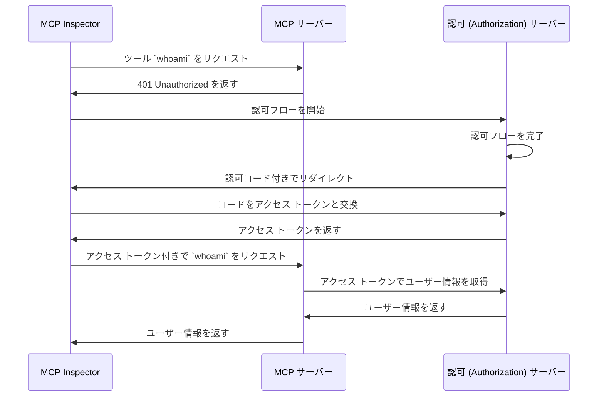

import TabItem from '@theme/TabItem';
import Tabs from '@theme/Tabs';

import SetupOauth from './_setup-oauth.mdx';
import SetupOidc from './_setup-oidc.mdx';

# チュートリアル: 私は誰？

このチュートリアルでは、MCP Auth をセットアップしてユーザーを認証 (Authentication) し、認可 (Authorization) サーバーからアイデンティティ情報を取得する手順を案内します。

このチュートリアルを完了すると、次のことができるようになります：

- ✅ MCP Auth を使ってユーザーを認証 (Authentication) する基本的な流れを理解できる
- ✅ ユーザーのアイデンティティ情報を取得するツールを提供する MCP サーバーを構築できる

## 概要 \{#overview}

このチュートリアルでは、以下のコンポーネントを扱います：

- **MCP サーバー**：MCP 公式 SDK を使ってリクエストを処理するシンプルな MCP サーバー
- **MCP inspector**：MCP サーバー用のビジュアルテストツール。OAuth / OIDC クライアントとして認可フローを開始し、アクセス トークンを取得する役割も担います。
- **認可 (Authorization) サーバー**：ユーザーのアイデンティティを管理し、アクセス トークンを発行する OAuth 2.1 または OpenID Connect プロバイダー

これらのコンポーネント間のやり取りを示す高レベルの図は以下の通りです：



## 認可 (Authorization) サーバーを理解する \{#understand-your-authorization-server}

### ユーザーアイデンティティ情報の取得 \{#retrieving-user-identity-information}

このチュートリアルを完了するには、認可 (Authorization) サーバーがユーザーアイデンティティ情報を取得するための API を提供している必要があります：

<Tabs groupId="provider">
<TabItem value="logto" label="Logto">

[Logto](https://logto.io) は、ユーザーアイデンティティ情報を取得するための標準 [userinfo エンドポイント](https://openid.net/specs/openid-connect-core-1_0.html#UserInfo) をサポートする OpenID Connect プロバイダーです。

userinfo エンドポイントにアクセスできるアクセス トークンを取得するには、少なくとも `openid` と `profile` の 2 つのスコープが必要です。スコープの設定については後述しますので、そのまま読み進めてください。

</TabItem>
<TabItem value="keycloak" label="Keycloak">

[Keycloak](https://www.keycloak.org) は、OpenID Connect (OIDC) を含む複数のプロトコルをサポートするオープンソースのアイデンティティおよびアクセス管理ソリューションです。OIDC プロバイダーとして、標準の [userinfo エンドポイント](https://openid.net/specs/openid-connect-core-1_0.html#UserInfo) を実装しています。

userinfo エンドポイントにアクセスできるアクセス トークンを取得するには、少なくとも `openid` と `profile` の 2 つのスコープが必要です。スコープの設定については後述しますので、そのまま読み進めてください。

</TabItem>

<TabItem value="asgardeo" label="Asgardeo">

[Asgardeo](https://wso2.com/asgardeo) は、OAuth 2.0 および OpenID Connect (OIDC) をサポートするクラウドネイティブな IDaaS プラットフォームで、モダンなアプリケーション向けに堅牢なアイデンティティおよびアクセス管理を提供します。

ユーザー情報は、アクセス トークンとともに返される ID トークン内にエンコードされていますが、OIDC プロバイダーとして [UserInfo エンドポイント](https://wso2.com/asgardeo/docs/guides/authentication/oidc/request-user-info/) も公開しており、アプリケーションはペイロード内で認証済みユーザーのクレーム (Claims) を取得できます。

このエンドポイントは [OIDC ディスカバリーエンドポイント](https://wso2.com/asgardeo/docs/guides/authentication/oidc/discover-oidc-configs) から動的に発見することも、Asgardeo コンソールのアプリケーション「Info」タブから確認することもできます。

userinfo エンドポイントにアクセスできるアクセス トークンを取得するには、少なくとも `openid` と `profile` の 2 つのスコープが必要です。

</TabItem>
<TabItem value="oidc" label="OIDC">

ほとんどの OpenID Connect プロバイダーは、ユーザーアイデンティティ情報を取得するための [userinfo エンドポイント](https://openid.net/specs/openid-connect-core-1_0.html#UserInfo) をサポートしています。

プロバイダーのドキュメントを確認し、このエンドポイントがサポートされているか確認してください。プロバイダーが [OpenID Connect Discovery](https://openid.net/specs/openid-connect-discovery-1_0.html) をサポートしている場合、`.well-known/openid-configuration` エンドポイントのレスポンスに `userinfo_endpoint` が含まれているか確認できます。

userinfo エンドポイントにアクセスできるアクセス トークンを取得するには、少なくとも `openid` と `profile` の 2 つのスコープが必要です。スコープとユーザーアイデンティティクレーム (Claims) のマッピングについては、プロバイダーのドキュメントを参照してください。

</TabItem>
<TabItem value="oauth" label="OAuth 2">

OAuth 2.0 にはユーザーアイデンティティ情報を取得する標準的な方法は定義されていませんが、多くのプロバイダーは独自のエンドポイントを実装しています。アクセス トークンを使ってユーザーアイデンティティ情報を取得する方法や、認可フローでアクセス トークンを取得する際に必要なパラメーターについては、プロバイダーのドキュメントを確認してください。

</TabItem>
</Tabs>

### Dynamic Client Registration \{#dynamic-client-registration}

Dynamic Client Registration はこのチュートリアルでは必須ではありませんが、認可 (Authorization) サーバーへの MCP クライアント登録を自動化したい場合に便利です。詳細は [Dynamic Client Registration は必須ですか？](../../provider-list.mdx#is-dcr-required) を参照してください。

## MCP サーバーのセットアップ \{#set-up-the-mcp-server}

[MCP 公式 SDK](https://github.com/modelcontextprotocol) を使って、認可 (Authorization) サーバーからユーザーアイデンティティ情報を取得する `whoami` ツール付きの MCP サーバーを作成します。

### 新しいプロジェクトの作成 \{#create-a-new-project}

<Tabs groupId="sdk">
<TabItem value="python" label="Python">

```bash
mkdir mcp-server
cd mcp-server
uv init # または `pipenv` や `poetry` で仮想環境を作成
```

</TabItem>
<TabItem value="node" label="Node.js">

新しい Node.js プロジェクトをセットアップします：

```bash
mkdir mcp-server
cd mcp-server
npm init -y # または `pnpm init`
npm pkg set type="module"
npm pkg set main="whoami.js"
npm pkg set scripts.start="node whoami.js"
```

</TabItem>
</Tabs>

### MCP SDK と依存パッケージのインストール \{#install-the-mcp-sdk-and-dependencies}

<Tabs groupId="sdk">
<TabItem value="python" label="Python">

```bash
pip install "mcp[cli]" starlette uvicorn
```

または `uv` や `poetry` など、お好みのパッケージマネージャーを利用できます。

</TabItem>
<TabItem value="node" label="Node.js">

```bash
npm install @modelcontextprotocol/sdk express
```

または `pnpm` や `yarn` など、お好みのパッケージマネージャーを利用できます。

</TabItem>
</Tabs>

### MCP サーバーの作成 \{#create-the-mcp-server}

まず、`whoami` ツールを実装する MCP サーバーを作成しましょう。

<Tabs groupId="sdk">
<TabItem value="python" label="Python">

`whoami.py` というファイルを作成し、次のコードを追加します：

```python
from mcp.server.fastmcp import FastMCP
from starlette.applications import Starlette
from starlette.routing import Mount
from typing import Any

mcp = FastMCP("WhoAmI")

@mcp.tool()
def whoami() -> dict[str, Any]:
    """現在のユーザー情報を返すツール。"""
    return {"error": "Not authenticated"}

app = Starlette(
    routes=[Mount('/', app=mcp.sse_app())]
)
```

サーバーを起動するには：

```bash
uvicorn whoami:app --host 0.0.0.0 --port 3001
```

</TabItem>
<TabItem value="node" label="Node.js">

:::note
現時点の MCP inspector 実装では認可 (Authorization) フローに対応していないため、SSE アプローチで MCP サーバーをセットアップします。MCP inspector が認可 (Authorization) フローに対応した際にはコードを更新します。
:::

`pnpm` や `yarn` も利用できます。

`whoami.js` というファイルを作成し、次のコードを追加します：

```js
import { McpServer } from '@modelcontextprotocol/sdk/server/mcp.js';
import { SSEServerTransport } from '@modelcontextprotocol/sdk/server/sse.js';
import express from 'express';

// MCP サーバーを作成
const server = new McpServer({
  name: 'WhoAmI',
  version: '0.0.0',
});

// 現在のユーザー情報を返すツールを追加
server.tool('whoami', async () => {
  return {
    content: [{ type: 'text', text: JSON.stringify({ error: 'Not authenticated' }) }],
  };
});

// 以下は MCP SDK ドキュメントのボイラープレートコード
const PORT = 3001;
const app = express();

const transports = {};

app.get('/sse', async (_req, res) => {
  const transport = new SSEServerTransport('/messages', res);
  transports[transport.sessionId] = transport;

  res.on('close', () => {
    delete transports[transport.sessionId];
  });

  await server.connect(transport);
});

app.post('/messages', async (req, res) => {
  const sessionId = String(req.query.sessionId);
  const transport = transports[sessionId];
  if (transport) {
    await transport.handlePostMessage(req, res, req.body);
  } else {
    res.status(400).send('No transport found for sessionId');
  }
});

app.listen(PORT);
```

サーバーを起動するには：

```bash
npm start
```

</TabItem>
</Tabs>

## MCP サーバーの検証 \{#inspect-the-mcp-server}

### MCP inspector のクローンと起動 \{#clone-and-run-mcp-inspector}

MCP サーバーが起動したので、MCP inspector を使って `whoami` ツールが利用できるか確認します。

現状の実装の制約により、[MCP inspector](https://github.com/mcp-auth/inspector) をフォークし、認証 (Authentication)・認可 (Authorization) に柔軟かつ拡張性を持たせています。オリジナルリポジトリにもプルリクエストを提出しています。

MCP inspector を起動するには、以下のコマンドを実行します（Node.js が必要です）：

```bash
git clone https://github.com/mcp-auth/inspector.git
cd inspector
npm install
npm run dev
```

その後、ブラウザで `http://localhost:6274/`（またはターミナルに表示された他の URL）にアクセスしてください。

### MCP inspector を MCP サーバーに接続 \{#connect-mcp-inspector-to-the-mcp-server}

進める前に、MCP inspector の設定を確認してください：

- **Transport Type**：`SSE` に設定
- **URL**：MCP サーバーの URL を設定（例：`http://localhost:3001/sse`）

「Connect」ボタンをクリックして MCP inspector が MCP サーバーに接続できるか確認します。問題なければ MCP inspector 上で「Connected」ステータスが表示されます。

### チェックポイント: `whoami` ツールの実行 \{#checkpoint-run-the-whoami-tool}

1. MCP inspector の上部メニューで「Tools」タブをクリック
2. 「List Tools」ボタンをクリック
3. ページに `whoami` ツールが表示されているはずです。クリックして詳細を開きます。
4. 右側に「Run Tool」ボタンが表示されるのでクリックして実行します。
5. ツールの結果として `{"error": "Not authenticated"}` という JSON レスポンスが表示されます。


## 認可 (Authorization) サーバーとの連携 \{#integrate-with-your-authorization-server}

このセクションを完了するには、いくつかのポイントを考慮する必要があります：

<details>
<summary>**認可 (Authorization) サーバーの発行者 (Issuer) URL**</summary>

通常は認可 (Authorization) サーバーのベース URL です（例：`https://auth.example.com`）。プロバイダーによっては `https://example.logto.app/oidc` のようなパスが付く場合もあるので、ドキュメントを確認してください。

</details>

<details>
<summary>**認可 (Authorization) サーバーメタデータの取得方法**</summary>

- 認可 (Authorization) サーバーが [OAuth 2.0 Authorization Server Metadata](https://datatracker.ietf.org/doc/html/rfc8414) または [OpenID Connect Discovery](https://openid.net/specs/openid-connect-discovery-1_0.html) に準拠していれば、MCP Auth の組み込みユーティリティで自動取得できます。
- 準拠していない場合は、MCP サーバーの設定でメタデータ URL やエンドポイントを手動で指定する必要があります。詳細はプロバイダーのドキュメントを参照してください。

</details>

<details>
<summary>**MCP inspector を認可 (Authorization) サーバーのクライアントとして登録する方法**</summary>

- 認可 (Authorization) サーバーが [Dynamic Client Registration](https://datatracker.ietf.org/doc/html/rfc7591) をサポートしていれば、この手順はスキップできます（MCP inspector が自動登録します）。
- サポートしていない場合は、MCP inspector を手動でクライアント登録する必要があります。

</details>

<details>
<summary>**ユーザーアイデンティティ情報の取得方法と認可リクエストパラメーターの設定方法**</summary>

- OpenID Connect プロバイダーの場合：認可フロー開始時に少なくとも `openid` と `profile` スコープをリクエストする必要があります。これにより、認可 (Authorization) サーバーから返されるアクセス トークンに [userinfo エンドポイント](https://openid.net/specs/openid-connect-core-1_0.html#UserInfo) へアクセスするための必要なスコープが含まれます。

  ※一部プロバイダーは userinfo エンドポイントをサポートしていない場合があります。

- OAuth 2.0 / OAuth 2.1 プロバイダーの場合：アクセス トークンでユーザーアイデンティティ情報を取得する方法や、認可フローで必要なパラメーターについてはプロバイダーのドキュメントを参照してください。

</details>

プロバイダーごとに要件は異なりますが、以下の手順で MCP inspector と MCP サーバーをプロバイダー固有の設定で連携できます。

### MCP inspector をクライアントとして登録 \{#register-mcp-inspector-as-a-client}

<Tabs groupId="provider">
<TabItem value="logto" label="Logto">

[Logto](https://logto.io) は OpenID Connect プロバイダーであり、ユーザーアイデンティティ情報を取得するための標準 [userinfo エンドポイント](https://openid.net/specs/openid-connect-core-1_0.html#UserInfo) をサポートしているため、連携は簡単です。

Logto は Dynamic Client Registration をまだサポートしていないため、MCP inspector を Logto テナントに手動でクライアント登録する必要があります：

1. MCP inspector を開き、「OAuth Configuration」ボタンをクリック。**Redirect URL (auto-populated)** の値（例：`http://localhost:6274/oauth/callback`）をコピー
2. [Logto Console](https://cloud.logto.io)（またはセルフホスト Logto Console）にサインイン
3. 「Applications」タブで「Create application」をクリックし、ページ下部の「Create app without framework」をクリック
4. アプリケーション詳細を入力し、「Create application」をクリック：
   - **Select an application type**：「Single-page application」を選択
   - **Application name**：例「MCP Inspector」など任意の名前
5. 「Settings / Redirect URIs」セクションで、先ほどコピーした **Redirect URL (auto-populated)** を貼り付け、「Save changes」をクリック
6. 上部カードに「App ID」が表示されるのでコピー
7. MCP inspector に戻り、「OAuth Configuration」セクションの「Client ID」欄に「App ID」を貼り付け
8. 「Auth Params」欄に `{"scope": "openid profile email"}` を入力。これで Logto から返されるアクセス トークンに必要なスコープが含まれます。

</TabItem>
<TabItem value="keycloak" label="Keycloak">

[Keycloak](https://www.keycloak.org) は OpenID Connect プロトコルをサポートするオープンソースのアイデンティティ・アクセス管理ソリューションです。

Keycloak は Dynamic Client Registration をサポートしていますが、クライアント登録エンドポイントが CORS に対応していないため、ほとんどの MCP クライアントは直接登録できません。したがって、手動でクライアント登録を行います。

:::note
Keycloak は [さまざまな方法](https://www.keycloak.org/guides#getting-started)（ベアメタル、Kubernetes など）でインストールできますが、このチュートリアルでは Docker を使った簡単なセットアップを紹介します。
:::

Keycloak インスタンスをセットアップし、必要な設定を行いましょう：

1. まず、[公式ドキュメント](https://www.keycloak.org/getting-started/getting-started-docker) に従い Docker で Keycloak インスタンスを起動：

```bash
docker run -p 8080:8080 -e KC_BOOTSTRAP_ADMIN_USERNAME=admin -e KC_BOOTSTRAP_ADMIN_PASSWORD=admin quay.io/keycloak/keycloak:26.2.4 start-dev
```

2. Keycloak Admin Console（http://localhost:8080/admin）にアクセスし、以下の認証情報でログイン：

   - ユーザー名: `admin`
   - パスワード: `admin`

3. 新しい Realm を作成：

   - 左上の「Create Realm」をクリック
   - 「Realm name」に `mcp-realm` を入力
   - 「Create」をクリック

4. テストユーザーを作成：

   - 左メニューの「Users」をクリック
   - 「Create new user」をクリック
   - ユーザー名：`testuser`（他は任意）
   - 「Create」をクリック
   - 「Credentials」タブでパスワードを設定し「Temporary」をオフ

5. MCP Inspector をクライアントとして登録：

   - MCP inspector を開き、「OAuth Configuration」ボタンをクリック。**Redirect URL (auto-populated)**（例：`http://localhost:6274/oauth/callback`）をコピー
   - Keycloak Admin Console で左メニューの「Clients」をクリック
   - 「Create client」をクリック
   - クライアント詳細を入力：
     - Client type：「OpenID Connect」を選択
     - Client ID：`mcp-inspector`
     - 「Next」をクリック
   - 「Capability config」ページ：
     - 「Standard flow」が有効になっていることを確認
     - 「Next」をクリック
   - 「Login settings」ページ：
     - 「Valid redirect URIs」に MCP Inspector のコールバック URL を貼り付け
     - 「Web origins」に `http://localhost:6274` を入力
     - 「Save」をクリック
   - 「Client ID」（`mcp-inspector`）をコピー

6. MCP Inspector 側で：
   - コピーした Client ID を「OAuth Configuration」セクションの「Client ID」欄に貼り付け
   - 「Auth Params」欄に以下を入力し、必要なスコープをリクエスト：

```json
{ "scope": "openid profile email" }
```

 </TabItem>
<TabItem value="asgardeo" label="Asgardeo">

Asgardeo は標準 API による Dynamic Client Registration をサポートしていますが、エンドポイントは保護されており、必要な権限を持つアクセストークンが必要です。このチュートリアルでは Asgardeo Console から手動でクライアント登録を行います。

:::note
Asgardeo アカウントをお持ちでない場合は [無料登録](https://asgardeo.io) できます。
:::

以下の手順で Asgardeo を MCP Inspector 用に設定します：

1. [Asgardeo Console](https://console.asgardeo.io) にログインし、組織を選択

2. 新しいアプリケーションを作成：
    - **Applications** → **New Application**
    - **Single-Page Application** を選択
    - アプリケーション名（例：`MCP Inspector`）を入力
    - **Authorized Redirect URLs** に MCP Inspector でコピーした **Redirect URL**（例：`http://localhost:6274/oauth/callback`）を貼り付け
    - **Create** をクリック

3. プロトコル設定：
    - **Protocol** タブで
    - 自動生成された **Client ID** をコピー
    - **Access Token** セクションで `Token Type` を `JWT` に変更
    - **Update** をクリック

4. MCP Inspector 側で：
    - **OAuth Configuration** セクションを開く
    - コピーした **Client ID** を貼り付け
    - **Auth Params** 欄に以下を入力し、必要なスコープをリクエスト：

```json
{ "scope": "openid profile email" }
```
 </TabItem>
<TabItem value="oidc" label="OIDC">

:::note
これは汎用的な OpenID Connect プロバイダー連携ガイドです。詳細はプロバイダーのドキュメントを参照してください。
:::

OpenID Connect プロバイダーが Dynamic Client Registration をサポートしていれば、下記手順 8 から MCP inspector の設定が可能です。サポートしていない場合は、手動で MCP inspector をクライアント登録してください：

1. MCP inspector を開き、「OAuth Configuration」ボタンをクリック。**Redirect URL (auto-populated)**（例：`http://localhost:6274/oauth/callback`）をコピー
2. OpenID Connect プロバイダーのコンソールにサインイン
3. 「Applications」または「Clients」セクションで新しいアプリケーションまたはクライアントを作成
4. クライアントタイプが必要な場合は「Single-page application」または「Public client」を選択
5. アプリケーション作成後、リダイレクト URI を設定。コピーした **Redirect URL (auto-populated)** を貼り付け
6. 新規アプリケーションの「Client ID」または「Application ID」をコピー
7. MCP inspector に戻り、「OAuth Configuration」セクションの「Client ID」欄に貼り付け
8. 標準的な OpenID Connect プロバイダーの場合、userinfo エンドポイントに必要なスコープをリクエストするため「Auth Params」欄に以下を入力：

```json
{ "scope": "openid profile email" }
```

</TabItem>
<TabItem value="oauth" label="OAuth 2">

:::note
これは汎用的な OAuth 2.0 / OAuth 2.1 プロバイダー連携ガイドです。詳細はプロバイダーのドキュメントを参照してください。
:::

OAuth 2.0 / OAuth 2.1 プロバイダーが Dynamic Client Registration をサポートしていれば、下記手順 8 から MCP inspector の設定が可能です。サポートしていない場合は、手動で MCP inspector をクライアント登録してください：

1. MCP inspector を開き、「OAuth Configuration」ボタンをクリック。**Redirect URL (auto-populated)**（例：`http://localhost:6274/oauth/callback`）をコピー
2. OAuth 2.0 / OAuth 2.1 プロバイダーのコンソールにサインイン
3. 「Applications」または「Clients」セクションで新しいアプリケーションまたはクライアントを作成
4. クライアントタイプが必要な場合は「Single-page application」または「Public client」を選択
5. アプリケーション作成後、リダイレクト URI を設定。コピーした **Redirect URL (auto-populated)** を貼り付け
6. 新規アプリケーションの「Client ID」または「Application ID」をコピー
7. MCP inspector に戻り、「OAuth Configuration」セクションの「Client ID」欄に貼り付け
8. プロバイダーのドキュメントを参照し、ユーザーアイデンティティ情報取得用のアクセス トークン取得方法を確認。必要なスコープやパラメーターを指定してください。例えば `profile` スコープが必要な場合、「Auth Params」欄に以下を入力：

```json
{ "scope": "profile" }
```

</TabItem>
</Tabs>

### MCP auth のセットアップ \{#set-up-mcp-auth}

MCP サーバープロジェクトで MCP Auth SDK をインストールし、認可 (Authorization) サーバーメタデータを使うように設定します。

<Tabs groupId="sdk">
<TabItem value="python" label="Python">

まず `mcpauth` パッケージをインストール：

```bash
pip install mcpauth
```

または `uv` や `poetry` など、お好みのパッケージマネージャーを利用できます。

</TabItem>
<TabItem value="node" label="Node.js">

まず `mcp-auth` パッケージをインストール：

```bash
npm install mcp-auth
```

</TabItem>
</Tabs>

MCP Auth は初期化のために認可 (Authorization) サーバーメタデータが必要です。プロバイダーごとに次のように設定します：

<Tabs groupId="provider">

<TabItem value="logto" label="Logto">

発行者 (Issuer) URL は Logto Console のアプリケーション詳細ページ「Endpoints & Credentials / Issuer endpoint」セクションで確認できます（例：`https://my-project.logto.app/oidc`）。

<SetupOidc />

</TabItem>

<TabItem value="keycloak" label="Keycloak">

発行者 (Issuer) URL は Keycloak Admin Console の「mcp-realm」内「Realm settings / Endpoints」セクションの「OpenID Endpoint Configuration」リンクで確認できます。JSON ドキュメントの `issuer` フィールド（例：`http://localhost:8080/realms/mcp-realm`）。

<SetupOidc />

</TabItem>

<TabItem value="asgardeo" label="Asgardeo">

    Asgardeo Console で発行者 (Issuer) URL を確認できます。作成したアプリケーションの **Info** タブを開くと **Issuer** フィールドが表示されます（例：`https://api.asgardeo.io/t/<your-organization-name>/oauth2/token`）。
    
    <SetupOidc />

</TabItem>

<TabItem value="oidc" label="OIDC">

以下のコードは、認可 (Authorization) サーバーがユーザーアイデンティティ情報を取得するための [userinfo エンドポイント](https://openid.net/specs/openid-connect-core-1_0.html#UserInfo) をサポートしていることを前提としています。サポートしていない場合は、プロバイダーのドキュメントで該当エンドポイントを確認し、userinfo エンドポイント変数を正しい URL に置き換えてください。

<SetupOidc showAlternative />

</TabItem>
<TabItem value="oauth" label="OAuth 2">

前述の通り、OAuth 2.0 にはユーザーアイデンティティ情報取得の標準的な方法はありません。以下のコードは、プロバイダーがアクセス トークンでユーザーアイデンティティ情報を取得するための独自エンドポイントを持っていることを前提としています。プロバイダーのドキュメントで該当エンドポイントを確認し、userinfo エンドポイント変数を正しい URL に置き換えてください。

<SetupOauth />

</TabItem>
</Tabs>

### MCP サーバーの更新 \{#update-mcp-server}

あと少しです！MCP Auth のルートとミドルウェア関数を適用し、`whoami` ツールが実際のユーザーアイデンティティ情報を返すよう MCP サーバーを更新しましょう。

<Tabs groupId="sdk">
<TabItem value="python" label="Python">

```python
@mcp.tool()
def whoami() -> dict[str, Any]:
    """現在のユーザー情報を返すツール。"""
    return (
        mcp_auth.auth_info.claims
        if mcp_auth.auth_info # Bearer 認証 (Authentication) ミドルウェアでセットされます
        else {"error": "Not authenticated"}
    )

# ...

bearer_auth = Middleware(mcp_auth.bearer_auth_middleware(verify_access_token))
app = Starlette(
    routes=[
        # メタデータルート（`/.well-known/oauth-authorization-server`）を追加
        mcp_auth.metadata_route(),
        # Bearer 認証 (Authentication) ミドルウェアで MCP サーバーを保護
        Mount('/', app=mcp.sse_app(), middleware=[bearer_auth]),
    ],
)
```

</TabItem>
<TabItem value="node" label="Node.js">

```js
server.tool('whoami', ({ authInfo }) => {
  return {
    content: [
      { type: 'text', text: JSON.stringify(authInfo?.claims ?? { error: 'Not authenticated' }) },
    ],
  };
});

// ...

app.use(mcpAuth.delegatedRouter());
app.use(mcpAuth.bearerAuth(verifyToken));
```

</TabItem>
</Tabs>

## チェックポイント: 認証 (Authentication) 付きで `whoami` ツールを実行 \{#checkpoint-run-the-whoami-tool-with-authentication}

MCP サーバーを再起動し、ブラウザで MCP inspector を開きます。「Connect」ボタンをクリックすると、認可 (Authorization) サーバーのサインインページにリダイレクトされます。

サインイン後 MCP inspector に戻り、前回のチェックポイントと同じ手順で `whoami` ツールを実行してください。今回は認可 (Authorization) サーバーから返されたユーザーアイデンティティ情報が表示されるはずです。


<Tabs groupId="sdk">
<TabItem value="python" label="Python">

:::info
[MCP Auth Python SDK リポジトリ](https://github.com/mcp-auth/python/blob/master/samples/server/whoami.py) で MCP サーバー（OIDC 版）の完全なコードを確認できます。
:::

</TabItem>
<TabItem value="node" label="Node.js">

:::info
[MCP Auth Node.js SDK リポジトリ](https://github.com/mcp-auth/js/blob/master/packages/sample-servers/src) で MCP サーバー（OIDC 版）の完全なコードを確認できます。TypeScript 版と JavaScript 版の両方が含まれています。
:::

</TabItem>
</Tabs>

## 締めくくり \{#closing-notes}

🎊 おめでとうございます！チュートリアルを無事完了しました。ここまでの内容を振り返りましょう：

- `whoami` ツール付きの基本的な MCP サーバーのセットアップ
- MCP Auth を使った認可 (Authorization) サーバーとの連携
- MCP Inspector の設定によるユーザー認証 (Authentication) とアイデンティティ情報の取得

さらに以下の発展的なトピックもぜひご検討ください：

- [JWT (JSON Web Token)](https://auth.wiki/jwt) を使った認証 (Authentication)・認可 (Authorization)
- [リソースインジケーター (RFC 8707)](https://auth-wiki.logto.io/resource-indicator) を活用したアクセスリソースの指定
- [ロールベースのアクセス制御 (RBAC)](https://auth.wiki/rbac) や [属性ベースのアクセス制御 (ABAC)](https://auth.wiki/abac) などカスタムアクセス制御の実装

他のチュートリアルやドキュメントもぜひご覧いただき、MCP Auth を最大限に活用してください。
