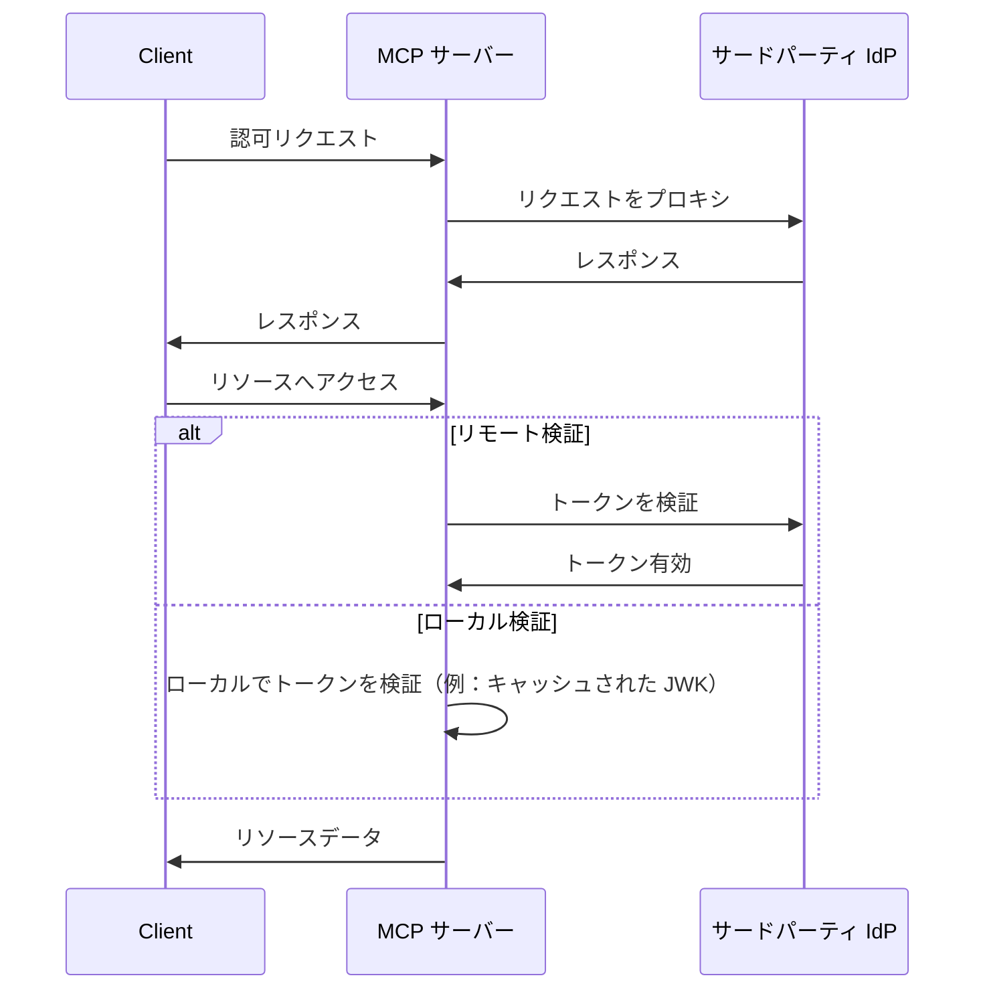
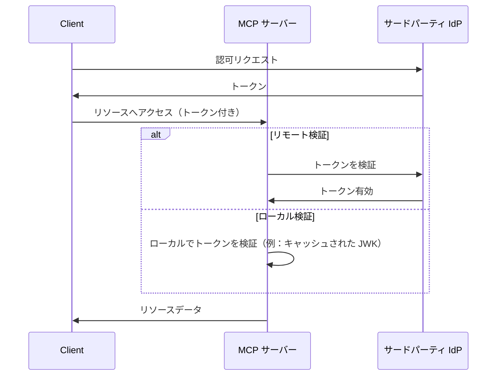

# MCP Auth と他のソリューションの比較・選択

MCP エコシステムは進化し続けています。Model Context Protocol (MCP) 仕様が「認可サーバー」方式から新しい「リソースサーバー + サードパーティ IdP」モデルへ移行する中で、さまざまな統合ソリューションが現在および将来どのように適合するかを理解することが重要です。

このページでは、mcp-auth と他の一般的なソリューションの主な違いをまとめ、プロジェクトに最適なアプローチを選択するための参考情報を提供します。

## 背景：プロキシ方式 vs. IdP 連携 \{#background-proxy-approach-vs-idp-integration}

現在の多くの MCP 認証 (Authentication) ソリューションは「プロキシ方式」を採用しています。このモデルでは、MCP サーバーが認可 (Authorization) リクエストをサードパーティのアイデンティティプロバイダー (IdP) にプロキシし、クライアントと IdP の間の仲介役として機能します。

**プロキシ方式 ([03-26 仕様](https://modelcontextprotocol.io/specification/2025-03-26/basic/authorization))**

この方式は現行（2025-03-26）MCP 仕様で動作しますが、本質的には回避策です。MCP サーバーが認可サーバーとしても動作することを前提としており、最新のドラフト仕様の方向性とは異なります。

**MCP Auth / 将来仕様（リソースサーバー + サードパーティ IdP）**

今後の MCP 仕様では、[認可 (Authorization) の責任を専用のサードパーティ IdP に移す](https://github.com/modelcontextprotocol/modelcontextprotocol/issues/205) 形にシフトします。このモデルでは、MCP サーバーはリソースサーバーとしてのみ機能し、すべての認可 (Authorization) エンドポイントはサードパーティ IdP から直接提供されます。

## なぜ MCP Auth を選ぶのか？ \{#why-choose-mcp-auth}

- 仕様との整合性：MCP Auth は最新ドラフトの方向性に直接従っており、03-26 仕様と今後の仕様の両方に対応できる唯一のソリューションです。
- 回避策不要：認可サーバープロキシとして動作する代わりに、MCP Auth では新仕様の意図通り、すべての認可 (Authorization) をサードパーティ IdP に任せます。
- プロバイダー非依存：MCP Auth は、標準準拠の OAuth 2.0 / OIDC プロバイダーならどれでも利用できます。
- スムーズな移行：MCP Auth は OAuth 2.0 認可サーバーメタデータ経由ですべてのサードパーティエンドポイントをそのまま返します。これにより、現時点での統合も将来の変更にも柔軟に対応できます。
- 開発者体験：チュートリアルやユーティリティ、[OAuth 2.0 Protected Resource Metadata](https://auth.wiki/protected-resource-metadata) など今後の機能も提供し、MCP サーバー開発者の負担を軽減します。

| 機能                                 | プロキシソリューション     | MCP Auth |
| ------------------------------------ | ------------------------- | -------- |
| 03-26 仕様に対応                     | ✅                        | ✅       |
| 将来仕様に対応                       | ❌                        | ✅       |
| サードパーティ IdP を直接サポート     | ❌（回避策のみ）           | ✅       |
| プロバイダー非依存                   | 制限あり[^1]              | はい     |
| 移行準備完了                         | ❌                        | ✅       |

今すぐサードパーティ IdP をサポートし、将来の仕様にも備えたい場合は、MCP Auth が推奨ソリューションです。プロキシベースのアプローチは、近い将来非推奨となるか、大幅な再設計が必要になる可能性があります。

[^1]: 一部のプロキシソリューションは特定のパラメーターやエンドポイントをハードコーディングしており、柔軟性が制限されます。
