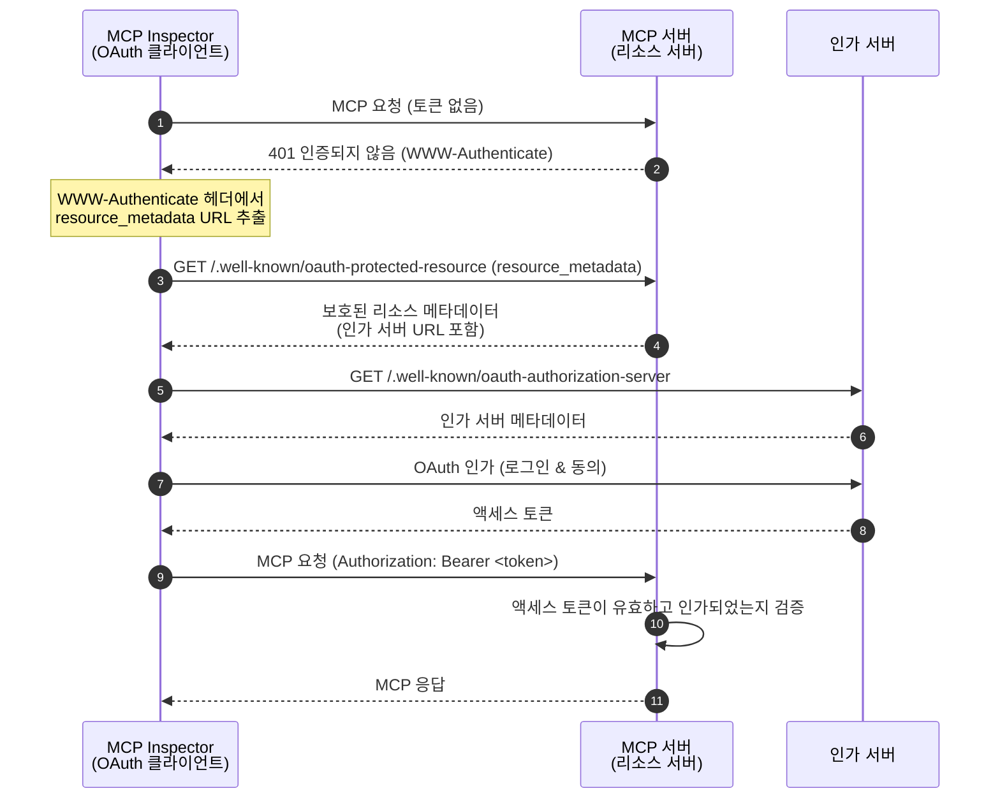
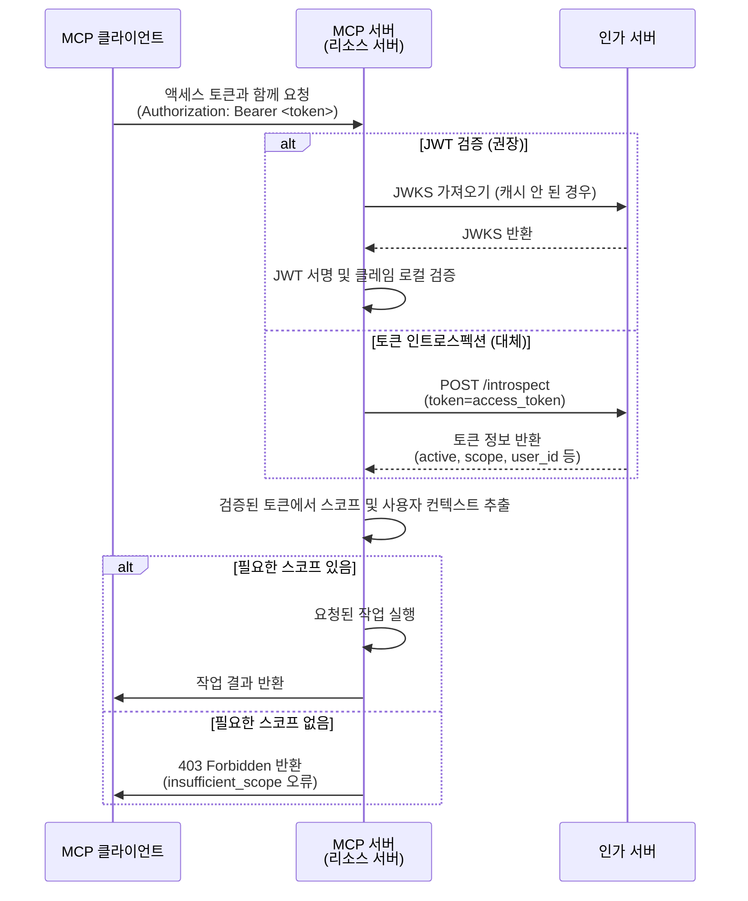

import TabItem from '@theme/TabItem';
import Tabs from '@theme/Tabs';


# 튜토리얼: Todo 매니저 만들기

이 튜토리얼에서는 사용자 인증 (Authentication) 및 인가 (Authorization)가 적용된 todo 매니저 MCP 서버를 구축합니다. 최신 MCP 명세를 따라, 우리의 MCP 서버는 액세스 토큰 (Access token)을 검증하고 스코프 기반 권한 (Permission)을 적용하는 OAuth 2.0 **리소스 서버 (Resource Server)** 역할을 하게 됩니다.

이 튜토리얼을 완료하면 다음을 얻게 됩니다:

- ✅ MCP 서버에서 역할 기반 접근 제어 (RBAC)를 설정하는 방법에 대한 기본 이해
- ✅ 인가 서버 (Authorization Server)가 발급한 액세스 토큰을 사용하는 리소스 서버 역할의 MCP 서버
- ✅ todo 작업에 대한 스코프 기반 권한 적용의 동작 구현

## 개요 (Overview) \{#overview}

이 튜토리얼에는 다음과 같은 구성 요소가 포함됩니다:

- **MCP 클라이언트 (MCP Inspector)**: OAuth 2.0 / OIDC 클라이언트 역할을 하는 MCP 서버용 시각적 테스트 도구입니다. 인가 서버와 인가 플로우를 시작하고, MCP 서버에 요청을 인증하기 위해 액세스 토큰을 획득합니다.
- **인가 서버 (Authorization Server)**: 사용자 아이덴티티를 관리하고, 사용자를 인증 (Authentication)하며, 인가된 클라이언트에 적절한 스코프가 포함된 액세스 토큰을 발급하는 OAuth 2.1 또는 OpenID Connect 제공자입니다.
- **MCP 서버 (Resource Server)**: 최신 MCP 명세에 따라, MCP 서버는 OAuth 2.0 프레임워크에서 리소스 서버 역할을 합니다. 인가 서버가 발급한 액세스 토큰을 검증하고, todo 작업에 대해 스코프 기반 권한을 적용합니다.

이 아키텍처는 표준 OAuth 2.0 플로우를 따릅니다:
- **MCP Inspector**가 사용자를 대신하여 보호된 리소스를 요청합니다
- **인가 서버**가 사용자를 인증하고 액세스 토큰을 발급합니다
- **MCP 서버**가 토큰을 검증하고, 부여된 권한에 따라 보호된 리소스를 제공합니다

다음은 이 구성 요소들 간 상호작용의 상위 다이어그램입니다:



## 인가 서버 이해하기 \{#understand-your-authorization-server}

### 스코프가 포함된 액세스 토큰 (Access tokens with scopes) \{#access-tokens-with-scopes}

[역할 기반 접근 제어 (RBAC)](https://auth.wiki/rbac)를 MCP 서버에 구현하려면, 인가 서버가 스코프가 포함된 액세스 토큰을 발급할 수 있어야 합니다. 스코프는 사용자가 부여받은 권한 (Permission)을 나타냅니다.

<Tabs groupId="provider">
<TabItem value="logto" label="Logto">

[Logto](https://logto.io)는 API 리소스 ([RFC 8707: OAuth 2.0을 위한 리소스 지표](https://datatracker.ietf.org/doc/html/rfc8707)) 및 역할 (Role) 기능을 통해 RBAC를 지원합니다. 설정 방법은 다음과 같습니다:

1. [Logto Console](https://cloud.logto.io) (또는 자체 호스팅 Logto Console)에 로그인하세요.

2. API 리소스 및 스코프 생성:

   - "API 리소스"로 이동
   - "Todo Manager"라는 새 API 리소스 생성
   - 다음 스코프 추가:
     - `create:todos`: "새 todo 항목 생성"
     - `read:todos`: "모든 todo 항목 읽기"
     - `delete:todos`: "모든 todo 항목 삭제"

3. 역할 생성 (관리가 쉬워지므로 권장):

   - "역할"로 이동
   - "Admin" 역할을 생성하고 모든 스코프(`create:todos`, `read:todos`, `delete:todos`) 할당
   - "User" 역할을 생성하고 `create:todos` 스코프만 할당

4. 권한 할당:
   - "사용자"로 이동
   - 사용자를 선택
   - "Roles" 탭에서 역할 할당 (권장)
   - 또는 "Permissions" 탭에서 직접 스코프 할당

스코프는 JWT 액세스 토큰의 `scope` 클레임에 공백으로 구분된 문자열로 포함됩니다.

</TabItem>
<TabItem value="oauth-oidc" label="OAuth 2.0 / OIDC">

OAuth 2.0 / OIDC 제공자는 일반적으로 스코프 기반 접근 제어를 지원합니다. RBAC 구현 시:

1. 인가 서버에서 필요한 스코프 정의
2. 클라이언트가 인가 플로우 중에 이 스코프를 요청하도록 구성
3. 인가 서버가 부여된 스코프를 액세스 토큰에 포함하는지 확인
4. 스코프는 보통 JWT 액세스 토큰의 `scope` 클레임에 포함됨

스코프 정의 및 관리 방법, 액세스 토큰에 스코프가 포함되는 방식, 역할 관리 등 추가 RBAC 기능은 제공자 문서를 참고하세요.

</TabItem>
</Tabs>

### 토큰 검증 및 권한 확인 (Validating tokens and checking permissions) \{#validating-tokens-and-checking-permissions}

최신 MCP 명세에 따르면, MCP 서버는 OAuth 2.0 프레임워크에서 **리소스 서버 (Resource Server)** 역할을 합니다. 리소스 서버로서 MCP 서버의 주요 책임은 다음과 같습니다:

1. **토큰 검증**: MCP 클라이언트로부터 받은 액세스 토큰의 진위 및 무결성 검증
2. **스코프 적용**: 액세스 토큰에서 스코프를 추출 및 검증하여 클라이언트가 수행할 수 있는 작업 결정
3. **리소스 보호**: 유효한 토큰과 충분한 권한이 있는 경우에만 보호된 리소스(도구 실행) 제공

MCP 서버가 요청을 받으면 다음과 같은 검증 과정을 거칩니다:

1. `Authorization` 헤더에서 액세스 토큰 추출 (Bearer 토큰 형식)
2. 액세스 토큰의 서명 및 만료 검증
3. 검증된 토큰에서 스코프 및 사용자 정보 추출
4. 요청 작업에 필요한 스코프가 토큰에 포함되어 있는지 확인

예를 들어, 사용자가 새 todo 항목을 생성하려면 액세스 토큰에 `create:todos` 스코프가 포함되어야 합니다. 리소스 서버 검증 플로우는 다음과 같습니다:



### 동적 클라이언트 등록 (Dynamic Client Registration) \{#dynamic-client-registration}

이 튜토리얼에서는 필수는 아니지만, 인가 서버에 MCP 클라이언트 등록을 자동화하고 싶다면 유용할 수 있습니다. 자세한 내용은 [동적 클라이언트 등록이 필요한가요?](/provider-list#is-dcr-required)를 참고하세요.

## Todo 매니저에서 RBAC 이해하기 \{#understand-rbac-in-todo-manager}

데모 목적을 위해, todo 매니저 MCP 서버에 간단한 역할 기반 접근 제어 (RBAC) 시스템을 구현합니다. 이를 통해 RBAC의 기본 원리를 쉽게 이해할 수 있습니다.

:::note
이 튜토리얼은 RBAC 기반 스코프 관리를 시연하지만, 모든 인증 (Authentication) 제공자가 역할을 통한 스코프 관리를 구현하는 것은 아닙니다. 일부 제공자는 자체적인 접근 제어 및 권한 관리 방식을 가질 수 있습니다.
:::

### 도구와 스코프 (Tools and scopes) \{#tools-and-scopes}

우리 todo 매니저 MCP 서버는 세 가지 주요 도구를 제공합니다:

- `create-todo`: 새 todo 항목 생성
- `get-todos`: 모든 todo 목록 조회
- `delete-todo`: ID로 todo 삭제

이 도구들에 대한 접근을 제어하기 위해 다음과 같은 스코프를 정의합니다:

- `create:todos`: 새 todo 항목 생성 허용
- `delete:todos`: 기존 todo 항목 삭제 허용
- `read:todos`: 모든 todo 항목 조회 및 검색 허용

### 역할과 권한 (Roles and permissions) \{#roles-and-permissions}

다음과 같이 서로 다른 접근 수준을 가진 두 가지 역할을 정의합니다:

| 역할  | create:todos | read:todos | delete:todos |
| ----- | ------------ | ---------- | ------------ |
| Admin | ✅           | ✅         | ✅           |
| User  | ✅           |            |              |

- **User**: 자신의 todo만 생성, 조회, 삭제할 수 있는 일반 사용자
- **Admin**: 소유자와 상관없이 모든 todo를 생성, 조회, 삭제할 수 있는 관리자

### 리소스 소유권 (Resource ownership) \{#resource-ownership}

위 권한 테이블은 각 역할에 명시적으로 할당된 스코프를 보여주지만, 리소스 소유권의 중요한 원칙이 있습니다:

- **User**는 `read:todos` 또는 `delete:todos` 스코프가 없지만,
  - 자신의 todo 항목은 조회할 수 있습니다
  - 자신의 todo 항목은 삭제할 수 있습니다
- **Admin**은 전체 권한 (`read:todos`, `delete:todos`)을 가지므로,
  - 시스템의 모든 todo 항목을 볼 수 있습니다
  - 소유자와 상관없이 모든 todo 항목을 삭제할 수 있습니다

이는 RBAC 시스템에서 리소스 소유권이 사용자의 소유 리소스에 대한 암묵적 권한을 부여하고, 관리 역할은 모든 리소스에 대한 명시적 권한을 받는 일반적인 패턴을 보여줍니다.

:::tip 더 알아보기
RBAC 개념과 모범 사례를 더 깊이 이해하려면 [Mastering RBAC: A Comprehensive Real-World Example](https://blog.logto.io/mastering-rbac)을 참고하세요.
:::

## 제공자에서 인가 (Authorization) 구성하기 \{#configure-authorization-in-your-provider}

앞서 설명한 접근 제어 시스템을 구현하려면, 인가 서버에서 필요한 스코프를 지원하도록 구성해야 합니다. 제공자별 설정 방법은 다음과 같습니다:

<Tabs groupId="provider">
<TabItem value="logto" label="Logto">

[Logto](https://logto.io)는 API 리소스와 역할 기능을 통해 RBAC를 지원합니다. 설정 방법은 다음과 같습니다:

1. [Logto Console](https://cloud.logto.io) (또는 자체 호스팅 Logto Console)에 로그인하세요.

2. API 리소스 및 스코프 생성:

   - "API 리소스"로 이동
   - "Todo Manager"라는 새 API 리소스를 생성하고, 리소스 지표 (Resource indicator)로 `http://localhost:3001`을 사용합니다.
     - **중요**: 리소스 지표는 MCP 서버의 URL과 일치해야 합니다. 이 튜토리얼에서는 MCP 서버가 3001 포트에서 실행되므로 `http://localhost:3001`을 사용합니다. 운영 환경에서는 실제 MCP 서버 URL (예: `https://your-mcp-server.example.com`)을 사용하세요.
   - 다음 스코프 생성:
     - `create:todos`: "새 todo 항목 생성"
     - `read:todos`: "모든 todo 항목 읽기"
     - `delete:todos`: "모든 todo 항목 삭제"

3. 역할 생성 (관리가 쉬워지므로 권장):

   - "Roles"로 이동
   - "Admin" 역할을 생성하고 모든 스코프(`create:todos`, `read:todos`, `delete:todos`) 할당
   - "User" 역할을 생성하고 `create:todos` 스코프만 할당
   - "User" 역할 상세 페이지에서 "일반" 탭으로 이동하여 "User" 역할을 "기본 역할"로 설정

4. 사용자 역할 및 권한 관리:
   - 신규 사용자:
     - "User" 역할이 기본 역할로 설정되어 있으므로 자동으로 할당됨
   - 기존 사용자:
     - "사용자 관리"로 이동
     - 사용자를 선택
     - "Roles" 탭에서 역할 할당

:::tip 프로그래밍 방식의 역할 관리
Logto의 [Management API](https://docs.logto.io/integrate-logto/interact-with-management-api)를 사용하여 프로그래밍 방식으로 사용자 역할을 관리할 수 있습니다. 자동화된 사용자 관리나 관리자 패널 구축 시 유용합니다.
:::

액세스 토큰을 요청할 때, Logto는 사용자 역할 권한에 따라 토큰의 `scope` 클레임에 스코프를 포함합니다.

</TabItem>
<TabItem value="oauth-or-oidc" label="OAuth 2 / OIDC">

OAuth 2.0 또는 OpenID Connect 제공자의 경우, 서로 다른 권한을 나타내는 스코프를 구성해야 합니다. 구체적인 단계는 제공자마다 다르지만, 일반적으로:

1. 스코프 정의:

   - 인가 서버에서 다음 스코프 지원하도록 구성:
     - `create:todos`
     - `read:todos`
     - `delete:todos`

2. 클라이언트 구성:

   - 클라이언트를 등록하거나 업데이트하여 이 스코프를 요청하도록 설정
   - 액세스 토큰에 스코프가 포함되는지 확인

3. 권한 할당:
   - 제공자 인터페이스를 통해 사용자에게 적절한 스코프 부여
   - 일부 제공자는 역할 기반 관리, 일부는 직접 스코프 할당 지원
   - 권장 방식은 제공자 문서를 참고

:::tip
대부분의 제공자는 부여된 스코프를 액세스 토큰의 `scope` 클레임에 포함합니다. 형식은 일반적으로 공백으로 구분된 스코프 값 문자열입니다.
:::

</TabItem>
</Tabs>

인가 서버를 구성한 후, 사용자는 부여된 스코프가 포함된 액세스 토큰을 받게 됩니다. MCP 서버는 이 스코프를 사용하여 다음을 결정합니다:

- 사용자가 새 todo를 생성할 수 있는지 (`create:todos`)
- 사용자가 모든 todo를 볼 수 있는지 (`read:todos`) 또는 자신의 todo만 볼 수 있는지
- 사용자가 모든 todo를 삭제할 수 있는지 (`delete:todos`) 또는 자신의 todo만 삭제할 수 있는지

## MCP 서버 설정하기 \{#set-up-the-mcp-server}

[MCP 공식 SDK](https://github.com/modelcontextprotocol)를 사용하여 todo 매니저 MCP 서버를 만듭니다.

### 새 프로젝트 생성 \{#create-a-new-project}

<Tabs groupId="sdk">
<TabItem value="python" label="Python">

새 Python 프로젝트를 설정하세요:

```bash
mkdir mcp-todo-server
cd mcp-todo-server

# 새 Python 프로젝트 초기화
uv init

# uv로 가상환경 생성
uv venv

# 가상환경 활성화 (uv run 사용 시 선택 사항)
source .venv/bin/activate
```

:::note
이 프로젝트는 패키지 관리를 위해 `uv`를 사용하지만, `pip`, `poetry`, `conda` 등 다른 패키지 매니저도 사용할 수 있습니다.
:::

</TabItem>
<TabItem value="node" label="Node.js">

새 Node.js 프로젝트를 설정하세요:

```bash
mkdir mcp-server
cd mcp-server
npm init -y # 또는 `pnpm init` 사용
npm pkg set type="module"
npm pkg set main="todo-manager.ts"
npm pkg set scripts.start="node --experimental-strip-types todo-manager.ts"
```

:::note
예제에서는 TypeScript를 사용합니다. Node.js v22.6.0+에서는 `--experimental-strip-types` 플래그로 TypeScript를 네이티브로 실행할 수 있습니다. JavaScript를 사용하는 경우 코드가 유사하며, Node.js v22.6.0 이상을 사용해야 합니다. 자세한 내용은 Node.js 문서를 참고하세요.
:::

</TabItem>
</Tabs>

### MCP SDK 및 의존성 설치 \{#install-the-mcp-sdk-and-dependencies}

<Tabs groupId="sdk">
<TabItem value="python" label="Python">

필요한 의존성 설치:

```bash
uv add "mcp[cli]" uvicorn starlette
```

</TabItem>
<TabItem value="node" label="Node.js">

```bash
npm install @modelcontextprotocol/sdk express zod
```

또는 `pnpm`, `yarn` 등 원하는 패키지 매니저를 사용할 수 있습니다.

</TabItem>
</Tabs>

### MCP 서버 만들기 \{#create-the-mcp-server}

먼저, 도구 정의가 포함된 기본 MCP 서버를 만듭니다:

<Tabs groupId="sdk">
<TabItem value="python" label="Python">

`server.py` 파일을 만들고 다음 코드를 추가하세요:

```python
# server.py

import contextlib
from typing import Any
from mcp.server.fastmcp import FastMCP
from starlette.applications import Starlette
from starlette.routing import Mount

# FastMCP 서버 초기화
mcp = FastMCP(name="Todo Manager", stateless_http=True, streamable_http_path='/')

@mcp.tool()
def create_todo(content: str) -> dict[str, Any]:
    """새 todo 생성. 'create:todos' 스코프 필요."""
    return {"error": "Not implemented"}

@mcp.tool()
def get_todos() -> dict[str, Any]:
    """todo 목록 조회. 'read:todos' 스코프가 있으면 전체 조회 가능."""
    return {"error": "Not implemented"}

@mcp.tool()
def delete_todo(id: str) -> dict[str, Any]:
    """ID로 todo 삭제. 사용자는 자신의 todo만 삭제 가능."""
    return {"error": "Not implemented"}

@contextlib.asynccontextmanager
async def lifespan(app: Starlette):
    async with contextlib.AsyncExitStack() as stack:
        await stack.enter_async_context(mcp.session_manager.run())
        yield

# 앱 생성
app = Starlette(
    routes=[
        Mount("/", app=mcp.streamable_http_app()),
    ],
    lifespan=lifespan,
)
```

서버 실행:

```bash
# uvicorn으로 Todo Manager 서버 시작
uvicorn server:app --host 127.0.0.1 --port 3001

# 또는 uv 사용:
# uv run uvicorn server:app --host 127.0.0.1 --port 3001
```

</TabItem>
<TabItem value="node" label="Node.js">

`todo-manager.ts` 파일을 만들고 다음 코드를 추가하세요:

```ts
// todo-manager.ts

import { z } from 'zod';
import { McpServer } from '@modelcontextprotocol/sdk/server/mcp.js';
import { StreamableHTTPServerTransport } from '@modelcontextprotocol/sdk/server/streamableHttp.js';
import express, { type Request, type Response } from 'express';

// MCP 서버 생성
const server = new McpServer({
  name: 'Todo Manager',
  version: '0.0.0',
});

server.tool('create-todo', '새 todo 생성', { content: z.string() }, async ({ content }) => {
  return {
    content: [{ type: 'text', text: JSON.stringify({ error: 'Not implemented' }) }],
  };
});

server.tool('get-todos', '모든 todo 목록 조회', async () => {
  return {
    content: [{ type: 'text', text: JSON.stringify({ error: 'Not implemented' }) }],
  };
});

server.tool('delete-todo', 'ID로 todo 삭제', { id: z.string() }, async ({ id }) => {
  return {
    content: [{ type: 'text', text: JSON.stringify({ error: 'Not implemented' }) }],
  };
});

// 아래는 MCP SDK 문서의 보일러플레이트 코드입니다
const PORT = 3001;
const app = express();

app.post('/', async (request: Request, response: Response) => {
  // Stateless 모드에서는 각 요청마다 transport와 server 인스턴스를 새로 생성해야 완전한 격리가 보장됩니다.
  // 단일 인스턴스 사용 시 여러 클라이언트 동시 접속 시 request ID 충돌이 발생할 수 있습니다.

  try {
    const transport: StreamableHTTPServerTransport = new StreamableHTTPServerTransport({
      sessionIdGenerator: undefined,
    });
    response.on('close', async () => {
      console.log('Request closed');
      await transport.close();
      await server.close();
    });
    await server.connect(transport);
    await transport.handleRequest(request, response, request.body);
  } catch (error) {
    console.error('Error handling MCP request:', error);
    if (!response.headersSent) {
      response.status(500).json({
        jsonrpc: '2.0',
        error: {
          code: -32_603,
          message: 'Internal server error',
        },
        id: null,
      });
    }
  }
});

// Stateless 모드에서는 SSE 알림 미지원
app.get('/', async (request: Request, response: Response) => {
  console.log('Received GET MCP request');
  response.writeHead(405).end(
    JSON.stringify({
      jsonrpc: '2.0',
      error: {
        code: -32_000,
        message: 'Method not allowed.',
      },
      id: null,
    })
  );
});

// Stateless 모드에서는 세션 종료 불필요
app.delete('/', async (request: Request, response: Response) => {
  console.log('Received DELETE MCP request');
  response.writeHead(405).end(
    JSON.stringify({
      jsonrpc: '2.0',
      error: {
        code: -32_000,
        message: 'Method not allowed.',
      },
      id: null,
    })
  );
});

app.listen(PORT);
```

서버 실행:

```bash
npm start
```

</TabItem>
</Tabs>

## MCP 서버 검사하기 \{#inspect-the-mcp-server}

### MCP inspector 클론 및 실행 \{#clone-and-run-mcp-inspector}

이제 MCP 서버가 실행 중이므로, MCP inspector를 사용해 도구가 노출되는지 확인할 수 있습니다.

공식 MCP inspector v0.16.2에는 인증 (Authentication) 기능에 영향을 주는 버그가 있습니다. 이를 해결하기 위해 OAuth / OIDC 인증 플로우 관련 패치가 적용된 [MCP inspector 패치 버전](https://github.com/mcp-auth/inspector/tree/patch/0.16.2-fixes)을 제공합니다. 또한 공식 저장소에 PR도 제출하였습니다.

MCP inspector를 실행하려면 (Node.js 필요):

```bash
git clone https://github.com/mcp-auth/inspector.git -b patch/0.16.2-fixes
cd inspector
npm install
npm run dev
```

MCP inspector는 기본 브라우저에서 자동으로 열리며, 터미널 출력의 링크(예: `http://localhost:6274/?MCP_PROXY_AUTH_TOKEN=458ae4a4...acab1907`)를 클릭해 직접 접근할 수도 있습니다.

### MCP inspector를 MCP 서버에 연결 \{#connect-mcp-inspector-to-the-mcp-server}

진행 전, MCP inspector에서 다음 설정을 확인하세요:

- **Transport Type**: `Streamable HTTP`로 설정
- **URL**: MCP 서버의 URL로 설정 (`http://localhost:3001`)

이제 "Connect" 버튼을 클릭하여 MCP inspector가 MCP 서버에 연결되는지 확인하세요. 정상적으로 연결되면 MCP inspector에서 "Connected" 상태를 볼 수 있습니다.

### 체크포인트: Todo 매니저 도구 실행 \{#checkpoint-run-todo-manager-tools}

1. MCP inspector 상단 메뉴에서 "Tools" 탭 클릭
2. "List Tools" 버튼 클릭
3. `create-todo`, `get-todos`, `delete-todo` 도구가 페이지에 표시되어야 합니다. 클릭하여 도구 상세 보기
4. 우측에 "Run Tool" 버튼이 보입니다. 클릭 후 필요한 파라미터를 입력해 도구 실행
5. JSON 응답 `{"error": "Not implemented"}`가 표시되어야 합니다.


## 인가 서버와 통합하기 \{#integrate-with-your-authorization-server}

이 섹션을 완료하려면 다음 사항을 고려해야 합니다:

<details>
<summary>**인가 서버의 발급자 (Issuer) URL**</summary>

일반적으로 인가 서버의 기본 URL입니다. 예: `https://auth.example.com`. 일부 제공자는 `https://example.logto.app/oidc`와 같이 경로가 포함될 수 있으니, 제공자 문서를 확인하세요.

</details>

<details>
<summary>**인가 서버 메타데이터 조회 방법**</summary>

- 인가 서버가 [OAuth 2.0 Authorization Server Metadata](https://datatracker.ietf.org/doc/html/rfc8414) 또는 [OpenID Connect Discovery](https://openid.net/specs/openid-connect-discovery-1_0.html)를 준수한다면, MCP Auth 내장 유틸리티로 자동 조회할 수 있습니다.
- 준수하지 않는 경우, MCP 서버 설정에서 메타데이터 URL 또는 엔드포인트를 수동 지정해야 합니다. 제공자 문서를 참고하세요.

</details>

<details>
<summary>**MCP inspector를 인가 서버에 클라이언트로 등록하는 방법**</summary>

- 인가 서버가 [동적 클라이언트 등록 (Dynamic Client Registration)](https://datatracker.ietf.org/doc/html/rfc7591)을 지원하면, MCP inspector가 자동으로 클라이언트로 등록됩니다.
- 지원하지 않는 경우, MCP inspector를 인가 서버에 수동으로 클라이언트로 등록해야 합니다.

</details>

<details>
<summary>**토큰 요청 파라미터 이해하기**</summary>

인가 서버마다 대상 리소스 및 권한 지정 방식이 다릅니다. 주요 패턴은 다음과 같습니다:

- **리소스 지표 기반**:

  - `resource` 파라미터로 대상 API 지정 ([RFC 8707: OAuth 2.0을 위한 리소스 지표](https://datatracker.ietf.org/doc/html/rfc8707) 참고)
  - 최신 OAuth 2.0 구현에서 일반적
  - 예시 요청:
    ```json
    {
      "resource": "http://localhost:3001",
      "scope": "create:todos read:todos"
    }
    ```
  - 서버는 요청된 리소스에 바인딩된 토큰 발급

- **Audience 기반**:

  - `audience` 파라미터로 토큰 수신자 지정
  - 리소스 지표와 유사하나 의미가 다름
  - 예시 요청:
    ```json
    {
      "audience": "todo-api",
      "scope": "create:todos read:todos"
    }
    ```

- **순수 스코프 기반**:
  - resource/audience 파라미터 없이 스코프만 사용
  - 전통적인 OAuth 2.0 방식
  - 예시 요청:
    ```json
    {
      "scope": "todo-api:create todo-api:read openid profile"
    }
    ```
  - 권한 네임스페이스를 위해 접두사 스코프 사용
  - 단순한 OAuth 2.0 구현에서 일반적

:::tip 모범 사례

- 제공자 문서에서 지원 파라미터 확인
- 일부 제공자는 여러 방식을 동시에 지원
- 리소스 지표는 audience 제한을 통해 더 나은 보안 제공
- 가능하다면 리소스 지표 사용을 권장
  :::

</details>

제공자마다 세부 요구사항이 다를 수 있지만, 아래 단계에 따라 MCP inspector와 MCP 서버를 제공자별로 통합할 수 있습니다.

### MCP inspector를 클라이언트로 등록 \{#register-mcp-inspector-as-a-client}

<Tabs groupId="provider">
<TabItem value="logto" label="Logto">

[Logto](https://logto.io)는 OpenID Connect 제공자로, 리소스 지표와 스코프를 지원하므로 `http://localhost:3001` 리소스 지표로 todo API를 안전하게 보호할 수 있습니다.

Logto는 아직 동적 클라이언트 등록을 지원하지 않으므로, MCP inspector를 Logto 테넌트에 수동으로 클라이언트로 등록해야 합니다:

1. MCP inspector에서 Authentication 설정으로 이동, "OAuth2.0 Flow" 설정을 클릭하고 **Redirect URI** 값을 복사하세요. 예: `http://localhost:6274/oauth/callback`
2. [Logto Console](https://cloud.logto.io) (또는 자체 호스팅 Logto Console)에 로그인
3. "Applications" 탭에서 "Create application" 클릭. 페이지 하단에서 "Create app without framework" 클릭
4. 애플리케이션 정보 입력 후 "Create application" 클릭:
   - **애플리케이션 유형 선택**: "Single-page application" 선택
   - **애플리케이션 이름**: 예: "MCP Inspector"
5. "Settings / Redirect URIs" 섹션에 MCP inspector에서 복사한 **Redirect URI** 값 붙여넣기. 하단 바에서 "Save changes" 클릭
6. 상단 카드에서 "App ID" 값을 복사
7. MCP inspector로 돌아가 "OAuth2.0 Flow"의 "Client ID" 필드에 "App ID" 값 붙여넣기
8. "Scope" 필드에 `create:todos read:todos delete:todos` 입력. Logto가 todo 매니저에 필요한 스코프가 포함된 액세스 토큰을 반환하도록 합니다.

</TabItem>
<TabItem value="oauth-oidc" label="OAuth 2.0 / OIDC">

:::note
이 가이드는 일반적인 OAuth 2.0 / OpenID Connect 제공자 통합 안내입니다. OIDC는 OAuth 2.0 위에 구축되어 있으므로 단계가 유사합니다. 제공자 문서를 참고하세요.
:::

제공자가 동적 클라이언트 등록을 지원한다면 아래 8번 단계로 바로 진행, 그렇지 않으면 MCP inspector를 수동으로 클라이언트로 등록해야 합니다:

1. MCP inspector에서 Authentication 설정으로 이동, "OAuth2.0 Flow" 설정을 클릭하고 **Redirect URI** 값을 복사하세요. 예: `http://localhost:6274/oauth/callback`

2. 제공자 콘솔에 로그인

3. "Applications" 또는 "Clients" 섹션에서 새 애플리케이션 또는 클라이언트 생성

4. 클라이언트 유형이 필요하다면 "Single-page application" 또는 "Public client" 선택

5. 애플리케이션 생성 후 Redirect URI 설정. 복사한 **Redirect URI** 값 붙여넣기

6. 새 애플리케이션의 "Client ID" 또는 "Application ID" 복사

7. MCP inspector로 돌아가 "OAuth2.0 Flow"의 "Client ID" 필드에 "Client ID" 값 붙여넣기

8. "Scope" 필드에 todo 작업에 필요한 다음 스코프 입력:

```text
create:todos read:todos delete:todos
```

</TabItem>
</Tabs>

### MCP Auth 설정 \{#set-up-mcp-auth}

먼저, MCP 서버 프로젝트에 MCP Auth SDK를 설치하세요.

<Tabs groupId="sdk">
<TabItem value="python" label="Python">

```bash
uv add mcpauth==0.2.0b1
```

</TabItem>
<TabItem value="node" label="Node.js">

```bash
npm install mcp-auth@0.2.0-beta.1
```

</TabItem>
</Tabs>

이제 MCP 서버에서 MCP Auth를 초기화해야 합니다. 주요 단계는 두 가지입니다:

1. **인가 서버 메타데이터 가져오기**: 이후 MCP Auth가 인가 서버가 발급한 액세스 토큰을 검증하고, 리소스 메타데이터에 인가 서버의 발급자 식별자를 포함하는 데 사용
2. **보호된 리소스 메타데이터 구성**: MCP 서버의 리소스 식별자와 지원하는 스코프 정의

#### 1단계: 인가 서버 메타데이터 가져오기 \{#step-1-fetch-authorization-server-metadata\}

OAuth / OIDC 명세에 따라, 인가 서버의 발급자 (Issuer) URL을 기반으로 인가 서버 메타데이터를 조회할 수 있습니다.

<Tabs groupId="provider">

<TabItem value="logto" label="Logto">

Logto에서는 Logto Console의 애플리케이션 상세 페이지 "Endpoints & Credentials / Issuer endpoint" 섹션에서 발급자 URL을 확인할 수 있습니다. 예: `https://my-project.logto.app/oidc`

</TabItem>

<TabItem value="oauth-oidc" label="OAuth 2.0 / OIDC">

OAuth 2.0 제공자의 경우:

1. 제공자 문서에서 인가 서버 URL(발급자 URL 또는 base URL) 확인
2. 일부 제공자는 `https://{your-domain}/.well-known/oauth-authorization-server`에서 노출
3. 제공자 관리자 콘솔의 OAuth / API 설정에서 확인

</TabItem>

</Tabs>

이제 MCP Auth 유틸리티 함수로 인가 서버 메타데이터를 가져옵니다:

<Tabs groupId="sdk">

<TabItem value="python" label="Python">
```python
from mcpauth import MCPAuth
from mcpauth.config import AuthServerType
from mcpauth.utils import fetch_server_config

issuer_url = "<issuer-url>"  # 인가 서버의 발급자 URL로 대체

# 인가 서버 구성 가져오기
auth_server_config = fetch_server_config(issuer_url, AuthServerType.OIDC) # 또는 AuthServerType.OAUTH
```

</TabItem>
<TabItem value="node" label="Node.js">
```js
import { MCPAuth, fetchServerConfig } from 'mcp-auth';

const issuerUrl = '<issuer-url>'; // 인가 서버의 발급자 URL로 대체

// 인가 서버 구성 가져오기 (OIDC Discovery)
const authServerConfig = await fetchServerConfig(issuerUrl, { type: 'oidc' }); // 또는 { type: 'oauth' }
```

</TabItem>
</Tabs>

인가 서버 메타데이터를 가져오는 다른 방법이나 구성을 커스터마이즈하고 싶다면 [인가 서버 메타데이터 구성의 다른 방법](/docs/configure-server/mcp-auth#other-ways)을 참고하세요.

#### 2단계: 보호된 리소스 메타데이터 구성 \{#step-2-configure-protected-resource-metadata}

다음으로, MCP Auth 인스턴스 생성 시 보호된 리소스 메타데이터를 구성합니다. 이후 MCP 서버는 MCP Auth에 구성된 리소스 메타데이터를 노출합니다.

<Tabs groupId="sdk">

<TabItem value="python" label="Python">
```python
# server.py

# 기타 import...
from mcpauth.types import ResourceServerConfig, ResourceServerMetadata

# 이 MCP 서버의 리소스 식별자 정의
resource_id = "http://localhost:3001"

mcp_auth = MCPAuth(
    protected_resources=ResourceServerConfig(
        metadata=ResourceServerMetadata(
            resource=resource_id,
            # 이전 단계에서 가져온 인가 서버 메타데이터
            authorization_servers=[auth_server_config],
            # MCP 서버가 이해하는 스코프
            scopes_supported=[
                "create:todos",
                "read:todos",
                "delete:todos"
            ]
        )
    )
)
```
</TabItem>

<TabItem value="node" label="Node.js">
```js
// todo-manager.ts

// 이 MCP 서버의 리소스 식별자 정의
const resourceId = 'http://localhost:3001';

// MCP Auth에 보호된 리소스 메타데이터 구성
const mcpAuth = new MCPAuth({
  protectedResources: {
    metadata: {
      resource: resourceId,
      // 이전 단계에서 가져온 인가 서버 메타데이터
      authorizationServers: [authServerConfig],
      // MCP 서버가 이해하는 스코프
      scopesSupported: [
        "create:todos",
        "read:todos",
        "delete:todos"
      ]
    }
  }
});
```
</TabItem>

</Tabs>

### MCP 서버 업데이트 \{#update-mcp-server}

거의 다 왔습니다! 이제 MCP Auth 라우트와 미들웨어 함수를 MCP 서버에 적용하고, 사용자의 스코프에 따라 todo 매니저 도구에 권한 기반 접근 제어를 구현합니다.

먼저, 보호된 리소스 메타데이터 라우트를 적용하여 MCP 클라이언트가 MCP 서버에서 리소스 메타데이터를 조회할 수 있도록 합니다.

<Tabs groupId="sdk">
<TabItem value="python" label="Python">
```python
# server.py

# ..기타 코드

app = Starlette(
    routes=[
        # 보호된 리소스 메타데이터 라우트 설정
        # OAuth 클라이언트를 위한 이 리소스 서버의 메타데이터 노출
        *mcp_auth.resource_metadata_router().routes,
        Mount("/", app=mcp.streamable_http_app()),
    ],
    lifespan=lifespan,
)
```
</TabItem>
<TabItem value="node" label="Node.js">

```ts
// todo-manager.ts

// 보호된 리소스 메타데이터 라우트 설정
// OAuth 클라이언트를 위한 이 리소스 서버의 메타데이터 노출
app.use(mcpAuth.protectedResourceMetadataRouter());

```
</TabItem>
</Tabs>

다음으로, MCP Auth 미들웨어를 MCP 서버에 적용합니다. 이 미들웨어는 들어오는 요청에 대해 인증 (Authentication) 및 인가 (Authorization)를 처리하여, 인가된 사용자만 todo 매니저 도구에 접근할 수 있도록 합니다.

<Tabs groupId="sdk">
<TabItem value="python" label="Python">
```python
# server.py

# 기타 import...
from starlette.middleware import Middleware

# 기타 코드...

# 미들웨어 생성
bearer_auth = Middleware(mcp_auth.bearer_auth_middleware('jwt', resource=resource_id, audience=resource_id))

app = Starlette(
    routes=[
        *mcp_auth.resource_metadata_router().routes,
        # MCP Auth 미들웨어 적용
        Mount("/", app=mcp.streamable_http_app(), middleware=[bearer_auth]),
    ],
    lifespan=lifespan,
)
```
</TabItem>
<TabItem value="node" label="Node.js">

```ts
// todo-manager.ts

app.use(mcpAuth.protectedResourceMetadataRouter());

// MCP Auth 미들웨어 적용
app.use(
  mcpAuth.bearerAuth('jwt', {
    resource: resourceId,
    audience: resourceId,
  })
);
```
</TabItem>
</Tabs>

이제 todo 매니저 도구 구현을 MCP Auth 미들웨어를 활용하여 인증 (Authentication) 및 인가 (Authorization)를 적용하도록 업데이트할 수 있습니다.

도구 구현을 업데이트해봅시다.

<Tabs groupId="sdk">
<TabItem value="python" label="Python">
```python
# server.py

# 기타 import...

from typing import Any, List, Optional
from mcpauth.exceptions import MCPAuthBearerAuthException, BearerAuthExceptionCode
from mcpauth.types import AuthInfo, ResourceServerConfig, ResourceServerMetadata

# 다음 섹션에서 언급
from service import TodoService

def assert_user_id(auth_info: Optional[AuthInfo]) -> str:
    """auth_info에 유효한 사용자 ID가 있는지 확인하고 반환."""
    if not auth_info or not auth_info.subject:
        raise Exception("Invalid auth info")
    return auth_info.subject

def has_required_scopes(user_scopes: List[str], required_scopes: List[str]) -> bool:
    """사용자가 모든 필수 스코프를 가지고 있는지 확인."""
    return all(scope in user_scopes for scope in required_scopes)

# TodoService 인스턴스 생성
todo_service = TodoService()

@mcp.tool()
def create_todo(content: str) -> dict[str, Any]:
    """새 todo 생성. 'create:todos' 스코프 필요."""
    auth_info = mcp_auth.auth_info
    user_id = assert_user_id(auth_info)
    
    # 'create:todos' 스코프가 있어야 todo 생성 가능
    user_scopes = auth_info.scopes if auth_info else []
    if not has_required_scopes(user_scopes, ["create:todos"]):
        raise MCPAuthBearerAuthException(BearerAuthExceptionCode.MISSING_REQUIRED_SCOPES)
    
    created_todo = todo_service.create_todo(content=content, owner_id=user_id)
    return created_todo

@mcp.tool()
def get_todos() -> dict[str, Any]:
    """
    todo 목록 조회. 'read:todos' 스코프가 있으면 전체, 없으면 본인 것만 조회.
    """
    auth_info = mcp_auth.auth_info
    user_id = assert_user_id(auth_info)
    
    # 'read:todos' 스코프가 있으면 전체, 없으면 본인 것만
    user_scopes = auth_info.scopes if auth_info else []
    todo_owner_id = None if has_required_scopes(user_scopes, ["read:todos"]) else user_id
    
    todos = todo_service.get_all_todos(todo_owner_id)
    return {"todos": todos}

@mcp.tool()
def delete_todo(id: str) -> dict[str, Any]:
    """
    ID로 todo 삭제. 사용자는 자신의 todo만 삭제 가능.
    'delete:todos' 스코프가 있으면 모든 todo 삭제 가능.
    """
    auth_info = mcp_auth.auth_info
    user_id = assert_user_id(auth_info)
    
    todo = todo_service.get_todo_by_id(id)
    
    if not todo:
        return {"error": "Failed to delete todo"}
    
    # 사용자는 자신의 todo만 삭제 가능
    # 'delete:todos' 스코프가 있으면 모든 todo 삭제 가능
    user_scopes = auth_info.scopes if auth_info else []
    if todo.owner_id != user_id and not has_required_scopes(user_scopes, ["delete:todos"]):
        return {"error": "Failed to delete todo"}
    
    deleted_todo = todo_service.delete_todo(id)
    
    if deleted_todo:
        return {
            "message": f"Todo {id} deleted",
            "details": deleted_todo
        }
    else:
        return {"error": "Failed to delete todo"}
```
</TabItem>

<TabItem value="node" label="Node.js">
```js
// todo-manager.ts

// 기타 import...
import assert from 'node:assert';
import { fetchServerConfig, MCPAuth, MCPAuthBearerAuthError } from 'mcp-auth';
import { type AuthInfo } from '@modelcontextprotocol/sdk/server/auth/types.js';

// 다음 섹션에서 언급
import { TodoService } from './todo-service.js';

const assertUserId = (authInfo?: AuthInfo) => {
  const { subject } = authInfo ?? {};
  assert(subject, 'Invalid auth info');
  return subject;
};

const hasRequiredScopes = (userScopes: string[], requiredScopes: string[]): boolean => {
  return requiredScopes.every((scope) => userScopes.includes(scope));
};

const todoService = new TodoService();

server.tool(
  'create-todo',
  '새 todo 생성',
  { content: z.string() },
  ({ content }: { content: string }, { authInfo }) => {
    const userId = assertUserId(authInfo);

    /**
     * 'create:todos' 스코프가 있어야 todo 생성 가능
     */
    if (!hasRequiredScopes(authInfo?.scopes ?? [], ['create:todos'])) {
      throw new MCPAuthBearerAuthError('missing_required_scopes');
    }

    const createdTodo = todoService.createTodo({ content, ownerId: userId });

    return {
      content: [{ type: 'text', text: JSON.stringify(createdTodo) }],
    };
  }
);

server.tool('get-todos', '모든 todo 목록 조회', ({ authInfo }) => {
  const userId = assertUserId(authInfo);

  /**
   * 'read:todos' 스코프가 있으면 전체(todoOwnerId = undefined)
   * 없으면 본인 것만(todoOwnerId = userId)
   */
  const todoOwnerId = hasRequiredScopes(authInfo?.scopes ?? [], ['read:todos'])
    ? undefined
    : userId;

  const todos = todoService.getAllTodos(todoOwnerId);

  return {
    content: [{ type: 'text', text: JSON.stringify(todos) }],
  };
});

server.tool(
  'delete-todo',
  'ID로 todo 삭제',
  { id: z.string() },
  ({ id }: { id: string }, { authInfo }) => {
    const userId = assertUserId(authInfo);

    const todo = todoService.getTodoById(id);

    if (!todo) {
      return {
        content: [{ type: 'text', text: JSON.stringify({ error: 'Failed to delete todo' }) }],
      };
    }

    /**
     * 사용자는 자신의 todo만 삭제 가능
     * 'delete:todos' 스코프가 있으면 모든 todo 삭제 가능
     */
    if (todo.ownerId !== userId && !hasRequiredScopes(authInfo?.scopes ?? [], ['delete:todos'])) {
      return {
        content: [
          {
            type: 'text',
            text: JSON.stringify({ error: 'Failed to delete todo' }),
          },
        ],
      };
    }

    const deletedTodo = todoService.deleteTodo(id);

    return {
      content: [
        {
          type: 'text',
          text: JSON.stringify({
            message: `Todo ${id} deleted`,
            details: deletedTodo,
          }),
        },
      ],
    };
  }
);
```
</TabItem>
</Tabs>

이제 위 코드에서 사용된 "Todo 서비스"를 구현합니다:

<Tabs groupId="sdk">
<TabItem value="python" label="Python">

Todo 서비스용 `service.py` 파일을 생성하세요:

```python
"""
데모용 간단한 Todo 서비스.
메모리 내 리스트에 todo를 저장합니다.
"""

from datetime import datetime
from typing import List, Optional, Dict, Any
import random
import string

class Todo:
    """todo 항목을 나타냅니다."""
    
    def __init__(self, id: str, content: str, owner_id: str, created_at: str):
        self.id = id
        self.content = content
        self.owner_id = owner_id
        self.created_at = created_at
    
    def to_dict(self) -> Dict[str, Any]:
        """todo를 JSON 직렬화를 위한 dict로 변환."""
        return {
            "id": self.id,
            "content": self.content,
            "ownerId": self.owner_id,
            "createdAt": self.created_at
        }


class TodoService:
    """데모용 간단한 Todo 서비스."""
    
    def __init__(self):
        self._todos: List[Todo] = []
    
    def get_all_todos(self, owner_id: Optional[str] = None) -> List[Dict[str, Any]]:
        """
        모든 todo 조회, owner_id로 필터링 가능.
        
        Args:
            owner_id: 지정 시 해당 사용자의 todo만 반환
            
        Returns:
            todo dict 리스트
        """
        if owner_id:
            filtered_todos = [todo for todo in self._todos if todo.owner_id == owner_id]
            return [todo.to_dict() for todo in filtered_todos]
        return [todo.to_dict() for todo in self._todos]
    
    def get_todo_by_id(self, todo_id: str) -> Optional[Todo]:
        """
        ID로 todo 조회.
        
        Args:
            todo_id: 조회할 todo의 ID
            
        Returns:
            찾으면 Todo 객체, 없으면 None
        """
        for todo in self._todos:
            if todo.id == todo_id:
                return todo
        return None
    
    def create_todo(self, content: str, owner_id: str) -> Dict[str, Any]:
        """
        새 todo 생성.
        
        Args:
            content: todo 내용
            owner_id: todo 소유자 ID
            
        Returns:
            생성된 todo의 dict 표현
        """
        todo = Todo(
            id=self._generate_id(),
            content=content,
            owner_id=owner_id,
            created_at=datetime.now().isoformat()
        )
        self._todos.append(todo)
        return todo.to_dict()
    
    def delete_todo(self, todo_id: str) -> Optional[Dict[str, Any]]:
        """
        ID로 todo 삭제.
        
        Args:
            todo_id: 삭제할 todo의 ID
            
        Returns:
            삭제된 todo의 dict 표현(성공 시), 없으면 None
        """
        for i, todo in enumerate(self._todos):
            if todo.id == todo_id:
                deleted_todo = self._todos.pop(i)
                return deleted_todo.to_dict()
        return None
    
    def _generate_id(self) -> str:
        """todo용 랜덤 ID 생성."""
        return ''.join(random.choices(string.ascii_lowercase + string.digits, k=8))
```

</TabItem>
<TabItem value="node" label="Node.js">

Todo 서비스용 `todo-service.ts` 파일을 생성하세요:

```ts
// todo-service.ts

type Todo = {
  id: string;
  content: string;
  ownerId: string;
  createdAt: string;
};

/**
 * 데모용 간단한 Todo 서비스.
 * 메모리 배열에 todo 저장
 */
export class TodoService {
  private readonly todos: Todo[] = [];

  getAllTodos(ownerId?: string): Todo[] {
    if (ownerId) {
      return this.todos.filter((todo) => todo.ownerId === ownerId);
    }
    return this.todos;
  }

  getTodoById(id: string): Todo | undefined {
    return this.todos.find((todo) => todo.id === id);
  }

  createTodo({ content, ownerId }: { content: string; ownerId: string }): Todo {
    const todo: Todo = {
      id: this.genId(),
      content,
      ownerId,
      createdAt: new Date().toISOString(),
    };

    // eslint-disable-next-line @silverhand/fp/no-mutating-methods
    this.todos.push(todo);
    return todo;
  }

  deleteTodo(id: string): Todo | undefined {
    const index = this.todos.findIndex((todo) => todo.id === id);

    if (index === -1) {
      return undefined;
    }

    // eslint-disable-next-line @silverhand/fp/no-mutating-methods
    const [deleted] = this.todos.splice(index, 1);
    return deleted;
  }

  private genId(): string {
    return Math.random().toString(36).slice(2, 10);
  }
}
```

</TabItem>
</Tabs>

🎉 축하합니다! 인증 (Authentication) 및 인가 (Authorization)가 적용된 완전한 MCP 서버를 성공적으로 구현했습니다!

샘플 코드를 참고할 수도 있습니다:

<Tabs groupId="sdk">
<TabItem value="python" label="Python">

:::info
[MCP Auth Python SDK 저장소](https://github.com/mcp-auth/python/tree/master/samples/current/todo-manager)에서 MCP 서버(OIDC 버전) 전체 코드를 확인하세요.
:::

</TabItem>
<TabItem value="node" label="Node.js">

:::info
[MCP Auth Node.js SDK 저장소](https://github.com/mcp-auth/js/blob/master/packages/sample-servers/src)에서 MCP 서버(OIDC 버전) 전체 코드를 확인하세요.
:::

</TabItem>
</Tabs>

## 체크포인트: `todo-manager` 도구 실행 \{#checkpoint-run-the-todo-manager-tools}

MCP 서버를 재시작하고 브라우저에서 MCP inspector를 엽니다. "Connect" 버튼을 클릭하면 인가 서버의 로그인 페이지로 리디렉션됩니다.

로그인 후 MCP inspector로 돌아오면, 이전 체크포인트에서 했던 것처럼 todo 매니저 도구를 실행해보세요. 이번에는 인증된 사용자 아이덴티티로 도구를 사용할 수 있습니다. 도구의 동작은 사용자에게 할당된 역할과 권한에 따라 달라집니다:

- **User**(오직 `create:todos` 스코프만 가진 경우)로 로그인하면:
  - `create-todo` 도구로 새 todo 생성 가능
  - 자신의 todo만 조회 및 삭제 가능
  - 다른 사용자의 todo는 볼 수 없고 삭제도 불가

- **Admin**(모든 스코프: `create:todos`, `read:todos`, `delete:todos` 보유)로 로그인하면:
  - 새 todo 생성 가능
  - `get-todos` 도구로 시스템의 모든 todo 조회 가능
  - `delete-todo` 도구로 소유자와 상관없이 모든 todo 삭제 가능

다른 권한 수준을 테스트하려면:

1. 현재 세션에서 로그아웃(MCP inspector의 "Disconnect" 클릭)
2. 다른 역할/권한을 가진 사용자 계정으로 로그인
3. 동일한 도구를 다시 실행하여 권한에 따라 동작이 어떻게 달라지는지 확인

이렇게 하면 역할 기반 접근 제어 (RBAC)가 실제로 어떻게 동작하는지 확인할 수 있습니다.


<Tabs groupId="sdk">
<TabItem value="python" label="Python">

:::info
[MCP Auth Python SDK 저장소](https://github.com/mcp-auth/python)에서 MCP 서버(OIDC 버전) 전체 코드를 확인하세요.
:::

</TabItem>
<TabItem value="node" label="Node.js">

:::info
[MCP Auth Node.js SDK 저장소](https://github.com/mcp-auth/js/blob/master/packages/sample-servers/src)에서 MCP 서버(OIDC 버전) 전체 코드를 확인하세요.
:::

</TabItem>
</Tabs>

## 마무리 (Closing notes) \{#closing-notes}

🎊 축하합니다! 튜토리얼을 성공적으로 완료했습니다. 지금까지 한 일을 요약해봅시다:

- todo 관리 도구(`create-todo`, `get-todos`, `delete-todo`)가 포함된 기본 MCP 서버 설정
- 사용자와 관리자를 위한 다양한 권한 수준의 역할 기반 접근 제어 (RBAC) 구현
- MCP Auth를 사용하여 MCP 서버를 인가 서버와 통합
- MCP Inspector를 구성하여 사용자를 인증하고, 스코프가 포함된 액세스 토큰으로 도구 호출

MCP Auth를 최대한 활용하려면 다른 튜토리얼과 문서도 꼭 확인해보세요.
