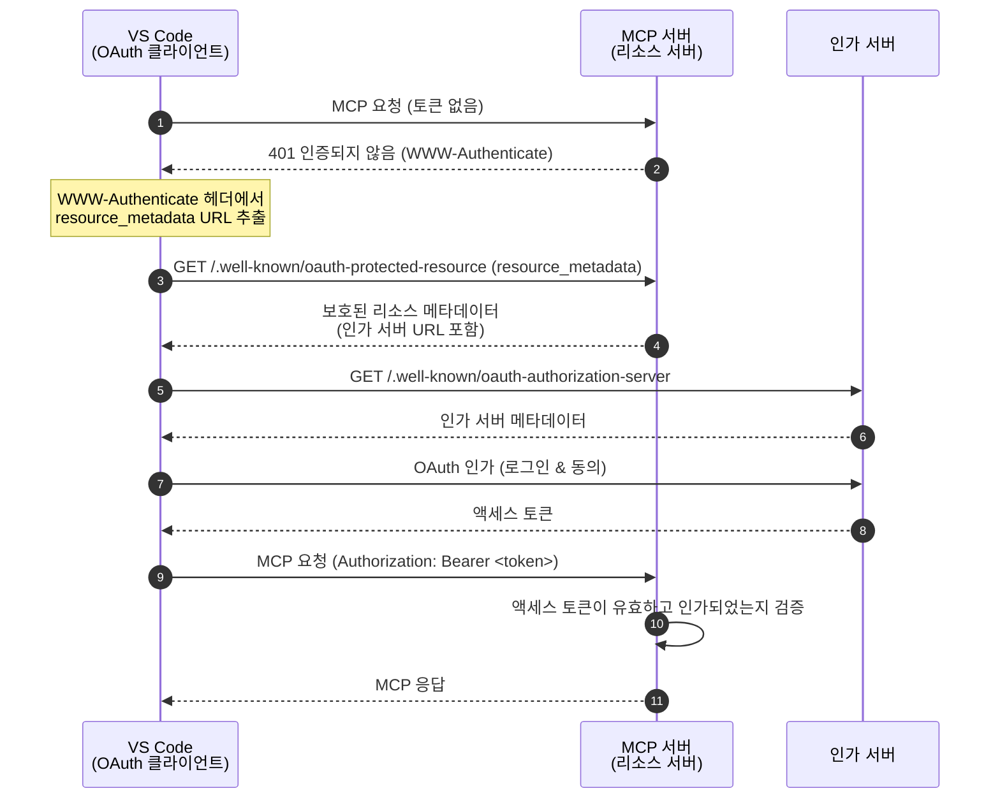
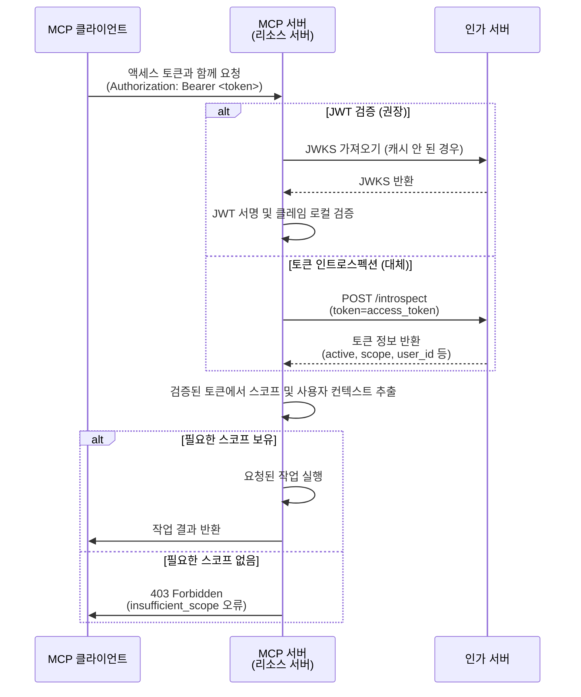

import { NpmLikeInstallation } from '@site/src/components/NpmLikeInstallation';
import TabItem from '@theme/TabItem';
import Tabs from '@theme/Tabs';

# 튜토리얼: Todo 매니저 만들기 (Tutorial: Build a todo manager)

:::tip Python SDK 사용 가능
MCP Auth는 Python에서도 사용할 수 있습니다! 설치 및 사용법은 [Python SDK 저장소](https://github.com/mcp-auth/python)를 확인하세요.
:::

이 튜토리얼에서는 사용자 인증 (Authentication) 및 인가 (Authorization)가 적용된 todo 매니저 MCP 서버를 구축합니다. 최신 MCP 명세를 따라, 우리의 MCP 서버는 액세스 토큰 (Access token)을 검증하고 스코프 (Scope) 기반 권한을 적용하는 OAuth 2.0 **리소스 서버 (Resource Server)** 역할을 하게 됩니다.

이 튜토리얼을 완료하면 다음을 얻게 됩니다:

- ✅ MCP 서버에서 역할 기반 접근 제어 (RBAC)를 설정하는 방법에 대한 기본 이해
- ✅ 인가 서버 (Authorization Server)가 발급한 액세스 토큰을 사용하는 리소스 서버 역할의 MCP 서버
- ✅ todo 작업에 대한 스코프 (Scope) 기반 권한 적용의 실제 구현

## 개요 (Overview) \{#overview}

이 튜토리얼에는 다음과 같은 구성 요소가 포함됩니다:

- **MCP 클라이언트 (VS Code)**: 내장 MCP 지원이 있는 코드 에디터로, OAuth 2.0/OIDC 클라이언트 역할을 합니다. 인가 서버와 인가 플로우를 시작하고, MCP 서버에 인증된 요청을 보내기 위해 액세스 토큰을 획득합니다.
- **인가 서버 (Authorization Server)**: 사용자 아이덴티티를 관리하고, 사용자를 인증 (Authentication)하며, 인가된 클라이언트에 적절한 스코프 (Scope)가 포함된 액세스 토큰을 발급하는 OAuth 2.1 또는 OpenID Connect 제공자입니다.
- **MCP 서버 (Resource Server)**: 최신 MCP 명세에 따라, MCP 서버는 OAuth 2.0 프레임워크에서 리소스 서버 역할을 합니다. 인가 서버가 발급한 액세스 토큰을 검증하고, todo 작업에 대해 스코프 (Scope) 기반 권한을 적용합니다.

이 아키텍처는 표준 OAuth 2.0 플로우를 따릅니다:

- **VS Code**가 사용자를 대신하여 보호된 리소스를 요청합니다
- **인가 서버 (Authorization Server)**가 사용자를 인증하고 액세스 토큰을 발급합니다
- **MCP 서버**가 토큰을 검증하고, 부여된 권한에 따라 보호된 리소스를 제공합니다

아래는 이 구성 요소들 간의 상호작용을 나타낸 고수준 다이어그램입니다:


```mermaid
sequenceDiagram
  autonumber
  participant Client as VS Code<br/>(OAuth 클라이언트)
  participant RS as MCP 서버<br/>(리소스 서버)
  participant AS as 인가 서버

  Client->>RS: MCP 요청 (토큰 없음)
  RS-->>Client: 401 인증되지 않음 (WWW-Authenticate)
  Note over Client: WWW-Authenticate 헤더에서<br/>resource_metadata URL 추출

  Client->>RS: GET /.well-known/oauth-protected-resource (resource_metadata)
  RS-->>Client: 보호된 리소스 메타데이터<br/>(인가 서버 URL 포함)

  Client->>AS: GET /.well-known/oauth-authorization-server
  AS-->>Client: 인가 서버 메타데이터
  Client->>AS: OAuth 인가 (로그인 & 동의)
  AS-->>Client: 액세스 토큰

  Client->>RS: MCP 요청 (Authorization: Bearer <token>)
  RS->>RS: 액세스 토큰이 유효하고 인가되었는지 검증
  RS-->>Client: MCP 응답
```

## 인가 서버 이해하기 (Understand your authorization server) \{#understand-your-authorization-server}

### 스코프가 포함된 액세스 토큰 (Access tokens with scopes) \{#access-tokens-with-scopes}

[MCP 서버에서 역할 기반 접근 제어 (RBAC)](https://auth.wiki/rbac)를 구현하려면, 인가 서버가 스코프 (Scope)가 포함된 액세스 토큰을 발급할 수 있어야 합니다. 스코프는 사용자가 부여받은 권한 (Permission)을 나타냅니다.

<Tabs groupId="provider">
<TabItem value="logto" label="Logto">

[Logto](https://logto.io)는 API 리소스 (API resource) ([RFC 8707: OAuth 2.0을 위한 리소스 지표](https://datatracker.ietf.org/doc/html/rfc8707)) 및 역할 (Role) 기능을 통해 RBAC를 지원합니다. 설정 방법은 다음과 같습니다:

1. [Logto Console](https://cloud.logto.io) (또는 자체 호스팅 Logto Console)에 로그인하세요.

2. API 리소스 및 스코프 생성:

   - "API 리소스"로 이동
   - "Todo Manager"라는 새 API 리소스 생성
   - 다음 스코프 추가:
     - `create:todos`: "새 todo 항목 생성"
     - `read:todos`: "모든 todo 항목 읽기"
     - `delete:todos`: "모든 todo 항목 삭제"

3. 역할 생성 (관리가 쉬우므로 권장):

   - "역할"로 이동
   - "Admin" 역할을 생성하고 모든 스코프 (`create:todos`, `read:todos`, `delete:todos`) 할당
   - "User" 역할을 생성하고 `create:todos` 스코프만 할당

4. 권한 할당:
   - "사용자"로 이동
   - 사용자를 선택
   - "Roles" 탭에서 역할을 할당하거나 (권장)
   - 또는 "Permissions" 탭에서 직접 스코프를 할당할 수 있습니다

스코프는 JWT 액세스 토큰의 `scope` 클레임에 공백으로 구분된 문자열로 포함됩니다.

</TabItem>
<TabItem value="oauth-oidc" label="OAuth 2.0 / OIDC">

OAuth 2.0 / OIDC 제공자는 일반적으로 스코프 기반 접근 제어를 지원합니다. RBAC을 구현할 때:

1. 인가 서버에서 필요한 스코프를 정의하세요
2. 클라이언트가 인가 플로우 중에 이 스코프를 요청하도록 구성하세요
3. 인가 서버가 부여된 스코프를 액세스 토큰에 포함하는지 확인하세요
4. 스코프는 보통 JWT 액세스 토큰의 `scope` 클레임에 포함됩니다

스코프 정의 및 관리 방법, 액세스 토큰에 스코프가 포함되는 방식, 역할 관리 등 추가 RBAC 기능은 제공자 문서를 참고하세요.

</TabItem>
</Tabs>

### 토큰 검증 및 권한 확인 (Validating tokens and checking permissions) \{#validating-tokens-and-checking-permissions}

최신 MCP 명세에 따르면, MCP 서버는 OAuth 2.0 프레임워크에서 **리소스 서버 (Resource Server)** 역할을 합니다. 리소스 서버로서 MCP 서버의 책임은 다음과 같습니다:

1. **토큰 검증**: MCP 클라이언트로부터 받은 액세스 토큰의 진위 및 무결성 확인
2. **스코프 적용**: 액세스 토큰에서 스코프를 추출 및 검증하여 클라이언트가 수행할 수 있는 작업 결정
3. **리소스 보호**: 클라이언트가 유효한 토큰과 충분한 권한을 제시할 때만 보호된 리소스(도구 실행) 제공

MCP 서버가 요청을 받으면 다음과 같은 검증 과정을 거칩니다:

1. `Authorization` 헤더에서 액세스 토큰 추출 (Bearer 토큰 형식)
2. 액세스 토큰의 서명 및 만료 검증
3. 검증된 토큰에서 스코프 및 사용자 정보 추출
4. 요청된 작업에 필요한 스코프가 토큰에 포함되어 있는지 확인

예를 들어, 사용자가 새 todo 항목을 생성하려면 액세스 토큰에 `create:todos` 스코프가 포함되어야 합니다. 리소스 서버 검증 플로우는 다음과 같습니다:


```mermaid
sequenceDiagram
    participant Client as MCP 클라이언트
    participant Server as MCP 서버<br/>(리소스 서버)
    participant Auth as 인가 서버

    Client->>Server: 액세스 토큰과 함께 요청<br/>(Authorization: Bearer <token>)

    alt JWT 검증 (권장)
        Server->>Auth: JWKS 가져오기 (캐시 안 된 경우)
        Auth-->>Server: JWKS 반환
        Server->>Server: JWT 서명 및 클레임 로컬 검증
    else 토큰 인트로스펙션 (대체)
        Server->>Auth: POST /introspect<br/>(token=access_token)
        Auth-->>Server: 토큰 정보 반환<br/>(active, scope, user_id 등)
    end

    Server->>Server: 검증된 토큰에서 스코프 및 사용자 컨텍스트 추출

    alt 필요한 스코프 보유
        Server->>Server: 요청된 작업 실행
        Server->>Client: 작업 결과 반환
    else 필요한 스코프 없음
        Server->>Client: 403 Forbidden<br/>(insufficient_scope 오류)
    end
```

### 동적 클라이언트 등록 (Dynamic Client Registration) \{#dynamic-client-registration}

이 튜토리얼에서는 필수는 아니지만, 인가 서버에 MCP 클라이언트 등록을 자동화하고 싶다면 유용할 수 있습니다. 자세한 내용은 [동적 클라이언트 등록이 필요한가요?](/provider-list#is-dcr-required)를 참고하세요.

## Todo 매니저에서 RBAC 이해하기 (Understand RBAC in todo manager) \{#understand-rbac-in-todo-manager}

데모 목적으로, todo 매니저 MCP 서버에 간단한 역할 기반 접근 제어 (RBAC) 시스템을 구현합니다. 이를 통해 RBAC의 기본 원리를 쉽게 이해할 수 있습니다.

:::note
이 튜토리얼은 RBAC 기반 스코프 관리를 시연하지만, 모든 인증 (Authentication) 제공자가 역할을 통한 스코프 관리를 구현하는 것은 아닙니다. 일부 제공자는 자체적인 접근 제어 및 권한 (Permission) 관리 메커니즘을 가질 수 있습니다.
:::

### 도구와 스코프 (Tools and scopes) \{#tools-and-scopes}

우리 todo 매니저 MCP 서버는 세 가지 주요 도구를 제공합니다:

- `create-todo`: 새 todo 항목 생성
- `get-todos`: 모든 todo 목록 조회
- `delete-todo`: ID로 todo 삭제

이 도구들에 대한 접근을 제어하기 위해 다음과 같은 스코프를 정의합니다:

- `create:todos`: 새 todo 항목 생성 허용
- `delete:todos`: 기존 todo 항목 삭제 허용
- `read:todos`: 모든 todo 항목 조회 및 검색 허용

### 역할과 권한 (Roles and permissions) \{#roles-and-permissions}

다음과 같이 서로 다른 접근 수준을 가진 두 가지 역할을 정의합니다:

| 역할 (Role) | create:todos | read:todos | delete:todos |
| ----------- | ------------ | ---------- | ------------ |
| Admin       | ✅           | ✅         | ✅           |
| User        | ✅           |            |              |

- **User**: 자신의 todo만 생성, 조회, 삭제할 수 있는 일반 사용자
- **Admin**: 소유자와 상관없이 모든 todo를 생성, 조회, 삭제할 수 있는 관리자

### 리소스 소유권 (Resource ownership) \{#resource-ownership}

위 권한 테이블은 각 역할에 명시적으로 할당된 스코프를 보여주지만, 리소스 소유권의 중요한 원칙이 있습니다:

- **User**는 `read:todos` 또는 `delete:todos` 스코프가 없지만, 여전히:
  - 자신의 todo 항목을 조회할 수 있습니다
  - 자신의 todo 항목을 삭제할 수 있습니다
- **Admin**은 전체 권한 (`read:todos`, `delete:todos`)을 가지므로:
  - 시스템의 모든 todo 항목을 볼 수 있습니다
  - 소유자와 상관없이 모든 todo 항목을 삭제할 수 있습니다

이는 RBAC 시스템에서 리소스 소유권이 사용자의 자신의 리소스에 대한 암묵적 권한을 부여하고, 관리 역할은 모든 리소스에 대한 명시적 권한을 받는 일반적인 패턴을 보여줍니다.

:::tip 더 알아보기
RBAC 개념과 모범 사례를 더 깊이 이해하려면 [Mastering RBAC: A Comprehensive Real-World Example](https://blog.logto.io/mastering-rbac)을 참고하세요.
:::

## 제공자에서 인가 구성하기 (Configure authorization in your provider) \{#configure-authorization-in-your-provider}

앞서 설명한 접근 제어 시스템을 구현하려면, 인가 서버에서 필요한 스코프를 지원하도록 구성해야 합니다. 제공자별 설정 방법은 다음과 같습니다:

<Tabs groupId="provider">
<TabItem value="logto" label="Logto">

[Logto](https://logto.io)는 API 리소스 및 역할 기능을 통해 RBAC를 지원합니다. 설정 방법은 다음과 같습니다:

1. [Logto Console](https://cloud.logto.io) (또는 자체 호스팅 Logto Console)에 로그인하세요.

2. API 리소스 및 스코프 생성:

   - "API 리소스"로 이동
   - "Todo Manager"라는 새 API 리소스를 생성하고, 리소스 지표 (Resource indicator)로 `http://localhost:3001/`을 사용하세요.
     - **중요**: 리소스 지표는 MCP 서버의 URL과 일치해야 합니다. 이 튜토리얼에서는 MCP 서버가 3001 포트에서 실행되므로 `http://localhost:3001/`을 사용합니다. 운영 환경에서는 실제 MCP 서버 URL (예: `https://your-mcp-server.example.com/`)을 사용하세요.
   - 다음 스코프 생성:
     - `create:todos`: "새 todo 항목 생성"
     - `read:todos`: "모든 todo 항목 읽기"
     - `delete:todos`: "모든 todo 항목 삭제"

3. 역할 생성 (관리가 쉬우므로 권장):

   - "Roles"로 이동
   - "Admin" 역할을 생성하고 모든 스코프 (`create:todos`, `read:todos`, `delete:todos`) 할당
   - "User" 역할을 생성하고 `create:todos` 스코프만 할당
   - "User" 역할 상세 페이지에서 "General" 탭으로 이동하여 "User" 역할을 "기본 역할 (Default role)"로 설정

4. 사용자 역할 및 권한 관리:
   - 신규 사용자:
     - 기본 역할로 "User" 역할이 자동 할당됩니다
   - 기존 사용자:
     - "사용자 관리"로 이동
     - 사용자를 선택
     - "Roles" 탭에서 역할 할당

:::tip 프로그래밍 방식의 역할 관리
Logto의 [Management API](https://docs.logto.io/integrate-logto/interact-with-management-api)를 사용하여 프로그래밍 방식으로 사용자 역할을 관리할 수도 있습니다. 자동화된 사용자 관리나 관리자 패널 구축 시 유용합니다.
:::

액세스 토큰을 요청할 때, Logto는 사용자 역할 권한에 따라 토큰의 `scope` 클레임에 스코프를 포함합니다.

</TabItem>
<TabItem value="oauth-or-oidc" label="OAuth 2 / OIDC">

OAuth 2.0 또는 OpenID Connect 제공자의 경우, 서로 다른 권한을 나타내는 스코프를 구성해야 합니다. 구체적인 단계는 제공자마다 다르지만, 일반적으로:

1. 스코프 정의:

   - 인가 서버에서 다음을 지원하도록 구성:
     - `create:todos`
     - `read:todos`
     - `delete:todos`

2. 클라이언트 구성:

   - 클라이언트를 등록하거나 업데이트하여 이 스코프를 요청하도록 설정
   - 액세스 토큰에 스코프가 포함되는지 확인

3. 권한 할당:
   - 제공자 인터페이스를 사용하여 사용자에게 적절한 스코프를 부여
   - 일부 제공자는 역할 기반 관리, 일부는 직접 스코프 할당을 지원
   - 권장 방식은 제공자 문서를 참고

:::tip
대부분의 제공자는 부여된 스코프를 액세스 토큰의 `scope` 클레임에 포함합니다. 형식은 일반적으로 공백으로 구분된 스코프 값 문자열입니다.
:::

</TabItem>
</Tabs>

:::note[리소스 지표의 슬래시]
리소스 지표에는 항상 끝에 슬래시(`/`)를 포함하세요. MCP 공식 SDK의 현재 버그로 인해, SDK를 사용하는 클라이언트는 인증 요청 시 리소스 식별자에 자동으로 슬래시를 추가합니다. 리소스 지표에 슬래시가 없으면 해당 클라이언트에서 리소스 검증이 실패합니다. (VS Code는 이 버그의 영향을 받지 않습니다.)
:::

인가 서버를 구성한 후, 사용자는 부여된 스코프가 포함된 액세스 토큰을 받게 됩니다. MCP 서버는 이 스코프를 사용하여 다음을 결정합니다:

- 사용자가 새 todo를 생성할 수 있는지 (`create:todos`)
- 사용자가 모든 todo를 볼 수 있는지 (`read:todos`) 또는 자신의 todo만 볼 수 있는지
- 사용자가 모든 todo를 삭제할 수 있는지 (`delete:todos`) 또는 자신의 todo만 삭제할 수 있는지

## MCP 서버 설정하기 (Set up the MCP server) \{#set-up-the-mcp-server}

[MCP 공식 SDK](https://github.com/modelcontextprotocol)를 사용하여 todo 매니저 MCP 서버를 만듭니다.

### 새 프로젝트 생성 (Create a new project) \{#create-a-new-project}

새 Node.js 프로젝트를 설정하세요:

```bash
mkdir mcp-server
cd mcp-server
npm init -y # 또는 `pnpm init` 사용
npm pkg set type="module"
npm pkg set main="todo-manager.ts"
npm pkg set scripts.start="node --experimental-strip-types todo-manager.ts"
```

:::note
예제에서는 Node.js v22.6.0+에서 `--experimental-strip-types` 플래그로 TypeScript를 네이티브로 실행합니다. JavaScript를 사용하는 경우 코드가 거의 동일하며, Node.js v22.6.0 이상을 사용해야 합니다. 자세한 내용은 Node.js 문서를 참고하세요.
:::

### MCP SDK 및 의존성 설치 (Install the MCP SDK and dependencies) \{#install-the-mcp-sdk-and-dependencies}

```bash
npm install @modelcontextprotocol/sdk express zod
```

또는 `pnpm`, `yarn` 등 원하는 패키지 매니저를 사용할 수 있습니다.

### MCP 서버 생성 (Create the MCP server) \{#create-the-mcp-server}

`todo-manager.ts` 파일을 만들고 다음 코드를 추가하세요:

[코드 블록은 번역하지 않습니다.]

서버 실행:

```bash
npm start
```

## 인가 서버와 통합하기 (Integrate with your authorization server) \{#integrate-with-your-authorization-server}

이 섹션을 완료하려면 다음 사항을 고려해야 합니다:

<details>
<summary>**인가 서버의 발급자 (Issuer) URL**</summary>

일반적으로 인가 서버의 기본 URL입니다. 예: `https://auth.example.com`. 일부 제공자는 `https://example.logto.app/oidc`와 같은 경로를 가질 수 있으니, 제공자 문서를 확인하세요.

</details>

<details>
<summary>**인가 서버 메타데이터 조회 방법**</summary>

- 인가 서버가 [OAuth 2.0 Authorization Server Metadata](https://datatracker.ietf.org/doc/html/rfc8414) 또는 [OpenID Connect Discovery](https://openid.net/specs/openid-connect-discovery-1_0.html)를 준수한다면, MCP Auth 내장 유틸리티로 메타데이터를 자동으로 가져올 수 있습니다.
- 준수하지 않는 경우, MCP 서버 설정에서 메타데이터 URL 또는 엔드포인트를 수동으로 지정해야 합니다. 제공자 문서에서 엔드포인트를 확인하세요.

</details>

<details>
<summary>**인가 서버에 MCP 클라이언트 등록 방법**</summary>

- 인가 서버가 [동적 클라이언트 등록 (Dynamic Client Registration)](https://datatracker.ietf.org/doc/html/rfc7591)을 지원한다면, MCP 클라이언트가 자동으로 등록됩니다.
- 지원하지 않는 경우, MCP 클라이언트를 인가 서버에 수동으로 등록해야 합니다.

</details>

<details>
<summary>**토큰 요청 파라미터 이해하기**</summary>

인가 서버에서 액세스 토큰을 요청할 때, 대상 리소스 및 권한을 지정하는 다양한 방식이 있습니다. 주요 패턴은 다음과 같습니다:

- **리소스 지표 기반**:

  - `resource` 파라미터로 대상 API 지정 ([RFC 8707: OAuth 2.0을 위한 리소스 지표](https://datatracker.ietf.org/doc/html/rfc8707) 참고)
  - 최신 OAuth 2.0 구현에서 일반적
  - 예시 요청:
    ```json
    {
      "resource": "http://localhost:3001/",
      "scope": "create:todos read:todos"
    }
    ```
  - 서버는 요청된 리소스에 바인딩된 토큰을 발급

- **대상 (Audience) 기반**:

  - `audience` 파라미터로 토큰 수신자 지정
  - 리소스 지표와 유사하지만 의미가 다름
  - 예시 요청:
    ```json
    {
      "audience": "todo-api",
      "scope": "create:todos read:todos"
    }
    ```

- **순수 스코프 기반**:
  - 리소스/대상 파라미터 없이 스코프만 사용
  - 전통적인 OAuth 2.0 방식
  - 예시 요청:
    ```json
    {
      "scope": "todo-api:create todo-api:read openid profile"
    }
    ```
  - 권한 네임스페이스를 위해 접두사 스코프 사용
  - 간단한 OAuth 2.0 구현에서 일반적

:::tip 모범 사례

- 제공자 문서에서 지원되는 파라미터 확인
- 일부 제공자는 여러 방식을 동시에 지원
- 리소스 지표는 대상 제한을 통해 더 나은 보안을 제공
- 가능하다면 리소스 지표 사용을 고려하여 더 나은 접근 제어 구현
  :::

</details>

각 제공자마다 구체적인 요구 사항이 다를 수 있지만, 아래 단계는 VS Code와 MCP 서버를 제공자별 설정과 통합하는 과정을 안내합니다.

### MCP 클라이언트를 서드파티 앱으로 등록하기 (Register MCP client as a third-party app) \{#register-mcp-client-as-a-third-party-app}

<Tabs groupId="provider">
<TabItem value="logto" label="Logto">

[Logto](https://logto.io)는 OpenID Connect 제공자로, 리소스 지표와 스코프를 지원하므로 `http://localhost:3001/`을 리소스 지표로 사용하여 todo API를 안전하게 보호할 수 있습니다.

Logto는 아직 동적 클라이언트 등록을 지원하지 않으므로, MCP 클라이언트(VS Code)를 Logto 테넌트의 서드파티 앱으로 수동 등록해야 합니다:

1. [Logto Console](https://cloud.logto.io) (또는 자체 호스팅 Logto Console)에 로그인
2. **Applications > Third-party apps**로 이동 후 "Create application" 클릭
3. **Native App**을 애플리케이션 유형으로 선택
4. 애플리케이션 정보 입력:
   - **Application name**: 예) "MCP Client"
   - **Description**: 예) "MCP client for VS Code"
5. VS Code용 **Redirect URI** 설정:
   ```
   http://127.0.0.1
   https://vscode.dev/redirect
   ```
6. "Save changes" 클릭
7. 앱의 **Permissions** 탭에서 **User** 섹션 아래, 앞서 생성한 **Todo Manager** API 리소스의 `create:todos`, `read:todos`, `delete:todos` 권한 추가
8. 상단 카드에서 "App ID" 값을 확인하고 복사해둡니다

</TabItem>
<TabItem value="oauth-oidc" label="OAuth 2.0 / OIDC">

:::note
이 가이드는 일반적인 OAuth 2.0 / OpenID Connect 제공자 통합 가이드입니다. OIDC는 OAuth 2.0 위에 구축되어 있으므로 단계가 유사합니다. 구체적인 내용은 제공자 문서를 참고하세요.
:::

제공자가 동적 클라이언트 등록을 지원한다면 수동 등록을 건너뛸 수 있습니다. 그렇지 않으면 MCP 클라이언트를 수동으로 등록해야 합니다:

1. 제공자 콘솔에 로그인

2. "Applications" 또는 "Clients" 섹션에서 새 애플리케이션/클라이언트 생성

3. 클라이언트 유형을 요구한다면 "Native App" 또는 "Public client" 선택

4. 애플리케이션 생성 후, 리디렉션 URI를 설정합니다. VS Code의 경우 다음을 추가:

   ```
   http://127.0.0.1
   https://vscode.dev/redirect
   ```

5. 애플리케이션에 필요한 스코프/권한 구성:

   ```text
   create:todos read:todos delete:todos
   ```

6. 새로 생성된 애플리케이션의 "Client ID" 또는 "Application ID"를 찾아 복사해둡니다

</TabItem>
</Tabs>

### MCP Auth 설정 (Set up MCP Auth) \{#set-up-mcp-auth}

먼저 MCP 서버 프로젝트에 MCP Auth SDK를 설치하세요.

<NpmLikeInstallation packageName="mcp-auth" />

이제 MCP 서버에서 MCP Auth를 초기화해야 합니다. 보호된 리소스 모드에서는 인가 서버를 포함한 리소스 메타데이터를 구성해야 합니다.

인가 서버를 구성하는 방법은 두 가지가 있습니다:

- **사전 패치(권장)**: `fetchServerConfig()`로 메타데이터를 미리 가져와 MCPAuth를 초기화합니다. 시작 시 구성이 검증됩니다.
- **온디맨드 디스커버리**: `issuer`와 `type`만 제공하면, 최초 필요 시 메타데이터를 가져옵니다. (Cloudflare Workers 등 top-level async fetch가 불가한 환경에 유용)

#### 보호된 리소스 메타데이터 구성 (Configure protected resource metadata) \{#configure-protected-resource-metadata}

먼저 인가 서버의 발급자(issuer) URL을 확인하세요:

<Tabs groupId="provider">

<TabItem value="logto" label="Logto">

Logto에서는 Logto Console의 애플리케이션 상세 페이지 "Endpoints & Credentials / Issuer endpoint" 섹션에서 issuer URL을 확인할 수 있습니다. 예: `https://my-project.logto.app/oidc`

</TabItem>

<TabItem value="oauth-oidc" label="OAuth 2.0 / OIDC">

OAuth 2.0 제공자의 경우:

1. 제공자 문서에서 인가 서버 URL(issuer URL 또는 base URL)을 확인
2. 일부 제공자는 `https://{your-domain}/.well-known/oauth-authorization-server`에서 노출
3. 제공자 관리 콘솔의 OAuth/API 설정에서 확인

</TabItem>

</Tabs>

이제 MCP Auth 인스턴스를 만들 때 보호된 리소스 메타데이터를 구성하세요:

[코드 블록은 번역하지 않습니다.]

### MCP 서버 업데이트 (Update MCP server) \{#update-mcp-server}

거의 다 왔습니다! 이제 MCP Auth 라우트와 미들웨어를 적용하고, 사용자의 스코프에 따라 todo 매니저 도구에 권한 기반 접근 제어를 구현합니다.

먼저, 보호된 리소스 메타데이터 라우트를 적용하여 MCP 클라이언트가 MCP 서버에서 예상 리소스 메타데이터를 가져올 수 있도록 합니다.

[코드 블록은 번역하지 않습니다.]

다음으로, MCP Auth 미들웨어를 MCP 서버에 적용합니다. 이 미들웨어는 인증 (Authentication) 및 인가 (Authorization)를 처리하여, 인가된 사용자만 todo 매니저 도구에 접근할 수 있도록 합니다.

[코드 블록은 번역하지 않습니다.]

이제 todo 매니저 도구의 구현을 업데이트하여 MCP Auth 미들웨어를 통한 인증 및 인가를 활용할 수 있습니다.

[코드 블록은 번역하지 않습니다.]

위 코드에서 사용된 "Todo 서비스"를 구현하세요:

`todo-service.ts` 파일을 생성하여 Todo 서비스를 구현합니다:

[코드 블록은 번역하지 않습니다.]

축하합니다! 인증 (Authentication) 및 인가 (Authorization)가 적용된 완전한 MCP 서버를 성공적으로 구현했습니다!

:::info
MCP 서버(OIDC 버전)의 전체 코드는 [MCP Auth Node.js SDK 저장소](https://github.com/mcp-auth/js/blob/master/packages/sample-servers/src)에서 확인할 수 있습니다.
:::

## 체크포인트: `todo-manager` 도구 실행 (Checkpoint: Run the `todo-manager` tools) \{#checkpoint-run-the-todo-manager-tools}

MCP 서버를 재시작하고 VS Code에서 연결하세요. 인증과 함께 연결하는 방법은 다음과 같습니다:

1. VS Code에서 `Command + Shift + P`(macOS) 또는 `Ctrl + Shift + P`(Windows/Linux)를 눌러 커맨드 팔레트 열기
2. `MCP: Add Server...` 입력 후 선택
3. 서버 유형으로 `HTTP` 선택
4. MCP 서버 URL 입력: `http://localhost:3001`
5. OAuth 요청이 시작되면, VS Code가 **App ID** 입력을 요청합니다. 인가 서버에서 복사한 App ID를 입력하세요.
6. **App Secret**은 없으므로(공개 클라이언트), Enter를 눌러 건너뜁니다.
7. 브라우저에서 로그인 플로우를 완료하세요.

로그인 후 VS Code로 돌아와, 이전 체크포인트에서 했던 것처럼 todo 매니저 도구를 실행하세요. 이번에는 인증된 사용자 아이덴티티로 도구를 사용할 수 있습니다. 도구의 동작은 사용자에게 할당된 역할과 권한에 따라 달라집니다:

- **User**(오직 `create:todos` 스코프만 보유)로 로그인한 경우:
  - `create-todo` 도구로 새 todo 생성 가능
  - 자신의 todo만 조회 및 삭제 가능
  - 다른 사용자의 todo는 볼 수 없고 삭제도 불가

- **Admin**(모든 스코프: `create:todos`, `read:todos`, `delete:todos`)로 로그인한 경우:
  - 새 todo 생성 가능
  - `get-todos` 도구로 시스템의 모든 todo 조회 가능
  - `delete-todo` 도구로 소유자와 상관없이 모든 todo 삭제 가능

다른 권한 수준을 테스트하려면:

1. MCP 서버 연결 해제(VS Code에서 서버 구성 제거)
2. 다른 역할/권한을 가진 사용자 계정으로 로그인
3. 동일한 도구를 다시 실행하여 권한에 따라 동작이 어떻게 달라지는지 확인

이렇게 하면 역할 기반 접근 제어 (RBAC)가 실제로 어떻게 동작하는지, 서로 다른 사용자가 시스템 기능에 대해 서로 다른 접근 권한을 가지는지 확인할 수 있습니다.

:::info
MCP 서버(OIDC 버전)의 전체 코드는 [MCP Auth Node.js SDK 저장소](https://github.com/mcp-auth/js/blob/master/packages/sample-servers/src)에서 확인할 수 있습니다.
:::

## 마무리 (Closing notes) \{#closing-notes}

축하합니다! 튜토리얼을 성공적으로 완료했습니다. 지금까지 한 내용을 정리해봅시다:

- todo 관리 도구(`create-todo`, `get-todos`, `delete-todo`)가 포함된 기본 MCP 서버 설정
- 사용자와 관리자를 위한 서로 다른 권한 수준의 역할 기반 접근 제어 (RBAC) 구현
- MCP Auth를 사용하여 MCP 서버를 인가 서버와 통합
- VS Code에서 사용자 인증 및 스코프가 포함된 액세스 토큰으로 도구 호출 구성

MCP Auth를 최대한 활용하려면 다른 튜토리얼과 문서도 꼭 확인해보세요.