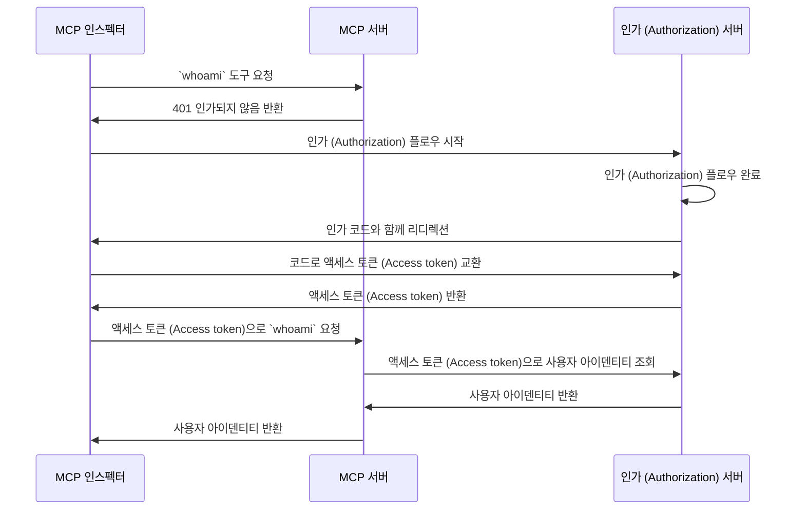

import TabItem from '@theme/TabItem';
import Tabs from '@theme/Tabs';

import SetupOauth from './_setup-oauth.mdx';
import SetupOidc from './_setup-oidc.mdx';

# 튜토리얼: 나는 누구인가? (Who am I?)

이 튜토리얼에서는 MCP Auth를 설정하여 사용자를 인증 (Authentication)하고 인가 (Authorization) 서버에서 아이덴티티 정보를 가져오는 과정을 안내합니다.

이 튜토리얼을 완료하면 다음을 얻게 됩니다:

- ✅ MCP Auth를 사용하여 사용자를 인증 (Authentication)하는 방법에 대한 기본적인 이해
- ✅ 사용자 아이덴티티 정보를 조회할 수 있는 MCP 서버

## 개요 (Overview) \{#overview}

이 튜토리얼에는 다음과 같은 구성 요소가 포함됩니다:

- **MCP 서버**: MCP 공식 SDK를 사용하여 요청을 처리하는 간단한 MCP 서버
- **MCP 인스펙터**: MCP 서버를 위한 시각적 테스트 도구. OAuth / OIDC 클라이언트 역할도 하여 인가 (Authorization) 플로우를 시작하고 액세스 토큰 (Access token)을 가져옵니다.
- **인가 (Authorization) 서버**: 사용자 아이덴티티를 관리하고 액세스 토큰 (Access token)을 발급하는 OAuth 2.1 또는 OpenID Connect 제공자

아래는 이 구성 요소들 간의 상호작용을 나타낸 고수준 다이어그램입니다:



## 인가 (Authorization) 서버 이해하기 \{#understand-your-authorization-server}

### 사용자 아이덴티티 정보 조회하기 \{#retrieving-user-identity-information}

이 튜토리얼을 완료하려면, 인가 (Authorization) 서버가 사용자 아이덴티티 정보를 조회할 수 있는 API를 제공해야 합니다:

<Tabs groupId="provider">
<TabItem value="logto" label="Logto">

[Logto](https://logto.io)는 표준 [userinfo 엔드포인트](https://openid.net/specs/openid-connect-core-1_0.html#UserInfo)를 지원하는 OpenID Connect 제공자입니다.

userinfo 엔드포인트에 접근할 수 있는 액세스 토큰 (Access token)을 얻으려면 최소 두 개의 스코프 (Scope), 즉 `openid`와 `profile`이 필요합니다. 스코프 설정은 아래에서 다루니 계속 읽어주세요.

</TabItem>
<TabItem value="keycloak" label="Keycloak">

[Keycloak](https://www.keycloak.org)은 OpenID Connect (OIDC)를 포함한 여러 프로토콜을 지원하는 오픈소스 아이덴티티 및 접근 관리 솔루션입니다. OIDC 제공자로서 표준 [userinfo 엔드포인트](https://openid.net/specs/openid-connect-core-1_0.html#UserInfo)를 구현하여 사용자 아이덴티티 정보를 조회할 수 있습니다.

userinfo 엔드포인트에 접근할 수 있는 액세스 토큰 (Access token)을 얻으려면 최소 두 개의 스코프 (Scope), 즉 `openid`와 `profile`이 필요합니다. 스코프 설정은 아래에서 다루니 계속 읽어주세요.

</TabItem>
<TabItem value="oidc" label="OIDC">

대부분의 OpenID Connect 제공자는 [userinfo 엔드포인트](https://openid.net/specs/openid-connect-core-1_0.html#UserInfo)를 지원하여 사용자 아이덴티티 정보를 조회할 수 있습니다.

제공자의 문서를 확인하여 이 엔드포인트를 지원하는지 확인하세요. 제공자가 [OpenID Connect Discovery](https://openid.net/specs/openid-connect-discovery-1_0.html)를 지원한다면, `.well-known/openid-configuration` 엔드포인트의 응답에서 `userinfo_endpoint`가 포함되어 있는지 확인할 수 있습니다.

userinfo 엔드포인트에 접근할 수 있는 액세스 토큰 (Access token)을 얻으려면 최소 두 개의 스코프 (Scope), 즉 `openid`와 `profile`이 필요합니다. 스코프와 사용자 아이덴티티 클레임 (Claim) 매핑은 제공자 문서를 참고하세요.

</TabItem>
<TabItem value="oauth" label="OAuth 2">

OAuth 2.0은 사용자 아이덴티티 정보를 조회하는 표준 방법을 정의하지 않지만, 많은 제공자가 자체 엔드포인트를 구현합니다. 액세스 토큰 (Access token)으로 사용자 아이덴티티 정보를 어떻게 조회하는지, 인가 (Authorization) 플로우에서 어떤 파라미터가 필요한지 제공자 문서를 확인하세요.

</TabItem>
</Tabs>

### 동적 클라이언트 등록 (Dynamic Client Registration) \{#dynamic-client-registration}

이 튜토리얼에서는 동적 클라이언트 등록이 필수는 아니지만, MCP 클라이언트 등록 과정을 자동화하고 싶다면 유용할 수 있습니다. 자세한 내용은 [동적 클라이언트 등록이 필요한가요?](../../provider-list.mdx#is-dcr-required) 를 참고하세요.

## MCP 서버 설정하기 \{#set-up-the-mcp-server}

[MCP 공식 SDK](https://github.com/modelcontextprotocol)를 사용하여 인가 (Authorization) 서버에서 사용자 아이덴티티 정보를 조회하는 `whoami` 도구가 포함된 MCP 서버를 만듭니다.

### 새 프로젝트 생성하기 \{#create-a-new-project}

<Tabs groupId="sdk">
<TabItem value="python" label="Python">

```bash
mkdir mcp-server
cd mcp-server
uv init # 또는 `pipenv`나 `poetry`로 새 가상환경 생성
```

</TabItem>
<TabItem value="node" label="Node.js">

새 Node.js 프로젝트를 설정하세요:

```bash
mkdir mcp-server
cd mcp-server
npm init -y # 또는 `pnpm init`
npm pkg set type="module"
npm pkg set main="whoami.js"
npm pkg set scripts.start="node whoami.js"
```

</TabItem>
</Tabs>

### MCP SDK 및 의존성 설치하기 \{#install-the-mcp-sdk-and-dependencies}

<Tabs groupId="sdk">
<TabItem value="python" label="Python">

```bash
pip install "mcp[cli]" starlette uvicorn
```

또는 `uv`, `poetry` 등 원하는 패키지 매니저를 사용하세요.

</TabItem>
<TabItem value="node" label="Node.js">

```bash
npm install @modelcontextprotocol/sdk express
```

또는 `pnpm`, `yarn` 등 원하는 패키지 매니저를 사용하세요.

</TabItem>
</Tabs>

### MCP 서버 만들기 \{#create-the-mcp-server}

먼저, `whoami` 도구를 구현하는 MCP 서버를 만듭니다.

<Tabs groupId="sdk">
<TabItem value="python" label="Python">

`whoami.py`라는 파일을 만들고 다음 코드를 추가하세요:

```python
from mcp.server.fastmcp import FastMCP
from starlette.applications import Starlette
from starlette.routing import Mount
from typing import Any

mcp = FastMCP("WhoAmI")

@mcp.tool()
def whoami() -> dict[str, Any]:
    """현재 사용자의 정보를 반환하는 도구입니다."""
    return {"error": "Not authenticated"}

app = Starlette(
    routes=[Mount('/', app=mcp.sse_app())]
)
```

서버 실행:

```bash
uvicorn whoami:app --host 0.0.0.0 --port 3001
```

</TabItem>
<TabItem value="node" label="Node.js">

:::note
현재 MCP 인스펙터 구현은 인가 (Authorization) 플로우를 처리하지 않으므로, SSE 방식을 사용해 MCP 서버를 설정합니다. MCP 인스펙터가 인가 (Authorization) 플로우를 지원하면 코드를 업데이트하겠습니다.
:::

`pnpm`이나 `yarn`도 사용할 수 있습니다.

`whoami.js`라는 파일을 만들고 다음 코드를 추가하세요:

```js
import { McpServer } from '@modelcontextprotocol/sdk/server/mcp.js';
import { SSEServerTransport } from '@modelcontextprotocol/sdk/server/sse.js';
import express from 'express';

// MCP 서버 생성
const server = new McpServer({
  name: 'WhoAmI',
  version: '0.0.0',
});

// 현재 사용자의 정보를 반환하는 도구 추가
server.tool('whoami', async () => {
  return {
    content: [{ type: 'text', text: JSON.stringify({ error: 'Not authenticated' }) }],
  };
});

// 아래는 MCP SDK 문서의 보일러플레이트 코드입니다
const PORT = 3001;
const app = express();

const transports = {};

app.get('/sse', async (_req, res) => {
  const transport = new SSEServerTransport('/messages', res);
  transports[transport.sessionId] = transport;

  res.on('close', () => {
    delete transports[transport.sessionId];
  });

  await server.connect(transport);
});

app.post('/messages', async (req, res) => {
  const sessionId = String(req.query.sessionId);
  const transport = transports[sessionId];
  if (transport) {
    await transport.handlePostMessage(req, res, req.body);
  } else {
    res.status(400).send('No transport found for sessionId');
  }
});

app.listen(PORT);
```

서버 실행:

```bash
npm start
```

</TabItem>
</Tabs>

## MCP 서버 점검하기 \{#inspect-the-mcp-server}

### MCP 인스펙터 클론 및 실행 \{#clone-and-run-mcp-inspector}

이제 MCP 서버가 실행 중이므로, MCP 인스펙터를 사용해 `whoami` 도구가 사용 가능한지 확인할 수 있습니다.

현재 구현의 한계로 인해, [MCP 인스펙터](https://github.com/mcp-auth/inspector)를 포크하여 인증 (Authentication) 및 인가 (Authorization)에 더 유연하고 확장 가능하도록 개선했습니다. 변경 사항을 원본 저장소에 PR로 제출했습니다.

MCP 인스펙터를 실행하려면 (Node.js 필요):

```bash
git clone https://github.com/mcp-auth/inspector.git
cd inspector
npm install
npm run dev
```

그런 다음 브라우저에서 `http://localhost:6274/` (또는 터미널에 표시된 URL)로 접속하여 MCP 인스펙터에 접근하세요.

### MCP 인스펙터를 MCP 서버에 연결하기 \{#connect-mcp-inspector-to-the-mcp-server}

진행하기 전에 MCP 인스펙터에서 다음 설정을 확인하세요:

- **Transport Type**: `SSE`로 설정
- **URL**: MCP 서버의 URL로 설정 (예: `http://localhost:3001/sse`)

이제 "Connect" 버튼을 클릭하여 MCP 인스펙터가 MCP 서버에 연결되는지 확인하세요. 정상적으로 연결되면 MCP 인스펙터에서 "Connected" 상태를 볼 수 있습니다.

### 체크포인트: `whoami` 도구 실행하기 \{#checkpoint-run-the-whoami-tool}

1. MCP 인스펙터 상단 메뉴에서 "Tools" 탭 클릭
2. "List Tools" 버튼 클릭
3. 페이지에 `whoami` 도구가 표시되어야 합니다. 클릭하여 도구 상세 보기
4. 우측에 "Run Tool" 버튼이 보입니다. 클릭하여 도구 실행
5. JSON 응답 `{"error": "Not authenticated"}`가 결과로 표시되어야 합니다.


## 인가 (Authorization) 서버와 통합하기 \{#integrate-with-your-authorization-server}

이 섹션을 완료하려면 다음 사항들을 고려해야 합니다:

<details>
<summary>**인가 (Authorization) 서버의 발급자 (Issuer) URL**</summary>

일반적으로 인가 (Authorization) 서버의 기본 URL입니다. 예: `https://auth.example.com`. 일부 제공자는 `https://example.logto.app/oidc`와 같이 경로가 포함될 수 있으니, 제공자 문서를 꼭 확인하세요.

</details>

<details>
<summary>**인가 (Authorization) 서버 메타데이터 조회 방법**</summary>

- 인가 (Authorization) 서버가 [OAuth 2.0 Authorization Server Metadata](https://datatracker.ietf.org/doc/html/rfc8414) 또는 [OpenID Connect Discovery](https://openid.net/specs/openid-connect-discovery-1_0.html)를 준수한다면, MCP Auth 내장 유틸리티로 메타데이터를 자동으로 가져올 수 있습니다.
- 준수하지 않는 경우, MCP 서버 설정에서 메타데이터 URL 또는 엔드포인트를 수동으로 지정해야 합니다. 제공자 문서에서 엔드포인트를 확인하세요.

</details>

<details>
<summary>**MCP 인스펙터를 인가 (Authorization) 서버에 클라이언트로 등록하는 방법**</summary>

- 인가 (Authorization) 서버가 [동적 클라이언트 등록](https://datatracker.ietf.org/doc/html/rfc7591)을 지원한다면, MCP 인스펙터가 자동으로 클라이언트로 등록되므로 이 단계를 건너뛸 수 있습니다.
- 지원하지 않는 경우, MCP 인스펙터를 인가 (Authorization) 서버에 수동으로 클라이언트로 등록해야 합니다.

</details>

<details>
<summary>**사용자 아이덴티티 정보 조회 및 인가 (Authorization) 요청 파라미터 설정 방법**</summary>

- OpenID Connect 제공자의 경우: 인가 (Authorization) 플로우 시작 시 최소 `openid`와 `profile` 스코프 (Scope)를 요청해야 합니다. 이렇게 하면 인가 (Authorization) 서버가 반환하는 액세스 토큰 (Access token)에 [userinfo 엔드포인트](https://openid.net/specs/openid-connect-core-1_0.html#UserInfo)에 접근할 수 있는 권한이 포함됩니다.

  참고: 일부 제공자는 userinfo 엔드포인트를 지원하지 않을 수 있습니다.

- OAuth 2.0 / OAuth 2.1 제공자의 경우: 액세스 토큰 (Access token)으로 사용자 아이덴티티 정보를 어떻게 조회하는지, 어떤 파라미터가 필요한지 제공자 문서를 확인하세요.

</details>

각 제공자마다 세부 요구사항이 다를 수 있지만, 아래 단계에 따라 MCP 인스펙터와 MCP 서버를 제공자별 설정으로 통합할 수 있습니다.

### MCP 인스펙터를 클라이언트로 등록하기 \{#register-mcp-inspector-as-a-client}

<Tabs groupId="provider">
<TabItem value="logto" label="Logto">

[Logto](https://logto.io)는 표준 [userinfo 엔드포인트](https://openid.net/specs/openid-connect-core-1_0.html#UserInfo)를 지원하는 OpenID Connect 제공자이므로 통합이 간단합니다.

Logto는 아직 동적 클라이언트 등록을 지원하지 않으므로, MCP 인스펙터를 Logto 테넌트에 수동으로 클라이언트로 등록해야 합니다:

1. MCP 인스펙터에서 "OAuth Configuration" 버튼을 클릭하고 **Redirect URL (자동 입력)** 값을 복사하세요. 예: `http://localhost:6274/oauth/callback`
2. [Logto Console](https://cloud.logto.io) (또는 자체 호스팅 Logto Console)에 로그인하세요.
3. "Applications" 탭에서 "Create application" 클릭. 페이지 하단에서 "Create app without framework" 클릭.
4. 애플리케이션 정보를 입력하고 "Create application" 클릭:
   - **Select an application type**: "Single-page application" 선택
   - **Application name**: 예: "MCP Inspector"
5. "Settings / Redirect URIs" 섹션에 복사한 **Redirect URL (자동 입력)** 값을 붙여넣고, 하단 바에서 "Save changes" 클릭
6. 상단 카드에서 "App ID" 값을 복사하세요.
7. MCP 인스펙터로 돌아가 "OAuth Configuration"의 "Client ID"에 "App ID" 값을 붙여넣으세요.
8. "Auth Params" 필드에 `{"scope": "openid profile email"}` 값을 입력하세요. 이렇게 하면 Logto가 반환하는 액세스 토큰 (Access token)에 userinfo 엔드포인트 접근에 필요한 스코프가 포함됩니다.

</TabItem>
<TabItem value="keycloak" label="Keycloak">

[Keycloak](https://www.keycloak.org)은 OpenID Connect 프로토콜을 지원하는 오픈소스 아이덴티티 및 접근 관리 솔루션입니다.

Keycloak은 동적 클라이언트 등록을 지원하지만, 클라이언트 등록 엔드포인트가 CORS를 지원하지 않아 대부분의 MCP 클라이언트가 직접 등록할 수 없습니다. 따라서 수동으로 클라이언트를 등록해야 합니다.

:::note
Keycloak은 [여러 방식](https://www.keycloak.org/guides#getting-started) (베어메탈, 쿠버네티스 등)으로 설치할 수 있지만, 이 튜토리얼에서는 Docker로 빠르게 설정합니다.
:::

Keycloak 인스턴스를 설정하고 구성해봅시다:

1. [공식 문서](https://www.keycloak.org/getting-started/getting-started-docker)를 참고하여 Docker로 Keycloak 인스턴스 실행:

```bash
docker run -p 8080:8080 -e KC_BOOTSTRAP_ADMIN_USERNAME=admin -e KC_BOOTSTRAP_ADMIN_PASSWORD=admin quay.io/keycloak/keycloak:26.2.4 start-dev
```

2. Keycloak Admin Console (http://localhost:8080/admin)에 접속하여 아래 계정으로 로그인:

   - Username: `admin`
   - Password: `admin`

3. 새 Realm 생성:

   - 좌측 상단 "Create Realm" 클릭
   - "Realm name"에 `mcp-realm` 입력
   - "Create" 클릭

4. 테스트 사용자 생성:

   - 좌측 메뉴 "Users" 클릭
   - "Create new user" 클릭
   - 사용자 정보 입력:
     - Username: `testuser`
     - First name, Last name은 임의 값
   - "Create" 클릭
   - "Credentials" 탭에서 비밀번호 설정, "Temporary" 해제

5. MCP 인스펙터를 클라이언트로 등록:

   - MCP 인스펙터에서 "OAuth Configuration" 버튼 클릭, **Redirect URL (자동 입력)** 값 복사 (예: `http://localhost:6274/oauth/callback`)
   - Keycloak Admin Console에서 좌측 "Clients" 클릭
   - "Create client" 클릭
   - 클라이언트 정보 입력:
     - Client type: "OpenID Connect" 선택
     - Client ID: `mcp-inspector` 입력
     - "Next" 클릭
   - "Capability config" 페이지:
     - "Standard flow" 활성화 확인
     - "Next" 클릭
   - "Login settings" 페이지:
     - "Valid redirect URIs"에 MCP 인스펙터 콜백 URL 붙여넣기
     - "Web origins"에 `http://localhost:6274` 입력
     - "Save" 클릭
   - "Client ID" (`mcp-inspector`) 복사

6. MCP 인스펙터로 돌아가서:
   - "OAuth Configuration"의 "Client ID" 필드에 복사한 Client ID 붙여넣기
   - "Auth Params" 필드에 아래 값 입력:

```json
{ "scope": "openid profile email" }
```

</TabItem>
<TabItem value="oidc" label="OIDC">

:::note
이 가이드는 일반적인 OpenID Connect 제공자 통합 안내입니다. 세부 사항은 제공자 문서를 참고하세요.
:::

OpenID Connect 제공자가 동적 클라이언트 등록을 지원한다면 아래 8번 단계로 바로 이동하여 MCP 인스펙터를 설정하세요. 그렇지 않으면 MCP 인스펙터를 수동으로 클라이언트로 등록해야 합니다:

1. MCP 인스펙터에서 "OAuth Configuration" 버튼 클릭, **Redirect URL (자동 입력)** 값 복사 (예: `http://localhost:6274/oauth/callback`)
2. OpenID Connect 제공자 콘솔에 로그인
3. "Applications" 또는 "Clients" 섹션에서 새 애플리케이션/클라이언트 생성
4. 클라이언트 타입이 필요하다면 "Single-page application" 또는 "Public client" 선택
5. 애플리케이션 생성 후, 리디렉션 URI에 MCP 인스펙터의 **Redirect URL (자동 입력)** 값 붙여넣기
6. 새로 생성된 애플리케이션의 "Client ID" 또는 "Application ID" 복사
7. MCP 인스펙터로 돌아가 "OAuth Configuration"의 "Client ID"에 붙여넣기
8. 표준 OpenID Connect 제공자의 경우, userinfo 엔드포인트 접근에 필요한 스코프를 요청하려면 "Auth Params" 필드에 아래 값 입력:

```json
{ "scope": "openid profile email" }
```

</TabItem>
<TabItem value="oauth" label="OAuth 2">

:::note
이 가이드는 일반적인 OAuth 2.0 / OAuth 2.1 제공자 통합 안내입니다. 세부 사항은 제공자 문서를 참고하세요.
:::

OAuth 2.0 / OAuth 2.1 제공자가 동적 클라이언트 등록을 지원한다면 아래 8번 단계로 바로 이동하여 MCP 인스펙터를 설정하세요. 그렇지 않으면 MCP 인스펙터를 수동으로 클라이언트로 등록해야 합니다:

1. MCP 인스펙터에서 "OAuth Configuration" 버튼 클릭, **Redirect URL (자동 입력)** 값 복사 (예: `http://localhost:6274/oauth/callback`)
2. OAuth 2.0 / OAuth 2.1 제공자 콘솔에 로그인
3. "Applications" 또는 "Clients" 섹션에서 새 애플리케이션/클라이언트 생성
4. 클라이언트 타입이 필요하다면 "Single-page application" 또는 "Public client" 선택
5. 애플리케이션 생성 후, 리디렉션 URI에 MCP 인스펙터의 **Redirect URL (자동 입력)** 값 붙여넣기
6. 새로 생성된 애플리케이션의 "Client ID" 또는 "Application ID" 복사
7. MCP 인스펙터로 돌아가 "OAuth Configuration"의 "Client ID"에 붙여넣기
8. 사용자 아이덴티티 정보 조회를 위한 액세스 토큰 (Access token) 발급 방법은 제공자 문서를 참고하세요. 예를 들어, `profile` 스코프가 필요하다면 "Auth Params" 필드에 아래 값 입력:

```json
{ "scope": "profile" }
```

</TabItem>
</Tabs>

### MCP Auth 설정하기 \{#set-up-mcp-auth}

MCP 서버 프로젝트에서 MCP Auth SDK를 설치하고 인가 (Authorization) 서버 메타데이터를 사용하도록 설정해야 합니다.

<Tabs groupId="sdk">
<TabItem value="python" label="Python">

먼저 `mcpauth` 패키지를 설치하세요:

```bash
pip install mcpauth
```

또는 `uv`, `poetry` 등 원하는 패키지 매니저를 사용하세요.

</TabItem>
<TabItem value="node" label="Node.js">

먼저 `mcp-auth` 패키지를 설치하세요:

```bash
npm install mcp-auth
```

</TabItem>
</Tabs>

MCP Auth는 인가 (Authorization) 서버 메타데이터가 필요합니다. 제공자에 따라 아래를 참고하세요:

<Tabs groupId="provider">

<TabItem value="logto" label="Logto">

발급자 (Issuer) URL은 Logto Console의 애플리케이션 상세 페이지 "Endpoints & Credentials / Issuer endpoint" 섹션에서 확인할 수 있습니다. 예: `https://my-project.logto.app/oidc`

<SetupOidc />

</TabItem>

<TabItem value="keycloak" label="Keycloak">

발급자 (Issuer) URL은 Keycloak Admin Console에서 'mcp-realm'의 "Realm settings / Endpoints" 섹션에서 "OpenID Endpoint Configuration" 링크를 클릭해 JSON 문서의 `issuer` 필드에서 확인할 수 있습니다. 예: `http://localhost:8080/realms/mcp-realm`

<SetupOidc />

</TabItem>

<TabItem value="oidc" label="OIDC">

아래 코드는 인가 (Authorization) 서버가 [userinfo 엔드포인트](https://openid.net/specs/openid-connect-core-1_0.html#UserInfo)를 지원한다고 가정합니다. 지원하지 않는 경우, 제공자 문서에서 엔드포인트를 확인하고 userinfo 엔드포인트 변수를 올바른 URL로 교체하세요.

<SetupOidc showAlternative />

</TabItem>
<TabItem value="oauth" label="OAuth 2">

앞서 언급했듯이, OAuth 2.0은 사용자 아이덴티티 정보를 조회하는 표준 방법을 정의하지 않습니다. 아래 코드는 제공자가 액세스 토큰 (Access token)으로 사용자 아이덴티티 정보를 조회할 수 있는 특정 엔드포인트를 제공한다고 가정합니다. 제공자 문서에서 엔드포인트를 확인하고 userinfo 엔드포인트 변수를 올바른 URL로 교체하세요.

<SetupOauth />

</TabItem>
</Tabs>

### MCP 서버 업데이트하기 \{#update-mcp-server}

거의 다 왔습니다! 이제 MCP Auth 라우트와 미들웨어를 적용하고, `whoami` 도구가 실제 사용자 아이덴티티 정보를 반환하도록 MCP 서버를 업데이트합니다.

<Tabs groupId="sdk">
<TabItem value="python" label="Python">

```python
@mcp.tool()
def whoami() -> dict[str, Any]:
    """현재 사용자의 정보를 반환하는 도구입니다."""
    return (
        mcp_auth.auth_info.claims
        if mcp_auth.auth_info # Bearer 인증 (Authentication) 미들웨어에서 채워집니다
        else {"error": "Not authenticated"}
    )

# ...

bearer_auth = Middleware(mcp_auth.bearer_auth_middleware(verify_access_token))
app = Starlette(
    routes=[
        # 메타데이터 라우트 추가 (`/.well-known/oauth-authorization-server`)
        mcp_auth.metadata_route(),
        # Bearer 인증 (Authentication) 미들웨어로 MCP 서버 보호
        Mount('/', app=mcp.sse_app(), middleware=[bearer_auth]),
    ],
)
```

</TabItem>
<TabItem value="node" label="Node.js">

```js
server.tool('whoami', ({ authInfo }) => {
  return {
    content: [
      { type: 'text', text: JSON.stringify(authInfo?.claims ?? { error: 'Not authenticated' }) },
    ],
  };
});

// ...

app.use(mcpAuth.delegatedRouter());
app.use(mcpAuth.bearerAuth(verifyToken));
```

</TabItem>
</Tabs>

## 체크포인트: 인증 (Authentication)과 함께 `whoami` 도구 실행하기 \{#checkpoint-run-the-whoami-tool-with-authentication}

MCP 서버를 재시작하고 MCP 인스펙터를 브라우저에서 엽니다. "Connect" 버튼을 클릭하면 인가 (Authorization) 서버의 로그인 페이지로 리디렉션됩니다.

로그인 후 MCP 인스펙터로 돌아오면, 이전 체크포인트에서 했던 것처럼 `whoami` 도구를 실행하세요. 이번에는 인가 (Authorization) 서버가 반환하는 사용자 아이덴티티 정보가 표시됩니다.


<Tabs groupId="sdk">
<TabItem value="python" label="Python">

:::info
[MCP Auth Python SDK 저장소](https://github.com/mcp-auth/python/blob/master/samples/server/whoami.py)에서 MCP 서버(OIDC 버전)의 전체 코드를 확인할 수 있습니다.
:::

</TabItem>
<TabItem value="node" label="Node.js">

:::info
[MCP Auth Node.js SDK 저장소](https://github.com/mcp-auth/js/blob/master/packages/sample-servers/src)에서 MCP 서버(OIDC 버전)의 전체 코드를 확인할 수 있습니다. 이 디렉터리에는 TypeScript 및 JavaScript 버전이 모두 포함되어 있습니다.
:::

</TabItem>
</Tabs>

## 마무리 (Closing notes) \{#closing-notes}

🎊 축하합니다! 튜토리얼을 성공적으로 완료하셨습니다. 지금까지 한 내용을 요약하면:

- `whoami` 도구가 포함된 기본 MCP 서버 설정
- MCP Auth를 사용하여 MCP 서버를 인가 (Authorization) 서버와 통합
- MCP 인스펙터를 설정하여 사용자 인증 (Authentication) 및 아이덴티티 정보 조회

추가로 다음과 같은 고급 주제도 탐구해보세요:

- 인증 (Authentication) 및 인가 (Authorization)에 [JWT (JSON Web Token)](https://auth.wiki/jwt) 사용
- 접근하는 리소스를 지정하기 위한 [리소스 지표 (Resource indicator, RFC 8707)](https://auth-wiki.logto.io/resource-indicator) 활용
- [역할 기반 접근 제어 (RBAC)](https://auth.wiki/rbac) 또는 [속성 기반 접근 제어 (ABAC)](https://auth.wiki/abac) 등 맞춤형 접근 제어 구현

MCP Auth를 최대한 활용하려면 다른 튜토리얼과 문서도 꼭 확인해보세요.
