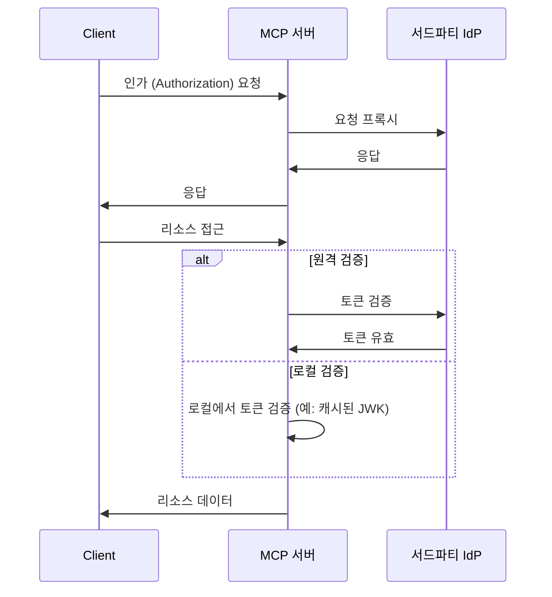
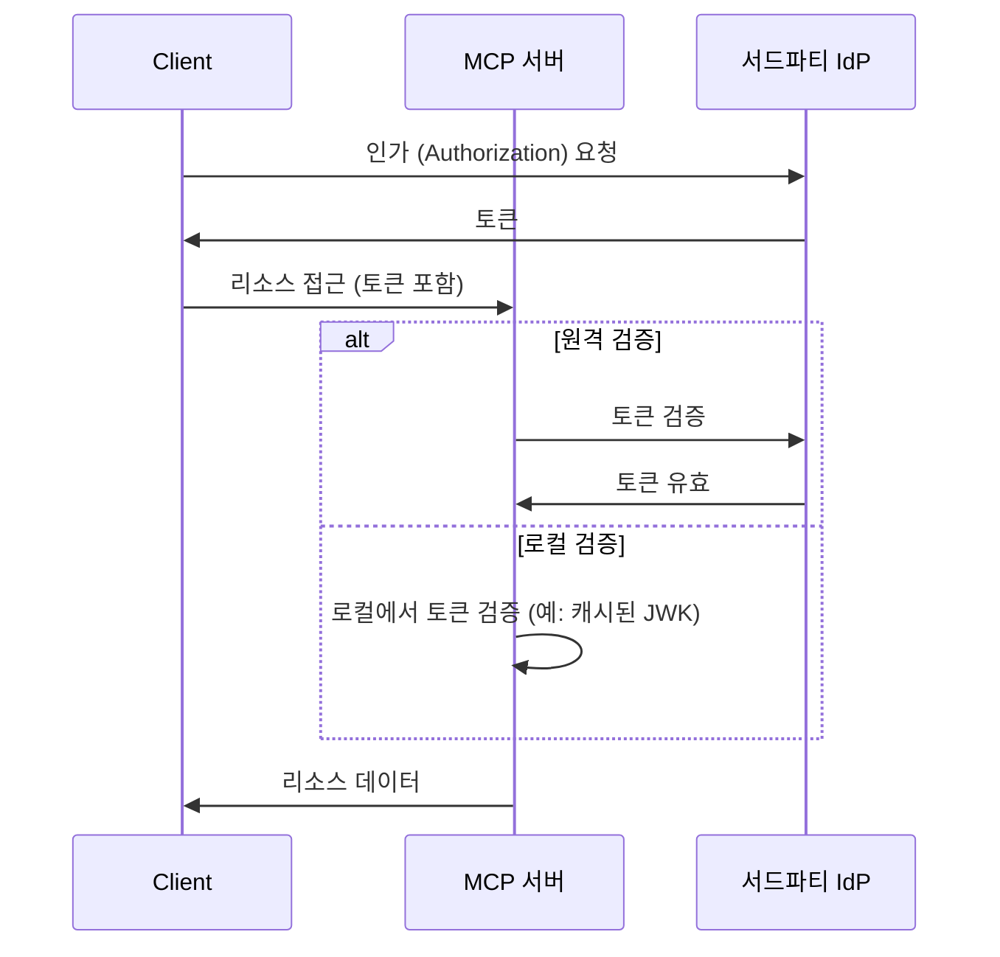

# MCP Auth와 기타 솔루션 중 선택하기

MCP 생태계는 진화하고 있습니다. Model Context Protocol (MCP) 명세가 “인가 서버” 방식에서 새로운 “리소스 서버 + 서드파티 아이덴티티 제공자 (IdP)” 모델로 이동함에 따라, 다양한 통합 솔루션이 현재와 미래에 어떻게 적합한지 이해하는 것이 중요합니다.

이 페이지에서는 mcp-auth와 다른 인기 있는 솔루션 간의 주요 차이점을 정리하여, 프로젝트에 가장 적합한 접근 방식을 선택할 수 있도록 돕습니다.

## 배경: 프록시 방식 vs. IdP 통합 \{#background-proxy-approach-vs-idp-integration}

대부분의 기존 MCP 인증 (Authentication) 솔루션은 “프록시 방식”을 사용합니다. 이 모델에서 MCP 서버는 인가 (Authorization) 요청을 서드파티 아이덴티티 제공자 (IdP)로 프록시하여, 클라이언트와 IdP 사이의 중개자 역할을 합니다.

**프록시 방식 ([03-26 명세](https://modelcontextprotocol.io/specification/2025-03-26/basic/authorization))**

이 방식은 현재 (2025-03-26) MCP 명세와 호환되지만, 본질적으로 우회 방법입니다. MCP 서버가 인가 (Authorization) 서버 역할도 한다는 전제에 기반하며, 이는 최신 초안 명세의 방향과는 다릅니다.

**MCP Auth / 미래 명세 (리소스 서버 + 서드파티 IdP)**

다가오는 MCP 명세는 [인가 (Authorization) 책임을 전담 서드파티 IdP로 이전합니다](https://github.com/modelcontextprotocol/modelcontextprotocol/issues/205). 이 모델에서 MCP 서버는 오직 리소스 서버 역할만 하며, 모든 인가 (Authorization) 엔드포인트는 서드파티 IdP에서 직접 제공합니다.

## 왜 MCP Auth를 선택해야 할까요? \{#why-choose-mcp-auth}

- 명세 일치: MCP Auth는 최신 초안의 방향을 직접 따르므로, 03-26 명세와 다가오는 명세 모두와 호환되는 유일한 솔루션입니다.
- 더 이상 우회 없음: 인가 (Authorization) 서버 프록시 역할 대신, MCP Auth는 새로운 명세 의도대로 모든 인가 (Authorization)을 서드파티 IdP가 처리하도록 합니다.
- 공급자 무관: MCP Auth는 표준을 준수하는 모든 OAuth 2.0 / OIDC 공급자와 함께 작동합니다.
- 원활한 전환: MCP Auth는 모든 서드파티 엔드포인트를 OAuth 2.0 인가 (Authorization) 서버 메타데이터를 통해 그대로 반환합니다. 덕분에 현재 통합이 간단하고, 미래 변화에도 준비되어 있습니다.
- 개발자 경험: 튜토리얼, 유틸리티, 그리고 [OAuth 2.0 보호 리소스 메타데이터](https://auth.wiki/protected-resource-metadata)와 같은 향후 기능을 제공하여 MCP 서버 개발자의 삶을 더 쉽게 만듭니다.

| 기능                                 | 프록시 솔루션         | MCP Auth |
| ------------------------------------ | --------------------- | -------- |
| 03-26 명세 지원                      | ✅                    | ✅       |
| 미래 명세 지원                       | ❌                    | ✅       |
| 서드파티 IdP 직접 지원               | ❌ (우회만 가능)      | ✅       |
| 공급자 무관                          | 제한적[^1]            | 예       |
| 전환 준비                            | ❌                    | ✅       |

지금 서드파티 IdP 지원이 필요하고, 다가오는 명세에도 대비하고 싶다면 MCP Auth가 권장 솔루션입니다. 프록시 기반 접근 방식은 곧 사용 중단되거나 대대적인 재작업이 필요할 수 있습니다.

[^1]: 일부 프록시 솔루션은 특정 파라미터나 엔드포인트를 하드코딩하여 유연성이 제한될 수 있습니다.
