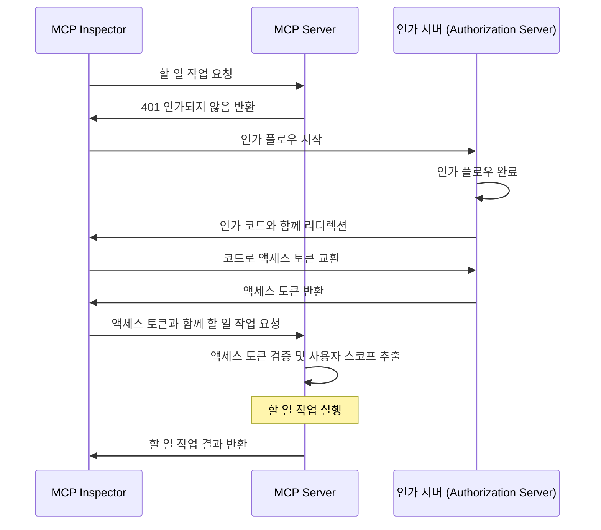
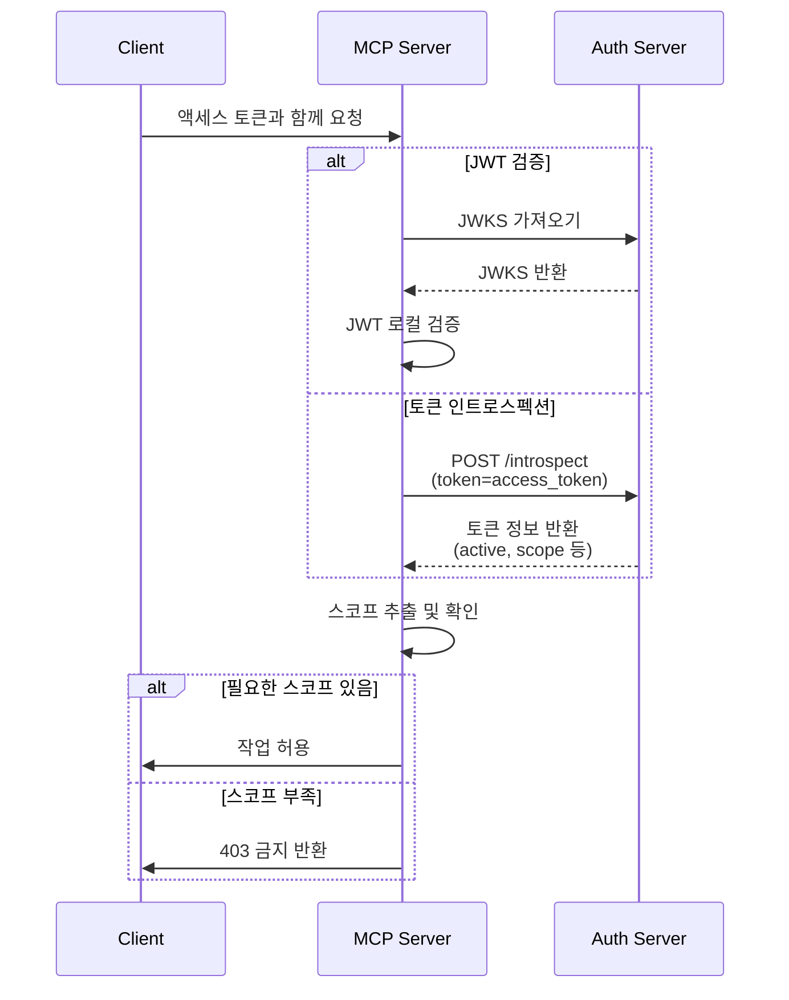

import TabItem from '@theme/TabItem';
import Tabs from '@theme/Tabs';

import SetupOauthOrOidc from './_setup-oauth-or-oidc.mdx';
import SetupOidc from './_setup-oidc.mdx';

# 튜토리얼: 할 일 관리 앱 만들기 (Tutorial: Build a todo manager)

이 튜토리얼에서는 사용자 인증 (Authentication) 및 인가 (Authorization)가 적용된 todo manager MCP 서버를 만들어봅니다.

이 튜토리얼을 완료하면 다음을 얻게 됩니다:

- ✅ MCP 서버에서 역할 기반 접근 제어 (RBAC)에 대한 기본적인 이해
- ✅ 개인 할 일 목록을 관리할 수 있는 MCP 서버

:::note
시작하기 전에, MCP 서버와 OAuth 2에 익숙하지 않다면 [Who am I 튜토리얼](./whoami)을 먼저 진행하는 것을 강력히 권장합니다.
:::

## 개요 (Overview) \{#overview}

이 튜토리얼에는 다음과 같은 구성 요소가 포함됩니다:

- **MCP 서버**: MCP 공식 SDK를 사용하여 요청을 처리하고, 사용자의 할 일 항목을 관리하는 Todo 서비스를 통합한 간단한 MCP 서버
- **MCP inspector**: MCP 서버를 시각적으로 테스트할 수 있는 도구. OAuth / OIDC 클라이언트 역할도 하여 인가 플로우를 시작하고 액세스 토큰을 가져옵니다.
- **인가 서버 (Authorization server)**: 사용자 아이덴티티를 관리하고 액세스 토큰을 발급하는 OAuth 2.1 또는 OpenID Connect 제공자

아래는 이 구성 요소들 간의 상호작용을 나타낸 고수준 다이어그램입니다:



## 인가 서버 이해하기 (Understand your authorization server) \{#understand-your-authorization-server}

### 스코프가 포함된 액세스 토큰 (Access tokens with scopes) \{#access-tokens-with-scopes}

[MCP 서버에서 역할 기반 접근 제어 (RBAC)](https://auth.wiki/rbac)를 구현하려면, 인가 서버가 스코프가 포함된 액세스 토큰 발급을 지원해야 합니다. 스코프는 사용자가 부여받은 권한을 나타냅니다.

<Tabs groupId="provider">
<TabItem value="logto" label="Logto">

[Logto](https://logto.io)는 API 리소스([RFC 8707: OAuth 2.0을 위한 리소스 지표](https://datatracker.ietf.org/doc/html/rfc8707)) 및 역할 기능을 통해 RBAC를 지원합니다. 설정 방법은 다음과 같습니다:

1. [Logto Console](https://cloud.logto.io) (또는 자체 호스팅 Logto Console)에 로그인하세요.

2. API 리소스 및 스코프 생성:

   - "API Resources"로 이동
   - "Todo Manager"라는 새 API 리소스 생성
   - 다음 스코프 추가:
     - `create:todos`: "새 할 일 항목 생성"
     - `read:todos`: "모든 할 일 항목 읽기"
     - `delete:todos`: "모든 할 일 항목 삭제"

3. 역할 생성(관리를 쉽게 하기 위해 권장):

   - "Roles"로 이동
   - "Admin" 역할을 생성하고 모든 스코프(`create:todos`, `read:todos`, `delete:todos`) 할당
   - "User" 역할을 생성하고 `create:todos` 스코프만 할당

4. 권한 할당:
   - "Users"로 이동
   - 사용자를 선택
   - "Roles" 탭에서 역할을 할당(권장)
   - 또는 "Permissions" 탭에서 직접 스코프 할당

스코프는 JWT 액세스 토큰의 `scope` 클레임에 공백으로 구분된 문자열로 포함됩니다.

</TabItem>
<TabItem value="oauth-oidc" label="OAuth 2.0 / OIDC">

OAuth 2.0 / OIDC 제공자는 일반적으로 스코프 기반 접근 제어를 지원합니다. RBAC를 구현할 때:

1. 인가 서버에서 필요한 스코프 정의
2. 클라이언트가 인가 플로우 중에 이 스코프를 요청하도록 구성
3. 인가 서버가 부여된 스코프를 액세스 토큰에 포함하는지 확인
4. 스코프는 보통 JWT 액세스 토큰의 `scope` 클레임에 포함됨

스코프 정의 및 관리 방법, 액세스 토큰에 스코프가 포함되는 방식, 역할 관리 등 추가 RBAC 기능은 제공자 문서를 참고하세요.

</TabItem>
</Tabs>

### 토큰 검증 및 권한 확인 (Validating tokens and checking permissions) \{#validating-tokens-and-checking-permissions}

MCP 서버가 요청을 받으면 다음을 수행해야 합니다:

1. 액세스 토큰의 서명 및 만료 검증
2. 검증된 토큰에서 스코프 추출
3. 요청된 작업에 필요한 스코프가 토큰에 포함되어 있는지 확인

예를 들어, 사용자가 새 할 일 항목을 생성하려면 액세스 토큰에 `create:todos` 스코프가 포함되어 있어야 합니다. 플로우는 다음과 같습니다:



### 동적 클라이언트 등록 (Dynamic Client Registration) \{#dynamic-client-registration}

이 튜토리얼에서는 동적 클라이언트 등록이 필수는 아니지만, 인가 서버에 MCP 클라이언트 등록을 자동화하고 싶다면 유용할 수 있습니다. 자세한 내용은 [동적 클라이언트 등록이 필요한가요?](../../provider-list#is-dcr-required)를 참고하세요.

## 할 일 관리 앱에서 RBAC 이해하기 (Understand RBAC in todo manager) \{#understand-rbac-in-todo-manager}

데모 목적상, todo manager MCP 서버에 간단한 역할 기반 접근 제어 (RBAC) 시스템을 구현합니다. 이를 통해 RBAC의 기본 원리를 쉽게 이해할 수 있습니다.

:::note
이 튜토리얼은 RBAC 기반 스코프 관리를 시연하지만, 모든 인증 (Authentication) 제공자가 역할을 통한 스코프 관리를 구현하는 것은 아닙니다. 일부 제공자는 자체적인 접근 제어 및 권한 관리 방식을 가질 수 있습니다.
:::

### 도구와 스코프 (Tools and scopes) \{#tools-and-scopes}

todo manager MCP 서버는 세 가지 주요 도구를 제공합니다:

- `create-todo`: 새 할 일 항목 생성
- `get-todos`: 모든 할 일 목록 조회
- `delete-todo`: ID로 할 일 삭제

이 도구들에 대한 접근을 제어하기 위해 다음과 같은 스코프를 정의합니다:

- `create:todos`: 새 할 일 항목 생성 허용
- `delete:todos`: 기존 할 일 항목 삭제 허용
- `read:todos`: 모든 할 일 목록 조회 및 검색 허용

### 역할과 권한 (Roles and permissions) \{#roles-and-permissions}

접근 수준이 다른 두 가지 역할을 정의합니다:

| 역할 (Role) | create:todos | read:todos | delete:todos |
| ----------- | ------------ | ---------- | ------------ |
| Admin       | ✅           | ✅         | ✅           |
| User        | ✅           |            |              |

- **User**: 자신의 할 일만 생성, 조회, 삭제할 수 있는 일반 사용자
- **Admin**: 모든 할 일을 생성, 조회, 삭제할 수 있는 관리자

### 리소스 소유권 (Resource ownership) \{#resource-ownership}

위의 권한 테이블은 각 역할에 명시적으로 할당된 스코프를 보여주지만, 리소스 소유권이라는 중요한 원칙이 있습니다:

- **User**는 `read:todos` 또는 `delete:todos` 스코프가 없지만,
  - 자신의 할 일 항목은 읽을 수 있고
  - 자신의 할 일 항목은 삭제할 수 있습니다.
- **Admin**은 전체 권한(`read:todos`, `delete:todos`)을 가지므로,
  - 시스템의 모든 할 일 항목을 볼 수 있고
  - 소유자와 관계없이 모든 할 일 항목을 삭제할 수 있습니다.

이는 RBAC 시스템에서 리소스 소유권이 사용자의 자신의 리소스에 대한 암묵적 권한을 부여하고, 관리자는 모든 리소스에 대한 명시적 권한을 받는 일반적인 패턴을 보여줍니다.

:::tip 더 알아보기
RBAC 개념과 모범 사례를 더 깊이 이해하려면 [Mastering RBAC: A Comprehensive Real-World Example](https://blog.logto.io/mastering-rbac)을 참고하세요.
:::

## 제공자에서 인가 설정하기 (Configure authorization in your provider) \{#configure-authorization-in-your-provider}

앞서 설명한 접근 제어 시스템을 구현하려면, 인가 서버에서 필요한 스코프를 지원하도록 설정해야 합니다. 제공자별 설정 방법은 다음과 같습니다:

<Tabs groupId="provider">
<TabItem value="logto" label="Logto">

[Logto](https://logto.io)는 API 리소스와 역할 기능을 통해 RBAC를 지원합니다. 설정 방법은 다음과 같습니다:

1. [Logto Console](https://cloud.logto.io) (또는 자체 호스팅 Logto Console)에 로그인하세요.

2. API 리소스 및 스코프 생성:

   - "API Resources"로 이동
   - "Todo Manager"라는 새 API 리소스를 생성하고, 인디케이터로 `https://todo.mcp-server.app`(데모 목적)를 사용하세요.
   - 다음 스코프 생성:
     - `create:todos`: "새 할 일 항목 생성"
     - `read:todos`: "모든 할 일 항목 읽기"
     - `delete:todos`: "모든 할 일 항목 삭제"

3. 역할 생성(관리를 쉽게 하기 위해 권장):

   - "Roles"로 이동
   - "Admin" 역할을 생성하고 모든 스코프(`create:todos`, `read:todos`, `delete:todos`) 할당
   - "User" 역할을 생성하고 `create:todos` 스코프만 할당
   - "User" 역할 상세 페이지에서 "General" 탭으로 이동하여 "Default role"로 설정

4. 사용자 역할 및 권한 관리:
   - 신규 사용자:
     - "User" 역할이 기본 역할로 자동 할당됨
   - 기존 사용자:
     - "User management"로 이동
     - 사용자를 선택
     - "Roles" 탭에서 역할 할당

:::tip 프로그래밍 방식의 역할 관리
Logto의 [Management API](https://docs.logto.io/integrate-logto/interact-with-management-api)를 사용하여 프로그래밍 방식으로 사용자 역할을 관리할 수 있습니다. 자동화된 사용자 관리나 관리자 패널 구축 시 유용합니다.
:::

액세스 토큰을 요청할 때, Logto는 사용자 역할 권한에 따라 토큰의 `scope` 클레임에 스코프를 포함합니다.

</TabItem>
<TabItem value="keycloak" label="Keycloak">

[Keycloak](https://www.keycloak.org)에서는 클라이언트 스코프를 사용하여 필요한 권한을 설정할 수 있습니다:

1. 클라이언트 스코프 생성:

   - Realm에서 "Client scopes"로 이동
   - 세 개의 클라이언트 스코프 생성:
     - `create:todos`
     - `read:todos`
     - `delete:todos`

2. 클라이언트 구성:

   - 클라이언트 설정으로 이동
   - "Client scopes" 탭에서 생성한 모든 스코프 추가
   - 토큰 매퍼가 스코프를 포함하도록 설정

3. 선택 사항: 역할을 통한 관리
   - 역할 기반 관리가 필요하다면:
     - 접근 수준별로 Realm 역할 생성
     - 스코프를 역할에 매핑
     - 역할을 사용자에게 할당
   - 그렇지 않으면, 스코프를 사용자에게 직접 할당하거나 클라이언트 수준 권한을 통해 할당

Keycloak은 부여된 스코프를 액세스 토큰의 `scope` 클레임에 포함합니다.

</TabItem>
<TabItem value="oauth-or-oidc" label="OAuth 2 / OIDC">

OAuth 2.0 또는 OpenID Connect 제공자의 경우, 다양한 권한을 나타내는 스코프를 구성해야 합니다. 구체적인 단계는 제공자마다 다르지만, 일반적으로:

1. 스코프 정의:

   - 인가 서버에서 다음을 지원하도록 구성:
     - `create:todos`
     - `read:todos`
     - `delete:todos`

2. 클라이언트 구성:

   - 클라이언트를 등록하거나 업데이트하여 이 스코프를 요청하도록 설정
   - 스코프가 액세스 토큰에 포함되는지 확인

3. 권한 할당:
   - 제공자 인터페이스를 사용하여 사용자에게 적절한 스코프 부여
   - 일부 제공자는 역할 기반 관리, 일부는 직접 스코프 할당을 지원
   - 권장 접근 방식은 제공자 문서를 참고

:::tip
대부분의 제공자는 부여된 스코프를 액세스 토큰의 `scope` 클레임에 포함합니다. 형식은 일반적으로 공백으로 구분된 스코프 값 문자열입니다.
:::

</TabItem>
</Tabs>

인가 서버를 설정한 후, 사용자는 부여된 스코프가 포함된 액세스 토큰을 받게 됩니다. MCP 서버는 이 스코프를 사용하여 다음을 판단합니다:

- 사용자가 새 할 일을 생성할 수 있는지 (`create:todos`)
- 사용자가 모든 할 일을 볼 수 있는지 (`read:todos`) 또는 자신의 할 일만 볼 수 있는지
- 사용자가 모든 할 일을 삭제할 수 있는지 (`delete:todos`) 또는 자신의 할 일만 삭제할 수 있는지

## MCP 서버 설정하기 (Set up the MCP server) \{#set-up-the-mcp-server}

[MCP 공식 SDK](https://github.com/modelcontextprotocol)를 사용하여 todo manager MCP 서버를 만듭니다.

### 새 프로젝트 생성 (Create a new project) \{#create-a-new-project}

<Tabs groupId="sdk">
<TabItem value="python" label="Python">

```bash
mkdir mcp-server
cd mcp-server
uv init # 또는 `pipenv` 또는 `poetry`로 새 가상환경 생성
```

</TabItem>
<TabItem value="node" label="Node.js">

새 Node.js 프로젝트를 설정하세요:

```bash
mkdir mcp-server
cd mcp-server
npm init -y # 또는 `pnpm init`
npm pkg set type="module"
npm pkg set main="todo-manager.ts"
npm pkg set scripts.start="node --experimental-strip-types todo-manager.ts"
```

:::note
예제에서는 Node.js v22.6.0+에서 `--experimental-strip-types` 플래그로 TypeScript를 네이티브로 실행할 수 있으므로 TypeScript를 사용합니다. JavaScript를 사용할 경우 코드가 유사하며, Node.js v22.6.0 이상을 사용해야 합니다. 자세한 내용은 Node.js 문서를 참고하세요.
:::

</TabItem>
</Tabs>

### MCP SDK 및 의존성 설치 (Install the MCP SDK and dependencies) \{#install-the-mcp-sdk-and-dependencies}

<Tabs groupId="sdk">
<TabItem value="python" label="Python">

```bash
pip install "mcp[cli]" starlette uvicorn
```

또는 `uv`, `poetry` 등 원하는 패키지 매니저를 사용할 수 있습니다.

</TabItem>
<TabItem value="node" label="Node.js">

```bash
npm install @modelcontextprotocol/sdk express zod
```

또는 `pnpm`, `yarn` 등 원하는 패키지 매니저를 사용할 수 있습니다.

</TabItem>
</Tabs>

### MCP 서버 만들기 (Create the MCP server) \{#create-the-mcp-server}

먼저, 도구 정의가 포함된 기본 MCP 서버를 만듭니다:

<Tabs groupId="sdk">
<TabItem value="python" label="Python">

`todo-manager.py` 파일을 만들고 다음 코드를 추가하세요:

```python
from typing import Any
from mcp.server.fastmcp import FastMCP
from starlette.applications import Starlette
from starlette.routing import Mount

mcp = FastMCP("Todo Manager")

@mcp.tool()
def create_todo(content: str) -> dict[str, Any]:
    """새 할 일 생성."""
    return {"error": "Not implemented"}

@mcp.tool()
def get_todos() -> dict[str, Any]:
    """모든 할 일 목록 조회."""
    return {"error": "Not implemented"}

@mcp.tool()
def delete_todo(id: str) -> dict[str, Any]:
    """ID로 할 일 삭제."""
    return {"error": "Not implemented"}

app = Starlette(
    routes=[Mount('/', app=mcp.sse_app())]
)
```

서버 실행:

```bash
uvicorn todo_manager:app --host 0.0.0.0 --port 3001
```

</TabItem>
<TabItem value="node" label="Node.js">

:::note
현재 MCP inspector 구현은 인가 플로우를 처리하지 않으므로, SSE 방식을 사용하여 MCP 서버를 설정합니다. MCP inspector가 인가 플로우를 지원하면 코드를 업데이트할 예정입니다.
:::

`pnpm` 또는 `yarn`도 사용할 수 있습니다.

`todo-manager.ts` 파일을 만들고 다음 코드를 추가하세요:

```ts
// todo-manager.ts

import { z } from 'zod';
import { McpServer } from '@modelcontextprotocol/sdk/server/mcp.js';
import { SSEServerTransport } from '@modelcontextprotocol/sdk/server/sse.js';
import express from 'express';

// MCP 서버 생성
const server = new McpServer({
  name: 'Todo Manager',
  version: '0.0.0',
});

server.tool('create-todo', '새 할 일 생성', { content: z.string() }, async ({ content }) => {
  return {
    content: [{ type: 'text', text: JSON.stringify({ error: 'Not implemented' }) }],
  };
});

server.tool('get-todos', '모든 할 일 목록 조회', async () => {
  return {
    content: [{ type: 'text', text: JSON.stringify({ error: 'Not implemented' }) }],
  };
});

server.tool('delete-todo', 'ID로 할 일 삭제', { id: z.string() }, async ({ id }) => {
  return {
    content: [{ type: 'text', text: JSON.stringify({ error: 'Not implemented' }) }],
  };
});

// 아래는 MCP SDK 문서의 보일러플레이트 코드
const PORT = 3001;
const app = express();

const transports = {};

app.get('/sse', async (_req, res) => {
  const transport = new SSEServerTransport('/messages', res);
  transports[transport.sessionId] = transport;

  res.on('close', () => {
    delete transports[transport.sessionId];
  });

  await server.connect(transport);
});

app.post('/messages', async (req, res) => {
  const sessionId = String(req.query.sessionId);
  const transport = transports[sessionId];
  if (transport) {
    await transport.handlePostMessage(req, res, req.body);
  } else {
    res.status(400).send('No transport found for sessionId');
  }
});

app.listen(PORT);
```

서버 실행:

```bash
npm start
```

</TabItem>
</Tabs>

## MCP 서버 검사하기 (Inspect the MCP server) \{#inspect-the-mcp-server}

### MCP inspector 클론 및 실행 (Clone and run MCP inspector) \{#clone-and-run-mcp-inspector}

이제 MCP 서버가 실행 중이므로, MCP inspector를 사용하여 `whoami` 도구가 사용 가능한지 확인할 수 있습니다.

현재 구현의 한계로 인해, [MCP inspector](https://github.com/mcp-auth/inspector)를 포크하여 인증 (Authentication) 및 인가 (Authorization)에 더 유연하고 확장 가능하도록 개선했습니다. 변경 사항을 원본 저장소에 PR로 제출했습니다.

MCP inspector를 실행하려면 다음 명령어를 사용하세요(Node.js 필요):

```bash
git clone https://github.com/mcp-auth/inspector.git
cd inspector
npm install
npm run dev
```

그런 다음 브라우저에서 `http://localhost:6274/` (또는 터미널에 표시된 URL)로 접속하여 MCP inspector에 접근하세요.

### MCP inspector를 MCP 서버에 연결 (Connect MCP inspector to the MCP server) \{#connect-mcp-inspector-to-the-mcp-server}

진행하기 전에 MCP inspector에서 다음 설정을 확인하세요:

- **Transport Type**: `SSE`로 설정
- **URL**: MCP 서버의 URL로 설정. 여기서는 `http://localhost:3001/sse`가 됩니다.

이제 "Connect" 버튼을 클릭하여 MCP inspector가 MCP 서버에 연결되는지 확인하세요. 정상적으로 연결되면 MCP inspector에서 "Connected" 상태를 볼 수 있습니다.

### 체크포인트: 할 일 관리 도구 실행 (Checkpoint: Run todo manager tools) \{#checkpoint-run-todo-manager-tools}

1. MCP inspector 상단 메뉴에서 "Tools" 탭 클릭
2. "List Tools" 버튼 클릭
3. `create-todo`, `get-todos`, `delete-todo` 도구가 페이지에 표시됩니다. 클릭하여 도구 상세 보기
4. 우측에 "Run Tool" 버튼이 보입니다. 클릭 후 필요한 파라미터 입력하여 도구 실행
5. JSON 응답 `{"error": "Not implemented"}`와 함께 도구 결과가 표시됩니다.


## 인가 서버와 통합 (Integrate with your authorization server) \{#integrate-with-your-authorization-server}

이 섹션을 완료하려면 다음 사항을 고려해야 합니다:

<details>
<summary>**인가 서버의 발급자 URL (issuer URL)**</summary>

일반적으로 인가 서버의 기본 URL입니다. 예: `https://auth.example.com`. 일부 제공자는 `https://example.logto.app/oidc`와 같이 경로가 포함될 수 있으니, 제공자 문서를 꼭 확인하세요.

</details>

<details>
<summary>**인가 서버 메타데이터 가져오기 방법**</summary>

- 인가 서버가 [OAuth 2.0 Authorization Server Metadata](https://datatracker.ietf.org/doc/html/rfc8414) 또는 [OpenID Connect Discovery](https://openid.net/specs/openid-connect-discovery-1_0.html)를 준수한다면, MCP Auth 내장 유틸리티로 자동으로 메타데이터를 가져올 수 있습니다.
- 준수하지 않는 경우, MCP 서버 설정에서 메타데이터 URL 또는 엔드포인트를 수동으로 지정해야 합니다. 제공자 문서에서 엔드포인트를 확인하세요.

</details>

<details>
<summary>**MCP inspector를 인가 서버에 클라이언트로 등록하는 방법**</summary>

- 인가 서버가 [Dynamic Client Registration](https://datatracker.ietf.org/doc/html/rfc7591)을 지원한다면, MCP inspector가 자동으로 클라이언트로 등록되므로 이 단계를 건너뛸 수 있습니다.
- 지원하지 않는 경우, MCP inspector를 인가 서버에 수동으로 클라이언트로 등록해야 합니다.

</details>

<details>
<summary>**토큰 요청 파라미터 이해하기**</summary>

인가 서버에서 액세스 토큰을 요청할 때, 대상 리소스와 권한을 지정하는 다양한 방식이 있습니다. 주요 패턴은 다음과 같습니다:

- **리소스 지표 기반**:

  - `resource` 파라미터로 대상 API 지정([RFC 8707: OAuth 2.0을 위한 리소스 지표](https://datatracker.ietf.org/doc/html/rfc8707) 참고)
  - 최신 OAuth 2.0 구현에서 일반적
  - 예시 요청:
    ```json
    {
      "resource": "https://todo.mcp-server.app",
      "scope": "create:todos read:todos"
    }
    ```
  - 서버는 요청된 리소스에 바인딩된 토큰을 발급

- **Audience 기반**:

  - `audience` 파라미터로 토큰 수신자 지정
  - 리소스 지표와 유사하지만 의미가 다름
  - 예시 요청:
    ```json
    {
      "audience": "todo-api",
      "scope": "create:todos read:todos"
    }
    ```

- **순수 스코프 기반**:
  - 리소스/audience 파라미터 없이 스코프만 사용
  - 전통적인 OAuth 2.0 방식
  - 예시 요청:
    ```json
    {
      "scope": "todo-api:create todo-api:read openid profile"
    }
    ```
  - 권한 네임스페이스를 위해 접두어 스코프 사용
  - 간단한 OAuth 2.0 구현에서 일반적

:::tip 모범 사례

- 제공자 문서에서 지원되는 파라미터 확인
- 일부 제공자는 여러 방식을 동시에 지원
- 리소스 지표는 audience 제한을 통해 보안 강화
- 가능하다면 리소스 지표 사용을 권장
  :::

</details>

각 제공자마다 세부 요구사항이 다를 수 있지만, 아래 단계는 MCP inspector와 MCP 서버를 제공자별 설정과 통합하는 과정을 안내합니다.

### MCP inspector를 클라이언트로 등록 (Register MCP inspector as a client) \{#register-mcp-inspector-as-a-client}

<Tabs groupId="provider">
<TabItem value="logto" label="Logto">

[Logto](https://logto.io)는 OpenID Connect 제공자로, 리소스 지표와 스코프를 지원하므로 `https://todo.mcp-server.app`를 리소스 지표로 사용하여 todo API를 안전하게 보호할 수 있습니다.

Logto는 아직 동적 클라이언트 등록을 지원하지 않으므로, MCP inspector를 Logto 테넌트에 수동으로 클라이언트로 등록해야 합니다:

1. MCP inspector를 열고 "OAuth Configuration" 버튼을 클릭하세요. **Redirect URL (auto-populated)** 값을 복사합니다(예: `http://localhost:6274/oauth/callback`).
2. [Logto Console](https://cloud.logto.io) (또는 자체 호스팅 Logto Console)에 로그인하세요.
3. "Applications" 탭으로 이동, "Create application" 클릭. 페이지 하단에서 "Create app without framework" 클릭.
4. 애플리케이션 세부 정보 입력 후 "Create application" 클릭:
   - **Select an application type**: "Single-page application" 선택
   - **Application name**: 예: "MCP Inspector"
5. "Settings / Redirect URIs" 섹션에서 복사한 **Redirect URL (auto-populated)** 값을 붙여넣고, 하단 바에서 "Save changes" 클릭
6. 상단 카드에서 "App ID" 값을 복사
7. MCP inspector로 돌아가 "OAuth Configuration"의 "Client ID"에 "App ID" 값 붙여넣기
8. "Auth Params" 필드에 `{"scope": "create:todos read:todos delete:todos", "resource": "https://todo.mcp-server.app"}` 입력. Logto가 todo manager에 필요한 스코프가 포함된 액세스 토큰을 반환하도록 합니다.

</TabItem>
<TabItem value="oauth-oidc" label="OAuth 2.0 / OIDC">

:::note
이 가이드는 일반적인 OAuth 2.0 / OpenID Connect 제공자 통합 가이드입니다. OIDC는 OAuth 2.0 위에 구축되어 있으므로 두 방식 모두 유사한 단계를 따릅니다. 구체적인 내용은 제공자 문서를 참고하세요.
:::

제공자가 동적 클라이언트 등록을 지원한다면 아래 8번 단계로 바로 이동하여 MCP inspector를 설정하세요. 그렇지 않으면 MCP inspector를 수동으로 클라이언트로 등록해야 합니다:

1. MCP inspector를 열고 "OAuth Configuration" 버튼을 클릭하세요. **Redirect URL (auto-populated)** 값을 복사합니다(예: `http://localhost:6274/oauth/callback`).

2. 제공자 콘솔에 로그인하세요.

3. "Applications" 또는 "Clients" 섹션으로 이동, 새 애플리케이션 또는 클라이언트 생성

4. 클라이언트 유형을 요구하는 경우 "Single-page application" 또는 "Public client" 선택

5. 애플리케이션 생성 후, 리디렉션 URI를 설정해야 합니다. MCP inspector에서 복사한 **Redirect URL (auto-populated)** 값을 붙여넣으세요.

6. 새로 생성된 애플리케이션의 "Client ID" 또는 "Application ID"를 찾아 복사

7. MCP inspector로 돌아가 "OAuth Configuration"의 "Client ID"에 붙여넣기

8. "Auth Params" 필드에 다음 값을 입력하여 todo 작업에 필요한 스코프를 요청하세요:

```json
{ "scope": "create:todos read:todos delete:todos" }
```

</TabItem>
</Tabs>

### MCP Auth 설정 (Set up MCP auth) \{#set-up-mcp-auth}

MCP 서버 프로젝트에서 MCP Auth SDK를 설치하고, 인가 서버 메타데이터를 사용하도록 구성해야 합니다.

<Tabs groupId="sdk">
<TabItem value="python" label="Python">

먼저 `mcpauth` 패키지를 설치하세요:

```bash
pip install mcpauth
```

또는 `uv`, `poetry` 등 원하는 패키지 매니저를 사용할 수 있습니다.

</TabItem>
<TabItem value="node" label="Node.js">

먼저 `mcp-auth` 패키지를 설치하세요:

```bash
npm install mcp-auth
```

</TabItem>
</Tabs>

MCP Auth는 인가 서버 메타데이터가 필요합니다. 제공자에 따라:

<Tabs groupId="provider">

<TabItem value="logto" label="Logto">

발급자 URL(issuer URL)은 Logto Console의 애플리케이션 상세 페이지 "Endpoints & Credentials / Issuer endpoint" 섹션에서 확인할 수 있습니다. 예: `https://my-project.logto.app/oidc`.

<SetupOidc />

</TabItem>

<TabItem value="oauth-oidc" label="OAuth 2.0 / OIDC">

OAuth 2.0 제공자의 경우:

1. 제공자 문서에서 인가 서버 URL(issuer URL 또는 base URL) 확인
2. 일부 제공자는 `https://{your-domain}/.well-known/oauth-authorization-server`에서 노출
3. 제공자 관리 콘솔의 OAuth/API 설정에서 확인

<SetupOauthOrOidc />

</TabItem>

</Tabs>

<Tabs groupId="sdk">

<TabItem value="python" label="Python">

`todo-manager.py`를 업데이트하여 MCP Auth 구성을 추가하세요:

```python
from mcpauth import MCPAuth
from mcpauth.config import AuthServerType
from mcpauth.utils import fetch_server_config

auth_issuer = '<issuer-endpoint>'  # 발급자 엔드포인트로 교체
auth_server_config = fetch_server_config(auth_issuer, type=AuthServerType.OIDC)
mcp_auth = MCPAuth(server=auth_server_config)
```

</TabItem>
<TabItem value="node" label="Node.js">

`todo-manager.ts`를 업데이트하여 MCP Auth 구성을 추가하세요:

```ts
// todo-manager.ts

import { MCPAuth, fetchServerConfig } from 'mcp-auth';

const authIssuer = '<issuer-endpoint>'; // 발급자 엔드포인트로 교체
const mcpAuth = new MCPAuth({
  server: await fetchServerConfig(authIssuer, { type: 'oidc' }),
});
```

</TabItem>
</Tabs>

### MCP 서버 업데이트 (Update MCP server) \{#update-mcp-server}

거의 다 왔습니다! 이제 MCP Auth 라우트 및 미들웨어 함수를 적용하고, 사용자의 스코프에 기반한 권한 제어를 할 일 관리 도구에 구현합니다.

<Tabs groupId="sdk">
<TabItem value="python" label="Python">

```python
@mcp.tool()
def create_todo(content: str) -> dict[str, Any]:
    """새 할 일 생성."""
    return (
        mcp_auth.auth_info.scopes
        if mcp_auth.auth_info # Bearer 인증 미들웨어에서 채워짐
        else {"error": "Not authenticated"}
    )

# ...

bearer_auth = Middleware(mcp_auth.bearer_auth_middleware("jwt"))
app = Starlette(
    routes=[
        # 메타데이터 라우트 추가 (`/.well-known/oauth-authorization-server`)
        mcp_auth.metadata_route(),
        # Bearer 인증 미들웨어로 MCP 서버 보호
        Mount('/', app=mcp.sse_app(), middleware=[bearer_auth]),
    ],
)
```

</TabItem>
<TabItem value="node" label="Node.js">

```js
server.tool(
  'create-todo',
  '새 할 일 생성',
  { content: z.string() },
  async ({ content, authInfo }) => {
    return {
      content: [
        { type: 'text', text: JSON.stringify(authInfo?.scopes ?? { error: 'Not authenticated' }) },
      ],
    };
  }
);

// ...

app.use(mcpAuth.delegatedRouter());
app.use(mcpAuth.bearerAuth('jwt'));
```

</TabItem>
</Tabs>

다음으로, 구체적인 도구를 구현해봅시다.

먼저, 메모리 내에서 할 일 항목을 관리하는 간단한 todo 서비스를 만듭니다.

<Tabs groupId="sdk">
<TabItem value="python" label="Python">
```python
# service.py

"""
데모용 간단한 Todo 서비스.
메모리 내 리스트로 todo를 저장합니다.
"""

from datetime import datetime
from typing import List, Optional, Dict, Any
import random
import string

class Todo:
"""할 일 항목을 나타냅니다."""

    def __init__(self, id: str, content: str, owner_id: str, created_at: str):
        self.id = id
        self.content = content
        self.owner_id = owner_id
        self.created_at = created_at

    def to_dict(self) -> Dict[str, Any]:
        """todo를 JSON 직렬화를 위한 딕셔너리로 변환."""
        return {
            "id": self.id,
            "content": self.content,
            "ownerId": self.owner_id,
            "createdAt": self.created_at
        }

class TodoService:
"""데모용 간단한 Todo 서비스."""

    def __init__(self):
        self._todos: List[Todo] = []

    def get_all_todos(self, owner_id: Optional[str] = None) -> List[Dict[str, Any]]:
        """
        모든 todo 조회, owner_id로 필터링 가능

        Args:
            owner_id: 제공 시 해당 사용자의 todo만 반환

        Returns:
            todo 딕셔너리 리스트
        """
        if owner_id:
            filtered_todos = [todo for todo in self._todos if todo.owner_id == owner_id]
            return [todo.to_dict() for todo in filtered_todos]
        return [todo.to_dict() for todo in self._todos]

    def get_todo_by_id(self, todo_id: str) -> Optional[Todo]:
        """
        ID로 todo 조회

        Args:
            todo_id: 조회할 todo의 ID

        Returns:
            찾으면 Todo 객체, 아니면 None
        """
        for todo in self._todos:
            if todo.id == todo_id:
                return todo
        return None

    def create_todo(self, content: str, owner_id: str) -> Dict[str, Any]:
        """
        새 todo 생성

        Args:
            content: todo 내용
            owner_id: todo 소유자 ID

        Returns:
            생성된 todo의 딕셔너리 표현
        """
        todo = Todo(
            id=self._generate_id(),
            content=content,
            owner_id=owner_id,
            created_at=datetime.now().isoformat()
        )
        self._todos.append(todo)
        return todo.to_dict()

    def delete_todo(self, todo_id: str) -> Optional[Dict[str, Any]]:
        """
        ID로 todo 삭제

        Args:
            todo_id: 삭제할 todo의 ID

        Returns:
            삭제된 todo의 딕셔너리 표현(찾으면), 아니면 None
        """
        for i, todo in enumerate(self._todos):
            if todo.id == todo_id:
                deleted_todo = self._todos.pop(i)
                return deleted_todo.to_dict()
        return None

    def _generate_id(self) -> str:
        """todo용 랜덤 ID 생성"""
        return ''.join(random.choices(string.ascii_lowercase + string.digits, k=8))

````


</TabItem>
<TabItem value="node" label="Node.js">

```ts
// todo-service.ts

type Todo = {
  id: string;
  content: string;
  ownerId: string;
  createdAt: string;
};

/**
 * 데모용 간단한 Todo 서비스.
 * 메모리 배열로 todo를 저장합니다.
 */
export class TodoService {
  private readonly todos: Todo[] = [];

  getAllTodos(ownerId?: string): Todo[] {
    if (ownerId) {
      return this.todos.filter((todo) => todo.ownerId === ownerId);
    }
    return this.todos;
  }

  getTodoById(id: string): Todo | undefined {
    return this.todos.find((todo) => todo.id === id);
  }

  createTodo({ content, ownerId }: { content: string; ownerId: string }): Todo {
    const todo: Todo = {
      id: this.genId(),
      content,
      ownerId,
      createdAt: new Date().toISOString(),
    };

    // eslint-disable-next-line @silverhand/fp/no-mutating-methods
    this.todos.push(todo);
    return todo;
  }

  deleteTodo(id: string): Todo | undefined {
    const index = this.todos.findIndex((todo) => todo.id === id);

    if (index === -1) {
      return undefined;
    }

    // eslint-disable-next-line @silverhand/fp/no-mutating-methods
    const [deleted] = this.todos.splice(index, 1);
    return deleted;
  }

  private genId(): string {
    return Math.random().toString(36).slice(2, 10);
  }
}
````

</TabItem>
</Tabs>

이제 도구 계층에서 사용자의 스코프에 따라 작업 허용 여부를 결정합니다:

<Tabs groupId="sdk">
<TabItem value="python" label="Python">

```python
# todo-manager.py

from typing import Any, Optional
from mcpauth.errors import MCPAuthBearerAuthError

def assert_user_id(auth_info: Optional[dict]) -> str:
    """auth info에서 사용자 ID 추출 및 검증"""
    subject = auth_info.get('subject') if auth_info else None
    if not subject:
        raise ValueError('Invalid auth info')
    return subject

def has_required_scopes(user_scopes: list[str], required_scopes: list[str]) -> bool:
    """사용자가 모든 필수 스코프를 가지고 있는지 확인"""
    return all(scope in user_scopes for scope in required_scopes)

# TodoService 인스턴스 생성
todo_service = TodoService()

@mcp.tool()
def create_todo(content: str) -> dict[str, Any]:
    """새 할 일 생성

    'create:todos' 스코프가 있는 사용자만 생성 가능
    """
    # 인증 정보 가져오기
    auth_info = mcp_auth.auth_info

    # 사용자 ID 검증
    try:
        user_id = assert_user_id(auth_info)
    except ValueError as e:
        return {"error": str(e)}

    # 권한 확인
    if not has_required_scopes(auth_info.scopes if auth_info else [], ['create:todos']):
        raise MCPAuthBearerAuthError('missing_required_scopes')

    # 새 todo 생성
    created_todo = todo_service.create_todo(content=content, owner_id=user_id)

    # 생성된 todo 반환
    return created_todo.__dict__

# ...
```

전체 구현 예시는 [샘플 코드](https://github.com/mcp-auth/python/tree/master/samples/server)를 참고하세요.

</TabItem>
<TabItem value="node" label="Node.js">

```ts
// todo-manager.ts

// ... 기타 import
import assert from 'node:assert';
import { type AuthInfo } from '@modelcontextprotocol/sdk/server/auth/types.js';
import { TodoService } from './todo-service.js';

const todoService = new TodoService();

const assertUserId = (authInfo?: AuthInfo) => {
  const { subject } = authInfo ?? {};
  assert(subject, 'Invalid auth info');
  return subject;
};

/**
 * 사용자가 작업에 필요한 모든 스코프를 가지고 있는지 확인
 */
const hasRequiredScopes = (userScopes: string[], requiredScopes: string[]): boolean => {
  return requiredScopes.every((scope) => userScopes.includes(scope));
};

server.tool(
  'create-todo',
  '새 할 일 생성',
  { content: z.string() },
  ({ content }: { content: string }, { authInfo }) => {
    const userId = assertUserId(authInfo);

    /**
     * 'create:todos' 스코프가 있는 사용자만 생성 가능
     */
    if (!hasRequiredScopes(authInfo?.scopes ?? [], ['create:todos'])) {
      throw new MCPAuthBearerAuthError('missing_required_scopes');
    }

    const createdTodo = todoService.createTodo({ content, ownerId: userId });

    return {
      content: [{ type: 'text', text: JSON.stringify(createdTodo) }],
    };
  }
);

// ...
```

전체 구현 예시는 [샘플 코드](https://github.com/mcp-auth/js/tree/master/packages/sample-servers/src/todo-manager)를 참고하세요.

</TabItem>
</Tabs>

## 체크포인트: `todo-manager` 도구 실행 (Checkpoint: Run the `todo-manager` tools) \{#checkpoint-run-the-todo-manager-tools}

MCP 서버를 재시작하고 브라우저에서 MCP inspector를 엽니다. "Connect" 버튼을 클릭하면 인가 서버의 로그인 페이지로 리디렉션됩니다.

로그인 후 MCP inspector로 돌아오면, 이전 체크포인트에서 했던 것처럼 todo manager 도구를 실행해보세요. 이번에는 인증된 사용자 아이덴티티로 도구를 사용할 수 있습니다. 도구의 동작은 사용자에게 할당된 역할과 권한에 따라 달라집니다:

- **User**(오직 `create:todos` 스코프만 있는 경우)로 로그인했다면:
  - `create-todo` 도구로 새 할 일 생성 가능
  - 자신의 할 일만 조회 및 삭제 가능
  - 다른 사용자의 할 일은 볼 수 없고 삭제할 수 없음

- **Admin**(모든 스코프: `create:todos`, `read:todos`, `delete:todos`가 있는 경우)로 로그인했다면:
  - 새 할 일 생성 가능
  - `get-todos` 도구로 시스템의 모든 할 일 조회 가능
  - `delete-todo` 도구로 소유자와 관계없이 모든 할 일 삭제 가능

다른 권한 수준을 테스트하려면:

1. 현재 세션에서 로그아웃(MCP inspector에서 "Disconnect" 클릭)
2. 다른 역할/권한을 가진 사용자 계정으로 로그인
3. 동일한 도구를 다시 실행하여 권한에 따라 동작이 어떻게 달라지는지 확인

이렇게 하면 역할 기반 접근 제어 (RBAC)가 실제로 어떻게 동작하는지 체험할 수 있습니다.


<Tabs groupId="sdk">
<TabItem value="python" label="Python">

:::info
MCP 서버( OIDC 버전 )의 전체 코드는 [MCP Auth Python SDK 저장소](https://github.com/mcp-auth/python/blob/master/samples/server/todo-manager/server.py)를 참고하세요.
:::

</TabItem>
<TabItem value="node" label="Node.js">

:::info
MCP 서버( OIDC 버전 )의 전체 코드는 [MCP Auth Node.js SDK 저장소](https://github.com/mcp-auth/js/blob/master/packages/sample-servers/src)를 참고하세요.
:::

</TabItem>
</Tabs>

## 마무리 (Closing notes) \{#closing-notes}

🎊 축하합니다! 튜토리얼을 성공적으로 완료했습니다. 지금까지 한 일을 요약해봅시다:

- 할 일 관리 도구(`create-todo`, `get-todos`, `delete-todo`)가 포함된 기본 MCP 서버 설정
- 사용자와 관리자를 위한 다양한 권한 수준의 역할 기반 접근 제어 (RBAC) 구현
- MCP Auth를 사용하여 MCP 서버를 인가 서버와 통합
- MCP Inspector를 구성하여 사용자를 인증하고, 스코프가 포함된 액세스 토큰으로 도구 호출

MCP Auth를 최대한 활용하려면 다른 튜토리얼과 문서도 꼭 확인해보세요.
