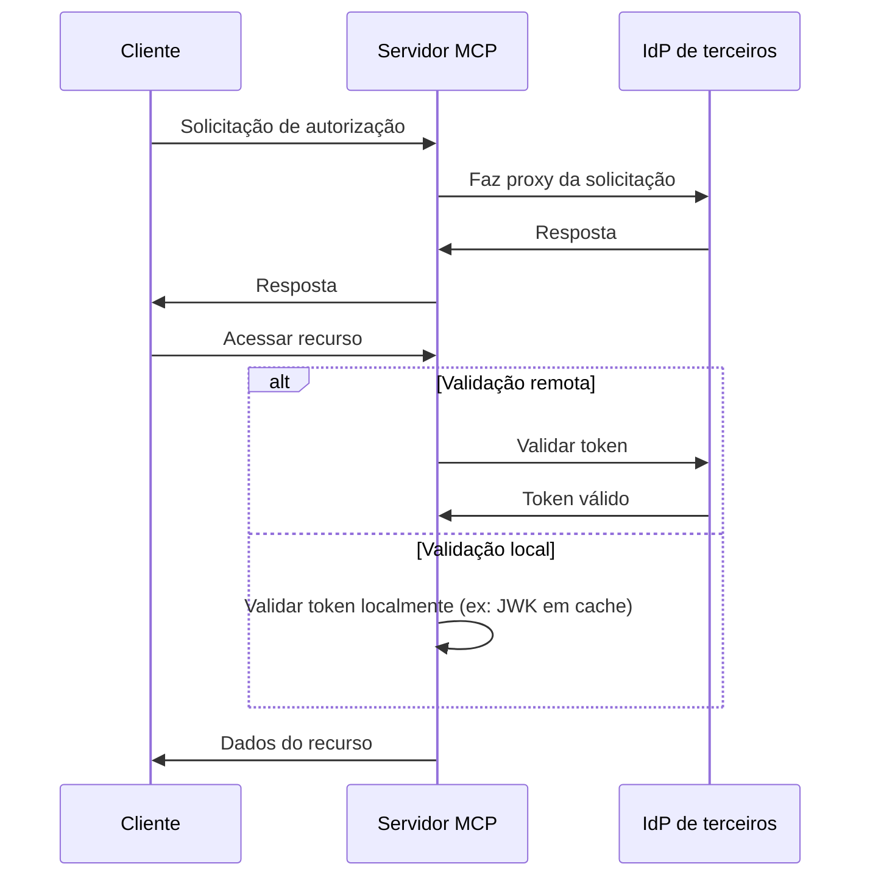
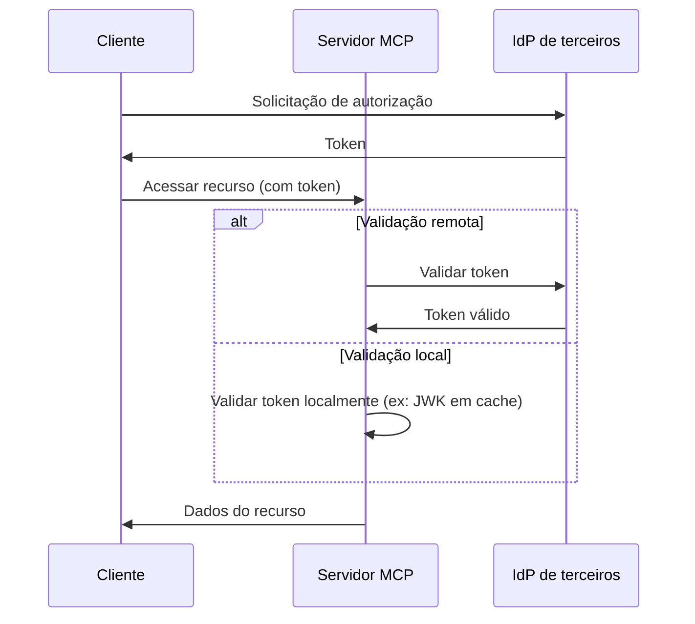

# Escolhendo entre MCP Auth e outras soluções

O ecossistema MCP está evoluindo. À medida que a especificação do Model Context Protocol (MCP) avança do modelo de “servidor de autorização” para o novo modelo de “servidor de recursos + IdP de terceiros”, é importante entender como diferentes soluções de integração se encaixam, tanto agora quanto no futuro.

Esta página destaca as principais diferenças entre o mcp-auth e outras soluções populares, para ajudar você a escolher a melhor abordagem para o seu projeto.

## Contexto: Abordagem proxy vs. integração com IdP \{#background-proxy-approach-vs-idp-integration}

A maioria das soluções de autenticação MCP existentes utiliza uma “abordagem proxy”. Nesse modelo, o servidor MCP faz proxy das solicitações de autorização para um Provedor de Identidade (IdP) de terceiros, atuando efetivamente como intermediário entre o cliente e o IdP.

**Abordagem proxy ([03-26 spec](https://modelcontextprotocol.io/specification/2025-03-26/basic/authorization))**

Embora isso funcione com a especificação MCP atual (2025-03-26), é essencialmente uma solução alternativa. Assume que o servidor MCP também atuará como servidor de autorização, o que não é a direção da última versão da especificação.

**MCP Auth / futura especificação (servidor de recursos + IdP de terceiros)**

A próxima especificação MCP [transfere a responsabilidade da autorização para um IdP de terceiros dedicado](https://github.com/modelcontextprotocol/modelcontextprotocol/issues/205). Nesse modelo, o servidor MCP atua apenas como servidor de recursos, e todos os endpoints de autorização vêm diretamente do IdP de terceiros.

## Por que escolher o MCP Auth? \{#why-choose-mcp-auth}

- Alinhamento com a especificação: O MCP Auth segue diretamente a direção do último rascunho, tornando-se a única solução compatível tanto com a especificação 03-26 quanto com a futura.
- Chega de soluções alternativas: Em vez de atuar como proxy de servidor de autorização, o MCP Auth permite que o IdP de terceiros gerencie toda a autorização, como previsto na nova especificação.
- Independente de provedor: O MCP Auth funciona com qualquer provedor compatível com OAuth 2.0 / OIDC.
- Transição suave: O MCP Auth retorna todos os endpoints de terceiros como estão via OAuth 2.0 Authorization Server Metadata. Isso mantém a integração simples agora e pronta para mudanças futuras.
- Experiência do desenvolvedor: Oferece tutoriais, utilitários e recursos futuros como [OAuth 2.0 Protected Resource Metadata](https://auth.wiki/protected-resource-metadata) para facilitar a vida dos desenvolvedores de servidores MCP.

| Recurso                            | Soluções proxy       | MCP Auth |
| ---------------------------------- | -------------------- | -------- |
| Funciona com a especificação 03-26 | ✅                   | ✅       |
| Funciona com a futura especificação| ❌                   | ✅       |
| Suporta IdPs de terceiros diretamente | ❌ (apenas alternativa) | ✅   |
| Independente de provedor           | Limitado[^1]         | Sim      |
| Pronto para transição              | ❌                   | ✅       |

Se você precisa suportar IdPs de terceiros agora e quer estar pronto para a próxima especificação, o MCP Auth é a solução recomendada. Abordagens baseadas em proxy podem em breve ser descontinuadas ou exigir uma reformulação significativa.

[^1]: Algumas soluções proxy podem codificar parâmetros ou endpoints específicos, limitando a flexibilidade.