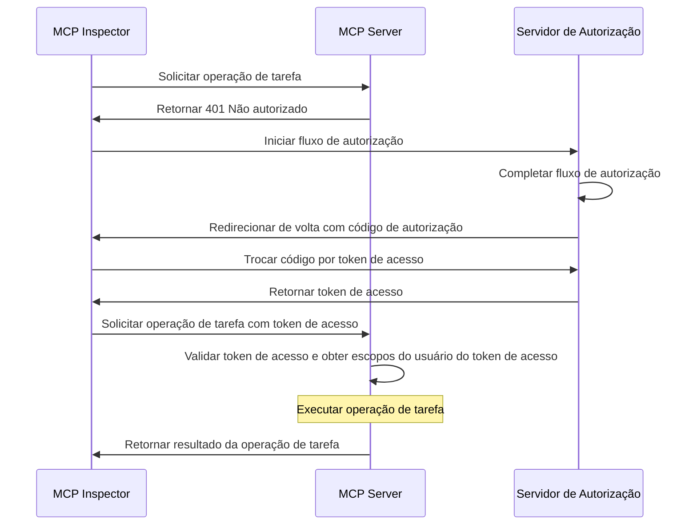
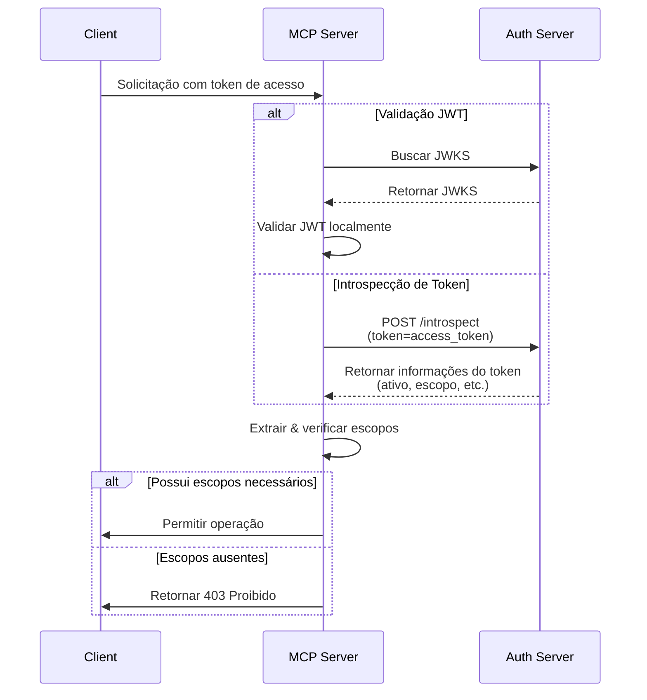

import TabItem from '@theme/TabItem';
import Tabs from '@theme/Tabs';

import SetupOauthOrOidc from './_setup-oauth-or-oidc.mdx';
import SetupOidc from './_setup-oidc.mdx';

# Tutorial: Construa um gerenciador de tarefas

Neste tutorial, vamos construir um servidor MCP de gerenciador de tarefas com autenticação e autorização de usuário.

Após concluir este tutorial, você terá:

- ✅ Uma compreensão básica de como configurar controle de acesso baseado em papel (RBAC) em seu servidor MCP.
- ✅ Um servidor MCP que pode gerenciar listas de tarefas pessoais.

:::note
Antes de começar, recomendamos fortemente que você faça primeiro o [tutorial Quem sou eu](./whoami) caso não esteja familiarizado com o servidor MCP e OAuth 2.
:::

## Visão geral \{#overview}

O tutorial envolverá os seguintes componentes:

- **Servidor MCP**: Um servidor MCP simples que usa os SDKs oficiais do MCP para lidar com requisições, com um serviço integrado de Tarefas para gerenciar os itens de tarefas do usuário.
- **MCP inspector**: Uma ferramenta visual de testes para servidores MCP. Também atua como um cliente OAuth / OIDC para iniciar o fluxo de autorização e recuperar tokens de acesso.
- **Servidor de autorização**: Um provedor OAuth 2.1 ou OpenID Connect que gerencia identidades de usuários e emite tokens de acesso.

Aqui está um diagrama de alto nível da interação entre esses componentes:



## Entenda seu servidor de autorização \{#understand-your-authorization-server}

### Tokens de acesso com escopos \{#access-tokens-with-scopes}

Para implementar [controle de acesso baseado em papel (RBAC)](https://auth.wiki/rbac) em seu servidor MCP, seu servidor de autorização precisa suportar a emissão de tokens de acesso com escopos. Escopos representam as permissões que um usuário recebeu.

<Tabs groupId="provider">
<TabItem value="logto" label="Logto">

[Logto](https://logto.io) oferece suporte a RBAC por meio de seus recursos de API (conforme [RFC 8707: Indicadores de Recurso para OAuth 2.0](https://datatracker.ietf.org/doc/html/rfc8707)) e funcionalidades de papéis. Veja como configurar:

1. Faça login no [Logto Console](https://cloud.logto.io) (ou em seu Logto Console auto-hospedado)

2. Crie recurso de API e escopos:

   - Vá para "Recursos de API"
   - Crie um novo recurso de API chamado "Gerenciador de Tarefas"
   - Adicione os seguintes escopos:
     - `create:todos`: "Criar novos itens de tarefa"
     - `read:todos`: "Ler todos os itens de tarefa"
     - `delete:todos`: "Excluir qualquer item de tarefa"

3. Crie papéis (recomendado para facilitar o gerenciamento):

   - Vá para "Papéis"
   - Crie um papel "Admin" e atribua todos os escopos (`create:todos`, `read:todos`, `delete:todos`)
   - Crie um papel "User" e atribua apenas o escopo `create:todos`

4. Atribua permissões:
   - Vá para "Usuários"
   - Selecione um usuário
   - Você pode:
     - Atribuir papéis na aba "Papéis" (recomendado)
     - Ou atribuir escopos diretamente na aba "Permissões"

Os escopos serão incluídos na reivindicação `scope` do token de acesso JWT como uma string separada por espaços.

</TabItem>
<TabItem value="oauth-oidc" label="OAuth 2.0 / OIDC">

Provedores OAuth 2.0 / OIDC normalmente suportam controle de acesso baseado em escopo. Ao implementar RBAC:

1. Defina os escopos necessários em seu servidor de autorização
2. Configure seu cliente para solicitar esses escopos durante o fluxo de autorização
3. Certifique-se de que seu servidor de autorização inclua os escopos concedidos no token de acesso
4. Os escopos geralmente são incluídos na reivindicação `scope` do token de acesso JWT

Consulte a documentação do seu provedor para detalhes específicos sobre:

- Como definir e gerenciar escopos
- Como os escopos são incluídos no token de acesso
- Quaisquer recursos adicionais de RBAC, como gerenciamento de papéis

</TabItem>
</Tabs>

### Validando tokens e verificando permissões \{#validating-tokens-and-checking-permissions}

Quando seu servidor MCP recebe uma requisição, ele precisa:

1. Validar a assinatura e expiração do token de acesso
2. Extrair os escopos do token validado
3. Verificar se o token possui os escopos necessários para a operação solicitada

Por exemplo, se um usuário deseja criar um novo item de tarefa, seu token de acesso deve incluir o escopo `create:todos`. Veja como funciona o fluxo:



### Registro Dinâmico de Cliente \{#dynamic-client-registration}

O Registro Dinâmico de Cliente não é necessário para este tutorial, mas pode ser útil se você quiser automatizar o processo de registro do cliente MCP com seu servidor de autorização. Veja [Registro Dinâmico de Cliente é necessário?](../../provider-list.mdx#is-dcr-required) para mais detalhes.

## Entenda RBAC no gerenciador de tarefas \{#understand-rbac-in-todo-manager}

Para fins de demonstração, implementaremos um sistema simples de controle de acesso baseado em papel (RBAC) em nosso servidor MCP de gerenciador de tarefas. Isso mostrará os princípios básicos do RBAC mantendo a implementação direta.

:::note
Embora este tutorial demonstre o gerenciamento de escopos baseado em RBAC, é importante observar que nem todos os provedores de autenticação implementam o gerenciamento de escopos por meio de papéis. Alguns provedores podem ter suas próprias implementações e mecanismos únicos para gerenciar controle de acesso e permissões.
:::

### Ferramentas e escopos \{#tools-and-scopes}

Nosso servidor MCP de gerenciador de tarefas fornece três ferramentas principais:

- `create-todo`: Criar um novo item de tarefa
- `get-todos`: Listar todas as tarefas
- `delete-todo`: Excluir uma tarefa pelo ID

Para controlar o acesso a essas ferramentas, definimos os seguintes escopos:

- `create:todos`: Permite criar novos itens de tarefa
- `delete:todos`: Permite excluir itens de tarefa existentes
- `read:todos`: Permite consultar e recuperar a lista de todas as tarefas

### Papéis e permissões \{#roles-and-permissions}

Definiremos dois papéis com diferentes níveis de acesso:

| Papel  | create:todos | read:todos | delete:todos |
| ------ | ------------ | ---------- | ------------ |
| Admin  | ✅           | ✅         | ✅           |
| User   | ✅           |            |              |

- **User**: Um usuário comum que pode criar itens de tarefa e visualizar ou excluir apenas suas próprias tarefas
- **Admin**: Um administrador que pode criar, visualizar e excluir todos os itens de tarefa, independentemente da propriedade

### Propriedade do recurso \{#resource-ownership}

Embora a tabela de permissões acima mostre os escopos explícitos atribuídos a cada papel, há um princípio importante de propriedade de recurso a considerar:

- **Usuários** não possuem os escopos `read:todos` ou `delete:todos`, mas ainda podem:
  - Ler seus próprios itens de tarefa
  - Excluir seus próprios itens de tarefa
- **Admins** possuem permissões totais (`read:todos` e `delete:todos`), permitindo que:
  - Visualizem todos os itens de tarefa no sistema
  - Excluam qualquer item de tarefa, independentemente da propriedade

Isso demonstra um padrão comum em sistemas RBAC onde a propriedade do recurso concede permissões implícitas aos usuários para seus próprios recursos, enquanto papéis administrativos recebem permissões explícitas para todos os recursos.

:::tip Saiba mais
Para se aprofundar nos conceitos e melhores práticas de RBAC, confira [Dominando RBAC: Um Exemplo Abrangente do Mundo Real](https://blog.logto.io/mastering-rbac).
:::

## Configure a autorização em seu provedor \{#configure-authorization-in-your-provider}

Para implementar o sistema de controle de acesso que descrevemos anteriormente, você precisará configurar seu servidor de autorização para suportar os escopos necessários. Veja como fazer isso com diferentes provedores:

<Tabs groupId="provider">
<TabItem value="logto" label="Logto">

[Logto](https://logto.io) oferece suporte a RBAC por meio de recursos de API e funcionalidades de papéis. Veja como configurar:

1. Faça login no [Logto Console](https://cloud.logto.io) (ou em seu Logto Console auto-hospedado)

2. Crie recurso de API e escopos:

   - Vá para "Recursos de API"
   - Crie um novo recurso de API chamado "Gerenciador de Tarefas" e use `https://todo.mcp-server.app` (para demonstração) como indicador.
   - Crie os seguintes escopos:
     - `create:todos`: "Criar novos itens de tarefa"
     - `read:todos`: "Ler todos os itens de tarefa"
     - `delete:todos`: "Excluir qualquer item de tarefa"

3. Crie papéis (recomendado para facilitar o gerenciamento):

   - Vá para "Papéis"
   - Crie um papel "Admin" e atribua todos os escopos (`create:todos`, `read:todos`, `delete:todos`)
   - Crie um papel "User" e atribua apenas o escopo `create:todos`
   - Na página de detalhes do papel "User", vá para a aba "Geral" e defina o papel "User" como o "Papel padrão".

4. Gerencie papéis e permissões dos usuários:
   - Para novos usuários:
     - Eles receberão automaticamente o papel "User" já que o definimos como padrão
   - Para usuários existentes:
     - Vá para "Gerenciamento de usuários"
     - Selecione um usuário
     - Atribua papéis ao usuário na aba "Papéis"

:::tip Gerenciamento de Papéis Programático
Você também pode usar a [Management API](https://docs.logto.io/integrate-logto/interact-with-management-api) do Logto para gerenciar papéis de usuários programaticamente. Isso é especialmente útil para automação de gerenciamento de usuários ou ao construir painéis administrativos.
:::

Ao solicitar um token de acesso, o Logto incluirá os escopos na reivindicação `scope` do token com base nas permissões do papel do usuário.

</TabItem>
<TabItem value="keycloak" label="Keycloak">

No [Keycloak](https://www.keycloak.org), você pode configurar as permissões necessárias usando escopos de cliente:

1. Crie escopos de cliente:

   - No seu realm, vá para "Client scopes"
   - Crie três novos escopos de cliente:
     - `create:todos`
     - `read:todos`
     - `delete:todos`

2. Configure o cliente:

   - Vá para as configurações do seu cliente
   - Na aba "Client scopes", adicione todos os escopos que você criou
   - Certifique-se de que o token mapper está configurado para incluir escopos

3. Opcional: Use papéis para facilitar o gerenciamento
   - Se preferir gerenciamento baseado em papel:
     - Crie papéis de realm para diferentes níveis de acesso
     - Mapeie escopos para papéis
     - Atribua papéis aos usuários
   - Caso contrário, você pode atribuir escopos diretamente aos usuários ou por permissões no nível do cliente

O Keycloak incluirá os escopos concedidos na reivindicação `scope` do token de acesso.

</TabItem>
<TabItem value="oauth-or-oidc" label="OAuth 2 / OIDC">

Para provedores OAuth 2.0 ou OpenID Connect, você precisará configurar os escopos que representam diferentes permissões. Os passos exatos dependerão do seu provedor, mas geralmente:

1. Defina escopos:

   - Configure seu servidor de autorização para suportar:
     - `create:todos`
     - `read:todos`
     - `delete:todos`

2. Configure o cliente:

   - Registre ou atualize seu cliente para solicitar esses escopos
   - Certifique-se de que os escopos estão incluídos no token de acesso

3. Atribua permissões:
   - Use a interface do seu provedor para conceder os escopos apropriados aos usuários
   - Alguns provedores podem suportar gerenciamento baseado em papel, enquanto outros podem usar atribuições diretas de escopos
   - Consulte a documentação do seu provedor para a abordagem recomendada

:::tip
A maioria dos provedores incluirá os escopos concedidos na reivindicação `scope` do token de acesso. O formato normalmente é uma string de escopos separados por espaço.
:::

</TabItem>
</Tabs>

Após configurar seu servidor de autorização, os usuários receberão tokens de acesso contendo seus escopos concedidos. O servidor MCP usará esses escopos para determinar:

- Se um usuário pode criar novas tarefas (`create:todos`)
- Se um usuário pode visualizar todas as tarefas (`read:todos`) ou apenas as suas próprias
- Se um usuário pode excluir qualquer tarefa (`delete:todos`) ou apenas as suas próprias

## Configure o servidor MCP \{#set-up-the-mcp-server}

Usaremos os [SDKs oficiais do MCP](https://github.com/modelcontextprotocol) para criar nosso servidor MCP de gerenciador de tarefas.

### Crie um novo projeto \{#create-a-new-project}

<Tabs groupId="sdk">
<TabItem value="python" label="Python">

```bash
mkdir mcp-server
cd mcp-server
uv init # Ou use `pipenv` ou `poetry` para criar um novo ambiente virtual
```

</TabItem>
<TabItem value="node" label="Node.js">

Configure um novo projeto Node.js:

```bash
mkdir mcp-server
cd mcp-server
npm init -y # Ou use `pnpm init`
npm pkg set type="module"
npm pkg set main="todo-manager.ts"
npm pkg set scripts.start="node --experimental-strip-types todo-manager.ts"
```

:::note
Estamos usando TypeScript em nossos exemplos, pois o Node.js v22.6.0+ suporta execução nativa de TypeScript usando a flag `--experimental-strip-types`. Se estiver usando JavaScript, o código será semelhante - apenas certifique-se de estar usando Node.js v22.6.0 ou superior. Veja a documentação do Node.js para detalhes.
:::

</TabItem>
</Tabs>

### Instale o SDK MCP e dependências \{#install-the-mcp-sdk-and-dependencies}

<Tabs groupId="sdk">
<TabItem value="python" label="Python">

```bash
pip install "mcp[cli]" starlette uvicorn
```

Ou qualquer outro gerenciador de pacotes de sua preferência, como `uv` ou `poetry`.

</TabItem>
<TabItem value="node" label="Node.js">

```bash
npm install @modelcontextprotocol/sdk express zod
```

Ou qualquer outro gerenciador de pacotes de sua preferência, como `pnpm` ou `yarn`.

</TabItem>
</Tabs>

### Crie o servidor MCP \{#create-the-mcp-server}

Primeiro, vamos criar um servidor MCP básico com as definições das ferramentas:

<Tabs groupId="sdk">
<TabItem value="python" label="Python">

Crie um arquivo chamado `todo-manager.py` e adicione o seguinte código:

```python
from typing import Any
from mcp.server.fastmcp import FastMCP
from starlette.applications import Starlette
from starlette.routing import Mount

mcp = FastMCP("Gerenciador de Tarefas")

@mcp.tool()
def create_todo(content: str) -> dict[str, Any]:
    """Criar uma nova tarefa."""
    return {"error": "Não implementado"}

@mcp.tool()
def get_todos() -> dict[str, Any]:
    """Listar todas as tarefas."""
    return {"error": "Não implementado"}

@mcp.tool()
def delete_todo(id: str) -> dict[str, Any]:
    """Excluir uma tarefa pelo id."""
    return {"error": "Não implementado"}

app = Starlette(
    routes=[Mount('/', app=mcp.sse_app())]
)
```

Execute o servidor com:

```bash
uvicorn todo_manager:app --host 0.0.0.0 --port 3001
```

</TabItem>
<TabItem value="node" label="Node.js">

:::note
Como a implementação atual do MCP inspector não lida com fluxos de autorização, usaremos a abordagem SSE para configurar o servidor MCP. Atualizaremos o código aqui assim que o MCP inspector suportar fluxos de autorização.
:::

Você também pode usar `pnpm` ou `yarn` se preferir.

Crie um arquivo chamado `todo-manager.ts` e adicione o seguinte código:

```ts
// todo-manager.ts

import { z } from 'zod';
import { McpServer } from '@modelcontextprotocol/sdk/server/mcp.js';
import { SSEServerTransport } from '@modelcontextprotocol/sdk/server/sse.js';
import express from 'express';

// Crie um servidor MCP
const server = new McpServer({
  name: 'Gerenciador de Tarefas',
  version: '0.0.0',
});

server.tool('create-todo', 'Criar uma nova tarefa', { content: z.string() }, async ({ content }) => {
  return {
    content: [{ type: 'text', text: JSON.stringify({ error: 'Não implementado' }) }],
  };
});

server.tool('get-todos', 'Listar todas as tarefas', async () => {
  return {
    content: [{ type: 'text', text: JSON.stringify({ error: 'Não implementado' }) }],
  };
});

server.tool('delete-todo', 'Excluir uma tarefa pelo id', { id: z.string() }, async ({ id }) => {
  return {
    content: [{ type: 'text', text: JSON.stringify({ error: 'Não implementado' }) }],
  };
});

// Abaixo está o código boilerplate da documentação do MCP SDK
const PORT = 3001;
const app = express();

const transports = {};

app.get('/sse', async (_req, res) => {
  const transport = new SSEServerTransport('/messages', res);
  transports[transport.sessionId] = transport;

  res.on('close', () => {
    delete transports[transport.sessionId];
  });

  await server.connect(transport);
});

app.post('/messages', async (req, res) => {
  const sessionId = String(req.query.sessionId);
  const transport = transports[sessionId];
  if (transport) {
    await transport.handlePostMessage(req, res, req.body);
  } else {
    res.status(400).send('Nenhum transporte encontrado para sessionId');
  }
});

app.listen(PORT);
```

Execute o servidor com:

```bash
npm start
```

</TabItem>
</Tabs>

## Inspecione o servidor MCP \{#inspect-the-mcp-server}

### Clone e execute o MCP inspector \{#clone-and-run-mcp-inspector}

Agora que temos o servidor MCP rodando, podemos usar o MCP inspector para ver se a ferramenta `whoami` está disponível.

Devido à limitação da implementação atual, fizemos um fork do [MCP inspector](https://github.com/mcp-auth/inspector) para torná-lo mais flexível e escalável para autenticação e autorização. Também enviamos um pull request para o repositório original para incluir nossas alterações.

Para rodar o MCP inspector, você pode usar o seguinte comando (Node.js é necessário):

```bash
git clone https://github.com/mcp-auth/inspector.git
cd inspector
npm install
npm run dev
```

Depois, abra seu navegador e acesse `http://localhost:6274/` (ou outro URL exibido no terminal) para acessar o MCP inspector.

### Conecte o MCP inspector ao servidor MCP \{#connect-mcp-inspector-to-the-mcp-server}

Antes de prosseguir, verifique a seguinte configuração no MCP inspector:

- **Tipo de Transporte**: Defina como `SSE`.
- **URL**: Defina para a URL do seu servidor MCP. No nosso caso, deve ser `http://localhost:3001/sse`.

Agora você pode clicar no botão "Connect" para ver se o MCP inspector consegue se conectar ao servidor MCP. Se tudo estiver certo, você verá o status "Connected" no MCP inspector.

### Checkpoint: Execute as ferramentas do gerenciador de tarefas \{#checkpoint-run-todo-manager-tools}

1. No menu superior do MCP inspector, clique na aba "Tools".
2. Clique no botão "List Tools".
3. Você deve ver as ferramentas `create-todo`, `get-todos` e `delete-todo` listadas na página. Clique para abrir os detalhes da ferramenta.
4. Você deve ver o botão "Run Tool" no lado direito. Clique nele e insira os parâmetros necessários para executar a ferramenta.
5. Você verá o resultado da ferramenta com a resposta JSON `{"error": "Não implementado"}`.


## Integre com seu servidor de autorização \{#integrate-with-your-authorization-server}

Para concluir esta seção, há várias considerações a serem feitas:

<details>
<summary>**A URL do emissor do seu servidor de autorização**</summary>

Geralmente é a URL base do seu servidor de autorização, como `https://auth.example.com`. Alguns provedores podem ter um caminho como `https://example.logto.app/oidc`, então verifique a documentação do seu provedor.

</details>

<details>
<summary>**Como recuperar os metadados do servidor de autorização**</summary>

- Se seu servidor de autorização estiver em conformidade com o [OAuth 2.0 Authorization Server Metadata](https://datatracker.ietf.org/doc/html/rfc8414) ou [OpenID Connect Discovery](https://openid.net/specs/openid-connect-discovery-1_0.html), você pode usar as utilidades integradas do MCP Auth para buscar os metadados automaticamente.
- Se seu servidor de autorização não estiver em conformidade com esses padrões, você precisará especificar manualmente a URL dos metadados ou endpoints na configuração do servidor MCP. Consulte a documentação do seu provedor para os endpoints específicos.

</details>

<details>
<summary>**Como registrar o MCP inspector como cliente em seu servidor de autorização**</summary>

- Se seu servidor de autorização suporta [Registro Dinâmico de Cliente](https://datatracker.ietf.org/doc/html/rfc7591), você pode pular esta etapa, pois o MCP inspector se registrará automaticamente como cliente.
- Se seu servidor de autorização não suporta Registro Dinâmico de Cliente, você precisará registrar manualmente o MCP inspector como cliente em seu servidor de autorização.

</details>

<details>
<summary>**Entenda os parâmetros de solicitação de token**</summary>

Ao solicitar tokens de acesso de diferentes servidores de autorização, você encontrará várias abordagens para especificar o recurso alvo e as permissões. Aqui estão os principais padrões:

- **Baseado em indicador de recurso**:

  - Usa o parâmetro `resource` para especificar a API alvo (veja [RFC 8707: Indicadores de Recurso para OAuth 2.0](https://datatracker.ietf.org/doc/html/rfc8707))
  - Comum em implementações modernas de OAuth 2.0
  - Exemplo de requisição:
    ```json
    {
      "resource": "https://todo.mcp-server.app",
      "scope": "create:todos read:todos"
    }
    ```
  - O servidor emite tokens vinculados especificamente ao recurso solicitado

- **Baseado em audiência**:

  - Usa o parâmetro `audience` para especificar o destinatário pretendido do token
  - Semelhante aos indicadores de recurso, mas com semânticas diferentes
  - Exemplo de requisição:
    ```json
    {
      "audience": "todo-api",
      "scope": "create:todos read:todos"
    }
    ```

- **Baseado apenas em escopo**:
  - Depende apenas de escopos sem parâmetros de recurso/audiência
  - Abordagem tradicional do OAuth 2.0
  - Exemplo de requisição:
    ```json
    {
      "scope": "todo-api:create todo-api:read openid profile"
    }
    ```
  - Frequentemente usa escopos prefixados para namespacing de permissões
  - Comum em implementações mais simples de OAuth 2.0

:::tip Melhores Práticas

- Verifique a documentação do seu provedor para os parâmetros suportados
- Alguns provedores suportam múltiplas abordagens simultaneamente
- Indicadores de recurso fornecem melhor segurança por restrição de audiência
- Considere usar indicadores de recurso quando disponíveis para melhor controle de acesso
  :::

</details>

Embora cada provedor possa ter requisitos específicos, os passos a seguir irão guiá-lo no processo de integração do MCP inspector e do servidor MCP com configurações específicas do provedor.

### Registre o MCP inspector como cliente \{#register-mcp-inspector-as-a-client}

<Tabs groupId="provider">
<TabItem value="logto" label="Logto">

Integrar o gerenciador de tarefas com o [Logto](https://logto.io) é simples, pois é um provedor OpenID Connect que suporta indicadores de recurso e escopos, permitindo proteger sua API de tarefas com `https://todo.mcp-server.app` como indicador de recurso.

Como o Logto ainda não suporta Registro Dinâmico de Cliente, você precisará registrar manualmente o MCP inspector como cliente em seu tenant Logto:

1. Abra seu MCP inspector, clique no botão "OAuth Configuration". Copie o valor **Redirect URL (auto-populated)**, que deve ser algo como `http://localhost:6274/oauth/callback`.
2. Faça login no [Logto Console](https://cloud.logto.io) (ou em seu Logto Console auto-hospedado).
3. Navegue até a aba "Applications", clique em "Create application". No final da página, clique em "Create app without framework".
4. Preencha os detalhes do aplicativo e clique em "Create application":
   - **Selecione um tipo de aplicativo**: Escolha "Single-page application".
   - **Nome do aplicativo**: Insira um nome para seu aplicativo, por exemplo, "MCP Inspector".
5. Na seção "Settings / Redirect URIs", cole o valor **Redirect URL (auto-populated)** copiado do MCP inspector. Depois clique em "Save changes" na barra inferior.
6. No card superior, você verá o valor "App ID". Copie-o.
7. Volte ao MCP inspector e cole o valor "App ID" na seção "OAuth Configuration" em "Client ID".
8. Insira o valor `{"scope": "create:todos read:todos delete:todos", "resource": "https://todo.mcp-server.app"}` no campo "Auth Params". Isso garantirá que o token de acesso retornado pelo Logto contenha os escopos necessários para acessar o gerenciador de tarefas.

</TabItem>
<TabItem value="oauth-oidc" label="OAuth 2.0 / OIDC">

:::note
Este é um guia genérico de integração com provedores OAuth 2.0 / OpenID Connect. Ambos seguem passos semelhantes, pois OIDC é construído sobre OAuth 2.0. Consulte a documentação do seu provedor para detalhes específicos.
:::

Se seu provedor suporta Registro Dinâmico de Cliente, você pode ir direto ao passo 8 abaixo para configurar o MCP inspector; caso contrário, será necessário registrar manualmente o MCP inspector como cliente:

1. Abra seu MCP inspector, clique no botão "OAuth Configuration". Copie o valor **Redirect URL (auto-populated)**, que deve ser algo como `http://localhost:6274/oauth/callback`.

2. Faça login no console do seu provedor.

3. Navegue até a seção "Applications" ou "Clients" e crie um novo aplicativo ou cliente.

4. Se seu provedor exigir um tipo de cliente, selecione "Single-page application" ou "Public client".

5. Após criar o aplicativo, será necessário configurar o redirect URI. Cole o valor **Redirect URL (auto-populated)** copiado do MCP inspector.

6. Encontre o "Client ID" ou "Application ID" do novo aplicativo e copie-o.

7. Volte ao MCP inspector e cole o valor "Client ID" na seção "OAuth Configuration" em "Client ID".

8. Insira o seguinte valor no campo "Auth Params" para solicitar os escopos necessários para operações de tarefas:

```json
{ "scope": "create:todos read:todos delete:todos" }
```

</TabItem>
</Tabs>

### Configure o MCP auth \{#set-up-mcp-auth}

No seu projeto do servidor MCP, você precisa instalar o SDK MCP Auth e configurá-lo para usar os metadados do seu servidor de autorização.

<Tabs groupId="sdk">
<TabItem value="python" label="Python">

Primeiro, instale o pacote `mcpauth`:

```bash
pip install mcpauth
```

Ou qualquer outro gerenciador de pacotes de sua preferência, como `uv` ou `poetry`.

</TabItem>
<TabItem value="node" label="Node.js">

Primeiro, instale o pacote `mcp-auth`:

```bash
npm install mcp-auth
```

</TabItem>
</Tabs>

O MCP Auth requer os metadados do servidor de autorização para poder inicializar. Dependendo do seu provedor:

<Tabs groupId="provider">

<TabItem value="logto" label="Logto">

A URL do emissor pode ser encontrada na página de detalhes do seu aplicativo no Logto Console, na seção "Endpoints & Credentials / Issuer endpoint". Deve ser algo como `https://meu-projeto.logto.app/oidc`.

<SetupOidc />

</TabItem>

<TabItem value="oauth-oidc" label="OAuth 2.0 / OIDC">

Para provedores OAuth 2.0, você precisará:

1. Verificar a documentação do seu provedor para a URL do servidor de autorização (geralmente chamada de issuer URL ou base URL)
2. Alguns provedores podem expor isso em `https://{seu-dominio}/.well-known/oauth-authorization-server`
3. Procurar no console administrativo do seu provedor em configurações OAuth/API

<SetupOauthOrOidc />

</TabItem>

</Tabs>

<Tabs groupId="sdk">

<TabItem value="python" label="Python">

Atualize o `todo-manager.py` para incluir a configuração do MCP Auth:

```python
from mcpauth import MCPAuth
from mcpauth.config import AuthServerType
from mcpauth.utils import fetch_server_config

auth_issuer = '<issuer-endpoint>'  # Substitua pelo endpoint do seu emissor
auth_server_config = fetch_server_config(auth_issuer, type=AuthServerType.OIDC)
mcp_auth = MCPAuth(server=auth_server_config)
```

</TabItem>
<TabItem value="node" label="Node.js">

Atualize o `todo-manager.ts` para incluir a configuração do MCP Auth:

```ts
// todo-manager.ts

import { MCPAuth, fetchServerConfig } from 'mcp-auth';

const authIssuer = '<issuer-endpoint>'; // Substitua pelo endpoint do seu emissor
const mcpAuth = new MCPAuth({
  server: await fetchServerConfig(authIssuer, { type: 'oidc' }),
});
```

</TabItem>
</Tabs>

### Atualize o servidor MCP \{#update-mcp-server}

Estamos quase lá! É hora de atualizar o servidor MCP para aplicar a rota e middleware do MCP Auth, depois implementar o controle de acesso baseado em permissões para as ferramentas do gerenciador de tarefas com base nos escopos do usuário.

<Tabs groupId="sdk">
<TabItem value="python" label="Python">

```python
@mcp.tool()
def create_todo(content: str) -> dict[str, Any]:
    """Criar uma nova tarefa."""
    return (
        mcp_auth.auth_info.scopes
        if mcp_auth.auth_info # Isso será preenchido pelo middleware Bearer auth
        else {"error": "Não autenticado"}
    )

# ...

bearer_auth = Middleware(mcp_auth.bearer_auth_middleware("jwt"))
app = Starlette(
    routes=[
        # Adicione a rota de metadados (`/.well-known/oauth-authorization-server`)
        mcp_auth.metadata_route(),
        # Proteja o servidor MCP com o middleware Bearer auth
        Mount('/', app=mcp.sse_app(), middleware=[bearer_auth]),
    ],
)
```

</TabItem>
<TabItem value="node" label="Node.js">

```js
server.tool(
  'create-todo',
  'Criar uma nova tarefa',
  { content: z.string() },
  async ({ content, authInfo }) => {
    return {
      content: [
        { type: 'text', text: JSON.stringify(authInfo?.scopes ?? { error: 'Não autenticado' }) },
      ],
    };
  }
);

// ...

app.use(mcpAuth.delegatedRouter());
app.use(mcpAuth.bearerAuth('jwt'));
```

</TabItem>
</Tabs>

Em seguida, vamos implementar as ferramentas específicas.

Primeiro, vamos criar um serviço simples de tarefas para fornecer operações básicas de CRUD para gerenciar itens de tarefas em memória.

<Tabs groupId="sdk">
<TabItem value="python" label="Python">
```python
# service.py

"""
Um serviço simples de Tarefas para fins de demonstração.
Usa uma lista em memória para armazenar tarefas.
"""

from datetime import datetime
from typing import List, Optional, Dict, Any
import random
import string

class Todo:
"""Representa um item de tarefa."""

    def __init__(self, id: str, content: str, owner_id: str, created_at: str):
        self.id = id
        self.content = content
        self.owner_id = owner_id
        self.created_at = created_at

    def to_dict(self) -> Dict[str, Any]:
        """Converte a tarefa para dicionário para serialização JSON."""
        return {
            "id": self.id,
            "content": self.content,
            "ownerId": self.owner_id,
            "createdAt": self.created_at
        }

class TodoService:
"""Um serviço simples de Tarefas para fins de demonstração."""

    def __init__(self):
        self._todos: List[Todo] = []

    def get_all_todos(self, owner_id: Optional[str] = None) -> List[Dict[str, Any]]:
        """
        Obtém todas as tarefas, opcionalmente filtradas por owner_id.

        Args:
            owner_id: Se fornecido, retorna apenas tarefas deste usuário

        Returns:
            Lista de dicionários de tarefas
        """
        if owner_id:
            filtered_todos = [todo for todo in self._todos if todo.owner_id == owner_id]
            return [todo.to_dict() for todo in filtered_todos]
        return [todo.to_dict() for todo in self._todos]

    def get_todo_by_id(self, todo_id: str) -> Optional[Todo]:
        """
        Obtém uma tarefa pelo ID.

        Args:
            todo_id: O ID da tarefa a ser recuperada

        Returns:
            Objeto Todo se encontrado, None caso contrário
        """
        for todo in self._todos:
            if todo.id == todo_id:
                return todo
        return None

    def create_todo(self, content: str, owner_id: str) -> Dict[str, Any]:
        """
        Cria uma nova tarefa.

        Args:
            content: O conteúdo da tarefa
            owner_id: O ID do usuário dono da tarefa

        Returns:
            Dicionário da tarefa criada
        """
        todo = Todo(
            id=self._generate_id(),
            content=content,
            owner_id=owner_id,
            created_at=datetime.now().isoformat()
        )
        self._todos.append(todo)
        return todo.to_dict()

    def delete_todo(self, todo_id: str) -> Optional[Dict[str, Any]]:
        """
        Exclui uma tarefa pelo ID.

        Args:
            todo_id: O ID da tarefa a ser excluída

        Returns:
            Dicionário da tarefa excluída se encontrada, None caso contrário
        """
        for i, todo in enumerate(self._todos):
            if todo.id == todo_id:
                deleted_todo = self._todos.pop(i)
                return deleted_todo.to_dict()
        return None

    def _generate_id(self) -> str:
        """Gera um ID aleatório para uma tarefa."""
        return ''.join(random.choices(string.ascii_lowercase + string.digits, k=8))

````


</TabItem>
<TabItem value="node" label="Node.js">

```ts
// todo-service.ts

type Todo = {
  id: string;
  content: string;
  ownerId: string;
  createdAt: string;
};

/**
 * Um serviço simples de Tarefas para fins de demonstração.
 * Usa um array em memória para armazenar tarefas
 */
export class TodoService {
  private readonly todos: Todo[] = [];

  getAllTodos(ownerId?: string): Todo[] {
    if (ownerId) {
      return this.todos.filter((todo) => todo.ownerId === ownerId);
    }
    return this.todos;
  }

  getTodoById(id: string): Todo | undefined {
    return this.todos.find((todo) => todo.id === id);
  }

  createTodo({ content, ownerId }: { content: string; ownerId: string }): Todo {
    const todo: Todo = {
      id: this.genId(),
      content,
      ownerId,
      createdAt: new Date().toISOString(),
    };

    // eslint-disable-next-line @silverhand/fp/no-mutating-methods
    this.todos.push(todo);
    return todo;
  }

  deleteTodo(id: string): Todo | undefined {
    const index = this.todos.findIndex((todo) => todo.id === id);

    if (index === -1) {
      return undefined;
    }

    // eslint-disable-next-line @silverhand/fp/no-mutating-methods
    const [deleted] = this.todos.splice(index, 1);
    return deleted;
  }

  private genId(): string {
    return Math.random().toString(36).slice(2, 10);
  }
}
````

</TabItem>
</Tabs>

então na camada de ferramentas, vamos determinar se as operações são permitidas com base nos escopos do usuário:

<Tabs groupId="sdk">
<TabItem value="python" label="Python">

```python
# todo-manager.py

from typing import Any, Optional
from mcpauth.errors import MCPAuthBearerAuthError

def assert_user_id(auth_info: Optional[dict]) -> str:
    """Extrai e valida o ID do usuário do auth info."""
    subject = auth_info.get('subject') if auth_info else None
    if not subject:
        raise ValueError('Informação de autenticação inválida')
    return subject

def has_required_scopes(user_scopes: list[str], required_scopes: list[str]) -> bool:
    """Verifica se o usuário possui todos os escopos necessários."""
    return all(scope in user_scopes for scope in required_scopes)

# Crie uma instância do TodoService
todo_service = TodoService()

@mcp.tool()
def create_todo(content: str) -> dict[str, Any]:
    """Criar uma nova tarefa.

    Apenas usuários com o escopo 'create:todos' podem criar tarefas.
    """
    # Obter informações de autenticação
    auth_info = mcp_auth.auth_info

    # Validar ID do usuário
    try:
        user_id = assert_user_id(auth_info)
    except ValueError as e:
        return {"error": str(e)}

    # Verificar se o usuário possui as permissões necessárias
    if not has_required_scopes(auth_info.scopes if auth_info else [], ['create:todos']):
        raise MCPAuthBearerAuthError('missing_required_scopes')

    # Criar nova tarefa
    created_todo = todo_service.create_todo(content=content, owner_id=user_id)

    # Retornar a tarefa criada
    return created_todo.__dict__

# ...
```

Você pode conferir nosso [código de exemplo](https://github.com/mcp-auth/python/tree/master/samples/server) para todas as outras implementações detalhadas.

</TabItem>
<TabItem value="node" label="Node.js">

```ts
// todo-manager.ts

// ... outros imports
import assert from 'node:assert';
import { type AuthInfo } from '@modelcontextprotocol/sdk/server/auth/types.js';
import { TodoService } from './todo-service.js';

const todoService = new TodoService();

const assertUserId = (authInfo?: AuthInfo) => {
  const { subject } = authInfo ?? {};
  assert(subject, 'Informação de autenticação inválida');
  return subject;
};

/**
 * Verifica se o usuário possui todos os escopos necessários para uma operação
 */
const hasRequiredScopes = (userScopes: string[], requiredScopes: string[]): boolean => {
  return requiredScopes.every((scope) => userScopes.includes(scope));
};

server.tool(
  'create-todo',
  'Criar uma nova tarefa',
  { content: z.string() },
  ({ content }: { content: string }, { authInfo }) => {
    const userId = assertUserId(authInfo);

    /**
     * Apenas usuários com o escopo 'create:todos' podem criar tarefas
     */
    if (!hasRequiredScopes(authInfo?.scopes ?? [], ['create:todos'])) {
      throw new MCPAuthBearerAuthError('missing_required_scopes');
    }

    const createdTodo = todoService.createTodo({ content, ownerId: userId });

    return {
      content: [{ type: 'text', text: JSON.stringify(createdTodo) }],
    };
  }
);

// ...
```

Você pode conferir nosso [código de exemplo](https://github.com/mcp-auth/js/tree/master/packages/sample-servers/src/todo-manager) para todas as outras implementações detalhadas.

</TabItem>
</Tabs>

## Checkpoint: Execute as ferramentas `todo-manager` \{#checkpoint-run-the-todo-manager-tools}

Reinicie seu servidor MCP e abra o MCP inspector no navegador. Ao clicar no botão "Connect", você será redirecionado para a página de login do seu servidor de autorização.

Depois de fazer login e retornar ao MCP inspector, repita as ações do checkpoint anterior para executar as ferramentas do gerenciador de tarefas. Desta vez, você poderá usar essas ferramentas com sua identidade de usuário autenticada. O comportamento das ferramentas dependerá dos papéis e permissões atribuídos ao seu usuário:

- Se você estiver logado como **User** (com apenas o escopo `create:todos`):

  - Você pode criar novas tarefas usando a ferramenta `create-todo`
  - Você só poderá visualizar e excluir suas próprias tarefas
  - Não poderá ver ou excluir tarefas de outros usuários

- Se estiver logado como **Admin** (com todos os escopos: `create:todos`, `read:todos`, `delete:todos`):
  - Você pode criar novas tarefas
  - Pode visualizar todas as tarefas do sistema usando a ferramenta `get-todos`
  - Pode excluir qualquer tarefa usando a ferramenta `delete-todo`, independentemente de quem a criou

Você pode testar esses diferentes níveis de permissão:

1. Saindo da sessão atual (clique no botão "Disconnect" no MCP inspector)
2. Fazendo login com outra conta de usuário que tenha papéis/permissões diferentes
3. Tentando as mesmas ferramentas novamente para observar como o comportamento muda de acordo com as permissões do usuário

Isso demonstra como o controle de acesso baseado em papel (RBAC) funciona na prática, onde diferentes usuários têm diferentes níveis de acesso à funcionalidade do sistema.


<Tabs groupId="sdk">
<TabItem value="python" label="Python">

:::info
Confira o [repositório do MCP Auth Python SDK](https://github.com/mcp-auth/python/blob/master/samples/server/todo-manager/server.py) para o código completo do servidor MCP (versão OIDC).
:::

</TabItem>
<TabItem value="node" label="Node.js">

:::info
Confira o [repositório do MCP Auth Node.js SDK](https://github.com/mcp-auth/js/blob/master/packages/sample-servers/src) para o código completo do servidor MCP (versão OIDC).
:::

</TabItem>
</Tabs>

## Notas finais \{#closing-notes}

🎊 Parabéns! Você concluiu com sucesso o tutorial. Vamos recapitular o que fizemos:

- Configuração de um servidor MCP básico com ferramentas de gerenciamento de tarefas (`create-todo`, `get-todos`, `delete-todo`)
- Implementação de controle de acesso baseado em papel (RBAC) com diferentes níveis de permissão para usuários e administradores
- Integração do servidor MCP com um servidor de autorização usando MCP Auth
- Configuração do MCP Inspector para autenticar usuários e usar tokens de acesso com escopos para chamar ferramentas

Não deixe de conferir outros tutoriais e a documentação para aproveitar ao máximo o MCP Auth.