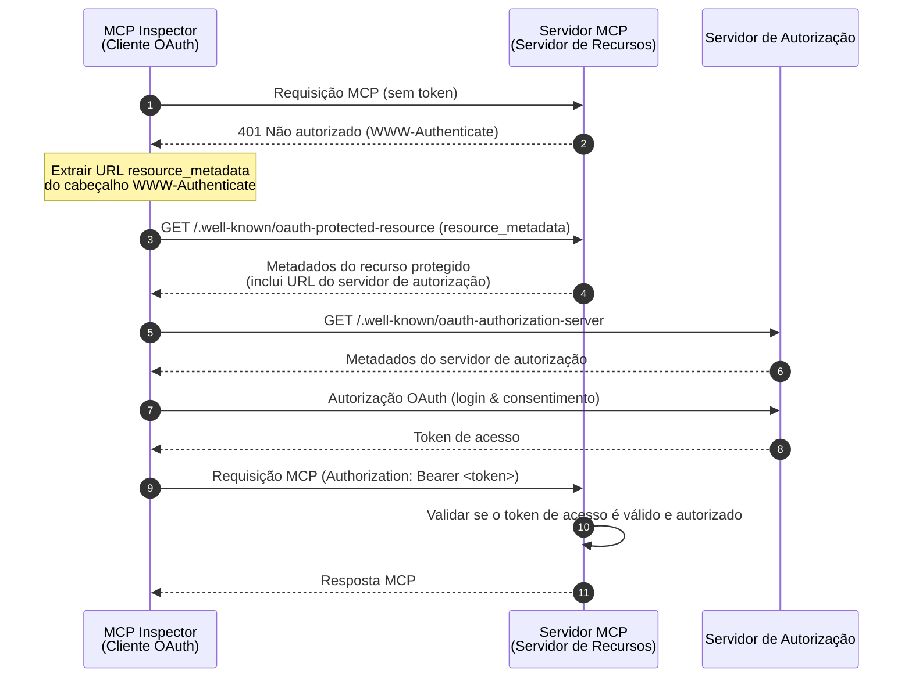
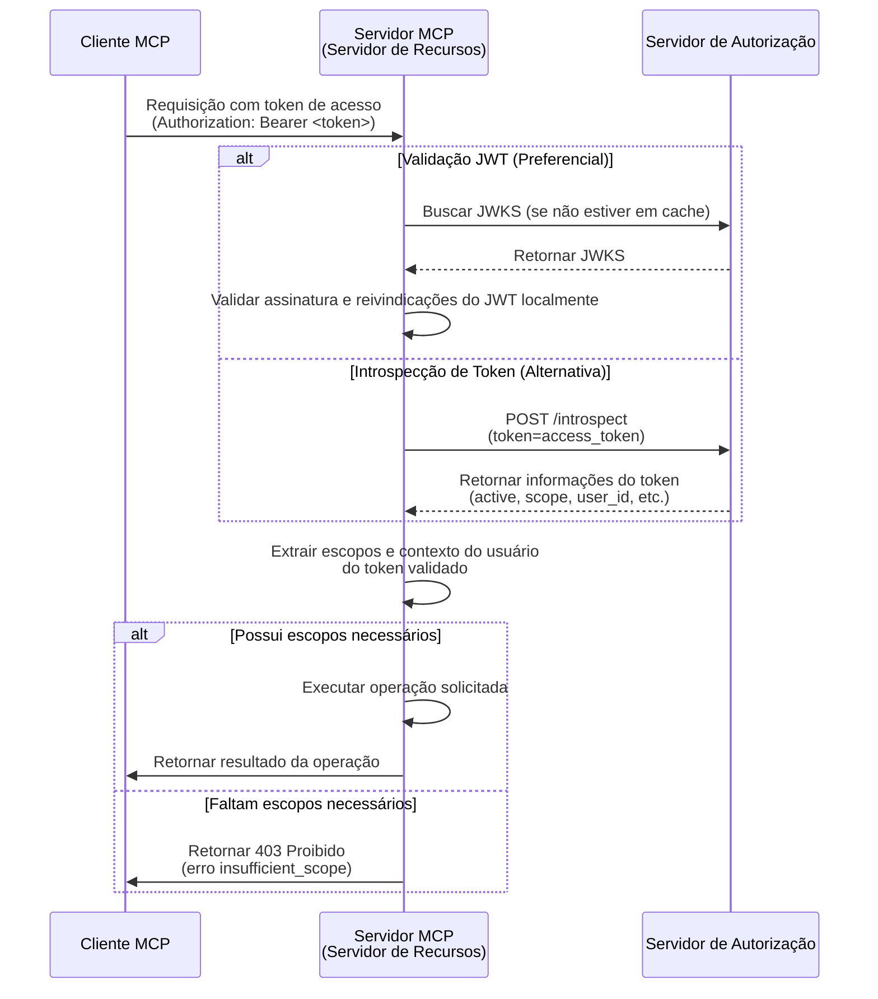

import TabItem from '@theme/TabItem';
import Tabs from '@theme/Tabs';


# Tutorial: Construa um gerenciador de tarefas

Neste tutorial, vamos construir um servidor MCP de gerenciador de tarefas com autenticação e autorização de usuário. Seguindo a especificação MCP mais recente, nosso servidor MCP atuará como um **Servidor de Recursos (Resource Server)** OAuth 2.0 que valida tokens de acesso e aplica permissões baseadas em escopo.

Após concluir este tutorial, você terá:

- ✅ Uma compreensão básica de como configurar controle de acesso baseado em papel (RBAC) em seu servidor MCP.
- ✅ Um servidor MCP que atua como um Servidor de Recursos, consumindo tokens de acesso emitidos por um Servidor de Autorização.
- ✅ Uma implementação funcional de aplicação de permissões baseadas em escopo para operações de tarefas.

## Visão geral \{#overview}

O tutorial envolverá os seguintes componentes:

- **Cliente MCP (MCP Inspector)**: Uma ferramenta visual de testes para servidores MCP que atua como um cliente OAuth 2.0/OIDC. Ele inicia o fluxo de autorização com o servidor de autorização e obtém tokens de acesso para autenticar requisições ao servidor MCP.
- **Servidor de Autorização**: Um provedor OAuth 2.1 ou OpenID Connect que gerencia identidades de usuários, autentica usuários e emite tokens de acesso com escopos apropriados para clientes autorizados.
- **Servidor MCP (Servidor de Recursos)**: De acordo com a especificação MCP mais recente, o servidor MCP atua como um Servidor de Recursos no framework OAuth 2.0. Ele valida tokens de acesso emitidos pelo servidor de autorização e aplica permissões baseadas em escopo para operações de tarefas.

Esta arquitetura segue o fluxo padrão do OAuth 2.0 onde:
- O **MCP Inspector** solicita recursos protegidos em nome do usuário
- O **Servidor de Autorização** autentica o usuário e emite tokens de acesso
- O **Servidor MCP** valida tokens e serve recursos protegidos com base nas permissões concedidas

Aqui está um diagrama de alto nível da interação entre esses componentes:



## Entenda seu servidor de autorização \{#understand-your-authorization-server}

### Tokens de acesso com escopos \{#access-tokens-with-scopes}

Para implementar [controle de acesso baseado em papel (RBAC)](https://auth.wiki/rbac) em seu servidor MCP, seu servidor de autorização precisa suportar a emissão de tokens de acesso com escopos. Escopos representam as permissões que um usuário recebeu.

<Tabs groupId="provider">
<TabItem value="logto" label="Logto">

[Logto](https://logto.io) oferece suporte a RBAC por meio de seus recursos de API (conforme [RFC 8707: Resource Indicators for OAuth 2.0](https://datatracker.ietf.org/doc/html/rfc8707)) e funcionalidades de papéis. Veja como configurar:

1. Faça login no [Logto Console](https://cloud.logto.io) (ou em seu Logto Console auto-hospedado)

2. Crie recurso de API e escopos:

   - Vá para "Recursos de API"
   - Crie um novo recurso de API chamado "Todo Manager"
   - Adicione os seguintes escopos:
     - `create:todos`: "Criar novos itens de tarefa"
     - `read:todos`: "Ler todos os itens de tarefa"
     - `delete:todos`: "Excluir qualquer item de tarefa"

3. Crie papéis (recomendado para facilitar o gerenciamento):

   - Vá para "Papéis"
   - Crie um papel "Admin" e atribua todos os escopos (`create:todos`, `read:todos`, `delete:todos`)
   - Crie um papel "User" e atribua apenas o escopo `create:todos`

4. Atribua permissões:
   - Vá para "Usuários"
   - Selecione um usuário
   - Você pode:
     - Atribuir papéis na aba "Papéis" (recomendado)
     - Ou atribuir escopos diretamente na aba "Permissões"

Os escopos serão incluídos na reivindicação `scope` do token de acesso JWT como uma string separada por espaços.

</TabItem>
<TabItem value="oauth-oidc" label="OAuth 2.0 / OIDC">

Provedores OAuth 2.0 / OIDC normalmente suportam controle de acesso baseado em escopo. Ao implementar RBAC:

1. Defina os escopos necessários em seu servidor de autorização
2. Configure seu cliente para solicitar esses escopos durante o fluxo de autorização
3. Certifique-se de que seu servidor de autorização inclua os escopos concedidos no token de acesso
4. Os escopos geralmente são incluídos na reivindicação `scope` do token de acesso JWT

Consulte a documentação do seu provedor para detalhes específicos sobre:

- Como definir e gerenciar escopos
- Como os escopos são incluídos no token de acesso
- Quaisquer recursos adicionais de RBAC, como gerenciamento de papéis

</TabItem>
</Tabs>

### Validando tokens e verificando permissões \{#validating-tokens-and-checking-permissions}

De acordo com a especificação MCP mais recente, o servidor MCP atua como um **Servidor de Recursos (Resource Server)** no framework OAuth 2.0. Como Servidor de Recursos, o servidor MCP tem as seguintes responsabilidades:

1. **Validação de Token**: Verificar a autenticidade e integridade dos tokens de acesso recebidos dos clientes MCP
2. **Aplicação de Escopo**: Extrair e validar os escopos do token de acesso para determinar quais operações o cliente está autorizado a executar
3. **Proteção de Recursos**: Servir apenas recursos protegidos (executar ferramentas) quando o cliente apresentar tokens válidos com permissões suficientes

Quando seu servidor MCP recebe uma requisição, ele executa o seguinte processo de validação:

1. Extrai o token de acesso do cabeçalho `Authorization` (formato Bearer token)
2. Valida a assinatura e expiração do token de acesso
3. Extrai os escopos e informações do usuário do token validado
4. Verifica se o token possui os escopos necessários para a operação solicitada

Por exemplo, se um usuário quiser criar um novo item de tarefa, seu token de acesso deve incluir o escopo `create:todos`. Veja como funciona o fluxo de validação do Servidor de Recursos:



### Registro Dinâmico de Cliente \{#dynamic-client-registration}

O Registro Dinâmico de Cliente não é necessário para este tutorial, mas pode ser útil se você quiser automatizar o processo de registro do cliente MCP com seu servidor de autorização. Veja [O Registro Dinâmico de Cliente é necessário?](/provider-list#is-dcr-required) para mais detalhes.

## Entenda o RBAC no gerenciador de tarefas \{#understand-rbac-in-todo-manager}

Para fins de demonstração, implementaremos um sistema simples de controle de acesso baseado em papel (RBAC) em nosso servidor MCP de gerenciador de tarefas. Isso mostrará os princípios básicos do RBAC mantendo a implementação direta.

:::note
Embora este tutorial demonstre o gerenciamento de escopos baseado em RBAC, é importante observar que nem todos os provedores de autenticação implementam o gerenciamento de escopos por meio de papéis. Alguns provedores podem ter suas próprias implementações e mecanismos exclusivos para gerenciar controle de acesso e permissões.
:::

### Ferramentas e escopos \{#tools-and-scopes}

Nosso servidor MCP de gerenciador de tarefas fornece três ferramentas principais:

- `create-todo`: Criar um novo item de tarefa
- `get-todos`: Listar todas as tarefas
- `delete-todo`: Excluir uma tarefa pelo ID

Para controlar o acesso a essas ferramentas, definimos os seguintes escopos:

- `create:todos`: Permite criar novos itens de tarefa
- `delete:todos`: Permite excluir itens de tarefa existentes
- `read:todos`: Permite consultar e recuperar a lista de todos os itens de tarefa

### Papéis e permissões \{#roles-and-permissions}

Definiremos dois papéis com diferentes níveis de acesso:

| Papel | create:todos | read:todos | delete:todos |
| ----- | ------------ | ---------- | ------------ |
| Admin | ✅           | ✅         | ✅           |
| User  | ✅           |            |              |

- **User**: Um usuário comum que pode criar tarefas e visualizar ou excluir apenas suas próprias tarefas
- **Admin**: Um administrador que pode criar, visualizar e excluir todas as tarefas, independentemente da propriedade

### Propriedade do recurso \{#resource-ownership}

Embora a tabela de permissões acima mostre os escopos explícitos atribuídos a cada papel, há um princípio importante de propriedade de recurso a considerar:

- **Usuários** não possuem os escopos `read:todos` ou `delete:todos`, mas ainda podem:
  - Ler seus próprios itens de tarefa
  - Excluir seus próprios itens de tarefa
- **Admins** possuem permissões totais (`read:todos` e `delete:todos`), permitindo que:
  - Visualizem todas as tarefas do sistema
  - Excluam qualquer tarefa, independentemente da propriedade

Isso demonstra um padrão comum em sistemas RBAC onde a propriedade do recurso concede permissões implícitas aos usuários para seus próprios recursos, enquanto papéis administrativos recebem permissões explícitas para todos os recursos.

:::tip Saiba mais
Para se aprofundar nos conceitos e melhores práticas de RBAC, confira [Dominando RBAC: Um Exemplo Abrangente do Mundo Real](https://blog.logto.io/mastering-rbac).
:::

## Configure a autorização em seu provedor \{#configure-authorization-in-your-provider}

Para implementar o sistema de controle de acesso que descrevemos anteriormente, você precisará configurar seu servidor de autorização para suportar os escopos necessários. Veja como fazer isso com diferentes provedores:

<Tabs groupId="provider">
<TabItem value="logto" label="Logto">

[Logto](https://logto.io) oferece suporte a RBAC por meio de recursos de API e funcionalidades de papéis. Veja como configurar:

1. Faça login no [Logto Console](https://cloud.logto.io) (ou em seu Logto Console auto-hospedado)

2. Crie recurso de API e escopos:

   - Vá para "Recursos de API"
   - Crie um novo recurso de API chamado "Todo Manager" usando `http://localhost:3001` como indicador de recurso.
     - **Importante**: O indicador de recurso deve corresponder à URL do seu servidor MCP. Para este tutorial, usamos `http://localhost:3001` já que nosso servidor MCP roda na porta 3001. Em produção, use a URL real do seu servidor MCP (por exemplo, `https://seu-servidor-mcp.exemplo.com`).
   - Crie os seguintes escopos:
     - `create:todos`: "Criar novos itens de tarefa"
     - `read:todos`: "Ler todos os itens de tarefa"
     - `delete:todos`: "Excluir qualquer item de tarefa"

3. Crie papéis (recomendado para facilitar o gerenciamento):

   - Vá para "Papéis"
   - Crie um papel "Admin" e atribua todos os escopos (`create:todos`, `read:todos`, `delete:todos`)
   - Crie um papel "User" e atribua apenas o escopo `create:todos`
   - Na página de detalhes do papel "User", vá para a aba "Geral" e defina o papel "User" como o "Papel padrão".

4. Gerencie papéis e permissões dos usuários:
   - Para novos usuários:
     - Eles receberão automaticamente o papel "User" já que o definimos como papel padrão
   - Para usuários existentes:
     - Vá para "Gerenciamento de usuários"
     - Selecione um usuário
     - Atribua papéis para o usuário na aba "Papéis"

:::tip Gerenciamento de Papéis Programático
Você também pode usar a [Management API](https://docs.logto.io/integrate-logto/interact-with-management-api) do Logto para gerenciar papéis de usuários programaticamente. Isso é especialmente útil para gerenciamento automatizado de usuários ou ao construir painéis administrativos.
:::

Ao solicitar um token de acesso, o Logto incluirá os escopos na reivindicação `scope` do token com base nas permissões do papel do usuário.

</TabItem>
<TabItem value="oauth-or-oidc" label="OAuth 2 / OIDC">

Para provedores OAuth 2.0 ou OpenID Connect, você precisará configurar os escopos que representam diferentes permissões. Os passos exatos dependerão do seu provedor, mas geralmente:

1. Defina escopos:

   - Configure seu servidor de autorização para suportar:
     - `create:todos`
     - `read:todos`
     - `delete:todos`

2. Configure o cliente:

   - Registre ou atualize seu cliente para solicitar esses escopos
   - Certifique-se de que os escopos estejam incluídos no token de acesso

3. Atribua permissões:
   - Use a interface do seu provedor para conceder escopos apropriados aos usuários
   - Alguns provedores podem suportar gerenciamento baseado em papéis, enquanto outros podem usar atribuições diretas de escopos
   - Consulte a documentação do seu provedor para a abordagem recomendada

:::tip
A maioria dos provedores incluirá os escopos concedidos na reivindicação `scope` do token de acesso. O formato geralmente é uma string de escopos separados por espaço.
:::

</TabItem>
</Tabs>

Após configurar seu servidor de autorização, os usuários receberão tokens de acesso contendo seus escopos concedidos. O servidor MCP usará esses escopos para determinar:

- Se um usuário pode criar novas tarefas (`create:todos`)
- Se um usuário pode visualizar todas as tarefas (`read:todos`) ou apenas as suas próprias
- Se um usuário pode excluir qualquer tarefa (`delete:todos`) ou apenas as suas próprias

## Configure o servidor MCP \{#set-up-the-mcp-server}

Usaremos os [SDKs oficiais MCP](https://github.com/modelcontextprotocol) para criar nosso servidor MCP de gerenciador de tarefas.

### Crie um novo projeto \{#create-a-new-project}

<Tabs groupId="sdk">
<TabItem value="python" label="Python">

Configure um novo projeto Python:

```bash
mkdir mcp-todo-server
cd mcp-todo-server

# Inicialize um novo projeto Python
uv init

# Crie um novo ambiente virtual usando uv
uv venv

# Ative o ambiente virtual (opcional ao usar 'uv run')
source .venv/bin/activate
```

:::note
Este projeto usa `uv` para gerenciamento de pacotes, mas você pode usar outros gerenciadores como `pip`, `poetry` ou `conda` se preferir.
:::

</TabItem>
<TabItem value="node" label="Node.js">

Configure um novo projeto Node.js:

```bash
mkdir mcp-server
cd mcp-server
npm init -y # Ou use `pnpm init`
npm pkg set type="module"
npm pkg set main="todo-manager.ts"
npm pkg set scripts.start="node --experimental-strip-types todo-manager.ts"
```

:::note
Estamos usando TypeScript em nossos exemplos, pois o Node.js v22.6.0+ suporta execução nativa de TypeScript usando a flag `--experimental-strip-types`. Se você estiver usando JavaScript, o código será semelhante - apenas certifique-se de usar Node.js v22.6.0 ou superior. Veja a documentação do Node.js para detalhes.
:::

</TabItem>
</Tabs>

### Instale o MCP SDK e dependências \{#install-the-mcp-sdk-and-dependencies}

<Tabs groupId="sdk">
<TabItem value="python" label="Python">

Instale as dependências necessárias:

```bash
uv add "mcp[cli]" uvicorn starlette
```

</TabItem>
<TabItem value="node" label="Node.js">

```bash
npm install @modelcontextprotocol/sdk express zod
```

Ou qualquer outro gerenciador de pacotes de sua preferência, como `pnpm` ou `yarn`.

</TabItem>
</Tabs>

### Crie o servidor MCP \{#create-the-mcp-server}

Primeiro, vamos criar um servidor MCP básico com as definições das ferramentas:

<Tabs groupId="sdk">
<TabItem value="python" label="Python">

Crie um arquivo chamado `server.py` e adicione o seguinte código:

```python
# server.py

import contextlib
from typing import Any
from mcp.server.fastmcp import FastMCP
from starlette.applications import Starlette
from starlette.routing import Mount

# Inicialize o servidor FastMCP
mcp = FastMCP(name="Todo Manager", stateless_http=True, streamable_http_path='/')

@mcp.tool()
def create_todo(content: str) -> dict[str, Any]:
    """Cria uma nova tarefa. Requer escopo 'create:todos'."""
    return {"error": "Not implemented"}

@mcp.tool()
def get_todos() -> dict[str, Any]:
    """Lista tarefas. Usuários com escopo 'read:todos' podem ver todas as tarefas."""
    return {"error": "Not implemented"}

@mcp.tool()
def delete_todo(id: str) -> dict[str, Any]:
    """Exclui uma tarefa pelo id. Usuários podem excluir suas próprias tarefas."""
    return {"error": "Not implemented"}

@contextlib.asynccontextmanager
async def lifespan(app: Starlette):
    async with contextlib.AsyncExitStack() as stack:
        await stack.enter_async_context(mcp.session_manager.run())
        yield

# Crie o app
app = Starlette(
    routes=[
        Mount("/", app=mcp.streamable_http_app()),
    ],
    lifespan=lifespan,
)
```

Execute o servidor com:

```bash
# Inicie o servidor Todo Manager usando uvicorn
uvicorn server:app --host 127.0.0.1 --port 3001

# Ou usando uv:
# uv run uvicorn server:app --host 127.0.0.1 --port 3001
```

</TabItem>
<TabItem value="node" label="Node.js">

Crie um arquivo chamado `todo-manager.ts` e adicione o seguinte código:

```ts
// todo-manager.ts

import { z } from 'zod';
import { McpServer } from '@modelcontextprotocol/sdk/server/mcp.js';
import { StreamableHTTPServerTransport } from '@modelcontextprotocol/sdk/server/streamableHttp.js';
import express, { type Request, type Response } from 'express';

// Crie um servidor MCP
const server = new McpServer({
  name: 'Todo Manager',
  version: '0.0.0',
});

server.tool('create-todo', 'Criar uma nova tarefa', { content: z.string() }, async ({ content }) => {
  return {
    content: [{ type: 'text', text: JSON.stringify({ error: 'Not implemented' }) }],
  };
});

server.tool('get-todos', 'Listar todas as tarefas', async () => {
  return {
    content: [{ type: 'text', text: JSON.stringify({ error: 'Not implemented' }) }],
  };
});

server.tool('delete-todo', 'Excluir uma tarefa pelo id', { id: z.string() }, async ({ id }) => {
  return {
    content: [{ type: 'text', text: JSON.stringify({ error: 'Not implemented' }) }],
  };
});

// Abaixo está o código boilerplate da documentação do MCP SDK
const PORT = 3001;
const app = express();

app.post('/', async (request: Request, response: Response) => {
  // Em modo stateless, crie uma nova instância de transporte e servidor para cada requisição
  // para garantir isolamento completo. Uma única instância causaria colisão de IDs de requisição
  // quando múltiplos clientes conectam simultaneamente.

  try {
    const transport: StreamableHTTPServerTransport = new StreamableHTTPServerTransport({
      sessionIdGenerator: undefined,
    });
    response.on('close', async () => {
      console.log('Request closed');
      await transport.close();
      await server.close();
    });
    await server.connect(transport);
    await transport.handleRequest(request, response, request.body);
  } catch (error) {
    console.error('Error handling MCP request:', error);
    if (!response.headersSent) {
      response.status(500).json({
        jsonrpc: '2.0',
        error: {
          code: -32_603,
          message: 'Internal server error',
        },
        id: null,
      });
    }
  }
});

// Notificações SSE não suportadas em modo stateless
app.get('/', async (request: Request, response: Response) => {
  console.log('Received GET MCP request');
  response.writeHead(405).end(
    JSON.stringify({
      jsonrpc: '2.0',
      error: {
        code: -32_000,
        message: 'Method not allowed.',
      },
      id: null,
    })
  );
});

// Encerramento de sessão não necessário em modo stateless
app.delete('/', async (request: Request, response: Response) => {
  console.log('Received DELETE MCP request');
  response.writeHead(405).end(
    JSON.stringify({
      jsonrpc: '2.0',
      error: {
        code: -32_000,
        message: 'Method not allowed.',
      },
      id: null,
    })
  );
});

app.listen(PORT);
```

Execute o servidor com:

```bash
npm start
```

</TabItem>
</Tabs>

## Inspecione o servidor MCP \{#inspect-the-mcp-server}

### Clone e execute o MCP inspector \{#clone-and-run-mcp-inspector}

Agora que temos o servidor MCP rodando, podemos usar o MCP inspector para ver se as ferramentas estão disponíveis.

O MCP inspector oficial v0.16.2 possui alguns bugs que afetam a funcionalidade de autenticação. Para resolver esses problemas, criamos uma [versão corrigida do MCP inspector](https://github.com/mcp-auth/inspector/tree/patch/0.16.2-fixes) que inclui correções necessárias para fluxos de autenticação OAuth/OIDC. Também enviamos pull requests para o repositório oficial para contribuir com essas correções.

Para executar o MCP inspector, use o seguinte comando (Node.js é necessário):

```bash
git clone https://github.com/mcp-auth/inspector.git -b patch/0.16.2-fixes
cd inspector
npm install
npm run dev
```

O MCP inspector abrirá automaticamente em seu navegador padrão, ou você pode acessá-lo manualmente clicando no link exibido no terminal (certifique-se de clicar no link que inclui o parâmetro `MCP_PROXY_AUTH_TOKEN`, como `http://localhost:6274/?MCP_PROXY_AUTH_TOKEN=458ae4a4...acab1907`).

### Conecte o MCP inspector ao servidor MCP \{#connect-mcp-inspector-to-the-mcp-server}

Antes de prosseguir, verifique a seguinte configuração no MCP inspector:

- **Tipo de Transporte**: Defina como `Streamable HTTP`.
- **URL**: Defina para a URL do seu servidor MCP. No nosso caso, deve ser `http://localhost:3001`.

Agora você pode clicar no botão "Connect" para ver se o MCP inspector consegue conectar ao servidor MCP. Se tudo estiver certo, você verá o status "Connected" no MCP inspector.

### Checkpoint: Execute as ferramentas do gerenciador de tarefas \{#checkpoint-run-todo-manager-tools}

1. No menu superior do MCP inspector, clique na aba "Tools".
2. Clique no botão "List Tools".
3. Você deve ver as ferramentas `create-todo`, `get-todos` e `delete-todo` listadas na página. Clique para abrir os detalhes da ferramenta.
4. Você deve ver o botão "Run Tool" no lado direito. Clique nele e insira os parâmetros necessários para executar a ferramenta.
5. Você verá o resultado da ferramenta com a resposta JSON `{"error": "Not implemented"}`.


## Integre com seu servidor de autorização \{#integrate-with-your-authorization-server}

Para concluir esta seção, há várias considerações a serem feitas:

<details>
<summary>**A URL do emissor do seu servidor de autorização**</summary>

Geralmente é a URL base do seu servidor de autorização, como `https://auth.exemplo.com`. Alguns provedores podem ter um caminho como `https://exemplo.logto.app/oidc`, então verifique a documentação do seu provedor.

</details>

<details>
<summary>**Como recuperar os metadados do servidor de autorização**</summary>

- Se seu servidor de autorização estiver em conformidade com o [OAuth 2.0 Authorization Server Metadata](https://datatracker.ietf.org/doc/html/rfc8414) ou [OpenID Connect Discovery](https://openid.net/specs/openid-connect-discovery-1_0.html), você pode usar as utilidades integradas do MCP Auth para buscar os metadados automaticamente.
- Se seu servidor de autorização não estiver em conformidade com esses padrões, você precisará especificar manualmente a URL dos metadados ou endpoints na configuração do servidor MCP. Consulte a documentação do seu provedor para os endpoints específicos.

</details>

<details>
<summary>**Como registrar o MCP inspector como cliente em seu servidor de autorização**</summary>

- Se seu servidor de autorização suporta [Registro Dinâmico de Cliente](https://datatracker.ietf.org/doc/html/rfc7591), você pode pular esta etapa, pois o MCP inspector se registrará automaticamente como cliente.
- Se seu servidor de autorização não suporta Registro Dinâmico de Cliente, você precisará registrar manualmente o MCP inspector como cliente em seu servidor de autorização.

</details>

<details>
<summary>**Entenda os parâmetros de requisição de token**</summary>

Ao solicitar tokens de acesso de diferentes servidores de autorização, você encontrará várias abordagens para especificar o recurso alvo e permissões. Aqui estão os principais padrões:

- **Baseado em indicador de recurso**:

  - Usa o parâmetro `resource` para especificar a API alvo (veja [RFC 8707: Resource Indicators for OAuth 2.0](https://datatracker.ietf.org/doc/html/rfc8707))
  - Comum em implementações modernas de OAuth 2.0
  - Exemplo de requisição:
    ```json
    {
      "resource": "http://localhost:3001",
      "scope": "create:todos read:todos"
    }
    ```
  - O servidor emite tokens vinculados especificamente ao recurso solicitado

- **Baseado em audiência**:

  - Usa o parâmetro `audience` para especificar o destinatário pretendido do token
  - Semelhante a indicadores de recurso, mas com semânticas diferentes
  - Exemplo de requisição:
    ```json
    {
      "audience": "todo-api",
      "scope": "create:todos read:todos"
    }
    ```

- **Baseado apenas em escopo**:
  - Depende apenas de escopos sem parâmetros de recurso/audiência
  - Abordagem tradicional do OAuth 2.0
  - Exemplo de requisição:
    ```json
    {
      "scope": "todo-api:create todo-api:read openid profile"
    }
    ```
  - Frequentemente usa escopos prefixados para namespacing de permissões
  - Comum em implementações OAuth 2.0 mais simples

:::tip Boas Práticas

- Verifique a documentação do seu provedor para parâmetros suportados
- Alguns provedores suportam múltiplas abordagens simultaneamente
- Indicadores de recurso fornecem melhor segurança por restrição de audiência
- Considere usar indicadores de recurso quando disponíveis para melhor controle de acesso
  :::

</details>

Embora cada provedor possa ter seus próprios requisitos específicos, os passos a seguir irão guiá-lo no processo de integração do MCP inspector e do servidor MCP com configurações específicas do provedor.

### Registre o MCP inspector como cliente \{#register-mcp-inspector-as-a-client}

<Tabs groupId="provider">
<TabItem value="logto" label="Logto">

Integrar o gerenciador de tarefas com o [Logto](https://logto.io) é simples, pois é um provedor OpenID Connect que suporta indicadores de recurso e escopos, permitindo proteger sua API de tarefas com `http://localhost:3001` como indicador de recurso.

Como o Logto ainda não suporta Registro Dinâmico de Cliente, você precisará registrar manualmente o MCP inspector como cliente em seu tenant Logto:

1. Abra seu MCP inspector, vá para a configuração de Autenticação e clique em "OAuth2.0 Flow". Copie o valor **Redirect URI**, que deve ser algo como `http://localhost:6274/oauth/callback`.
2. Faça login no [Logto Console](https://cloud.logto.io) (ou em seu Logto Console auto-hospedado).
3. Navegue até a aba "Aplicações", clique em "Criar aplicação". No final da página, clique em "Criar app sem framework".
4. Preencha os detalhes da aplicação e clique em "Criar aplicação":
   - **Selecione um tipo de aplicação**: Escolha "Aplicação de página única".
   - **Nome da aplicação**: Insira um nome para sua aplicação, por exemplo, "MCP Inspector".
5. Na seção "Configurações / Redirect URIs", cole o valor **Redirect URI** copiado do MCP inspector. Depois clique em "Salvar alterações" na barra inferior.
6. No cartão superior, você verá o valor "App ID". Copie-o.
7. Volte ao MCP inspector e cole o valor "App ID" na configuração de Autenticação em "OAuth2.0 Flow" no campo "Client ID".
8. No campo "Scope", insira: `create:todos read:todos delete:todos`. Isso garantirá que o token de acesso retornado pelo Logto contenha os escopos necessários para acessar o gerenciador de tarefas.

</TabItem>
<TabItem value="oauth-oidc" label="OAuth 2.0 / OIDC">

:::note
Este é um guia genérico de integração com provedores OAuth 2.0 / OpenID Connect. Ambos seguem passos semelhantes, pois OIDC é construído sobre OAuth 2.0. Consulte a documentação do seu provedor para detalhes específicos.
:::

Se seu provedor suporta Registro Dinâmico de Cliente, você pode ir diretamente para o passo 8 abaixo para configurar o MCP inspector; caso contrário, será necessário registrar manualmente o MCP inspector como cliente:

1. Abra seu MCP inspector, vá para a configuração de Autenticação e clique em "OAuth2.0 Flow". Copie o valor **Redirect URI**, que deve ser algo como `http://localhost:6274/oauth/callback`.

2. Faça login no console do seu provedor.

3. Navegue até a seção "Aplicações" ou "Clientes" e crie uma nova aplicação ou cliente.

4. Se seu provedor exigir um tipo de cliente, selecione "Aplicação de página única" ou "Cliente público".

5. Após criar a aplicação, você precisará configurar o redirect URI. Cole o valor **Redirect URI** copiado do MCP inspector.

6. Encontre o "Client ID" ou "Application ID" da nova aplicação criada e copie-o.

7. Volte ao MCP inspector e cole o valor "Client ID" na configuração de Autenticação em "OAuth2.0 Flow" no campo "Client ID".

8. No campo "Scope", insira os seguintes escopos para solicitar as permissões necessárias para operações de tarefas:

```text
create:todos read:todos delete:todos
```

</TabItem>
</Tabs>

### Configure o MCP Auth \{#set-up-mcp-auth}

Primeiro, instale o SDK MCP Auth em seu projeto do servidor MCP.

<Tabs groupId="sdk">
<TabItem value="python" label="Python">

```bash
uv add mcpauth==0.2.0b1
```

</TabItem>
<TabItem value="node" label="Node.js">

```bash
npm install mcp-auth@0.2.0-beta.1
```

</TabItem>
</Tabs>

Agora precisamos inicializar o MCP Auth em seu servidor MCP. Isso envolve dois passos principais:

1. **Buscar metadados do servidor de autorização**: Usado para a verificação posterior do MCP Auth dos tokens de acesso emitidos pelo Servidor de Autorização, e para incluir o identificador do emissor do servidor de autenticação nos metadados do recurso
2. **Configurar metadados do recurso protegido**: Definir o identificador do recurso do seu servidor MCP e os escopos suportados

#### Passo 1: Buscar metadados do servidor de autorização \{#step-1-fetch-authorization-server-metadata\}

De acordo com a especificação OAuth / OIDC, podemos recuperar os metadados do servidor de autorização com base na URL do emissor do servidor de autorização.

<Tabs groupId="provider">

<TabItem value="logto" label="Logto">

No Logto, você pode encontrar a URL do emissor na página de detalhes da aplicação dentro do Logto Console, na seção "Endpoints & Credentials / Issuer endpoint". Deve ser algo como `https://meu-projeto.logto.app/oidc`.

</TabItem>

<TabItem value="oauth-oidc" label="OAuth 2.0 / OIDC">

Para provedores OAuth 2.0, você precisará:

1. Verificar a documentação do seu provedor para a URL do servidor de autorização (geralmente chamada de issuer URL ou base URL)
2. Alguns provedores podem expor isso em `https://{seu-dominio}/.well-known/oauth-authorization-server`
3. Procurar no console de administração do seu provedor em configurações OAuth/API

</TabItem>

</Tabs>

Agora, busque os metadados do servidor de autorização usando a função utilitária do MCP Auth para recuperar a configuração do servidor:

<Tabs groupId="sdk">

<TabItem value="python" label="Python">
```python
from mcpauth import MCPAuth
from mcpauth.config import AuthServerType
from mcpauth.utils import fetch_server_config

issuer_url = "<issuer-url>"  # Substitua pela URL do emissor do seu servidor de autorização

# Buscar configuração do servidor de autorização
auth_server_config = fetch_server_config(issuer_url, AuthServerType.OIDC) # ou AuthServerType.OAUTH
```

</TabItem>
<TabItem value="node" label="Node.js">
```js
import { MCPAuth, fetchServerConfig } from 'mcp-auth';

const issuerUrl = '<issuer-url>'; // Substitua pela URL do emissor do seu servidor de autorização

// Buscar configuração do servidor de autorização (OIDC Discovery)
const authServerConfig = await fetchServerConfig(issuerUrl, { type: 'oidc' }); // ou { type: 'oauth' }
```

</TabItem>
</Tabs>

Se precisar de formas alternativas de buscar metadados do servidor de autorização ou quiser personalizar a configuração, consulte [outras formas de configurar metadados do servidor de autorização](/docs/configure-server/mcp-auth#other-ways).

#### Passo 2: Configure os metadados do recurso protegido \{#step-2-configure-protected-resource-metadata}

Em seguida, vamos configurar os Metadados do Recurso Protegido ao construir a instância MCP Auth. Posteriormente, o servidor MCP exporá os metadados do recurso configurados no MCP Auth.

<Tabs groupId="sdk">

<TabItem value="python" label="Python">
```python
# server.py

# outros imports...
from mcpauth.types import ResourceServerConfig, ResourceServerMetadata

# Defina o identificador do recurso para este servidor MCP
resource_id = "http://localhost:3001"

mcp_auth = MCPAuth(
    protected_resources=ResourceServerConfig(
        metadata=ResourceServerMetadata(
            resource=resource_id,
            # Metadados do servidor de autorização buscados no passo anterior
            authorization_servers=[auth_server_config],
            # Escopos que este servidor MCP entende
            scopes_supported=[
                "create:todos",
                "read:todos",
                "delete:todos"
            ]
        )
    )
)
```
</TabItem>

<TabItem value="node" label="Node.js">
```js
// todo-manager.ts

// Defina o identificador do recurso para este servidor MCP
const resourceId = 'http://localhost:3001';

// Configure o MCP Auth com os metadados do recurso protegido
const mcpAuth = new MCPAuth({
  protectedResources: {
    metadata: {
      resource: resourceId,
      // Metadados do servidor de autorização buscados no passo anterior
      authorizationServers: [authServerConfig],
      // Escopos que este servidor MCP entende
      scopesSupported: [
        "create:todos",
        "read:todos",
        "delete:todos"
      ]
    }
  }
});
```
</TabItem>

</Tabs>

### Atualize o servidor MCP \{#update-mcp-server}

Estamos quase lá! É hora de atualizar o servidor MCP para aplicar a rota e função middleware do MCP Auth, depois implementar o controle de acesso baseado em permissões para as ferramentas do gerenciador de tarefas com base nos escopos do usuário.

Agora, aplique as rotas de metadados do recurso protegido para que clientes MCP possam recuperar os metadados esperados do recurso do servidor MCP.

<Tabs groupId="sdk">
<TabItem value="python" label="Python">
```python
# server.py

# ..outros códigos

app = Starlette(
    routes=[
        # Configure rotas de Metadados do Recurso Protegido
        # Isso expõe metadados sobre este servidor de recursos para clientes OAuth
        *mcp_auth.resource_metadata_router().routes,
        Mount("/", app=mcp.streamable_http_app()),
    ],
    lifespan=lifespan,
)
```
</TabItem>
<TabItem value="node" label="Node.js">

```ts
// todo-manager.ts

// Configure rotas de Metadados do Recurso Protegido
// Isso expõe metadados sobre este servidor de recursos para clientes OAuth
app.use(mcpAuth.protectedResourceMetadataRouter());

```
</TabItem>
</Tabs>

Em seguida, aplicaremos o middleware MCP Auth ao servidor MCP. Este middleware irá lidar com autenticação e autorização para requisições recebidas, garantindo que apenas usuários autorizados possam acessar as ferramentas do gerenciador de tarefas.

<Tabs groupId="sdk">
<TabItem value="python" label="Python">
```python
# server.py

# outros imports...
from starlette.middleware import Middleware

# outros códigos...

# Crie o middleware
bearer_auth = Middleware(mcp_auth.bearer_auth_middleware('jwt', resource=resource_id, audience=resource_id))

app = Starlette(
    routes=[
        *mcp_auth.resource_metadata_router().routes,
        # Aplique o middleware MCP Auth
        Mount("/", app=mcp.streamable_http_app(), middleware=[bearer_auth]),
    ],
    lifespan=lifespan,
)
```
</TabItem>
<TabItem value="node" label="Node.js">

```ts
// todo-manager.ts

app.use(mcpAuth.protectedResourceMetadataRouter());

// Aplique o middleware MCP Auth
app.use(
  mcpAuth.bearerAuth('jwt', {
    resource: resourceId,
    audience: resourceId,
  })
);
```
</TabItem>
</Tabs>

Neste ponto, podemos atualizar as ferramentas do gerenciador de tarefas para aproveitar o middleware MCP Auth para autenticação e autorização.

Vamos atualizar a implementação das ferramentas.

<Tabs groupId="sdk">
<TabItem value="python" label="Python">
```python
# server.py

# outros imports...

from typing import Any, List, Optional
from mcpauth.exceptions import MCPAuthBearerAuthException, BearerAuthExceptionCode
from mcpauth.types import AuthInfo, ResourceServerConfig, ResourceServerMetadata

# Será mencionado na próxima seção
from service import TodoService

def assert_user_id(auth_info: Optional[AuthInfo]) -> str:
    """Garante que auth_info contenha um ID de usuário válido e o retorna."""
    if not auth_info or not auth_info.subject:
        raise Exception("Invalid auth info")
    return auth_info.subject

def has_required_scopes(user_scopes: List[str], required_scopes: List[str]) -> bool:
    """Verifica se o usuário possui todos os escopos necessários."""
    return all(scope in user_scopes for scope in required_scopes)

# Crie a instância do TodoService
todo_service = TodoService()

@mcp.tool()
def create_todo(content: str) -> dict[str, Any]:
    """Cria uma nova tarefa. Requer escopo 'create:todos'."""
    auth_info = mcp_auth.auth_info
    user_id = assert_user_id(auth_info)
    
    # Apenas usuários com escopo 'create:todos' podem criar tarefas
    user_scopes = auth_info.scopes if auth_info else []
    if not has_required_scopes(user_scopes, ["create:todos"]):
        raise MCPAuthBearerAuthException(BearerAuthExceptionCode.MISSING_REQUIRED_SCOPES)
    
    created_todo = todo_service.create_todo(content=content, owner_id=user_id)
    return created_todo

@mcp.tool()
def get_todos() -> dict[str, Any]:
    """
    Lista tarefas. Usuários com escopo 'read:todos' podem ver todas as tarefas,
    caso contrário, só podem ver suas próprias tarefas.
    """
    auth_info = mcp_auth.auth_info
    user_id = assert_user_id(auth_info)
    
    # Se o usuário tem escopo 'read:todos', pode acessar todas as tarefas
    # Se não, pode acessar apenas suas próprias tarefas
    user_scopes = auth_info.scopes if auth_info else []
    todo_owner_id = None if has_required_scopes(user_scopes, ["read:todos"]) else user_id
    
    todos = todo_service.get_all_todos(todo_owner_id)
    return {"todos": todos}

@mcp.tool()
def delete_todo(id: str) -> dict[str, Any]:
    """
    Exclui uma tarefa pelo id. Usuários podem excluir suas próprias tarefas.
    Usuários com escopo 'delete:todos' podem excluir qualquer tarefa.
    """
    auth_info = mcp_auth.auth_info
    user_id = assert_user_id(auth_info)
    
    todo = todo_service.get_todo_by_id(id)
    
    if not todo:
        return {"error": "Failed to delete todo"}
    
    # Usuários só podem excluir suas próprias tarefas
    # Usuários com escopo 'delete:todos' podem excluir qualquer tarefa
    user_scopes = auth_info.scopes if auth_info else []
    if todo.owner_id != user_id and not has_required_scopes(user_scopes, ["delete:todos"]):
        return {"error": "Failed to delete todo"}
    
    deleted_todo = todo_service.delete_todo(id)
    
    if deleted_todo:
        return {
            "message": f"Todo {id} deleted",
            "details": deleted_todo
        }
    else:
        return {"error": "Failed to delete todo"}
```
</TabItem>

<TabItem value="node" label="Node.js">
```js
// todo-manager.ts

// outros imports...
import assert from 'node:assert';
import { fetchServerConfig, MCPAuth, MCPAuthBearerAuthError } from 'mcp-auth';
import { type AuthInfo } from '@modelcontextprotocol/sdk/server/auth/types.js';

// Será mencionado na próxima seção
import { TodoService } from './todo-service.js';

const assertUserId = (authInfo?: AuthInfo) => {
  const { subject } = authInfo ?? {};
  assert(subject, 'Invalid auth info');
  return subject;
};

const hasRequiredScopes = (userScopes: string[], requiredScopes: string[]): boolean => {
  return requiredScopes.every((scope) => userScopes.includes(scope));
};

const todoService = new TodoService();

server.tool(
  'create-todo',
  'Criar uma nova tarefa',
  { content: z.string() },
  ({ content }: { content: string }, { authInfo }) => {
    const userId = assertUserId(authInfo);

    /**
     * Apenas usuários com escopo 'create:todos' podem criar tarefas
     */
    if (!hasRequiredScopes(authInfo?.scopes ?? [], ['create:todos'])) {
      throw new MCPAuthBearerAuthError('missing_required_scopes');
    }

    const createdTodo = todoService.createTodo({ content, ownerId: userId });

    return {
      content: [{ type: 'text', text: JSON.stringify(createdTodo) }],
    };
  }
);

server.tool('get-todos', 'Listar todas as tarefas', ({ authInfo }) => {
  const userId = assertUserId(authInfo);

  /**
   * Se o usuário tem escopo 'read:todos', pode acessar todas as tarefas (todoOwnerId = undefined)
   * Se não, pode acessar apenas suas próprias tarefas (todoOwnerId = userId)
   */
  const todoOwnerId = hasRequiredScopes(authInfo?.scopes ?? [], ['read:todos'])
    ? undefined
    : userId;

  const todos = todoService.getAllTodos(todoOwnerId);

  return {
    content: [{ type: 'text', text: JSON.stringify(todos) }],
  };
});

server.tool(
  'delete-todo',
  'Excluir uma tarefa pelo id',
  { id: z.string() },
  ({ id }: { id: string }, { authInfo }) => {
    const userId = assertUserId(authInfo);

    const todo = todoService.getTodoById(id);

    if (!todo) {
      return {
        content: [{ type: 'text', text: JSON.stringify({ error: 'Failed to delete todo' }) }],
      };
    }

    /**
     * Usuários só podem excluir suas próprias tarefas
     * Usuários com escopo 'delete:todos' podem excluir qualquer tarefa
     */
    if (todo.ownerId !== userId && !hasRequiredScopes(authInfo?.scopes ?? [], ['delete:todos'])) {
      return {
        content: [
          {
            type: 'text',
            text: JSON.stringify({ error: 'Failed to delete todo' }),
          },
        ],
      };
    }

    const deletedTodo = todoService.deleteTodo(id);

    return {
      content: [
        {
          type: 'text',
          text: JSON.stringify({
            message: `Todo ${id} deleted`,
            details: deletedTodo,
          }),
        },
      ],
    };
  }
);
```
</TabItem>
</Tabs>

Agora, crie o "serviço de tarefas" usado no código acima para implementar a funcionalidade relacionada:

<Tabs groupId="sdk">
<TabItem value="python" label="Python">

Crie o arquivo `service.py` para o serviço de tarefas:

```python
"""
Um serviço simples de tarefas para fins de demonstração.
Usa uma lista em memória para armazenar tarefas.
"""

from datetime import datetime
from typing import List, Optional, Dict, Any
import random
import string

class Todo:
    """Representa um item de tarefa."""
    
    def __init__(self, id: str, content: str, owner_id: str, created_at: str):
        self.id = id
        self.content = content
        self.owner_id = owner_id
        self.created_at = created_at
    
    def to_dict(self) -> Dict[str, Any]:
        """Converte a tarefa para dicionário para serialização JSON."""
        return {
            "id": self.id,
            "content": self.content,
            "ownerId": self.owner_id,
            "createdAt": self.created_at
        }


class TodoService:
    """Um serviço simples de tarefas para fins de demonstração."""
    
    def __init__(self):
        self._todos: List[Todo] = []
    
    def get_all_todos(self, owner_id: Optional[str] = None) -> List[Dict[str, Any]]:
        """
        Obtém todas as tarefas, opcionalmente filtradas por owner_id.
        
        Args:
            owner_id: Se fornecido, retorna apenas tarefas deste usuário
            
        Returns:
            Lista de dicionários de tarefas
        """
        if owner_id:
            filtered_todos = [todo for todo in self._todos if todo.owner_id == owner_id]
            return [todo.to_dict() for todo in filtered_todos]
        return [todo.to_dict() for todo in self._todos]
    
    def get_todo_by_id(self, todo_id: str) -> Optional[Todo]:
        """
        Obtém uma tarefa pelo ID.
        
        Args:
            todo_id: O ID da tarefa a ser recuperada
            
        Returns:
            Objeto Todo se encontrado, None caso contrário
        """
        for todo in self._todos:
            if todo.id == todo_id:
                return todo
        return None
    
    def create_todo(self, content: str, owner_id: str) -> Dict[str, Any]:
        """
        Cria uma nova tarefa.
        
        Args:
            content: O conteúdo da tarefa
            owner_id: O ID do usuário dono da tarefa
            
        Returns:
            Representação em dicionário da tarefa criada
        """
        todo = Todo(
            id=self._generate_id(),
            content=content,
            owner_id=owner_id,
            created_at=datetime.now().isoformat()
        )
        self._todos.append(todo)
        return todo.to_dict()
    
    def delete_todo(self, todo_id: str) -> Optional[Dict[str, Any]]:
        """
        Exclui uma tarefa pelo ID.
        
        Args:
            todo_id: O ID da tarefa a ser excluída
            
        Returns:
            Representação em dicionário da tarefa excluída se encontrada, None caso contrário
        """
        for i, todo in enumerate(self._todos):
            if todo.id == todo_id:
                deleted_todo = self._todos.pop(i)
                return deleted_todo.to_dict()
        return None
    
    def _generate_id(self) -> str:
        """Gera um ID aleatório para uma tarefa."""
        return ''.join(random.choices(string.ascii_lowercase + string.digits, k=8))
```

</TabItem>
<TabItem value="node" label="Node.js">

Crie o arquivo `todo-service.ts` para o serviço de tarefas:

```ts
// todo-service.ts

type Todo = {
  id: string;
  content: string;
  ownerId: string;
  createdAt: string;
};

/**
 * Um serviço simples de tarefas para fins de demonstração.
 * Usa um array em memória para armazenar tarefas
 */
export class TodoService {
  private readonly todos: Todo[] = [];

  getAllTodos(ownerId?: string): Todo[] {
    if (ownerId) {
      return this.todos.filter((todo) => todo.ownerId === ownerId);
    }
    return this.todos;
  }

  getTodoById(id: string): Todo | undefined {
    return this.todos.find((todo) => todo.id === id);
  }

  createTodo({ content, ownerId }: { content: string; ownerId: string }): Todo {
    const todo: Todo = {
      id: this.genId(),
      content,
      ownerId,
      createdAt: new Date().toISOString(),
    };

    // eslint-disable-next-line @silverhand/fp/no-mutating-methods
    this.todos.push(todo);
    return todo;
  }

  deleteTodo(id: string): Todo | undefined {
    const index = this.todos.findIndex((todo) => todo.id === id);

    if (index === -1) {
      return undefined;
    }

    // eslint-disable-next-line @silverhand/fp/no-mutating-methods
    const [deleted] = this.todos.splice(index, 1);
    return deleted;
  }

  private genId(): string {
    return Math.random().toString(36).slice(2, 10);
  }
}
```

</TabItem>
</Tabs>

🎉 Parabéns! Implementamos com sucesso um servidor MCP completo com autenticação e autorização!

Você também pode conferir nosso código de exemplo como referência:

<Tabs groupId="sdk">
<TabItem value="python" label="Python">

:::info
Confira o [repositório MCP Auth Python SDK](https://github.com/mcp-auth/python/tree/master/samples/current/todo-manager) para o código completo do servidor MCP (versão OIDC).
:::

</TabItem>
<TabItem value="node" label="Node.js">

:::info
Confira o [repositório MCP Auth Node.js SDK](https://github.com/mcp-auth/js/blob/master/packages/sample-servers/src) para o código completo do servidor MCP (versão OIDC).
:::

</TabItem>
</Tabs>

## Checkpoint: Execute as ferramentas `todo-manager` \{#checkpoint-run-the-todo-manager-tools}

Reinicie seu servidor MCP e abra o MCP inspector no navegador. Ao clicar no botão "Connect", você deve ser redirecionado para a página de login do seu servidor de autorização.

Depois de fazer login e retornar ao MCP inspector, repita as ações do checkpoint anterior para executar as ferramentas do gerenciador de tarefas. Desta vez, você poderá usar essas ferramentas com sua identidade de usuário autenticada. O comportamento das ferramentas dependerá dos papéis e permissões atribuídos ao seu usuário:

- Se você estiver logado como **User** (com apenas o escopo `create:todos`):

  - Pode criar novas tarefas usando a ferramenta `create-todo`
  - Só pode visualizar e excluir suas próprias tarefas
  - Não poderá ver ou excluir tarefas de outros usuários

- Se estiver logado como **Admin** (com todos os escopos: `create:todos`, `read:todos`, `delete:todos`):
  - Pode criar novas tarefas
  - Pode visualizar todas as tarefas do sistema usando a ferramenta `get-todos`
  - Pode excluir qualquer tarefa usando a ferramenta `delete-todo`, independentemente de quem a criou

Você pode testar esses diferentes níveis de permissão:

1. Saindo da sessão atual (clique no botão "Disconnect" no MCP inspector)
2. Fazendo login com outra conta de usuário que tenha papéis/permissões diferentes
3. Testando novamente as ferramentas para observar como o comportamento muda de acordo com as permissões do usuário

Isso demonstra como o controle de acesso baseado em papel (RBAC) funciona na prática, onde diferentes usuários têm diferentes níveis de acesso à funcionalidade do sistema.


<Tabs groupId="sdk">
<TabItem value="python" label="Python">

:::info
Confira o [repositório MCP Auth Python SDK](https://github.com/mcp-auth/python) para o código completo do servidor MCP (versão OIDC).
:::

</TabItem>
<TabItem value="node" label="Node.js">

:::info
Confira o [repositório MCP Auth Node.js SDK](https://github.com/mcp-auth/js/blob/master/packages/sample-servers/src) para o código completo do servidor MCP (versão OIDC).
:::

</TabItem>
</Tabs>

## Notas finais \{#closing-notes}

🎊 Parabéns! Você concluiu com sucesso o tutorial. Vamos recapitular o que fizemos:

- Configuração de um servidor MCP básico com ferramentas de gerenciamento de tarefas (`create-todo`, `get-todos`, `delete-todo`)
- Implementação de controle de acesso baseado em papel (RBAC) com diferentes níveis de permissão para usuários e administradores
- Integração do servidor MCP com um servidor de autorização usando MCP Auth
- Configuração do MCP Inspector para autenticar usuários e usar tokens de acesso com escopos para chamar ferramentas

Não deixe de conferir outros tutoriais e a documentação para aproveitar ao máximo o MCP Auth.