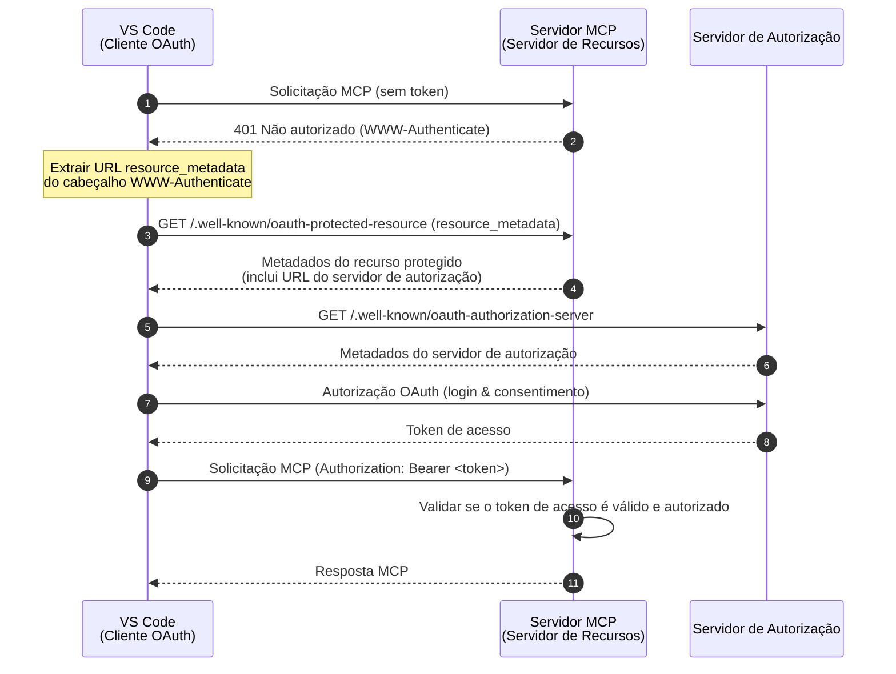
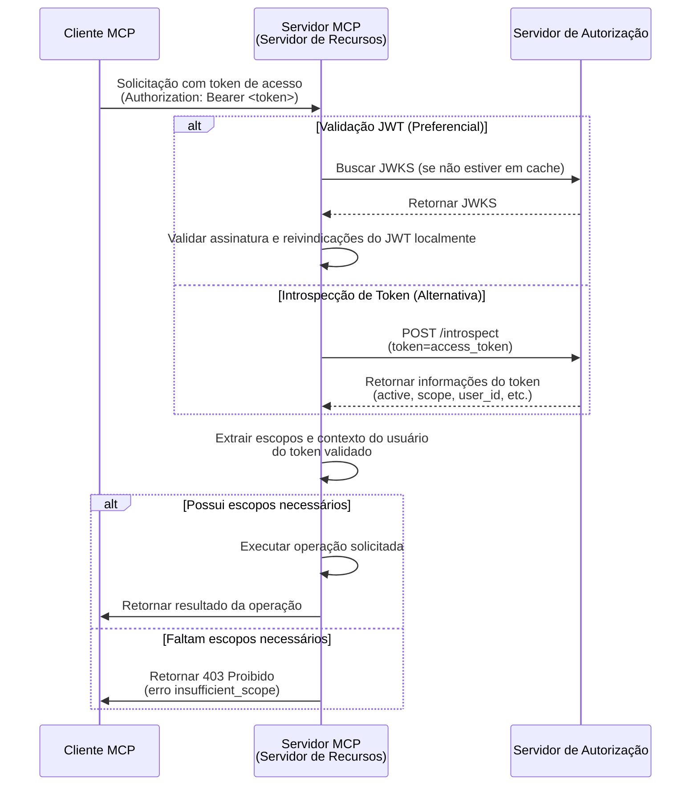

import { NpmLikeInstallation } from '@site/src/components/NpmLikeInstallation';
import TabItem from '@theme/TabItem';
import Tabs from '@theme/Tabs';

# Tutorial: Crie um gerenciador de tarefas

:::tip SDK Python disponível
MCP Auth também está disponível para Python! Confira o [repositório do SDK Python](https://github.com/mcp-auth/python) para instalação e uso.
:::

Neste tutorial, vamos construir um servidor MCP de gerenciador de tarefas com Autenticação (Authentication) e Autorização (Authorization) de usuários. Seguindo a especificação mais recente do MCP, nosso servidor MCP atuará como um **Servidor de Recursos (Resource Server)** OAuth 2.0 que valida tokens de acesso e aplica permissões baseadas em escopo.

Após concluir este tutorial, você terá:

- ✅ Uma compreensão básica de como configurar o controle de acesso baseado em papel (RBAC) em seu servidor MCP.
- ✅ Um servidor MCP que atua como um Servidor de Recursos, consumindo tokens de acesso emitidos por um Servidor de Autorização.
- ✅ Uma implementação funcional de aplicação de permissões baseadas em escopo para operações de tarefas.

## Visão geral \{#overview}

O tutorial envolverá os seguintes componentes:

- **Cliente MCP (VS Code)**: Um editor de código com suporte MCP integrado que atua como um cliente OAuth 2.0/OIDC. Ele inicia o fluxo de autorização com o servidor de autorização e obtém tokens de acesso para autenticar solicitações ao servidor MCP.
- **Servidor de Autorização**: Um provedor OAuth 2.1 ou OpenID Connect que gerencia identidades de usuários, autentica usuários e emite tokens de acesso com escopos apropriados para clientes autorizados.
- **Servidor MCP (Servidor de Recursos)**: De acordo com a especificação mais recente do MCP, o servidor MCP atua como um Servidor de Recursos no framework OAuth 2.0. Ele valida tokens de acesso emitidos pelo servidor de autorização e aplica permissões baseadas em escopo para operações de tarefas.

Esta arquitetura segue o fluxo padrão do OAuth 2.0 onde:

- O **VS Code** solicita recursos protegidos em nome do usuário
- O **Servidor de Autorização** autentica o usuário e emite tokens de acesso
- O **Servidor MCP** valida tokens e serve recursos protegidos com base nas permissões concedidas

Aqui está um diagrama de alto nível da interação entre esses componentes:


```mermaid
sequenceDiagram
  autonumber
  participant Client as VS Code<br/>(Cliente OAuth)
  participant RS as Servidor MCP<br/>(Servidor de Recursos)
  participant AS as Servidor de Autorização

  Client->>RS: Solicitação MCP (sem token)
  RS-->>Client: 401 Não autorizado (WWW-Authenticate)
  Note over Client: Extrair URL resource_metadata<br/>do cabeçalho WWW-Authenticate

  Client->>RS: GET /.well-known/oauth-protected-resource (resource_metadata)
  RS-->>Client: Metadados do recurso protegido<br/>(inclui URL do servidor de autorização)

  Client->>AS: GET /.well-known/oauth-authorization-server
  AS-->>Client: Metadados do servidor de autorização
  Client->>AS: Autorização OAuth (login & consentimento)
  AS-->>Client: Token de acesso

  Client->>RS: Solicitação MCP (Authorization: Bearer <token>)
  RS->>RS: Validar se o token de acesso é válido e autorizado
  RS-->>Client: Resposta MCP
```

## Entenda seu servidor de autorização \{#understand-your-authorization-server}

### Tokens de acesso com escopos \{#access-tokens-with-scopes}

Para implementar [controle de acesso baseado em papel (RBAC)](https://auth.wiki/rbac) em seu servidor MCP, seu servidor de autorização precisa suportar a emissão de tokens de acesso com escopos. Escopos representam as permissões que um usuário recebeu.

<Tabs groupId="provider">
<TabItem value="logto" label="Logto">

[Logto](https://logto.io) oferece suporte a RBAC por meio de seus recursos de API (conforme [RFC 8707: Resource Indicators for OAuth 2.0](https://datatracker.ietf.org/doc/html/rfc8707)) e funcionalidades de papéis. Veja como configurar:

1. Faça login no [Logto Console](https://cloud.logto.io) (ou no seu Logto Console auto-hospedado)

2. Crie recurso de API e escopos:

   - Vá em "Recursos de API"
   - Crie um novo recurso de API chamado "Gerenciador de Tarefas"
   - Adicione os seguintes escopos:
     - `create:todos`: "Criar novas tarefas"
     - `read:todos`: "Ler todas as tarefas"
     - `delete:todos`: "Excluir qualquer tarefa"

3. Crie papéis (recomendado para facilitar o gerenciamento):

   - Vá em "Papéis"
   - Crie um papel "Admin" e atribua todos os escopos (`create:todos`, `read:todos`, `delete:todos`)
   - Crie um papel "User" e atribua apenas o escopo `create:todos`

4. Atribua permissões:
   - Vá em "Usuários"
   - Selecione um usuário
   - Você pode:
     - Atribuir papéis na aba "Papéis" (recomendado)
     - Ou atribuir escopos diretamente na aba "Permissões"

Os escopos serão incluídos na reivindicação `scope` do token de acesso JWT como uma string separada por espaços.

</TabItem>
<TabItem value="oauth-oidc" label="OAuth 2.0 / OIDC">

Provedores OAuth 2.0 / OIDC normalmente suportam controle de acesso baseado em escopo. Ao implementar RBAC:

1. Defina os escopos necessários em seu servidor de autorização
2. Configure seu cliente para solicitar esses escopos durante o fluxo de autorização
3. Certifique-se de que seu servidor de autorização inclua os escopos concedidos no token de acesso
4. Os escopos geralmente são incluídos na reivindicação `scope` do token de acesso JWT

Consulte a documentação do seu provedor para detalhes específicos sobre:

- Como definir e gerenciar escopos
- Como os escopos são incluídos no token de acesso
- Quaisquer recursos adicionais de RBAC, como gerenciamento de papéis

</TabItem>
</Tabs>

### Validando tokens e verificando permissões \{#validating-tokens-and-checking-permissions}

De acordo com a especificação mais recente do MCP, o servidor MCP atua como um **Servidor de Recursos (Resource Server)** no framework OAuth 2.0. Como Servidor de Recursos, o servidor MCP tem as seguintes responsabilidades:

1. **Validação de Token**: Verificar a autenticidade e integridade dos tokens de acesso recebidos dos clientes MCP
2. **Aplicação de Escopo**: Extrair e validar os escopos do token de acesso para determinar quais operações o cliente está autorizado a executar
3. **Proteção de Recursos**: Servir apenas recursos protegidos (executar ferramentas) quando o cliente apresentar tokens válidos com permissões suficientes

Quando seu servidor MCP recebe uma solicitação, ele executa o seguinte processo de validação:

1. Extrai o token de acesso do cabeçalho `Authorization` (formato Bearer token)
2. Valida a assinatura e expiração do token de acesso
3. Extrai os escopos e informações do usuário do token validado
4. Verifica se o token possui os escopos necessários para a operação solicitada

Por exemplo, se um usuário deseja criar uma nova tarefa, seu token de acesso deve incluir o escopo `create:todos`. Veja como funciona o fluxo de validação do Servidor de Recursos:


```mermaid
sequenceDiagram
    participant Client as Cliente MCP
    participant Server as Servidor MCP<br/>(Servidor de Recursos)
    participant Auth as Servidor de Autorização

    Client->>Server: Solicitação com token de acesso<br/>(Authorization: Bearer <token>)

    alt Validação JWT (Preferencial)
        Server->>Auth: Buscar JWKS (se não estiver em cache)
        Auth-->>Server: Retornar JWKS
        Server->>Server: Validar assinatura e reivindicações do JWT localmente
    else Introspecção de Token (Alternativa)
        Server->>Auth: POST /introspect<br/>(token=access_token)
        Auth-->>Server: Retornar informações do token<br/>(active, scope, user_id, etc.)
    end

    Server->>Server: Extrair escopos e contexto do usuário<br/>do token validado

    alt Possui escopos necessários
        Server->>Server: Executar operação solicitada
        Server->>Client: Retornar resultado da operação
    else Faltam escopos necessários
        Server->>Client: Retornar 403 Proibido<br/>(erro insufficient_scope)
    end
```

### Registro Dinâmico de Cliente \{#dynamic-client-registration}

O Registro Dinâmico de Cliente não é necessário para este tutorial, mas pode ser útil se você quiser automatizar o processo de registro do cliente MCP com seu servidor de autorização. Veja [O Registro Dinâmico de Cliente é necessário?](/provider-list#is-dcr-required) para mais detalhes.

## Entenda o RBAC no gerenciador de tarefas \{#understand-rbac-in-todo-manager}

Para fins de demonstração, implementaremos um sistema simples de controle de acesso baseado em papel (RBAC) em nosso servidor MCP gerenciador de tarefas. Isso mostrará os princípios básicos do RBAC mantendo a implementação simples.

:::note
Embora este tutorial demonstre o gerenciamento de escopos baseado em RBAC, é importante observar que nem todos os provedores de autenticação implementam o gerenciamento de escopos por meio de papéis. Alguns provedores podem ter suas próprias implementações e mecanismos exclusivos para gerenciar controle de acesso e permissões.
:::

### Ferramentas e escopos \{#tools-and-scopes}

Nosso servidor MCP gerenciador de tarefas fornece três ferramentas principais:

- `create-todo`: Cria uma nova tarefa
- `get-todos`: Lista todas as tarefas
- `delete-todo`: Exclui uma tarefa pelo ID

Para controlar o acesso a essas ferramentas, definimos os seguintes escopos:

- `create:todos`: Permite criar novas tarefas
- `delete:todos`: Permite excluir tarefas existentes
- `read:todos`: Permite consultar e recuperar a lista de todas as tarefas

### Papéis e permissões \{#roles-and-permissions}

Definiremos dois papéis com diferentes níveis de acesso:

| Papel | create:todos | read:todos | delete:todos |
| ----- | ------------ | ---------- | ------------ |
| Admin | ✅           | ✅         | ✅           |
| User  | ✅           |            |              |

- **User**: Um usuário comum que pode criar tarefas e visualizar ou excluir apenas suas próprias tarefas
- **Admin**: Um administrador que pode criar, visualizar e excluir todas as tarefas, independentemente da propriedade

### Propriedade do recurso \{#resource-ownership}

Embora a tabela de permissões acima mostre os escopos explícitos atribuídos a cada papel, há um princípio importante de propriedade de recurso a considerar:

- **Usuários** não possuem os escopos `read:todos` ou `delete:todos`, mas ainda podem:
  - Ler suas próprias tarefas
  - Excluir suas próprias tarefas
- **Admins** possuem permissões totais (`read:todos` e `delete:todos`), permitindo que:
  - Visualizem todas as tarefas do sistema
  - Excluam qualquer tarefa, independentemente da propriedade

Isso demonstra um padrão comum em sistemas RBAC onde a propriedade do recurso concede permissões implícitas aos usuários para seus próprios recursos, enquanto papéis administrativos recebem permissões explícitas para todos os recursos.

:::tip Saiba mais
Para se aprofundar nos conceitos e melhores práticas de RBAC, confira [Dominando RBAC: Um Exemplo Abrangente do Mundo Real](https://blog.logto.io/mastering-rbac).
:::

## Configure a autorização em seu provedor \{#configure-authorization-in-your-provider}

Para implementar o sistema de controle de acesso que descrevemos anteriormente, você precisará configurar seu servidor de autorização para suportar os escopos necessários. Veja como fazer isso com diferentes provedores:

<Tabs groupId="provider">
<TabItem value="logto" label="Logto">

[Logto](https://logto.io) oferece suporte a RBAC por meio de recursos de API e funcionalidades de papéis. Veja como configurar:

1. Faça login no [Logto Console](https://cloud.logto.io) (ou no seu Logto Console auto-hospedado)

2. Crie recurso de API e escopos:

   - Vá em "Recursos de API"
   - Crie um novo recurso de API chamado "Gerenciador de Tarefas" usando `http://localhost:3001/` como indicador de recurso.
     - **Importante**: O indicador de recurso deve corresponder à URL do seu servidor MCP. Para este tutorial, usamos `http://localhost:3001/` já que nosso servidor MCP roda na porta 3001. Em produção, use a URL real do seu servidor MCP (ex: `https://seu-servidor-mcp.exemplo.com/`).
   - Crie os seguintes escopos:
     - `create:todos`: "Criar novas tarefas"
     - `read:todos`: "Ler todas as tarefas"
     - `delete:todos`: "Excluir qualquer tarefa"

3. Crie papéis (recomendado para facilitar o gerenciamento):

   - Vá em "Papéis"
   - Crie um papel "Admin" e atribua todos os escopos (`create:todos`, `read:todos`, `delete:todos`)
   - Crie um papel "User" e atribua apenas o escopo `create:todos`
   - Na página de detalhes do papel "User", vá para a aba "Geral" e defina o papel "User" como o "Papel padrão".

4. Gerencie papéis e permissões dos usuários:
   - Para novos usuários:
     - Eles receberão automaticamente o papel "User" já que o definimos como padrão
   - Para usuários existentes:
     - Vá em "Gerenciamento de usuários"
     - Selecione um usuário
     - Atribua papéis ao usuário na aba "Papéis"

:::tip Gerenciamento de Papéis Programático
Você também pode usar a [Management API](https://docs.logto.io/integrate-logto/interact-with-management-api) do Logto para gerenciar papéis de usuários programaticamente. Isso é especialmente útil para automação ou ao construir painéis administrativos.
:::

Ao solicitar um token de acesso, o Logto incluirá os escopos na reivindicação `scope` do token com base nas permissões do papel do usuário.

</TabItem>
<TabItem value="oauth-or-oidc" label="OAuth 2 / OIDC">

Para provedores OAuth 2.0 ou OpenID Connect, você precisará configurar os escopos que representam diferentes permissões. Os passos exatos dependerão do seu provedor, mas geralmente:

1. Defina escopos:

   - Configure seu servidor de autorização para suportar:
     - `create:todos`
     - `read:todos`
     - `delete:todos`

2. Configure o cliente:

   - Registre ou atualize seu cliente para solicitar esses escopos
   - Certifique-se de que os escopos estejam incluídos no token de acesso

3. Atribua permissões:
   - Use a interface do seu provedor para conceder escopos apropriados aos usuários
   - Alguns provedores podem suportar gerenciamento baseado em papéis, enquanto outros podem usar atribuições diretas de escopos
   - Consulte a documentação do seu provedor para a abordagem recomendada

:::tip
A maioria dos provedores incluirá os escopos concedidos na reivindicação `scope` do token de acesso. O formato normalmente é uma string de escopos separados por espaço.
:::

</TabItem>
</Tabs>

:::note[Barra no final do indicador de recurso]
Sempre inclua uma barra (`/`) no final do indicador de recurso. Devido a um bug atual no SDK oficial do MCP, clientes que usam o SDK adicionarão automaticamente uma barra ao final dos identificadores de recurso ao iniciar solicitações de autenticação. Se seu indicador de recurso não incluir a barra, a validação do recurso falhará para esses clientes. (O VS Code não é afetado por esse bug.)
:::

Após configurar seu servidor de autorização, os usuários receberão tokens de acesso contendo seus escopos concedidos. O servidor MCP usará esses escopos para determinar:

- Se um usuário pode criar novas tarefas (`create:todos`)
- Se um usuário pode visualizar todas as tarefas (`read:todos`) ou apenas as suas próprias
- Se um usuário pode excluir qualquer tarefa (`delete:todos`) ou apenas as suas próprias

## Configure o servidor MCP \{#set-up-the-mcp-server}

Usaremos os [SDKs oficiais do MCP](https://github.com/modelcontextprotocol) para criar nosso servidor MCP gerenciador de tarefas.

### Crie um novo projeto \{#create-a-new-project}

Configure um novo projeto Node.js:

```bash
mkdir mcp-server
cd mcp-server
npm init -y # Ou use `pnpm init`
npm pkg set type="module"
npm pkg set main="todo-manager.ts"
npm pkg set scripts.start="node --experimental-strip-types todo-manager.ts"
```

:::note
Estamos usando TypeScript em nossos exemplos, pois o Node.js v22.6.0+ suporta execução nativa de TypeScript usando a flag `--experimental-strip-types`. Se você estiver usando JavaScript, o código será semelhante - apenas certifique-se de usar Node.js v22.6.0 ou superior. Veja a documentação do Node.js para detalhes.
:::

### Instale o SDK MCP e dependências \{#install-the-mcp-sdk-and-dependencies}

```bash
npm install @modelcontextprotocol/sdk express zod
```

Ou qualquer outro gerenciador de pacotes de sua preferência, como `pnpm` ou `yarn`.

### Crie o servidor MCP \{#create-the-mcp-server}

Crie um arquivo chamado `todo-manager.ts` e adicione o seguinte código:

```ts
// todo-manager.ts

import { z } from 'zod';
import { McpServer } from '@modelcontextprotocol/sdk/server/mcp.js';
import { StreamableHTTPServerTransport } from '@modelcontextprotocol/sdk/server/streamableHttp.js';
import express, { type Request, type Response } from 'express';

// Função de fábrica para criar uma instância do servidor MCP
// No modo stateless, cada requisição precisa de sua própria instância do servidor
const createMcpServer = () => {
  const mcpServer = new McpServer({
    name: 'Gerenciador de Tarefas',
    version: '0.0.0',
  });

  mcpServer.registerTool(
    'create-todo',
    {
      description: 'Criar uma nova tarefa',
      inputSchema: { content: z.string() },
    },
    async ({ content }) => {
      return {
        content: [{ type: 'text', text: JSON.stringify({ error: 'Não implementado' }) }],
      };
    }
  );

  mcpServer.registerTool(
    'get-todos',
    {
      description: 'Listar todas as tarefas',
      inputSchema: {},
    },
    async () => {
      return {
        content: [{ type: 'text', text: JSON.stringify({ error: 'Não implementado' }) }],
      };
    }
  );

  mcpServer.registerTool(
    'delete-todo',
    {
      description: 'Excluir uma tarefa pelo id',
      inputSchema: { id: z.string() },
    },
    async ({ id }) => {
      return {
        content: [{ type: 'text', text: JSON.stringify({ error: 'Não implementado' }) }],
      };
    }
  );

  return mcpServer;
};

// Abaixo está o código boilerplate da documentação do SDK MCP
const PORT = 3001;
const app = express();

app.post('/', async (request: Request, response: Response) => {
  // No modo stateless, crie uma nova instância de transporte e servidor para cada requisição
  // para garantir isolamento completo. Uma única instância causaria colisão de IDs de requisição
  // quando múltiplos clientes conectam simultaneamente.
  const mcpServer = createMcpServer();

  try {
    const transport = new StreamableHTTPServerTransport({
      sessionIdGenerator: undefined,
    });
    await mcpServer.connect(transport);
    await transport.handleRequest(request, response, request.body);
    response.on('close', () => {
      console.log('Requisição encerrada');
      void transport.close();
      void mcpServer.close();
    });
  } catch (error) {
    console.error('Erro ao lidar com a requisição MCP:', error);
    if (!response.headersSent) {
      response.status(500).json({
        jsonrpc: '2.0',
        error: {
          code: -32_603,
          message: 'Erro interno do servidor',
        },
        id: null,
      });
    }
  }
});

app.listen(PORT);
```

Execute o servidor com:

```bash
npm start
```

## Integre com seu servidor de autorização \{#integrate-with-your-authorization-server}

Para concluir esta seção, há várias considerações a serem feitas:

<details>
<summary>**A URL do emissor do seu servidor de autorização**</summary>

Normalmente é a URL base do seu servidor de autorização, como `https://auth.exemplo.com`. Alguns provedores podem ter um caminho como `https://exemplo.logto.app/oidc`, então verifique a documentação do seu provedor.

</details>

<details>
<summary>**Como obter os metadados do servidor de autorização**</summary>

- Se seu servidor de autorização está em conformidade com [OAuth 2.0 Authorization Server Metadata](https://datatracker.ietf.org/doc/html/rfc8414) ou [OpenID Connect Discovery](https://openid.net/specs/openid-connect-discovery-1_0.html), você pode usar as utilidades integradas do MCP Auth para buscar os metadados automaticamente.
- Se seu servidor de autorização não está em conformidade com esses padrões, você precisará especificar manualmente a URL dos metadados ou endpoints na configuração do servidor MCP. Consulte a documentação do seu provedor para os endpoints específicos.

</details>

<details>
<summary>**Como registrar o cliente MCP em seu servidor de autorização**</summary>

- Se seu servidor de autorização suporta [Registro Dinâmico de Cliente](https://datatracker.ietf.org/doc/html/rfc7591), você pode pular esta etapa, pois o cliente MCP se registrará automaticamente.
- Se seu servidor de autorização não suporta Registro Dinâmico de Cliente, você precisará registrar manualmente o cliente MCP em seu servidor de autorização.

</details>

<details>
<summary>**Entenda os parâmetros de solicitação de token**</summary>

Ao solicitar tokens de acesso de diferentes servidores de autorização, você encontrará várias abordagens para especificar o recurso alvo e permissões. Aqui estão os principais padrões:

- **Baseado em indicador de recurso**:

  - Usa o parâmetro `resource` para especificar a API alvo (veja [RFC 8707: Resource Indicators for OAuth 2.0](https://datatracker.ietf.org/doc/html/rfc8707))
  - Comum em implementações modernas de OAuth 2.0
  - Exemplo de solicitação:
    ```json
    {
      "resource": "http://localhost:3001/",
      "scope": "create:todos read:todos"
    }
    ```
  - O servidor emite tokens vinculados especificamente ao recurso solicitado

- **Baseado em audiência**:

  - Usa o parâmetro `audience` para especificar o destinatário pretendido do token
  - Semelhante a indicadores de recurso, mas com semânticas diferentes
  - Exemplo de solicitação:
    ```json
    {
      "audience": "todo-api",
      "scope": "create:todos read:todos"
    }
    ```

- **Baseado apenas em escopo**:
  - Depende apenas de escopos sem parâmetros de recurso/audiência
  - Abordagem tradicional do OAuth 2.0
  - Exemplo de solicitação:
    ```json
    {
      "scope": "todo-api:create todo-api:read openid profile"
    }
    ```
  - Frequentemente usa escopos prefixados para namespacing de permissões
  - Comum em implementações OAuth 2.0 mais simples

:::tip Melhores Práticas

- Verifique a documentação do seu provedor para os parâmetros suportados
- Alguns provedores suportam múltiplas abordagens simultaneamente
- Indicadores de recurso fornecem melhor segurança por restrição de audiência
- Considere usar indicadores de recurso quando disponíveis para melhor controle de acesso
  :::

</details>

Embora cada provedor possa ter requisitos específicos, os passos a seguir irão guiá-lo pelo processo de integração do VS Code e do servidor MCP com configurações específicas do provedor.

### Registre o cliente MCP como um app de terceiros \{#register-mcp-client-as-a-third-party-app}

<Tabs groupId="provider">
<TabItem value="logto" label="Logto">

Integrar o gerenciador de tarefas com o [Logto](https://logto.io) é simples, pois é um provedor OpenID Connect que suporta indicadores de recurso e escopos, permitindo proteger sua API de tarefas com `http://localhost:3001/` como indicador de recurso.

Como o Logto ainda não suporta Registro Dinâmico de Cliente, você precisará registrar manualmente seu cliente MCP (VS Code) como um app de terceiros em seu tenant Logto:

1. Faça login no [Logto Console](https://cloud.logto.io) (ou no seu Logto Console auto-hospedado).
2. Navegue até **Aplicativos > Apps de terceiros** e clique em "Criar aplicativo".
3. Selecione **Aplicativo Nativo** como tipo de aplicativo.
4. Preencha os detalhes do aplicativo:
   - **Nome do aplicativo**: Insira um nome, ex: "Cliente MCP".
   - **Descrição**: Insira uma descrição, ex: "Cliente MCP para VS Code".
5. Defina os seguintes **URIs de redirecionamento** para o VS Code:
   ```
   http://127.0.0.1
   https://vscode.dev/redirect
   ```
6. Clique em "Salvar alterações".
7. Vá até a aba **Permissões** do app, na seção **Usuário**, adicione as permissões `create:todos`, `read:todos` e `delete:todos` do recurso de API **Gerenciador de Tarefas** que você criou anteriormente.
8. No cartão superior, você verá o valor "App ID". Copie para uso posterior.

</TabItem>
<TabItem value="oauth-oidc" label="OAuth 2.0 / OIDC">

:::note
Este é um guia genérico de integração com provedores OAuth 2.0 / OpenID Connect. Ambos seguem etapas semelhantes, pois OIDC é construído sobre OAuth 2.0. Consulte a documentação do seu provedor para detalhes específicos.
:::

Se seu provedor suporta Registro Dinâmico de Cliente, você pode pular o registro manual; caso contrário, será necessário registrar manualmente o cliente MCP:

1. Faça login no console do seu provedor.

2. Navegue até a seção "Aplicativos" ou "Clientes" e crie um novo aplicativo ou cliente.

3. Se seu provedor exigir um tipo de cliente, selecione "Aplicativo Nativo" ou "Cliente Público".

4. Após criar o aplicativo, configure os URIs de redirecionamento. Para o VS Code, adicione:

   ```
   http://127.0.0.1
   https://vscode.dev/redirect
   ```

5. Configure os escopos/permissões necessários para o aplicativo:

   ```text
   create:todos read:todos delete:todos
   ```

6. Encontre o "Client ID" ou "Application ID" do novo aplicativo e copie para uso posterior.

</TabItem>
</Tabs>

### Configure o MCP Auth \{#set-up-mcp-auth}

Primeiro, instale o SDK MCP Auth em seu projeto do servidor MCP.

<NpmLikeInstallation packageName="mcp-auth" />

Agora precisamos inicializar o MCP Auth em seu servidor MCP. No modo de recurso protegido, você precisa configurar seus metadados de recurso incluindo os servidores de autorização.

Existem duas formas de configurar servidores de autorização:

- **Pré-busca (Recomendado)**: Use `fetchServerConfig()` para buscar os metadados antes de inicializar o MCPAuth. Isso garante que a configuração seja validada na inicialização.
- **Descoberta sob demanda**: Forneça apenas `issuer` e `type` - os metadados serão buscados sob demanda quando necessário. Útil para runtimes edge (como Cloudflare Workers) onde fetch assíncrono no topo do arquivo não é permitido.

#### Configure os metadados do recurso protegido \{#configure-protected-resource-metadata}

Primeiro, obtenha a URL do emissor do seu servidor de autorização:

<Tabs groupId="provider">

<TabItem value="logto" label="Logto">

No Logto, você pode encontrar a URL do emissor na página de detalhes do seu aplicativo dentro do Logto Console, na seção "Endpoints & Credentials / Issuer endpoint". Deve ser algo como `https://meu-projeto.logto.app/oidc`.

</TabItem>

<TabItem value="oauth-oidc" label="OAuth 2.0 / OIDC">

Para provedores OAuth 2.0, você precisará:

1. Verificar a documentação do seu provedor para a URL do servidor de autorização (geralmente chamada de issuer URL ou base URL)
2. Alguns provedores expõem isso em `https://{seu-dominio}/.well-known/oauth-authorization-server`
3. Procurar no console administrativo do seu provedor em configurações OAuth/API

</TabItem>

</Tabs>

Agora, configure os Metadados do Recurso Protegido ao construir a instância do MCP Auth:

```js
// todo-manager.ts

import { MCPAuth, fetchServerConfig } from 'mcp-auth';

const issuerUrl = '<issuer-url>'; // Substitua pela URL do emissor do seu servidor de autorização

// Defina o identificador do recurso para este servidor MCP
const resourceId = 'http://localhost:3001/';

// Pré-busca da configuração do servidor de autorização (recomendado)
const authServerConfig = await fetchServerConfig(issuerUrl, { type: 'oidc' });

// Configure o MCP Auth com os metadados do recurso protegido
const mcpAuth = new MCPAuth({
  protectedResources: {
    metadata: {
      resource: resourceId,
      authorizationServers: [authServerConfig],
      // Escopos que este servidor MCP entende
      scopesSupported: ['create:todos', 'read:todos', 'delete:todos'],
    },
  },
});
```

### Atualize o servidor MCP \{#update-mcp-server}

Estamos quase lá! É hora de atualizar o servidor MCP para aplicar a rota e middleware do MCP Auth, e então implementar o controle de acesso baseado em permissões para as ferramentas do gerenciador de tarefas com base nos escopos do usuário.

Agora, aplique as rotas de metadados de recurso protegido para que clientes MCP possam recuperar os metadados esperados do recurso a partir do servidor MCP.

```ts
// todo-manager.ts

// Configure as rotas de Metadados do Recurso Protegido
// Isso expõe metadados sobre este servidor de recursos para clientes OAuth
app.use(mcpAuth.protectedResourceMetadataRouter());
```

Em seguida, aplicaremos o middleware MCP Auth ao servidor MCP. Este middleware irá lidar com a autenticação e autorização das requisições recebidas, garantindo que apenas usuários autorizados acessem as ferramentas do gerenciador de tarefas.

```ts
// todo-manager.ts

app.use(mcpAuth.protectedResourceMetadataRouter());

// Aplique o middleware MCP Auth
app.use(
  mcpAuth.bearerAuth('jwt', {
    resource: resourceId,
    audience: resourceId,
  })
);
```

Neste ponto, podemos atualizar as ferramentas do gerenciador de tarefas para aproveitar o middleware MCP Auth para autenticação e autorização.

Vamos atualizar a implementação das ferramentas.

```js
// todo-manager.ts

// outros imports...
import assert from 'node:assert';
import { fetchServerConfig, MCPAuth, MCPAuthBearerAuthError } from 'mcp-auth';
import { type AuthInfo } from '@modelcontextprotocol/sdk/server/auth/types.js';

// Será mencionado na próxima seção
import { TodoService } from './todo-service.js';

const assertUserId = (authInfo?: AuthInfo) => {
  const { subject } = authInfo ?? {};
  assert(subject, 'Informação de autenticação inválida');
  return subject;
};

const hasRequiredScopes = (userScopes: string[], requiredScopes: string[]): boolean => {
  return requiredScopes.every((scope) => userScopes.includes(scope));
};

// TodoService é singleton pois precisamos compartilhar estado entre requisições
const todoService = new TodoService();

// Função de fábrica para criar uma instância do servidor MCP
// No modo stateless, cada requisição precisa de sua própria instância do servidor
const createMcpServer = () => {
  const mcpServer = new McpServer({
    name: 'Gerenciador de Tarefas',
    version: '0.0.0',
  });

  mcpServer.registerTool(
    'create-todo',
    {
      description: 'Criar uma nova tarefa',
      inputSchema: { content: z.string() },
    },
    ({ content }, { authInfo }) => {
      const userId = assertUserId(authInfo);

      /**
       * Apenas usuários com o escopo 'create:todos' podem criar tarefas
       */
      if (!hasRequiredScopes(authInfo?.scopes ?? [], ['create:todos'])) {
        throw new MCPAuthBearerAuthError('missing_required_scopes');
      }

      const createdTodo = todoService.createTodo({ content, ownerId: userId });

      return {
        content: [{ type: 'text', text: JSON.stringify(createdTodo) }],
      };
    }
  );

  mcpServer.registerTool(
    'get-todos',
    {
      description: 'Listar todas as tarefas',
      inputSchema: {},
    },
    (_params, { authInfo }) => {
      const userId = assertUserId(authInfo);

      /**
       * Se o usuário possui o escopo 'read:todos', pode acessar todas as tarefas (todoOwnerId = undefined)
       * Se não possui, pode acessar apenas suas próprias tarefas (todoOwnerId = userId)
       */
      const todoOwnerId = hasRequiredScopes(authInfo?.scopes ?? [], ['read:todos'])
        ? undefined
        : userId;

      const todos = todoService.getAllTodos(todoOwnerId);

      return {
        content: [{ type: 'text', text: JSON.stringify(todos) }],
      };
    }
  );

  mcpServer.registerTool(
    'delete-todo',
    {
      description: 'Excluir uma tarefa pelo id',
      inputSchema: { id: z.string() },
    },
    ({ id }, { authInfo }) => {
      const userId = assertUserId(authInfo);

      const todo = todoService.getTodoById(id);

      if (!todo) {
        return {
          content: [{ type: 'text', text: JSON.stringify({ error: 'Falha ao excluir tarefa' }) }],
        };
      }

      /**
       * Usuários só podem excluir suas próprias tarefas
       * Usuários com o escopo 'delete:todos' podem excluir qualquer tarefa
       */
      if (todo.ownerId !== userId && !hasRequiredScopes(authInfo?.scopes ?? [], ['delete:todos'])) {
        return {
          content: [
            {
              type: 'text',
              text: JSON.stringify({ error: 'Falha ao excluir tarefa' }),
            },
          ],
        };
      }

      const deletedTodo = todoService.deleteTodo(id);

      return {
        content: [
          {
            type: 'text',
            text: JSON.stringify({
              message: `Tarefa ${id} excluída`,
              details: deletedTodo,
            }),
          },
        ],
      };
    }
  );

  return mcpServer;
};
```

Agora, crie o "serviço de tarefas" usado no código acima para implementar a funcionalidade relacionada:

Crie o arquivo `todo-service.ts` para o serviço de tarefas:

```ts
// todo-service.ts

type Todo = {
  id: string;
  content: string;
  ownerId: string;
  createdAt: string;
};

/**
 * Um serviço simples de tarefas para fins de demonstração.
 * Usa um array em memória para armazenar tarefas
 */
export class TodoService {
  private readonly todos: Todo[] = [];

  getAllTodos(ownerId?: string): Todo[] {
    if (ownerId) {
      return this.todos.filter((todo) => todo.ownerId === ownerId);
    }
    return this.todos;
  }

  getTodoById(id: string): Todo | undefined {
    return this.todos.find((todo) => todo.id === id);
  }

  createTodo({ content, ownerId }: { content: string; ownerId: string }): Todo {
    const todo: Todo = {
      id: this.genId(),
      content,
      ownerId,
      createdAt: new Date().toISOString(),
    };

    // eslint-disable-next-line @silverhand/fp/no-mutating-methods
    this.todos.push(todo);
    return todo;
  }

  deleteTodo(id: string): Todo | undefined {
    const index = this.todos.findIndex((todo) => todo.id === id);

    if (index === -1) {
      return undefined;
    }

    // eslint-disable-next-line @silverhand/fp/no-mutating-methods
    const [deleted] = this.todos.splice(index, 1);
    return deleted;
  }

  private genId(): string {
    return Math.random().toString(36).slice(2, 10);
  }
}
```

Parabéns! Implementamos com sucesso um servidor MCP completo com Autenticação (Authentication) e Autorização (Authorization)!

:::info
Confira o [repositório do SDK MCP Auth Node.js](https://github.com/mcp-auth/js/blob/master/packages/sample-servers/src) para o código completo do servidor MCP (versão OIDC).
:::

## Checkpoint: Execute as ferramentas `todo-manager` \{#checkpoint-run-the-todo-manager-tools}

Reinicie seu servidor MCP e conecte o VS Code a ele. Veja como conectar com autenticação:

1. No VS Code, pressione `Command + Shift + P` (macOS) ou `Ctrl + Shift + P` (Windows/Linux) para abrir a Paleta de Comandos.
2. Digite `MCP: Add Server...` e selecione.
3. Escolha `HTTP` como tipo de servidor.
4. Insira a URL do servidor MCP: `http://localhost:3001`
5. Após uma solicitação OAuth ser iniciada, o VS Code solicitará que você insira o **App ID**. Insira o App ID que você copiou do seu servidor de autorização.
6. Como não temos um **App Secret** (é um cliente público), apenas pressione Enter para pular.
7. Complete o fluxo de login no seu navegador.

Depois de fazer login e retornar ao VS Code, repita as ações do checkpoint anterior para executar as ferramentas do gerenciador de tarefas. Desta vez, você poderá usar essas ferramentas com sua identidade de usuário autenticada. O comportamento das ferramentas dependerá dos papéis e permissões atribuídos ao seu usuário:

- Se você estiver logado como **User** (com apenas o escopo `create:todos`):

  - Pode criar novas tarefas usando a ferramenta `create-todo`
  - Só pode visualizar e excluir suas próprias tarefas
  - Não poderá ver ou excluir tarefas de outros usuários

- Se estiver logado como **Admin** (com todos os escopos: `create:todos`, `read:todos`, `delete:todos`):
  - Pode criar novas tarefas
  - Pode visualizar todas as tarefas do sistema usando a ferramenta `get-todos`
  - Pode excluir qualquer tarefa usando a ferramenta `delete-todo`, independentemente de quem a criou

Você pode testar esses diferentes níveis de permissão:

1. Desconectando do servidor MCP (remova a configuração do servidor no VS Code)
2. Fazendo login com outra conta de usuário que tenha papéis/permissões diferentes
3. Tentando as mesmas ferramentas novamente para observar como o comportamento muda de acordo com as permissões do usuário

Isso demonstra como o controle de acesso baseado em papel (RBAC) funciona na prática, onde diferentes usuários têm diferentes níveis de acesso à funcionalidade do sistema.

:::info
Confira o [repositório do SDK MCP Auth Node.js](https://github.com/mcp-auth/js/blob/master/packages/sample-servers/src) para o código completo do servidor MCP (versão OIDC).
:::

## Notas finais \{#closing-notes}

Parabéns! Você concluiu com sucesso o tutorial. Vamos recapitular o que fizemos:

- Configuração de um servidor MCP básico com ferramentas de gerenciamento de tarefas (`create-todo`, `get-todos`, `delete-todo`)
- Implementação de controle de acesso baseado em papel (RBAC) com diferentes níveis de permissão para usuários e administradores
- Integração do servidor MCP com um servidor de autorização usando MCP Auth
- Configuração do VS Code para autenticar usuários e usar tokens de acesso com escopos para chamar ferramentas

Não deixe de conferir outros tutoriais e a documentação para aproveitar ao máximo o MCP Auth.