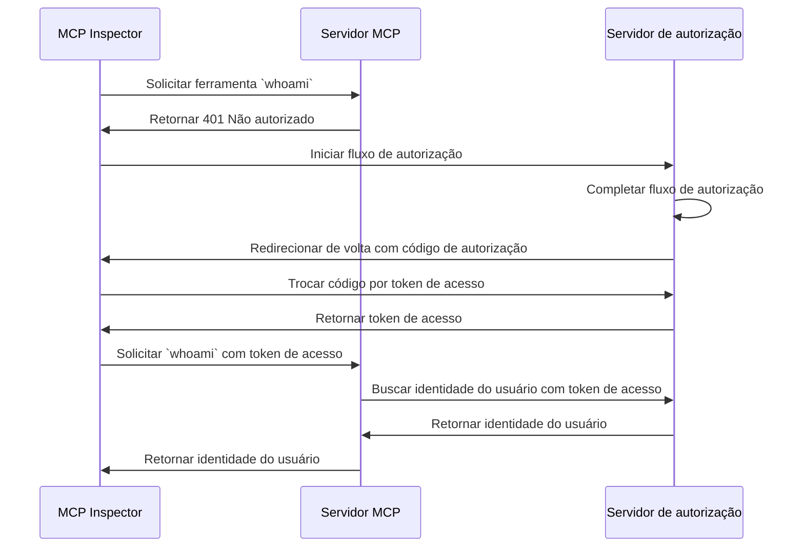

import TabItem from '@theme/TabItem';
import Tabs from '@theme/Tabs';

import SetupOauth from './_setup-oauth.mdx';
import SetupOidc from './_setup-oidc.mdx';

# Tutorial: Quem sou eu? (Who am I?)

Este tutorial irá guiá-lo pelo processo de configuração do MCP Auth para autenticar usuários e recuperar suas informações de identidade do servidor de autorização.

Após concluir este tutorial, você terá:

- ✅ Uma compreensão básica de como usar o MCP Auth para autenticar usuários.
- ✅ Um servidor MCP que oferece uma ferramenta para recuperar informações de identidade do usuário.

## Visão geral (Overview) \{#overview}

O tutorial envolverá os seguintes componentes:

- **Servidor MCP**: Um servidor MCP simples que utiliza os SDKs oficiais do MCP para lidar com requisições.
- **MCP inspector**: Uma ferramenta visual de testes para servidores MCP. Também atua como um cliente OAuth / OIDC para iniciar o fluxo de autorização e recuperar tokens de acesso.
- **Servidor de autorização (Authorization server)**: Um provedor OAuth 2.1 ou OpenID Connect que gerencia identidades de usuários e emite tokens de acesso.

Aqui está um diagrama de alto nível da interação entre esses componentes:



## Entenda seu servidor de autorização (Understand your authorization server) \{#understand-your-authorization-server}

### Recuperando informações de identidade do usuário (Retrieving user identity information) \{#retrieving-user-identity-information}

Para concluir este tutorial, seu servidor de autorização deve oferecer uma API para recuperar informações de identidade do usuário:

<Tabs groupId="provider">
<TabItem value="logto" label="Logto">

[Logto](https://logto.io) é um provedor OpenID Connect que suporta o [endpoint userinfo](https://openid.net/specs/openid-connect-core-1_0.html#UserInfo) padrão para recuperar informações de identidade do usuário.

Para obter um token de acesso que possa ser usado para acessar o endpoint userinfo, pelo menos dois escopos são necessários: `openid` e `profile`. Você pode continuar lendo, pois abordaremos a configuração de escopos mais adiante.

</TabItem>
<TabItem value="keycloak" label="Keycloak">

[Keycloak](https://www.keycloak.org) é uma solução open-source de gerenciamento de identidade e acesso que suporta múltiplos protocolos, incluindo OpenID Connect (OIDC). Como provedor OIDC, ele implementa o [endpoint userinfo](https://openid.net/specs/openid-connect-core-1_0.html#UserInfo) padrão para recuperar informações de identidade do usuário.

Para obter um token de acesso que possa ser usado para acessar o endpoint userinfo, pelo menos dois escopos são necessários: `openid` e `profile`. Você pode continuar lendo, pois abordaremos a configuração de escopos mais adiante.

</TabItem>

<TabItem value="asgardeo" label="Asgardeo">

[Asgardeo](https://wso2.com/asgardeo) é uma plataforma IDaaS nativa em nuvem que suporta OAuth 2.0 e OpenID Connect (OIDC), fornecendo gerenciamento robusto de identidade e acesso para aplicações modernas.

As informações do usuário são codificadas dentro do Token de ID retornado junto com o token de acesso. Mas, como provedor OIDC, o Asgardeo expõe um [endpoint UserInfo](https://wso2.com/asgardeo/docs/guides/authentication/oidc/request-user-info/) que permite que aplicações recuperem reivindicações sobre o usuário autenticado no payload.

Você também pode descobrir esse endpoint dinamicamente via o [endpoint de descoberta OIDC](https://wso2.com/asgardeo/docs/guides/authentication/oidc/discover-oidc-configs) ou navegando até a aba 'Info' do aplicativo no Console Asgardeo.

Para obter um token de acesso que possa ser usado para acessar o endpoint userinfo, pelo menos dois escopos são necessários: `openid` e `profile`.
</TabItem>
<TabItem value="oidc" label="OIDC">

A maioria dos provedores OpenID Connect suporta o [endpoint userinfo](https://openid.net/specs/openid-connect-core-1_0.html#UserInfo) para recuperar informações de identidade do usuário.

Verifique a documentação do seu provedor para ver se ele suporta esse endpoint. Se seu provedor suporta [OpenID Connect Discovery](https://openid.net/specs/openid-connect-discovery-1_0.html), você também pode verificar se o `userinfo_endpoint` está incluído no documento de descoberta (resposta do endpoint `.well-known/openid-configuration`).

Para obter um token de acesso que possa ser usado para acessar o endpoint userinfo, pelo menos dois escopos são necessários: `openid` e `profile`. Verifique a documentação do seu provedor para ver o mapeamento de escopos para reivindicações de identidade do usuário.

</TabItem>
<TabItem value="oauth" label="OAuth 2">

Embora o OAuth 2.0 não defina uma maneira padrão de recuperar informações de identidade do usuário, muitos provedores implementam seus próprios endpoints para isso. Verifique a documentação do seu provedor para saber como recuperar informações de identidade do usuário usando um token de acesso e quais parâmetros são necessários para obter esse token ao invocar o fluxo de autorização.

</TabItem>
</Tabs>

### Registro dinâmico de cliente (Dynamic Client Registration) \{#dynamic-client-registration}

O Registro Dinâmico de Cliente não é necessário para este tutorial, mas pode ser útil se você quiser automatizar o processo de registro do cliente MCP com seu servidor de autorização. Consulte [O Registro Dinâmico de Cliente é necessário?](../../provider-list.mdx#is-dcr-required) para mais detalhes.

## Configure o servidor MCP (Set up the MCP server) \{#set-up-the-mcp-server}

Usaremos os [SDKs oficiais do MCP](https://github.com/modelcontextprotocol) para criar um servidor MCP com uma ferramenta `whoami` que recupera informações de identidade do usuário do servidor de autorização.

### Crie um novo projeto (Create a new project) \{#create-a-new-project}

<Tabs groupId="sdk">
<TabItem value="python" label="Python">

```bash
mkdir mcp-server
cd mcp-server
uv init # Ou use `pipenv` ou `poetry` para criar um novo ambiente virtual
```

</TabItem>
<TabItem value="node" label="Node.js">

Configure um novo projeto Node.js:

```bash
mkdir mcp-server
cd mcp-server
npm init -y # Ou use `pnpm init`
npm pkg set type="module"
npm pkg set main="whoami.js"
npm pkg set scripts.start="node whoami.js"
```

</TabItem>
</Tabs>

### Instale o MCP SDK e dependências (Install the MCP SDK and dependencies) \{#install-the-mcp-sdk-and-dependencies}

<Tabs groupId="sdk">
<TabItem value="python" label="Python">

```bash
pip install "mcp[cli]" starlette uvicorn
```

Ou qualquer outro gerenciador de pacotes de sua preferência, como `uv` ou `poetry`.

</TabItem>
<TabItem value="node" label="Node.js">

```bash
npm install @modelcontextprotocol/sdk express
```

Ou qualquer outro gerenciador de pacotes de sua preferência, como `pnpm` ou `yarn`.

</TabItem>
</Tabs>

### Crie o servidor MCP (Create the MCP server) \{#create-the-mcp-server}

Primeiro, vamos criar um servidor MCP que implementa uma ferramenta `whoami`.

<Tabs groupId="sdk">
<TabItem value="python" label="Python">

Crie um arquivo chamado `whoami.py` e adicione o seguinte código:

```python
from mcp.server.fastmcp import FastMCP
from starlette.applications import Starlette
from starlette.routing import Mount
from typing import Any

mcp = FastMCP("WhoAmI")

@mcp.tool()
def whoami() -> dict[str, Any]:
    """Uma ferramenta que retorna as informações do usuário atual."""
    return {"error": "Not authenticated"}

app = Starlette(
    routes=[Mount('/', app=mcp.sse_app())]
)
```

Execute o servidor com:

```bash
uvicorn whoami:app --host 0.0.0.0 --port 3001
```

</TabItem>
<TabItem value="node" label="Node.js">

:::note
Como a implementação atual do MCP inspector não lida com fluxos de autorização, usaremos a abordagem SSE para configurar o servidor MCP. Atualizaremos o código aqui assim que o MCP inspector suportar fluxos de autorização.
:::

Você também pode usar `pnpm` ou `yarn` se preferir.

Crie um arquivo chamado `whoami.js` e adicione o seguinte código:

```js
import { McpServer } from '@modelcontextprotocol/sdk/server/mcp.js';
import { SSEServerTransport } from '@modelcontextprotocol/sdk/server/sse.js';
import express from 'express';

// Crie um servidor MCP
const server = new McpServer({
  name: 'WhoAmI',
  version: '0.0.0',
});

// Adicione uma ferramenta ao servidor que retorna as informações do usuário atual
server.tool('whoami', async () => {
  return {
    content: [{ type: 'text', text: JSON.stringify({ error: 'Not authenticated' }) }],
  };
});

// Abaixo está o código boilerplate da documentação do MCP SDK
const PORT = 3001;
const app = express();

const transports = {};

app.get('/sse', async (_req, res) => {
  const transport = new SSEServerTransport('/messages', res);
  transports[transport.sessionId] = transport;

  res.on('close', () => {
    delete transports[transport.sessionId];
  });

  await server.connect(transport);
});

app.post('/messages', async (req, res) => {
  const sessionId = String(req.query.sessionId);
  const transport = transports[sessionId];
  if (transport) {
    await transport.handlePostMessage(req, res, req.body);
  } else {
    res.status(400).send('No transport found for sessionId');
  }
});

app.listen(PORT);
```

Execute o servidor com:

```bash
npm start
```

</TabItem>
</Tabs>

## Inspecione o servidor MCP (Inspect the MCP server) \{#inspect-the-mcp-server}

### Clone e execute o MCP inspector (Clone and run MCP inspector) \{#clone-and-run-mcp-inspector}

Agora que temos o servidor MCP em execução, podemos usar o MCP inspector para ver se a ferramenta `whoami` está disponível.

Devido à limitação da implementação atual, fizemos um fork do [MCP inspector](https://github.com/mcp-auth/inspector) para torná-lo mais flexível e escalável para autenticação e autorização. Também enviamos um pull request para o repositório original para incluir nossas alterações.

Para executar o MCP inspector, você pode usar o seguinte comando (Node.js é necessário):

```bash
git clone https://github.com/mcp-auth/inspector.git
cd inspector
npm install
npm run dev
```

Depois, abra seu navegador e navegue até `http://localhost:6274/` (ou outro URL exibido no terminal) para acessar o MCP inspector.

### Conecte o MCP inspector ao servidor MCP (Connect MCP inspector to the MCP server) \{#connect-mcp-inspector-to-the-mcp-server}

Antes de prosseguir, verifique a seguinte configuração no MCP inspector:

- **Tipo de transporte (Transport Type)**: Defina como `SSE`.
- **URL**: Defina para a URL do seu servidor MCP. No nosso caso, deve ser `http://localhost:3001/sse`.

Agora você pode clicar no botão "Connect" para ver se o MCP inspector consegue se conectar ao servidor MCP. Se tudo estiver certo, você verá o status "Connected" no MCP inspector.

### Checkpoint: Execute a ferramenta `whoami` (Checkpoint: Run the `whoami` tool) \{#checkpoint-run-the-whoami-tool}

1. No menu superior do MCP inspector, clique na aba "Tools".
2. Clique no botão "List Tools".
3. Você deve ver a ferramenta `whoami` listada na página. Clique nela para abrir os detalhes da ferramenta.
4. Você deve ver o botão "Run Tool" no lado direito. Clique nele para executar a ferramenta.
5. Você deve ver o resultado da ferramenta com a resposta JSON `{"error": "Not authenticated"}`.


## Integre com seu servidor de autorização (Integrate with your authorization server) \{#integrate-with-your-authorization-server}

Para concluir esta seção, há várias considerações a serem levadas em conta:

<details>
<summary>**A URL do emissor do seu servidor de autorização (The issuer URL of your authorization server)**</summary>

Normalmente, é a URL base do seu servidor de autorização, como `https://auth.example.com`. Alguns provedores podem ter um caminho como `https://example.logto.app/oidc`, então certifique-se de verificar a documentação do seu provedor.

</details>

<details>
<summary>**Como recuperar os metadados do servidor de autorização (How to retrieve the authorization server metadata)**</summary>

- Se seu servidor de autorização estiver em conformidade com o [OAuth 2.0 Authorization Server Metadata](https://datatracker.ietf.org/doc/html/rfc8414) ou [OpenID Connect Discovery](https://openid.net/specs/openid-connect-discovery-1_0.html), você pode usar as utilidades integradas do MCP Auth para buscar os metadados automaticamente.
- Se seu servidor de autorização não estiver em conformidade com esses padrões, você precisará especificar manualmente a URL dos metadados ou endpoints na configuração do servidor MCP. Verifique a documentação do seu provedor para os endpoints específicos.

</details>

<details>
<summary>**Como registrar o MCP inspector como cliente em seu servidor de autorização (How to register the MCP inspector as a client in your authorization server)**</summary>

- Se seu servidor de autorização suporta [Dynamic Client Registration](https://datatracker.ietf.org/doc/html/rfc7591), você pode pular esta etapa, pois o MCP inspector irá se registrar automaticamente como cliente.
- Se seu servidor de autorização não suporta Dynamic Client Registration, você precisará registrar manualmente o MCP inspector como cliente em seu servidor de autorização.

</details>

<details>
<summary>**Como recuperar informações de identidade do usuário e como configurar os parâmetros da solicitação de autorização (How to retrieve user identity information and how to configure the authorization request parameters)**</summary>

- Para provedores OpenID Connect: normalmente você precisa solicitar pelo menos os escopos `openid` e `profile` ao iniciar o fluxo de autorização. Isso garantirá que o token de acesso retornado pelo servidor de autorização contenha os escopos necessários para acessar o [endpoint userinfo](https://openid.net/specs/openid-connect-core-1_0.html#UserInfo) e recuperar informações de identidade do usuário.

  Nota: Alguns provedores podem não suportar o endpoint userinfo.

- Para provedores OAuth 2.0 / OAuth 2.1: verifique a documentação do seu provedor para saber como recuperar informações de identidade do usuário usando um token de acesso e quais parâmetros são necessários para obter esse token ao invocar o fluxo de autorização.

</details>

Embora cada provedor possa ter seus próprios requisitos específicos, as etapas a seguir irão guiá-lo pelo processo de integração do MCP inspector e do servidor MCP com configurações específicas do provedor.

### Registre o MCP inspector como cliente (Register MCP inspector as a client) \{#register-mcp-inspector-as-a-client}

<Tabs groupId="provider">
<TabItem value="logto" label="Logto">

A integração com o [Logto](https://logto.io) é simples, pois é um provedor OpenID Connect que suporta o [endpoint userinfo](https://openid.net/specs/openid-connect-core-1_0.html#UserInfo) padrão para recuperar informações de identidade do usuário.

Como o Logto ainda não suporta Dynamic Client Registration, você precisará registrar manualmente o MCP inspector como cliente em seu tenant Logto:

1. Abra seu MCP inspector, clique no botão "OAuth Configuration". Copie o valor de **Redirect URL (auto-populated)**, que deve ser algo como `http://localhost:6274/oauth/callback`.
2. Acesse o [Logto Console](https://cloud.logto.io) (ou seu Logto Console auto-hospedado).
3. Navegue até a aba "Applications", clique em "Create application". No final da página, clique em "Create app without framework".
4. Preencha os detalhes do aplicativo e clique em "Create application":
   - **Selecione um tipo de aplicativo**: Escolha "Single-page application".
   - **Nome do aplicativo**: Insira um nome para seu aplicativo, por exemplo, "MCP Inspector".
5. Na seção "Settings / Redirect URIs", cole o valor de **Redirect URL (auto-populated)** que você copiou do MCP inspector. Depois clique em "Save changes" na barra inferior.
6. No cartão superior, você verá o valor "App ID". Copie-o.
7. Volte ao MCP inspector e cole o valor "App ID" na seção "OAuth Configuration" em "Client ID".
8. Insira o valor `{"scope": "openid profile email"}` no campo "Auth Params". Isso garantirá que o token de acesso retornado pelo Logto contenha os escopos necessários para acessar o endpoint userinfo.

</TabItem>
<TabItem value="keycloak" label="Keycloak">

[Keycloak](https://www.keycloak.org) é uma solução open-source de gerenciamento de identidade e acesso que suporta o protocolo OpenID Connect.

Embora o Keycloak suporte registro dinâmico de clientes, seu endpoint de registro de clientes não suporta CORS, impedindo que a maioria dos clientes MCP se registrem diretamente. Portanto, precisaremos registrar nosso cliente manualmente.

:::note
Embora o Keycloak possa ser instalado de [várias formas](https://www.keycloak.org/guides#getting-started) (bare metal, kubernetes, etc.), para este tutorial, usaremos Docker para uma configuração rápida e simples.
:::

Vamos configurar uma instância Keycloak e ajustá-la para nossas necessidades:

1. Primeiro, execute uma instância Keycloak usando Docker conforme a [documentação oficial](https://www.keycloak.org/getting-started/getting-started-docker):

```bash
docker run -p 8080:8080 -e KC_BOOTSTRAP_ADMIN_USERNAME=admin -e KC_BOOTSTRAP_ADMIN_PASSWORD=admin quay.io/keycloak/keycloak:26.2.4 start-dev
```

2. Acesse o Keycloak Admin Console (http://localhost:8080/admin) e faça login com estas credenciais:

   - Usuário: `admin`
   - Senha: `admin`

3. Crie um novo Realm:

   - Clique em "Create Realm" no canto superior esquerdo
   - Digite `mcp-realm` no campo "Realm name"
   - Clique em "Create"

4. Crie um usuário de teste:

   - Clique em "Users" no menu à esquerda
   - Clique em "Create new user"
   - Preencha os detalhes do usuário:
     - Username: `testuser`
     - First name e Last name podem ser quaisquer valores
   - Clique em "Create"
   - Na aba "Credentials", defina uma senha e desmarque "Temporary"

5. Registre o MCP Inspector como cliente:

   - Abra seu MCP inspector, clique no botão "OAuth Configuration". Copie o valor de **Redirect URL (auto-populated)**, que deve ser algo como `http://localhost:6274/oauth/callback`.
   - No Keycloak Admin Console, clique em "Clients" no menu à esquerda
   - Clique em "Create client"
   - Preencha os detalhes do cliente:
     - Client type: Selecione "OpenID Connect"
     - Client ID: Digite `mcp-inspector`
     - Clique em "Next"
   - Na página "Capability config":
     - Certifique-se de que "Standard flow" está habilitado
     - Clique em "Next"
   - Na página "Login settings":
     - Cole a URL de callback do MCP Inspector em "Valid redirect URIs"
     - Digite `http://localhost:6274` em "Web origins"
     - Clique em "Save"
   - Copie o "Client ID" (que é `mcp-inspector`)

6. No MCP Inspector:
   - Cole o Client ID copiado no campo "Client ID" na seção "OAuth Configuration"
   - Insira o seguinte valor no campo "Auth Params" para solicitar os escopos necessários:

```json
{ "scope": "openid profile email" }
```

 </TabItem>
<TabItem value="asgardeo" label="Asgardeo">

Embora o Asgardeo suporte registro dinâmico de clientes via API padrão, o endpoint é protegido e requer um token de acesso com as permissões necessárias. Neste tutorial, registraremos o cliente manualmente pelo Console Asgardeo.

:::note
Se você ainda não tem uma conta Asgardeo, pode [criar uma gratuitamente](https://asgardeo.io).
:::

Siga estes passos para configurar o Asgardeo para o MCP Inspector:

1. Faça login no [Console Asgardeo](https://console.asgardeo.io) e selecione sua organização.

2. Crie um novo aplicativo:
    - Vá em **Applications** → **New Application**
    - Escolha **Single-Page Application**
    - Insira um nome como `MCP Inspector`
    - No campo **Authorized Redirect URLs**, cole a **Redirect URL** copiada do MCP Inspector (ex.: `http://localhost:6274/oauth/callback`)
    - Clique em **Create**

3. Configure as configurações de protocolo:
    - Na aba **Protocol**:
    - Copie o **Client ID** gerado automaticamente.
    - Certifique-se de mudar para `JWT` em `Token Type` na seção **Access Token**
    - Clique em **Update**

4. No MCP Inspector:
    - Abra a seção **OAuth Configuration**
    - Cole o **Client ID** copiado
    - Insira o seguinte no campo **Auth Params** para solicitar os escopos necessários:

```json
{ "scope": "openid profile email" }
```
 </TabItem>
<TabItem value="oidc" label="OIDC">

:::note
Este é um guia genérico de integração com provedores OpenID Connect. Verifique a documentação do seu provedor para detalhes específicos.
:::

Se seu provedor OpenID Connect suporta Dynamic Client Registration, você pode ir direto ao passo 8 abaixo para configurar o MCP inspector; caso contrário, será necessário registrar manualmente o MCP inspector como cliente em seu provedor OpenID Connect:

1. Abra seu MCP inspector, clique no botão "OAuth Configuration". Copie o valor de **Redirect URL (auto-populated)**, que deve ser algo como `http://localhost:6274/oauth/callback`.
2. Acesse o console do seu provedor OpenID Connect.
3. Navegue até a seção "Applications" ou "Clients" e crie um novo aplicativo ou cliente.
4. Se seu provedor exigir um tipo de cliente, selecione "Single-page application" ou "Public client".
5. Após criar o aplicativo, será necessário configurar a URI de redirecionamento. Cole o valor de **Redirect URL (auto-populated)** que você copiou do MCP inspector.
6. Encontre o "Client ID" ou "Application ID" do aplicativo recém-criado e copie-o.
7. Volte ao MCP inspector e cole o valor "Client ID" na seção "OAuth Configuration" em "Client ID".
8. Para provedores OpenID Connect padrão, você pode inserir o seguinte valor no campo "Auth Params" para solicitar os escopos necessários para acessar o endpoint userinfo:

```json
{ "scope": "openid profile email" }
```

</TabItem>
<TabItem value="oauth" label="OAuth 2">

:::note
Este é um guia genérico de integração com provedores OAuth 2.0 / OAuth 2.1. Verifique a documentação do seu provedor para detalhes específicos.
:::

Se seu provedor OAuth 2.0 / OAuth 2.1 suporta Dynamic Client Registration, você pode ir direto ao passo 8 abaixo para configurar o MCP inspector; caso contrário, será necessário registrar manualmente o MCP inspector como cliente em seu provedor OAuth 2.0 / OAuth 2.1:

1. Abra seu MCP inspector, clique no botão "OAuth Configuration". Copie o valor de **Redirect URL (auto-populated)**, que deve ser algo como `http://localhost:6274/oauth/callback`.
2. Acesse o console do seu provedor OAuth 2.0 / OAuth 2.1.
3. Navegue até a seção "Applications" ou "Clients" e crie um novo aplicativo ou cliente.
4. Se seu provedor exigir um tipo de cliente, selecione "Single-page application" ou "Public client".
5. Após criar o aplicativo, será necessário configurar a URI de redirecionamento. Cole o valor de **Redirect URL (auto-populated)** que você copiou do MCP inspector.
6. Encontre o "Client ID" ou "Application ID" do aplicativo recém-criado e copie-o.
7. Volte ao MCP inspector e cole o valor "Client ID" na seção "OAuth Configuration" em "Client ID".
8. Leia a documentação do seu provedor para saber como recuperar tokens de acesso para informações de identidade do usuário. Pode ser necessário especificar os escopos ou parâmetros necessários para obter o token de acesso. Por exemplo, se seu provedor exigir o escopo `profile` para acessar informações de identidade do usuário, você pode inserir o seguinte valor no campo "Auth Params":

```json
{ "scope": "profile" }
```

</TabItem>
</Tabs>

### Configure o MCP auth (Set up MCP auth) \{#set-up-mcp-auth}

No seu projeto do servidor MCP, você precisa instalar o SDK do MCP Auth e configurá-lo para usar os metadados do seu servidor de autorização.

<Tabs groupId="sdk">
<TabItem value="python" label="Python">

Primeiro, instale o pacote `mcpauth`:

```bash
pip install mcpauth
```

Ou qualquer outro gerenciador de pacotes de sua preferência, como `uv` ou `poetry`.

</TabItem>
<TabItem value="node" label="Node.js">

Primeiro, instale o pacote `mcp-auth`:

```bash
npm install mcp-auth
```

</TabItem>
</Tabs>

O MCP Auth requer os metadados do servidor de autorização para poder inicializar. Dependendo do seu provedor:

<Tabs groupId="provider">

<TabItem value="logto" label="Logto">

A URL do emissor pode ser encontrada na página de detalhes do seu aplicativo no Logto Console, na seção "Endpoints & Credentials / Issuer endpoint". Deve ser algo como `https://my-project.logto.app/oidc`.

<SetupOidc />

</TabItem>

<TabItem value="keycloak" label="Keycloak">

A URL do emissor pode ser encontrada no Keycloak Admin Console. No seu 'mcp-realm', navegue até a seção "Realm settings / Endpoints" e clique no link "OpenID Endpoint Configuration". O campo `issuer` no documento JSON conterá sua URL de emissor, que deve ser algo como `http://localhost:8080/realms/mcp-realm`.

<SetupOidc />

</TabItem>

<TabItem value="asgardeo" label="Asgardeo">

    Você pode encontrar a URL do emissor no Console Asgardeo. Navegue até o aplicativo criado e abra a aba **Info**. O campo **Issuer** será exibido lá e deve ser algo como:
    `https://api.asgardeo.io/t/<your-organization-name>/oauth2/token`
    
    <SetupOidc />

</TabItem>

<TabItem value="oidc" label="OIDC">

O código a seguir também assume que o servidor de autorização suporta o [endpoint userinfo](https://openid.net/specs/openid-connect-core-1_0.html#UserInfo) para recuperar informações de identidade do usuário. Se seu provedor não suportar esse endpoint, você precisará verificar a documentação do seu provedor para o endpoint específico e substituir a variável do endpoint userinfo pela URL correta.

<SetupOidc showAlternative />

</TabItem>
<TabItem value="oauth" label="OAuth 2">

Como mencionamos anteriormente, o OAuth 2.0 não define uma maneira padrão de recuperar informações de identidade do usuário. O código a seguir assume que seu provedor possui um endpoint específico para recuperar informações de identidade do usuário usando um token de acesso. Você precisará verificar a documentação do seu provedor para o endpoint específico e substituir a variável do endpoint userinfo pela URL correta.

<SetupOauth />

</TabItem>
</Tabs>

### Atualize o servidor MCP (Update MCP server) \{#update-mcp-server}

Estamos quase lá! É hora de atualizar o servidor MCP para aplicar a rota e o middleware do MCP Auth, e então fazer a ferramenta `whoami` retornar as informações reais de identidade do usuário.

<Tabs groupId="sdk">
<TabItem value="python" label="Python">

```python
@mcp.tool()
def whoami() -> dict[str, Any]:
    """Uma ferramenta que retorna as informações do usuário atual."""
    return (
        mcp_auth.auth_info.claims
        if mcp_auth.auth_info # Isso será preenchido pelo middleware Bearer auth
        else {"error": "Not authenticated"}
    )

# ...

bearer_auth = Middleware(mcp_auth.bearer_auth_middleware(verify_access_token))
app = Starlette(
    routes=[
        # Adicione a rota de metadados (`/.well-known/oauth-authorization-server`)
        mcp_auth.metadata_route(),
        # Proteja o servidor MCP com o middleware Bearer auth
        Mount('/', app=mcp.sse_app(), middleware=[bearer_auth]),
    ],
)
```

</TabItem>
<TabItem value="node" label="Node.js">

```js
server.tool('whoami', ({ authInfo }) => {
  return {
    content: [
      { type: 'text', text: JSON.stringify(authInfo?.claims ?? { error: 'Not authenticated' }) },
    ],
  };
});

// ...

app.use(mcpAuth.delegatedRouter());
app.use(mcpAuth.bearerAuth(verifyToken));
```

</TabItem>
</Tabs>

## Checkpoint: Execute a ferramenta `whoami` com autenticação (Checkpoint: Run the `whoami` tool with authentication) \{#checkpoint-run-the-whoami-tool-with-authentication}

Reinicie seu servidor MCP e abra o MCP inspector no navegador. Ao clicar no botão "Connect", você deve ser redirecionado para a página de login do seu servidor de autorização.

Depois de fazer login e retornar ao MCP inspector, repita as ações do checkpoint anterior para executar a ferramenta `whoami`. Desta vez, você deverá ver as informações de identidade do usuário retornadas pelo servidor de autorização.


<Tabs groupId="sdk">
<TabItem value="python" label="Python">

:::info
Confira o [repositório do MCP Auth Python SDK](https://github.com/mcp-auth/python/blob/master/samples/server/whoami.py) para o código completo do servidor MCP (versão OIDC).
:::

</TabItem>
<TabItem value="node" label="Node.js">

:::info
Confira o [repositório do MCP Auth Node.js SDK](https://github.com/mcp-auth/js/blob/master/packages/sample-servers/src) para o código completo do servidor MCP (versão OIDC). Este diretório contém versões em TypeScript e JavaScript do código.
:::

</TabItem>
</Tabs>

## Notas finais (Closing notes) \{#closing-notes}

🎊 Parabéns! Você concluiu com sucesso o tutorial. Vamos recapitular o que fizemos:

- Configuração de um servidor MCP básico com a ferramenta `whoami`
- Integração do servidor MCP com um servidor de autorização usando MCP Auth
- Configuração do MCP Inspector para autenticar usuários e recuperar suas informações de identidade

Você também pode explorar alguns tópicos avançados, incluindo:

- Uso de [JWT (JSON Web Token)](https://auth.wiki/jwt) para autenticação e autorização
- Aproveitamento de [indicadores de recurso (RFC 8707)](https://auth-wiki.logto.io/resource-indicator) para especificar os recursos acessados
- Implementação de mecanismos personalizados de controle de acesso, como [controle de acesso baseado em papel (RBAC)](https://auth.wiki/rbac) ou [controle de acesso baseado em atributos (ABAC)](https://auth.wiki/abac)

Não deixe de conferir outros tutoriais e a documentação para aproveitar ao máximo o MCP Auth.