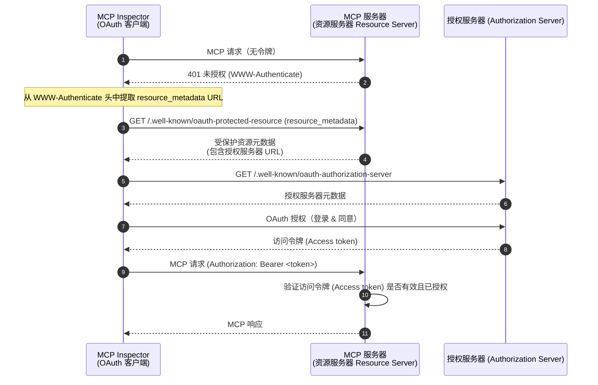
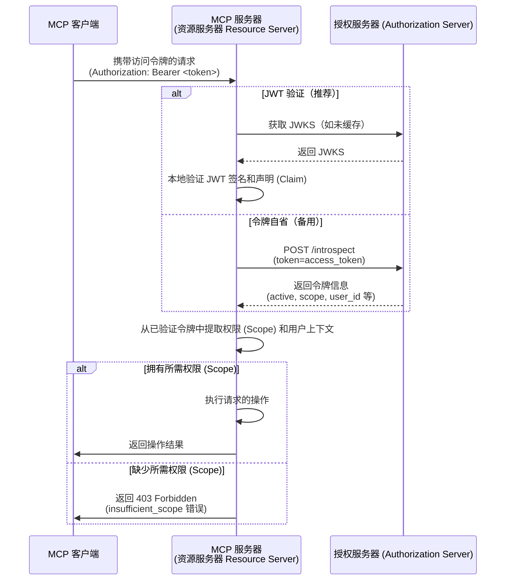

import TabItem from '@theme/TabItem';
import Tabs from '@theme/Tabs';


# 教程：构建一个待办事项管理器

在本教程中，我们将构建一个带有用户认证 (Authentication) 和授权 (Authorization) 的待办事项管理器 MCP 服务器。按照最新的 MCP 规范，我们的 MCP 服务器将作为 OAuth 2.0 **资源服务器 (Resource Server)**，用于验证访问令牌 (Access token) 并强制执行基于权限 (Scope) 的权限控制。

完成本教程后，你将获得：

- ✅ 对如何在 MCP 服务器中设置基于角色的访问控制 (RBAC) 有基本了解
- ✅ 一个作为资源服务器 (Resource Server) 的 MCP 服务器，能够消费由授权服务器 (Authorization Server) 颁发的访问令牌 (Access token)
- ✅ 一个基于权限 (Scope) 的待办事项操作权限控制的实际实现

## 概览 \{#overview}

本教程涉及以下组件：

- **MCP 客户端（MCP Inspector）**：一个用于测试 MCP 服务器的可视化工具，作为 OAuth 2.0/OIDC 客户端。它发起与授权服务器的授权流程，并获取访问令牌 (Access token) 以认证 (Authentication) 对 MCP 服务器的请求。
- **授权服务器 (Authorization Server)**：一个 OAuth 2.1 或 OpenID Connect 提供商，负责管理用户身份、认证 (Authentication) 用户，并向授权客户端颁发带有相应权限 (Scope) 的访问令牌 (Access token)。
- **MCP 服务器（资源服务器 Resource Server）**：根据最新的 MCP 规范，MCP 服务器在 OAuth 2.0 框架中作为资源服务器 (Resource Server)。它验证授权服务器颁发的访问令牌 (Access token)，并对待办事项操作强制执行基于权限 (Scope) 的权限控制。

该架构遵循标准的 OAuth 2.0 流程：

- **MCP Inspector** 代表用户请求受保护资源
- **授权服务器 (Authorization Server)** 认证 (Authentication) 用户并颁发访问令牌 (Access token)
- **MCP 服务器** 验证令牌并根据授予的权限 (Scope) 提供受保护资源

以下是这些组件之间交互的高级流程图：



## 了解你的授权服务器 \{#understand-your-authorization-server}

### 带有权限 (Scope) 的访问令牌 (Access token) \{#access-tokens-with-scopes}

要在 MCP 服务器中实现[基于角色的访问控制 (RBAC)](https://auth.wiki/rbac)，你的授权服务器需要支持颁发带有权限 (Scope) 的访问令牌 (Access token)。权限 (Scope) 代表用户被授予的权限。

<Tabs groupId="provider">
<TabItem value="logto" label="Logto">

[Logto](https://logto.io) 通过其 API 资源（符合 [RFC 8707: OAuth 2.0 的资源指示器 Resource Indicator]）和角色 (Role) 功能提供 RBAC 支持。设置方法如下：

1. 登录 [Logto Console](https://cloud.logto.io)（或你的自托管 Logto Console）

2. 创建 API 资源和权限 (Scope)：

   - 进入“API 资源”
   - 创建一个名为“Todo Manager”的新 API 资源
   - 添加以下权限 (Scope)：
     - `create:todos`：“创建新的待办事项”
     - `read:todos`：“读取所有待办事项”
     - `delete:todos`：“删除任意待办事项”

3. 创建角色 (Role)（推荐，便于管理）：

   - 进入“角色 (Roles)”
   - 创建一个“Admin”角色，并分配所有权限 (`create:todos`, `read:todos`, `delete:todos`)
   - 创建一个“User”角色，仅分配 `create:todos` 权限

4. 分配权限：
   - 进入“用户”
   - 选择一个用户
   - 你可以：
     - 在“角色 (Roles)”标签页分配角色（推荐）
     - 或直接在“权限 (Permissions)”标签页分配权限 (Scope)

这些权限 (Scope) 会作为空格分隔的字符串包含在 JWT 访问令牌 (Access token) 的 `scope` 声明 (Claim) 中。

</TabItem>
<TabItem value="oauth-oidc" label="OAuth 2.0 / OIDC">

OAuth 2.0 / OIDC 提供商通常支持基于权限 (Scope) 的访问控制。实现 RBAC 时：

1. 在授权服务器中定义所需的权限 (Scope)
2. 配置客户端在授权流程中请求这些权限 (Scope)
3. 确保授权服务器在访问令牌 (Access token) 中包含授予的权限 (Scope)
4. 权限 (Scope) 通常包含在 JWT 访问令牌 (Access token) 的 `scope` 声明 (Claim) 中

请查阅你的提供商文档，了解：

- 如何定义和管理权限 (Scope)
- 权限 (Scope) 如何包含在访问令牌 (Access token) 中
- 是否有额外的 RBAC 功能，如角色 (Role) 管理

</TabItem>
</Tabs>

### 验证令牌并检查权限 \{#validating-tokens-and-checking-permissions}

根据最新的 MCP 规范，MCP 服务器在 OAuth 2.0 框架中作为**资源服务器 (Resource Server)**。作为资源服务器 (Resource Server)，MCP 服务器有以下职责：

1. **令牌验证**：验证从 MCP 客户端收到的访问令牌 (Access token) 的真实性和完整性
2. **权限 (Scope) 强制**：从访问令牌 (Access token) 中提取并验证权限 (Scope)，以确定客户端被授权执行哪些操作
3. **资源保护**：仅在客户端提供有效且权限 (Scope) 足够的令牌时，才提供受保护资源（执行工具）

当 MCP 服务器收到请求时，会执行如下验证流程：

1. 从 `Authorization` 头中提取访问令牌 (Access token)（Bearer token 格式）
2. 验证访问令牌 (Access token) 的签名和过期时间
3. 从已验证的令牌中提取权限 (Scope) 和用户信息
4. 检查令牌是否包含所请求操作所需的权限 (Scope)

例如，如果用户想创建新的待办事项，其访问令牌 (Access token) 必须包含 `create:todos` 权限 (Scope)。以下是资源服务器 (Resource Server) 验证流程：



### 动态客户端注册 \{#dynamic-client-registration}

本教程不要求动态客户端注册，但如果你想自动化 MCP 客户端注册流程，可以参考 [是否需要动态客户端注册？](/provider-list#is-dcr-required) 获取更多信息。

## 了解待办事项管理器中的 RBAC \{#understand-rbac-in-todo-manager}

为了演示，我们将在待办事项管理器 MCP 服务器中实现一个简单的基于角色的访问控制 (RBAC) 系统。这将向你展示 RBAC 的基本原理，同时保持实现简洁。

:::note
虽然本教程演示了基于 RBAC 的权限 (Scope) 管理，但需要注意，并非所有认证 (Authentication) 提供商都通过角色 (Role) 实现权限 (Scope) 管理。有些提供商可能有自己独特的访问控制和权限管理机制。
:::

### 工具与权限 (Scope) \{#tools-and-scopes}

我们的待办事项管理器 MCP 服务器提供三个主要工具：

- `create-todo`：创建新的待办事项
- `get-todos`：列出所有待办事项
- `delete-todo`：根据 ID 删除待办事项

为了控制对这些工具的访问，我们定义如下权限 (Scope)：

- `create:todos`：允许创建新的待办事项
- `delete:todos`：允许删除已有的待办事项
- `read:todos`：允许查询和获取所有待办事项列表

### 角色 (Role) 与权限 (Permission) \{#roles-and-permissions}

我们将定义两个具有不同访问级别的角色 (Role)：

| 角色 (Role)  | create:todos | read:todos | delete:todos |
| ----- | ------------ | ---------- | ------------ |
| Admin | ✅           | ✅         | ✅           |
| User  | ✅           |            |              |

- **User**：普通用户，可以创建待办事项，仅能查看或删除自己的待办事项
- **Admin**：管理员，可以创建、查看和删除所有待办事项，无论归属谁

### 资源归属 \{#resource-ownership}

虽然上表显示了分配给每个角色 (Role) 的显式权限 (Scope)，但还有一个重要的资源归属原则：

- **User** 没有 `read:todos` 或 `delete:todos` 权限 (Scope)，但仍然可以：
  - 查看自己的待办事项
  - 删除自己的待办事项
- **Admin** 拥有全部权限 (`read:todos` 和 `delete:todos`)，可以：
  - 查看系统中所有待办事项
  - 删除任意待办事项，无论归属谁

这展示了 RBAC 系统中的常见模式：资源归属为用户自己的资源隐式授予权限，而管理员角色 (Role) 则对所有资源拥有显式权限。

:::tip 了解更多
想深入了解 RBAC 概念和最佳实践，请参阅 [精通 RBAC：一个全面的真实案例](https://blog.logto.io/mastering-rbac)。
:::

## 在你的提供商中配置授权 (Authorization) \{#configure-authorization-in-your-provider}

要实现上述访问控制系统，你需要在授权服务器中配置所需的权限 (Scope)。不同提供商的配置方法如下：

<Tabs groupId="provider">
<TabItem value="logto" label="Logto">

[Logto](https://logto.io) 通过其 API 资源和角色 (Role) 功能提供 RBAC 支持。设置方法如下：

1. 登录 [Logto Console](https://cloud.logto.io)（或你的自托管 Logto Console）

2. 创建 API 资源和权限 (Scope)：

   - 进入“API 资源”
   - 创建一个名为“Todo Manager”的新 API 资源，并使用 `http://localhost:3001` 作为资源指示器 (Resource indicator)。
     - **重要**：资源指示器 (Resource indicator) 必须与你的 MCP 服务器 URL 匹配。本教程使用 `http://localhost:3001`，因为 MCP 服务器运行在 3001 端口。生产环境请使用实际 MCP 服务器 URL（如 `https://your-mcp-server.example.com`）。
   - 创建以下权限 (Scope)：
     - `create:todos`：“创建新的待办事项”
     - `read:todos`：“读取所有待办事项”
     - `delete:todos`：“删除任意待办事项”

3. 创建角色 (Role)（推荐，便于管理）：

   - 进入“角色 (Roles)”
   - 创建一个“Admin”角色，并分配所有权限 (`create:todos`, `read:todos`, `delete:todos`)
   - 创建一个“User”角色，仅分配 `create:todos` 权限
   - 在“User”角色详情页，切换到“常规”标签，并将“User”角色设置为“默认角色 (Default role)”。

4. 管理用户角色 (Role) 和权限 (Permission)：
   - 新用户：
     - 因为设置了默认角色，注册后会自动获得“User”角色
   - 已有用户：
     - 进入“用户管理”
     - 选择一个用户
     - 在“角色 (Roles)”标签页为用户分配角色

:::tip 编程方式管理角色 (Role)
你也可以使用 Logto 的 [Management API](https://docs.logto.io/integrate-logto/interact-with-management-api) 以编程方式管理用户角色 (Role)。这对于自动化用户管理或构建管理后台非常有用。
:::

请求访问令牌 (Access token) 时，Logto 会根据用户角色 (Role) 权限将权限 (Scope) 包含在令牌的 `scope` 声明 (Claim) 中。

</TabItem>
<TabItem value="oauth-or-oidc" label="OAuth 2 / OIDC">

对于 OAuth 2.0 或 OpenID Connect 提供商，你需要配置代表不同权限的权限 (Scope)。具体步骤视提供商而定，但通常包括：

1. 定义权限 (Scope)：

   - 配置授权服务器支持：
     - `create:todos`
     - `read:todos`
     - `delete:todos`

2. 配置客户端：

   - 注册或更新客户端以请求这些权限 (Scope)
   - 确保权限 (Scope) 被包含在访问令牌 (Access token) 中

3. 分配权限 (Permission)：
   - 使用提供商界面为用户授予相应权限 (Scope)
   - 有些提供商支持基于角色 (Role) 的管理，有些则直接分配权限 (Scope)
   - 查阅提供商文档获取推荐做法

:::tip
大多数提供商会在访问令牌 (Access token) 的 `scope` 声明 (Claim) 中包含授予的权限 (Scope)。格式通常为空格分隔的权限 (Scope) 字符串。
:::

</TabItem>
</Tabs>

配置好授权服务器后，用户将获得包含其权限 (Scope) 的访问令牌 (Access token)。MCP 服务器将使用这些权限 (Scope) 判断：

- 用户是否可以创建新的待办事项（`create:todos`）
- 用户是否可以查看所有待办事项（`read:todos`）或仅能查看自己的
- 用户是否可以删除任意待办事项（`delete:todos`）或仅能删除自己的

## 搭建 MCP 服务器 \{#set-up-the-mcp-server}

我们将使用 [MCP 官方 SDK](https://github.com/modelcontextprotocol) 创建我们的待办事项管理器 MCP 服务器。

### 创建新项目 \{#create-a-new-project}

<Tabs groupId="sdk">
<TabItem value="python" label="Python">

创建一个新的 Python 项目：

```bash
mkdir mcp-todo-server
cd mcp-todo-server

# 初始化新 Python 项目
uv init

# 使用 uv 创建虚拟环境
uv venv

# 激活虚拟环境（使用 'uv run' 时可选）
source .venv/bin/activate
```

:::note
本项目使用 `uv` 进行包管理，你也可以选择 `pip`、`poetry` 或 `conda` 等其他包管理器。
:::

</TabItem>
<TabItem value="node" label="Node.js">

创建一个新的 Node.js 项目：

```bash
mkdir mcp-server
cd mcp-server
npm init -y # 或使用 `pnpm init`
npm pkg set type="module"
npm pkg set main="todo-manager.ts"
npm pkg set scripts.start="node --experimental-strip-types todo-manager.ts"
```

:::note
我们的示例使用 TypeScript，因为 Node.js v22.6.0+ 原生支持 `--experimental-strip-types` 运行 TypeScript。如果你使用 JavaScript，代码类似——只需确保 Node.js 版本为 v22.6.0 或更高。详见 Node.js 官方文档。
:::

</TabItem>
</Tabs>

### 安装 MCP SDK 及依赖 \{#install-the-mcp-sdk-and-dependencies}

<Tabs groupId="sdk">
<TabItem value="python" label="Python">

安装所需依赖：

```bash
uv add "mcp[cli]" uvicorn starlette
```

</TabItem>
<TabItem value="node" label="Node.js">

```bash
npm install @modelcontextprotocol/sdk express zod
```

或使用你喜欢的包管理器，如 `pnpm` 或 `yarn`。

</TabItem>
</Tabs>

### 创建 MCP 服务器 \{#create-the-mcp-server}

首先，创建一个基础的 MCP 服务器和工具定义：

<Tabs groupId="sdk">
<TabItem value="python" label="Python">

创建 `server.py` 文件并添加如下代码：

```python
# server.py

import contextlib
from typing import Any
from mcp.server.fastmcp import FastMCP
from starlette.applications import Starlette
from starlette.routing import Mount

# 初始化 FastMCP 服务器
mcp = FastMCP(name="Todo Manager", stateless_http=True, streamable_http_path='/')

@mcp.tool()
def create_todo(content: str) -> dict[str, Any]:
    """创建新的待办事项。需要 'create:todos' 权限 (Scope)。"""
    return {"error": "Not implemented"}

@mcp.tool()
def get_todos() -> dict[str, Any]:
    """列出待办事项。拥有 'read:todos' 权限 (Scope) 的用户可查看所有待办事项。"""
    return {"error": "Not implemented"}

@mcp.tool()
def delete_todo(id: str) -> dict[str, Any]:
    """根据 id 删除待办事项。用户可删除自己的待办事项。"""
    return {"error": "Not implemented"}

@contextlib.asynccontextmanager
async def lifespan(app: Starlette):
    async with contextlib.AsyncExitStack() as stack:
        await stack.enter_async_context(mcp.session_manager.run())
        yield

# 创建 app
app = Starlette(
    routes=[
        Mount("/", app=mcp.streamable_http_app()),
    ],
    lifespan=lifespan,
)
```

使用如下命令启动服务器：

```bash
# 使用 uvicorn 启动 Todo Manager 服务器
uvicorn server:app --host 127.0.0.1 --port 3001

# 或使用 uv:
# uv run uvicorn server:app --host 127.0.0.1 --port 3001
```

</TabItem>
<TabItem value="node" label="Node.js">

创建 `todo-manager.ts` 文件并添加如下代码：

```ts
// todo-manager.ts

import { z } from 'zod';
import { McpServer } from '@modelcontextprotocol/sdk/server/mcp.js';
import { StreamableHTTPServerTransport } from '@modelcontextprotocol/sdk/server/streamableHttp.js';
import express, { type Request, type Response } from 'express';

// 创建 MCP 服务器
const server = new McpServer({
  name: 'Todo Manager',
  version: '0.0.0',
});

server.tool('create-todo', '创建新的待办事项', { content: z.string() }, async ({ content }) => {
  return {
    content: [{ type: 'text', text: JSON.stringify({ error: 'Not implemented' }) }],
  };
});

server.tool('get-todos', '列出所有待办事项', async () => {
  return {
    content: [{ type: 'text', text: JSON.stringify({ error: 'Not implemented' }) }],
  };
});

server.tool('delete-todo', '根据 id 删除待办事项', { id: z.string() }, async ({ id }) => {
  return {
    content: [{ type: 'text', text: JSON.stringify({ error: 'Not implemented' }) }],
  };
});

// 以下为 MCP SDK 文档中的样板代码
const PORT = 3001;
const app = express();

app.post('/', async (request: Request, response: Response) => {
  // 在无状态模式下，为每个请求创建新的 transport 和 server 实例以确保完全隔离。
  // 单一实例会导致多个客户端并发连接时请求 ID 冲突。

  try {
    const transport: StreamableHTTPServerTransport = new StreamableHTTPServerTransport({
      sessionIdGenerator: undefined,
    });
    response.on('close', async () => {
      console.log('Request closed');
      await transport.close();
      await server.close();
    });
    await server.connect(transport);
    await transport.handleRequest(request, response, request.body);
  } catch (error) {
    console.error('Error handling MCP request:', error);
    if (!response.headersSent) {
      response.status(500).json({
        jsonrpc: '2.0',
        error: {
          code: -32_603,
          message: 'Internal server error',
        },
        id: null,
      });
    }
  }
});

// 无状态模式下不支持 SSE 通知
app.get('/', async (request: Request, response: Response) => {
  console.log('Received GET MCP request');
  response.writeHead(405).end(
    JSON.stringify({
      jsonrpc: '2.0',
      error: {
        code: -32_000,
        message: 'Method not allowed.',
      },
      id: null,
    })
  );
});

// 无状态模式下无需会话终止
app.delete('/', async (request: Request, response: Response) => {
  console.log('Received DELETE MCP request');
  response.writeHead(405).end(
    JSON.stringify({
      jsonrpc: '2.0',
      error: {
        code: -32_000,
        message: 'Method not allowed.',
      },
      id: null,
    })
  );
});

app.listen(PORT);
```

使用如下命令启动服务器：

```bash
npm start
```

</TabItem>
</Tabs>

### 检查 MCP 服务器 \{#inspect-the-mcp-server}

#### 克隆并运行 MCP inspector \{#clone-and-run-mcp-inspector}

现在 MCP 服务器已运行，我们可以使用 MCP inspector 检查工具是否可用。

官方 MCP inspector v0.16.2 存在影响认证 (Authentication) 功能的 bug。为了解决这些问题，我们提供了一个[修补版 MCP inspector](https://github.com/mcp-auth/inspector/tree/patch/0.16.2-fixes)，包含了 OAuth/OIDC 认证 (Authentication) 流程的必要修复。我们也已向官方仓库提交了 PR。

运行 MCP inspector：

```bash
git clone https://github.com/mcp-auth/inspector.git -b patch/0.16.2-fixes
cd inspector
npm install
npm run dev
```

MCP inspector 会自动在默认浏览器打开，或你也可以手动点击终端输出中的链接（确保点击带有 `MCP_PROXY_AUTH_TOKEN` 参数的链接，如 `http://localhost:6274/?MCP_PROXY_AUTH_TOKEN=458ae4a4...acab1907`）。

#### 连接 MCP inspector 到 MCP 服务器 \{#connect-mcp-inspector-to-the-mcp-server}

继续前请检查 MCP inspector 的如下配置：

- **Transport Type**：设置为 `Streamable HTTP`
- **URL**：设置为你的 MCP 服务器 URL，本例为 `http://localhost:3001`

现在点击“Connect”按钮，检查 MCP inspector 是否能连接 MCP 服务器。如果一切正常，你会在 MCP inspector 中看到“Connected”状态。

#### 检查点：运行待办事项管理工具 \{#checkpoint-run-todo-manager-tools}

1. 在 MCP inspector 顶部菜单点击“Tools”标签
2. 点击“List Tools”按钮
3. 你应该能在页面上看到 `create-todo`、`get-todos` 和 `delete-todo` 工具，点击可查看工具详情
4. 右侧会有“Run Tool”按钮，点击并输入所需参数运行工具
5. 你会看到工具返回的 JSON 响应 `{"error": "Not implemented"}`


## 集成你的授权服务器 \{#integrate-with-your-authorization-server}

完成本节需要考虑以下几点：

<details>
<summary>**你的授权服务器的发行者 (Issuer) URL**</summary>

通常是你的授权服务器的基础 URL，如 `https://auth.example.com`。有些提供商可能是 `https://example.logto.app/oidc`，请查阅你的提供商文档。

</details>

<details>
<summary>**如何获取授权服务器元数据**</summary>

- 如果你的授权服务器符合 [OAuth 2.0 授权服务器元数据](https://datatracker.ietf.org/doc/html/rfc8414) 或 [OpenID Connect 发现](https://openid.net/specs/openid-connect-discovery-1_0.html)，可以用 MCP Auth 内置工具自动获取元数据
- 如果不符合上述标准，你需要在 MCP 服务器配置中手动指定元数据 URL 或端点。请查阅提供商文档

</details>

<details>
<summary>**如何将 MCP inspector 注册为授权服务器的客户端**</summary>

- 如果你的授权服务器支持 [动态客户端注册 (Dynamic Client Registration)](https://datatracker.ietf.org/doc/html/rfc7591)，可跳过此步，MCP inspector 会自动注册
- 如果不支持动态客户端注册，需要手动在授权服务器中注册 MCP inspector 作为客户端

</details>

<details>
<summary>**了解令牌请求参数**</summary>

向不同授权服务器请求访问令牌 (Access token) 时，指定目标资源和权限 (Scope) 的方式各异，主要有：

- **基于资源指示器 (Resource indicator)**：

  - 使用 `resource` 参数指定目标 API（见 [RFC 8707: OAuth 2.0 的资源指示器]）
  - 现代 OAuth 2.0 实现常见
  - 示例请求：
    ```json
    {
      "resource": "http://localhost:3001",
      "scope": "create:todos read:todos"
    }
    ```
  - 服务器颁发专门绑定到请求资源的令牌

- **基于受众 (Audience)**：

  - 使用 `audience` 参数指定令牌接收方
  - 与资源指示器类似但语义不同
  - 示例请求：
    ```json
    {
      "audience": "todo-api",
      "scope": "create:todos read:todos"
    }
    ```

- **纯权限 (Scope) 模式**：
  - 仅依赖权限 (Scope)，无 resource/audience 参数
  - 传统 OAuth 2.0 做法
  - 示例请求：
    ```json
    {
      "scope": "todo-api:create todo-api:read openid profile"
    }
    ```
  - 常用前缀权限 (Scope) 进行命名空间隔离
  - 简单 OAuth 2.0 实现常见

:::tip 最佳实践

- 查阅你的提供商文档，了解支持哪些参数
- 有些提供商同时支持多种方式
- 资源指示器 (Resource indicator) 通过受众限制提升安全性
- 如可用，建议优先使用资源指示器 (Resource indicator) 以获得更好的访问控制
  :::

</details>

虽然每个提供商有自己的具体要求，以下步骤将指导你如何结合 MCP inspector 和 MCP 服务器进行提供商特定配置。

### 注册 MCP inspector 为客户端 \{#register-mcp-inspector-as-a-client}

<Tabs groupId="provider">
<TabItem value="logto" label="Logto">

将待办事项管理器集成到 [Logto](https://logto.io) 非常简单，因为它是支持资源指示器 (Resource indicator) 和权限 (Scope) 的 OpenID Connect 提供商，可以用 `http://localhost:3001` 作为资源指示器保护你的 todo API。

由于 Logto 目前尚不支持动态客户端注册，你需要手动在 Logto 租户中注册 MCP inspector 作为客户端：

1. 打开 MCP inspector，进入 Authentication 配置，点击 "OAuth2.0 Flow" 配置，复制 **Redirect URI**，如 `http://localhost:6274/oauth/callback`
2. 登录 [Logto Console](https://cloud.logto.io)（或你的自托管 Logto Console）
3. 进入“应用程序”标签，点击“创建应用程序”。页面底部点击“无框架创建应用”
4. 填写应用信息，点击“创建应用程序”：
   - **选择应用类型**：选择“单页应用”
   - **应用名称**：如“MCP Inspector”
5. 在“设置 / Redirect URIs”部分，粘贴 MCP inspector 复制的 **Redirect URI**，然后点击底部栏“保存更改”
6. 顶部卡片会显示“App ID”，复制它
7. 回到 MCP inspector，在 Authentication 配置的 "OAuth2.0 Flow" 下的 "Client ID" 字段粘贴 "App ID"
8. 在 "Scope" 字段输入：`create:todos read:todos delete:todos`，确保 Logto 返回的访问令牌 (Access token) 包含访问 todo manager 所需的权限 (Scope)

</TabItem>
<TabItem value="oauth-oidc" label="OAuth 2.0 / OIDC">

:::note
这是通用的 OAuth 2.0 / OpenID Connect 提供商集成指南。OIDC 基于 OAuth 2.0，步骤类似。具体细节请查阅你的提供商文档。
:::

如果你的提供商支持动态客户端注册，可直接跳到第 8 步配置 MCP inspector，否则需手动注册 MCP inspector 为客户端：

1. 打开 MCP inspector，进入 Authentication 配置，点击 "OAuth2.0 Flow" 配置，复制 **Redirect URI**，如 `http://localhost:6274/oauth/callback`

2. 登录你的提供商控制台

3. 进入“应用程序”或“客户端”部分，创建新应用或客户端

4. 如需选择客户端类型，选“单页应用”或“公开客户端”

5. 创建应用后，配置重定向 URI，粘贴 MCP inspector 复制的 **Redirect URI**

6. 找到新建应用的 "Client ID" 或 "Application ID"，复制

7. 回到 MCP inspector，在 Authentication 配置的 "OAuth2.0 Flow" 下的 "Client ID" 字段粘贴

8. 在 "Scope" 字段输入以下权限 (Scope) 以请求待办事项操作所需权限：

```text
create:todos read:todos delete:todos
```

</TabItem>
</Tabs>

### 配置 MCP Auth \{#set-up-mcp-auth}

首先，在 MCP 服务器项目中安装 MCP Auth SDK。

<Tabs groupId="sdk">
<TabItem value="python" label="Python">

```bash
uv add mcpauth==0.2.0b1
```

</TabItem>
<TabItem value="node" label="Node.js">

```bash
npm install mcp-auth@0.2.0-beta.1
```

</TabItem>
</Tabs>

现在需要在 MCP 服务器中初始化 MCP Auth，主要分两步：

1. **获取授权服务器元数据**：用于后续 MCP Auth 验证授权服务器颁发的访问令牌 (Access token)，并在资源元数据中包含授权服务器的发行者 (Issuer) 标识
2. **配置受保护资源元数据**：定义 MCP 服务器的资源标识符和支持的权限 (Scope)

#### 步骤 1：获取授权服务器元数据 \{#step-1-fetch-authorization-server-metadata\}

根据 OAuth / OIDC 规范，我们可以根据授权服务器的发行者 (Issuer) URL 获取授权服务器元数据。

<Tabs groupId="provider">

<TabItem value="logto" label="Logto">

在 Logto 中，你可以在 Logto Console 的应用详情页 "Endpoints & Credentials / Issuer endpoint" 部分找到发行者 (Issuer) URL，格式如 `https://my-project.logto.app/oidc`。

</TabItem>

<TabItem value="oauth-oidc" label="OAuth 2.0 / OIDC">

对于 OAuth 2.0 提供商，你需要：

1. 查阅提供商文档，获取授权服务器 URL（通常称为发行者 (Issuer) URL 或基础 URL）
2. 有些提供商会在 `https://{your-domain}/.well-known/oauth-authorization-server` 暴露
3. 在提供商管理后台的 OAuth/API 设置中查找

</TabItem>

</Tabs>

现在，使用 MCP Auth 工具函数获取授权服务器元数据：

<Tabs groupId="sdk">

<TabItem value="python" label="Python">
```python
from mcpauth import MCPAuth
from mcpauth.config import AuthServerType
from mcpauth.utils import fetch_server_config

issuer_url = "<issuer-url>"  # 替换为你的授权服务器发行者 (Issuer) URL

# 获取授权服务器配置
auth_server_config = fetch_server_config(issuer_url, AuthServerType.OIDC) # 或 AuthServerType.OAUTH
```

</TabItem>
<TabItem value="node" label="Node.js">
```js
import { MCPAuth, fetchServerConfig } from 'mcp-auth';

const issuerUrl = '<issuer-url>'; // 替换为你的授权服务器发行者 (Issuer) URL

// 获取授权服务器配置（OIDC 发现）
const authServerConfig = await fetchServerConfig(issuerUrl, { type: 'oidc' }); // 或 { type: 'oauth' }
```

</TabItem>
</Tabs>

如需其他方式获取授权服务器元数据或自定义配置，请参考[其他配置授权服务器元数据的方法](/docs/configure-server/mcp-auth#other-ways)。

#### 步骤 2：配置受保护资源元数据 \{#step-2-configure-protected-resource-metadata}

接下来，在构建 MCP Auth 实例时配置受保护资源元数据。随后，MCP 服务器会通过 MCP Auth 暴露配置的资源元数据。

<Tabs groupId="sdk">

<TabItem value="python" label="Python">
```python
# server.py

# 其他导入...
from mcpauth.types import ResourceServerConfig, ResourceServerMetadata

# 定义 MCP 服务器的资源标识符
resource_id = "http://localhost:3001"

mcp_auth = MCPAuth(
    protected_resources=ResourceServerConfig(
        metadata=ResourceServerMetadata(
            resource=resource_id,
            # 上一步获取的授权服务器元数据
            authorization_servers=[auth_server_config],
            # MCP 服务器支持的权限 (Scope)
            scopes_supported=[
                "create:todos",
                "read:todos",
                "delete:todos"
            ]
        )
    )
)
```
</TabItem>

<TabItem value="node" label="Node.js">
```js
// todo-manager.ts

// 定义 MCP 服务器的资源标识符
const resourceId = 'http://localhost:3001';

// 配置 MCP Auth 的受保护资源元数据
const mcpAuth = new MCPAuth({
  protectedResources: {
    metadata: {
      resource: resourceId,
      // 上一步获取的授权服务器元数据
      authorizationServers: [authServerConfig],
      // MCP 服务器支持的权限 (Scope)
      scopesSupported: [
        "create:todos",
        "read:todos",
        "delete:todos"
      ]
    }
  }
});
```
</TabItem>

</Tabs>

### 更新 MCP 服务器 \{#update-mcp-server}

快完成了！现在需要更新 MCP 服务器，应用 MCP Auth 路由和中间件函数，并基于用户权限 (Scope) 实现待办事项工具的权限控制。

首先，应用受保护资源元数据路由，让 MCP 客户端可以从 MCP 服务器获取资源元数据。

<Tabs groupId="sdk">
<TabItem value="python" label="Python">
```python
# server.py

# ..其他代码

app = Starlette(
    routes=[
        # 设置受保护资源元数据路由
        # 这会为 OAuth 客户端暴露本资源服务器的元数据
        *mcp_auth.resource_metadata_router().routes,
        Mount("/", app=mcp.streamable_http_app()),
    ],
    lifespan=lifespan,
)
```
</TabItem>
<TabItem value="node" label="Node.js">

```ts
// todo-manager.ts

// 设置受保护资源元数据路由
// 这会为 OAuth 客户端暴露本资源服务器的元数据
app.use(mcpAuth.protectedResourceMetadataRouter());

```
</TabItem>
</Tabs>

接下来，应用 MCP Auth 中间件到 MCP 服务器。该中间件将处理所有请求的认证 (Authentication) 和授权 (Authorization)，确保只有被授权用户才能访问待办事项工具。

<Tabs groupId="sdk">
<TabItem value="python" label="Python">
```python
# server.py

# 其他导入...
from starlette.middleware import Middleware

# 其他代码...

# 创建中间件
bearer_auth = Middleware(mcp_auth.bearer_auth_middleware('jwt', resource=resource_id, audience=resource_id))

app = Starlette(
    routes=[
        *mcp_auth.resource_metadata_router().routes,
        # 应用 MCP Auth 中间件
        Mount("/", app=mcp.streamable_http_app(), middleware=[bearer_auth]),
    ],
    lifespan=lifespan,
)
```
</TabItem>
<TabItem value="node" label="Node.js">

```ts
// todo-manager.ts

app.use(mcpAuth.protectedResourceMetadataRouter());

// 应用 MCP Auth 中间件
app.use(
  mcpAuth.bearerAuth('jwt', {
    resource: resourceId,
    audience: resourceId,
  })
);
```
</TabItem>
</Tabs>

现在可以更新待办事项工具的实现，让其利用 MCP Auth 中间件进行认证 (Authentication) 和授权 (Authorization)。

<Tabs groupId="sdk">
<TabItem value="python" label="Python">
```python
# server.py

# 其他导入...

from typing import Any, List, Optional
from mcpauth.exceptions import MCPAuthBearerAuthException, BearerAuthExceptionCode
from mcpauth.types import AuthInfo, ResourceServerConfig, ResourceServerMetadata

# 下一节会用到
from service import TodoService

def assert_user_id(auth_info: Optional[AuthInfo]) -> str:
    """断言 auth_info 包含有效用户 ID 并返回。"""
    if not auth_info or not auth_info.subject:
        raise Exception("Invalid auth info")
    return auth_info.subject

def has_required_scopes(user_scopes: List[str], required_scopes: List[str]) -> bool:
    """检查用户是否拥有所有必需权限 (Scope)。"""
    return all(scope in user_scopes for scope in required_scopes)

# 创建 TodoService 实例
todo_service = TodoService()

@mcp.tool()
def create_todo(content: str) -> dict[str, Any]:
    """创建新的待办事项。需要 'create:todos' 权限 (Scope)。"""
    auth_info = mcp_auth.auth_info
    user_id = assert_user_id(auth_info)
    
    # 只有拥有 'create:todos' 权限 (Scope) 的用户才能创建
    user_scopes = auth_info.scopes if auth_info else []
    if not has_required_scopes(user_scopes, ["create:todos"]):
        raise MCPAuthBearerAuthException(BearerAuthExceptionCode.MISSING_REQUIRED_SCOPES)
    
    created_todo = todo_service.create_todo(content=content, owner_id=user_id)
    return created_todo

@mcp.tool()
def get_todos() -> dict[str, Any]:
    """
    列出待办事项。拥有 'read:todos' 权限 (Scope) 的用户可查看所有待办事项，
    否则只能查看自己的。
    """
    auth_info = mcp_auth.auth_info
    user_id = assert_user_id(auth_info)
    
    # 有 'read:todos' 权限 (Scope) 可访问所有待办事项，否则只能访问自己的
    user_scopes = auth_info.scopes if auth_info else []
    todo_owner_id = None if has_required_scopes(user_scopes, ["read:todos"]) else user_id
    
    todos = todo_service.get_all_todos(todo_owner_id)
    return {"todos": todos}

@mcp.tool()
def delete_todo(id: str) -> dict[str, Any]:
    """
    根据 id 删除待办事项。用户可删除自己的待办事项。
    拥有 'delete:todos' 权限 (Scope) 的用户可删除任意待办事项。
    """
    auth_info = mcp_auth.auth_info
    user_id = assert_user_id(auth_info)
    
    todo = todo_service.get_todo_by_id(id)
    
    if not todo:
        return {"error": "Failed to delete todo"}
    
    # 用户只能删除自己的待办事项
    # 拥有 'delete:todos' 权限 (Scope) 可删除任意待办事项
    user_scopes = auth_info.scopes if auth_info else []
    if todo.owner_id != user_id and not has_required_scopes(user_scopes, ["delete:todos"]):
        return {"error": "Failed to delete todo"}
    
    deleted_todo = todo_service.delete_todo(id)
    
    if deleted_todo:
        return {
            "message": f"Todo {id} deleted",
            "details": deleted_todo
        }
    else:
        return {"error": "Failed to delete todo"}
```
</TabItem>

<TabItem value="node" label="Node.js">
```js
// todo-manager.ts

// 其他导入...
import assert from 'node:assert';
import { fetchServerConfig, MCPAuth, MCPAuthBearerAuthError } from 'mcp-auth';
import { type AuthInfo } from '@modelcontextprotocol/sdk/server/auth/types.js';

// 下一节会用到
import { TodoService } from './todo-service.js';

const assertUserId = (authInfo?: AuthInfo) => {
  const { subject } = authInfo ?? {};
  assert(subject, 'Invalid auth info');
  return subject;
};

const hasRequiredScopes = (userScopes: string[], requiredScopes: string[]): boolean => {
  return requiredScopes.every((scope) => userScopes.includes(scope));
};

const todoService = new TodoService();

server.tool(
  'create-todo',
  '创建新的待办事项',
  { content: z.string() },
  ({ content }: { content: string }, { authInfo }) => {
    const userId = assertUserId(authInfo);

    /**
     * 只有拥有 'create:todos' 权限 (Scope) 的用户才能创建
     */
    if (!hasRequiredScopes(authInfo?.scopes ?? [], ['create:todos'])) {
      throw new MCPAuthBearerAuthError('missing_required_scopes');
    }

    const createdTodo = todoService.createTodo({ content, ownerId: userId });

    return {
      content: [{ type: 'text', text: JSON.stringify(createdTodo) }],
    };
  }
);

server.tool('get-todos', '列出所有待办事项', ({ authInfo }) => {
  const userId = assertUserId(authInfo);

  /**
   * 有 'read:todos' 权限 (Scope) 可访问所有待办事项（todoOwnerId = undefined）
   * 没有 'read:todos' 权限 (Scope) 只能访问自己的（todoOwnerId = userId）
   */
  const todoOwnerId = hasRequiredScopes(authInfo?.scopes ?? [], ['read:todos'])
    ? undefined
    : userId;

  const todos = todoService.getAllTodos(todoOwnerId);

  return {
    content: [{ type: 'text', text: JSON.stringify(todos) }],
  };
});

server.tool(
  'delete-todo',
  '根据 id 删除待办事项',
  { id: z.string() },
  ({ id }: { id: string }, { authInfo }) => {
    const userId = assertUserId(authInfo);

    const todo = todoService.getTodoById(id);

    if (!todo) {
      return {
        content: [{ type: 'text', text: JSON.stringify({ error: 'Failed to delete todo' }) }],
      };
    }

    /**
     * 用户只能删除自己的待办事项
     * 拥有 'delete:todos' 权限 (Scope) 可删除任意待办事项
     */
    if (todo.ownerId !== userId && !hasRequiredScopes(authInfo?.scopes ?? [], ['delete:todos'])) {
      return {
        content: [
          {
            type: 'text',
            text: JSON.stringify({ error: 'Failed to delete todo' }),
          },
        ],
      };
    }

    const deletedTodo = todoService.deleteTodo(id);

    return {
      content: [
        {
          type: 'text',
          text: JSON.stringify({
            message: `Todo ${id} deleted`,
            details: deletedTodo,
          }),
        },
      ],
    };
  }
);
```
</TabItem>
</Tabs>

现在，创建上述代码中用到的 "Todo service" 实现相关功能：

<Tabs groupId="sdk">
<TabItem value="python" label="Python">

创建 `service.py` 文件：

```python
"""
一个简单的 Todo 服务，仅用于演示。
使用内存列表存储待办事项。
"""

from datetime import datetime
from typing import List, Optional, Dict, Any
import random
import string

class Todo:
    """待办事项实体"""
    
    def __init__(self, id: str, content: str, owner_id: str, created_at: str):
        self.id = id
        self.content = content
        self.owner_id = owner_id
        self.created_at = created_at
    
    def to_dict(self) -> Dict[str, Any]:
        """转换为字典，便于 JSON 序列化"""
        return {
            "id": self.id,
            "content": self.content,
            "ownerId": self.owner_id,
            "createdAt": self.created_at
        }


class TodoService:
    """简单的 Todo 服务，仅用于演示"""
    
    def __init__(self):
        self._todos: List[Todo] = []
    
    def get_all_todos(self, owner_id: Optional[str] = None) -> List[Dict[str, Any]]:
        """
        获取所有待办事项，可选按 owner_id 过滤
        
        Args:
            owner_id: 如提供，仅返回该用户的待办事项
            
        Returns:
            待办事项字典列表
        """
        if owner_id:
            filtered_todos = [todo for todo in self._todos if todo.owner_id == owner_id]
            return [todo.to_dict() for todo in filtered_todos]
        return [todo.to_dict() for todo in self._todos]
    
    def get_todo_by_id(self, todo_id: str) -> Optional[Todo]:
        """
        根据 ID 获取待办事项
        
        Args:
            todo_id: 待办事项 ID
            
        Returns:
            找到则返回 Todo 对象，否则返回 None
        """
        for todo in self._todos:
            if todo.id == todo_id:
                return todo
        return None
    
    def create_todo(self, content: str, owner_id: str) -> Dict[str, Any]:
        """
        创建新的待办事项
        
        Args:
            content: 待办事项内容
            owner_id: 用户 ID
            
        Returns:
            创建的待办事项字典
        """
        todo = Todo(
            id=self._generate_id(),
            content=content,
            owner_id=owner_id,
            created_at=datetime.now().isoformat()
        )
        self._todos.append(todo)
        return todo.to_dict()
    
    def delete_todo(self, todo_id: str) -> Optional[Dict[str, Any]]:
        """
        根据 ID 删除待办事项
        
        Args:
            todo_id: 待办事项 ID
            
        Returns:
            删除的待办事项字典，如未找到返回 None
        """
        for i, todo in enumerate(self._todos):
            if todo.id == todo_id:
                deleted_todo = self._todos.pop(i)
                return deleted_todo.to_dict()
        return None
    
    def _generate_id(self) -> str:
        """生成随机 ID"""
        return ''.join(random.choices(string.ascii_lowercase + string.digits, k=8))
```

</TabItem>
<TabItem value="node" label="Node.js">

创建 `todo-service.ts` 文件：

```ts
// todo-service.ts

type Todo = {
  id: string;
  content: string;
  ownerId: string;
  createdAt: string;
};

/**
 * 简单的 Todo 服务，仅用于演示。
 * 使用内存数组存储待办事项
 */
export class TodoService {
  private readonly todos: Todo[] = [];

  getAllTodos(ownerId?: string): Todo[] {
    if (ownerId) {
      return this.todos.filter((todo) => todo.ownerId === ownerId);
    }
    return this.todos;
  }

  getTodoById(id: string): Todo | undefined {
    return this.todos.find((todo) => todo.id === id);
  }

  createTodo({ content, ownerId }: { content: string; ownerId: string }): Todo {
    const todo: Todo = {
      id: this.genId(),
      content,
      ownerId,
      createdAt: new Date().toISOString(),
    };

    // eslint-disable-next-line @silverhand/fp/no-mutating-methods
    this.todos.push(todo);
    return todo;
  }

  deleteTodo(id: string): Todo | undefined {
    const index = this.todos.findIndex((todo) => todo.id === id);

    if (index === -1) {
      return undefined;
    }

    // eslint-disable-next-line @silverhand/fp/no-mutating-methods
    const [deleted] = this.todos.splice(index, 1);
    return deleted;
  }

  private genId(): string {
    return Math.random().toString(36).slice(2, 10);
  }
}
```

</TabItem>
</Tabs>

🎉 恭喜！我们已经成功实现了一个带有认证 (Authentication) 和授权 (Authorization) 的完整 MCP 服务器！

你也可以参考我们的示例代码：

<Tabs groupId="sdk">
<TabItem value="python" label="Python">

:::info
完整 MCP 服务器（OIDC 版本）代码请参考 [MCP Auth Python SDK 仓库](https://github.com/mcp-auth/python/tree/master/samples/current/todo-manager)。
:::

</TabItem>
<TabItem value="node" label="Node.js">

:::info
完整 MCP 服务器（OIDC 版本）代码请参考 [MCP Auth Node.js SDK 仓库](https://github.com/mcp-auth/js/blob/master/packages/sample-servers/src)。
:::

</TabItem>
</Tabs>

## 检查点：运行 `todo-manager` 工具 \{#checkpoint-run-the-todo-manager-tools}

重启 MCP 服务器，并在浏览器中打开 MCP inspector。点击“Connect”按钮后，你会被重定向到授权服务器的登录页面。

登录并返回 MCP inspector 后，重复前面检查点的操作运行待办事项工具。此时，你可以用认证 (Authentication) 后的用户身份使用这些工具。工具的行为将根据你用户的角色 (Role) 和权限 (Permission) 不同而不同：

- 如果你以 **User**（仅有 `create:todos` 权限 (Scope)）登录：

  - 可以用 `create-todo` 工具创建新待办事项
  - 只能查看和删除自己的待办事项
  - 无法查看或删除其他用户的待办事项

- 如果你以 **Admin**（拥有所有权限：`create:todos`、`read:todos`、`delete:todos`）登录：
  - 可以创建新待办事项
  - 可以用 `get-todos` 工具查看系统中所有待办事项
  - 可以用 `delete-todo` 工具删除任意待办事项，无论归属谁

你可以通过以下方式测试不同权限级别：

1. 退出当前会话（点击 MCP inspector 的“Disconnect”按钮）
2. 用拥有不同角色 (Role)/权限 (Permission) 的其他用户账号登录
3. 再次尝试相同工具，观察用户权限变化带来的行为差异

这展示了基于角色的访问控制 (RBAC) 在实际中的工作方式，不同用户对系统功能有不同访问级别。


<Tabs groupId="sdk">
<TabItem value="python" label="Python">

:::info
完整 MCP 服务器（OIDC 版本）代码请参考 [MCP Auth Python SDK 仓库](https://github.com/mcp-auth/python)。
:::

</TabItem>
<TabItem value="node" label="Node.js">

:::info
完整 MCP 服务器（OIDC 版本）代码请参考 [MCP Auth Node.js SDK 仓库](https://github.com/mcp-auth/js/blob/master/packages/sample-servers/src)。
:::

</TabItem>
</Tabs>

## 结语 \{#closing-notes}

🎊 恭喜！你已成功完成本教程。让我们回顾一下所做的内容：

- 搭建了一个基础 MCP 服务器，包含待办事项管理工具（`create-todo`、`get-todos`、`delete-todo`）
- 实现了基于角色的访问控制 (RBAC)，为用户和管理员设置不同权限级别
- 使用 MCP Auth 将 MCP 服务器与授权服务器集成
- 配置 MCP Inspector 认证 (Authentication) 用户，并用带权限 (Scope) 的访问令牌 (Access token) 调用工具

欢迎查阅其他教程和文档，充分发挥 MCP Auth 的强大功能。
