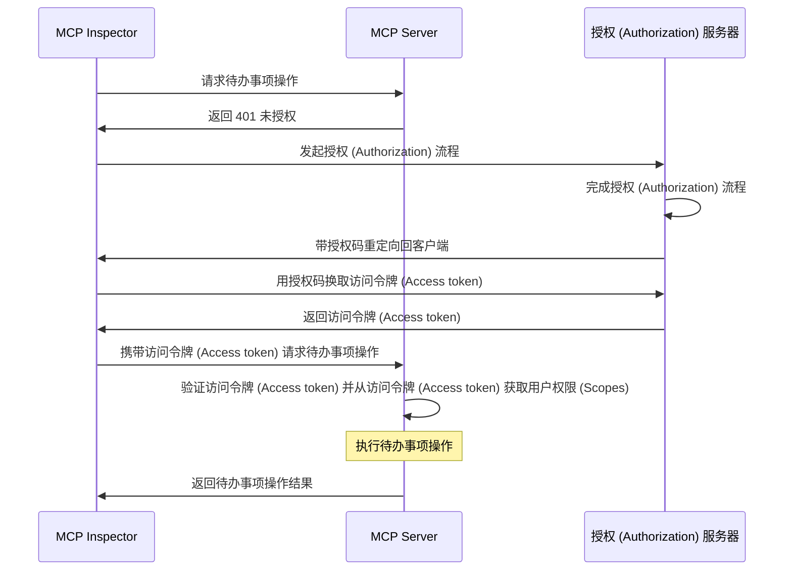
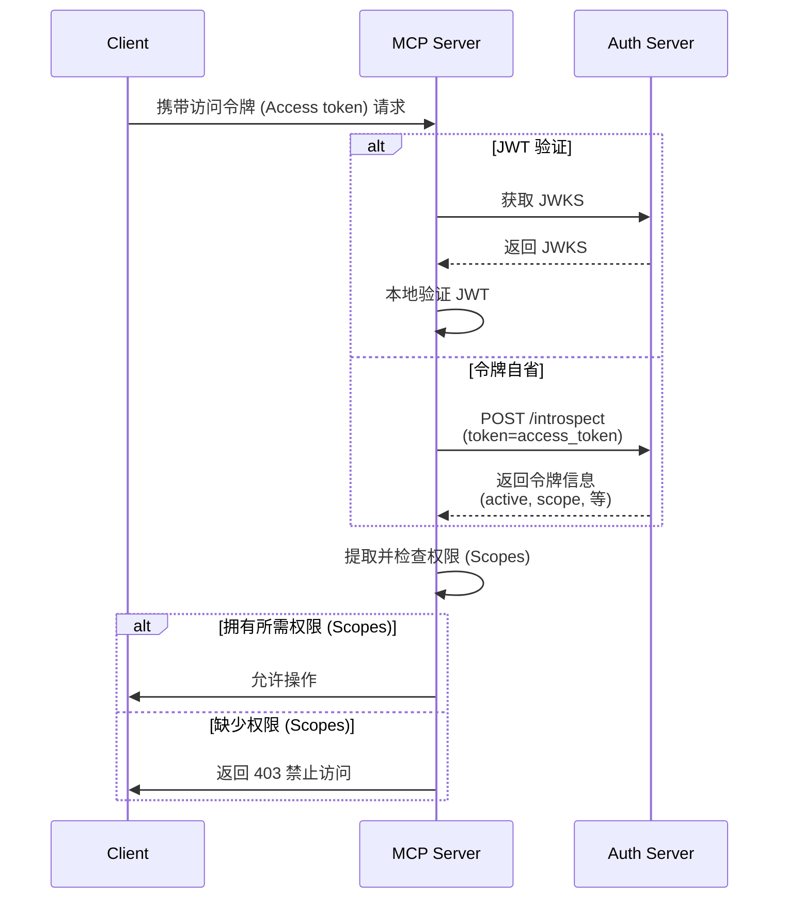

import TabItem from '@theme/TabItem';
import Tabs from '@theme/Tabs';

import SetupOauthOrOidc from './_setup-oauth-or-oidc.mdx';
import SetupOidc from './_setup-oidc.mdx';

# 教程：构建一个待办事项管理器

在本教程中，我们将构建一个带有用户认证 (Authentication) 和授权 (Authorization) 的待办事项管理器 MCP 服务器。

完成本教程后，你将获得：

- ✅ 基本了解如何在 MCP 服务器中设置基于角色的访问控制 (RBAC)
- ✅ 一个可以管理个人待办事项列表的 MCP 服务器

:::note
在开始之前，如果你不熟悉 MCP 服务器和 OAuth 2，强烈建议你先阅读 [Who am I 教程](./whoami)。
:::

## 概览 \{#overview}

本教程将涉及以下组件：

- **MCP 服务器**：一个简单的 MCP 服务器，使用 MCP 官方 SDK 处理请求，并集成了用于管理用户待办事项的 Todo 服务。
- **MCP inspector**：一个用于 MCP 服务器的可视化测试工具。它还充当 OAuth / OIDC 客户端，用于发起授权流程并获取访问令牌 (Access token)。
- **授权 (Authorization) 服务器**：一个 OAuth 2.1 或 OpenID Connect 提供商，负责管理用户身份并签发访问令牌 (Access token)。

以下是这些组件之间交互的高级流程图：



## 了解你的授权 (Authorization) 服务器 \{#understand-your-authorization-server}

### 带权限 (Scopes) 的访问令牌 (Access tokens) \{#access-tokens-with-scopes}

要在 MCP 服务器中实现[基于角色的访问控制 (RBAC)](https://auth.wiki/rbac)，你的授权 (Authorization) 服务器需要支持签发带有权限 (Scopes) 的访问令牌 (Access token)。权限 (Scopes) 代表用户被授予的权限 (Permissions)。

<Tabs groupId="provider">
<TabItem value="logto" label="Logto">

[Logto](https://logto.io) 通过其 API 资源（符合 [RFC 8707: OAuth 2.0 的资源指示器](https://datatracker.ietf.org/doc/html/rfc8707)）和角色 (Roles) 功能提供 RBAC 支持。设置方法如下：

1. 登录 [Logto Console](https://cloud.logto.io)（或你的自托管 Logto Console）

2. 创建 API 资源和权限 (Scopes)：

   - 进入“API 资源”
   - 创建一个名为“Todo Manager”的新 API 资源
   - 添加以下权限 (Scopes)：
     - `create:todos`：“创建新的待办事项”
     - `read:todos`：“读取所有待办事项”
     - `delete:todos`：“删除任意待办事项”

3. 创建角色 (Roles)（推荐，便于管理）：

   - 进入“角色 (Roles)”
   - 创建一个“Admin”角色，并分配所有权限 (Scopes)（`create:todos`、`read:todos`、`delete:todos`）
   - 创建一个“User”角色，仅分配 `create:todos` 权限 (Scope)

4. 分配权限 (Permissions)：
   - 进入“用户”
   - 选择一个用户
   - 你可以：
     - 在“角色 (Roles)”标签页分配角色（推荐）
     - 或直接在“权限 (Permissions)”标签页分配权限 (Scopes)

这些权限 (Scopes) 会作为空格分隔的字符串包含在 JWT 访问令牌 (Access token) 的 `scope` 声明 (Claim) 中。

</TabItem>
<TabItem value="asgardeo" label="Asgardeo">
    [Asgardeo](https://wso2.com/asgardeo) 支持基于角色的访问控制 (RBAC) 和通过 API 资源与权限 (Scopes) 实现细粒度授权 (Authorization)。配置方法如下：

    1. 登录 [Asgardeo Console](https://console.asgardeo.io)

    2. 定义你的 API 资源和权限 (Scopes)：
        - 进入 **API Resources**
        - 点击 **"New API Resource"**
        - 将 **Identifier** 设置为 `https://todo.mcp-server.app`（或你想要的 URL）
        - **Display Name** 填写 `Todo Manager`
        - 添加以下权限 (Scopes)：
            - `create:todos` : "创建新的待办事项"
            - `read:todos` : "读取所有待办事项"
            - `delete:todos` : "删除任意待办事项"
        - 创建资源

    3. 创建角色 (Roles)：
        - 使用 **User Management > Roles** 创建角色并直接分配权限 (Scopes)
        - 点击 **New Role**
        - 在 **Basic Details** 部分填写角色名称（如 `Admin` 或 `User`）
        - 角色受众选择 `Application`，并选择 `MCP Inspector Application` 作为 **Assigned Application**
        - 在 **Permission Selection** 部分，选择你刚刚创建的 API 资源（如 `Todo Manager`）
        - 选择要分配给该角色的权限 (Scopes)（如 `create:todos`、`read:todos`、`delete:todos`）
        - 点击 **Finish** 创建角色

    如果你已经创建了应用
        - 进入 **Application > MCP Inspector Application > Roles tab**
        - 选择 **Application Role** 作为受众类型，然后点击 **New Role**
        - 创建 `Admin` 角色并附加全部三项权限 (Scopes)
        - 创建 `User` 角色并仅附加 `create:todos` 权限 (Scope)

    4. 分配角色给用户：
        - 进入 **User Management > Roles**
        - 选择你创建的角色（如 `Admin` 或 `User`），切换到 **Users** 标签页
        - 选择 **Assign User** 并选择要分配该角色的用户，保存即可

    权限 (Scopes) 会作为空格分隔的字符串包含在 JWT 访问令牌 (Access token) 的 `scope` 声明 (Claim) 中。

</TabItem>
<TabItem value="oauth-oidc" label="OAuth 2.0 / OIDC">

OAuth 2.0 / OIDC 提供商通常支持基于权限 (Scopes) 的访问控制。在实现 RBAC 时：

1. 在你的授权 (Authorization) 服务器中定义所需的权限 (Scopes)
2. 配置你的客户端在授权 (Authorization) 流程中请求这些权限 (Scopes)
3. 确保你的授权 (Authorization) 服务器在访问令牌 (Access token) 中包含已授予的权限 (Scopes)
4. 权限 (Scopes) 通常包含在 JWT 访问令牌 (Access token) 的 `scope` 声明 (Claim) 中

请查阅你的提供商文档，了解以下内容：

- 如何定义和管理权限 (Scopes)
- 权限 (Scopes) 如何包含在访问令牌 (Access token) 中
- 是否有额外的 RBAC 功能，如角色 (Roles) 管理

</TabItem>
</Tabs>

### 验证令牌并检查权限 (Permissions) \{#validating-tokens-and-checking-permissions}

当你的 MCP 服务器收到请求时，需要：

1. 验证访问令牌 (Access token) 的签名和过期时间
2. 从已验证的令牌中提取权限 (Scopes)
3. 检查令牌是否包含所请求操作所需的权限 (Scopes)

例如，如果用户想创建新的待办事项，他们的访问令牌 (Access token) 必须包含 `create:todos` 权限 (Scope)。流程如下：



### 动态客户端注册 \{#dynamic-client-registration}

本教程不要求动态客户端注册，但如果你想自动化 MCP 客户端在授权 (Authorization) 服务器的注册流程，它会很有用。详见 [是否需要动态客户端注册？](../../provider-list.mdx#is-dcr-required)。

## 了解待办事项管理器中的 RBAC \{#understand-rbac-in-todo-manager}

为了演示，我们将在待办事项管理器 MCP 服务器中实现一个简单的基于角色的访问控制 (RBAC) 系统。这将向你展示 RBAC 的基本原理，同时保持实现简洁。

:::note
虽然本教程演示了基于 RBAC 的权限 (Scope) 管理，但需要注意，并非所有认证 (Authentication) 提供商都通过角色 (Roles) 实现权限 (Scope) 管理。有些提供商可能有自己独特的访问控制和权限 (Permission) 管理机制。
:::

### 工具与权限 (Scopes) \{#tools-and-scopes}

我们的待办事项管理器 MCP 服务器提供三个主要工具：

- `create-todo`：创建新的待办事项
- `get-todos`：列出所有待办事项
- `delete-todo`：根据 ID 删除待办事项

为了控制对这些工具的访问，我们定义了以下权限 (Scopes)：

- `create:todos`：允许创建新的待办事项
- `delete:todos`：允许删除现有待办事项
- `read:todos`：允许查询和获取所有待办事项列表

### 角色 (Roles) 与权限 (Permissions) \{#roles-and-permissions}

我们将定义两个具有不同访问级别的角色 (Roles)：

| 角色 (Role) | create:todos | read:todos | delete:todos |
| ----------- | ------------ | ---------- | ------------ |
| Admin       | ✅           | ✅         | ✅           |
| User        | ✅           |            |              |

- **User**：普通用户，可以创建待办事项，并仅查看或删除自己的待办事项
- **Admin**：管理员，可以创建、查看和删除所有待办事项，无论归属谁

### 资源归属 \{#resource-ownership}

虽然上表展示了分配给每个角色 (Role) 的显式权限 (Scopes)，但还有一个重要的资源归属原则：

- **User** 没有 `read:todos` 或 `delete:todos` 权限 (Scope)，但他们仍然可以：
  - 查看自己的待办事项
  - 删除自己的待办事项
- **Admin** 拥有全部权限 (`read:todos` 和 `delete:todos`)，可以：
  - 查看系统中所有待办事项
  - 删除任意待办事项，无论归属谁

这展示了 RBAC 系统中的常见模式：资源归属为用户自己的资源隐式授予权限，而管理员角色则获得所有资源的显式权限。

:::tip 了解更多
想深入了解 RBAC 概念和最佳实践，请查看 [精通 RBAC：一个全面的真实案例](https://blog.logto.io/mastering-rbac)。
:::

## 在你的提供商中配置授权 (Authorization) \{#configure-authorization-in-your-provider}

要实现我们前面描述的访问控制系统，你需要在授权 (Authorization) 服务器中配置所需的权限 (Scopes)。不同提供商的配置方法如下：

<Tabs groupId="provider">
<TabItem value="logto" label="Logto">

[Logto](https://logto.io) 通过其 API 资源和角色 (Roles) 功能提供 RBAC 支持。设置方法如下：

1. 登录 [Logto Console](https://cloud.logto.io)（或你的自托管 Logto Console）

2. 创建 API 资源和权限 (Scopes)：

   - 进入“API 资源”
   - 创建一个名为“Todo Manager”的新 API 资源，并使用 `https://todo.mcp-server.app`（演示用）作为指示器
   - 创建以下权限 (Scopes)：
     - `create:todos`：“创建新的待办事项”
     - `read:todos`：“读取所有待办事项”
     - `delete:todos`：“删除任意待办事项”

3. 创建角色 (Roles)（推荐，便于管理）：

   - 进入“角色 (Roles)”
   - 创建一个“Admin”角色，并分配所有权限 (Scopes)（`create:todos`、`read:todos`、`delete:todos`）
   - 创建一个“User”角色，仅分配 `create:todos` 权限 (Scope)
   - 在“User”角色详情页，切换到“常规”标签，并将“User”角色设置为“默认角色”

4. 管理用户角色和权限 (Permissions)：
   - 新用户：
     - 由于我们设置了默认角色，他们会自动获得“User”角色
   - 已有用户：
     - 进入“用户管理”
     - 选择一个用户
     - 在“角色 (Roles)”标签页为用户分配角色

:::tip 编程方式管理角色 (Roles)
你也可以使用 Logto 的 [Management API](https://docs.logto.io/integrate-logto/interact-with-management-api) 以编程方式管理用户角色 (Roles)。这对于自动化用户管理或构建管理面板特别有用。
:::

请求访问令牌 (Access token) 时，Logto 会根据用户角色 (Role) 权限 (Permissions) 在令牌的 `scope` 声明 (Claim) 中包含相应的权限 (Scopes)。

</TabItem>
<TabItem value="keycloak" label="Keycloak">

在 [Keycloak](https://www.keycloak.org) 中，你可以通过客户端权限 (Client scopes) 设置所需的权限 (Permissions)：

1. 创建客户端权限 (Client scopes)：

   - 在你的 realm 中，进入“Client scopes”
   - 创建三个新的客户端权限 (Client scopes)：
     - `create:todos`
     - `read:todos`
     - `delete:todos`

2. 配置客户端：

   - 进入你的客户端设置
   - 在“Client scopes”标签页添加你创建的所有权限 (Scopes)
   - 确保令牌映射器已配置为包含权限 (Scopes)

3. 可选：使用角色 (Roles) 便于管理
   - 如果你更喜欢基于角色 (Roles) 的管理：
     - 为不同访问级别创建 realm 角色 (Roles)
     - 将权限 (Scopes) 映射到角色 (Roles)
     - 为用户分配角色 (Roles)
   - 否则，你也可以直接为用户或通过客户端级权限分配权限 (Scopes)

Keycloak 会在访问令牌 (Access token) 的 `scope` 声明 (Claim) 中包含已授予的权限 (Scopes)。

</TabItem>
<TabItem value="asgardeo" label="Asgardeo">

[Asgardeo](https://wso2.com/asgardeo) 支持基于角色的访问控制 (RBAC) 和通过 API 资源与权限 (Scopes) 实现细粒度授权 (Authorization)。配置方法如下：

1. 登录 [Asgardeo Console](https://console.asgardeo.io)

2. 定义你的 API 资源和权限 (Scopes)：
    - 进入 **API Resources**
    - 点击 **"New API Resource"**
    - 将 **Identifier** 设置为 `https://todo.mcp-server.app`（或你想要的 URL）
    - **Display Name** 填写 `Todo Manager`
    - 添加以下权限 (Scopes)：
        - `create:todos` : "创建新的待办事项"
        - `read:todos` : "读取所有待办事项"
        - `delete:todos` : "删除任意待办事项"
    - 创建资源

3. 创建角色 (Roles)：
    - 使用 **User Management > Roles** 创建角色并直接分配权限 (Scopes)
    - 点击 **New Role**
    - 在 **Basic Details** 部分填写角色名称（如 `Admin` 或 `User`）
    - 角色受众选择 `Application`，并选择 `MCP Inspector Application` 作为 **Assigned Application**
    - 在 **Permission Selection** 部分，选择你刚刚创建的 API 资源（如 `Todo Manager`）
    - 选择要分配给该角色的权限 (Scopes)（如 `create:todos`、`read:todos`、`delete:todos`）
    - 点击 **Finish** 创建角色

    如果你已经创建了应用
    - 进入 **Application > MCP Inspector Application > Roles tab**
    - 选择 **Application Role** 作为受众类型，然后点击 **New Role**
    - 创建 `Admin` 角色并附加全部三项权限 (Scopes)
    - 创建 `User` 角色并仅附加 `create:todos` 权限 (Scope)

4. 分配角色给用户：
    - 进入 **User Management > Roles**
    - 选择你创建的角色（如 `Admin` 或 `User`），切换到 **Users** 标签页
    - 选择 **Assign User** 并选择要分配该角色的用户，保存即可

权限 (Scopes) 会作为空格分隔的字符串包含在 JWT 访问令牌 (Access token) 的 `scope` 声明 (Claim) 中。
配置好授权 (Authorization) 服务器后，用户将获得包含其被授予权限 (Scopes) 的访问令牌 (Access token)。MCP 服务器将使用这些权限 (Scopes) 判断：

用户是否可以创建新的待办事项（`create:todos`）
用户是否可以查看所有待办事项（`read:todos`）或仅查看自己的
用户是否可以删除任意待办事项（`delete:todos`）或仅删除自己的

更多 Asgardeo 配置细节请参考：
- [API Resources Guide](https://wso2.com/asgardeo/docs/guides/authorization/api-authorization)
- [Role Management](https://wso2.com/asgardeo/docs/guides/users/manage-roles)
</TabItem>
<TabItem value="oauth-or-oidc" label="OAuth 2 / OIDC">

对于 OAuth 2.0 或 OpenID Connect 提供商，你需要配置代表不同权限 (Permissions) 的权限 (Scopes)。具体步骤取决于你的提供商，但通常包括：

1. 定义权限 (Scopes)：

   - 配置你的授权 (Authorization) 服务器支持：
     - `create:todos`
     - `read:todos`
     - `delete:todos`

2. 配置客户端：

   - 注册或更新你的客户端以请求这些权限 (Scopes)
   - 确保权限 (Scopes) 被包含在访问令牌 (Access token) 中

3. 分配权限 (Permissions)：
   - 使用你的提供商界面为用户授予合适的权限 (Scopes)
   - 有些提供商支持基于角色 (Roles) 的管理，其他则可能直接分配权限 (Scopes)
   - 查阅你的提供商文档，了解推荐做法

:::tip
大多数提供商会在访问令牌 (Access token) 的 `scope` 声明 (Claim) 中包含已授予的权限 (Scopes)。格式通常是空格分隔的权限 (Scope) 字符串。
:::

</TabItem>
</Tabs>

配置好授权 (Authorization) 服务器后，用户将获得包含其被授予权限 (Scopes) 的访问令牌 (Access token)。MCP 服务器将使用这些权限 (Scopes) 判断：

- 用户是否可以创建新的待办事项（`create:todos`）
- 用户是否可以查看所有待办事项（`read:todos`）或仅查看自己的
- 用户是否可以删除任意待办事项（`delete:todos`）或仅删除自己的

## 设置 MCP 服务器 \{#set-up-the-mcp-server}

我们将使用 [MCP 官方 SDK](https://github.com/modelcontextprotocol) 创建我们的待办事项管理器 MCP 服务器。

### 创建新项目 \{#create-a-new-project}

<Tabs groupId="sdk">
<TabItem value="python" label="Python">

```bash
mkdir mcp-server
cd mcp-server
uv init # 或使用 `pipenv` 或 `poetry` 创建新虚拟环境
```

</TabItem>
<TabItem value="node" label="Node.js">

新建一个 Node.js 项目：

```bash
mkdir mcp-server
cd mcp-server
npm init -y # 或使用 `pnpm init`
npm pkg set type="module"
npm pkg set main="todo-manager.ts"
npm pkg set scripts.start="node --experimental-strip-types todo-manager.ts"
```

:::note
我们的示例使用 TypeScript，因为 Node.js v22.6.0+ 原生支持通过 `--experimental-strip-types` 运行 TypeScript。如果你使用 JavaScript，代码类似——只需确保 Node.js 版本为 v22.6.0 或更高。详见 Node.js 官方文档。
:::

</TabItem>
</Tabs>

### 安装 MCP SDK 及依赖 \{#install-the-mcp-sdk-and-dependencies}

<Tabs groupId="sdk">
<TabItem value="python" label="Python">

```bash
pip install "mcp[cli]" starlette uvicorn
```

或你喜欢的其他包管理器，如 `uv` 或 `poetry`。

</TabItem>
<TabItem value="node" label="Node.js">

```bash
npm install @modelcontextprotocol/sdk express zod
```

或你喜欢的其他包管理器，如 `pnpm` 或 `yarn`。

</TabItem>
</Tabs>

### 创建 MCP 服务器 \{#create-the-mcp-server}

首先，让我们创建一个带有工具定义的基础 MCP 服务器：

<Tabs groupId="sdk">
<TabItem value="python" label="Python">

创建名为 `todo-manager.py` 的文件，并添加如下代码：

```python
from typing import Any
from mcp.server.fastmcp import FastMCP
from starlette.applications import Starlette
from starlette.routing import Mount

mcp = FastMCP("Todo Manager")

@mcp.tool()
def create_todo(content: str) -> dict[str, Any]:
    """创建新的待办事项。"""
    return {"error": "Not implemented"}

@mcp.tool()
def get_todos() -> dict[str, Any]:
    """列出所有待办事项。"""
    return {"error": "Not implemented"}

@mcp.tool()
def delete_todo(id: str) -> dict[str, Any]:
    """根据 id 删除待办事项。"""
    return {"error": "Not implemented"}

app = Starlette(
    routes=[Mount('/', app=mcp.sse_app())]
)
```

运行服务器：

```bash
uvicorn todo_manager:app --host 0.0.0.0 --port 3001
```

</TabItem>
<TabItem value="node" label="Node.js">

:::note
由于当前 MCP inspector 实现尚未处理授权 (Authorization) 流程，我们将使用 SSE 方式搭建 MCP 服务器。待 MCP inspector 支持授权 (Authorization) 流程后，我们会更新此处代码。
:::

你也可以使用 `pnpm` 或 `yarn`。

创建名为 `todo-manager.ts` 的文件，并添加如下代码：

```ts
// todo-manager.ts

import { z } from 'zod';
import { McpServer } from '@modelcontextprotocol/sdk/server/mcp.js';
import { SSEServerTransport } from '@modelcontextprotocol/sdk/server/sse.js';
import express from 'express';

// 创建 MCP 服务器
const server = new McpServer({
  name: 'Todo Manager',
  version: '0.0.0',
});

server.tool('create-todo', '创建新的待办事项', { content: z.string() }, async ({ content }) => {
  return {
    content: [{ type: 'text', text: JSON.stringify({ error: 'Not implemented' }) }],
  };
});

server.tool('get-todos', '列出所有待办事项', async () => {
  return {
    content: [{ type: 'text', text: JSON.stringify({ error: 'Not implemented' }) }],
  };
});

server.tool('delete-todo', '根据 id 删除待办事项', { id: z.string() }, async ({ id }) => {
  return {
    content: [{ type: 'text', text: JSON.stringify({ error: 'Not implemented' }) }],
  };
});

// 以下为 MCP SDK 文档中的样板代码
const PORT = 3001;
const app = express();

const transports = {};

app.get('/sse', async (_req, res) => {
  const transport = new SSEServerTransport('/messages', res);
  transports[transport.sessionId] = transport;

  res.on('close', () => {
    delete transports[transport.sessionId];
  });

  await server.connect(transport);
});

app.post('/messages', async (req, res) => {
  const sessionId = String(req.query.sessionId);
  const transport = transports[sessionId];
  if (transport) {
    await transport.handlePostMessage(req, res, req.body);
  } else {
    res.status(400).send('No transport found for sessionId');
  }
});

app.listen(PORT);
```

运行服务器：

```bash
npm start
```

</TabItem>
</Tabs>

## 检查 MCP 服务器 \{#inspect-the-mcp-server}

### 克隆并运行 MCP inspector \{#clone-and-run-mcp-inspector}

现在 MCP 服务器已运行，我们可以使用 MCP inspector 检查 `whoami` 工具是否可用。

由于当前实现的限制，我们 fork 了 [MCP inspector](https://github.com/mcp-auth/inspector)，使其在认证 (Authentication) 和授权 (Authorization) 方面更灵活、可扩展。我们也已向原仓库提交了 PR。

运行 MCP inspector：

```bash
git clone https://github.com/mcp-auth/inspector.git
cd inspector
npm install
npm run dev
```

然后在浏览器中访问 `http://localhost:6274/`（或终端显示的其他 URL）即可进入 MCP inspector。

### 连接 MCP inspector 到 MCP 服务器 \{#connect-mcp-inspector-to-the-mcp-server}

在继续之前，请检查 MCP inspector 的以下配置：

- **Transport Type**：设置为 `SSE`
- **URL**：设置为你的 MCP 服务器地址，本例为 `http://localhost:3001/sse`

现在你可以点击“Connect”按钮，查看 MCP inspector 是否能连接 MCP 服务器。如果一切正常，你会在 MCP inspector 中看到“Connected”状态。

### 检查点：运行待办事项管理工具 \{#checkpoint-run-todo-manager-tools}

1. 在 MCP inspector 顶部菜单点击“Tools”标签页
2. 点击“List Tools”按钮
3. 你应该能看到 `create-todo`、`get-todos` 和 `delete-todo` 工具出现在页面上，点击可查看工具详情
4. 右侧会有“Run Tool”按钮，点击并输入所需参数运行工具
5. 你会看到工具返回结果为 JSON 响应 `{"error": "Not implemented"}`


## 集成你的授权 (Authorization) 服务器 \{#integrate-with-your-authorization-server}

完成本节需要考虑以下事项：

<details>
<summary>**你的授权 (Authorization) 服务器的发行者 (Issuer) URL**</summary>

通常是你的授权 (Authorization) 服务器的基础 URL，如 `https://auth.example.com`。有些提供商可能是 `https://example.logto.app/oidc`，请查阅你的提供商文档。

</details>

<details>
<summary>**如何获取授权 (Authorization) 服务器元数据**</summary>

- 如果你的授权 (Authorization) 服务器符合 [OAuth 2.0 授权服务器元数据](https://datatracker.ietf.org/doc/html/rfc8414) 或 [OpenID Connect Discovery](https://openid.net/specs/openid-connect-discovery-1_0.html)，你可以使用 MCP Auth 内置工具自动获取元数据。
- 如果不符合，你需要在 MCP 服务器配置中手动指定元数据 URL 或端点。请查阅你的提供商文档。

</details>

<details>
<summary>**如何在授权 (Authorization) 服务器中注册 MCP inspector 作为客户端**</summary>

- 如果你的授权 (Authorization) 服务器支持 [动态客户端注册](https://datatracker.ietf.org/doc/html/rfc7591)，可以跳过此步，MCP inspector 会自动注册为客户端。
- 如果不支持，你需要手动在授权 (Authorization) 服务器中注册 MCP inspector 作为客户端。

</details>

<details>
<summary>**理解令牌请求参数**</summary>

在向不同授权 (Authorization) 服务器请求访问令牌 (Access token) 时，指定目标资源和权限 (Permissions) 的方式各异，主要有：

- **基于资源指示器**：

  - 使用 `resource` 参数指定目标 API（见 [RFC 8707: OAuth 2.0 的资源指示器](https://datatracker.ietf.org/doc/html/rfc8707)）
  - 现代 OAuth 2.0 实现常用
  - 示例请求：
    ```json
    {
      "resource": "https://todo.mcp-server.app",
      "scope": "create:todos read:todos"
    }
    ```
  - 服务器签发专门绑定到请求资源的令牌

- **基于受众 (Audience)**：

  - 使用 `audience` 参数指定令牌接收方
  - 与资源指示器类似但语义不同
  - 示例请求：
    ```json
    {
      "audience": "todo-api",
      "scope": "create:todos read:todos"
    }
    ```

- **纯权限 (Scope) 模式**：
  - 仅依赖权限 (Scopes)，无 resource/audience 参数
  - 传统 OAuth 2.0 做法
  - 示例请求：
    ```json
    {
      "scope": "todo-api:create todo-api:read openid profile"
    }
    ```
  - 通常用前缀权限 (Scopes) 进行命名空间隔离
  - 简单 OAuth 2.0 实现常见

:::tip 最佳实践

- 查阅你的提供商文档，了解支持哪些参数
- 有些提供商同时支持多种方式
- 资源指示器通过受众限制提升安全性
- 有条件时优先使用资源指示器以获得更好的访问控制
  :::

</details>

虽然每个提供商有自己的具体要求，以下步骤可指导你将 MCP inspector 和 MCP 服务器与各自的配置集成。

### 注册 MCP inspector 作为客户端 \{#register-mcp-inspector-as-a-client}

<Tabs groupId="provider">
<TabItem value="logto" label="Logto">

将待办事项管理器集成到 [Logto](https://logto.io) 非常简单，因为它是支持资源指示器和权限 (Scopes) 的 OpenID Connect 提供商，可以用 `https://todo.mcp-server.app` 作为资源指示器保护你的 todo API。

由于 Logto 目前尚不支持动态客户端注册，你需要手动在 Logto 租户中注册 MCP inspector 作为客户端：

1. 打开 MCP inspector，点击 "OAuth Configuration" 按钮。复制 **Redirect URL (auto-populated)**，如 `http://localhost:6274/oauth/callback`
2. 登录 [Logto Console](https://cloud.logto.io)（或你的自托管 Logto Console）
3. 进入“应用程序”标签，点击“创建应用程序”。页面底部点击“无框架创建应用”
4. 填写应用详情，点击“创建应用程序”：
   - **选择应用类型**：选择“单页应用”
   - **应用名称**：如 "MCP Inspector"
5. 在“设置 / Redirect URIs”部分，粘贴你从 MCP inspector 复制的 **Redirect URL (auto-populated)**，然后点击底栏“保存更改”
6. 顶部卡片会显示 "App ID"，复制它
7. 回到 MCP inspector，在 "OAuth Configuration" 的 "Client ID" 处粘贴 "App ID"
8. 在 "Auth Params" 字段输入 `{"scope": "create:todos read:todos delete:todos", "resource": "https://todo.mcp-server.app"}`，确保 Logto 返回的访问令牌 (Access token) 包含访问 todo manager 所需的权限 (Scopes)

</TabItem>
<TabItem value="asgardeo" label="Asgardeo">

    虽然 Asgardeo 支持通过标准 API 动态客户端注册，但该端点受保护且需要具备相应权限的访问令牌 (Access token)。本教程我们将通过 Asgardeo Console 手动注册客户端。

    :::note
    如果你还没有 Asgardeo 账号，可以[免费注册](https://asgardeo.io)。
    :::

    按以下步骤为 MCP Inspector 配置 Asgardeo：

    1. 登录 [Asgardeo Console](https://console.asgardeo.io) 并选择你的组织

    2. 创建新应用：
    - 进入 **Applications** → **New Application**
    - 选择 **Single-Page Application**
    - 应用名称如 `MCP Inspector`
    - **Authorized Redirect URLs** 粘贴 MCP Inspector 客户端应用复制的 **Redirect URL**（如：`http://localhost:6274/oauth/callback`）
    - 点击 **Create**

    3. 配置协议设置：
    - 在 **Protocol** 标签页下：
    - 复制自动生成的 **Client ID**
    - 在 **Access Token** 部分切换为 `JWT` 作为 `Token Type`
    - 点击 **Update**

    4. 在 MCP Inspector 客户端应用中：
    - 打开 **OAuth Configuration** 区域
    - 粘贴复制的 **Client ID**
    - 在 **Auth Params** 字段输入以下内容以请求所需权限 (Scopes)：

    ```json
    { "scope": "openid profile email" }
    ```
</TabItem>
<TabItem value="oauth-oidc" label="OAuth 2.0 / OIDC">

:::note
这是通用 OAuth 2.0 / OpenID Connect 提供商集成指南。OAuth 2.0 和 OIDC 步骤类似，OIDC 构建于 OAuth 2.0 之上。具体细节请查阅你的提供商文档。
:::

如果你的提供商支持动态客户端注册，可直接跳到第 8 步配置 MCP inspector；否则需手动注册 MCP inspector 作为客户端：

1. 打开 MCP inspector，点击 "OAuth Configuration" 按钮。复制 **Redirect URL (auto-populated)**，如 `http://localhost:6274/oauth/callback`

2. 登录你的提供商控制台

3. 进入“应用程序”或“客户端”部分，创建新应用或客户端

4. 如果需要选择客户端类型，选择“单页应用”或“公共客户端”

5. 创建应用后，需配置重定向 URI，粘贴你从 MCP inspector 复制的 **Redirect URL (auto-populated)**

6. 找到新建应用的 "Client ID" 或 "Application ID"，复制它

7. 回到 MCP inspector，在 "OAuth Configuration" 的 "Client ID" 处粘贴 "Client ID"

8. 在 "Auth Params" 字段输入以下内容以请求待办事项操作所需权限 (Scopes)：

```json
{ "scope": "create:todos read:todos delete:todos" }
```

</TabItem>
</Tabs>

### 设置 MCP Auth \{#set-up-mcp-auth}

在你的 MCP 服务器项目中，需要安装 MCP Auth SDK 并配置其使用你的授权 (Authorization) 服务器元数据。

<Tabs groupId="sdk">
<TabItem value="python" label="Python">

首先安装 `mcpauth` 包：

```bash
pip install mcpauth
```

或你喜欢的其他包管理器，如 `uv` 或 `poetry`。

</TabItem>
<TabItem value="node" label="Node.js">

首先安装 `mcp-auth` 包：

```bash
npm install mcp-auth
```

</TabItem>
</Tabs>

MCP Auth 需要授权 (Authorization) 服务器元数据才能初始化。根据你的提供商：

<Tabs groupId="provider">

<TabItem value="logto" label="Logto">

发行者 (Issuer) URL 可在 Logto Console 的应用详情页 "Endpoints & Credentials / Issuer endpoint" 部分找到，形如 `https://my-project.logto.app/oidc`。

<SetupOidc />

</TabItem>

<TabItem value="asgardeo" label="Asgardeo">

    你可以在 Asgardeo Console 找到发行者 (Issuer) URL。进入已创建的应用，打开 **Info** 标签页，**Issuer** 字段即为发行者 (Issuer) 地址，形如：
    `https://api.asgardeo.io/t/<your-organization-name>/oauth2/token`

    <SetupOidc />

</TabItem>

<TabItem value="oauth-oidc" label="OAuth 2.0 / OIDC">

对于 OAuth 2.0 提供商，你需要：

1. 查阅你的提供商文档，获取授权 (Authorization) 服务器 URL（通常称为发行者 (Issuer) URL 或基础 URL）
2. 有些提供商会在 `https://{your-domain}/.well-known/oauth-authorization-server` 暴露此信息
3. 在提供商管理后台的 OAuth/API 设置中查找

<SetupOauthOrOidc />

</TabItem>

</Tabs>

<Tabs groupId="sdk">

<TabItem value="python" label="Python">

更新 `todo-manager.py`，加入 MCP Auth 配置：

```python
from mcpauth import MCPAuth
from mcpauth.config import AuthServerType
from mcpauth.utils import fetch_server_config

auth_issuer = '<issuer-endpoint>'  # 替换为你的发行者 (Issuer) 地址
auth_server_config = fetch_server_config(auth_issuer, type=AuthServerType.OIDC)
mcp_auth = MCPAuth(server=auth_server_config)
```

</TabItem>
<TabItem value="node" label="Node.js">

更新 `todo-manager.ts`，加入 MCP Auth 配置：

```ts
// todo-manager.ts

import { MCPAuth, fetchServerConfig } from 'mcp-auth';

const authIssuer = '<issuer-endpoint>'; // 替换为你的发行者 (Issuer) 地址
const mcpAuth = new MCPAuth({
  server: await fetchServerConfig(authIssuer, { type: 'oidc' }),
});
```

</TabItem>
</Tabs>

### 更新 MCP 服务器 \{#update-mcp-server}

我们快完成了！现在需要更新 MCP 服务器，应用 MCP Auth 路由和中间件函数，并基于用户权限 (Scopes) 实现待办事项工具的权限 (Permission) 控制。

<Tabs groupId="sdk">
<TabItem value="python" label="Python">

```python
@mcp.tool()
def create_todo(content: str) -> dict[str, Any]:
    """创建新的待办事项。"""
    return (
        mcp_auth.auth_info.scopes
        if mcp_auth.auth_info # 由 Bearer auth 中间件填充
        else {"error": "Not authenticated"}
    )

# ...

bearer_auth = Middleware(mcp_auth.bearer_auth_middleware("jwt"))
app = Starlette(
    routes=[
        # 添加元数据路由 (`/.well-known/oauth-authorization-server`)
        mcp_auth.metadata_route(),
        # 用 Bearer auth 中间件保护 MCP 服务器
        Mount('/', app=mcp.sse_app(), middleware=[bearer_auth]),
    ],
)
```

</TabItem>
<TabItem value="node" label="Node.js">

```js
server.tool(
  'create-todo',
  '创建新的待办事项',
  { content: z.string() },
  async ({ content, authInfo }) => {
    return {
      content: [
        { type: 'text', text: JSON.stringify(authInfo?.scopes ?? { error: 'Not authenticated' }) },
      ],
    };
  }
);

// ...

app.use(mcpAuth.delegatedRouter());
app.use(mcpAuth.bearerAuth('jwt'));
```

</TabItem>
</Tabs>

接下来，让我们实现具体工具。

首先，创建一个简单的 todo 服务，在内存中提供基本的 CRUD 操作。

<Tabs groupId="sdk">
<TabItem value="python" label="Python">
```python
# service.py

"""
一个用于演示的简单 Todo 服务。
使用内存列表存储 todos。
"""

from datetime import datetime
from typing import List, Optional, Dict, Any
import random
import string

class Todo:
"""表示一个待办事项。"""

    def __init__(self, id: str, content: str, owner_id: str, created_at: str):
        self.id = id
        self.content = content
        self.owner_id = owner_id
        self.created_at = created_at

    def to_dict(self) -> Dict[str, Any]:
        """将 todo 转为字典以便 JSON 序列化。"""
        return {
            "id": self.id,
            "content": self.content,
            "ownerId": self.owner_id,
            "createdAt": self.created_at
        }

class TodoService:
"""一个用于演示的简单 Todo 服务。"""

    def __init__(self):
        self._todos: List[Todo] = []

    def get_all_todos(self, owner_id: Optional[str] = None) -> List[Dict[str, Any]]:
        """
        获取所有 todos，可选按 owner_id 过滤。

        Args:
            owner_id: 如果提供，仅返回该用户拥有的 todos

        Returns:
            todo 字典列表
        """
        if owner_id:
            filtered_todos = [todo for todo in self._todos if todo.owner_id == owner_id]
            return [todo.to_dict() for todo in filtered_todos]
        return [todo.to_dict() for todo in self._todos]

    def get_todo_by_id(self, todo_id: str) -> Optional[Todo]:
        """
        根据 ID 获取 todo。

        Args:
            todo_id: 要获取的 todo ID

        Returns:
            找到则返回 Todo 对象，否则返回 None
        """
        for todo in self._todos:
            if todo.id == todo_id:
                return todo
        return None

    def create_todo(self, content: str, owner_id: str) -> Dict[str, Any]:
        """
        创建新的 todo。

        Args:
            content: todo 内容
            owner_id: 拥有该 todo 的用户 ID

        Returns:
            创建的 todo 字典
        """
        todo = Todo(
            id=self._generate_id(),
            content=content,
            owner_id=owner_id,
            created_at=datetime.now().isoformat()
        )
        self._todos.append(todo)
        return todo.to_dict()

    def delete_todo(self, todo_id: str) -> Optional[Dict[str, Any]]:
        """
        根据 ID 删除 todo。

        Args:
            todo_id: 要删除的 todo ID

        Returns:
            删除的 todo 字典，未找到则返回 None
        """
        for i, todo in enumerate(self._todos):
            if todo.id == todo_id:
                deleted_todo = self._todos.pop(i)
                return deleted_todo.to_dict()
        return None

    def _generate_id(self) -> str:
        """生成 todo 的随机 ID。"""
        return ''.join(random.choices(string.ascii_lowercase + string.digits, k=8))

````


</TabItem>
<TabItem value="node" label="Node.js">

```ts
// todo-service.ts

type Todo = {
  id: string;
  content: string;
  ownerId: string;
  createdAt: string;
};

/**
 * 一个用于演示的简单 Todo 服务。
 * 使用内存数组存储 todos
 */
export class TodoService {
  private readonly todos: Todo[] = [];

  getAllTodos(ownerId?: string): Todo[] {
    if (ownerId) {
      return this.todos.filter((todo) => todo.ownerId === ownerId);
    }
    return this.todos;
  }

  getTodoById(id: string): Todo | undefined {
    return this.todos.find((todo) => todo.id === id);
  }

  createTodo({ content, ownerId }: { content: string; ownerId: string }): Todo {
    const todo: Todo = {
      id: this.genId(),
      content,
      ownerId,
      createdAt: new Date().toISOString(),
    };

    // eslint-disable-next-line @silverhand/fp/no-mutating-methods
    this.todos.push(todo);
    return todo;
  }

  deleteTodo(id: string): Todo | undefined {
    const index = this.todos.findIndex((todo) => todo.id === id);

    if (index === -1) {
      return undefined;
    }

    // eslint-disable-next-line @silverhand/fp/no-mutating-methods
    const [deleted] = this.todos.splice(index, 1);
    return deleted;
  }

  private genId(): string {
    return Math.random().toString(36).slice(2, 10);
  }
}
````

</TabItem>
</Tabs>

然后在工具层，根据用户权限 (Scopes) 判断是否允许操作：

<Tabs groupId="sdk">
<TabItem value="python" label="Python">

```python
# todo-manager.py

from typing import Any, Optional
from mcpauth.errors import MCPAuthBearerAuthError

def assert_user_id(auth_info: Optional[dict]) -> str:
    """从认证信息中提取并校验用户 ID。"""
    subject = auth_info.get('subject') if auth_info else None
    if not subject:
        raise ValueError('Invalid auth info')
    return subject

def has_required_scopes(user_scopes: list[str], required_scopes: list[str]) -> bool:
    """检查用户是否拥有所有所需权限 (Scopes)。"""
    return all(scope in user_scopes for scope in required_scopes)

# 创建 TodoService 实例
todo_service = TodoService()

@mcp.tool()
def create_todo(content: str) -> dict[str, Any]:
    """创建新的待办事项。

    只有拥有 'create:todos' 权限 (Scope) 的用户才能创建待办事项。
    """
    # 获取认证信息
    auth_info = mcp_auth.auth_info

    # 校验用户 ID
    try:
        user_id = assert_user_id(auth_info)
    except ValueError as e:
        return {"error": str(e)}

    # 检查用户是否有所需权限
    if not has_required_scopes(auth_info.scopes if auth_info else [], ['create:todos']):
        raise MCPAuthBearerAuthError('missing_required_scopes')

    # 创建新 todo
    created_todo = todo_service.create_todo(content=content, owner_id=user_id)

    # 返回创建的 todo
    return created_todo.__dict__

# ...
```

你可以查看我们的 [示例代码](https://github.com/mcp-auth/python/tree/master/samples/server) 获取完整实现。

</TabItem>
<TabItem value="node" label="Node.js">

```ts
// todo-manager.ts

// ... 其他导入
import assert from 'node:assert';
import { type AuthInfo } from '@modelcontextprotocol/sdk/server/auth/types.js';
import { TodoService } from './todo-service.js';

const todoService = new TodoService();

const assertUserId = (authInfo?: AuthInfo) => {
  const { subject } = authInfo ?? {};
  assert(subject, 'Invalid auth info');
  return subject;
};

/**
 * 检查用户是否拥有操作所需的全部权限 (Scopes)
 */
const hasRequiredScopes = (userScopes: string[], requiredScopes: string[]): boolean => {
  return requiredScopes.every((scope) => userScopes.includes(scope));
};

server.tool(
  'create-todo',
  '创建新的待办事项',
  { content: z.string() },
  ({ content }: { content: string }, { authInfo }) => {
    const userId = assertUserId(authInfo);

    /**
     * 只有拥有 'create:todos' 权限 (Scope) 的用户才能创建待办事项
     */
    if (!hasRequiredScopes(authInfo?.scopes ?? [], ['create:todos'])) {
      throw new MCPAuthBearerAuthError('missing_required_scopes');
    }

    const createdTodo = todoService.createTodo({ content, ownerId: userId });

    return {
      content: [{ type: 'text', text: JSON.stringify(createdTodo) }],
    };
  }
);

// ...
```

你可以查看我们的 [示例代码](https://github.com/mcp-auth/js/tree/master/packages/sample-servers/src/todo-manager) 获取完整实现。

</TabItem>
</Tabs>

## 检查点：运行 `todo-manager` 工具 \{#checkpoint-run-the-todo-manager-tools}

重启你的 MCP 服务器，并在浏览器中打开 MCP inspector。点击“Connect”按钮后，你会被重定向到授权 (Authorization) 服务器的登录页面。

登录后返回 MCP inspector，重复上一个检查点的操作运行待办事项工具。这一次，你可以用已认证 (Authentication) 的用户身份使用这些工具。工具的行为将根据分配给你的角色 (Roles) 和权限 (Permissions) 而变化：

- 如果你以 **User**（仅有 `create:todos` 权限 (Scope)）登录：

  - 可以用 `create-todo` 工具创建新待办事项
  - 只能查看和删除自己的待办事项
  - 无法看到或删除其他用户的待办事项

- 如果你以 **Admin**（拥有全部权限：`create:todos`、`read:todos`、`delete:todos`）登录：
  - 可以创建新待办事项
  - 可以用 `get-todos` 工具查看系统中所有待办事项
  - 可以用 `delete-todo` 工具删除任意待办事项，无论归属谁

你可以通过以下方式测试不同权限级别：

1. 退出当前会话（在 MCP inspector 点击“Disconnect”按钮）
2. 用拥有不同角色 (Roles)/权限 (Permissions) 的其他用户账号登录
3. 再次尝试相同工具，观察用户权限变化带来的行为差异

这展示了基于角色的访问控制 (RBAC) 在实际中的工作方式，不同用户对系统功能有不同访问级别。


<Tabs groupId="sdk">
<TabItem value="python" label="Python">

:::info
完整 MCP 服务器（OIDC 版本）代码请见 [MCP Auth Python SDK 仓库](https://github.com/mcp-auth/python/blob/master/samples/server/todo-manager/server.py)。
:::

</TabItem>
<TabItem value="node" label="Node.js">

:::info
完整 MCP 服务器（OIDC 版本）代码请见 [MCP Auth Node.js SDK 仓库](https://github.com/mcp-auth/js/blob/master/packages/sample-servers/src)。
:::

</TabItem>
</Tabs>

## 结语 \{#closing-notes}

🎊 恭喜你！你已成功完成本教程。让我们回顾一下所做的内容：

- 搭建了一个带有待办事项管理工具（`create-todo`、`get-todos`、`delete-todo`）的基础 MCP 服务器
- 实现了基于角色的访问控制 (RBAC)，为用户和管理员设置了不同权限级别
- 使用 MCP Auth 将 MCP 服务器集成到授权 (Authorization) 服务器
- 配置 MCP Inspector 认证 (Authentication) 用户，并用带权限 (Scopes) 的访问令牌 (Access token) 调用工具

欢迎查阅其他教程和文档，充分利用 MCP Auth 的强大功能。
