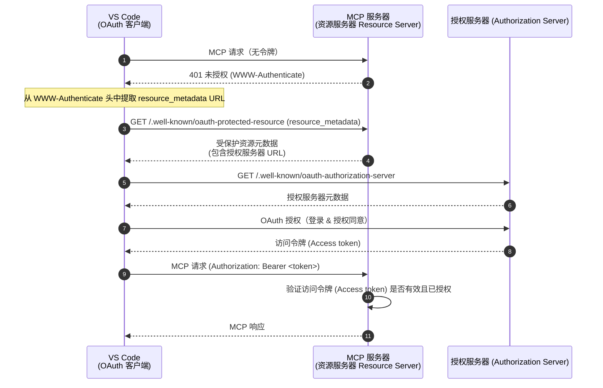
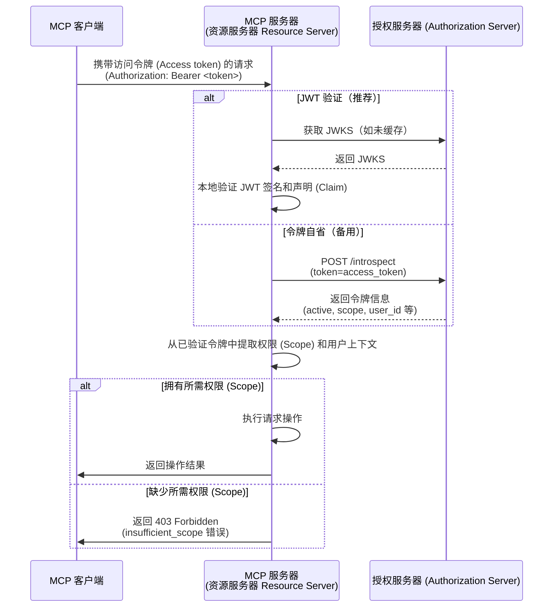

import { NpmLikeInstallation } from '@site/src/components/NpmLikeInstallation';
import TabItem from '@theme/TabItem';
import Tabs from '@theme/Tabs';

# 教程：构建一个待办事项管理器

:::tip Python SDK 可用
MCP Auth 也支持 Python！请查看 [Python SDK 仓库](https://github.com/mcp-auth/python) 获取安装和使用方法。
:::

在本教程中，我们将构建一个带有用户认证 (Authentication) 和授权 (Authorization) 的待办事项管理器 MCP 服务器。遵循最新的 MCP 规范，我们的 MCP 服务器将作为 OAuth 2.0 **资源服务器 (Resource Server)**，用于验证访问令牌 (Access token) 并强制执行基于权限 (Scope) 的权限控制。

完成本教程后，你将获得：

- ✅ 对如何在 MCP 服务器中设置基于角色的访问控制 (RBAC) 有基本了解
- ✅ 一个作为资源服务器 (Resource Server) 的 MCP 服务器，能够消费由授权服务器 (Authorization Server) 签发的访问令牌 (Access token)
- ✅ 一个基于权限 (Scope) 强制执行待办事项操作权限的工作实现

## 概览 \{#overview}

本教程将涉及以下组件：

- **MCP 客户端（VS Code）**：一个内置 MCP 支持的代码编辑器，作为 OAuth 2.0/OIDC 客户端。它发起与授权服务器 (Authorization Server) 的授权流程，并获取访问令牌 (Access token) 以认证 (Authentication) 对 MCP 服务器的请求。
- **授权服务器 (Authorization Server)**：一个 OAuth 2.1 或 OpenID Connect 提供商，负责管理用户身份、认证 (Authentication) 用户，并向授权客户端签发带有相应权限 (Scope) 的访问令牌 (Access token)。
- **MCP 服务器（资源服务器 Resource Server）**：根据最新 MCP 规范，MCP 服务器在 OAuth 2.0 框架中作为资源服务器 (Resource Server)。它验证由授权服务器 (Authorization Server) 签发的访问令牌 (Access token)，并对待办事项操作强制执行基于权限 (Scope) 的权限控制。

该架构遵循标准的 OAuth 2.0 流程：

- **VS Code** 代表用户请求受保护资源
- **授权服务器 (Authorization Server)** 认证 (Authentication) 用户并签发访问令牌 (Access token)
- **MCP 服务器** 验证令牌并根据授予的权限 (Permission) 提供受保护资源

以下是这些组件之间交互的高级流程图：


```mermaid
sequenceDiagram
  autonumber
  participant Client as VS Code<br/>(OAuth 客户端)
  participant RS as MCP 服务器<br/>(资源服务器 Resource Server)
  participant AS as 授权服务器 (Authorization Server)

  Client->>RS: MCP 请求（无令牌）
  RS-->>Client: 401 未授权 (WWW-Authenticate)
  Note over Client: 从 WWW-Authenticate 头中提取 resource_metadata URL

  Client->>RS: GET /.well-known/oauth-protected-resource (resource_metadata)
  RS-->>Client: 受保护资源元数据<br/>(包含授权服务器 URL)

  Client->>AS: GET /.well-known/oauth-authorization-server
  AS-->>Client: 授权服务器元数据
  Client->>AS: OAuth 授权（登录 & 授权同意）
  AS-->>Client: 访问令牌 (Access token)

  Client->>RS: MCP 请求 (Authorization: Bearer <token>)
  RS->>RS: 验证访问令牌 (Access token) 是否有效且已授权
  RS-->>Client: MCP 响应
```

## 了解你的授权服务器 (Authorization Server) \{#understand-your-authorization-server}

### 带有权限 (Scope) 的访问令牌 (Access tokens) \{#access-tokens-with-scopes}

要在 MCP 服务器中实现[基于角色的访问控制 (RBAC)](https://auth.wiki/rbac)，你的授权服务器 (Authorization Server) 需要支持签发带有权限 (Scope) 的访问令牌 (Access token)。权限 (Scope) 代表用户被授予的权限 (Permission)。

<Tabs groupId="provider">
<TabItem value="logto" label="Logto">

[Logto](https://logto.io) 通过其 API 资源（符合 [RFC 8707: OAuth 2.0 资源指示器](https://datatracker.ietf.org/doc/html/rfc8707)）和角色 (Role) 功能提供 RBAC 支持。设置方法如下：

1. 登录 [Logto 控制台](https://cloud.logto.io)（或你的自托管 Logto 控制台）

2. 创建 API 资源和权限 (Scope)：

   - 进入“API 资源”
   - 创建一个名为“Todo Manager”的新 API 资源
   - 添加以下权限 (Scope)：
     - `create:todos`：“创建新的待办事项”
     - `read:todos`：“读取所有待办事项”
     - `delete:todos`：“删除任意待办事项”

3. 创建角色 (Role)（推荐，便于管理）：

   - 进入“角色 (Roles)”
   - 创建一个“Admin”角色，并分配所有权限 (Scope)（`create:todos`、`read:todos`、`delete:todos`）
   - 创建一个“User”角色，仅分配 `create:todos` 权限 (Scope)

4. 分配权限 (Permission)：
   - 进入“用户”
   - 选择一个用户
   - 你可以：
     - 在“角色 (Roles)”标签页分配角色 (Role)（推荐）
     - 或直接在“权限 (Permissions)”标签页分配权限 (Scope)

这些权限 (Scope) 会作为空格分隔的字符串包含在 JWT 访问令牌 (Access token) 的 `scope` 声明 (Claim) 中。

</TabItem>
<TabItem value="oauth-oidc" label="OAuth 2.0 / OIDC">

OAuth 2.0 / OIDC 提供商通常支持基于权限 (Scope) 的访问控制。实现 RBAC 时：

1. 在授权服务器 (Authorization Server) 中定义所需的权限 (Scope)
2. 配置客户端在授权流程中请求这些权限 (Scope)
3. 确保授权服务器 (Authorization Server) 在访问令牌 (Access token) 中包含授予的权限 (Scope)
4. 权限 (Scope) 通常包含在 JWT 访问令牌 (Access token) 的 `scope` 声明 (Claim) 中

请查阅你的提供商文档，了解：

- 如何定义和管理权限 (Scope)
- 权限 (Scope) 如何包含在访问令牌 (Access token) 中
- 是否有额外的 RBAC 功能，如角色 (Role) 管理

</TabItem>
</Tabs>

### 验证令牌并检查权限 (Permission) \{#validating-tokens-and-checking-permissions}

根据最新 MCP 规范，MCP 服务器在 OAuth 2.0 框架中作为**资源服务器 (Resource Server)**。作为资源服务器 (Resource Server)，MCP 服务器有以下职责：

1. **令牌验证**：验证从 MCP 客户端收到的访问令牌 (Access token) 的真实性和完整性
2. **权限 (Scope) 强制**：从访问令牌 (Access token) 中提取并验证权限 (Scope)，以确定客户端被授权执行哪些操作
3. **资源保护**：仅在客户端提供有效且权限 (Permission) 充足的令牌时，才提供受保护资源（执行工具）

当你的 MCP 服务器收到请求时，会执行以下验证流程：

1. 从 `Authorization` 头中提取访问令牌 (Access token)（Bearer token 格式）
2. 验证访问令牌 (Access token) 的签名和过期时间
3. 从已验证的令牌中提取权限 (Scope) 和用户信息
4. 检查令牌是否包含所请求操作所需的权限 (Scope)

例如，如果用户想要创建新的待办事项，其访问令牌 (Access token) 必须包含 `create:todos` 权限 (Scope)。以下是资源服务器 (Resource Server) 验证流程：


```mermaid
sequenceDiagram
    participant Client as MCP 客户端
    participant Server as MCP 服务器<br/>(资源服务器 Resource Server)
    participant Auth as 授权服务器 (Authorization Server)

    Client->>Server: 携带访问令牌 (Access token) 的请求<br/>(Authorization: Bearer <token>)

    alt JWT 验证（推荐）
        Server->>Auth: 获取 JWKS（如未缓存）
        Auth-->>Server: 返回 JWKS
        Server->>Server: 本地验证 JWT 签名和声明 (Claim)
    else 令牌自省（备用）
        Server->>Auth: POST /introspect<br/>(token=access_token)
        Auth-->>Server: 返回令牌信息<br/>(active, scope, user_id 等)
    end

    Server->>Server: 从已验证令牌中提取权限 (Scope) 和用户上下文

    alt 拥有所需权限 (Scope)
        Server->>Server: 执行请求操作
        Server->>Client: 返回操作结果
    else 缺少所需权限 (Scope)
        Server->>Client: 返回 403 Forbidden<br/>(insufficient_scope 错误)
    end
```

### 动态客户端注册（Dynamic Client Registration）\{#dynamic-client-registration}

本教程不要求动态客户端注册，但如果你希望自动化 MCP 客户端与授权服务器 (Authorization Server) 的注册流程，可以参考 [是否需要动态客户端注册？](/provider-list#is-dcr-required) 获取更多信息。

## 了解待办事项管理器中的 RBAC \{#understand-rbac-in-todo-manager}

为了演示，我们将在待办事项管理器 MCP 服务器中实现一个简单的基于角色的访问控制 (RBAC) 系统。这将向你展示 RBAC 的基本原理，同时保持实现简洁。

:::note
虽然本教程演示了基于 RBAC 的权限 (Scope) 管理，但需要注意，并非所有认证 (Authentication) 提供商都通过角色 (Role) 实现权限 (Scope) 管理。有些提供商可能有自己独特的访问控制和权限 (Permission) 管理机制。
:::

### 工具与权限 (Scope) \{#tools-and-scopes}

我们的待办事项管理器 MCP 服务器提供三个主要工具：

- `create-todo`：创建新的待办事项
- `get-todos`：列出所有待办事项
- `delete-todo`：根据 ID 删除待办事项

为了控制对这些工具的访问，我们定义了以下权限 (Scope)：

- `create:todos`：允许创建新的待办事项
- `delete:todos`：允许删除现有待办事项
- `read:todos`：允许查询和获取所有待办事项列表

### 角色 (Role) 与权限 (Permission) \{#roles-and-permissions}

我们将定义两个具有不同访问级别的角色 (Role)：

| 角色 (Role) | create:todos | read:todos | delete:todos |
| ----------- | ------------ | ---------- | ------------ |
| Admin       | ✅           | ✅         | ✅           |
| User        | ✅           |            |              |

- **User**：普通用户，可以创建待办事项，仅能查看或删除自己的待办事项
- **Admin**：管理员，可以创建、查看和删除所有待办事项，无论归属

### 资源归属 (Resource ownership) \{#resource-ownership}

虽然上表显示了每个角色 (Role) 明确分配的权限 (Scope)，但还有一个重要的资源归属原则：

- **User** 没有 `read:todos` 或 `delete:todos` 权限 (Scope)，但仍然可以：
  - 查看自己的待办事项
  - 删除自己的待办事项
- **Admin** 拥有全部权限 (`read:todos` 和 `delete:todos`)，可以：
  - 查看系统中所有待办事项
  - 删除任意待办事项，无论归属

这展示了 RBAC 系统中的常见模式：资源归属为用户自己的资源隐式授予权限 (Permission)，而管理员角色 (Role) 获得所有资源的显式权限 (Permission)。

:::tip 了解更多
想深入了解 RBAC 概念和最佳实践，请查看 [精通 RBAC：全面的真实案例](https://blog.logto.io/mastering-rbac)。
:::

## 在你的提供商中配置授权 (Authorization) \{#configure-authorization-in-your-provider}

要实现我们前面描述的访问控制系统，你需要在授权服务器 (Authorization Server) 中配置所需的权限 (Scope)。不同提供商的配置方法如下：

<Tabs groupId="provider">
<TabItem value="logto" label="Logto">

[Logto](https://logto.io) 通过其 API 资源和角色 (Role) 功能提供 RBAC 支持。设置方法如下：

1. 登录 [Logto 控制台](https://cloud.logto.io)（或你的自托管 Logto 控制台）

2. 创建 API 资源和权限 (Scope)：

   - 进入“API 资源”
   - 创建一个名为“Todo Manager”的新 API 资源，并使用 `http://localhost:3001/` 作为资源指示器 (Resource indicator)。
     - **重要**：资源指示器 (Resource indicator) 必须与你的 MCP 服务器 URL 匹配。本教程使用 `http://localhost:3001/`，因为 MCP 服务器运行在 3001 端口。生产环境请使用实际 MCP 服务器 URL（如 `https://your-mcp-server.example.com/`）。
   - 创建以下权限 (Scope)：
     - `create:todos`：“创建新的待办事项”
     - `read:todos`：“读取所有待办事项”
     - `delete:todos`：“删除任意待办事项”

3. 创建角色 (Role)（推荐，便于管理）：

   - 进入“角色 (Roles)”
   - 创建一个“Admin”角色，并分配所有权限 (Scope)（`create:todos`、`read:todos`、`delete:todos`）
   - 创建一个“User”角色，仅分配 `create:todos` 权限 (Scope)
   - 在“User”角色详情页，切换到“常规”标签，并将“User”角色设置为“默认角色 (Default role)”。

4. 管理用户角色 (Role) 和权限 (Permission)：
   - 新用户：
     - 因为我们设置了默认角色 (Role)，新用户会自动获得“User”角色
   - 已有用户：
     - 进入“用户管理”
     - 选择一个用户
     - 在“角色 (Roles)”标签页为用户分配角色 (Role)

:::tip 编程方式管理角色 (Role)
你也可以使用 Logto 的 [Management API](https://docs.logto.io/integrate-logto/interact-with-management-api) 以编程方式管理用户角色 (Role)。这对于自动化用户管理或构建管理后台非常有用。
:::

请求访问令牌 (Access token) 时，Logto 会根据用户角色 (Role) 权限 (Permission) 在令牌的 `scope` 声明 (Claim) 中包含相应权限 (Scope)。

</TabItem>
<TabItem value="oauth-or-oidc" label="OAuth 2 / OIDC">

对于 OAuth 2.0 或 OpenID Connect 提供商，你需要配置代表不同权限 (Permission) 的权限 (Scope)。具体步骤取决于你的提供商，但一般流程如下：

1. 定义权限 (Scope)：

   - 配置授权服务器 (Authorization Server) 支持：
     - `create:todos`
     - `read:todos`
     - `delete:todos`

2. 配置客户端：

   - 注册或更新你的客户端以请求这些权限 (Scope)
   - 确保权限 (Scope) 被包含在访问令牌 (Access token) 中

3. 分配权限 (Permission)：
   - 使用你的提供商界面为用户授予相应权限 (Scope)
   - 有些提供商支持基于角色 (Role) 的管理，另一些可能直接分配权限 (Scope)
   - 查阅你的提供商文档，了解推荐做法

:::tip
大多数提供商会在访问令牌 (Access token) 的 `scope` 声明 (Claim) 中包含授予的权限 (Scope)。格式通常为空格分隔的权限 (Scope) 字符串。
:::

</TabItem>
</Tabs>

:::note[资源指示器 (Resource indicator) 末尾斜杠]
资源指示器 (Resource indicator) 一定要包含末尾斜杠（`/`）。由于 MCP 官方 SDK 当前存在一个 bug，使用该 SDK 的客户端在发起认证 (Authentication) 请求时会自动为资源标识符添加斜杠。如果你的资源指示器 (Resource indicator) 没有包含斜杠，这些客户端的资源验证会失败。（VS Code 不受此 bug 影响。）
:::

配置好授权服务器 (Authorization Server) 后，用户将获得包含其权限 (Scope) 的访问令牌 (Access token)。MCP 服务器将使用这些权限 (Scope) 判断：

- 用户是否可以创建新的待办事项（`create:todos`）
- 用户是否可以查看所有待办事项（`read:todos`）或仅能查看自己的
- 用户是否可以删除任意待办事项（`delete:todos`）或仅能删除自己的

## 搭建 MCP 服务器 \{#set-up-the-mcp-server}

我们将使用 [MCP 官方 SDK](https://github.com/modelcontextprotocol) 创建我们的待办事项管理器 MCP 服务器。

### 创建新项目 \{#create-a-new-project}

创建一个新的 Node.js 项目：

```bash
mkdir mcp-server
cd mcp-server
npm init -y # 或使用 `pnpm init`
npm pkg set type="module"
npm pkg set main="todo-manager.ts"
npm pkg set scripts.start="node --experimental-strip-types todo-manager.ts"
```

:::note
我们的示例使用 TypeScript，因为 Node.js v22.6.0+ 原生支持通过 `--experimental-strip-types` 运行 TypeScript。如果你使用 JavaScript，代码也类似——只需确保 Node.js 版本为 v22.6.0 或更高。详情见 Node.js 官方文档。
:::

### 安装 MCP SDK 及依赖 \{#install-the-mcp-sdk-and-dependencies}

```bash
npm install @modelcontextprotocol/sdk express zod
```

或使用你喜欢的包管理器，如 `pnpm` 或 `yarn`。

### 创建 MCP 服务器 \{#create-the-mcp-server}

创建名为 `todo-manager.ts` 的文件，并添加如下代码：

（此处代码与原文一致，保持不变）

运行服务器：

```bash
npm start
```

## 与授权服务器 (Authorization Server) 集成 \{#integrate-with-your-authorization-server}

完成本节需要考虑以下几点：

<details>
<summary>**你的授权服务器 (Authorization Server) 的发行者 (Issuer) URL**</summary>

通常是你的授权服务器 (Authorization Server) 的基础 URL，如 `https://auth.example.com`。有些提供商可能是 `https://example.logto.app/oidc`，请查阅你的提供商文档。

</details>

<details>
<summary>**如何获取授权服务器 (Authorization Server) 元数据**</summary>

- 如果你的授权服务器 (Authorization Server) 遵循 [OAuth 2.0 授权服务器元数据](https://datatracker.ietf.org/doc/html/rfc8414) 或 [OpenID Connect 发现](https://openid.net/specs/openid-connect-discovery-1_0.html)，你可以使用 MCP Auth 内置工具自动获取元数据。
- 如果不符合这些标准，你需要在 MCP 服务器配置中手动指定元数据 URL 或端点。请查阅你的提供商文档。

</details>

<details>
<summary>**如何在授权服务器 (Authorization Server) 注册 MCP 客户端**</summary>

- 如果你的授权服务器 (Authorization Server) 支持 [动态客户端注册 (Dynamic Client Registration)](https://datatracker.ietf.org/doc/html/rfc7591)，可以跳过此步骤，MCP 客户端会自动注册。
- 如果不支持动态客户端注册，则需要手动在授权服务器 (Authorization Server) 注册 MCP 客户端。

</details>

<details>
<summary>**了解令牌请求参数**</summary>

向不同授权服务器 (Authorization Server) 请求访问令牌 (Access token) 时，指定目标资源和权限 (Permission) 的方式各有不同。主要模式如下：

- **基于资源指示器 (Resource indicator)**：

  - 使用 `resource` 参数指定目标 API（见 [RFC 8707: OAuth 2.0 资源指示器](https://datatracker.ietf.org/doc/html/rfc8707)）
  - 现代 OAuth 2.0 实现常见
  - 示例请求：
    ```json
    {
      "resource": "http://localhost:3001/",
      "scope": "create:todos read:todos"
    }
    ```
  - 服务器签发专门绑定到请求资源的令牌

- **基于受众 (Audience)**：

  - 使用 `audience` 参数指定令牌的目标接收者
  - 与资源指示器 (Resource indicator) 类似，但语义不同
  - 示例请求：
    ```json
    {
      "audience": "todo-api",
      "scope": "create:todos read:todos"
    }
    ```

- **纯权限 (Scope) 模式**：
  - 仅依赖权限 (Scope)，无资源/受众参数
  - 传统 OAuth 2.0 方式
  - 示例请求：
    ```json
    {
      "scope": "todo-api:create todo-api:read openid profile"
    }
    ```
  - 通常使用前缀权限 (Scope) 进行命名空间
  - 适用于简单 OAuth 2.0 实现

:::tip 最佳实践

- 查阅你的提供商文档，了解支持哪些参数
- 有些提供商同时支持多种方式
- 资源指示器 (Resource indicator) 通过受众限制提供更好的安全性
- 有条件时优先使用资源指示器 (Resource indicator) 以获得更好的访问控制
  :::

</details>

虽然每个提供商可能有自己的具体要求，以下步骤将指导你如何结合 VS Code 和 MCP 服务器进行针对不同提供商的配置。

### 注册 MCP 客户端为第三方应用 \{#register-mcp-client-as-a-third-party-app}

<Tabs groupId="provider">
<TabItem value="logto" label="Logto">

将待办事项管理器与 [Logto](https://logto.io) 集成非常简单，因为它是支持资源指示器 (Resource indicator) 和权限 (Scope) 的 OpenID Connect 提供商，可以用 `http://localhost:3001/` 作为资源指示器 (Resource indicator) 保护你的 todo API。

由于 Logto 目前尚不支持动态客户端注册 (Dynamic Client Registration)，你需要手动将 MCP 客户端（VS Code）作为第三方应用注册到你的 Logto 租户：

1. 登录 [Logto 控制台](https://cloud.logto.io)（或你的自托管 Logto 控制台）。
2. 导航到 **应用 > 第三方应用**，点击“创建应用”。
3. 选择 **原生应用** 作为应用类型。
4. 填写应用信息：
   - **应用名称**：如 "MCP Client"
   - **描述**：如 "MCP client for VS Code"
5. 为 VS Code 设置以下 **重定向 URI**：
   ```
   http://127.0.0.1
   https://vscode.dev/redirect
   ```
6. 点击“保存更改”。
7. 进入应用的 **权限 (Permissions)** 标签页，在 **用户** 部分，添加你之前创建的 **Todo Manager** API 资源中的 `create:todos`、`read:todos` 和 `delete:todos` 权限 (Permission)。
8. 在顶部卡片中，你会看到 "App ID" 值。复制备用。

</TabItem>
<TabItem value="oauth-oidc" label="OAuth 2.0 / OIDC">

:::note
这是通用的 OAuth 2.0 / OpenID Connect 提供商集成指南。OIDC 基于 OAuth 2.0，步骤类似。具体细节请查阅你的提供商文档。
:::

如果你的提供商支持动态客户端注册 (Dynamic Client Registration)，可以跳过手动注册；否则需要手动注册 MCP 客户端：

1. 登录你的提供商控制台。

2. 导航到“应用”或“客户端”部分，创建新应用或客户端。

3. 如果需要选择客户端类型，选择“原生应用”或“公有客户端”。

4. 创建应用后，配置重定向 URI。对于 VS Code，添加如下：

   ```
   http://127.0.0.1
   https://vscode.dev/redirect
   ```

5. 配置应用所需的权限 (Scope)/权限 (Permission)：

   ```text
   create:todos read:todos delete:todos
   ```

6. 找到新建应用的 "Client ID" 或 "Application ID"，复制备用。

</TabItem>
</Tabs>

### 设置 MCP Auth \{#set-up-mcp-auth}

首先，在你的 MCP 服务器项目中安装 MCP Auth SDK。

<NpmLikeInstallation packageName="mcp-auth" />

现在我们需要在 MCP 服务器中初始化 MCP Auth。在受保护资源模式下，你需要配置资源元数据，包括授权服务器 (Authorization Server)。

有两种方式配置授权服务器 (Authorization Server)：

- **预获取（推荐）**：使用 `fetchServerConfig()` 在初始化 MCPAuth 前获取元数据。这样可以在启动时验证配置。
- **按需发现**：只提供 `issuer` 和 `type`，首次需要时再获取元数据。适用于如 Cloudflare Workers 这类不允许顶层异步 fetch 的边缘运行时。

#### 配置受保护资源元数据 \{#configure-protected-resource-metadata}

首先，获取你的授权服务器 (Authorization Server) 的发行者 (Issuer) URL：

<Tabs groupId="provider">

<TabItem value="logto" label="Logto">

在 Logto 中，你可以在 Logto 控制台的应用详情页 "Endpoints & Credentials / Issuer endpoint" 部分找到发行者 (Issuer) URL，格式如 `https://my-project.logto.app/oidc`。

</TabItem>

<TabItem value="oauth-oidc" label="OAuth 2.0 / OIDC">

对于 OAuth 2.0 提供商，你需要：

1. 查阅你的提供商文档，获取授权服务器 (Authorization Server) URL（通常称为发行者 (Issuer) URL 或基础 URL）
2. 有些提供商会在 `https://{your-domain}/.well-known/oauth-authorization-server` 暴露此信息
3. 在你的提供商管理后台的 OAuth/API 设置中查找

</TabItem>

</Tabs>

现在，在构建 MCP Auth 实例时配置受保护资源元数据：

（此处代码与原文一致，保持不变）

### 更新 MCP 服务器 \{#update-mcp-server}

我们快完成了！现在需要更新 MCP 服务器，应用 MCP Auth 路由和中间件函数，并基于用户权限 (Scope) 实现待办事项工具的权限控制。

首先，应用受保护资源元数据路由，让 MCP 客户端可以从 MCP 服务器获取期望的资源元数据。

（此处代码与原文一致，保持不变）

接下来，我们将把 MCP Auth 中间件应用到 MCP 服务器。该中间件将处理所有请求的认证 (Authentication) 和授权 (Authorization)，确保只有被授权的用户才能访问待办事项工具。

（此处代码与原文一致，保持不变）

此时，我们可以更新待办事项工具的实现，利用 MCP Auth 中间件进行认证 (Authentication) 和授权 (Authorization)。

（此处代码与原文一致，保持不变）

现在，创建上述代码中用到的 "Todo service" 实现相关功能：

创建 `todo-service.ts` 文件：

（此处代码与原文一致，保持不变）

恭喜！我们已经成功实现了一个带有认证 (Authentication) 和授权 (Authorization) 的完整 MCP 服务器！

:::info
完整 MCP 服务器（OIDC 版本）代码请参考 [MCP Auth Node.js SDK 仓库](https://github.com/mcp-auth/js/blob/master/packages/sample-servers/src)。
:::

## 检查点：运行 `todo-manager` 工具 \{#checkpoint-run-the-todo-manager-tools}

重启你的 MCP 服务器，并用 VS Code 连接它。认证 (Authentication) 连接方法如下：

1. 在 VS Code 中按下 `Command + Shift + P`（macOS）或 `Ctrl + Shift + P`（Windows/Linux）打开命令面板
2. 输入 `MCP: Add Server...` 并选择
3. 选择 `HTTP` 作为服务器类型
4. 输入 MCP 服务器 URL：`http://localhost:3001`
5. OAuth 请求发起后，VS Code 会提示你输入 **App ID**。输入你从授权服务器 (Authorization Server) 复制的 App ID
6. 因为我们没有 **App Secret**（这是公有客户端），直接回车跳过
7. 在浏览器中完成登录流程

登录后回到 VS Code，重复上一个检查点的操作来运行待办事项工具。这一次，你可以用认证 (Authentication) 用户身份使用这些工具。工具的行为将取决于分配给你的角色 (Role) 和权限 (Permission)：

- 如果你以 **User**（仅有 `create:todos` 权限 (Scope)）身份登录：

  - 可以用 `create-todo` 工具创建新待办事项
  - 只能查看和删除自己的待办事项
  - 无法查看或删除其他用户的待办事项

- 如果你以 **Admin**（拥有全部权限：`create:todos`、`read:todos`、`delete:todos`）身份登录：
  - 可以创建新待办事项
  - 可以用 `get-todos` 工具查看系统中所有待办事项
  - 可以用 `delete-todo` 工具删除任意待办事项，无论归属

你可以通过以下方式测试不同权限级别：

1. 断开 MCP 服务器连接（在 VS Code 中移除服务器配置）
2. 用具有不同角色 (Role)/权限 (Permission) 的其他用户账号登录
3. 再次尝试相同工具，观察因用户权限 (Permission) 不同而产生的行为变化

这展示了基于角色的访问控制 (RBAC) 在实际中的工作方式，不同用户对系统功能有不同访问级别。

:::info
完整 MCP 服务器（OIDC 版本）代码请参考 [MCP Auth Node.js SDK 仓库](https://github.com/mcp-auth/js/blob/master/packages/sample-servers/src)。
:::

## 结语 \{#closing-notes}

恭喜！你已成功完成本教程。让我们回顾一下所做的内容：

- 搭建了一个带有待办事项管理工具（`create-todo`、`get-todos`、`delete-todo`）的基础 MCP 服务器
- 实现了基于角色的访问控制 (RBAC)，为用户和管理员设置了不同权限级别
- 使用 MCP Auth 将 MCP 服务器与授权服务器 (Authorization Server) 集成
- 配置 VS Code 认证 (Authentication) 用户，并用带有权限 (Scope) 的访问令牌 (Access token) 调用工具

欢迎查阅其他教程和文档，充分发挥 MCP Auth 的强大能力。