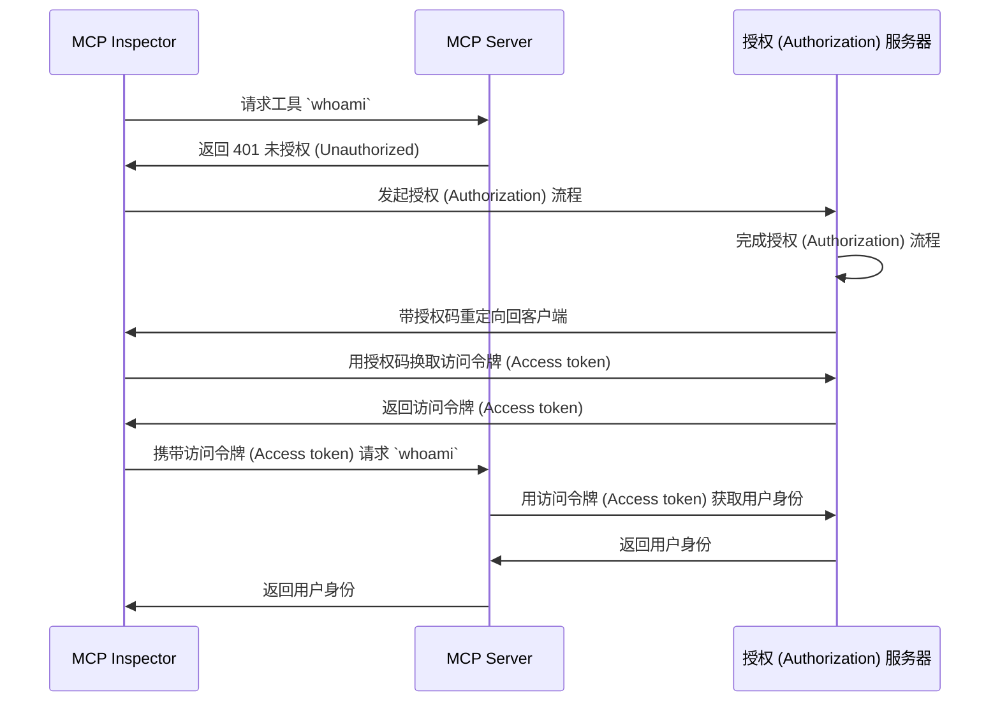

import TabItem from '@theme/TabItem';
import Tabs from '@theme/Tabs';

import SetupOauth from './_setup-oauth.mdx';
import SetupOidc from './_setup-oidc.mdx';

# 教程：我是谁？ (Tutorial: Who am I?)

本教程将引导你完成设置 MCP Auth 以认证 (Authentication) 用户并从授权 (Authorization) 服务器获取其身份信息的过程。

完成本教程后，你将获得：

- ✅ 对如何使用 MCP Auth 进行用户认证 (Authentication) 的基本理解。
- ✅ 一个 MCP 服务器，提供用于获取用户身份信息的工具。

## 概览 (Overview) \{#overview}

本教程将涉及以下组件：

- **MCP 服务器**：一个简单的 MCP 服务器，使用 MCP 官方 SDK 处理请求。
- **MCP inspector**：MCP 服务器的可视化测试工具。它还充当 OAuth / OIDC 客户端，发起授权 (Authorization) 流程并获取访问令牌 (Access token)。
- **授权 (Authorization) 服务器**：一个 OAuth 2.1 或 OpenID Connect 提供商，管理用户身份并颁发访问令牌 (Access token)。

以下是这些组件之间交互的高级流程图：



## 了解你的授权 (Authorization) 服务器 \{#understand-your-authorization-server}

### 获取用户身份信息 (Retrieving user identity information) \{#retrieving-user-identity-information}

要完成本教程，你的授权 (Authorization) 服务器应提供用于获取用户身份信息的 API：

<Tabs groupId="provider">
<TabItem value="logto" label="Logto">

[Logto](https://logto.io) 是一个 OpenID Connect 提供商，支持标准的 [userinfo 端点](https://openid.net/specs/openid-connect-core-1_0.html#UserInfo) 用于获取用户身份信息。

要获取可用于访问 userinfo 端点的访问令牌 (Access token)，至少需要两个权限 (Scopes)：`openid` 和 `profile`。你可以继续阅读，后续会介绍权限 (Scope) 配置。

</TabItem>
<TabItem value="keycloak" label="Keycloak">

[Keycloak](https://www.keycloak.org) 是一个开源身份和访问管理解决方案，支持多种协议，包括 OpenID Connect (OIDC)。作为 OIDC 提供商，它实现了标准的 [userinfo 端点](https://openid.net/specs/openid-connect-core-1_0.html#UserInfo) 用于获取用户身份信息。

要获取可用于访问 userinfo 端点的访问令牌 (Access token)，至少需要两个权限 (Scopes)：`openid` 和 `profile`。你可以继续阅读，后续会介绍权限 (Scope) 配置。

</TabItem>
<TabItem value="oidc" label="OIDC">

大多数 OpenID Connect 提供商都支持 [userinfo 端点](https://openid.net/specs/openid-connect-core-1_0.html#UserInfo) 用于获取用户身份信息。

请查阅你的提供商文档，确认是否支持该端点。如果你的提供商支持 [OpenID Connect Discovery](https://openid.net/specs/openid-connect-discovery-1_0.html)，你也可以检查 discovery 文档（`.well-known/openid-configuration` 端点的响应）中是否包含 `userinfo_endpoint`。

要获取可用于访问 userinfo 端点的访问令牌 (Access token)，至少需要两个权限 (Scopes)：`openid` 和 `profile`。请查阅你的提供商文档，了解权限 (Scopes) 与用户身份声明 (Claims) 的映射关系。

</TabItem>
<TabItem value="oauth" label="OAuth 2">

虽然 OAuth 2.0 没有定义获取用户身份信息的标准方式，但许多提供商实现了自己的端点。请查阅你的提供商文档，了解如何使用访问令牌 (Access token) 获取用户身份信息，以及在发起授权 (Authorization) 流程时获取该访问令牌 (Access token) 所需的参数。

</TabItem>
</Tabs>

### 动态客户端注册 (Dynamic Client Registration) \{#dynamic-client-registration}

本教程不要求动态客户端注册，但如果你希望自动化 MCP 客户端在授权 (Authorization) 服务器的注册流程，它会很有用。详见 [是否需要动态客户端注册？](../../provider-list.mdx#is-dcr-required)。

## 搭建 MCP 服务器 \{#set-up-the-mcp-server}

我们将使用 [MCP 官方 SDK](https://github.com/modelcontextprotocol) 创建一个带有 `whoami` 工具的 MCP 服务器，用于从授权 (Authorization) 服务器获取用户身份信息。

### 创建新项目 (Create a new project) \{#create-a-new-project}

<Tabs groupId="sdk">
<TabItem value="python" label="Python">

```bash
mkdir mcp-server
cd mcp-server
uv init # 或使用 `pipenv` 或 `poetry` 创建新虚拟环境
```

</TabItem>
<TabItem value="node" label="Node.js">

创建一个新的 Node.js 项目：

```bash
mkdir mcp-server
cd mcp-server
npm init -y # 或使用 `pnpm init`
npm pkg set type="module"
npm pkg set main="whoami.js"
npm pkg set scripts.start="node whoami.js"
```

</TabItem>
</Tabs>

### 安装 MCP SDK 及依赖 (Install the MCP SDK and dependencies) \{#install-the-mcp-sdk-and-dependencies}

<Tabs groupId="sdk">
<TabItem value="python" label="Python">

```bash
pip install "mcp[cli]" starlette uvicorn
```

或使用你喜欢的其他包管理器，如 `uv` 或 `poetry`。

</TabItem>
<TabItem value="node" label="Node.js">

```bash
npm install @modelcontextprotocol/sdk express
```

或使用你喜欢的其他包管理器，如 `pnpm` 或 `yarn`。

</TabItem>
</Tabs>

### 创建 MCP 服务器 (Create the MCP server) \{#create-the-mcp-server}

首先，让我们创建一个实现 `whoami` 工具的 MCP 服务器。

<Tabs groupId="sdk">
<TabItem value="python" label="Python">

创建名为 `whoami.py` 的文件，并添加如下代码：

```python
from mcp.server.fastmcp import FastMCP
from starlette.applications import Starlette
from starlette.routing import Mount
from typing import Any

mcp = FastMCP("WhoAmI")

@mcp.tool()
def whoami() -> dict[str, Any]:
    """返回当前用户信息的工具。"""
    return {"error": "Not authenticated"}

app = Starlette(
    routes=[Mount('/', app=mcp.sse_app())]
)
```

使用以下命令运行服务器：

```bash
uvicorn whoami:app --host 0.0.0.0 --port 3001
```

</TabItem>
<TabItem value="node" label="Node.js">

:::note
由于当前 MCP inspector 实现尚未处理授权 (Authorization) 流程，我们将使用 SSE 方式搭建 MCP 服务器。待 MCP inspector 支持授权 (Authorization) 流程后，我们会更新此处代码。
:::

你也可以使用 `pnpm` 或 `yarn`。

创建名为 `whoami.js` 的文件，并添加如下代码：

```js
import { McpServer } from '@modelcontextprotocol/sdk/server/mcp.js';
import { SSEServerTransport } from '@modelcontextprotocol/sdk/server/sse.js';
import express from 'express';

// 创建 MCP 服务器
const server = new McpServer({
  name: 'WhoAmI',
  version: '0.0.0',
});

// 添加一个返回当前用户信息的工具
server.tool('whoami', async () => {
  return {
    content: [{ type: 'text', text: JSON.stringify({ error: 'Not authenticated' }) }],
  };
});

// 以下为 MCP SDK 文档中的样板代码
const PORT = 3001;
const app = express();

const transports = {};

app.get('/sse', async (_req, res) => {
  const transport = new SSEServerTransport('/messages', res);
  transports[transport.sessionId] = transport;

  res.on('close', () => {
    delete transports[transport.sessionId];
  });

  await server.connect(transport);
});

app.post('/messages', async (req, res) => {
  const sessionId = String(req.query.sessionId);
  const transport = transports[sessionId];
  if (transport) {
    await transport.handlePostMessage(req, res, req.body);
  } else {
    res.status(400).send('No transport found for sessionId');
  }
});

app.listen(PORT);
```

使用以下命令运行服务器：

```bash
npm start
```

</TabItem>
</Tabs>

## 检查 MCP 服务器 (Inspect the MCP server) \{#inspect-the-mcp-server}

### 克隆并运行 MCP inspector (Clone and run MCP inspector) \{#clone-and-run-mcp-inspector}

现在 MCP 服务器已运行，我们可以使用 MCP inspector 检查 `whoami` 工具是否可用。

由于当前实现的限制，我们 fork 了 [MCP inspector](https://github.com/mcp-auth/inspector)，使其在认证 (Authentication) 和授权 (Authorization) 方面更灵活和可扩展。我们也已向原仓库提交了 pull request。

运行 MCP inspector，可使用以下命令（需要 Node.js）：

```bash
git clone https://github.com/mcp-auth/inspector.git
cd inspector
npm install
npm run dev
```

然后，在浏览器中打开 `http://localhost:6274/`（或终端显示的其他 URL）访问 MCP inspector。

### 连接 MCP inspector 到 MCP 服务器 (Connect MCP inspector to the MCP server) \{#connect-mcp-inspector-to-the-mcp-server}

在继续之前，请检查 MCP inspector 中的以下配置：

- **Transport Type**：设置为 `SSE`。
- **URL**：设置为你的 MCP 服务器的 URL。此处应为 `http://localhost:3001/sse`。

现在你可以点击“Connect”按钮，查看 MCP inspector 是否能连接到 MCP 服务器。如果一切正常，你将在 MCP inspector 中看到“Connected”状态。

### 检查点：运行 `whoami` 工具 (Checkpoint: Run the `whoami` tool) \{#checkpoint-run-the-whoami-tool}

1. 在 MCP inspector 顶部菜单点击 "Tools" 标签页。
2. 点击 "List Tools" 按钮。
3. 你应该能在页面上看到 `whoami` 工具，点击它查看工具详情。
4. 在右侧你会看到 "Run Tool" 按钮，点击运行该工具。
5. 你将看到工具返回的 JSON 响应 `{"error": "Not authenticated"}`。


## 集成你的授权 (Authorization) 服务器 (Integrate with your authorization server) \{#integrate-with-your-authorization-server}

完成本节内容时，你需要考虑以下事项：

<details>
<summary>**你的授权 (Authorization) 服务器的发行者 (Issuer) URL**</summary>

通常是你的授权 (Authorization) 服务器的基础 URL，如 `https://auth.example.com`。有些提供商可能是类似 `https://example.logto.app/oidc` 的路径，请查阅你的提供商文档。

</details>

<details>
<summary>**如何获取授权 (Authorization) 服务器元数据**</summary>

- 如果你的授权 (Authorization) 服务器符合 [OAuth 2.0 授权服务器元数据](https://datatracker.ietf.org/doc/html/rfc8414) 或 [OpenID Connect Discovery](https://openid.net/specs/openid-connect-discovery-1_0.html)，你可以使用 MCP Auth 内置工具自动获取元数据。
- 如果不符合这些标准，你需要在 MCP 服务器配置中手动指定元数据 URL 或端点。请查阅你的提供商文档获取具体端点。

</details>

<details>
<summary>**如何将 MCP inspector 注册为授权 (Authorization) 服务器的客户端**</summary>

- 如果你的授权 (Authorization) 服务器支持 [动态客户端注册 (Dynamic Client Registration)](https://datatracker.ietf.org/doc/html/rfc7591)，可以跳过此步骤，MCP inspector 会自动注册为客户端。
- 如果不支持动态客户端注册，你需要手动在授权 (Authorization) 服务器中注册 MCP inspector 为客户端。

</details>

<details>
<summary>**如何获取用户身份信息以及如何配置授权 (Authorization) 请求参数**</summary>

- 对于 OpenID Connect 提供商：通常在发起授权 (Authorization) 流程时需要请求至少 `openid` 和 `profile` 权限 (Scopes)。这样授权 (Authorization) 服务器返回的访问令牌 (Access token) 就包含访问 [userinfo 端点](https://openid.net/specs/openid-connect-core-1_0.html#UserInfo) 所需的权限 (Scopes)。

  注意：部分提供商可能不支持 userinfo 端点。

- 对于 OAuth 2.0 / OAuth 2.1 提供商：请查阅你的提供商文档，了解如何使用访问令牌 (Access token) 获取用户身份信息，以及发起授权 (Authorization) 流程时获取该访问令牌 (Access token) 所需的参数。

</details>

虽然每个提供商可能有自己的具体要求，以下步骤将指导你如何结合 MCP inspector 和 MCP 服务器进行针对不同提供商的配置集成。

### 注册 MCP inspector 为客户端 (Register MCP inspector as a client) \{#register-mcp-inspector-as-a-client}

<Tabs groupId="provider">
<TabItem value="logto" label="Logto">

与 [Logto](https://logto.io) 集成非常简单，因为它是一个支持标准 [userinfo 端点](https://openid.net/specs/openid-connect-core-1_0.html#UserInfo) 的 OpenID Connect 提供商。

由于 Logto 目前尚不支持动态客户端注册 (Dynamic Client Registration)，你需要手动在 Logto 租户中注册 MCP inspector 为客户端：

1. 打开 MCP inspector，点击 "OAuth Configuration" 按钮。复制 **Redirect URL (auto-populated)**，如 `http://localhost:6274/oauth/callback`。
2. 登录 [Logto Console](https://cloud.logto.io)（或你的自托管 Logto Console）。
3. 进入 "Applications" 标签页，点击 "Create application"。在页面底部点击 "Create app without framework"。
4. 填写应用详情，然后点击 "Create application"：
   - **选择应用类型**：选择 "Single-page application"。
   - **应用名称**：如 "MCP Inspector"。
5. 在 "Settings / Redirect URIs" 区域，粘贴刚才复制的 **Redirect URL (auto-populated)**，然后点击底部栏的 "Save changes"。
6. 在顶部卡片中，你会看到 "App ID"。复制它。
7. 回到 MCP inspector，在 "OAuth Configuration" 区域的 "Client ID" 字段粘贴 "App ID"。
8. 在 "Auth Params" 字段输入 `{"scope": "openid profile email"}`，确保 Logto 返回的访问令牌 (Access token) 包含访问 userinfo 端点所需的权限 (Scopes)。

</TabItem>
<TabItem value="keycloak" label="Keycloak">

[Keycloak](https://www.keycloak.org) 是一个开源身份和访问管理解决方案，支持 OpenID Connect 协议。

虽然 Keycloak 支持动态客户端注册 (Dynamic Client Registration)，但其客户端注册端点不支持 CORS，导致大多数 MCP 客户端无法直接注册。因此，我们需要手动注册客户端。

:::note
Keycloak 可通过 [多种方式](https://www.keycloak.org/guides#getting-started) 安装（裸机、kubernetes 等），本教程采用 Docker 快速搭建。
:::

让我们搭建 Keycloak 实例并进行配置：

1. 按 [官方文档](https://www.keycloak.org/getting-started/getting-started-docker) 使用 Docker 运行 Keycloak：

```bash
docker run -p 8080:8080 -e KC_BOOTSTRAP_ADMIN_USERNAME=admin -e KC_BOOTSTRAP_ADMIN_PASSWORD=admin quay.io/keycloak/keycloak:26.2.4 start-dev
```

2. 访问 Keycloak 管理控制台 (http://localhost:8080/admin)，使用以下凭据登录：

   - 用户名：`admin`
   - 密码：`admin`

3. 创建新 Realm：

   - 左上角点击 "Create Realm"
   - "Realm name" 填写 `mcp-realm`
   - 点击 "Create"

4. 创建测试用户：

   - 左侧菜单点击 "Users"
   - 点击 "Create new user"
   - 填写用户信息：
     - 用户名：`testuser`
     - 名字和姓氏可任意填写
   - 点击 "Create"
   - 在 "Credentials" 标签页设置密码，并取消勾选 "Temporary"

5. 注册 MCP Inspector 为客户端：

   - 打开 MCP inspector，点击 "OAuth Configuration" 按钮。复制 **Redirect URL (auto-populated)**，如 `http://localhost:6274/oauth/callback`。
   - 在 Keycloak 管理控制台左侧点击 "Clients"
   - 点击 "Create client"
   - 填写客户端信息：
     - Client type: 选择 "OpenID Connect"
     - Client ID: 输入 `mcp-inspector`
     - 点击 "Next"
   - "Capability config" 页面：
     - 确保 "Standard flow" 已启用
     - 点击 "Next"
   - "Login settings" 页面：
     - 在 "Valid redirect URIs" 粘贴 MCP Inspector 回调 URL
     - "Web origins" 填写 `http://localhost:6274`
     - 点击 "Save"
   - 复制 "Client ID"（即 `mcp-inspector`）

6. 回到 MCP Inspector：
   - 在 "OAuth Configuration" 区域的 "Client ID" 字段粘贴复制的 Client ID
   - 在 "Auth Params" 字段输入以下内容以请求所需权限 (Scopes)：

```json
{ "scope": "openid profile email" }
```

</TabItem>
<TabItem value="oidc" label="OIDC">

:::note
这是通用 OpenID Connect 提供商集成指南。具体细节请查阅你的提供商文档。
:::

如果你的 OpenID Connect 提供商支持动态客户端注册 (Dynamic Client Registration)，可直接跳到第 8 步配置 MCP inspector；否则需手动注册 MCP inspector 为客户端：

1. 打开 MCP inspector，点击 "OAuth Configuration" 按钮。复制 **Redirect URL (auto-populated)**，如 `http://localhost:6274/oauth/callback`。
2. 登录你的 OpenID Connect 提供商控制台。
3. 进入 "Applications" 或 "Clients" 区域，创建新应用或客户端。
4. 如需选择客户端类型，选择 "Single-page application" 或 "Public client"。
5. 创建应用后，需配置重定向 URI。粘贴刚才复制的 **Redirect URL (auto-populated)**。
6. 找到新建应用的 "Client ID" 或 "Application ID"，复制它。
7. 回到 MCP inspector，在 "OAuth Configuration" 区域的 "Client ID" 字段粘贴该值。
8. 对于标准 OpenID Connect 提供商，可在 "Auth Params" 字段输入以下内容以请求访问 userinfo 端点所需权限 (Scopes)：

```json
{ "scope": "openid profile email" }
```

</TabItem>
<TabItem value="oauth" label="OAuth 2">

:::note
这是通用 OAuth 2.0 / OAuth 2.1 提供商集成指南。具体细节请查阅你的提供商文档。
:::

如果你的 OAuth 2.0 / OAuth 2.1 提供商支持动态客户端注册 (Dynamic Client Registration)，可直接跳到第 8 步配置 MCP inspector；否则需手动注册 MCP inspector 为客户端：

1. 打开 MCP inspector，点击 "OAuth Configuration" 按钮。复制 **Redirect URL (auto-populated)**，如 `http://localhost:6274/oauth/callback`。
2. 登录你的 OAuth 2.0 / OAuth 2.1 提供商控制台。
3. 进入 "Applications" 或 "Clients" 区域，创建新应用或客户端。
4. 如需选择客户端类型，选择 "Single-page application" 或 "Public client"。
5. 创建应用后，需配置重定向 URI。粘贴刚才复制的 **Redirect URL (auto-populated)**。
6. 找到新建应用的 "Client ID" 或 "Application ID"，复制它。
7. 回到 MCP inspector，在 "OAuth Configuration" 区域的 "Client ID" 字段粘贴该值。
8. 查阅你的提供商文档，了解如何获取用于用户身份信息的访问令牌 (Access token)。你可能需要指定获取访问令牌 (Access token) 所需的权限 (Scopes) 或参数。例如，如果你的提供商要求 `profile` 权限 (Scope) 才能访问用户身份信息，可在 "Auth Params" 字段输入：

```json
{ "scope": "profile" }
```

</TabItem>
</Tabs>

### 配置 MCP Auth (Set up MCP auth) \{#set-up-mcp-auth}

在你的 MCP 服务器项目中，需要安装 MCP Auth SDK 并配置其使用你的授权 (Authorization) 服务器元数据。

<Tabs groupId="sdk">
<TabItem value="python" label="Python">

首先，安装 `mcpauth` 包：

```bash
pip install mcpauth
```

或使用你喜欢的其他包管理器，如 `uv` 或 `poetry`。

</TabItem>
<TabItem value="node" label="Node.js">

首先，安装 `mcp-auth` 包：

```bash
npm install mcp-auth
```

</TabItem>
</Tabs>

MCP Auth 需要授权 (Authorization) 服务器元数据以完成初始化。根据你的提供商：

<Tabs groupId="provider">

<TabItem value="logto" label="Logto">

发行者 (Issuer) URL 可在 Logto Console 的应用详情页 "Endpoints & Credentials / Issuer endpoint" 区域找到，类似 `https://my-project.logto.app/oidc`。

<SetupOidc />

</TabItem>

<TabItem value="keycloak" label="Keycloak">

发行者 (Issuer) URL 可在 Keycloak 管理控制台找到。在你的 'mcp-realm' 下，进入 "Realm settings / Endpoints" 区域，点击 "OpenID Endpoint Configuration" 链接。JSON 文档中的 `issuer` 字段即为你的发行者 (Issuer) URL，类似 `http://localhost:8080/realms/mcp-realm`。

<SetupOidc />

</TabItem>

<TabItem value="oidc" label="OIDC">

以下代码同样假设授权 (Authorization) 服务器支持 [userinfo 端点](https://openid.net/specs/openid-connect-core-1_0.html#UserInfo) 用于获取用户身份信息。如果你的提供商不支持该端点，请查阅文档获取具体端点，并将 userinfo 端点变量替换为正确的 URL。

<SetupOidc showAlternative />

</TabItem>
<TabItem value="oauth" label="OAuth 2">

如前所述，OAuth 2.0 没有定义获取用户身份信息的标准方式。以下代码假设你的提供商有专门的端点用于通过访问令牌 (Access token) 获取用户身份信息。请查阅你的提供商文档获取具体端点，并将 userinfo 端点变量替换为正确的 URL。

<SetupOauth />

</TabItem>
</Tabs>

### 更新 MCP 服务器 (Update MCP server) \{#update-mcp-server}

我们快完成了！现在需要更新 MCP 服务器，应用 MCP Auth 路由和中间件函数，并让 `whoami` 工具返回实际的用户身份信息。

<Tabs groupId="sdk">
<TabItem value="python" label="Python">

```python
@mcp.tool()
def whoami() -> dict[str, Any]:
    """返回当前用户信息的工具。"""
    return (
        mcp_auth.auth_info.claims
        if mcp_auth.auth_info # 由 Bearer auth 中间件填充
        else {"error": "Not authenticated"}
    )

# ...

bearer_auth = Middleware(mcp_auth.bearer_auth_middleware(verify_access_token))
app = Starlette(
    routes=[
        # 添加元数据路由 (`/.well-known/oauth-authorization-server`)
        mcp_auth.metadata_route(),
        # 用 Bearer auth 中间件保护 MCP 服务器
        Mount('/', app=mcp.sse_app(), middleware=[bearer_auth]),
    ],
)
```

</TabItem>
<TabItem value="node" label="Node.js">

```js
server.tool('whoami', ({ authInfo }) => {
  return {
    content: [
      { type: 'text', text: JSON.stringify(authInfo?.claims ?? { error: 'Not authenticated' }) },
    ],
  };
});

// ...

app.use(mcpAuth.delegatedRouter());
app.use(mcpAuth.bearerAuth(verifyToken));
```

</TabItem>
</Tabs>

## 检查点：带认证 (Authentication) 运行 `whoami` 工具 (Checkpoint: Run the `whoami` tool with authentication) \{#checkpoint-run-the-whoami-tool-with-authentication}

重启你的 MCP 服务器，并在浏览器中打开 MCP inspector。当你点击 "Connect" 按钮时，应会被重定向到授权 (Authorization) 服务器的登录页面。

登录后返回 MCP inspector，重复上一个检查点的操作运行 `whoami` 工具。这一次，你应该能看到授权 (Authorization) 服务器返回的用户身份信息。


<Tabs groupId="sdk">
<TabItem value="python" label="Python">

:::info
完整 MCP 服务器（OIDC 版本）代码请参考 [MCP Auth Python SDK 仓库](https://github.com/mcp-auth/python/blob/master/samples/server/whoami.py)。
:::

</TabItem>
<TabItem value="node" label="Node.js">

:::info
完整 MCP 服务器（OIDC 版本）代码请参考 [MCP Auth Node.js SDK 仓库](https://github.com/mcp-auth/js/blob/master/packages/sample-servers/src)。该目录包含 TypeScript 和 JavaScript 版本。
:::

</TabItem>
</Tabs>

## 结语 (Closing notes) \{#closing-notes}

🎊 恭喜你！你已成功完成本教程。让我们回顾一下所做的内容：

- 搭建了带有 `whoami` 工具的基础 MCP 服务器
- 使用 MCP Auth 将 MCP 服务器与授权 (Authorization) 服务器集成
- 配置 MCP Inspector 以认证 (Authentication) 用户并获取其身份信息

你还可以探索一些进阶主题，包括：

- 使用 [JWT (JSON Web Token)](https://auth.wiki/jwt) 进行认证 (Authentication) 和授权 (Authorization)
- 利用 [资源指示器 (resource indicators, RFC 8707)](https://auth-wiki.logto.io/resource-indicator) 指定被访问的资源
- 实现自定义访问控制机制，如 [基于角色的访问控制 (RBAC)](https://auth.wiki/rbac) 或 [基于属性的访问控制 (ABAC)](https://auth.wiki/abac)

欢迎查阅更多教程和文档，充分发挥 MCP Auth 的能力。