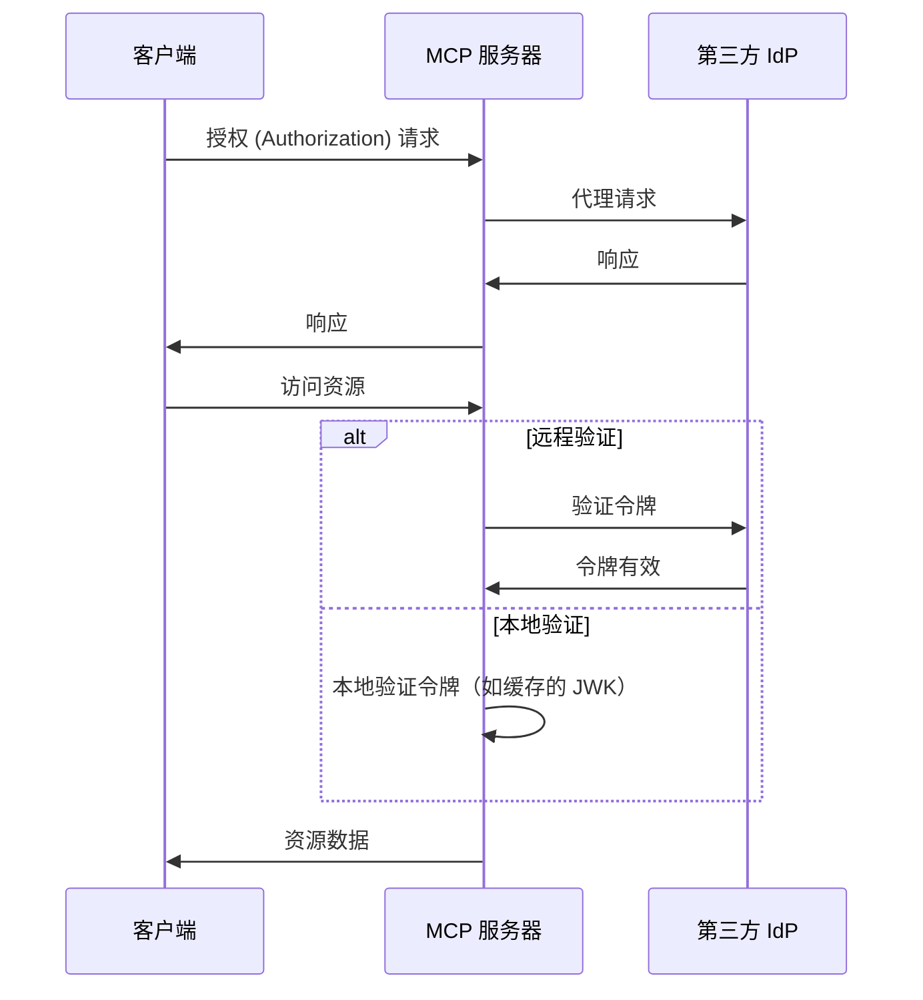
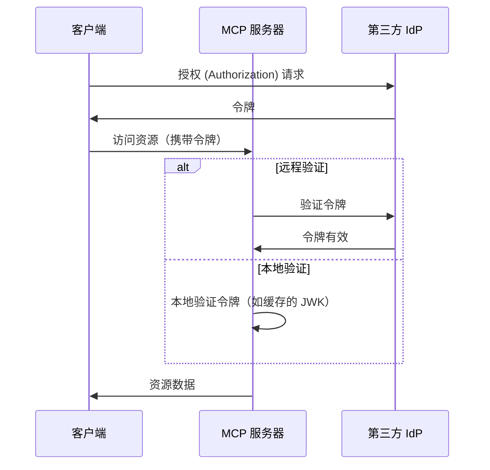

# 在 MCP Auth 与其他方案之间的选择

MCP 生态正在不断发展。随着 Model Context Protocol (MCP) 规范从“授权 (Authorization) 服务器”模式转向全新的“资源服务器 + 第三方身份提供商 (IdP)”模型，了解不同集成方案在现在和未来的适用性变得尤为重要。

本页将概述 mcp-auth 与其他主流方案的主要区别，帮助你为项目选择最佳方案。

## 背景：代理模式 vs. IdP 集成 \{#background-proxy-approach-vs-idp-integration}

大多数现有的 MCP 认证 (Authentication) 方案采用“代理模式”。在这种模式下，MCP 服务器将授权 (Authorization) 请求代理到第三方身份提供商 (IdP)，实际上充当了客户端与 IdP 之间的中间人。

**代理模式（[03-26 规范](https://modelcontextprotocol.io/specification/2025-03-26/basic/authorization)）**

虽然这种方式兼容当前（2025-03-26）MCP 规范，但本质上是一种变通方案。它假设 MCP 服务器也充当授权 (Authorization) 服务器，而这并不是最新规范草案的发展方向。

**MCP Auth / 未来规范（资源服务器 + 第三方 IdP）**

即将发布的 MCP 规范[将授权 (Authorization) 的责任转移给专用的第三方 IdP](https://github.com/modelcontextprotocol/modelcontextprotocol/issues/205)。在这种模式下，MCP 服务器仅作为资源服务器，所有授权 (Authorization) 端点都直接来自第三方 IdP。

## 为什么选择 MCP Auth？\{#why-choose-mcp-auth}

- 规范对齐：MCP Auth 直接遵循最新草案方向，是唯一同时兼容 03-26 规范和即将发布规范的方案。
- 不再需要变通：MCP Auth 不再让 MCP 服务器充当授权 (Authorization) 服务器代理，而是让第三方 IdP 负责所有授权 (Authorization)，这正是新规范的设计初衷。
- 不依赖特定厂商：MCP Auth 可与任何符合标准的 OAuth 2.0 / OIDC 提供商配合使用。
- 平滑过渡：MCP Auth 通过 OAuth 2.0 授权 (Authorization) 服务器元数据原样返回所有第三方端点，使集成现在简单，未来也能无缝适配变更。
- 开发者体验：提供教程、工具，以及即将上线的 [OAuth 2.0 受保护资源元数据](https://auth.wiki/protected-resource-metadata) 等功能，让 MCP 服务器开发者更轻松。

| 功能                                 | 代理方案              | MCP Auth |
| ------------------------------------ | --------------------- | -------- |
| 兼容 03-26 规范                      | ✅                    | ✅       |
| 兼容未来规范                         | ❌                    | ✅       |
| 直接支持第三方 IdP                   | ❌（仅变通支持）      | ✅       |
| 不依赖特定厂商                       | 有限[^1]              | 是       |
| 支持平滑过渡                         | ❌                    | ✅       |

如果你现在就需要支持第三方 IdP，并希望为即将到来的新规范做好准备，MCP Auth 是推荐方案。基于代理的方式可能很快会被弃用或需要大量重构。

[^1]: 某些代理方案可能会硬编码特定参数或端点，限制了灵活性。