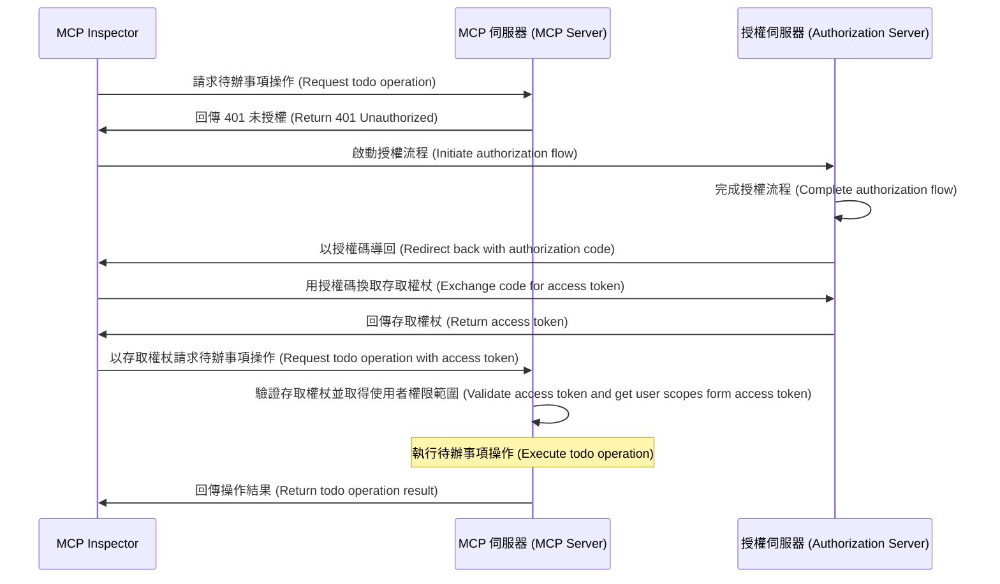
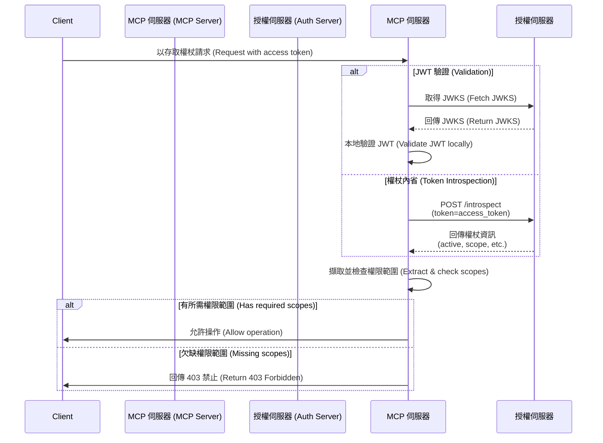

import TabItem from '@theme/TabItem';
import Tabs from '@theme/Tabs';

import SetupOauthOrOidc from './_setup-oauth-or-oidc.mdx';
import SetupOidc from './_setup-oidc.mdx';

# 教學：打造待辦事項管理器 (Tutorial: Build a todo manager)

在本教學中，我們將建立一個具備使用者驗證 (Authentication) 與授權 (Authorization) 的 todo manager MCP 伺服器。

完成本教學後，你將會：

- ✅ 基本瞭解如何在 MCP 伺服器中設定角色型存取控制 (RBAC, Role-based Access Control)
- ✅ 擁有一個可以管理個人待辦清單的 MCP 伺服器

:::note
在開始之前，如果你對 MCP 伺服器與 OAuth 2 不熟悉，強烈建議先閱讀 [Who am I 教學](./whoami)。
:::

## 概覽 (Overview) \{#overview}

本教學將涵蓋以下元件：

- **MCP 伺服器**：一個簡單的 MCP 伺服器，使用 MCP 官方 SDK 處理請求，並整合 Todo 服務來管理使用者的待辦事項。
- **MCP inspector**：MCP 伺服器的視覺化測試工具，同時作為 OAuth / OIDC 用戶端啟動授權流程並取得存取權杖 (Access token)。
- **授權伺服器 (Authorization server)**：管理使用者身分並簽發存取權杖的 OAuth 2.1 或 OpenID Connect 提供者。

以下是這些元件互動的高階流程圖：



## 瞭解你的授權伺服器 (Understand your authorization server) \{#understand-your-authorization-server}

### 具備權限範圍 (Scopes) 的存取權杖 (Access tokens) \{#access-tokens-with-scopes}

要在 MCP 伺服器實作 [角色型存取控制 (RBAC, Role-based Access Control)](https://auth.wiki/rbac)，你的授權伺服器需支援簽發帶有權限範圍 (Scopes) 的存取權杖 (Access tokens)。權限範圍代表使用者被授予的權限。

<Tabs groupId="provider">
<TabItem value="logto" label="Logto">

[Logto](https://logto.io) 透過其 API 資源 (API resources，符合 [RFC 8707: Resource Indicators for OAuth 2.0](https://datatracker.ietf.org/doc/html/rfc8707)) 與角色 (Roles) 功能支援 RBAC。設定步驟如下：

1. 登入 [Logto Console](https://cloud.logto.io)（或你的自架 Logto Console）

2. 建立 API 資源與權限範圍 (Scopes)：

   - 前往「API 資源」
   - 建立名為「Todo Manager」的新 API 資源
   - 新增以下權限範圍：
     - `create:todos`：「建立新待辦事項」
     - `read:todos`：「讀取所有待辦事項」
     - `delete:todos`：「刪除任一待辦事項」

3. 建立角色（建議，方便管理）：

   - 前往「角色」
   - 建立「Admin」角色並指派所有權限範圍（`create:todos`、`read:todos`、`delete:todos`）
   - 建立「User」角色並僅指派 `create:todos` 權限範圍

4. 指派權限：
   - 前往「使用者」
   - 選擇一位使用者
   - 你可以：
     - 在「角色」分頁指派角色（建議）
     - 或直接在「權限」分頁指派權限範圍

權限範圍將以空格分隔字串的形式包含在 JWT 存取權杖的 `scope` 宣告 (Claim) 中。

</TabItem>
<TabItem value="asgardeo" label="Asgardeo">
    [Asgardeo](https://wso2.com/asgardeo) 支援角色型存取控制 (RBAC) 與細緻授權，透過 API 資源與權限範圍。設定方式如下：

    1. 登入 [Asgardeo Console](https://console.asgardeo.io)

    2. 定義 API 資源與權限範圍：
        - 前往 **API Resources**
        - 點選 **"New API Resource"**
        - **Identifier** 設為 `https://todo.mcp-server.app`（或你想要的 URL）
        - **Display Name** 設為 `Todo Manager`
        - 新增以下權限範圍：
            - `create:todos` : "Create new todo items"
            - `read:todos` : "Read all todo items"
            - `delete:todos` : "Delete any todo item"
        - 建立資源

    3. 建立角色：
        - 使用 **User Management > Roles** 建立角色並直接指派權限範圍
        - 點選 **New Role**
        - 在 **Basic Details** 輸入角色名稱（如 `Admin` 或 `User`）
        - 角色 audience 設為 `Application`，並選擇 `MCP Inspector Application` 為 **Assigned Application**
        - 在 **Permission Selection** 選擇剛剛建立的 API 資源（如 `Todo Manager`）
        - 勾選要指派給此角色的權限範圍（如 `create:todos`、`read:todos`、`delete:todos`）
        - 點選 **Finish** 完成角色建立

    若已建立應用程式
        - 前往 **Application > MCP Inspector Application > Roles tab**
        - 選擇 **Application Role** 為 audience type，然後點選 **New Role**
        - 建立 `Admin` 角色並附加三個權限範圍
        - 建立 `User` 角色並僅附加 `create:todos` 權限範圍

    4. 指派角色給使用者：
        - 前往 **User Management > Roles**
        - 選擇你建立的角色（如 `Admin` 或 `User`），切換到 **Users** 分頁
        - 點選 **Assign User** 並選擇要指派此角色的使用者，儲存即可

    權限範圍將以空格分隔字串的形式包含在 JWT 存取權杖的 `scope` 宣告 (Claim) 中。

</TabItem>
<TabItem value="oauth-oidc" label="OAuth 2.0 / OIDC">

OAuth 2.0 / OIDC 提供者通常支援基於權限範圍的存取控制。實作 RBAC 時：

1. 在授權伺服器定義所需權限範圍
2. 設定用戶端於授權流程中請求這些權限範圍
3. 確保授權伺服器將授予的權限範圍包含在存取權杖中
4. 權限範圍通常會包含在 JWT 存取權杖的 `scope` 宣告 (Claim) 中

請查閱你的提供者文件以瞭解：

- 如何定義與管理權限範圍
- 權限範圍如何包含於存取權杖
- 是否有額外的 RBAC 功能如角色管理

</TabItem>
</Tabs>

### 權杖驗證與權限檢查 (Validating tokens and checking permissions) \{#validating-tokens-and-checking-permissions}

當 MCP 伺服器收到請求時，需：

1. 驗證存取權杖的簽章與有效期限
2. 從已驗證的權杖中擷取權限範圍
3. 檢查權杖是否具備執行該操作所需的權限範圍

例如，若使用者要建立新待辦事項，其存取權杖必須包含 `create:todos` 權限範圍。流程如下：



### 動態用戶端註冊 (Dynamic Client Registration) \{#dynamic-client-registration}

本教學不強制需要動態用戶端註冊，但若你想自動化 MCP 用戶端在授權伺服器的註冊流程，這會很有幫助。詳情請參閱 [是否需要 Dynamic Client Registration？](../../provider-list.mdx#is-dcr-required)。

## 瞭解 todo manager 的 RBAC (Understand RBAC in todo manager) \{#understand-rbac-in-todo-manager}

為了示範，我們會在 todo manager MCP 伺服器中實作一個簡單的角色型存取控制 (RBAC) 系統。這將讓你瞭解 RBAC 的基本原理，同時保持實作簡潔。

:::note
雖然本教學以 RBAC 為基礎進行權限範圍管理，但並非所有驗證 (Authentication) 提供者都透過角色實作權限範圍管理。有些提供者可能有自己獨特的存取控制與權限管理機制。
:::

### 工具與權限範圍 (Tools and scopes) \{#tools-and-scopes}

我們的 todo manager MCP 伺服器提供三個主要工具：

- `create-todo`：建立新待辦事項
- `get-todos`：列出所有待辦事項
- `delete-todo`：依 ID 刪除待辦事項

為了控管這些工具的存取，我們定義以下權限範圍：

- `create:todos`：允許建立新待辦事項
- `delete:todos`：允許刪除現有待辦事項
- `read:todos`：允許查詢並取得所有待辦事項清單

### 角色與權限 (Roles and permissions) \{#roles-and-permissions}

我們將定義兩種不同存取層級的角色：

| 角色 (Role) | create:todos | read:todos | delete:todos |
| ----------- | ------------ | ---------- | ------------ |
| Admin       | ✅           | ✅         | ✅           |
| User        | ✅           |            |              |

- **User**：一般使用者，可建立待辦事項，僅能檢視或刪除自己的待辦事項
- **Admin**：管理員，可建立、檢視、刪除所有待辦事項，不限擁有者

### 資源擁有權 (Resource ownership) \{#resource-ownership}

雖然上表顯示每個角色明確被指派的權限範圍，但還有一個重要的資源擁有權原則：

- **User** 沒有 `read:todos` 或 `delete:todos` 權限範圍，但仍可：
  - 讀取自己的待辦事項
  - 刪除自己的待辦事項
- **Admin** 擁有完整權限（`read:todos` 與 `delete:todos`），可：
  - 檢視系統中所有待辦事項
  - 刪除任何待辦事項，不論擁有者

這展現了 RBAC 系統中常見的模式：資源擁有權會隱含授權使用者操作自己資源的權限，而管理角色則獲得所有資源的明確權限。

:::tip 進一步瞭解
想深入瞭解 RBAC 概念與最佳實踐，請參閱 [Mastering RBAC: A Comprehensive Real-World Example](https://blog.logto.io/mastering-rbac)。
:::

## 在你的提供者中設定授權 (Configure authorization in your provider) \{#configure-authorization-in-your-provider}

要實作上述存取控制系統，你需要在授權伺服器中設定所需的權限範圍。以下是不同提供者的設定方式：

<Tabs groupId="provider">
<TabItem value="logto" label="Logto">

[Logto](https://logto.io) 透過 API 資源與角色功能支援 RBAC。設定步驟如下：

1. 登入 [Logto Console](https://cloud.logto.io)（或你的自架 Logto Console）

2. 建立 API 資源與權限範圍：

   - 前往「API 資源」
   - 建立名為「Todo Manager」的新 API 資源，並以 `https://todo.mcp-server.app`（僅示範用）作為標示符
   - 建立以下權限範圍：
     - `create:todos`：「建立新待辦事項」
     - `read:todos`：「讀取所有待辦事項」
     - `delete:todos`：「刪除任一待辦事項」

3. 建立角色（建議，方便管理）：

   - 前往「角色」
   - 建立「Admin」角色並指派所有權限範圍（`create:todos`、`read:todos`、`delete:todos`）
   - 建立「User」角色並僅指派 `create:todos` 權限範圍
   - 在「User」角色詳細頁切換到「一般」分頁，將「User」設為「預設角色」

4. 管理使用者角色與權限：
   - 新使用者：
     - 會自動取得「User」角色（因已設為預設角色）
   - 現有使用者：
     - 前往「使用者管理」
     - 選擇一位使用者
     - 在「角色」分頁指派角色

:::tip 程式化角色管理
你也可以使用 Logto 的 [Management API](https://docs.logto.io/integrate-logto/interact-with-management-api) 以程式方式管理使用者角色。這對自動化使用者管理或建立管理後台特別有用。
:::

請求存取權杖時，Logto 會根據使用者角色權限將權限範圍包含於權杖的 `scope` 宣告 (Claim) 中。

</TabItem>
<TabItem value="keycloak" label="Keycloak">

在 [Keycloak](https://www.keycloak.org) 中，你可以透過用戶端權限範圍 (Client scopes) 設定所需權限：

1. 建立用戶端權限範圍：

   - 在你的 realm，前往「Client scopes」
   - 建立三個新 client scopes：
     - `create:todos`
     - `read:todos`
     - `delete:todos`

2. 設定用戶端：

   - 前往你的用戶端設定
   - 在「Client scopes」分頁新增你建立的所有 scopes
   - 確認權杖映射器 (token mapper) 已設定為包含 scopes

3. 選用：使用角色方便管理
   - 若偏好角色型管理：
     - 建立不同存取層級的 realm roles
     - 將 scopes 映射到角色
     - 指派角色給使用者
   - 或可直接將 scopes 指派給使用者或透過 client-level permissions

Keycloak 會將授予的 scopes 包含於存取權杖的 `scope` 宣告 (Claim) 中。

</TabItem>
<TabItem value="asgardeo" label="Asgardeo">

[Asgardeo](https://wso2.com/asgardeo) 支援角色型存取控制 (RBAC) 與細緻授權，透過 API 資源與權限範圍。設定方式如下：

1. 登入 [Asgardeo Console](https://console.asgardeo.io)

2. 定義 API 資源與權限範圍：
    - 前往 **API Resources**
    - 點選 **"New API Resource"**
    - **Identifier** 設為 `https://todo.mcp-server.app`（或你想要的 URL）
    - **Display Name** 設為 `Todo Manager`
    - 新增以下權限範圍：
        - `create:todos` : "Create new todo items"
        - `read:todos` : "Read all todo items"
        - `delete:todos` : "Delete any todo item"
    - 建立資源

3. 建立角色：
    - 使用 **User Management > Roles** 建立角色並直接指派權限範圍
    - 點選 **New Role**
    - 在 **Basic Details** 輸入角色名稱（如 `Admin` 或 `User`）
    - 角色 audience 設為 `Application`，並選擇 `MCP Inspector Application` 為 **Assigned Application**
    - 在 **Permission Selection** 選擇剛剛建立的 API 資源（如 `Todo Manager`）
    - 勾選要指派給此角色的權限範圍（如 `create:todos`、`read:todos`、`delete:todos`）
    - 點選 **Finish** 完成角色建立

    若已建立應用程式
    - 前往 **Application > MCP Inspector Application > Roles tab**
    - 選擇 **Application Role** 為 audience type，然後點選 **New Role**
    - 建立 `Admin` 角色並附加三個權限範圍
    - 建立 `User` 角色並僅附加 `create:todos` 權限範圍

4. 指派角色給使用者：
    - 前往 **User Management > Roles**
    - 選擇你建立的角色（如 `Admin` 或 `User`），切換到 **Users** 分頁
    - 點選 **Assign User** 並選擇要指派此角色的使用者，儲存即可

權限範圍將以空格分隔字串的形式包含在 JWT 存取權杖的 `scope` 宣告 (Claim) 中。
設定好授權伺服器後，使用者將收到包含其授權權限範圍的存取權杖。MCP 伺服器會根據這些權限範圍判斷：

是否可建立新待辦事項（`create:todos`）
是否可檢視所有待辦事項（`read:todos`）或僅能檢視自己的
是否可刪除任一待辦事項（`delete:todos`）或僅能刪除自己的

更多 Asgardeo 設定細節請參閱：
- [API Resources Guide](https://wso2.com/asgardeo/docs/guides/authorization/api-authorization)
- [Role Management](https://wso2.com/asgardeo/docs/guides/users/manage-roles)
</TabItem>
<TabItem value="oauth-or-oidc" label="OAuth 2 / OIDC">

對於 OAuth 2.0 或 OpenID Connect 提供者，你需要設定代表不同權限的 scopes。具體步驟依提供者而異，但一般流程如下：

1. 定義權限範圍：

   - 設定授權伺服器支援：
     - `create:todos`
     - `read:todos`
     - `delete:todos`

2. 設定用戶端：

   - 註冊或更新用戶端以請求這些權限範圍
   - 確保權限範圍會包含於存取權杖

3. 指派權限：
   - 使用提供者介面將適當權限範圍授予使用者
   - 有些提供者支援角色型管理，有些則直接指派權限範圍
   - 請查閱提供者文件以獲得建議做法

:::tip
大多數提供者會將授予的權限範圍包含於存取權杖的 `scope` 宣告 (Claim) 中，格式通常為空格分隔的字串。
:::

</TabItem>
</Tabs>

設定好授權伺服器後，使用者將收到包含其授權權限範圍的存取權杖。MCP 伺服器會根據這些權限範圍判斷：

- 是否可建立新待辦事項（`create:todos`）
- 是否可檢視所有待辦事項（`read:todos`）或僅能檢視自己的
- 是否可刪除任一待辦事項（`delete:todos`）或僅能刪除自己的

## 設定 MCP 伺服器 (Set up the MCP server) \{#set-up-the-mcp-server}

我們將使用 [MCP 官方 SDK](https://github.com/modelcontextprotocol) 來建立 todo manager MCP 伺服器。

### 建立新專案 (Create a new project) \{#create-a-new-project}

<Tabs groupId="sdk">
<TabItem value="python" label="Python">

```bash
mkdir mcp-server
cd mcp-server
uv init # 或使用 `pipenv` 或 `poetry` 建立新虛擬環境
```

</TabItem>
<TabItem value="node" label="Node.js">

建立新的 Node.js 專案：

```bash
mkdir mcp-server
cd mcp-server
npm init -y # 或使用 `pnpm init`
npm pkg set type="module"
npm pkg set main="todo-manager.ts"
npm pkg set scripts.start="node --experimental-strip-types todo-manager.ts"
```

:::note
我們範例使用 TypeScript，因 Node.js v22.6.0+ 原生支援 `--experimental-strip-types` 執行 TypeScript。若你使用 JavaScript，程式碼大致相同，只需確保 Node.js 版本為 v22.6.0 或以上。詳情請見 Node.js 官方文件。
:::

</TabItem>
</Tabs>

### 安裝 MCP SDK 與相依套件 (Install the MCP SDK and dependencies) \{#install-the-mcp-sdk-and-dependencies}

<Tabs groupId="sdk">
<TabItem value="python" label="Python">

```bash
pip install "mcp[cli]" starlette uvicorn
```

或你偏好的其他套件管理工具，如 `uv` 或 `poetry`。

</TabItem>
<TabItem value="node" label="Node.js">

```bash
npm install @modelcontextprotocol/sdk express zod
```

或你偏好的其他套件管理工具，如 `pnpm` 或 `yarn`。

</TabItem>
</Tabs>

### 建立 MCP 伺服器 (Create the MCP server) \{#create-the-mcp-server}

首先，讓我們建立一個包含工具定義的基本 MCP 伺服器：

<Tabs groupId="sdk">
<TabItem value="python" label="Python">

建立名為 `todo-manager.py` 的檔案並加入以下程式碼：

```python
from typing import Any
from mcp.server.fastmcp import FastMCP
from starlette.applications import Starlette
from starlette.routing import Mount

mcp = FastMCP("Todo Manager")

@mcp.tool()
def create_todo(content: str) -> dict[str, Any]:
    """Create a new todo."""
    return {"error": "Not implemented"}

@mcp.tool()
def get_todos() -> dict[str, Any]:
    """List all todos."""
    return {"error": "Not implemented"}

@mcp.tool()
def delete_todo(id: str) -> dict[str, Any]:
    """Delete a todo by id."""
    return {"error": "Not implemented"}

app = Starlette(
    routes=[Mount('/', app=mcp.sse_app())]
)
```

啟動伺服器：

```bash
uvicorn todo_manager:app --host 0.0.0.0 --port 3001
```

</TabItem>
<TabItem value="node" label="Node.js">

:::note
由於目前 MCP inspector 尚未支援授權流程，我們將採用 SSE 方式設定 MCP 伺服器。待 MCP inspector 支援授權流程後，會更新此處程式碼。
:::

你也可以使用 `pnpm` 或 `yarn`。

建立名為 `todo-manager.ts` 的檔案並加入以下程式碼：

```ts
// todo-manager.ts

import { z } from 'zod';
import { McpServer } from '@modelcontextprotocol/sdk/server/mcp.js';
import { SSEServerTransport } from '@modelcontextprotocol/sdk/server/sse.js';
import express from 'express';

// 建立 MCP 伺服器
const server = new McpServer({
  name: 'Todo Manager',
  version: '0.0.0',
});

server.tool('create-todo', 'Create a new todo', { content: z.string() }, async ({ content }) => {
  return {
    content: [{ type: 'text', text: JSON.stringify({ error: 'Not implemented' }) }],
  };
});

server.tool('get-todos', 'List all todos', async () => {
  return {
    content: [{ type: 'text', text: JSON.stringify({ error: 'Not implemented' }) }],
  };
});

server.tool('delete-todo', 'Delete a todo by id', { id: z.string() }, async ({ id }) => {
  return {
    content: [{ type: 'text', text: JSON.stringify({ error: 'Not implemented' }) }],
  };
});

// 以下為 MCP SDK 文件範例樣板程式碼
const PORT = 3001;
const app = express();

const transports = {};

app.get('/sse', async (_req, res) => {
  const transport = new SSEServerTransport('/messages', res);
  transports[transport.sessionId] = transport;

  res.on('close', () => {
    delete transports[transport.sessionId];
  });

  await server.connect(transport);
});

app.post('/messages', async (req, res) => {
  const sessionId = String(req.query.sessionId);
  const transport = transports[sessionId];
  if (transport) {
    await transport.handlePostMessage(req, res, req.body);
  } else {
    res.status(400).send('No transport found for sessionId');
  }
});

app.listen(PORT);
```

啟動伺服器：

```bash
npm start
```

</TabItem>
</Tabs>

### 檢查 MCP 伺服器 (Inspect the MCP server) \{#inspect-the-mcp-server}

#### 下載並執行 MCP inspector \{#clone-and-run-mcp-inspector}

現在 MCP 伺服器已啟動，我們可以用 MCP inspector 檢查 `whoami` 工具是否可用。

由於目前實作的限制，我們 fork 了 [MCP inspector](https://github.com/mcp-auth/inspector) 以提升其驗證 (Authentication) 與授權 (Authorization) 彈性與擴展性，並已向原專案提交 pull request。

執行 MCP inspector：

```bash
git clone https://github.com/mcp-auth/inspector.git
cd inspector
npm install
npm run dev
```

然後在瀏覽器開啟 `http://localhost:6274/`（或終端機顯示的其他網址）以存取 MCP inspector。

#### 連接 MCP inspector 與 MCP 伺服器 \{#connect-mcp-inspector-to-the-mcp-server}

繼續前請檢查 MCP inspector 設定：

- **Transport Type**：設為 `SSE`
- **URL**：設為你的 MCP 伺服器網址，本例為 `http://localhost:3001/sse`

現在你可以點擊「Connect」按鈕，檢查 MCP inspector 是否能連線至 MCP 伺服器。若一切正常，MCP inspector 會顯示「Connected」狀態。

#### 檢查點：執行 todo manager 工具 \{#checkpoint-run-todo-manager-tools}

1. 在 MCP inspector 上方選單點選「Tools」分頁
2. 點選「List Tools」按鈕
3. 你應該會看到 `create-todo`、`get-todos`、`delete-todo` 工具列在頁面上，點擊可檢視工具細節
4. 右側會有「Run Tool」按鈕，點擊並輸入必要參數執行工具
5. 你會看到工具回傳結果為 `{"error": "Not implemented"}` 的 JSON


## 與授權伺服器整合 (Integrate with your authorization server) \{#integrate-with-your-authorization-server}

完成本節需考慮以下幾點：

<details>
<summary>**你的授權伺服器的簽發者 (Issuer) URL**</summary>

通常是授權伺服器的基礎網址，如 `https://auth.example.com`。有些提供者會有路徑如 `https://example.logto.app/oidc`，請查閱提供者文件。

</details>

<details>
<summary>**如何取得授權伺服器 metadata**</summary>

- 若授權伺服器符合 [OAuth 2.0 Authorization Server Metadata](https://datatracker.ietf.org/doc/html/rfc8414) 或 [OpenID Connect Discovery](https://openid.net/specs/openid-connect-discovery-1_0.html)，可用 MCP Auth 內建工具自動取得 metadata。
- 若不符合，需手動於 MCP 伺服器設定 metadata URL 或端點，請查閱提供者文件。

</details>

<details>
<summary>**如何將 MCP inspector 註冊為授權伺服器用戶端**</summary>

- 若授權伺服器支援 [Dynamic Client Registration](https://datatracker.ietf.org/doc/html/rfc7591)，MCP inspector 會自動註冊為用戶端，可略過此步驟。
- 若不支援，需手動將 MCP inspector 註冊為用戶端。

</details>

<details>
<summary>**瞭解權杖請求參數**</summary>

向不同授權伺服器請求存取權杖時，指定目標資源與權限的方式可能不同，主要有：

- **基於資源標示符 (Resource indicator based)**：

  - 使用 `resource` 參數指定目標 API（見 [RFC 8707: Resource Indicators for OAuth 2.0](https://datatracker.ietf.org/doc/html/rfc8707)）
  - 現代 OAuth 2.0 常見
  - 範例請求：
    ```json
    {
      "resource": "https://todo.mcp-server.app",
      "scope": "create:todos read:todos"
    }
    ```
  - 伺服器會簽發僅限於該資源的權杖

- **基於受眾 (Audience based)**：

  - 使用 `audience` 參數指定權杖接收者
  - 與資源標示符類似但語意不同
  - 範例請求：
    ```json
    {
      "audience": "todo-api",
      "scope": "create:todos read:todos"
    }
    ```

- **純權限範圍 (Pure scope based)**：
  - 僅依賴 scopes，不帶 resource/audience 參數
  - 傳統 OAuth 2.0 作法
  - 範例請求：
    ```json
    {
      "scope": "todo-api:create todo-api:read openid profile"
    }
    ```
  - 常用前綴命名空間權限
  - 簡單 OAuth 2.0 常見

:::tip 最佳實踐

- 查閱提供者文件以確認支援哪些參數
- 有些提供者同時支援多種方式
- 資源標示符可提升安全性（受眾限制）
- 建議有支援時優先使用資源標示符
  :::

</details>

雖然各提供者細節不同，以下步驟可協助你整合 MCP inspector 與 MCP 伺服器並進行提供者專屬設定。

### 註冊 MCP inspector 為用戶端 (Register MCP inspector as a client) \{#register-mcp-inspector-as-a-client}

<Tabs groupId="provider">
<TabItem value="logto" label="Logto">

將 todo manager 與 [Logto](https://logto.io) 整合非常簡單，因其為支援資源標示符與權限範圍的 OpenID Connect 提供者，可用 `https://todo.mcp-server.app` 作為資源標示符保護 todo API。

由於 Logto 尚未支援 Dynamic Client Registration，你需手動將 MCP inspector 註冊為 Logto 租戶的用戶端：

1. 開啟 MCP inspector，點擊「OAuth Configuration」按鈕，複製 **Redirect URL (auto-populated)**，如 `http://localhost:6274/oauth/callback`
2. 登入 [Logto Console](https://cloud.logto.io)（或你的自架 Logto Console）
3. 前往「應用程式」分頁，點擊「建立應用程式」，頁面底部點「Create app without framework」
4. 填寫應用程式資訊後點「建立應用程式」：
   - **選擇應用程式類型**：選「單頁應用程式 (Single-page application)」
   - **應用程式名稱**：如「MCP Inspector」
5. 在「設定 / Redirect URIs」區塊貼上剛剛複製的 **Redirect URL (auto-populated)**，然後點底部「儲存變更」
6. 頂部卡片會顯示「App ID」，請複製
7. 回到 MCP inspector，將「App ID」貼到「OAuth Configuration」的「Client ID」
8. 在「Auth Params」欄位輸入 `{"scope": "create:todos read:todos delete:todos", "resource": "https://todo.mcp-server.app"}`，確保 Logto 回傳的存取權杖包含存取 todo manager 所需的權限範圍

</TabItem>
<TabItem value="asgardeo" label="Asgardeo">

    雖然 Asgardeo 支援標準 API 的動態用戶端註冊，但該端點受保護且需具備相應權限的存取權杖。本教學將透過 Asgardeo Console 手動註冊用戶端。

    :::note
    若你尚未有 Asgardeo 帳號，可[免費註冊](https://asgardeo.io)。
    :::

    設定步驟如下：

    1. 登入 [Asgardeo Console](https://console.asgardeo.io) 並選擇你的組織

    2. 建立新應用程式：
    - 前往 **Applications** → **New Application**
    - 選擇 **Single-Page Application**
    - 輸入應用程式名稱如 `MCP Inspector`
    - 在 **Authorized Redirect URLs** 欄位貼上從 MCP Inspector 複製的 **Redirect URL**（如：`http://localhost:6274/oauth/callback`）
    - 點選 **Create**

    3. 設定協定參數：
    - 在 **Protocol** 分頁：
    - 複製自動產生的 **Client ID**
    - 在 **Access Token** 區塊切換為 `JWT` 作為 `Token Type`
    - 點選 **Update**

    4. 在 MCP Inspector 用戶端應用程式：
    - 開啟 **OAuth Configuration**
    - 貼上複製的 **Client ID**
    - 在 **Auth Params** 欄位輸入以下內容以請求必要權限範圍：

    ```json
    { "scope": "openid profile email" }
    ```
</TabItem>
<TabItem value="oauth-oidc" label="OAuth 2.0 / OIDC">

:::note
這是通用 OAuth 2.0 / OpenID Connect 提供者整合指引。兩者步驟類似，因 OIDC 建立於 OAuth 2.0 之上。請查閱你的提供者文件以獲得細節。
:::

若你的提供者支援 Dynamic Client Registration，可直接跳至第 8 步設定 MCP inspector；否則需手動註冊 MCP inspector 為用戶端：

1. 開啟 MCP inspector，點擊「OAuth Configuration」按鈕，複製 **Redirect URL (auto-populated)**，如 `http://localhost:6274/oauth/callback`

2. 登入你的提供者管理後台

3. 前往「應用程式」或「用戶端」區塊，建立新應用程式或用戶端

4. 若需選擇用戶端類型，請選「單頁應用程式」或「公開用戶端」

5. 建立應用程式後，需設定 redirect URI，貼上剛剛複製的 **Redirect URL (auto-populated)**

6. 找到新應用程式的「Client ID」或「Application ID」並複製

7. 回到 MCP inspector，將「Client ID」貼到「OAuth Configuration」的「Client ID」

8. 在「Auth Params」欄位輸入以下內容以請求 todo 操作所需權限範圍：

```json
{ "scope": "create:todos read:todos delete:todos" }
```

</TabItem>
</Tabs>

### 設定 MCP Auth (Set up MCP auth) \{#set-up-mcp-auth}

在 MCP 伺服器專案中，需安裝 MCP Auth SDK 並設定授權伺服器 metadata。

<Tabs groupId="sdk">
<TabItem value="python" label="Python">

首先安裝 `mcpauth` 套件：

```bash
pip install mcpauth
```

或你偏好的其他套件管理工具，如 `uv` 或 `poetry`。

</TabItem>
<TabItem value="node" label="Node.js">

首先安裝 `mcp-auth` 套件：

```bash
npm install mcp-auth
```

</TabItem>
</Tabs>

MCP Auth 需要授權伺服器 metadata 以初始化。依據你的提供者：

<Tabs groupId="provider">

<TabItem value="logto" label="Logto">

簽發者 (Issuer) URL 可在 Logto Console 的應用程式詳細頁「Endpoints & Credentials / Issuer endpoint」區塊找到，格式如 `https://my-project.logto.app/oidc`。

<SetupOidc />

</TabItem>

<TabItem value="asgardeo" label="Asgardeo">

    你可在 Asgardeo Console 查詢 issuer URL。前往已建立的應用程式，開啟 **Info** 分頁，**Issuer** 欄位即為該值，格式如：
    `https://api.asgardeo.io/t/<your-organization-name>/oauth2/token`

    <SetupOidc />

</TabItem>

<TabItem value="oauth-oidc" label="OAuth 2.0 / OIDC">

對於 OAuth 2.0 提供者，你需要：

1. 查閱提供者文件取得授權伺服器 URL（常稱 issuer URL 或 base URL）
2. 有些提供者會在 `https://{your-domain}/.well-known/oauth-authorization-server` 提供
3. 於管理後台 OAuth/API 設定區查找

<SetupOauthOrOidc />

</TabItem>

</Tabs>

<Tabs groupId="sdk">

<TabItem value="python" label="Python">

更新 `todo-manager.py` 加入 MCP Auth 設定：

```python
from mcpauth import MCPAuth
from mcpauth.config import AuthServerType
from mcpauth.utils import fetch_server_config

auth_issuer = '<issuer-endpoint>'  # 請替換為你的 issuer endpoint
auth_server_config = fetch_server_config(auth_issuer, type=AuthServerType.OIDC)
mcp_auth = MCPAuth(server=auth_server_config)
```

</TabItem>
<TabItem value="node" label="Node.js">

更新 `todo-manager.ts` 加入 MCP Auth 設定：

```ts
// todo-manager.ts

import { MCPAuth, fetchServerConfig } from 'mcp-auth';

const authIssuer = '<issuer-endpoint>'; // 請替換為你的 issuer endpoint
const mcpAuth = new MCPAuth({
  server: await fetchServerConfig(authIssuer, { type: 'oidc' }),
});
```

</TabItem>
</Tabs>

### 更新 MCP 伺服器 (Update MCP server) \{#update-mcp-server}

快完成了！現在要更新 MCP 伺服器，套用 MCP Auth 路由與中介軟體，並根據使用者權限範圍實作 todo manager 工具的權限控管。

<Tabs groupId="sdk">
<TabItem value="python" label="Python">

```python
@mcp.tool()
def create_todo(content: str) -> dict[str, Any]:
    """Create a new todo."""
    return (
        mcp_auth.auth_info.scopes
        if mcp_auth.auth_info # 由 Bearer auth middleware 填入
        else {"error": "Not authenticated"}
    )

# ...

bearer_auth = Middleware(mcp_auth.bearer_auth_middleware("jwt"))
app = Starlette(
    routes=[
        # 加入 metadata 路由 (`/.well-known/oauth-authorization-server`)
        mcp_auth.metadata_route(),
        # 以 Bearer auth middleware 保護 MCP 伺服器
        Mount('/', app=mcp.sse_app(), middleware=[bearer_auth]),
    ],
)
```

</TabItem>
<TabItem value="node" label="Node.js">

```js
server.tool(
  'create-todo',
  'Create a new todo',
  { content: z.string() },
  async ({ content, authInfo }) => {
    return {
      content: [
        { type: 'text', text: JSON.stringify(authInfo?.scopes ?? { error: 'Not authenticated' }) },
      ],
    };
  }
);

// ...

app.use(mcpAuth.delegatedRouter());
app.use(mcpAuth.bearerAuth('jwt'));
```

</TabItem>
</Tabs>

接下來實作具體工具。

首先建立一個簡單的 todo 服務，提供記憶體內的 CRUD 操作。

<Tabs groupId="sdk">
<TabItem value="python" label="Python">
```python
# service.py

"""
簡單 Todo 服務，僅供示範。
以記憶體清單儲存 todos。
"""

from datetime import datetime
from typing import List, Optional, Dict, Any
import random
import string

class Todo:
"""代表一個 todo 項目。"""

    def __init__(self, id: str, content: str, owner_id: str, created_at: str):
        self.id = id
        self.content = content
        self.owner_id = owner_id
        self.created_at = created_at

    def to_dict(self) -> Dict[str, Any]:
        """轉換為 dict 以利 JSON 序列化。"""
        return {
            "id": self.id,
            "content": self.content,
            "ownerId": self.owner_id,
            "createdAt": self.created_at
        }

class TodoService:
"""簡單 Todo 服務，僅供示範。"""

    def __init__(self):
        self._todos: List[Todo] = []

    def get_all_todos(self, owner_id: Optional[str] = None) -> List[Dict[str, Any]]:
        """
        取得所有 todos，可選擇依 owner_id 過濾。

        Args:
            owner_id: 若有，僅回傳此使用者的 todos

        Returns:
            todo 字典清單
        """
        if owner_id:
            filtered_todos = [todo for todo in self._todos if todo.owner_id == owner_id]
            return [todo.to_dict() for todo in filtered_todos]
        return [todo.to_dict() for todo in self._todos]

    def get_todo_by_id(self, todo_id: str) -> Optional[Todo]:
        """
        依 ID 取得 todo。

        Args:
            todo_id: 欲取得的 todo ID

        Returns:
            找到則回傳 Todo 物件，否則 None
        """
        for todo in self._todos:
            if todo.id == todo_id:
                return todo
        return None

    def create_todo(self, content: str, owner_id: str) -> Dict[str, Any]:
        """
        建立新 todo。

        Args:
            content: todo 內容
            owner_id: 擁有者 ID

        Returns:
            建立的 todo 字典
        """
        todo = Todo(
            id=self._generate_id(),
            content=content,
            owner_id=owner_id,
            created_at=datetime.now().isoformat()
        )
        self._todos.append(todo)
        return todo.to_dict()

    def delete_todo(self, todo_id: str) -> Optional[Dict[str, Any]]:
        """
        依 ID 刪除 todo。

        Args:
            todo_id: 欲刪除的 todo ID

        Returns:
            若找到則回傳被刪除的 todo 字典，否則 None
        """
        for i, todo in enumerate(self._todos):
            if todo.id == todo_id:
                deleted_todo = self._todos.pop(i)
                return deleted_todo.to_dict()
        return None

    def _generate_id(self) -> str:
        """產生隨機 todo ID。"""
        return ''.join(random.choices(string.ascii_lowercase + string.digits, k=8))

````


</TabItem>
<TabItem value="node" label="Node.js">

```ts
// todo-service.ts

type Todo = {
  id: string;
  content: string;
  ownerId: string;
  createdAt: string;
};

/**
 * 簡單 Todo 服務，僅供示範。
 * 以記憶體陣列儲存 todos
 */
export class TodoService {
  private readonly todos: Todo[] = [];

  getAllTodos(ownerId?: string): Todo[] {
    if (ownerId) {
      return this.todos.filter((todo) => todo.ownerId === ownerId);
    }
    return this.todos;
  }

  getTodoById(id: string): Todo | undefined {
    return this.todos.find((todo) => todo.id === id);
  }

  createTodo({ content, ownerId }: { content: string; ownerId: string }): Todo {
    const todo: Todo = {
      id: this.genId(),
      content,
      ownerId,
      createdAt: new Date().toISOString(),
    };

    // eslint-disable-next-line @silverhand/fp/no-mutating-methods
    this.todos.push(todo);
    return todo;
  }

  deleteTodo(id: string): Todo | undefined {
    const index = this.todos.findIndex((todo) => todo.id === id);

    if (index === -1) {
      return undefined;
    }

    // eslint-disable-next-line @silverhand/fp/no-mutating-methods
    const [deleted] = this.todos.splice(index, 1);
    return deleted;
  }

  private genId(): string {
    return Math.random().toString(36).slice(2, 10);
  }
}
````

</TabItem>
</Tabs>

然後在工具層根據使用者權限範圍決定是否允許操作：

<Tabs groupId="sdk">
<TabItem value="python" label="Python">

```python
# todo-manager.py

from typing import Any, Optional
from mcpauth.errors import MCPAuthBearerAuthError

def assert_user_id(auth_info: Optional[dict]) -> str:
    """從 auth info 擷取並驗證使用者 ID。"""
    subject = auth_info.get('subject') if auth_info else None
    if not subject:
        raise ValueError('Invalid auth info')
    return subject

def has_required_scopes(user_scopes: list[str], required_scopes: list[str]) -> bool:
    """檢查使用者是否具備所有必要權限範圍。"""
    return all(scope in user_scopes for scope in required_scopes)

# 建立 TodoService 實例
todo_service = TodoService()

@mcp.tool()
def create_todo(content: str) -> dict[str, Any]:
    """建立新 todo。

    只有具備 'create:todos' 權限範圍的使用者可建立 todo。
    """
    # 取得驗證資訊
    auth_info = mcp_auth.auth_info

    # 驗證使用者 ID
    try:
        user_id = assert_user_id(auth_info)
    except ValueError as e:
        return {"error": str(e)}

    # 檢查是否有必要權限
    if not has_required_scopes(auth_info.scopes if auth_info else [], ['create:todos']):
        raise MCPAuthBearerAuthError('missing_required_scopes')

    # 建立新 todo
    created_todo = todo_service.create_todo(content=content, owner_id=user_id)

    # 回傳建立的 todo
    return created_todo.__dict__

# ...
```

你可以參考我們的 [範例程式碼](https://github.com/mcp-auth/python/tree/master/samples/server) 取得完整實作。

</TabItem>
<TabItem value="node" label="Node.js">

```ts
// todo-manager.ts

// ... 其他 import
import assert from 'node:assert';
import { type AuthInfo } from '@modelcontextprotocol/sdk/server/auth/types.js';
import { TodoService } from './todo-service.js';

const todoService = new TodoService();

const assertUserId = (authInfo?: AuthInfo) => {
  const { subject } = authInfo ?? {};
  assert(subject, 'Invalid auth info');
  return subject;
};

/**
 * 檢查使用者是否具備操作所需的所有權限範圍
 */
const hasRequiredScopes = (userScopes: string[], requiredScopes: string[]): boolean => {
  return requiredScopes.every((scope) => userScopes.includes(scope));
};

server.tool(
  'create-todo',
  'Create a new todo',
  { content: z.string() },
  ({ content }: { content: string }, { authInfo }) => {
    const userId = assertUserId(authInfo);

    /**
     * 只有具備 'create:todos' 權限範圍的使用者可建立 todo
     */
    if (!hasRequiredScopes(authInfo?.scopes ?? [], ['create:todos'])) {
      throw new MCPAuthBearerAuthError('missing_required_scopes');
    }

    const createdTodo = todoService.createTodo({ content, ownerId: userId });

    return {
      content: [{ type: 'text', text: JSON.stringify(createdTodo) }],
    };
  }
);

// ...
```

你可以參考我們的 [範例程式碼](https://github.com/mcp-auth/js/tree/master/packages/sample-servers/src/todo-manager) 取得完整實作。

</TabItem>
</Tabs>

## 檢查點：執行 `todo-manager` 工具 \{#checkpoint-run-the-todo-manager-tools}

重啟 MCP 伺服器並在瀏覽器開啟 MCP inspector。點擊「Connect」後，你會被導向授權伺服器的登入頁面。

登入並返回 MCP inspector 後，重複前述步驟執行 todo manager 工具。這次你將以已驗證的使用者身分使用這些工具，工具行為將依你被指派的角色與權限而異：

- 若以 **User**（僅有 `create:todos` 權限範圍）登入：

  - 可用 `create-todo` 工具建立新待辦事項
  - 只能檢視與刪除自己的待辦事項
  - 無法看到或刪除其他使用者的待辦事項

- 若以 **Admin**（擁有所有權限範圍：`create:todos`、`read:todos`、`delete:todos`）登入：
  - 可建立新待辦事項
  - 可用 `get-todos` 工具檢視系統所有待辦事項
  - 可用 `delete-todo` 工具刪除任何待辦事項，不論擁有者

你可以這樣測試不同權限層級：

1. 登出目前會話（點 MCP inspector 的「Disconnect」按鈕）
2. 以不同角色／權限的帳號登入
3. 再次嘗試相同工具，觀察行為如何隨使用者權限變化

這展示了角色型存取控制 (RBAC) 的實際運作，不同使用者對系統功能有不同存取層級。


<Tabs groupId="sdk">
<TabItem value="python" label="Python">

:::info
完整 MCP 伺服器（OIDC 版本）程式碼請參考 [MCP Auth Python SDK repository](https://github.com/mcp-auth/python/blob/master/samples/server/todo-manager/server.py)。
:::

</TabItem>
<TabItem value="node" label="Node.js">

:::info
完整 MCP 伺服器（OIDC 版本）程式碼請參考 [MCP Auth Node.js SDK repository](https://github.com/mcp-auth/js/blob/master/packages/sample-servers/src)。
:::

</TabItem>
</Tabs>

## 結語 (Closing notes) \{#closing-notes}

🎊 恭喜你！你已成功完成本教學。讓我們回顧一下：

- 建立具備 todo 管理工具（`create-todo`、`get-todos`、`delete-todo`）的基本 MCP 伺服器
- 實作不同權限層級的角色型存取控制 (RBAC)
- 透過 MCP Auth 將 MCP 伺服器與授權伺服器整合
- 設定 MCP Inspector 以驗證使用者並用帶有權限範圍的存取權杖呼叫工具

歡迎參閱其他教學與文件，充分發揮 MCP Auth 的強大功能。
