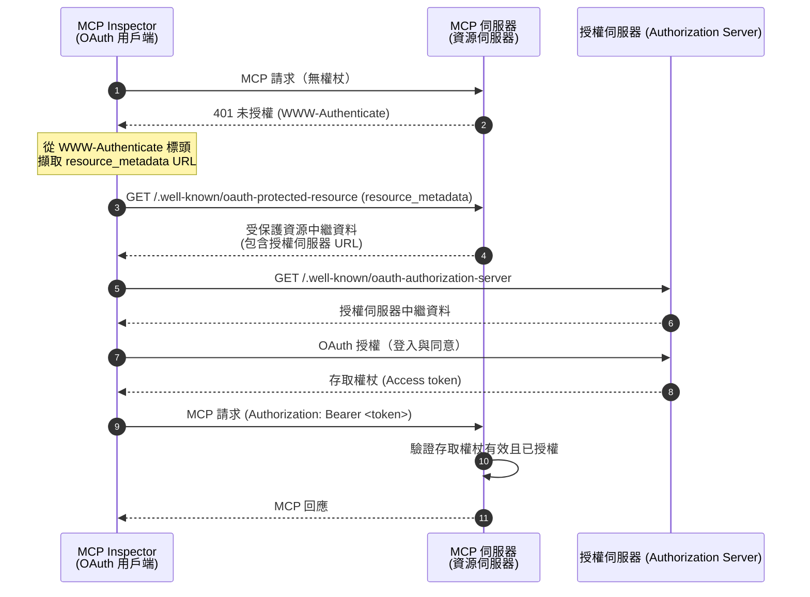
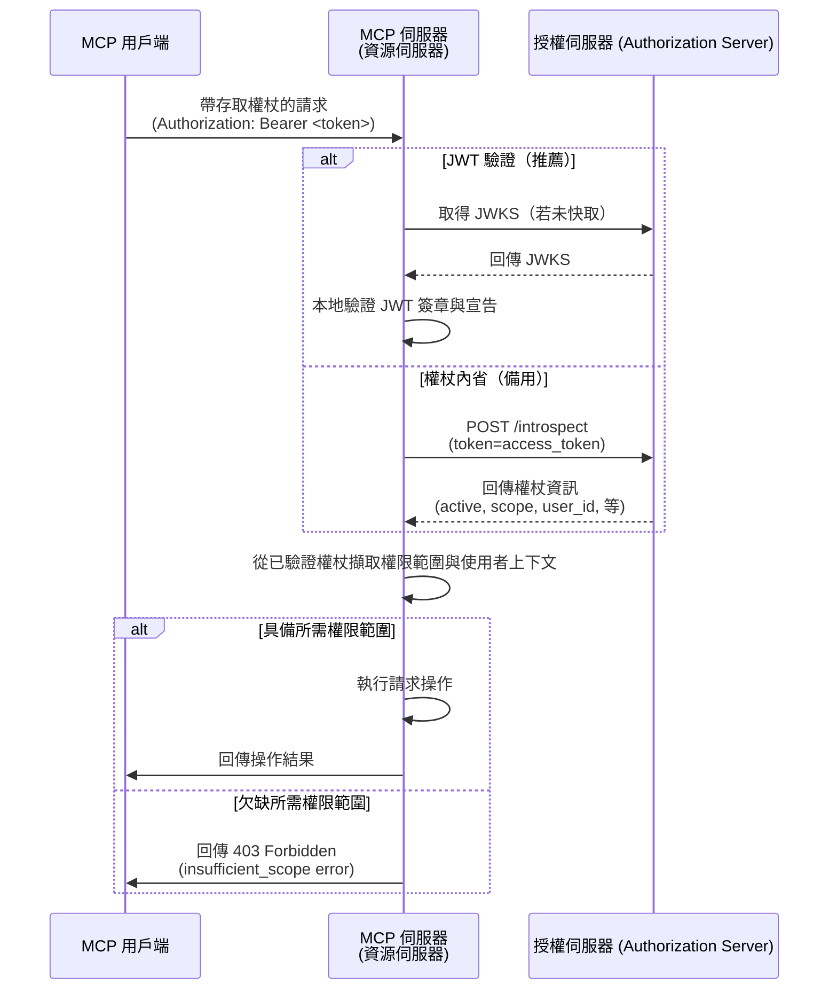

import TabItem from '@theme/TabItem';
import Tabs from '@theme/Tabs';


# 教學：打造一個待辦事項管理器

在本教學中，我們將建立一個具備使用者驗證 (Authentication) 與授權 (Authorization) 的 todo manager MCP 伺服器。根據最新的 MCP 規範，我們的 MCP 伺服器將作為 OAuth 2.0 **資源伺服器 (Resource Server)**，負責驗證存取權杖 (Access token) 並強制執行基於權限範圍 (Scope) 的權限。

完成本教學後，你將擁有：

- ✅ 基本瞭解如何在 MCP 伺服器中設定角色型存取控制 (RBAC, Role-based access control)
- ✅ 一個作為資源伺服器 (Resource Server) 的 MCP 伺服器，能消耗由授權伺服器 (Authorization Server) 發出的存取權杖 (Access token)
- ✅ 一個可運作的基於權限範圍 (Scope) 的權限控管實作，適用於 todo 操作

## 概覽 \{#overview}

本教學將包含以下元件：

- **MCP 用戶端 (MCP Inspector)**：一個用於測試 MCP 伺服器的視覺化工具，作為 OAuth 2.0 / OIDC 用戶端。它會啟動授權流程，並向 MCP 伺服器發送帶有存取權杖 (Access token) 的請求。
- **授權伺服器 (Authorization Server)**：一個 OAuth 2.1 或 OpenID Connect 簽發者 (Issuer)，負責管理使用者身分、驗證使用者，並向授權用戶端發出帶有適當權限範圍 (Scope) 的存取權杖 (Access token)。
- **MCP 伺服器 (Resource Server)**：根據最新 MCP 規範，MCP 伺服器在 OAuth 2.0 架構中作為資源伺服器 (Resource Server)。它驗證授權伺服器發出的存取權杖 (Access token)，並根據權限範圍 (Scope) 強制執行 todo 操作的權限。

此架構遵循標準 OAuth 2.0 流程：

- **MCP Inspector** 代表使用者請求受保護資源
- **授權伺服器 (Authorization Server)** 驗證使用者並發出存取權杖 (Access token)
- **MCP 伺服器 (Resource Server)** 驗證權杖並根據授權權限提供受保護資源

以下是這些元件互動的高階流程圖：



## 瞭解你的授權伺服器 \{#understand-your-authorization-server}

### 具備權限範圍 (Scope) 的存取權杖 (Access tokens) \{#access-tokens-with-scopes}

若要在 MCP 伺服器中實作 [角色型存取控制 (RBAC)](https://auth.wiki/rbac)，你的授權伺服器需支援發出帶有權限範圍 (Scope) 的存取權杖 (Access token)。權限範圍 (Scope) 代表使用者被授予的權限。

<Tabs groupId="provider">
<TabItem value="logto" label="Logto">

[Logto](https://logto.io) 透過其 API 資源 (API resources)（符合 [RFC 8707: OAuth 2.0 資源標示符 (Resource Indicators)](https://datatracker.ietf.org/doc/html/rfc8707)）與角色 (Roles) 功能提供 RBAC 支援。設定方式如下：

1. 登入 [Logto Console](https://cloud.logto.io)（或你的自架 Logto Console）

2. 建立 API 資源與權限範圍 (Scope)：

   - 前往「API 資源」
   - 建立一個名為「Todo Manager」的新 API 資源
   - 新增以下權限範圍 (Scope)：
     - `create:todos`：「建立新的待辦事項」
     - `read:todos`：「讀取所有待辦事項」
     - `delete:todos`：「刪除任一待辦事項」

3. 建立角色（建議以便管理）：

   - 前往「角色」
   - 建立「Admin」角色並指派所有權限範圍（`create:todos`、`read:todos`、`delete:todos`）
   - 建立「User」角色並僅指派 `create:todos` 權限範圍

4. 指派權限：
   - 前往「使用者」
   - 選擇一位使用者
   - 你可以：
     - 在「角色」分頁指派角色（建議）
     - 或直接在「權限」分頁指派權限範圍

權限範圍 (Scope) 會以空格分隔字串的形式包含在 JWT 存取權杖 (Access token) 的 `scope` 宣告 (Claim) 中。

</TabItem>
<TabItem value="oauth-oidc" label="OAuth 2.0 / OIDC">

OAuth 2.0 / OIDC 簽發者 (Issuer) 通常支援基於權限範圍 (Scope) 的存取控制。實作 RBAC 時：

1. 在授權伺服器中定義所需的權限範圍 (Scope)
2. 設定用戶端在授權流程中請求這些權限範圍
3. 確保授權伺服器在存取權杖 (Access token) 中包含授予的權限範圍
4. 權限範圍通常會包含在 JWT 存取權杖的 `scope` 宣告 (Claim) 中

請查閱你的簽發者 (Issuer) 文件以瞭解：

- 如何定義與管理權限範圍 (Scope)
- 權限範圍如何包含在存取權杖 (Access token) 中
- 是否有額外的 RBAC 功能如角色管理

</TabItem>
</Tabs>

### 權杖驗證與權限檢查 \{#validating-tokens-and-checking-permissions}

根據最新 MCP 規範，MCP 伺服器在 OAuth 2.0 架構中作為 **資源伺服器 (Resource Server)**。作為資源伺服器，MCP 伺服器有以下職責：

1. **權杖驗證**：驗證從 MCP 用戶端收到的存取權杖 (Access token) 的真實性與完整性
2. **權限範圍強制執行**：從存取權杖中擷取並驗證權限範圍 (Scope)，以決定用戶端被授權執行哪些操作
3. **資源保護**：僅在用戶端提供有效且具備足夠權限的權杖時，才提供受保護資源（執行工具）

當 MCP 伺服器收到請求時，會執行以下驗證流程：

1. 從 `Authorization` 標頭擷取存取權杖（Bearer 權杖格式）
2. 驗證存取權杖的簽章與有效期限
3. 從已驗證的權杖中擷取權限範圍與使用者資訊
4. 檢查權杖是否具備執行請求操作所需的權限範圍

例如，若使用者要建立新的待辦事項，其存取權杖必須包含 `create:todos` 權限範圍。以下為資源伺服器驗證流程：



### 動態用戶端註冊 (Dynamic Client Registration) \{#dynamic-client-registration}

本教學不強制要求動態用戶端註冊，但若你想自動化 MCP 用戶端在授權伺服器的註冊流程，可參考 [是否需要動態用戶端註冊？](/provider-list#is-dcr-required) 以取得更多資訊。

## 瞭解 todo manager 中的 RBAC \{#understand-rbac-in-todo-manager}

為了示範，我們會在 todo manager MCP 伺服器中實作一個簡單的角色型存取控制 (RBAC) 系統。這將讓你瞭解 RBAC 的基本原理，同時保持實作簡潔。

:::note
雖然本教學以 RBAC 為基礎進行權限範圍管理，但需注意並非所有驗證 (Authentication) 簽發者 (Issuer) 都透過角色來管理權限範圍。有些簽發者可能有自己獨特的存取控制與權限管理機制。
:::

### 工具與權限範圍 (Scope) \{#tools-and-scopes}

我們的 todo manager MCP 伺服器提供三個主要工具：

- `create-todo`：建立新的待辦事項
- `get-todos`：列出所有待辦事項
- `delete-todo`：根據 ID 刪除待辦事項

為了控管這些工具的存取，我們定義以下權限範圍 (Scope)：

- `create:todos`：允許建立新的待辦事項
- `delete:todos`：允許刪除現有待辦事項
- `read:todos`：允許查詢並取得所有待辦事項列表

### 角色與權限 \{#roles-and-permissions}

我們將定義兩個不同存取層級的角色：

| 角色  | create:todos | read:todos | delete:todos |
| ----- | ------------ | ---------- | ------------ |
| Admin | ✅           | ✅         | ✅           |
| User  | ✅           |            |              |

- **User**：一般使用者，可建立待辦事項，僅能檢視或刪除自己的待辦事項
- **Admin**：管理員，可建立、檢視並刪除所有待辦事項，不論擁有者為誰

### 資源擁有權 \{#resource-ownership}

雖然上表明確列出每個角色被指派的權限範圍 (Scope)，但還有一個重要的資源擁有權原則：

- **User** 沒有 `read:todos` 或 `delete:todos` 權限範圍，但仍可：
  - 檢視自己的待辦事項
  - 刪除自己的待辦事項
- **Admin** 具備完整權限（`read:todos` 與 `delete:todos`），可：
  - 檢視系統中所有待辦事項
  - 刪除任何待辦事項，不論擁有者為誰

這展現了 RBAC 系統中常見的模式：資源擁有權會隱含授予使用者對自己資源的權限，而管理角色則獲得對所有資源的明確權限。

:::tip 深入學習
想更深入瞭解 RBAC 概念與最佳實踐，請參考 [精通 RBAC：完整實戰範例](https://blog.logto.io/mastering-rbac)。
:::

## 在你的簽發者 (Issuer) 中設定授權 (Authorization) \{#configure-authorization-in-your-provider}

要實作上述存取控制系統，你需要在授權伺服器設定所需的權限範圍 (Scope)。以下是不同簽發者的設定方式：

<Tabs groupId="provider">
<TabItem value="logto" label="Logto">

[Logto](https://logto.io) 透過 API 資源與角色功能提供 RBAC 支援。設定方式如下：

1. 登入 [Logto Console](https://cloud.logto.io)（或你的自架 Logto Console）

2. 建立 API 資源與權限範圍 (Scope)：

   - 前往「API 資源」
   - 建立一個名為「Todo Manager」的新 API 資源，並將 `http://localhost:3001` 設為資源標示符 (Resource indicator)。
     - **重要**：資源標示符必須與你的 MCP 伺服器 URL 相符。本教學使用 `http://localhost:3001`，因 MCP 伺服器運行於 3001 埠。正式環境請使用實際 MCP 伺服器 URL（如 `https://your-mcp-server.example.com`）。
   - 建立以下權限範圍 (Scope)：
     - `create:todos`：「建立新的待辦事項」
     - `read:todos`：「讀取所有待辦事項」
     - `delete:todos`：「刪除任一待辦事項」

3. 建立角色（建議以便管理）：

   - 前往「角色」
   - 建立「Admin」角色並指派所有權限範圍（`create:todos`、`read:todos`、`delete:todos`）
   - 建立「User」角色並僅指派 `create:todos` 權限範圍
   - 在「User」角色詳細頁切換至「一般」分頁，將「User」設為「預設角色」

4. 管理使用者角色與權限：
   - 新使用者：
     - 由於已設為預設角色，將自動獲得「User」角色
   - 現有使用者：
     - 前往「使用者管理」
     - 選擇一位使用者
     - 在「角色」分頁指派角色

:::tip 程式化角色管理
你也可以使用 Logto 的 [Management API](https://docs.logto.io/integrate-logto/interact-with-management-api) 以程式方式管理使用者角色。這對自動化使用者管理或建立管理後台特別有用。
:::

請求存取權杖時，Logto 會根據使用者角色權限將權限範圍 (Scope) 加入權杖的 `scope` 宣告 (Claim)。

</TabItem>
<TabItem value="oauth-or-oidc" label="OAuth 2 / OIDC">

對於 OAuth 2.0 或 OpenID Connect 簽發者 (Issuer)，你需要設定代表不同權限的權限範圍 (Scope)。具體步驟依簽發者而異，但一般流程如下：

1. 定義權限範圍 (Scope)：

   - 設定授權伺服器支援：
     - `create:todos`
     - `read:todos`
     - `delete:todos`

2. 設定用戶端：

   - 註冊或更新用戶端以請求這些權限範圍
   - 確保權限範圍會包含在存取權杖中

3. 指派權限：
   - 使用簽發者介面將適當權限範圍指派給使用者
   - 有些簽發者支援基於角色的管理，有些則直接指派權限範圍
   - 請查閱簽發者文件以獲得建議做法

:::tip
大多數簽發者會將授予的權限範圍包含在存取權杖的 `scope` 宣告 (Claim) 中。格式通常為以空格分隔的權限範圍字串。
:::

</TabItem>
</Tabs>

設定好授權伺服器後，使用者將收到包含其授權權限範圍的存取權杖。MCP 伺服器會根據這些權限範圍判斷：

- 使用者是否能建立新的待辦事項（`create:todos`）
- 使用者是否能檢視所有待辦事項（`read:todos`）或僅能檢視自己的
- 使用者是否能刪除任一待辦事項（`delete:todos`）或僅能刪除自己的

## 建立 MCP 伺服器 \{#set-up-the-mcp-server}

我們將使用 [MCP 官方 SDK](https://github.com/modelcontextprotocol) 來建立 todo manager MCP 伺服器。

### 建立新專案 \{#create-a-new-project}

<Tabs groupId="sdk">
<TabItem value="python" label="Python">

建立新的 Python 專案：

```bash
mkdir mcp-todo-server
cd mcp-todo-server

# 初始化新的 Python 專案
uv init

# 使用 uv 建立虛擬環境
uv venv

# 啟用虛擬環境（使用 'uv run' 時可選擇性略過）
source .venv/bin/activate
```

:::note
本專案使用 `uv` 進行套件管理，但你也可以選擇 `pip`、`poetry` 或 `conda` 等其他套件管理工具。
:::

</TabItem>
<TabItem value="node" label="Node.js">

建立新的 Node.js 專案：

```bash
mkdir mcp-server
cd mcp-server
npm init -y # 或使用 `pnpm init`
npm pkg set type="module"
npm pkg set main="todo-manager.ts"
npm pkg set scripts.start="node --experimental-strip-types todo-manager.ts"
```

:::note
我們的範例使用 TypeScript，因為 Node.js v22.6.0+ 原生支援 `--experimental-strip-types` 執行 TypeScript。若你使用 JavaScript，程式碼大致相同，只需確保 Node.js 版本為 v22.6.0 或以上。詳情請參閱 Node.js 官方文件。
:::

</TabItem>
</Tabs>

### 安裝 MCP SDK 與相依套件 \{#install-the-mcp-sdk-and-dependencies}

<Tabs groupId="sdk">
<TabItem value="python" label="Python">

安裝所需相依套件：

```bash
uv add "mcp[cli]" uvicorn starlette
```

</TabItem>
<TabItem value="node" label="Node.js">

```bash
npm install @modelcontextprotocol/sdk express zod
```

或你偏好的其他套件管理工具，如 `pnpm` 或 `yarn`。

</TabItem>
</Tabs>

### 建立 MCP 伺服器 \{#create-the-mcp-server}

首先，讓我們建立一個包含工具定義的基本 MCP 伺服器：

<Tabs groupId="sdk">
<TabItem value="python" label="Python">

建立名為 `server.py` 的檔案並加入以下程式碼：

```python
# server.py

import contextlib
from typing import Any
from mcp.server.fastmcp import FastMCP
from starlette.applications import Starlette
from starlette.routing import Mount

# 初始化 FastMCP 伺服器
mcp = FastMCP(name="Todo Manager", stateless_http=True, streamable_http_path='/')

@mcp.tool()
def create_todo(content: str) -> dict[str, Any]:
    """建立新的待辦事項。需 'create:todos' 權限範圍。"""
    return {"error": "Not implemented"}

@mcp.tool()
def get_todos() -> dict[str, Any]:
    """列出待辦事項。具備 'read:todos' 權限範圍的使用者可檢視所有待辦事項。"""
    return {"error": "Not implemented"}

@mcp.tool()
def delete_todo(id: str) -> dict[str, Any]:
    """根據 id 刪除待辦事項。使用者可刪除自己的待辦事項。"""
    return {"error": "Not implemented"}

@contextlib.asynccontextmanager
async def lifespan(app: Starlette):
    async with contextlib.AsyncExitStack() as stack:
        await stack.enter_async_context(mcp.session_manager.run())
        yield

# 建立 app
app = Starlette(
    routes=[
        Mount("/", app=mcp.streamable_http_app()),
    ],
    lifespan=lifespan,
)
```

以以下指令啟動伺服器：

```bash
# 使用 uvicorn 啟動 Todo Manager 伺服器
uvicorn server:app --host 127.0.0.1 --port 3001

# 或使用 uv:
# uv run uvicorn server:app --host 127.0.0.1 --port 3001
```

</TabItem>
<TabItem value="node" label="Node.js">

建立名為 `todo-manager.ts` 的檔案並加入以下程式碼：

```ts
// todo-manager.ts

import { z } from 'zod';
import { McpServer } from '@modelcontextprotocol/sdk/server/mcp.js';
import { StreamableHTTPServerTransport } from '@modelcontextprotocol/sdk/server/streamableHttp.js';
import express, { type Request, type Response } from 'express';

// 建立 MCP 伺服器
const server = new McpServer({
  name: 'Todo Manager',
  version: '0.0.0',
});

server.tool('create-todo', 'Create a new todo', { content: z.string() }, async ({ content }) => {
  return {
    content: [{ type: 'text', text: JSON.stringify({ error: 'Not implemented' }) }],
  };
});

server.tool('get-todos', 'List all todos', async () => {
  return {
    content: [{ type: 'text', text: JSON.stringify({ error: 'Not implemented' }) }],
  };
});

server.tool('delete-todo', 'Delete a todo by id', { id: z.string() }, async ({ id }) => {
  return {
    content: [{ type: 'text', text: JSON.stringify({ error: 'Not implemented' }) }],
  };
});

// 以下為 MCP SDK 文件範例樣板
const PORT = 3001;
const app = express();

app.post('/', async (request: Request, response: Response) => {
  // 在 stateless 模式下，每個請求都建立新的 transport 與 server 實例以確保完全隔離。
  // 單一實例會導致多用戶端同時連線時請求 ID 衝突。

  try {
    const transport: StreamableHTTPServerTransport = new StreamableHTTPServerTransport({
      sessionIdGenerator: undefined,
    });
    response.on('close', async () => {
      console.log('Request closed');
      await transport.close();
      await server.close();
    });
    await server.connect(transport);
    await transport.handleRequest(request, response, request.body);
  } catch (error) {
    console.error('Error handling MCP request:', error);
    if (!response.headersSent) {
      response.status(500).json({
        jsonrpc: '2.0',
        error: {
          code: -32_603,
          message: 'Internal server error',
        },
        id: null,
      });
    }
  }
});

// stateless 模式下不支援 SSE 通知
app.get('/', async (request: Request, response: Response) => {
  console.log('Received GET MCP request');
  response.writeHead(405).end(
    JSON.stringify({
      jsonrpc: '2.0',
      error: {
        code: -32_000,
        message: 'Method not allowed.',
      },
      id: null,
    })
  );
});

// stateless 模式下不需終止 session
app.delete('/', async (request: Request, response: Response) => {
  console.log('Received DELETE MCP request');
  response.writeHead(405).end(
    JSON.stringify({
      jsonrpc: '2.0',
      error: {
        code: -32_000,
        message: 'Method not allowed.',
      },
      id: null,
    })
  );
});

app.listen(PORT);
```

以以下指令啟動伺服器：

```bash
npm start
```

</TabItem>
</Tabs>

## 檢查 MCP 伺服器 \{#inspect-the-mcp-server}

### 下載並執行 MCP inspector \{#clone-and-run-mcp-inspector}

現在 MCP 伺服器已啟動，我們可以使用 MCP inspector 來檢查工具是否可用。

官方 MCP inspector v0.16.2 有些 bug 會影響驗證 (Authentication) 功能。為了解決這些問題，我們建立了 [修正版 MCP inspector](https://github.com/mcp-auth/inspector/tree/patch/0.16.2-fixes)，已包含 OAuth / OIDC 驗證流程所需修正。我們也已向官方倉庫提交 PR。

執行 MCP inspector：

```bash
git clone https://github.com/mcp-auth/inspector.git -b patch/0.16.2-fixes
cd inspector
npm install
npm run dev
```

MCP inspector 會自動在預設瀏覽器開啟，或你也可以手動點擊終端機輸出的連結（請務必點擊包含 `MCP_PROXY_AUTH_TOKEN` 參數的連結，如 `http://localhost:6274/?MCP_PROXY_AUTH_TOKEN=458ae4a4...acab1907`）。

### 連接 MCP inspector 至 MCP 伺服器 \{#connect-mcp-inspector-to-the-mcp-server}

繼續前請檢查 MCP inspector 的以下設定：

- **Transport Type**：設為 `Streamable HTTP`
- **URL**：設為 MCP 伺服器的 URL，本例為 `http://localhost:3001`

現在你可以點擊「Connect」按鈕，檢查 MCP inspector 是否能連線至 MCP 伺服器。若一切正常，MCP inspector 會顯示「Connected」狀態。

### 檢查點：執行 todo manager 工具 \{#checkpoint-run-todo-manager-tools}

1. 在 MCP inspector 上方選單點選「Tools」分頁
2. 點擊「List Tools」按鈕
3. 你應該會看到 `create-todo`、`get-todos`、`delete-todo` 工具列在頁面上，點擊可檢視工具細節
4. 右側會出現「Run Tool」按鈕，點擊並輸入必要參數執行工具
5. 你會看到工具回傳的 JSON 結果 `{"error": "Not implemented"}`


## 與授權伺服器整合 \{#integrate-with-your-authorization-server}

完成本節需考慮以下幾點：

<details>
<summary>**你的授權伺服器簽發者 (Issuer) URL**</summary>

通常是你的授權伺服器基礎 URL，如 `https://auth.example.com`。有些簽發者可能為 `https://example.logto.app/oidc`，請參考你的簽發者文件。

</details>

<details>
<summary>**如何取得授權伺服器中繼資料**</summary>

- 若你的授權伺服器符合 [OAuth 2.0 授權伺服器中繼資料](https://datatracker.ietf.org/doc/html/rfc8414) 或 [OpenID Connect Discovery](https://openid.net/specs/openid-connect-discovery-1_0.html)，可用 MCP Auth 內建工具自動取得中繼資料
- 若不符合，需手動在 MCP 伺服器設定中指定中繼資料 URL 或端點，請查閱簽發者文件

</details>

<details>
<summary>**如何將 MCP inspector 註冊為授權伺服器用戶端**</summary>

- 若授權伺服器支援 [動態用戶端註冊 (Dynamic Client Registration)](https://datatracker.ietf.org/doc/html/rfc7591)，MCP inspector 會自動註冊
- 若不支援，需手動將 MCP inspector 註冊為用戶端

</details>

<details>
<summary>**瞭解權杖請求參數**</summary>

向不同授權伺服器請求存取權杖時，指定目標資源與權限的方式可能不同，主要有：

- **資源標示符 (Resource indicator) 模式**：

  - 使用 `resource` 參數指定目標 API（參見 [RFC 8707: OAuth 2.0 資源標示符]）
  - 現代 OAuth 2.0 常見
  - 範例請求：
    ```json
    {
      "resource": "http://localhost:3001",
      "scope": "create:todos read:todos"
    }
    ```
  - 伺服器會發出專屬於該資源的權杖

- **受眾 (Audience) 模式**：

  - 使用 `audience` 參數指定權杖目標
  - 與資源標示符類似但語意不同
  - 範例請求：
    ```json
    {
      "audience": "todo-api",
      "scope": "create:todos read:todos"
    }
    ```

- **純權限範圍 (Scope) 模式**：
  - 僅依權限範圍，不帶 resource / audience 參數
  - 傳統 OAuth 2.0 作法
  - 範例請求：
    ```json
    {
      "scope": "todo-api:create todo-api:read openid profile"
    }
    ```
  - 常以前綴命名空間權限範圍
  - 簡單 OAuth 2.0 實作常見

:::tip 最佳實踐

- 查閱簽發者文件以確認支援哪些參數
- 有些簽發者同時支援多種方式
- 資源標示符可提升安全性（限制受眾）
- 建議有支援時優先使用資源標示符以強化存取控制
  :::

</details>

每個簽發者可能有不同需求，以下步驟將引導你整合 MCP inspector 與 MCP 伺服器並進行專屬設定。

### 註冊 MCP inspector 為用戶端 \{#register-mcp-inspector-as-a-client}

<Tabs groupId="provider">
<TabItem value="logto" label="Logto">

將 todo manager 與 [Logto](https://logto.io) 整合非常簡單，因其為支援資源標示符與權限範圍的 OpenID Connect 簽發者，可用 `http://localhost:3001` 作為資源標示符保護 todo API。

由於 Logto 尚未支援動態用戶端註冊，你需手動將 MCP inspector 註冊為 Logto 租戶的用戶端：

1. 開啟 MCP inspector，進入驗證 (Authentication) 設定並點擊「OAuth2.0 Flow」設定。複製 **Redirect URI**，如 `http://localhost:6274/oauth/callback`
2. 登入 [Logto Console](https://cloud.logto.io)（或你的自架 Logto Console）
3. 前往「應用程式」分頁，點擊「建立應用程式」。頁面底部點選「不使用框架建立應用程式」
4. 填寫應用程式資訊後點擊「建立應用程式」：
   - **選擇應用程式類型**：選「單頁應用程式」
   - **應用程式名稱**：如「MCP Inspector」
5. 在「設定 / Redirect URIs」區塊貼上剛才複製的 **Redirect URI**，然後點擊底部「儲存變更」
6. 頁面上方卡片會顯示「App ID」，請複製
7. 回到 MCP inspector，將「App ID」貼到驗證 (Authentication) 設定的「OAuth2.0 Flow」下的「Client ID」欄位
8. 在「Scope」欄位輸入：`create:todos read:todos delete:todos`，確保 Logto 回傳的存取權杖包含 todo manager 所需權限範圍

</TabItem>
<TabItem value="oauth-oidc" label="OAuth 2.0 / OIDC">

:::note
這是通用 OAuth 2.0 / OpenID Connect 簽發者整合指引。兩者步驟類似，因 OIDC 建立於 OAuth 2.0 之上。請查閱你的簽發者文件以獲得細節。
:::

若你的簽發者支援動態用戶端註冊，可直接跳至第 8 步設定 MCP inspector；否則需手動註冊：

1. 開啟 MCP inspector，進入驗證 (Authentication) 設定並點擊「OAuth2.0 Flow」設定。複製 **Redirect URI**，如 `http://localhost:6274/oauth/callback`

2. 登入你的簽發者管理後台

3. 前往「應用程式」或「用戶端」區塊，建立新應用程式或用戶端

4. 若需選擇用戶端類型，請選「單頁應用程式」或「公開用戶端」

5. 建立應用程式後，需設定 redirect URI，貼上剛才複製的 **Redirect URI**

6. 找到新應用程式的「Client ID」或「Application ID」並複製

7. 回到 MCP inspector，將「Client ID」貼到驗證 (Authentication) 設定的「OAuth2.0 Flow」下的「Client ID」欄位

8. 在「Scope」欄位輸入以下權限範圍以請求 todo 操作所需權限：

```text
create:todos read:todos delete:todos
```

</TabItem>
</Tabs>

### 設定 MCP Auth \{#set-up-mcp-auth}

首先，在 MCP 伺服器專案中安裝 MCP Auth SDK。

<Tabs groupId="sdk">
<TabItem value="python" label="Python">

```bash
uv add mcpauth==0.2.0b1
```

</TabItem>
<TabItem value="node" label="Node.js">

```bash
npm install mcp-auth@0.2.0-beta.1
```

</TabItem>
</Tabs>

接下來需在 MCP 伺服器初始化 MCP Auth，主要分兩步：

1. **取得授權伺服器中繼資料**：供 MCP Auth 驗證授權伺服器發出的存取權杖，並將簽發者 (Issuer) 識別資訊納入資源中繼資料
2. **設定受保護資源中繼資料**：定義 MCP 伺服器的資源標示符與支援的權限範圍

#### 步驟 1：取得授權伺服器中繼資料 \{#step-1-fetch-authorization-server-metadata\}

根據 OAuth / OIDC 規範，可根據授權伺服器簽發者 (Issuer) URL 取得中繼資料。

<Tabs groupId="provider">

<TabItem value="logto" label="Logto">

在 Logto，你可於 Logto Console 的應用程式詳細頁「Endpoints & Credentials / Issuer endpoint」區塊找到簽發者 (Issuer) URL，格式如 `https://my-project.logto.app/oidc`。

</TabItem>

<TabItem value="oauth-oidc" label="OAuth 2.0 / OIDC">

對於 OAuth 2.0 簽發者，請：

1. 查閱簽發者文件取得授權伺服器 URL（常稱 issuer URL 或 base URL）
2. 有些簽發者會在 `https://{your-domain}/.well-known/oauth-authorization-server` 提供
3. 於管理後台 OAuth / API 設定中查找

</TabItem>

</Tabs>

現在，使用 MCP Auth 工具函式取得授權伺服器中繼資料：

<Tabs groupId="sdk">

<TabItem value="python" label="Python">
```python
from mcpauth import MCPAuth
from mcpauth.config import AuthServerType
from mcpauth.utils import fetch_server_config

issuer_url = "<issuer-url>"  # 請替換為你的授權伺服器簽發者 (Issuer) URL

# 取得授權伺服器設定
auth_server_config = fetch_server_config(issuer_url, AuthServerType.OIDC) # 或 AuthServerType.OAUTH
```

</TabItem>
<TabItem value="node" label="Node.js">
```js
import { MCPAuth, fetchServerConfig } from 'mcp-auth';

const issuerUrl = '<issuer-url>'; // 請替換為你的授權伺服器簽發者 (Issuer) URL

// 取得授權伺服器設定（OIDC Discovery）
const authServerConfig = await fetchServerConfig(issuerUrl, { type: 'oidc' }); // 或 { type: 'oauth' }
```

</TabItem>
</Tabs>

若需其他方式取得授權伺服器中繼資料或自訂設定，請參考 [其他設定方式](/docs/configure-server/mcp-auth#other-ways)。

#### 步驟 2：設定受保護資源中繼資料 \{#step-2-configure-protected-resource-metadata}

接著，在建立 MCP Auth 實例時設定受保護資源中繼資料。MCP 伺服器將透過 MCP Auth 對外公開這些資源中繼資料。

<Tabs groupId="sdk">

<TabItem value="python" label="Python">
```python
# server.py

# 其他 import...
from mcpauth.types import ResourceServerConfig, ResourceServerMetadata

# 定義本 MCP 伺服器的資源標示符
resource_id = "http://localhost:3001"

mcp_auth = MCPAuth(
    protected_resources=ResourceServerConfig(
        metadata=ResourceServerMetadata(
            resource=resource_id,
            # 上一步取得的授權伺服器中繼資料
            authorization_servers=[auth_server_config],
            # 本 MCP 伺服器支援的權限範圍
            scopes_supported=[
                "create:todos",
                "read:todos",
                "delete:todos"
            ]
        )
    )
)
```
</TabItem>

<TabItem value="node" label="Node.js">
```js
// todo-manager.ts

// 定義本 MCP 伺服器的資源標示符
const resourceId = 'http://localhost:3001';

// 設定 MCP Auth 受保護資源中繼資料
const mcpAuth = new MCPAuth({
  protectedResources: {
    metadata: {
      resource: resourceId,
      // 上一步取得的授權伺服器中繼資料
      authorizationServers: [authServerConfig],
      // 本 MCP 伺服器支援的權限範圍
      scopesSupported: [
        "create:todos",
        "read:todos",
        "delete:todos"
      ]
    }
  }
});
```
</TabItem>

</Tabs>

### 更新 MCP 伺服器 \{#update-mcp-server}

快完成了！現在要更新 MCP 伺服器，套用 MCP Auth 路由與中介軟體 (middleware)，並根據使用者權限範圍實作 todo manager 工具的權限控管。

首先，套用受保護資源中繼資料路由，讓 MCP 用戶端可從 MCP 伺服器取得資源中繼資料。

<Tabs groupId="sdk">
<TabItem value="python" label="Python">
```python
# server.py

# ..其他程式碼

app = Starlette(
    routes=[
        # 設定受保護資源中繼資料路由
        # 讓 OAuth 用戶端可取得本資源伺服器的中繼資料
        *mcp_auth.resource_metadata_router().routes,
        Mount("/", app=mcp.streamable_http_app()),
    ],
    lifespan=lifespan,
)
```
</TabItem>
<TabItem value="node" label="Node.js">

```ts
// todo-manager.ts

// 設定受保護資源中繼資料路由
// 讓 OAuth 用戶端可取得本資源伺服器的中繼資料
app.use(mcpAuth.protectedResourceMetadataRouter());

```
</TabItem>
</Tabs>

接著，套用 MCP Auth 中介軟體至 MCP 伺服器。此中介軟體將處理所有進來請求的驗證 (Authentication) 與授權 (Authorization)，確保只有授權使用者能存取 todo manager 工具。

<Tabs groupId="sdk">
<TabItem value="python" label="Python">
```python
# server.py

# 其他 import...
from starlette.middleware import Middleware

# 其他程式碼...

# 建立中介軟體
bearer_auth = Middleware(mcp_auth.bearer_auth_middleware('jwt', resource=resource_id, audience=resource_id))

app = Starlette(
    routes=[
        *mcp_auth.resource_metadata_router().routes,
        # 套用 MCP Auth 中介軟體
        Mount("/", app=mcp.streamable_http_app(), middleware=[bearer_auth]),
    ],
    lifespan=lifespan,
)
```
</TabItem>
<TabItem value="node" label="Node.js">

```ts
// todo-manager.ts

app.use(mcpAuth.protectedResourceMetadataRouter());

// 套用 MCP Auth 中介軟體
app.use(
  mcpAuth.bearerAuth('jwt', {
    resource: resourceId,
    audience: resourceId,
  })
);
```
</TabItem>
</Tabs>

現在可以更新 todo manager 工具，讓其透過 MCP Auth 中介軟體進行驗證 (Authentication) 與授權 (Authorization)。

讓我們來更新工具實作。

<Tabs groupId="sdk">
<TabItem value="python" label="Python">
```python
# server.py

# 其他 import...

from typing import Any, List, Optional
from mcpauth.exceptions import MCPAuthBearerAuthException, BearerAuthExceptionCode
from mcpauth.types import AuthInfo, ResourceServerConfig, ResourceServerMetadata

# 下一節會提到
from service import TodoService

def assert_user_id(auth_info: Optional[AuthInfo]) -> str:
    """確認 auth_info 包含有效 user ID 並回傳。"""
    if not auth_info or not auth_info.subject:
        raise Exception("Invalid auth info")
    return auth_info.subject

def has_required_scopes(user_scopes: List[str], required_scopes: List[str]) -> bool:
    """檢查使用者是否具備所有必要權限範圍。"""
    return all(scope in user_scopes for scope in required_scopes)

# 建立 TodoService 實例
todo_service = TodoService()

@mcp.tool()
def create_todo(content: str) -> dict[str, Any]:
    """建立新的待辦事項。需 'create:todos' 權限範圍。"""
    auth_info = mcp_auth.auth_info
    user_id = assert_user_id(auth_info)
    
    # 只有具備 'create:todos' 權限範圍的使用者可建立
    user_scopes = auth_info.scopes if auth_info else []
    if not has_required_scopes(user_scopes, ["create:todos"]):
        raise MCPAuthBearerAuthException(BearerAuthExceptionCode.MISSING_REQUIRED_SCOPES)
    
    created_todo = todo_service.create_todo(content=content, owner_id=user_id)
    return created_todo

@mcp.tool()
def get_todos() -> dict[str, Any]:
    """
    列出待辦事項。具備 'read:todos' 權限範圍的使用者可檢視所有待辦事項，
    否則僅能檢視自己的。
    """
    auth_info = mcp_auth.auth_info
    user_id = assert_user_id(auth_info)
    
    # 有 'read:todos' 權限範圍可存取所有，否則僅能存取自己的
    user_scopes = auth_info.scopes if auth_info else []
    todo_owner_id = None if has_required_scopes(user_scopes, ["read:todos"]) else user_id
    
    todos = todo_service.get_all_todos(todo_owner_id)
    return {"todos": todos}

@mcp.tool()
def delete_todo(id: str) -> dict[str, Any]:
    """
    根據 id 刪除待辦事項。使用者可刪除自己的，
    具備 'delete:todos' 權限範圍者可刪除任何待辦事項。
    """
    auth_info = mcp_auth.auth_info
    user_id = assert_user_id(auth_info)
    
    todo = todo_service.get_todo_by_id(id)
    
    if not todo:
        return {"error": "Failed to delete todo"}
    
    # 只有自己的可刪除，具備 'delete:todos' 權限範圍者可刪除任何
    user_scopes = auth_info.scopes if auth_info else []
    if todo.owner_id != user_id and not has_required_scopes(user_scopes, ["delete:todos"]):
        return {"error": "Failed to delete todo"}
    
    deleted_todo = todo_service.delete_todo(id)
    
    if deleted_todo:
        return {
            "message": f"Todo {id} deleted",
            "details": deleted_todo
        }
    else:
        return {"error": "Failed to delete todo"}
```
</TabItem>

<TabItem value="node" label="Node.js">
```js
// todo-manager.ts

// 其他 import...
import assert from 'node:assert';
import { fetchServerConfig, MCPAuth, MCPAuthBearerAuthError } from 'mcp-auth';
import { type AuthInfo } from '@modelcontextprotocol/sdk/server/auth/types.js';

// 下一節會提到
import { TodoService } from './todo-service.js';

const assertUserId = (authInfo?: AuthInfo) => {
  const { subject } = authInfo ?? {};
  assert(subject, 'Invalid auth info');
  return subject;
};

const hasRequiredScopes = (userScopes: string[], requiredScopes: string[]): boolean => {
  return requiredScopes.every((scope) => userScopes.includes(scope));
};

const todoService = new TodoService();

server.tool(
  'create-todo',
  'Create a new todo',
  { content: z.string() },
  ({ content }: { content: string }, { authInfo }) => {
    const userId = assertUserId(authInfo);

    /**
     * 只有具備 'create:todos' 權限範圍的使用者可建立
     */
    if (!hasRequiredScopes(authInfo?.scopes ?? [], ['create:todos'])) {
      throw new MCPAuthBearerAuthError('missing_required_scopes');
    }

    const createdTodo = todoService.createTodo({ content, ownerId: userId });

    return {
      content: [{ type: 'text', text: JSON.stringify(createdTodo) }],
    };
  }
);

server.tool('get-todos', 'List all todos', ({ authInfo }) => {
  const userId = assertUserId(authInfo);

  /**
   * 有 'read:todos' 權限範圍可存取所有（todoOwnerId = undefined）
   * 否則僅能存取自己的（todoOwnerId = userId）
   */
  const todoOwnerId = hasRequiredScopes(authInfo?.scopes ?? [], ['read:todos'])
    ? undefined
    : userId;

  const todos = todoService.getAllTodos(todoOwnerId);

  return {
    content: [{ type: 'text', text: JSON.stringify(todos) }],
  };
});

server.tool(
  'delete-todo',
  'Delete a todo by id',
  { id: z.string() },
  ({ id }: { id: string }, { authInfo }) => {
    const userId = assertUserId(authInfo);

    const todo = todoService.getTodoById(id);

    if (!todo) {
      return {
        content: [{ type: 'text', text: JSON.stringify({ error: 'Failed to delete todo' }) }],
      };
    }

    /**
     * 只有自己的可刪除，具備 'delete:todos' 權限範圍者可刪除任何
     */
    if (todo.ownerId !== userId && !hasRequiredScopes(authInfo?.scopes ?? [], ['delete:todos'])) {
      return {
        content: [
          {
            type: 'text',
            text: JSON.stringify({ error: 'Failed to delete todo' }),
          },
        ],
      };
    }

    const deletedTodo = todoService.deleteTodo(id);

    return {
      content: [
        {
          type: 'text',
          text: JSON.stringify({
            message: `Todo ${id} deleted`,
            details: deletedTodo,
          }),
        },
      ],
    };
  }
);
```
</TabItem>
</Tabs>

現在，建立上述程式碼所用的「Todo service」以實作相關功能：

<Tabs groupId="sdk">
<TabItem value="python" label="Python">

建立 `service.py` 作為 Todo service：

```python
"""
簡易 Todo 服務，僅供示範用途。
以記憶體列表儲存 todos。
"""

from datetime import datetime
from typing import List, Optional, Dict, Any
import random
import string

class Todo:
    """代表一個待辦事項。"""
    
    def __init__(self, id: str, content: str, owner_id: str, created_at: str):
        self.id = id
        self.content = content
        self.owner_id = owner_id
        self.created_at = created_at
    
    def to_dict(self) -> Dict[str, Any]:
        """轉換為 dict 以供 JSON 序列化。"""
        return {
            "id": self.id,
            "content": self.content,
            "ownerId": self.owner_id,
            "createdAt": self.created_at
        }


class TodoService:
    """簡易 Todo 服務，僅供示範用途。"""
    
    def __init__(self):
        self._todos: List[Todo] = []
    
    def get_all_todos(self, owner_id: Optional[str] = None) -> List[Dict[str, Any]]:
        """
        取得所有 todos，可選擇依 owner_id 過濾。
        
        Args:
            owner_id: 若提供，僅回傳該使用者的 todos
            
        Returns:
            todo 字典列表
        """
        if owner_id:
            filtered_todos = [todo for todo in self._todos if todo.owner_id == owner_id]
            return [todo.to_dict() for todo in filtered_todos]
        return [todo.to_dict() for todo in self._todos]
    
    def get_todo_by_id(self, todo_id: str) -> Optional[Todo]:
        """
        依 ID 取得 todo。
        
        Args:
            todo_id: 欲取得的 todo ID
            
        Returns:
            找到則回傳 Todo 物件，否則 None
        """
        for todo in self._todos:
            if todo.id == todo_id:
                return todo
        return None
    
    def create_todo(self, content: str, owner_id: str) -> Dict[str, Any]:
        """
        建立新 todo。
        
        Args:
            content: todo 內容
            owner_id: 擁有者 ID
            
        Returns:
            建立的 todo 字典
        """
        todo = Todo(
            id=self._generate_id(),
            content=content,
            owner_id=owner_id,
            created_at=datetime.now().isoformat()
        )
        self._todos.append(todo)
        return todo.to_dict()
    
    def delete_todo(self, todo_id: str) -> Optional[Dict[str, Any]]:
        """
        依 ID 刪除 todo。
        
        Args:
            todo_id: 欲刪除的 todo ID
            
        Returns:
            刪除的 todo 字典，若未找到則 None
        """
        for i, todo in enumerate(self._todos):
            if todo.id == todo_id:
                deleted_todo = self._todos.pop(i)
                return deleted_todo.to_dict()
        return None
    
    def _generate_id(self) -> str:
        """產生隨機 todo ID。"""
        return ''.join(random.choices(string.ascii_lowercase + string.digits, k=8))
```

</TabItem>
<TabItem value="node" label="Node.js">

建立 `todo-service.ts` 作為 Todo service：

```ts
// todo-service.ts

type Todo = {
  id: string;
  content: string;
  ownerId: string;
  createdAt: string;
};

/**
 * 簡易 Todo 服務，僅供示範用途。
 * 以記憶體陣列儲存 todos
 */
export class TodoService {
  private readonly todos: Todo[] = [];

  getAllTodos(ownerId?: string): Todo[] {
    if (ownerId) {
      return this.todos.filter((todo) => todo.ownerId === ownerId);
    }
    return this.todos;
  }

  getTodoById(id: string): Todo | undefined {
    return this.todos.find((todo) => todo.id === id);
  }

  createTodo({ content, ownerId }: { content: string; ownerId: string }): Todo {
    const todo: Todo = {
      id: this.genId(),
      content,
      ownerId,
      createdAt: new Date().toISOString(),
    };

    // eslint-disable-next-line @silverhand/fp/no-mutating-methods
    this.todos.push(todo);
    return todo;
  }

  deleteTodo(id: string): Todo | undefined {
    const index = this.todos.findIndex((todo) => todo.id === id);

    if (index === -1) {
      return undefined;
    }

    // eslint-disable-next-line @silverhand/fp/no-mutating-methods
    const [deleted] = this.todos.splice(index, 1);
    return deleted;
  }

  private genId(): string {
    return Math.random().toString(36).slice(2, 10);
  }
}
```

</TabItem>
</Tabs>

🎉 恭喜！我們已成功實作一個具備驗證 (Authentication) 與授權 (Authorization) 的完整 MCP 伺服器！

你也可以參考我們的範例程式碼：

<Tabs groupId="sdk">
<TabItem value="python" label="Python">

:::info
完整 MCP 伺服器（OIDC 版本）程式碼請參考 [MCP Auth Python SDK repository](https://github.com/mcp-auth/python/tree/master/samples/current/todo-manager)。
:::

</TabItem>
<TabItem value="node" label="Node.js">

:::info
完整 MCP 伺服器（OIDC 版本）程式碼請參考 [MCP Auth Node.js SDK repository](https://github.com/mcp-auth/js/blob/master/packages/sample-servers/src)。
:::

</TabItem>
</Tabs>

## 檢查點：執行 `todo-manager` 工具 \{#checkpoint-run-the-todo-manager-tools}

重新啟動 MCP 伺服器並於瀏覽器開啟 MCP inspector。點擊「Connect」按鈕時，你應會被導向授權伺服器的登入頁面。

登入並返回 MCP inspector 後，重複前述步驟執行 todo manager 工具。這次你將以已驗證 (Authentication) 的使用者身分使用這些工具。工具行為會根據你帳號的角色與權限而異：

- 若以 **User**（僅有 `create:todos` 權限範圍）登入：

  - 可用 `create-todo` 工具建立新待辦事項
  - 僅能檢視與刪除自己的待辦事項
  - 無法檢視或刪除其他使用者的待辦事項

- 若以 **Admin**（具備所有權限範圍：`create:todos`、`read:todos`、`delete:todos`）登入：
  - 可建立新待辦事項
  - 可用 `get-todos` 工具檢視系統所有待辦事項
  - 可用 `delete-todo` 工具刪除任何待辦事項，不論擁有者

你可以透過以下方式測試不同權限層級：

1. 登出目前 session（於 MCP inspector 點擊「Disconnect」）
2. 以不同權限的帳號登入
3. 重複執行相同工具，觀察行為如何隨使用者權限變化

這展現了角色型存取控制 (RBAC) 的實際運作，不同使用者對系統功能有不同存取層級。


<Tabs groupId="sdk">
<TabItem value="python" label="Python">

:::info
完整 MCP 伺服器（OIDC 版本）程式碼請參考 [MCP Auth Python SDK repository](https://github.com/mcp-auth/python)。
:::

</TabItem>
<TabItem value="node" label="Node.js">

:::info
完整 MCP 伺服器（OIDC 版本）程式碼請參考 [MCP Auth Node.js SDK repository](https://github.com/mcp-auth/js/blob/master/packages/sample-servers/src)。
:::

</TabItem>
</Tabs>

## 結語 \{#closing-notes}

🎊 恭喜！你已順利完成本教學。讓我們回顧一下：

- 建立具備 todo 管理工具（`create-todo`、`get-todos`、`delete-todo`）的基本 MCP 伺服器
- 實作不同使用者與管理員權限層級的角色型存取控制 (RBAC)
- 透過 MCP Auth 將 MCP 伺服器與授權伺服器整合
- 設定 MCP Inspector 以驗證 (Authentication) 使用者並使用帶有權限範圍的存取權杖呼叫工具

歡迎參閱其他教學與文件，充分發揮 MCP Auth 的強大功能。
