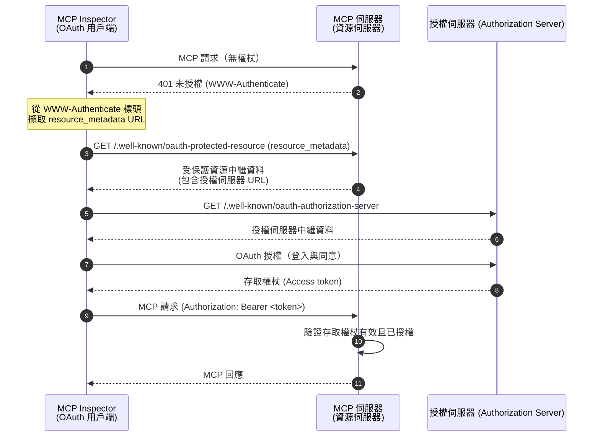
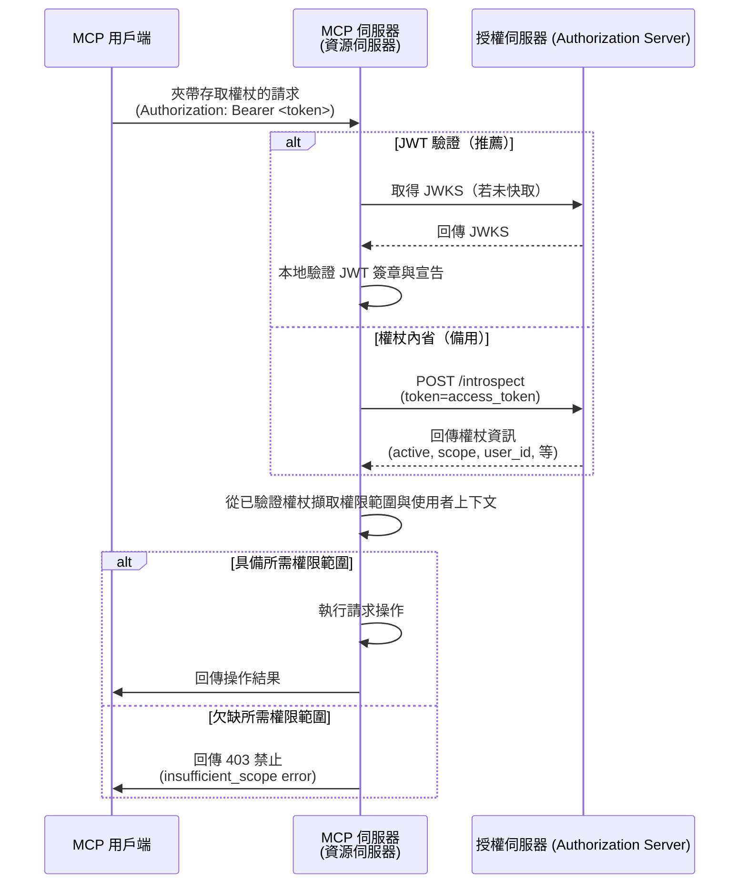

import TabItem from '@theme/TabItem';
import Tabs from '@theme/Tabs';

# 教學：打造待辦事項管理器

:::tip Python SDK available
MCP Auth 也支援 Python！請參考 [Python SDK repository](https://github.com/mcp-auth/python) 以取得安裝與使用方式。
:::

在本教學中，我們將建立一個具備使用者驗證 (Authentication) 與授權 (Authorization) 的待辦事項管理器 MCP 伺服器。根據最新的 MCP 規範，我們的 MCP 伺服器將作為 OAuth 2.0 **資源伺服器 (Resource Server)**，負責驗證存取權杖 (Access token) 並執行基於權限範圍 (Scope) 的權限控管。

完成本教學後，你將會：

- ✅ 基本瞭解如何在 MCP 伺服器中設定角色型存取控制 (RBAC, Role-based Access Control)
- ✅ 擁有一個作為資源伺服器 (Resource Server) 的 MCP 伺服器，能消耗由授權伺服器 (Authorization Server) 發出的存取權杖 (Access token)
- ✅ 實作基於權限範圍 (Scope) 的待辦事項操作權限控管

## 概覽 \{#overview}

本教學將包含以下元件：

- **MCP 用戶端（MCP Inspector）**：一個用於測試 MCP 伺服器的視覺化工具，作為 OAuth 2.0 / OIDC 用戶端。它會與授權伺服器啟動授權流程並取得存取權杖 (Access token) 來驗證對 MCP 伺服器的請求。
- **授權伺服器 (Authorization Server)**：一個 OAuth 2.1 或 OpenID Connect 簽發者 (Issuer)，負責管理使用者身分、驗證使用者並向授權用戶端發出具備適當權限範圍 (Scope) 的存取權杖 (Access token)。
- **MCP 伺服器（資源伺服器 Resource Server）**：根據最新 MCP 規範，MCP 伺服器在 OAuth 2.0 架構中作為資源伺服器 (Resource Server)。它負責驗證授權伺服器發出的存取權杖 (Access token)，並根據權限範圍 (Scope) 控管待辦事項操作。

此架構遵循標準 OAuth 2.0 流程：

- **MCP Inspector** 代表使用者請求受保護資源
- **授權伺服器 (Authorization Server)** 驗證使用者並發出存取權杖 (Access token)
- **MCP 伺服器 (Resource Server)** 驗證權杖並根據授權權限提供受保護資源

以下是這些元件互動的高階流程圖：


```mermaid
sequenceDiagram
  autonumber
  participant Client as MCP Inspector<br/>(OAuth 用戶端)
  participant RS as MCP 伺服器<br/>(資源伺服器)
  participant AS as 授權伺服器 (Authorization Server)

  Client->>RS: MCP 請求（無權杖）
  RS-->>Client: 401 未授權 (WWW-Authenticate)
  Note over Client: 從 WWW-Authenticate 標頭<br/>擷取 resource_metadata URL

  Client->>RS: GET /.well-known/oauth-protected-resource (resource_metadata)
  RS-->>Client: 受保護資源中繼資料<br/>(包含授權伺服器 URL)

  Client->>AS: GET /.well-known/oauth-authorization-server
  AS-->>Client: 授權伺服器中繼資料
  Client->>AS: OAuth 授權（登入與同意）
  AS-->>Client: 存取權杖 (Access token)

  Client->>RS: MCP 請求 (Authorization: Bearer <token>)
  RS->>RS: 驗證存取權杖有效且已授權
  RS-->>Client: MCP 回應
```

## 瞭解你的授權伺服器 \{#understand-your-authorization-server}

### 具備權限範圍 (Scope) 的存取權杖 (Access tokens) \{#access-tokens-with-scopes}

要在 MCP 伺服器中實作 [角色型存取控制 (RBAC)](https://auth.wiki/rbac)，你的授權伺服器需支援發出具備權限範圍 (Scope) 的存取權杖 (Access token)。權限範圍 (Scope) 代表使用者被授予的權限。

<Tabs groupId="provider">
<TabItem value="logto" label="Logto">

[Logto](https://logto.io) 透過 API 資源 (API resources)（符合 [RFC 8707: Resource Indicators for OAuth 2.0](https://datatracker.ietf.org/doc/html/rfc8707)）與角色 (Roles) 功能支援 RBAC。設定方式如下：

1. 登入 [Logto Console](https://cloud.logto.io)（或你的自架 Logto Console）

2. 建立 API 資源與權限範圍 (Scope)：

   - 前往「API 資源」
   - 建立名為「Todo Manager」的新 API 資源
   - 新增以下權限範圍 (Scope)：
     - `create:todos`：「建立新待辦事項」
     - `read:todos`：「讀取所有待辦事項」
     - `delete:todos`：「刪除任一待辦事項」

3. 建立角色（建議，方便管理）：

   - 前往「角色」
   - 建立「Admin」角色並指派所有權限範圍（`create:todos`、`read:todos`、`delete:todos`）
   - 建立「User」角色並僅指派 `create:todos` 權限範圍

4. 指派權限：
   - 前往「使用者」
   - 選擇一位使用者
   - 你可以：
     - 在「角色」分頁指派角色（建議）
     - 或直接在「權限」分頁指派權限範圍

這些權限範圍 (Scope) 會以空格分隔字串的形式包含在 JWT 存取權杖 (Access token) 的 `scope` 宣告 (Claim) 中。

</TabItem>
<TabItem value="oauth-oidc" label="OAuth 2.0 / OIDC">

OAuth 2.0 / OIDC 簽發者 (Issuer) 通常支援基於權限範圍 (Scope) 的存取控制。實作 RBAC 時：

1. 在授權伺服器中定義所需權限範圍 (Scope)
2. 設定用戶端於授權流程中請求這些權限範圍
3. 確保授權伺服器將授予的權限範圍包含在存取權杖 (Access token) 中
4. 權限範圍通常會包含在 JWT 存取權杖的 `scope` 宣告 (Claim) 中

請查閱你的簽發者 (Issuer) 文件以瞭解：

- 如何定義與管理權限範圍 (Scope)
- 權限範圍如何包含於存取權杖 (Access token)
- 是否有額外的 RBAC 功能如角色管理

</TabItem>
</Tabs>

### 權杖驗證與權限檢查 \{#validating-tokens-and-checking-permissions}

根據最新 MCP 規範，MCP 伺服器在 OAuth 2.0 架構中作為 **資源伺服器 (Resource Server)**。作為資源伺服器，MCP 伺服器有以下職責：

1. **權杖驗證**：驗證從 MCP 用戶端收到的存取權杖 (Access token) 的真實性與完整性
2. **權限範圍 (Scope) 強制執行**：從存取權杖中擷取並驗證權限範圍，以判斷用戶端被授權執行哪些操作
3. **資源保護**：僅在用戶端提供有效且具備足夠權限的權杖時，才提供受保護資源（執行工具）

當 MCP 伺服器收到請求時，會執行以下驗證流程：

1. 從 `Authorization` 標頭擷取存取權杖（Bearer 權杖格式）
2. 驗證存取權杖的簽章與有效期限
3. 從已驗證的權杖中擷取權限範圍與使用者資訊
4. 檢查權杖是否具備執行該操作所需的權限範圍

例如，若使用者要建立新待辦事項，其存取權杖必須包含 `create:todos` 權限範圍。以下為資源伺服器驗證流程：


```mermaid
sequenceDiagram
    participant Client as MCP 用戶端
    participant Server as MCP 伺服器<br/>(資源伺服器)
    participant Auth as 授權伺服器 (Authorization Server)

    Client->>Server: 夾帶存取權杖的請求<br/>(Authorization: Bearer <token>)

    alt JWT 驗證（推薦）
        Server->>Auth: 取得 JWKS（若未快取）
        Auth-->>Server: 回傳 JWKS
        Server->>Server: 本地驗證 JWT 簽章與宣告
    else 權杖內省（備用）
        Server->>Auth: POST /introspect<br/>(token=access_token)
        Auth-->>Server: 回傳權杖資訊<br/>(active, scope, user_id, 等)
    end

    Server->>Server: 從已驗證權杖擷取權限範圍與使用者上下文

    alt 具備所需權限範圍
        Server->>Server: 執行請求操作
        Server->>Client: 回傳操作結果
    else 欠缺所需權限範圍
        Server->>Client: 回傳 403 禁止<br/>(insufficient_scope error)
    end
```

### 動態用戶端註冊 (Dynamic Client Registration) \{#dynamic-client-registration}

本教學不強制使用動態用戶端註冊，但若你想自動化 MCP 用戶端註冊流程，這會很有幫助。詳情請參閱 [動態用戶端註冊是否必要？](/provider-list#is-dcr-required)。

## 瞭解待辦事項管理器中的 RBAC \{#understand-rbac-in-todo-manager}

為了示範，我們會在待辦事項管理器 MCP 伺服器中實作一個簡單的角色型存取控制 (RBAC) 系統。這將讓你瞭解 RBAC 的基本原理，同時保持實作簡潔。

:::note
雖然本教學以 RBAC 為例說明權限範圍 (Scope) 管理，但並非所有驗證 (Authentication) 簽發者 (Issuer) 都透過角色來管理權限範圍。有些簽發者可能有自己獨特的存取控制與權限管理機制。
:::

### 工具與權限範圍 (Scope) \{#tools-and-scopes}

我們的待辦事項管理器 MCP 伺服器提供三個主要工具：

- `create-todo`：建立新待辦事項
- `get-todos`：列出所有待辦事項
- `delete-todo`：依 ID 刪除待辦事項

為控管這些工具的存取，我們定義以下權限範圍 (Scope)：

- `create:todos`：允許建立新待辦事項
- `delete:todos`：允許刪除現有待辦事項
- `read:todos`：允許查詢並取得所有待辦事項清單

### 角色與權限 \{#roles-and-permissions}

我們將定義兩個不同存取層級的角色：

| 角色   | create:todos | read:todos | delete:todos |
| ------ | ------------ | ---------- | ------------ |
| Admin  | ✅           | ✅         | ✅           |
| User   | ✅           |            |              |

- **User**：一般使用者，可建立待辦事項，且僅能檢視或刪除自己的待辦事項
- **Admin**：管理員，可建立、檢視並刪除所有待辦事項，不論擁有者為誰

### 資源擁有權 \{#resource-ownership}

雖然上表明確列出每個角色被指派的權限範圍 (Scope)，但還有一個重要的資源擁有權原則：

- **User** 沒有 `read:todos` 或 `delete:todos` 權限範圍，但仍可：
  - 讀取自己的待辦事項
  - 刪除自己的待辦事項
- **Admin** 具備完整權限（`read:todos` 與 `delete:todos`），可：
  - 檢視系統中所有待辦事項
  - 刪除任何待辦事項，不論擁有者

這展現了 RBAC 系統中常見的模式：資源擁有權會隱含授予使用者對自己資源的權限，而管理角色則獲得對所有資源的明確權限。

:::tip 進一步瞭解
想深入瞭解 RBAC 概念與最佳實踐，請參閱 [精通 RBAC：完整實務範例](https://blog.logto.io/mastering-rbac)。
:::

## 在你的簽發者 (Issuer) 中設定授權 (Authorization) \{#configure-authorization-in-your-provider}

要實作上述存取控制系統，你需要在授權伺服器中設定所需的權限範圍 (Scope)。以下說明不同簽發者的設定方式：

<Tabs groupId="provider">
<TabItem value="logto" label="Logto">

[Logto](https://logto.io) 透過 API 資源 (API resources) 與角色 (Roles) 功能支援 RBAC。設定方式如下：

1. 登入 [Logto Console](https://cloud.logto.io)（或你的自架 Logto Console）

2. 建立 API 資源與權限範圍 (Scope)：

   - 前往「API 資源」
   - 建立名為「Todo Manager」的新 API 資源，並將 `http://localhost:3001` 設為資源標示符 (Resource indicator)。
     - **重要**：資源標示符必須與你的 MCP 伺服器 URL 相符。本教學使用 `http://localhost:3001`，因 MCP 伺服器運行於 3001 埠。正式環境請使用實際 MCP 伺服器 URL（如 `https://your-mcp-server.example.com`）。
   - 建立以下權限範圍 (Scope)：
     - `create:todos`：「建立新待辦事項」
     - `read:todos`：「讀取所有待辦事項」
     - `delete:todos`：「刪除任一待辦事項」

3. 建立角色（建議，方便管理）：

   - 前往「角色」
   - 建立「Admin」角色並指派所有權限範圍（`create:todos`、`read:todos`、`delete:todos`）
   - 建立「User」角色並僅指派 `create:todos` 權限範圍
   - 在「User」角色詳細頁切換到「一般」分頁，將「User」設為「預設角色」

4. 管理使用者角色與權限：
   - 新使用者：
     - 由於已設為預設角色，將自動獲得「User」角色
   - 現有使用者：
     - 前往「使用者管理」
     - 選擇一位使用者
     - 在「角色」分頁指派角色

:::tip 程式化角色管理
你也可以使用 Logto 的 [Management API](https://docs.logto.io/integrate-logto/interact-with-management-api) 以程式方式管理使用者角色。這對自動化使用者管理或建立管理後台特別有用。
:::

請求存取權杖時，Logto 會根據使用者角色權限將權限範圍 (Scope) 包含於權杖的 `scope` 宣告 (Claim) 中。

</TabItem>
<TabItem value="oauth-or-oidc" label="OAuth 2 / OIDC">

對於 OAuth 2.0 或 OpenID Connect 簽發者 (Issuer)，你需要設定代表不同權限的權限範圍 (Scope)。具體步驟依簽發者而異，但一般流程如下：

1. 定義權限範圍 (Scope)：

   - 設定授權伺服器支援：
     - `create:todos`
     - `read:todos`
     - `delete:todos`

2. 設定用戶端：

   - 註冊或更新用戶端以請求這些權限範圍
   - 確保權限範圍包含於存取權杖

3. 指派權限：
   - 透過簽發者介面將適當權限範圍指派給使用者
   - 有些簽發者支援基於角色的管理，有些則直接指派權限範圍
   - 請查閱簽發者文件以瞭解建議做法

:::tip
大多數簽發者會將授予的權限範圍包含於存取權杖的 `scope` 宣告 (Claim) 中，格式通常為空格分隔的權限範圍字串。
:::

</TabItem>
</Tabs>

設定好授權伺服器後，使用者將取得包含其授權權限範圍的存取權杖。MCP 伺服器會根據這些權限範圍判斷：

- 使用者是否能建立新待辦事項（`create:todos`）
- 使用者是否能檢視所有待辦事項（`read:todos`）或僅能檢視自己的
- 使用者是否能刪除任一待辦事項（`delete:todos`）或僅能刪除自己的

## 建立 MCP 伺服器 \{#set-up-the-mcp-server}

我們將使用 [MCP 官方 SDK](https://github.com/modelcontextprotocol) 來建立待辦事項管理器 MCP 伺服器。

### 建立新專案 \{#create-a-new-project}

建立新的 Node.js 專案：

```bash
mkdir mcp-server
cd mcp-server
npm init -y # 或使用 `pnpm init`
npm pkg set type="module"
npm pkg set main="todo-manager.ts"
npm pkg set scripts.start="node --experimental-strip-types todo-manager.ts"
```

:::note
我們的範例使用 TypeScript，因為 Node.js v22.6.0+ 原生支援 `--experimental-strip-types` 直接執行 TypeScript。若你使用 JavaScript，程式碼大致相同，只需確保 Node.js 版本為 v22.6.0 或以上。詳情請參閱 Node.js 官方文件。
:::

### 安裝 MCP SDK 與相依套件 \{#install-the-mcp-sdk-and-dependencies}

```bash
npm install @modelcontextprotocol/sdk express zod
```

或使用你偏好的套件管理工具，如 `pnpm` 或 `yarn`。

### 建立 MCP 伺服器 \{#create-the-mcp-server}

建立名為 `todo-manager.ts` 的檔案並加入以下程式碼：

（原始程式碼略，請參考英文內容）

啟動伺服器：

```bash
npm start
```

## 檢查 MCP 伺服器 \{#inspect-the-mcp-server}

### 下載並執行 MCP inspector \{#clone-and-run-mcp-inspector}

現在 MCP 伺服器已啟動，我們可以使用 MCP inspector 檢查工具是否可用。

官方 MCP inspector v0.16.2 有些 bug 會影響驗證 (Authentication) 功能。為解決這些問題，我們建立了 [修正版 MCP inspector](https://github.com/mcp-auth/inspector/tree/patch/0.16.2-fixes)，已包含 OAuth / OIDC 驗證流程所需修正。我們也已向官方 repo 提交 PR。

執行 MCP inspector：

```bash
git clone https://github.com/mcp-auth/inspector.git -b patch/0.16.2-fixes
cd inspector
npm install
npm run dev
```

MCP inspector 會自動在預設瀏覽器開啟，或你也可以手動點擊終端機輸出的連結（請點帶有 `MCP_PROXY_AUTH_TOKEN` 參數的連結，如 `http://localhost:6274/?MCP_PROXY_AUTH_TOKEN=458ae4a4...acab1907`）。

### 連接 MCP inspector 至 MCP 伺服器 \{#connect-mcp-inspector-to-the-mcp-server}

請先確認 MCP inspector 的以下設定：

- **Transport Type**：設為 `Streamable HTTP`
- **URL**：設為你的 MCP 伺服器 URL，本例為 `http://localhost:3001`

現在你可以點擊「Connect」按鈕，檢查 MCP inspector 是否能連線至 MCP 伺服器。若一切正常，MCP inspector 會顯示「Connected」狀態。

### 檢查點：執行待辦事項管理工具 \{#checkpoint-run-todo-manager-tools}

1. 在 MCP inspector 上方選單點選「Tools」分頁
2. 點擊「List Tools」按鈕
3. 你應該會看到 `create-todo`、`get-todos`、`delete-todo` 工具列在頁面上，點擊可檢視工具詳情
4. 右側會有「Run Tool」按鈕，點擊並輸入必要參數執行工具
5. 你會看到工具回傳的 JSON 結果 `{"error": "Not implemented"}`


## 與授權伺服器整合 \{#integrate-with-your-authorization-server}

完成本節需考慮以下幾點：

<details>
<summary>**你的授權伺服器簽發者 (Issuer) URL**</summary>

通常是你的授權伺服器基底 URL，如 `https://auth.example.com`。有些服務商可能是 `https://example.logto.app/oidc`，請查閱你的簽發者 (Issuer) 文件。

</details>

<details>
<summary>**如何取得授權伺服器中繼資料**</summary>

- 若你的授權伺服器符合 [OAuth 2.0 授權伺服器中繼資料](https://datatracker.ietf.org/doc/html/rfc8414) 或 [OpenID Connect Discovery](https://openid.net/specs/openid-connect-discovery-1_0.html)，可用 MCP Auth 內建工具自動取得中繼資料
- 若不符合，需手動指定中繼資料 URL 或端點於 MCP 伺服器設定，詳情請查閱簽發者 (Issuer) 文件

</details>

<details>
<summary>**如何將 MCP inspector 註冊為用戶端**</summary>

- 若你的授權伺服器支援 [動態用戶端註冊 (Dynamic Client Registration)](https://datatracker.ietf.org/doc/html/rfc7591)，MCP inspector 會自動註冊為用戶端
- 若不支援，需手動將 MCP inspector 註冊為用戶端

</details>

<details>
<summary>**瞭解權杖請求參數**</summary>

向不同授權伺服器請求存取權杖時，指定目標資源與權限的方式可能不同，主要有：

- **基於資源標示符 (Resource indicator)**：

  - 使用 `resource` 參數指定目標 API（參見 [RFC 8707: Resource Indicators for OAuth 2.0](https://datatracker.ietf.org/doc/html/rfc8707)）
  - 現代 OAuth 2.0 常見
  - 範例請求：
    ```json
    {
      "resource": "http://localhost:3001",
      "scope": "create:todos read:todos"
    }
    ```
  - 伺服器會發出專屬於該資源的權杖

- **基於受眾 (Audience)**：

  - 使用 `audience` 參數指定權杖預期接收者
  - 與資源標示符類似但語意不同
  - 範例請求：
    ```json
    {
      "audience": "todo-api",
      "scope": "create:todos read:todos"
    }
    ```

- **純權限範圍 (Scope) 型**：
  - 僅依權限範圍，不帶 resource / audience 參數
  - 傳統 OAuth 2.0 作法
  - 範例請求：
    ```json
    {
      "scope": "todo-api:create todo-api:read openid profile"
    }
    ```
  - 常以前綴命名空間權限範圍
  - 簡單 OAuth 2.0 實作常見

:::tip 最佳實踐

- 查閱你的簽發者 (Issuer) 文件以確認支援哪些參數
- 有些服務同時支援多種方式
- 資源標示符有助於提升安全性與存取控管
- 建議優先使用資源標示符
  :::

</details>

雖然每個簽發者 (Issuer) 可能有不同要求，以下步驟可協助你整合 MCP inspector 與 MCP 伺服器，並進行服務商專屬設定。

### 註冊 MCP inspector 為用戶端 \{#register-mcp-inspector-as-a-client}

<Tabs groupId="provider">
<TabItem value="logto" label="Logto">

將待辦事項管理器整合至 [Logto](https://logto.io) 很簡單，因為它是支援資源標示符與權限範圍的 OpenID Connect 簽發者 (Issuer)，可用 `http://localhost:3001` 作為資源標示符保護你的 todo API。

由於 Logto 尚未支援動態用戶端註冊，你需手動將 MCP inspector 註冊為用戶端：

1. 開啟 MCP inspector，進入驗證 (Authentication) 設定，點選「OAuth2.0 Flow」設定，複製 **Redirect URI**，如 `http://localhost:6274/oauth/callback`
2. 登入 [Logto Console](https://cloud.logto.io)（或你的自架 Logto Console）
3. 前往「應用程式」分頁，點選「建立應用程式」，頁面底部點「不選框架建立應用程式」
4. 填寫應用程式資訊後點「建立應用程式」：
   - **選擇應用程式類型**：選「單頁應用程式」
   - **應用程式名稱**：如「MCP Inspector」
5. 在「設定 / Redirect URIs」區塊貼上剛才複製的 **Redirect URI**，然後點底部「儲存變更」
6. 頁面上方會看到「App ID」，請複製
7. 回到 MCP inspector，將「App ID」貼到驗證 (Authentication) 設定的「OAuth2.0 Flow」下的「Client ID」欄位
8. 在「Scope」欄位輸入：`create:todos read:todos delete:todos`，確保 Logto 回傳的存取權杖包含操作 todo manager 所需權限範圍

</TabItem>
<TabItem value="oauth-oidc" label="OAuth 2.0 / OIDC">

:::note
這是通用 OAuth 2.0 / OpenID Connect 簽發者 (Issuer) 整合指引。兩者步驟類似，因 OIDC 建立於 OAuth 2.0 之上。請查閱你的簽發者 (Issuer) 文件以獲得細節。
:::

若你的服務支援動態用戶端註冊，可直接跳至第 8 步設定 MCP inspector；否則需手動註冊：

1. 開啟 MCP inspector，進入驗證 (Authentication) 設定，點選「OAuth2.0 Flow」設定，複製 **Redirect URI**，如 `http://localhost:6274/oauth/callback`

2. 登入你的服務商管理後台

3. 前往「應用程式」或「用戶端」區塊，建立新應用程式或用戶端

4. 若需選擇用戶端類型，請選「單頁應用程式」或「公開用戶端」

5. 建立應用程式後，需設定 redirect URI，貼上剛才複製的 **Redirect URI**

6. 找到新應用程式的「Client ID」或「Application ID」並複製

7. 回到 MCP inspector，將「Client ID」貼到驗證 (Authentication) 設定的「OAuth2.0 Flow」下的「Client ID」欄位

8. 在「Scope」欄位輸入以下權限範圍以請求 todo 操作所需權限：

```text
create:todos read:todos delete:todos
```

</TabItem>
</Tabs>

### 設定 MCP Auth \{#set-up-mcp-auth}

首先，在 MCP 伺服器專案中安裝 MCP Auth SDK。

import { NpmLikeInstallation } from '@site/src/components/NpmLikeInstallation';

<NpmLikeInstallation packageName="mcp-auth" />

接著初始化 MCP Auth。以受保護資源模式，你需設定資源中繼資料（包含授權伺服器）。

有兩種設定方式：

- **預先取得（推薦）**：用 `fetchServerConfig()` 於啟動時預先取得中繼資料，確保設定有效
- **隨需探索**：僅提供 `issuer` 與 `type`，首次需要時才取得中繼資料，適合不允許頂層 async fetch 的 edge runtime（如 Cloudflare Workers）

#### 設定受保護資源中繼資料 \{#configure-protected-resource-metadata}

首先取得你的授權伺服器簽發者 (Issuer) URL：

<Tabs groupId="provider">

<TabItem value="logto" label="Logto">

在 Logto，可於 Logto Console 應用程式詳情頁「Endpoints & Credentials / Issuer endpoint」區塊找到簽發者 (Issuer) URL，格式如 `https://my-project.logto.app/oidc`。

</TabItem>

<TabItem value="oauth-oidc" label="OAuth 2.0 / OIDC">

對於 OAuth 2.0 簽發者 (Issuer)：

1. 查閱服務商文件取得授權伺服器 URL（常稱 issuer URL 或 base URL）
2. 有些服務會在 `https://{your-domain}/.well-known/oauth-authorization-server` 提供
3. 也可於管理後台 OAuth / API 設定區查找

</TabItem>

</Tabs>

現在，於建立 MCP Auth 實例時設定受保護資源中繼資料：

（原始程式碼略，請參考英文內容）

### 更新 MCP 伺服器 \{#update-mcp-server}

快完成了！現在要將 MCP Auth 路由與中介軟體 (middleware) 套用到 MCP 伺服器，並根據使用者權限範圍 (Scope) 實作待辦事項工具的權限控管。

首先，套用受保護資源中繼資料路由，讓 MCP 用戶端可從 MCP 伺服器取得預期的資源中繼資料。

（原始程式碼略，請參考英文內容）

接著，套用 MCP Auth 中介軟體。這個中介軟體會處理進入請求的驗證 (Authentication) 與授權 (Authorization)，確保只有授權使用者能存取待辦事項工具。

（原始程式碼略，請參考英文內容）

現在可以更新待辦事項工具的實作，讓其利用 MCP Auth 中介軟體進行驗證 (Authentication) 與授權 (Authorization)。

（原始程式碼略，請參考英文內容）

最後，建立上述程式碼中用到的「Todo service」：

建立 `todo-service.ts` 檔案：

（原始程式碼略，請參考英文內容）

恭喜！你已成功實作一個具備驗證 (Authentication) 與授權 (Authorization) 的完整 MCP 伺服器！

:::info
完整 MCP 伺服器（OIDC 版本）程式碼請參考 [MCP Auth Node.js SDK repository](https://github.com/mcp-auth/js/blob/master/packages/sample-servers/src)。
:::

## 檢查點：執行 `todo-manager` 工具 \{#checkpoint-run-the-todo-manager-tools}

重啟 MCP 伺服器並於瀏覽器開啟 MCP inspector。點擊「Connect」後，應會被導向授權伺服器登入頁。

登入並返回 MCP inspector 後，重複前述步驟執行待辦事項工具。這次你將以已驗證的使用者身分操作，工具行為會依你被指派的角色與權限而異：

- 若以 **User**（僅有 `create:todos` 權限範圍）登入：

  - 可用 `create-todo` 工具建立新待辦事項
  - 只能檢視與刪除自己的待辦事項
  - 無法看到或刪除其他使用者的待辦事項

- 若以 **Admin**（具備所有權限範圍：`create:todos`、`read:todos`、`delete:todos`）登入：
  - 可建立新待辦事項
  - 可用 `get-todos` 工具檢視系統所有待辦事項
  - 可用 `delete-todo` 工具刪除任何待辦事項，不論擁有者

你可以這樣測試不同權限層級：

1. 登出當前帳號（點 MCP inspector 的「Disconnect」）
2. 以不同角色／權限的帳號登入
3. 重複操作觀察工具行為如何隨使用者權限改變

這展現了角色型存取控制 (RBAC) 的實際運作，不同使用者可存取系統不同功能。


:::info
完整 MCP 伺服器（OIDC 版本）程式碼請參考 [MCP Auth Node.js SDK repository](https://github.com/mcp-auth/js/blob/master/packages/sample-servers/src)。
:::

## 結語 \{#closing-notes}

恭喜！你已順利完成本教學。讓我們回顧一下：

- 建立具備待辦事項管理工具（`create-todo`、`get-todos`、`delete-todo`）的基本 MCP 伺服器
- 實作使用者與管理員不同權限層級的角色型存取控制 (RBAC)
- 透過 MCP Auth 將 MCP 伺服器與授權伺服器整合
- 設定 MCP Inspector 以驗證使用者並用帶有權限範圍的存取權杖呼叫工具

歡迎參閱其他教學與文件，充分發揮 MCP Auth 的強大功能。
